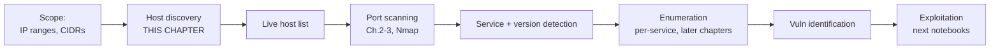
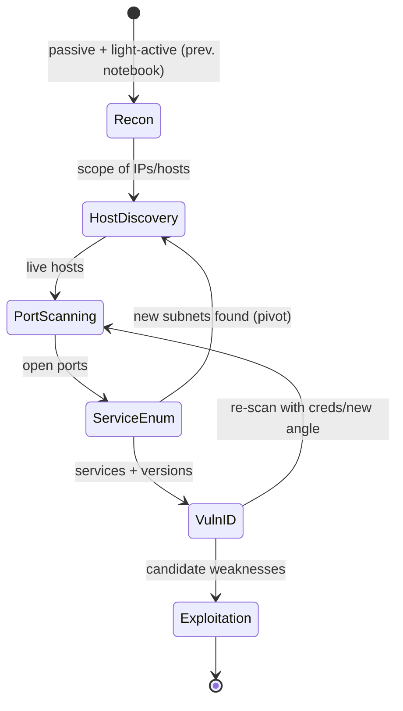
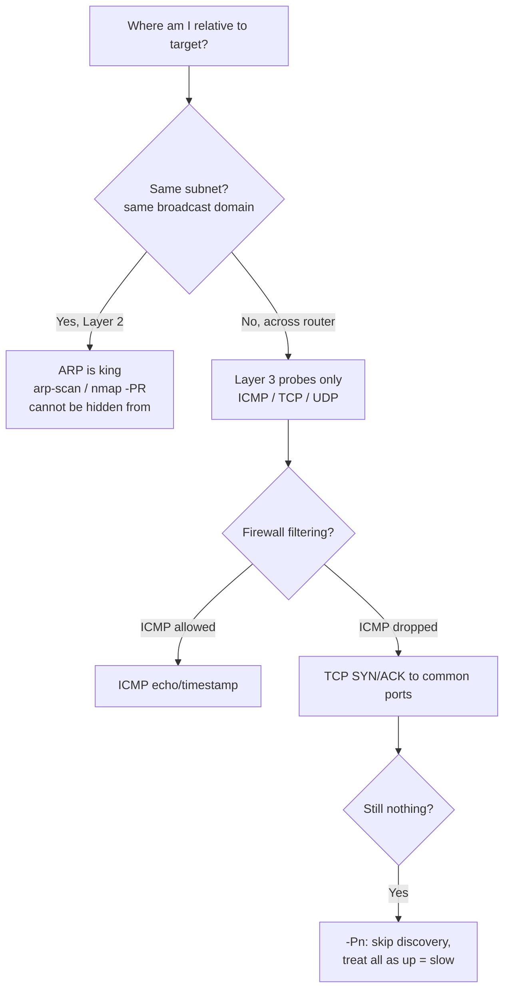
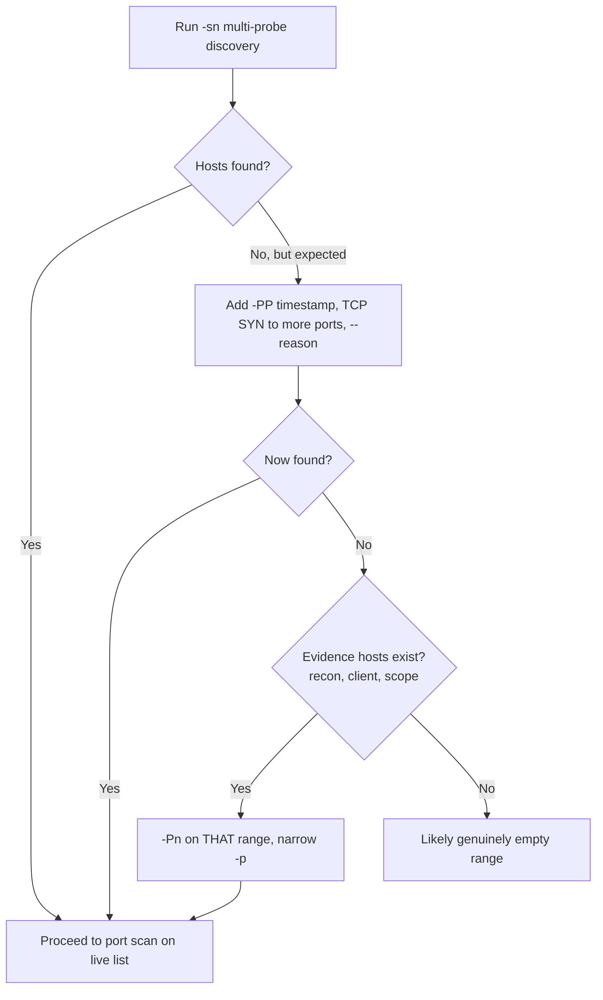

**Level:** Intermediate · **Track:** Penetration Testing · **Read time:** 205 min

This is Chapter 1 of the Scanning & Enumeration notebook. The previous notebook (Recon & OSINT) ended with an automated pipeline that turned a company name, a domain, or an ASN into a scope of hostnames and IP ranges — all gathered *without* interrogating the target's own machines directly (or only lightly, at the fingerprinting stage). This notebook crosses fully into active work. Everything from here forward sends packets *at the target* and reads what comes back. The first, foundational step is **host discovery**: taking a scope that might be a `/16` of 65,536 addresses and finding the few hundred that are actually alive, so you don't waste hours port-scanning empty space or, worse, hammering addresses that aren't even in use.

Host discovery sounds trivial — "ping everything and see what answers" — and it is a trap dressed as a triviality. Real networks drop ICMP at the firewall, so a naive ping sweep reports a live network as dead and sends the inexperienced tester down the wrong path for an entire engagement. Hosts answer on some probe types and not others depending on where you are relative to them (same subnet or across a router), what firewall sits in front, and what OS they run. Getting discovery right means understanding *why* each probe works, choosing the probe that matches the network position, and never trusting a single negative result. This chapter builds that understanding from the packet up.

It also establishes the **methodology** for the whole notebook — the disciplined loop of discover, scan, enumerate, and validate that separates a professional assessment from someone spraying `nmap -A` at a `/8`. Scanning is where an engagement most easily goes wrong: too loud and you're detected and blocked (or you knock over a fragile production host); too timid and you miss the one exposed service that was the way in; out of scope by one octet and you've committed an offence. Methodology is what keeps you fast, thorough, quiet enough, and inside the lines.

Every technique here assumes an authorised, scoped engagement. Active scanning of hosts you do not own or have explicit written permission to test is unlawful in most jurisdictions under computer-misuse legislation, regardless of intent or the fact that you sent "only a ping". Scope is a hard boundary, treated as such throughout, and covered in Part 11.



---

## Part 1: Where Scanning Sits — The Engagement Methodology

Before probing anything, place this phase in the larger picture, because the methodology dictates the choices you make at every later step.

### 1.1 The lifecycle

A penetration test moves through phases, each feeding the next. Chapter 1 of the Pentest Methodology notebook covered the whole lifecycle; here is the slice this notebook lives in:



Note the loops: enumeration frequently reveals *new* internal subnets (from a compromised host's routing table, or a discovered admin panel referencing other hosts), which sends you back to host discovery for that new range. Scanning is not a single linear pass; it is an iterative narrowing.

### 1.2 The scanning sub-methodology

Within the scanning phase itself, a disciplined operator follows a repeatable loop:

1. **Confirm scope.** Re-read the rules of engagement. Which CIDRs, which hosts, which are explicitly excluded, what times, what rate limits, active-allowed or passive-only. (Part 11.)
2. **Discover live hosts.** This chapter. Turn ranges into a validated live-host list using multiple probe types.
3. **Scan ports** on live hosts (Chapters 2–3). Fast broad sweep, then targeted deep scans.
4. **Detect services and versions** on open ports.
5. **Enumerate** each service in depth (later chapters).
6. **Record everything, continuously**, in a form you can diff, report, and hand off.

Each step narrows the target set and deepens the detail. Doing them out of order — e.g. a full `-A` version scan across a `/16` before you know which hosts are up — wastes hours and generates enormous noise.

### 1.3 Thoroughness vs stealth vs speed — the eternal trade-off

Every scanning decision trades off three things:

| Priority | You optimise for | You accept | Typical context |
|---|---|---|---|
| **Thoroughness** | Finding everything, all probe types, all ports | Slowness, noise | Authorised assessment where detection is acceptable/expected |
| **Stealth** | Not being detected/blocked | Slowness, possibly missing hosts | Red-team, evasion in scope |
| **Speed** | Getting results fast | Noise, some misses | Large scope, time-boxed, detection irrelevant |

A standard (non-evasive) penetration test usually optimises thoroughness first and speed second, because the client *wants* you to find everything and detection is part of the test. A red-team engagement flips to stealth. Know which you're running before you pick a single flag — it changes everything downstream. This chapter shows the discovery techniques for all three postures.

---

## Part 2: The Network Fundamentals That Make Discovery Work

Host discovery is applied networking. Every probe type exists because of how a specific layer of the stack behaves. If you understand the layers (covered in the Networking notebook, Chapters 2–7), the probe choices become obvious rather than memorised.

### 2.1 The single most important distinction: same subnet or not

Where you sit relative to the target changes which probe *can even work*:

- **Same broadcast domain (Layer 2, same subnet):** you can reach hosts directly by MAC address. **ARP** is available and is the definitive discovery method here — a host must answer ARP to communicate at all, so it cannot hide from it (short of a host firewall dropping it, which is rare and conspicuous).
- **Across a router (Layer 3, different subnet):** ARP does not cross routers. You must use Layer 3+ probes — **ICMP**, **TCP**, **UDP** — and any of these can be filtered by firewalls along the path.



This is why the answer to "why did my ping sweep of the internal network find nothing but I know hosts are there?" is almost always "you were on the same subnet and should have used ARP" or "ICMP is filtered and you should have used TCP probes". Nmap, run as root on a local subnet, does this for you automatically — it uses ARP for on-subnet targets regardless of what `-P` flag you specify, because ARP is strictly better there.

### 2.2 What a probe actually asks, and what an answer proves

| Probe | The question it asks | A reply proves | Silence means |
|---|---|---|---|
| **ARP request** | "Who has IP x? Tell me your MAC" | Host is up, on this subnet | Host down, or not on this subnet |
| **ICMP echo (type 8)** | "Are you there?" (ping) | Host up and ICMP-echo permitted | Down, or ICMP filtered |
| **ICMP timestamp (type 13)** | "What time is it?" | Host up (often replies when echo is filtered) | Down or filtered |
| **ICMP netmask (type 17)** | "What's your netmask?" | Host up (rarely enabled now) | Down/filtered |
| **TCP SYN → open port** | "Can I connect?" | Host up, port open (SYN/ACK) | — |
| **TCP SYN → closed port** | same | Host up, port closed (RST) | — |
| **TCP ACK** | mid-connection ack | Host up (RST returned) — bypasses stateless filters | Stateful firewall drops it |
| **UDP → closed port** | datagram | Host up (ICMP port-unreachable) | Open port stays silent; filtered drops |

The deep lesson: **a reply of any kind — even a "port closed" RST or an ICMP unreachable — proves the host is alive.** Discovery doesn't need an *open* port; it needs *any* response. That's why sending a SYN to port 443 *and* an ACK to port 80 *and* an ICMP echo in parallel is far more reliable than any single probe: you only need one of them to elicit any packet back.

### 2.3 TTL and RTT — free intelligence in every reply

Every reply carries two bonus signals:

- **TTL (Time To Live)** in the IP header hints at the OS and the distance. Common initial TTLs: **64** (Linux/macOS/Unix), **128** (Windows), **255** (many network devices/routers). Subtract the observed TTL from the nearest initial value to estimate hop count. A reply with TTL 122 is probably a Windows host ~6 hops away.
- **RTT (Round Trip Time)** hints at network distance and helps Nmap auto-tune timing. Wildly varying RTT suggests congestion or rate-limiting.

These are why Nmap can make an OS guess from discovery alone, and why reading raw packets (Part 8) beats trusting a summarised "host up".

### 2.4 Reading the OS from a single reply (TTL fingerprinting)

Because operating systems ship with different default initial TTLs, one reply often reveals the OS family before you run any dedicated OS-detection. The logic: observed TTL is the *initial* TTL minus the number of router hops, so round the observed value *up* to the nearest common initial value and subtract to get the hop count.

| Observed TTL | Nearest initial | Likely OS family | Implied hops |
|---|---|---|---|
| 64 | 64 | Linux, macOS, BSD, Android, most appliances | 0 (same segment) |
| 57 | 64 | Linux/Unix | 7 |
| 128 | 128 | Windows | 0 |
| 122 | 128 | Windows | 6 |
| 255 | 255 | Cisco/network gear, some Solaris | 0 |
| 245 | 255 | Network device | 10 |

```bash
# a single ping shows the TTL
ping -c1 10.0.0.9
# 64 bytes from 10.0.0.9: icmp_seq=1 ttl=122 time=8.4 ms   -> Windows, ~6 hops away
ping -c1 10.0.0.5
# 64 bytes from 10.0.0.5: icmp_seq=1 ttl=64  time=0.3 ms    -> Linux, same segment
```

This is a *hint*, not proof — TTLs can be tuned, and load balancers/NAT can rewrite them — but across a discovery sweep it cheaply segments your target list into "Windows estate" and "Linux estate", which shapes both which ports to prioritise and which attacks are relevant later. Nmap surfaces it automatically; reading it yourself means you understand what it's inferring.

### 2.5 The firewall reality

Modern networks filter aggressively. The behaviours you must expect:

- **ICMP echo dropped at the perimeter** — extremely common. A ping sweep of an internet-facing range often shows almost nothing even though services are live.
- **Stateful firewalls** drop unsolicited ACKs and out-of-state packets.
- **Default-drop policies** mean *filtered* ports are silent (no RST), making them indistinguishable from a down host on that probe alone.
- **Rate-limiting and IDS** throttle or block sources that probe too fast or too broadly.

The consequence: **never conclude a host is down from one probe type failing.** Use several, and know that "no reply" is ambiguous (down *or* filtered), while "any reply" is definitive (up).

---

## Part 3: Host-Discovery Techniques, Probe by Probe

Now the techniques themselves, taught as Nmap probe flags (Nmap is the tool taught in full in Chapters 2–3; here we use only its discovery options, `-sn` = "ping scan, no port scan"). Each flag maps to a probe from Part 2.

### 3.1 The discovery-only mode: `-sn`

`-sn` tells Nmap: do host discovery, then stop — do not port-scan. (It was `-sP` in older versions; `-sn` is current.)

```bash
sudo nmap -sn 192.168.1.0/24
```

Run as root on a local subnet, this sends ARP requests and is the single best local-discovery command there is. Run across a router or as non-root, it sends a default probe set: ICMP echo, ICMP timestamp, TCP SYN to 443, and TCP ACK to 80.

### 3.2 ARP discovery — `-PR` (local subnet only)

```bash
sudo nmap -sn -PR 192.168.1.0/24
```

`-PR` forces ARP. On a local subnet this is default and optimal: fast, reliable, and impossible for a normal host to hide from because ARP is required for L2 communication. Nmap reads the MAC addresses and even guesses the vendor from the OUI (the first 3 bytes of the MAC).

```
Nmap scan report for 192.168.1.10
Host is up (0.00042s latency).
MAC Address: 3C:22:FB:1A:2B:3C (Apple)
Nmap scan report for 192.168.1.20
Host is up (0.0011s latency).
MAC Address: DC:A6:32:00:11:22 (Raspberry Pi Trading)
```

The MAC vendor is free asset intelligence — Apple laptops, Raspberry Pis, Ciscos and printers announce themselves.

### 3.3 ICMP probes — `-PE`, `-PP`, `-PM`

```bash
sudo nmap -sn -PE 10.0.0.0/24      # ICMP echo request (classic ping)
sudo nmap -sn -PP 10.0.0.0/24      # ICMP timestamp request (type 13)
sudo nmap -sn -PM 10.0.0.0/24      # ICMP address-mask request (type 17)
```

`-PE` is the classic ping. Its value is when ICMP is *allowed* — many internal networks permit it. `-PP` (timestamp) is the clever fallback: administrators frequently block echo but forget to block timestamp, so `-PP` finds hosts that `-PE` misses. `-PM` (netmask) is mostly historical but occasionally works on legacy gear. Combine them: `sudo nmap -sn -PE -PP 10.0.0.0/24`.

### 3.4 TCP probes — `-PS` and `-PA`

The workhorses for firewalled, cross-router discovery.

```bash
sudo nmap -sn -PS22,80,443,3389 10.0.0.0/24    # TCP SYN ping to those ports
sudo nmap -sn -PA80 10.0.0.0/24                 # TCP ACK ping to port 80
```

- **`-PS<ports>` (SYN ping):** sends a SYN. An open port replies SYN/ACK; a closed port replies RST. *Either* reply proves the host is up. Target ports likely to be open *or* closed-but-responsive: 80, 443, 22, 25, 3389, 445. This is the most reliable cross-firewall discovery because at least one of those ports usually elicits a response.
- **`-PA<ports>` (ACK ping):** sends a bare ACK. A live host replies RST (there's no matching connection). Its trick is bypassing simple *stateless* filters that allow established-looking traffic — though modern stateful firewalls drop it. Use SYN and ACK together so one covers the other's blind spot.

Non-root users can only do TCP connect-based probing (full three-way handshake) because raw packet crafting needs privilege; run discovery as root wherever possible.

### 3.5 UDP probes — `-PU`

```bash
sudo nmap -sn -PU53,161,137 10.0.0.0/24
```

`-PU` sends a UDP datagram. A *closed* UDP port replies with ICMP port-unreachable — which proves the host is up. Open UDP ports stay silent, so target ports likely to be *closed* on most hosts. UDP discovery is slower and less reliable (rate-limited ICMP, silent open ports) but catches hosts that block all TCP and ICMP echo yet leak an ICMP-unreachable. Good ports: 53 (DNS), 161 (SNMP), 137 (NetBIOS).

### 3.6 Combining probes — the reliable default

The robust cross-network discovery command fires several probe types at once, so any single response reveals the host:

```bash
sudo nmap -sn -PE -PP -PS21,22,25,80,443,3389 -PA80,443 -PU53,161 10.0.0.0/24
```

This is thorough (loud) discovery. For each host, Nmap needs only *one* of these probes to get any reply. Add `--reason` to see *why* each host was marked up:

```bash
sudo nmap -sn --reason -PE -PS80,443 10.0.0.0/24
```
```
Host 10.0.0.5 is up, received syn-ack (0.032s latency).   # SYN ping to 443 worked
Host 10.0.0.9 is up, received echo-reply (0.028s latency). # ICMP echo worked
Host 10.0.0.9 is up, received timestamp-reply ...          # timestamp also worked
```

`--reason` is the flag that turns "host is up" from a claim into evidence — always use it when discovery results surprise you.

### 3.7 Discovery combined with port scanning

You don't always discover and scan in separate passes. If you skip `-sn`, Nmap does discovery *and* port scanning in one run — discovery gates which hosts get scanned. Two flags fine-tune this:

```bash
sudo nmap --disable-arp-ping 192.168.1.0/24   # force L3 probes even on-subnet (rarely wanted)
sudo nmap -PS443 -p1-1000 10.0.0.0/24          # SYN-ping discovery, then scan the survivors
```

The important mental model: **the `-P*` flags control the *discovery* probes; the `-p`/`-s*` flags control the *port scan* of hosts found up.** They are independent. `-sn` = discovery only; `-Pn` = port scan only (no discovery); default = both. Knowing which of the three you want on each run is core methodology and prevents both wasted time and missed hosts.

### 3.8 Two flags that quietly change discovery: `-n` and privilege

Two easily-missed factors change discovery behaviour and reliability:

- **`-n` disables reverse-DNS.** By default Nmap does a reverse lookup on every host it finds, which adds latency and, more importantly, sends DNS queries that a defender's DNS logs record — a subtle tell that someone is enumerating the range. `-n` skips it for speed and quiet; `-R` forces it even on down hosts. During a fast or stealth sweep, `-n` is the right call; when you *want* the names for prioritisation (Part 6.4), omit it or do a separate `-sL` pass.
- **Privilege changes the probes.** Run as **root/sudo**, Nmap uses raw sockets: real ARP, SYN, ACK and ICMP probes. Run **unprivileged**, it falls back to the OS `connect()` call — it can only do full TCP handshakes, cannot craft SYN/ACK/ICMP, and cannot ARP-scan. The practical rule: **always run discovery as root**, or you silently get slower, less capable, more detectable probing without realising your `-PS`/`-PA` flags were downgraded.

```bash
sudo nmap -sn -n -PE -PS443 10.0.0.0/24    # fast, quiet: no reverse-DNS, raw probes
```

---

## Part 4: When Discovery Fails — The `-Pn` Decision

The hardest scenario: you run discovery and get nothing, but you have strong reason to believe hosts are alive (the scope says so, you saw them in recon, the client confirmed them). This is the perimeter firewall dropping *all* your discovery probes.

### 4.1 What `-Pn` does and costs

`-Pn` tells Nmap: **skip host discovery entirely; treat every target as up and go straight to port scanning.**

```bash
sudo nmap -Pn -p 80,443,22 10.0.0.0/24
```

The upside: you stop missing hosts that don't answer discovery probes but *do* run services. The cost is severe and must be understood: with `-Pn`, Nmap port-scans **every address in the range whether or not anything is there**. Across a `/16` that is 65,536 hosts × N ports — potentially hours or days of scanning mostly-empty space. `-Pn` trades completeness for enormous time cost.

### 4.2 When to use it

- **Small, known target lists** where you're confident hosts exist but they filter discovery — `-Pn` is correct and cheap.
- **Perimeter hosts** that firewall ICMP and unusual TCP but serve web on 80/443 — `-Pn -p 80,443` finds them.
- **Never as a lazy default across large ranges** — it turns a 5-minute discovery into a multi-hour scan of dead space.

The professional approach: try thorough multi-probe discovery *first*; only fall back to `-Pn` on the specific ranges/hosts where discovery failed but you have evidence of life, and narrow the port set when you do.

### 4.3 The diagnostic ladder



---

## Part 5: Discovery at Scale — fping, masscan, arp-scan

Nmap is thorough but not the fastest at pure sweeping across huge ranges. For scale, specialised tools complement it.

### 5.1 fping — fast parallel ICMP sweeping

**fping** pings many hosts in parallel (unlike `ping`, which does one at a time), making it excellent for a quick ICMP liveness pass across a range.

```bash
sudo apt install -y fping
fping -a -g 10.0.0.0/24 2>/dev/null       # -a = show alive only, -g = generate range
fping -a -g 10.0.0.0/24 2>/dev/null > live_icmp.txt
```

| Flag | Meaning |
|---|---|
| `-a` | Show only alive hosts |
| `-g` | Generate a target list from a CIDR/range |
| `-q` | Quiet (suppress per-probe errors) |
| `-r N` | Retries |
| `-i` / `-t` | Interval between packets / per-probe timeout |

fping only does ICMP, so it inherits ICMP's blind spot (filtered networks), but for a fast first pass on a permissive network it's ideal.

### 5.2 arp-scan — definitive local-subnet discovery

**arp-scan** sweeps a subnet with ARP requests — the L2 method that hosts cannot hide from.

```bash
sudo apt install -y arp-scan
sudo arp-scan --localnet                   # scan the whole local subnet
sudo arp-scan -I eth0 192.168.1.0/24
```

```
192.168.1.1   00:11:22:33:44:55  Cisco Systems, Inc
192.168.1.10  3c:22:fb:1a:2b:3c  Apple, Inc.
192.168.1.20  dc:a6:32:00:11:22  Raspberry Pi Trading Ltd
```

On a local network this is the ground truth: fast, complete, with vendor identification. Whenever you have L2 access (a foothold on an internal subnet, a dropped device, a VLAN), arp-scan or `nmap -PR` is your first move.

### 5.3 masscan — internet-scale SYN sweeping

**masscan** is an asynchronous, stateless scanner that can probe enormous address spaces extremely fast (its author demonstrated scanning the entire IPv4 internet; do not do that). For discovery, use it to find hosts with a specific port open across a large range far faster than Nmap.

```bash
sudo apt install -y masscan
sudo masscan 10.0.0.0/16 -p80,443 --rate 1000 -oL masscan.txt
```

| Flag | Meaning |
|---|---|
| `-p` | Ports to probe |
| `--rate` | Packets/sec — the throttle; high rates are dangerous and detectable |
| `-oL` / `-oJ` / `-oX` | Output list / JSON / XML |
| `--excludefile` | **Out-of-scope exclusions — use this every time** |
| `--wait` | Seconds to wait for late replies |

**Critical safety note:** masscan is stateless and *fast* — at high `--rate` it can saturate links and knock over fragile hosts, and it is trivially detectable. Always set a sane rate, always use `--excludefile` for out-of-scope ranges, and confirm authorisation. The common professional pattern is **masscan to find live host:port pairs fast, then feed those into Nmap for accurate service/version detection** — speed then depth:

```bash
sudo masscan 10.0.0.0/16 -p1-65535 --rate 2000 -oL mass.txt
awk '/open/{print $4}' mass.txt | sort -u > live_hosts.txt
sudo nmap -sV -iL live_hosts.txt -oA nmap_detailed
```

### 5.4 netdiscover — passive and active ARP on a segment

**netdiscover** is a purpose-built ARP reconnaissance tool with a live TUI. Its distinguishing feature is a **passive mode** that watches ARP traffic without sending anything — invaluable when you want to map a subnet without emitting a single packet.

```bash
sudo apt install -y netdiscover
sudo netdiscover -i eth0 -r 192.168.1.0/24        # active ARP sweep with live table
sudo netdiscover -i eth0 -p                        # PASSIVE: listen only, emit nothing
```

Passive mode is a genuinely stealthy internal-discovery option: on a switched network you still see the broadcast ARP-requests every host makes, building a host list over a few minutes with zero attributable probes from you.

### 5.5 hping3 and nping — hand-crafted probes

When you need a probe Nmap doesn't offer out of the box, or you want byte-level control to test exactly what a firewall passes, **hping3** and **nping** craft arbitrary packets one at a time.

```bash
sudo apt install -y hping3
# single crafted SYN to port 80 — is this one host up?
sudo hping3 -S -p 80 -c 1 10.0.0.5
# ICMP timestamp probe by hand
sudo hping3 --icmp --icmptype 13 -c 1 10.0.0.5
# ACK probe to test a stateless filter
sudo hping3 -A -p 80 -c 1 10.0.0.5

# nping (ships with Nmap) — cleaner syntax, same idea
sudo nping --tcp -p 443 --flags syn -c 1 10.0.0.5
sudo nping --icmp --icmp-type echo -c 2 10.0.0.5
```

| hping3 flag | Meaning |
|---|---|
| `-S` / `-A` / `-F` / `-R` | Set TCP flags (SYN/ACK/FIN/RST) |
| `-p` | Destination port |
| `-c` | Packet count |
| `--icmp --icmptype N` | Craft an ICMP type (8=echo, 13=timestamp) |
| `-1` | ICMP mode shortcut |
| `--flood` | Send as fast as possible (dangerous — rate/DoS) |
| `--spoof` | Forge source address |

These are teaching and edge-case tools: reading a single crafted probe and its exact reply is the clearest way to *see* firewall behaviour, and they let you test one specific hypothesis ("does this box answer a FIN to 443?") without Nmap's abstraction. For bulk discovery, Nmap/masscan remain the right tools.

### 5.6 Choosing the tool

| Situation | Best tool |
|---|---|
| You're on the local subnet (L2 access) | `arp-scan` / `nmap -sn -PR` |
| Quick ICMP liveness, permissive net | `fping -a -g` |
| Huge range, find a specific open port fast | `masscan` (then Nmap) |
| Thorough, multi-probe, need accuracy + reasons | `nmap -sn` multi-probe |
| Firewalled hosts that filter discovery | `nmap -Pn` on narrowed ranges/ports |

---

## Part 6: Output Hygiene and Building the Target List

Discovery's deliverable is a clean, deduplicated live-host list that feeds port scanning. Treating output casually here creates errors that compound through every later phase.

### 6.1 Save everything, in reusable form

Nmap's `-oA <base>` writes all three formats at once — normal (`.nmap`), greppable (`.gnmap`), and XML (`.xml`):

```bash
sudo nmap -sn -PE -PS80,443 10.0.0.0/24 -oA discovery
```

Extract just the live IPs for the next stage:

```bash
# from greppable output
grep "Up" discovery.gnmap | awk '{print $2}' | sort -V -u > live_hosts.txt
# or, more robustly, from XML
nmap -sn 10.0.0.0/24 -oX - | xmllint --xpath '//host[status/@state="up"]/address/@addr' - 2>/dev/null
```

### 6.2 Normalise and dedup

Different tools and runs produce overlapping lists. Normalise (sort numerically, dedup) so the target list is canonical:

```bash
cat live_icmp.txt live_arp.txt masscan_hosts.txt | sort -V -u > all_live.txt
wc -l all_live.txt
```

`sort -V` sorts IPs in natural order (so `.2` comes before `.10`), and `-u` dedups. A canonical list also makes discovery *diffable* across runs — exactly the monitoring pattern from the previous notebook's Chapter 13.

### 6.3 Track state continuously

Keep a running record — a simple table, a spreadsheet, or a scan-tracking tool — of what you've discovered and what you've done to it:

| Host | Up via | OS guess (TTL) | Ports scanned? | Notes |
|---|---|---|---|---|
| 10.0.0.5 | SYN/ACK 443 | Linux (64) | pending | web on 443 |
| 10.0.0.9 | ICMP echo+timestamp | Windows (128) | pending | likely DC |
| 10.0.0.20 | ARP | — (local) | done | printer (MAC=HP) |

This tracking is the backbone of methodology: it tells you what's left, prevents re-scanning, and becomes the skeleton of your report. Tools like **Nmap's XML + a parser**, or frameworks that ingest scan output, formalise this, but a disciplined table works.

### 6.4 Prioritising the target list — not all hosts are equal

A raw live-host list is unordered; methodology means scanning the *interesting* hosts first. Prioritise using the free signals discovery already gave you:

- **Reverse-DNS names** (`nmap -sL`): `dc01`, `vpn`, `jenkins`, `backup`, `mail`, `git`, `db-prod` scream importance and jump the queue; generic `dhcp-172-…` names sink.
- **OS family from TTL**: domain controllers, file servers and RDP hosts (Windows, TTL 128) and infrastructure (TTL 255) are usually higher value than a printer.
- **MAC vendor** (local subnet): a Cisco/Palo Alto MAC is a network device; an HP/Canon MAC is a printer to note but rarely a priority; a VMware/VirtualBox MAC flags a virtualised server.
- **Which probe found it**: a host that only answered a SYN to 3389 is advertising RDP; one that only answered 445 is advertising SMB — both are high-interest before you've even port-scanned.

A simple annotated queue turns discovery output into an ordered plan:

```
PRIORITY  HOST         SIGNAL
high      10.0.0.9     rDNS dc01, TTL128, answered 445+3389
high      10.0.0.12    rDNS vpn-gw, TTL255 (appliance)
medium    10.0.0.5     rDNS www01, TTL64, answered 443
low       10.0.0.30    MAC=Canon (printer)
```

Scanning in priority order means that if the engagement is time-boxed or you're throttled for stealth, you've already looked at the crown jewels before the clock runs out — a core discipline that separates methodical testing from spray-and-pray.

---

## Part 7: Timing, Stealth and Rate — Being Fast Without Being Blocked

How fast and how loud you probe is a first-class decision. Nmap exposes it through timing templates and fine-grained knobs; the same logic applies to every tool.

### 7.1 Nmap timing templates `-T0`..`-T5`

```bash
sudo nmap -sn -T4 10.0.0.0/24     # aggressive: fast, fine on robust nets
sudo nmap -sn -T2 10.0.0.0/24     # polite: slower, gentler on fragile hosts
sudo nmap -sn -T0 10.0.0.0/24     # paranoid: serialised, minutes between probes (IDS evasion)
```

| Template | Name | Behaviour | Use when |
|---|---|---|---|
| `-T0` | Paranoid | ~5 min between probes, serial | Maximum IDS evasion, tiny target set |
| `-T1` | Sneaky | ~15 s between probes | Stealth, avoid triggering rate alarms |
| `-T2` | Polite | Slower, less parallelism | Fragile hosts, don't overload |
| `-T3` | Normal | Nmap default | Balanced |
| `-T4` | Aggressive | Fast parallelism | Robust modern networks (common default) |
| `-T5` | Insane | Maximum speed | Fast LANs, accept possible accuracy loss |

`-T4` is the common working default on healthy networks; drop to `-T2`/`-T1` on fragile industrial/medical/legacy environments or when stealth matters. `-T5` can lose accuracy (missed hosts from dropped replies).

### 7.2 The knobs behind the templates

```bash
sudo nmap -sn --min-rate 100 --max-rate 500 \
  --max-retries 2 --host-timeout 30s 10.0.0.0/24
```

- `--min-rate`/`--max-rate` — packets/sec floor and ceiling. `--max-rate` is your politeness/stealth cap; `--min-rate` forces throughput on slow-tuning networks.
- `--max-retries` — how many times to re-probe before giving up (lower = faster, riskier for reliability).
- `--host-timeout` — abandon a host taking too long (prevents one black-hole host stalling the scan).
- `--scan-delay`/`--max-scan-delay` — force spacing between probes (manual stealth).

### 7.3 Source obfuscation (evasion, scope permitting)

Nmap offers decoys, source-IP/port spoofing and fragmentation for authorised evasion testing:

```bash
sudo nmap -sn -D 10.0.0.7,10.0.0.8,ME 10.0.0.20   # decoys: your probe hidden among spoofed sources
sudo nmap -sn -S 10.0.0.99 -e eth0 10.0.0.20        # spoof source IP (needs you to see replies)
sudo nmap --source-port 53 10.0.0.20                # source port 53 slips past naive rules
```

Decoys (`-D`) make your real source one of several apparent scanners, complicating attribution. Source spoofing only helps if you can still observe replies (same subnet/tap). These are legitimate only inside an authorised evasion test and are wasted effort in a standard assessment where the client expects to see you.

**Red team usage:** slow, distributed, decoyed discovery from disposable infrastructure is the norm when the objective includes testing detection; combine `-T0/-T1`, `-D`, source-port tricks and small target batches.

---

## Part 8: Special Cases — Foothold Pivoting, IPv6 and DNS Discovery

The techniques so far assume you are scanning an IPv4 range from a machine with a normal network path to it. Three common real-world situations break that assumption and each has its own discovery playbook.

### 8.1 Discovery from a foothold (internal pivoting)

The moment you compromise one host, you gain a new vantage point *inside* a network you couldn't reach before, and you must re-run discovery from there — this is the "new subnet found → back to host discovery" loop from Part 1. But your tooling options are now constrained: you rarely have root, rarely have Nmap installed, and must route through the foothold.

First, read what the host already knows for free — no probing required, so it's silent:

```bash
ip route ; ip neigh              # routing table + ARP cache = subnets and already-known live hosts
arp -a                           # cached neighbours (hosts this box has talked to)
cat /etc/hosts ; cat /etc/resolv.conf
netstat -antp 2>/dev/null        # established connections reveal live peers + services
ipconfig /all & arp -a & route print   # Windows equivalents
```

The ARP cache alone often hands you a list of live internal hosts the compromised box has recently communicated with — zero packets sent by you.

When you must actively sweep the new subnet without tools, a shell ping loop works anywhere:

```bash
# bash ping sweep from a foothold with no scanner installed
for i in $(seq 1 254); do
  (ping -c1 -W1 10.10.5.$i >/dev/null 2>&1 && echo "10.10.5.$i up") &
done; wait
```

To use your own Kali tools against the internal range, tunnel through the foothold (SSH dynamic port-forward → proxychains), covered in the Linux notebook's tunnelling chapter:

```bash
ssh -D 1080 user@foothold                 # SOCKS proxy through the compromised host
# /etc/proxychains4.conf: socks5 127.0.0.1 1080
proxychains nmap -sT -Pn -p22,80,443,445,3389 10.10.5.0/24   # -sT because proxychains needs full connects
```

Two constraints matter through a proxy: you must use **TCP connect** scans (`-sT`), because raw-packet probes (SYN/ARP/ICMP) don't traverse a SOCKS proxy, and you must use **`-Pn`**, because ICMP discovery also won't tunnel — so you go straight to a narrow TCP port sweep as your discovery method.

**Red team usage:** the ARP-cache/routing-table read is the quietest possible internal discovery and should always precede any active sweep from a foothold; active sweeping from a compromised host is easily caught by internal IDS that doesn't watch the perimeter.

### 8.2 IPv6 host discovery — why sweeping is dead

IPv6 changes discovery fundamentally: a single IPv6 subnet is a **/64**, which is 18 quintillion addresses. You cannot sweep it — brute-forcing that space is computationally impossible. Discovery must therefore be *inference-based*:

- **Multicast on the local link.** Every IPv6 host must join the all-nodes multicast group `ff02::1`. On the local segment, pinging it reveals every host at once:

```bash
ping6 -c2 ff02::1%eth0                    # all-nodes link-local multicast: every host replies
nmap -6 -sn fe80::/64 -e eth0             # Nmap IPv6 neighbour discovery on the link
```

- **Neighbour Discovery Protocol (NDP)** is IPv6's ARP replacement; the neighbour cache (`ip -6 neigh`) lists link-local peers.
- **Off-link, you must harvest addresses**, not sweep them: DNS (AAAA records, reverse `ip6.arpa`), logs, config files, and traffic captures. Tools like the `thc-ipv6` suite (`alive6`, `dump_router6`) automate link-local discovery.

The takeaway: on IPv6, **passive address harvesting and local multicast replace the range sweep entirely** — and defenders who assume "IPv6 is too big to scan" often leave IPv6 interfaces far less monitored than IPv4, making harvested IPv6 addresses a soft path.

### 8.3 DNS as a (near-)passive discovery source

Before or alongside active probing, DNS enumerates hosts without touching them:

```bash
# reverse-DNS sweep: ask the resolver, not the targets (light-touch)
nmap -sL 10.0.0.0/24                       # "list scan": reverse-DNS every address, send NO probes
for i in $(seq 1 254); do host 10.0.0.$i | grep -v NXDOMAIN; done
dnsx -ptr -l ips.txt -resp                 # bulk reverse lookups
```

`nmap -sL` is uniquely useful: it performs reverse-DNS on every address in the range and sends **zero packets to the targets** — the names alone (`dc01`, `vpn`, `backup-prod`) reveal which addresses matter and are effectively passive. Zone transfers (`dig axfr`, from the Networking DNS chapter) and the subdomain data from the previous notebook feed the same picture. Reverse-DNS naming is also free prioritisation: `mail01.corp` and `jenkins.internal` jump to the top of the scan queue.

---

## Part 9: Hands-On Lab — Discovery on a Safe Network

Do this against a network you own — your home LAN, or a lab of VMs on a host-only/NAT network. Never against a network you don't control.

### 8.1 Setup

```bash
sudo apt update && sudo apt install -y nmap fping arp-scan masscan tcpdump
nmap --version | head -1

# identify your own interface and subnet
ip -brief addr
# e.g. eth0  UP  192.168.56.10/24  -> your subnet is 192.168.56.0/24
SUBNET=192.168.56.0/24; IFACE=eth0
```

Optionally build targets: a couple of VMs (a Linux server, a Windows VM) plus your router/printer make a realistic mixed environment.

### 8.2 Step 1 — L2 ground truth with ARP

```bash
sudo arp-scan -I $IFACE $SUBNET
sudo nmap -sn -PR $SUBNET -oA lab_arp
grep Up lab_arp.gnmap | awk '{print $2}' | sort -V -u > live_arp.txt
cat live_arp.txt
```

Because you're on the local subnet, this is complete and authoritative. Note the MAC vendors.

### 8.3 Step 2 — watch the packets to understand the probes

In one terminal, sniff; in another, probe a single host:

```bash
# terminal 1
sudo tcpdump -i $IFACE -n 'arp or icmp or (tcp[tcpflags] & (tcp-syn|tcp-ack) != 0)'

# terminal 2
sudo nmap -sn -PR 192.168.56.20        # observe ARP request/reply in terminal 1
sudo nmap -sn -PE 192.168.56.20        # observe ICMP echo request/reply
sudo nmap -sn -PS443 --reason 192.168.56.20   # observe TCP SYN -> SYN/ACK or RST
```

Reading the actual packets is the fastest way to *internalise* why each probe proves liveness. You'll see the ARP "who-has/is-at", the ICMP echo/echo-reply pair, and the SYN followed by either SYN/ACK (open) or RST (closed) — every one of which marks the host up.

### 8.4 Step 3 — simulate a filtered host

On one lab VM, drop ICMP echo to mimic a hardened host:

```bash
# on the target VM (Linux):
sudo iptables -A INPUT -p icmp --icmp-type echo-request -j DROP
```

Now from the scanner:

```bash
sudo nmap -sn -PE 192.168.56.20 --reason      # likely "host down" — ICMP is dropped
sudo nmap -sn -PS22,80,443 192.168.56.20 --reason  # TCP SYN still finds it
sudo nmap -sn -PE -PP -PS22,80,443 192.168.56.20 --reason  # multi-probe: found via TCP or timestamp
```

This reproduces the number-one real-world discovery failure and its fix in miniature: **one probe type said "down"; multi-probe said "up".** Remove the rule afterwards:

```bash
sudo iptables -D INPUT -p icmp --icmp-type echo-request -j DROP
```

### 8.5 Step 4 — scale and compare

```bash
fping -a -g $SUBNET 2>/dev/null | sort -V -u > live_icmp.txt
sudo masscan $SUBNET -p22,80,443,445,3389 --rate 500 -oL mass.txt
awk '/open/{print $4}' mass.txt | sort -V -u > live_masscan.txt

# union all methods and compare coverage
cat live_arp.txt live_icmp.txt live_masscan.txt | sort -V -u > all_live.txt
echo "ARP: $(wc -l < live_arp.txt)  ICMP: $(wc -l < live_icmp.txt)  masscan: $(wc -l < live_masscan.txt)  union: $(wc -l < all_live.txt)"
```

The union usually exceeds any single method — the concrete proof that combining probe types is the reliable approach. `all_live.txt` is now your validated target list for port scanning in the next chapters.

### 8.6 Step 5 — feed the pipeline

```bash
# speed-then-depth: masscan-found hosts get a detailed Nmap pass
sudo nmap -sn -PE -PP -PS21,22,25,80,443,3389 -PA80 -PU53,161 -iL all_live.txt \
  --reason -oA discovery_final
grep Up discovery_final.gnmap | awk '{print $2}' | sort -V -u > targets.txt
wc -l targets.txt
```

`targets.txt` is the artefact the whole chapter exists to produce.

### 9.7 Step 6 — prioritise and annotate

Turn the flat `targets.txt` into an ordered plan using the free signals from Part 6.4:

```bash
# reverse-DNS the live hosts without probing them, and eyeball the names
nmap -sL -iL targets.txt | grep "(" | sed 's/Nmap scan report for //'
# annotate: name + which discovery probe found each + TTL from a single ping
while read ip; do
  ttl=$(ping -c1 -W1 "$ip" 2>/dev/null | sed -n 's/.*ttl=\([0-9]*\).*/\1/p')
  name=$(getent hosts "$ip" | awk '{print $2}')
  echo -e "${ip}\t${name:-?}\tttl=${ttl:-?}"
done < targets.txt | sort -V
```

```
10.0.0.5    www01        ttl=64     # Linux web -> medium
10.0.0.9    dc01         ttl=128    # Windows DC -> HIGH
10.0.0.20   HP-printer   ttl=255    # printer -> low
```

You now have not just a list but a *ranked* one — the artefact you actually carry into port scanning. If the engagement is throttled or time-boxed, `dc01` gets scanned before the printer, every time.

---

## Part 10: Detection & Defense Angle

Host discovery is noisy by nature, which makes it detectable — and understanding detection is half of doing it stealthily and all of defending against it.

### 10.1 What discovery looks like to a defender

- **Sweeps are obvious.** One source touching many sequential addresses in a short window is the classic scan signature. IDS/IPS (Snort/Suricata), NetFlow analysis, and firewall logs all flag "one src → many dst, low data per flow".
- **Probe types have signatures.** A burst of ICMP echoes across a range, SYNs to 443 on every host, or ARP requests for every address on a subnet are each recognisable patterns.
- **ARP scanning is visible on the local segment** to anything watching L2 (arpwatch, switch security features, another host in promiscuous mode) — but it's also *expected* background noise, so it hides better than an L3 sweep.
- **masscan at high rate is extremely loud** and often trips rate-based blocks and DDoS protections.

### 10.2 Detecting and slowing it (blue team)

- **Alert on horizontal sweeps**: a source contacting more than N distinct destinations on the same port in a time window. This is the single most effective scan-detection rule.
- **arpwatch / dynamic ARP inspection** catch L2 discovery and ARP anomalies on internal segments.
- **Rate-limit and tarpit** obvious scanners; drop-and-log unusual probe types (ACK pings, timestamp requests) that legitimate traffic rarely uses.
- **Reduce the discovery surface**: filter ICMP where policy allows, but understand attackers fall back to TCP — so detection matters more than blind ICMP blocking, which mostly just slows an assessment while inconveniencing legitimate diagnostics.
- **Deception**: honeypots and unused-IP monitors turn empty address space into a tripwire — any probe to a dark IP is, by definition, suspicious.

### 10.2b What a discovery sweep looks like in the logs

Concretely, a defender watching the network sees your sweep as a fan-out pattern. A minimal detection idea, expressed as pseudo-logic over connection records:

```
# alert if one source contacts > 20 distinct destinations
# on the same port within 60 seconds (horizontal sweep)
IF count(distinct dst_ip) BY src_ip, dst_port WITHIN 60s > 20
THEN alert "horizontal port sweep from <src_ip>"
```

The same shape appears in real tooling. A Zeek/Suricata-style notice fires on the connection-fan-out; a firewall's own scan-detection counts SYNs-to-many-hosts; NetFlow shows many tiny flows (a few packets each) from one source. An ICMP sweep is even more obvious — dozens of `echo-request` packets from one host to sequential addresses in seconds appears in any packet capture as a perfectly regular staircase.

```bash
# the defender's view of your sweep, in tcpdump
sudo tcpdump -nn -i eth0 'icmp[icmptype]=icmp-echo'
# 10.10.0.66 > 10.0.0.1: ICMP echo request
# 10.10.0.66 > 10.0.0.2: ICMP echo request
# 10.10.0.66 > 10.0.0.3: ICMP echo request   <-- one src, sequential dsts = textbook sweep
```

This is exactly why the stealth postures in Part 7 exist: `-T0/-T1` timing spreads the probes out below the rate threshold, decoys muddy the *source* attribution, and small target batches keep the distinct-destination count under the alert line. In a standard (non-evasive) assessment none of that matters — the client expects to see the sweep — but in a red-team engagement, staying under these exact thresholds is the difference between a quiet foothold and a blocked source IP.

### 10.3 The defender's own discovery

Defenders should run this exact discovery against their own ranges continuously — you cannot protect hosts you don't know exist. Rogue devices, shadow-IT servers and forgotten VMs show up in an ARP/ICMP/TCP sweep of your own space, feeding asset management. This mirrors the "run the recon pipeline inward" theme from the previous notebook.

**CTF relevance:** nearly every HackTheBox/TryHackMe box and CTF network starts with exactly this step — `nmap -sn` (or `-Pn` when the box filters ICMP, which many do) to confirm the target is up before port scanning. The `-Pn` habit is near-universal on CTF targets precisely because they commonly drop ping.

---

## Part 11: OPSEC, Legal Scope and Common Pitfalls

### 11.1 Scope and law

- **Active scanning requires authorisation.** Sending discovery probes to hosts you don't own or lack written permission to test is unlawful under computer-misuse law in most countries — "it was only a ping" is not a defence. Confirm scope before the first packet.
- **Scope is per-address, and off-by-one is easy.** A CIDR typo (`/16` for `/24`), a stale range, or an ASN that includes third-party/shared hosts sends probes out of scope. Use exclusion files (`--excludefile`, Nmap `--exclude`) and re-verify before scanning at scale.
- **Fragile environments.** In ICS/OT, medical, or legacy networks, even discovery probes can disrupt sensitive devices. Drop to polite timing, confirm which ranges are fragile, and get explicit sign-off. Never point high-rate masscan at an unknown or fragile network.
- **Source infrastructure and rate.** Use authorised, disclosed source IPs; respect agreed rate limits; some engagements require you announce scanning windows so the SOC isn't blindsided (or, for a red team, deliberately don't — per the RoE).

### 11.2 Common pitfalls

- **Concluding "host down" from one probe.** The cardinal error. No reply is ambiguous (down or filtered); any reply is definitive (up). Multi-probe, and use `--reason`.
- **Ping-sweeping a subnet you're actually on.** Use ARP (`-PR`/arp-scan) on the local segment — it's faster, complete, and unhideable.
- **`-Pn` across a huge range as a default.** Turns a 5-minute discovery into hours of scanning dead space. Use it only on narrowed ranges with evidence of life.
- **Running discovery as non-root.** You lose raw ARP/SYN/ACK probing and fall back to slower, less capable connect probes. Run as root.
- **High-rate masscan without `--excludefile` / rate cap.** The fastest way to breach scope, knock over a host, or get blocked.
- **Not saving output (`-oA`).** You lose the reproducible record and the reusable target list; re-scanning wastes time and adds noise.
- **Ignoring TTL/`--reason` intelligence.** OS hints and the *evidence* of liveness are free — read them.
- **Un-normalised, un-deduped target lists.** `.10` before `.2`, duplicates across tools — use `sort -V -u`.
- **Discovery when you should skip it.** On a tiny known-host engagement that filters everything, multi-probe discovery is wasted; go straight to a narrow `-Pn` port scan.

---

## Part 12: Practice Labs & Resources

- **Your own LAN / a VM lab** — the correct first target for every technique in this chapter. Build a mixed Linux/Windows/router/printer environment and reproduce Part 9.
- **TryHackMe — "Nmap" series ("Nmap Live Host Discovery", "Nmap Basic/Advanced Port Scans")** — directly drills the `-sn`, `-P*`, and `-Pn` material here, room by room.
- **TryHackMe — "Network Services", "Passive/Active Recon", "Red Team Recon"** — discovery in context.
- **HackTheBox — Starting Point and easy boxes** — nearly all begin with host discovery + `-Pn`; practise recognising when a box filters ICMP.
- **PentesterLab / VulnHub networks** — multi-host VulnHub setups give you real subnets to sweep.
- **Nmap official documentation and the "Nmap Network Scanning" book (Fyodor)** — the authoritative reference for every `-P*` flag and timing option; the host-discovery chapter is essential reading.
- **masscan and arp-scan man pages / repos** — for the scale and L2 tools.

---

## Memory Hooks

- **Discovery finds *any* reply, not an open port** — a closed-port RST or ICMP-unreachable proves the host is up.
- **On your own subnet, ARP is king** (`-PR`/arp-scan) — unhideable, fast, complete, with MAC vendor.
- **Across a router: ICMP + TCP-SYN + TCP-ACK + UDP, combined** — one probe getting through is enough.
- **No reply is ambiguous (down OR filtered); any reply is definitive (up).** Never conclude "down" from one probe.
- **`-PE`=echo, `-PP`=timestamp (finds echo-filtered hosts), `-PS`=SYN, `-PA`=ACK, `-PU`=UDP, `-PR`=ARP.**
- **`-Pn` = skip discovery, treat all up** — lifesaver on filtered hosts, disaster across big ranges.
- **`--reason` turns "host up" into evidence.** TTL hints at OS (64 Linux, 128 Windows, 255 network gear).
- **masscan for speed → Nmap for depth.** Always `--excludefile` and a rate cap on masscan.
- **`sort -V -u` your live list; `-oA` everything.** The deliverable is a clean `targets.txt`.
- **One src → many dst = the scan signature.** That's how you're detected, and how you detect others.

## Final Revision / Summary

This chapter turned a scope of IP ranges into a validated, prioritised live-host list and set the methodology for the whole Scanning & Enumeration notebook. Part 1 placed scanning in the engagement lifecycle, defined the discover→scan→enumerate→validate loop (with its pivots back to discovery when new subnets appear), and framed the thoroughness/stealth/speed trade-off that governs every flag choice. Part 2 built the networking foundation: the decisive same-subnet-or-not question (ARP at L2 vs ICMP/TCP/UDP at L3), what each probe asks and what a reply proves (the key insight that *any* reply — even a closed-port RST — means "up"), the free TTL/RTT intelligence, and the firewall reality that makes single-probe conclusions dangerous.

Part 3 taught every discovery probe as an Nmap flag — `-PR` (ARP), `-PE`/`-PP`/`-PM` (ICMP echo/timestamp/netmask), `-PS`/`-PA` (TCP SYN/ACK), `-PU` (UDP) — and the combined multi-probe command with `--reason`. Part 4 covered the `-Pn` decision: skip discovery and treat all as up, a lifesaver on filtered hosts and a time-disaster across large ranges, with a diagnostic ladder for when discovery "fails". Part 5 added the scale tools — fping (fast parallel ICMP), arp-scan (definitive L2), and masscan (internet-scale SYN, feeding Nmap for depth) — with a tool-selection matrix. Part 6 covered output hygiene: `-oA`, extracting and normalising (`sort -V -u`) a canonical, diffable target list, and continuous state tracking. Part 7 handled timing/stealth/rate (`-T0`–`-T5`, the underlying knobs, and authorised evasion via decoys and source tricks).

Part 8 handled the special cases the range-sweep model breaks on — pivoting discovery from a foothold (reading routing/ARP caches for free, then TCP-connect sweeps through a SOCKS tunnel), IPv6 (where a /64 is unsweepable so multicast and address-harvesting replace the sweep), and DNS-based discovery (`nmap -sL` reverse-lookups that send zero packets to targets). Parts 9–12 put it into practice (a safe multi-probe lab that reproduces the classic ICMP-filtered failure and its multi-probe fix), the detection/defense angle (sweep signatures, blue-team detection and the defender's own discovery), and the OPSEC/legal discipline (authorisation, per-address scope, fragile environments, and the pitfalls — chief among them concluding "down" from one probe and misusing `-Pn`). The deliverable is `targets.txt`: a clean, validated live-host list. The next chapter takes that list and begins **port scanning with Nmap** in depth — install, host-discovery integration, and the full family of scan types (SYN, connect, UDP, and the flag-based stealth scans).

## Cheat Sheet / Quick Reference

```bash
# ---- DISCOVERY MODE ----
sudo nmap -sn 192.168.1.0/24              # ping scan, no ports (ARP if local, else default probes)
sudo nmap -sn --reason ...                # show WHY each host is marked up

# ---- PROBE FLAGS ----
-PR              # ARP ping (local subnet — king; unhideable)
-PE              # ICMP echo (classic ping)
-PP              # ICMP timestamp (finds hosts that filter echo)
-PM              # ICMP netmask (legacy)
-PS22,80,443     # TCP SYN ping (open->SYN/ACK, closed->RST; both = up)
-PA80            # TCP ACK ping (RST back; bypasses stateless filters)
-PU53,161        # UDP ping (closed->ICMP unreachable = up)
-Pn              # SKIP discovery, treat all as up (filtered hosts; costly on big ranges)

# reliable combined cross-network discovery:
sudo nmap -sn -PE -PP -PS21,22,25,80,443,3389 -PA80,443 -PU53,161 --reason 10.0.0.0/24 -oA discovery

# ---- SCALE TOOLS ----
sudo arp-scan --localnet                  # L2 ground truth (local subnet)
fping -a -g 10.0.0.0/24 2>/dev/null       # fast parallel ICMP, alive only
sudo masscan 10.0.0.0/16 -p80,443 --rate 1000 --excludefile oos.txt -oL mass.txt   # scale (then Nmap)

# ---- TIMING / STEALTH ----
-T0..-T5         # paranoid -> insane; -T4 common default, -T2/-T1 for fragile/stealth
--max-rate 500 --min-rate 100 --max-retries 2 --host-timeout 30s
-D d1,d2,ME      # decoys (authorised evasion)  --source-port 53   -f (fragment)

# ---- OUTPUT / TARGET LIST ----
-oA base                                   # all formats (.nmap/.gnmap/.xml)
grep Up base.gnmap | awk '{print $2}' | sort -V -u > targets.txt
sudo nmap -sn -iL hosts.txt --exclude 10.0.0.200-207 ...   # scope exclusions

# ---- TTL OS HINTS ----  64=Linux/Unix  128=Windows  255=network gear
```

**The one rule:** any reply = up; no reply = down OR filtered (ambiguous). Never conclude "down" from a single probe — multi-probe, and read `--reason`.

## Practice Questions & Labs

1. **Probe selection.** You have shell on a Linux host inside a `/24` internal subnet and want to enumerate other live hosts on that subnet. Which discovery technique is definitively best and why? Which technique would be *wrong* to rely on here, and what property of the network makes ARP superior?
2. **The false negative.** A ping sweep (`-sn -PE`) of an internet-facing `/27` reports every host down, but recon proved several web servers exist. Explain exactly why, list the discovery techniques that would find them, and write the single Nmap command you'd run. Then explain when you'd escalate to `-Pn` and why you'd narrow the port set if you do.
3. **`-Pn` cost.** Explain precisely what `-Pn` changes in Nmap's behaviour, and quantify the time cost of running `-Pn -p1-1000` across a `/16` versus running discovery first. In which two scenarios is `-Pn` the right call, and in which is it a serious mistake?
4. **Speed vs depth.** Design a two-tool discovery-and-scan approach for a `/16` where you need results fast but accurate service data on whatever's found. Name the tools, the flags, and explain why the order (which first) matters and what safety controls the fast tool needs.
5. **Full lab (hands-on).** On a network you own, reproduce Part 9: get ARP ground truth, sniff the probes with tcpdump to confirm what each proves, add an iptables rule dropping ICMP echo to simulate a hardened host, and demonstrate that a single `-PE` probe reports it down while a multi-probe `-sn` finds it. Produce a normalised `targets.txt` and a state-tracking table, and write two sentences on how a blue team would have detected your sweep.

---

*Also on [Praneeth's portfolio](https://ping-praneeth.vercel.app/notebook/pentest-scanning-enum/01-host-discovery-and-the-scanning-methodology), with comments and the latest edits.*
