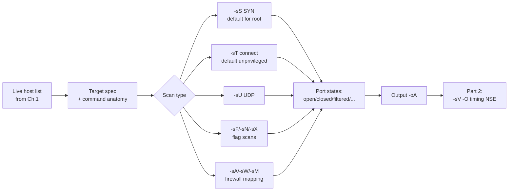
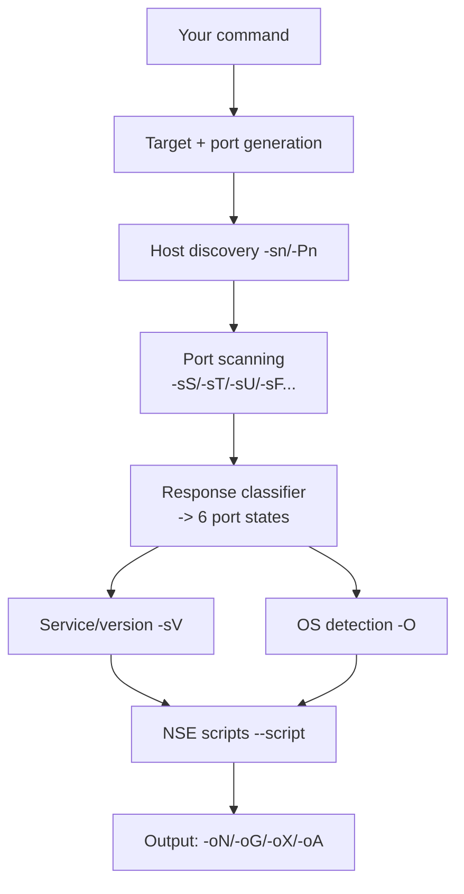
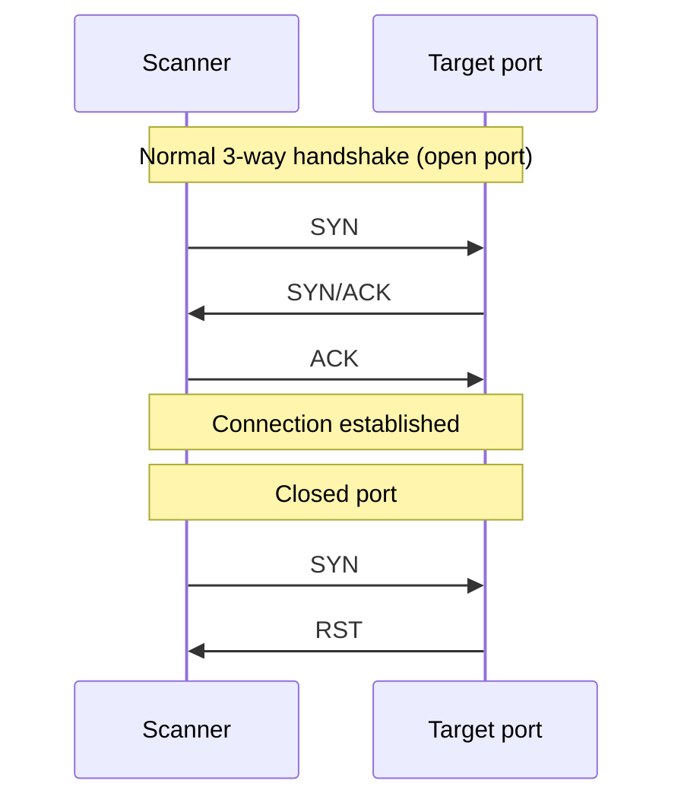
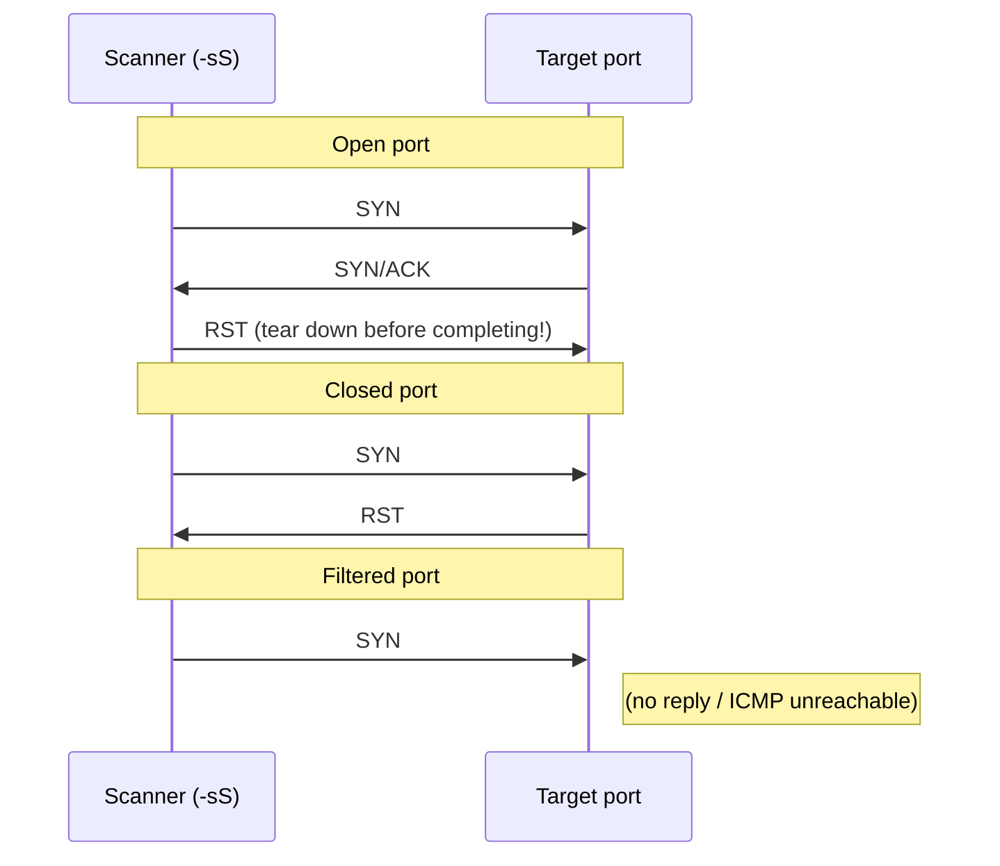
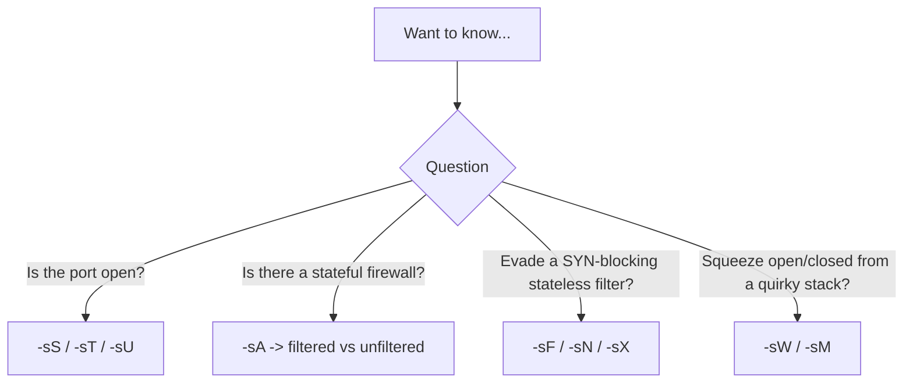

This is Chapter 2 of the Scanning & Enumeration notebook. Chapter 1 produced a validated, prioritised list of live hosts using multi-probe host discovery. This chapter and the next take that list and interrogate each host directly with **Nmap** — the single most important tool in the scanning phase and one of the most important in the whole discipline. Where Chapter 1 answered "which hosts are alive?", Nmap answers "which ports are open, what's listening on them, what version is it, and what OS is underneath?" — the questions that turn a live IP into an attack surface.

Nmap ("Network Mapper") is a free, open-source scanner written by Gordon Lyon (Fyodor) and under active development since 1997. It is not one tool but a toolkit: a host-discovery engine, a dozen port-scan techniques, a service/version-detection system, an OS-fingerprinting engine, and a full scripting engine (NSE) with thousands of scripts that push it into light vulnerability scanning and exploitation. This chapter (Part 1) covers installation, target specification, command anatomy, and the **scan types** — the core of how Nmap probes ports and interprets the answers. The next chapter (Part 2) covers service/version detection, OS detection, timing/performance tuning, NSE, and output/reporting in depth.

The reason to learn Nmap deeply rather than memorising a few commands is that its every scan type is a direct expression of how TCP/IP works. `-sS`, `-sF`, `-sA` are not magic flags; they are specific packets that exploit specific rules in RFC 793, and the states Nmap reports (open, closed, filtered) are logical deductions from what came back. Once you see the packets, you can pick the right scan for any firewall situation, explain every result, and never be fooled by an ambiguous one. That packet-level understanding is exactly what this chapter builds.

Everything here is active and touches the target directly. Running these scans against hosts you do not own or lack explicit written authorisation to test is unlawful in most jurisdictions. Scope and authorisation are hard boundaries, covered in Part 11 and assumed throughout.



---

## Part 1: What Nmap Is and How It Works

### 1.1 The architecture

Nmap's job is to send carefully-chosen packets to a target's ports and classify each port's state from the response (or lack of one). Internally it is:

1. A **target-and-port generator** that expands your specification (`10.0.0.0/24`, `-p 1-1000`) into a work list.
2. A **packet engine** that crafts and sends probes — using raw sockets when privileged, the OS TCP stack when not.
3. A **response classifier** that maps replies to the six port states.
4. Layered on top: **host discovery** (Chapter 1), **service/version detection** (`-sV`), **OS detection** (`-O`), and the **Nmap Scripting Engine** (NSE) — all covered across these two chapters.



### 1.2 Privileged vs unprivileged — the single biggest behaviour switch

This determines which scans you can even run:

- **Root/sudo:** Nmap uses raw sockets and can craft arbitrary packets — SYN scans (`-sS`), the flag scans, custom ICMP, ARP, OS detection. This is the normal, capable mode. Its default TCP scan is **SYN (`-sS`)**.
- **Unprivileged:** Nmap can only use the OS `connect()` system call, so its default (and often only) TCP scan is **connect (`-sT`)**, and it cannot do SYN/FIN/ACK/UDP-raw probing or OS detection.

**Always run Nmap with `sudo`** unless you have a specific reason not to. Half of the "why doesn't `-sS` work?" confusion is running unprivileged.

### 1.3 The six port states

Every Nmap result reduces to one of six states. Understanding them precisely is the whole game:

| State | Meaning | How Nmap concludes it |
|---|---|---|
| **open** | An application is actively accepting connections | SYN→SYN/ACK (TCP); UDP→a UDP reply |
| **closed** | Reachable, but nothing listening | SYN→RST; ICMP port-unreachable (UDP) |
| **filtered** | A firewall is blocking the probe; Nmap can't tell open/closed | No response, or ICMP admin-prohibited |
| **unfiltered** | Reachable but Nmap can't tell open/closed (ACK scan only) | RST returned to an ACK probe |
| **open\|filtered** | Open or filtered — can't distinguish (no reply to a scan where open ports stay silent) | UDP, FIN, NULL, Xmas with no reply |
| **closed\|filtered** | Closed or filtered — can't distinguish (Idle scan only) | rare |

The two ambiguous "either/or" states are not failures — they are honest reporting that the probe type used cannot disambiguate those cases. Choosing a *different* scan type is how you resolve them (e.g. a UDP `open|filtered` often resolves with a version probe that elicits a service reply).

### 1.4 Why "port open" is only half the answer

A scan that reports `443/tcp open` has found a door, not what's behind it. Two hosts can both show `443 open` while one runs a patched nginx serving a static page and the other runs an unpatched Jira behind a self-signed cert — utterly different attack surfaces. The scan-type work in this chapter answers *"which doors are open, and is a firewall in the way?"*. Turning that into *"what software, what version, what OS, and what known weaknesses?"* is service/version detection, OS detection and NSE — the subject of the next chapter. Keep the distinction clear: this chapter finds and classifies ports; the next identifies and interrogates what listens on them. A common beginner error is stopping at "open" and never running `-sV`, which is like listing the doors in a building without ever checking who's inside.

---

## Part 2: Installing Nmap

### 2.1 On Kali and Debian/Ubuntu

```bash
# Kali ships with Nmap, but update it
sudo apt update && sudo apt install -y nmap
nmap --version
```
```
Nmap version 7.94 ( https://nmap.org )
Platform: x86_64-pc-linux-gnu
Compiled with: liblua-5.4.4 openssl-3.0 libssh2-1.10 ...
Compiled without:
Available nsock engines: epoll poll select
```

The "Compiled with" line matters: OpenSSL enables TLS service probes, libssh2 enables SSH scripts, liblua enables NSE. A stripped build silently lacks capabilities.

### 2.2 Other platforms and from source

```bash
# macOS
brew install nmap

# From source (newest features, e.g. latest NSE + fingerprints)
curl -O https://nmap.org/dist/nmap-7.94.tar.bz2
bzip2 -cd nmap-7.94.tar.bz2 | tar xvf -
cd nmap-7.94
./configure && make && sudo make install
```

Nmap installs several companion binaries you'll meet later: **ncat** (a modern netcat), **nping** (packet crafting, Chapter 1), and **ndiff** (diff two scans — the basis of scan-based monitoring).

### 2.3 The Npcap/root note

On Linux, raw scans need root. On Windows, Nmap needs the Npcap driver for raw packets. On any platform, the rule stands: privileged = full capability.

### 2.4 The data files that drive Nmap

Nmap's intelligence lives in flat data files (usually under `/usr/share/nmap/`) that you can read and even edit:

| File | Drives |
|---|---|
| `nmap-services` | The port→service names and the frequency data behind `--top-ports` |
| `nmap-service-probes` | `-sV` version-detection probes and match patterns |
| `nmap-os-db` | `-O` OS fingerprints |
| `nmap-mac-prefixes` | MAC-vendor lookups (OUI) |
| `nmap-payloads` | UDP probe payloads for `-sU` |
| `scripts/` + `nse_main.lua` | The NSE script library |

Keeping these current (via a fresh Nmap or `nmap --script-updatedb` for NSE) is what makes version/OS detection accurate — an old `nmap-service-probes` misses new software. When `--top-ports` "misses" a port, it's because that port ranks low in `nmap-services` frequency data, which you can inspect: `grep -P "\t(80|3389)/tcp" /usr/share/nmap/nmap-services`.

---

## Part 3: Target Specification and Command Anatomy

Before scan types, be fluent in *what* you point Nmap at and *how a command is structured* — errors here silently scan the wrong things.

### 3.1 Specifying targets

```bash
nmap 10.0.0.5                       # single IP
nmap scanme.nmap.org                # hostname (Nmap's official legal-to-scan test host)
nmap 10.0.0.1 10.0.0.5 10.0.0.9     # list
nmap 10.0.0.0/24                    # CIDR block (256 addresses)
nmap 10.0.0.1-50                    # octet range
nmap 10.0.0.1,5,9-12                # comma + range within an octet
nmap 10.0.0.* 192.168.1.*           # wildcards
nmap -iL targets.txt                # from a file (your Ch.1 output) — the usual way
nmap --exclude 10.0.0.200-207 10.0.0.0/24   # subtract out-of-scope
nmap --excludefile oos.txt 10.0.0.0/24      # exclusions from a file
nmap -iR 100                        # 100 RANDOM internet hosts — NEVER do this (unauthorised)
```

`scanme.nmap.org` is explicitly provided by the Nmap project for you to practise against legally (a few scans; don't hammer it). `-iL targets.txt` is the normal professional input — you feed the validated list from Chapter 1. **Never use `-iR`** against the internet: those are real, random, unauthorised hosts.

### 3.2 The anatomy of a command

Every Nmap command has the same shape:

```
nmap [scan type(s)] [options] [port spec] [output] [target spec]
```

```bash
sudo nmap -sS -sV -p 1-1000 -T4 --reason -oA scan1 -iL targets.txt
#         │    │    │        │    │       │        │
#         │    │    │        │    │       │        └─ targets (file)
#         │    │    │        │    │       └─ output (all formats, base "scan1")
#         │    │    │        │    └─ show reason per port
#         │    │    │        └─ timing template
#         │    │    └─ port range
#         │    └─ service/version detection (Part 2)
#         └─ SYN scan type
```

Order is flexible, but this left-to-right reading — *type, options, ports, output, target* — makes any command legible.

### 3.3 Port selection

```bash
-p 80                # single port
-p 1-1000            # range
-p 22,80,443,3389    # list
-p-                  # ALL 65535 ports (thorough; slower)
-p U:53,161,T:80,443 # mix UDP and TCP explicitly
--top-ports 100      # the 100 most common ports (by Nmap's frequency data)
-F                   # "fast": top 100 ports
(no -p)              # default: top 1000 ports
```

Nmap's default is the **top 1000** ports (not 1–1000 — the 1000 *statistically most common*, from real scan data in `nmap-services`). Know the difference: `--top-ports 1000` ≈ default; `-p 1-1000` is the first 1000 numerically, which misses common high ports like 3389, 8080, 8443. For thoroughness, `-p-` scans everything; for speed, `--top-ports`/`-F`.

### 3.4 Discovery mode: the `-sn` / `-Pn` / default triad

Nmap couples host discovery (Chapter 1) with port scanning, and *which of three modes* you're in is set by two flags. Getting this wrong either wastes hours or misses hosts:

| Flag | Discovery? | Port scan? | Use when |
|---|---|---|---|
| `-sn` | Yes | No | You only want a live-host list (Chapter 1) |
| `-Pn` | **No** (treat all up) | Yes | Hosts filter discovery but you know they're alive |
| *(neither)* | Yes | Yes (on hosts found up) | Normal: discover, then scan the survivors |

```bash
sudo nmap -sn 10.0.0.0/24                  # discovery only -> live list
sudo nmap -Pn -p- 10.0.0.5                 # skip discovery, scan all ports
sudo nmap -p 1-1000 10.0.0.0/24            # default: discover then scan the up hosts
```

The default mode is efficient — Nmap doesn't waste port probes on addresses that never answered discovery. But if the perimeter drops all discovery probes (Chapter 1, Part 4), the default silently scans *nothing* because every host looked down. That's the number-one reason a scan "finds no open ports on a host you know is live": you needed `-Pn`. On CTF targets — which very frequently filter ICMP — `-Pn` is close to a default habit.

### 3.5 Discovery-probe flags carry into a port scan

The `-P*` probe flags from Chapter 1 aren't just for `-sn`; they tune the discovery stage of a full scan. Combine a discovery probe set with a port scan so the *right* hosts get scanned:

```bash
# use TCP-SYN discovery to common ports, THEN port-scan whoever answered
sudo nmap -PS22,80,443,3389 -PA80 -p- -T4 10.0.0.0/24
# skip reverse-DNS during the whole thing for speed/quiet
sudo nmap -n -PS443 -p 1-1000 10.0.0.0/24
```

Remember the independence from Chapter 1: **`-P*` controls the discovery probes; `-p`/`-s*` controls the port scan.** A well-formed scan of a firewalled range often looks like "SYN-ping discovery to a handful of ports (`-PS`), plus `-Pn` fallback on the ranges that still show nothing", then a port scan of the resulting live set. `-n` (no reverse-DNS) and privilege behave exactly as in Chapter 1 — run as root, and drop `-n` only when you want the names.

---

## Part 4: The TCP Handshake — The Foundation of Every TCP Scan

Every TCP scan type is a variation on manipulating the three-way handshake, so nail this first (it was introduced in the Networking notebook's TCP chapter; here it's the basis of the scans).



The rules that every scan exploits:
- **SYN to an open port → SYN/ACK.** The port wants to talk.
- **SYN to a closed port → RST.** Reachable, nothing listening.
- **A completed handshake** (SYN, SYN/ACK, ACK) establishes a real connection the OS logs.
- **RFC 793 behaviour for out-of-state packets** (FIN/NULL/Xmas to an open port → *silence*; to a closed port → RST) is what the "flag scans" exploit.
- **A firewall dropping the probe → silence**, which is the ambiguity that produces `filtered`.

---

## Part 5: TCP Connect Scan (`-sT`)

### 5.1 What it does

`-sT` completes the **full three-way handshake** on every port using the OS `connect()` call — exactly like a normal client connecting.

```bash
nmap -sT -p 1-1000 10.0.0.5
```

- Open port: SYN → SYN/ACK → ACK (handshake completes, then Nmap tears it down).
- Closed port: SYN → RST.

### 5.2 When to use it

- **When you're not root** — it's the only TCP scan available unprivileged, and Nmap's default in that case.
- **Through a SOCKS proxy / pivot** (Chapter 1's proxychains scenario) — only full connects traverse a proxy.
- **When you want maximum reliability** on a network where crafted packets get mangled.

### 5.3 The cost

Because it completes the handshake, `-sT` is **slower** (more packets, OS overhead) and **louder**: the connection is fully established, so the target application often **logs it** (a web server records the request, an SSH daemon logs the connection attempt). If you want to stay out of application logs, `-sT` is the wrong choice — use `-sS`.

**Blue team usage:** connect scans are the *easiest* to detect precisely because they complete — every touched service sees a real, logged connection. A burst of connect-and-immediately-close events across many ports is a textbook scan signature in application logs.

### 5.4 What a connect scan leaves behind

Because `-sT` completes the handshake, the target's services log a real connection. An SSH daemon records an attempt, a web server logs a request line, a database logs a connection from your IP:

```
# target /var/log/auth.log during an -sT scan of port 22
sshd[2141]: Connection from 10.10.0.66 port 55123 on 10.0.0.5 port 22
sshd[2141]: Connection closed by 10.10.0.66 port 55123 [preauth]
# target nginx access.log during an -sT of port 80
10.10.0.66 - - "GET / HTTP/1.0" 400 ...   (or an empty/aborted request)
```

Multiply that by every open port on every host and a connect scan writes an unmistakable trail across the estate's application logs — which is precisely why `-sS`, whose half-open probes never reach the application, is preferred whenever avoiding those logs matters.

---

## Part 6: SYN / Half-Open Scan (`-sS`) — The Default

### 6.1 What it does

`-sS` sends a SYN but **never completes the handshake** — hence "half-open" or "stealth" scan.



- Open: SYN → SYN/ACK → Nmap sends **RST** to abort before the handshake completes.
- Closed: SYN → RST.
- Filtered: no response (or ICMP unreachable).

### 6.2 Why it's the default and "stealthy"

Because the handshake never completes, the connection is never fully established, so **many applications never log it** — the OS TCP stack handled a SYN it then reset, and the listening app was never handed a connection. It's also **faster** (fewer packets, no OS connection setup) and gives clean state classification. This is why `-sS` is Nmap's default when run as root, and the workhorse of virtually every professional scan.

```bash
sudo nmap -sS -p- 10.0.0.5           # full SYN scan of all ports
sudo nmap -sS --top-ports 1000 -T4 10.0.0.0/24
```

### 6.2b Reading a real SYN-scan result

```bash
sudo nmap -sS -sV -p- -T4 --reason 192.168.56.20
```
```
Nmap scan report for 192.168.56.20
Host is up, received arp-response (0.00038s latency).
Not shown: 65530 closed tcp ports (reset)
PORT     STATE    SERVICE      REASON         VERSION
22/tcp   open     ssh          syn-ack ttl 64 OpenSSH 8.9p1 Ubuntu
80/tcp   open     http         syn-ack ttl 64 nginx 1.18.0
139/tcp  open     netbios-ssn  syn-ack ttl 64 Samba smbd 4
445/tcp  open     netbios-ssn  syn-ack ttl 64 Samba smbd 4
8080/tcp filtered http-proxy   no-response
MAC Address: 08:00:27:1A:2B:3C (Oracle VirtualBox virtual NIC)
```

Read every line: `received arp-response` confirms local-subnet ARP discovery; `Not shown: 65530 closed ... (reset)` means those ports RST'd (reachable, nothing listening); each open port shows `syn-ack` as the *reason* and `ttl 64` (Linux); `8080` is `filtered` (`no-response` — a firewall swallowed the SYN); and the MAC vendor outs it as a VirtualBox VM. This one output tells you the host's OS family, its role (SSH + web + SMB = a Linux file/web server), and that something guards 8080 — before any dedicated OS detection.

### 6.3 The "stealth" caveat

`-sS` avoids *application* logs, but it is **not invisible**. Modern firewalls, IDS/IPS (Suricata/Zeek) and endpoint tools readily detect SYN scans by the fan-out pattern (Chapter 1's detection section) and by half-open connections that never complete. "Stealth" here means "avoids app-layer logging", not "undetectable". For genuine evasion you still need slow timing, decoys and small batches (Chapter 1, Part 7; more in Part 2's timing section).

**Red team usage:** `-sS` at slow timing with decoys is the standard reconnaissance scan when the objective includes avoiding detection — but assume network-level sensors can still see it and plan accordingly.

---

## Part 7: The Flag Scans — FIN, NULL, Xmas (`-sF`, `-sN`, `-sX`)

### 7.1 The RFC 793 trick

These exploit a specific rule in the TCP RFC: a compliant stack receiving a segment with **no SYN/RST/ACK** flags set should respond with **RST if the port is closed**, and **nothing if the port is open**. So you send a weird packet and read the silence:

- **Open (or filtered) port → no reply** → Nmap reports `open|filtered`.
- **Closed port → RST** → Nmap reports `closed`.

The three variants differ only in which flags they set:

| Scan | Flags set | Packet nickname |
|---|---|---|
| `-sN` NULL | none at all | "null" |
| `-sF` FIN | FIN only | "fin" |
| `-sX` Xmas | FIN + PSH + URG | "christmas tree" (lit up) |

```bash
sudo nmap -sF -p 1-1000 10.0.0.5
sudo nmap -sN -p 1-1000 10.0.0.5
sudo nmap -sX -p 1-1000 10.0.0.5
```

### 7.2 What they're for, and their big limitation

The point of flag scans is **firewall/IDS evasion**: a stateless packet filter configured to block SYN packets may let a lone FIN through, and older IDS signatures keyed on SYN scans miss them. They can also slip past some non-stateful ACLs.

Their limitation is fatal on modern targets: they rely on strict RFC-793 compliance, and **Windows (and many modern stacks, CISCO devices, some firewalls) send RST for *both* open and closed ports**, breaking the technique — everything comes back `closed`. So flag scans are mainly useful against older Unix-like stacks and specific stateless-filter situations. They also can never distinguish open from filtered (both are silent), so they yield `open|filtered`, not `open`.

**CTF relevance:** flag scans occasionally reveal ports on older/Unix CTF targets that a SYN scan shows as filtered, and knowing the RFC-793 behaviour is a common exam/interview question. On a real modern estate they're a situational tool, not a default.

---

## Part 8: ACK, Window and Maimon Scans (`-sA`, `-sW`, `-sM`) — Mapping Firewalls

These scans don't primarily find open ports — they **map firewall rules**, telling you whether a port is *filtered* rather than open/closed.

### 8.1 ACK scan (`-sA`)

```bash
sudo nmap -sA -p 1-1000 10.0.0.5
```

Sends a bare ACK. The logic:
- A live host (open *or* closed port) replies **RST** to an unexpected ACK → Nmap marks it `unfiltered` (reachable; can't tell open from closed).
- A **stateful firewall** that drops out-of-state packets returns **nothing** (or ICMP admin-prohibited) → `filtered`.

So `-sA` answers a different question: *"is there a stateful firewall in front of this port?"* Run it alongside a SYN scan to distinguish "no firewall, port closed" from "firewall dropping the probe". This is invaluable for understanding a perimeter.

### 8.2 Window scan (`-sW`)

`-sW` is an ACK scan that additionally inspects the TCP **window field** of the returned RST. On some (older) systems, open ports return a RST with a non-zero window and closed ports a zero window — occasionally letting `-sW` distinguish open from closed where `-sA` cannot. It's unreliable across modern stacks; treat any positive result as a lead to verify.

### 8.3 Maimon scan (`-sM`)

`-sM` (named for Uriel Maimon) sends a FIN/ACK. Per RFC 793 the target should RST regardless of state, but some BSD-derived stacks drop the packet for open ports — leaking open ports on those specific systems. Like `-sW`, it's a niche tool for particular stacks.

### 8.5 Idle (zombie) scan (`-sI`) — scanning without your IP touching the target

The idle scan is Nmap's most elegant technique: it port-scans a target **without ever sending a packet from your own address to it**, by bouncing probes off a third "zombie" host and inferring results from the zombie's IP ID counter.

```mermaid
sequenceDiagram
    participant A as Attacker
    participant Z as Zombie (idle host)
    participant T as Target
    A->>Z: probe, read IP ID  (say 1000)
    A->>T: SYN spoofed as coming FROM Z
    Note over T,Z: If port OPEN: T sends SYN/ACK to Z;<br/>Z replies RST -> Z's IP ID increments
    A->>Z: probe again, read IP ID
    Note over A,Z: ID jumped by 2 = port OPEN;<br/>jumped by 1 = port closed/filtered
```

```bash
sudo nmap -sI zombie_ip:port target_ip -Pn -p 1-1000
```

It works only if the zombie is truly *idle* (predictable, incrementing IP ID — increasingly rare on modern OSes that randomise IP IDs) and reachable. Its payoff is total source anonymity toward the target and the ability to test trust relationships (scan the target *as if* you were the zombie, bypassing IP-based ACLs that trust the zombie). It's slow and finicky, but conceptually important and a favourite exam/interview topic.

**Red team usage:** where an internal host is trusted by a target's firewall, an idle scan through that host can reveal ports your own source could never reach — a trust-relationship probe with no direct attribution.

### 8.6 IP protocol scan (`-sO`) and FTP bounce (`-b`)

Two more specialised scans round out the family:

- **`-sO` (IP protocol scan)** doesn't scan ports — it discovers which **IP protocols** (TCP=6, UDP=17, ICMP=1, GRE=47, ESP=50, etc.) a host supports, by sending bare IP packets for each protocol number and watching for ICMP protocol-unreachable. Useful for finding tunnelling/VPN protocols (GRE, ESP) on routers and gateways.

```bash
sudo nmap -sO 10.0.0.1        # which IP protocols does this gateway speak?
```

- **`-b` (FTP bounce)** abuses the old FTP `PORT` command to make a misconfigured FTP server scan a third host on your behalf. Almost every modern FTP server disables it, so it's historical — but it's the ancestor of the idle scan's "scan via a proxy host" idea and still appears in CTFs and exams.

### 8.4 How they fit together



The professional pattern: **`-sS` (or `-sT`) to find open ports, `-sA` to understand the firewall in front of them.** The exotic scans are situational supplements, not replacements.

---

## Part 9: UDP Scan (`-sU`) — The Neglected Half of the Attack Surface

Most scanning focuses on TCP, but critical services run on UDP: DNS (53), SNMP (161), DHCP (67/68), NTP (123), TFTP (69), IKE/VPN (500), NetBIOS (137), and many game/IoT protocols. Skipping UDP misses entire attack paths — SNMP with a default community string alone can dump a device's whole configuration.

### 9.1 Why UDP scanning is hard

UDP is connectionless — there's no handshake. The classification logic:

- **Closed port → ICMP port-unreachable (type 3, code 3)** → `closed`.
- **Open port → usually silence** (the service got a datagram it didn't understand and stayed quiet) → `open|filtered`.
- **Open port that *does* reply** (a real UDP response) → `open`.
- **Filtered → silence** → `open|filtered` (indistinguishable from the silent-open case).

So a bare UDP scan produces mostly `open|filtered` — unhelpful. Worse, hosts **rate-limit ICMP unreachables** (Linux caps them at ~1/second by default), which makes UDP scanning extremely **slow**: Nmap must wait for each possible reply, and a full 65535-port UDP scan can take *many hours*.

### 9.1b High-value UDP services worth the wait

| Port | Service | Why it matters |
|---|---|---|
| 53 | DNS | Zone transfers, cache snooping, version.bind |
| 67/68 | DHCP | Network layout, rogue-DHCP potential |
| 69 | TFTP | Often unauthenticated config/firmware transfer |
| 123 | NTP | `monlist` amplification, host enumeration |
| 137/138 | NetBIOS | Names, shares, domain info on Windows |
| 161/162 | SNMP | **Community-string config dump — a top easy win** |
| 500/4500 | IKE/IPsec | VPN endpoints, aggressive-mode PSK capture |
| 1900 | SSDP/UPnP | Device enumeration, amplification |
| 5353 | mDNS | Hostnames, services on the segment |

These are the ports to feed `-sU -sV`. Each has protocol-specific NSE scripts (Chapter 3) that turn "open" into real data — `snmp-info`, `dns-zone-transfer`, `ntp-monlist`, `ike-version`.

### 9.2 Making UDP scanning useful

The fix is **version detection with protocol-specific payloads**: instead of an empty datagram, send a probe the service will actually answer (a real DNS query to 53, an SNMP get to 161), which turns `open|filtered` into a definitive `open` with a service banner.

```bash
# targeted UDP scan of the common UDP services WITH version probes — the practical approach
sudo nmap -sU -sV --top-ports 20 10.0.0.5
# specific high-value UDP ports
sudo nmap -sU -sV -p 53,67,123,161,500,137,138,69 10.0.0.5
# combine with a fast TCP SYN scan in one run
sudo nmap -sS -sU -p T:1-1000,U:53,161,123,500 10.0.0.5
```

Practical rules for UDP:
- **Never** run `-sU -p-` across many hosts as a first move — it's punishingly slow. Scan the **top ~20–50 UDP ports** with `-sV`.
- Add `--version-intensity` and accept UDP takes far longer than TCP.
- Pair UDP with TCP in a single command (`-p T:...,U:...`) so you cover both halves of the surface.

**Bug bounty / red team relevance:** exposed SNMP (161/udp) with `public`/`private` community strings is a recurring high-impact finding — it can leak full device configs, credentials and routing. UDP is where a lot of easy wins hide precisely because so many testers skip it.

**Blue team usage:** because UDP scans are slow and rate-limited, a sustained trickle of UDP probes to closed ports (triggering ICMP-unreachable floods) is both detectable and a sign someone is doing the thorough work most attackers skip — monitor for it.

---

## Part 10: Choosing a Scan Type — The Decision Framework

Put it together. Given a situation, which scan?

| Situation | Scan | Why |
|---|---|---|
| Default, running as root | `-sS` | Fast, clean states, avoids app logs |
| Not root / through a proxy | `-sT` | Only option; traverses SOCKS |
| Need UDP services | `-sU -sV` (targeted) | UDP surface; version probes disambiguate |
| Map the firewall | `-sA` | filtered vs unfiltered |
| Evade a stateless SYN-blocking filter | `-sF`/`-sN`/`-sX` | Lone FIN may pass; RFC-793 trick |
| Quirky/old stack hiding ports | `-sW`/`-sM` | Stack-specific leaks |
| Maximum thoroughness | `-sS -sU -p-` | Everything, both protocols (slow) |
| Maximum stealth | `-sS -T1 -D... -f` small batches | Slow, decoyed, fragmented |
| Zero source attribution to target | `-sI zombie target` | Bounces off an idle zombie host |
| Discover IP protocols on a gateway | `-sO` | GRE/ESP/ICMP support, not ports |

The everyday professional command is a targeted combination, not a single exotic scan:

```bash
sudo nmap -sS -sV -p- -T4 --reason -oA full_tcp 10.0.0.5     # thorough TCP with versions
sudo nmap -sU -sV --top-ports 25 -T4 -oA top_udp 10.0.0.5    # practical UDP pass
```

### 10.0b Scan ordering and parallelism (a preview)

How Nmap sequences probes affects both speed and stealth; timing is Chapter 3's topic, but two facts matter now:

| Concern | Lever | Effect |
|---|---|---|
| Too slow on big scope | `--min-rate`, `-T4` | Forces throughput |
| Too loud / fragile host | `-T2`/`-T1`, `--max-rate` | Spreads probes, gentler |
| One host stalls the scan | `--host-timeout` | Abandons black-hole hosts |
| Randomise target order | `--randomize-hosts` | Less obvious sequential sweep |

A common mistake is a `-p- -sU` scan across a `/24` with default timing that runs for a day; the fix (targeted ports, `-T4`, splitting TCP/UDP) is methodology, not a single flag. Chapter 3 covers the full timing model.

### 10.1 Fragmentation and other packet tricks (`-f`, `--mtu`)

For authorised evasion, `-f` fragments probe packets into tiny IP fragments to slip past simple packet inspection; `--mtu` sets a custom fragment size; `--data-length` pads packets to look less like scans. These are supplements to the timing/decoy techniques from Chapter 1, and like those they matter only in evasion-in-scope engagements.

```bash
sudo nmap -sS -f -p 80,443 10.0.0.5          # fragment probes
sudo nmap -sS --data-length 25 10.0.0.5       # pad to disguise
```

---

## Part 11: Hands-On Lab — Every Scan Type, Watched on the Wire

Run against `scanme.nmap.org` (Nmap's legal practice host, gently) or, better, your own VM lab so you can capture packets on both ends. Never against hosts you don't own or aren't authorised to scan.

### 11.1 Setup

```bash
sudo apt update && sudo apt install -y nmap tcpdump
nmap --version | head -1
# a safe target VM on your lab subnet, e.g. 192.168.56.20 running some services
TARGET=192.168.56.20; IFACE=eth0
```

### 11.2 Watch the packets while you scan

```bash
# terminal 1 — capture the scan traffic
sudo tcpdump -i $IFACE -n "host $TARGET and (tcp or udp or icmp)"

# terminal 2 — run each scan and read terminal 1
```

### 11.3 Connect vs SYN — see the difference

```bash
sudo nmap -sT -p 22,80,443 --reason $TARGET
```
tcpdump shows the **full handshake** on open ports (SYN, SYN/ACK, ACK, then teardown):
```
IP scanner.55123 > target.80: Flags [S]
IP target.80 > scanner.55123: Flags [S.]
IP scanner.55123 > target.80: Flags [.]      <- ACK: handshake COMPLETED (-sT)
IP scanner.55123 > target.80: Flags [R.]     <- teardown
```

```bash
sudo nmap -sS -p 22,80,443 --reason $TARGET
```
tcpdump shows the **half-open** pattern — the ACK never comes; Nmap RSTs instead:
```
IP scanner.55124 > target.80: Flags [S]
IP target.80 > scanner.55124: Flags [S.]
IP scanner.55124 > target.80: Flags [R]      <- RST, no ACK: handshake ABORTED (-sS)
```

Seeing those two captures side by side is the single clearest way to understand why `-sS` avoids application logs and `-sT` doesn't.

### 11.4 Closed vs filtered

```bash
sudo nmap -sS -p 22,81,443 --reason $TARGET
```
```
PORT    STATE    SERVICE REASON
22/tcp  open     ssh     syn-ack
81/tcp  closed   hosts2-ns reset        <- got a RST: reachable, nothing listening
443/tcp open     https   syn-ack
```
Now add a firewall rule on the target to DROP port 81 and re-scan — its state flips from `closed` to `filtered` (reset → no-response):
```bash
# on target: sudo iptables -A INPUT -p tcp --dport 81 -j DROP
sudo nmap -sS -p 81 --reason $TARGET
# 81/tcp filtered ... no-response        <- the firewall swallowed the probe
```
This reproduces the exact distinction between `closed` (RST) and `filtered` (silence) that Part 1's state table describes.

### 11.5 Flag scan behaviour

```bash
sudo nmap -sF -p 22,81,443 --reason $TARGET     # against a Linux target
```
On an RFC-793-compliant Linux host, open ports show `open|filtered` (silence) and closed ports `closed` (RST). Run the same `-sF` against a Windows VM and note that **everything comes back `closed`** — the concrete demonstration of the flag-scan limitation from Part 7.

### 11.6 ACK scan — firewall mapping

```bash
sudo nmap -sA -p 22,81,443 --reason $TARGET
```
```
22/tcp  unfiltered  ssh   reset          <- RST back = no stateful firewall on this port
81/tcp  filtered    ...   no-response    <- dropped = stateful firewall in front
```
`-sA` didn't tell you open/closed — it told you *where the firewall is*, which is its job.

### 11.7 UDP

```bash
sudo nmap -sU -sV -p 53,161,123 --reason $TARGET
```
Observe how much slower UDP is, how closed ports produce ICMP unreachables in tcpdump, and how `-sV`'s protocol probes turn a silent open port into a named service. If the target runs DNS on 53, you'll get `open` with a version string rather than `open|filtered`.

### 11.8 Save it properly

```bash
sudo nmap -sS -sV -p- -T4 --reason -oA lab_full_tcp $TARGET
ls lab_full_tcp.*     # .nmap (human), .gnmap (grep), .xml (machine)
grep open lab_full_tcp.gnmap
```

`lab_full_tcp.*` is your reproducible record and the input to service enumeration in later chapters.

### 11.9 Bonus — protocol scan and reading `--packet-trace`

```bash
sudo nmap -sO 192.168.56.20            # which IP protocols does the host speak?
sudo nmap -sS -p 22 --packet-trace 192.168.56.20 | head
```
`--packet-trace` prints each probe and reply inline, e.g.:
```
SENT (0.0021s) TCP 192.168.56.10:55201 > 192.168.56.20:22 S ttl=... 
RCVD (0.0025s) TCP 192.168.56.20:22 > 192.168.56.10:55201 SA ttl=64
```
Reading `SENT ... S` (your SYN) then `RCVD ... SA` (the target's SYN/ACK) is the same evidence tcpdump gave you, but produced *by Nmap itself* — the fastest way to confirm exactly what a scan did without a second tool.

---

## Part 12: Reading and Saving Output

### 12.1 The output formats

```bash
sudo nmap -sS -sV 10.0.0.5 -oN scan.nmap    # normal (human-readable)
sudo nmap -sS -sV 10.0.0.5 -oG scan.gnmap   # greppable (one host per line)
sudo nmap -sS -sV 10.0.0.5 -oX scan.xml     # XML (for tools/parsers)
sudo nmap -sS -sV 10.0.0.5 -oA scan         # ALL THREE at once (base name "scan")
```

**Always use `-oA`.** You get the human view for reading, the greppable view for quick extraction, and the XML for tooling — for the cost of one flag. Losing scan output means re-scanning, which wastes time and adds noise.

### 12.2 Extracting from output

```bash
# open ports per host from greppable output
grep -oP '\d+/open' scan.gnmap
awk '/Ports:/{print $2, $0}' scan.gnmap

# hosts with a specific open port
grep "443/open" scan.gnmap | awk '{print $2}'

# XML -> anything, via the xml or with tools like `nmap-parse-output`
xmllint --xpath '//port[state/@state="open"]/@portid' scan.xml 2>/dev/null
```

### 12.3 Diffing scans with ndiff

```bash
sudo nmap -sS -oX before.xml 10.0.0.0/24
# ...later...
sudo nmap -sS -oX after.xml 10.0.0.0/24
ndiff before.xml after.xml       # what changed: new hosts, new open ports
```

`ndiff` turns Nmap into a change-monitoring system — the same diff-and-alert pattern as the recon pipeline in the previous notebook. A newly-open port on a production host is exactly what a blue team wants paged.

### 12.4 Verbosity and debugging

```bash
sudo nmap -sS -v 10.0.0.5        # verbose (progress, findings as they happen)
sudo nmap -sS -vv 10.0.0.5       # more verbose
sudo nmap -sS -d 10.0.0.5        # debug (packet-level detail)
sudo nmap -sS --packet-trace 10.0.0.5   # show every packet sent/received
```

`--packet-trace` is the learning superpower — it prints every probe and response inline, so you can watch the scan logic without a separate tcpdump.

### 12.5 Turning output into a working list

```bash
# every open port:service pair across all hosts (greppable)
awk -F'\t' '/Ports:/{print $1}' scan.gnmap    # host + ports blob
# just hosts running SMB (445 open) -> feed to the SMB-enum chapter
grep -E "445/open" scan.gnmap | awk '{print $2}' > smb_hosts.txt
# web hosts (80/443/8080/8443 open) -> feed to web tooling / httpx
grep -oP "\d+\.\d+\.\d+\.\d+" <(grep -E "(80|443|8080|8443)/open" scan.gnmap) | sort -u > web_hosts.txt
# open ports as CSV from XML
xmllint --xpath '//host[status/@state="up"]' scan.xml 2>/dev/null | \
  grep -oP 'addr="\K[0-9.]+|portid="\K\d+'
```

The pattern is always the same: scan once with `-oA`, then slice the greppable/XML output into per-service target lists that feed the enumeration chapters. This is the join between scanning and the rest of the engagement — `smb_hosts.txt`, `web_hosts.txt`, `ssh_hosts.txt` become the inputs to everything that follows.

---

## Part 13: Detection, Defense, OPSEC and Scope

### 13.1 How scans are detected

- **Connect scans (`-sT`)** appear in application logs as real, immediately-closed connections across many ports — the easiest to catch.
- **SYN scans (`-sS`)** are caught at the network layer by the half-open/fan-out pattern (IDS/IPS, firewall scan-detection, NetFlow), even though apps don't log them.
- **Flag/ACK/UDP scans** use unusual packets (lone FIN, out-of-state ACK, UDP to closed ports) that legitimate traffic rarely produces — signatures key on exactly these.
- **Volume and rate** are the giveaway for all of them: one source touching many ports/hosts quickly.

### 13.2 Defending

- **IDS/IPS** (Suricata, Zeek) with scan-detection rules; **firewall scan throttling**; **rate-limits**; **tarpits** (e.g. an iptables tarpit that holds scanner connections open to slow them). Alert on the fan-out signature above all.
- **Minimise the surface**: close unused ports, filter at the perimeter, and run your *own* Nmap scans regularly (with `ndiff`) so you know your exposure before an attacker maps it.
- **Understand the limits of "stealth"**: `-sS` avoids app logs, not network sensors — don't assume a quiet host means an undetected scan.

### 13.3 OPSEC and scope

- **Authorisation is mandatory and per-target.** Active scanning of hosts outside your written scope is unlawful; `--exclude`/`--excludefile` are scope controls, not conveniences.
- **Fragile hosts.** Aggressive scans (`-T5`, `-p-`, high parallelism) can crash embedded/ICS/medical/legacy devices. Drop to polite timing and confirm which ranges are fragile before scanning them.
- **Never `-iR`** (random internet hosts) — those are real, unauthorised systems.
- **Data handling.** Scan output maps a client's estate — store it encrypted and dispose of it per the engagement terms.

**CTF relevance:** almost every box starts with `sudo nmap -sS -sV -p- -oA nmap/initial <ip>` (often `-Pn`, since CTF targets frequently filter ICMP). The full-port scan matters — CTF authors love hiding the intended service on a high, non-default port that `--top-ports` would miss.

### 13.4 A concrete detection signature

What distinguishes each scan to a defender is the packet shape and volume. A simple layered detection:

```
# half-open (SYN scan): many SYNs with no completing ACK from one source
IF count(SYN without matching ACK) BY src > 50 WITHIN 30s  -> "SYN scan"
# connect scan: many complete-then-immediately-close connections
IF count(established+closed < 1s) BY src, across >20 dst_ports -> "connect scan"
# flag/UDP scan: unusual packets legit traffic rarely sends
IF seen(FIN-only | NULL | Xmas | ACK-to-closed | UDP-to-many-closed) -> "exotic scan"
```

The fan-out (one source, many destinations/ports, little data per flow) is the common thread across all of them and the highest-value single rule. This is why a red-team operator spreads probes over time and sources — and why, in a standard assessment where detection is expected, none of it needs hiding.

---

## Part 14: Common Pitfalls

- **Scanning `-p 1-1000` and thinking it's "the top 1000".** It's the first 1000 numerically and misses 1433, 3389, 8080, 8443. Use `--top-ports` or `-p-`.
- **Forgetting `-p-` on CTFs / thorough tests.** The one open port is on 31337. Default top-1000 misses it.
- **Running unprivileged and wondering why `-sS` fails.** No root = connect scan only. Use `sudo`.
- **Skipping UDP entirely.** Half the easy wins (SNMP, DNS, TFTP) are UDP. Do a targeted `-sU -sV` pass.
- **Bare `-sU -p-` across many hosts.** Punishingly slow due to ICMP rate-limiting. Target top UDP ports.
- **Trusting flag scans on modern/Windows targets.** They report everything `closed` there. Situational only.
- **Reading `open|filtered` as "open".** It means the probe couldn't disambiguate — resolve with a different scan (`-sV`, `-sA`).
- **Not saving output (`-oA`).** Lose the record, re-scan, add noise.
- **Assuming `-sS` is invisible.** It avoids app logs, not network detection.
- **Aggressive timing on fragile hosts.** `-T5 -p-` can knock over embedded devices. Match timing to the environment.
- **Ignoring `--reason`.** It turns every state into evidence — indispensable when a result surprises you.
- **Confusing `-sn` and `-Pn`.** `-sn` = discovery only (no port scan); `-Pn` = port scan only (no discovery). Mixing them up either skips the scan or skips discovery.
- **Leaving `-Pn` off against a ping-filtering host** so the scan finds nothing because the host "looked down" — the classic cause of an empty result on a live target.

---

## Part 15: Practice Labs & Resources

- **scanme.nmap.org** — the Nmap project's legal-to-scan host; run each scan type gently and read the results.
- **Your own VM lab** — the correct place for the packet-capture lab (Part 11); you control both ends.
- **TryHackMe — "Nmap" module ("Nmap Basic Port Scans", "Nmap Advanced Port Scans", "Nmap Post Port Scans")** — drills exactly this chapter's scan types and flags, room by room.
- **HackTheBox — Starting Point + easy boxes** — practise the standard `-sS -sV -p- -Pn` opening and full-port discipline.
- **PortSwigger / OWASP targets** — for what to do with the web ports Nmap finds (feeds later web chapters).
- **"Nmap Network Scanning" by Fyodor** — the authoritative book; the port-scanning-techniques chapters are the definitive reference for every `-s*` scan and the RFC-793 logic.
- **The official `man nmap` and https://nmap.org/book/** — free, complete, and worth reading end to end.

---

## Memory Hooks

- **`-sS` = SYN/half-open, the root default** — fast, avoids app logs, clean states.
- **`-sT` = full connect** — unprivileged/proxy only, slower, gets logged by apps.
- **`-sU` = UDP** — slow, mostly `open|filtered`; always add `-sV` and target top ports.
- **`-sF`/`-sN`/`-sX` = RFC-793 flag scans** — evade stateless SYN filters; break on Windows (all `closed`).
- **`-sA` = firewall map** — filtered vs unfiltered, not open vs closed.
- **6 states:** open, closed, filtered, unfiltered, open|filtered, closed|filtered — the either/ors mean "this probe can't tell".
- **Any reply classifies; silence is ambiguous.** Resolve `open|filtered` with a different scan.
- **Default = top 1000, NOT 1-1000.** `-p-` for all; `--top-ports`/`-F` for speed.
- **Root or nothing** — unprivileged silently downgrades to connect scans.
- **`-oA` always; `--reason` when surprised; `--packet-trace` to learn.**

## Final Revision / Summary

This chapter taught Nmap from zero through the complete family of scan types. Part 1 explained Nmap's architecture (target generation → packet engine → response classifier, with discovery/version/OS/NSE layered on), the decisive privileged-vs-unprivileged switch (root → SYN default and full capability; unprivileged → connect only), and the six port states that every result reduces to — including why the "either/or" states (`open|filtered`, `closed|filtered`) are honest reporting that a given probe can't disambiguate. Parts 2–3 covered installation (Kali, source, the capability implications of the build) and command fluency: target specification (`-iL`, CIDR, `--exclude`, and never `-iR`), the anatomy of a command, and port selection (the critical difference between the default top-1000 and a numeric `1-1000`).

Part 4 grounded everything in the TCP handshake and the RFC-793 out-of-state rules. Parts 5–9 then taught each scan at the packet level: connect (`-sT`, full handshake, logged, proxy-capable), SYN (`-sS`, half-open, the fast log-avoiding default), the flag scans (`-sF`/`-sN`/`-sX`, RFC-793 evasion that breaks on modern/Windows stacks), the firewall-mapping scans (`-sA` unfiltered-vs-filtered, plus the niche `-sW`/`-sM`), and UDP (`-sU`, why it's slow and mostly `open|filtered`, and how `-sV` protocol probes make it useful — with SNMP as the headline easy win). Part 10 tied them into a decision framework and added fragmentation/padding evasion. Parts 11–12 put it on the wire — a packet-capture lab showing connect-vs-SYN, closed-vs-filtered, the flag-scan limitation, ACK firewall-mapping and UDP — and covered output (`-oA` always, `ndiff` for change monitoring, `--packet-trace` for learning). Parts 13–15 handled detection/defense, OPSEC/scope, pitfalls and practice.

You can now choose and justify the right scan for any host-and-firewall situation, read every state as a deduction from a packet, and produce saved, reproducible results. What you *cannot* yet do is reliably identify *what* is running on an open port and *which OS* underlies it, tune timing for large scopes, or automate checks with scripts. That is exactly the next chapter — **Nmap Part 2: service/version detection (`-sV`), OS detection (`-O`), timing and performance, the Nmap Scripting Engine (NSE), and output/reporting at depth** — which turns "port 443 is open" into "nginx 1.18.0 on Ubuntu, with these three NSE findings".

## Cheat Sheet / Quick Reference

```bash
# ---- SCAN TYPES ----
sudo nmap -sS  ...        # SYN / half-open (root default; fast; avoids app logs)
     nmap -sT  ...        # TCP connect (unprivileged/proxy; full handshake; logged)
sudo nmap -sU  ...        # UDP (slow; add -sV; target top ports)
sudo nmap -sF/-sN/-sX ... # FIN / NULL / Xmas (RFC-793 evasion; break on Windows)
sudo nmap -sA  ...        # ACK (firewall map: filtered vs unfiltered)
sudo nmap -sW/-sM ...     # Window / Maimon (niche stack leaks)

# ---- TARGETS & PORTS ----
-iL targets.txt          # from file (usual)     10.0.0.0/24  10.0.0.1-50  10.0.0.*
--exclude / --excludefile  # scope exclusions (never -iR = random internet hosts)
-p 22,80,443   -p-  (all 65535)   -p U:53,T:80  --top-ports 100  -F (top 100)
# DEFAULT = top 1000 (NOT 1-1000)

# ---- COMMON REAL COMMANDS ----
sudo nmap -sS -sV -p- -T4 --reason -oA full_tcp -iL targets.txt      # thorough TCP
sudo nmap -sU -sV --top-ports 25 -T4 -oA top_udp <ip>                # practical UDP
sudo nmap -sS -sA -p- <ip>                                           # ports + firewall map
sudo nmap -sS -Pn -p- <ip>                                           # CTF opener (skips discovery)

# ---- 6 STATES ----
open | closed | filtered | unfiltered | open|filtered | closed|filtered
# any reply -> classified ; silence -> ambiguous ; resolve open|filtered with -sV/-sA

# ---- OUTPUT / DIAGNOSE ----
-oA base                 # .nmap/.gnmap/.xml (ALWAYS)
--reason                 # why each state    --packet-trace  # every packet (learn)
-v/-vv/-d                # verbosity/debug
ndiff before.xml after.xml   # change monitoring

# ---- EVASION (authorised) ----
-T0/-T1  -D decoy1,decoy2,ME  -f  --data-length N  --source-port 53
```

**The one rule:** pick the scan that answers your question — `-sS/-sT/-sU` for "is it open?", `-sA` for "is there a firewall?", flag scans for "can I evade this filter?" — and read every state as a deduction from a packet.

## Practice Questions & Labs

1. **SYN vs connect.** Explain, at the packet level, exactly how `-sS` and `-sT` differ and why `-sS` "avoids application logs" while `-sT` does not. In which two situations must you use `-sT` even though `-sS` is available, and why?
2. **State reasoning.** For each result, state what packet Nmap saw and what it means: `80/tcp open`, `81/tcp closed`, `82/tcp filtered`, `161/udp open|filtered`. Then explain how you'd resolve the `open|filtered` into a definite state.
3. **Flag-scan limits.** Describe the RFC-793 behaviour that makes `-sF`/`-sN`/`-sX` work, then explain precisely why they return every port as `closed` against a Windows target. Give one real situation where a flag scan still adds value over `-sS`.
4. **UDP done right.** Why does a bare `-sU` scan produce mostly `open|filtered`, and why is `-sU -p-` across a subnet a bad idea? Write the command you'd actually run to enumerate UDP services efficiently, and name the single UDP service whose exposure most often yields an easy high-impact finding.
5. **Full lab (hands-on).** On a VM you own, capture packets while running `-sT`, `-sS`, `-sF` and `-sA` against the same host. Produce the tcpdump excerpts that prove: the connect handshake completes but the SYN scan aborts with RST; a closed port RSTs while a firewalled port is silent; and the ACK scan reports `unfiltered`/`filtered` rather than open/closed. Save everything with `-oA` and write two sentences on how each scan would appear to a defender.
