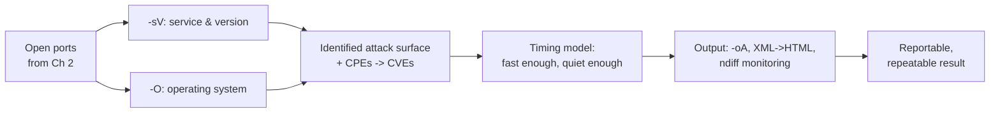
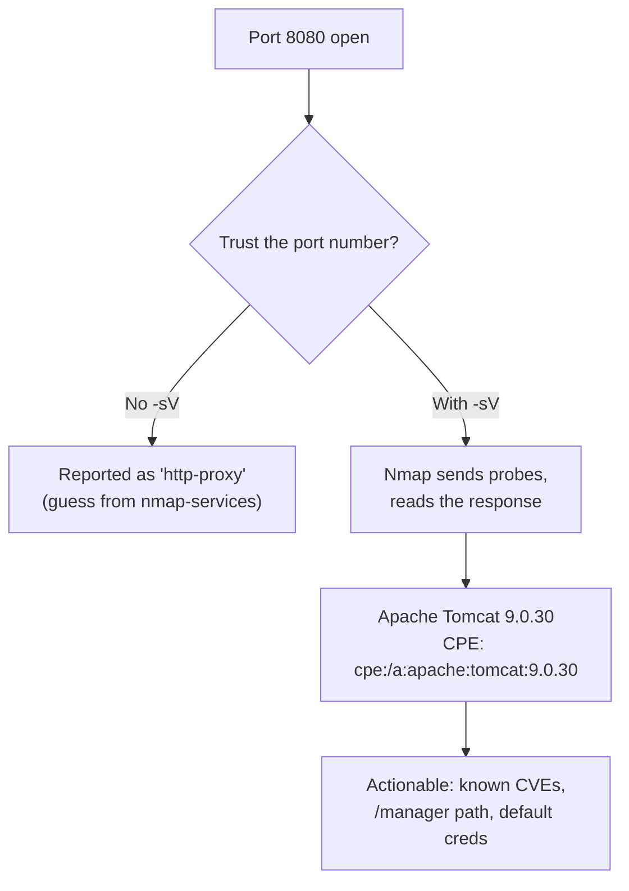
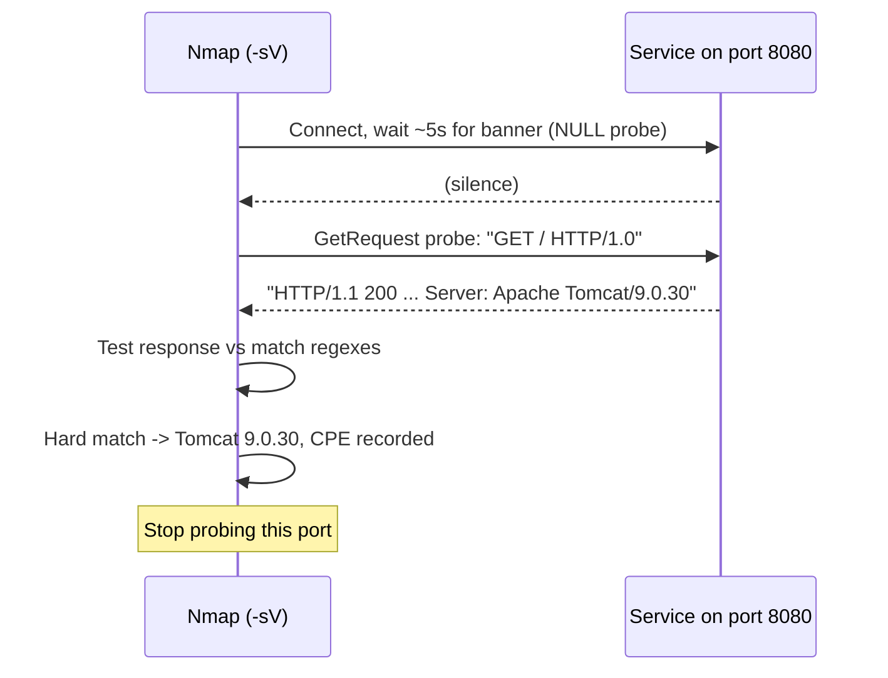
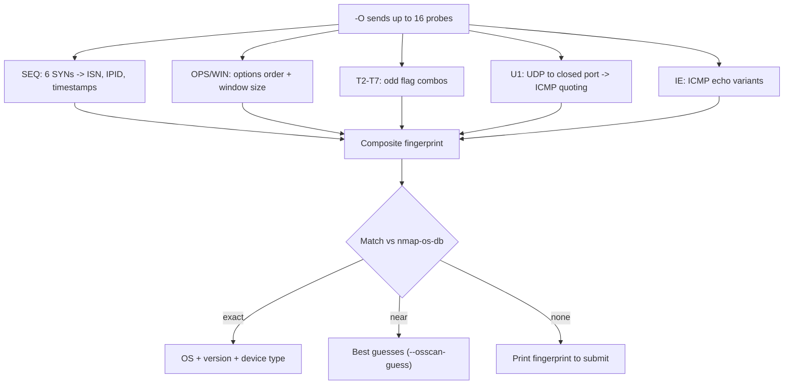
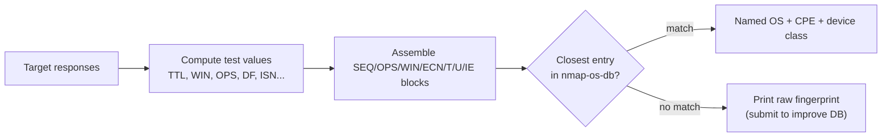
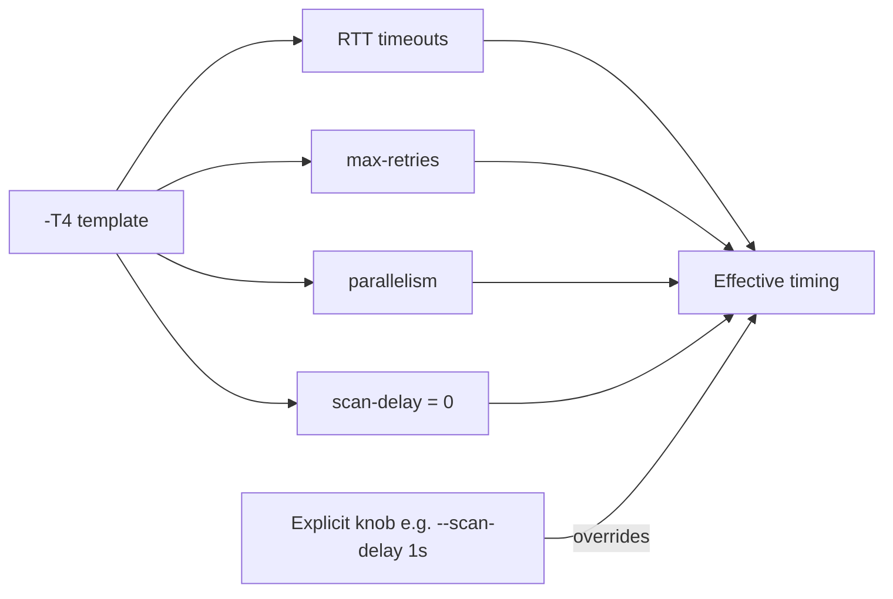
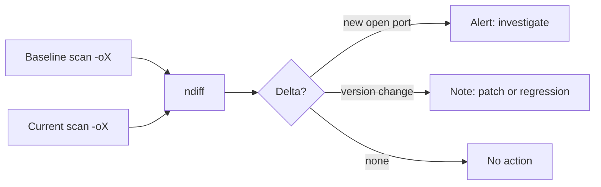

**Level:** Advanced · **Track:** Penetration Testing · **Read time:** 225 min

This is Chapter 3 of the Scanning & Enumeration notebook and the second of three Nmap chapters. Chapter 2 taught the scan types — how Nmap finds open ports and classifies each into one of six states at the packet level. That answered *"which doors are open?"*. This chapter answers the questions that make a scan actionable: *"what software is behind each door, which exact version, what operating system, and how do I run all of it fast enough for a large scope and turn it into a report?"*

The jump from "port 443 open" to "nginx 1.18.0 on Ubuntu 22.04, TLS 1.3, behind which sits an outdated admin panel" is the difference between a list and an engagement. That jump is made by three Nmap subsystems this chapter teaches in depth — **service/version detection (`-sV`)**, **OS detection (`-O`)**, and the **timing/performance model** that governs how fast and how quietly everything runs — and it closes with **output and reporting**, which turn raw scan results into a deliverable and a repeatable control. The Nmap Scripting Engine and firewall/IDS evasion are introduced here as a bridge but taught fully in the next chapter (Chapter 4), so this chapter concentrates on the detection and workflow layers that everything else builds on.

These features are heavier and louder than a bare port scan: version probes send real service traffic, and OS detection sends deliberately unusual packets. That makes scope and authorisation more important here than in a plain SYN sweep — an aggressive `-A` scan against the wrong host is both noisy and, without permission, unlawful. Scope and written authorisation are hard boundaries, assumed throughout, and every example that could be intrusive is flagged.



---

## Part 1: From Open Ports to Identified Services

A port number is a convention, not a fact. Port 80 is *usually* HTTP and 22 is *usually* SSH, but nothing forces it: an SSH daemon can listen on 443, a web server on 2222, a C2 implant on 53. Chapter 2's scans told you a port was open; they did not tell you what was actually listening. Two problems follow from trusting the port number alone:

- **False identity.** A `nmap -p80 <host>` that reports `80/tcp open http` is guessing from the `/etc/services`-style port-to-name table (`nmap-services`). If someone runs Tomcat on 80 and Redis on 6379, the port table is right about 80 and useless about the custom stuff.
- **No version.** "http" is not actionable. "Apache httpd 2.4.29" is — because 2.4.29 maps to specific CVEs, specific default paths, specific misconfigurations.

**Service/version detection** solves both by *talking to the service* and reading what comes back, rather than trusting the port number. This is the single most valuable step between finding ports and doing anything with them, and it's why `-sV` appears in nearly every real command.

**Pentester landing on a new scope:** the first pass is almost always `nmap -sV -sC` (or `-A`) against the discovered hosts, because version strings drive every subsequent decision — which exploit, which wordlist, which manual test. **Blue team usage:** the same `-sV` run is how a defender builds an accurate asset/software inventory to feed patch management; version detection is a detection-engineering tool, not just an offensive one.



---

## Part 2: Service & Version Detection (`-sV`) — How It Actually Works

`-sV` is not magic and it is not a single banner grab. It is a probe-and-match engine driven by a large text database. Understanding that database is what lets you read an ambiguous result correctly and tune the scan.

### The command

```bash
nmap -sV 10.10.10.10                 # version-detect all open ports found
nmap -sV -p22,80,443 10.10.10.10     # version-detect specific ports
nmap -sSV 10.10.10.10                # SYN scan + version detection together
```

`-sV` implies a port scan first (it needs open ports to probe). You can pair it with any scan type; `-sSV` is the common root combination (SYN scan for speed, then version detection on what's open).

### The engine, step by step

1. **Open the port and read.** For each open TCP port, Nmap first just connects and waits ~5 seconds for the service to speak. Many services announce themselves immediately (SSH, SMTP, FTP, POP3). That free banner is the "NULL probe."
2. **If the banner is enough, stop.** If the initial data matches a known signature, Nmap records the service and version and moves on — no further probes needed. This is why SSH and SMTP identify instantly and cheaply.
3. **If not, send probes.** For services that stay silent or are ambiguous, Nmap sends a sequence of crafted **probes** — specific strings designed to elicit a distinctive response (an HTTP `GET`, a TLS `ClientHello`, an RPC call, a Redis `PING`). Each probe has a list of regex **match** lines.
4. **Match the response.** The response is tested against the probe's match regexes. A match yields the service name, product, version, and often OS/device hints and a **CPE** identifier.

### `nmap-service-probes` — the database that drives it all

Everything above is data-driven by a single file, usually `/usr/share/nmap/nmap-service-probes`. It contains thousands of `Probe`/`match` lines. A trimmed real entry:

```
# The probe: what Nmap sends
Probe TCP GetRequest q|GET / HTTP/1.0\r\n\r\n|
rarity 1
ports 80,81,443,8080,8443

# A match line: regex against the response -> identity + version + CPE
match http m|^HTTP/1\.[01] \d\d\d.*Server: Apache/([\w._-]+)| p/Apache httpd/ v/$1/ cpe:/a:apache:http_server:$1/
match http m|^HTTP/1\.[01] \d\d\d.*Server: nginx/([\w._-]+)| p/nginx/ v/$1/ cpe:/a:igor_sysoev:nginx:$1/
```

Reading it: the `GetRequest` probe sends `GET / HTTP/1.0`. If the response header contains `Server: Apache/2.4.29`, the first `match` fires, capturing `2.4.29` into `$1`, producing product `Apache httpd`, version `2.4.29`, and the CPE `cpe:/a:apache:http_server:2.4.29`. That CPE is the machine-readable key that tools (and the `vulners` NSE script from Chapter 4) use to look up CVEs.

### Soft matches vs hard matches

A subtlety worth knowing when a result looks half-identified:

- A **hard match** (`match`) fully identifies the service and stops probing.
- A **soft match** (`softmatch`) identifies the *service* (e.g. "this is HTTP") but not the product/version, and tells Nmap to keep sending only the probes relevant to that service. This narrows the probe set intelligently instead of firing everything.

If Nmap prints `open http` with no product/version, you likely got a softmatch — the service is known but no version regex matched (custom server, stripped banner, or a version newer than your database).



### Reading real `-sV` output

```
PORT     STATE SERVICE  VERSION
22/tcp   open  ssh      OpenSSH 8.9p1 Ubuntu 3ubuntu0.4 (Ubuntu Linux; protocol 2.0)
80/tcp   open  http     Apache httpd 2.4.52 ((Ubuntu))
443/tcp  open  ssl/http nginx 1.18.0
3306/tcp open  mysql    MySQL 5.7.38-0ubuntu0.18.04.1
8080/tcp open  http     Apache Tomcat 9.0.30
Service Info: OSs: Linux; CPE: cpe:/o:linux:linux_kernel
```

Every column is doing work: `VERSION` gives the exact product build; `Service Info` aggregates OS hints Nmap gleaned from the banners (note it inferred Linux without `-O`); and behind the scenes each line carries a CPE you can surface with `-oX` (XML output, Part 12). **Bug-bounty angle:** on a wide scope, `-sV` across the open web ports instantly separates the interesting outdated stacks from the patched ones — the version column *is* your triage list.

---

## Part 3: Version Intensity, Banner Grabbing, and `--version-*` Controls

`-sV` has a dial: **version intensity**, from 0 to 9. It controls how many probes Nmap sends and thus the trade between speed/stealth and thoroughness.

```bash
nmap -sV --version-intensity 0 10.10.10.10   # lightest: only probes very likely to match this port
nmap -sV --version-intensity 9 10.10.10.10   # heaviest: send every probe regardless of port
nmap -sV --version-light 10.10.10.10         # alias for intensity 2 (fast, common services)
nmap -sV --version-all 10.10.10.10           # alias for intensity 9 (exhaustive, slow, loud)
```

How intensity works: every probe in `nmap-service-probes` has a **rarity** value (1 = common, 9 = obscure) and a list of ports it's associated with. At a given intensity `I`, Nmap sends a probe if its rarity ≤ `I` **or** the probe is registered for that specific port. So:

- **Low intensity (0–2)** — fast and quiet; sends only the probes normally relevant to that port. Misses services running on non-standard ports.
- **High intensity (7–9)** — sends obscure probes to every open port. Catches the SSH-on-443, Redis-on-8080 oddities, at the cost of time and noise.

| Setting | Intensity | Probes sent | When to use |
|---------|-----------|-------------|-------------|
| `--version-light` | 2 | Common only, port-relevant | Fast triage, large scopes |
| default | 7 | Most probes | Everyday balance |
| `--version-all` | 9 | Every probe, every port | CTF, thorough single-host, weird services |
| `--version-intensity 0` | 0 | Minimal | Stealth/quiet passes |

### Getting the raw banner

Sometimes you want the exact bytes a service sent, not Nmap's interpretation. `--version-trace` shows the probe/response exchange:

```bash
nmap -sV --version-trace -p21 10.10.10.10 2>&1 | grep -iE "recv|data"
```

For a pure banner grab without the full engine, classic tools still apply and are worth teaching alongside Nmap:

```bash
nc -nv 10.10.10.10 21           # netcat: connect, read the FTP banner
#   220 ProFTPD 1.3.5 Server (Debian) [10.10.10.10]

curl -sI http://10.10.10.10     # HTTP headers only (-I = HEAD request)
#   Server: Apache/2.4.29 (Ubuntu)

openssl s_client -connect 10.10.10.10:443 -servername target 2>/dev/null | openssl x509 -noout -subject -issuer -dates
#   subject/issuer/validity of the TLS cert — often leaks internal hostnames
```

`nc` (netcat) is the "TCP/IP swiss-army knife": `-n` skips DNS, `-v` is verbose. `curl -I` sends a HEAD request so you get headers without the body. `openssl s_client` completes a TLS handshake and hands you the certificate — a rich source of internal hostnames and SANs. **Red team usage:** when you want minimal noise on a monitored host, a single `curl -I` or `openssl s_client` is far quieter than a full `-sV` and often tells you everything you needed.

### UDP and RPC version detection

Everything above assumed TCP. Version detection also runs over UDP, and it matters because UDP services (SNMP, DNS, NTP, TFTP, IKE) are easy to miss and often unmonitored:

```bash
sudo nmap -sUV -p161,53,123 10.10.10.10    # UDP scan + version detection
```

UDP `-sV` is *much* slower than TCP, for the same reason UDP scanning is slow (Chapter 2's UDP section): a silent UDP port is ambiguous (`open|filtered`), so Nmap must send its service-specific payloads (an SNMP `GetRequest`, a DNS query, an NTP `mode 6` packet) and wait, with retransmits, to distinguish a real service from a dropped packet. Scope UDP version detection to a handful of known-interesting ports rather than a wide range, or expect it to run for a very long time.

**RPC grinding** is a special case Nmap handles automatically. On Unix systems, `rpcbind`/portmapper (port 111) maps RPC program numbers to ports, but the actual services land on high, unpredictable ports. When `-sV` sees an RPC service, it performs a **SunRPC brute-force** ("RPC grind") — sending null RPC calls for every known program number to work out *which* RPC program (NFS, mountd, ypserv, etc.) is really listening:

```
111/tcp   open  rpcbind  2-4 (RPC #100000)
2049/tcp  open  nfs      3-4 (RPC #100003)
40809/tcp open  mountd   1-3 (RPC #100005)
```

That `RPC #100003 = nfs` mapping is exactly what tells you port 2049 is NFS and worth an `showmount -e` follow-up — information the bare port number could never give you.

### Wrapped services: how Nmap probes through TLS

A service like `443/tcp open ssl/http` is really two things stacked: a TLS layer wrapping an HTTP server. Nmap handles this transparently — when a probe response looks like a TLS handshake, the version engine **completes the TLS negotiation and then re-runs its probes inside the encrypted tunnel**, which is how it reports both `ssl/http` *and* the inner `nginx 1.18.0`. The `ssl/` prefix is Nmap telling you "there's a TLS wrapper here, and the following identity is what I found underneath it."

This matters in two ways. First, it means `-sV` on `443` gives you the web server version without you touching `openssl` by hand. Second, the TLS layer itself is a data source: the certificate's Common Name and Subject Alternative Names frequently leak *internal* hostnames and other virtual hosts on the same IP — which is why the `openssl s_client` banner grab from earlier is a standard follow-up even after `-sV`. On non-HTTP TLS services (`ssl/smtp` on 465, `ssl/imap` on 993) the same tunnelling applies: Nmap identifies the wrapped SMTP/IMAP daemon inside the TLS.

```
443/tcp open ssl/http nginx 1.18.0
| ssl-cert: Subject: commonName=intranet.corp.local
| Subject Alternative Name: DNS:intranet.corp.local, DNS:vpn.corp.local, DNS:mail.corp.local
|_Not valid after:  2027-01-14T00:00:00
```

Those SANs (`vpn.corp.local`, `mail.corp.local`) are new targets you didn't have a minute ago — pure attack-surface expansion from a single version scan.

### The rarity dial, restated at the packet level

Every probe carries a `rarity 1..9`. Rarity 1 probes (HTTP GET, TLS ClientHello, SSH) match the overwhelming majority of internet services; rarity 8–9 probes target obscure industrial or proprietary protocols. Version intensity is, precisely, "send every probe whose rarity ≤ intensity, plus any probe explicitly registered for this port." This is why `--version-all` (intensity 9) is the only reliable way to identify a proprietary service deliberately hidden on a common port — and why it's slow and loud: it fires the entire probe corpus at every open port.

---

## Part 4: OS Detection (`-O`) and TCP/IP Fingerprinting

Version detection reads the application layer. **OS detection** works a layer lower — it identifies the operating system by how its TCP/IP stack *behaves*, because every OS implements the RFCs with subtly different defaults.

### The command

```bash
sudo nmap -O 10.10.10.10             # OS detection (needs root/raw sockets)
sudo nmap -O --osscan-guess 10.10.10.10   # print best guesses even when not certain
sudo nmap -A 10.10.10.10             # -sV + -O + -sC + traceroute together
```

OS detection requires **raw packet privileges** (root, or `CAP_NET_RAW`), because it crafts and sends non-standard probes and reads raw responses. It also needs **at least one open and one closed TCP port** to work well — it compares behaviour across both.

### How the fingerprint is built

Nmap sends a battery of up to **16 carefully crafted probes** and measures the responses, then compares the result against `nmap-os-db` (thousands of known fingerprints). The probes fall into groups:

- **SEQ** — six TCP SYN probes to an open port, used to analyse **ISN (Initial Sequence Number) generation**, IP ID sequence, and TCP timestamps. Different stacks generate ISNs with different algorithms and rates.
- **OPS/WIN** — TCP options ordering and the advertised **window size**. The exact order of `MSS, SACK, Timestamp, NOP, Window scale` and the window value are OS-characteristic.
- **ECN** — an Explicit Congestion Notification probe.
- **T2–T7** — unusual TCP flag combinations (a SYN with weird options, a packet to a closed port, etc.) that expose how the stack handles the undefined edges of the spec.
- **U1** — a UDP probe to a closed port, examining the ICMP "port unreachable" response (its content, quoting, and IP fields).
- **IE** — two ICMP echo requests with unusual settings.

From the responses Nmap computes dozens of test values — **TTL, window size, TCP options string, DF bit handling, ICMP quoting behaviour, ISN increments** — and matches the composite against the database.



### Reading OS-detection output

```
Running: Linux 5.X
OS CPE: cpe:/o:linux:linux_kernel:5
OS details: Linux 5.4 - 5.15
Network Distance: 3 hops
TCP Sequence Prediction: Difficulty=262 (Good luck!)
IP ID Sequence Generation: All zeros
```

Notes on each line: `OS CPE` again gives a machine-readable key; `Network Distance` is derived from TTL (Part 6 of Chapter 2 covered TTL); **`TCP Sequence Prediction: Difficulty`** tells you how random the ISNs are (low = predictable = old/weak stack, relevant to spoofing/blind-injection attacks); and **`IP ID Sequence Generation: All zeros` / `Incremental`** is exactly the property the idle scan (Chapter 4) depends on — an "Incremental" host is a candidate zombie.

### The fingerprint format, up close

When you want to see *why* Nmap decided on an OS — or when it can't decide and prints a raw fingerprint — you're looking at the subject/reference format stored in `nmap-os-db`. A trimmed database entry looks like this:

```
Fingerprint Linux 5.4 - 5.15
Class Linux | Linux | 5.X | general purpose
CPE cpe:/o:linux:linux_kernel:5
SEQ(SP=100-13A%GCD=1-6%ISR=105-13D%TI=Z%II=I%TS=A)
OPS(O1=M5B4ST11NW7%O2=M5B4ST11NW7%O3=M5B4NNT11NW7%...)
WIN(W1=FE88%W2=FE88%W3=FE88%W4=FE88%W5=FE88%W6=FE88)
ECN(R=Y%DF=Y%T=40%W=FE88%O=M5B4NNSNW7%CC=Y%Q=)
T1(R=Y%DF=Y%T=40%S=O%A=S+%F=AS%RD=0%Q=)
U1(R=Y%DF=N%T=40%IPL=164%UN=0%RIPL=G%RID=G%RIPCK=G%RUCK=G%RUD=G)
```

Each parenthesised block corresponds to a probe group from the diagram above, and each `KEY=value` is one measured test: `TI=Z` means the IP ID from the SEQ probes was zero; `II=I` means the ICMP IP ID was incremental; `T=40` is the TTL (0x40 = 64, a Linux default); `W1..W6=FE88` are the six window sizes; `DF=Y` means the Don't-Fragment bit was set. Nmap computes these same values for your target and finds the closest database match. When there's no match, it prints your target's block prefixed with `TCP/IP fingerprint:` and invites submission — that raw block is a compact, complete description of the stack's behaviour, and reading it teaches you more about TCP/IP than any diagram.



---

## Part 5: OS/Version Accuracy, Guessing, and When Not to Trust It

Both detection engines are *inferences*, and both can be wrong. Knowing the failure modes keeps you from reporting a confident falsehood.

### Why OS detection misses

- **NAT and load balancers.** You fingerprint the device that answers, which may be a firewall, reverse proxy or load balancer — not the host you care about.
- **Few ports to work with.** With no closed port (everything filtered) or no open port, the probes have less to compare and accuracy collapses.
- **Hardened/uncommon stacks.** Appliances, IoT, and hosts behind scrubbing devices normalise packets and defeat the fingerprint.
- **Virtualisation/containers** often present a generic Linux stack regardless of the guest.

### The guessing controls

```bash
sudo nmap -O --osscan-guess 10.10.10.10   # show near-matches with % confidence (a.k.a. --fuzzy)
sudo nmap -O --osscan-limit 10.10.10.10   # only attempt -O on "promising" hosts (>=1 open + closed)
sudo nmap -O --max-os-tries 1 10.10.10.10 # give up faster (default is up to 5 tries)
```

`--osscan-guess` will print output like:

```
Aggressive OS guesses: Linux 5.4 - 5.15 (94%), Linux 4.15 - 5.8 (91%), Linux 5.0 (90%)
No exact OS matches for host (test conditions non-ideal).
```

Treat percentages as what they are — confidence, not certainty. **Report caveat:** in a professional deliverable, never state an OS as fact off a single `--osscan-guess` at 90%; label it "probable" and corroborate with `-sV` banners (which often name the OS outright, as in the `OpenSSH ... Ubuntu` string).

### The other fields `-O` gives you for free

A full `-O` (or `-A`) run prints more than the OS name, and each extra line is intelligence:

```
Device type: general purpose
Running: Linux 5.X
OS details: Linux 5.4 - 5.15
Uptime guess: 12.417 days (since ...)
Network Distance: 3 hops
TCP Sequence Prediction: Difficulty=261 (Good luck!)
```

- **`Device type`** classifies the host — `general purpose`, `router`, `switch`, `firewall`, `printer`, `webcam`, `WAP`, `storage-misc`. On an internal engagement this instantly separates the servers from the network gear and the IoT you probably shouldn't touch hard.
- **`Uptime guess`** is derived from the TCP timestamp option (the stack's clock tick), and it's a genuine finding: a server up for 400+ days hasn't been rebooted, which strongly implies **kernel patches haven't been applied** — a soft signal of an exploitable, unpatched host. (It's a guess — timestamp behaviour and virtualisation can skew it — but a long uptime is worth noting in a report.)
- **`Difficulty`** quantifies ISN predictability; single- or double-digit difficulty on a modern host is anomalous and points at an old or embedded stack.

### Submitting fingerprints

When Nmap can't match a host it prints the raw fingerprint and invites submission to the project. Contributing accurate fingerprints (only for systems you're authorised to scan) is how `nmap-os-db` stays current — a small, legitimate way to give back.

---

## Part 6: The Timing & Performance Model — Templates T0–T5

Detection is expensive: version probes and OS probes multiply the packets per host. On anything bigger than a handful of hosts, **timing** decides whether your scan finishes in minutes, hours, or days — and whether a stateful firewall flags it. Nmap exposes this as six templates and, underneath, a set of precise knobs.

### The six templates

```bash
nmap -T0 <t>   # paranoid  — serial, ~5 min between probes (IDS evasion, glacial)
nmap -T1 <t>   # sneaky    — serial, ~15 s between probes
nmap -T2 <t>   # polite    — halves bandwidth use, slower, less load on target
nmap -T3 <t>   # normal    — the default
nmap -T4 <t>   # aggressive — fast, assumes a reliable fast network (very common)
nmap -T5 <t>   # insane    — fastest, sacrifices accuracy; may miss ports
```

| Template | Alias | Behaviour | Typical use |
|----------|-------|-----------|-------------|
| `-T0` | paranoid | one probe at a time, huge delays | evade rate-based IDS; targeted single ports |
| `-T1` | sneaky | serial, ~15 s spacing | low-and-slow, quiet |
| `-T2` | polite | reduced parallelism/bandwidth | fragile networks, avoid overload |
| `-T3` | normal | balanced default | when unsure |
| `-T4` | aggressive | high parallelism, short timeouts | **the workhorse on modern LANs/VPS** |
| `-T5` | insane | maximum speed | fast reliable nets, CTF, accept some misses |

The practical rule most operators follow: **`-T4` for reachable modern targets, `-T3` when reliability matters or the path is flaky, `-T1/-T0` when the goal is to stay under a rate-based alert.** `-T5` is for when you know the network is fast and you accept that a slow-to-respond port might be reported closed/filtered when it's actually open.

### What a template actually changes

A `-T` template is a *bundle* of the low-level knobs in the next part. For example, `-T4` sets `--max-rtt-timeout 1250ms`, `--min-rtt-timeout 100ms`, `--initial-rtt-timeout 500ms`, `--max-retries 6`, and permits aggressive parallelism and no scan delay. You can start from a template and override individual knobs — the override wins.



---

## Part 7: The Underlying Timing Knobs

When a template isn't the right shape — you want `-T4` speed but a forced delay to dodge a threshold, or you're scanning across a slow WAN — you reach for the individual controls.

### Rate controls (packets per second)

```bash
nmap --min-rate 300 <t>     # send at least 300 packets/sec (floor — push speed up)
nmap --max-rate 100 <t>     # send at most 100 packets/sec (ceiling — throttle/stealth)
```

`--min-rate` is the most reliable way to *speed up* a large scan when you know the network can take it; `--max-rate` is the most reliable way to *stay under* a rate-based IDS threshold (Chapter 4's timing-evasion point).

### Parallelism (how many probes in flight)

```bash
nmap --min-parallelism 10 <t>    # keep at least 10 probes outstanding
nmap --max-parallelism 100 <t>   # cap outstanding probes
nmap --min-hostgroup 64 <t>      # scan hosts in groups of >=64 in parallel
nmap --max-hostgroup 256 <t>     # cap the group size
```

Host-group size matters for large scopes: a bigger group scans more hosts concurrently (faster) but you don't get results for a host until its group finishes, so huge groups delay incremental output.

### Timeouts and retries

```bash
nmap --initial-rtt-timeout 200ms <t>   # first-probe wait estimate
nmap --max-rtt-timeout 500ms <t>       # never wait longer than this per probe
nmap --min-rtt-timeout 50ms <t>        # never wait less than this
nmap --max-retries 2 <t>               # retransmit a probe at most 2x (default up to 10)
nmap --host-timeout 15m <t>            # give up on any host after 15 minutes
```

Two of these are scope-savers:

- **`--max-retries`** — lowering it (e.g. to 1–2) dramatically speeds up scans of large or lossy networks; the cost is occasionally missing a port whose reply was dropped.
- **`--host-timeout`** — essential on big scopes so one unresponsive, heavily filtered host doesn't stall the whole run. Anything past the limit is reported as timed out and the scan moves on.

### Delay (spacing between probes)

```bash
nmap --scan-delay 1s <t>        # wait at least 1s between probes to a host
nmap --max-scan-delay 10s <t>   # cap how far Nmap will auto-raise the delay
```

`--scan-delay` is the precision tool for rate-based evasion and for services that rate-limit or fall over under rapid probing (some IoT, printers, legacy appliances).

### ICMP rate limiting — the silent scan-slower

One reason UDP and OS scans crawl is that many OSes **rate-limit ICMP** responses (RFC 1812): Linux by default emits only a handful of "destination unreachable" messages per second. Since UDP scanning infers "closed" from those ICMP replies, the scan can only go as fast as the target chooses to answer. Nmap exposes two override knobs for authorised, controlled scans:

```bash
sudo nmap -sU --defeat-icmp-ratelimit -p1-1000 10.10.10.10   # treat no-ICMP as closed, don't wait
sudo nmap -sS --defeat-rst-ratelimit -p- 10.10.10.10          # same idea for RST-based "closed"
```

`--defeat-icmp-ratelimit` tells Nmap to stop patiently waiting out the target's ICMP throttle and instead treat unresponsive UDP ports as closed — dramatically faster, at the cost of possibly mislabelling a genuinely open-but-silent port. It's a deliberate accuracy-for-speed trade, exactly like `-T5`: use it when you'd rather sweep a huge UDP range quickly and follow up on the interesting ports, not when a single missed port is unacceptable. This is the kind of low-level control that separates "the scan is slow" from "I know *why* it's slow and chose the trade."

### Putting it together for a large scope

A battle-tested pattern for scanning a big internal range quickly without stalling:

```bash
sudo nmap -sS -T4 --min-rate 500 --max-retries 2 --host-timeout 20m \
     -p- 10.0.0.0/16 -oA bigscope
```

Read it: SYN scan, aggressive template, a 500 pps floor to keep it moving, only 2 retries so lossy hosts don't drag, a 20-minute per-host ceiling so nothing stalls the run, all 65535 ports, saved in all formats. **This one command is the difference between a `/16` finishing overnight and never finishing.**

### A worked timing comparison

Numbers make the templates concrete. Scanning the same single host (all 65535 TCP ports, `-sS`) across templates produces roughly these wall-clock times on a fast local network — your mileage varies with latency and filtering, but the *ratios* hold:

| Command | Template / knobs | Typical time (65535 ports, LAN) | Risk |
|---------|------------------|-------------------------------|------|
| `nmap -sS -p- -T2 <t>` | polite | ~30–90 min | very quiet, slow |
| `nmap -sS -p- -T3 <t>` | normal | ~10–20 min | balanced |
| `nmap -sS -p- -T4 <t>` | aggressive | ~2–6 min | loud, reliable on good nets |
| `nmap -sS -p- -T4 --min-rate 1000 <t>` | aggressive + rate floor | ~60–120 s | loud, needs capacity |
| `nmap -sS -p- -T5 <t>` | insane | ~30–90 s | may miss slow ports |

The lesson: on a reachable, healthy target the difference between "polite" and "aggressive + `--min-rate`" is roughly **30× wall-clock time**. On a filtered or high-latency path, however, `-T5`'s tiny timeouts start reporting open ports as filtered — so the fastest command is not always the *correct* one. The professional habit is `-T4 --min-rate <n>` for discovery where you control the rate, then a slower, careful `-sV`/`-O` pass on just the open ports.

### Congestion control and why rate isn't guaranteed

`--min-rate` is a *request*, not a promise. Nmap has its own congestion control: if it sees packet loss (dropped replies, timeouts), it backs off the send rate to avoid swamping the path — the same logic TCP uses. So on a lossy link, asking for `--min-rate 5000` may still yield far less, and you'll see it in the timing status lines (`-v` prints periodic "sending at N packets/sec" updates). If a scan is slower than your `--min-rate`, the network — not Nmap — is the bottleneck, and pushing harder just increases loss.

---

## Part 8: NSE and Firewall/IDS Evasion — the Bridge to Chapter 4

Two more capabilities complete Nmap, and both get a full chapter of their own next, so here they're introduced just enough to place them.

**The Nmap Scripting Engine (NSE)** runs Lua scripts against discovered services to do enumeration, safe vulnerability checks, brute-forcing and CVE mapping. The two you'll use constantly, and which pair naturally with the detection in this chapter, are:

```bash
nmap -sC 10.10.10.10                  # run the "default" script category (safe, useful)
nmap -sV -sC 10.10.10.10              # version detection + default scripts = the standard enum pass
nmap -A 10.10.10.10                   # -sV + -O + -sC + traceroute in one flag
```

`-A` is the "give me everything" button that bundles both detection engines from this chapter with default scripts and traceroute — perfect for authorised single-host enumeration and CTF boxes, wrong for stealth. Precisely, `-A` is shorthand for four things at once:

- `-sV` — service/version detection (Part 2)
- `-O` — OS detection (Part 4, hence `-A` also needs root)
- `-sC` — the `default` NSE script category
- `--traceroute` — path/hop mapping to each host

Because it fires all of the above, `-A` is the loudest single flag in Nmap and the easiest to detect (Part 13). Use it when noise doesn't matter and you want maximum information in one command; break it into its parts when you need to control what goes on the wire. Script selection (`--script`), the category system, arguments, writing your own scripts, and the full high-value catalogue are Chapter 4.

**Firewall/IDS evasion** covers getting scans past filtering and signature detection — fragmentation (`-f`), decoys (`-D`), source spoofing (`-S`), idle/zombie scanning (`-sI`), source-port tricks (`-g`), payload padding and bad-checksum probes. Note how the OS-detection output from Part 4 already feeds it: the `IP ID Sequence Generation: Incremental` line is precisely what makes a host usable as an idle-scan zombie. Evasion is treated end-to-end, with the defender's-eye view of each technique, in Chapter 4.

---

## Part 9: Output & Reporting — The Five Formats

A scan you can't parse, diff, or hand to a client is only half done. Nmap writes five output formats, and knowing which to use turns scanning into a workflow.

```bash
nmap -oN scan.nmap  <t>    # Normal: the human-readable text you see on screen
nmap -oX scan.xml   <t>    # XML: structured, for tooling and XML->HTML reports
nmap -oG scan.gnmap <t>    # Greppable: one host per line, for grep/awk (legacy but handy)
nmap -oS scan.txt   <t>    # sCript kiddie (l33t) — a joke format, never used seriously
nmap -oA scan       <t>    # All three real formats at once (.nmap/.xml/.gnmap)
```

**`-oA <basename>` is the professional default** — it saves normal, XML and greppable simultaneously, so you keep the readable copy, the machine-parseable copy, and the grep-friendly copy from a single run. Always `-oA` your engagement scans; you cannot re-derive output you didn't save without re-scanning (which changes the target's logs and costs time).

| Format | Flag | Consumer | Notes |
|--------|------|----------|-------|
| Normal | `-oN` | humans | same as screen output |
| XML | `-oX` | tools, reports | full data incl. CPEs, timings; feeds xsltproc, Metasploit, Faraday |
| Greppable | `-oG` | grep/awk | one line/host; deprecated in favour of XML but still loved |
| Script-kiddie | `-oS` | nobody | l33t-speak novelty |
| All | `-oA` | you | writes `.nmap`, `.xml`, `.gnmap` |

### Verbosity and debugging while scanning

```bash
nmap -v <t>        # verbose (repeat -vv, -vvv for more) — live progress, ports as found
nmap -d <t>        # debug (repeat -dd) — internal detail when troubleshooting
nmap --reason <t>  # show WHY a port is in its state (e.g. "syn-ack", "reset", "no-response")
nmap --open <t>    # only display open (and open|filtered) ports — cut the noise
nmap --packet-trace <t>   # print every packet sent/received (deep debugging)
```

`--reason` is underused and excellent: instead of just "filtered," it tells you *no-response* vs *admin-prohibited* (an ICMP type 3 code 13 from a firewall) — a real diagnostic difference.

### Resuming and appending

```bash
nmap --resume scan.gnmap        # continue an interrupted scan from a normal/greppable log
nmap --append-output -oN scan.nmap <t>   # add to an existing file instead of overwriting
```

`--resume` reads a `-oN`/`-oG` file, works out which hosts were already done, and continues — invaluable when a long scope scan is interrupted.

---

## Part 10: Turning XML into a Report, and Parsing Greppable Output

The XML output is where reporting power lives.

### XML → HTML with xsltproc

Nmap ships an XSL stylesheet that renders its XML as a clean, browsable HTML report:

```bash
nmap -sV -sC -oX scan.xml 10.10.10.0/24          # scan, save XML
xsltproc scan.xml -o scan.html                    # transform to HTML using bundled stylesheet
xdg-open scan.html                                # open in a browser
```

`xsltproc` applies an XSLT transform; Nmap's XML references its stylesheet automatically, so a single command produces a shareable, per-host HTML page with ports, services, versions and script output formatted. **This is the fastest way to hand a non-technical stakeholder a readable scan.**

### Parsing greppable output

For quick one-liners on the command line, `-oG` is still the friendliest because each host is one line:

```bash
# List only hosts with 445 open (SMB) across a scope
grep "445/open" scan.gnmap | awk '{print $2}'

# Extract host + all open ports as CSV-ish
awk '/Ports:/{print $2, $0}' scan.gnmap | sed 's#/open/tcp[^,]*#&\n#g'

# Every host that is up
grep "Status: Up" scan.gnmap | awk '{print $2}'
```

For anything structured, parse the XML instead (Python's `xml.etree` or the `python-libnmap` library):

```python
from libnmap.parser import NmapParser
report = NmapParser.parse_fromfile("scan.xml")
for host in report.hosts:
    for s in host.services:
        if s.open():
            print(host.address, s.port, s.service, s.banner)
```

### More parsing recipes

```bash
# Top open ports across a whole scope, ranked by frequency
grep -oP '\d+/open' scan.gnmap | sort | uniq -c | sort -rn | head

# Hosts running a specific product (from -sV greppable)
grep -i "Apache" scan.gnmap | awk '{print $2}'

# Build a host,port,service CSV from XML with one line of Python
python3 - <<'PY'
import xml.etree.ElementTree as ET
root = ET.parse("scan.xml").getroot()
for h in root.iter("host"):
    ip = h.find("address").get("addr")
    for p in h.iter("port"):
        st = p.find("state").get("state")
        if st == "open":
            svc = p.find("service")
            name = svc.get("product","") if svc is not None else ""
            ver  = svc.get("version","")  if svc is not None else ""
            print(f"{ip},{p.get('portid')},{name} {ver}".strip())
PY
```

The XML carries everything the terminal output does and more — CPEs, script output, host scan timings, the reason for each port state — so anything you want to automate should read `-oX`, not scrape the human output. **Blue team / automation usage:** the XML feeds directly into asset-management and vuln-correlation pipelines; teams schedule an Nmap `-oX` run and diff the result nightly (next part) to catch new exposed services within a day.

### Traceroute and network distance

`-A` and the standalone `--traceroute` flag add a path map to each host, computed efficiently (Nmap reuses the scan's timing data and works backwards from a high TTL rather than incrementing from 1):

```bash
sudo nmap -sn --traceroute 10.10.10.40
```

```
TRACEROUTE (using port 443/tcp)
HOP RTT      ADDRESS
1   0.42 ms  10.0.0.1
2   1.10 ms  172.16.0.1
3   2.03 ms  10.10.10.40
```

The hop list situates a target in the network — which gateway fronts it, whether it sits behind an extra firewall hop, and (on internal engagements) how network segments connect. Combined with the OS-detection `Network Distance` line, it's cheap topology intelligence you get almost for free alongside detection.

---

## Part 11: Monitoring Change with ndiff

A single scan is a snapshot. Security is about *change* — a port that opened yesterday, a version that regressed, a new host on the segment. **ndiff** compares two Nmap XML files and reports the delta.

```bash
nmap -sV -oX baseline.xml 10.0.0.0/24     # capture a baseline
# ... time passes / after a change window ...
nmap -sV -oX current.xml 10.0.0.0/24      # capture current state
ndiff baseline.xml current.xml            # show what changed
```

Sample ndiff output:

```
-10.0.0.15:
-  Host is up.
+10.0.0.15:
+  Host is up.
+  3389/tcp open  ms-wbt-server Microsoft Terminal Services
 10.0.0.22:
-  80/tcp open http Apache httpd 2.4.29
+  80/tcp open http Apache httpd 2.4.52
```

Reading it: `10.0.0.15` newly exposed RDP (3389) — investigate immediately; `10.0.0.22`'s Apache went from 2.4.29 to 2.4.52 (a patch — good). **This is continuous monitoring built from two commands.** Wrap `nmap -oX` + `ndiff` in a cron job and pipe the diff to alerting, and you've got a lightweight external-attack-surface change detector. **Detection engineering:** an unexpected new open port surfaced by ndiff is often the earliest sign of a rogue service, a misconfigured deploy, or a foothold's callback listener.



---

## Part 12: Hands-On Lab — End-to-End Fingerprint and Report

Goal: take one authorised target from "IP with open ports" to a full software/OS profile and a shareable HTML report. Run only against a host you own or are authorised to test (an HTB/THM box or a local VM).

### Step 1 — Fast port discovery, then targeted detection

Detection is expensive, so find open ports fast first, then only version/OS-detect those:

```bash
# 1) Quick full-port SYN sweep, high rate, save open ports
sudo nmap -sS -T4 --min-rate 800 -p- --open -oG ports.gnmap 10.10.10.40

# 2) Extract the open ports into a comma list
OPEN=$(grep -oP '\d+/open' ports.gnmap | cut -d/ -f1 | paste -sd,)
echo "$OPEN"     # e.g. 22,80,443,3306,8080
```

### Step 2 — Deep detection on just those ports

```bash
sudo nmap -sV -O -sC --version-all -p"$OPEN" -oA target-deep 10.10.10.40
```

Flags: `-sV` version detection, `-O` OS detection, `-sC` default scripts, `--version-all` for maximum version accuracy on this single host, `-p"$OPEN"` restricts to the ports we already know are open (fast), `-oA` saves all three formats.

### Step 3 — Read the result

```
Nmap scan report for 10.10.10.40
Host is up (0.021s latency).

PORT     STATE SERVICE  VERSION
22/tcp   open  ssh      OpenSSH 7.6p1 Ubuntu 4ubuntu0.7 (Ubuntu Linux; protocol 2.0)
| ssh-hostkey:
|_  2048 aa:bb:cc:... (RSA)
80/tcp   open  http     Apache httpd 2.4.29 ((Ubuntu))
|_http-title: Acme Intranet
|_http-server-header: Apache/2.4.29 (Ubuntu)
3306/tcp open  mysql    MySQL 5.7.29-0ubuntu0.18.04.1
8080/tcp open  http     Apache Tomcat 9.0.30
|_http-title: Apache Tomcat/9.0.30

Running: Linux 4.X|5.X
OS CPE: cpe:/o:linux:linux_kernel:4 cpe:/o:linux:linux_kernel:5
OS details: Linux 4.15 - 5.8
Network Distance: 2 hops
Service Info: OS: Linux; CPE: cpe:/o:linux:linux_kernel
```

Interpretation, line by line: **OpenSSH 7.6p1 on Ubuntu 18.04** (dated — check CVEs), **Apache 2.4.29** (2018-era, multiple CVEs), **MySQL 5.7.29** exposed to the network (why is 3306 reachable at all?), **Tomcat 9.0.30** (the `/manager` app and known CVEs are worth a look). OS is Linux 4.15–5.8, corroborated by every SSH/HTTP banner naming Ubuntu — so here you *can* report the OS with confidence because two independent signals agree.

### Step 4 — Produce the report

```bash
xsltproc target-deep.xml -o target-deep.html
xdg-open target-deep.html
```

You now have `target-deep.nmap` (readable), `target-deep.xml` (tooling + the HTML source), `target-deep.gnmap` (grep), and `target-deep.html` (shareable). Save the XML as your baseline for `ndiff` monitoring.

### Step 5 — CVE triage from the versions

Feed the versions to the CVE-mapping step (full NSE treatment in Chapter 4):

```bash
sudo nmap -sV --script vulners -p"$OPEN" 10.10.10.40    # maps CPEs -> CVEs (external lookup)
```

That closes the loop: ports → services → versions → OS → CVEs → report, all reproducible from saved output.

---

## Part 13: Detection & Defense Angle

Version and OS detection are noticeably louder than a bare SYN scan, and a defender can see the difference. Knowing the footprint helps both sides.

**What `-sV` looks like on the wire.** Version detection completes *full* TCP connections (it must, to talk to the service) and then sends a burst of distinctive probe strings — an HTTP `GET / HTTP/1.0`, a TLS `ClientHello`, the RPC/DNS/Redis probes. From the defender's chair that's a single source opening real sessions to many ports and firing recognisable payloads in quick succession. Zeek's `conn.log` shows the connection fan-out; application logs show the odd requests (web servers log the `HTTP/1.0` probe from Nmap's default `User-Agent`-less request). **Blue-team tip:** the `GET / HTTP/1.0\r\n\r\n` with no `Host` header and no user agent is a strong `-sV` tell in web logs.

**What `-O` looks like.** OS detection is the loudest of all — it deliberately sends *malformed and unusual* packets (bogus flag combinations, a UDP probe to a closed port, ICMP with odd fields). These are abnormal enough that IDS signatures flag the T2–T7 probe series and the U1 probe directly; Snort/Suricata ship rules for Nmap's OS-detection probe patterns. An `-A` scan combines all of this and is essentially undisguised.

**Concretely, on the defender's console.** A version/OS scan leaves signals in each tool. A Zeek `conn.log` shows the fan-out — one source, many destination ports, short-lived connections:

```
ts        id.orig_h   id.resp_h    id.resp_p  proto  service  duration  conn_state
...        10.0.0.99   10.10.10.40  22         tcp    ssh      0.03      SF
...        10.0.0.99   10.10.10.40  80         tcp    http     0.05      SF
...        10.0.0.99   10.10.10.40  443        tcp    ssl      0.04      SF
...        10.0.0.99   10.10.10.40  3306       tcp    -        0.02      SF
```

Zeek's scan-detection then fires `Scan::Port_Scan` in `notice.log` because one origin touched many ports fast. Signature engines carry rules for the OS-detection probes specifically — an illustrative Suricata/Snort-style rule for the classic NULL-flag probe looks like:

```
alert tcp any any -> $HOME_NET any (msg:"Nmap OS-detection style NULL scan";
  flags:0; flow:stateless; sid:2100469; rev:1;)
```

`flags:0` matches a TCP packet with *no* flags set — a packet no legitimate stack sends, but exactly what Nmap's T-series probes and NULL scans produce. Rules like this (and the ET Open ruleset's Nmap probe signatures) are why `-O` and `-A` are among the easiest scans to detect.

**Detecting the whole class.** The reliable detections are behavioural, not payload-specific:

- **Connection fan-out** — one source touching many ports/hosts in a short window (Zeek `Scan::Port_Scan`/`Address_Scan` notices) catches `-sV` regardless of intensity.
- **Malformed-packet alerts** — IDS rules on invalid flag combinations and out-of-state packets catch `-O`.
- **Application-log anomalies** — banner-probe requests (empty HTTP/1.0 GETs, unusual SMTP/FTP command sequences) cluster from one IP.
- **Rate anomalies** — `-T4`/`-T5` produce packet rates that trip threshold rules; this is exactly what the timing knobs in Part 7 exist to defeat.

**Defensive hardening** that degrades attacker detection (and is good practice anyway): strip or generalise version banners (`ServerTokens Prod` on Apache, `server_tokens off` in nginx, custom SSH banners), put services behind reverse proxies that normalise TCP/IP behaviour (defeating `-O`), rate-limit, and — most importantly — run *your own* authorised `-sV`/`ndiff` sweeps so you find the exposed, outdated service before an attacker does. The detection engines in this chapter are as much blue-team inventory tools as red-team recon.

---

## Part 14: Common Pitfalls

- **Running `-sV`/`-O` on all 65535 ports directly.** Detection on `-p-` is agonisingly slow. Do a fast SYN sweep first (Part 12 Step 1), then detect only the open ports.
- **Forgetting `-O` needs root.** Without raw-packet privileges OS detection silently can't run. Use `sudo`.
- **Trusting a single `--osscan-guess`.** A 90% guess is a hypothesis. Corroborate with `-sV` banners before writing the OS into a report.
- **`-T5` on a slow or lossy path.** Insane timing on a WAN or filtered host reports open ports as closed/filtered because replies arrive after the (tiny) timeout. Drop to `-T3`/`-T4` and raise `--max-retries` when accuracy matters.
- **No `--host-timeout` on a large scope.** One heavily filtered host can stall a `/16` scan for hours. Always set `--host-timeout` on big ranges.
- **Not saving output.** Scanning without `-oA` means re-scanning to recover results — more noise, more time, and a different snapshot. Always `-oA`.
- **Confusing "no version" with "no service."** `open http` with no product is usually a softmatch (Part 2) — the service is known, the version regex just didn't match. Try `--version-all` and a manual banner grab.
- **Assuming the OS you fingerprinted is the target.** NAT, load balancers and proxies mean `-O` may describe the edge device, not the host behind it.
- **Version-detecting UDP without patience.** UDP `-sUV` is very slow (Part 7 of Chapter 2 covered why); scope the ports tightly and expect long waits.
- **Reading `ssl/http` as two separate findings.** `ssl/http` is one service (HTTP wrapped in TLS), not a port running two things. The version after the prefix is the inner server; the certificate is separate intelligence.
- **Ignoring a long `Uptime guess`.** A multi-hundred-day uptime is a soft but real indicator that kernel patches are missing — worth a line in the report, not a shrug.

---

## Part 15: Final Revision / Summary

- **`-sV`** identifies services by *talking to them*, driven by the `nmap-service-probes` database of `Probe`/`match` regexes. Hard matches fully identify product+version+CPE; soft matches identify only the service. The CPE it emits is the key to CVE lookups.
- **Version intensity (0–9)** trades thoroughness for speed/stealth. `--version-light` (2) for fast triage, default (7) for balance, `--version-all` (9) to catch services on odd ports.
- **Banner grabbing** with `nc`, `curl -I`, and `openssl s_client` is the quiet alternative to a full `-sV` when noise matters.
- **`-O`** identifies the OS from TCP/IP *stack behaviour* using up to 16 probes (SEQ/OPS/WIN/ECN/T2–T7/U1/IE) matched against `nmap-os-db`. It needs root and ideally one open + one closed port. Its `IP ID: Incremental` line is what makes a host a valid idle-scan zombie (Chapter 4).
- **Accuracy is inference, not fact.** NAT, filtering and hardened stacks defeat detection; use `--osscan-guess` for near-matches but corroborate before reporting.
- **The timing model** is six templates (`-T0` paranoid → `-T5` insane; `-T4` is the everyday workhorse) sitting on top of precise knobs: `--min/max-rate`, parallelism, RTT timeouts, `--max-retries`, `--scan-delay`, `--host-timeout`. `--min-rate`, `--max-retries` and `--host-timeout` are the three that make large-scope scans finish.
- **NSE and evasion** are introduced here (`-sC`, `-A`) and taught fully in Chapter 4.
- **Output:** `-oA` saves normal/XML/greppable together — always use it. `xsltproc` turns XML into an HTML report; greppable and `python-libnmap` parse results; `--resume` continues interrupted scans; **`ndiff`** turns two scans into change detection.
- Everything here is active and louder than a port scan; scope and written authorisation are hard boundaries.

The next chapter (Chapter 4) goes deep on the **Nmap Scripting Engine and firewall/IDS evasion** — turning the identified services from this chapter into enumeration, vuln-checks and CVE mappings, and getting scans past filtering.

---

## Part 16: Cheat Sheet / Quick Reference

```bash
# --- Service / version detection ---
nmap -sV <t>                         # version-detect open ports
nmap -sSV <t>                        # SYN scan + version detection
nmap -sV --version-light <t>         # intensity 2, fast/quiet
nmap -sV --version-all <t>           # intensity 9, exhaustive
nmap -sV --version-trace <t>         # show probe/response bytes
# quiet banner grabs
nc -nv <t> <port>                    # raw banner (netcat)
curl -sI http://<t>                  # HTTP headers only
openssl s_client -connect <t>:443    # TLS cert (leaks hostnames)

# --- OS detection ---
sudo nmap -O <t>                     # OS detection (needs root)
sudo nmap -O --osscan-guess <t>      # near-matches with % confidence
sudo nmap -O --osscan-limit <t>      # only try on promising hosts
sudo nmap -A <t>                     # -sV + -O + -sC + traceroute

# --- Timing templates ---
nmap -T0 <t> ... -T5 <t>             # paranoid -> insane
nmap -T4 <t>                         # everyday aggressive default

# --- Timing knobs ---
nmap --min-rate 500 <t>              # speed floor (push fast)
nmap --max-rate 100 <t>              # speed ceiling (stealth)
nmap --max-retries 2 <t>             # fewer retransmits = faster
nmap --host-timeout 20m <t>          # never stall on one host
nmap --scan-delay 1s <t>             # spacing (rate evasion / fragile svc)
nmap --min-hostgroup 64 <t>          # scan hosts in bigger parallel groups

# --- Output & reporting ---
nmap -oA scan <t>                    # normal + xml + greppable (USE THIS)
nmap -oN f.nmap / -oX f.xml / -oG f.gnmap <t>
nmap -v --reason --open <t>          # verbose, show state reason, open only
nmap --resume scan.gnmap             # continue interrupted scan
xsltproc scan.xml -o scan.html       # XML -> HTML report
ndiff base.xml new.xml               # diff two scans (change monitoring)

# --- Large-scope pattern ---
sudo nmap -sS -T4 --min-rate 500 --max-retries 2 --host-timeout 20m -p- <cidr> -oA out
```

| Task | Command |
|------|---------|
| Fast then deep | SYN sweep `-p- --open -oG`, then `-sV -O -p<open>` |
| Full enum pass | `nmap -sV -sC <t>` (or `-A`) |
| Stealth version pass | `nmap -sV --version-light -T2 <t>` |
| Big internal range | `sudo nmap -sS -T4 --min-rate 500 --host-timeout 20m -p- <cidr> -oA out` |
| Shareable report | `-oX` then `xsltproc scan.xml -o scan.html` |
| Change detection | two `-oX` scans + `ndiff` |

---

## Part 17: Practice Labs & Resources

Train these exact skills — version/OS detection, timing, and reporting — not generic scanning:

- **TryHackMe — "Nmap" and "Nmap Post Port Scans"** (Jr Penetration Tester path): the Post Port Scans room drills `-sV`, `-O`, `-A`, timing templates and output formats directly, with a target to fingerprint.
- **TryHackMe — "Further Nmap" / "Nmap Advanced Port Scans"**: timing knobs and detection tuning on a filtered target.
- **HackTheBox — easy Linux boxes (e.g. "Lame", "Nibbles", "Shocker")**: practice the fast-then-deep workflow — full-port SYN sweep, then `-sV -sC` on the open ports — as the standard opening move; the version strings are literally the path to the foothold.
- **HackTheBox Academy — "Network Enumeration with Nmap" module**: the definitive guided walkthrough of service/OS detection, timing/performance and output, with a graded lab.
- **Build a reporting habit:** on any lab box, run `nmap -sV -sC -oA box <ip>`, then `xsltproc box.xml -o box.html`, and read your own HTML report. Re-scan after changing something and run `ndiff` to see the delta.
- **Timing experiment:** scan the same lab host with `-T2`, `-T4`, and `-T5` and compare wall-clock time and completeness — the fastest way to feel what the templates actually do.
- **Read the databases yourself:** open `/usr/share/nmap/nmap-service-probes` and grep for a service you know (`grep -i tomcat nmap-service-probes`) to see the exact probe and match regex that identifies it — the single best way to understand *why* a version string appears or doesn't.
- **Reference:** the Nmap reference guide (nmap.org/book) chapters on version detection, OS detection, and timing/performance are the authoritative source; `nmap-service-probes` and `nmap-os-db` on your own box are the ground truth for what Nmap can identify.

> **Ethics and lawful-use reminder.** Version and OS detection send real traffic and deliberately unusual packets to the target; on the wrong host, without authorisation, that is both noisy and unlawful in most jurisdictions. `-A`, `-sV` and `-O` are active operations — run them only against systems you own or have explicit written permission to test, and keep saved output (`-oA`) as part of your engagement evidence, not just for convenience.

### Practice questions

1. You scan a host and Nmap reports `8080/tcp open http` with no product or version. Explain in terms of the probe/match model why the version is missing, and give two flags that might resolve it.
2. Your `-O` scan prints `Aggressive OS guesses: Windows Server 2019 (88%)` and no exact match, but the SSH banner on port 22 says `OpenSSH ... Ubuntu`. Which do you trust for the report, and why can the two disagree?
3. A `/16` internal scan keeps stalling for hours on a few hosts. Name the two timing options that fix this and explain exactly what each one does.
4. Explain the difference between `--min-rate` and `--max-rate`, and give one scenario where you'd deliberately set each.
5. You need to prove to a client that a new RDP service appeared on their network across a change window. Describe the exact two-command-plus-diff workflow, naming the flags and tool you'd use.
6. A host reports `443/tcp open ssl/http Apache 2.4.29` and the `ssl-cert` script lists two extra DNS names in the certificate's Subject Alternative Name. Explain what the `ssl/` prefix means and why those SAN entries are valuable to an attacker or a defender.

---

*Also on [Praneeth's portfolio](https://ping-praneeth.vercel.app/notebook/pentest-scanning-enum/03-nmap-part-2-service-os-detection-timing-and-output-formats), with comments and the latest edits.*
