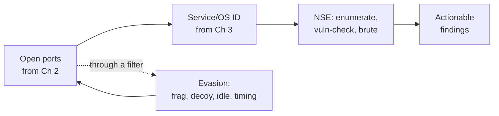
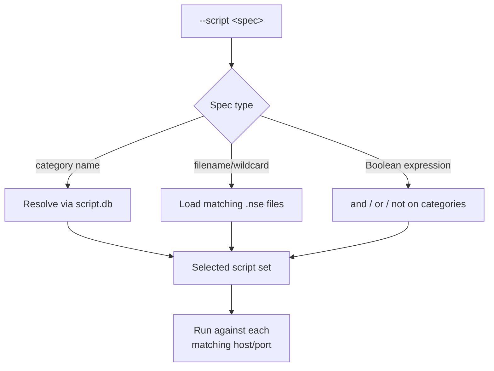
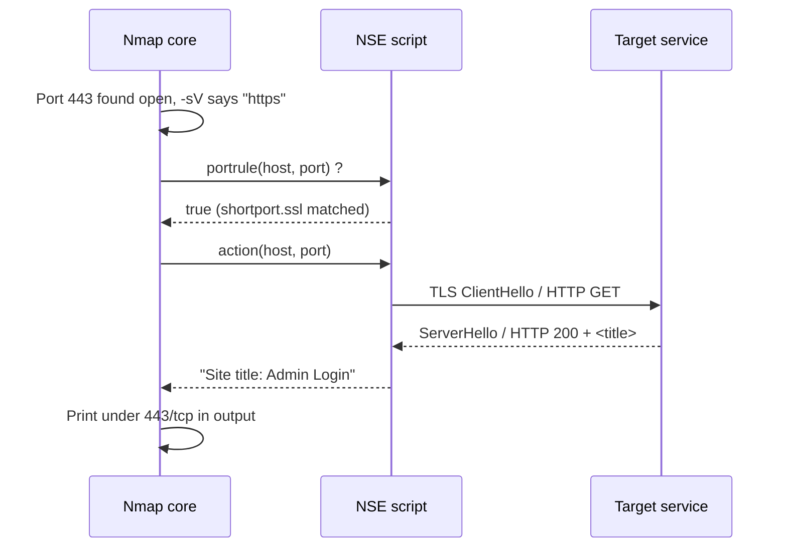
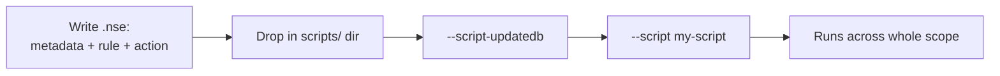
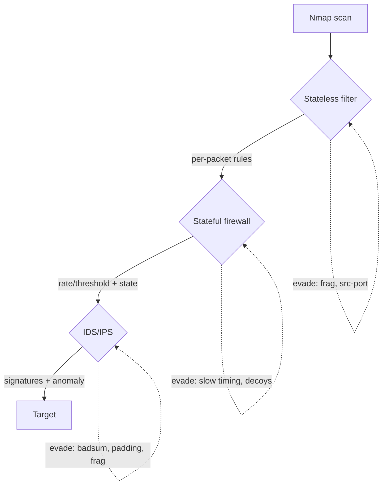
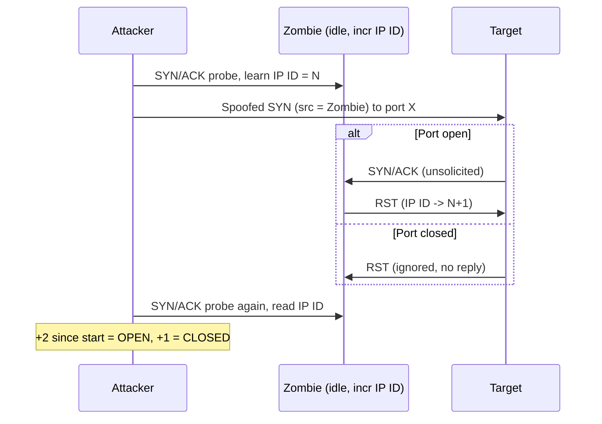

**Level:** Advanced · **Track:** Penetration Testing · **Read time:** 230 min

This is Chapter 4 of the Scanning & Enumeration notebook and the last of three chapters on Nmap. Chapter 2 taught the scan types — how Nmap finds open ports at the packet level. Chapter 3 turned open ports into identified software, operating systems and timing-tuned scans. This chapter covers the two capabilities that separate an operator who *runs* Nmap from one who *wields* it: the **Nmap Scripting Engine (NSE)**, which pushes Nmap from a port scanner into a lightweight vulnerability scanner, enumerator, brute-forcer and exploitation platform; and **firewall/IDS evasion**, the packet-level techniques for getting a scan through filtering and signature detection without being blocked or flagged.

These two topics belong together because they sit at opposite ends of the same tension. NSE makes your scanning louder, deeper and more intrusive — a single `--script vuln` run can fire hundreds of probes and trip every alert on the network. Evasion makes your scanning quieter and harder to attribute. Real engagements are a constant negotiation between the two: enumerate enough to be useful, but not so loudly that you're detected before you've finished. Understanding both — and understanding exactly how a defender sees each one — is what lets you make that trade deliberately instead of by accident.

Everything here is active and, in the case of NSE `intrusive`/`exploit` scripts and evasion probes, can be disruptive or unlawful against systems you don't own. NSE scripts can brute-force logins, trigger denial-of-service conditions, and change target state. Evasion techniques like source-IP spoofing and idle scanning implicate third-party hosts. Scope and written authorisation are hard boundaries, covered in the methodology chapters and assumed throughout. Every intrusive example below is flagged as such.



---

## Part 1: What NSE Is and Why It Exists

By the end of Chapter 3 you could take a bare IP and produce "nginx 1.18.0 on Ubuntu 22.04, TLS 1.3 on 443, OpenSSH 8.9 on 22." That's a fingerprint. The next questions are operational: *Does that SSH allow password auth? Is that TLS config vulnerable to Heartbleed? What SMB shares are exposed? Which of these versions maps to a known CVE?* Answering those by hand — one `openssl` here, one `smbclient` there, one manual banner grab — is slow and inconsistent. The **Nmap Scripting Engine** exists to fold all of that into the same scan that found the ports.

NSE is an embedded **Lua** interpreter inside Nmap, plus a library of scripts (files ending in `.nse`) that run against the hosts and ports Nmap discovers. Introduced around Nmap 4.50 (2007) and steadily expanded, it ships today with **600+ scripts** covering discovery, version probing beyond `-sV`, safe vulnerability checks, brute-forcing, default-credential testing, and even a few outright exploits. Because scripts run inside Nmap, they inherit its target selection, timing engine, parallelism and output formats for free — a script author writes the logic for *one* host/port and Nmap runs it across the whole scope at scale.

Three things make NSE worth learning deeply rather than copy-pasting one-liners:

- **It's a force multiplier on enumeration.** `nmap --script "smb-enum-*" <host>` enumerates shares, users, sessions, groups and domains in one command. That would otherwise be five tools.
- **It's how Nmap does vuln scanning.** With `--script vuln` and the third-party `vulners`/`vulscan` scripts, Nmap becomes a first-pass vulnerability scanner that maps detected versions to CVEs.
- **It's extensible.** When no script exists for a niche service, you can write one in ~30 lines of Lua and it immediately runs at Nmap's scale. Bug-bounty hunters and red teamers routinely ship small custom NSE checks for a specific target's tech stack.

**Security relevance (both sides):** to an attacker, NSE is the fastest path from "port open" to "here's the weakness." To a defender, that same speed is why NSE scans are so noisy and so detectable — a topic Part 12 treats in full. Knowing what NSE fires on the wire is the first step to catching it.

---

## Part 2: The NSE Architecture — Lua, Categories, and the Script Database

NSE is built from a handful of moving parts. Understanding them turns "which script do I run?" into "I know exactly what this script does and when it runs."

### The Lua runtime

Scripts are written in **Lua**, a small, fast, embeddable scripting language. You don't need to master Lua to *use* NSE, but you do to write scripts (Part 8). Nmap bundles the interpreter, so there's nothing extra to install. Alongside the interpreter, Nmap ships a large set of **NSE libraries** (`nselib/`) — reusable Lua modules for HTTP, SMB, SSL, DNS, brute-forcing, credential storage, and so on. A well-written script is mostly glue over these libraries.

### Where scripts live

On a standard Kali/Debian install, scripts and their supporting data live under:

```
/usr/share/nmap/scripts/          # the .nse script files (600+)
/usr/share/nmap/nselib/           # Lua libraries the scripts import
/usr/share/nmap/scripts/script.db # the compiled index (name -> categories)
```

`script.db` is a generated index that maps every script to its categories, so Nmap can resolve category names like `vuln` to a concrete list of scripts without opening every file. You regenerate it with `--script-updatedb` (Part 7).

### The seven categories

Every script declares one or more **categories**. Categories are how you run scripts in bulk without naming each one, and — critically — how you avoid running dangerous ones by accident. There are seven you must know cold:

| Category | What it does | Safe to run unattended? |
|----------|--------------|--------------------------|
| `auth` | Tests authentication, finds ways to bypass it (not brute force) | Generally yes |
| `broadcast` | Discovers hosts by sending broadcast probes on the local net | Yes, LAN only |
| `brute` | Brute-forces credentials against services (SSH, FTP, MySQL, HTTP...) | **No — intrusive, can lock accounts** |
| `default` | The scripts run by `-sC` / `-A`; curated as safe, useful, fast, non-intrusive | Yes |
| `discovery` | Actively enumerates more about the target (SMB shares, SNMP, DNS SRV) | Usually yes |
| `dos` | Tests for / triggers denial-of-service conditions | **No — can crash the target** |
| `exploit` | Actively exploits a vulnerability | **No — changes target state, needs explicit authz** |
| `external` | Sends data to a third-party service (e.g. Shodan, whois DBs) | Caution — leaks target info off-network |
| `fuzzer` | Sends malformed data to find bugs | **No — intrusive, slow, can crash** |
| `intrusive` | May crash services, use lots of resources, or otherwise be detected/disruptive | **No — by definition risky** |
| `malware` | Checks whether the target is already infected/backdoored | Yes (read-only checks) |
| `safe` | Designed not to crash services, use huge resources, or exploit — read-only-ish | Yes |
| `version` | Extends `-sV`; only runs under version detection | Yes |
| `vuln` | Checks for specific known vulnerabilities, reports if present | Mostly yes, some overlap with intrusive |

The two that matter most for discipline are **`safe`** and **`intrusive`** — they are (roughly) opposites, and every script leans one way. The golden rule of engagement scanning: **know a script's categories before you run it**, and never fire `brute`, `dos`, `exploit`, or `fuzzer` without explicit written authorisation for that specific activity.



**Blue team usage:** the category taxonomy is also a defender's cheat sheet. If your IDS logs show a burst of SMB, SNMP and NetBIOS enumeration followed by credential attempts, you're watching `discovery` → `brute` — a textbook NSE-driven enumeration sweep.

---

## Part 3: Anatomy of an NSE Script — The Rule and the Action

To use NSE well (and to read the source when a script behaves unexpectedly), you need the shape of a script. Every `.nse` file has the same skeleton: **metadata**, one **rule**, and one **action**.

Here's the top of the real `http-title` script, trimmed and annotated:

```lua
-- HEAD: metadata fields Nmap reads for --script-help and output
description = [[
Shows the title of the default page of a web server.
]]

author = "Diman Todorov"
license = "Same as Nmap--See https://nmap.org/book/man-legal.html"
categories = {"default", "discovery", "safe"}   -- <-- the categories from Part 2

-- Import NSE libraries
local http = require "http"
local shortport = require "shortport"
local stdnse = require "stdnse"

-- THE RULE: when should this script run?
portrule = shortport.http           -- run only on ports Nmap thinks are HTTP

-- THE ACTION: what does it do when the rule matches?
action = function(host, port)
  local resp = http.get(host, port, "/")
  -- ...extract <title>...
  return title
end
```

Two structural pieces decide everything:

### The rule — *when* the script fires

A script declares exactly one of these rule functions, and it must return `true` for the script to run:

| Rule | Fires… | Used by |
|------|--------|---------|
| `prerule` | once, before any host is scanned | broadcast/discovery scripts (`dns-brute`, `targets-*`) |
| `hostrule(host)` | once per host, after scan | host-level checks that aren't tied to one port |
| `portrule(host, port)` | once per matching open port | the vast majority — HTTP, SMB, SSH checks |
| `postrule` | once, after all hosts scanned | scripts that aggregate results across hosts |

The `shortport` library gives ready-made port rules: `shortport.http`, `shortport.ssl`, `shortport.port_or_service(3306, "mysql")`. This is why `http-title` runs on 80, 443, 8080 and anything `-sV` identified as HTTP — without the author hardcoding a port list.

### The action — *what* it does

The `action` function receives the host (and port, for portrules), does its work using NSE libraries, and returns a string/table that Nmap prints under the port in the scan output. If it returns `nil`, nothing is printed — which is why scripts that find "nothing interesting" stay quiet.



Understanding rule-vs-action also explains a common surprise: **a script you named with `--script` may print nothing because its rule never matched.** If `ssl-heartbleed` returns nothing, it's usually because the port wasn't identified as TLS — run with `-sV` so the port rule can match.

---

## Part 4: Selecting and Running Scripts

There are five ways to tell Nmap which scripts to run, in increasing order of control. All use the `--script` flag (there's no separate "run scripts" switch beyond the shortcuts below).

### The shortcuts: `-sC` and `-A`

```bash
nmap -sC 10.10.10.10          # run the "default" category scripts
nmap -A  10.10.10.10          # aggressive: -sV + -O + -sC + traceroute
```

`-sC` is equivalent to `--script default`. `-A` bundles version detection, OS detection, default scripts and traceroute. `-A` is the "tell me everything, I don't care about noise" button — great for CTF boxes and authorised internal scans, wrong for a stealthy engagement.

### By category

```bash
nmap --script vuln 10.10.10.10                 # all vuln-check scripts
nmap --script "discovery,safe" 10.10.10.10     # union of two categories
```

### By name and wildcard

```bash
nmap --script http-title 10.10.10.10           # one named script
nmap --script "smb-enum-*" 10.10.10.10         # every smb-enum-* script
nmap --script "http-*" 10.10.10.10             # every http script (can be a LOT)
```

### By Boolean expression

This is the professional's selector — it lets you say "run vuln checks but nothing intrusive":

```bash
nmap --script "vuln and safe" 10.10.10.10          # vuln scripts that are also safe
nmap --script "default and not http-*" 10.10.10.10 # defaults minus http noise
nmap --script "(discovery or version) and safe" 10.10.10.10
```

The operators are `and`, `or`, `not`, with parentheses. Category names and filename globs both work as operands. **This is the single most useful NSE skill for real engagements** — it's how you get depth without accidentally launching a `brute` or `dos` script.

### Full script-selection reference

| Selector form | Example | Meaning |
|---------------|---------|---------|
| Category | `--script vuln` | all scripts in the category |
| Multiple categories | `--script "auth,discovery"` | union |
| Filename | `--script http-title` | one script (`.nse` optional) |
| Wildcard | `--script "ftp-*"` | glob on filename |
| Directory | `--script /path/to/dir` | all `.nse` in a dir |
| Boolean | `--script "vuln and not intrusive"` | logical filter over categories |
| `all` | `--script all` | **every** script — very slow, includes intrusive/dos, rarely wanted |

**Red team usage:** on engagements, default to named scripts or `"... and safe"` Boolean selections. `--script all` and `--script vuln` unfiltered are for lab boxes; on a client network they can crash fragile services (printers, ICS, legacy appliances) and light up every alert.

---

## Part 5: Script Arguments — `--script-args`, `args-file`, and Debugging

Many scripts take parameters: credentials to try, a username list, an HTTP path, a timeout. You pass these with `--script-args`.

```bash
# Single arg
nmap --script http-title --script-args http.useragent="Mozilla/5.0" 10.10.10.10

# Multiple args, comma-separated
nmap --script http-brute \
     --script-args 'userdb=/tmp/users.txt,passdb=/tmp/pass.txt,http-brute.path=/login' \
     -p 80 10.10.10.10

# Namespaced args: script-specific vs library-wide
#   http.useragent   -> the http library (applies to all http scripts)
#   http-brute.path  -> just the http-brute script
```

Two conventions to internalise:

- **Namespacing.** `library.arg` (e.g. `http.useragent`, `smbdomain`) sets a value for a whole NSE library and affects every script using it. `script-name.arg` (e.g. `http-brute.path`) targets one script. When both could apply, the more specific wins.
- **`unsafe=1`.** Some scripts refuse to do risky things unless you pass `unsafe=1` (e.g. certain DoS/exploit checks). That flag is a deliberate speed bump — it means "yes, I accept this may harm the target."

For long or reusable arg sets, use a file:

```bash
# args.txt
http.useragent=corp-scanner/1.0
userdb=/opt/wordlists/users.txt
passdb=/opt/wordlists/pass-top100.txt

nmap --script http-brute --script-args-file args.txt -p 80 10.10.10.10
```

### Discovering a script's arguments

Never guess. Every script documents its args:

```bash
nmap --script-help http-brute        # description, categories, and ALL args
```

Example output (trimmed):

```
http-brute
Categories: brute intrusive
https://nmap.org/nsedoc/scripts/http-brute.html
  Performs brute force password auditing against http basic, digest and form
  based authentication.
  Arguments:
    http-brute.path     Path to point the tests against. Default: /
    http-brute.method   The HTTP method. Default: GET
    userdb, passdb      Username/password lists (from the brute library)
    brute.mode          user, pass, or creds
```

### Debugging a misbehaving script

When a script prints nothing or errors, escalate verbosity:

```bash
nmap --script ssl-heartbleed -sV -d 10.10.10.10        # -d = debug (repeat for more: -dd, -d3)
nmap --script ssl-heartbleed -sV --script-trace 10.10.10.10  # log every packet the script sends
```

`--script-trace` is invaluable — it shows the exact bytes a script sends and receives, which is how you confirm *why* a vuln check came back negative (wrong port state, TLS not negotiated, service filtered).

---

## Part 6: The High-Value Scripts — A Working Catalogue

You will not memorise 600 scripts. You will memorise ~30 that do 90% of the work. This is that set, grouped by job, with real commands and the kind of output they produce.

### Discovery / enumeration

```bash
# SMB: the single richest enumeration target on Windows networks
nmap -p445 --script "smb-os-discovery,smb-enum-shares,smb-enum-users,smb-security-mode" 10.10.10.10

# SMB protocol/dialect + signing (feeds relay decisions)
nmap -p445 --script smb2-security-mode,smb2-capabilities 10.10.10.10

# DNS zone transfer — one misconfig away from the whole internal map
nmap -p53 --script dns-zone-transfer --script-args dns-zone-transfer.domain=corp.local 10.10.10.10

# SNMP: often community "public", leaks interfaces, processes, software
nmap -sU -p161 --script "snmp-info,snmp-interfaces,snmp-processes" 10.10.10.10

# HTTP surface
nmap -p80,443 --script "http-title,http-headers,http-methods,http-enum,http-robots.txt" 10.10.10.10
```

Annotated `smb-os-discovery` output:

```
445/tcp open  microsoft-ds
| smb-os-discovery:
|   OS: Windows Server 2019 Standard 17763 (Windows Server 2019 Standard 6.3)
|   Computer name: DC01
|   NetBIOS computer name: DC01\x00
|   Domain name: corp.local
|   Forest name: corp.local
|   FQDN: DC01.corp.local
|_  System time: 2026-10-10T14:03:11+00:00
```

That single script just handed you the hostname, OS build, domain and forest — the spine of an Active Directory engagement.

### Safe vulnerability checks

```bash
nmap -p443 --script ssl-heartbleed -sV 10.10.10.10          # CVE-2014-0160
nmap -p443 --script ssl-poodle 10.10.10.10                  # CVE-2014-3566 (SSLv3)
nmap -p445 --script smb-vuln-ms17-010 10.10.10.10           # EternalBlue check (safe, read-only)
nmap -p445 --script smb-vuln-ms08-067 10.10.10.10           # legacy but still found on old boxes
nmap --script vuln 10.10.10.10                              # the whole vuln category
```

`smb-vuln-ms17-010` positive output — this is what "you have EternalBlue" looks like:

```
| smb-vuln-ms17-010:
|   VULNERABLE:
|   Remote Code Execution vulnerability in Microsoft SMBv1 servers (ms17-010)
|     State: VULNERABLE
|     IDs:  CVE:CVE-2017-0143
|     Risk factor: HIGH
|_    A critical remote code execution vulnerability exists in ... SMBv1
```

### CVE mapping with `vulners`

The bundled `vuln` category is curated and finite. To map *any* detected version to CVEs, the third-party **vulners** script queries the Vulners.com database using the `-sV` service/version output:

```bash
# vulners ships with recent Nmap; if missing, drop vulners.nse into /usr/share/nmap/scripts and --script-updatedb
nmap -sV --script vulners 10.10.10.10
```

Sample output for an old OpenSSH:

```
22/tcp open  ssh  OpenSSH 7.2p2 Ubuntu 4ubuntu2.10
| vulners:
|   cpe:/a:openbsd:openssh:7.2p2:
|       CVE-2016-10009   7.5   https://vulners.com/cve/CVE-2016-10009
|       CVE-2016-10012   7.2   https://vulners.com/cve/CVE-2016-10012
|_      CVE-2016-8858    7.8   https://vulners.com/cve/CVE-2016-8858
```

Note vulners is **`external`** — it sends the detected CPEs to Vulners.com. On a red-team engagement that leaks target software off-network; only use it when scope permits. **Bug-bounty angle:** on programs where you're enumerating a large host list, `-sV --script vulners` over the open web ports is a fast first pass to flag obviously outdated software worth manual follow-up.

### Brute force and default credentials — intrusive, authorised only

```bash
# These are category "brute" + "intrusive". They send login attempts and can lock accounts.
nmap -p22  --script ssh-brute   --script-args userdb=users.txt,passdb=pass.txt 10.10.10.10
nmap -p3306 --script mysql-brute 10.10.10.10
nmap -p21  --script ftp-brute   10.10.10.10
nmap --script "http-default-accounts" -p80 10.10.10.10   # tests known vendor default creds
```

Treat everything in this block as a live attack. Account-lockout policies mean an unauthorised `ssh-brute` can lock out real users — a denial of service you'll have to explain.

### High-value NSE quick-reference

| Job | Script(s) | Port(s) | Category | Notes |
|-----|-----------|---------|----------|-------|
| SMB OS/host | `smb-os-discovery` | 445 | discovery,safe | hostname, domain, build |
| SMB shares/users | `smb-enum-shares`, `smb-enum-users` | 445 | discovery,intrusive | may need creds |
| EternalBlue | `smb-vuln-ms17-010` | 445 | vuln,safe | read-only check |
| TLS Heartbleed | `ssl-heartbleed` | 443 | vuln,safe (unsafe opt) | needs `-sV` |
| TLS cipher audit | `ssl-enum-ciphers` | 443 | discovery,safe | grades config |
| HTTP surface | `http-enum`, `http-title`, `http-methods` | 80,443 | discovery | dir/known-app enum |
| CVE mapping | `vulners` | any (`-sV`) | external,safe | leaks CPEs off-net |
| DNS transfer | `dns-zone-transfer` | 53 | discovery,intrusive | full zone dump if misconfigured |
| SNMP leak | `snmp-info`, `snmp-brute` | 161/udp | discovery/brute | try `public`/`private` |
| Brute (any) | `*-brute` | varies | brute,intrusive | **authorised only** |

---

## Part 7: Keeping NSE Current — Updating Scripts and the DB

Two maintenance commands matter.

```bash
# Rebuild the category index after adding/removing scripts (fast, local)
sudo nmap --script-updatedb

# Update the vulners DB / third-party scripts is manual: drop the .nse in place, then updatedb
sudo cp vulners.nse /usr/share/nmap/scripts/
sudo nmap --script-updatedb
```

`--script-updatedb` reads every `.nse` in the scripts directory, extracts its `categories` table, and rewrites `script.db`. You run it whenever you **add a new script** (a custom one, or a community script like `vulscan`/`vulners`) so that category and wildcard selection can find it. It does *not* download anything — Nmap script updates come with Nmap upgrades (`sudo apt update && sudo apt upgrade nmap` on Kali) or from the git repo.

To install popular community script packs:

```bash
# vulscan (offline CVE DB lookup, alternative to vulners)
sudo git clone https://github.com/scipag/vulscan /usr/share/nmap/scripts/vulscan
sudo nmap --script-updatedb
nmap -sV --script vulscan/vulscan.nse 10.10.10.10
```

**IR / blue-team note:** defenders should track which NSE version their own authorised scanners run, because script behaviour (and the packets on the wire) changes between Nmap releases — a signature tuned to one version's `http-enum` requests may miss another's.

---

## Part 8: Writing Your Own NSE Script (From Zero)

The moment no existing script fits — a bespoke API on a client's app, a custom banner you want to grab at scale — you write one. Here is a complete, working script built line by line. It grabs the HTTP `Server` header from any web port and flags a specific vulnerable version string.

Save as `/usr/share/nmap/scripts/http-server-flag.nse`:

```lua
-- 1) METADATA: printed by --script-help, used by category selection
description = [[
Grabs the HTTP Server response header and flags a known-bad version.
]]

author     = "notebook"
license    = "Same as Nmap--See https://nmap.org/book/man-legal.html"
categories = {"discovery", "safe"}

-- 2) IMPORTS: pull in NSE libraries we need
local http      = require "http"
local shortport = require "shortport"
local stdnse    = require "stdnse"

-- 3) THE RULE: run on anything that looks like HTTP/HTTPS
portrule = shortport.http

-- 4) THE ACTION: executed once per matching open port
action = function(host, port)
  -- send a GET / and capture the response
  local resp = http.get(host, port, "/")
  if not resp or not resp.header then
    return nil                       -- nothing to say; stay quiet
  end

  local server = resp.header["server"]
  if not server then
    return "No Server header"
  end

  -- flag a made-up vulnerable version for the demo
  if server:find("BadServer/1.0") then
    return string.format("Server: %s  [!!] KNOWN-VULNERABLE", server)
  end

  return "Server: " .. server
end
```

Register and run it:

```bash
sudo nmap --script-updatedb                       # index the new script
nmap --script http-server-flag -p80,443 10.10.10.10
```

Expected output:

```
80/tcp  open  http
|_http-server-flag: Server: nginx/1.18.0
443/tcp open  https
|_http-server-flag: Server: BadServer/1.0  [!!] KNOWN-VULNERABLE
```

What you just used:

- **`http.get(host, port, path)`** — the HTTP library does the whole request/response for you, including TLS on 443.
- **`shortport.http`** — the port rule that matches HTTP-ish ports without hardcoding numbers.
- **`stdnse`** — imported here for good habit; it provides logging (`stdnse.debug1(...)`), string helpers and structured output. Real scripts lean on it heavily.

From this skeleton you can build genuinely useful checks: swap `http.get` for a specific vulnerable endpoint, parse a JSON body, test a header for a misconfiguration. Thirty lines, running at Nmap's scale across a `/16`. **This is the bug-bounty superpower** — encode "the one weird thing about this target's stack" into a script and sweep the whole scope for it.



---

## Part 9: How Firewalls and IDS/IPS Actually Detect Scans

Evasion is meaningless without knowing what you're evading. There are three defensive layers a scan runs into, and each detects differently — which is why each has different countermeasures.

### Stateless packet filters

The simplest firewalls apply rules to individual packets: "allow tcp/443 to this host, drop everything else." They have no memory of connections. They're easy to map (an `-sA` ACK scan tells you which ports are filtered) and don't "detect" scanning as an event — they just drop or allow. **Fragmentation** and **source-port** tricks target this layer, because a stateless filter may mis-handle fragments or trust traffic from port 53/80.

### Stateful firewalls

These track connection state (the TCP handshake, established flows). They block SYNs to closed ports and can be configured with **threshold rules**: "if one source sends SYNs to >20 ports in 10 seconds, log/drop it." This is where scan *rate* becomes the tell. **Timing evasion** (`-T0/-T1`, `--scan-delay`, `--max-rate`) and **decoys** (`-D`) target this layer — slowing down to stay under the threshold, or hiding your real IP in a crowd.

### IDS/IPS — signature and anomaly engines

Snort, Suricata and Zeek inspect traffic against signatures and behavioural rules. They flag:

- **Known scan signatures** — e.g. the exact flag combination of a NULL/FIN/Xmas scan (`sid:2100469` and friends in the ET ruleset), Nmap's default probe payloads, the `-A` OS-detection probe sequence.
- **Anomalies** — many ports from one source, RST storms, half-open connections that never complete.

An **IPS** doesn't just alert — it can drop or reset your connection mid-scan. This is why bad-checksum probes, fragmentation and payload padding exist: to change the *bytes* enough that a signature doesn't match, and to test whether a device is doing deep inspection at all.



The honest truth stated up front: **against a modern, well-tuned IDS/IPS, Nmap's built-in evasion is not invisibility.** These techniques were designed largely against 2000s-era signature engines. Today they're best understood as *ways to reduce your signal, probe how the defence behaves, and complicate attribution* — not a cloak. Part 12 closes the loop by showing exactly how a defender catches each one.

---

## Part 10: The Evasion Toolkit — Every Technique, at the Packet Level

This is the core reference. Each technique gets: what it does, the flag, the packet-level mechanism, and where it actually helps.

### Packet fragmentation — `-f`, `--mtu`

```bash
nmap -f 10.10.10.10             # split into 8-byte-data fragments
nmap -ff 10.10.10.10            # 16-byte fragments (two -f)
nmap --mtu 24 10.10.10.10       # custom fragment size (multiple of 8)
```

**Mechanism:** Nmap chops each probe's IP payload across multiple fragments. A firewall or IDS that doesn't **reassemble** fragments before inspection sees only slivers of the TCP header and may fail to match a rule that expects, say, a SYN to port 445 in one packet. Modern stateful devices and IDS reassemble fragments, so this mostly works against older/naive filtering. `--mtu` must be a multiple of 8.

### Decoy scans — `-D`

```bash
nmap -D 10.0.0.5,10.0.0.6,ME,10.0.0.7 10.10.10.10   # ME = your real position in the list
nmap -D RND:10 10.10.10.10                            # 10 random decoy source IPs
```

**Mechanism:** Nmap sends the scan probes multiple times, each spoofed to appear to come from a decoy IP, interleaving your real source among them. The target's logs and the IDS see the scan arriving from, say, 11 sources at once — yours is one needle in that haystack, so attribution is harder. **Important caveats:** the decoy IPs should be *live* (a dead decoy can itself be a tell, and can trigger the target to complain to the wrong party); decoys don't hide you from anyone doing packet-level source verification at the first hop; and they do nothing to reduce the *volume* of your traffic. Decoys are about **attribution**, not stealth of volume.

### Source-IP spoofing — `-S` (with `-e`)

```bash
nmap -S 10.0.0.9 -e eth0 -Pn 10.10.10.10    # claim to be 10.0.0.9, force interface eth0
```

**Mechanism:** rewrite the source IP of your probes entirely. The catch is fundamental: **you won't see the replies** — they go to the spoofed address, not you. So `-S` alone can't read scan results unless you're positioned to sniff the return path (same broadcast segment, or you control the spoofed host). It's used for **idle scanning** (below), for confusing attribution, and in labs. You almost always pair it with `-e <iface>` (choose the sending interface) and `-Pn` (skip host discovery, which spoofing breaks).

### Idle / zombie scan — `-sI`

The most elegant evasion Nmap ships: scan a target **without ever sending it a packet from your real IP**, by bouncing off a third "zombie" host and reading the target's response *through the zombie's IP ID counter*.

```bash
nmap -sI 192.168.1.50 10.10.10.10          # zombie = 192.168.1.50
nmap -sI 192.168.1.50:80 10.10.10.10       # specify a port on the zombie
```

**Mechanism (the IP ID side channel):**

1. Find a zombie with a **predictable, incrementing global IP ID** and low traffic (idle). Test with `nmap -O -v <zombie>` or the `ipidseq` script.
2. Probe the zombie to learn its current IP ID (call it *N*).
3. Send a **spoofed SYN to the target**, forged to look like it came from the zombie.
4. If the target's port is **open**, it replies SYN/ACK to the zombie; the zombie, unsolicited, replies RST — **incrementing its IP ID** to *N+2*.
5. If the port is **closed**, the target sends RST to the zombie, which ignores it — IP ID stays *N+1* (from your own re-probe).
6. Probe the zombie again. IP ID jumped by 2 → port open. Jumped by 1 → closed.



The target's logs show the **zombie** as the scanner, never you. The technique's requirements — a genuinely idle host with predictable IP ID — are increasingly rare on modern OSes (randomised IP IDs killed most zombies), which is why `-sI` is now more a CTF/lab classic and a beautiful teaching tool than an everyday method. **CTF angle:** idle scan appears regularly in HTB/CTF network challenges where a printer or IoT device makes a perfect zombie.

### Source-port manipulation — `--source-port` / `-g`

```bash
nmap --source-port 53 10.10.10.10      # or: nmap -g 53 ...
nmap -g 88 10.10.10.10                 # pose as Kerberos, etc.
```

**Mechanism:** some misconfigured firewalls trust traffic *from* certain ports (53/DNS, 20/FTP-data, 88/Kerberos) regardless of destination, a legacy of stateless allow-rules. Sourcing your scan from port 53 can walk straight through such a rule. Easy to try, occasionally magic against old gear.

### Data padding & custom payloads — `--data-length`, `--data`, `--data-string`

```bash
nmap --data-length 25 10.10.10.10                 # append 25 random bytes to each probe
nmap --data 0xdeadbeef 10.10.10.10                # append specific hex payload
nmap --data-string "corp scan window 2-4am" 10.10.10.10  # append ASCII (also: mark authorised scans!)
```

**Mechanism:** Nmap's default probes have recognisable, often *empty* payloads that signatures match on. Appending random or custom data changes the packet's size and content, defeating naive length/content signatures. `--data-string` has a legitimate second use: **labelling your traffic** so a client's SOC can identify your authorised scan in their logs.

### Bad checksums — `--badsum`

```bash
nmap --badsum 10.10.10.10
```

**Mechanism:** send packets with a deliberately **invalid TCP/UDP checksum**. A normal host's network stack silently drops these, so *any reply you get back came from something that didn't validate the checksum* — typically an IDS/IPS or firewall inspecting/responding to traffic. `--badsum` is thus less an evasion and more a **detection tool for detection tools**: it reveals the presence of inline inspection devices.

### MAC spoofing, TTL, IP options

```bash
nmap --spoof-mac Cisco 10.10.10.10        # random MAC with a Cisco OUI (LAN only)
nmap --spoof-mac 0 10.10.10.10            # fully random MAC
nmap --ttl 64 10.10.10.10                 # set IP TTL (fingerprint/OS-mimic tweaks)
nmap --ip-options "L 192.168.1.1" 10.10.10.10   # loose source routing (mostly blocked today)
```

`--spoof-mac` only affects the local segment (MACs don't cross routers) but can dodge MAC-based ACLs or muddy LAN attribution. `--ip-options` source routing is almost universally dropped now but is worth knowing for legacy/CTF contexts.

### Timing as evasion — `-T0/-T1`, `--scan-delay`, `--max-rate`

The most reliable "evasion" against threshold-based detection is simply **being slow**:

```bash
nmap -T0 10.10.10.10                       # paranoid: ~5 min between probes, serial
nmap -T1 10.10.10.10                       # sneaky: ~15s between probes
nmap --scan-delay 10s 10.10.10.10          # explicit fixed delay between probes
nmap --max-rate 5 10.10.10.10              # cap at 5 packets/sec globally
```

**Mechanism:** stateful firewalls and IDS anomaly rules key off *rate* — N ports in M seconds. Drop under that threshold and the burst that would have alerted becomes background noise spread over hours. The cost is time: a `-T0` full scan can take **days**. This is the one evasion that genuinely still works against modern threshold detection — at the price of patience.

### Proxying — `--proxies` (limited)

```bash
nmap --proxies http://127.0.0.1:8080 -sT 10.10.10.10   # route TCP-connect scans through a proxy chain
```

Support is partial (TCP connect scans, HTTP/SOCKS proxies) and it's more about routing/attribution than IDS evasion, but it's the mechanism for scanning through a foothold or a proxy chain.

### Evasion technique matrix

| Technique | Flag | Targets which layer | Still effective today? | Key limitation |
|-----------|------|---------------------|------------------------|----------------|
| Fragmentation | `-f`, `--mtu` | stateless filter, naive IDS | Rarely (modern devices reassemble) | Reassembly defeats it |
| Decoys | `-D` | attribution in logs/IDS | Partially | Doesn't cut volume; needs live decoys |
| Source spoof | `-S` | attribution | Only if you can sniff replies | Can't see replies alone |
| Idle/zombie | `-sI` | full source hiding | Rarely (needs predictable IP ID) | Idle predictable-IPID host scarce |
| Source port | `-g/--source-port` | misconfigured stateless rules | Sometimes | Only vs trust-by-port configs |
| Data padding | `--data-length/--data` | length/content signatures | Sometimes | Deep inspection sees through |
| Bad checksum | `--badsum` | reveals inline inspectors | As a *probe*, yes | Not stealth; a detector-detector |
| MAC spoof | `--spoof-mac` | LAN MAC ACLs/attribution | LAN only | Doesn't cross routers |
| Slow timing | `-T0/-T1`, `--scan-delay` | rate/threshold detection | **Yes** | Extremely slow |

---

## Part 11: Three Hands-On Labs

All labs assume an authorised target you control (a lab VM, HTB/THM box, or your own network). Commands are real and reproducible.

### Lab A — NSE enumeration of a Windows host

Goal: from a single IP, produce a full SMB profile and a vuln verdict.

```bash
# 1) Confirm the port is open and identify the service
nmap -p445 -sV 10.10.10.40

# 2) Enumerate SMB safely (OS, shares, security mode)
nmap -p445 --script "smb-os-discovery,smb-security-mode,smb2-security-mode,smb-enum-shares" 10.10.10.40

# 3) Check for the big SMB vuln, read-only
nmap -p445 --script smb-vuln-ms17-010 10.10.10.40
```

Annotated result:

```
445/tcp open  microsoft-ds Windows Server 2008 R2 microsoft-ds
| smb-os-discovery:
|   OS: Windows Server 2008 R2 Standard 7601 Service Pack 1
|   Computer name: WIN-SRV08
|_  Domain name: (workgroup: WORKGROUP)
| smb-security-mode:
|   message_signing: disabled (dangerous, but default)   <-- relay-friendly
| smb-vuln-ms17-010:
|   VULNERABLE: Remote Code Execution (ms17-010)
|_    CVE:CVE-2017-0143  Risk: HIGH
```

Reading it: SMB signing **disabled** (NTLM relay is viable) *and* MS17-010 **vulnerable** (EternalBlue). Two independent paths to code execution, found in three commands. **Red team usage:** this is often the entire "initial access" phase on a legacy internal box.

### Lab B — CVE mapping across a scope

Goal: flag outdated software on a range without touching each host by hand.

```bash
# Version-detect the common web/remote ports across a /27 and map to CVEs
nmap -sV -p22,80,443,3389 --script vulners --script-args mincvss=7.0 10.10.10.0/27 -oA scope-cve
```

`--script-args mincvss=7.0` tells vulners to only report CVEs scoring ≥7.0, cutting noise. `-oA` saves normal/XML/greppable output for reporting. Snippet:

```
Nmap scan report for 10.10.10.12
22/tcp open ssh OpenSSH 7.2p2 Ubuntu
| vulners:
|   cpe:/a:openbsd:openssh:7.2p2:
|_      CVE-2016-8858  7.8  https://vulners.com/cve/CVE-2016-8858
Nmap scan report for 10.10.10.19
443/tcp open ssl/http Apache httpd 2.4.29
| vulners:
|_      CVE-2021-44790 9.8  https://vulners.com/cve/CVE-2021-44790
```

Post-process the greppable file to build a findings table:

```bash
grep -H "CVE-" scope-cve.nmap | awk '{print $1, $NF}'   # quick host->CVE list
```

Remember vulners is `external` — only run it where sending CPEs off-network is in scope.

### Lab C — Evasion against a filtered target

Goal: probe how a firewall/IDS behaves and get a scan through, using stacked techniques. Do this only against your own lab firewall.

```bash
# 1) Baseline: is inline inspection present? Bad-checksum probe.
nmap --badsum -p80,443 10.10.10.60
#    Any "open" reply to a bad checksum => an inline device answered, not the host.

# 2) Map what the filter allows with an ACK scan (stateless-filter mapping)
nmap -sA -p1-1000 10.10.10.60

# 3) Stealthy, stacked scan: slow timing + fragmentation + decoys + trusted source port
sudo nmap -sS -T2 -f -D RND:5 -g 53 --data-length 20 -p80,443,445 -Pn 10.10.10.60

# 4) If you have an idle host, try a zombie scan (zero packets from your real IP)
nmap -sI 10.10.10.61 -p80,445 10.10.10.60
```

Annotated reasoning for step 3: `-sS` (half-open, quieter than connect), `-T2` (under rate thresholds), `-f` (fragment past naive inspection), `-D RND:5` (5 decoys to muddy attribution), `-g 53` (pose as DNS in case of a trust-by-port rule), `--data-length 20` (defeat empty-payload signatures), `-Pn` (skip discovery so nothing pre-alerts). Each flag targets a specific layer from Part 9. Observe the difference in what gets through versus a plain `-sS`, and — crucially — go read the firewall/IDS logs afterward (next part) to see exactly what you *did* leave behind.

---

## Part 12: Detection & Defense Angle

Everything above is only half the picture. A security engineer's real value is knowing how each of these techniques looks from the defender's chair — because that's how you both catch attackers and set realistic expectations for your own "stealthy" scans.

### Detecting NSE activity

NSE scans are **loud by design**. Each script fires real protocol traffic, so on the wire an NSE sweep looks like a rapid, machine-paced sequence of full application-layer transactions from one source:

- **Volume + pattern:** dozens of distinct HTTP requests to enumeration paths (`/admin`, `/robots.txt`, `/.git/`) in seconds is the signature of `http-enum`. SMB enumeration shows a burst of Tree Connects and RPC calls. Zeek's `http.log` and `smb_files.log` capture these directly.
- **Brute force:** `*-brute` scripts generate a flood of authentication failures — the single most reliable IDS trigger. A Suricata rule on "N failed logins from one source in M seconds," or Windows Event ID **4625** clustering, catches it immediately.
- **Known payloads:** vuln-check scripts send recognisable probe bytes (the Heartbleed heartbeat request, the MS17-010 trans2 probe). ET Open and commercial rulesets ship signatures for these exact payloads (e.g. Heartbleed `sid` in the ET ruleset).

**Blue-team response:** alert on failed-auth clustering, enumeration-path hits, and rate anomalies from single sources. Rate-limit and account-lockout policies blunt `brute`. Egress filtering catches `external` scripts phoning home.

### Detecting evasion — each technique's tell

| Evasion attempt | How the defender catches it |
|-----------------|----------------------------|
| `-f`/`--mtu` fragmentation | IDS with fragment reassembly (Suricata `defrag`, Zeek) flags "tiny fragments" / overlapping fragments as an anomaly; Snort `frag3` preprocessor alerts |
| `-D` decoys | Decoys arrive from many IPs but **share TTL, timing and packet fingerprint**; correlation shows one real origin. The scan volume is still fully present |
| `-S` spoofing | Anti-spoofing at the router (uRPF, BCP38) drops packets whose source doesn't match the ingress path before they arrive |
| `-sI` idle scan | The **zombie** shows anomalous unsolicited RSTs; the target sees a scan "from the zombie," and correlation with the zombie's owner exposes it. Randomised IP IDs on modern OSes break it outright |
| `-g 53`/source-port | A DNS source port opening TCP SYNs to 445 is itself anomalous; stateful firewalls that track real sessions ignore the trick |
| `--data-length`/padding | Behavioural/anomaly detection keys on connection *pattern*, not payload length, so padding doesn't hide the scan shape |
| `--badsum` | Generating invalid checksums is itself a flaggable anomaly; and it only *reveals* inspectors rather than evading them |
| Slow timing `-T0/-T1` | The hardest to catch in real time, but **log aggregation over long windows** (SIEM correlation across hours/days) still surfaces "one source touched 900 ports over 2 days" |

### The defender's toolset

- **Zeek** (`conn.log`, `notice.log`) excels at surfacing scan *behaviour*: a source touching many hosts/ports produces `Scan::Address_Scan` and `Scan::Port_Scan` notices regardless of evasion flags, because it reasons about the connection graph, not individual packet signatures. This is why anomaly/behavioural detection beats packet tricks.
- **Suricata/Snort** carry signatures for specific scan types (NULL/FIN/Xmas flag combos, known NSE payloads) and preprocessors (`frag3`, stream reassembly) that neutralise fragmentation.
- **Firewall logs + SIEM** correlate low-and-slow scans across long windows and multiple sources (defeating decoys by fingerprint correlation).
- **Honeypots / honeytokens** turn scanning into an alert: any touch of an unused IP or a fake service is high-confidence malicious.

**The one honest takeaway:** signature-level evasion (fragmentation, source port, padding, bad checksums) is largely obsolete against modern reassembling, behaviour-aware defences. **Behavioural evasion — being genuinely slow and low-volume — is the only thing that reliably still works**, and even that yields to patient SIEM correlation. Plan engagements accordingly: assume a competent SOC will eventually see you, and use evasion to buy time and complicate attribution, not to be invisible.

---

## Part 13: Common Pitfalls

- **Running `--script vuln` or `--script all` on production.** These include intrusive checks that can crash fragile services (printers, ICS/SCADA, legacy appliances). Use Boolean selection (`"vuln and safe"`) and clear it with the client first.
- **Firing `*-brute` without authorisation.** Account-lockout policies turn an unauthorised brute into a self-inflicted denial of service against real users. `brute` is a distinct authorisation item.
- **Forgetting `-sV` before vuln scripts.** Many scripts' port rules require the port to be identified (TLS, HTTP). Without `-sV`, `ssl-heartbleed` and friends silently do nothing. If a script prints nothing, add `-sV` and `--script-trace` to see why.
- **Leaking with `external` scripts.** `vulners`, `http-shodan-api`, whois scripts send target data to third parties. On a red team that's an OPSEC leak; in some scopes it's a contract violation.
- **Trusting `-O`/decoy stealth on switched networks.** Decoys and spoofing don't survive anti-spoofing (uRPF/BCP38) and first-hop verification. Test assumptions in the lab, not on the engagement.
- **`--mtu` not a multiple of 8.** Nmap requires it; a non-multiple errors out. `-f` = 8-byte data, `-ff` = 16.
- **Expecting idle scan to "just work."** Modern randomised IP IDs mean most hosts are useless zombies. Verify with `ipidseq` / `nmap -O -v` first; "Incremental" IP ID sequence is required.
- **Assuming slow = safe.** `-T0` reduces *rate* alerts but a SIEM correlating over days still catches you. Slowness buys time, not invisibility.

---

## Part 14: Final Revision / Summary

- **NSE** is a Lua engine embedded in Nmap with 600+ scripts that turn a port scan into enumeration, vuln-checking, brute-forcing and CVE mapping — running at Nmap's scale and inheriting its timing/output.
- Every script has **metadata, one rule** (`prerule`/`hostrule`/`portrule`/`postrule`) that decides *when* it runs, and an **action** that decides *what* it does.
- **Categories** (`safe`, `intrusive`, `vuln`, `brute`, `discovery`, `dos`, `exploit`, `external`, `auth`...) are how you select scripts in bulk and — more importantly — avoid dangerous ones. Boolean selection like `--script "vuln and safe"` is the professional default.
- Learn ~30 high-value scripts (SMB enum, `smb-vuln-ms17-010`, `ssl-*`, `http-enum`, `vulners`) rather than memorising all 600.
- You can **write your own** NSE script in ~30 lines of Lua (metadata → rule → action → `--script-updatedb`), which is the bug-bounty force multiplier.
- **Evasion** targets three defensive layers: stateless filters (fragmentation, source-port), stateful firewalls (slow timing, decoys), and IDS/IPS (bad-checksum probing, padding, fragmentation). Idle scan (`-sI`) hides your IP entirely via the IP-ID side channel — when a predictable-IP-ID zombie exists.
- The honest reality: **behavioural evasion (slow, low-volume) is the only thing that reliably still works** against modern reassembling, behaviour-aware defences. Signature tricks mostly reveal or reduce signal rather than granting invisibility.
- Everything intrusive — `brute`, `dos`, `exploit`, spoofing, idle-scan third parties — needs explicit written authorisation. Scope is a hard boundary.

The next chapter moves from Nmap to **Masscan and RustScan** — the high-speed scanners you reach for when Nmap's thoroughness is too slow for internet-scale or very large internal scopes.

---

## Part 15: Cheat Sheet / Quick Reference

```bash
# --- NSE selection ---
nmap -sC <t>                                  # default category scripts
nmap -A  <t>                                  # -sV + -O + -sC + traceroute
nmap --script vuln <t>                        # all vuln-check scripts
nmap --script "vuln and safe" <t>             # vuln checks, nothing intrusive
nmap --script "smb-enum-*" <t>                # wildcard by filename
nmap --script "default and not http-*" <t>    # Boolean exclusion
nmap --script-help <name>                     # docs + arguments for a script
nmap --script <name> --script-args k=v,k2=v2  # pass arguments
nmap --script <name> --script-args-file f.txt # args from a file
sudo nmap --script-updatedb                   # re-index after adding scripts
nmap --script <name> -sV --script-trace <t>   # debug: see packets sent/recv

# --- High-value scripts ---
nmap -p445 --script smb-os-discovery,smb-enum-shares,smb-vuln-ms17-010 <t>
nmap -p443 --script ssl-heartbleed,ssl-enum-ciphers -sV <t>
nmap -p80,443 --script http-enum,http-title,http-methods <t>
nmap -sU -p161 --script snmp-info,snmp-brute <t>
nmap -sV --script vulners --script-args mincvss=7.0 <t>   # CVE map (external!)

# --- Evasion ---
nmap -f <t>                     # fragment (8-byte); -ff = 16-byte
nmap --mtu 24 <t>               # custom fragment (multiple of 8)
nmap -D RND:10 <t>              # 10 random decoys ; -D ip1,ME,ip2
nmap -S <spoof_ip> -e eth0 -Pn <t>   # spoof source IP (can't see replies)
nmap -sI <zombie> <t>           # idle/zombie scan (needs incr IP ID)
nmap -g 53 <t>                  # source port 53 (--source-port)
nmap --data-length 25 <t>       # pad probes with random bytes
nmap --data-string "authz scan" <t>  # label authorised scans
nmap --badsum <t>               # reveal inline inspection devices
nmap --spoof-mac 0 <t>          # random MAC (LAN only)
nmap -T0 <t> / --scan-delay 10s / --max-rate 5   # slow = real threshold evasion

# --- Zombie hunting for idle scan ---
nmap -O -v <candidate>                        # look for "IP ID Sequence: Incremental"
nmap --script ipidseq <candidate>             # dedicated IP-ID predictability check
```

| Task | Command |
|------|---------|
| Safe deep enum | `nmap -sV -sC <t>` |
| Vuln first-pass | `nmap -sV --script "vuln and safe" <t>` |
| CVE mapping | `nmap -sV --script vulners <t>` (external) |
| Stealthy scan | `sudo nmap -sS -T2 -f -D RND:5 -g 53 --data-length 20 -Pn <t>` |
| Detect inspectors | `nmap --badsum <t>` |
| Zero-IP scan | `nmap -sI <zombie> <t>` |
| Write+run script | drop `.nse` → `nmap --script-updatedb` → `nmap --script my <t>` |

---

## Part 16: Practice Labs & Resources

Train these exact skills, not generic scanning:

- **TryHackMe — "Nmap Live Host Discovery" and "Nmap Advanced Port Scans"** (Jr Penetration Tester path): the Advanced room drills fragmentation, decoys, source-port, spoofing and idle scan hands-on, with a firewall to actually evade.
- **TryHackMe — "Nmap" / "Nmap Post Port Scans"**: covers NSE script selection, `--script-args`, and reading script output on real services.
- **HackTheBox — Starting Point (e.g. "Dancing", "Included") and easy boxes with SMB/RPC**: practice `smb-enum-*` and `smb-vuln-ms17-010` as a genuine entry vector; Windows boxes like "Blue" are literally MS17-010.
- **HackTheBox Academy — "Network Enumeration with Nmap" module**: the definitive guided walkthrough of scan types, NSE, and firewall/IDS evasion with a graded lab.
- **VulnHub — boxes with a front-facing firewall** (many "Kioptrix"/"Basic Pentesting" images): rehearse evasion flags where a real filter sits in front.
- **Write an NSE script:** pick a service on any lab box, and encode one check into a `.nse` following Part 8. Then run it across a `/24` of your lab.
- **Set up a detection lab:** run **Suricata** (ET Open ruleset) or **Zeek** on a mirror port and re-run every scan/evasion command from Part 11 against a target behind it. Reading your *own* scans in `notice.log`, `http.log` and Suricata alerts is the fastest way to internalise Part 12 — you'll see exactly which "evasion" flags changed nothing.
- **Reference:** the NSEDoc portal (nmap.org/nsedoc) lists every bundled script with arguments and examples; `/usr/share/nmap/scripts/` is the source of truth on your own box.

> **Ethics and lawful-use reminder.** Every technique in this chapter is active and, in the case of `brute`/`dos`/`exploit` scripts, source spoofing and idle scanning, can disrupt services and implicate third-party hosts. Run them only against systems you own or have explicit written authorisation to test, and only within the categories the authorisation covers. `brute`, `dos`, `exploit` and third-party-involving evasion are each distinct authorisation items — a signed scoping document that permits "scanning" does not automatically permit brute-forcing logins or bouncing an idle-scan off someone else's server.

### Practice questions

1. You run `nmap --script ssl-heartbleed 10.10.10.10` and get no output, but you're sure the host serves HTTPS on 443. Give two distinct reasons the script produced nothing and the single flag most likely to fix it.
2. Explain, in terms of the IP ID counter, how an idle scan distinguishes an **open** port from a **closed** port on the target — and state the one property a candidate zombie must have.
3. A stateful firewall alerts on "20+ SYNs to distinct ports from one source in 10 seconds." Which single Nmap evasion category defeats this most reliably, and what is its cost? Why do fragmentation and decoys *not* defeat it?
4. Write the one-line `--script` Boolean expression that runs every vulnerability check **except** anything that could brute-force or crash the target, and explain each operand.
5. Your client's SOC uses Zeek. Explain why `-D RND:10` and `-f` will not hide your scan from Zeek's scan-detection notices, and name the one class of evasion that still degrades Zeek's confidence (and why).

---

*Also on [Praneeth's portfolio](https://ping-praneeth.vercel.app/notebook/pentest-scanning-enum/04-nmap-part-3-nse-scripting-engine-and-firewall-ids-evasion), with comments and the latest edits.*
