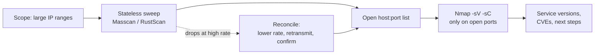
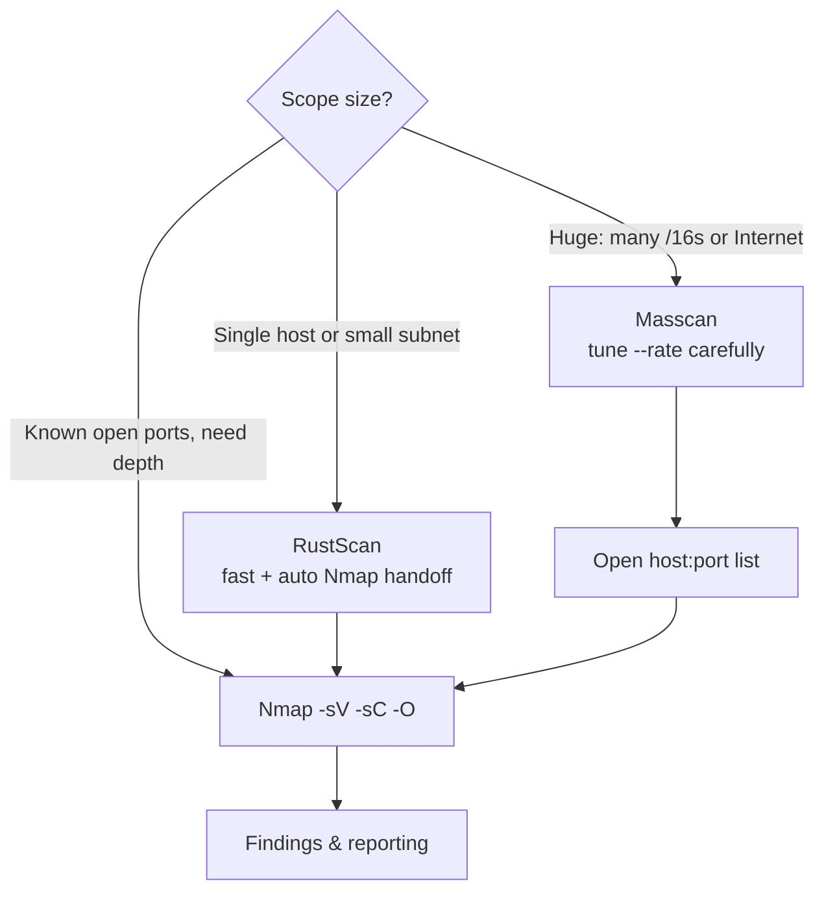
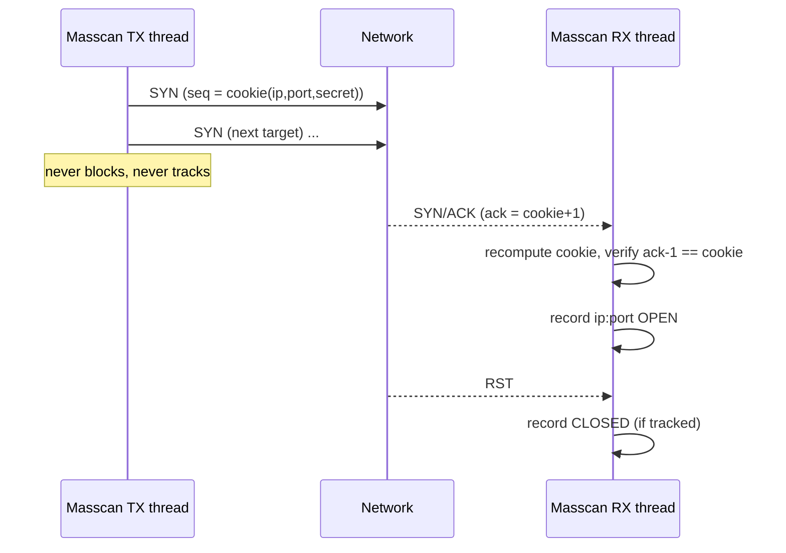
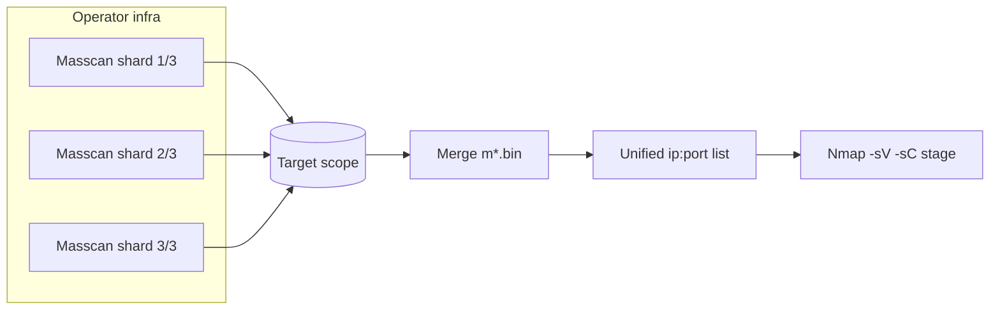
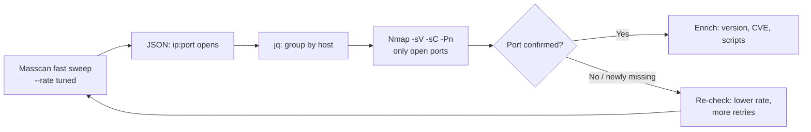

**Level:** Advanced · **Track:** Penetration Testing · **Read time:** 230 min

This is Chapter 5 of the Scanning & Enumeration notebook. The previous four chapters built a complete Nmap operator: Chapter 1 established the host-discovery methodology, and Chapters 2 through 4 took Nmap from scan types through service/OS detection and timing all the way to the scripting engine and firewall evasion. Nmap is the right tool almost every time — precise, feature-rich, endlessly scriptable. But it has one weakness that becomes fatal at scale: it is *stateful* and, by default, slow. Point Nmap at a `/16` (65,536 hosts) across all 65,535 TCP ports and you are asking it to track tens of millions of connection states; the scan can run for days.

This chapter is about the two tools that solve that problem: **Masscan**, the asynchronous, stateless scanner that can transmit at millions of packets per second and sweep the entire IPv4 Internet in minutes given enough bandwidth; and **RustScan**, a modern, ergonomic front-end that finds open ports extremely fast and then *hands them to Nmap* for the deep work. Neither replaces Nmap. They change *where the time goes*: instead of spending days finding open ports, you spend seconds finding them and then point Nmap only at what's actually listening.

The core discipline of the chapter is not speed — it's **honesty about accuracy**. A stateless scanner that transmits faster than the network or the target can absorb will silently drop replies and report closed ports that are actually open. A fast wrong answer is worse than a slow right one. Everything below teaches the speed *and* the reconciliation step that keeps the speed trustworthy.

Everything here is active scanning. Masscan at high rates is, from the target's point of view, indistinguishable from a SYN flood; source-spoofing and Internet-wide scanning implicate third parties and, in most jurisdictions, are unlawful without authorisation. Scope, a written rules-of-engagement document, and a correct exclude file are hard boundaries, assumed throughout and called out explicitly where the risk is highest.



---

## Part 1: Why Nmap Alone Doesn't Scale — The Stateful Bottleneck

To understand why Masscan and RustScan exist, you have to understand exactly *what* makes Nmap slow on large scopes. It is not sloppy code — Nmap is superbly engineered. The slowness is inherent in being **stateful and careful**.

When Nmap sends a SYN probe, it records that probe in a data structure so it can match the eventual reply (SYN/ACK, RST, or nothing) back to the specific host and port, retransmit if a reply is lost, and adapt its timing. It runs a congestion-control loop very similar to TCP's own: it ramps parallelism up when replies come back cleanly and backs off when they don't. This is what makes Nmap's results *reliable* — it notices dropped packets and resends them — but it means Nmap must hold state for every outstanding probe, and it deliberately paces itself to avoid overwhelming the target.

Do the arithmetic on a large scope. A single Class B network is 65,536 addresses. All 65,535 TCP ports on each is roughly **4.29 billion probes**. Even at an optimistic sustained 10,000 probes/second — already aggressive for stateful Nmap on a real network — that is over 4,900 minutes, or about **3.4 days**, and that's before retransmissions, service detection, or the fact that Nmap's default timing (`-T3`) is far more conservative than 10k pps.

Stateless scanning breaks the arithmetic by refusing to hold state. Masscan does not remember which probes it sent. Instead it encodes the identity of each probe *into the probe itself* using a cryptographic trick (Part 3), so that when a reply arrives it can reconstruct which host and port it belongs to without a lookup table. That single design decision removes the per-probe memory cost and the congestion-control feedback loop, and lets a transmit thread do nothing but pour packets onto the wire as fast as the NIC allows.

The table below frames the trade precisely. Speed is bought with accuracy risk and lost features — you get raw open/closed at the SYN level and (optionally) a banner, and nothing else.

| Property | Nmap (stateful) | Masscan / RustScan (fast/stateless-style) |
| --- | --- | --- |
| State tracking | Per-probe table, retransmit, congestion control | None (Masscan) / minimal adaptive (RustScan) |
| Typical safe rate | Hundreds–low thousands pps on a real net | Tens of thousands to millions pps (Masscan) |
| Accuracy at high rate | Self-correcting (resends lost probes) | Degrades silently unless rate is tuned |
| Service/version detection | Yes (`-sV`, `-sC`, NSE) | No (Masscan banners are raw; RustScan hands off to Nmap) |
| OS detection | Yes (`-O`) | No |
| Best role | Deep enumeration of known-open ports | Rapidly *finding* open ports across huge scopes |
| Output richness | 5 formats, XML, greppable, NSE data | List/JSON/greppable (Masscan), Nmap output (RustScan) |

The strategic conclusion, which drives the rest of this chapter, is a **two-stage pipeline**: use a fast scanner to find the tiny fraction of open ports across a huge address space, then unleash Nmap's depth *only on those*. You get Masscan's speed and Nmap's intelligence, and you never pay for stateful scanning across dead address space.

**Red team usage:** the pipeline is also an OPSEC decision. A short, tuned fast sweep followed by targeted Nmap generates far less total traffic than blindly running `nmap -p- -sV` across a scope, which lowers your detection footprint even though the fast sweep is individually louder per second.

**Blue team usage:** knowing this pipeline exists tells you what an attacker's recon looks like on the wire — a very short, very high-rate SYN burst (the fast sweep) followed minutes later by a small number of hosts receiving full-feature Nmap probes. Detecting the first stage is Part 12.

---

## Part 2: The Fast-Scanning Landscape — Where Each Tool Fits

Before diving into any single tool, it helps to place them. "High-speed scanning" is a small family, and picking the wrong member wastes time or gives wrong answers.

- **Masscan** — the raw speed engine. Its own userland TCP/IP stack, asynchronous transmit/receive, designed originally to scan the entire Internet. Best when the scope is *huge* (many `/16`s, or Internet-wide) or when you need to control the exact packet rate. Steepest learning curve and the most ways to shoot yourself in the foot (spoofing, wrong exclude file, saturating a link).
- **RustScan** — the ergonomic accelerator. Written in Rust, it finds open ports fast on a *host or modest range* and then automatically pipes them into Nmap for service detection. Best default for per-host and small-subnet work on CTF boxes, single targets, and typical internal engagements. Much friendlier; less suited to Internet-scale sweeps than Masscan.
- **Nmap** — still the destination for depth. In this chapter it is the *second stage* — the thing the fast scanners feed.
- **Honourable mentions you'll meet:** `zmap` (another stateless Internet-scale scanner, one port at a time, research-oriented), `unicornscan` (older asynchronous scanner, largely superseded), and `naabu` (a Go-based fast port scanner from ProjectDiscovery that, like RustScan, is built to feed other tools). We focus on Masscan and RustScan because together they cover the whole speed/ergonomics spectrum and are the two you'll actually reach for.



A useful rule of thumb: **choose the fast scanner by how much address space is dead.** Across a `/8` almost everything is dead, so Masscan's ability to blast through empty space at a controlled rate wins. Against one HackTheBox target, nothing is "dead" — you just want the open ports and their versions with minimum fuss, so RustScan's Nmap handoff wins.

---

## Part 3: How Masscan Works Internally — Statelessness and SYN Cookies

Masscan is worth understanding at the mechanism level, because its speed *and* its failure modes both come directly from its architecture.

### 3.1 Its own TCP/IP stack

Masscan does not use the operating system's network stack for scanning. The kernel's stack is stateful and general-purpose; going through it (via normal sockets) caps you at tens of thousands of packets per second because of per-packet overhead, socket bookkeeping, and the kernel's own connection tracking (conntrack) getting in the way. Masscan instead crafts raw Ethernet frames and, for maximum speed, can transmit through **PF_RING ZC** or similar zero-copy drivers, bypassing the kernel almost entirely. This is why Masscan can reach millions of pps on suitable hardware, and why the OS firewall may see the *incoming* RST/SYN-ACK replies as unsolicited (the kernel never opened those connections) and try to send its own RSTs — a quirk we handle in Part 6.

### 3.2 Asynchronous transmit and receive

A normal scanner sends a probe and waits for the reply before (or while carefully tracking) sending the next. Masscan splits the job into **two independent threads**:

- The **transmit thread** does nothing but generate and send SYN packets as fast as the configured rate allows. It never waits for replies.
- The **receive thread** does nothing but listen for incoming SYN/ACK (open) and RST (closed) packets and record them.

Because the two threads don't coordinate per-probe, there's no state table and no congestion feedback. The transmit thread just marches through the address×port space in a randomised order (Part 3.4) at the requested rate.



### 3.3 The SYN-cookie trick — statelessness without amnesia

Here is the clever part. If Masscan keeps no record of what it sent, how does it know, when a SYN/ACK arrives, that *it* sent the corresponding SYN — and to which port? A random reply, or a reply spoofed by a defender, shouldn't be trusted.

The answer is a **SYN cookie**. When TCP opens a connection, the client puts a 32-bit *initial sequence number* (ISN) in its SYN. The server's SYN/ACK acknowledges it by returning `ISN + 1` in the acknowledgement field. Masscan exploits this: it sets the ISN of each outgoing SYN to a keyed hash of the destination:

```
ISN = SipHash(dst_ip, dst_port, src_ip, src_port, secret_key)
```

The `secret_key` is random per run. When a SYN/ACK comes back, Masscan takes the packet's fields, recomputes the same hash, and checks whether the returned acknowledgement equals `hash + 1`. If it matches, this is genuinely a reply to a SYN Masscan sent, and the destination IP/port are trustworthy. If it doesn't match, the packet is noise or a spoofed injection and is discarded. The identity of the probe is thus **carried inside the probe** and reconstructed on return — statelessness without amnesia, and with tamper-resistance for free.

**Blue team relevance:** this is also why naive "tarpit" or SYN/ACK-spraying defences don't fool Masscan into false positives — replies that don't carry the right cookie are dropped. Conversely, it means an operator can't easily distinguish a real open port from a middlebox that faithfully completes handshakes; that reconciliation is Part 9.

### 3.4 Randomised target order

Masscan does not scan `10.0.0.1`, then `.2`, then `.3`. It permutes the entire address×port space using an encrypted index (a keyed blackrock/Feistel permutation) so that consecutive packets hit *different* networks. This spreads load — you're not hammering one subnet's switch or one target's conntrack table all at once — and it makes the scan far less obvious as a linear sweep. You can reproduce a given ordering with `--seed`, which matters for `--shard` (Part 7).

### 3.5 The consequence: rate is everything

Because there's no congestion control, **Masscan sends exactly as fast as you tell it and never slows down for dropped packets.** If you set `--rate 1000000` on a link that can carry 100,000 pps, 90% of your probes (and replies) are dropped by the network, and Masscan will confidently report huge swaths of the scope as having no open ports. This is the single most important thing to internalise: *Masscan's accuracy is your responsibility, expressed through `--rate`.* Part 8 and Part 9 are entirely about getting this right.

---

## Part 4: Installing Masscan (From Zero)

Masscan is a C program with a tiny dependency footprint (libpcap). It is not always in the default repositories at a recent version, so building from source is common and painless.

### 4.1 On Kali / Debian / Ubuntu

The packaged version works for most uses:

```bash
sudo apt update
sudo apt install -y masscan
masscan --version
```

Expected output:

```
Masscan version 1.3.2 ( https://github.com/robertdavidgraham/masscan )
Compiled on: ...
Compiler: gcc ...
OS: Linux
CPU: x86_64 (64 bits)
GIT version: ...
```

### 4.2 Building from source (to get the newest version and features)

```bash
sudo apt install -y git make gcc libpcap-dev clang
git clone https://github.com/robertdavidgraham/masscan
cd masscan
make -j"$(nproc)"          # -j uses all CPU cores to compile faster
sudo make install          # installs to /usr/local/bin/masscan
which masscan && masscan --version
```

Flag/command notes for the newcomer:

- `git clone <url>` downloads the source repository.
- `make -j"$(nproc)"` compiles; `-j N` runs N parallel jobs and `$(nproc)` substitutes your CPU core count.
- `sudo make install` copies the built binary into a system path so you can run `masscan` from anywhere.

### 4.3 Why it needs root

Masscan crafts and sends raw packets, which requires elevated privilege. You will run it under `sudo`. To avoid always using sudo you can grant the raw-network capability to the binary once:

```bash
sudo setcap cap_net_raw,cap_net_admin,cap_net_bind_service+ep "$(which masscan)"
```

- `setcap` sets Linux *capabilities* — fine-grained slices of root power — on a file.
- `cap_net_raw` allows crafting raw packets; `cap_net_admin` allows network-admin operations; `+ep` makes them *effective* and *permitted*.

This is safer than running the whole process as root, but on a shared box think about who can then invoke it.

---

## Part 5: Masscan Core Usage — Your First Scans, Flag by Flag

Masscan's command line deliberately mimics Nmap's where it can, so much will look familiar. But the semantics differ, and the differences bite.

### 5.1 The minimal scan

```bash
sudo masscan 10.10.10.0/24 -p80,443 --rate 1000
```

Breaking every part down:

- `10.10.10.0/24` — the target range in CIDR. Masscan accepts CIDR, ranges (`10.10.10.1-10.10.10.50`), and multiple targets separated by spaces or commas.
- `-p80,443` — ports to scan. Comma-separated list, ranges with a dash (`-p1-1000`), everything with `-p0-65535`. Note: Masscan uses `-p0-65535`; it does **not** accept Nmap's `-p-` shorthand, a classic gotcha.
- `--rate 1000` — transmit rate in *packets per second*. This is the throttle. 1000 pps is gentle and safe almost anywhere.

Typical annotated output:

```
Starting masscan 1.3.2 (http://bit.ly/14GZzcT) at 2026-...
 -- forced options: -sS -Pn -n --randomize-hosts -v --send-eth
Initiating SYN Stealth Scan
Scanning 256 hosts [2 ports/host]
Discovered open port 443/tcp on 10.10.10.5
Discovered open port 80/tcp on 10.10.10.5
Discovered open port 80/tcp on 10.10.10.12
rate:  0.00-kpps, 100.00% done, waiting 10-secs, found=3
```

Two things to notice. First, the "forced options" line tells you Masscan is *always* doing a SYN scan (`-sS`), never resolving DNS (`-n`), treating hosts as up (`-Pn`), and randomising order — these aren't defaults you can meaningfully change the way you can in Nmap. Second, the final `waiting 10-secs` is Masscan honouring `--wait` (Part 6.3): after the transmit thread finishes, it keeps listening for late replies.

### 5.2 UDP scanning

```bash
sudo masscan 10.10.10.0/24 -pU:53,161,123 --rate 1000
```

- `-pU:53,161,123` — the `U:` prefix marks UDP ports. You can mix: `-p80,443,U:53,U:161`. UDP scanning is far less reliable statelessly (no handshake; open often looks identical to filtered), so treat UDP results as *leads to confirm with Nmap*, never as ground truth.

### 5.3 The essential rate flags

| Flag | Meaning | When to use |
| --- | --- | --- |
| `--rate <pps>` | Target transmit rate, packets/sec | Always set explicitly — don't rely on defaults |
| `--max-rate <pps>` | (Newer builds) hard ceiling on rate | Belt-and-braces to prevent overshoot |
| `--wait <sec>` | Seconds to keep listening after TX finishes (default 10; `--wait 0` to exit immediately, `forever` to never stop) | Raise on high-latency/slow links so late SYN/ACKs aren't missed |
| `--retries <n>` | (Newer builds) retransmit each probe n times | Improve accuracy at cost of speed; see Part 9 |

### 5.4 Rate intuition

A rough, practical ladder for choosing `--rate` (validated more rigorously in Part 8):

- **100–1,000 pps** — safe on essentially any network, including production, without noticeable impact. Start here on client engagements.
- **1,000–10,000 pps** — fine on a healthy switched LAN or a well-provisioned uplink; watch for accuracy loss.
- **10,000–100,000 pps** — needs a fast, uncongested path; a home/office router or a cheap firewall's conntrack table will choke and you'll lose replies (and possibly knock the device over).
- **100,000+ pps** — data-centre / dedicated-uplink territory, and genuinely disruptive to most targets. Reserve for scopes and links you *know* can take it.

**Ethics/authorisation note:** rate is not just an accuracy knob, it's a *harm* knob. High rates can exhaust a firewall's state table and cause an outage — a denial of service you did not intend. On any engagement, agree a maximum rate in the rules of engagement and stay under it.

---

## Part 6: Masscan Configuration, Exclude Files, and Output

Real Masscan usage is driven by config files, disciplined exclusions, and structured output — not one-off command lines.

### 6.1 The exclude file — the most important safety control

Masscan will scan *exactly* what you tell it, including networks that are in scope's CIDR but must never be touched (a client's SCADA subnet, a shared provider gateway, your own management network). The exclude file prevents this:

```bash
# excludes.txt
192.168.50.0/24      # client OT/SCADA - DO NOT SCAN
10.0.0.1             # gateway
169.254.0.0/16       # link-local
```

```bash
sudo masscan 10.0.0.0/8 -p0-65535 --rate 5000 --excludefile excludes.txt
```

- `--excludefile <file>` — every address matched here is removed from the scan, and this takes precedence over the target range.

Masscan ships a hardwired reminder of why this matters: the project's own README recounts scans that hit systems they shouldn't have. **Blue/defensive framing:** if you are *authorising* a scan of your own estate, you can also use masscan's `--excludefile` to protect fragile devices during a self-assessment.

The single most damaging mistake with Masscan is scanning `0.0.0.0/0` (the whole Internet) by accident, or scanning a client's public range that actually resolves to a shared cloud provider's address space you have no authority over. Masscan even *refuses* to run against `0.0.0.0/0` unless you also pass an exclude file, precisely because so many people have made that mistake.

### 6.2 Config files and resuming

Any command line can be captured as a config file, which is the professional way to run reproducible scans:

```bash
sudo masscan 10.10.0.0/16 -p0-65535 --rate 10000 --echo > scan.conf
```

- `--echo` prints the equivalent config file to stdout instead of scanning; redirect it to a file.

`scan.conf` will look like:

```
rate = 10000.00
ports = 0-65535
range = 10.10.0.0/16
```

Run it with:

```bash
sudo masscan -c scan.conf --output-format grepable --output-filename scan.gnmap
```

- `-c <file>` loads a config file.

If a scan is interrupted (Ctrl-C, crash, or `--wait` timeout), Masscan writes `paused.conf`. Resume exactly where you left off:

```bash
sudo masscan --resume paused.conf
```

This is a lifesaver on multi-hour Internet-scale scans.

### 6.3 Banners — grabbing a little service info

Masscan can go one step past open/closed and grab a service banner, which requires it to actually complete the TCP handshake (using the *kernel* stack for that one connection) and read the first bytes the service sends:

```bash
sudo masscan 10.10.10.0/24 -p80,443,22 --banners --rate 1000
```

- `--banners` — after finding a port open, complete the handshake and capture the banner (HTTP response line, SSH version string, etc.).

Crucial caveat: because the kernel didn't open these connections, the OS may send RST packets that tear them down before Masscan reads the banner. The fix is to stop the kernel from interfering by blocking outbound RSTs from the source port Masscan uses, or by binding Masscan to a source IP the kernel doesn't own:

```bash
# Prevent kernel RSTs from killing masscan banner grabs (example)
sudo iptables -A OUTPUT -p tcp --tcp-flags RST RST -j DROP
```

Then remove the rule afterward. Masscan's docs describe this; for serious banner work, RustScan→Nmap or Nmap `-sV` is usually cleaner. Treat `--banners` as a bonus, not the primary source of version info.

### 6.4 Output formats

| Flag | Format | Notes |
| --- | --- | --- |
| `-oL <file>` | List (plain text) | Simple `open tcp 80 <ip> <ts>` lines |
| `-oG <file>` | Grepable | Nmap-like greppable; easy to `awk` |
| `-oX <file>` | XML | Machine-parseable, feeds other tools |
| `-oJ <file>` | JSON | Modern pipelines, `jq`-friendly |
| `-oB <file>` | Binary | Masscan's compact native format; convert later with `--readscan` |
| `--output-format <fmt> --output-filename <f>` | Any of the above | Verbose equivalent |

The binary format deserves a mention: for enormous scans, write binary (fast, compact) and convert afterwards:

```bash
sudo masscan 10.0.0.0/8 -p443 --rate 20000 -oB scan.bin
masscan --readscan scan.bin -oJ scan.json   # convert binary → JSON offline, no scanning
```

- `--readscan <file>` reads a previously saved binary result and re-emits it in another format without touching the network.

Extracting just `ip:port` for the Nmap stage is a one-liner from grepable output:

```bash
awk '/open/{print $NF": "$4}' scan.gnmap   # rough; JSON+jq is more robust
```

---

## Part 7: Distributing Masscan — Rate, Shards, and Multiple Machines

Two mechanisms let Masscan scale beyond one box or one link.

### 7.1 Sharding

`--shard X/Y` splits the *entire* target×port space into Y equal pieces and scans only piece X. Run each shard on a different machine, all with the **same `--seed`**, and together they cover the whole scope with no overlap:

```bash
# Machine 1
sudo masscan 10.0.0.0/8 -p0-65535 --rate 100000 --seed 12345 --shard 1/3 -oB m1.bin
# Machine 2
sudo masscan 10.0.0.0/8 -p0-65535 --rate 100000 --seed 12345 --shard 2/3 -oB m2.bin
# Machine 3
sudo masscan 10.0.0.0/8 -p0-65535 --rate 100000 --seed 12345 --shard 3/3 -oB m3.bin
```

- `--shard X/Y` — this instance handles shard X of Y.
- `--seed <n>` — fixes the permutation so all shards agree on the partition. **All shards must share the seed** or they'll overlap and miss.

Three machines at 100k pps each ≈ 300k pps aggregate, cutting wall-clock time to a third.

### 7.2 Interface, source, and routing controls

For fast scans you often need to be explicit about the network path:

| Flag | Purpose |
| --- | --- |
| `-e <iface>` / `--interface <if>` | Choose the NIC to send from |
| `--source-ip <ip>` | Source address (must be routable back to you unless spoofing on-link) |
| `--source-port <p>` | Fix source port (useful with the RST-drop iptables trick) |
| `--router-mac <mac>` | Specify the gateway MAC directly, skipping ARP (needed with some zero-copy setups) |
| `--adapter-ip / --adapter-mac` | Manually set L2/L3 identity when Masscan can't auto-detect |

```bash
sudo masscan 10.10.0.0/16 -p0-65535 --rate 25000 -e eth0 --source-port 61000
```



**Red team usage:** sharding across several cheap cloud instances (each a distinct source IP) both speeds the scan and distributes it across source addresses, which complicates a defender's attribution and per-source rate-limiting. This is powerful and correspondingly sensitive — only do it inside an authorised scope.

---

## Part 8: Choosing a Safe, Accurate Rate — The Maths of Not Lying to Yourself

This is the heart of trustworthy fast scanning. A stateless scanner reports what came *back*; if replies are dropped, ports look closed. So the question "what rate can I use?" is really "what rate keeps my drop rate low enough that I'm not missing open ports?"

### 8.1 What actually limits the rate

Four bottlenecks, any of which can be the binding constraint:

1. **Your uplink bandwidth.** A SYN packet on the wire is ~60 bytes (Ethernet+IP+TCP, no options) ≈ 480 bits. At 100,000 pps that's ~48 Mbps *outbound* just for SYNs — plus you must have return bandwidth for the SYN/ACKs. On a 100 Mbps link, ~100k pps is already near the ceiling.
2. **The path's slowest hop / middleboxes.** A stateful firewall or NAT between you and the target tracks every connection. At high SYN rates its **conntrack table** fills, and it starts dropping — both your probes and the replies. Cheap gear falls over well below 50k pps.
3. **The target's own capacity.** A single host's network stack has a finite SYN backlog. Blast one host at 500k pps and you may be DoSing it rather than scanning it.
4. **Your own NIC/CPU/driver.** Without a zero-copy driver (PF_RING), a commodity NIC tops out around 100k–300k pps because of per-packet interrupt overhead.

### 8.2 The calibration procedure

Never guess. *Measure* on a slice of the scope:

```bash
# 1. Baseline: scan a known-populated /24 you control at a low rate.
sudo masscan 10.10.10.0/24 -p0-65535 --rate 1000 -oJ base.json
# record how many open ports found

# 2. Repeat at increasing rates, same target.
sudo masscan 10.10.10.0/24 -p0-65535 --rate 10000  -oJ r10k.json
sudo masscan 10.10.10.0/24 -p0-65535 --rate 50000  -oJ r50k.json
sudo masscan 10.10.10.0/24 -p0-65535 --rate 100000 -oJ r100k.json

# 3. Compare open-port counts. The rate at which the count STOPS matching
#    the low-rate baseline is your drop threshold. Stay comfortably below it.
for f in base r10k r50k r100k; do
  printf "%s: " "$f"; jq '[.[] | select(.ports[]?.status=="open")] | length' "$f.json"
done
```

The logic: at 1,000 pps you are almost certainly getting ground truth. As you raise the rate, the moment your open-port count drops below the baseline, packets are being lost. Your safe operating rate is the highest one that still matches the baseline, with margin.

### 8.3 Retransmission as insurance

Newer Masscan builds support `--retries N`, resending each probe N times. This trades speed for accuracy: a probe lost once may get through on a retry. It doesn't fix a saturated link (retries also get dropped), but it recovers *random, occasional* loss:

```bash
sudo masscan 10.10.0.0/16 -p0-65535 --rate 25000 --retries 2 -oJ scan.json
```

**The professional habit:** state your rate and your calibration in the report. "Scanned at 25,000 pps with 2 retries; calibrated against a control /24 showing no open-port loss up to 40,000 pps" is a defensible methodology. "Ran masscan" is not.

---

## Part 9: Reconciling Fast Scans with Nmap — The Confirmation Pass

Even a well-tuned Masscan run is a *lead generator*, not a final answer. Two facts force a confirmation pass:

1. **False negatives** from packet loss (Part 8) — you might miss open ports.
2. **Thin data** — Masscan gives you `ip:port open`, not "Apache 2.4.52 with a known CVE." That intelligence is Nmap's job.

The pipeline: Masscan finds the open ports across the whole scope fast → extract exactly those `ip:port` pairs → Nmap runs `-sV -sC` (and optionally `-O`) *only* on those, confirming they're really open and enriching them.

### 9.1 Masscan → Nmap, end to end

```bash
# Stage 1: fast sweep, JSON output.
sudo masscan 10.10.10.0/24 -p0-65535 --rate 5000 --retries 1 -oJ masscan.json

# Stage 2: parse JSON into "ip -> comma-separated ports".
#   Produces lines like: 10.10.10.5 22,80,443
jq -r 'group_by(.ip)[] | "\(.[0].ip) \([.[].ports[].port] | join(","))"' masscan.json > targets.txt

# Stage 3: feed each host+ports into Nmap for real service/version detection.
while read -r ip ports; do
  nmap -sV -sC -Pn -p "$ports" "$ip" -oA "nmap_$ip"
done < targets.txt
```

Flag recap for the Nmap stage (taught fully in Chapters 2–3):

- `-sV` — service/version detection.
- `-sC` — run the default NSE script set.
- `-Pn` — skip host discovery (Masscan already proved the host is up by finding an open port).
- `-p "$ports"` — scan *only* the ports Masscan flagged, which is why this is fast.
- `-oA <base>` — write normal, XML, and greppable output together.

### 9.2 Why confirmation matters (a concrete failure)

Suppose Masscan at 80,000 pps across a `/16` behind a small firewall reports 40 open ports. Re-run the *same scope* at 3,000 pps and you get 71. The 31 extra weren't newly opened — they were dropped replies at the higher rate. If you'd reported only 40, you'd have missed almost half the attack surface, including possibly the one vulnerable service that mattered. The confirmation pass — or simply a lower, calibrated rate — is what catches this.



---

## Part 10: RustScan From Zero — The Ergonomic Accelerator

Where Masscan is a specialist race engine, **RustScan** is the daily driver. It answers a different question: "I have a host (or a small range); tell me the open ports *fast* and then run Nmap on them for me."

### 10.1 What RustScan is and why it exists

RustScan is an open-source port scanner written in **Rust**. Its pitch is speed *with ergonomics*: it can scan all 65,535 ports of a responsive host in a few seconds, then it **automatically pipes the open ports into Nmap** so you get version detection without a second command. It exists because the classic workflow — `nmap -p-` to find ports (slow), then `nmap -sV -p<those>` to enrich them (a second manual step) — is tedious and slow, and RustScan collapses it into one fast command with a clean, colourful interface. It is *not* trying to out-scale Masscan for Internet sweeps; its sweet spot is per-host and small-subnet work, which is most of what a pentester or CTF player actually does.

Internally RustScan uses Rust's async runtime (Tokio) to fire many concurrent connect() attempts, with an **adaptive learning** layer that tunes how aggressively it probes based on responses. It is a *connect-style* scanner by default (full TCP handshake via the OS), which makes it reliable and unprivileged-friendly, at the cost of being noisier per port than a raw SYN scan.

### 10.2 Installing RustScan

Several routes; pick one:

```bash
# A) Debian package from GitHub releases (simple, pinned version)
wget https://github.com/RustScan/RustScan/releases/download/2.3.0/rustscan_2.3.0_amd64.deb
sudo dpkg -i rustscan_2.3.0_amd64.deb

# B) Via cargo (Rust's package manager) — always builds latest
sudo apt install -y cargo
cargo install rustscan
export PATH="$HOME/.cargo/bin:$PATH"   # so the shell finds it

# C) Docker (no local install)
docker run -it --rm --name rustscan rustscan/rustscan:2.3.0 -a 10.10.10.5

rustscan --version
```

Notes:

- `dpkg -i <file>` installs a local `.deb` package.
- `cargo install <crate>` compiles and installs a Rust program from crates.io into `~/.cargo/bin`.
- The Docker route is handy on locked-down boxes; `--rm` removes the container after it exits.

### 10.3 First scan, flag by flag

```bash
rustscan -a 10.10.10.5
```

- `-a <addr>` — the address(es) to scan. Accepts IPs, CIDR, comma-separated lists, and hostnames.

Annotated output:

```
.----. .-. .-. .----..---.  .----. .---.   .--.  .-. .-.
| {}  }| { } |{ {__ {_   _}{ {__  /  ___} / {} \ |  `| |
| .-. \| {_} |.-._} } | |  .-._} }\     }/  /\  \| |\  |
`-' `-'`-----'`----'  `-'  `----'  `---' `-'  `-'`-' `-'
The Modern Day Port Scanner.
________________________________________
: https://discord.gg/GFrQsGy           :
: https://github.com/RustScan/RustScan :
 --------------------------------------
Open 10.10.10.5:22
Open 10.10.10.5:80
Open 10.10.10.5:443
[~] Starting Nmap
[>] Running: nmap -vvv -p 22,80,443 10.10.10.5
...
PORT    STATE SERVICE  VERSION
22/tcp  open  ssh      OpenSSH 8.2p1 Ubuntu ...
80/tcp  open  http     Apache httpd 2.4.41
443/tcp open  ssl/http Apache httpd 2.4.41
```

Notice the two phases in one run: RustScan finds `22,80,443` in a second or two, then invokes Nmap on exactly those ports. That handoff is the whole point.

### 10.4 The flags that matter

| Flag | Meaning | Notes |
| --- | --- | --- |
| `-a <targets>` | Addresses/CIDR/hostnames | Core input |
| `-p <ports>` / `--range <a-b>` | Specific ports / port range | `-p 80,443` or `--range 1-1000` |
| `-b <n>` / `--batch-size <n>` | Concurrent open sockets per batch | **The speed/stability dial** — see 10.5 |
| `-t <ms>` / `--timeout <ms>` | Per-port connection timeout | Raise on slow/high-latency targets |
| `--tries <n>` | Retries per port | Accuracy vs speed |
| `-u <n>` / `--ulimit <n>` | Raise the file-descriptor limit for this run | Critical; see 10.5 |
| `--accessible` | Screen-reader-friendly, no ASCII art | Also great for clean logs |
| `-g` / `--greppable` | Machine-parseable output | For pipelines |
| `--scan-order` | `serial` or `random` | `random` is stealthier |
| `--no-nmap` | Find ports but skip the Nmap handoff | When you only want the port list |
| `--` (double dash) | Everything after is passed *verbatim* to Nmap | The power feature — see 10.6 |

### 10.5 The batch-size / ulimit gotcha everyone hits

RustScan opens many sockets at once. Each open socket consumes a **file descriptor**, and every OS caps how many an unprivileged process may hold (`ulimit -n`, often 1024 on Linux). If your batch size exceeds the descriptor limit, RustScan can't open enough sockets and either slows to a crawl or errors with "Too many open files."

RustScan is aware of this and will *warn* you and auto-adjust, but the professional move is to raise the limit yourself and set batch size deliberately:

```bash
# Check current limit
ulimit -n            # e.g. 1024

# Scan with a large batch and a matching descriptor limit
rustscan -a 10.10.10.5 --range 1-65535 -b 4500 -u 5000
```

- `-b 4500` — up to 4,500 concurrent connection attempts.
- `-u 5000` — raise this run's descriptor limit to 5,000 so 4,500 sockets fit with headroom.

Rules of thumb: keep `-b` a few hundred below `-u`; on a fast LAN a batch of 3,000–5,000 flies; over a slow, high-latency link *lower* the batch and *raise* the timeout, or you'll get false "closed" results from connections that simply didn't complete in time. This timeout/batch interaction is RustScan's version of Masscan's rate problem — the same accuracy discipline, different knob.

### 10.6 The Nmap handoff — the killer feature

Anything after `--` goes straight to the Nmap that RustScan launches on the discovered ports:

```bash
rustscan -a 10.10.10.5 --range 1-65535 -b 3000 -- -sV -sC -O -oA box5
```

Everything before `--` (`-a`, `--range`, `-b`) is RustScan's; everything after (`-sV -sC -O -oA box5`) is Nmap's, applied only to the open ports RustScan found. This *is* the Masscan→Nmap pipeline of Part 9, but automatic and in a single command — which is why RustScan is the go-to for single boxes.

To skip Nmap entirely (e.g. to feed another tool):

```bash
rustscan -a 10.10.10.0/24 --range 1-65535 --no-nmap -g
```

`-g` gives greppable `ip -> [ports]` lines you can pipe onward.

---

## Part 11: RustScan Scripting Engine and Advanced Use

RustScan has a small but useful **scripting engine** that controls what runs after ports are found. It ships three modes, configured in `~/.rustscan_scripts.toml` and per-script tags:

- **Default** — run Nmap with a sensible default on the open ports. This is what happens out of the box.
- **Full** — run *every* custom script whose tags match, in addition.
- **None** — find ports and stop (equivalent to `--no-nmap`).

A custom script is any executable with a small tag header telling RustScan what ports/tags it applies to and how to call it. Example: a Python script that runs a web screenshotter on any discovered `80`/`443`:

```toml
# ~/.rustscan_scripts.toml
tags = ["core_approved", "web"]
developer = [ "you" ]
ports = ["80","443","8080"]
call_format = "python3 /opt/scripts/shot.py {{ip}} {{port}}"
```

- `{{ip}}` and `{{port}}` are substituted with each open host/port RustScan finds.

This turns RustScan into a lightweight orchestration layer: find ports → automatically kick off screenshots, directory brute-forcing, or a custom Nmap profile, per port type.

### 11.1 Config file

RustScan reads `~/.rustscan.toml` for defaults so you don't retype flags:

```toml
# ~/.rustscan.toml
addresses = []
ports = []
range = { start = 1, end = 65535 }
greppable = false
batch_size = 3000
timeout = 1500
tries = 1
ulimit = 5000
scan_order = "Random"
command = ["-sV", "-sC"]
```

Now a bare `rustscan -a <ip>` inherits all of this, and the Nmap stage runs `-sV -sC` automatically.

### 11.2 CTF and bug-bounty fit

**CTF angle:** RustScan is the *de facto* first command on HackTheBox and TryHackMe boxes precisely because `rustscan -a <ip> -- -sV -sC` gives you open ports and their versions in the time it used to take `nmap -p-` just to *start*. Many walkthroughs open with exactly this. It's the fastest path from "box IP" to "here's the web server and SSH version I need to attack."

**Bug bounty angle:** for a program with a wide scope of hosts, `rustscan -a targets.txt --range 1-65535 --no-nmap -g` quickly reveals non-standard open ports (dev panels on `:8080`, exposed databases on `:5432`, management on `:9000`) that a lazy `-p80,443`-only scan would miss — and unusual open ports are where the interesting findings often live. Always confirm scope before scanning, and respect the program's rate guidance.

---

## Part 12: Detection & Defense Angle

Everything above is loud. A defender who knows what high-rate scanning looks like catches it easily; this section is how, and it doubles as the blue-team payoff of understanding the offensive tooling.

### 12.1 What a high-speed scan looks like on the wire

- **A burst of SYNs to many ports/hosts from one (or a few) sources**, with few or no completed handshakes (Masscan and RustScan's connect scan differ here — Masscan never completes the handshake unless `--banners`; RustScan's default connect scan *does* complete then resets).
- **Randomised destination order** — consecutive packets hit unrelated hosts, so per-host thresholds may not trip but *aggregate* SYN volume spikes.
- **Extremely high SYN-to-SYN/ACK ratio** from the scanner's subnet — the signature of a scan that touches far more closed than open ports.

### 12.2 Where each defensive layer sees it

| Layer | Signal | Detection |
| --- | --- | --- |
| Perimeter firewall | Conntrack table filling; SYN counters spike | Rate/threshold alerts, half-open connection limits |
| NetFlow / IPFIX | Many tiny, unidirectional flows from one source | Flow-count anomaly per source |
| IDS/IPS (Suricata/Snort) | Scan pre-processors count distinct dst ports/hosts per src per interval | Rules like ET SCAN, or Suricata's built-in `flow`/`threshold` |
| Zeek | `scan.log` / notices: `Address_Scan`, `Port_Scan` | Zeek's scan detection scripts flag one src → many dst/ports |
| Host firewall/endpoint | Bursts of RST/refused connections | Local rate anomalies, EDR network telemetry |

### 12.3 A Suricata rule concept

Suricata's threshold/detection-filter mechanism can alert when one source hits many distinct ports quickly:

```
alert tcp any any -> $HOME_NET any (msg:"Possible high-speed port scan"; \
  flags:S; flow:to_server; \
  threshold: type both, track by_src, count 200, seconds 5; \
  classtype:attempted-recon; sid:1000001; rev:1;)
```

- `flags:S` matches SYN packets.
- `threshold ... count 200, seconds 5, track by_src` fires when a single source sends 200+ matching SYNs in 5 seconds — trivially tripped by even a modest Masscan/RustScan run.

### 12.4 Zeek

Zeek's default scan detection needs no custom rule: a one-source-to-many-destinations pattern shows up in `notice.log` as `Scan::Port_Scan` / `Scan::Address_Scan`. Tuning the thresholds is how a SOC balances noise against catching slow scans.

### 12.5 Defensive countermeasures (and why they only slow attackers)

- **Rate-limit SYNs at the perimeter** (`iptables -m limit`, firewall SYN-flood protection). Slows a scan, but a patient attacker just drops their rate below the threshold.
- **SYN cookies on servers** protect availability against floods but don't hide open ports.
- **Drop-by-default firewalling** turns "closed" (RST) into "filtered" (no reply), which slows scanners (they wait for timeouts) but Masscan/RustScan tuned with the right timeouts still enumerate what's reachable.
- **Deception (tarpits, honeyports)** — a listening honeyport on an unused address that alerts on any connection is one of the highest-signal, lowest-noise detections for scanning, because *nothing legitimate* ever connects to it.

**IR use case:** when you find a burst of SYNs from an internal host to hundreds of internal destinations, that host is very likely compromised and doing internal recon — the exact pattern this chapter's tools produce. Treat it as a lateral-movement precursor.

---

## Part 13: Three Hands-On Labs

All labs assume a lab network you own (e.g. a few VMs on an isolated host-only network) or an explicitly authorised target. Substitute your own lab range for the addresses shown.

### Lab 1 — Masscan sweep of a /24, calibrated and confirmed

**Goal:** find every open port on a lab `/24` fast, correctly, and enrich with Nmap.

```bash
# 1. Calibrate: baseline at low rate on a control host.
sudo masscan 10.10.10.0/24 -p0-65535 --rate 1000 -oJ base.json
jq '[.[].ports[]? | select(.status=="open")] | length' base.json
#   -> e.g. 12 open ports across the /24

# 2. Try a higher rate, compare.
sudo masscan 10.10.10.0/24 -p0-65535 --rate 20000 -oJ fast.json
jq '[.[].ports[]? | select(.status=="open")] | length' fast.json
#   -> 12  (matches baseline => 20k pps is safe here)

# 3. Extract host->ports.
jq -r 'group_by(.ip)[] | "\(.[0].ip) \([.[].ports[].port]|join(","))"' fast.json > targets.txt
cat targets.txt
#   10.10.10.5 22,80,443
#   10.10.10.12 80,3306

# 4. Confirm & enrich with Nmap on only the open ports.
while read -r ip ports; do
  nmap -sV -sC -Pn -p "$ports" "$ip" -oA "nmap_${ip}"
done < targets.txt
```

Expected Nmap excerpt for one host:

```
Nmap scan report for 10.10.10.12
PORT     STATE SERVICE VERSION
80/tcp   open  http    nginx 1.18.0
3306/tcp open  mysql   MySQL 5.7.38
```

**What you practised:** calibration (step 2 proves 20k pps didn't lose ports), the JSON→targets transform, and the confirmation pass. Note how the whole `/24 × 65,535 ports` took seconds in Masscan versus what would be a long Nmap `-p-` run.

### Lab 2 — RustScan single box, full port range, auto-handoff

**Goal:** the CTF-style one-command sweep-and-enrich.

```bash
# Raise descriptor limit, big batch, all ports, hand off to Nmap with scripts+versions.
rustscan -a 10.10.10.5 --range 1-65535 -b 4500 -u 5000 --scan-order random -- -sV -sC -oA box5
```

Annotated output:

```
Open 10.10.10.5:22
Open 10.10.10.5:80
Open 10.10.10.5:443
Open 10.10.10.5:8080
[~] Starting Nmap
[>] Running: nmap -vvv -p 22,80,443,8080 -sV -sC -oA box5 10.10.10.5
PORT     STATE SERVICE  VERSION
22/tcp   open  ssh      OpenSSH 8.2p1 Ubuntu 4ubuntu0.5
80/tcp   open  http     Apache httpd 2.4.41
443/tcp  open  ssl/http Apache httpd 2.4.41
8080/tcp open  http     Jetty 9.4.z-SNAPSHOT
```

**What you practised:** the batch/ulimit pairing, random scan order for a little stealth, and the `--` handoff that turns "find ports" into "find ports + versions + default scripts" in one line. The `8080` Jetty is exactly the kind of non-standard port a ports-are-just-80/443 scan would have missed.

### Lab 3 — Masscan → RustScan/Nmap across a range, with an exclude file

**Goal:** wide sweep with safety rails, then targeted enrichment.

```bash
# 1. Protect fragile hosts.
cat > excludes.txt <<'EOF'
10.10.10.1        # gateway - do not scan
10.10.10.200/29   # lab printers / OT sims
EOF

# 2. Sweep a bigger range at a moderate rate.
sudo masscan 10.10.10.0/24 10.10.20.0/24 -p0-65535 --rate 8000 --retries 1 \
     --excludefile excludes.txt -oJ sweep.json

# 3. For each open host, let RustScan drive Nmap (reuses the handoff, per host).
jq -r 'group_by(.ip)[] | "\(.[0].ip) \([.[].ports[].port]|join(","))"' sweep.json |
while read -r ip ports; do
  rustscan -a "$ip" -p "$ports" --no-nmap -g >/dev/null   # quick confirm ports still open
  nmap -sV -sC -Pn -p "$ports" "$ip" -oA "enrich_${ip}"
done
```

**What you practised:** the exclude-file discipline (step 1 is the single most important safety control), a multi-range sweep, and a confirm-then-enrich loop. The `--retries 1` is your insurance against random loss at 8k pps.

---

## Part 14: Common Pitfalls

- **Trusting a single high-rate run.** The number-one error. High `--rate` (Masscan) or oversized `-b`/short `-t` (RustScan) silently drops replies and under-reports open ports. Always calibrate and/or confirm.
- **Using Nmap's `-p-` syntax in Masscan.** Masscan wants `-p0-65535`, not `-p-`. Wrong syntax = wrong or no scan.
- **Forgetting the exclude file.** Scanning a client's out-of-scope or fragile subnet — or, catastrophically, the wrong public range — because you didn't set `--excludefile`. Masscan refuses `0.0.0.0/0` without one for exactly this reason; extend that caution to every engagement.
- **Batch size above the ulimit (RustScan).** "Too many open files" or a crawling scan. Set `-u` above `-b`.
- **Short timeout on a high-latency target (RustScan).** Connections that would have succeeded time out and are reported closed. Raise `-t`, lower `-b`.
- **Treating banners/versions from the fast scanner as authoritative.** Masscan `--banners` is best-effort and RustScan's speed layer doesn't do version detection — that's the Nmap stage's job. Confirm.
- **Running as root without capabilities on a shared box** — or worse, granting `cap_net_raw` on a multi-user system without thinking about who can then scan.
- **Saturating your own link or a middlebox.** If your open-port counts *drop* as rate rises, you've found the ceiling — back off. And remember a cheap firewall's conntrack table can be knocked over, causing an unintended outage.
- **Ignoring UDP's unreliability.** Stateless UDP "results" are especially noisy; use them only as leads.

---

## Part 15: Final Revision / Summary

- **Why fast scanners exist:** Nmap is stateful and self-correcting, which is superb for depth but doesn't scale to huge scopes — tracking billions of probes takes days. Masscan and RustScan change *where the time goes* by finding open ports fast, then handing depth back to Nmap.
- **Masscan** is asynchronous and effectively stateless. Its own userland stack, split transmit/receive threads, and the **SYN-cookie** trick (encode the probe's identity in the ISN, verify it on the returning ACK) let it transmit at enormous rates with no per-probe state. Because there's no congestion control, **`--rate` is the accuracy control** — set it too high and results silently degrade.
- **Masscan discipline:** always set `--rate` deliberately; use `--excludefile` every time; prefer config files (`-c`, `--echo`) and resume (`--resume paused.conf`); output binary/JSON for scale; distribute with `--shard X/Y` + shared `--seed`.
- **RustScan** is the ergonomic accelerator: fast Rust/async connect scanning on a host or small range, then an **automatic Nmap handoff** via `--`. The knobs that matter are batch size (`-b`), descriptor limit (`-u`), and timeout (`-t`) — the RustScan equivalent of Masscan's rate problem.
- **The pipeline is the point:** fast scanner finds `ip:port` → Nmap `-sV -sC` (and `-O`) enriches only those. Never report fast-scanner output as final; **calibrate and confirm**.
- **Detection:** high-rate scanning is loud — SYN bursts, skewed SYN/ACK ratios, one-src-to-many-dst flows. Firewalls (conntrack/thresholds), NetFlow, Suricata thresholds, and Zeek scan scripts all catch it; honeyports are the highest-signal detection.
- **Ethics:** rate is a harm knob as well as an accuracy knob. Scope, written authorisation, a correct exclude file, and an agreed maximum rate are hard boundaries.

---

## Part 16: Cheat Sheet / Quick Reference

**Masscan**

```bash
# Basic SYN scan of a /24 on two ports at 1000 pps
sudo masscan 10.10.10.0/24 -p80,443 --rate 1000

# All TCP ports (note: -p0-65535, NOT -p-)
sudo masscan 10.10.10.0/24 -p0-65535 --rate 5000

# UDP ports
sudo masscan 10.10.10.0/24 -pU:53,161,123 --rate 1000

# With exclude file (ALWAYS on real engagements)
sudo masscan 10.0.0.0/8 -p0-65535 --rate 5000 --excludefile excludes.txt

# Grab banners (may need iptables RST-drop; best-effort)
sudo masscan 10.10.10.0/24 -p80,22 --banners --rate 1000

# Output formats
-oL list  |  -oG grepable  |  -oX xml  |  -oJ json  |  -oB binary
masscan --readscan scan.bin -oJ out.json     # convert binary offline

# Config file + resume
sudo masscan 10.10.0.0/16 -p0-65535 --rate 10000 --echo > scan.conf
sudo masscan -c scan.conf
sudo masscan --resume paused.conf

# Distribute across 3 machines (same seed!)
sudo masscan 10.0.0.0/8 -p0-65535 --rate 100000 --seed 12345 --shard 1/3
# ... 2/3 and 3/3 on the other machines

# Accuracy insurance
--retries 2   --wait 15
```

**RustScan**

```bash
# Simple: find ports + auto Nmap
rustscan -a 10.10.10.5

# All ports, big batch + matching ulimit, hand off to Nmap
rustscan -a 10.10.10.5 --range 1-65535 -b 4500 -u 5000 -- -sV -sC -oA box5

# Specific ports
rustscan -a 10.10.10.5 -p 22,80,443

# Range, random order (stealthier), greppable, no nmap
rustscan -a 10.10.10.0/24 --range 1-65535 --scan-order random --no-nmap -g

# Slow/high-latency target: smaller batch, longer timeout
rustscan -a 10.10.10.5 --range 1-65535 -b 500 -t 3000 --tries 2

# Accessible (clean logs, no ASCII art)
rustscan -a 10.10.10.5 --accessible
```

**Pipeline (Masscan → Nmap)**

```bash
sudo masscan 10.10.10.0/24 -p0-65535 --rate 5000 -oJ m.json
jq -r 'group_by(.ip)[] | "\(.[0].ip) \([.[].ports[].port]|join(","))"' m.json > t.txt
while read -r ip ports; do nmap -sV -sC -Pn -p "$ports" "$ip" -oA "n_$ip"; done < t.txt
```

**Rate/limit intuition**

| Rate (Masscan) | Where it's OK |
| --- | --- |
| 100–1,000 pps | Anywhere, incl. production |
| 1k–10k pps | Healthy LAN / good uplink |
| 10k–100k pps | Fast, uncongested path only |
| 100k+ pps | DC / dedicated link; disruptive |

---

## Part 17: Practice Labs & Resources

Train the exact skills in this chapter:

- **TryHackMe — "Nmap" and "Network Services" rooms**, but run the recon phase with RustScan first (`rustscan -a <ip> -- -sV -sC`) to feel the speed difference against `nmap -p-`.
- **TryHackMe — "RustScan"** (if available in your account) and the general **"Passive/Active Recon"** rooms for pipeline practice.
- **HackTheBox — any "Easy" Linux box** (e.g. the retired starting-point machines). Open every one with `rustscan -a <ip> --range 1-65535 -- -sV -sC` and confirm you find the non-standard ports the box hides.
- **Set up your own lab:** three VMs (a couple of web servers, a MySQL box, an SSH-only box) on a host-only network, then run all three labs in Part 13 for real, comparing Masscan open-port counts across rates to *see* the accuracy cliff.
- **Masscan documentation & source:** the project README is the authoritative reference for `--shard`, `--seed`, banner grabbing and the exclude-file safety notes — read the "how to scan the entire Internet" section for the rate maths.
- **RustScan wiki/docs:** the scripting-engine page and the batch-size/ulimit guidance are worth reading in full before you tune aggressively.
- **Blue-team side:** stand up Suricata or Zeek on the lab network and run your own scans against it, then read `notice.log` / the Suricata alerts to see your Masscan and RustScan runs from the defender's chair. This is the single best way to internalise Part 12.

In the next chapter we move from *finding* open ports at speed to **service enumeration** — taking specific services like FTP, SSH, SMTP and Telnet and pulling everything useful out of them through banner grabbing and protocol-specific probing.

---

*Also on [Praneeth's portfolio](https://ping-praneeth.vercel.app/notebook/pentest-scanning-enum/05-masscan-and-rustscan-high-speed-scanning), with comments and the latest edits.*
