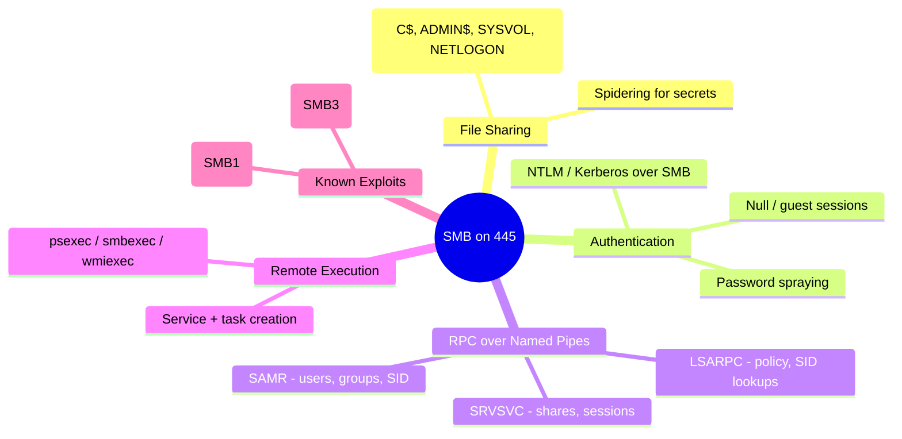
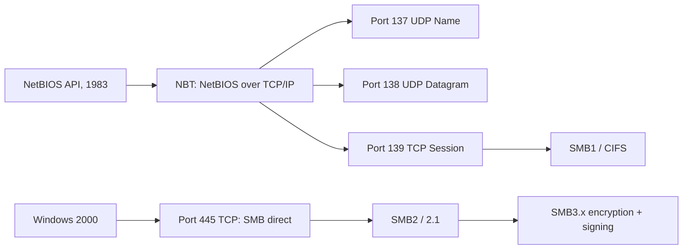
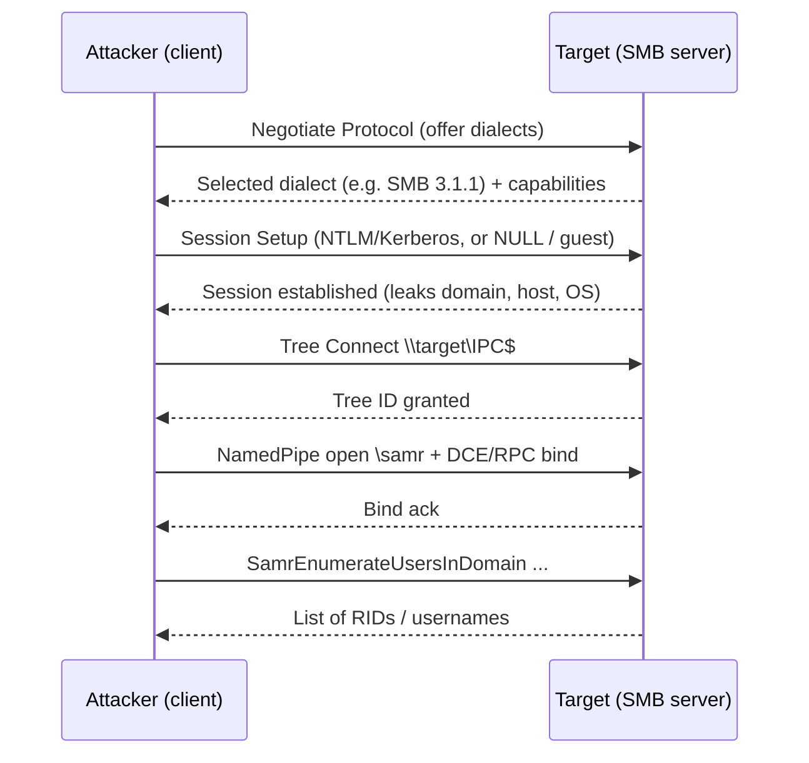
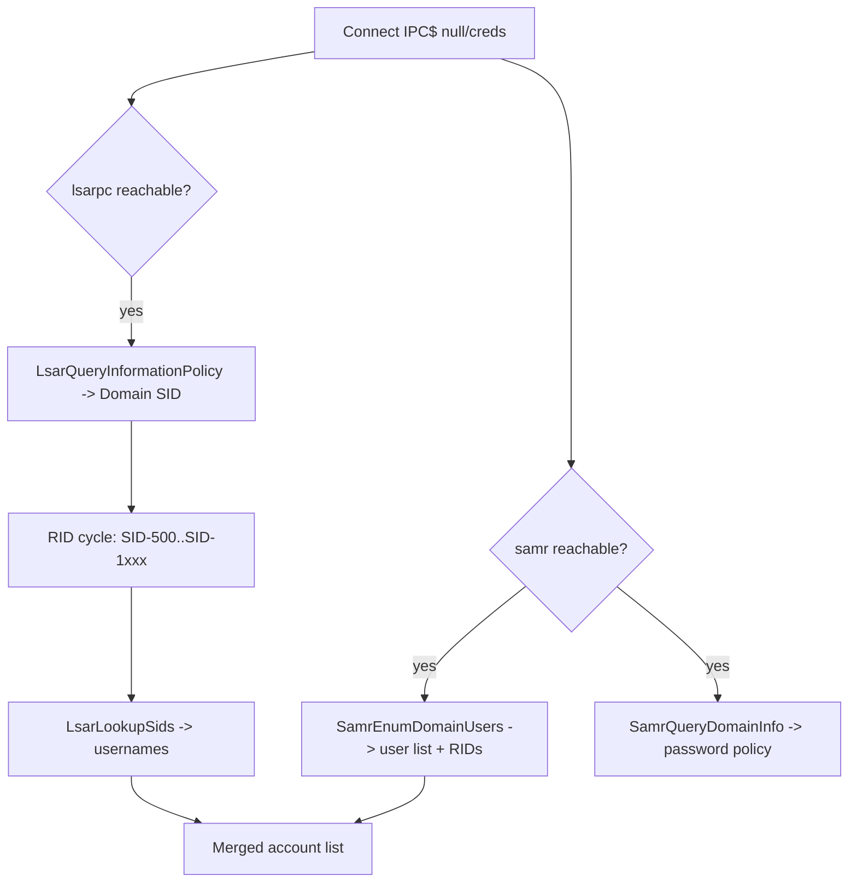
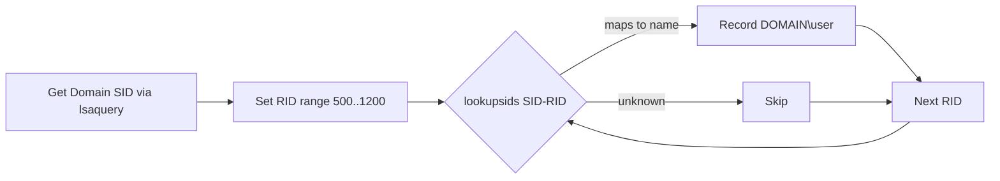
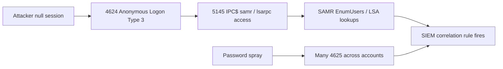

**Level:** Expert · **Track:** Penetration Testing · **Read time:** 255 min

This is Chapter 7 of the Scanning & Enumeration notebook. The previous chapter walked the four classic text-based services a tester meets first — FTP, SSH, SMTP and Telnet — and taught banner grabbing as the universal primitive that turns an open port into a named, versioned service. This chapter takes that discipline into the single most productive target on any corporate network: the **Server Message Block (SMB)** stack on ports **139 and 445**, together with the **NetBIOS** name service on **137/138** and the **MS-RPC** interfaces that ride on top of SMB through named pipes.

There is a reason experienced testers go straight for 445 the moment a scan comes back. On a Windows estate, SMB is not just file sharing — it is the transport for authentication, remote administration, printing, and a whole family of **Remote Procedure Call (RPC)** interfaces that will, if the target is misconfigured, cheerfully hand you the complete list of domain users, groups, password policy, shares, and the domain's Security Identifier (SID) *before you have a single credential*. A permissive SMB configuration is frequently the entire difference between "we scanned it" and "we own the domain." Every serious Active Directory attack path — Kerberoasting, AS-REP roasting, password spraying, lateral movement with `psexec`/`wmiexec`, BloodHound collection — begins with the enumeration you will learn here.

We build the whole thing from the ground up: what NetBIOS is and why a 1980s naming protocol still shapes modern Windows networking; how SMB evolved from the broken, wormable **SMB1/CIFS** to the signed, encrypted **SMB3.1.1**; how **DCE/RPC** exposes interfaces like **SAMR**, **LSARPC** and **SRVSVC** over named pipes; and then, tool by tool — `nbtscan`, `nmblookup`, `smbclient`, `rpcclient`, `enum4linux` and `enum4linux-ng`, **NetExec** (the actively-maintained successor to CrackMapExec), `smbmap`, and the Nmap `smb-*` NSE library — exactly how to extract that intelligence, with every flag explained and realistic output annotated.

Everything here is active enumeration against live services: you are authenticating (often as *nobody*), listing shares, cycling RIDs and reading RPC interfaces, all of which is logged and, at volume, alertable. It stays entirely inside authorised scope. Enumerating SMB services you have no written permission to test — and especially guessing or spraying credentials against them — is unlawful in most jurisdictions. Scope and a signed rules-of-engagement document are hard boundaries, assumed throughout and flagged where the risk is highest.

---

## Part 1: Why SMB Is the Center of Gravity on a Windows Network

Before any tooling, internalise *why* this port matters so much, because it will shape how aggressively you prioritise it in every engagement.

On a typical enterprise, three facts stack on top of each other:

1. **SMB is everywhere and always on.** Every Windows server and workstation speaks it. Domain Controllers must expose it (the `SYSVOL` and `NETLOGON` shares are how Group Policy is distributed to every machine). File servers, print servers, backup appliances, NAS boxes (Samba on Linux), and even many IoT/embedded devices expose 445.

2. **SMB carries authentication and remote control, not just files.** The same port is the transport for named-pipe RPC calls that let you query the Security Account Manager (SAM), the Local Security Authority (LSA), the server service, the task scheduler, the service control manager, and the registry — remotely. This is why "SMB enumeration" and "getting a foothold" are so tightly coupled.

3. **Defaults and legacy leak information.** For historical compatibility, many Windows and almost all misconfigured Samba deployments allow an **anonymous / null session** — a connection with an empty username and empty password — that can still read RPC interfaces. Even where anonymous is locked down, a single low-privileged domain credential typically unlocks the entire directory to read.

Put together: SMB is a high-value, high-exposure, information-dense service that is present on nearly every host and frequently misconfigured. That is why the methodology in this chapter is worth memorising cold.



**Pentester landing on a fresh network:** after host discovery and a port sweep, the hosts with 445 open are your first stop, and the ones that *also* answer a null session are gold. **Blue team framing:** the same reasoning explains why 445 should never be reachable from an untrusted network and why anonymous access must be disabled — the attacker's entire opening move is reconnaissance of *your* directory using *your* own services.

---

## Part 2: NetBIOS, SMB and CIFS — Untangling the Terminology

Newcomers get lost here because four overlapping names — NetBIOS, NetBEUI, SMB and CIFS — are used loosely and often interchangeably in tool output and blog posts. Precision matters, because the ports and behaviours differ.

### NetBIOS (Network Basic Input/Output System)

**NetBIOS** is not a protocol; it is an **API** invented by IBM in 1983 for applications on early PC LANs to talk to each other by *name*. It provides three services: a **name service**, a **datagram service**, and a **session service**. In its original form it ran over NetBEUI, a non-routable layer-2 protocol. When TCP/IP took over, NetBIOS was bolted on top of it as **NetBIOS over TCP/IP (NBT)**, standardised in RFC 1001/1002, and that mapping gives us the classic port assignments:

| Port | Proto | NetBIOS service | What it does |
|------|-------|-----------------|--------------|
| 137 | UDP | Name Service (NBNS) | Registers and resolves NetBIOS names (like a mini-DNS for the LAN) |
| 138 | UDP | Datagram Service | Connectionless messages, browser service announcements |
| 139 | TCP | Session Service | Carries SMB *inside* a NetBIOS session |

The critical takeaway: **port 139 is SMB wrapped in a NetBIOS session layer.** It is the legacy path.

### SMB and CIFS

**Server Message Block (SMB)** is the actual file/print/IPC sharing protocol. It was created by IBM and heavily extended by Microsoft. In the late 1990s Microsoft rebranded its SMB dialect **CIFS (Common Internet File System)** — so when you see "CIFS", read "an old SMB1 dialect." Modern documentation and tools mostly say SMB again.

The pivotal change came with **Windows 2000**, which let SMB run **directly over TCP on port 445**, dropping the NetBIOS session layer entirely. So:

- **Port 139** = SMB over NetBIOS over TCP/IP (legacy).
- **Port 445** = SMB directly over TCP (modern, "direct host").

Both can be open. Tools and Nmap will often show both. When 445 is available you generally prefer it; 139 remains useful when 445 is filtered or on old boxes.

### The SMB dialect timeline

| Dialect | Introduced with | Notes for a tester |
|---------|-----------------|--------------------|
| SMB1 / CIFS | LAN Manager, NT4, Win2000 | Wormable. Home of MS17-010/EternalBlue. Should be disabled everywhere. |
| SMB2.0 | Windows Vista / 2008 | Complete rewrite, far fewer commands, better performance. |
| SMB2.1 | Windows 7 / 2008 R2 | Leasing, large MTU. |
| SMB3.0 | Windows 8 / 2012 | Encryption (AES-CCM), secure dialect negotiation. |
| SMB3.0.2 | Windows 8.1 / 2012 R2 | Incremental. |
| SMB3.1.1 | Windows 10 / 2016+ | Pre-auth integrity (SHA-512), AES-GCM. Home of CVE-2020-0796 (SMBGhost) in the compression path. |

**Security relevance:** the *dialect* a host will negotiate is itself intelligence. A box that still speaks SMB1 is telling you it may be vulnerable to a whole class of legacy attacks and that its patch hygiene is poor. One of your first checks is always "does this host still allow SMB1?"



---

## Part 3: How an SMB Conversation Actually Works

To enumerate intelligently you need a mental model of the exchange, because every tool in this chapter is just automating parts of it.

A client-to-server SMB session has four logical stages:

1. **Negotiate** — the client sends the list of dialects it supports; the server picks the highest common one. This is where SMB1-vs-SMB3 is decided and where secure negotiation (anti-downgrade) lives in SMB3.
2. **Session Setup (authentication)** — the client authenticates using NTLM or Kerberos (via the SPNEGO/GSS-API wrapper). A **null session** is simply a Session Setup with an empty username and password; a **guest** session maps an unknown user to the Guest account. This step also leaks the target's NetBIOS/DNS domain and computer name and OS build in the NTLM challenge — useful even when auth fails.
3. **Tree Connect** — the client connects to a specific **share** (a "tree"), e.g. `\\server\IPC$`. The special **`IPC$`** share ("Inter-Process Communication") carries no files; it is the pipe over which RPC calls travel, and it is the share a null session connects to in order to run enumeration.
4. **Operations** — file reads/writes, directory listings, or — over `IPC$` — **named-pipe RPC** calls to interfaces like `\samr`, `\lsarpc`, `\srvsvc`.



The two ideas to hold onto: **IPC$ is the doorway to RPC**, and **even a failed or anonymous authentication leaks host/domain metadata**. Everything else is detail on top of these.

---

## Part 4: MS-RPC, DCE/RPC and Named Pipes — The Real Intelligence Layer

File shares are useful, but the crown jewels of SMB enumeration come from **RPC**. Understanding this layer is what separates a tester who runs `enum4linux` and copies the output from one who knows *what* it queried and can do it by hand when the wrapper breaks.

**DCE/RPC** (Distributed Computing Environment / Remote Procedure Call) is the framework that lets a client call a function that executes on a server as if it were local. Microsoft's implementation is **MS-RPC**. On a Windows network, many RPC interfaces are reachable **over SMB named pipes** — special files under the `IPC$` share whose names map to services:

| Named pipe | Interface | What you can enumerate |
|------------|-----------|------------------------|
| `\samr` | SAMR (Security Account Manager Remote) | Local & domain users, groups, RIDs, password policy |
| `\lsarpc` | LSARPC (Local Security Authority) | Domain SID, SID↔name lookups, trust info, policy |
| `\srvsvc` | SRVSVC (Server Service) | Shares, active sessions, connected users, server info |
| `\netlogon` | NETLOGON | Secure-channel functions (home of Zerologon, CVE-2020-1472) |
| `\svcctl` | SVCCTL (Service Control Manager) | Create/start services → remote code exec (`psexec`-style) |
| `\atsvc` / `\ITaskSchedulerService` | Task Scheduler | Schedule tasks → code exec |
| `\winreg` | Remote Registry | Read/write registry hives remotely |
| `\spoolss` | Print System | Home of PrintNightmare and the printer-bug coercion (`SpoolSample`) |
| `\efsrpc` / `\lsarpc` | EFSRPC / MS-EFSR | Coercion (PetitPotam) |

Two of these — **SAMR** and **LSARPC** — are the workhorses of pre-credential enumeration:

- **SAMR** lets you walk the account database. `EnumDomainUsers` returns usernames and their RIDs. This is how tools dump every domain user without a credential when a null session is allowed.
- **LSARPC** gives you the **domain SID** and a lookup primitive that converts a SID+RID into a name and vice-versa. This is the engine behind **RID cycling**: once you know the domain SID, you can ask "who is SID-500? SID-501? … SID-1105?" one at a time and rebuild the entire user list even when `EnumDomainUsers` is blocked.



**Red team usage:** the merged account list feeds directly into password spraying and AS-REP/Kerberoast target selection. **Blue team usage:** these same named-pipe binds are exactly what your detections should watch for — an anonymous session performing `SamrEnumerateUsersInDomain` or a burst of `LsarLookupSids` calls is enumeration, not normal traffic.

---

## Part 5: Fingerprinting SMB — First Contact with Nmap and the NSE Library

You always start by confirming what is actually running before you throw authenticated tooling at it. Nmap (taught from scratch in Chapters 2–4) is the fastest way to fingerprint SMB and to run a battery of safe checks via the **NSE `smb-*` scripts**.

### The core version + script scan

```bash
nmap -p 139,445 -sV --script "smb-protocols,smb-security-mode,smb2-security-mode,smb-os-discovery" 10.10.10.5
```

Flag-by-flag:

- `-p 139,445` — restrict to the two SMB ports so the scan is fast and quiet.
- `-sV` — service/version detection; probes to identify Samba vs Windows SMB and the version banner.
- `--script "..."` — run this comma-separated list of NSE scripts. Quotes stop the shell from globbing the commas/braces.
  - `smb-protocols` — enumerates which dialects (SMB1/2/3) the host will speak. **This is your SMB1 red-flag check.**
  - `smb-security-mode` / `smb2-security-mode` — reports message-signing status (disabled / enabled / required). Signing "not required" is what makes NTLM relay possible.
  - `smb-os-discovery` — pulls OS, computer name, domain, and (on many hosts) the system time and uptime.

### Realistic annotated output

```text
Nmap scan report for 10.10.10.5
Host is up (0.032s latency).

PORT    STATE SERVICE     VERSION
139/tcp open  netbios-ssn Samba smbd 4.6.2
445/tcp open  netbios-ssn Samba smbd 4.6.2

Host script results:
| smb-protocols:
|   dialects:
|     NT LM 0.12 (SMBv1) [dangerous, but default]   <-- SMB1 still enabled
|     2.0.2
|     2.1
|     3.0
|_    3.1.1
| smb-security-mode:
|   account_used: guest
|   authentication_level: user
|   challenge_response: supported
|_  message_signing: disabled (dangerous, but default)  <-- relay possible
| smb2-security-mode:
|   3.1.1:
|_    Message signing enabled but not required           <-- relay possible
| smb-os-discovery:
|   OS: Windows 6.1 (Samba 4.6.2)
|   Computer name: hutch
|   NetBIOS computer name: HUTCH\x00
|   Domain name: hutch.local
|   FQDN: hutch.hutch.local
|_  System time: 2026-10-13T14:22:07+00:00
```

Read like a tester: SMB1 is enabled (legacy exposure), signing is not required (relay candidate), and you already have the domain (`hutch.local`) and hostname (`hutch`) — all before authenticating. The `account_used: guest` line tells you a guest session succeeded, which strongly hints null/guest enumeration will work.

### The safe vuln checks

```bash
nmap -p 445 --script "smb-vuln-ms17-010,smb-double-pulsar-backdoor" 10.10.10.5
```

`smb-vuln-ms17-010` safely checks for the EternalBlue vulnerability without exploiting it (it probes the vulnerable transaction path and reports `VULNERABLE`/`NOT VULNERABLE`). **Never** confuse this safe check with running the exploit — the check is fine on scoped targets; launching MS17-010 exploitation can crash the target and must be explicitly authorised.

> **Script categories to know:** `--script smb-vuln*` runs every SMB vuln script; some are `intrusive` and can hang or crash fragile hosts. On production, stick to the named safe checks above rather than the whole `vuln` category.

---

## Part 6: NetBIOS Name Enumeration — nbtscan and nmblookup

Before SMB itself, the NetBIOS name service on UDP 137 can be queried directly. It is fast, unauthenticated, and often reveals the hostname, domain/workgroup, logged-on user hint, and whether the host is a domain controller — even on hosts where 445 is filtered.

### nmblookup — the name-service query tool

`nmblookup` ships with the Samba client suite (`sudo apt install smbclient samba-common-bin` on Kali; it's usually already present). It sends NetBIOS name queries.

```bash
nmblookup -A 10.10.10.5
```

- `-A` treats the argument as an **address** and does a "node status" query, asking the host to list its registered NetBIOS names.

```text
Looking up status of 10.10.10.5
        HUTCH           <00> -         B <ACTIVE>   (workstation/redirector)
        HUTCH           <20> -         B <ACTIVE>   (file server service)
        HUTCH.LOCAL     <00> - <GROUP> B <ACTIVE>   (domain/workgroup name)
        HUTCH.LOCAL     <1c> - <GROUP> B <ACTIVE>   (domain controllers)
        HUTCH.LOCAL     <1b> -         B <ACTIVE>   (domain master browser = PDC)
        MAC Address = 00-0C-29-3A-1B-77
```

The two-hex **suffix codes** are the payload. Memorise the important ones:

| Suffix | Meaning | Why you care |
|--------|---------|--------------|
| `<00>` | Workstation service | Host is up and speaking NetBIOS |
| `<20>` | File Server service | SMB file sharing is running |
| `<1b>` | Domain Master Browser | **This host is the PDC / a Domain Controller** |
| `<1c>` | Domain Controllers group | Domain name; DCs registered here |
| `<1d>` | Master Browser | Segment master browser |
| `<1e>` | Browser Service Elections | Browser election participant |
| `<03>` | Messenger service | Often the **logged-on username** |

Seeing `<1b>` here immediately tells you this box is a Domain Controller — a top-priority target.

### nbtscan — sweeping a whole subnet

`nbtscan` (`sudo apt install nbtscan`) does the same node-status query but across an entire range at once, which is perfect right after host discovery.

```bash
nbtscan -r 10.10.10.0/24
```

- `-r` uses the local UDP port 137 as the source port, which some firewalls require for the reply to return.

```text
Doing NBT name scan for addresses from 10.10.10.0/24

IP address       NetBIOS Name     Server    User             MAC address
------------------------------------------------------------------------
10.10.10.5       HUTCH            <server>  HUTCH            00:0c:29:3a:1b:77
10.10.10.12      WS01             <server>  jdoe             00:0c:29:aa:bb:cc
10.10.10.30      FILESRV01        <server>  FILESRV01        00:0c:29:de:ad:00
```

The `User` column (from the `<03>` messenger record) sometimes reveals the interactively logged-on user — here `jdoe` on WS01 — which is a free, unauthenticated username for later spraying.

**Blue team note:** NBNS/LLMNR/mDNS name resolution is also what enables **responder-style poisoning**. Disabling NetBIOS over TCP/IP and LLMNR both shrinks this enumeration surface and kills a major credential-theft vector.

---

## Part 7: smbclient — Talking to Shares from Scratch

`smbclient` is the FTP-like command-line SMB client from the Samba project. It is the most direct way to *manually* list and browse shares, and understanding it makes every higher-level tool legible.

### Install and first use

It's preinstalled on Kali; otherwise `sudo apt install smbclient`.

**List shares with a null session:**

```bash
smbclient -L //10.10.10.5/ -N
```

- `-L //host/` — **list** the shares exported by the host (the trailing slash/host form is the "list mode").
- `-N` — **no password**; suppresses the password prompt. Combined with the default empty username this attempts a **null/anonymous session**.

```text
        Sharename       Type      Comment
        ---------       ----      -------
        print$          Disk      Printer Drivers
        IPC$            IPC       IPC Service (hutch server)
        Development     Disk
        Users           Disk
        netlogon        Disk      Logon server share
        sysvol          Disk      Logon server share
        SYSVOL          Disk      Logon server share
Reconnecting with SMB1 for workgroup listing.

        Server               Comment
        ---------            -------

        Workgroup            Master
        ---------            -------
        HUTCH.LOCAL          HUTCH
```

Interpretation: `IPC$` is always present (that's the RPC pipe). `Development` and `Users` are non-default **Disk** shares — those are the ones worth reading. `SYSVOL`/`netlogon` confirm this is a Domain Controller.

**Explicit anonymous with a username:**

```bash
smbclient -L //10.10.10.5/ -U '' -N          # empty user
smbclient -L //10.10.10.5/ -U 'guest' -N     # guest account
```

### Connecting to and browsing a share

```bash
smbclient //10.10.10.5/Development -N
```

Once connected you get an FTP-style `smb: \>` prompt. Core interactive commands:

| Command | Action |
|---------|--------|
| `ls` / `dir` | List current directory |
| `cd <dir>` | Change directory on the share |
| `get <file>` | Download a file to your CWD |
| `mget *` | Download multiple files (prompt off with `prompt`) |
| `put <file>` | Upload (if writable) |
| `recurse ON` / `prompt OFF` | Prepare for a non-interactive recursive pull |
| `mask ""` | Clear the filename mask before recursive `mget` |
| `!<cmd>` | Run a local shell command |
| `exit` | Disconnect |

**Recursively download an entire share** (great for offline analysis):

```text
smb: \> recurse ON
smb: \> prompt OFF
smb: \> mget *
```

**One-liner to grab a known file with authenticated creds:**

```bash
smbclient //10.10.10.5/Users -U 'HUTCH/jdoe%Summer2026!' -c 'get jdoe/Desktop/notes.txt'
```

- `-U 'DOMAIN/user%password'` — inline credentials; `%` separates password (avoids a prompt in scripts).
- `-c 'command'` — run one command non-interactively and exit. Perfect for automation.

**CTF/Bug-bounty angle:** on HackTheBox and TryHackMe, an anonymously-readable share containing a `web.config`, a script with a hard-coded service password, a KeePass file, or a set of home directories is one of the most common first footholds in existence. Always read *every* readable share top to bottom.

### Handling SMB1-only and dialect problems

Old boxes sometimes refuse modern dialects. Force protocol behaviour with:

```bash
smbclient -L //10.10.10.5/ -N --option='client min protocol=NT1'
```

`client min protocol=NT1` forces SMB1 (NT1). Newer Samba disables SMB1 by default, so this option is what you reach for against genuinely ancient targets that only speak CIFS.

---

## Part 8: rpcclient — Enumerating the Directory by Hand

`rpcclient` (also from Samba) connects to the MS-RPC interfaces over `IPC$` and lets you invoke individual RPC calls interactively. This is the manual equivalent of what `enum4linux` automates, and doing it by hand at least once is the difference between understanding the attack and cargo-culting it.

### Establish a null session

```bash
rpcclient -U '' -N 10.10.10.5
```

- `-U ''` — empty username, `-N` — no password → null session. If it drops you at the `rpcclient $>` prompt, anonymous RPC is allowed and you have won the opening move.

### The high-value commands

**Server + domain info:**

```text
rpcclient $> srvinfo
        HUTCH          Wk Sv PrQ Unx NT SNT hutch server
        platform_id     :       500
        os version      :       6.1
        server type     :       0x809a03
```

**Enumerate all domain users (SAMR EnumDomainUsers):**

```text
rpcclient $> enumdomusers
user:[Administrator] rid:[0x1f4]
user:[Guest]         rid:[0x1f5]
user:[krbtgt]        rid:[0x1f6]
user:[jdoe]          rid:[0x450]
user:[svc_backup]    rid:[0x452]
user:[hhogan]        rid:[0x455]
```

The `rid:[0x1f4]` values are hex RIDs — `0x1f4` = 500 (the built-in Administrator), `0x1f5` = 501 (Guest), `0x1f6` = 502 (krbtgt, present only on DCs — another DC confirmation). Custom accounts start around RID 1000 (`0x3e8`).

**Query one user in detail:**

```text
rpcclient $> queryuser 0x450
        User Name   :   jdoe
        Full Name   :   John Doe
        ...
        Logon Time  :   Tue, 13 Oct 2026 09:15:22
        Password last set : Mon, 07 Sep 2026 ...
        acb_info    :   0x00000010    (Normal account)
```

**Enumerate groups and their members:**

```text
rpcclient $> enumdomgroups
group:[Domain Admins]  rid:[0x200]
group:[Domain Users]   rid:[0x201]
rpcclient $> querygroupmem 0x200
        rid:[0x452] attr:[0x7]         <-- svc_backup is a Domain Admin!
```

That last result — a service account in Domain Admins — is exactly the kind of high-impact finding SMB enumeration surfaces for free.

**Get the domain SID and do a lookup (LSARPC):**

```text
rpcclient $> lsaquery
Domain Name: HUTCH
Domain Sid: S-1-5-21-1473643419-774954089-2222229433

rpcclient $> lookupnames Administrator
Administrator S-1-5-21-1473643419-774954089-2222229433-500 (User: 1)

rpcclient $> lookupsids S-1-5-21-1473643419-774954089-2222229433-1104
S-1-5-21-1473643419-774954089-2222229433-1104 HUTCH\hhogan (1)
```

**Extract the password policy (feeds spraying safety):**

```text
rpcclient $> getdompwinfo
min_password_length: 7
password_properties: 0x00000000
```

Knowing `min_password_length` and, via `getusrdompwinfo`, the **lockout threshold** is what lets you spray without locking accounts. **Never spray blind** — read the policy first.

### rpcclient command reference

| Command | RPC interface | Yields |
|---------|---------------|--------|
| `srvinfo` | SRVSVC | OS version, server type |
| `enumdomusers` | SAMR | All users + RIDs |
| `queryuser <rid>` | SAMR | Per-user detail |
| `enumdomgroups` | SAMR | Groups + RIDs |
| `querygroupmem <rid>` | SAMR | Group membership |
| `getdompwinfo` | SAMR | Password policy |
| `lsaquery` | LSARPC | Domain SID |
| `lookupnames <name>` | LSARPC | Name → SID |
| `lookupsids <sid>` | LSARPC | SID → name (RID cycling) |
| `netshareenum` / `netshareenumall` | SRVSVC | Shares (incl. hidden) |
| `enumdomains` | SAMR | Domains on the host |

---

## Part 9: RID Cycling — Rebuilding the User List When EnumDomainUsers Is Blocked

Sometimes `enumdomusers` returns `NT_STATUS_ACCESS_DENIED` (a common "RestrictAnonymous" hardening) but the LSARPC lookup primitive is still open. **RID cycling** exploits that: SIDs are predictable — `DomainSID-<RID>` — and well-known RIDs (500 Administrator, 501 Guest, 502 krbtgt) plus the 1000+ range for real accounts mean you can brute-force names one SID at a time.

The manual loop with rpcclient:

```bash
for rid in $(seq 500 1100); do
  rpcclient -U '' -N 10.10.10.5 \
    -c "lookupsids S-1-5-21-1473643419-774954089-2222229433-$rid" \
    2>/dev/null | grep -v '\*unknown\*'
done
```

- We reuse the domain SID from `lsaquery`.
- `-c "lookupsids ..."` runs one lookup per iteration.
- `grep -v '\*unknown\*'` filters out RIDs that map to nothing.



This is tedious by hand, which is exactly why the dedicated tools below automate it (`enum4linux -r`, `lookupsid.py`, `netexec ... --rid-brute`). But knowing the primitive means you can improvise when a wrapper fails.

**Impacket alternative** (Impacket is covered fully in a later chapter; noted here for completeness): `lookupsid.py 'anonymous@10.10.10.5'` performs the same cycle in one command and is often the cleanest way to do it.

---

## Part 10: enum4linux and enum4linux-ng — The Classic All-in-One

`enum4linux` is a Perl wrapper that orchestrates `nmblookup`, `net`, `rpcclient` and `smbclient` to run essentially everything in Parts 6–9 automatically. It is old, noisy, and its parsing is fragile — but it remains a fast first pass and is on every exam and CTF box. The modern rewrite, **enum4linux-ng** (Python, actively maintained, JSON/YAML output), is what you should prefer in real work.

### enum4linux (classic)

Preinstalled on Kali. The everything-flag:

```bash
enum4linux -a 10.10.10.5
```

- `-a` — "all simple enumeration": does OS info, users, shares, groups, password policy and RID cycling in one shot. Equivalent to `-U -S -G -P -r -o -n -i`.

Targeted flags when `-a` is too noisy:

| Flag | Enumerates |
|------|-----------|
| `-U` | Userlist (via `enumdomusers`) |
| `-S` | Share list |
| `-G` | Group list |
| `-P` | Password policy |
| `-r` | RID cycling |
| `-o` | OS information |
| `-n` | nmblookup (NetBIOS names) |
| `-i` | Printer information |
| `-u user -p pass` | Authenticate instead of null session |
| `-R 500-1100` | RID range for cycling |

Annotated excerpt of `-a` output:

```text
 ==========================( Target Information )==========================
Target ........... 10.10.10.5
RID Range ........ 500-550,1000-1050
Username ......... ''
Password ......... ''

 ============================( Enumerating Users )============================
index: 0x1 RID: 0x1f4 acb: 0x210 Account: Administrator
index: 0x2 RID: 0x450 acb: 0x210 Account: jdoe
index: 0x3 RID: 0x452 acb: 0x210 Account: svc_backup

 ======================( Share Enumeration on 10.10.10.5 )======================
        Development     Disk
        IPC$            IPC       IPC Service
[+] Attempting to map shares on 10.10.10.5
//10.10.10.5/Development  Mapping: OK Listing: OK   <-- readable!
//10.10.10.5/IPC$         Mapping: OK Listing: DENIED

 =================( Password Policy Information )=================
[+] Minimum password length: 7
[+] Account lockout threshold: None                 <-- spraying is safe!
```

`Account lockout threshold: None` is a green light for password spraying; `Mapping: OK Listing: OK` on `Development` tells you exactly which share to read next.

### enum4linux-ng (the modern rewrite)

Install: `pipx install enum4linux-ng` or `git clone https://github.com/cddmp/enum4linux-ng && pip install -r requirements.txt`.

```bash
enum4linux-ng -A 10.10.10.5 -oJ hutch_enum
```

- `-A` — do all checks (like classic `-a` but more reliable, SMB2/3-aware).
- `-oJ hutch_enum` — write structured **JSON** output to `hutch_enum.json` (also `-oY` for YAML). Machine-readable output is why this is preferred — you can grep, diff, and feed it into a pipeline.

enum4linux-ng also does clean SMB-dialect detection, signing status, and won't silently choke on SMB1-disabled hosts the way the Perl original does.

---

## Part 11: NetExec (nxc) — The Modern Swiss-Army Knife

**NetExec** (`nxc`) is the actively-maintained fork/successor of **CrackMapExec** (CME), which is now unmaintained. If you learned CME, the commands are nearly identical — just swap `crackmapexec` for `netexec` (or the short alias `nxc`). NetExec is the single most useful tool for enumerating and later attacking SMB at scale across many hosts, with a database that remembers everything it finds.

### Install

```bash
# On Kali:
sudo apt install netexec        # or: pipx install netexec
nxc --version
```

(`nxc` and `netexec` are the same binary.)

### Core protocol and target syntax

```bash
nxc smb 10.10.10.5
nxc smb 10.10.10.0/24
nxc smb targets.txt
```

The first argument is always the **protocol** (`smb`, `winrm`, `ldap`, `mssql`, `ssh`, …). Bare, with no creds, it fingerprints:

```text
SMB  10.10.10.5  445  HUTCH  [*] Windows Server 2016 (name:HUTCH) (domain:hutch.local) (signing:False) (SMBv1:True)
```

That single line gives OS, hostname, domain, **signing status**, and **SMB1 status** — the four facts you most want, across an entire subnet in seconds. `signing:False` = relay candidate; `SMBv1:True` = legacy exposure.

### Null-session and anonymous enumeration

```bash
nxc smb 10.10.10.5 -u '' -p '' --shares
nxc smb 10.10.10.5 -u '' -p '' --users
nxc smb 10.10.10.5 -u '' -p '' --rid-brute 3000
nxc smb 10.10.10.5 -u 'guest' -p '' --pass-pol
```

- `-u '' -p ''` — null session; `-u 'guest' -p ''` — guest.
- `--shares` — list shares **and show your READ/WRITE access per share** (huge time-saver vs smbclient).
- `--users` — dump domain users via SAMR.
- `--rid-brute 3000` — RID-cycle up to RID 3000 (the automated version of Part 9).
- `--pass-pol` — dump the password policy.

Annotated `--shares` output:

```text
SMB  10.10.10.5  445  HUTCH  [+] hutch.local\: (Guest)
SMB  10.10.10.5  445  HUTCH  Share           Permissions   Remark
SMB  10.10.10.5  445  HUTCH  -----           -----------   ------
SMB  10.10.10.5  445  HUTCH  ADMIN$                        Remote Admin
SMB  10.10.10.5  445  HUTCH  C$                            Default share
SMB  10.10.10.5  445  HUTCH  Development     READ
SMB  10.10.10.5  445  HUTCH  IPC$            READ          Remote IPC
SMB  10.10.10.5  445  HUTCH  SYSVOL          READ
SMB  10.10.10.5  445  HUTCH  Users           READ,WRITE    <-- writable!
```

A **WRITE** on a user-facing share is a lateral-movement/persistence opportunity (drop a malicious `.lnk`/SCF for hash capture, or a payload). NetExec makes the permission matrix obvious at a glance.

### Authenticated enumeration and spraying

```bash
# Validate one credential across a subnet (finds where it works + local admin)
nxc smb 10.10.10.0/24 -u jdoe -p 'Summer2026!'
# Password spray one password across many users
nxc smb 10.10.10.5 -u users.txt -p 'Autumn2026!' --continue-on-success
# Pass-the-hash
nxc smb 10.10.10.5 -u Administrator -H 'aad3b435b51404ee...:31d6cfe0d16ae931...'
```

- A `(Pwn3d!)` tag in the output means that credential has **local admin** on that host — your green light for `--exec`, `psexec`, dumping SAM, etc. (all of which belong to the exploitation chapters and must be in scope).
- `--continue-on-success` keeps going after the first hit when spraying.
- `-H` does **pass-the-hash** with an NTLM hash instead of a password.

### NetExec modules

```bash
nxc smb -L                          # list all modules
nxc smb 10.10.10.5 -u u -p p -M spider_plus   # spider all readable shares, index files
nxc smb 10.10.10.5 -u u -p p -M gpp_password  # hunt for cPassword in SYSVOL (MS14-025)
```

The `spider_plus` module recursively catalogues every file in every readable share to JSON — the automated, scalable version of `smbclient recurse ON; mget *`. `gpp_password` finds the decryptable `cPassword` in Group Policy Preferences, a classic instant-win on older domains.

> **Why NetExec over CrackMapExec:** CME's original repo was archived and is no longer patched; NetExec carries the maintenance, adds new modules, fixes SMB2/3 edge cases, and keeps the same muscle memory. Prefer `nxc` in all new work.

---

## Part 12: smbmap — Fast Share and Permission Mapping

`smbmap` is a focused tool that does one thing extremely well: enumerate shares **with their permissions**, and optionally spider or execute. It overlaps with `nxc --shares` but is worth knowing because it predates NetExec, appears in many playbooks, and has a clean recursive listing mode.

Install: `pipx install smbmap` (preinstalled on Kali).

```bash
smbmap -H 10.10.10.5 -u '' -p ''
smbmap -H 10.10.10.5 -u guest -p ''
smbmap -H 10.10.10.5 -u jdoe -p 'Summer2026!' -d HUTCH
```

- `-H` — host. `-u/-p` — creds (empty = null). `-d` — domain.

```text
[+] IP: 10.10.10.5:445  Name: hutch.local
        Disk              Permissions     Comment
        ----              -----------     -------
        ADMIN$            NO ACCESS       Remote Admin
        C$                NO ACCESS       Default share
        Development       READ ONLY
        IPC$              READ ONLY       Remote IPC
        Users             READ, WRITE
```

Recursive listing of one share:

```bash
smbmap -H 10.10.10.5 -u jdoe -p 'Summer2026!' -r Users
smbmap -H 10.10.10.5 -u jdoe -p 'Summer2026!' -R Users --depth 5   # deep recurse
smbmap -H 10.10.10.5 -u jdoe -p 'Summer2026!' --download 'Users/jdoe/notes.txt'
```

- `-r` — list one level of a share; `-R` — fully recursive; `--depth` caps recursion.
- `--download 'share/path'` — pull a specific file.

**When to reach for which:** `nxc --shares` for breadth across many hosts and the permission matrix; `smbmap -R` for a fast recursive directory tree of one interesting share; `smbclient` for interactive browsing and precise `get`/`put`.

---

## Part 13: Hands-On Lab — Full SMB Enumeration of a Domain Controller

This lab chains every tool into the real workflow you'd run on a scoped internal engagement. The target is a lab DC at `10.10.10.5` (`hutch.local`). Reproduce it on a lab you own or a platform like HackTheBox/TryHackMe — never on infrastructure you are not authorised to test.

### Step 1 — Fingerprint

```bash
nmap -p 139,445 -sV --script "smb-protocols,smb2-security-mode,smb-os-discovery" 10.10.10.5
nxc smb 10.10.10.5
```

Result: Windows Server 2016, domain `hutch.local`, `signing:False`, `SMBv1:True`. **Notes:** signing not required (relay candidate), SMB1 present (legacy), it's a DC (SYSVOL later confirms).

### Step 2 — NetBIOS names

```bash
nmblookup -A 10.10.10.5
```

`<1b>` present → confirmed Domain Controller. Record the NetBIOS name `HUTCH`.

### Step 3 — Test null session and list shares

```bash
smbclient -L //10.10.10.5/ -N
nxc smb 10.10.10.5 -u '' -p '' --shares
```

Null session works. Readable non-default share: `Development`. `Users` is READ,WRITE.

### Step 4 — Pull the directory over RPC

```bash
rpcclient -U '' -N 10.10.10.5 -c 'lsaquery; enumdomusers; getdompwinfo'
```

```text
Domain Sid: S-1-5-21-1473643419-774954089-2222229433
user:[Administrator] rid:[0x1f4]
user:[jdoe]          rid:[0x450]
user:[svc_backup]    rid:[0x452]
min_password_length: 7
```

If `enumdomusers` had been denied, RID-cycle instead:

```bash
nxc smb 10.10.10.5 -u '' -p '' --rid-brute 2000 | grep 'SidTypeUser'
```

### Step 5 — Structured all-in-one for the report

```bash
enum4linux-ng -A 10.10.10.5 -oJ hutch_enum
jq '.users | keys' hutch_enum.json
jq '.policy.password_policy' hutch_enum.json
```

Now you have a machine-readable artifact of users, groups, shares, policy and OS — ideal for the findings write-up and for diffing on re-tests.

### Step 6 — Read the interesting share

```bash
smbclient //10.10.10.5/Development -N -c 'recurse ON; prompt OFF; mget *'
grep -ri 'password\|pwd\|connectionstring\|Passw' ./
```

### Step 7 — Build the user list and (if in scope) spray safely

```bash
# users.txt built from steps 4/5; policy said lockout threshold = None
nxc smb 10.10.10.5 -u users.txt -p 'Hutch2026!' --continue-on-success
```

A `(Pwn3d!)` or `[+]` on any user is a validated credential and, if `Pwn3d!`, local admin. That is the boundary between enumeration (this chapter) and exploitation (later chapters) — and it must be explicitly authorised in the RoE.

### Lab result summary

From an **unauthenticated** starting point you obtained: OS/host/domain, DC confirmation, full user and group lists with a service account in Domain Admins, the password policy (no lockout), the domain SID, a readable share with secrets, and a writable share. That is a textbook demonstration of why SMB enumeration is the highest-yield activity in internal testing.

---

## Part 14: The Known SMB Exploits You Must Recognise

Enumeration constantly surfaces hosts vulnerable to a handful of famous SMB bugs. You are not exploiting them in this chapter, but you must recognise the fingerprints and understand the protocol facts, because reporting "SMB1 enabled" without the MS17-010 context undersells the risk.

| Name | CVE / MSB | Affects | Protocol fact | Detect (safe) |
|------|-----------|---------|---------------|---------------|
| **EternalBlue** | MS17-010 | SMB1 | Buffer overflow in `srv.sys` `Trans2`/`Trans` handling; wormed by WannaCry/NotPetya | `nmap --script smb-vuln-ms17-010` |
| **DoublePulsar** | (implant) | SMB1 | Kernel backdoor dropped by EternalBlue | `nmap --script smb-double-pulsar-backdoor` |
| **SMBGhost** | CVE-2020-0796 | SMB3.1.1 | Integer overflow in the SMB **compression** header (`SMB2_COMPRESSION_TRANSFORM`) | version + compression-capability check |
| **Zerologon** | CVE-2020-1472 | Netlogon (over RPC) | Flawed AES-CFB8 IV in the secure channel → set DC machine password to null | `nmap --script smb-vuln-zerologon` / `zerologon` testers |
| **PrintNightmare** | CVE-2021-1675 / 34527 | `spoolss` | Print Spooler allows driver install → SYSTEM RCE | `nxc smb -M spooler` / `rpcdump` for MS-RPRN |
| **PetitPotam** | MS-EFSR coercion | `efsrpc`/`lsarpc` | Coerce a host to authenticate to you (relay to AD CS) | check for `efsrpc` pipe / coercion PoC |

Two protocol takeaways: (1) **SMB1 being enabled is the single biggest legacy red flag** — it's the precondition for EternalBlue and its worms; (2) **the coercion bugs** (PetitPotam, PrintNightmare, the printer bug) are RPC-over-SMB features being abused to force authentication, which is why the `spoolss`/`efsrpc` pipes matter during enumeration.

**Reporting discipline:** tie every finding to impact. "Port 445 open" is not a finding; "SMB1 enabled and MS17-010 unpatched on a domain-joined host, exploitable for unauthenticated SYSTEM RCE" is.

---

## Part 15: Detection & Defense Angle

This is the consolidated blue-team section. Everything above generates telemetry; here is how a defender sees it and shuts it down.

### What the enumeration looks like in logs

- **Anonymous/null logons** appear as **Event ID 4624** with **Logon Type 3 (Network)** and an **Anonymous Logon** account (`ANONYMOUS LOGON`, SID `S-1-5-7`). A spike of these from one source is enumeration.
- **Named-pipe access** to `\samr`, `\lsarpc`, `\srvsvc` shows up with **Event ID 5145** (a network share object was checked) referencing the `IPC$` share and the pipe name — the clearest single signal of RPC enumeration.
- **SAMR/LSA account enumeration** can be surfaced with **Event ID 4661** (a handle to an object was requested) on SAM/LSA objects when SACL auditing is enabled.
- **RID cycling / SID lookups** generate bursts of **4624/4634** (logon/logoff) or repeated LSARPC lookups — a distinctive high-count, low-variety pattern.
- **Password spraying** shows as many **4625 (failed logon)** across many accounts from one source in a short window, often with `Logon Type 3` and NTLM.
- **Share access** to sensitive shares logs **5140** (share accessed) / **5145** (detailed file check).



### Hardening — kill the enumeration surface

| Control | Effect |
|---------|--------|
| **Disable SMB1** (`Disable-WindowsOptionalFeature -Online -FeatureName SMB1Protocol`) | Removes EternalBlue class; forces SMB2/3 |
| **Require SMB signing** (GPO: *Microsoft network server: Digitally sign communications (always)*) | Kills NTLM relay over SMB |
| **RestrictAnonymous / RestrictAnonymousSAM = 1** and **`RestrictRemoteSAM`** SDDL | Blocks null-session SAMR/LSA enumeration and remote SAM reads |
| **`EveryoneIncludesAnonymous = 0`** | Anonymous no longer inherits Everyone rights |
| **Block 445/139 at the perimeter** and segment internally | SMB should never be internet-reachable; limit lateral reach |
| **Disable NetBIOS over TCP/IP + LLMNR + mDNS** | Removes 137/138 enumeration and Responder poisoning |
| **Enable SMB Encryption** (SMB3) on sensitive shares | Confidentiality + integrity in transit |
| **Least-privilege shares; remove world-readable shares** | Stops share-spidering foothold |
| **Enable Guest account = disabled; deny "Guest" logon over network** | Kills guest-session enumeration |

### Detection engineering

- Alert on **Anonymous Logon (Type 3) followed by IPC$ named-pipe access to samr/lsarpc** within seconds — this correlation is high-fidelity for enumeration.
- Alert on **N distinct target accounts with 4625 from one source in T minutes** for spraying (tune N/T to your lockout policy).
- Deploy **honeytoken/canary shares and accounts** — a share named to attract spidering, or a decoy user in a fake "admin" group. Any touch is malicious by definition and produces a clean, low-false-positive alert.
- Baseline which hosts *should* speak SMB1 (ideally none) and alert on any SMB1 negotiation.

**IR use case:** when investigating a suspected intrusion, the sequence "Anonymous Logon → IPC$ → SAMR enumeration → password spray → successful 4624 for a service account → 5140 on SYSVOL" is a canonical early-kill-chain footprint; mapping it lets you scope the compromise back to first contact.

---

## Part 16: Common Pitfalls and Gotchas

- **Confusing 139 and 445.** If 445 is filtered but 139 open, force the NetBIOS path (`smbclient` will use it; some tools need `--port 139`). Don't declare "no SMB" just because 445 is closed.
- **Assuming null session = full read.** Modern, hardened hosts allow the session but return `ACCESS_DENIED` on SAMR. That's when you pivot to LSARPC RID cycling, guest, or a single low-priv credential.
- **enum4linux (classic) silently choking on SMB1-disabled hosts.** Its Perl `smbclient` calls can hang or misreport. Prefer **enum4linux-ng** or NetExec on modern targets.
- **Spraying before reading the lockout policy.** `--pass-pol` / `getdompwinfo` first, always. Locking out an entire domain is a career-limiting move and a client-relationship disaster.
- **Forgetting the domain in credentials.** Many auth failures are just a missing domain: use `-u 'DOMAIN\user'` or NetExec's `-d DOMAIN`. Local vs domain accounts matter — `--local-auth` in NetExec forces local SAM auth.
- **CrackMapExec muscle memory.** CME is archived; use **NetExec (`nxc`)**. Old blog commands still map 1:1.
- **Not checking signing.** `signing:False` is a finding *and* an opportunity (relay). Don't skip it.
- **Treating SYSVOL/NETLOGON as boring.** They're world-readable to any domain user and frequently contain scripts, GPP `cPassword`, and credentials. Always spider them once you have any credential.
- **Noise.** `enum4linux -a` and broad `nxc` sweeps are loud. On red-team/stealth engagements, prefer targeted single queries and pace them.

---

## Part 17: Final Revision / Summary

The mental model to keep:

- **Ports:** 137/138 (UDP, NetBIOS name/datagram), 139 (TCP, SMB over NetBIOS), 445 (TCP, SMB direct). Prefer 445; fall back to 139.
- **Layers:** NetBIOS (naming) → SMB/CIFS (file/print/IPC) → RPC over `IPC$` named pipes (SAMR, LSARPC, SRVSVC, and the exploit-bearing spoolss/efsrpc/netlogon).
- **The opening move:** fingerprint (Nmap/`nxc`) → NetBIOS names (`nmblookup`/`nbtscan`) → null/guest session → shares (`smbclient`/`smbmap`/`nxc --shares`) → RPC directory dump (`rpcclient`, `enum4linux-ng`, `nxc --users/--rid-brute/--pass-pol`).
- **The payoff:** from *no credential*, you can often get the domain, hostname, OS, full user & group lists, a Domain-Admin service account, the domain SID, the password policy, and readable/writable shares — the complete pre-exploitation intelligence package.
- **Recognise the exploits:** SMB1 → MS17-010/EternalBlue; SMB3.1.1 compression → SMBGhost; netlogon → Zerologon; spoolss/efsrpc → PrintNightmare/PetitPotam coercion.
- **Defense:** disable SMB1, require signing, restrict anonymous SAM, segment/block 445, kill NetBIOS/LLMNR, honeytokens, and correlate Anonymous-Logon→IPC$→SAMR in the SIEM.
- **Discipline:** read the password policy before any spray; stay strictly in scope; tie every finding to concrete impact.

The next chapter continues the enumeration track with **SNMP, LDAP, NFS and database service enumeration** — the non-SMB services that leak just as much when misconfigured.

---

## Part 18: Cheat Sheet / Quick Reference

```bash
# --- Fingerprint ---
nmap -p 139,445 -sV --script "smb-protocols,smb2-security-mode,smb-os-discovery" TARGET
nmap -p445 --script smb-vuln-ms17-010 TARGET          # safe EternalBlue check
nxc smb TARGET                                        # OS/host/domain/signing/SMBv1

# --- NetBIOS names ---
nmblookup -A TARGET                                   # node status (suffix codes)
nbtscan -r 10.10.10.0/24                              # sweep a subnet

# --- Shares ---
smbclient -L //TARGET/ -N                             # list shares, null session
smbclient //TARGET/SHARE -N                           # browse a share
smbclient //TARGET/SHARE -N -c 'recurse ON;prompt OFF;mget *'
smbmap -H TARGET -u '' -p ''                           # shares + permissions
nxc smb TARGET -u '' -p '' --shares                    # shares + R/W matrix

# --- RPC / directory (null session) ---
rpcclient -U '' -N TARGET
  # > srvinfo | enumdomusers | enumdomgroups | querygroupmem 0x200
  # > getdompwinfo | lsaquery | lookupsids <SID>-<RID>
nxc smb TARGET -u '' -p '' --users
nxc smb TARGET -u '' -p '' --rid-brute 3000            # RID cycling
nxc smb TARGET -u guest -p '' --pass-pol               # password policy

# --- All-in-one ---
enum4linux -a TARGET                                   # classic (legacy/CTF)
enum4linux-ng -A TARGET -oJ out                        # modern, JSON output

# --- Authenticated / spray (IN SCOPE ONLY, read policy first) ---
nxc smb 10.10.10.0/24 -u USER -p 'PASS'                # validate + find (Pwn3d!)
nxc smb TARGET -u users.txt -p 'PASS' --continue-on-success
nxc smb TARGET -u USER -H LMHASH:NTHASH                # pass-the-hash
nxc smb TARGET -u USER -p PASS -M spider_plus          # spider readable shares
nxc smb TARGET -u USER -p PASS -M gpp_password         # GPP cPassword hunt

# Force SMB1 against ancient hosts
smbclient -L //TARGET/ -N --option='client min protocol=NT1'
```

**Key RID/suffix quick facts**

| RID | Account | | Suffix | Meaning |
|-----|---------|-|--------|---------|
| 500 | Administrator | | `<00>` | Workstation |
| 501 | Guest | | `<20>` | File server |
| 502 | krbtgt (DC only) | | `<1b>` | Domain Master (DC) |
| 512 | Domain Admins (group) | | `<1c>` | Domain Controllers |
| 1000+ | Regular accounts | | `<03>` | Logged-on user |

---

## Part 19: Practice Labs & Resources

Train this chapter's exact skills on real, legal targets:

- **HackTheBox — "Hutch"** (the DC modelled loosely in this chapter's lab): null-session RID cycling to users, then LDAP/SMB to a foothold.
- **HackTheBox — "Active"** and **"Forest"**: canonical SMB/RPC enumeration → GPP `cPassword` (Active) and AS-REP roasting (Forest) starting from anonymous enumeration.
- **HackTheBox — "Blue"** and **"Legacy"**: SMB1 fingerprinting and MS17-010 recognition (exploitation in a later chapter — here, practise the *detection* with `nmap --script smb-vuln-ms17-010`).
- **TryHackMe — "Network Services"** (SMB room): guided `enum4linux`/`smbclient`/`nmblookup` walkthrough — the perfect first repetition.
- **TryHackMe — "Enumerating Active Directory"** and **"Attacktive Directory"**: null-session enumeration, RID brute with NetExec/Impacket, password policy, then spraying.
- **TryHackMe — "SMB" / "Attacking Kerberos"**: extends this into the AD attack chain the enumeration feeds.
- **Local lab:** stand up a Windows Server DC + a Samba box in VirtualBox/VMware; toggle SMB1, signing, and `RestrictAnonymous` and watch how `nxc smb` and `rpcclient` output changes. This is the single best way to internalise which control blocks which technique.
- **Blue-team practice:** enable SMB/named-pipe auditing on a lab DC, run the enumeration above against it, and hunt for the 4624 Anonymous-Logon → 5145 IPC$ `\samr` correlation in the Windows Security log or your SIEM.

**Reference reading:** Microsoft `[MS-SMB2]`, `[MS-SAMR]`, `[MS-LSAD]` and `[MS-SRVS]` open specifications (the authoritative protocol docs); the NetExec and enum4linux-ng project wikis; and the HackTricks "Pentesting SMB" page for a command-oriented cross-reference.

Every technique here stays inside authorised scope with a signed rules-of-engagement document. Unauthenticated enumeration is still access — treat it with the same care and legal seriousness as any other testing activity.

---

*Also on [Praneeth's portfolio](https://ping-praneeth.vercel.app/notebook/pentest-scanning-enum/07-smb-rpc-and-netbios-enumeration-enum4linux-smbclient-netexec), with comments and the latest edits.*
