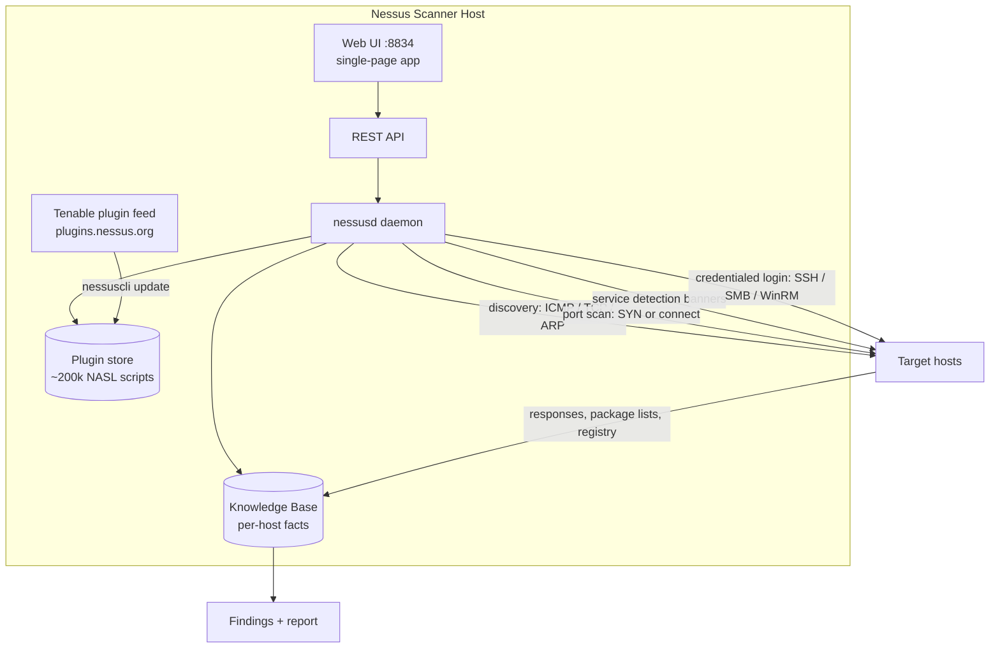
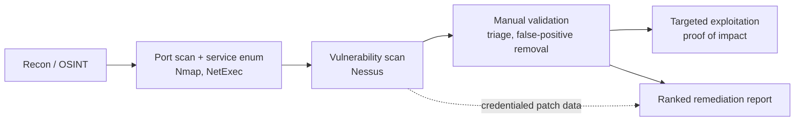
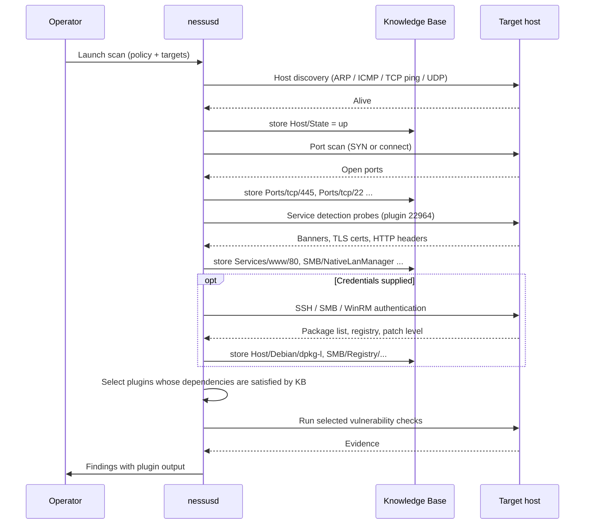
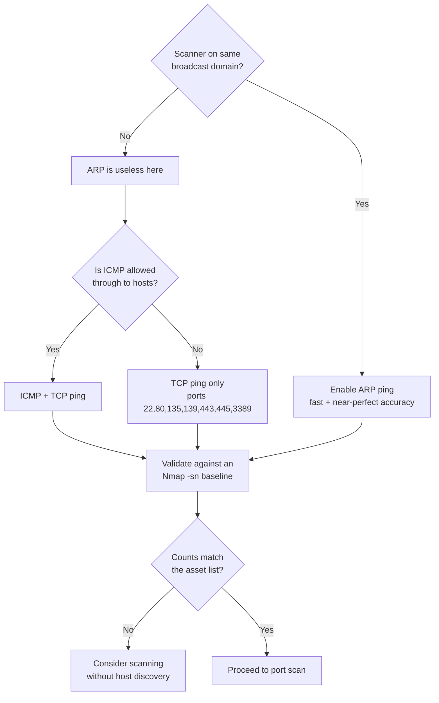
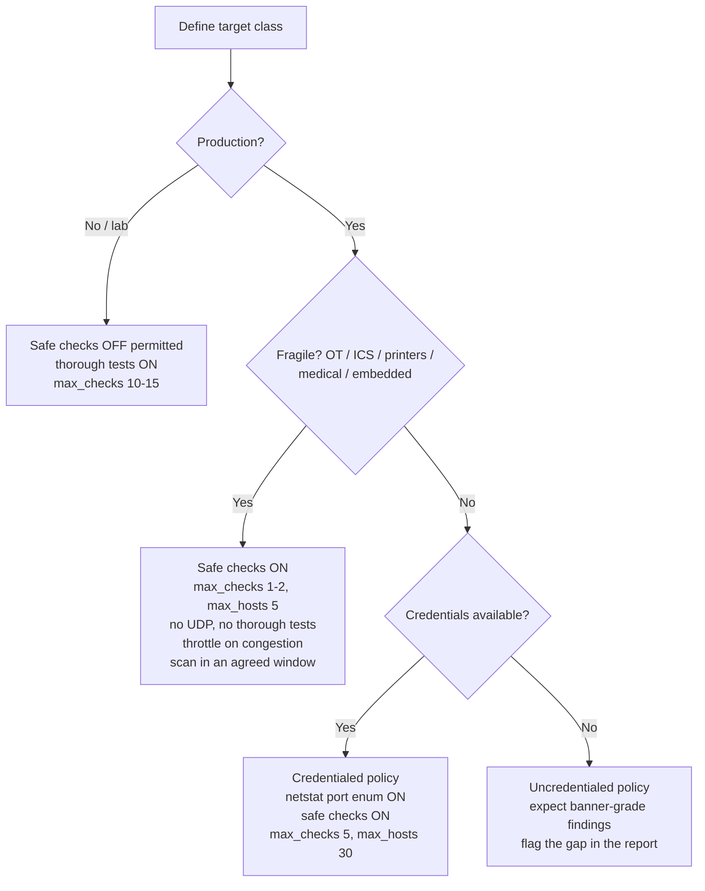
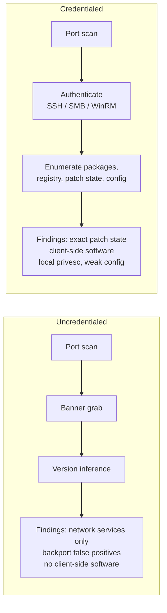
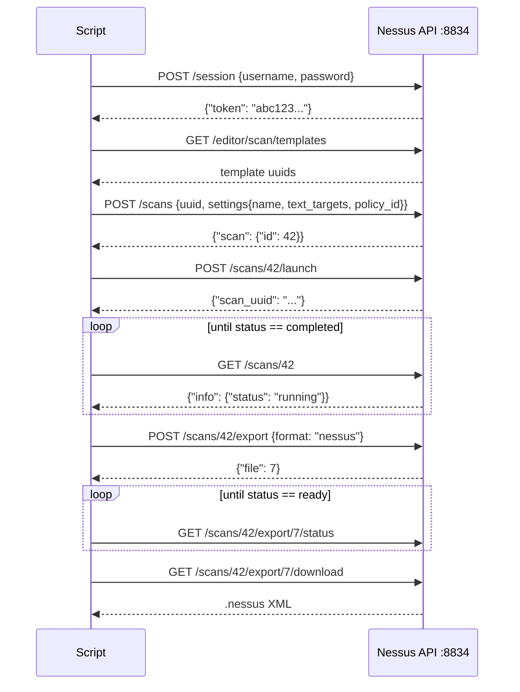
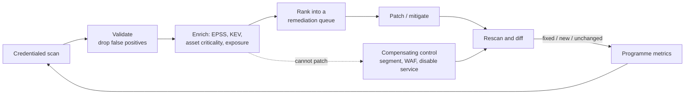

This is Chapter 2 of the Vulnerability Assessment series. The previous chapter gave you the vocabulary — CVE, CWE, CVSS, EPSS, KEV — and the argument that a base score is not a risk score. This chapter gives you the machine that produces those rows in the first place.

Nessus is the vulnerability scanner most people meet first, and the one most likely to be sitting on the client's network when you arrive. It is worth learning properly rather than as a "click Basic Network Scan and wait" ritual, because almost every complaint people have about vulnerability scanners — *it missed everything*, *it's all false positives*, *it knocked over the printer*, *the report is 40,000 useless rows* — is a configuration problem, not a product problem. Every one of those failures maps to a specific setting you are about to learn.

By the end of this chapter you will be able to install and register Nessus from scratch on a Kali box, explain what the plugin feed is and why the first update takes so long, build a scan policy field by field and predict what each field does to the packets that leave your interface, configure SSH and Windows credentials that actually authenticate (and diagnose them when they don't), run a full credentialed scan of a subnet, export it, parse it programmatically, tune it so it doesn't take three days or crash an embedded device, and describe precisely what your scan looked like to the defenders watching it.

A note on legality before anything else: a vulnerability scan is unambiguously an active, intrusive activity. It sends real exploit-adjacent traffic, it authenticates to hosts, and in some configurations it will crash them. Scan only systems you own or have explicit written authorisation to scan, with the target ranges named in the scope document. The engagement-scoping material from the Methodology notebook is not optional background reading for this chapter — it is the thing that keeps this legal.

---

## Part 1: What Nessus Actually Is

Nessus began in 1998 as an open-source scanner written by Renaud Deraison. In 2005 the codebase closed and became a commercial product under Tenable; the last open fork of the 2.x engine became **OpenVAS**, which is now the Greenbone Community Edition covered in the next chapter. That history explains a lot of the shared DNA you'll notice — both scanners are plugin-driven engines that speak a similar dialect and produce similar-looking findings.

Structurally, Nessus is three things bolted together:

1. **`nessusd`** — a daemon that does the actual work: host discovery, port scanning, service detection, authentication to targets, and execution of plugins.
2. **A plugin feed** — tens of thousands of small programs written in **NASL** (Nessus Attack Scripting Language) plus some compiled checks, each of which knows how to detect one flaw or gather one piece of information. This feed updates continuously; it is the product's real value.
3. **A web UI and REST API** — served over HTTPS on **TCP 8834** by the same daemon. There is no separate web server. The UI is a single-page app that talks to the same REST API you can drive with `curl`.

That last point matters more than it sounds. Because the UI is only an API client, **anything you can do by clicking, you can do by script** — which is how you turn a manual scan into a repeatable, version-controlled part of an engagement or a CI pipeline. Part 10 does exactly that.



### The editions, and which one you should install

| Edition | Cost | Target count | Notable capabilities | Typical user |
|---|---|---|---|---|
| **Nessus Essentials** | Free (registration required) | 16 IPs | Full plugin feed, all vuln checks | Learners, home labs, this chapter |
| **Nessus Professional** | Commercial, per-scanner | Unlimited | Compliance/audit files, unlimited targets, full API use, live results | Consultants, individual pentesters |
| **Nessus Expert** | Commercial | Unlimited | Adds external attack surface discovery and IaC / cloud config scanning | Consultants doing cloud + EASM work |
| **Tenable Vulnerability Management** | SaaS subscription | Licensed assets | Cloud console, multiple linked scanners, asset-centric tracking, VPR | Enterprises running continuous VM |
| **Tenable Security Center** | On-prem subscription | Licensed assets | On-prem console over many scanners, dashboards, compliance reporting | Enterprises that can't use SaaS |

Everything in this chapter is done on **Essentials** unless explicitly flagged. Essentials runs the same engine and the same plugin feed as Professional — the restriction is the 16-IP cap and the omission of some commercial features (notably compliance/audit-file scanning). Licensing terms and feature splits change; treat the table as orientation and confirm the current split on Tenable's site before you promise a client anything.

> **Practical note for consultants:** on real engagements you will very often be handed an existing Tenable Security Center or Tenable Vulnerability Management console rather than a bare scanner. The *policy* and *credential* knowledge in Parts 5–7 transfers directly; only the navigation changes. Learn the settings, not the buttons.

### Where Nessus fits in the workflow

Nessus sits between enumeration and exploitation. It is not a replacement for either.



**Red team usage:** a credentialed Nessus scan of a network you already have a foothold on is one of the fastest ways to build a patch-level map of the estate — but it is also one of the loudest things you can possibly do, so it belongs in an assumed-breach or purple-team exercise, never in a stealth engagement. **Blue team usage:** the same scan, run on a schedule from an authorised scanner with a documented service account, is your patch-verification evidence and your "did the emergency patch actually land on all 900 hosts" answer.

---

## Part 2: Installing Nessus on Kali From Scratch

Kali does not ship Nessus (it's not open source, so it can't be in the repos). You download a `.deb` from Tenable and install it manually.

### Step 1 — check your host meets the requirements

Nessus is heavier than people expect. The scanner keeps a per-host knowledge base in memory and unpacks a very large plugin set to disk.

| Resource | Bare minimum | What you actually want |
|---|---|---|
| CPU | 2 cores | 4 cores |
| RAM | 4 GB | 8 GB (16 GB if scanning >1000 hosts) |
| Disk | 30 GB free | 60 GB+ (plugins alone are multiple GB, plus scan results) |
| Network | Any | An interface on the same broadcast domain as targets, for ARP discovery |

```bash
# Confirm architecture, free disk, and RAM before downloading anything
uname -m                 # expect x86_64 (or aarch64 for ARM builds)
df -h /opt               # Nessus installs entirely under /opt/nessus
free -h                  # available RAM
```

- `uname -m` — prints the machine hardware name. You need this to pick the right `.deb`; an amd64 package will not install on an ARM VM.
- `df -h /opt` — disk free, human-readable, for the filesystem holding `/opt`. Nessus installs *everything* under `/opt/nessus`, so that's the mount that matters, not `/`.
- `free -h` — memory summary. If this shows under 4 GB total, expect scans to be slow and the UI to stall during plugin compilation.

### Step 2 — download the package

Download from Tenable's official downloads page in a browser (the URL requires accepting a licence, so a blind `wget` of a guessed path will fail). Pick the build matching your distro base — Kali is Debian-based, so the Debian `amd64` `.deb` is correct.

Always verify the download. Tenable publishes checksums next to each file:

```bash
sha256sum Nessus-10.8.3-debian10_amd64.deb
# 5f0e... compare byte-for-byte against the checksum shown on the download page
```

- `sha256sum` — computes the SHA-256 digest of the file. If it does not match the published value, do not install it: either the download corrupted or you are being tampered with. This is a scanner that will run as root and hold credentials for the entire estate; the integrity check is not ceremony.

### Step 3 — install

```bash
sudo dpkg -i Nessus-10.8.3-debian10_amd64.deb
```

- `dpkg` — the low-level Debian package manager. `-i` / `--install` installs a local `.deb`.
- If it complains about unmet dependencies, run `sudo apt --fix-broken install` to pull them from the repos, then re-run the `dpkg -i`.

Expected output:

```
Selecting previously unselected package nessus.
(Reading database ... 402118 files and directories currently installed.)
Preparing to unpack Nessus-10.8.3-debian10_amd64.deb ...
Unpacking nessus (10.8.3) ...
Setting up nessus (10.8.3) ...
Unpacking Nessus Scanner Core Components...

 - You can start Nessus Scanner by typing /bin/systemctl start nessusd.service
 - Then go to https://kali:8834/ to configure your scanner
```

### Step 4 — start and enable the service

```bash
sudo systemctl start nessusd.service
sudo systemctl enable nessusd.service      # start automatically at boot
systemctl status nessusd.service --no-pager
```

- `systemctl start` — starts the unit now.
- `systemctl enable` — creates the symlink that makes systemd start it on every boot. Skip this on a laptop you only occasionally scan from; enable it on a dedicated scanner.
- `--no-pager` — prints status straight to stdout instead of opening `less`, which is what you want in a script or a copy-paste session.

```
● nessusd.service - The Nessus Vulnerability Scanner
     Loaded: loaded (/lib/systemd/system/nessusd.service; enabled)
     Active: active (running) since Tue 06:12:04 IST; 8s ago
   Main PID: 21884 (nessusd)
      Tasks: 6 (limit: 9451)
     Memory: 118.3M
```

Confirm it's listening:

```bash
sudo ss -tlnp | grep 8834
```

- `ss` — socket statistics, the modern replacement for `netstat`. `-t` TCP only, `-l` listening sockets only, `-n` numeric (don't resolve ports to names), `-p` show the owning process.

```
LISTEN 0  1024  *:8834  *:*  users:(("nessusd",pid=21884,fd=10))
```

### Step 5 — first-run web setup and registration

Browse to `https://127.0.0.1:8834/`. You will get a certificate warning — Nessus generates a self-signed certificate on first start, so this is expected on a fresh install. Accept it.

The setup wizard asks you to:

1. Choose a product — pick **Nessus Essentials** for a lab.
2. Register — Tenable emails you an **activation code** (a string like `ABCD-1234-EFGH-5678-IJKL`).
3. Create a **local admin account** for the scanner UI. This account is not a system account; it lives in the Nessus user store.
4. Wait for the plugin feed to download and compile.

**That last step is the one that surprises everyone.** Nessus downloads the entire plugin set and then *compiles* it into an internal database. On a modest VM this takes anywhere from 10 minutes to well over an hour, and during it the UI shows an initialising message and scans cannot run. It is not hung. You can watch the actual progress from the CLI:

```bash
tail -f /opt/nessus/var/nessus/logs/nessusd.messages
```

- `tail -f` — follow the file as it grows. `nessusd.messages` is the daemon's main log; during initialisation you'll see plugin-loading and compilation lines tick past.

### Step 6 — registering and updating from the CLI

Everything the wizard does has a command-line equivalent, which is what you'll use on a headless scanner or when rebuilding from a script.

```bash
sudo /opt/nessus/sbin/nessuscli fetch --register ABCD-1234-EFGH-5678-IJKL
sudo /opt/nessus/sbin/nessuscli update --all
sudo /opt/nessus/sbin/nessuscli fetch --check
```

- `nessuscli` — the scanner's local admin CLI. It lives at `/opt/nessus/sbin/nessuscli` and is not on your `$PATH` by default.
- `fetch --register <code>` — activates the scanner with an activation code and immediately pulls the plugin feed.
- `update --all` — updates plugins, the core components, and the feed metadata.
- `fetch --check` — reports registration status and whether the feed is current. Run this when a scan mysteriously returns almost no findings; an expired or unregistered feed is a common cause.

Add it to your path so you stop typing the full path:

```bash
echo 'export PATH="$PATH:/opt/nessus/sbin:/opt/nessus/bin"' >> ~/.bashrc && source ~/.bashrc
```

### Air-gapped / offline registration

Scanners on isolated networks — which is most industrial and many financial environments — can't reach `plugins.nessus.org`. The offline flow:

```bash
# 1. On the offline scanner, generate a challenge code
sudo nessuscli fetch --challenge
```

```
Challenge code: aaf7c2e9d1b04c3f8e6a5d2b9c0f1e3a4d5b6c7e
```

```bash
# 2. On an internet-connected machine, submit the challenge code plus your
#    activation code to Tenable's offline registration page. You receive a
#    licence file (nessus.license) and a plugin tarball (all-2.0.tar.gz).

# 3. Transfer both to the scanner and install them
sudo nessuscli fetch --register-offline /path/to/nessus.license
sudo nessuscli update /path/to/all-2.0.tar.gz
sudo systemctl restart nessusd
```

- `fetch --register-offline <file>` — applies a licence file obtained out of band.
- `update <tarball>` — installs a plugin feed from a local archive instead of over the network. You will repeat this every time you want fresh plugins, which in practice means a documented monthly or weekly sneakernet procedure. **Pentester note:** when you assess one of these environments, "how old is the scanner's plugin feed?" is a finding in its own right — a feed six months stale is functionally a blind scanner.

### Useful `nessuscli` commands you will actually need

| Command | What it does |
|---|---|
| `nessuscli fetch --check` | Show registration state and feed currency |
| `nessuscli fetch --register <code>` | Register/activate the scanner online |
| `nessuscli fetch --challenge` | Produce a challenge code for offline registration |
| `nessuscli update --all` | Update plugins and core components |
| `nessuscli update --plugins-only` | Update only the plugin feed |
| `nessuscli lsuser` | List Nessus UI users |
| `nessuscli adduser <name>` | Create a UI user interactively |
| `nessuscli chpasswd <name>` | Reset a UI user's password (the fix for a lost admin login) |
| `nessuscli rmuser <name>` | Delete a UI user |
| `nessuscli fix --list` | Dump all advanced/global settings currently in effect |
| `nessuscli fix --set <key>=<value>` | Change a global advanced setting |
| `nessuscli fix --secure-list` | Dump secure (encrypted) settings |
| `nessuscli dump --plugins` | Dump plugin metadata |
| `nessuscli bug-report-generator` | Collect diagnostics for a support ticket |
| `nessuscli managed link --key=... --cloud` | Link this scanner to Tenable Vulnerability Management |

Losing the admin password is common in labs and not fatal:

```bash
sudo systemctl stop nessusd
sudo /opt/nessus/sbin/nessuscli chpasswd admin
sudo systemctl start nessusd
```

### The directory layout

Knowing where things live turns "the scan is broken" into a five-minute diagnosis.

| Path | Contents |
|---|---|
| `/opt/nessus/sbin/` | `nessusd`, `nessuscli`, `nessus-service` |
| `/opt/nessus/etc/nessus/` | `nessusd.conf`, `nessusd.rules` |
| `/opt/nessus/lib/nessus/plugins/` | The NASL plugin store (`.nasl`, `.inc`) |
| `/opt/nessus/var/nessus/logs/` | `nessusd.messages`, `backend.log`, `www_server.log` |
| `/opt/nessus/var/nessus/users/` | Per-user scan results and policies |
| `/opt/nessus/var/nessus/master.key` | Key protecting stored credentials |

**Security relevance, and it is a big one:** `/opt/nessus/var/nessus/` contains stored scan credentials for every target the scanner touches — often including domain accounts and SSH keys. A vulnerability scanner is therefore one of the highest-value hosts on any network, functionally a credential vault with a web interface. When you are on a red team and you find a Nessus or Tenable scanner, you have found a lateral-movement jackpot. When you are on a blue team, that scanner belongs in Tier 0 with your domain controllers: hardened, patched, MFA on the console, network-restricted, and monitored.

---

## Part 3: How the Engine Works — Plugins, NASL, and the Knowledge Base

You cannot tune a scanner you think of as a black box. Here is what is actually happening between "click Launch" and "here are 312 findings".

### The scan lifecycle



The critical idea is the **Knowledge Base (KB)**. The KB is a per-host key/value store that plugins write into and read from. Plugin dependencies are expressed against KB keys, not against a schedule. A plugin that checks an Apache flaw declares that it requires `Services/www` to exist; if the port scan never found a web server, the KB key is absent and the plugin never runs.

This single mechanism explains the two most common complaints about Nessus:

- **"It missed everything."** Your port-scan range was too narrow, or discovery marked the host dead, so no KB keys were populated and nearly every plugin was skipped by dependency.
- **"It only found banner-grab stuff."** No credentials were supplied, so the local-checks KB keys were never written and every patch-level plugin fell back to (or skipped) remote version inference.

### NASL in practice

NASL is a small C-like scripting language purpose-built for writing network checks. You do not need to write NASL to use Nessus, but being able to *read* one is what turns "Nessus says this is Critical" into "I know exactly what it tested".

```bash
# Find the plugin file for a given plugin ID
grep -rl "script_id(19506)" /opt/nessus/lib/nessus/plugins/ 2>/dev/null

# Read its metadata block
sed -n '1,60p' /opt/nessus/lib/nessus/plugins/nessus_scan_information.nasl
```

- `grep -r` recursive, `-l` list matching filenames only. Plugin IDs are declared with `script_id()` in each file's registration block.
- `sed -n '1,60p'` — print only lines 1–60. The top of a NASL file is the registration block, which carries the name, family, CVE references, CVSS vectors, and — most usefully — the dependency declarations.

A trimmed, representative registration block looks like this:

```c
include("compat.inc");

if (description)
{
  script_id(11219);
  script_version("1.35");
  script_name(english:"Nessus SYN scanner");
  script_family(english:"Port scanners");
  script_dependencies("ping_host.nasl");
  script_require_keys("Settings/ThoroughTests");
  script_set_attribute(attribute:"synopsis", value:
"It is possible to determine which TCP ports are open.");
  script_set_attribute(attribute:"risk_factor", value:"None");
  exit(0);
}
```

The parts that matter to you as an operator:

- `script_family()` — which plugin family the check belongs to. Families are how you enable/disable checks in bulk in an Advanced Scan policy.
- `script_dependencies()` — other plugins that must run first.
- `script_require_keys()` / `script_require_ports()` — the KB keys and ports that gate execution. This is the dependency graph in action.
- `risk_factor` — the severity assigned when the check fires.

### Plugin families worth knowing by name

| Family | What's in it | When it matters |
|---|---|---|
| `Settings` | Scan configuration plugins | **Never disable this family** — the whole scan depends on it |
| `Port scanners` | SYN scanner (11219), netstat via SSH (14272)/WMI (34220) | Controls how ports are found |
| `Service detection` | Banner and protocol identification (22964) | Populates `Services/*` KB keys |
| `General` | OS fingerprinting (11936), CPE (45590), traceroute (10287) | Asset inventory data |
| `Windows : Microsoft Bulletins` | Patch-level checks against the registry | Only fires with valid Windows credentials |
| `Ubuntu / Red Hat / Debian Local Security Checks` | Package-version comparisons | Only fires with valid SSH credentials |
| `Web Servers`, `CGI abuses`, `CGI abuses : XSS` | Web-layer checks | Noisy and slow; the reason web scans take hours |
| `Denial of Service` | Checks that may crash the target | **Disabled unless you turn off Safe Checks** |
| `Backdoors`, `Malicious Process Detection` | Compromise indicators | Useful in an IR context |

### Plugin IDs you'll recognise on sight

After a few dozen scans these become sight-readable, and they are your first diagnostic tool:

| Plugin ID | Name | Why you care |
|---|---|---|
| 19506 | Nessus Scan Information | Documents policy used, scan duration, credentialed status — **read this first, every time** |
| 10180 | Ping the remote host | Whether/how the host answered discovery |
| 11219 | Nessus SYN scanner | Which ports the SYN scanner found |
| 22964 | Service Detection | What service was identified on each port |
| 11936 | OS Identification | Fingerprinted OS and the confidence level |
| 45590 | Common Platform Enumeration (CPE) | The CPE strings driving CVE matching |
| 10107 | HTTP Server Type and Version | Web server banner |
| 21745 | Authentication Failure — Local Checks Not Run | **Your credentials failed.** The single most important failure signal |
| 12634 | Authenticated Check: OS Name and Installed Package Enumeration | Credentialed Linux checks succeeded |
| 24786 | Nessus Windows Scan Not Performed with Admin Privileges | Windows creds worked but lacked admin — results will be incomplete |
| 10394 | Microsoft Windows SMB Log In Possible | SMB authentication succeeded |
| 110723 / 141118 | Target Credential Status by Authentication Protocol | Per-protocol credential success/failure summary |

> **Habit worth building:** on every scan, before you look at a single Critical, open plugin **19506** on a sample host and confirm the "Credentialed checks : yes" line. If it says `no`, the rest of the report is a banner-grab exercise and you should fix credentials and rescan rather than write it up.

---

## Part 4: The Interface, Scans, Policies and Templates

Log in at `https://<scanner>:8834/`. The navigation is small: **Scans** (folders of scan jobs and their results), **Policies** (saved, reusable configurations), **Plugin Rules** (per-plugin severity overrides), **Terrascan/Customized Reports** on paid tiers, and **Settings**.

Three concepts get confused constantly, so nail them down now:

- A **template** is a Tenable-supplied starting point (Basic Network Scan, Advanced Scan, Host Discovery…). You cannot edit a template.
- A **policy** is *your* saved configuration, created from a template and then customised. Policies are reusable across scans and are the right unit to version and hand to a colleague.
- A **scan** is a job: a policy (or template) plus a target list plus a schedule. Its results are stored per-run as a history.

The correct workflow on a real engagement is: build one policy per scan class (external unauthenticated, internal credentialed Windows, internal credentialed Linux, fragile/OT), then create scans that reference those policies. Editing settings inline on each scan is how teams end up with twenty scans that disagree with each other and no way to explain why two runs produced different results.

### The templates that matter

| Template | What it does | When to use it |
|---|---|---|
| **Host Discovery** | Discovery only — no vuln plugins. Produces a live-host and open-port inventory | Always run this first on an unfamiliar network to validate scope and count assets |
| **Basic Network Scan** | Sensible general-purpose defaults, safe checks on | Day-to-day internal scanning; a reasonable default |
| **Advanced Scan** | Every setting exposed, no defaults imposed, manual plugin family selection | When you need control — fragile targets, tight windows, targeted plugin sets |
| **Advanced Dynamic Scan** | Plugins selected by a live filter (e.g. `CVE contains 2024`) rather than by family; the set updates as the feed does | Hunting a specific vuln class or a fresh CVE across an estate |
| **Credentialed Patch Audit** | Authenticated-only; skips most remote checks | Fast patch-state inventory when you already know the hosts |
| **Web Application Tests** | Enables the web crawler and the CGI/XSS/SQLi plugin families | Web-heavy targets — expect it to be slow |
| **Malware Scan** | File-system and process indicators, hash reputation | IR support, compromise assessment |
| **Internal PCI Network Scan** | PCI DSS internal ruleset with PCI-specific pass/fail | PCI internal requirement |
| **PCI Quarterly External Scan** | ASV-format external scan | PCI external requirement (must still be submitted via an approved ASV) |
| **Policy Compliance Auditing** | Runs `.audit` files (CIS, DISA STIG, custom) | **Commercial tiers only**; config-hardening audits |
| Single-issue templates (Log4Shell, Spectre/Meltdown, WannaCry, Shellshock, DROWN, Badlock…) | One vulnerability, scanned fast across a big estate | Incident response — "are we exposed to *this*, right now, everywhere" |

**Blue team usage:** those single-issue templates are the reason a scanner earns its licence fee. When a critical internet-wide bug drops, the question your CISO asks in the first hour is "how many of ours?", and a targeted template answers it in minutes across thousands of hosts rather than by running a full scan you won't finish before the incident call.

**Bug bounty relevance:** Nessus is generally the *wrong* tool for a public bug bounty program. Most programs prohibit automated scanners outright, the traffic volume will get you rate-limited or banned, and the interesting bounty classes (IDOR, business logic, auth bypass, SSRF chains) are exactly what signature-driven scanners cannot find. Where it does earn its place is on a self-hosted target you're allowed to hammer, or on an internal/VDP scope where infrastructure CVEs are in scope — and even then, run it for *inventory and patch state*, then do the finding by hand.

### Creating a policy

**Scans → Policies → New Policy → Advanced Scan.** You get a settings tree with five top-level groups: **Basic**, **Discovery**, **Assessment**, **Report**, **Advanced**, plus **Credentials** and **Plugins** tabs. The next three parts walk that tree.

---

## Part 5: Discovery Settings — Deciding What Is Even There

Discovery is where scans are silently ruined. If a host isn't discovered, it is not scanned, and nothing in the report will tell you it existed.

### Host discovery

`Discovery → Host Discovery`.

| Setting | Effect | Guidance |
|---|---|---|
| **Ping the remote host** | Master switch for discovery probing | Leave on, but understand the sub-options |
| **General Settings → Test the local Nessus host** | Includes the scanner itself if it falls in range | Off, unless you're auditing the scanner |
| **Use fast network discovery** | Skips extra confirmation probes | On for speed, off when accuracy matters |
| **Ping Methods → ARP** | Layer-2 discovery | **Only works on the scanner's own broadcast domain.** Essential locally, useless remotely |
| **Ping Methods → TCP** | SYN to a list of ports | The workhorse on firewalled networks |
| **Ping Methods → ICMP** | Classic echo request | Frequently dropped by host firewalls — do not rely on it alone |
| **Ping Methods → UDP** | UDP probes | Slow, unreliable; enable only for known UDP-only assets |
| **Destination ports (TCP ping)** | Which ports the TCP ping targets | `built-in` covers common ports; override for odd estates |
| **Assume ICMP unreachable means host is down** | Trusts an ICMP unreachable | Off — a filtering router lies to you |

The single most common discovery failure on a Windows estate: **Windows Defender Firewall blocks inbound ICMP echo by default.** If ICMP is your only ping method and you're scanning from a different subnet (so ARP can't help), a fully-populated Windows VLAN will scan as "0 hosts alive". The fix is to enable TCP ping and include ports Windows actually opens — 135, 139, 445, 3389.



The escape hatch when discovery keeps failing is to **disable host discovery entirely** — untick "Ping the remote host". Nessus then treats every address in range as alive and port-scans all of them. It is far slower (you're scanning dead space), but on a small, important range it guarantees nothing is skipped because of a firewall's opinion about ICMP.

### Port scanning

`Discovery → Port Scanning`.

| Setting | Effect | Guidance |
|---|---|---|
| **Consider unscanned ports as closed** | Ports outside your range are recorded closed rather than unknown | Off — it produces a report that overstates coverage |
| **Port scan range** | `default` (~4,790 common ports), `all` (1–65535), or an explicit list | See below |
| **SSH (netstat)** | Reads open ports from the host itself via SSH | **On.** Fast, exact, and finds loopback-bound services |
| **WMI (netstat)** | Same idea for Windows | **On** for credentialed Windows scans |
| **SNMP** | Reads ports via SNMP | On if you have community strings |
| **TCP scan / SYN scan** | Which network port scanner runs | Use SYN |
| **UDP scan** | Enables UDP port scanning | **Off by default, and usually leave it off** — it multiplies scan time enormously |
| **Override automatic firewall detection** | Forces behaviour when an IPS is mangling results | Only when you know a device is interfering |

Two things deserve emphasis.

First, **`default` is not `all`.** The default range is roughly 4,790 ports chosen for prevalence. A management interface on TCP 9443 or a database on 27017 may sit outside it. On a scoped internal engagement where time allows, scan `all`; where it doesn't, at minimum feed in the ports your Nmap sweep already found:

```bash
# Produce a port list from a fast Nmap sweep to paste into the Nessus range
nmap -sS -p- --min-rate 2000 -oG - 10.10.10.0/24 \
  | awk '/Ports:/{print $0}' \
  | grep -oP '\d+(?=/open)' | sort -un | paste -sd, -
```

- `-sS` — TCP SYN ("half-open") scan.
- `-p-` — all 65,535 TCP ports.
- `--min-rate 2000` — send at least 2,000 packets per second; the main lever for finishing a full-port sweep in minutes rather than hours. Do not use a high rate on fragile or WAN-separated targets.
- `-oG -` — greppable output to stdout.
- `grep -oP '\d+(?=/open)'` — Perl-regex, output-only: a run of digits *followed by* `/open` (a lookahead, so the `/open` isn't printed). This yields the open port numbers.
- `sort -un` — numeric sort, unique.
- `paste -sd, -` — join all lines into one comma-separated line, which is exactly the format the Nessus port-range field wants.

Second, **netstat-based port enumeration is the biggest accuracy win available.** With credentials, Nessus asks the host what is listening instead of inferring it from outside. This finds services bound only to localhost and services behind a host firewall — both of which are invisible to any network scan, and both of which are real attack surface the moment an attacker has any local foothold.

### Service discovery

`Discovery → Service Discovery` controls whether Nessus probes all ports for services and how it handles TLS.

- **Probe all ports to find services** — on. Without it, Nessus assumes port 8080 is HTTP because of convention, and mislabels anything unconventional.
- **Search for SSL/TLS on** — set to *all ports* rather than the known list, otherwise TLS on a nonstandard port goes unassessed (and TLS findings are a large share of any typical report).
- **Enumerate all SSL ciphers** — on for an accurate cipher-suite inventory; it costs time.

---

## Part 6: Assessment, Report and Advanced Settings

### Assessment

`Assessment → General`.

| Setting | Effect |
|---|---|
| **Accuracy → Override normal accuracy** | Choose *Avoid potential false alarms* (fewer findings, higher confidence) or *Show potential false alarms* (the "paranoid" mode — more findings, more noise) |
| **Perform thorough tests** | Runs deeper, slower variants of many checks. More findings, more load, more chance of upsetting a fragile host |
| **Antivirus definition grace period** | Suppresses "AV out of date" findings for N days |
| **SMTP settings** | Third-party/relay test addresses |

The accuracy switch is worth understanding rather than flipping. *Avoid potential false alarms* suppresses checks that infer a vulnerability without direct evidence — typically version-based inferences. That reduces noise, but it also suppresses genuinely-true findings on hosts where a direct check isn't possible. On a compliance-driven scan, run the accurate mode. When you are hunting and will validate everything by hand anyway, paranoid mode surfaces leads worth chasing. What you must never do is hand a client paranoid-mode output unvalidated.

`Assessment → Brute Force`:

- **Only use credentials provided by the user** — **leave this ON.** With it off, Nessus attempts default-credential checks, which means login attempts against real accounts. On a domain that means **account lockouts**, and locking out an estate is a career-defining way to end an engagement badly.
- **Oracle Database / Hydra options** — only relevant when you've deliberately enabled brute-force testing and agreed it in the rules of engagement.

`Assessment → Web Applications`: off by default, and that default is correct for a general infrastructure scan. Turning it on enables crawling and the CGI plugin families, and can add hours per host. Key knobs: start page, max pages to crawl, max crawl depth, and whether to test embedded web servers (leave that off — embedded servers on printers and iLO/iDRAC boards are exactly the things that fall over).

`Assessment → Windows`: whether to enumerate domain users and local users, and the SID range to walk (default 1000–1200). Useful for building a user inventory during an internal test; also noticeably noisy in the target's security logs.

### Report

| Setting | Effect | Guidance |
|---|---|---|
| **Display hosts that respond to ping** | Adds an informational finding per live host | On — it's your live-host inventory |
| **Display unreachable hosts** | Reports addresses that never answered | On for scope validation — proves you tried the whole range |
| **Allow users to edit scan results** | Lets analysts delete findings from stored results | **Off.** Editable results destroy the audit trail; do your triage in the report, not the raw data |
| **Designate hosts by their DNS name** | Names instead of IPs in output | Personal preference; IPs are less ambiguous when DNS is a mess |

### Advanced

This is the performance and safety group, and it is where you keep yourself out of trouble.

| Setting | Default-ish | What it does |
|---|---|---|
| **Enable safe checks** | On | Suppresses checks known to be able to crash or degrade the target |
| **Stop scanning hosts that become unresponsive** | On | Halts on a host that stops answering — likely because you just crashed it |
| **Scan IP addresses in random order** | Off | Spreads load and evades naive sequential-scan detection |
| **Max simultaneous checks per host** (`max_checks`) | 5 | Parallel plugins against one host. The main per-host load lever |
| **Max simultaneous hosts per scan** (`max_hosts`) | 30 (varies) | Parallel hosts. The main total-throughput lever |
| **Max number of concurrent TCP sessions per host** | unlimited | Cap this for embedded devices with tiny connection tables |
| **Network timeout (seconds)** | 5 | Raise to 15–30 across a WAN or VPN |
| **Slow down the scan when network congestion is detected** | Off | On for fragile links; it throttles automatically |

**Safe Checks deserves its own paragraph.** With it enabled, plugins that can crash a target either don't run or run only their non-destructive detection path — so some results become version-inference rather than proof. With it disabled, Nessus will run the Denial of Service family and the aggressive variants, and it *will* eventually knock something over: an old printer, a SCADA HMI, a legacy load balancer, an IP camera. There is exactly one correct process here: disable Safe Checks only in a lab, or on production only with an explicit written agreement naming the hosts, a scheduled window, and someone on a bridge call who can reboot what breaks. Getting this wrong is the classic way a junior tester takes down a hospital's imaging network.



### Editing the same settings globally

Every "Advanced" policy setting has a global default in `nessusd.conf`, settable from the CLI:

```bash
sudo nessuscli fix --list | sort | head -40
sudo nessuscli fix --set max_hosts=20
sudo nessuscli fix --set network_receive_timeout=10
sudo systemctl restart nessusd
```

- `fix --list` — prints the effective global settings.
- `fix --set key=value` — changes one. Per-policy settings still override these; think of them as the floor.
- The restart is required for many settings to take effect.

Settings worth knowing by their config-file names, because that's how they appear in logs and forum answers:

| Key | Meaning |
|---|---|
| `max_hosts` | Concurrent hosts per scan |
| `max_checks` | Concurrent checks per host |
| `checks_read_timeout` | Seconds to wait for a plugin's socket read |
| `network_receive_timeout` | Seconds to wait for any network response |
| `throttle_scan` | Auto-slow when congestion is detected |
| `safe_checks` | Global safe-checks toggle |
| `optimize_test` | Use the KB dependency graph to skip inapplicable plugins (leave on) |
| `silent_dependencies` | Hide dependency plugins from the report |
| `report_paranoia` | 0 = avoid false alarms, 1 = normal, 2 = paranoid |
| `thorough_tests` | Deep test variants |
| `log_whole_attack` | Verbose per-plugin logging — invaluable when debugging, huge on disk |
| `stop_scan_on_disconnect` | Abandon a host that stops responding |

---

## Part 7: Credentialed Scanning — The Part That Actually Matters

If you take one operational lesson from this chapter, take this one: **an uncredentialed scan and a credentialed scan of the same host are different activities producing different-quality data, and the gap is not marginal.**

Uncredentialed, Nessus stands outside the host and infers. It sees `Apache/2.4.29` in a `Server:` header and reports every CVE affecting 2.4.29. It cannot see whether Ubuntu backported the fix into `2.4.29-1ubuntu4.14` (it almost certainly did), so it produces confident false positives. It cannot see the 340 vulnerable client-side packages that never open a socket — the browsers, PDF readers, Java runtimes, and libraries that are the actual path onto a workstation.

Credentialed, Nessus logs in and enumerates installed packages and patch state directly. False positives collapse. Coverage multiplies. A typical Windows workstation might yield 8 findings unauthenticated and 200+ authenticated — and the authenticated ones are the true ones.



### Linux/Unix credentials over SSH

`Credentials → Host → SSH`. Authentication methods: password, **public key**, certificate, or Kerberos.

Use a key. Generate one dedicated to scanning:

```bash
ssh-keygen -t ed25519 -a 100 -C "nessus-scanner" -f ~/.ssh/nessus_scan
```

- `-t ed25519` — modern elliptic-curve key type; short, fast, well supported.
- `-a 100` — 100 KDF rounds on the private key's passphrase, raising the cost of cracking a stolen key file.
- `-C` — a comment, which lands in `authorized_keys` and makes the key identifiable on the target.
- `-f` — output path.

Deploy the public key to a dedicated, non-interactive scan account on each target — via configuration management, not by hand.

Then decide on privilege escalation. `Credentials → SSH → Elevate privileges with` offers `sudo`, `su`, `su+sudo`, `pbrun`, `dzdo`, `.k5login`, and `Cisco 'enable'`. Root-equivalent read access is required for a genuinely complete Linux scan: package databases are readable unprivileged on most distros, but file permissions, SUID inventories, config files under `/etc` with restrictive modes, and many local-check plugins are not.

A least-privilege sudoers entry for a scan account:

```bash
# /etc/sudoers.d/nessus-scan  (edit with: sudo visudo -f /etc/sudoers.d/nessus-scan)
nessus-scan ALL=(root) NOPASSWD: /usr/bin/dpkg, /usr/bin/apt-cache, \
    /bin/cat /etc/*, /usr/bin/rpm, /usr/bin/find, /usr/bin/stat, /bin/ls
Defaults:nessus-scan !requiretty
```

- `visudo -f` — edits a sudoers file with syntax validation on save. Editing sudoers with a plain editor and making a typo can lock everyone out of `sudo`; `visudo` exists to prevent that.
- `NOPASSWD:` — no password prompt, required for non-interactive scanning.
- `!requiretty` — allows `sudo` without a TTY, which non-interactive SSH sessions don't have. Missing this causes `sudo: sorry, you must have a tty to run sudo` and a silently degraded scan.

**A word of caution to both sides of the fence:** that sudoers entry is deliberately narrow, and even so, `NOPASSWD: /bin/cat /etc/*` lets the account read `/etc/shadow`. There is no such thing as a harmless scanning account. **Red team usage:** a compromised scan account is often effectively root-read across the entire Linux estate, with a key conveniently stored on one machine. **Blue team usage:** scope the sudoers entry as tightly as your plugin coverage tolerates, restrict the scan account's source IP with a `Match Address` block in `sshd_config`, forbid interactive shell use, and alert on any use of that account from anywhere other than the scanner.

### Windows credentials

`Credentials → Host → Windows`. Options: password (NTLM/LM/Kerberos), LM/NTLM hash, or Kerberos.

For a **domain** scan, supply a domain account with local administrator rights on targets — typically via a dedicated group added to local Administrators through a GPO restricted group or LAPS-aware policy. Local admin is genuinely required: reading the patch registry hives and the admin shares are privileged operations. If the account lacks it you will get **plugin 24786 (Nessus Windows Scan Not Performed with Admin Privileges)** and a report that looks fine and is wrong.

Prerequisites on the targets — this checklist resolves the overwhelming majority of "Windows credentials don't work" tickets:

| Requirement | Why | How to verify |
|---|---|---|
| **Server service running** | Serves the admin shares | `sc query LanmanServer` |
| **Remote Registry service** | Reads patch/software hives | `sc query RemoteRegistry` (often Disabled by default — Nessus can start it temporarily if configured) |
| **Admin shares present** (`ADMIN$`, `C$`, `IPC$`) | Nessus reads files/registry through them | `net share` |
| **File and Printer Sharing** allowed inbound (TCP 445) | The transport | `Get-NetFirewallRule -DisplayGroup "File and Printer Sharing"` |
| **UAC remote restriction handled** | Local (non-domain) admins get a filtered token remotely | Set `LocalAccountTokenFilterPolicy=1` — **domain accounts are unaffected**, so prefer a domain account |
| **Account not locked/expired** | Obvious, frequently the answer | `net user <acct> /domain` |

Verify credentials *before* burning a scan window, from Kali:

```bash
# Test SMB authentication and admin rights in one shot
netexec smb 10.10.10.0/24 -u svc-nessus -p 'REDACTED' -d CORP --shares
```

- `netexec` (formerly CrackMapExec) — a network execution tool for SMB/WinRM/LDAP and more. `smb` selects the protocol, `-u`/`-p` are credentials, `-d` the domain, `--shares` lists shares.
- The output marks `(Pwn3d!)` on hosts where the account has admin — which is exactly the condition Nessus needs. A host that authenticates but shows no `Pwn3d!` will produce plugin 24786.

```
SMB  10.10.10.20  445  DC01   [*] Windows Server 2019 Build 17763 x64 (name:DC01) (domain:corp.local)
SMB  10.10.10.20  445  DC01   [+] corp.local\svc-nessus:REDACTED (Pwn3d!)
SMB  10.10.10.35  445  WKS-07 [+] corp.local\svc-nessus:REDACTED (Pwn3d!)
SMB  10.10.10.41  445  WKS-13 [+] corp.local\svc-nessus:REDACTED
```

That last line — authentication succeeded but no `Pwn3d!` — is your early warning that WKS-13 will scan incompletely. Fix it before you launch, not after.

**A hard rule for engagements:** never reuse a Domain Admin account as your scan account, and never let a client hand you one "to make it easier". A scanning account is a standing, broadly-privileged credential stored on a network appliance. Domain Admin rights on it convert a scanner compromise into a full domain compromise. Use a dedicated account with local admin on targets, tier it appropriately, and rotate it after the engagement.

### Other credential types

| Type | Typical use |
|---|---|
| **Database** (Oracle, SQL Server, MySQL, PostgreSQL, MongoDB, DB2) | Database configuration and patch audits |
| **SNMP v1/v2c/v3** | Network device inventory and config; v3 with auth+priv, never v1 with `public` |
| **VMware ESXi / vCenter SOAP API** | Hypervisor patch state — a high-value target class people forget |
| **Cisco / Palo Alto / Checkpoint / F5 / Junos** | Network appliance config auditing |
| **AWS / Azure / GCP / Rackspace** | Cloud configuration assessment on paid tiers |
| **Plaintext protocols** (telnet/rsh/rexec) | Legacy gear only — flag their existence as a finding in itself |

### Diagnosing credential failure

The scan finishes, and instead of 200 findings you get 8. Work the list:

1. Open **plugin 19506 (Nessus Scan Information)** on a failing host. Look for `Credentialed checks : no`.
2. Look for **plugin 21745 (Authentication Failure - Local Checks Not Run)** and read its plugin output — it usually names the protocol and the reason.
3. Look for **plugins 110723 / 141118 (Target Credential Status by Authentication Protocol)** for a per-protocol success/failure breakdown.
4. Test the credential by hand from the scanner host (`netexec` for SMB, `ssh -v` for SSH). If it fails by hand, it's not a Nessus problem.
5. For Windows: walk the prerequisites table above — Remote Registry and `LocalAccountTokenFilterPolicy` are the two usual culprits.
6. For Linux: check `sudo` works non-interactively and `!requiretty` is set; check the account's shell isn't `/sbin/nologin`.
7. Check for an intervening host firewall or NAC policy that permits ICMP but blocks 445/22 from the scanner's address.

Sample output from plugin 19506, which you should learn to read at a glance:

```
Information about this scan :

Nessus version : 10.8.3
Plugin feed version : 202610151215
Scanner edition used : Nessus
Scan policy used : Internal Credentialed Windows
Scanner IP : 10.10.10.5
Port scanner(s) : nessus_syn_scanner wmi_netstat
Port range : default
Ping RTT : 1.884 ms
Thorough tests : no
Experimental tests : no
Paranoia level : 1
Report verbosity : 1
Safe checks : yes
Optimize the test : yes
Credentialed checks : yes, as 'CORP\svc-nessus' via SMB
Attempt Least Privilege : no
Patch management checks : None
CGI scanning : disabled
Web application tests : disabled
Max hosts : 30
Max checks : 5
Recv timeout : 5
Backports : None
Allow post-scan editing : Yes
Scan Start Date : 2026/10/16 6:12 IST
Scan duration : 1284 sec
```

Every line there is a claim you can be held to in a report: which policy ran, whether credentials worked, whether safe checks were on, and how long it took. On a client engagement, screenshot this for at least one host per scan class — it is your evidence that the scan was configured as promised.

---

## Part 8: Hands-On Lab — A Full Credentialed Scan End to End

### Lab setup

Everything below runs against a private lab. Build it with three VMs on an isolated host-only network:

| Host | IP | Role |
|---|---|---|
| Kali (scanner) | 10.10.10.5 | Nessus Essentials |
| Metasploitable 2 | 10.10.10.20 | Deliberately vulnerable Linux, SSH creds `msfadmin:msfadmin` |
| Windows 10/Server VM | 10.10.10.30 | Unpatched-ish Windows with a local admin account |

Metasploitable 2 is a free VM from Rapid7 with a large, well-documented set of real vulnerabilities. It is *catastrophically* insecure by design — never bridge it to a network with internet access or to your home LAN.

### Step 1 — validate scope with a discovery-only scan

Never begin with a full scan. Start by proving you can see what you're supposed to see.

**Scans → New Scan → Host Discovery.** Name it `Lab - Discovery`, targets `10.10.10.0/24`, Discovery mode "Port scan (common ports)". Launch.

Cross-check against Nmap so you have an independent baseline:

```bash
nmap -sn -PR -PS22,80,135,139,443,445,3389 -PE 10.10.10.0/24 -oN lab-discovery.txt
```

- `-sn` — ping scan only; no port scan. Host discovery in isolation.
- `-PR` — ARP ping (only meaningful on the local segment, where it is the most reliable method available).
- `-PS<ports>` — TCP SYN ping against the listed ports.
- `-PE` — ICMP echo ping.
- `-oN` — normal-format output to a file.

```
Nmap scan report for 10.10.10.20
Host is up (0.00042s latency).
MAC Address: 08:00:27:A1:3C:6E (Oracle VirtualBox virtual NIC)

Nmap scan report for 10.10.10.30
Host is up (0.00071s latency).
MAC Address: 08:00:27:9F:B2:11 (Oracle VirtualBox virtual NIC)

Nmap done: 256 IP addresses (3 hosts up) scanned in 3.42 seconds
```

If Nessus reports fewer live hosts than Nmap, stop and fix discovery settings before going further. **This reconciliation step is the difference between a professional assessment and a scan you ran.**

### Step 2 — build the policy

**Policies → New Policy → Advanced Scan.** Name it `Lab - Credentialed`.

Settings, in order:

- *Discovery → Host Discovery*: Ping methods ARP + ICMP + TCP; TCP ping ports `built-in`.
- *Discovery → Port Scanning*: Port scan range `all`; enable SSH (netstat), WMI (netstat), and SYN scanner; leave UDP off.
- *Discovery → Service Discovery*: probe all ports for services; search for TLS on all ports.
- *Assessment → General*: normal accuracy; thorough tests **on** (this is a lab).
- *Assessment → Brute Force*: "Only use credentials provided by the user" **on**.
- *Report*: display hosts that respond to ping, display unreachable hosts, disable result editing.
- *Advanced*: Safe checks **on**; `max_checks` 5; `max_hosts` 10; network timeout 5.

Credentials:

- **SSH** → password auth, username `msfadmin`, password `msfadmin`, elevate privileges: `sudo`, sudo user `root`. (Password auth here only because Metasploitable predates modern key hygiene; use keys everywhere real.)
- **Windows** → username `labadmin`, the password, domain blank for a local account. Because it's a *local* admin on a non-domain box, set `LocalAccountTokenFilterPolicy` on the target first:

```powershell
# Run as Administrator on the Windows target
New-ItemProperty -Path "HKLM:\SOFTWARE\Microsoft\Windows\CurrentVersion\Policies\System" `
  -Name "LocalAccountTokenFilterPolicy" -Value 1 -PropertyType DWord -Force

# Ensure Remote Registry is available
Set-Service -Name RemoteRegistry -StartupType Manual
Start-Service -Name RemoteRegistry

# Allow File and Printer Sharing inbound
Enable-NetFirewallRule -DisplayGroup "File and Printer Sharing"
```

- `New-ItemProperty` — creates a registry value. `LocalAccountTokenFilterPolicy=1` disables UAC remote token filtering for *local* accounts, so a local admin authenticating over the network receives a full (not filtered) token. **Security relevance:** this is a genuine weakening of the host's posture and is itself a common red-team enabler for pass-the-hash with local accounts. Set it in a lab; in production, use a domain account instead, which is unaffected by the filtering.
- `Set-Service -StartupType Manual` — lets the service be started on demand rather than leaving it running permanently.

Plugins tab: leave all families enabled for this lab, but **explicitly confirm the `Denial of Service` family is disabled** (Safe Checks handles this, but check).

Save the policy.

### Step 3 — create and launch the scan

**Scans → New Scan → User Defined → `Lab - Credentialed`.** Targets: `10.10.10.20,10.10.10.30`. Launch.

Watch it from the CLI while it runs:

```bash
sudo tail -f /opt/nessus/var/nessus/logs/nessusd.messages | grep -Ei 'launch|finish|error|auth'
```

- `grep -E` — extended regex; `-i` case-insensitive. Filters the firehose down to lifecycle and authentication events.

```
[Tue Oct 16 06:12:04 2026][21884.1] Starting scan 'Lab - Credentialed'
[Tue Oct 16 06:12:09 2026][21884.4] user admin : launching ping_host.nasl against 10.10.10.20
[Tue Oct 16 06:12:11 2026][21884.4] user admin : launching nessus_syn_scanner.nasl against 10.10.10.20
[Tue Oct 16 06:13:40 2026][21884.4] user admin : ssh_get_info.nasl : successful login as msfadmin
[Tue Oct 16 06:14:02 2026][21884.9] user admin : smb_login.nasl : successful login as labadmin
[Tue Oct 16 06:35:18 2026][21884.1] Finished scan 'Lab - Credentialed' in 1394 sec
```

Confirm the traffic is really leaving, and get a feel for the volume:

```bash
sudo tcpdump -i eth0 -nn 'host 10.10.10.20 and not port 22' -c 20
```

- `tcpdump -i` interface, `-nn` don't resolve hostnames *or* port names, `-c 20` stop after 20 packets. The filter excludes your own SSH session so the output isn't drowned in it.

### Step 4 — read the results

Expect roughly this shape from Metasploitable 2:

| Severity | Representative findings on 10.10.10.20 |
|---|---|
| Critical | `vsftpd 2.3.4 backdoor` (CVE-2011-2523); `UnrealIRCd backdoor` (CVE-2010-2075); `distccd remote command execution` (CVE-2004-2687) |
| Critical | `Samba 3.x username map script command execution` (CVE-2007-2447) |
| High | `Java RMI Server insecure default configuration`; `rlogin/rsh service enabled`; `Bind Shell Backdoor Detected` on 1524 |
| High | Dozens of outdated-package findings surfaced only because credentials worked |
| Medium | SSL self-signed certificate; SSH weak algorithms; anonymous FTP |
| Info | Plugin 19506, OS identification, service detections, CPE |

Open the vsftpd finding and read the whole record, not just the title:

```
Plugin ID:   55523
Name:        vsftpd Smiley Face Backdoor
Severity:    Critical
CVSS v3.1 Base Score: 9.8 (AV:N/AC:L/PR:N/UI:N/S:U/C:H/I:H/A:H)
CVE:         CVE-2011-2523
Port:        21 / tcp / ftp

Synopsis:
The remote FTP server contains a backdoor, allowing execution of arbitrary code.

Description:
The version of vsftpd running on the remote host has been compiled with a
backdoor. Attempting to login with a username containing :) (a smiley face)
triggers the backdoor, which results in a shell listening on TCP port 6200.

Plugin Output:
  Nessus was able to execute the 'id' command on the remote host, which
  returned the following output:
  uid=0(root) gid=0(root)

Solution:
Validate and recompile a legitimate copy of the source code.
```

The **Plugin Output** block is the piece people skip and the piece that matters. It is the scanner's evidence. Here it is a command executed as root — that is proof, not inference, and it goes straight into your report as-is. When a plugin output section instead says only "the remote host is running version X", you have an inference, and inferences need manual validation before you assert them (see Chapter 4).

### Step 5 — export

**Report → Export → Nessus** produces a `.nessus` XML file: the complete, lossless record including the policy, all findings, and all plugin output. That is your archive format. CSV is for spreadsheets and pivot tables; HTML/PDF for humans. Always keep the `.nessus`.

---

## Part 9: Reporting — The `.nessus` Format and Parsing It Programmatically

The built-in HTML and PDF reports are fine for an executive summary and useless for analysis. Any real workflow parses the raw output. So learn the format.

### Anatomy of a `.nessus` file

A `.nessus` file is XML with two top-level children: the policy that ran, and the report.

```xml
<?xml version="1.0" ?>
<NessusClientData_v2>
  <Policy>
    <policyName>Lab - Credentialed</policyName>
    <Preferences>
      <ServerPreferences>
        <preference><name>max_hosts</name><value>10</value></preference>
        <preference><name>safe_checks</name><value>yes</value></preference>
      </ServerPreferences>
    </Preferences>
    <FamilySelection>...</FamilySelection>
    <IndividualPluginSelection>...</IndividualPluginSelection>
  </Policy>
  <Report name="Lab - Credentialed">
    <ReportHost name="10.10.10.20">
      <HostProperties>
        <tag name="host-ip">10.10.10.20</tag>
        <tag name="host-fqdn">metasploitable.lab</tag>
        <tag name="operating-system">Linux Kernel 2.6 on Ubuntu 8.04</tag>
        <tag name="Credentialed_Scan">true</tag>
        <tag name="HOST_START">Tue Oct 16 06:12:04 2026</tag>
        <tag name="HOST_END">Tue Oct 16 06:35:18 2026</tag>
      </HostProperties>
      <ReportItem port="21" svc_name="ftp" protocol="tcp" severity="4"
                  pluginID="55523" pluginName="vsftpd Smiley Face Backdoor"
                  pluginFamily="FTP">
        <description>The version of vsftpd running on the remote host ...</description>
        <solution>Validate and recompile a legitimate copy of the source code.</solution>
        <risk_factor>Critical</risk_factor>
        <cvss3_base_score>9.8</cvss3_base_score>
        <cvss3_vector>CVSS:3.0/AV:N/AC:L/PR:N/UI:N/S:U/C:H/I:H/A:H</cvss3_vector>
        <cve>CVE-2011-2523</cve>
        <exploit_available>true</exploit_available>
        <exploit_framework_metasploit>true</exploit_framework_metasploit>
        <plugin_output>uid=0(root) gid=0(root)</plugin_output>
      </ReportItem>
    </ReportHost>
  </Report>
</NessusClientData_v2>
```

Fields worth internalising:

| Element / attribute | Meaning |
|---|---|
| `severity` | `0` Info, `1` Low, `2` Medium, `3` High, `4` Critical |
| `pluginID` | Stable identifier — the right key for deduplication and diffing |
| `pluginFamily` | Grouping used for bulk enable/disable |
| `plugin_output` | The evidence. Your report's proof text |
| `cvss3_base_score` / `cvss3_vector` | Intrinsic severity per Chapter 1 |
| `exploit_available` | Public exploit exists |
| `exploit_framework_metasploit` | There's a Metasploit module — a strong prioritisation signal |
| `<tag name="Credentialed_Scan">` | **Per-host** credentialed status — the fastest programmatic check that the scan was valid |

### Parsing with Python

Standard library only; nothing to install.

```python
#!/usr/bin/env python3
"""parse_nessus.py - summarise a .nessus export."""
import sys
import xml.etree.ElementTree as ET
from collections import Counter, defaultdict

SEV = {"0": "Info", "1": "Low", "2": "Medium", "3": "High", "4": "Critical"}

def parse(path):
    root = ET.parse(path).getroot()
    hosts, findings = {}, []
    for rh in root.iter("ReportHost"):
        ip = rh.get("name")
        props = {t.get("name"): t.text for t in rh.iter("tag")}
        hosts[ip] = props
        for item in rh.iter("ReportItem"):
            findings.append({
                "host": ip,
                "credentialed": props.get("Credentialed_Scan", "false"),
                "os": props.get("operating-system", "unknown"),
                "port": item.get("port"),
                "proto": item.get("protocol"),
                "plugin_id": item.get("pluginID"),
                "plugin": item.get("pluginName"),
                "family": item.get("pluginFamily"),
                "severity": SEV.get(item.get("severity"), "?"),
                "cves": [c.text for c in item.findall("cve")],
                "cvss3": (item.findtext("cvss3_base_score") or ""),
                "msf": item.findtext("exploit_framework_metasploit") == "true",
                "output": (item.findtext("plugin_output") or "").strip(),
            })
    return hosts, findings

def main(path):
    hosts, findings = parse(path)

    # 1. Validate the scan before trusting it
    uncred = [ip for ip, p in hosts.items()
              if p.get("Credentialed_Scan") != "true"]
    print(f"Hosts scanned      : {len(hosts)}")
    print(f"Total findings     : {len(findings)}")
    if uncred:
        print(f"!! UNCREDENTIALED  : {len(uncred)} host(s) -> {', '.join(uncred[:10])}")
        print("   Findings on these hosts are inference-grade. Fix creds and rescan.")

    # 2. Severity distribution, excluding Info noise
    counts = Counter(f["severity"] for f in findings)
    print("\nSeverity distribution:")
    for s in ("Critical", "High", "Medium", "Low", "Info"):
        print(f"  {s:<9} {counts.get(s, 0):>5}")

    # 3. What to actually fix first: exploitable, non-info, deduplicated by plugin
    prio = defaultdict(set)
    for f in findings:
        if f["severity"] in ("Critical", "High") and f["msf"]:
            prio[(f["plugin_id"], f["plugin"], f["severity"])].add(f["host"])
    print("\nExploitable (Metasploit module exists), by affected host count:")
    for (pid, name, sev), affected in sorted(
            prio.items(), key=lambda kv: -len(kv[1])):
        print(f"  [{sev:<8}] {pid:>6}  {name[:58]:<58} {len(affected)} host(s)")

if __name__ == "__main__":
    if len(sys.argv) != 2:
        sys.exit("usage: parse_nessus.py <scan.nessus>")
    main(sys.argv[1])
```

```bash
python3 parse_nessus.py lab_credentialed.nessus
```

```
Hosts scanned      : 2
Total findings     : 341
!! UNCREDENTIALED  : 1 host(s) -> 10.10.10.30
   Findings on these hosts are inference-grade. Fix creds and rescan.

Severity distribution:
  Critical      11
  High          23
  Medium        58
  Low           14
  Info         235

Exploitable (Metasploit module exists), by affected host count:
  [Critical]  55523  vsftpd Smiley Face Backdoor                      1 host(s)
  [Critical]  46882  UnrealIRCd Backdoor Detection                    1 host(s)
  [Critical]  32314  Debian OpenSSH/OpenSSL Package Random Number ... 1 host(s)
  [High    ]  34970  Apache Tomcat Manager Common Administrative ...  1 host(s)
```

Note what that script leads with: **validation**. It tells you the Windows host scanned uncredentialed before it tells you anything about severity — because a severity distribution computed over invalid data is worse than no distribution at all. Build that instinct into every reporting tool you write.

### Diffing two scans

The most valuable thing you can do with two `.nessus` files is compare them: what did last month's remediation actually fix, and what appeared that wasn't there before?

```python
#!/usr/bin/env python3
"""nessus_diff.py - what changed between two scans."""
import sys
from parse_nessus import parse

def keyset(path):
    _, findings = parse(path)
    return {(f["host"], f["plugin_id"], f["plugin"], f["severity"])
            for f in findings if f["severity"] != "Info"}

old, new = keyset(sys.argv[1]), keyset(sys.argv[2])

print(f"Fixed   : {len(old - new)}")
for h, pid, name, sev in sorted(old - new)[:20]:
    print(f"  - [{sev}] {h} {pid} {name}")

print(f"\nNew     : {len(new - old)}")
for h, pid, name, sev in sorted(new - old)[:20]:
    print(f"  + [{sev}] {h} {pid} {name}")

print(f"\nUnchanged: {len(old & new)}")
```

```
Fixed   : 47
  - [High] 10.10.10.30 34477 MS08-067: Microsoft Windows Server Service ...
  - [High] 10.10.10.30 57608 SMB Signing not required

New     : 3
  + [Critical] 10.10.10.41 156860 Apache Log4j 2.x < 2.15.0 Remote Code Execution
  + [Medium] 10.10.10.41 51192 SSL Certificate Cannot Be Trusted

Unchanged: 194
```

**Blue team usage:** this diff is the single most useful artefact a vulnerability management programme produces. "Fixed 47, 3 new, 194 unchanged" is a remediation-programme health metric; a raw count of open findings is not, because it moves for reasons that have nothing to do with your team's work.

### CSV for pivoting

Export as CSV when the audience wants a spreadsheet. Columns are: Plugin ID, CVE, CVSS, Risk, Host, Protocol, Port, Name, Synopsis, Description, Solution, See Also, Plugin Output. Quick command-line triage:

```bash
# Top 15 most widespread non-informational findings
awk -F'","' 'NR>1 && $4!="None" {print $8}' scan.csv \
  | sort | uniq -c | sort -rn | head -15
```

- `awk -F'","'` — split on the literal `","` sequence, a rough-and-ready way to handle Nessus's quoted CSV without a real parser. For anything you'll rely on, use Python's `csv` module instead — a `Description` field containing `","` will break this.
- `NR>1` — skip the header row.
- `sort | uniq -c | sort -rn` — the canonical count-and-rank idiom: sort so identical lines are adjacent, count runs, then sort numerically descending.

---

## Part 10: Automating Nessus With the REST API

Everything the UI does is an HTTP call. Automating it means your scan configuration lives in version control instead of in someone's browser session, and scans become a scheduled, reproducible artefact.

Two authentication mechanisms exist:

- **Session token** — `POST /session` with username and password, then send `X-Cookie: token=<token>` on every request.
- **API keys** — generate an access key and secret key under **Settings → My Account → API Keys**, then send `X-ApiKeys: accessKey=<a>; secretKey=<s>`. Better for automation; no session lifetime to manage.

> API availability varies by edition and version — Tenable has restricted programmatic access on the free tier at points in the product's history. If calls return `403`, check your edition before assuming your syntax is wrong.



### Driving it with `curl`

```bash
NESSUS="https://127.0.0.1:8834"

# 1. Authenticate and capture the token
TOKEN=$(curl -sk -X POST "$NESSUS/session" \
  -H 'Content-Type: application/json' \
  -d '{"username":"admin","password":"REDACTED"}' | jq -r .token)
echo "token=$TOKEN"
```

- `curl -s` silent (no progress meter), `-k` skip TLS verification — acceptable *only* because the scanner uses a self-signed cert on localhost. On a remote scanner, install a real certificate and drop `-k`; otherwise you are shipping admin credentials over an unauthenticated channel.
- `jq -r .token` — parse JSON and print the `token` field raw (no surrounding quotes), which is what you want for shell interpolation.

```bash
# 2. List scans
curl -sk "$NESSUS/scans" -H "X-Cookie: token=$TOKEN" \
  | jq -r '.scans[] | "\(.id)\t\(.status)\t\(.name)"'
```

```
42	completed	Lab - Credentialed
43	empty	Lab - Discovery
```

- `jq -r '.scans[] | ...'` — iterate the array and format each element. `\(...)` is jq's string interpolation.

```bash
# 3. Create a scan from a saved policy
POLICY_ID=$(curl -sk "$NESSUS/policies" -H "X-Cookie: token=$TOKEN" \
  | jq -r '.policies[] | select(.name=="Lab - Credentialed") | .id')

SCAN_ID=$(curl -sk -X POST "$NESSUS/scans" \
  -H "X-Cookie: token=$TOKEN" -H 'Content-Type: application/json' \
  -d "{\"uuid\":\"ab4bacd2-05f6-425c-9d79-3ba7aa4bd2fe\",
       \"settings\":{\"name\":\"API scan\",
                     \"enabled\":true,
                     \"text_targets\":\"10.10.10.20,10.10.10.30\",
                     \"policy_id\":$POLICY_ID}}" | jq -r .scan.id)

# 4. Launch it
curl -sk -X POST "$NESSUS/scans/$SCAN_ID/launch" -H "X-Cookie: token=$TOKEN"

# 5. Poll until done
while true; do
  ST=$(curl -sk "$NESSUS/scans/$SCAN_ID" -H "X-Cookie: token=$TOKEN" | jq -r .info.status)
  echo "status: $ST"
  [ "$ST" = "completed" ] && break
  [ "$ST" = "canceled" ] || [ "$ST" = "aborted" ] && { echo "scan failed"; exit 1; }
  sleep 30
done
```

- `select(.name==...)` — jq's filter, the equivalent of a `WHERE` clause.
- The custom-policy template UUID differs per installation; fetch yours from `GET /editor/scan/templates` and look for the `custom` entry rather than copying a UUID blindly.

```bash
# 6. Export and download
FILE_ID=$(curl -sk -X POST "$NESSUS/scans/$SCAN_ID/export" \
  -H "X-Cookie: token=$TOKEN" -H 'Content-Type: application/json' \
  -d '{"format":"nessus"}' | jq -r .file)

until [ "$(curl -sk "$NESSUS/scans/$SCAN_ID/export/$FILE_ID/status" \
          -H "X-Cookie: token=$TOKEN" | jq -r .status)" = "ready" ]; do sleep 5; done

curl -sk "$NESSUS/scans/$SCAN_ID/export/$FILE_ID/download" \
  -H "X-Cookie: token=$TOKEN" -o "scan-$SCAN_ID.nessus"

echo "saved scan-$SCAN_ID.nessus"
```

The export is a two-phase operation — request it, then poll until the server has finished generating it — which trips up people who try to download immediately and get a zero-byte file.

### A reusable Python client

```python
#!/usr/bin/env python3
"""nessus_client.py - minimal Nessus REST client for scan automation."""
import os, sys, time, requests, urllib3
urllib3.disable_warnings(urllib3.exceptions.InsecureRequestWarning)

class Nessus:
    def __init__(self, url, access_key, secret_key, verify=False):
        self.url = url.rstrip("/")
        self.verify = verify
        self.h = {"X-ApiKeys": f"accessKey={access_key}; secretKey={secret_key}",
                  "Content-Type": "application/json"}

    def _req(self, method, path, **kw):
        r = requests.request(method, self.url + path, headers=self.h,
                             verify=self.verify, timeout=60, **kw)
        r.raise_for_status()
        return r.json() if r.content and "json" in r.headers.get(
            "Content-Type", "") else r.content

    def policies(self):
        return self._req("GET", "/policies").get("policies") or []

    def create_scan(self, name, targets, policy_id, template_uuid):
        body = {"uuid": template_uuid,
                "settings": {"name": name, "enabled": True,
                             "text_targets": targets, "policy_id": policy_id}}
        return self._req("POST", "/scans", json=body)["scan"]["id"]

    def launch(self, scan_id):
        return self._req("POST", f"/scans/{scan_id}/launch")["scan_uuid"]

    def wait(self, scan_id, poll=30, timeout=14400):
        start = time.time()
        while time.time() - start < timeout:
            status = self._req("GET", f"/scans/{scan_id}")["info"]["status"]
            print(f"  [{int(time.time()-start):>5}s] {status}", flush=True)
            if status == "completed":
                return True
            if status in ("canceled", "aborted"):
                raise RuntimeError(f"scan ended with status: {status}")
            time.sleep(poll)
        raise TimeoutError("scan exceeded timeout")

    def export(self, scan_id, out_path, fmt="nessus"):
        fid = self._req("POST", f"/scans/{scan_id}/export",
                        json={"format": fmt})["file"]
        while self._req(
                "GET",
                f"/scans/{scan_id}/export/{fid}/status")["status"] != "ready":
            time.sleep(5)
        data = self._req("GET", f"/scans/{scan_id}/export/{fid}/download")
        with open(out_path, "wb") as fh:
            fh.write(data)
        return out_path

if __name__ == "__main__":
    n = Nessus("https://127.0.0.1:8834",
               os.environ["NESSUS_ACCESS_KEY"],
               os.environ["NESSUS_SECRET_KEY"])
    for p in n.policies():
        print(p["id"], p["name"])
```

Credentials come from environment variables, never from the source file. A scanner API key is equivalent to the credential store described in Part 2; committing one to a repository is a serious incident, not a slip.

```bash
export NESSUS_ACCESS_KEY='...'
export NESSUS_SECRET_KEY='...'
python3 nessus_client.py
```

---

## Part 11: Tuning, Fragile Targets and Common Pitfalls

### Making a slow scan fast

Scan time is roughly proportional to `hosts × ports × plugins ÷ parallelism`. Attack whichever term is dominating.

| Symptom | Likely cause | Fix |
|---|---|---|
| Scan takes days on a /16 | Address space, not hosts | Run Host Discovery first, then scan only the live-host list |
| One host takes hours, others minutes | Firewall silently dropping — every probe waits for timeout | Lower `network_receive_timeout`; check whether an IPS is blackholing you |
| Web plugins dominate the log | Web app tests / CGI scanning enabled | Disable for infrastructure scans; scan web separately |
| UDP phase never ends | UDP port scanning enabled | Disable UDP, or restrict to a handful of known UDP ports |
| Total throughput low, CPU idle | `max_hosts` too low | Raise `max_hosts` (30 → 60) if scanner RAM and the link allow |
| Scanner RAM exhausted, scan aborts | `max_hosts` too high | Lower it. Each concurrent host holds a KB in memory |
| Many hosts show 0 findings | Discovery or credential failure | Reconcile against Nmap; check plugin 19506 |

The highest-leverage change is almost always **credentialed + netstat port enumeration**, which is counterintuitive: adding authentication makes scans *faster*, because reading the listening-port table over SSH or WMI takes a second and replaces a 65,535-port network sweep.

### Fragile targets

Some device classes will fall over from an ordinary scan. Printers, IP cameras, badge readers, building management systems, medical devices, PLCs and HMIs, old SAN controllers, and out-of-band management boards (iLO, iDRAC, IPMI) have small TCP stacks and were never load-tested against a scanner.

A survivable OT/fragile profile:

- Safe checks **on**, always. Denial of Service family **disabled** explicitly.
- `max_checks` = 1, `max_hosts` = 5.
- Max concurrent TCP sessions per host = 5–10.
- Network timeout 15–30 seconds.
- "Slow down the scan when network congestion is detected" **on**.
- Thorough tests **off**, web app tests **off**, UDP **off**.
- Discovery: TCP ping to a small port list; no aggressive service probing on embedded web servers.
- Schedule inside an agreed maintenance window with the asset owner reachable.

For genuine ICS/SCADA production networks, the correct answer is usually not to run an active scanner at all — passive network monitoring or a vendor-supported OT-aware tool is the appropriate control. "We only ran safe checks" is not a defence when a scan halts a production line. Say so in the scoping conversation, before the engagement, in writing.

### The pitfalls that catch people

1. **Trusting the report without checking plugin 19506.** Every scan, every time. Credentialed or not decides how much the report is worth.
2. **Backport blindness.** Enterprise Linux distros patch in place and keep the upstream version string. An uncredentialed scan reports `OpenSSH 7.4` as vulnerable to everything since 7.4; RHEL has backported the fixes into `7.4p1-23.el7_9`. Credentialed scanning solves this because Nessus compares package versions, not banners. Uncredentialed, you must validate every version-inferred finding by hand.
3. **Scanning through a NAT or load balancer.** Findings get attributed to the VIP, and one backend's flaw is reported for all — or masked entirely. Scan behind the balancer, at the real hosts.
4. **An IPS silently mangling the scan.** Some IPS products reset or blackhole scanner traffic partway through, so the scan "completes" with a fraction of the findings. Symptom: results that vary substantially between identical runs. Fix: allowlist the scanner's IP for the scan window and note in the report that the scan was run with IPS bypass, because that changes what the results mean.
5. **Account lockouts.** "Only use credentials provided by the user" left off, combined with a domain lockout threshold, will lock accounts across the estate. Check it before every internal scan.
6. **Scanning the DHCP range and comparing across time.** Host-based diffing breaks when IPs move. Diff on hostname or asset UUID where you can, and expect noise where you can't.
7. **Assuming `default` port range means everything.** It doesn't. State the port range you used in the report so the reader knows the coverage they're getting.
8. **Reporting Info findings as issues.** 235 of your 341 findings are informational. Filtering them out is not hiding data; including them uncontextualised is padding a report to look thorough.
9. **Letting the scan be the deliverable.** A `.nessus` export is raw material. The client is paying for validated, prioritised, contextualised findings — which is Chapter 4's subject.
10. **Leaving the scanner unpatched and internet-reachable.** Vulnerability scanners have had their own critical CVEs. A scanner exposed to the internet with stored domain credentials is one of the worst assets you can own.

---

## Part 12: Detection & Defense Angle

Everything above has been the operator's view. Here is the same scan seen from the other side — which matters whether you're the defender building the detection or the red teamer trying to understand your own footprint.

### What a Nessus scan looks like on the network

A scan is not subtle. The characteristic signature:

- **One source address contacting a very large number of destinations**, in a short window, on many ports. This is the highest-fidelity signal available and it needs no signatures — a NetFlow/Zeek query for "sources with a distinct-destination count above N in a 5-minute window" catches every scanner ever built.
- **A high SYN-to-SYN/ACK ratio** from that source, because most probed ports are closed.
- **Protocol-anomalous probes**: malformed HTTP requests, odd SMB dialects, requests for known-vulnerable paths.
- **A recognisable User-Agent.** Nessus web plugins identify themselves by default (strings containing `Nessus`), which is why "ET SCAN Nessus User Agent" style signatures exist in Suricata/Snort rulesets. Do not build detection on this alone — it is trivially changed — but do alert on it, because unmodified scanner traffic from an unexpected source is meaningful.

A minimal Zeek-style hunting query for scan behaviour, expressed against `conn.log`:

```bash
# Sources touching more than 100 distinct destinations in a log interval
zeek-cut id.orig_h id.resp_h < conn.log \
  | sort -u \
  | awk '{c[$1]++} END {for (h in c) if (c[h] > 100) print c[h], h}' \
  | sort -rn
```

- `zeek-cut` — extracts named columns from a Zeek TSV log.
- `sort -u` — unique source/destination pairs, so repeated connections to one host count once.
- The `awk` block counts distinct destinations per source and prints the noisy ones. That is fan-out detection in four lines, and it is more durable than any signature.

```
2418 10.10.10.5
  31 10.10.10.30
```

### What it looks like in Windows logs

A credentialed Windows scan is extremely loud in the security log, and every one of these events is generated on **every** scanned host:

| Event ID | Log | What it shows |
|---|---|---|
| **4624** (Logon Type 3) | Security | Network logon by the scan account — one per host, often several |
| **4672** | Security | Special privileges assigned — confirms the admin token |
| **4776** / **4768** / **4769** | Security (DC) | NTLM credential validation / Kerberos TGT and service ticket requests |
| **5140** / **5145** | Security | Network share accessed / detailed file share — `IPC$`, `ADMIN$`, `C$` |
| **4634** | Security | Logoff, closing out the session |
| **7036** / **7040** | System | Service state or start-type change — e.g. Remote Registry being started |
| **4688** | Security | Process creation, if any plugin runs a command |

**The blue-team detection worth actually building** is not "alert on 4624 type 3" — that fires constantly in normal operations. It's the *fan-out*: **one account producing Logon Type 3 events on an unusually large number of distinct hosts in a short window.** That single behavioural rule catches your authorised scanner (which you then allowlist by account and source IP) and, far more importantly, catches credentialed lateral-movement tooling and mass-enumeration attacks that look identical. Sample detection logic in a SIEM-agnostic form:

```sql
-- Accounts authenticating to an unusual number of distinct hosts
SELECT TargetUserName,
       IpAddress,
       COUNT(DISTINCT Computer) AS distinct_hosts,
       MIN(TimeGenerated) AS first_seen,
       MAX(TimeGenerated) AS last_seen
FROM SecurityEvent
WHERE EventID = 4624
  AND LogonType = 3
  AND TimeGenerated > ago(1h)
GROUP BY TargetUserName, IpAddress
HAVING COUNT(DISTINCT Computer) > 25
ORDER BY distinct_hosts DESC;
```

Tune the threshold to your environment, then allowlist known scanner account + source IP *pairs* — not the account alone, because "the scan account authenticating from somewhere that isn't the scanner" is precisely the alert you want to keep.

### What it looks like on Linux targets

```bash
# On a scanned host, after a credentialed scan
sudo grep 'sshd' /var/log/auth.log | tail -5
```

```
Oct 16 06:13:38 metasploitable sshd[4471]: Accepted password for msfadmin from 10.10.10.5 port 51442 ssh2
Oct 16 06:13:38 metasploitable sshd[4471]: pam_unix(sshd:session): session opened for user msfadmin by (uid=0)
Oct 16 06:13:40 metasploitable sudo: msfadmin : TTY=unknown ; PWD=/home/msfadmin ; USER=root ; COMMAND=/usr/bin/dpkg -l
Oct 16 06:14:55 metasploitable sshd[4471]: pam_unix(sshd:session): session closed for user msfadmin
```

`TTY=unknown` on a `sudo` line is the fingerprint of non-interactive remote execution — normal for a scanner, and worth alerting on when the account is *not* your scanner.

### Defending the scanner itself

Restating Part 2's warning as a control list, because this is the part organisations most often get wrong:

- Treat the scanner as **Tier 0** — same protection class as a domain controller.
- **Network-restrict the management interface** (8834) to an admin jump host. It should never be internet-reachable.
- **MFA and unique accounts** on the console; no shared `admin` login.
- **Dedicated, tiered scan accounts** — never Domain Admin — with source-IP restrictions enforced on the targets.
- **Patch the scanner.** It is software with its own CVE history.
- **Monitor for scan-account use from any source other than the scanner**, and for logins to the scanner console outside change windows.
- **Rotate scan credentials** on a schedule and immediately after any consultant engagement ends.

### Turning scan results into defensive work

The scan is the beginning of the defensive process, not the end:



The enrichment step is Chapter 1's material applied: a CVSS 9.8 with an EPSS of 0.0004 and no KEV entry on an isolated internal host loses to a CVSS 7.5 that is in KEV and internet-facing, every time.

---

## Part 13: Final Revision / Summary

The compressed version of everything above:

**What Nessus is.** A daemon (`nessusd`) on TCP 8834 that runs a feed of NASL plugins against targets, coordinated by a per-host Knowledge Base that determines which plugins are eligible to run. The web UI is just an API client, so everything is scriptable.

**Installation.** Download the `.deb`, verify the checksum, `dpkg -i`, `systemctl start nessusd`, browse to `https://host:8834`, register with an activation code, wait out the plugin compilation. `nessuscli` does all of this headlessly, plus offline registration for air-gapped scanners and `chpasswd` when you lose the admin login.

**Templates vs policies vs scans.** Templates are Tenable's read-only starting points. Policies are your saved, reusable configurations. Scans are jobs referencing a policy plus targets. Build policies per scan class; don't configure scans inline.

**Discovery decides everything.** A host that isn't discovered isn't scanned and doesn't appear as missing. ARP only works on your own segment; ICMP is blocked by default on Windows; TCP ping to 22/80/135/139/443/445/3389 is the reliable general answer. Always reconcile the live-host count against an independent Nmap baseline before you trust a scan.

**Port range `default` ≠ `all`.** Roughly 4,790 ports by default. State the range you used in your report.

**Credentials are the whole game.** Uncredentialed scanning produces banner-grade inference with backport false positives and no client-side coverage. Credentialed scanning enumerates real patch state and finds an order of magnitude more, more accurately. Check plugin 19506 for `Credentialed checks : yes` before reading anything else; 21745 and 24786 are your failure signals.

**Safe checks stay on** unless you are in a lab or have written authorisation, a maintenance window, and someone on a bridge who can reboot what you break. Fragile and OT devices get `max_checks=1`, `max_hosts=5`, long timeouts, no UDP, no thorough tests — or no active scanning at all.

**"Only use credentials provided by the user" stays on**, or you will lock out accounts across the domain.

**Export `.nessus`, always.** It's the lossless format containing the policy, findings, and plugin output. Parse it with Python; diff consecutive scans to produce fixed/new/unchanged — the only vulnerability-management metric that reflects what your remediation team actually did.

**The scanner is Tier 0.** It stores privileged credentials for the whole estate behind a web interface. Protect it accordingly, and recognise it as a jackpot target when you find one on an engagement.

**A scan is not an assessment.** Raw output is raw material. Validation, contextualisation and prioritisation are the deliverable, and they are the next chapters' subject.

---

## Part 14: Cheat Sheet / Quick Reference

### Installation and service

```bash
sha256sum Nessus-*.deb                          # verify before installing
sudo dpkg -i Nessus-*.deb                       # install
sudo apt --fix-broken install                   # if dependencies are missing
sudo systemctl start nessusd                    # start now
sudo systemctl enable nessusd                   # start at boot
sudo systemctl status nessusd --no-pager        # health
sudo ss -tlnp | grep 8834                       # confirm it's listening
sudo tail -f /opt/nessus/var/nessus/logs/nessusd.messages   # live log
```

### `nessuscli`

```bash
export PATH="$PATH:/opt/nessus/sbin"
nessuscli fetch --check                         # registration + feed status
nessuscli fetch --register <ACTIVATION-CODE>    # activate online
nessuscli fetch --challenge                     # offline: get challenge code
nessuscli fetch --register-offline nessus.license
nessuscli update --all                          # update plugins + core
nessuscli update /path/to/all-2.0.tar.gz        # offline plugin update
nessuscli lsuser                                # list UI users
nessuscli chpasswd admin                        # reset a lost password
nessuscli fix --list                            # dump global settings
nessuscli fix --set max_hosts=20                # change a global setting
nessuscli bug-report-generator                  # diagnostics bundle
```

### Key paths

```
/opt/nessus/sbin/nessusd                        the daemon
/opt/nessus/sbin/nessuscli                      the CLI
/opt/nessus/etc/nessus/nessusd.conf             global config
/opt/nessus/lib/nessus/plugins/                 NASL plugin store
/opt/nessus/var/nessus/logs/nessusd.messages    main log
/opt/nessus/var/nessus/users/                   results, policies, credentials
```

### Settings that matter most

| Setting | Safe default | Notes |
|---|---|---|
| Safe checks | On | Off only in a lab or with written authorisation |
| Only use credentials provided by the user | On | Off causes account lockouts |
| Ping methods | ARP + ICMP + TCP | ARP local only; TCP is the reliable one |
| Port scan range | `all` when time allows | `default` is ~4,790 ports, not 65,535 |
| SSH/WMI netstat port enum | On | Faster *and* more accurate than network scanning |
| UDP port scan | Off | Enormous time cost, low yield |
| Web app tests | Off for infra scans | Scan web separately |
| `max_checks` | 5 (1–2 fragile) | Per-host parallelism |
| `max_hosts` | 30 (5 fragile) | Total parallelism; watch scanner RAM |
| Network timeout | 5s (15–30s over WAN) | Raise across slow links |
| Allow post-scan result editing | Off | Preserve the audit trail |

### Diagnostic plugin IDs

```
19506   Nessus Scan Information       -> read first, every scan
21745   Authentication Failure         -> your credentials failed
24786   Windows scan without admin     -> creds worked, privileges didn't
110723 / 141118  Credential status by protocol
10394   SMB Log In Possible            -> SMB auth succeeded
12634   Authenticated Check: OS + packages -> Linux local checks ran
11936   OS Identification
45590   CPE
22964   Service Detection
11219   Nessus SYN scanner
```

### Severity mapping in `.nessus`

```
severity="0"  Info      severity="3"  High
severity="1"  Low       severity="4"  Critical
severity="2"  Medium
```

### API one-liners

```bash
NESSUS=https://127.0.0.1:8834
TOKEN=$(curl -sk -X POST $NESSUS/session -H 'Content-Type: application/json' \
  -d '{"username":"admin","password":"PASS"}' | jq -r .token)
H="X-Cookie: token=$TOKEN"

curl -sk $NESSUS/scans   -H "$H" | jq -r '.scans[]    | "\(.id)\t\(.status)\t\(.name)"'
curl -sk $NESSUS/policies -H "$H" | jq -r '.policies[] | "\(.id)\t\(.name)"'
curl -sk -X POST $NESSUS/scans/$ID/launch -H "$H"
curl -sk $NESSUS/scans/$ID -H "$H" | jq -r .info.status
```

### Pre-flight checklist before any client scan

```
[ ] Targets match the signed scope document, character for character
[ ] Scan window agreed; asset owners reachable
[ ] Safe checks ON (or written authorisation to disable, naming hosts)
[ ] "Only use credentials provided by the user" ON
[ ] Credentials tested by hand (netexec / ssh) before launch
[ ] Discovery reconciled against an independent Nmap baseline
[ ] Fragile/OT assets identified and moved to a throttled policy
[ ] IPS allowlisting decided and documented either way
[ ] Scanner patched; results storage encrypted; creds rotated after engagement
```

---

## Part 15: Practice Labs & Resources

Work these in order; each trains a specific skill from this chapter.

1. **Build the lab from Part 8 and run the full flow.** Metasploitable 2 (Rapid7, free) plus a Windows evaluation VM on a host-only network. Run a Host Discovery scan, reconcile against `nmap -sn`, then run the credentialed scan. Success criterion: plugin 19506 reports `Credentialed checks : yes` on **both** hosts.

2. **Break credentials on purpose, then diagnose them.** Disable Remote Registry on the Windows target and rescan. Find plugin 24786 or 21745 in the output, read the plugin text, and re-enable. Repeat with a bad SSH password, and with a sudoers file missing `!requiretty`. The goal is to recognise each failure mode by its plugin output alone.

3. **Quantify the credentialed delta.** Run identical scans with and without credentials against the same host, export both, and use the `nessus_diff.py` script from Part 9 to count the difference. Write one paragraph explaining the gap to a non-technical stakeholder — this is a conversation you will have with real clients.

4. **TryHackMe — "Nessus"** room. A guided walkthrough of installation, policy creation, and result interpretation; good for confirming your UI navigation matches the current version.

5. **TryHackMe — "Vulnerability Scanner Overview"** and **"Nmap"** rooms. Useful for contrasting scanner classes and for building the Nmap-baseline habit from Part 8.

6. **HackTheBox — Starting Point tier and any retired easy Windows box.** Scan the box with Nessus first, then compare against what actually gets you a shell. This teaches the lesson that separates scanner operators from testers: the scanner's Critical is frequently not the way in, and the way in is frequently something the scanner rated Medium or missed entirely.

7. **VulnHub — any older Linux boot2root.** Scan it credentialed and uncredentialed. Identify at least one finding that is a backport false positive and prove it by checking the package version on the host.

8. **Automate the whole thing.** Take the Python client from Part 10 and write a script that creates a scan from a policy, launches it, waits, exports `.nessus`, parses it, and emails or writes a Markdown summary. This is the exact shape of a real vulnerability-management job, and having built it once is worth more in an interview than knowing the UI.

9. **Detection engineering exercise.** Ship Windows security logs and Zeek/Suricata output to a SIEM (Security Onion or Elastic will do), run your scan, and write the fan-out detection from Part 12. Tune it until it fires on the scan and not on normal activity. Then run `netexec` across the same hosts and confirm your rule catches that too — because if it only catches Nessus, you've written a scanner detection, not a lateral-movement detection.

### Practice questions

Answer these from memory before moving to the next chapter:

1. A scan of a /24 you know contains 60 Windows workstations returns 4 live hosts. Discovery used ICMP ping only, and the scanner sits in a different VLAN. Explain precisely why, and give two different configuration fixes.

2. A client's report shows `OpenSSH 7.4` on RHEL 7 with eleven High findings. The client insists the host is fully patched and they are right. Explain the mechanism producing the false positives, how you would have avoided them, and how you would validate the true state by hand.

3. You have a Windows domain account that authenticates successfully to every target, but every host shows plugin 24786 and almost no findings. List three distinct causes and how you would test each.

4. You must scan a hospital VLAN containing infusion pumps and imaging equipment. Write the policy settings you would use, and state which conversation you would have with the client before touching the keyboard.

5. Given two `.nessus` files a month apart, describe the three numbers you would report to management and explain why a simple "total open findings" count is a misleading metric.

6. A defender tells you they have "scan detection" because they alert on the Nessus User-Agent string. Explain why that detection is weak and what you would build instead.

The next chapter takes the same targets through **OpenVAS/Greenbone and Nikto**, so you can compare a second engine's findings against the ones you just produced — because two scanners disagreeing about the same host is one of the fastest ways to learn what a finding actually means.
