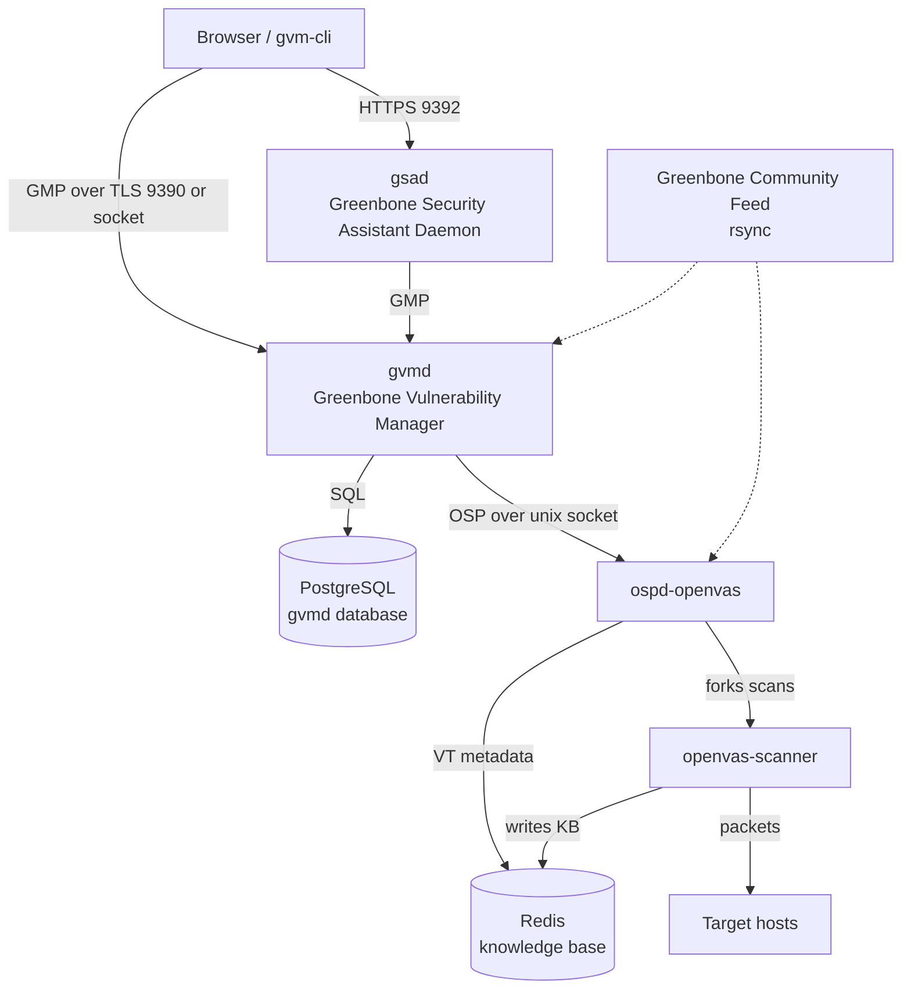
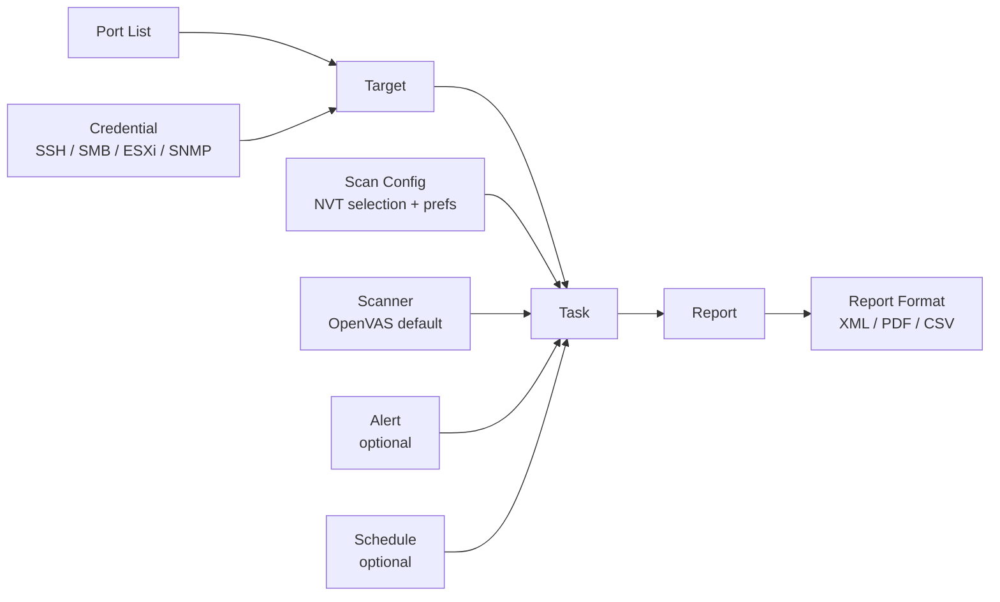
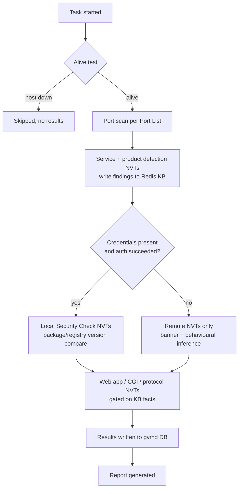
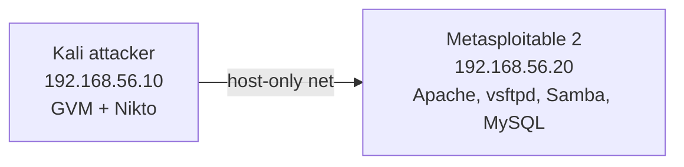
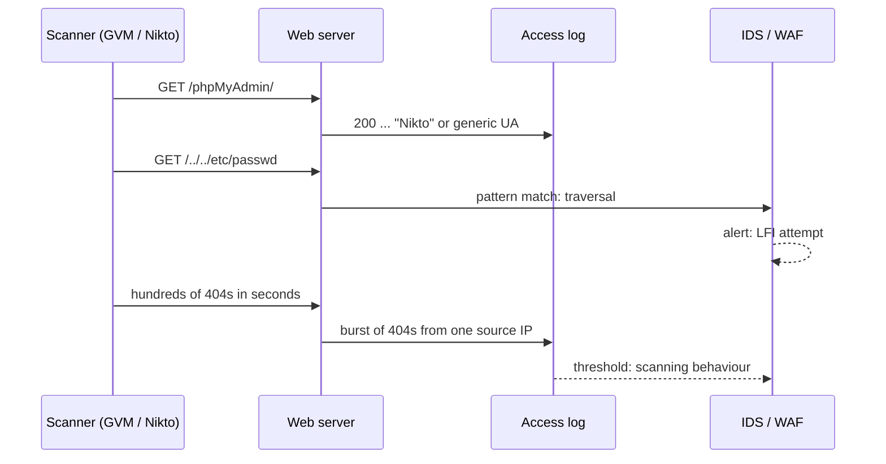

**Level:** Advanced · **Track:** Penetration Testing · **Read time:** 255 min

This is Chapter 3 of the Vulnerability Assessment series. The previous chapter took Nessus apart — the plugin feed, the policy fields, credentialed scanning, and the `.nessus` XML that falls out the end. This chapter covers the two open-source scanners you will actually reach for when there is no Nessus licence in the engagement budget: **Greenbone Vulnerability Management** (the project most people still call OpenVAS) and **Nikto**.

These two tools are usually taught badly. Greenbone gets reduced to "run `gvm-setup`, wait a day, click Start" — which is how people end up with a scanner that has never synced a feed and reports a clean network. Nikto gets reduced to "it's noisy and full of false positives, don't bother" — which is how people miss the `/backup.sql` that Nikto would have found in eleven seconds. Both tools reward understanding what they are doing on the wire, and both punish cargo-culting.

By the end of this chapter you will be able to install GVM from scratch on Kali and diagnose the four failures that account for most broken installs, explain what each of the five GVM daemons does and why that matters when something hangs, build targets and scan configs field by field and predict the packets each choice produces, configure SSH and SMB credentials that actually authenticate, drive the entire scanner headlessly from a shell with `gvm-cli` and raw GMP XML, parse report XML into something you can put in a findings table, use Nikto with intent rather than as a shotgun, tune its tuning flags, and describe precisely what both scanners look like to the defender reading the logs.

The legal framing from Chapter 2 carries over unchanged and is not optional. A GVM scan and a Nikto scan are both active, intrusive, unambiguously *loud* activities. Nikto in particular will POST to forms, request thousands of paths, and in `-mutate` modes attempt things that look exactly like an attack — because they are. Run these only against systems you own or have named, written authorisation to test.

---

## Part 1: Where Greenbone Came From and Why the Names Are a Mess

The naming confusion here is real and worth clearing up once, because the documentation you find online will be split across four generations of terminology.

In 2005 Nessus went closed-source. Three forks of the last GPL codebase appeared; one of them, **OpenVAS** ("Open Vulnerability Assessment System"), survived. From 2008 onwards development was led by **Greenbone Networks**, a German company that sells appliances and funds the open-source engine. In 2019 Greenbone renamed the whole software stack to **Greenbone Vulnerability Management (GVM)** and demoted "OpenVAS" to the name of just one component — the scanner daemon. In 2022 they renamed the free version to **Greenbone Community Edition**.

So, in practice:

| Term | What it actually refers to today |
| --- | --- |
| OpenVAS | Strictly: `openvas-scanner`, the daemon that executes NVTs. Colloquially: the whole thing. |
| GVM | The full stack — scanner, manager, web UI, feed tooling. This is the correct name. |
| Greenbone Community Edition (GCE) | The free, self-hosted distribution of GVM. What you install on Kali. |
| GSA / GSAD | Greenbone Security Assistant — the web UI and its daemon. |
| GMP | Greenbone Management Protocol — the XML API everything speaks. Formerly OMP. |
| NVT | Network Vulnerability Test — one check, written in NASL. The equivalent of a Nessus plugin. |
| Greenbone Enterprise Feed | The paid feed. More NVTs, faster turnaround. |
| Greenbone Community Feed | The free feed. What you get on Kali. |

**Why this matters practically:** the Community Feed lags the Enterprise Feed and lags Tenable's plugin feed. For a recently disclosed CVE, Nessus will often have a plugin days before the Community Feed does. That is not a reason to skip GVM — it is a reason to never treat any single scanner's silence as evidence of absence. Chapter 4 is entirely about that problem.

There is a second consequence of the shared ancestry: NVTs and Nessus plugins are both written in **NASL** (Nessus Attack Scripting Language), and the older ones are literally the same scripts with the same OIDs' worth of logic. If you can read one, you can read the other.

---

## Part 2: The GVM Architecture — Five Moving Parts

Almost every "OpenVAS is broken" problem is one daemon not talking to another. If you know the pieces, you can fix it in a minute instead of reinstalling.



Component by component:

- **`gvmd`** — the manager. Owns the database: users, targets, tasks, schedules, results, reports, permissions. Speaks GMP. This is the brain; if `gvmd` is down, nothing works and the web UI shows a login page that never authenticates.
- **`ospd-openvas`** — a Python daemon implementing OSP (Open Scanner Protocol). It sits between `gvmd` and the actual scanner, translating "run this task" into scanner invocations and streaming results back. This is the piece that most often silently dies.
- **`openvas-scanner`** — the C binary that loads NASL scripts and puts packets on the wire. Needs raw socket capability, which is why it needs root or `CAP_NET_RAW`.
- **`gsad`** — the web server serving the React UI on `https://127.0.0.1:9392`. Thin; it just proxies GMP.
- **PostgreSQL + Redis** — Postgres is the durable store (`gvmd` database). Redis is the *knowledge base*: a per-host scratchpad where one NVT writes a fact ("port 445 open", "SMB signing disabled", "Apache/2.4.49 detected") and later NVTs read it to decide whether to run. Redis is not a cache you can casually flush mid-scan; it is scan state.

**Diagnostic consequence:** if scans sit at 0% forever, the fault is almost always `ospd-openvas` or Redis, not `gvmd`. Check in this order:

```bash
sudo systemctl status ospd-openvas
sudo gvm-check-setup
redis-cli -s /run/redis-openvas/redis.sock ping
```

`gvm-check-setup` is the single most useful command in the whole stack. It walks every dependency in order and prints a `FIX:` line with the literal command to run when it finds a problem. Run it before you ever open a browser.

---

## Part 3: Installing GVM on Kali From Scratch

Kali ships GVM as a metapackage. This is by far the least painful route; building from source is a multi-hour exercise in dependency archaeology and is not worth it unless you are developing NVTs.

### 3.1 Install

```bash
sudo apt update
sudo apt install -y gvm
```

That pulls in `gvmd`, `ospd-openvas`, `openvas-scanner`, `gsad`, `gvm-tools`, PostgreSQL, and Redis. Roughly 700 MB.

**Flag notes:** `-y` auto-confirms. Do not add `--no-install-recommends` here — several of the recommended packages (`nmap`, `redis-server`, `postgresql`) are load-bearing despite being listed as recommendations.

### 3.2 Initial setup

```bash
sudo gvm-setup
```

This one command does a great deal:

1. Creates the `_gvm` system user and the PostgreSQL role/database.
2. Generates CA and server certificates for GMP-over-TLS and for `gsad`.
3. Starts Redis with the OpenVAS-specific unix socket config.
4. **Performs the first feed sync** — NVTs, SCAP (CVE/CPE), and CERT advisories.
5. Creates the `admin` user and prints a randomly generated password.

The feed sync is the long part. Expect **20–60 minutes on a fast connection, several hours on a slow one**, and roughly 5 GB of disk. It rsyncs from `feed.community.greenbone.net`. If your egress firewall blocks rsync (TCP/873), the sync fails silently-ish and you end up with a scanner that finds nothing — this is failure mode number one.

The last lines of successful output look like this:

```
[*] Please note the password for the admin user
[*] User created with password 'c4f1e8a2-9b3d-4e77-a1c6-0d2b8e5f9a11'.

[+] GVM feeds updated
[*] Checking Default scanner
[*] Default scanner is present
[+] Done
```

**Write that password down.** If you lose it:

```bash
sudo runuser -u _gvm -- gvmd --user=admin --new-password='NewStrongPassword'
```

`runuser -u _gvm --` runs the command as the `_gvm` user without a login shell; `gvmd` refuses to run as root and refuses to run as your normal user because it needs to open the manager's unix socket with the right ownership.

### 3.3 Verify before you trust it

```bash
sudo gvm-check-setup
```

Healthy tail:

```
Step 1: Checking OpenVAS (Scanner)...
        OK: OpenVAS Scanner is present in version 22.7.9.
        OK: Notus Scanner is present in version 22.6.3.
        OK: Server CA Certificate is present as /var/lib/gvm/CA/servercert.pem.
        OK: NVT collection in /var/lib/openvas/plugins contains 92471 NVTs.
        OK: The NVT collection is up to date.
Step 2: Checking GVMD Manager ...
        OK: gvmd is present in version 22.9.0.
Step 3: Checking Certificates ...
        OK: GVM client certificate is valid and present as /var/lib/gvm/CA/clientcert.pem.
Step 4: Checking data ...
        OK: SCAP data found in /var/lib/gvm/scap-data.
        OK: CERT data found in /var/lib/gvm/cert-data.
Step 5: Checking Postgresql DB and user ...
        OK: Postgresql version and default port are OK.
        OK: gvmd DB is present
Step 6: Checking greenbone-security-assistant ...
        OK: greenbone-security-assistant is installed
Step 7: Checking if GVM services are up and running ...
        OK: ospd-openvas service is active.
        OK: gvmd service is active.
        OK: gsad service is active.

It seems like your GVM-22.5.0 installation is OK.
```

The number that matters is **"NVT collection ... contains 92471 NVTs"**. If that number is under a few thousand, or the line says "NVT collection is not up to date", your feed did not sync and every scan you run will be meaningless.

### 3.4 Starting and stopping

```bash
sudo gvm-start     # starts gvmd, ospd-openvas, gsad, and opens the UI
sudo gvm-stop
sudo gvm-feed-update   # re-sync feeds later
```

On Kali these are wrappers around `systemctl`. GVM is heavy — roughly 2–4 GB RAM at idle with feeds loaded into Redis — so do not leave it enabled at boot on a laptop:

```bash
sudo systemctl disable --now gvmd ospd-openvas gsad
```

### 3.5 The four failures that account for most broken installs

| Symptom | Cause | Fix |
| --- | --- | --- |
| Scan stuck at 0%, task status "Requested" forever | `ospd-openvas` dead or its socket unreadable by `gvmd` | `sudo systemctl restart ospd-openvas gvmd`; check `/run/ospd/ospd-openvas.sock` exists and is group `_gvm` |
| Scans complete instantly with zero results | NVT feed never synced (rsync/873 blocked) | `sudo gvm-feed-update`; confirm NVT count in `gvm-check-setup` |
| Web UI at 9392 refuses connection | `gsad` bound to 127.0.0.1 only (correct default) | Access locally, or `gsad --listen=0.0.0.0` **only on an isolated lab network** |
| "Failed to find port list" / missing defaults after upgrade | `gvmd` didn't rebuild default objects | `sudo runuser -u _gvm -- gvmd --rebuild` then restart |

**Blue team usage:** the fact that GVM binds to localhost by default, uses a client certificate for GMP, and refuses to run its manager as root is a decent model for how a scanner *should* be deployed. A scanner holds credentials to every host it scans; a compromised scanner is a domain-wide credential dump. When you find a Greenbone or Nessus appliance during an internal engagement, it is one of the highest-value targets on the network — and when you are defending, it belongs in the same tier as a domain controller.

---

## Part 4: The Object Model — Targets, Port Lists, Credentials, Scan Configs, Tasks

GVM is more explicitly object-oriented than Nessus. In Nessus a "scan" bundles everything. In GVM you compose separate reusable objects, and each one is a separate GMP entity with its own UUID.



This composition is why GVM is pleasant to automate and mildly annoying to click through: to run one scan you must create at minimum a Target and a Task, and the Target needs a Port List and probably Credentials.

### 4.1 Port Lists

A Port List is a named set of TCP/UDP ports. Defaults shipped:

| Port list | Contents | When to use |
| --- | --- | --- |
| All IANA assigned TCP | ~5,700 TCP ports | Sensible default for internal work |
| All IANA assigned TCP and UDP | Above plus ~5,300 UDP | Only when UDP matters (SNMP, TFTP, DNS, IPMI); triples scan time |
| All TCP and Nmap top 100 UDP | 65,535 TCP + 100 UDP | Thorough, slow, my usual choice for a small target set |
| OpenVAS Default | ~4,400 TCP + 100 UDP | Legacy default |

Create your own with a plain range string: `T:22,80,443,445,3389,8080-8090,U:161`.

**Security relevance:** the single most common reason a GVM scan "missed" something is the port list. A service on TCP/50000 (SAP, common in enterprise) is invisible to a top-1000 list. Your enumeration from the Scanning & Enumeration notebook should *drive* the port list — run `nmap -p-` first, feed the discovered ports in, and let GVM spend its time on NVTs rather than rediscovering the port map.

### 4.2 Targets

A Target = hosts + port list + credentials + alive-test method.

Host syntax accepts everything you would expect: `192.168.56.0/24`, `192.168.56.10-40`, `host1.lab.local, 10.0.0.5`, or a file upload.

**Alive Test** is the field people ignore and then complain about. Options:

| Alive Test | Mechanism | Notes |
| --- | --- | --- |
| ICMP Ping | Echo request | Fails against Windows hosts with default firewall |
| TCP-ACK Service Ping | ACK to common ports, expect RST | Works through many stateless filters |
| TCP-SYN Service Ping | Half-open to common ports | Loud but reliable |
| ARP Ping | ARP who-has | Local segment only; near-perfect there |
| ICMP & TCP-ACK Service Ping | Combination | Reasonable default |
| Consider Alive | Skip discovery entirely | Slowest but never misses a host |

**Pentester landing on a new internal network:** use **Consider Alive** for small, known-good target lists. Windows Firewall drops ICMP by default, and a shocking number of "the scanner found nothing on that subnet" reports are just hosts being classified as down before a single NVT ran. On a /24 of unknown hosts, Consider Alive is too slow — use ARP Ping if you are on the same L2 segment, which is both fastest and most accurate.

### 4.3 Credentials

Four types matter:

- **Username + Password** — used for SMB, and for SSH if no key.
- **Username + SSH key** — preferred for Linux targets. Upload the private key; passphrase optional.
- **SNMP** — v1/v2c community string or v3 credentials.
- **ESXi** — for VMware hosts.

Credentialed scanning changes the result set by roughly an order of magnitude, exactly as with Nessus. Uncredentialed, GVM sees banners and guesses; credentialed, it reads the package database and knows.

```bash
# On the Linux target: create a low-privilege scan account with key auth
sudo useradd -m -s /bin/bash gvmscan
sudo mkdir -p /home/gvmscan/.ssh
sudo tee /home/gvmscan/.ssh/authorized_keys < gvmscan.pub
sudo chown -R gvmscan:gvmscan /home/gvmscan/.ssh
sudo chmod 700 /home/gvmscan/.ssh
sudo chmod 600 /home/gvmscan/.ssh/authorized_keys
```

For Linux local-security-check NVTs, an unprivileged account is enough to read `/etc/os-release` and query the package manager — that is where the bulk of patch findings come from. Some checks (file permission audits, `/etc/shadow` policy checks) need sudo. Grant it narrowly if the client agrees, and record what you were given.

For Windows, the account needs to be a **local administrator** for registry and WMI reads. Domain admin is not required and should be refused if offered — a local admin account pushed by GPO to the scan scope is the correct answer.

### 4.4 Scan Configs

A Scan Config is an NVT selection plus preferences. Defaults:

| Scan Config | NVT families included | Behaviour |
| --- | --- | --- |
| Base | Bare minimum | Building block for custom configs |
| Discovery | Service/OS detection only | No vuln checks; fast inventory |
| Host Discovery | Ping + basic ID | Asset discovery only |
| System Discovery | Discovery + hardware/OS depth | Inventory with detail |
| Full and fast | All NVTs, uses previously collected KB data | **The default you want** |
| Full and very deep | Ignores KB optimisation, runs checks regardless | Much slower, marginally more thorough |
| Full and very deep ultimate | Above + destructive/DoS checks | **Will crash things.** Lab only. |

"Full and fast" is not a compromise setting — the "fast" refers to using the Redis knowledge base to skip NVTs whose preconditions are already known false (don't run IIS checks on a host where the KB says Apache). "Very deep" disables that optimisation. On a well-behaved network the extra findings from "very deep" are near zero and the runtime is several times longer.

The **"ultimate"** variants enable NVTs in the `Denial of Service` family. These are checks that verify a vulnerability by triggering it. Enabling this outside an explicit, written, "yes please crash it" agreement is a career-limiting move.

---

## Part 5: NVT Families and What They Do on the Wire

An NVT belongs to a family. Understanding the families lets you build surgical configs and predict noise.

| Family | Roughly what's in it | Wire behaviour |
| --- | --- | --- |
| Port scanners | The nmap/`openvas` port scan NVTs | The port scan itself |
| Service detection | Banner grabs, protocol probes | Connect + minimal protocol chatter |
| Product detection | Version fingerprinting | Usually one request per product |
| Web application abuses | Path checks, known web CVEs | Hundreds to thousands of HTTP requests |
| Web Servers | Server-specific CVEs (Apache/nginx/IIS) | HTTP requests, some malformed |
| CGI abuses | Legacy CGI paths | Large path enumeration; heavy log noise |
| Databases | MySQL/MSSQL/Oracle/Postgres checks | Protocol logins, often failed-auth events |
| Windows / Windows: Microsoft Bulletins | SMB/registry-based patch checks | Requires credentials to be useful |
| Debian/Red Hat/SuSE/Ubuntu Local Security Checks | Package-version comparisons | SSH login + package query, near-silent |
| Default Accounts | Vendor default credential attempts | **Generates real failed logins; can lock accounts** |
| Brute force attacks | Small credential lists | Same, worse |
| Denial of Service | Crash checks | Exactly what it says |
| Credentials | Authentication success/failure reporting | The NVTs that tell you *your creds didn't work* |

Two families deserve explicit warnings.

**Default Accounts** and **Brute force attacks** will attempt logins. Against Active Directory with a lockout policy of 5 attempts, a scan that hits every host with a handful of default passwords can lock out real accounts — including service accounts, which is how a vulnerability scan becomes an outage. Disable both families for any scan against an authenticated directory unless you have explicitly agreed it.

**The `Credentials` family is the one nobody enables and everybody needs.** It contains NVTs like *"SSH Login Failed For Authenticated Checks"* and *"SMB/Windows: Login Failed"*. Without them, a credentialed scan where the credentials were wrong looks exactly like a clean, well-patched host. Every experienced scanner operator has been burned by this once. Check for those results before you believe a quiet report.



That gate at `E` is the whole game. It is also why the *Credentials* family matters: it is the only thing that turns the "no" branch into a visible finding instead of silence.

---

## Part 6: Driving GVM From the Web UI

Log in at `https://127.0.0.1:9392` (self-signed cert; accept it). The UI is organised almost exactly like the object model.

**Creating a scan, minimum viable path:**

1. **Configuration → Targets → New Target.** Name it. Hosts: `192.168.56.0/24`. Port List: *All TCP and Nmap top 100 UDP*. Alive Test: *ARP Ping* (same segment). Attach SSH and SMB credentials.
2. **Scans → Tasks → New Task.** Name it. Scan Targets: the target you made. Scan Config: *Full and fast*. Scanner: *OpenVAS Default*.
3. Set **Maximum concurrently executed NVTs per host** and **Maximum concurrently scanned hosts** (defaults 4 and 20). On a fragile network drop these to 2 and 5.
4. Start the task with the ▶ button.

**Task-level settings worth knowing:**

| Setting | Default | Effect |
| --- | --- | --- |
| Maximum concurrently executed NVTs per host | 4 | Parallelism against one host. Lower for embedded devices/printers. |
| Maximum concurrently scanned hosts | 20 | Parallelism across hosts. Lower on constrained links. |
| Network Source Interface | (unset) | Pin scan egress to a specific NIC — essential on multi-homed testers |
| Order for target hosts | Sequential | Random order spreads load; useful against IDS thresholds |
| Auto Delete Reports | No | Turn on for scheduled scans or the DB grows without bound |
| Add results to Asset Management | Yes | Populates the Hosts/Operating Systems inventory |

Progress is per-host. A task at "38%" with one host at 4% means one slow host is holding the average down — usually a firewalled host with a large port list working through connect timeouts, or a printer.

**Reading results.** Severity uses CVSS, bucketed: High (7.0–10.0), Medium (4.0–6.9), Low (0.1–3.9), Log (0.0). The **Log** bucket is where all the informational detection output lives and where experienced testers spend real time — open ports, detected products, SSL certificate details, HTTP server headers. It is free enumeration data you already paid for.

Two filters worth learning in the results view:

```
severity>6.9 and not qod<70
```

`qod` is **Quality of Detection**, a GVM concept Nessus lacks: a 0–100 confidence value for how the finding was determined.

| QoD | Meaning |
| --- | --- |
| 100 | Exploit succeeded / definitive proof |
| 97 | Remote vulnerability confirmed by behaviour |
| 95 | Remote application version match |
| 80 | Remote banner (unreliable — backported patches) |
| 75 | Package version check on the host (accurate, this is the credentialed workhorse) |
| 70 | Registry check |
| 50 | Remote analysis / heuristic |
| 30 | Remote probe, weak |
| 1–29 | General note, effectively informational |

**This is the single most useful GVM-specific concept.** The default UI filter hides results below QoD 70, which is why the report you export via the API can contain far more rows than the UI showed you. When triaging, sort by QoD descending: QoD 75+ findings are near-certain and should be written up; QoD 80 banner-only findings on a Debian or RHEL box are frequently false positives because those distributions backport security fixes without bumping the version string in the banner. That single fact explains most disputed rows in a vulnerability report.

---

## Part 7: Automating GVM With gvm-tools and Raw GMP

Clicking is fine once. For anything repeatable, use GMP directly. `gvm-tools` ships with Kali's `gvm` metapackage and provides `gvm-cli` (one-shot XML), `gvm-script` (Python scripting), and `gvm-pyshell` (interactive).

### 7.1 Connecting

Three transports: unix socket (local, no TLS), TLS (9390), or SSH. Socket is simplest:

```bash
gvm-cli --gmp-username admin --gmp-password 'YOURPASS' \
  socket --socketpath /run/gvmd/gvmd.sock \
  --xml "<get_version/>"
```

Output:

```xml
<get_version_response status="200" status_text="OK"><version>22.5</version></get_version_response>
```

Every GMP response carries `status` — 200 OK, 400 bad request, 401 auth failed, 404 missing resource. Script against that attribute, not against string matching.

### 7.2 Listing objects

```bash
GMP="gvm-cli --gmp-username admin --gmp-password 'YOURPASS' socket --socketpath /run/gvmd/gvmd.sock --xml"

$GMP "<get_scan_configs/>"        | xmllint --format - | head -40
$GMP "<get_port_lists/>"          | xmllint --format -
$GMP "<get_targets/>"
$GMP "<get_tasks/>"
```

`xmllint --format -` pretty-prints XML from stdin; without it GMP responses arrive as one enormous line. `xmllint` comes from `libxml2-utils` (`sudo apt install libxml2-utils`).

To pull just the UUID and name of every scan config:

```bash
$GMP "<get_scan_configs/>" \
  | xmllint --xpath '//config/@id | //config/name' - 2>/dev/null \
  | sed 's/id=/\n/g'
```

Sample:

```
"085569ce-73ed-11df-83c3-002264764cea"Empty
"2d3f051c-55ba-11e3-bf43-406186ea4fc5"Host Discovery
"698f691e-7489-11df-9d8c-002264764cea"Full and fast
"708f25c4-7489-11df-8094-002264764cea"Full and very deep
"74db13d6-7489-11df-91b9-002264764cea"Full and very deep ultimate
"8715c877-47a0-438d-98a3-27c7a6ab2196"Discovery
"bbca7412-a950-11e3-9109-406186ea4fc5"System Discovery
```

Those UUIDs are stable across installations — `698f691e-7489-11df-9d8c-002264764cea` is "Full and fast" everywhere, which makes scripts portable.

### 7.3 Creating a full scan from the shell

```bash
#!/usr/bin/env bash
# gvm-scan.sh — create target + task, start it, poll to completion, export XML report
set -euo pipefail

USER="admin"
PASS="${GVM_PASS:?set GVM_PASS in your environment}"
SOCK="/run/gvmd/gvmd.sock"
HOSTS="${1:?usage: $0 <hosts> <name>}"
NAME="${2:-scan-$(date +%s)}"

gmp() { gvm-cli --gmp-username "$USER" --gmp-password "$PASS" socket --socketpath "$SOCK" --xml "$1"; }

CONFIG_FULLFAST="698f691e-7489-11df-9d8c-002264764cea"
PORTLIST_ALLTCP_TOP100UDP="730ef368-57e2-11e1-a90f-406186ea4fc5"
SCANNER_OPENVAS="08b69003-5fc2-4037-a479-93b440211c73"

TARGET_ID=$(gmp "<create_target>
  <name>${NAME}-target</name>
  <hosts>${HOSTS}</hosts>
  <port_list id='${PORTLIST_ALLTCP_TOP100UDP}'/>
  <alive_tests>Consider Alive</alive_tests>
</create_target>" | xmllint --xpath 'string(//create_target_response/@id)' -)

echo "[+] target: $TARGET_ID"

TASK_ID=$(gmp "<create_task>
  <name>${NAME}</name>
  <config id='${CONFIG_FULLFAST}'/>
  <target id='${TARGET_ID}'/>
  <scanner id='${SCANNER_OPENVAS}'/>
</create_task>" | xmllint --xpath 'string(//create_task_response/@id)' -)

echo "[+] task:   $TASK_ID"

gmp "<start_task task_id='${TASK_ID}'/>" > /dev/null
echo "[+] started, polling..."

while true; do
  STATUS=$(gmp "<get_tasks task_id='${TASK_ID}'/>" | xmllint --xpath 'string(//task/status)' -)
  PROG=$(gmp   "<get_tasks task_id='${TASK_ID}'/>" | xmllint --xpath 'string(//task/progress)' -)
  printf "\r    %-12s %3s%%" "$STATUS" "$PROG"
  [[ "$STATUS" == "Done" || "$STATUS" == "Stopped" ]] && break
  sleep 30
done
echo

REPORT_ID=$(gmp "<get_tasks task_id='${TASK_ID}'/>" \
  | xmllint --xpath 'string(//task/last_report/report/@id)' -)

gmp "<get_reports report_id='${REPORT_ID}'
      format_id='a994b278-1f62-11e1-96ac-406186ea4fc5'
      ignore_pagination='1' details='1'/>" > "${NAME}.xml"

echo "[+] report saved to ${NAME}.xml"
```

Notes on what's going on:

- `set -euo pipefail` — exit on error, on unset variable, and propagate pipe failures. Non-negotiable in any scanning script; a silent failure mid-scan that still exits 0 will cost you a day.
- `${GVM_PASS:?...}` — refuses to run without the env var, and never puts the password in the script or in `ps` output where a `--gmp-password` on the command line would.
- `xmllint --xpath 'string(...)'` — extracts a single value rather than an XML fragment.
- `format_id='a994b278-...'` is the built-in **Anonymous XML** report format; `c1645568-627a-11e3-a660-406186ea4fc5` is CSV Results, `c402cc3e-b531-11e1-9163-406186ea4fc5` is PDF.
- `ignore_pagination='1'` is essential. Without it you get the first 100 results and a quietly truncated report.
- `details='1'` includes the per-result detail text; without it you get severity and OID but no description.

**Red team usage:** GMP over TLS on 9390 with a client certificate is a legitimate remote-control channel for a scanner you've been given. It is also, from the offensive side, exactly what you look for on an internal engagement — a GVM manager with weak credentials hands you every credential the scanner uses, and those are by definition privileged on every host in scope. `<get_credentials/>` will not return the secrets themselves in modern versions, but the target list and scan history alone are a complete network map with vulnerabilities pre-annotated.

### 7.4 Parsing the report XML

```python
#!/usr/bin/env python3
"""parse_gvm.py — turn a GVM XML report into a triaged CSV."""
import csv
import sys
import xml.etree.ElementTree as ET

def parse(path, min_qod=70, min_sev=4.0):
    tree = ET.parse(path)
    rows = []
    for r in tree.iter("result"):
        host = (r.findtext("host") or "").strip()
        port = r.findtext("port") or ""
        name = r.findtext("name") or ""
        sev = float(r.findtext("severity") or 0)
        qod = int(r.findtext("qod/value") or 0)
        nvt = r.find("nvt")
        oid = nvt.get("oid") if nvt is not None else ""
        cves = ",".join(
            ref.get("id")
            for ref in r.iterfind("nvt/refs/ref")
            if ref.get("type") == "cve"
        )
        if sev >= min_sev and qod >= min_qod:
            rows.append(dict(host=host, port=port, severity=sev, qod=qod,
                             name=name, oid=oid, cves=cves))
    rows.sort(key=lambda x: (-x["severity"], -x["qod"], x["host"]))
    return rows

if __name__ == "__main__":
    rows = parse(sys.argv[1])
    w = csv.DictWriter(sys.stdout,
                       fieldnames=["host", "port", "severity", "qod", "name", "oid", "cves"])
    w.writeheader()
    w.writerows(rows)
    print(f"\n[{len(rows)} results at severity>=4.0 and qod>=70]", file=sys.stderr)
```

```bash
python3 parse_gvm.py lab-scan.xml > findings.csv
```

The `host` element in a GVM report has trailing whitespace and sometimes a child `asset` element, which is why `.strip()` and `findtext` (rather than `.text`) are used — a very common source of mismatched host keys when joining this data against your nmap output.

A quick severity histogram without leaving the shell:

```bash
xmllint --xpath '//result/severity/text()' lab-scan.xml \
  | tr ' ' '\n' | awk '$1>=7{h++} $1>=4&&$1<7{m++} $1>0&&$1<4{l++} END{print "High:"h" Med:"m" Low:"l}'
```

---

## Part 8: Nikto From Zero

Nikto is a different kind of tool from Greenbone, and comparing them is a category error people make constantly. Greenbone is a general-purpose network vulnerability scanner covering every service. Nikto is a **web server scanner** — narrow, fast, and specifically good at one thing: finding known-bad paths, dangerous default files, misconfigured servers, and outdated web software.

### 8.1 What Nikto is

Nikto (written by Chris Sullo, actively maintained as **Nikto 2**, Perl) checks a web server against a database of roughly 7,000 potentially dangerous files and CGIs, checks for outdated versions of 1,250+ servers, and flags version-specific problems on 270+ servers. It does this by *requesting paths and inspecting responses*. That is the entire mental model: Nikto is a very well-informed, very fast, extremely loud "does this URL exist and does the response look dangerous" loop.

It is Perl and dependency-light, which is why it runs everywhere and why it is on Kali by default:

```bash
nikto -Version
```

```
- Nikto v2.5.0
+ Nikto main         2.5.0
+ Databases          2.21
+ Report Templates   1.05
+ Plugins            2.20
```

If it is somehow missing: `sudo apt install nikto`, or clone `github.com/sullo/nikto` and run `perl program/nikto.pl`. The database ships with the tool; update it with `nikto -update` (this pulls new plugin and DB files, not the Perl code).

### 8.2 The database — how Nikto decides what to request

Nikto's checks live in plaintext CSV-ish databases under `/var/lib/nikto/databases/` (or `program/databases/` in a git checkout):

| File | Contents |
| --- | --- |
| `db_tests` | The main test database: the paths, expected responses, and OSVDB/reference IDs |
| `db_variables` | Path expansion variables (e.g. `@CGIDIRS` → `/cgi-bin/ /cgi-sys/ ...`) |
| `db_404_strings` | Strings that indicate a soft-404 despite a 200 status |
| `db_server_msgs` | Server-banner-to-known-issue mappings |
| `db_outdated` | Version strings considered outdated |

You can read and grep these. Each `db_tests` line is a test with a tuning category, an HTTP method, a URI, an expected match, and a message:

```bash
head -3 /var/lib/nikto/databases/db_tests
grep -i 'phpmyadmin' /var/lib/nikto/databases/db_tests | head
```

**This transparency is the point.** Unlike Greenbone's compiled NASL, you can see exactly what Nikto will request before you run it, add your own test lines, and understand precisely why it flagged something. When a finding is disputed, you can point at the literal database line.

### 8.3 The false-positive "problem" is a design choice

Everyone repeats that Nikto is noisy and full of false positives. Both halves need context:

- **Noisy: yes, deliberately.** Nikto makes no attempt to be stealthy. It requests thousands of paths, sets an obvious `User-Agent`, and hits every server it's pointed at with the whole database. If you want quiet, Nikto is the wrong tool.
- **False positives: partly a soft-404 problem.** Servers that return `200 OK` with a friendly "not found" page for everything defeat status-code logic. Nikto has `db_404_strings` and content-hashing to compensate, but a badly behaved app or a WAF returning `200` for blocked requests will still generate junk. The fix is `-Tuning` and reading the responses, not abandoning the tool.

The practical stance: Nikto is a **lead generator**, not a proof engine. Every Nikto finding is a URL to look at yourself. It found `/backup/`; you go confirm what's in it. That workflow — Nikto enumerates, you validate — is exactly the Chapter 4 triage discipline in miniature.

### 8.4 Core usage and every flag worth knowing

The minimum:

```bash
nikto -h http://192.168.56.20
```

`-h` (host) accepts a hostname, IP, or full URL. Give it a URL when you care about scheme and port; give it a bare host and it assumes `http`/80.

The flags that actually change behaviour:

| Flag | Argument | What it does |
| --- | --- | --- |
| `-h` | host/URL/file | Target. A file with one host per line scans many. |
| `-p` | port(s) | Port(s): `-p 80,443,8080`. |
| `-ssl` | — | Force TLS. Needed for `-h host -p 443` without a URL. |
| `-nossl` | — | Force plaintext. |
| `-Tuning` | codes | **The most important flag.** Selects which test categories run (see below). |
| `-Display` | codes | Control output verbosity: `V` verbose, `1` redirects, `2` cookies, `E` errors, `P` progress. |
| `-o` | file | Output file. Extension or `-Format` sets the type. |
| `-Format` | csv/xml/json/htm/txt/nbe | Report format. `-Format json -o out.json`. |
| `-useragent` | string | Override the (very obvious) default UA. |
| `-evasion` | codes | IDS-evasion encodings (see Part 8.6). |
| `-timeout` | seconds | Per-request timeout (default 10). |
| `-maxtime` | seconds/`Nm` | Hard cap on total scan time: `-maxtime 300` or `-maxtime 5m`. |
| `-Pause` | seconds | Delay between requests. Throttling / being polite. |
| `-nointeractive` | — | Never prompt (for scripts). |
| `-ask` | no | Don't ask about submitting findings; also `-ask auto`. |
| `-id` | user:pass | HTTP Basic/Digest/NTLM auth: `-id admin:admin`. |
| `-useproxy` | — | Route through the proxy in `nikto.conf` (chain with Burp). |
| `-vhost` | hostname | Set the `Host:` header — essential for name-based virtual hosts. |
| `-Cgidirs` | dirs / `all` / `none` | Which CGI directories to check. `all` is thorough and slow. |
| `-root` | path | Prepend a base path to every request (apps under `/app/`). |
| `-mutate` | codes | Guess additional content (usernames, subdomains, filenames) — much heavier. |
| `-list-plugins` | — | Show all plugins and exit. |
| `-Plugins` | name | Run only specific plugins. |
| `-update` | — | Update DB and plugins. |

### 8.5 -Tuning — the flag that turns Nikto from shotgun to scalpel

`-Tuning` restricts which categories of test run. Each category is a digit/letter; combine them.

| Code | Category |
| --- | --- |
| 0 | File Upload |
| 1 | Interesting File / Seen in logs |
| 2 | Misconfiguration / Default File |
| 3 | Information Disclosure |
| 4 | Injection (XSS/Script/HTML) |
| 5 | Remote File Retrieval — inside web root |
| 6 | Denial of Service |
| 7 | Remote File Retrieval — server-wide |
| 8 | Command Execution / Remote Shell |
| 9 | SQL Injection |
| a | Authentication Bypass |
| b | Software Identification |
| c | Remote Source Inclusion |
| d | WebService |
| e | Administrative Console |
| x | Reverse Tuning — run everything *except* the listed codes |

Examples:

```bash
# Only misconfig, info disclosure, interesting files, and software ID — fast and high-signal
nikto -h https://target.example -Tuning 123b

# Everything EXCEPT denial of service (6) — the sane default for a live target
nikto -h https://target.example -Tuning x6

# Injection + command exec + SQLi only — targeted second pass
nikto -h https://target.example -Tuning 489
```

**`-Tuning x6` is the setting to memorise.** It runs the full database but excludes category 6, Denial of Service — which contains checks that can hang or crash fragile servers. Running Nikto against a production app without excluding DoS is the web-scanner equivalent of enabling Greenbone's "ultimate" config.

### 8.6 -evasion — how the IDS-evasion encodings work

`-evasion` applies libwhisker encodings to defeat naive signature IDS. These are historically important and still occasionally useful against weak inline filters:

| Code | Technique |
| --- | --- |
| 1 | Random URI encoding (non-UTF8) |
| 2 | Directory self-reference `/./` |
| 3 | Premature URL ending |
| 4 | Prepend long random string |
| 5 | Fake parameter |
| 6 | TAB as request spacer |
| 7 | Change URL case |
| 8 | Use `\` as directory separator (Windows) |
| A | Use a carriage return (`0x0d`) as a request spacer |
| B | Use binary value `0x0b` as a request spacer |

```bash
nikto -h http://target -evasion 1234567
```

**Red team usage:** these encodings target signature-based NIDS (classic Snort rules matching `/etc/passwd` literally). Against a modern WAF that normalises input before matching, most of them do nothing — the WAF decodes `/./` and `%2e` back to canonical form before its rules fire. They remain a useful teaching tool for *why* signature IDS normalises input, and they occasionally still bypass a badly configured legacy device. **Blue team usage:** if your IDS can be defeated by `-evasion 7` (case change), your rules are matching raw bytes instead of normalised requests — fix the normalisation, not the rule.

### 8.7 Chaining Nikto through Burp

Route Nikto through an intercepting proxy so every request/response is captured for manual follow-up:

```bash
# Point nikto.conf PROXY at Burp, or:
nikto -h http://192.168.56.20 -useproxy http://127.0.0.1:8080
```

Now Burp's history holds every path Nikto tried and every response — you triage the interesting `200`s in Burp Repeater without re-requesting them. This is the single best way to use Nikto in a web engagement: it enumerates at machine speed, and you inspect the hits with a human eye. `-useproxy` overrides the config-file proxy for that run.

---

## Part 9: Hands-On Lab — GVM + Nikto Against a Lab Subnet

This lab uses a deliberately vulnerable target. Suitable choices: **Metasploitable 2** (`192.168.56.20` below), a Greenbone/OVA test image, or any HTB/VulnHub box you own. Do not point any of this at a host you do not control.

### 9.1 Topology



### 9.2 Step 1 — enumerate ports first, then scan smart

```bash
sudo nmap -sS -sV -p- --min-rate 2000 -oA lab-nmap 192.168.56.20
```

- `-sS` SYN scan (half-open, needs root). `-sV` version detection. `-p-` all 65,535 ports. `--min-rate 2000` floors the packet rate so a full-port sweep of one host finishes in a minute or two. `-oA lab-nmap` writes `.nmap/.gnmap/.xml`.

Abbreviated output:

```
PORT     STATE SERVICE     VERSION
21/tcp   open  ftp         vsftpd 2.3.4
22/tcp   open  ssh         OpenSSH 4.7p1 Debian 8ubuntu1
80/tcp   open  http        Apache httpd 2.2.8 ((Ubuntu) DAV/2)
139/tcp  open  netbios-ssn Samba smbd 3.X - 4.X
445/tcp  open  netbios-ssn Samba smbd 3.X - 4.X
3306/tcp open  mysql       MySQL 5.0.51a-3ubuntu5
5432/tcp open  postgresql  PostgreSQL DB 8.3.0 - 8.3.7
8180/tcp open  http        Apache Tomcat/Coyote JSP engine 1.1
```

Feed those exact ports into the GVM port list rather than scanning all 65k with NVTs.

### 9.3 Step 2 — GVM credentialed scan via the script

```bash
export GVM_PASS='your-admin-password'
./gvm-scan.sh "192.168.56.20" metasploitable-lab
```

Watching it run:

```
[+] target: b0f2a1c4-1234-4abc-9def-001122334455
[+] task:   e7c8d9a0-5678-4bcd-8aef-6677889900aa
[+] started, polling...
    Running        62%
    Running       100%
    Done          100%
[+] report saved to metasploitable-lab.xml
```

Parse and triage:

```bash
python3 parse_gvm.py metasploitable-lab.xml > gvm-findings.csv
column -s, -t gvm-findings.csv | head -20
```

```
host          port      severity qod name                                                     oid                              cves
192.168.56.20 3632/tcp  10.0     99  DistCC Remote Code Execution Vulnerability               1.3.6.1.4.1.25623.1.0.100259     CVE-2004-2687
192.168.56.20 21/tcp    10.0     99  vsftpd Compromised Source Packages Backdoor Vulnerability 1.3.6.1.4.1.25623.1.0.103185    CVE-2011-2523
192.168.56.20 5432/tcp  9.0      80  PostgreSQL Multiple Vulnerabilities                       1.3.6.1.4.1.25623.1.0.102000     CVE-2010-1447
192.168.56.20 445/tcp   10.0     95  Samba MS-RPC Remote Shell Command Execution              1.3.6.1.4.1.25623.1.0.101037     CVE-2007-2447
192.168.56.20 80/tcp    7.5      80  Apache HTTP Server 2.2.x Multiple Vulnerabilities         1.3.6.1.4.1.25623.1.0.900498     CVE-2011-3192
```

Two teaching points from that table. The vsftpd 2.3.4 and DistCC findings are **QoD 99** — behaviourally confirmed, write them up as-is. The Apache 2.2.x row is **QoD 80**, banner-based; on a backport-heavy distro you would verify the actual patch level before reporting it. That is the QoD discipline from Part 6 applied to real output.

### 9.4 Step 3 — Nikto against the web services

```bash
nikto -h http://192.168.56.20 -Tuning x6 -o nikto-80.txt -Format txt
```

Abbreviated, annotated output:

```
- Nikto v2.5.0
+ Target IP:          192.168.56.20
+ Target Hostname:    192.168.56.20
+ Target Port:        80
+ Start Time:         (scan start)
---------------------------------------------------------------------------
+ Server: Apache/2.2.8 (Ubuntu) DAV/2
+ /: Server may leak inodes via ETags, header found with file /, inode: 68674, size: 45. See: CVE-2003-1418
+ /: The anti-clickjacking X-Frame-Options header is not present.
+ /: The X-Content-Type-Options header is not set. See: <docs link>
+ Apache/2.2.8 appears to be outdated (current is at least Apache/2.4.54).
+ /: Web Server returns a valid response with junk HTTP methods, this may cause false positives.
+ OPTIONS: Allowed HTTP Methods: GET, HEAD, POST, OPTIONS, TRACE .
+ /: HTTP TRACE method is active which suggests the host is vulnerable to XST. See: CVE-2004-2320
+ /phpMyAdmin/: phpMyAdmin directory found.
+ /phpinfo.php: Output from the phpinfo() function was found.
+ /doc/: Directory indexing found. The /doc/ directory is browsable.
+ /test/: Directory indexing found.
+ /icons/README: Apache default file found. See: CVE-1999-0678
+ 8724 requests: 0 error(s) and 22 item(s) reported on remote host
```

Read this like a tester, not a report generator:

- **`/phpMyAdmin/` and `/phpinfo.php`** are the real leads. phpinfo leaks the full server config; phpMyAdmin is a database admin console reachable pre-auth. These are the two URLs you open in a browser immediately.
- **TRACE / XST** and **missing security headers** are legitimate but low-severity — worth a line in the report, not worth excitement.
- **"junk HTTP methods ... may cause false positives"** is Nikto telling you the server soft-404s. Treat subsequent `200`-based findings with extra suspicion.

Scan the Tomcat port too:

```bash
nikto -h http://192.168.56.20:8180 -Tuning x6 -o nikto-8180.txt
```

Chain the whole thing through Burp so the phpMyAdmin and phpinfo responses are already captured for follow-up:

```bash
nikto -h http://192.168.56.20 -Tuning 123b -useproxy http://127.0.0.1:8080
```

### 9.5 Step 4 — reconcile the two scanners

GVM found the *service-level* RCEs (vsftpd backdoor, Samba usermap, DistCC). Nikto found the *web-content* issues GVM's web families under-reported (phpMyAdmin console, phpinfo leak, browsable `/doc/`). Neither alone is complete. This is the concrete argument for Chapter 4: scanners disagree, and the union of their findings, manually validated, is the actual attack surface. A finding present in one scanner and absent in the other is not resolved by trusting the louder tool — it is resolved by you confirming it by hand.

---

## Part 10: Tuning, Fragile Targets, and Common Pitfalls

| Pitfall | Symptom | Fix |
| --- | --- | --- |
| Feed never synced | Clean report on a known-vulnerable host | `gvm-check-setup` NVT count; `gvm-feed-update` |
| Wrong alive test | "Host down", zero results, Windows targets | Use *Consider Alive* or *ARP Ping* |
| Credentials silently failed | Sparse credentialed report | Enable *Credentials* NVT family; check for "Login Failed" results |
| QoD filter hides findings | UI shows fewer rows than the exported report | Filter `qod>=70`; export with `details='1'` |
| Port list too narrow | High-port services missed | Drive port list from `nmap -p-` |
| Default Accounts family enabled vs AD | Account lockouts, service outage | Disable *Default Accounts* + *Brute force* families |
| Nikto DoS category on prod | App hangs/crashes | Always `-Tuning x6` on live targets |
| Nikto soft-404 noise | Dozens of dubious `200` findings | Read `db_404_strings`; validate every hit manually |
| ospd-openvas died mid-scan | Task stuck, then "Interrupted" | `systemctl restart ospd-openvas gvmd`; lower per-host NVT concurrency |
| Redis full / OOM | Scanner errors on large scopes | Raise Redis `maxmemory`; scan in smaller batches |
| gsad bound to 0.0.0.0 | Scanner UI exposed on the network | Keep it on localhost; SSH-tunnel for remote access |

**Fragile targets** — printers, IP cameras, PLCs, medical devices, old embedded web servers — deserve their own scan profile: low per-host NVT concurrency (1–2), no DoS family, no brute-force family, a generous `-timeout`, and ideally an out-of-hours window with someone watching the device. A vulnerability scanner that bricks a hospital infusion pump has caused more harm than the vulnerability it was looking for. The same caution applies to Nikto's `-mutate` and DoS categories.

---

## Part 11: Detection & Defense Angle

Both scanners are trivially detectable — they are *designed* to be thorough, not stealthy — which makes them excellent teaching material for what scanning looks like from the defender's chair.



**What GVM looks like to defenders:**

- A single source IP touching thousands of ports and then hundreds of services in a short window. Trivial to spot with a connection-rate rule.
- Credentialed scans produce a burst of *successful* SSH/SMB logins from the scanner account across many hosts in minutes — a pattern no human generates. Alerting on "one account, many hosts, short window" catches both a scanner and an attacker spraying valid creds.
- On Windows, credentialed NVTs generate `4624` (logon) / `4634` (logoff) pairs and `5145` (network share access) at machine cadence from the scan account.
- Failed-credential NVTs (or the Default Accounts family) generate `4625` failures and, against AD, `4740` lockouts.

**Blue team baselining:** the correct defensive posture is not "block the scanner" — sanctioned scans are supposed to run — but to *know your scanner's source IP and account*, allow-list them explicitly, and alert on the same behaviour from any other source. An attacker running Nikto or a rogue GVM against your estate produces exactly the log signature you just allow-listed for your own scanner; the difference is the source.

**What Nikto looks like:**

- The default `User-Agent` literally contains `Nikto/2.5.0`. A one-line WAF or log rule catches it. Attackers change it with `-useragent`; a sanctioned scan need not.
- A burst of requests to `/phpMyAdmin/`, `/admin/`, `/cgi-bin/`, `/.git/`, `/backup.sql`, and hundreds of known-bad paths from one IP in seconds.
- Requests for paths that do not exist in your app at all — the request pattern itself is the signature, independent of UA.

**Detection rules worth having:**

```
# Elastic/KQL sketch — scanner-like 404 burst from one source
event.dataset:"apache.access" and http.response.status_code:404
| stats count() by source.ip
| where count > 100  within 1m
```

```
# Sigma-style: successful auth to many hosts from one account in a short window
detection:
  selection:
    EventID: 4624
    LogonType: 3
  timeframe: 5m
  condition: selection | count(dest_host) by SubjectUserName > 15
```

**IR use case:** when triaging "was this an attacker or our scanner?", pull the source IP and the account, then check the change ticket / scan schedule. A scan you authorised has a matching Target definition in GVM (`<get_targets/>`) and a matching task run time; an attacker does not. This reconciliation — log signature against sanctioned-scan records — is the fastest way to close a scanning alert.

---

## Part 12: Final Revision / Summary

- **GVM/OpenVAS/Greenbone Community Edition** is a five-daemon stack: `gvmd` (manager + DB), `ospd-openvas` (scan broker), `openvas-scanner` (NASL engine), `gsad` (web UI), backed by PostgreSQL (durable) and Redis (per-scan knowledge base). Most "broken" installs are one daemon or a never-synced feed; `gvm-check-setup` diagnoses both.
- GVM is object-oriented: **Port List + Credentials → Target**, **Scan Config + Scanner → Task → Report**. Compose reusable objects; automate with GMP.
- **Alive Test** and **port list** decide whether a host is even scanned and on which ports — the two most common causes of a falsely clean report. **Credentialed scanning** multiplies findings; the **Credentials NVT family** is what tells you your credentials failed.
- **QoD (Quality of Detection)** is GVM's confidence score. QoD 75+ (package/behaviour) is near-certain; QoD 80 banner findings on backport distros are frequent false positives. The UI hides QoD < 70 by default; the API can return far more.
- **`gvm-cli` + raw GMP XML** drives the whole scanner headlessly. Always use `ignore_pagination='1'` and `details='1'` on report exports.
- **Nikto** is a narrow, fast, deliberately loud **web server** scanner: request known-bad paths, inspect responses. Its database is plaintext and readable. It is a **lead generator**, not a proof engine — validate every hit.
- **`-Tuning x6`** (everything except Denial of Service) is the default for live targets; **`-useproxy`** into Burp turns Nikto into a fast enumerator whose hits you triage by hand.
- Neither scanner alone is complete. GVM finds service-level issues; Nikto finds web-content issues. The union, manually validated, is the real attack surface — which is the whole premise of Chapter 4.
- Both are trivially detectable by design. Know your scanner's source IP and account, allow-list them, and alert on the same signature from anywhere else.

---

## Part 13: Cheat Sheet / Quick Reference

**GVM lifecycle**

```bash
sudo gvm-setup                      # first-time init + feed sync (slow)
sudo gvm-check-setup                # diagnose everything; read the FIX: lines
sudo gvm-start ; sudo gvm-stop      # run / stop the stack
sudo gvm-feed-update                # re-sync NVT/SCAP/CERT feeds
sudo runuser -u _gvm -- gvmd --user=admin --new-password='X'   # reset admin
sudo runuser -u _gvm -- gvmd --rebuild                          # rebuild defaults
```

**GVM health checks**

```bash
sudo systemctl status ospd-openvas gvmd gsad
redis-cli -s /run/redis-openvas/redis.sock ping     # expect PONG
```

**GMP one-liners** (`GMP="gvm-cli ... socket --socketpath /run/gvmd/gvmd.sock --xml"`)

```bash
$GMP "<get_version/>"
$GMP "<get_scan_configs/>"    | xmllint --format -
$GMP "<get_tasks/>"           | xmllint --format -
$GMP "<get_reports report_id='ID' format_id='a994b278-1f62-11e1-96ac-406186ea4fc5' ignore_pagination='1' details='1'/>"
```

**Stable UUIDs**

| Object | UUID |
| --- | --- |
| Scan config: Full and fast | `698f691e-7489-11df-9d8c-002264764cea` |
| Scan config: Full and very deep | `708f25c4-7489-11df-8094-002264764cea` |
| Port list: All TCP + Nmap top 100 UDP | `730ef368-57e2-11e1-a90f-406186ea4fc5` |
| Report format: Anonymous XML | `a994b278-1f62-11e1-96ac-406186ea4fc5` |
| Report format: CSV Results | `c1645568-627a-11e3-a660-406186ea4fc5` |
| Report format: PDF | `c402cc3e-b531-11e1-9163-406186ea4fc5` |

**Nikto essentials**

```bash
nikto -h https://target -Tuning x6 -o out.txt          # full scan, no DoS
nikto -h host -p 80,443 -ssl                            # multi-port + TLS
nikto -h target -Tuning 123b                            # misconfig/info/files/softwareID only
nikto -h target -useproxy http://127.0.0.1:8080         # chain through Burp
nikto -h target -evasion 1 -useragent "Mozilla/5.0"     # basic evasion + UA spoof
nikto -h hosts.txt -Format csv -o results.csv           # many hosts, CSV out
nikto -update                                           # update DB/plugins
```

**Nikto -Tuning codes:** `0`upload `1`interesting-file `2`misconfig `3`info-disc `4`injection `5`RFR-in-webroot `6`DoS `7`RFR-server-wide `8`cmd-exec `9`SQLi `a`auth-bypass `b`software-ID `c`RSI `d`webservice `e`admin-console `x`invert.

**QoD quick read:** 100=proof · 97/95=confirmed/version · 80=banner (verify on backport distros) · 75=package check (trust) · 70=registry · ≤50=heuristic.

---

## Part 14: Practice Labs & Resources

Train these exact skills, not generic "learn scanning" material:

- **Metasploitable 2** (VulnHub) — the canonical target for both tools; every finding in the Part 9 lab is reproducible on it. Reconcile GVM and Nikto output against `nmap -p-`.
- **TryHackMe — "OpenVAS"** room — guided GVM install, target/task creation, and report reading end to end.
- **TryHackMe — "Nessus"** and **"Vulnerability Capstone"** rooms — build the mental model of scanner output and then validate it, which is the QoD/false-positive discipline in practice.
- **HackTheBox — retired easy Linux boxes** (e.g. *Lame*, *Shocellshock*-style CGI boxes) — run Nikto first; the `/cgi-bin/` and interesting-file findings are frequently the intended entry vector, proving the "lead generator" model.
- **PortSwigger Web Security Academy** — not a Nikto lab, but the labs on *information disclosure*, *directory traversal*, and *HTTP methods* teach you to validate exactly the classes of finding Nikto surfaces.
- **Greenbone's own community documentation** (`greenbone.github.io`) — the GMP protocol reference; read the `get_reports` and `create_task` command docs before writing your own automation.
- **Build your own scan profile** — take the Full and fast config, clone it, disable the Default Accounts and Brute force families, and save it as "AD-safe Full". Do this once and reuse it forever; it is the single most useful custom object you'll make.

**Practice questions:**

1. A credentialed GVM scan of a Debian 11 host returns almost no findings, yet you know it is missing patches. List three distinct causes and the exact check for each.
2. You must scan a subnet containing a printer known to crash under load and a Windows domain with a 5-attempt lockout policy. Describe the target/scan-config choices (alive test, NVT families, concurrency) that let you scan safely.
3. Nikto reports twenty `200`-status "interesting file" findings on an app, but the server returns `200` for everything. How do you determine which findings are real without trusting Nikto's status logic?
4. Explain why a QoD-80 "Apache 2.2.x multiple vulnerabilities" finding on a RHEL host may be a false positive, and what you would check on the host to confirm or dismiss it.
5. Write the `gvm-cli` GMP command to export report `R` as CSV, without pagination, including detail — and explain what breaks if you omit `ignore_pagination`.

The next chapter, **Manual Vulnerability Validation & Triage**, is where the union of these two scanners' output stops being a raw list and becomes a defensible set of findings — separating the QoD-80 banner guesses and Nikto soft-404s from the things you can actually prove.

---

*Also on [Praneeth's portfolio](https://ping-praneeth.vercel.app/notebook/pentest-vuln-assessment/03-openvas-greenbone-and-nikto-web-scanning), with comments and the latest edits.*
