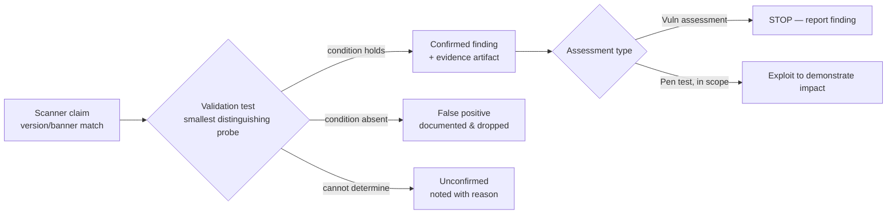
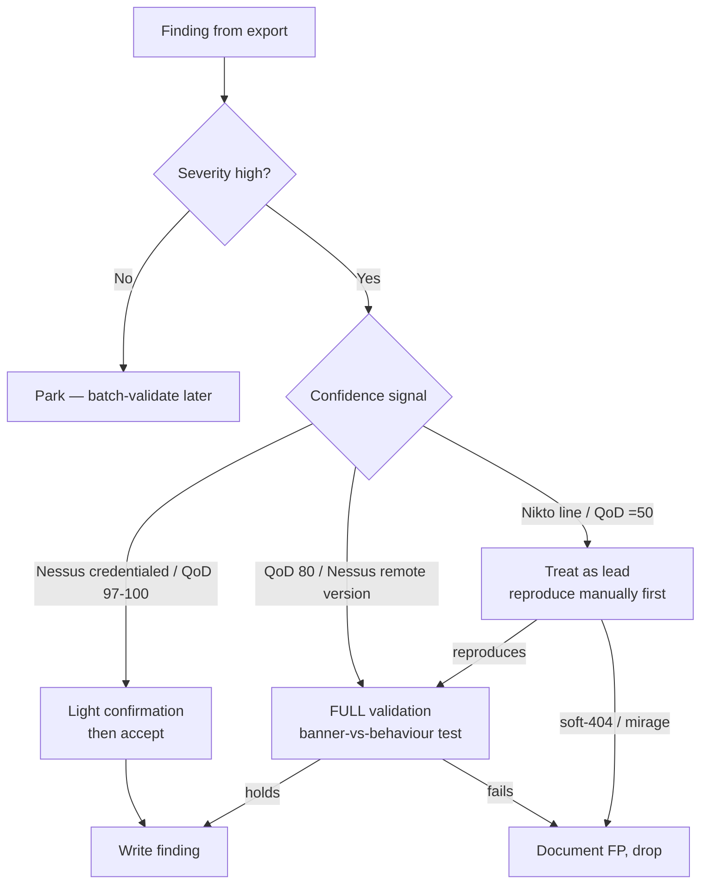
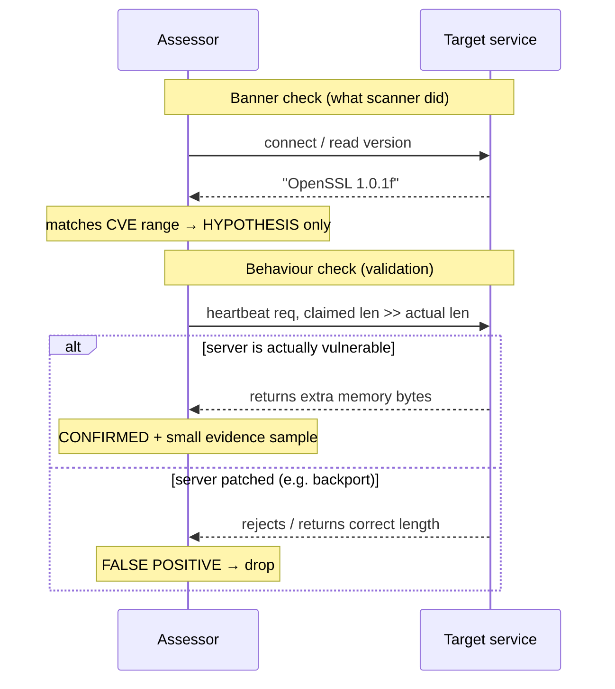
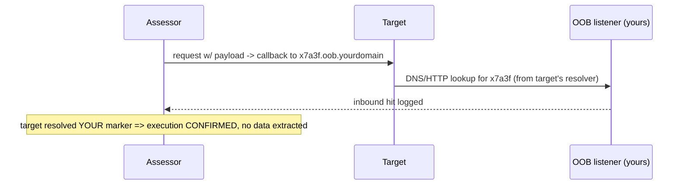
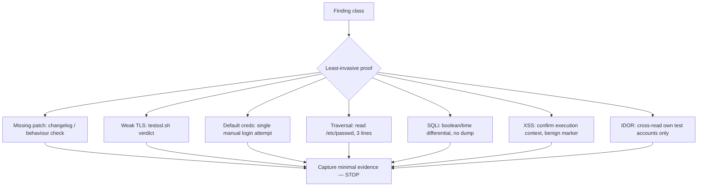
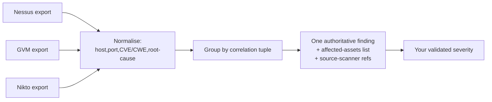
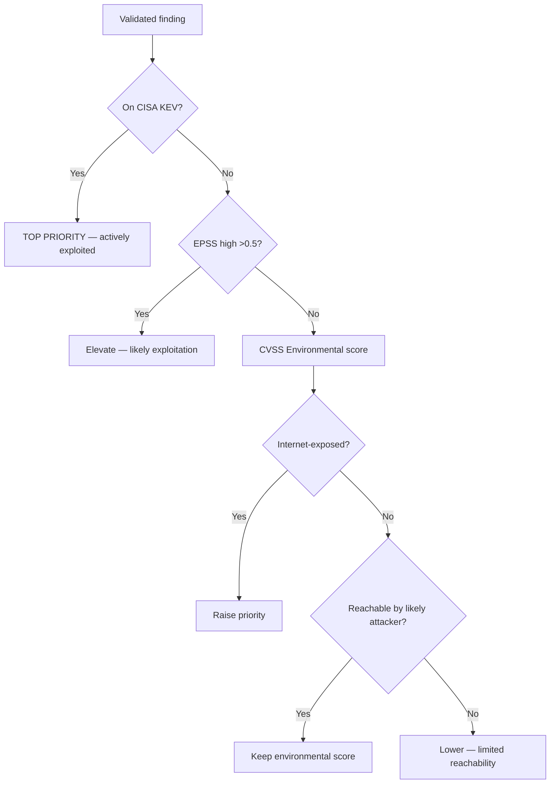
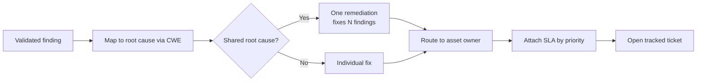

This is Chapter 4 of the Vulnerability Assessment series. The previous three chapters built the machinery: Chapter 1 gave you the vocabulary — CVE, CWE, CVSS, EPSS, KEV, CPE — and the matching problem underneath it. Chapters 2 and 3 taught you to *drive the scanners* — Nessus, and then Greenbone/OpenVAS and Nikto — and both closed on the same warning: a scanner produces claims, not facts. Nessus fires a plugin because a banner said `Apache/2.2.15`; GVM reports a QoD-80 finding because a version string matched an NVT's affected range; Nikto returns twenty "interesting file" hits because the server answers `200` to everything. None of those are yet a vulnerability. They are hypotheses.

This chapter is about the step that separates a scanner operator from an assessor: **validation and triage** — taking that pile of hypotheses and, one by one, either proving each is real, proving it is not, or explicitly recording that it could not be proven and why. It is the least glamorous and most valuable skill in the entire assessment workflow. A report full of unvalidated scanner output gets you laughed out of the room by any competent engineering team, because they will disprove your first three findings in ten minutes and then ignore the rest. A report where every finding carries reproducible proof gets remediated.

By the end you will be able to define validation precisely and distinguish it from scanning and from exploitation; read a scanner's confidence signal (Nessus severity/confidence, GVM QoD, Nikto's lack of one) and know how much verification each demands; recognise and run down the standard false-positive patterns — backported packages, soft-404s, reflected-input mirages, load-balancer banner drift; construct safe, minimal proof-of-concept evidence for each of the common finding classes without tipping a scan into an outage; de-duplicate and correlate findings across Nessus, GVM and Nikto so the same weakness reported by three tools becomes one finding; re-rate risk using CVSS environmental metrics, EPSS and the CISA KEV catalog so the report reflects *this* environment and not a generic base score; and write the finding up — title, evidence, impact, remediation, references — so it survives contact with the person who has to fix it.

The lawful-use framing from the earlier chapters carries over and, if anything, tightens here. Validation is where passive assessment starts to touch the target actively: you will send a crafted request, submit a login, request a specific path, or run a single exploit-adjacent probe to confirm a finding. Every one of those is an intrusive act. Do them only against systems you own or have named, written authorisation to test, and keep proof-of-concept work *minimal* — enough to prove the finding, never enough to cause harm or persist access. "I validated it by getting a full shell and dumping the database" is not validation; it is an unscoped intrusion, and in a real engagement it is how you lose the client and possibly your job.

## Part 1: What Validation Actually Means

Three words get used interchangeably by people who should know better — *scanning*, *validation*, and *exploitation* — and the confusion causes real damage in reports. They are distinct activities with distinct goals, distinct levels of intrusiveness, and distinct evidence.

**Scanning** is automated hypothesis generation. A scanner sends probes, compares responses against a signature database, and emits a claim: "host `10.0.0.5` port 443 is running OpenSSL 1.0.1 and is therefore vulnerable to CVE-2014-0160 (Heartbleed)." The scanner has *not* leaked memory from the host. It saw a version string — or in a better scanner, a specific TLS handshake behaviour — and matched it. Scanning is fast, broad, and shallow. Its output is a list of *maybes*.

**Validation** is the act of converting a specific *maybe* into a *yes*, a *no*, or a documented *unknown*. You take one finding and design the smallest possible test that distinguishes "the vulnerability is present and reachable" from "the scanner matched a version but the condition does not actually hold." For Heartbleed, validation means sending one malformed heartbeat request and observing whether the server returns more bytes than it should — and if it does, capturing a *small* fragment as proof, not dumping memory in a loop. Validation is narrow, deliberate, and evidence-producing. Its output is a *proven* finding with an attached artifact.

**Exploitation** is weaponising a validated vulnerability to achieve impact — a shell, data exfiltration, privilege escalation, lateral movement. It goes far beyond what validation requires. In a pure vulnerability assessment, you usually stop at validation. In a penetration test, exploitation is in scope but is still bounded by rules of engagement. The distinction matters because *the amount of proof you need is much smaller than the amount of access you could get*, and professional discipline is stopping at "proven," not "pwned."



The mental model to internalise: **a scanner answers "does the version match?"; validation answers "is the vulnerable condition actually reachable and true on this host, right now, from where I'm standing?"** Those are different questions, and the gap between them is where every false positive lives.

**Why the gap exists at all.** Scanners are optimised to *not miss things* — a missed critical vulnerability (false negative) is far more damaging to a scanner vendor's reputation than an extra false positive. So scanners lean toward over-reporting: match loosely, flag generously, let the human sort it out. That design choice is correct for a scanner and disastrous if you treat scanner output as ground truth. Your job in triage is to apply the *opposite* bias — assume nothing is real until proven — and reconcile the two.

**Pentester landing on a fresh scanner export:** the very first instinct should be distrust. Before writing a single finding, pick the three highest-severity items and try to disprove them. If they survive, the scan is probably calibrated well for this environment; if all three collapse on inspection, the whole export needs individual validation and you should budget time accordingly.

## Part 2: The Confidence Signal — Reading What the Scanner Is Really Telling You

Every serious scanner attaches a *confidence* dimension to each finding, separate from severity. Severity says "how bad if true"; confidence says "how sure am I it's true." Triage is largely the art of reading the confidence signal and spending validation effort where confidence is low and severity is high. If you validate high-confidence, low-severity findings first you are wasting the most expensive resource in the engagement — your time.

Each scanner encodes confidence differently, and knowing the encoding tells you how much verification a finding demands before you trust it.

| Scanner | Confidence signal | Range / meaning | How much manual proof it needs |
|---|---|---|---|
| Nessus | `Confidence` + plugin type | `General`/`Mixed`; plugin type `remote` vs `local` (credentialed) | Remote version-check plugins → high; credentialed local checks → usually trustworthy; "potential"/"could be" wording → validate always |
| Greenbone/GVM | QoD (Quality of Detection) 0–100% | 100 = exploit-proven; 97/95 = confirmed/version; 80 = remote banner; 75 = package check; ≤50 = heuristic | QoD ≥ 97 → light check; QoD 80 → **always** validate (banner guesses); QoD ≤ 70 → treat as a lead only |
| Nikto | *none* — flat list, no confidence field | every hit is presented equally | validate **all of it**; Nikto has the highest false-positive rate of the three |
| OpenVAS NVT `solution_type` | `VendorFix`/`Mitigation`/`WillNotFix`/`NoneAvailable` | informs remediation, not confidence | orthogonal — read alongside QoD |

The single most important number in this table is **GVM QoD 80**. It is the default remote-banner confidence, and it is where the majority of open-source-scanner false positives sit. A QoD-80 finding means "an NVT matched a service banner or version string." That is precisely the signal that backported packages, load balancers, and honeypots defeat. Chapter 3 introduced QoD; here is where it earns its keep — **QoD-80 is your validation queue.**

Nessus's equivalent trap is the *remote version check plugin*. Nessus plugins carry an internal type; a `remote` plugin that determines vulnerability purely from a version banner is exactly as fragile as GVM's QoD-80. When Nessus runs *credentialed* (local checks), it queries the package manager directly and its confidence rises sharply — a credentialed Nessus finding of a missing Debian security update is one of the most trustworthy signals you will get from any scanner, because it read `dpkg` state, not a banner.

Nikto deserves its own warning. It has **no confidence field at all**. Every line of Nikto output — the `/backup.sql` that's a real leak and the `/admin/` that's a soft-404 mirage — is presented with identical weight. This is not a defect to fix; it is the tool's design, as Chapter 3 argued: Nikto is a *lead generator*, not a decision-maker. Treat every Nikto line as QoD-0.



**Blue team usage:** the same confidence model runs in reverse on the defensive side. When your own vulnerability-management program ingests scanner output, the QoD/confidence field is what lets you auto-close low-confidence noise and route only high-confidence findings to patch owners. A VM program that treats QoD-80 and QoD-100 identically drowns its remediation teams in false positives and trains them to ignore the scanner — the exact failure mode that leaves a KEV-listed critical unpatched under a pile of banner-guess noise.

## Part 3: The Anatomy of a False Positive

A false positive is a finding the scanner reports that is not actually true for the host as it really exists. They are not random; they cluster into a handful of recognisable patterns, and once you know the patterns you can predict which findings to distrust before you even test them. This is the single highest-leverage knowledge in triage.

**Pattern 1 — the backported package (the number-one FP on Linux).** This is so common and so misunderstood that it deserves the most space. Enterprise Linux distributions — Red Hat Enterprise Linux, CentOS, Debian stable, Ubuntu LTS, Amazon Linux — practise **backporting**: when a security fix lands upstream in, say, `httpd 2.4.58`, Red Hat does *not* ship 2.4.58. Instead they take the *patch* for that specific CVE and apply it to the `2.4.6` package they already ship, then bump the *package release* number — `httpd-2.4.6-97.el7_9.5`. The upstream version string stays `2.4.6`. The vulnerability is fixed. But a banner-based scanner sees `Apache/2.4.6`, looks up "2.4.6 is affected by CVE-XXXX," and reports it. **The version is "vulnerable"; the host is not.**

This defeats every remote version check on the planet. The scanner is not wrong about the version — it is wrong about the *conclusion*, because it doesn't understand the distro's patch model. The proof lives in the *package release*, not the upstream version:

```bash
# RHEL / CentOS / Amazon Linux — check the actual package and changelog
rpm -q httpd                              # httpd-2.4.6-97.el7_9.5.x86_64
rpm -q --changelog httpd | grep -i CVE-2021-40438 | head
#   - core: Mitigate possible SSRF via mod_proxy (CVE-2021-40438)

# Debian / Ubuntu — same idea via the package changelog
dpkg -l apache2                           # 2.4.29-1ubuntu4.27
zcat /usr/share/doc/apache2/changelog.Debian.gz | grep -i CVE-2021-40438 | head
#   * SECURITY UPDATE: mod_proxy SSRF (CVE-2021-40438)
```

If the changelog names the CVE, the fix is present and the scanner finding is a **false positive** — full stop. This is why credentialed scanning (Chapter 2) so dramatically reduces false positives on Linux: with a login, the scanner reads `rpm`/`dpkg` state and the changelog rather than guessing from a banner. When you cannot get credentials, *you* must do this check by hand, and it is the first thing to try on any version-based Linux finding.

**Pattern 2 — the soft-404 (the number-one FP on web).** A correctly configured web server returns HTTP `404` for a path that does not exist. A great many real servers do not: a SPA returns `200` with `index.html` for every unknown path; a custom error handler returns `200` with a "page not found" body; a WAF or CDN returns `200` with a challenge page. When Nikto or a content scanner requests `/backup.sql`, `/admin/`, `/.git/config`, `/phpinfo.php` and the server answers `200` to all of them, the scanner concludes all of those files *exist*. They do not. This is a **soft-404**: a not-found response wearing a `200` status. It is the reason Nikto over-reports on SPAs and WAF-fronted sites.

The tell is behavioural: request a path you *know* is garbage and see what you get back.

```bash
# Baseline: request a definitely-nonexistent path
curl -s -o /dev/null -w "%{http_code} %{size_download}\n" \
     https://target/this-path-cannot-possibly-exist-8f3a2b1c
# 200 1487     <-- soft-404: server 200s for garbage, and body is ~1487 bytes

# Now the "finding" Nikto reported:
curl -s -o /dev/null -w "%{http_code} %{size_download}\n" https://target/backup.sql
# 200 1487     <-- IDENTICAL size => same generic page => FALSE POSITIVE

curl -s -o /dev/null -w "%{http_code} %{size_download}\n" https://target/real-file.js
# 200 40213    <-- different size / real content => this one is REAL
```

The discriminators are **status code, response size, and content hash** against a known-bad baseline. If the "finding" is byte-identical to the garbage baseline, it is a soft-404. `ffuf` and `gobuster` automate this with `-fs` (filter size), `-fc` (filter code) and auto-calibration (`-ac`), which is exactly why they beat Nikto for content discovery — but you still verify the survivors by hand.

**Pattern 3 — reflected-input mirage.** A scanner injects `<script>alert(1)</script>` into a parameter, sees the string appear in the response, and reports reflected XSS. But reflection is not execution. If the value is reflected inside an HTML-encoded context (`&lt;script&gt;`), or inside a JSON response served with `Content-Type: application/json`, or into an attribute that is properly quoted and escaped, it does not execute and there is no XSS. The scanner matched "my payload came back"; it did not confirm "my payload ran." Validation means checking the *context* the input lands in and whether the browser would actually parse it as script (covered in depth in the Web App Pentest notebook, but the triage principle is: reflection ≠ vulnerability).

**Pattern 4 — banner drift from proxies and load balancers.** The `Server:` header you see may belong to a reverse proxy, CDN, or load balancer, not the origin. A scanner reports "nginx 1.14 — outdated" but that nginx is a Cloudflare edge or an F5 in front of an entirely different backend. Or the reverse: the LB strips/rewrites the origin banner, so the scanner fingerprints the *proxy* and misses the real, vulnerable backend. Multiple hosts behind one VIP can return different banners on successive requests. The tell: inconsistent banners across repeated requests, or a `Via:`/`X-Cache:`/`CF-RAY:` header revealing an intermediary.

**Pattern 5 — the honeypot / deliberately fake banner.** Defenders set fake `Server:` strings to waste attacker time or to trip IDS on anyone who "exploits" the fake version. A host that advertises `Apache/1.3.0` in 2026 is either a museum piece or a trap. If the "vulnerable" version is implausibly old and every other signal (TLS stack, HTTP/2 support, error-page style) contradicts it, distrust the banner.

| FP pattern | Where it hits | The tell | The definitive check |
|---|---|---|---|
| Backported package | Linux (RHEL/Deb/Ubuntu/Amazon) | version "old", host patched | `rpm -q --changelog` / `changelog.Debian.gz` names the CVE |
| Soft-404 | Web content discovery, Nikto | server 200s for garbage paths | baseline garbage path → compare status+size+hash |
| Reflected-input mirage | XSS/injection scanners | payload echoed but encoded | inspect reflection context; does it execute? |
| Banner drift | Anything behind LB/CDN/proxy | inconsistent banners, `Via:`/`CF-RAY:` | fingerprint origin directly; check for proxy headers |
| Fake/honeypot banner | Deception environments | implausibly old version | cross-check TLS/HTTP2/error-page against claimed version |

**Pattern 6 — present but not reachable (the config-context FP).** The vulnerable code genuinely ships on the host, but the specific precondition the CVE requires is absent: the vulnerable Apache module isn't loaded (`mod_lua` for CVE-2021-44790), the risky PHP setting is off (`allow_url_include=Off` defeats an RFI CVE), the vulnerable feature is compiled out, or a firewall makes the port unreachable from any realistic attacker position. The version *matches* and the file *exists*, so version-based scanners fire — but the exploit path is closed. This is not a clean false positive (the code is there) and not a confirmed finding (it can't be triggered); it is a distinct third state — *not exploitable as configured* — and reporting it as either extreme is wrong. The definitive check is to inspect the precondition directly (`httpd -M | grep lua`, `php -i | grep allow_url_include`, a reachability probe), which is exactly the CAND-1 path walked in Part 11.

## Part 4: The Other Side — False Negatives and What Scanners Miss

Triage is not only about deleting false positives; it is also about knowing what the scanner *couldn't see*, because those gaps are where real, unreported risk hides. A false negative — a vulnerability that exists but the scanner did not report — is more dangerous than a false positive, because nobody is looking at it. A report that says "the scan was clean" without acknowledging the scanner's blind spots is actively misleading.

Scanners systematically miss whole categories:

- **Business-logic flaws.** No scanner understands that your app lets a user set a negative quantity to get a refund, or skip the payment step by requesting the confirmation URL directly, or escalate role by editing a hidden `is_admin` field. These are the highest-value bugs in most web apps and they are 100% invisible to automated scanning because they require understanding *intent*.
- **Authorization / access-control flaws (IDOR, BOLA).** A scanner logged in as user A cannot know that changing `?account_id=1001` to `1002` returns someone else's data — it has no concept of "should this user see this object." OWASP API #1 is essentially unscannable.
- **Chained / multi-step vulnerabilities.** A low-severity info leak plus a medium CSRF plus a self-XSS can chain into account takeover. Each scanner reports the pieces (or misses them); none reports the chain.
- **Auth-gated surface.** Anything behind a login the scanner didn't have credentials for is unscanned. This is why credentialed/authenticated scanning matters so much, and why an unauthenticated "clean" result means "clean *of the front door*," nothing more.
- **Zero-days and unpatched-but-unpublished issues.** By definition there is no signature, so no scanner fires.
- **Rate-limited or fragile endpoints** the scanner backed off from, and **hosts that were down** during the scan window (a host that is off is "not vulnerable" only until it boots).

| Blind spot | Why the scanner misses it | Where to look instead |
|---|---|---|
| Business logic | No model of *intent* | Manual walk-through of critical workflows (checkout, refund, role change) |
| Authorization / IDOR / BOLA | No concept of "should this user see this" | Two test accounts, cross-object requests |
| Vulnerability chains | Reports pieces, not composition | Manually compose low+medium findings toward impact |
| Auth-gated surface | No credentials for it | Credentialed/authenticated re-scan + manual testing |
| Zero-day / unpublished | No signature exists | Threat intel, anomaly review, defence-in-depth |
| Fragile / rate-limited endpoints | Scanner backed off | Careful manual probing at low rate |

**The triage takeaway:** always record *coverage* alongside findings. "Scanned 254 hosts, 240 responded, credentialed on 180, web app tested unauthenticated only" tells the reader what the clean areas actually mean. Presenting a findings list without a coverage statement implies a completeness you did not achieve.

**Red team usage:** the false-negative categories above are precisely where an attacker who has read the same clean report will go — the auth-gated app, the IDOR, the logic flaw. On an engagement, treat the scanner's blind spots as your target list, not its findings list. The findings list is where the *defender* is already looking.

## Part 5: Banner-Versus-Behaviour — The Core Validation Technique

The single most transferable validation skill is distinguishing a **banner check** from a **behaviour check**. A banner check reads what the service *claims*; a behaviour check observes what the service *does* when poked in a way that only a vulnerable version would respond to. Almost every high-quality validation reduces to replacing a banner check with a behaviour check.

Consider the difference for one concrete finding — "OpenSSL vulnerable to Heartbleed (CVE-2014-0160)":

- **Banner check (what the scanner did):** connect, read `OpenSSL 1.0.1f` from the handshake, match the version range, report. Fragile — the version could be backported-patched.
- **Behaviour check (validation):** send a TLS heartbeat request that claims a larger payload length than it actually contains, and observe whether the server returns extra bytes from its memory. Only an actually-vulnerable server does this. This is behaviour, not banner, and it is definitive.

```bash
# Behaviour-based Heartbleed check with Nmap's script (SAFE — reads a small amount)
nmap -p 443 --script ssl-heartbleed 10.0.0.5
# PORT    STATE SERVICE
# 443/tcp open  https
# | ssl-heartbleed:
# |   VULNERABLE:
# |   The Heartbleed Bug is a serious vulnerability in OpenSSL...
# |     State: VULNERABLE   <-- behaviour confirmed, not a version guess
# |     Risk factor: High
```

`nmap --script <name>` runs a Nmap Scripting Engine (NSE) probe. `ssl-heartbleed` sends the malformed heartbeat and reports `VULNERABLE` only on observed over-read — a behaviour check. Compare `sslscan` or `testssl.sh`, which are the behaviour-based tools for the whole TLS finding family:

```bash
# testssl.sh — behaviour-tests the entire TLS stack, not the banner
testssl.sh --severity HIGH https://10.0.0.5
#  Heartbleed (CVE-2014-0160)   not vulnerable (OK), timed out
#  CCS (CVE-2014-0224)          not vulnerable (OK)
#  ROBOT                        not vulnerable (OK)
#  Secure Renegotiation         supported (OK)
#  BREACH (CVE-2013-3587)       potentially NOT ok, uses gzip HTTP compression
```

`testssl.sh` opens real TLS connections and *tries* each weakness (it attempts a CCS injection, a ROBOT oracle query, checks actual cipher negotiation), so its verdicts are behaviour-based and dramatically more trustworthy than a version match. When it says "not vulnerable (OK)" for a CVE the version-scanner flagged, you have your false-positive confirmation.

The pattern generalises. For any version-based finding, ask: **is there a tool or a single request that tests the *condition* rather than the *version*?** Usually there is — an NSE script, a `testssl.sh` check, a `curl` that triggers the specific behaviour. Reaching for it is the whole game.

Not every finding has a clean behaviour check, and honesty about that is part of the craft. Three tiers of confidence result from validation, and each gets recorded differently:

| Tier | What you did | How it's recorded |
|---|---|---|
| **Confirmed (behaviour)** | Triggered the vulnerable condition and observed it | "Confirmed" — full severity, evidence attached |
| **Confirmed (config/state)** | Read authoritative host state (changelog, loaded modules, config) | "Confirmed" or "Not exploitable as configured" — with the state as proof |
| **Unconfirmed (version only)** | No behaviour check exists; only a version match | "Version-based; not behaviourally confirmed" — flagged, lower confidence |

The mistake is collapsing all three into an undifferentiated "vulnerable." A finding you proved by behaviour and a finding you only version-matched are different claims, and the report must say which is which. The CAND-1 case in the Part 11 lab is exactly the middle tier — a version match that host state shows is *not exploitable as configured* — and naming that precisely is where triage earns its fee.



## Part 6: The Validation Toolkit — Teaching Each Tool From Zero

Validation uses a small, sharp toolkit. Because AUTHORING Rule 8 requires teaching each tool the first time it appears, here is the working set — what each is, why it exists, how to install it on Kali, and the core workflow. These are the tools the lab in Part 11 leans on.

### curl — the universal validation probe

`curl` ("client URL") is a command-line HTTP(S) (and many other protocols) client. It is the single most important validation tool because it lets you send *exactly* the request you want and see *exactly* the raw response, with none of a browser's helpful lies (caching, redirects, JS execution). If you can express a validation test as an HTTP request, curl runs it deterministically.

It ships on Kali. Core flags every validator must know:

```bash
curl -i https://target/path            # -i: include response headers in output
curl -s ...                            # -s: silent (no progress meter) — for scripting
curl -k https://target/                # -k: skip TLS cert validation (self-signed labs)
curl -X POST https://target/login      # -X: set HTTP method
curl -d 'user=admin&pass=admin' URL    # -d: POST body (implies POST, sets urlencoded CT)
curl -H 'Authorization: Bearer X' URL  # -H: add/override a request header
curl -b 'session=abc' URL              # -b: send a cookie
curl -L URL                            # -L: follow redirects
curl --path-as-is URL                  # do NOT collapse ../ — essential for traversal tests
curl -o /dev/null -w "%{http_code} %{size_download}\n" URL   # -w: print only chosen fields
curl --resolve host:443:10.0.0.5 https://host/   # test a vhost by IP (bypass DNS/LB)
```

The `-w` (write-out) flag is the soft-404 killer from Part 3: it prints just the status and size so you can compare a finding against a garbage baseline without eyeballing HTML.

### nmap + NSE — behaviour-based service checks

`nmap` ("network mapper") is the port scanner from the Scanning & Enumeration notebook; here it matters for its **NSE** (Nmap Scripting Engine) library of ~600 scripts, many of which are *behaviour-based vulnerability checks* — the validation-grade tests referenced in Part 5. Scripts live in categories: `vuln`, `safe`, `intrusive`, `auth`, `default`.

```bash
nmap --script-help ssl-heartbleed          # read what a script does BEFORE running it
nmap -p 443 --script ssl-heartbleed TARGET # run one specific behaviour check
nmap -p 445 --script smb-vuln-ms17-010 TARGET   # EternalBlue behaviour check (safe probe)
nmap --script "vuln and safe" -p- TARGET   # all vuln scripts flagged safe (no DoS)
```

**Always read `--script-help` first** and prefer `safe` over `intrusive` scripts during validation — some `vuln` scripts actually attempt exploitation and can crash fragile targets. `smb-vuln-ms17-010` is safe (it checks the transaction behaviour); a raw MS17-010 exploit is not.

### testssl.sh — the TLS behaviour oracle

`testssl.sh` is a single Bash script that opens real TLS connections and tests protocol versions, cipher suites, and named CVEs (Heartbleed, ROBOT, CCS, POODLE, BEAST, LUCKY13, Sweet32) by *behaviour*. It is the definitive validator for the entire "weak TLS / SSL vulnerability" finding family that scanners over-report.

```bash
git clone --depth 1 https://github.com/testssl/testssl.sh.git
cd testssl.sh && ./testssl.sh https://target        # full run
./testssl.sh -p -U https://target                   # -p protocols only, -U all vulns
./testssl.sh --severity MEDIUM --jsonfile out.json https://target  # machine-readable
```

### jq / xmllint — parsing scanner exports

Validation at scale means parsing scanner output. `jq` is a command-line JSON processor; `xmllint` (from `libxml2-utils`) queries XML with XPath. Nessus exports `.nessus` (XML), GVM exports report XML, and many tools emit JSON. You will use these constantly in the Part 11 lab.

```bash
sudo apt-get install -y jq libxml2-utils
# Pull all high/critical findings from a GVM report XML:
xmllint --xpath '//result[threat="High"]/name/text()' report.xml
# Filter a JSON scanner export to just KEV-relevant CVEs:
jq '.findings[] | select(.severity>=7) | {host, cve, qod}' export.json
```

### Supporting cast

- **`ffuf`** (fuzz faster u fool) — content discovery with auto-calibration (`-ac`) that filters soft-404s automatically; the right tool to *reproduce* a Nikto file-finding cleanly. (`sudo apt install ffuf`.)
- **`openssl s_client`** — raw TLS connection inspection when you need the exact certificate/cipher a handshake used (`openssl s_client -connect host:443 -servername host`).
- **`nc` / `ncat`** — raw TCP to read a service banner directly and compare it against what the scanner recorded.
- **A browser + intercepting proxy (Burp/ZAP)** — for validating web findings in their real execution context (taught fully in the Web App Pentest notebook).

## Part 7: Safe Proof-of-Concept — Validating the Common Finding Classes

Here is the practical core: for each finding class you will actually see in scanner output, how to build the *minimal safe proof* that confirms it. The governing principle throughout is **least-invasive sufficient proof** — the smallest action that turns "maybe" into "yes" without causing harm, persisting access, or touching data you don't need.

### Missing patch / vulnerable version (the most common finding)

- **Un-credentialed, Linux:** you cannot see package state, so replace the version guess with a behaviour check if one exists (NSE `vuln` script, `testssl.sh`, a specific `curl`). If no behaviour check exists, downgrade confidence and say so: "version-based; not behaviourally confirmed; backport status unknown."
- **Credentialed / with host access:** run the `rpm -q --changelog` / `changelog.Debian.gz` check from Part 3. Changelog names the CVE → **false positive**. Changelog silent and version below fixed release → confirmed.
- **Evidence to capture:** the exact version string *and* the package-release/changelog output (or the behaviour-check result), so a reader can reproduce your conclusion.

### Weak / vulnerable TLS

- Run `testssl.sh` (Part 6). It behaviour-tests every TLS CVE and every weak protocol/cipher. Capture the relevant lines.
- **Do not** "prove" POODLE/BEAST by decrypting real traffic — the protocol/cipher support *is* the proof; demonstrating decryption is unnecessary and disproportionate.

### Default / weak credentials

- Try the specific documented default (`admin:admin`, vendor defaults) **once or twice manually** — never a brute-force wordlist during validation, which risks lockout (recall the AD lockout warning from Chapter 3).

```bash
# Single, deliberate default-cred check — NOT a brute force
curl -s -o /dev/null -w "%{http_code}\n" -u admin:admin https://target/admin/
# 200  => default creds accepted (CONFIRMED). 401 => rejected.
```

- **Evidence:** the request and the authenticated response *status/first line only* — never dump the contents behind the login beyond proving access. Log in, screenshot the "you are logged in as admin" banner, log out. Nothing more.

### Directory traversal / path traversal

- Request a canonical, harmless target file with `--path-as-is` (so curl doesn't normalise the `../`):

```bash
curl --path-as-is -s "https://target/download?file=../../../../etc/passwd" | head -3
# root:x:0:0:root:/root:/bin/bash
# daemon:x:1:1:daemon:/usr/sbin:/usr/sbin/nologin
# bin:x:2:2:bin:/bin:/usr/sbin/nologin
```

- `/etc/passwd` (or `C:\Windows\win.ini` on Windows) is the conventional *harmless* proof file — readable, non-sensitive, unmistakable. **Do not** traverse to `/etc/shadow`, private keys, or app secrets to "prove it harder"; reading `/etc/passwd` already proves arbitrary file read. Capture the first 3 lines, not the whole file.

### SQL injection

- Prove with a **boolean or time-based** differential, not by dumping the database. A single true/false pair that changes the response demonstrates injection:

```bash
# Baseline vs. boolean-true vs. boolean-false — response differs => injectable
curl -s "https://target/item?id=1"            -o /dev/null -w "%{size_download}\n"  # 5120
curl -s "https://target/item?id=1 AND 1=1"    -o /dev/null -w "%{size_download}\n"  # 5120 (true)
curl -s "https://target/item?id=1 AND 1=2"    -o /dev/null -w "%{size_download}\n"  # 342  (false)
# size flips with the boolean condition => SQLi CONFIRMED
```

- If you must use `sqlmap`, cap it hard: `sqlmap -u URL --batch --technique=B --level=1 --risk=1 --flush-session` and stop at "parameter is injectable." **Do not** run `--dump` in a validation context — proving injectability is the finding; exfiltrating the customer table is an incident.

### Reflected XSS

- Confirm *execution context*, not reflection (Part 3). Submit a benign context-breaking payload and inspect whether it lands unescaped in an HTML/JS context:

```bash
curl -s "https://target/search?q=xss5731<b>test</b>" | grep -o 'xss5731<b>test</b>'
# xss5731<b>test</b>   <-- rendered as HTML (unescaped) => executable context
# vs. xss5731&lt;b&gt;test&lt;/b&gt;  <-- HTML-encoded => NOT vulnerable
```

- Use a unique marker (`xss5731`) so you can grep the reflection unambiguously. Prove with `alert(document.domain)` in a browser only if execution context is confirmed — and never with a payload that exfiltrates cookies to a third party.

### Server-Side Request Forgery (SSRF)

SSRF findings from scanners are almost always low-confidence — the scanner saw a URL-fetching parameter and guessed. Validation means proving the server actually makes a request *you* control. The safe, definitive proof is an **out-of-band callback**: point the parameter at a host you control and watch for the inbound connection, rather than trying to reach internal services blind.

```bash
# Stand up a listener you control (lab: your own box)
ncat -lvkp 8000                                  # or use an OOB service (see below)
# Trigger the SSRF at the parameter the scanner flagged:
curl -sk "https://target/fetch?url=http://10.0.0.99:8000/ssrf-proof-7a3f"
# Listener shows:  GET /ssrf-proof-7a3f  from 10.0.0.5  <-- the SERVER connected back => CONFIRMED
```

The inbound hit from the *target's* IP (not yours) is the proof: the server made the request. **Do not** pivot the SSRF to read cloud metadata (`169.254.169.254`) or hammer internal services in a validation context — the callback already proves the finding. The unique marker (`ssrf-proof-7a3f`) ties the inbound request unambiguously to your test.

### Blind and out-of-band injection

Many real injection findings are **blind** — the response body doesn't change, so the boolean/reflection tricks above don't apply. Two safe proof techniques:

- **Time-based differential** — inject a conditional sleep and measure response latency. A reliable delay that tracks your payload proves execution without extracting any data.

```bash
# Blind SQLi — time-based proof (no data exfiltration)
time curl -sk "https://target/i?id=1 AND SLEEP(5)" -o /dev/null   # ~5s  => injectable
time curl -sk "https://target/i?id=1 AND SLEEP(0)" -o /dev/null   # ~0s  => baseline
```

- **Out-of-band (OOB) callback** — for blind RCE/SQLi/XXE where no in-band channel exists, trigger a DNS or HTTP lookup to a host you control (the same callback pattern as SSRF). An inbound DNS query for `x7a3f.oob.yourdomain` proves code execution or entity resolution on the target. This is the *only* reliable proof for fully-blind classes, and it is still minimal — a single lookup, no data moved.



### XML External Entity (XXE)

- Scanners flag XML endpoints; validation submits a benign external-entity document that reads a harmless file or triggers an OOB lookup. Prove file read with `/etc/passwd` (first lines) or, for blind XXE, the OOB callback above — never exfiltrate application secrets to prove it.

### Authentication bypass / IDOR

- IDOR: with two test accounts you control, request account A's object while authenticated as B and confirm cross-tenant read. Use *only your own test data* — never pull a real user's record as "proof."



**The discipline that ties this together:** at every step, ask "have I proven the finding?" the moment the answer is yes, *stop*. The gap between "proven" and "maximally exploited" is where assessors get into legal and ethical trouble, and it adds nothing to the report except risk.

## Part 8: Building the Evidence Package

A validated finding is worthless in a report if you cannot reproduce it. The evidence package is what makes a finding *defensible* — it lets the reader (a skeptical developer, an auditor, a future you) re-run the proof and see the same result. A finding without reproducible evidence is an opinion.

A complete evidence package for one finding contains:

1. **The exact target** — host/IP, port, URL, and (crucially) *which* instance if there are several behind a VIP. `10.0.0.5:443` and `www.example.com` may be the same box or different ones; say which you tested.
2. **The exact request/command** — copy-pasteable, with every flag. "I used curl to check the path" is not evidence; the literal `curl --path-as-is -s "https://.../file=../../../../etc/passwd"` is.
3. **The exact response** — the relevant part, timestamped. Status line, key headers, and the minimal body fragment that proves the finding. Redact anything sensitive that leaked (that redaction is itself evidence of the impact).
4. **The timestamp and source IP** — so the client can correlate against their logs and confirm it was you, not a real attacker, during the incident window.
5. **The interpretation** — one or two sentences: what this proves and why. "The server returned the contents of `/etc/passwd`, confirming unauthenticated arbitrary file read via the `file` parameter."

```bash
# A self-contained evidence capture: request, response, timestamp, all in one artifact
{
  echo "=== Finding: Path traversal in /download?file= ==="
  echo "Target: https://10.0.0.5/  (vhost app.internal)"
  echo "Tester source: 10.0.0.99   Time: $(date -u +%FT%TZ)"
  echo "--- Command ---"
  echo 'curl --path-as-is -s "https://10.0.0.5/download?file=../../../../etc/passwd"'
  echo "--- Response (first 3 lines) ---"
  curl --path-as-is -sk "https://10.0.0.5/download?file=../../../../etc/passwd" | head -3
} | tee evidence/traversal-download-file.txt
```

**Screenshots** are for GUI-only proof (a logged-in admin panel, a rendered XSS `alert`). Always include the address bar and a timestamp in the frame. **Packet captures** (`tcpdump -w finding.pcap host 10.0.0.5 and port 443`) are the gold standard for network-level findings but are heavy; capture them for the highest-severity items where the raw bytes matter (e.g. actual Heartbleed over-read).

**Naming and storage:** one file/folder per finding, named for the finding and host (`evidence/CRIT-01_heartbleed_10.0.0.5.pcap`). This maps 1:1 to the findings register (Part 10) and means that when a developer disputes finding CRIT-01, you produce `CRIT-01`'s evidence in seconds. **Handle evidence as sensitive** — it often contains real data that leaked; store it encrypted and destroy it per the engagement's data-handling terms.

## Part 9: De-Duplication and Cross-Scanner Correlation

Run Nessus, GVM and Nikto against the same subnet (as Chapter 3's lab did) and the same underlying weakness appears three times under three different names, three different IDs, and possibly three different severities. If you paste all three into the report you have inflated the finding count, contradicted yourself on severity, and made the client fix the same thing three times. **Correlation** collapses the duplicates into one authoritative finding.

The correlation key is not the scanner's finding ID (they're all different) — it is the tuple that identifies the *actual weakness on the actual asset*:

**`(host, port, CVE-or-CWE, root-cause)`**

Two findings that share this tuple are the same finding, whatever the scanners called them. Concretely:

| Nessus | GVM | Nikto | Same finding? |
|---|---|---|---|
| "Apache 2.4.6 < 2.4.52 mod_lua RCE" (CVE-2021-44790) on `10.0.0.5:443` | "Apache HTTP Server RCE Vulnerability" QoD 80, CVE-2021-44790, `10.0.0.5:443` | — | **Yes** — same host/port/CVE → one finding |
| "SSL Medium Strength Ciphers" `10.0.0.5:443` | "SSL/TLS: Weak Cipher Suites" `10.0.0.5:443` | — | **Yes** — same host/port/root-cause (cipher config) |
| "Web server info leak `/server-status`" `10.0.0.5:443` | — | "`/server-status`: Apache status page" `10.0.0.5:443` | **Yes** — Nessus + Nikto, one finding |
| "OpenSSH 7.4 multiple vulns" `10.0.0.5:22` | "OpenSSH 7.4 multiple vulns" `10.0.0.6:22` | — | **No** — different hosts → two findings (or one finding, two affected assets) |

Note the last row's nuance: the *same weakness on different hosts* can be modelled either as two findings or as one finding with an "affected assets" list. For a report, **one finding + affected-assets table** is almost always the better structure — it groups remediation (patch OpenSSH everywhere) instead of scattering it.

A compact correlation pass in code, keying on the real weakness rather than scanner IDs:

```python
# Merge normalised lines (host|port|source|name|sev|cve) into deduped findings
import collections, re
groups = collections.defaultdict(lambda: {"hosts": set(), "sources": set()})
for line in open("normalised.txt"):
    host, port, src, name, sev, cve = line.rstrip().split("|")
    port = re.sub(r"/.*", "", port)                 # 443/tcp -> 443
    key = (port, cve or name.lower()[:40])          # CVE if present, else name stem
    g = groups[key]
    g["hosts"].add(host); g["sources"].add(src); g["name"] = name
for (port, k), g in groups.items():
    print(f"{g['name']} :{port}  hosts={sorted(g['hosts'])}  seen_by={sorted(g['sources'])}")
# Apache mod_lua RCE (CVE-2021-44790) :443  hosts=['10.0.0.5']  seen_by=['gvm','nessus']
# SSL/TLS Weak Cipher Suites :443  hosts=['10.0.0.5']  seen_by=['gvm','nessus']
```

Keying on `(port, CVE-or-name-stem)` and aggregating hosts is what turns three scanner rows into one finding with an affected-assets set and a `seen_by` provenance list.

When scanners disagree on severity for a correlated finding, **you** set the severity from your own validated risk rating (Part 10), not by averaging or by trusting whichever scanner shouted loudest. Record the source scanners as metadata ("detected by: Nessus #158883, GVM NVT 1.3.6.1.4.1.25623.1.0.150438") so the finding is traceable, but the severity, evidence, and write-up are yours.



## Part 10: Risk Rating for *This* Environment — CVSS Environmental, EPSS, KEV

Chapter 1 taught the CVSS metric groups, EPSS, and the CISA KEV catalog in the abstract. Triage is where you *apply* them to re-rate a finding for the specific environment instead of copying the scanner's generic base score. A CVSS base score is intentionally context-free — it assumes a worst-case, internet-exposed, business-critical asset. Most of your findings are not that, and reporting the base score unmodified either over-states internal findings (crying wolf) or under-states an exposed one.

**CVSS Environmental metrics** are the built-in mechanism for this recontextualisation. They let you adjust the base score for *your* asset:

- **Modified Attack Vector** — the scanner assumes `Network`; if the vulnerable service is only reachable on an isolated management VLAN, `Modified Attack Vector: Adjacent` or the reachability drops the effective score substantially.
- **Confidentiality/Integrity/Availability Requirements** (CR/IR/AR) — a data-integrity flaw on the billing database is `IR:High`; the same flaw on a throwaway dev box is `IR:Low`. This raises or lowers the environmental score accordingly.
- **Modified base metrics** — if a compensating control (a WAF, network ACL, MFA) changes the real exploitability, reflect it.

The result is an **environmental score** that answers "how bad is this *here*," which is what the client actually needs.

**EPSS** (Exploit Prediction Scoring System) adds the "how likely is this to be exploited in the wild in the next 30 days" dimension — a 0–1 probability. A CVSS 9.8 with EPSS 0.02 (unlikely to be exploited) may be less urgent than a CVSS 7.5 with EPSS 0.85 (actively being exploited). Pull it live:

```bash
# EPSS score for a CVE (higher = more likely to be exploited soon)
curl -s "https://api.first.org/data/v1/epss?cve=CVE-2021-44228" \
  | jq '.data[] | {cve, epss, percentile}'
# { "cve": "CVE-2021-44228", "epss": "0.94400", "percentile": "0.99990" }
```

**CISA KEV** (Known Exploited Vulnerabilities) is the trump card: if a CVE is on the KEV catalog, it is *being exploited right now* — there is no "theoretical" left in the conversation. A KEV-listed finding jumps to the top of remediation regardless of CVSS. Cross-reference your findings against KEV:

```bash
# Download KEV and check whether a finding's CVE is on it
curl -s https://www.cisa.gov/sites/default/files/feeds/known_exploited_vulnerabilities.json \
  | jq -r '.vulnerabilities[].cveID' > kev.txt
grep -Ff mycves.txt kev.txt      # any match => actively exploited => top priority
```

The triage priority formula that most mature programs converge on:



| Input | Question it answers | Effect on priority |
|---|---|---|
| CVSS Base | How bad in the abstract? | Starting point only |
| CVSS Environmental | How bad *on this asset, here*? | Recontextualise up/down |
| EPSS | How likely to be exploited soon? | Elevate high-EPSS items |
| CISA KEV | Is it being exploited *now*? | Trumps everything → top |
| Reachability / exposure | Can a real attacker reach it? | Major up/down modifier |
| Asset criticality | Does this asset matter? | CR/IR/AR modifier |

The **findings register** is where all of this lands — one row per correlated, validated finding:

| ID | Finding | Host(s) | CVE | Base | Env | EPSS | KEV | Validated? | Evidence | Priority |
|---|---|---|---|---|---|---|---|---|---|---|
| CRIT-01 | Log4Shell RCE | app01,app02 | CVE-2021-44228 | 10.0 | 9.6 | 0.944 | Yes | Yes (JNDI callback) | pcap+log | P1 |
| HIGH-02 | Apache mod_lua RCE | 10.0.0.5 | CVE-2021-44790 | 9.8 | 7.4 | 0.11 | No | Yes (behaviour) | curl+resp | P2 |
| MED-03 | Weak TLS ciphers | 10.0.0.5 | — (CWE-327) | 5.9 | 4.2 | — | — | Yes (testssl) | testssl out | P3 |
| FP-— | "Apache 2.2 vulns" | 10.0.0.7 | multiple | 7.5 | — | — | — | **No — backport** | changelog | Dropped |

That last row is doing real work: **recording the false positives you dropped, with the proof they were false**, is part of a professional deliverable. It shows the client you validated rather than dumped, and it stops the same FP being re-raised next quarter.

## Part 11: Hands-On Lab — From Mixed Scanner Export to Validated Findings Register

This lab takes the union of a Nessus, GVM, and Nikto scan of a lab subnet (the Metasploitable-style targets from Chapter 3) and runs the full triage pipeline: parse → correlate → validate → rate → register. Every command is real and reproducible against a lab you own. **Lab only — never against a system without written authorisation.**

### Lab setup

Targets: `10.0.0.5` (Linux web/app host), `10.0.0.6` (Linux SSH host), `10.0.0.7` (RHEL host — the backport trap). Attacker: Kali at `10.0.0.99`. Assume you have `nessus_report.nessus`, `gvm_report.xml`, and `nikto_10.0.0.5.txt` from prior scans.

```bash
mkdir -p ~/triage/evidence && cd ~/triage
sudo apt-get install -y jq libxml2-utils ffuf ncat
git clone --depth 1 https://github.com/testssl/testssl.sh.git
```

### Step 1 — Parse each export into a normalised line format

Normalise everything to `host|port|id|name|severity|confidence` so correlation is possible.

```bash
# Nessus (.nessus is XML): pull ReportItems
xmllint --xpath '//ReportHost/ReportItem' nessus_report.nessus 2>/dev/null | \
  grep -oP '(?<=pluginName=")[^"]+' | head
# Cleaner: use a small parser
python3 - <<'PY'
import xml.etree.ElementTree as ET
t=ET.parse('nessus_report.nessus'); r=t.getroot()
for h in r.iter('ReportHost'):
    ip=h.get('name')
    for it in h.iter('ReportItem'):
        sev=it.get('severity'); port=it.get('port')
        name=it.get('pluginName'); cve=[c.text for c in it.iter('cve')]
        if sev and int(sev)>=2:   # medium+ only
            print(f"{ip}|{port}|nessus:{it.get('pluginID')}|{name}|{sev}|{','.join(cve)}")
PY
# 10.0.0.5|443|nessus:158883|Apache 2.4.x < 2.4.52 mod_lua RCE|4|CVE-2021-44790
# 10.0.0.5|443|nessus:104743|SSL Medium Strength Ciphers Supported|2|
# 10.0.0.7|80|nessus:33477|Apache 2.2.x multiple vulnerabilities|3|CVE-...,...
```

```bash
# GVM report XML: pull results with QoD
xmllint --xpath '//result[qod/value>=70]' gvm_report.xml 2>/dev/null >/dev/null
python3 - <<'PY'
import xml.etree.ElementTree as ET
t=ET.parse('gvm_report.xml')
for res in t.iter('result'):
    host=res.findtext('host'); name=res.findtext('name')
    thr=res.findtext('threat'); qod=res.findtext('qod/value')
    port=res.findtext('port')
    if thr in ('High','Medium'):
        print(f"{host}|{port}|gvm|{name}|{thr}|QoD={qod}")
PY
# 10.0.0.5|443/tcp|gvm|Apache HTTP Server RCE (CVE-2021-44790)|High|QoD=80
# 10.0.0.5|443/tcp|gvm|SSL/TLS: Weak Cipher Suites|Medium|QoD=98
# 10.0.0.7|80/tcp|gvm|Apache 2.2 Multiple Vulnerabilities|High|QoD=80
```

```bash
# Nikto text: extract the '+ ' finding lines
grep -E '^\+ ' nikto_10.0.0.5.txt
# + /server-status: Apache server-status interface found (protected)
# + /backup.sql: Possible database backup found.
# + /admin/: Admin login page/section found.
```

### Step 2 — Correlate into candidate findings

Group by `(host, port, CVE/root-cause)`. The Apache RCE appears in both Nessus and GVM on `10.0.0.5:443` → one candidate. Weak ciphers appear in both → one. `/server-status` is Nikto-only → one lead. The RHEL `10.0.0.7` "Apache 2.2 multiple vulns" appears in both Nessus and GVM at QoD 80 → one *suspicious* candidate (old version on RHEL = classic backport trap).

```
CAND-1  10.0.0.5:443  Apache mod_lua RCE  CVE-2021-44790  (Nessus+GVM, QoD80)  -> VALIDATE
CAND-2  10.0.0.5:443  Weak TLS ciphers    CWE-327         (Nessus+GVM, QoD98)  -> confirm testssl
CAND-3  10.0.0.5:443  /server-status leak                 (Nikto only)         -> reproduce
CAND-4  10.0.0.7:80   "Apache 2.2 vulns"  multiple        (Nessus+GVM, QoD80)  -> BACKPORT check
```

### Step 3 — Validate each candidate

**CAND-4 first (cheapest to kill).** This is the backport trap from Part 3. With host access (or credentialed scan data):

```bash
ssh user@10.0.0.7 'rpm -q httpd; rpm -q --changelog httpd | grep -iE "CVE-2017-|CVE-2018-" | head'
# httpd-2.2.15-69.el6.centos.x86_64
# - core: fix mod_status buffer overflow (CVE-2017-9798)
# - Resolve CVE-2018-1312 in mod_auth_digest
```

The changelog names the CVEs the scanner flagged → **the fixes are backported → CAND-4 is a FALSE POSITIVE.** Record it in the register's dropped section with the changelog as proof. Four "high" findings just evaporated, correctly.

**CAND-2 (weak TLS).** Behaviour-test with testssl:

```bash
./testssl.sh/testssl.sh --severity MEDIUM --warnings off 10.0.0.5:443 | grep -iE 'cipher|3DES|RC4|CBC'
# Obsoleted CBC ciphers (AES, ARIA etc.)   offered
# 3DES, RC4                                 not offered (OK)
# Negotiated cipher   TLS_RSA_WITH_AES_128_CBC_SHA (no PFS)   <-- weak: no forward secrecy
```

Confirmed by behaviour — the server negotiates a CBC/no-PFS cipher. **CAND-2 is REAL** (Medium). Evidence: the testssl output block.

**CAND-3 (`/server-status`).** Reproduce the Nikto lead manually and check it's not a soft-404:

```bash
# Baseline garbage path vs. the finding
curl -sk -o /dev/null -w "%{http_code} %{size_download}\n" https://10.0.0.5/garbage-9f1a
# 404 289
curl -sk -o /dev/null -w "%{http_code} %{size_download}\n" https://10.0.0.5/server-status
# 200 6142
curl -sk https://10.0.0.5/server-status | grep -i 'Apache Server Status' | head -1
# <h1>Apache Server Status for 10.0.0.5</h1>
```

Different status and size from baseline, and the body is the real mod_status page exposing worker/URL data → **CAND-3 is REAL** (info disclosure, Medium). Not a soft-404. Evidence: the two curl lines + the grep.

**CAND-1 (Apache mod_lua RCE, QoD 80).** The scary one, and QoD-80 so it demands validation. First check whether the vulnerable module is even loaded and whether the version is truly below the fix (not backported):

```bash
# Is mod_lua actually enabled? (the CVE requires it)
ssh user@10.0.0.5 'httpd -M 2>/dev/null | grep -i lua'
# (no output)  <-- mod_lua NOT loaded
ssh user@10.0.0.5 'rpm -q --changelog httpd 2>/dev/null | grep -i CVE-2021-44790'
# (no output)  <-- CVE not in changelog either
ssh user@10.0.0.5 'httpd -v'
# Server version: Apache/2.4.6 (CentOS)   Server built: ... 2.4.6-97.el7
```

Here the version is 2.4.6 but the *specific vulnerable module (`mod_lua`) is not even loaded*, so the RCE condition cannot hold — the attack surface for CVE-2021-44790 is absent. Absent a behaviour-based PoC path and with the module disabled, this is **not exploitable as configured**. Document it honestly: "version-matched by scanners at QoD 80; `mod_lua` not loaded (`httpd -M`), so the vulnerable code path is unreachable; downgraded to informational / patch-recommended." This is the nuanced middle case — not a clean FP, not a confirmed critical, but a *contextually not-exploitable* finding, and saying so precisely is exactly the value triage adds.

### Step 4 — Rate and enrich

```bash
# EPSS + KEV for the surviving CVEs
for cve in CVE-2021-44790; do
  curl -s "https://api.first.org/data/v1/epss?cve=$cve" | jq -r '.data[] | "\(.cve) EPSS=\(.epss)"'
done
# CVE-2021-44790 EPSS=0.10800
curl -s https://www.cisa.gov/sites/default/files/feeds/known_exploited_vulnerabilities.json \
  | jq -r '.vulnerabilities[].cveID' | grep -x CVE-2021-44790 || echo "not on KEV"
# not on KEV
```

### Step 5 — Emit the validated findings register

```
| ID     | Finding                  | Host        | Sev  | Validated              | Evidence            |
|--------|--------------------------|-------------|------|------------------------|---------------------|
| MED-01 | Weak TLS ciphers (no PFS)| 10.0.0.5:443| Med  | Yes (testssl behaviour)| testssl-tls.txt     |
| MED-02 | mod_status info exposure | 10.0.0.5:443| Med  | Yes (curl reproduce)   | server-status.txt   |
| INFO-03| Apache mod_lua CVE-2021-44790 | 10.0.0.5 | Info | Not exploitable: module off | httpd-M.txt   |
| DROP   | Apache 2.2 "multiple"    | 10.0.0.7:80 | —    | FALSE POSITIVE: backport| changelog-httpd.txt|
```

**Outcome:** the raw export claimed multiple highs across three hosts. After triage: zero criticals, two real mediums, one contextual/informational, and a batch of high-severity FPs correctly killed with proof. That register is defensible in a room full of engineers — which is the entire point.

## Part 12: Root-Cause Mapping and Asset-Owner Routing

A validated, rated finding still fails if nobody can act on it. Two final triage steps make a finding *actionable*: mapping it to a **root cause** and routing it to an **owner**.

**Root-cause mapping** answers "what one change fixes this — and what else does that change fix?" Ten "outdated OpenSSL" findings across ten hosts often share one root cause: a base image that hasn't been rebuilt. Reported as ten findings, ten teams each patch a host. Reported as one root cause ("golden AMI ships EOL OpenSSL — rebuild and redeploy"), one team fixes all ten and prevents the eleventh. CWE is the vocabulary for this: grouping findings by CWE (CWE-327 weak crypto, CWE-22 traversal, CWE-798 hardcoded creds) reveals systemic weaknesses that per-CVE reporting hides.

A worked grouping: a scan across twenty hosts produces forty findings, but by CWE they collapse to a handful of systemic causes, each with one remediation:

| CWE | Findings rolled up | Shared root cause | Single remediation |
|---|---|---|---|
| CWE-1104 (unmaintained 3rd-party component) | 14 (EOL OpenSSL/Apache across web fleet) | Base image not rebuilt | Rebuild + redeploy golden image |
| CWE-327 (weak crypto) | 9 (weak TLS ciphers) | Shared TLS config template | Fix one config template, push everywhere |
| CWE-798 (hardcoded/default creds) | 5 (device/app defaults) | Provisioning skips credential rotation | Add rotation step to provisioning |
| CWE-16 (misconfiguration) | 8 (info-disclosure pages, verbose headers) | Default install hardening never applied | Apply hardening baseline |

Forty findings, four fixes. Reported per-CVE they would have generated forty tickets across a dozen teams; reported by root cause they are four coordinated changes — and that reframing is a triage output, not a scanning one.

**Asset-owner routing** answers "who fixes it?" A finding routed to the wrong team ages in a queue while the clock on a KEV-listed critical runs. Effective triage attaches, to each finding: the owning team, the system-of-record ticket, and a remediation SLA driven by the priority from Part 10 (P1/KEV → days; P2 → weeks; P3 → next cycle).



**Blue team usage:** this is the heart of a vulnerability-management program. The maturity of a VM program is measured less by how many vulns the scanner finds than by mean-time-to-remediate, and MTTR is dominated by correct routing and root-cause grouping — the exact triage outputs above. A program that ships raw scanner exports to owners has an MTTR measured in quarters; one that ships validated, root-caused, SLA'd findings measures it in days.

## Part 13: Common Pitfalls and How to Avoid Them

- **Trusting the scanner's severity.** The base CVSS in the export is context-free. Re-rate with environmental + EPSS + KEV or you will cry wolf on internal lows and under-call an exposed high.
- **Skipping the backport check.** The single most common false-positive-generating mistake on Linux. Always `rpm -q --changelog` / `changelog.Debian.gz` before reporting a version-based Linux finding. Better: scan credentialed.
- **Treating reflection as XSS / a 200 as a file.** Reflection ≠ execution; `200` ≠ exists. Always check execution context and baseline against a garbage path.
- **Over-proving.** Dumping a database to "prove" SQLi, reading `/etc/shadow` to "prove" traversal, getting a shell to "prove" RCE. Stop at minimal sufficient proof. Over-proving is a scope and ethics violation, not thoroughness.
- **Not recording coverage.** "Clean scan" without stating what was and wasn't tested (auth-gated app? credentialed? hosts down?) implies a completeness you didn't achieve and hides false negatives.
- **Losing the FP audit trail.** Dropping a false positive silently means it comes back next quarter. Record dropped FPs *with proof* so they stay dropped.
- **Brute-forcing during validation.** A single deliberate default-cred check is validation; a wordlist run is an attack that can trigger lockouts and DoS. Know the difference.
- **Correlating on scanner IDs instead of the real weakness.** Dedup on `(host, port, CVE/root-cause)`, not on plugin ID, or the same weakness appears three times.
- **Validating in the wrong order.** Validate high-severity/low-confidence first. Time spent confirming a QoD-98 low is time stolen from a QoD-80 critical.

## Part 14: Detection & Defense Angle

Everything above is written from the assessor's chair, but the same activity has a defender's mirror image, and understanding it makes you better on both sides.

**What validation looks like in the logs.** Validation is *quieter* than scanning but *more targeted*, and that combination is itself a signal. A scan is a flood — thousands of requests across ports and paths in minutes. Validation is a handful of very specific requests: one `curl` to `/etc/passwd`, one heartbeat probe, one default-cred login. To a defender, the transition from broad noise to a few precise, exploit-shaped requests against specific findings is the fingerprint of a human moving from scanning to validation — and, on the red-team side, exactly the transition a mature blue team is tuned to catch.

Detection opportunities, by finding class:

- **Traversal validation** — WAF/IDS rules on `../`, `%2e%2e`, `/etc/passwd`, `win.ini` in requests. A single request for `/etc/passwd` in the URL is high-fidelity: legitimate traffic never asks for it.
- **Default-cred checks** — an authentication success from an unusual source IP shortly after a scan, or any successful login to an admin path from an external range, should alert.
- **TLS behaviour probes** — testssl/heartbleed checks generate distinctive handshake patterns (many connections, odd cipher enumeration, malformed heartbeats); IDS signatures exist for the Heartbleed over-read specifically.
- **SQLi/XSS validation** — WAF rules catch the boolean-differential and context-breaking payloads even when benign; the marker strings (`AND 1=1`, `<b>test</b>`) are detectable.

**Defensive controls that neutralise entire validation classes:**

- **Credentialed patch management + accurate CMDB** kills the backport-FP problem for defenders too — you *know* your patch state, so you don't waste cycles validating your own scanner's banner guesses.
- **Consistent, correct HTTP status codes** (real `404`s, not soft-404s) deny attackers the content-discovery signal and make their validation harder.
- **Removing version banners** (`ServerTokens Prod`, strip `Server`/`X-Powered-By`) forces attackers from cheap banner checks to noisy behaviour checks — raising their detection footprint.
- **Egress filtering / callback detection** catches the class of validations that rely on out-of-band interaction (blind SSRF/RCE via a DNS or HTTP callback), turning an attacker's "silent confirmation" into an alert.

**IR use case:** when an incident responder finds an attacker's tooling or logs, the presence of *validation* activity (targeted `/etc/passwd` reads, single default-cred logins) versus mere scanning tells them how far the intrusion progressed — validation means the attacker was confirming specific footholds, which raises the priority of those exact assets in the response.

## Part 15: Final Revision / Summary

- **Validation** converts a scanner's *maybe* into a proven *yes*, a documented *no*, or an explicit *unknown*. It sits between scanning (hypothesis generation) and exploitation (weaponisation), and in a vuln assessment you usually stop at "proven."
- **Read the confidence signal.** GVM QoD-80 and Nessus remote-version plugins are your validation queue; credentialed/QoD-97+ findings need only light confirmation; Nikto has no confidence field — validate all of it.
- **False positives cluster** into five patterns: backported packages (the Linux #1 — check the changelog), soft-404s (the web #1 — baseline a garbage path), reflected-input mirages (reflection ≠ execution), banner drift behind proxies, and honeypot banners.
- **False negatives** — business logic, authorization/IDOR, chains, auth-gated surface, zero-days — are what scanners *can't* see; record coverage so "clean" means something.
- **Banner-vs-behaviour** is the core technique: replace "what version does it claim?" with "does the vulnerable condition actually hold?" using NSE, testssl.sh, or a single crafted request.
- **Minimal sufficient proof.** Read `/etc/passwd` (3 lines), flip one boolean for SQLi, confirm one execution context for XSS — then stop. Over-proving is a scope violation.
- **Correlate** on `(host, port, CVE/root-cause)`, not scanner IDs; collapse duplicates into one finding with an affected-assets list.
- **Re-rate for the environment** with CVSS Environmental metrics, elevate by EPSS, and let CISA KEV trump everything — a KEV-listed finding is being exploited *now*.
- **Package evidence** so every finding is reproducible: exact target, exact command, exact response, timestamp, interpretation. Record dropped FPs with proof.
- **Root-cause + route.** Group by CWE to find systemic fixes; route to owners with SLAs. This is what makes findings get fixed.

## Part 16: Cheat Sheet / Quick Reference

**Confidence triage**

```
GVM QoD:  100 exploit-proven · 97/95 confirmed/version · 80 banner (VALIDATE!) · 75 pkg · =50 heuristic
Nessus:   credentialed/local = trust · remote version check = validate · "potential/could be" = validate
Nikto:    NO confidence field -> validate everything (highest FP rate)
```

**Backport false-positive check (Linux #1 FP)**

```bash
rpm -q PKG; rpm -q --changelog PKG | grep -i CVE-XXXX-YYYY     # RHEL/CentOS/Amazon
dpkg -l PKG; zcat /usr/share/doc/PKG/changelog.Debian.gz | grep -i CVE-XXXX-YYYY  # Debian/Ubuntu
# CVE named in changelog => FIX BACKPORTED => FALSE POSITIVE
```

**Soft-404 check (web #1 FP)**

```bash
curl -sk -o /dev/null -w "%{http_code} %{size_download}\n" https://T/garbage-$RANDOM  # baseline
curl -sk -o /dev/null -w "%{http_code} %{size_download}\n" https://T/finding-path      # compare
# identical code+size => soft-404 => FALSE POSITIVE
```

**Behaviour checks (replace version guesses)**

```bash
nmap -p443 --script ssl-heartbleed T          # Heartbleed by over-read behaviour
nmap -p445 --script smb-vuln-ms17-010 T       # EternalBlue (safe probe)
testssl.sh --severity HIGH https://T          # whole TLS CVE family, behaviour-based
```

**Minimal safe PoC per class**

```bash
# Traversal (3 lines of /etc/passwd, no further):
curl --path-as-is -sk "https://T/dl?file=../../../../etc/passwd" | head -3
# SQLi (boolean differential, NO dump):
curl -sk "https://T/i?id=1 AND 1=1" -o /dev/null -w "%{size_download}\n"
curl -sk "https://T/i?id=1 AND 1=2" -o /dev/null -w "%{size_download}\n"
# XSS (execution context, benign marker):
curl -sk "https://T/s?q=zz731<b>x</b>" | grep -o 'zz731<b>x</b>'
# Default creds (single deliberate attempt):
curl -sk -o /dev/null -w "%{http_code}\n" -u admin:admin https://T/admin/
```

**Enrichment**

```bash
curl -s "https://api.first.org/data/v1/epss?cve=CVE-XXXX-YYYY" | jq '.data[]|{epss,percentile}'
curl -s https://www.cisa.gov/sites/default/files/feeds/known_exploited_vulnerabilities.json \
  | jq -r '.vulnerabilities[].cveID' | grep -x CVE-XXXX-YYYY   # match => KEV => top priority
```

**Correlation key:** `(host, port, CVE-or-CWE, root-cause)` — same tuple = one finding + affected-assets list.

**Priority order:** KEV (now) > high EPSS (soon) > CVSS-Environmental > reachability/exposure > asset criticality.

**Evidence package (per finding):** exact target · exact command · exact response (min fragment) · UTC timestamp + source IP · one-line interpretation. One file per finding, named by ID+host.

## Part 17: Practice Labs & Resources

Train these exact skills — validation and triage, not scanning:

- **Metasploitable 2 (VulnHub)** — the canonical multi-vuln target. Scan it with Nessus/GVM/Nikto (Chapter 3), then run *this* chapter's pipeline: correlate the three exports, validate each candidate with the behaviour checks above, and produce a register. Deliberately hunt a backport-style FP.
- **TryHackMe — "Vulnerability Capstone"** and **"Nessus"** rooms — built around the scan-then-validate loop; use them to practise turning a scanner hit into a proven finding.
- **PortSwigger Web Security Academy** — the *information disclosure*, *directory traversal*, and *SQL injection (boolean/blind)* labs are ideal for practising minimal-proof validation and the soft-404 / reflection-vs-execution distinctions.
- **HackTheBox — retired easy Linux boxes (e.g. Lame, Shocker)** — run a scanner, then *validate before exploiting*; the discipline of proving the finding first is exactly the muscle this chapter builds.
- **CISA KEV catalog + FIRST EPSS API** — practise enriching a real CVE list: pull EPSS scores and cross-reference KEV for a set of CVEs and re-order them by true priority versus base CVSS.
- **testssl.sh against badssl.com / your own lab TLS** — learn to read behaviour-based TLS verdicts and match them to the CVEs a version scanner would have guessed.
- **Build a triage template** — take the findings-register table from Part 10 and turn it into your own reusable spreadsheet/Markdown template with the correlation key, validation status, evidence path, and KEV/EPSS columns. Reuse it every engagement.

**Practice questions:**

1. A credentialed Nessus scan and a QoD-80 GVM scan both flag `Apache 2.4.6` on a RHEL 7 host as vulnerable to three CVEs. The Nessus scan is *un*credentialed. What single command determines whether these are real, and what output proves a false positive?
2. Nikto reports `/admin/`, `/backup.zip`, and `/config.php.bak` all returning `200`. Describe the exact procedure to determine which (if any) are real, including the baseline request and the discriminators you compare.
3. You have a CVSS 9.8 finding with EPSS 0.03 on an internal-only host behind an ACL, and a CVSS 7.5 finding that appears on the CISA KEV catalog on an internet-facing host. Which do you prioritise and why? Walk through the decision using the Part 10 formula.
4. Explain the difference between validating reflected XSS and validating stored XSS in terms of the *minimal sufficient proof*, and why "the payload was reflected in the response" is not, by itself, a valid finding.
5. Write the correlation logic (in words or pseudocode) that takes a Nessus and a GVM export and produces one de-duplicated finding list with an affected-assets column, and state exactly which field(s) you key on and why plugin/NVT IDs are the wrong key.

The next chapter opens **Notebook 13, the Web Application Pentest track**, beginning with the OWASP Testing Guide methodology — where the validation discipline built here becomes the backbone of a structured, repeatable web assessment rather than a scanner-dump.
