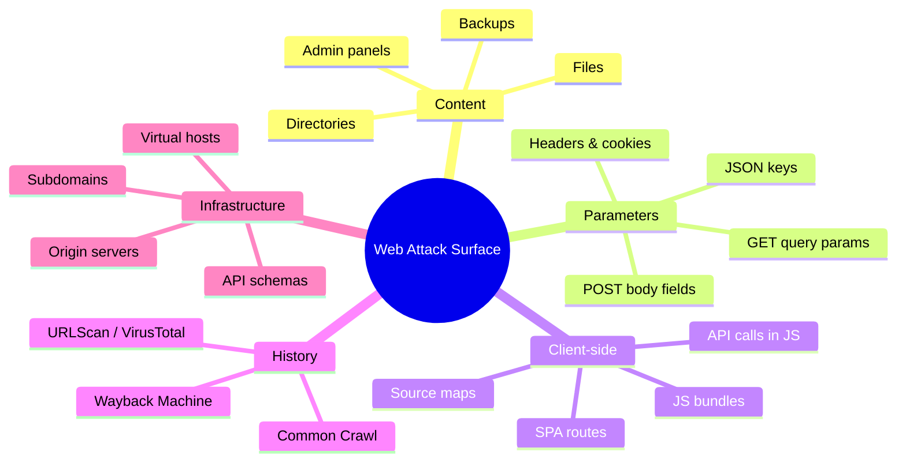
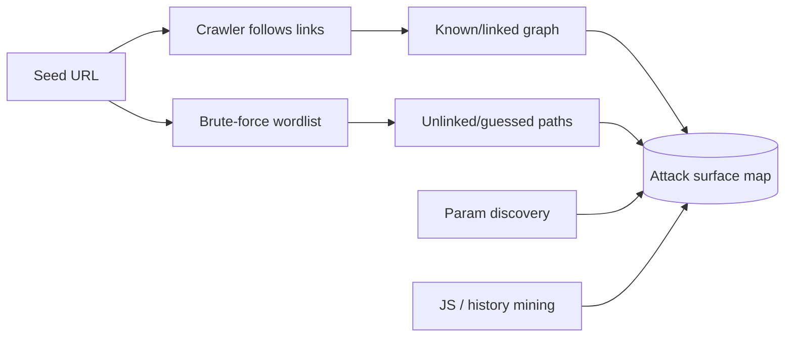
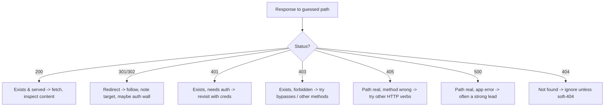
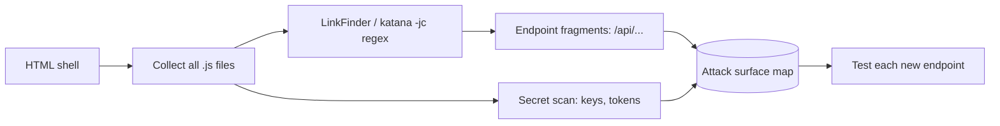
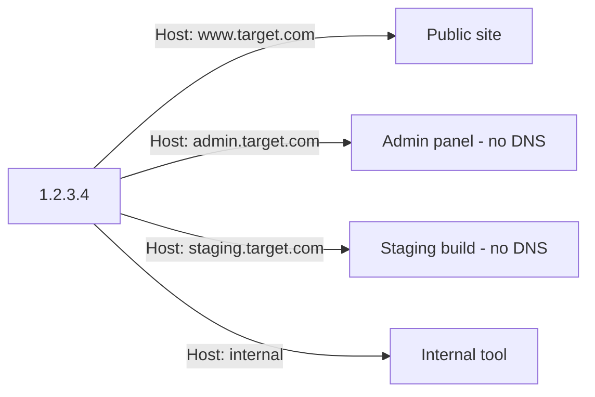
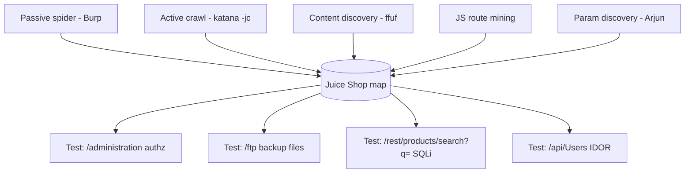

This is Chapter 2 of the Web Application Pentest notebook. Chapter 1 gave you the
*method* — the OWASP Web Security Testing Guide, the phased workflow, and the
discipline that turns a scope document into a repeatable assessment. This chapter
is the first real phase of that workflow: **mapping**. Before you can test
authentication, injection, access control, or business logic, you have to know
what exists. Every request you never send is a bug you will never find, and the
single most common reason a beginner misses vulnerabilities that a professional
walks straight to is not payload knowledge — it is an incomplete map. They tested
the ten links in the navigation bar; the professional tested the two hundred
endpoints, forty parameters, three forgotten admin panels, and one `swagger.json`
that the navigation bar never mentioned.

The goal of this chapter is to make you systematically *complete*. By the end you
will be able to take one in-scope hostname and produce a structured inventory of:
every reachable path, every accepted parameter, every HTTP method, every
client-side route buried in JavaScript, every historical URL search engines and
archives remember, and every virtual host bound to the same IP. That inventory is
your attack surface, and the rest of the notebook is spent attacking it.

Everything here assumes you are inside an authorised scope. Content discovery is
noisy and aggressive — brute-forcing thousands of paths, replaying archived URLs,
fuzzing parameters — and it is exactly the kind of activity that fills a WAF's
logs and a blue team's dashboards. Do it only against targets you are explicitly
permitted to test, at a rate your rules of engagement allow.

## Why Mapping Decides Everything Downstream

Think of a web application as a building. The front door and the lobby are the
links in the navigation menu — the parts the developers *want* you to see. But
buildings also have service corridors, fire escapes, a basement, a roof access
door someone forgot to lock, and blueprints filed with the city that describe
rooms no longer on the public floor plan. Mapping is walking every corridor and
pulling every blueprint before you decide where to break in.

Concretely, the attack surface of a modern web app is made of five overlapping
layers, and a thorough map covers all of them:



Miss a layer and you miss its bugs. The forgotten `/backup/config.php.bak` is a
content-layer finding. The undocumented `debug=true` that flips an app into a
verbose error mode is a parameter-layer finding. The `/api/v1/admin/users`
endpoint referenced only inside a minified React bundle is a client-side finding.
The `staging.target.com` vhost that answers on the production IP is an
infrastructure finding. Each layer needs its own technique, and this chapter
walks through all of them in order.

**Where this sits in the engagement.** Mapping is the bridge between recon
(Chapter 1 of the Recon & OSINT notebook — finding which hosts and subdomains
exist) and vulnerability testing (Chapters 3 onward here). Recon told you
`shop.target.com` is in scope and alive. Mapping tells you *what shop.target.com
actually is* down to the last parameter. The two blur at the edges — subdomain
enumeration is arguably both — but the mental split is useful: recon widens,
mapping deepens.

## Part 1: Crawling vs Content Discovery — Two Different Jobs

Beginners conflate these two activities. They are complementary, not
interchangeable, and understanding the difference is the foundation of
everything else in the chapter.

**Crawling (spidering)** follows links the application actually gives you. A
crawler requests a page, parses the HTML for `<a href>`, `<form action>`,
`<script src>`, and similar references, requests each of those, and repeats.
It discovers only what is *linked* — the reachable graph starting from your seed
URL. Crawling is faithful: everything it finds genuinely exists and is genuinely
referenced somewhere. Its blind spot is anything unlinked — an admin panel with
no link from the public site, an old endpoint no page points at anymore, a file
left on the server by accident.

**Content discovery (forced browsing / directory brute-forcing)** ignores links
entirely and instead *guesses*. It takes a wordlist of common paths and file
names (`admin`, `backup`, `config.php`, `.git`, `api`, `robots.txt`, `test`,
`old`, …) and requests each one against the target, watching the HTTP status and
response size to decide which guesses hit something real. Content discovery finds
the *unlinked* — precisely the things crawling misses — but it only finds what is
in your wordlist, so it is only as good as the list.



A complete map needs both, plus parameter discovery and history mining layered
on top. The table below summarises when each technique earns its place:

| Technique | Finds | Misses | Primary tools |
|---|---|---|---|
| Passive spidering | Everything you browse manually | Unlinked & unvisited paths | Burp Suite, OWASP ZAP |
| Active crawling | Linked pages, forms, JS-referenced URLs | Unlinked paths, auth-gated areas | katana, hakrawler, gospider |
| Content discovery | Unlinked dirs/files, backups, panels | Anything not in the wordlist | ffuf, feroxbuster, gobuster, dirsearch |
| Parameter discovery | Hidden GET/POST/JSON params | Params requiring specific values | Arjun, x8, Param Miner |
| JS analysis | API routes, SPA routes in bundles | Server-only endpoints | LinkFinder, katana, getjs |
| History mining | Old/removed URLs, deprecated params | Never-indexed content | waybackurls, gau, gauplus |
| Vhost/subdomain discovery | Alternate apps on same IP | Truly isolated hosts | ffuf vhost, gobuster vhost |

The rest of the chapter teaches each row from scratch.

## Part 2: Passive Spidering — Map While You Browse

The cheapest, safest, and most under-used mapping technique is simply browsing
the target through an intercepting proxy while it silently records every request
and response. This is *passive* — you generate no traffic the app wouldn't see
from a normal user — and it builds a site map for free as a by-product of the
manual exploration you should be doing anyway.

**Burp Suite from scratch.** Burp Suite (by PortSwigger) is the de-facto standard
web-testing proxy. It sits between your browser and the target, letting you view,
intercept, modify, and replay every HTTP message. The Community edition is free
and sufficient for mapping; the Professional edition adds the active scanner and
some automation. Install it on Kali (it ships pre-installed) or download from
portswigger.net.

The core of Burp for mapping is the **Target → Site map** tab. Every request that
passes through the proxy is added to a tree keyed by host and path, so as you
click around the application, Burp assembles a structured map automatically.

Set it up:

```bash
# Burp ships on Kali; launch it
burpsuite &

# Burp's proxy listens on 127.0.0.1:8080 by default.
# Point your browser at it. The cleanest way is Burp's bundled browser:
#   Proxy tab -> Intercept -> "Open Browser"
# It is pre-configured to trust Burp's CA and route through the proxy.
```

To proxy your *own* browser instead, set its HTTP/HTTPS proxy to `127.0.0.1:8080`
and install Burp's CA certificate so TLS interception works without warnings:

```
http://burp        # visit this while proxying -> "CA Certificate" -> download
                   # then import cacert.der into the browser's trust store
```

With the proxy live, turn **Intercept off** (Proxy → Intercept → "Intercept is
off") so requests flow without you clicking "Forward" on each one, then browse
the target normally: log in, click every menu item, submit every form, change
settings, add an item to a cart, upload a file. Everything lands in **Site map**.

**Passive crawl vs active crawl in Burp.** Burp Pro has a "Crawl" mode under
Dashboard → New scan that will actively spider for you. In Community edition you
crawl manually by browsing, which is slower but gives you an important advantage:
you see the application the way a user does, understand its workflows, and never
send a request you didn't intend — which matters when a stray automated click
could trigger a "delete account" or "place order" action. **Pentester habit:**
even with Pro, many testers map critical workflows by hand first, precisely so
they understand state-changing actions before any automation runs.

Right-clicking a host in Site map gives you the mapping power moves:

- **"Spider this host"** (Pro) / manual browse (Community) to expand the tree.
- **"Engagement tools → Discover content"** (Pro) launches a content-discovery
  session that combines brute-forcing with intelligent guessing based on what
  it has already seen.
- **"Engagement tools → Find comments"** and **"Find scripts"** surface inline
  developer comments and script references — a classic source of leaked endpoints
  and credentials.
- **Filter the site map** by status code, MIME type, or search term to cut noise.

**OWASP ZAP** is the fully free alternative and worth knowing because many
bug-bounty and CTF players run it. Its **Spider** (traditional link crawler) and
**AJAX Spider** (drives a real browser via Selenium to catch JavaScript-rendered
links) live under Tools. The AJAX Spider is the key differentiator: modern
single-page apps render links in JavaScript that a classic HTML spider never
sees, and driving a real browser is the only reliable way to crawl them.

```bash
# ZAP ships on Kali; headless automation example:
zap.sh -cmd -quickurl https://target.example.com \
       -quickprogress -quickout /tmp/zap-report.html
# For SPAs, use the desktop UI: right-click site -> Attack -> AJAX Spider
```

The passive layer gets you the "front door and lobby" of the building. Now we go
looking for the service corridors.

## Part 3: Active Crawling at Scale — katana, hakrawler, gospider

Manual browsing is thorough but slow, and it will never keep up with a large app.
Active crawlers automate the link-following graph traversal, and modern ones
understand JavaScript, forms, and archives. The current best-in-class is
**katana** (by ProjectDiscovery).

**katana from scratch.** katana is a fast crawler written in Go with two engines:
a standard HTTP parser (very fast, catches `href`/`src`/`form` references) and a
headless-browser engine that renders pages with Chromium to catch links only
produced by JavaScript. It also parses JavaScript files for endpoints and can
seed itself from archives.

```bash
# Install (Go required, or grab a release binary)
go install github.com/projectdiscovery/katana/cmd/katana@latest

# Basic crawl of a single target, depth 3
katana -u https://target.example.com -depth 3

# The flags that matter:
#   -u    target URL (or -list file of URLs)
#   -d    crawl depth (default 3; raise for deep apps, watch scope creep)
#   -jc   crawl JavaScript files for endpoints (JS crawling) -- crucial for SPAs
#   -kf   known-files: also fetch robots.txt and sitemap.xml automatically
#   -headless / -hl : use the headless browser engine for JS-rendered links
#   -fs   field-scope (fqdn|rdn|dn) to keep the crawl on the right host(s)
#   -c    concurrency (default 10)
#   -rl   rate limit (requests/second) -- set this to respect RoE
#   -o    output file
```

A production-quality mapping crawl of one host, staying in scope, mining JS,
grabbing known files, and rate-limited to be polite:

```bash
katana -u https://shop.target.com \
       -depth 4 -jc -kf robotstxt,sitemapxml \
       -fs fqdn -c 10 -rl 20 \
       -o katana-shop.txt

# Sample output (truncated):
# https://shop.target.com/
# https://shop.target.com/products?category=books
# https://shop.target.com/products?category=books&sort=price
# https://shop.target.com/api/v1/products
# https://shop.target.com/api/v1/cart
# https://shop.target.com/static/js/main.4f2a.js
# https://shop.target.com/account/settings
# https://shop.target.com/admin/login          <-- unlinked from nav, found in JS
```

That last line is the payoff: katana pulled `/admin/login` out of a JavaScript
bundle where a route table listed it, even though nothing in the visible UI links
to it. **This is why `-jc` is non-negotiable on modern apps** — the interesting
endpoints increasingly live only in the client-side router, never in server-
rendered HTML.

**hakrawler** (by hakluke) is a lighter, pipe-friendly Go crawler designed to
slot into recon one-liners:

```bash
go install github.com/hakluke/hakrawler@latest

echo "https://target.example.com" | hakrawler -d 3 -u
#   -d  depth
#   -u  unique results only
#   -subs  include subdomains
#   -insecure  skip TLS verification (for self-signed lab targets)
```

**gospider** is a third option with strong archive integration (it can pull from
the Wayback Machine, Common Crawl, and VirusTotal in the same run):

```bash
go install github.com/jaeles-project/gospider@latest
gospider -s https://target.example.com -d 3 -c 10 \
         --other-source --include-subs
#   -s  site   -d depth   -c concurrency
#   --other-source  pull URLs from wayback/commoncrawl/virustotal too
```

**Which to use?** For a single serious target, katana with `-jc` (and `-headless`
if the app is JS-heavy) is the most complete. hakrawler and gospider shine inside
automated recon pipelines feeding many hosts. All three emit plain URL lists you
can sort/unique and feed into the next stages:

```bash
cat katana-shop.txt | sort -u > urls.txt
# extract just the unique paths for wordlist ideas / triage
cat urls.txt | unfurl paths | sort -u > paths.txt
# extract every parameter name seen while crawling (great seed for later fuzzing)
cat urls.txt | unfurl keys | sort -u > params-seen.txt
```

`unfurl` (also by tomnomnom) is a tiny URL-splitting utility that pulls domains,
paths, query keys, or values out of a URL list — you will reach for it constantly
when post-processing crawler output.

**Scope discipline while crawling.** A crawler that follows every link will
happily wander off your target onto CDNs, third-party analytics, social widgets,
and out-of-scope subdomains. Two failures result: wasted time, and — worse —
sending automated traffic to hosts you are not authorised to test. Always pin
scope: katana's `-fs fqdn` (exact host) or `-fs rdn` (root domain + subdomains,
only if all subdomains are in scope), hakrawler's default same-host behaviour,
and a post-filter as a backstop:

```bash
grep -E '^https?://([a-z0-9.-]+\.)?target\.com/' urls.txt > urls-inscope.txt
```

## Part 4: Content Discovery — Directory & File Brute-Forcing from Scratch

Crawling found what is linked. Content discovery finds what is not. This is where
the forgotten admin panels, backup files, and staging endpoints surface, and it
is the single highest-value mapping technique for finding "how did they even find
that?" bugs.

The mechanic is simple: for each word `W` in a wordlist, request
`https://target/W` (optionally with extensions like `W.php`, `W.bak`), and use
the HTTP response — status code, size, word count, redirect target — to judge
whether `W` exists. The art is in the wordlist, the extensions, the recursion,
and — most of all — filtering out the false positives an app throws at you.

### 4.1 ffuf — the modern fuzzer, taught from zero

**ffuf** ("Fuzz Faster U Fool", by joohoi) is a fast Go fuzzer. Its central idea
is the `FUZZ` keyword: you place the literal word `FUZZ` anywhere in a request,
give ffuf a wordlist, and it substitutes each word into that position. That makes
one tool do directory discovery, file discovery, parameter discovery, vhost
discovery, and value brute-forcing — the position of `FUZZ` decides the job.

```bash
# Install
go install github.com/ffuf/ffuf/v2@latest   # or: apt install ffuf (Kali)

# Directory/file discovery: FUZZ in the path
ffuf -u https://target.example.com/FUZZ \
     -w /usr/share/seclists/Discovery/Web-Content/raft-medium-directories.txt

# The flags you will actually use every time:
#   -u    URL with FUZZ marker
#   -w    wordlist (path[:KEYWORD] to name a keyword for multi-wordlist runs)
#   -mc   match status codes (default 200,204,301,302,307,401,403,405,500)
#   -fc   filter OUT status codes
#   -fs   filter OUT responses of this byte size
#   -fw   filter OUT responses with this word count
#   -fl   filter OUT responses with this line count
#   -ac   AUTO-CALIBRATE filters (learns the "not found" fingerprint) -- key flag
#   -e    extension list, e.g. -e .php,.bak,.old,.txt,.zip
#   -recursion  -recursion-depth N  recurse into discovered directories
#   -t    threads (default 40)  -rate  requests/sec cap
#   -H    add header, e.g. -H "Cookie: session=..." for authenticated discovery
#   -o -of  output file / format (json, csv, html, md)
```

**The false-positive problem and auto-calibration.** Many apps return HTTP 200
for *everything*, serving a "soft 404" page for paths that don't exist (common in
SPAs and custom frameworks). If you filter only on status code you'll get
thousands of bogus 200 hits. The fix is to filter on *response characteristics*
and let ffuf learn them automatically with `-ac` (auto-calibrate): before the run
ffuf requests a few random non-existent paths, fingerprints the "not found"
response (its size, word count, line count), and auto-filters anything matching
it.

```bash
ffuf -u https://shop.target.com/FUZZ \
     -w /usr/share/seclists/Discovery/Web-Content/raft-medium-directories.txt \
     -e .php,.html,.bak,.old,.zip,.txt,.json \
     -ac -recursion -recursion-depth 2 \
     -t 40 -rate 100 \
     -o ffuf-shop.json -of json

# Realistic annotated output:
#
#         /'___\  /'___\           /'___\
#        /\ \__/ /\ \__/  __  __  /\ \__/
#        \ \ ,__\\ \ ,__\/\ \/\ \ \ \ ,__\
#         \ \ \_/ \ \ \_/\ \ \_\ \ \ \ \_/
#          \ \_\   \ \_\  \ \____/  \ \_\
#           \/_/    \/_/   \/___/    \/_/   v2.1.0
#
# :: Method           : GET
# :: URL              : https://shop.target.com/FUZZ
# :: Wordlist         : FUZZ: raft-medium-directories.txt
# :: Extensions       : .php .html .bak .old .zip .txt .json
# :: Filter           : Auto-calibration (size: 1024)
# ________________________________________________
#
# admin                   [Status: 301, Size: 0, Words: 1, Lines: 1]
# api                     [Status: 200, Size: 84, Words: 3, Lines: 1]
# backup.zip              [Status: 200, Size: 154213, Words: 9, Lines: 4]   <-- !!
# config.php.bak          [Status: 200, Size: 2841, Words: 210, Lines: 60]  <-- !!
# robots.txt              [Status: 200, Size: 412, Words: 40, Lines: 12]
# server-status           [Status: 403, Size: 299, Words: 22, Lines: 10]
# [INFO] Adding a new job to the queue: .../admin/FUZZ  (recursion)
```

`backup.zip` and `config.php.bak` are exactly the kind of finding content
discovery exists for — a source-code archive and a backup of a config file
(likely containing DB credentials), neither linked anywhere. `server-status`
returning 403 is a lead too: it exists but is access-controlled, worth revisiting
from a different source IP or with header tricks.

**Reading the columns:** `Status` is the HTTP code, `Size` the response byte
length, `Words`/`Lines` the token and line counts. When two different real pages
share a status code, size/words/lines let you tell "real content" from "templated
error". If a specific noisy size slips past auto-calibration, filter it manually:
`-fs 1024` or combine `-fs 1024 -fw 3`.

### 4.2 feroxbuster — recursive by design

**feroxbuster** (Rust, by epi) is built around *recursion*: when it finds a
directory it automatically queues discovery inside it, walking the tree without
you re-launching. It's fast and has excellent live filtering.

```bash
apt install feroxbuster            # or cargo install feroxbuster
feroxbuster -u https://target.example.com \
            -w /usr/share/seclists/Discovery/Web-Content/raft-medium-words.txt \
            -x php,bak,old,zip,txt -d 3 -s 200,301,302,401,403 \
            --dont-scan 'logout,signout' -o ferox.txt
#   -x  extensions   -d  max recursion depth   -s  status codes to show
#   -C  filter out status codes   -S  filter by size   -W by words   -N by lines
#   --dont-scan  regex of paths to avoid recursing (never brute-force /logout!)
#   --smart / --auto-tune  adaptive rate limiting & wildcard handling
```

**Critical safety note:** always exclude logout/delete/destructive paths from
recursive brute-forcing. A recursive tool that hits `/account/delete` or
`/logout` on every wordlist entry can destroy your session or, worse, trigger
state-changing actions. `--dont-scan` and careful scoping prevent this.

### 4.3 gobuster and dirsearch — the classics

**gobuster** (Go) is the old reliable — fast, simple, no recursion by default
(you re-run per directory), with dedicated modes (`dir`, `dns`, `vhost`, `fuzz`,
`s3`):

```bash
apt install gobuster
gobuster dir -u https://target.example.com \
         -w /usr/share/seclists/Discovery/Web-Content/common.txt \
         -x php,txt,html,bak -t 50 -b 404,403 -o gobuster.txt
#   dir  directory mode   -x extensions   -t threads
#   -b   blacklist status codes (negative filter)
#   -s   whitelist status codes
#   -k   skip TLS verification   -c  set a cookie for authenticated scans
#   -r   follow redirects
```

**dirsearch** (Python, by maurosoria) ships a curated default wordlist and smart
extension handling (its `%EXT%` placeholder expands to each extension), which
makes it a fast "just point and go" option:

```bash
dirsearch -u https://target.example.com -e php,bak,old,zip,json \
          -x 404,403 -r --deep-recursive -o dirsearch.txt
#   -e  extensions (fills the %EXT% marker in the wordlist)
#   -x  exclude status codes   -r recursive   --deep-recursive full tree
#   -i  include only these codes   --random-agent   -H custom headers
```

| Tool | Language | Recursion | Killer feature | Best for |
|---|---|---|---|---|
| ffuf | Go | opt-in (`-recursion`) | `FUZZ` anywhere, `-ac` calibration | everything, most flexible |
| feroxbuster | Rust | on by default | auto-recursion + auto-tune | deep directory trees |
| gobuster | Go | manual re-run | rock-solid, dedicated modes | quick scans, vhost/dns |
| dirsearch | Python | opt-in | curated default list, `%EXT%` | fast start, sane defaults |

Pick one and learn it deeply; they all do the same job. Most professionals default
to ffuf for its flexibility and feroxbuster when they want hands-off recursion.

### 4.4 Wordlists — the thing that actually determines your results

Your tool is a substitution engine; the wordlist is the intelligence. The
canonical source is **SecLists** (by Daniel Miessler), pre-installed on Kali at
`/usr/share/seclists/`. The directories you will use most:

```
/usr/share/seclists/Discovery/Web-Content/
  common.txt                     # ~4700 entries, fast first pass
  raft-small-directories.txt     # curated, high signal
  raft-medium-directories.txt    # the workhorse directory list
  raft-large-directories.txt     # exhaustive, slow
  raft-medium-words.txt          # words to combine with extensions
  directory-list-2.3-medium.txt  # DirBuster's classic list (~220k)
  api/api-endpoints.txt          # API-specific paths
  CMS/*                          # WordPress, Drupal, Joomla specific
  big.txt                        # large general list
```

**Wordlist strategy:**

1. **Fingerprint first, then target your list.** If Wappalyzer/whatweb (Chapter 10
   of the Recon notebook) says the app is WordPress, run the WordPress list, not a
   generic one — you'll find `wp-admin`, `wp-json`, `xmlrpc.php` in seconds.
2. **Start small, escalate.** `common.txt` first for a quick lay of the land, then
   `raft-medium`, then `-large`/`directory-list-2.3-big` only if scope and time
   allow. Running the 220k list first wastes hours you could spend testing.
3. **Match extensions to the stack.** PHP app → `.php,.phps,.inc,.bak`; Java →
   `.jsp,.do,.action,.war`; .NET → `.aspx,.asmx,.asax,.config`; always add
   backup/archive extensions `.bak,.old,.orig,.zip,.tar.gz,.swp,.~`.
4. **Feed your own findings back in.** Path segments you saw while crawling
   (`params-seen.txt`, `paths.txt`) make an excellent custom wordlist for *this*
   app — real naming conventions beat generic lists.
5. **Use "raft" over "directory-list" when time-boxed** — raft lists are ordered
   by real-world frequency, so hits come early.

## Part 5: Reading Responses Like a Professional

Content discovery produces a flood of results; the skill is triage. Status codes
and response shape tell you what each hit means and what to do next.



| Status | Meaning for mapping | Next move |
|---|---|---|
| 200 | Resource served | Fetch it, read content, look for links/params |
| 204 | Exists, no content | Note it; often API endpoints |
| 301/302/307 | Redirect | Follow (`-r`); the *target* is the real info (login? HTTPS? auth wall?) |
| 401 | Auth required | Real endpoint — revisit authenticated, note for access-control tests |
| 403 | Forbidden | Real but blocked — try 403-bypass tricks (below) |
| 405 | Method not allowed | Endpoint exists — enumerate accepted methods (`OPTIONS`) |
| 500 | Server error | Path real and *breaking* — high-value, may leak stack traces |
| 429 | Rate limited | You're too fast — lower `-rate`/`-t`, respect RoE |

**403/401 are not dead ends — they are confirmation the path exists.** Common
forbidden-bypass techniques to try (in the lab, within scope) when a directory
returns 403:

```bash
# Path/case/encoding tricks
curl -s -o /dev/null -w '%{http_code}\n' https://t/admin      # 403
curl ... https://t/admin/                                      # trailing slash
curl ... https://t/admin/.                                     # /. suffix
curl ... https://t/%61dmin                                     # URL-encode a char
curl ... https://t/admin%20                                    # trailing space/%20
curl ... https://t/./admin/../admin                            # path normalisation
curl ... https://t/admin..;/                                   # semicolon tricks (Tomcat)
curl ... https://t/ADMIN                                       # case variation

# Header-based (front-end proxy trusts these for internal access)
curl -H 'X-Forwarded-For: 127.0.0.1' https://t/admin
curl -H 'X-Original-URL: /admin' https://t/
curl -H 'X-Rewrite-URL: /admin' https://t/
curl -H 'X-Forwarded-Host: localhost' https://t/admin
curl -X POST https://t/admin                                   # try a different method
```

The tool **`byp4xx`** and Burp's **"403 Bypasser"** extension automate this exact
matrix. A 403 that becomes a 200 with `X-Forwarded-For: 127.0.0.1` is a real
finding on its own (broken access control via trusted-header spoofing) *and*
unlocks whatever the directory hides.

**Enumerate HTTP methods** on every interesting endpoint — a 405 on GET may be a
200 on POST/PUT, and dangerous methods (PUT, DELETE, TRACE) are findings:

```bash
curl -i -X OPTIONS https://target.example.com/api/v1/users
# HTTP/1.1 200 OK
# Allow: GET, POST, PUT, DELETE, OPTIONS       <-- PUT & DELETE exposed = investigate

# ffuf can fuzz the method itself:
ffuf -u https://target.example.com/api/v1/users -X FUZZ \
     -w <(printf 'GET\nPOST\nPUT\nDELETE\nPATCH\nTRACE\nOPTIONS\nHEAD\n') \
     -mc all -fc 405,404,501
```

## Part 6: Parameter Discovery — Finding the Inputs You Can't See

Endpoints are only half the surface. The other half is *parameters* — the inputs
each endpoint accepts. An endpoint like `/product` that visibly takes `?id=` may
silently also honour `?debug=`, `?admin=`, `?preview=`, `?callback=`, or
`?file=`, each a potential injection point. These hidden parameters are where
IDOR, LFI, SSRF, SQLi, XSS, mass-assignment, and debug-mode toggles hide.

**How hidden parameters are detected.** You send the endpoint a large list of
candidate parameter names and watch for any that *change the response* — a
different status, size, reflected value, or new behaviour. If `?debug=1` makes the
page 200 bytes longer or dumps a stack trace, the tool flags `debug` as accepted.

### 6.1 Arjun — HTTP parameter discovery

**Arjun** (Python, by s0md3v) is the standard. It bundles a ~26k parameter
wordlist, works on GET/POST/JSON/XML, and is smart about chunking candidates and
diffing responses.

```bash
pip install arjun            # or: apt install arjun (Kali)

arjun -u https://target.example.com/product
#   -u    target URL
#   -m    method: GET (default), POST, JSON, XML
#   -w    custom parameter wordlist
#   -c    chunk size (params tested per request; tune for the app)
#   -d    delay between requests (RoE politeness)
#   -oT / -oJ  text/JSON output
#   --stable  slower but more reliable diffing for flaky apps
#   -H    headers (auth cookies for gated endpoints)

# Testing a JSON API endpoint:
arjun -u https://shop.target.com/api/v1/checkout -m JSON \
      -H 'Authorization: Bearer eyJ...' -oJ arjun-checkout.json

# Sample output:
# [~] Analysing the content of the webpage
# [~] Logicforcing the URL endpoint
# [+] Parameter detected: coupon         (reflected)
# [+] Parameter detected: debug          (status change 200->500)
# [+] Parameter detected: is_admin       (behaviour change)
# [+] Parameters found: coupon, debug, is_admin
```

`is_admin` surfacing on a checkout endpoint is a mass-assignment lead; `debug`
that flips the app to 500/verbose is an info-leak lead. Neither appears anywhere
in the HTML.

### 6.2 x8 — high-signal parameter brute-forcing

**x8** (Rust, by sh1yo) is faster and better at avoiding false positives on large
lists, and it can discover parameters in the body, query, and headers:

```bash
cargo install x8      # or grab a release binary
x8 -u https://target.example.com/product -w /usr/share/seclists/Discovery/Web-Content/burp-parameter-names.txt
#   -u url   -w wordlist   -X method   -b body template   --headers
#   --output  results file   -c  concurrency
```

### 6.3 Param Miner — inside Burp

**Param Miner** (PortSwigger BApp) integrates parameter discovery into your Burp
workflow: right-click a request → Extensions → Param Miner → "Guess params". It's
particularly strong at finding **unkeyed inputs** and **hidden headers** (like
`X-Original-URL`, cache-poisoning vectors), using its own bundled wordlists and
Burp's Collaborator for out-of-band confirmation.

**Seed your parameter wordlist from the app itself.** The `params-seen.txt` you
extracted from crawler output (`unfurl keys`) plus SecLists'
`burp-parameter-names.txt` gives you both app-specific and common names. Real apps
reuse their own naming conventions, so a parameter seen on one endpoint is often
accepted on another.

| Tool | Runs in | Tests | Strength |
|---|---|---|---|
| Arjun | CLI | GET/POST/JSON/XML | Great default, smart chunking |
| x8 | CLI | query/body/headers | Fast, low false positives |
| Param Miner | Burp | params + headers | OOB confirmation, cache vectors |
| ffuf | CLI | anything (`FUZZ`) | Full control of matching/filtering |

You can also brute-force parameters with ffuf directly, which is handy when you
want precise control over matching:

```bash
# Discover GET params: FUZZ the parameter name, watch for response change
ffuf -u 'https://target.example.com/product?FUZZ=test' \
     -w /usr/share/seclists/Discovery/Web-Content/burp-parameter-names.txt \
     -fs 4242    # filter the baseline "param ignored" response size
```

## Part 7: Mining JavaScript — Where Modern Endpoints Actually Live

On a single-page application (React, Vue, Angular, Svelte) the server sends an
almost-empty HTML shell and a large JavaScript bundle that builds the UI and
knows *every* API route the app can call. That bundle is a map of the backend,
handed to you for free. Extracting endpoints and secrets from JavaScript is one
of the highest-yield mapping techniques for contemporary targets.



**Step 1 — collect every JavaScript file.** From your crawl output, or directly:

```bash
# From crawler output:
grep -Eo 'https?://[^"]+\.js' urls.txt | sort -u > jsfiles.txt

# Or pull them fresh with getJS (tomnomnom) / subjs (lc):
go install github.com/003random/getJS@latest
getJS --url https://target.example.com --complete | sort -u > jsfiles.txt
```

**Step 2 — extract endpoints with LinkFinder.** **LinkFinder** (Python, by
GerbenJavado) runs a battery of regexes over JavaScript to pull out anything that
looks like a URL, path, or endpoint fragment.

```bash
git clone https://github.com/GerbenJavado/LinkFinder && cd LinkFinder
pip install -r requirements.txt
python linkfinder.py -i https://target.example.com/static/js/main.4f2a.js -o cli
#   -i  input (URL, file, or a domain to spider)
#   -o  output: cli (stdout) or an HTML report path
#   -d  process an entire domain's scripts
#   -r  regex to filter results (e.g. only /api/)

# Sample output:
# /api/v1/users/{id}
# /api/v1/admin/config
# /internal/health
# /api/v1/export?format=csv
# ../auth/refresh
```

katana already does this inline with `-jc`, and it's often enough:

```bash
echo https://target.example.com | katana -jc -d 2 -silent | grep -i api | sort -u
```

**Step 3 — resolve relative endpoints and confirm them.** LinkFinder emits
fragments like `/api/v1/admin/config`; test each against the base URL:

```bash
while read p; do
  code=$(curl -s -o /dev/null -w '%{http_code}' "https://target.example.com${p}")
  echo "$code  $p"
done < endpoints-from-js.txt | sort
# 200  /api/v1/users/1
# 401  /api/v1/admin/config      <-- exists, needs auth: access-control target
# 200  /internal/health
```

**Step 4 — hunt secrets in JS.** Bundles frequently leak API keys, tokens, and
internal hostnames left in by developers. Scan them:

```bash
# nuclei has an exposed-tokens template pack:
nuclei -l jsfiles.txt -t http/exposures/ -silent
# or trufflehog / gitleaks patterns, or SecretFinder:
python SecretFinder.py -i https://target.example.com/static/js/main.js -o cli
# Typical hits: google_api_key, aws_access_key_id, stripe_pk_live,
# firebase config, hardcoded Bearer tokens, internal *.corp hostnames
```

**Source maps are a jackpot.** If a `.js.map` file is deployed (common
misconfiguration), it reconstructs the *original, unminified* source — comments,
variable names, and all — turning a minified blob into readable code:

```bash
curl -s https://target.example.com/static/js/main.4f2a.js | tail -c 200
# ... //# sourceMappingURL=main.4f2a.js.map      <-- the map is referenced
curl -s https://target.example.com/static/js/main.4f2a.js.map -o main.map
npx source-map-explorer main.map    # or unpack with a source-map tool
```

**Bug-bounty note:** JS endpoint mining is the backbone of modern bounty recon.
Disclosed reports on HackerOne repeatedly show critical bugs found on endpoints
that existed only inside a JS bundle — an unauthenticated admin API, a debug
route, an internal export function. Automating "pull all JS → LinkFinder →
confirm 200/401 → test" across a program's assets is a standard high-yield
pipeline.

## Part 8: History & Archive Mining — What the Internet Remembers

Search engines, the Wayback Machine, and passive DNS/URL databases have been
crawling your target for years. They remember URLs, parameters, and files that no
longer appear anywhere on the live site — deprecated API versions, removed admin
tools, old parameters that still work because the code was never deleted. Pulling
that history is free reconnaissance of the app's *past* attack surface, much of
which is still live.

**waybackurls** (tomnomnom) pulls every URL the Wayback Machine has for a domain:

```bash
go install github.com/tomnomnom/waybackurls@latest
echo target.example.com | waybackurls | sort -u > wayback.txt
# 45,000 historical URLs, including:
# https://target.example.com/old-admin/login.php
# https://target.example.com/api/v0/users?debug=true
# https://target.example.com/download.php?file=report.pdf   <-- LFI candidate
```

**gau ("get all urls")** aggregates from the Wayback Machine, Common Crawl,
URLScan, and the Open Threat Exchange in one shot — broader than wayback alone:

```bash
go install github.com/lc/gau/v2/cmd/gau@latest
echo target.example.com | gau --threads 5 --subs | sort -u > gau.txt
#   --subs         include subdomains
#   --providers    wayback,commoncrawl,otx,urlscan
#   --fp           include only "interesting" params
#   --blacklist    png,jpg,css,woff  (skip static junk)
```

**Turn history into targets.** The gold in archive data is *parameterised* URLs —
they hand you real endpoint+parameter pairs to test. Extract and dedupe them:

```bash
# Keep only URLs that have query parameters, dedupe by param signature:
cat gau.txt | grep '?' | qsreplace -a 2>/dev/null | sort -u > params-history.txt
# 'qsreplace' (tomnomnom) rewrites query values so you can dedupe by shape and
# later inject payloads uniformly, e.g. qsreplace 'FUZZ' to prep for fuzzing.

# Extract every historical parameter name ever used:
cat gau.txt | unfurl keys | sort -u >> params-seen.txt
```

**Google/GitHub dorking as history mining.** `site:target.com inurl:admin`,
`site:target.com ext:php`, `site:target.com ext:log|ext:bak|ext:sql`, and GitHub
searches for the org name plus `api_key`/`internal` frequently reveal endpoints
and files no crawler will (covered in depth in the Recon & OSINT notebook's
Google-dorking chapter). Fold the hits into your map.

| Source | Tool | What it adds |
|---|---|---|
| Wayback Machine | waybackurls | Historical URLs & params for the exact host |
| Wayback + CC + URLScan + OTX | gau / gauplus | Broadest historical URL set |
| Common Crawl | gospider `--other-source` | Additional crawled URLs |
| URLScan.io | gau, manual | Recently-submitted URLs, screenshots |
| Search engines | Google/Bing dorks | Indexed files, panels, error pages |
| Code hosts | GitHub/GitLab dorks | Endpoints & secrets in leaked source |

## Part 9: Predictable Files & Leaky Endpoints — The Quick Wins

Before deep brute-forcing, always check the handful of well-known files and
endpoints that leak structure directly. These are fast, high-value, and often
overlooked.

**robots.txt and sitemap.xml — a free directory of what admins want hidden.**
`robots.txt` lists paths the site asks crawlers to avoid, which is a curated list
of the paths admins consider sensitive — exactly where you want to look:

```bash
curl -s https://target.example.com/robots.txt
# User-agent: *
# Disallow: /admin/
# Disallow: /internal-api/
# Disallow: /backup/
# Disallow: /wp-admin/
# Sitemap: https://target.example.com/sitemap.xml

curl -s https://target.example.com/sitemap.xml | grep -Eo '<loc>[^<]+' | sed 's/<loc>//'
# sitemap.xml enumerates canonical URLs the site *wants* indexed -- instant map
```

**Version-control and IDE leaks.** An exposed `.git` directory lets you
reconstruct the entire source tree, including secrets in history:

```bash
# Detect
curl -s -o /dev/null -w '%{http_code}\n' https://target.example.com/.git/HEAD   # 200 = leak
curl -s https://target.example.com/.git/config

# Dump the whole repo
pip install git-dumper
git-dumper https://target.example.com/.git/ ./dumped-repo
cd dumped-repo && git log --oneline && git show HEAD   # read source + secrets in history

# Other VCS/IDE leaks to probe:
#   /.git/  /.svn/  /.hg/  /.bzr/  /.DS_Store  /.idea/  /.vscode/
#   /WEB-INF/web.xml (Java)  /.env  /.env.local  /config.php.bak
```

`.DS_Store` files (macOS) leak directory listings; the **DS_Store Crawler** or a
simple parser turns them into a file tree. `.env` files leak database credentials,
API keys, and secret keys directly.

**Backup & temp files.** For every real file you find, guess its backups:

```bash
for ext in .bak .old .orig .save .swp '~' .1 .zip .tar.gz .txt; do
  curl -s -o /dev/null -w "%{http_code}  index.php${ext}\n" \
       "https://target.example.com/index.php${ext}"
done
# 200  index.php.bak     <-- source disclosure
```

**API schema & documentation leaks.** REST APIs frequently ship their own map:

```bash
for p in /swagger.json /swagger/v1/swagger.json /openapi.json /api-docs \
         /api/swagger.json /v2/api-docs /swagger-ui.html /redoc /graphql; do
  echo -n "$p -> "; curl -s -o /dev/null -w '%{http_code}\n' "https://target.example.com$p"
done
# /swagger.json     -> 200      <-- full API spec: every endpoint, param, and schema
# /graphql          -> 400
```

A reachable `swagger.json`/`openapi.json` is the single best mapping artefact you
can find — it documents *every* endpoint, method, parameter, type, and auth
requirement the API author intended. Import it straight into Postman or Burp.

**GraphQL introspection.** If `/graphql` responds, ask it to describe itself.
Introspection (often left enabled) returns the entire schema — every query,
mutation, type, and field:

```bash
curl -s https://target.example.com/graphql \
  -H 'Content-Type: application/json' \
  -d '{"query":"{__schema{types{name fields{name}}}}"}' | jq .
# Or use a purpose-built tool that also draws the schema:
#   clairvoyance  (infers schema even when introspection is disabled)
#   graphql-cop / graphw00f  (fingerprint + audit the endpoint)
#   InQL (Burp extension) for interactive schema exploration
```

## Part 10: Virtual Hosts & the Hidden Apps on One IP

A single IP address often serves many applications, chosen by the `Host` header.
DNS may only publicise `www.target.com`, but the same server might also answer to
`admin.target.com`, `staging.target.com`, `jira.target.com`, or an internal
vhost — apps that never appear in DNS and that a normal browser can't reach, but
that respond if you send the right `Host` header. Finding them is **virtual-host
discovery**, and it's distinct from subdomain enumeration (which is DNS-based).



The technique: pin the connection to the target IP, vary the `Host` header from a
wordlist, and watch for responses that differ from the default:

```bash
# ffuf vhost fuzzing: FUZZ goes in the Host header
ffuf -u https://target.example.com \
     -H "Host: FUZZ.target.com" \
     -w /usr/share/seclists/Discovery/DNS/subdomains-top1million-5000.txt \
     -fs 0 -ac
#   The default vhost returns some baseline size; -ac/-fs filters it so only
#   *different* responses (real alternate vhosts) show.

# gobuster's dedicated vhost mode:
gobuster vhost -u https://target.example.com \
         -w /usr/share/seclists/Discovery/DNS/subdomains-top1million-20000.txt \
         --append-domain -k
#   --append-domain  turns "admin" into "admin.target.com"
#   -k  skip TLS verify

# Sample:
# Found: staging.target.com (Status: 200) [Size: 5123]     <-- not in public DNS
# Found: admin.target.com   (Status: 401) [Size: 12]
```

**Why vhosts matter:** staging and admin vhosts routinely run older, less-hardened
code, ship with debug modes on, and enforce weaker authentication because "nobody
knows the hostname". A `staging.target.com` found only by vhost fuzzing is a
classic path to the crown jewels. **Filter carefully** — a wildcard vhost config
returns the same page for everything, so lean on `-ac`/`-fs` to keep only genuine
differences, and confirm hits by diffing the actual response body.

Subdomain enumeration proper (amass, subfinder, dnsx, certificate transparency)
is covered in the Recon & OSINT notebook; here the point is that vhost fuzzing
finds the hosts DNS *doesn't* expose, and both feed the same map.

## Part 11: Hands-On Lab — Mapping OWASP Juice Shop End to End

Time to put every layer together against a legal target. **OWASP Juice Shop** is a
deliberately vulnerable Angular single-page app — perfect for practising mapping
because its real endpoints live in JavaScript, it has a REST API, hidden admin
functionality, and files worth discovering. Everything below is run against your
own local instance; never point these tools at infrastructure you don't own.

**Lab setup:**

```bash
# Spin up Juice Shop locally
docker run --rm -p 3000:3000 bkimminich/juice-shop
# App now at http://localhost:3000  -- point all tools here
export T=http://localhost:3000
```

**Step 1 — passive spider through Burp.** Launch Burp, set the browser to proxy
through `127.0.0.1:8080`, browse Juice Shop: view products, register a user, log
in, add to basket, open the account page. Watch Target → Site map populate with
`/rest/products/search`, `/api/Users`, `/rest/basket/1`, etc.

**Step 2 — active crawl with JS mining:**

```bash
katana -u $T -depth 3 -jc -kf robotstxt,sitemapxml -silent -o juice-katana.txt
sort -u juice-katana.txt | tee urls.txt | wc -l
# Pull the API endpoints Angular calls:
grep -iE '/(rest|api)/' urls.txt | sort -u
# http://localhost:3000/rest/products/search
# http://localhost:3000/api/Products
# http://localhost:3000/api/Users
# http://localhost:3000/rest/admin/application-configuration   <-- interesting
```

**Step 3 — content discovery for unlinked files:**

```bash
ffuf -u $T/FUZZ -ac -t 40 -rate 200 \
     -w /usr/share/seclists/Discovery/Web-Content/raft-medium-directories.txt \
     -e .json,.txt,.md,.bak -o juice-ffuf.json -of json
# ftp                 [Status: 200]   <-- Juice Shop's exposed /ftp directory
# robots.txt          [Status: 200]
# rest                [Status: 500]   <-- API base, errors without a subpath
# metrics             [Status: 200]   <-- Prometheus metrics endpoint

# The /ftp directory is a known Juice Shop trove:
curl -s $T/ftp/ | grep -Eo 'href="[^"]+"'
# href="/ftp/acquisitions.md"   href="/ftp/coupons_2013.md.bak"  ...
curl -s $T/ftp/package.json.bak    # backup file challenge
```

**Step 4 — mine the JavaScript bundle for the full route table:**

```bash
getJS --url $T --complete | sort -u > jsfiles.txt
# Juice Shop's main bundle references every Angular route:
curl -s $T/main.js | grep -oE 'path:"[^"]*"' | sort -u
# path:"administration"      <-- hidden admin route
# path:"accounting"          <-- hidden accounting route
# path:"score-board"         <-- the challenge scoreboard
curl -s -o /dev/null -w '%{http_code}\n' $T/api/Users/1   # probe a discovered API path
```

Discovering `path:"administration"` in the bundle — an admin panel with no link in
the UI — is the exact "found in JS, invisible in HTML" lesson from Part 7, and
it's an actual Juice Shop challenge (Access the administration section).

**Step 5 — parameter discovery on an API endpoint:**

```bash
arjun -u $T/rest/products/search -m GET -oT arjun-search.txt
# [+] Parameter detected: q      <-- the search parameter (SQLi entry point later)
```

**Step 6 — assemble the map.** Merge everything into one deduped inventory that
becomes your testing worklist:

```bash
cat urls.txt juice-ffuf-paths.txt endpoints-from-js.txt \
  | sed "s#^#$T#" 2>/dev/null | sort -u > juice-attack-surface.txt
wc -l juice-attack-surface.txt
# 214 juice-attack-surface.txt   <-- every path/endpoint you'll now test
```

You now hold a structured map: linked pages (Burp/katana), unlinked files (ffuf,
including `/ftp` backups), JS-only routes (`/administration`, `/accounting`), the
REST API surface (`/api/*`, `/rest/*`), and the `q` parameter that later chapters
turn into an injection. That worklist — not the navigation bar — is what you test.



## Part 12: Detection & Defense Angle

Everything in this chapter is loud. Content discovery, parameter fuzzing, and
vhost brute-forcing generate thousands of requests, many for paths that don't
exist — a signature no normal user produces. Understanding how the blue team sees
this makes you both a better attacker (quieter, within RoE) and a better defender.

**What the activity looks like in logs.** A directory brute-force is a burst of
requests from one source, mostly 404/403, hitting sequential wordlist entries:

```
# Access-log fingerprint of a content-discovery run
10.0.0.5 - - [..] "GET /admin HTTP/1.1" 403 299 "-" "Mozilla/5.0 ... ffuf/2.1.0"
10.0.0.5 - - [..] "GET /administrator HTTP/1.1" 404 0
10.0.0.5 - - [..] "GET /backup HTTP/1.1" 404 0
10.0.0.5 - - [..] "GET /config HTTP/1.1" 404 0
...hundreds/second, 90%+ 404, alphabetical clustering, tool UA string
```

**Detection signals blue teams alert on:**

- **High 404/403 ratio from a single IP** in a short window — the clearest
  content-discovery tell. WAFs and tools like Fail2ban, ModSecurity, and SIEM
  correlation rules key on this.
- **Known tool User-Agents** (`ffuf`, `gobuster`, `feroxbuster`, `nuclei`,
  `python-requests`) — trivially spoofable, but many operators forget to change
  them. `--random-agent` / `-H "User-Agent: ..."` is standard OPSEC.
- **Request-rate spikes** far above human browsing speed.
- **Sequential/alphabetical path patterns** matching public wordlists.
- **Requests for sensitive well-known paths** — `.git/HEAD`, `.env`,
  `wp-login.php`, `/actuator`, `swagger.json` — often trigger dedicated rules.
- **Host-header anomalies** — many distinct `Host` values from one source is a
  vhost-fuzzing signature.

**Blue-team defenses that reduce the attack surface itself:**

| Defense | Stops / slows |
|---|---|
| Remove backup/temp/VCS files from web roots; deny `.git`, `.env`, `.bak` at the server | Content-discovery quick wins |
| Disable directory listing (`Options -Indexes`) | Auto-mapping via listings |
| Rate limiting + WAF anomaly rules (ModSecurity CRS) | Brute-force speed & noise |
| Return a *consistent* 404 (no soft-200s, no size leaks) | Auto-calibration/oracle-based discovery |
| Disable GraphQL introspection & Swagger UI in prod | Schema self-disclosure |
| Strip verbose errors & stack traces (custom 500 page) | Parameter-discovery via error diffs |
| Serve unminified maps only in dev; block `.map` in prod | Source reconstruction |
| Require auth on staging/admin vhosts; don't rely on obscurity | Vhost-discovery payoff |
| Egress/DNS logging + Collaborator-style OOB detection | Blind param/SSRF probing |

**IR use case:** during incident response, the same access-log signature (a 404
flood followed by a small number of 200s on unusual paths) tells a responder
*what the attacker found* — the 200s after the flood are the discovered files.
Reconstructing the attacker's map from your own logs is a core triage step, and
it's why thorough web logging (full URL, status, size, UA, Host) matters.

**Ethics & scope reminder:** because these techniques are noisy and can trip
protective automation (account lockouts, IP bans, even accidental state changes
via recursive hits on action endpoints), keep them strictly inside your
authorised scope and rate limits, exclude destructive paths from recursion, and
prefer passive/history sources first when stealth or fragility is a concern.

## Part 13: Common Mistakes and How to Avoid Them

- **Testing only the navigation bar.** The number-one beginner error. The visible
  UI is a fraction of the surface. Always crawl + brute-force + mine JS + pull
  history before you conclude you've "seen the app".
- **Trusting status codes blindly (soft 404s).** Apps that 200 on everything will
  drown you in false positives. Always use `-ac`/auto-calibration or a size/word
  filter, and spot-check that a "hit" is real content.
- **Skipping JavaScript on SPAs.** If the app is React/Vue/Angular and you didn't
  run `katana -jc` / LinkFinder, you mapped the shell and missed the whole API.
- **Wandering out of scope while crawling.** Pin `-fs`/host filters; a crawler
  will follow links to CDNs and third parties and generate unauthorised traffic.
- **Recursively brute-forcing destructive paths.** Exclude `/logout`, `/delete`,
  `/admin/reset` from recursion or you'll nuke your own session — or worse.
- **Ignoring 401/403/500.** They confirm a path exists. Revisit authenticated,
  try bypasses, enumerate methods. A 403 is a lead, not a wall.
- **Running the 220k wordlist first.** Start small (`common.txt`, `raft-medium`),
  fingerprint the stack, and escalate. Don't burn hours before you've oriented.
- **Not feeding findings back.** Params and path segments you discover are the
  best wordlist for the *next* stage. Recycle `unfurl keys`/`paths` output.
- **Forgetting authenticated mapping.** Log in and re-run discovery with your
  session cookie (`-H "Cookie: ..."`). Post-auth surface (dashboards, settings,
  admin actions) is where the serious bugs live and it's invisible unauthenticated.
- **Leaving tool User-Agents default.** If stealth matters (or RoE requires it),
  set a custom/randomised UA and a sane rate limit.

## Part 14: Final Revision / Summary

- **Mapping decides your bug count.** You can only test what you discover; an
  incomplete map is the top reason findings get missed.
- **Two complementary jobs:** *crawling* follows links (finds the linked graph);
  *content discovery* guesses (finds the unlinked). You need both, plus parameter
  discovery, JS mining, and history — five surface layers in total.
- **Passive first:** browse through Burp/ZAP to build a free site map and learn
  the workflows before automating.
- **Active crawl with katana `-jc`** to follow links *and* mine JavaScript — the
  modern app's endpoints live in the client bundle, not the HTML.
- **Content discovery with ffuf/feroxbuster/gobuster/dirsearch**, driven by good
  SecLists wordlists, extensions matched to the stack, recursion, and above all
  *auto-calibration* to survive soft-404s. Read status codes as leads: 401/403 =
  exists-but-gated, 405 = wrong method, 500 = breaking.
- **Parameter discovery with Arjun/x8/Param Miner** exposes the hidden inputs
  (`debug`, `is_admin`, `file`) that later become injection points.
- **JavaScript & history mining** (LinkFinder, getJS, waybackurls, gau) surface
  endpoints and parameters no live crawl will — including deprecated ones still
  wired up.
- **Predictable leaks** — robots.txt, sitemap.xml, `.git`, `.env`, backups,
  swagger/openapi, GraphQL introspection, vhosts — are fast, high-value quick
  wins; always check them.
- **It's loud.** Content discovery screams in logs (404 floods, tool UAs, rate
  spikes). Stay in scope, respect rate limits, and know exactly how the blue team
  sees you.
- **Output is a worklist.** The deliverable of mapping is one deduped inventory of
  every path, endpoint, method, and parameter — that list, not the menu, is what
  you test in the chapters ahead.

## Part 15: Cheat Sheet / Quick Reference

**Crawling**

```bash
katana -u https://t -depth 4 -jc -kf robotstxt,sitemapxml -fs fqdn -rl 20 -o out.txt
echo https://t | hakrawler -d 3 -u -subs
gospider -s https://t -d 3 -c 10 --other-source --include-subs
cat out.txt | unfurl paths | sort -u        # extract paths
cat out.txt | unfurl keys  | sort -u        # extract param names
```

**Content discovery**

```bash
ffuf -u https://t/FUZZ -w raft-medium-directories.txt -e .php,.bak,.zip,.old,.txt \
     -ac -recursion -recursion-depth 2 -t 40 -rate 100 -o f.json -of json
feroxbuster -u https://t -w raft-medium-words.txt -x php,bak,zip -d 3 \
     --dont-scan 'logout,delete'
gobuster dir -u https://t -w common.txt -x php,txt,bak -b 404,403 -k
dirsearch -u https://t -e php,bak,zip -x 404,403 -r
# Authenticated: add  -H "Cookie: session=..."   (ffuf/gobuster -c / dirsearch -H)
```

**Status-code triage**

```
200 serve   204 empty-exists   301/302 redirect(follow!)   401 need-auth
403 forbidden(try bypass)      405 wrong-method(OPTIONS)    500 breaking(lead!)
```

**403 bypass quick hits**

```bash
/admin/  /admin/.  /%61dmin  /ADMIN  /admin..;/  /./admin/../admin
-H 'X-Forwarded-For: 127.0.0.1'  -H 'X-Original-URL: /admin'  -X POST
```

**Parameter discovery**

```bash
arjun -u https://t/endpoint -m GET            # or -m POST / -m JSON
arjun -u https://t/api -m JSON -H 'Authorization: Bearer ...'
x8 -u https://t/endpoint -w burp-parameter-names.txt
ffuf -u 'https://t/e?FUZZ=test' -w burp-parameter-names.txt -fs <baseline>
```

**JavaScript & history**

```bash
getJS --url https://t --complete | sort -u > js.txt
python linkfinder.py -i https://t/main.js -o cli
echo https://t | katana -jc -silent | grep -i api | sort -u
echo t.com | waybackurls | sort -u
echo t.com | gau --subs --blacklist png,jpg,css | sort -u
nuclei -l js.txt -t http/exposures/                 # secrets in JS
```

**Predictable files / schema leaks**

```bash
curl -s https://t/robots.txt ; curl -s https://t/sitemap.xml
curl -s -o/dev/null -w '%{http_code}' https://t/.git/HEAD   # 200 = git-dumper
git-dumper https://t/.git/ ./repo
for p in /swagger.json /openapi.json /v2/api-docs /graphql /.env; do
  echo -n "$p "; curl -s -o/dev/null -w '%{http_code}\n' https://t$p; done
curl -s https://t/graphql -H 'Content-Type: application/json' \
  -d '{"query":"{__schema{types{name}}}"}'            # introspection
```

**Virtual hosts**

```bash
ffuf -u https://t -H "Host: FUZZ.target.com" -w subdomains-top1million-5000.txt -ac -fs 0
gobuster vhost -u https://t -w subdomains-top1million-20000.txt --append-domain -k
```

**Key wordlists (`/usr/share/seclists/Discovery/`)**

```
Web-Content/common.txt                 quick first pass
Web-Content/raft-medium-directories.txt directory workhorse
Web-Content/raft-medium-words.txt       words + your extensions
Web-Content/burp-parameter-names.txt    parameter discovery
Web-Content/api/api-endpoints.txt       API paths
DNS/subdomains-top1million-5000.txt     vhost / subdomain fuzzing
```

## Part 16: Practice Labs & Resources

Train each layer of this chapter on targets built for it:

- **PortSwigger Web Security Academy — "Information disclosure" & "API testing"**
  (free): the *"Information disclosure in error messages"*, *"Information
  disclosure on debug page"*, and *"Exploiting an API endpoint using
  documentation"* labs drill parameter/endpoint discovery and schema leaks
  directly.
- **OWASP Juice Shop** (the Part 11 target): pursue the *"Access the
  administration section"*, *"Forgotten Developer Backup"*, *"Forgotten Sales
  Backup"*, *"Login Admin"* (via the discovered API), and *"Deprecated Interface"*
  challenges — every one requires mapping something the UI hides.
- **TryHackMe — "Content Discovery"**, **"ffuf"**, and **"Gobuster: The Basics"**
  rooms: guided, beginner-friendly drills on exactly these tools. Also *"OWASP
  Juice Shop"* and *"Web Enumeration"* rooms.
- **HackTheBox — "Web Requests"** and the many easy web boxes whose foothold is a
  brute-forced directory or a `.git`/backup leak (look for boxes tagged *ffuf*,
  *gobuster*, *source-code disclosure* in write-ups).
- **HackTheBox Academy — "Attacking Web Applications with Ffuf"** module: a full
  walkthrough of directory, extension, recursive, parameter, and vhost fuzzing.
- **VulnHub** boxes where the path in is a hidden directory or backup file — great
  offline practice for content discovery.
- **PentesterLab — "Web for Pentester"** for a broad set of discoverable
  endpoints and parameters.
- **Disclosed HackerOne/Bugcrowd reports** filtered for "exposed .git",
  "swagger", "hidden endpoint", and "JS endpoint" — read how real bounties started
  from a mapping finding, then replicate the recon pipeline on your own lab.

Build the habit of producing *one merged, deduplicated attack-surface file* per
target from all of these sources. That file is the input to every chapter that
follows — authentication testing, access control, and injection all operate on
the endpoints and parameters you mapped here. In the next chapter we move from
mapping the surface to attacking one of its most consequential parts:
authentication, session management, and access control.
