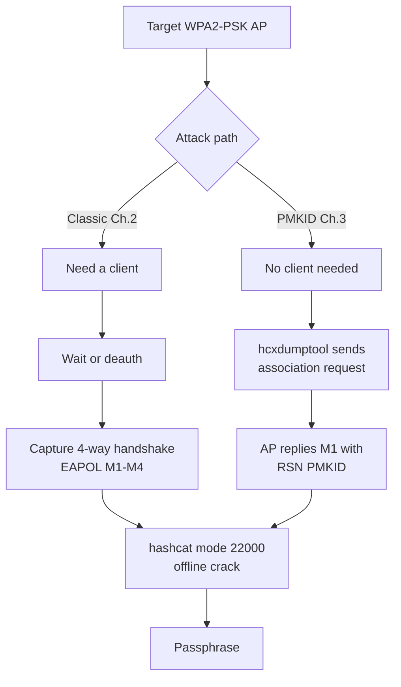
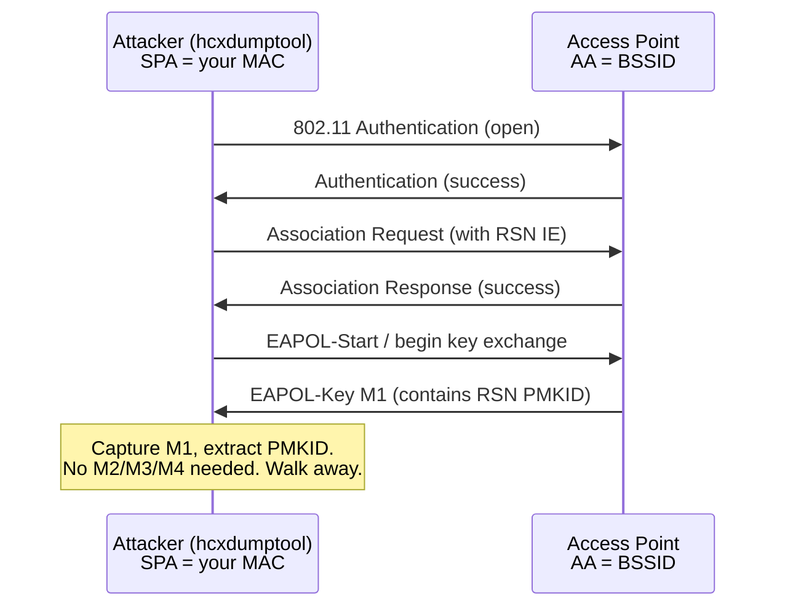
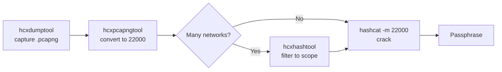
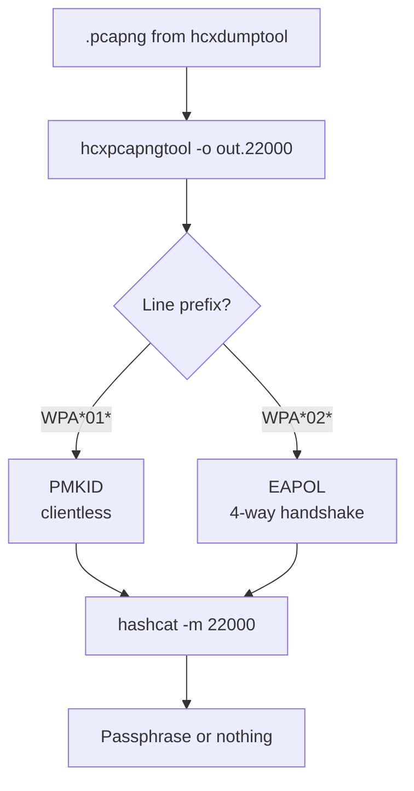
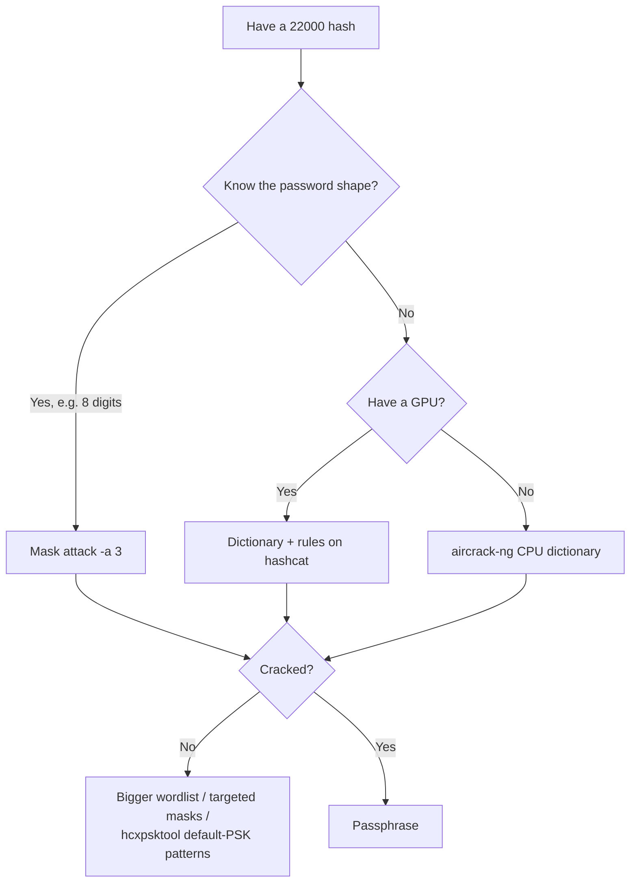
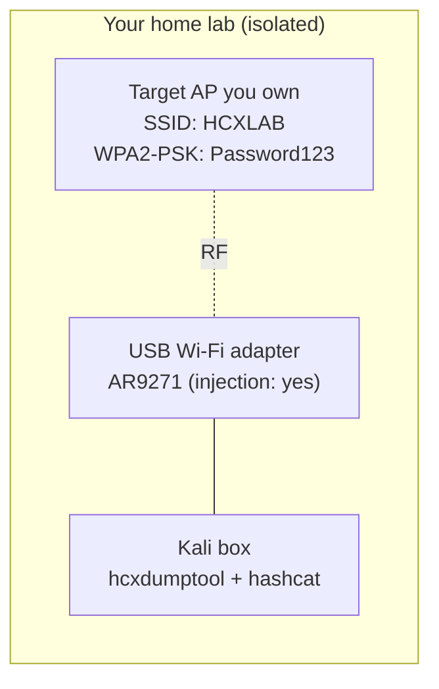
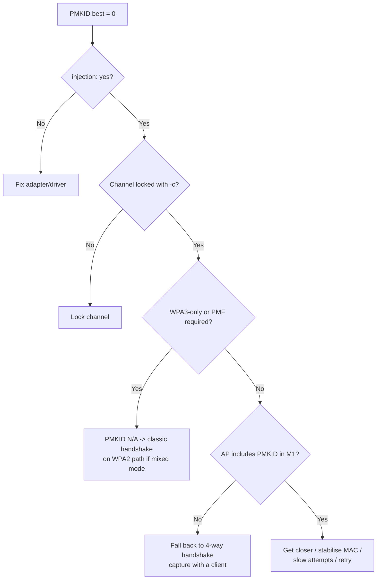
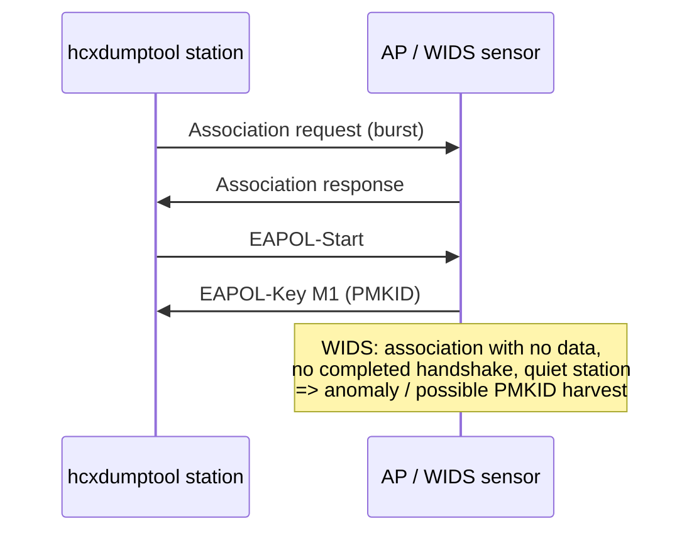
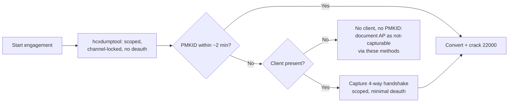

**Level:** Advanced · **Track:** Penetration Testing · **Read time:** 260 min

This is Chapter 3 of the Wireless notebook. Chapter 1 built the theory of the 802.11 security generations and the WPA2 four-way handshake; Chapter 2 turned that theory into muscle memory with the aircrack-ng suite — monitor mode, `airodump-ng` capture, the `aireplay-ng` deauthentication attack, and the offline crack. Both of those approaches share one dependency: **they need a client**. To capture a four-way handshake with the classic method you have to wait for a device to connect, or forcibly knock one off with deauth and hope it reconnects while you are listening.

This chapter removes that dependency. You are going to learn the **PMKID attack** — a technique, discovered in 2018 by Jens "atom" Steube (the author of hashcat), that lets you extract crackable WPA/WPA2-PSK material from an access point **without any client on the network at all**. No waiting, no deauth, no denial of service against real users — just a single association attempt against the AP, and if the AP is vulnerable it hands you a `PMKID` you can take offline and crack exactly like a handshake. The tool that performs this is **hcxdumptool**, and its companion **hcxpcapngtool** converts what it captures into a hash `hashcat` can eat.

We will teach `hcxdumptool` and the whole **hcxtools** family from absolute zero: what a PMKID actually is at the protocol level, why it leaks, how to prepare an adapter for hcxdumptool (which does *not* use `airmon-ng` monitor mode the way aircrack-ng does), every flag that matters, the conversion pipeline into hashcat's `22000` mode, and the crack itself. Then a fully reproducible lab, the real-world reasons a PMKID sometimes never appears, and a consolidated blue-team section on how to detect and defeat all of it.

Everything here is for **authorised testing only** — your own lab, your own hardware, or an engagement with written scope. Capturing PMKIDs or handshakes, or associating with access points you do not own or are not contracted to assess, is illegal in most jurisdictions (in the US, the Computer Fraud and Abuse Act; in the UK, the Computer Misuse Act; and local equivalents elsewhere). The PMKID attack is *quieter* than deauth — it does not knock users offline — but it is still an unauthorised association attempt against someone else's radio. Build the home lab described at the end and practise there.

---

## Part 1: Where PMKID Fits — The Problem It Solves

Recall the classic WPA2-PSK crack from Chapter 2. The offline-crackable secret is derived from the four-way handshake, specifically the EAPOL frames M1–M4 that carry the nonces and the MIC (Message Integrity Code). To get those frames you must observe an actual authentication event between a client (the *supplicant*) and the AP (the *authenticator*). If nobody connects, there is nothing to capture. Your options were:

1. **Wait passively** for a legitimate client to (re)connect — slow, unpredictable, and useless at 3 a.m. on an idle network.
2. **Deauthenticate a connected client** with `aireplay-ng`, forcing it to re-handshake — fast, but it is an active denial-of-service against a real user, it is noisy, and it fails outright if 802.11w (Protected Management Frames) is enforced.

Both hinge on a client existing and cooperating. The PMKID attack sidesteps the client entirely.

The key insight: the material needed to verify a passphrase is not *only* present in the four-way handshake. It is also present in the very **first message the AP sends (M1)** when key caching is enabled — inside an optional field of the RSN Information Element called the **PMKID**. And crucially, many APs will send that M1 in response to an association request from *anyone*, before any real authentication has happened. So instead of capturing a conversation between two other parties, you *become* one party: you send an association request to the AP, the AP replies with an M1 containing a PMKID, and you walk away with a crackable hash. No client. No deauth. No DoS.



**Why this matters offensively:** on a real engagement you frequently arrive at a site with access points broadcasting but no clients associated to the network you are scoped against (a guest SSID nobody uses, an IoT SSID, an after-hours office). The PMKID attack means an empty network is still assessable. **Why it matters defensively:** it collapses the assumption that "if no one is connected, there is nothing to steal." A blue team that only monitors for deauth floods will miss a PMKID grab entirely.

One important caveat up front, so you calibrate expectations: **PMKID and the four-way handshake protect the same secret.** Neither the PMKID nor the handshake reveals the passphrase — both are *verifiers* that let you test candidate passphrases offline. If the network uses a long, random PSK, capturing a PMKID gets you exactly nowhere, just as capturing a handshake would. The attack changes *how easily you get material to crack*; it does not change *how crackable the passphrase is*. We will hammer this point again in the defense section, because it is the single most important thing for a defender to internalise.

---

## Part 2: What a PMKID Actually Is (Protocol-Level)

To use the attack well — and to diagnose it when it fails — you need to know what a PMKID *is*, not just how to type the command. Let us build it from the WPA2 key hierarchy you met in Chapter 1.

### The key hierarchy, recapped

In WPA2-PSK, everything derives from the passphrase:

- **PSK (Pre-Shared Key)** — a 256-bit value derived from the passphrase and the SSID:
  `PSK = PBKDF2(HMAC-SHA1, passphrase, SSID, 4096 iterations, 256 bits)`.
  The SSID is the salt, which is why the same passphrase on two differently-named networks produces different PSKs (and why precomputed tables are ESSID-specific).
- **PMK (Pairwise Master Key)** — in PSK mode, the PMK *is* the PSK. (In enterprise/802.1X mode the PMK comes from the EAP exchange instead, which is why the PMKID attack does not apply to WPA-Enterprise.)
- **PTK (Pairwise Transient Key)** — the session key, derived during the four-way handshake from the PMK plus both MAC addresses and both nonces.

### The definition of PMKID

The **PMKID** is a fingerprint of the PMK, bound to the specific AP and client MACs. It is computed as:

```
PMKID = HMAC-SHA1-128( PMK, "PMK Name" || AA || SPA )
```

where:

- `PMK` — the Pairwise Master Key (= the PSK in personal mode).
- `"PMK Name"` — the literal ASCII string `PMK Name` (a fixed label from the 802.11 standard).
- `AA` — the **Authenticator Address** (the AP's BSSID / MAC).
- `SPA` — the **Supplicant Address** (the client's MAC — in our attack, *your* adapter's MAC).
- `HMAC-SHA1-128` — HMAC-SHA1 truncated to the first 128 bits.

Read that formula carefully, because it explains the entire attack:

- The PMKID is a **keyed hash of the PMK**. If you know `AA`, `SPA`, and the PMKID, you can *test* a candidate passphrase: derive a candidate PSK from the passphrase + SSID, compute the candidate PMK (= PSK), compute HMAC-SHA1-128 over `"PMK Name" || AA || SPA`, and compare to the captured PMKID. Match ⇒ correct passphrase. That is exactly what hashcat mode `22000`/`16800` does, billions of times per second.
- It contains **no nonces**. Unlike the four-way handshake, there is no ANonce/SNonce and no MIC over a temporal key. It is a static function of PMK + the two MACs. That is why you do not need a full handshake — a single M1 carrying the PMKID is enough.
- Because `SPA` is *your* MAC, you control half the inputs. This is what lets you provoke a usable PMKID by simply associating.

### Where the PMKID travels: the RSN IE in EAPOL M1

The PMKID rides inside the **RSN (Robust Security Network) Information Element**, in the **PMKID Count / PMKID List** field, carried in the **first EAPOL-Key message (M1)** the authenticator sends. Its original purpose is legitimate and has nothing to do with attacks: it supports **PMK caching / fast roaming (802.11r and opportunistic key caching)**. When a client roams back to an AP it has authenticated to before, the AP can include the PMKID in M1 to say "I remember you — we can skip the full re-auth." To support that, many APs are configured to advertise a PMKID in M1 as a matter of course.

The vulnerability is that a class of APs will send this M1 (with a PMKID) in response to an association from a station that has *never* authenticated — i.e., they will hand a PMKID to an attacker who merely asks to associate.



Compare that to the four-way handshake diagram from Chapter 1: the PMKID path stops after **M1**. You never send an M2, so no PTK is ever confirmed, no traffic key is installed, and no real user is disturbed.

**CTF and lab note:** many wireless CTF challenges and TryHackMe/HTB wireless rooms hand you a `.pcapng` and ask you to extract *either* a handshake *or* a PMKID and crack it — being able to tell the two apart in the converted hash (the `WPA*01` vs `WPA*02` prefix, covered in Part 6) is often the whole puzzle.

---

## Part 3: The hcxtools Family — What Each Tool Is For

`hcxdumptool` is one program in a small suite written by ZerBea (Alexander Janssen). Newcomers confuse them constantly, so learn the division of labour first. There are two separate repositories:

- **hcxdumptool** — the *capture* tool. It talks to the radio, sends association requests, and writes a `.pcapng` capture. This is the only tool in the family that touches the air.
- **hcxtools** — a set of *offline* conversion and analysis utilities that never touch the radio. The one you will use constantly is `hcxpcapngtool`.

| Tool | Repo | Job |
| --- | --- | --- |
| `hcxdumptool` | hcxdumptool | Live capture: request PMKIDs, capture EAPOL/PMKID, GPS wardriving, filtering |
| `hcxpcapngtool` | hcxtools | Convert `.pcapng` → hashcat `22000` hash file (and `.hccapx`, extract identities/ESSIDs) |
| `hcxhashtool` | hcxtools | Filter/deduplicate/inspect a `22000` hash file (by ESSID, MAC, type) |
| `hcxpsktool` | hcxtools | Generate candidate PSK wordlists from patterns (e.g., router-default schemes) |
| `hcxeiutool` | hcxtools | Build ESSID/wordlist inputs (e.g., date-based candidate generation) |
| `hcxpmkidtool` | hcxtools | (older) PMKID-specific helper; largely superseded by hcxpcapngtool |
| `wlancap2wpasec` | hcxtools | Upload captures to the WPA-SEC crowd-cracking project |

The modern happy path uses exactly three of them: **`hcxdumptool`** to capture, **`hcxpcapngtool`** to convert, and **`hashcat`** (from a different project entirely) to crack — with **`hcxhashtool`** as an optional filtering step in the middle when you have captured many networks and want to isolate your scoped target.



### A crucial version warning

hcxdumptool changed dramatically at **version 6.3.0**. Older tutorials (and older Kali packages) use flags like `--enable_status`, `--filterlist_ap`, `-o` for output, and the `--do_rcascan` option; newer versions (6.3.x and the 6.x rewrite) replaced almost all of them with a different flag set (`-w` for write, `-F`, `-c`, `--rds`, `--bpf`, `--disable_deauthentication`, and so on). Blindly copying a 2019 blog post into a 2024+ hcxdumptool will produce "unknown option" errors. **Always run `hcxdumptool --version` and `hcxdumptool --help` first** and treat the built-in help as the source of truth. In this chapter we cover the modern (6.3.x+) flag set and call out legacy equivalents where it helps.

---

## Part 4: Installing and Preparing — hcxdumptool from Zero

### What hcxdumptool is, one more time

`hcxdumptool` is a small C program that puts a Wi-Fi interface into a raw capture state and actively solicits key material. Unlike `airodump-ng`, which is fundamentally a passive sniffer that you *optionally* pair with `aireplay-ng` for injection, hcxdumptool is *built* to transmit: by default it associates with visible APs and asks them for PMKIDs, and it can request EAPOL M1s. It is therefore inherently an active tool — treat it as such when scoping.

### Installation on Kali

On a current Kali it is packaged:

```bash
# Update and install both the capture tool and the offline tools
sudo apt update
sudo apt install -y hcxdumptool hcxtools

# Verify versions — do this every time; flags differ across major versions
hcxdumptool --version
hcxpcapngtool --version
```

Sample output:

```
hcxdumptool 6.3.5 reading from interface (VERSION)
hcxpcapngtool 6.3.5 reading from pcapng ...
```

If your distro's package is old, build from source (both tools compile with a plain `make`):

```bash
# hcxdumptool (capture)
git clone https://github.com/ZerBea/hcxdumptool.git
cd hcxdumptool
sudo apt install -y libpcap-dev pkg-config    # build deps
make
sudo make install
cd ..

# hcxtools (conversion / analysis)
git clone https://github.com/ZerBea/hcxtools.git
cd hcxtools
sudo apt install -y libssl-dev libcurl4-openssl-dev zlib1g-dev
make
sudo make install
```

- `git clone` — pull the source repository.
- `make` — compile using the project's Makefile.
- `sudo make install` — copy the built binaries into `/usr/local/bin` so they are on your `PATH`.
- The `apt install` lines pull the build-time libraries: `libpcap-dev` (packet capture), `libssl-dev` (crypto for hashing), `libcurl4-openssl-dev` (for the WPA-SEC uploader), `zlib1g-dev` (compression).

### Interface preparation — the part everyone gets wrong

Here is a difference from Chapter 2 that trips people up constantly. **Modern hcxdumptool does not want you to run `airmon-ng` first.** It manages the interface itself and expects a normal interface name (e.g. `wlan0`), not a monitor-mode virtual interface (`wlan0mon`). In fact, running `airmon-ng start wlan0` and then pointing hcxdumptool at `wlan0mon` often *breaks* it in recent versions.

What hcxdumptool *does* need:

1. Interfering processes (NetworkManager, wpa_supplicant) stopped, so they do not yank the card back to managed mode mid-capture.
2. The interface up and capable of monitor mode + injection.

The clean sequence on modern hcxdumptool:

```bash
# 1. See your interfaces and identify the wireless one
ip link
iw dev

# 2. Stop the daemons that fight for the card
sudo systemctl stop NetworkManager
sudo systemctl stop wpa_supplicant
# (or the surgical airmon-ng approach:)
sudo airmon-ng check kill

# 3. Let hcxdumptool tell you what it sees and whether the card is usable
sudo hcxdumptool -l          # list interfaces hcxdumptool can use
```

- `ip link` — list network interfaces and their states.
- `iw dev` — show wireless devices and their current mode/channel; the authoritative wireless view.
- `systemctl stop NetworkManager` — stop the desktop network manager so it stops re-associating the card to your home Wi-Fi.
- `airmon-ng check kill` — the aircrack-ng helper that finds and kills *all* processes (NetworkManager, wpa_supplicant, dhclient) that interfere with monitor mode, in one command. Even though we are not using airmon-ng's monitor interface, `check kill` is still the fastest way to clear interference.
- `hcxdumptool -l` — hcxdumptool's own interface lister; it prints each capable interface with its driver and whether it supports the features hcxdumptool needs.

Sample `hcxdumptool -l` output:

```
available wlan devices:
1	wlan0	00c0ca000000	AR9271	rt2800usb / mac80211	monitor mode / injection: yes
```

If the last column says injection is not available, that adapter cannot run the active PMKID request path — pick a different chipset (see the hardware note below).

### Hardware reality (recap from Chapter 2, applied here)

hcxdumptool leans on the driver even harder than airodump-ng because it transmits constantly. Chipsets known to work well: **Atheros AR9271** (`ath9k_htc`), **Ralink RT3070/RT5372** (`rt2800usb`), **MediaTek MT7601U / MT7612U** (`mt7601u`/`mt76`), and **Realtek RTL8812AU** (with the aircrack-ng dkms driver, for 5 GHz). Built-in laptop cards frequently *cannot* inject and will silently capture nothing. If `hcxdumptool -l` does not show `injection: yes`, stop and fix the adapter before wasting an hour wondering why no PMKID appears.

---

## Part 5: Running hcxdumptool — Every Flag That Matters

With the card prepared, here is the anatomy of a real capture. We build from the simplest safe invocation to a fully scoped, filtered, single-target capture.

### The minimal capture

```bash
sudo hcxdumptool -i wlan0 -w capture.pcapng
```

- `-i wlan0` — the interface to use (the *real* interface, not `wlan0mon`).
- `-w capture.pcapng` — write captured frames to this `.pcapng` file. hcxdumptool captures EAPOL (M1–M4), PMKIDs, beacons, probe requests/responses, and identities into this one file.

Run like this, hcxdumptool will hop channels, associate with visible APs, request PMKIDs, and capture everything it can — from *every* network in range. On a real engagement this is **too broad and out of scope**. Never run the unfiltered capture near networks you are not authorised to touch. We fix scope below.

### The status/RDS display

Modern hcxdumptool shows a live curses-style status. Enable the "real-time display" and a status file:

```bash
sudo hcxdumptool -i wlan0 -w capture.pcapng --rds=1
```

- `--rds=1` — real-time display sort order (1 = sort by newest activity). This gives you the scrolling table of APs, the frames captured, and — most importantly — a marker when a PMKID or EAPOL message is grabbed.

What the columns mean in the live display:

| Column | Meaning |
| --- | --- |
| `TIME` | Timestamp of the event |
| `MAC_AP` | BSSID of the access point |
| `CH` | Channel the AP is on |
| `RSSI` | Signal strength (closer to 0 = stronger) |
| `STATUS` | Event flags — the ones you care about are PMKID and EAPOL/M1..M4 markers |
| `ESSID` | Network name |

When you see a PMKID captured for your target BSSID, you are done — you can stop with `Ctrl-C`.

### Channel control

By default hcxdumptool hops across channels. To lock onto your target's channel (faster, more reliable, and narrower scope):

```bash
sudo hcxdumptool -i wlan0 -w capture.pcapng -c 6
```

- `-c 6` — restrict to channel 6. You can pass a list: `-c 1,6,11` for the common 2.4 GHz non-overlapping channels, or `-c 36,40,44,48` for 5 GHz (adapter must support 5 GHz). Locking the channel is the single biggest reliability win once you know where your target lives.

Find the target's channel first with a quick passive scan (airodump-ng from Chapter 2, or `hcxdumptool` briefly, or `iw dev wlan0 scan`).

### Scoping to a single target — the filter list (this is mandatory on real engagements)

Running against everything in range is both noisy and, off a lab, illegal. hcxdumptool supports allow/deny filter lists by BSSID:

```bash
# Create a filter file with your in-scope BSSID(s), one MAC per line
echo "aa:bb:cc:dd:ee:ff" > scope.txt

sudo hcxdumptool -i wlan0 -w capture.pcapng \
  -c 6 \
  -F \
  --bpf=scope.bpf
```

There are two filtering mechanisms depending on version, and this is where the version differences bite hardest:

- **BPF filter (`--bpf=FILE`)** — modern, most powerful. You compile a Berkeley Packet Filter that restricts capture/interaction to specific MACs. hcxdumptool ships a helper, `hcxdumptool --bpfc`, to *compile* a human-readable filter into the binary BPF file:

  ```bash
  # Compile a BPF that only touches one BSSID (both directions)
  hcxdumptool --bpfc="wlan addr3 aa:bb:cc:dd:ee:ff" > scope.bpf
  sudo hcxdumptool -i wlan0 -w capture.pcapng -c 6 --bpf=scope.bpf
  ```

  - `--bpfc="..."` — compile the given BPF expression to stdout. `wlan addr3 aa:bb:cc:dd:ee:ff` matches frames whose 802.11 address-3 field (the BSSID in infrastructure frames) is your target.
  - `--bpf=scope.bpf` — load that compiled filter so hcxdumptool ignores everything else.

- **Legacy filter lists** — older versions used `--filterlist_ap=FILE --filtermode=2` (2 = allowlist / attack only these). If you are on an older packaged hcxdumptool you will use these instead; check `--help`.

**On any authorised engagement, always run with a scope filter.** It is the difference between "assessing the client's SSID" and "actively associating with every AP in a shared office building," which will include networks you have no authorisation to touch.

### Disabling the noisy/aggressive behaviours

hcxdumptool's defaults are aggressive. Two flags matter for staying quiet and lawful:

```bash
sudo hcxdumptool -i wlan0 -w capture.pcapng -c 6 --bpf=scope.bpf \
  --disable_deauthentication \
  --disable_disassociation
```

- `--disable_deauthentication` — do **not** send deauth frames. hcxdumptool can, like aireplay-ng, deauth clients to harvest full handshakes; for a pure clientless PMKID grab you do not need or want this, and it avoids the DoS. (Older versions: this was on by default and controlled differently — check help.)
- `--disable_disassociation` — likewise suppress disassociation frames.

For a **client-safe PMKID-only** run, disabling deauth is the right default. You are only associating and requesting PMKIDs, never knocking anyone off.

### Attack-mode / association tuning

Depending on version, hcxdumptool exposes controls over *how* it solicits key material:

- `--attemptclientmax=N` / association retry counts — how many association attempts per AP before moving on.
- `-A` / active association controls — force the association-request path used to solicit PMKIDs.
- `-m <MAC>` / `--mac_ap` / `--mac_client` — set the client (SPA) MAC hcxdumptool uses; useful to present a consistent, non-random MAC (remember: your SPA is part of the PMKID computation, so it must be stable between capture and any manual verification).

Because these flag names have shifted across versions, the operational rule is: read `hcxdumptool --help | less`, find the option that matches your version, and confirm with a lab AP that a PMKID actually lands before trusting a command on a real engagement.

### GPS / wardriving (situational awareness, not required for a single target)

hcxdumptool can log GPS coordinates alongside each capture for wardriving/site-survey work:

```bash
sudo hcxdumptool -i wlan0 -w survey.pcapng --gpsd --nmea=survey.nmea
```

- `--gpsd` — read location from a running `gpsd` daemon.
- `--nmea=FILE` — write raw NMEA sentences so each captured network can later be plotted on a map.

This is invaluable for a *physical* site assessment (mapping which rogue/guest SSIDs exist and where) but irrelevant to cracking a single known AP.

### Flag quick-reference

| Flag (modern 6.3.x+) | Meaning |
| --- | --- |
| `-i <iface>` | Interface to use (the real interface, not `*mon`) |
| `-w <file.pcapng>` | Write capture to this file |
| `-c <chan[,chan...]>` | Restrict to channel(s) |
| `--rds=1` | Real-time display, sorted by newest activity |
| `--bpf=<file>` | Load a compiled BPF scope filter |
| `--bpfc="<expr>"` | Compile a BPF expression to stdout |
| `--disable_deauthentication` | Do not transmit deauth frames (client-safe) |
| `--disable_disassociation` | Do not transmit disassociation frames |
| `-l` | List usable interfaces and capabilities |
| `-I` | Show interface info / driver capabilities |
| `--gpsd` / `--nmea=<file>` | Wardriving: log location data |
| `-t <sec>` | Stay/scan timing controls |
| `--help` | The authoritative flag list for *your* version |

**Red team usage:** the client-safe PMKID run (`--disable_deauthentication`, single-BSSID BPF, channel-locked) is the stealthiest way to pull crackable material during a physical engagement — no users dropped, no deauth flood for a WIDS to flag. **Blue team usage:** the same behaviour still generates a burst of association requests from a single (often randomised) MAC to an AP with no subsequent data traffic — a detectable anomaly, covered in Part 11.

---

## Part 6: Converting the Capture — hcxpcapngtool and the 22000 Hash Mode

hcxdumptool wrote a `.pcapng`. hashcat cannot read `.pcapng` directly — you must convert it into hashcat's hash format. That is `hcxpcapngtool`'s job.

### What hcxpcapngtool is

`hcxpcapngtool` is an *offline* parser. It reads a `.pcapng`, finds every PMKID and every usable EAPOL handshake message inside, and emits them in hashcat's modern combined **mode 22000** (`WPA-PBKDF2-PMKID+EAPOL`) format. Mode 22000 replaced the older split modes 16800 (PMKID-only) and 2500 (`.hccapx` EAPOL) — a single 22000 file can contain *both* PMKID and EAPOL lines and hashcat handles them together.

### The conversion command

```bash
hcxpcapngtool -o target.22000 -E essidlist capture.pcapng
```

- `-o target.22000` — output the hashcat 22000 hash lines to this file.
- `-E essidlist` — also dump every ESSID seen into `essidlist` (a free wordlist of network names — sometimes the passphrase is derived from the SSID or nearby strings, and it feeds `hcxeiutool`).
- `capture.pcapng` — the input capture.

Additional useful outputs:

```bash
hcxpcapngtool \
  -o target.22000 \
  -E essidlist \
  --all \
  capture.pcapng
```

- `--all` — write *all* possible hash candidates, including weaker/AP-less EAPOL pairs. Use it when a clean capture did not yield a hash; omit it when you want only high-confidence, crackable material.

Sample output:

```
reading from capture.pcapng...

summary capture file
--------------------
file name.......................: capture.pcapng
file type.......................: pcapng 1.0
...
packets inside..................: 48213
...
EAPOL messages (total)..........: 12
EAPOL M1 messages...............: 8
EAPOL pairs (best).............. : 1
PMKID (total)...................: 3
PMKID (best)....................: 1
...
1 PMKID(s) written to target.22000
1 EAPOL pair(s) written to target.22000
```

The lines you care about: **`PMKID (best)`** and **`EAPOL pairs (best)`**. If both are zero, you captured nothing crackable — see Part 9 for why.

### Reading a 22000 hash line — PMKID vs EAPOL

Open `target.22000`. Each line starts with a tag telling you *which kind* of material it is:

```
WPA*01*<PMKID>*<MAC_AP>*<MAC_STA>*<ESSID_hex>***
WPA*02*<MIC>*<MAC_AP>*<MAC_STA>*<ESSID_hex>*<ANONCE>*<EAPOL>*<MESSAGEPAIR>
```

| Prefix | Type | Meaning |
| --- | --- | --- |
| `WPA*01*` | **PMKID** | Clientless PMKID material (the star of this chapter) |
| `WPA*02*` | **EAPOL** | Four-way-handshake material (the Chapter 2 path) |

The fields, for a PMKID (`WPA*01`) line:

- `WPA` — signature.
- `01` — type = PMKID.
- `<PMKID>` — the 128-bit PMKID you captured (hex).
- `<MAC_AP>` — the AP's BSSID (`AA` in the formula) as hex.
- `<MAC_STA>` — your station MAC (`SPA` in the formula) as hex.
- `<ESSID_hex>` — the network name, hex-encoded (this is the PBKDF2 salt).
- trailing fields are empty for PMKID (they carry nonce/EAPOL data only for `WPA*02`).

Being able to read this line is a genuine skill: it tells you the ESSID (decode the hex), which MACs are involved, and whether you are cracking a PMKID or a handshake. In CTFs you are frequently *given* one of these lines directly.



### Filtering with hcxhashtool

If you captured many networks (e.g., an unavoidably broad passive run in the lab), isolate your scoped target before cracking:

```bash
# Keep only lines for one BSSID
hcxhashtool -i target.22000 --mac-ap=aabbccddeeff -o scoped.22000

# Or keep only PMKID lines
hcxhashtool -i target.22000 --type=1 -o pmkid-only.22000

# Or filter by ESSID
hcxhashtool -i target.22000 --essid="CorpGuest" -o corpguest.22000
```

- `-i` — input 22000 file.
- `--mac-ap=` — keep only lines whose AP MAC matches (no colons).
- `--type=1` — keep only PMKID lines (`1` = PMKID, `2` = EAPOL).
- `--essid=` — keep only lines for a given network name.
- `-o` — output filtered file.

`hcxhashtool` also **deduplicates**, which matters: hcxdumptool often captures the same PMKID many times, and cracking a file with 40 identical lines just wastes time.

---

## Part 7: Cracking the Hash — hashcat Mode 22000 (and aircrack-ng)

Now the offline crack. This is where the passphrase's strength — not the capture technique — decides everything.

### hashcat from scratch

`hashcat` is the world's fastest password-recovery tool, GPU-accelerated, maintained by the same author who discovered the PMKID attack. It takes a hash file and a source of candidate passwords (a wordlist, a mask, a rule-mangled wordlist, or combinations), computes the hash of each candidate, and compares. For WPA/WPA2 it implements the full `PBKDF2-HMAC-SHA1(4096) → PMK → PMKID/MIC` chain in mode `22000`.

Install and sanity-check:

```bash
sudo apt install -y hashcat
hashcat -I            # list compute devices (GPUs/CPUs) hashcat can use
hashcat -b -m 22000   # benchmark WPA 22000 on your hardware
```

- `-I` — show OpenCL/CUDA devices. If only a CPU shows up, cracking will be slow; a GPU is strongly preferred for WPA.
- `-b -m 22000` — benchmark mode 22000 so you know your candidate-per-second rate (a rough GPU might do a few hundred thousand H/s; a strong GPU tens of millions — still slow because PBKDF2-4096 is deliberately expensive).

### Straight dictionary attack

```bash
hashcat -m 22000 target.22000 /usr/share/wordlists/rockyou.txt
```

- `-m 22000` — hash mode = WPA-PBKDF2-PMKID+EAPOL. This one mode cracks both PMKID and handshake lines in the file.
- `target.22000` — the hash file from hcxpcapngtool.
- `/usr/share/wordlists/rockyou.txt` — the classic 14-million-entry wordlist (unzip it first: `sudo gunzip /usr/share/wordlists/rockyou.txt.gz`).

Sample cracked output:

```
WPA*01*7f3a...e21*aabbccddeeff*001122334455*436f727047756573740*...:SunFlower2019!
...
Session..........: hashcat
Status...........: Cracked
Hash.Mode........: 22000 (WPA-PBKDF2-PMKID+EAPOL)
Recovered........: 1/1 (100.00%) Digests
```

The passphrase is the part after the final `:` — here `SunFlower2019!`.

### Mask attack (brute force with structure)

When you know the passphrase *shape* — many consumer routers ship 8–10 char defaults, or you know a corporate pattern — a mask is far faster than blind brute force:

```bash
# 8 digits (e.g., a phone-number or default numeric PSK)
hashcat -m 22000 target.22000 -a 3 ?d?d?d?d?d?d?d?d
```

- `-a 3` — attack mode 3 = brute force / mask.
- `?d?d?d?d?d?d?d?d` — mask: eight decimal digits (`?d` = 0–9). Other charsets: `?l` lower, `?u` upper, `?s` symbols, `?a` all.

### Rules — mangling a wordlist

Real passphrases are often a base word plus mutations (`Summer` → `Summer2023!`). Rules apply those mutations at GPU speed:

```bash
hashcat -m 22000 target.22000 /usr/share/wordlists/rockyou.txt \
  -r /usr/share/hashcat/rules/best64.rule
```

- `-r best64.rule` — apply the 64 most productive mangling rules (capitalise, append digits/years, leetspeak) to every wordlist entry.

### Managing the session

```bash
hashcat -m 22000 target.22000 rockyou.txt --session=corp --status --status-timer=30
```

- `--session=corp` — name the session so you can `--restore` it after a stop.
- `--status --status-timer=30` — print a progress line every 30 seconds.
- Press `s` for status, `p` to pause, `q` to quit-and-save at any time. Resume with `hashcat --session=corp --restore`.
- Recovered passwords are stored in `~/.local/share/hashcat/hashcat.potfile`; show already-cracked results with `hashcat -m 22000 target.22000 --show`.

### Cracking with aircrack-ng (the fallback)

`aircrack-ng` can also crack a 22000 file, though hashcat is far faster on a GPU. It is useful when you have no GPU or want a quick CPU dictionary run:

```bash
aircrack-ng -w rockyou.txt target.22000
```

- `-w rockyou.txt` — the wordlist.
- aircrack-ng auto-detects PMKID vs handshake lines in the 22000 file. It is CPU-only, so treat it as a convenience, not the primary cracker.

### Crack-strategy decision tree



**Bug bounty / reality note:** most in-scope corporate WPA2-PSK networks that are actually crackable fall to a targeted wordlist + rules within hours because someone chose `CompanyName2023!` or a memorable phrase. A 20-character random PSK will not fall to any of this in human time — which is exactly the defensive recommendation.

---

## Part 8: Full Hands-On Lab — Clientless PMKID Capture and Crack, End to End

This lab is fully reproducible in your own home lab. **Use only an AP you own.** Set up a spare router (or a phone hotspot / a `hostapd` soft-AP on a spare adapter) with WPA2-PSK and a *deliberately weak* passphrase you choose, e.g. `Password123`, so the crack finishes quickly and you learn the whole pipeline. Do not point any of this at a network you do not own.

### Lab topology



Note there is deliberately **no client** connected to `HCXLAB`. The entire point is to get material without one.

### Step 0 — Confirm scope and hardware

```bash
# Confirm the adapter can inject (required for the active PMKID request)
sudo airmon-ng check kill
sudo hcxdumptool -l
```

Expected: your adapter listed with `injection: yes`. If not, fix the adapter before continuing.

### Step 1 — Find the target's channel

A quick passive scan (from Chapter 2) tells you the channel and BSSID:

```bash
sudo airmon-ng start wlan0          # temporary, just to scan
sudo airodump-ng wlan0mon
```

Sample:

```
 BSSID              PWR  Beacons   CH  ENC  CIPHER AUTH ESSID
 AA:BB:CC:DD:EE:FF  -38      120    6  WPA2 CCMP   PSK  HCXLAB
```

Note `BSSID = AA:BB:CC:DD:EE:FF`, `CH = 6`. Then **tear monitor mode back down** so hcxdumptool gets a clean real interface:

```bash
sudo airmon-ng stop wlan0mon
sudo ip link set wlan0 up
```

### Step 2 — Build a scope filter for just your AP

```bash
# Compile a BPF that only interacts with our lab BSSID
hcxdumptool --bpfc="wlan addr3 aa:bb:cc:dd:ee:ff" > scope.bpf
```

### Step 3 — Run the clientless, client-safe capture

```bash
sudo hcxdumptool -i wlan0 -w hcxlab.pcapng \
  -c 6 \
  --bpf=scope.bpf \
  --disable_deauthentication \
  --rds=1
```

- `-c 6` — lock to channel 6 (our AP).
- `--bpf=scope.bpf` — only touch our BSSID.
- `--disable_deauthentication` — no deauth; pure clientless PMKID solicitation.
- `--rds=1` — live display.

Watch the live display. Within seconds to a minute (for a PMKID-vulnerable AP) you should see a PMKID marker against `AA:BB:CC:DD:EE:FF`. Sample status region:

```
 TIME     MAC_AP        CH  RSSI  STATUS         ESSID
 10:42:03 aabbccddeeff   6   -38  ASSOCIATED     HCXLAB
 10:42:03 aabbccddeeff   6   -38  PMKID          HCXLAB
```

Once you see `PMKID` for your BSSID, press `Ctrl-C` to stop. You now have `hcxlab.pcapng` with a PMKID and **you never touched a client.**

### Step 4 — Convert to a hashcat hash

```bash
hcxpcapngtool -o hcxlab.22000 -E hcxlab.essids hcxlab.pcapng
```

Sample:

```
PMKID (total)...................: 5
PMKID (best)....................: 1
1 PMKID(s) written to hcxlab.22000
```

Inspect the line:

```bash
cat hcxlab.22000
# WPA*01*3f2a...c9*aabbccddeeff*00c0ca112233*48435841420*...
```

Decode the ESSID hex to confirm scope:

```bash
echo -n "48435841420" | xxd -r -p ; echo
# HCXLAB    (the hex decodes to the ESSID bytes)
```

- `xxd -r -p` — reverse a hex string back to bytes. Confirms the captured hash is for the intended network.

### Step 5 — Crack it

```bash
hashcat -m 22000 hcxlab.22000 /usr/share/wordlists/rockyou.txt --status
```

Because we chose a weak passphrase in rockyou, it falls quickly:

```
WPA*01*3f2a...c9*aabbccddeeff*00c0ca112233*48435841420*...:Password123
Status...........: Cracked
Recovered........: 1/1 (100.00%) Digests
```

Show the result any time:

```bash
hashcat -m 22000 hcxlab.22000 --show
```

### Step 6 — Verify and clean up

Confirm you cracked the right network by decoding the ESSID field and matching your lab SSID, then restore normal networking:

```bash
sudo systemctl start NetworkManager
```

- Restart NetworkManager so your Kali box gets its normal Wi-Fi/desktop connectivity back.

**Lab checkpoint — what you just proved:** an AP with a PMKID-vulnerable configuration and a weak PSK hands crackable material to an attacker with **no client on the network, no deauth, and no DoS**. That is the entire threat model of this chapter in one run.

---

## Part 9: Why the PMKID Sometimes Never Appears — Real-World Edge Cases

The single most common frustration is running hcxdumptool for ten minutes and getting `PMKID (best): 0`. This is normal and diagnosable. Not every AP is vulnerable to the clientless PMKID grab. Work through these causes in order.

### 1. The AP simply does not put a PMKID in M1

The attack depends on the AP including a PMKID in the RSN IE of an unsolicited M1. Many APs — especially modern enterprise gear, some Wi-Fi 6 consumer routers, and anything with roaming key-caching disabled — do **not**. There is nothing you can do to force a PMKID out of an AP that never sends one; fall back to the classic four-way handshake capture (Chapter 2), which requires a client but works regardless of PMKID support.

### 2. WPA3 / SAE

WPA3-Personal uses **SAE (Simultaneous Authentication of Equals)** instead of the PSK-derived PMK-in-M1 model. SAE is not vulnerable to the PMKID attack at all — there is no offline-crackable PMKID or handshake to steal in the same way. If the network is WPA3-only, this attack does not apply. **Transition (WPA2/WPA3 mixed) mode**, however, still exposes the WPA2 path and is attackable.

### 3. 802.11w / PMF (Protected Management Frames) enforced

When PMF is *required*, management frames are protected and the association/handshake behaviour changes; deauth-based handshake capture is blocked outright, and PMKID solicitation is often unreliable or refused. PMF is the single most effective standards-based mitigation and is mandatory in WPA3.

### 4. Injection / adapter problems

If `hcxdumptool -l` did not report `injection: yes`, hcxdumptool cannot send the association request that solicits the PMKID. You will capture beacons but never a PMKID. Fix the adapter/driver (Part 4).

### 5. Wrong channel or too weak a signal

If you are channel-hopping, hcxdumptool spends only a fraction of its time on your target's channel, and the association attempt may never land. **Lock the channel with `-c`.** If RSSI is very weak (e.g., worse than about `-75`), association may fail repeatedly — get closer or use a better antenna.

### 6. Randomised or mismatched MAC

Your SPA (station MAC) is part of the PMKID computation. If your capture used one MAC but you later try to verify with another, they will not match. Keep the MAC stable, and if you set a custom MAC, ensure it is used consistently.

### 7. The AP rate-limits or blocklists association floods

Some APs and WIDS deployments detect the burst of association requests hcxdumptool sends and stop responding or blocklist your MAC. Slow the attempts, change MAC, or fall back to passive handshake capture.

### Decision tree for a missing PMKID



**Practical rule:** if you have not seen a PMKID within a couple of minutes on a locked channel with an injection-capable adapter, stop assuming PMKID and pivot to the Chapter 2 handshake method. hcxdumptool captures both — it will grab a four-way handshake M1–M4 too if a client connects — so you are not starting over.

---

## Part 10: hcxpsktool and Targeted Wordlists — When rockyou Fails

A random or long PSK will not fall to `rockyou.txt`. But many real networks use **predictable default or vanity passphrases**, and `hcxtools` includes generators for exactly this.

### Default-PSK patterns

Many ISP-supplied routers ship with algorithmically generated default passphrases (e.g., 8–10 uppercase-hex or specific-length numeric strings tied to the SSID or MAC). `hcxpsktool` can generate candidate lists matching known schemes:

```bash
# Generate candidate PSKs (examples of pattern generators)
hcxpsktool --help
hcxpsktool -c 001122334455 > candidates.txt   # patterns derived from a MAC/OUI
```

- `hcxpsktool` — emits candidate passwords following built-in schemes commonly used by consumer routers. The exact options depend on version; `--help` lists the supported schemes.

Feed the generated candidates straight into hashcat:

```bash
hashcat -m 22000 target.22000 candidates.txt
```

### ESSID- and date-derived candidates with hcxeiutool

People commonly base passphrases on the network name or dates:

```bash
# Use the ESSID list dumped earlier to seed candidates
hcxeiutool -e essidlist -o essid-based.txt
```

- `-e essidlist` — take the network names hcxpcapngtool extracted.
- `-o essid-based.txt` — write mangled candidates (the ESSID, with common suffixes/case changes).

### Building targeted masks

For a corporate network where you suspect `CompanyNameYYYY!`:

```bash
# "Acme" + a 4-digit year + a symbol
hashcat -m 22000 target.22000 -a 3 Acme?d?d?d?d?s
```

| Wordlist source | When to use |
| --- | --- |
| `rockyou.txt` + `best64.rule` | First pass, always — cracks the majority of weak human PSKs |
| `hcxpsktool` scheme candidates | ISP/consumer routers with default PSKs |
| `hcxeiutool` ESSID-based list | Passphrase likely derived from the network name |
| Custom mask (`-a 3`) | Known length/shape (8 digits, date pattern, vanity string) |
| Large wordlists (e.g. `weakpass`, `crackstation`) | GPU available and time budget allows |

**Ethics reminder:** targeted default-PSK cracking is powerful precisely because it works on real deployed hardware. Only run it against networks in your written scope.

---

## Part 11: Detection & Defense Angle (Blue Team)

Everything above is the offensive picture. Here is the consolidated defensive view — how to detect the PMKID/hcxdumptool attack and, far more importantly, how to make it worthless.

### Make the captured material uncrackable (the real fix)

The PMKID and the handshake protect the *same* PSK. The attack gets material; it does not weaken the passphrase. Therefore:

- **Use a long, high-entropy PSK.** 20+ random characters (or a 5–6 word diceware passphrase) makes offline cracking computationally infeasible regardless of whether the attacker captured a PMKID or a handshake. This is the single highest-impact control. A captured PMKID for a network with a 24-char random PSK is worthless.
- **Never use vendor defaults or vanity/company-name passphrases.** These are exactly what `hcxpsktool`, targeted masks, and `rockyou` + rules crack in minutes.
- **Rotate the PSK if you suspect capture.** Because the PMKID is offline material, an attacker can crack it at leisure days later. If a capture is suspected, change the PSK — the old captured PMKID becomes useless against the new PSK.

### Standards-based mitigations

| Control | Effect on this attack |
| --- | --- |
| **WPA3-Personal (SAE)** | Eliminates the offline-crackable PMKID/handshake model entirely; forward secrecy and per-attempt online resistance |
| **802.11w / PMF required** | Blocks deauth-based handshake capture; makes PMKID solicitation unreliable/refused |
| **Disable PMKID / roaming key caching** | Many enterprise/prosumer APs let you stop advertising a PMKID in M1, removing the clientless path (clients then always do a full handshake) |
| **802.1X / WPA-Enterprise** | PMK comes from EAP, not a shared passphrase — PMKID attack does not yield a crackable shared secret |
| **WIDS/WIPS** | Detects the association floods and rogue-station behaviour hcxdumptool generates |

Moving from WPA2-PSK to **WPA3-SAE** or **WPA2/WPA3-Enterprise (802.1X)** is the strategic fix; the tactical fix for anyone stuck on WPA2-PSK is a long random passphrase plus PMF-required.

### Detecting hcxdumptool on the wire

hcxdumptool has a recognisable RF signature even in client-safe mode:

- **Bursts of association requests** from one station MAC to an AP, with **no subsequent data frames** and no completed four-way handshake. A legitimate client that associates then *uses* the network; an hcxdumptool station associates, grabs M1, and goes quiet.
- **Requests for PMKID / EAPOL-Start** from a station that never completes the handshake.
- **Randomised or spoofed source MACs** cycling against the same BSSID.
- If deauth is *not* disabled, the classic **deauthentication flood** signature (many deauths to broadcast or specific clients) — the loud giveaway that most WIDS already alert on.

Detection tooling and signals:

- **Kismet** — flags anomalous management-frame activity, floods of association/deauth, and new/rogue stations.
- **A WIPS** (Cisco, Aruba, Ekahau, or open-source `nzyme`) — correlates association anomalies and can auto-contain.
- **802.11w enforced** turns many of these active steps into failures the AP logs, giving you both prevention and a detection event.



**IR use case:** if a WIDS alerts on association floods with no data traffic, treat it as a possible PMKID/handshake harvest. Assume the PSK material may be captured and *rotate the PSK*, then review whether a long random PSK and PMF-required are in place. Detecting the capture does not undo it — the crack happens offline — so response is fundamentally "invalidate the captured secret."

---

## Part 12: PMKID vs Four-Way Handshake — Choosing an Approach

You now have two capture techniques (Chapter 2's handshake, this chapter's PMKID). Choose deliberately.

| Dimension | PMKID (hcxdumptool) | Four-way handshake (airodump + deauth) |
| --- | --- | --- |
| Needs a client? | **No** | Yes (must observe a real auth) |
| Needs deauth (DoS)? | No | Often, to force a fast re-handshake |
| Stealth | Higher (no users dropped) | Lower (deauth is noisy, PMF blocks it) |
| Works on all APs? | No — only PMKID-advertising APs | Yes — any WPA2-PSK with a connecting client |
| Speed on an idle network | Seconds–minutes | Indefinite (nothing to capture) |
| hashcat mode | 22000 (`WPA*01` lines) | 22000 (`WPA*02` lines) |
| Defeated by PMF-required | Largely | Yes (deauth blocked) |
| Defeated by WPA3-SAE | Yes | Yes |
| Defeated by long random PSK | Yes (material uncrackable) | Yes (material uncrackable) |

Operational recommendation: on any engagement, **run hcxdumptool first** with deauth disabled and a scope filter. If a PMKID lands, you have crackable material with zero disruption. If it does not within a couple of minutes on a locked channel, fall back to a targeted handshake capture (with client cooperation or scoped, minimal deauth). hcxdumptool captures both, so the same session may hand you a handshake if a client happens to connect.



---

## Part 13: Advanced Realities and Common Misconfigurations

A grab-bag of the things that separate "followed a blog post" from "understands the attack."

- **`.pcap` vs `.pcapng`.** hcxdumptool writes `.pcapng` (the modern, richer format). Old tooling wrote `.pcap`/`.cap`. `hcxpcapngtool` reads `.pcapng`; if you have an old `.cap`, use `hcxpcapngtool` anyway (it handles both) or convert. Do not try to feed `.pcapng` to legacy `.hccapx`-only tooling — use mode 22000, not the deprecated 2500/16800.
- **Deprecated modes.** You will still see tutorials using hashcat `-m 16800` (PMKID-only) and `-m 2500` (`.hccapx` handshake). These are superseded by **22000**. Always convert to 22000; it is faster, unified, and actively maintained.
- **The trailing `--all` trap.** `hcxpcapngtool --all` emits weaker, sometimes AP-less or unverified pairs. They can waste crack time or produce false "handshake" lines that never crack because they were never a real complete exchange. Use `--all` only when the clean run yielded nothing.
- **Regulatory-domain channel limits.** Your card may refuse to transmit on some channels depending on the regulatory domain (`iw reg get`). If association attempts silently fail on channel 12/13 or certain 5 GHz channels, set the correct domain (`sudo iw reg set <CC>`) — for lawful testing on hardware and channels you are authorised to use.
- **NetworkManager resurrection.** If captures die after a few seconds, NetworkManager or wpa_supplicant restarted and grabbed the card. Re-run `airmon-ng check kill`, or `systemctl mask` the offender for the duration of the test.
- **MAC randomisation on your own side.** Modern OSes randomise client MACs; if you are *also* trying to capture handshakes from your own test clients, their randomised MACs change the SPA and thus the handshake material each connection — expected, not a bug.
- **PMKID present but never cracks.** That is the *correct* outcome for a strong PSK. A captured PMKID is not a cracked PSK. If the PSK is long and random, no amount of hashcat will recover it in useful time — which is the whole point of the defense section.
- **Uploading to WPA-SEC.** `hcxtools` includes `wlancap2wpasec` to submit captures to the community WPA-SEC project, which crowd-cracks against huge wordlists. Only ever upload material you are authorised to crack — uploading someone else's captured PMKID to a public cracking service is both a legal and an ethical breach.

---

## Part 14: Final Revision / Summary

- The **PMKID attack** extracts crackable WPA/WPA2-PSK material from an AP **without any client** — no waiting, no deauth, no DoS. It was discovered by the hashcat author in 2018.
- A **PMKID** is `HMAC-SHA1-128(PMK, "PMK Name" || AA || SPA)` — a static, nonce-free fingerprint of the PMK bound to the AP and station MACs. It rides in the **RSN IE of EAPOL M1** and exists for legitimate roaming/key-caching.
- The attack works because vulnerable APs send that M1 (with a PMKID) to a station that merely **associates**, before any real authentication. You become the station; you capture M1; you leave.
- **hcxdumptool** captures (it transmits — it is an active tool, use a scope filter). **hcxpcapngtool** converts `.pcapng` → hashcat **mode 22000**. **hashcat** cracks. `hcxhashtool` filters/dedups.
- Modern hcxdumptool (6.3.x+) uses the **real interface**, not `airmon-ng`'s `*mon` interface. Prepare with `airmon-ng check kill`, then `hcxdumptool -l` to confirm `injection: yes`.
- In a 22000 file, **`WPA*01*` = PMKID**, **`WPA*02*` = four-way handshake**. Both crack in mode 22000.
- Capturing a PMKID does **not** reveal or weaken the passphrase — it is a verifier. **A long random PSK makes the whole attack worthless.**
- The attack fails on **WPA3-SAE**, is blocked/unreliable under **PMF-required (802.11w)**, and never applies to **802.1X/Enterprise** (no shared PMK to crack). Many APs also don't advertise a PMKID in M1 at all — then you fall back to the Chapter 2 handshake path.
- Blue team: long random PSK (+ rotate on suspected capture), PMF-required, WPA3/Enterprise migration, and WIDS detection of association floods with no follow-on data.

---

## Part 15: Cheat Sheet / Quick Reference

### Prepare the adapter
```bash
sudo airmon-ng check kill            # stop NetworkManager/wpa_supplicant/dhclient
sudo hcxdumptool -l                  # list interfaces; confirm injection: yes
```

### Capture (clientless, scoped, client-safe)
```bash
hcxdumptool --bpfc="wlan addr3 aa:bb:cc:dd:ee:ff" > scope.bpf
sudo hcxdumptool -i wlan0 -w cap.pcapng -c 6 \
     --bpf=scope.bpf --disable_deauthentication --rds=1
```

### Convert
```bash
hcxpcapngtool -o out.22000 -E essids cap.pcapng   # add --all only if empty
```

### Filter / dedup (optional)
```bash
hcxhashtool -i out.22000 --mac-ap=aabbccddeeff -o scoped.22000
hcxhashtool -i out.22000 --type=1 -o pmkid-only.22000   # type 1 = PMKID, 2 = EAPOL
```

### Crack
```bash
hashcat -m 22000 out.22000 rockyou.txt -r /usr/share/hashcat/rules/best64.rule
hashcat -m 22000 out.22000 -a 3 ?d?d?d?d?d?d?d?d        # mask: 8 digits
hashcat -m 22000 out.22000 --show                        # show cracked
aircrack-ng -w rockyou.txt out.22000                     # CPU fallback
```

### Hash line prefixes
| Prefix | Type | hashcat mode |
| --- | --- | --- |
| `WPA*01*` | PMKID (clientless) | 22000 |
| `WPA*02*` | EAPOL 4-way handshake | 22000 |

### Key flags
| Flag | Meaning |
| --- | --- |
| `-i` | interface (real, not `*mon`) |
| `-w` | write `.pcapng` |
| `-c` | channel(s) |
| `--bpf` / `--bpfc` | load / compile scope filter |
| `--disable_deauthentication` | no deauth (client-safe) |
| `--rds=1` | live display |
| `-l` | list interfaces + capabilities |

---

## Part 16: Common Pitfalls

- **Using `wlan0mon` with modern hcxdumptool.** It wants the real `wlan0`. `airmon-ng start` then pointing at `*mon` often breaks recent versions. Use `airmon-ng check kill` (to stop interference) but pass the plain interface.
- **No injection support.** Built-in laptop cards frequently can't inject; hcxdumptool then never solicits a PMKID. Always confirm `injection: yes` with `-l`.
- **Channel hopping when you know the target.** Lock with `-c`; otherwise the association attempt rarely lands on your target.
- **Running unscoped near other networks.** Illegal and noisy. Always use `--bpf`/filter list to touch only in-scope BSSIDs.
- **Copying old flags from 2019 blogs.** Major-version flag changes cause "unknown option" errors. Read `--help` for *your* version.
- **Expecting every AP to yield a PMKID.** Many don't (PMF, WPA3, PMKID disabled, enterprise). Fall back to the handshake path.
- **Feeding `.pcapng` to deprecated modes.** Use hashcat **22000**, not 2500/16800.
- **Thinking a captured PMKID = a cracked network.** It's only a verifier; a strong PSK never falls.
- **Forgetting to restart NetworkManager** after the test, then wondering why your Kali has no internet.

---

## Part 17: Practice Labs & Resources

Train this exact skill — clientless PMKID capture, the hcxtools pipeline, and 22000 cracking — with these:

- **Your own home lab (primary).** A spare router or `hostapd` soft-AP set to WPA2-PSK with a weak rockyou passphrase, *no client connected*, plus an AR9271/MT7601U adapter. Run the Part 8 lab end to end, then repeat with a **long random PSK** to prove the crack fails — the most important lesson in the chapter.
- **TryHackMe — "Wifihacking101" / wireless rooms.** Walk through monitor mode, handshake and PMKID capture concepts against provided captures.
- **Hack The Box — wireless/attacking-WPA content** in the Academy "Wi-Fi Penetration Testing" style modules: PMKID extraction and hashcat 22000 cracking on supplied `.pcapng`/hash files.
- **hashcat example hashes.** The hashcat wiki lists example `-m 22000` hashes — practise the crack step with a known-crackable sample so you learn the tool without needing an adapter.
- **CTF `.pcapng` challenges.** Many CTFs (and the WPA-SEC sample captures) provide a `.pcapng`; practise identifying `WPA*01` vs `WPA*02` after conversion and cracking with a supplied wordlist.
- **hcxtools & hcxdumptool GitHub wikis (ZerBea).** The authoritative, version-current documentation for every flag — bookmark these; they change with releases.
- **WPA-SEC project** — study how community wordlists crack real submitted PMKIDs to understand which PSKs survive and which don't (only ever submit authorised material).

The next chapter moves from clientless capture to **Evil Twin, Rogue AP & Captive Portal attacks** — turning your adapter from a listener into a fake access point that lures clients and harvests credentials, and the detection story that goes with it.

> **Lawful-use reminder:** every technique here is for networks you own or are explicitly contracted to assess. Associating with, capturing from, or cracking material for networks outside your written scope is a criminal offence in most jurisdictions. Keep it in the lab.

---

*Also on [Praneeth's portfolio](https://ping-praneeth.vercel.app/notebook/pentest-wireless/03-wpa-wpa2-psk-and-pmkid-attacks-with-hcxdumptool), with comments and the latest edits.*
