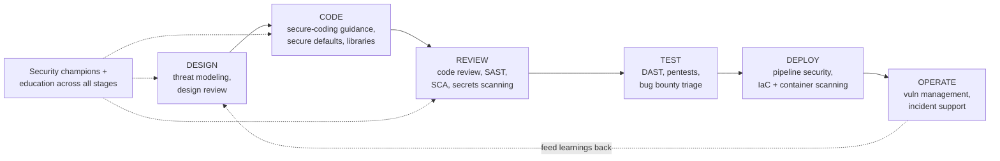
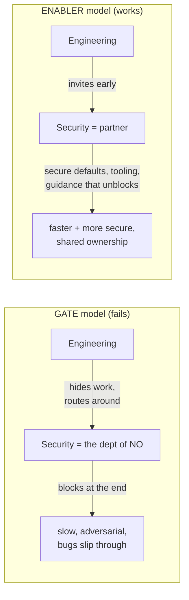
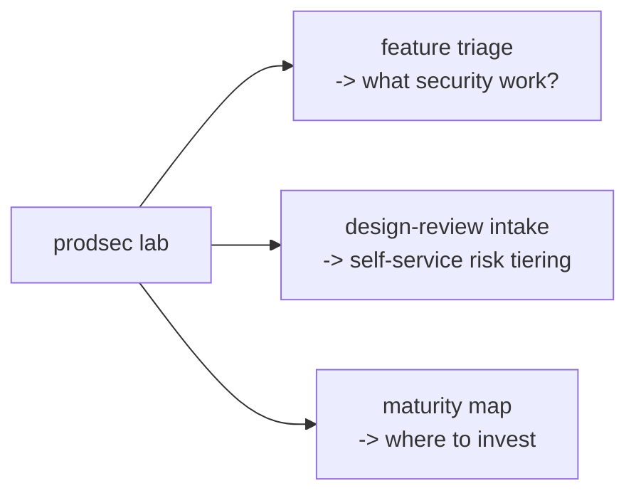

**Level:** Beginner · **Track:** Product Security · **Read time:** 215 min

The previous forty-four notebooks were organised largely around *attacking* systems and *responding* to attacks — the pentester finding the bug, the analyst catching the intrusion, the responder cleaning up. This notebook, and the two that follow it, are about a different and increasingly dominant discipline: **building security into the product before it ships**, so that fewer of those bugs exist to be found and fewer of those intrusions succeed. This is **product security** — ProdSec — and it is where a large and growing share of the industry's security work now lives, because the industry finally internalised a lesson it resisted for decades: it is dramatically cheaper, and dramatically more effective, to build software securely than to bolt security on afterward and hope the pentest catches everything.

The product security engineer is the person who makes that happen. They are not primarily the person who breaks into the finished product (that is the pentester or bug-bounty researcher of the earlier notebooks); they are the person embedded with the engineering organisation, working *alongside* the developers who build the product, ensuring that security is designed in, coded correctly, reviewed continuously, and caught early. It is a role that sits at the intersection of security expertise and software engineering, and it demands both — you cannot review a design you do not understand or advise on code you cannot read.

This chapter defines the role precisely: what a ProdSec engineer actually does day to day, how the role differs from the adjacent ones (application security, pentesting, IT security), where it sits in an organisation, the mindset that separates effective ProdSec from the failed "security police" model, and the career paths into and through it. It is the foundation for everything in this notebook (the ProdSec fundamentals — SDLC, threat modelling, secure coding), Notebook 46 (secure code review, SAST/SCA, DevSecOps), and Notebook 47 (running a ProdSec program). If the earlier curriculum taught you to think like an attacker, this notebook teaches you to use that attacker's mindset to *build* — which is, for many people, the most impactful and durable place in the whole field to stand.

## Why This Matters

The economic case is overwhelming and it is why the role exists. A vulnerability caught in design costs almost nothing to fix — you change a diagram. Caught in code review, it costs a developer an hour. Caught by a pentest before release, it costs a sprint. Caught in production after a breach, it costs an incident, a disclosure, customer trust, regulatory penalties (Notebook 42), and sometimes the company. This is the "shift-left" curve, and it is the single most important economic fact in application security: **the cost of a security defect grows by orders of magnitude the later it is caught.** Product security exists to catch defects at the cheap end of that curve, and a ProdSec engineer who moves a class of bugs from "found in production" to "prevented in design" delivers value that is genuinely hard to overstate.

The scale case is just as strong. A penetration test is a point-in-time snapshot of a finished product — valuable, but it finds bugs *after* they are built, in one product, at one moment. A ProdSec engineer who improves the *way* an engineering organisation builds software — better defaults, better libraries, better review, better tooling — prevents entire *classes* of bugs across *every* product, continuously, forever. The leverage is categorically different: the pentester finds the SQL injection; the ProdSec engineer gets the whole org onto parameterised queries so the SQL injection is never written again. That leverage is why ProdSec has become one of the most valued and fastest-growing roles in security.

And the career case is compelling for the reader of this curriculum specifically. ProdSec sits at the confluence of everything you have learned — the attacker's mindset (to know what to defend against), the vulnerability knowledge (to recognise the bugs), and software engineering (to fix them at the source). It is intellectually rich, it is in high demand, it is well compensated, and — unlike some security roles — it is fundamentally *constructive*: you spend your days making things better rather than only finding what is broken. For many people who come up through offensive security or development, ProdSec is where they find the most durable and satisfying career, and this notebook is the on-ramp.

## Part 1: From Perimeter to Product — Why the Role Exists

To understand product security, you have to understand the historical shift that created it.

For decades, security was fundamentally about the **perimeter**: firewalls, network segmentation, keeping attackers *out* of a trusted internal network where the applications lived. Security was a thing you wrapped *around* software, operated by a separate team, largely after the software was built. The application itself was treated as a black box to be protected from the outside.

Three forces broke that model:

- **The perimeter dissolved.** Cloud, mobile, APIs, SaaS, and remote work (Notebooks 37, 42) meant applications were no longer safely inside a wall — they were exposed directly to the internet, and the network perimeter no longer contained them. If the application is the front door, wrapping security around the network does little.
- **Applications became the primary attack surface.** As networks hardened, attackers moved up the stack to the applications themselves — the web apps, APIs, and software supply chains where the OWASP Top 10 lives (Notebooks 21–27). The bug is in the code now, and no firewall fixes a SQL injection.
- **The economics of late fixing became untenable.** As software grew more complex and shipped faster (continuous deployment, multiple releases a day), the old model of "build it, then pentest it before release" could not keep up — you cannot pentest your way to security when you deploy fifty times a day, and finding bugs in production is ruinously expensive.

The response was to move security *into* the product and *into* the development process — to "shift left" (Notebook 45, Chapter 2), building security in from design rather than inspecting it in at the end. That shift *is* the product security discipline, and the ProdSec engineer is the person who embeds with engineering to make it real. The role exists because the industry learned, expensively, that security wrapped around software fails, and security *built into* software succeeds.

## Part 2: What Product Security Actually Is

A precise definition, and how it differs from the adjacent disciplines it is often confused with.

**Product security** is the practice of ensuring that the software products an organisation builds are secure *by design and by construction* — that security is engineered into the product throughout its development lifecycle, from design through code through deployment and operation. The ProdSec engineer is embedded with the engineering organisation to make that happen.

How it differs from the roles it is adjacent to:

| Role | Primary focus | When | Relationship to the product |
|---|---|---|---|
| **Product security** | Building the product securely | Throughout the lifecycle | Embedded *with* the builders |
| **Application security (AppSec)** | Security of applications | Often overlapping/synonymous | Frequently the same role; AppSec sometimes narrower (testing apps) |
| **Penetration testing** | Finding bugs in a finished product | Point-in-time, after build | Adversarial, from outside |
| **IT / corporate security** | Securing the company's own IT (endpoints, network, identity) | Ongoing operations | The company's internal systems, not the product it sells |
| **Security engineering (platform)** | Building security tooling/infrastructure | Ongoing | Builds the security systems others use |

The distinctions that matter most:

**ProdSec vs AppSec** — these are often used interchangeably, and at many companies they are the same role. Where a distinction is drawn, "application security" sometimes refers more narrowly to *testing* applications (a function that overlaps pentesting), while "product security" is the broader, embedded, lifecycle-spanning discipline that includes design review, secure-coding guidance, tooling, and program-building. This notebook uses "product security" for the broad discipline and treats AppSec skills as a core part of it.

**ProdSec vs pentesting** — this is the sharpest and most important distinction, and it is the one the earlier notebooks set up. Pentesting is *finding* bugs in a finished product, from the outside, at a point in time (Notebooks 9–20). Product security is *preventing* bugs across the lifecycle, from the inside, continuously. A pentester and a ProdSec engineer need overlapping knowledge (both must understand the vulnerabilities), but they apply it in opposite directions — one to break, one to build. Many ProdSec engineers come *from* pentesting, and their attacker's knowledge is exactly what makes them effective at defence.

**ProdSec vs IT security** — a frequent confusion for outsiders. IT/corporate security protects the *company's own* systems (employee laptops, the corporate network, internal identity). Product security protects the *product the company sells* to its customers. They are different jobs with different stakeholders, and conflating them leads to badly-scoped roles.

The unifying idea: product security is the discipline of building secure *products*, embedded with the *builders*, across the *whole lifecycle* — which is what distinguishes it from every adjacent role.

## Part 3: The Core Responsibilities

What a ProdSec engineer actually does, across the development lifecycle. These map directly to the chapters of this notebook and Notebook 46.



The responsibilities, by lifecycle stage:

- **Design review and threat modelling** (Chapters 3–5): reviewing feature and architecture designs *before* they are built, to find security flaws when they are cheapest to fix. Threat modelling — systematically identifying what could go wrong — is the core ProdSec design activity.
- **Secure coding guidance and secure defaults** (Chapters 6–7): helping engineers write secure code, and — higher leverage — providing secure-by-default libraries, frameworks, and patterns so that the *easy* way to build something is also the *secure* way. The best ProdSec work makes security the path of least resistance.
- **Code review and automated analysis** (Notebook 46): reviewing code for security flaws, both manually for the hard logic bugs and via tooling (SAST, SCA, secrets scanning) for the mechanical ones, and integrating that tooling into the development pipeline.
- **Security testing and bug-bounty triage** (Notebook 46, Notebook 47): coordinating or performing security testing (DAST, pentests), and triaging externally-reported vulnerabilities (bug bounty — Notebook 47) into the engineering process.
- **Pipeline and supply-chain security** (Notebook 46): securing the build and deployment pipeline itself (CI/CD, containers, infrastructure-as-code, dependencies), because a compromised pipeline compromises everything it builds.
- **Vulnerability management** (Notebook 46): tracking known vulnerabilities to remediation with sensible prioritisation and SLAs, so that findings actually get fixed rather than accumulating.
- **Incident support** (Notebook 33): when a security incident touches the product, the ProdSec engineer supports the response with product knowledge and helps drive the fixes that prevent recurrence.
- **Security champions and education** (Notebook 47): the highest-leverage responsibility — scaling security by building a network of security-minded engineers *within* the development teams, and educating the broader engineering org, so that security is not a bottleneck of a few specialists but a shared competence.

No single ProdSec engineer does all of these equally; the mix depends on the role, the org, and the archetype (Part 6). But together they define the discipline, and the throughline is clear: **the ProdSec engineer's job is to make the product more secure at every stage of how it is built, primarily by enabling engineers rather than by inspecting their output.**

## Part 4: Security as an Enabler, Not a Gate

The single most important idea in this chapter — the one that separates effective ProdSec from the failed model — is the mental stance toward engineering.

There are two models of how a security team relates to an engineering org:

**The gate model (the failed one).** Security is a checkpoint that engineering must pass through — a review board that says no, a scan that blocks the release, a team that shows up at the end to find problems and demand fixes. In this model, security is a *tax* on velocity, an adversary to be routed around, a "department of no." The predictable result is that engineers hide work from security, treat security requirements as obstacles to minimise, and build a culture where security and engineering are opponents. This model fails, reliably, and much of the security industry's bad reputation with developers comes from it.

**The enabler model (the effective one).** Security is a *partner* that helps engineering ship secure products *faster* — by providing secure defaults that remove decisions, tooling that catches problems automatically, guidance that unblocks rather than blocks, and expertise that engineers *want* to consult because it makes their work better. In this model, security is a force multiplier for engineering velocity, not a brake on it. The best ProdSec teams are the ones engineers *invite* into their designs early because the security engineer makes the design better, not the one they avoid until forced.



The practical expressions of the enabler stance, which recur throughout this notebook:

- **Secure defaults over security requirements.** A library that is secure by default removes a decision from every engineer forever; a requirement that engineers must remember to follow is forgotten. Build the paved road (Chapter 6).
- **Automated tooling over manual gates.** A scanner in the pipeline that catches a bug and tells the engineer how to fix it is a partner; a manual review board that blocks the release is a gate. Automate the mechanical (Notebook 46).
- **Guidance that unblocks.** When security says "no," it should immediately say "here's the secure way to do what you wanted" — the answer is a path forward, not a wall.
- **Meet engineering where it is.** Integrate into the tools, workflows, and cadence engineers already use, rather than demanding they come to security's process.

The stance in one sentence, which every ProdSec engineer should internalise: **your job is to make secure the easy, fast, default path — not to stand at the end and say no.** This is the "partner, not police" principle, and it is the difference between a ProdSec team that succeeds and one that engineering learns to route around.

## Part 5: Where ProdSec Sits and Who It Works With

Product security does not operate alone; it is a connective role, and understanding its relationships is understanding the job.

Organisationally, ProdSec usually sits within a broader security organisation but works *embedded* with engineering — the defining structural feature of the role. Some companies embed ProdSec engineers directly into product teams; others run a central ProdSec team that partners with product teams; most do some blend. Wherever it reports, the ProdSec engineer's *day* is spent with engineers.

The key relationships:

- **Engineering / product teams** — the primary partner. ProdSec succeeds or fails on this relationship (Part 4). The ProdSec engineer must be someone engineers *want* to work with — technically credible, helpful, and pragmatic about trade-offs.
- **Platform / infrastructure engineering** — the builders of the paved road. ProdSec's secure defaults, libraries, and pipeline tooling are often built *with* or *by* platform teams, because that is where org-wide defaults live. This is one of the highest-leverage partnerships.
- **Detection / blue team** (Notebooks 31–33) — the operational defenders. ProdSec builds security *in*; detection catches what gets through. They inform each other: detection's incidents feed ProdSec's design improvements, and ProdSec's knowledge of the product helps detection know what to watch.
- **GRC / compliance** (Notebook 42) — governance, risk, and compliance. ProdSec's work often satisfies compliance requirements (secure SDLC, code review, vulnerability management are audited controls), and GRC's requirements shape ProdSec's priorities. A healthy relationship treats compliance as a floor that ProdSec exceeds, not a checklist that replaces real security.
- **Offensive security / pentesters** — the internal or external teams that test the product. Their findings feed ProdSec's improvements, and ProdSec's knowledge helps them test effectively. Many orgs run both, with ProdSec building and pentest validating.

The mental model: ProdSec is a *connective* discipline that sits between security and engineering and touches every other security function. Its effectiveness depends less on any single technical skill than on the ability to work across these relationships — which is why the "partner, not police" stance (Part 4) is not soft-skills fluff but the core competency of the role.

## Part 6: ProdSec Archetypes and the Skills Each Needs

"Product security engineer" spans a spectrum of archetypes, and knowing where you fit (and where a given role sits) matters for both career planning and expectation-setting.

| Archetype | Emphasis | Core skills | Comes from |
|---|---|---|---|
| **Generalist ProdSec** | Broad coverage across the lifecycle | Vulnerability breadth, communication, threat modelling, pragmatism | Anywhere; the common entry shape |
| **Code-review / AppSec specialist** | Deep on finding bugs in code | Reading code fluently, vuln patterns, SAST (Notebook 46) | Development, offensive security |
| **Design / architecture specialist** | Threat modelling, security architecture | Systems thinking, threat modelling, architecture (Chapters 3–5, Notebook 42) | Senior engineering, architecture |
| **Tooling / DevSecOps engineer** | Building security into the pipeline | Software engineering, CI/CD, automation (Notebook 46) | Platform/infrastructure engineering |
| **Program / lead ProdSec** | Running the ProdSec program | The above + strategy, metrics, influence (Notebook 47) | Senior ProdSec |

The skills that *every* archetype needs, regardless of specialism:

- **Vulnerability knowledge** — you cannot prevent, review for, or advise against bugs you do not understand. The whole offensive curriculum (Notebooks 21–36) is the substrate.
- **Software engineering literacy** — you must read code, understand architectures, and speak the engineers' language credibly. A ProdSec engineer who cannot read the code they are reviewing is not effective.
- **Communication and influence** — the "partner, not police" stance (Part 4) is executed through communication. Much of the job is persuading, teaching, and building relationships, and this is the skill that most often separates effective ProdSec engineers from technically-strong ones who cannot move an organisation.
- **Pragmatism and risk judgement** (Notebook 3) — knowing which battles to fight, which risks are worth the friction, and how to make sensible trade-offs. A ProdSec engineer who insists on perfect security everywhere is as ineffective as one who insists on nothing.

The T-shape from Notebook 44 applies directly: **broad across the lifecycle and the vulnerability landscape, deep in one or two areas** (code review, or threat modelling, or tooling). The generalist shape is the common entry point; specialisation comes with experience and interest. And crucially, the "soft" skills — communication, influence, pragmatism — are not secondary to the technical ones; in ProdSec they are *co-equal*, because the role's leverage comes from moving an engineering organisation, which is a human problem as much as a technical one.

## Part 7: A Day in the Life, and the Real Artifacts

What the job actually looks like, and what a ProdSec engineer *produces* — because the artifacts are how the role's value becomes concrete.

A representative (if idealised) day mixes:

- **Design reviews** — reading a design doc for an upcoming feature, threat-modelling it, and leaving feedback that catches security flaws before they are built (Chapters 3–5).
- **Consultations** — an engineer messages "is it safe to do X?" and the ProdSec engineer unblocks them with a secure approach. This ad-hoc advisory work is a large and valuable part of the job, and it only happens when engineers *want* to ask (Part 4).
- **Code review** — reviewing a security-sensitive pull request, or triaging a SAST finding (Notebook 46).
- **Vulnerability triage** — assessing a newly-reported bug (from a scanner, a pentest, or a bug bounty), determining severity and priority, and routing it to the right team (Notebook 46, Notebook 47).
- **Tooling and automation** — improving the security tooling in the pipeline, tuning a scanner, building a secure default (Notebook 46).
- **Education and champions** — running a training session, supporting a security champion, writing guidance (Notebook 47).

The **artifacts** a ProdSec engineer produces — the concrete outputs that make the role's value legible:

- **Threat models and design-review feedback** — the documented security analysis of a design, with identified risks and mitigations (Chapters 3–5).
- **Secure-coding guidance and paved-road libraries** — the reusable defaults and documentation that scale security across the org (Chapters 6–7).
- **Vulnerability findings and remediation guidance** — clear, actionable write-ups of security issues and how to fix them (the reporting skill of Notebook 9).
- **Security tooling and pipeline integrations** — the automated checks that catch problems continuously (Notebook 46).
- **Metrics and program artifacts** — the dashboards and processes that show the program is working and where to invest (Notebook 47).

The insight for someone entering the role: ProdSec is not glamorous bug-hunting most of the time; it is a mix of design work, advisory work, review, tooling, and teaching, producing artifacts that *enable* engineering. The engineers who thrive in it are the ones who find satisfaction in *building better systems and better teams* rather than only in finding the flashy bug — though the attacker's skill for finding flashy bugs is exactly what makes their building credible.

## Part 8: The Career Path Into and Through ProdSec

How people get into product security, and how the role progresses.

**Paths in:**

- **From software development.** A developer who becomes interested in security brings the single most valuable ProdSec asset — deep engineering literacy — and adds security knowledge on top. This is an increasingly common and highly effective path, because the hardest thing to teach a security person is how to build software, and the developer already has it. If you are a developer reading this curriculum, you are on a strong path.
- **From offensive security.** A pentester or bug-bounty researcher who moves to the building side brings deep vulnerability knowledge and the attacker's mindset, and adds the engineering and partnership skills. This is the path much of the earlier curriculum sets up, and the attacker's knowledge makes their defensive advice credible and concrete.
- **From other security roles.** SOC analysts, GRC practitioners, and security generalists move into ProdSec by deepening their engineering and vulnerability skills. The transition requires building the technical depth the role demands.
- **Directly, from a strong foundation.** A new practitioner with the vulnerability knowledge (this curriculum), engineering literacy, and a portfolio (Notebook 44, Chapter 3) can enter ProdSec directly, often at a junior level, and grow.

**The path through** (mapping to Notebook 44, Chapter 9's stages):

- **Junior/mid ProdSec engineer** — doing the work: reviews, consultations, triage, under guidance.
- **Senior ProdSec engineer** — owning hard problems: leading threat models for major systems, setting technical direction, being the go-to for the toughest questions, building the paved road.
- **Staff/principal ProdSec** — org-wide impact: shaping the security architecture of the whole product, driving the program's technical strategy, multiplying other engineers.
- **ProdSec lead / manager** — running the program (Notebook 47): strategy, metrics, team-building, influence at the leadership level. The shift from *doing* to *enabling others* (Notebook 44, Chapter 9).

The through-line: ProdSec is a rich, durable career with a clear progression, entered from several directions, and increasingly one of the most valued and well-compensated tracks in security — precisely because it combines the two scarce skill sets (security expertise and software engineering) and delivers the high-leverage value of preventing bugs at scale rather than finding them one at a time. For the reader who has come through this curriculum, it is one of the most promising destinations it points to.

## Part 9: Success Metrics and the Trap of Security Theater

How the role's success is measured — and the trap that catches immature ProdSec programs.

Good ProdSec metrics measure *outcomes and enablement*, not activity:

- **Vulnerabilities prevented / shifted left** — the share of issues caught in design and code review versus in production; the trend of a given bug class *decreasing* as secure defaults roll out. This is the core value (Part 4) and the hardest to measure directly, but the most important.
- **Time to remediate** — how fast known vulnerabilities get fixed, and whether SLAs are met (Notebook 46). A program that finds bugs but does not get them fixed is failing.
- **Coverage** — the share of designs threat-modelled, the share of code covered by scanning, the share of teams with a security champion (Notebook 47).
- **Engineering satisfaction and engagement** — do engineers *invite* security in early? Do they consult ProdSec voluntarily? This is the truest measure of the "partner, not police" stance succeeding, and a program that engineering routes around is failing regardless of its other numbers.

The trap is **security theater** — activity that *looks* like security but does not reduce risk:

- Metrics that count *activity* (scans run, reviews performed, tickets filed) without measuring *outcomes* (bugs prevented, risk reduced). A dashboard of green that nobody's security actually improved.
- Gates that block releases without catching real problems — friction without value, which trains engineering to route around security (Part 4).
- Compliance checkboxes ticked without the underlying security being real (Notebook 42's warning about compliance ≠ security).
- Tools bought and deployed but not tuned, so they produce noise that everyone ignores.

The discipline against theater is to always ask: **does this actually reduce risk, and can I show it?** A ProdSec program earns its place by demonstrably making the product more secure and engineering more capable — not by generating activity that resembles security. The metrics that matter are the ones that connect to real risk reduction and real engineering enablement, and the mature ProdSec engineer is ruthless about distinguishing those from theater.

## Part 10: Hands-On Lab — Triage a Feature, Draft an Intake, and Map Maturity

### 10.1 What we are building

Three ProdSec artifacts, produced with code: a **feature-request triage** that decides what security work a feature needs (Part 3), a **design-review intake** that scales that triage without a human bottleneck (Part 4's enabler stance), and a **ProdSec maturity map** for a team (Parts 8–9). These are the real, unglamorous artifacts of the role (Part 7).



Python 3 only.

### 10.2 Triage a feature request into security work

```python
# triage.py -- decide what ProdSec work a feature needs (Part 3), by risk signals.
# The enabler stance (Part 4): most features need little; focus effort on the risky ones.
def triage(feature):
    signals = []
    f = feature
    # Risk signals that pull a feature toward more security involvement.
    if f.get("handles_pii") or f.get("handles_payments"):
        signals.append(("sensitive data", "threat model + design review"))
    if f.get("new_authn") or f.get("new_authz"):
        signals.append(("auth changes", "design review (auth is high-risk)"))
    if f.get("external_input"):
        signals.append(("untrusted input", "secure-coding guidance + SAST focus"))
    if f.get("new_dependency"):
        signals.append(("new dependency", "SCA review (supply chain)"))
    if f.get("new_service") or f.get("crosses_trust_boundary"):
        signals.append(("trust boundary", "threat model"))
    if f.get("crypto"):
        signals.append(("cryptography", "design review (crypto is easy to misuse)"))

    # Risk tier from the count/severity of signals.
    n = len(signals)
    tier = "HIGH" if n >= 3 or f.get("handles_payments") else \
           "MEDIUM" if n >= 1 else "LOW"
    return tier, signals

FEATURES = [
    {"name": "add dark-mode toggle"},                                   # cosmetic
    {"name": "user profile photo upload", "external_input": True,
     "handles_pii": True},                                              # medium
    {"name": "new payments checkout flow", "handles_payments": True,
     "external_input": True, "new_dependency": True, "crypto": True},   # high
]

for f in FEATURES:
    tier, signals = triage(f)
    print(f"[{tier:6}] {f['name']}")
    for label, work in signals:
        print(f"         - {label}: {work}")
    if not signals:
        print("         - no security-sensitive signals -> self-service checklist only")
    print()
```

```bash
python3 triage.py

# Sample output:
# [LOW   ] add dark-mode toggle
#          - no security-sensitive signals -> self-service checklist only
#
# [MEDIUM] user profile photo upload
#          - sensitive data: threat model + design review
#          - untrusted input: secure-coding guidance + SAST focus
#
# [HIGH  ] new payments checkout flow
#          - sensitive data: threat model + design review
#          - untrusted input: secure-coding guidance + SAST focus
#          - new dependency: SCA review (supply chain)
#          - cryptography: design review (crypto is easy to misuse)
```

This is the enabler stance made concrete (Part 4): the dark-mode toggle gets a self-service checklist and *none* of ProdSec's scarce time, while the payments flow gets full involvement. A ProdSec team that treated every feature the same would either drown or become the bottleneck engineering routes around.

### 10.3 A self-service design-review intake

```python
# intake.py -- a self-service risk-tiering intake so ProdSec scales (Part 4).
# Engineers answer a few questions; the intake routes only the risky ones to a human.
QUESTIONS = [
    ("handles_pii",           "Does this handle personal/user data?"),
    ("handles_payments",      "Does this touch payments or financial data?"),
    ("new_authn_authz",       "Does this change authentication or authorization?"),
    ("external_input",        "Does this accept input from untrusted sources?"),
    ("crosses_trust_boundary","Does this create a new service or trust boundary?"),
    ("uses_crypto",           "Does this use cryptography?"),
]

def route(answers):
    yes = [k for k, _ in QUESTIONS if answers.get(k)]
    if answers.get("handles_payments") or len(yes) >= 3:
        return "HIGH", "full threat model + ProdSec design review (a human will reach out)"
    if yes:
        return "MEDIUM", "lightweight review: fill the secure-design checklist; ProdSec spot-checks"
    return "LOW", "self-service: follow the paved-road guide, no ProdSec review needed"

# A submitted intake for the profile-photo feature.
submitted = {"handles_pii": True, "external_input": True}
tier, action = route(submitted)
print("=== design-review intake result ===")
for k, q in QUESTIONS:
    print(f"  [{'x' if submitted.get(k) else ' '}] {q}")
print(f"\nrisk tier: {tier}")
print(f"action:    {action}")
```

```bash
python3 intake.py

# Sample output:
# === design-review intake result ===
#   [x] Does this handle personal/user data?
#   [ ] Does this touch payments or financial data?
#   [ ] Does this change authentication or authorization?
#   [x] Does this accept input from untrusted sources?
#   [ ] Does this create a new service or trust boundary?
#   [ ] Does this use cryptography?
#
# risk tier: MEDIUM
# action:    lightweight review: fill the secure-design checklist; ProdSec spot-checks
```

The intake is the enabler stance as *infrastructure*: engineers self-serve the low-risk majority, ProdSec's human attention goes only where the risk is, and nobody has to wait in a queue for a review they did not need. This is how a small ProdSec team covers a large engineering org (Notebook 47).

### 10.4 Map a team's ProdSec maturity

```python
# maturity.py -- map a team's ProdSec maturity to find where to invest (Parts 8-9).
# Practices scored 0-3: 0 none, 1 ad-hoc, 2 defined, 3 optimized.
TEAM = {
    "threat modeling":        1,   # ad-hoc, only when someone remembers
    "secure defaults/paved road": 1,
    "code review for security": 2,
    "SAST in pipeline":       2,
    "SCA / dependency scanning": 1,
    "secrets scanning":       0,   # not done at all -> easy high-value win
    "security champions":     0,
    "vuln management + SLAs": 1,
}

def report():
    print(f"{'PRACTICE':<28} {'LEVEL':>5}  MATURITY")
    print("-" * 56)
    labels = {0:"none",1:"ad-hoc",2:"defined",3:"optimized"}
    gaps = []
    for practice, lvl in TEAM.items():
        bar = "#" * lvl + "." * (3 - lvl)
        print(f"{practice:<28} {lvl:>5}  [{bar}] {labels[lvl]}")
        gaps.append((lvl, practice))
    avg = sum(TEAM.values()) / len(TEAM)
    print("-" * 56)
    print(f"overall maturity: {avg:.1f}/3")
    print("\nhighest-value next investments (lowest maturity first):")
    for lvl, practice in sorted(gaps)[:3]:
        print(f"  - {practice} (currently {labels[lvl]})")

report()
```

```bash
python3 maturity.py

# Sample output:
# PRACTICE                     LEVEL  MATURITY
# --------------------------------------------------------
# threat modeling                  1  [#..] ad-hoc
# secure defaults/paved road       1  [#..] ad-hoc
# code review for security         2  [##.] defined
# SAST in pipeline                 2  [##.] defined
# SCA / dependency scanning        1  [#..] ad-hoc
# secrets scanning                 0  [...] none
# security champions               0  [...] none
# vuln management + SLAs           1  [#..] ad-hoc
# --------------------------------------------------------
# overall maturity: 1.0/3
# highest-value next investments (lowest maturity first):
#   - secrets scanning (currently none)
#   - security champions (currently none)
#   - secrets scanning ...
```

The maturity map turns "we should do more security" into a ranked investment plan (Parts 8–9): this team's biggest gaps are secrets scanning (a cheap, high-value automated win — Notebook 46) and security champions (the scaling multiplier — Notebook 47), so those are where the next quarter's effort goes. This is exactly the program-level thinking Notebook 47 develops.

### 10.5 Extending the lab

Turn `intake.py` into a real form that files a ticket and auto-assigns the risk tier; expand `triage.py` with the STRIDE categories from Chapter 3 so it suggests *specific* threats per signal; build a maturity map for a team you actually know and use it to draft a one-page investment plan; add a "metrics" script that tracks the enabler signal (how often engineers consult ProdSec voluntarily) alongside the activity metrics, to guard against security theater (Part 9); and write a one-paragraph "ProdSec charter" for a fictional team that states the partner-not-police stance explicitly.

## Part 11: Common Pitfalls

**Confusing ProdSec with pentesting.** ProdSec *prevents* bugs across the lifecycle from the inside; pentesting *finds* bugs in a finished product from the outside. They share knowledge but apply it in opposite directions.

**Confusing ProdSec with IT security.** ProdSec secures the *product you sell*; IT security secures the *company's own systems*. Different jobs, different stakeholders.

**The gate mindset.** Being the "department of no" that engineering routes around. The enabler stance — secure defaults, tooling, guidance that unblocks — is the only one that works.

**Treating every feature the same.** A ProdSec team that fully reviews the dark-mode toggle and the payments flow equally either drowns or becomes the bottleneck. Triage by risk; put scarce human attention where the risk is.

**Neglecting the soft skills.** Communication, influence, and pragmatism are *co-equal* with technical skill in ProdSec, because the leverage comes from moving an engineering org — a human problem. A technically brilliant ProdSec engineer who cannot partner is ineffective.

**Being unable to read the code.** A ProdSec engineer who cannot read the code they review or understand the designs they assess lacks credibility with engineers and cannot do the core work. Engineering literacy is non-negotiable.

**Security theater.** Activity that looks like security (scans run, gates in place, checkboxes ticked) without reducing real risk. Always ask: does this actually reduce risk, and can I show it?

**Insisting on perfect security.** A ProdSec engineer who demands perfection everywhere creates friction that engineering routes around and burns the credibility needed for the battles that matter. Pragmatism and risk judgement are the skill.

**Measuring activity, not outcomes.** A dashboard of scans-run and reviews-done that does not connect to bugs-prevented and risk-reduced is theater with a chart. Measure enablement and outcomes.

**Forgetting that engineering satisfaction is a security metric.** If engineers avoid security, the program is failing regardless of its other numbers — because the value comes from being invited in early, which only happens when security is a partner.

## Final Revision / Summary

- **Product security** is building security *into* the product **by design and construction, across the whole lifecycle**, with the ProdSec engineer **embedded with the engineering org**. It exists because the perimeter dissolved, applications became the primary attack surface, and late fixing became economically untenable — the industry learned that security *wrapped around* software fails and security *built into* it succeeds.
- The **economic case is the shift-left curve**: a defect's cost grows by orders of magnitude the later it is caught (design → code → test → production). ProdSec catches defects at the cheap end. The **scale case**: improving *how* an org builds software prevents entire *classes* of bugs across *every* product continuously — categorically more leverage than finding bugs one at a time.
- ProdSec differs from adjacent roles: vs **pentesting** (prevents from inside across the lifecycle, not finds from outside at a point in time — the sharpest distinction), vs **AppSec** (often synonymous; AppSec sometimes narrower), vs **IT security** (secures the *product sold*, not the *company's own systems*).
- **Core responsibilities** span the lifecycle: design review + threat modelling, secure-coding guidance + **secure defaults**, code review + automated analysis, testing + bug-bounty triage, pipeline/supply-chain security, vulnerability management, incident support, and **security champions + education** (the highest-leverage). These map to this notebook and Notebooks 46–47.
- The defining stance is **security as an enabler, not a gate**: the "department of no" gate model fails (engineering routes around it); the partner model — **secure defaults over requirements, automated tooling over manual gates, guidance that unblocks, meet engineering where it is** — succeeds. *Make secure the easy, fast, default path.*
- ProdSec is a **connective role**: embedded with engineering (the make-or-break relationship), partnered with platform (the paved road), informed by detection and offensive security, and aligned with GRC (compliance as a floor to exceed). Its effectiveness rests on working across these relationships.
- **Archetypes** span generalist, code-review specialist, design/architecture specialist, tooling/DevSecOps engineer, and program lead — but every one needs **vulnerability knowledge, engineering literacy, communication/influence, and pragmatism**. The T-shape applies; the "soft" skills are **co-equal** with the technical, because the leverage is moving an organisation.
- The **day** mixes design reviews, ad-hoc consultations (which only happen when engineers *want* to ask), code review, triage, tooling, and teaching; the **artifacts** are threat models, paved-road libraries, clear findings, pipeline tooling, and program metrics. ProdSec is building better systems and teams, not mostly flashy bug-hunting.
- **Paths in**: from development (best engineering literacy), from offensive security (best vuln knowledge — the earlier curriculum's path), from other security roles, or directly from a strong foundation + portfolio. **Path through**: junior → senior → staff/principal → lead, shifting from *doing* to *enabling others*. It is a rich, well-compensated, high-leverage career.
- **Measure outcomes, not activity**: bugs prevented/shifted-left, time-to-remediate, coverage, and **engineering satisfaction** (do they invite security in early?). Beware **security theater** — activity that looks like security without reducing real risk. Always ask: does this actually reduce risk, and can I show it?

## Cheat Sheet / Quick Reference

**What ProdSec is (and isn't)**

```
ProdSec  = build security INTO the product, across the lifecycle, embedded with eng
vs pentest: prevent from inside (not find from outside at a point in time)
vs AppSec : often synonymous (AppSec sometimes = testing apps, narrower)
vs IT sec : secures the PRODUCT SOLD (not the company's own systems)
```

**The shift-left economics**

```
cost to fix: design ~0 < code (1 hr) < test (a sprint) << production (an incident)
-> ProdSec catches defects at the CHEAP end, and prevents whole CLASSES at scale
```

**Responsibilities across the lifecycle**

```
DESIGN: threat model + design review    CODE: secure defaults + guidance
REVIEW: code review + SAST/SCA/secrets  TEST: DAST + pentest + bug-bounty triage
DEPLOY: pipeline + IaC/container scan    OPERATE: vuln mgmt + incident support
ACROSS: security champions + education (highest leverage)
```

**Enabler, not gate (the core stance)**

```
GATE (fails):    dept of NO -> engineering hides work + routes around
ENABLER (works): secure defaults > requirements | automated tooling > manual gates
                 guidance that UNBLOCKS | meet engineering where it is
-> make secure the EASY, FAST, DEFAULT path
```

**Skills every archetype needs**

```
vulnerability knowledge | engineering literacy (read the code!)
communication + influence | pragmatism + risk judgment
soft skills are CO-EQUAL (leverage = moving an org)
```

**Success metrics (outcomes, not activity)**

```
bugs prevented / shifted-left | time-to-remediate + SLAs | coverage
engineering satisfaction (do they invite you in EARLY?)
beware SECURITY THEATER: always ask "does this reduce risk, and can I show it?"
```

**Paths in**

```
from dev (best eng literacy) | from offsec (best vuln knowledge)
from other security | directly (vuln knowledge + eng literacy + portfolio)
progression: junior -> senior -> staff/principal -> lead (doing -> enabling)
```

## Practice Labs & Resources

**Understand the role**
- Read real ProdSec / AppSec job descriptions from several companies and map their responsibilities to Part 3's lifecycle — notice how the archetypes (Part 6) show up as different emphases.
- Read a mature engineering org's public security engineering blog (many large tech companies publish these) to see the enabler stance and paved-road thinking in practice.

**Hands-on**
- Extend the Part 10 lab: a real intake form that files and routes tickets, a STRIDE-aware triage, a maturity map for a team you know with a one-page investment plan, and an enabler-signal metric to guard against theater.
- Write a one-page "ProdSec charter" that states the partner-not-police stance and the risk-based triage explicitly.

**Build the foundation**
- The rest of this notebook (SDLC, threat modelling, secure coding) and Notebooks 46 (code review, SAST/SCA, DevSecOps) and 47 (running a program) build the full ProdSec skill set — work them in order.
- Ground yourself in the vulnerability knowledge (Notebooks 21–27 for AppSec, 23/45's CWE work) that ProdSec applies defensively.

**Deliberate practice**
- Take a feature you have built or seen and triage it (Part 10), then write the threat model (Chapter 3) — practising the design-stage work that is ProdSec's highest-value activity.
- Practise the enabler framing: for a security "no" you have encountered, rewrite it as "here's the secure way to do what you wanted."

**Further reading**
- OWASP SAMM (Software Assurance Maturity Model) and BSIMM — the industry frameworks for what a mature ProdSec program looks like (Part 9, Notebook 47).
- Notebook 42 (GRC & architecture) — the governance and zero-trust context ProdSec operates within; Notebook 44, Chapter 9 — the career-stage arc; Notebook 3 — the risk judgement ProdSec depends on.
- Chapter 2 (Secure SDLC) next — how security integrates into the development lifecycle that ProdSec is embedded in.

---

*Also on [Praneeth's portfolio](https://ping-praneeth.vercel.app/notebook/product-security-foundations/01-the-product-security-engineer-role-scope-responsibilities-and-career-path), with comments and the latest edits.*
