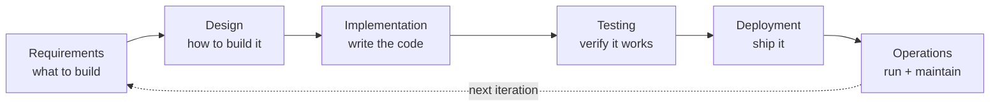
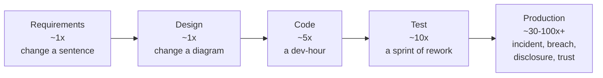
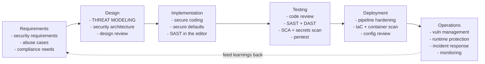
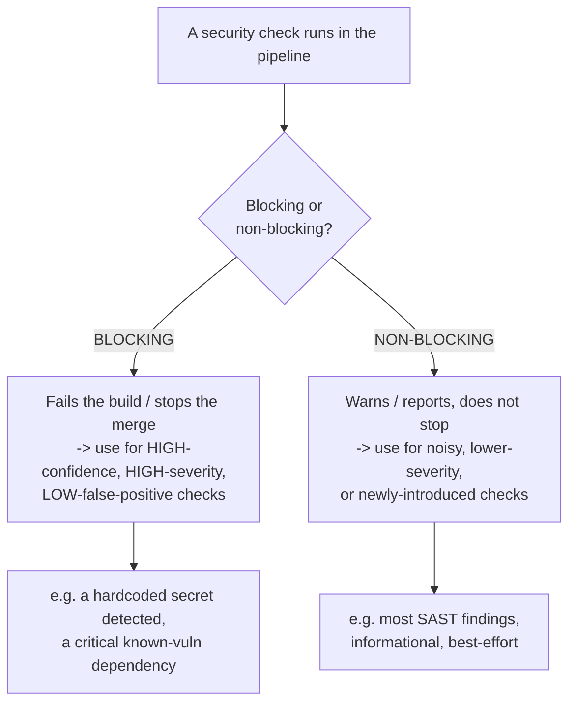
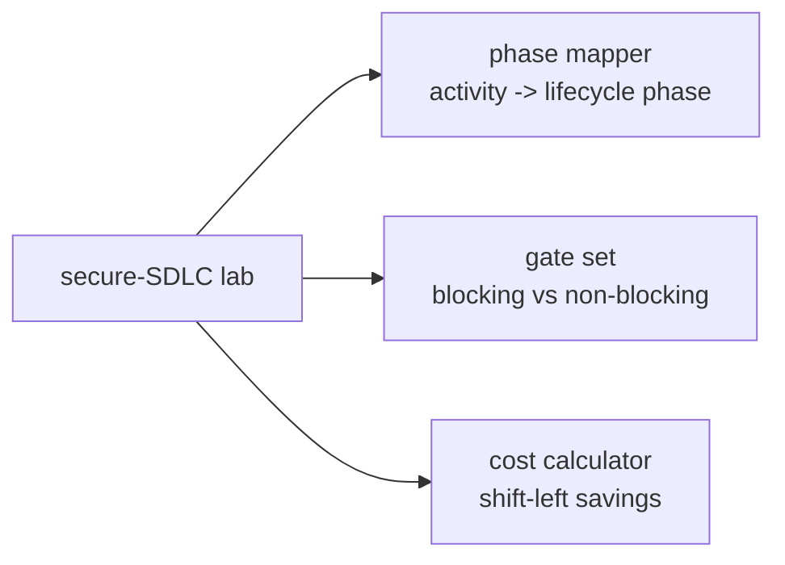

**Level:** Beginner · **Track:** Product Security · **Read time:** 215 min

Chapter 1 established *what* a product security engineer does and the enabler stance that makes them effective. This chapter is about the *structure* that stance operates within: the software development lifecycle, and how security integrates into every phase of it. If ProdSec is about building security in rather than bolting it on, the secure SDLC is the concrete answer to the question "built in *where*, exactly?" — a mapping of specific security activities onto the specific phases of how software actually gets made.

The central concept is **shift-left**: moving security activities *earlier* in the development lifecycle, toward the left of the timeline that runs from design to production. The name has become a slogan, and like most slogans it is half-understood and often misapplied. This chapter treats it precisely — why shifting left is economically compelling (the cost-of-fixing curve), what security activity actually belongs at each phase, and — crucially — how to do it *without* the two failure modes that plague immature programs: turning security into a release-blocking bottleneck that engineering routes around (the gate problem from Chapter 1), and "shifting left" as a way to dump security work onto developers without giving them the tools to do it (blame-shifting rather than enablement).

The chapter also covers the frameworks that codify the secure SDLC (Microsoft SDL, NIST SSDF, OWASP SAMM, BSIMM) — not as bureaucracy to memorise but as maps you can use to see what a mature program looks like and where yours has gaps — and the practical realities of integrating security into modern agile and DevOps workflows where "the lifecycle" is a continuous loop deploying many times a day rather than a linear march to a release. It is the structural backbone for the specific activities the rest of this notebook and Notebook 46 detail: threat modelling (Chapters 3–5), secure coding (Chapters 6–7), and the automated tooling of DevSecOps (Notebook 46).

## Why This Matters

The secure SDLC is where the abstract goal of "building security in" becomes a concrete, repeatable process — and without that structure, security is a matter of individual heroics that does not scale. A ProdSec engineer who understands the lifecycle can place the right activity at the right phase, so that threat modelling happens when the design is still malleable, code review happens when the code is fresh, and dependency scanning happens continuously in the pipeline. A ProdSec engineer who does *not* understand it ends up doing everything at the end — the expensive, ineffective place — which is exactly the model shift-left exists to replace.

The economic argument is the same cost-of-fixing curve from Chapter 1, and it is worth internalising deeply because it justifies every structural decision in this chapter: a defect caught in design is nearly free, and the cost grows by roughly an order of magnitude at each subsequent phase, reaching its maximum (an incident, a breach, a disclosure) in production. The secure SDLC is, fundamentally, a machine for catching defects as far left on that curve as possible — and understanding the curve is what lets a ProdSec engineer make the case for investing in early-phase activities that busy organisations are tempted to skip.

But the deeper reason this matters is that **getting the structure wrong actively harms both security and engineering.** A secure SDLC implemented as a series of heavy release-blocking gates does not just fail to improve security — it *degrades* it, because engineering learns to route around the friction, hides work from security, and treats the whole apparatus as a compliance obstacle rather than a genuine improvement (Chapter 1's gate model). The difference between a secure SDLC that works and one that backfires is almost entirely in *how* the activities and gates are integrated — the tuning, the blocking-vs-non-blocking choices, the paved road, the respect for engineering's workflow. This chapter is as much about that "how" as about the "what," because the how is where secure SDLCs succeed or fail.

## Part 1: The SDLC and Its Models

Before securing the lifecycle, understand the lifecycle. The **software development lifecycle (SDLC)** is the process by which software is designed, built, tested, deployed, and maintained. Its phases — in some form, under some names — are universal:



The *phases* are stable; the *model* — how you move through them — has evolved dramatically, and the model shapes how security must integrate:

- **Waterfall** — a linear, sequential march through the phases, each completed before the next begins, with a single release at the end. Security historically bolted on near the end (a pre-release pentest). Slow, and the late security check is the expensive one.
- **Agile** — iterative development in short sprints, delivering working increments continuously rather than one big release. Security must integrate *per sprint*, not once at the end — which changes everything about how the secure SDLC works.
- **DevOps and continuous deployment** — development and operations merged, with automated pipelines deploying changes many times a day. "The release" is no longer an event; it is a continuous flow. Security must be *automated into the pipeline* because there is no longer a manual gate to insert a human review into (this is the DevSecOps of Notebook 46).

The trajectory is from *slow and linear* to *fast and continuous*, and each step made the old "security at the end" model less viable. You cannot pentest your way to security when you deploy fifty times a day; the security *has* to be built into the process itself. This trajectory is precisely why the secure SDLC and shift-left became necessary — the speed of modern development broke the old model and forced security to move left and to automate.

## Part 2: The Cost-of-Fixing Curve

The economic foundation of everything in this chapter. The cost to fix a defect grows dramatically the later in the lifecycle it is caught.



The exact multipliers are debated and vary by study and context, but the *shape* is robust and universally observed: **a defect's remediation cost grows by roughly an order of magnitude at each phase it survives.** A security requirement clarified in the requirements phase costs a conversation. A design flaw caught in threat modelling costs a diagram change. A vulnerability caught in code review costs a developer an hour. Caught in testing, it costs a rework cycle. Caught *in production after exploitation*, it costs an incident response, a patch under pressure, customer notification, possible regulatory penalties (Notebook 42), reputational damage, and lost trust — orders of magnitude more than the design-phase fix, and sometimes existential.

Two consequences drive the whole secure SDLC:

**Catch defects as far left as possible.** Every phase you move a defect's discovery earlier saves roughly a factor of ten. This is the entire economic justification for shift-left, and it is why design-phase activities (threat modelling) have such outsized value despite feeling "slower" than just building and testing.

**The most expensive defects are the *design* flaws that survive to production.** A design flaw — a missing trust boundary, a fundamentally insecure architecture — is both the most expensive to fix late (it may require re-architecting) and the least likely to be caught by late-stage testing (a pentest finds implementation bugs more readily than design flaws). This is why design-phase security (threat modelling, Chapters 3–5) is disproportionately valuable: it catches the class of defect that is simultaneously the most expensive and the hardest to catch any other way.

The curve is the ProdSec engineer's most important economic argument, and it justifies investing in the early-phase activities that busy organisations are perpetually tempted to skip in favour of "just ship it and pentest later."

## Part 3: The Secure SDLC — Activities Mapped to Phases

The secure SDLC is the SDLC with a specific set of security activities integrated into each phase. This is the core map of the chapter — what security work belongs *where*.



The activities, by phase:

- **Requirements** — **security requirements** (explicit, testable security expectations: "all PII encrypted at rest," "authentication required for X"), **abuse cases** (how might this be misused? — the attacker's-eye complement to use cases), and **compliance requirements** (what regulations apply — Notebook 42). Getting security into requirements means it is scoped and budgeted from the start rather than fought for later.
- **Design** — **threat modelling** (the core ProdSec design activity, Chapters 3–5: systematically finding what could go wrong), **security architecture** (applying the principles of Notebook 42 — trust boundaries, least privilege, defence in depth), and **design review**. This is the highest-value phase (Part 2's argument).
- **Implementation** — **secure coding** (Chapters 6–7: writing code that avoids the vulnerability patterns), **secure defaults and paved-road libraries** (Chapter 1's leverage), and **SAST in the editor** (catching bugs as they are typed — the leftmost possible tooling).
- **Testing** — **code review** (manual, for logic bugs — Notebook 46), **SAST** (static analysis for mechanical bugs), **DAST** (dynamic testing of the running app), **SCA** (dependency scanning — Notebook 46), **secrets scanning**, and **penetration testing** (the point-in-time deep test).
- **Deployment** — **pipeline hardening** (securing CI/CD itself — Notebook 46), **infrastructure-as-code and container scanning** (Notebook 46, Notebook 37), and **configuration review** (secure deployment config).
- **Operations** — **vulnerability management** (tracking and remediating known issues — Notebook 46), **runtime protection** and **monitoring** (detection — Notebooks 31–33), and **incident response** (Notebook 33) when something gets through.

The feedback loop matters: operations learnings (incidents, discovered vulnerabilities) feed back into requirements and design, so the SDLC improves over iterations. A secure SDLC is not a one-way pipeline; it is a *loop* that gets more secure each cycle as its learnings propagate back to the front.

The insight for a ProdSec engineer: **your job is to ensure the right activity happens at the right phase**, weighted toward the left where the leverage is. Much of the rest of this notebook and Notebook 46 is the detailed treatment of these activities; this map is how they fit together into a coherent lifecycle.

## Part 4: The Frameworks — SDL, SSDF, SAMM, BSIMM

The industry has codified the secure SDLC into several frameworks. You do not need to memorise them, but you should know what each is *for*, because they are the maps that let you assess a program and find its gaps.

| Framework | Origin | What it is | Best used for |
|---|---|---|---|
| **Microsoft SDL** | Microsoft | The original prescriptive secure-development process (practices per phase) | A concrete, prescriptive starting template for activities |
| **NIST SSDF** (SP 800-218) | NIST | Secure Software Development Framework — outcome-focused practices | Government/compliance alignment; a common-language baseline |
| **OWASP SAMM** | OWASP | Software Assurance Maturity Model — assess and improve maturity across business functions | **Assessing your program's maturity** and planning improvement |
| **BSIMM** | Synopsys/community | Building Security In Maturity Model — a descriptive study of what real firms actually do | **Benchmarking** against what mature orgs actually do (descriptive, not prescriptive) |

How to actually use them, which is the point:

- **Microsoft SDL** is the most *prescriptive* — it tells you concrete practices to do at each phase. Use it as a starting template when building a program from scratch and you want a concrete list.
- **NIST SSDF** is *outcome-focused* and increasingly the compliance lingua franca (US government software must align to it). Use it when you need a recognised baseline and compliance alignment (Notebook 42).
- **OWASP SAMM** is a *maturity model* — it lets you honestly assess where your program sits across business functions (governance, design, implementation, verification, operations) and plan incremental improvement. This is the most useful framework for the *program-building* of Notebook 47, and it powers the maturity-mapping from Chapter 1's lab.
- **BSIMM** is *descriptive* — it observes what a large set of real organisations actually do and lets you benchmark against them ("firms like ours do X"). Use it to see what "normal" looks like and to justify investment ("mature peers do this; we don't").

The key distinction is **prescriptive (SDL, SSDF: do these things) vs maturity/descriptive (SAMM, BSIMM: assess and benchmark)**. A ProdSec engineer uses the prescriptive ones to know what activities to run and the maturity/descriptive ones to assess where the program is and where to invest next. The frameworks are tools, not religion — use them to structure thinking and find gaps, not as checklists to satisfy for their own sake (which is the security-theater trap from Chapter 1).

## Part 5: Shift-Left Done Right — and Its Failure Modes

**Shift-left** means moving security activities earlier in the lifecycle, toward the cheap end of the cost curve. Done right, it is the single most impactful structural idea in application security. Done wrong, it is a slogan that harms both security and engineering. The difference is everything.

**Shift-left done right:**

- **Move the *activity* left, and provide the *tools* to do it there.** Threat modelling in design, SAST in the editor, dependency checks at commit time — each activity moved to where the defect is cheapest to catch, *and* supported with tooling and guidance so it can actually be done there. Shifting left is an *enablement* act.
- **Automate what can be automated.** The mechanical checks (SAST, SCA, secrets scanning) belong in the pipeline where they run continuously and give engineers fast feedback (Notebook 46). Automation is how you shift left without adding human bottlenecks.
- **Make the secure path the default path** (Chapter 1). The furthest-left possible intervention is preventing the class of bug entirely with secure defaults, so the engineer never has to remember the security requirement.

**The two failure modes to avoid:**

**Shift-left as blame-shifting.** The pathological version: "shift left" becomes an excuse to dump security responsibility onto developers — "security is everyone's job now" — *without* giving them the tools, training, time, or secure defaults to actually do it. This is not enablement; it is abandonment with a slogan, and it fails because developers are not security experts and cannot be expected to become them by decree. Shifting left *responsibility* without shifting left *support* is the most common way shift-left backfires. The ProdSec engineer's job is to shift the *activity* left while shifting the *support* left with it — the tooling, the paved road, the guidance, the training (Chapters 6–7, Notebook 47).

**Shift-left as friction.** The other failure: piling security tools and gates onto developers so aggressively that the leftward tooling becomes a wall of noise and blocking checks that grinds development to a halt (Chapter 1's gate model, applied to the pipeline). A SAST tool that floods every commit with false positives, or a gate that blocks every merge on a low-severity finding, does not shift security left — it teaches engineering to hate and route around security. Tuning and sensible gating (Part 6) are what prevent this.

**Shift-right complements, not replaces.** A note that is increasingly important: shifting left does not mean abandoning *runtime* security. **Shift-right** — runtime protection, monitoring, detection, and response in production (Notebooks 31–33) — is the necessary complement, because no amount of left-shifting catches everything, and production is where real attacks happen. The mature model is "shift left to prevent, shift right to catch what gets through" — both, not either. Defense in depth (Notebook 42) applies to the lifecycle itself.

The synthesis: shift-left is powerful *when it is enablement* — moving the activity and the support left together, automating the mechanical, defaulting to secure — and harmful *when it is blame-shifting or friction*. The ProdSec engineer's craft is doing the former and avoiding the latter, which is mostly a matter of the tooling and gate design in Part 6.

## Part 6: Security Gates — Blocking vs Non-Blocking

A **security gate** is a checkpoint in the development pipeline where a security check runs and its result affects whether the work proceeds. Gates are how security integrates into an automated pipeline (DevOps), and the single most important decision about any gate is whether it **blocks** or **not** — because that decision determines whether the gate helps or becomes the bottleneck engineering routes around.



The distinction and how to choose:

**Blocking gates** stop the pipeline — the build fails, the merge is blocked — until the issue is resolved. They are powerful and dangerous: powerful because they *guarantee* the issue is addressed, dangerous because a blocking gate that fires on noise or low-severity findings halts development and destroys the engineering relationship. **Use blocking gates only for high-confidence, high-severity, low-false-positive checks** — a hardcoded secret detected (Notebook 46), a critical known-exploitable vulnerability in a dependency, a check that is genuinely a "must never ship this." The bar for making a gate blocking is high, and it should be.

**Non-blocking gates** run the check, report the result, and let the work proceed. They inform without halting — a warning, a comment on the pull request, a dashboard entry. **Use non-blocking gates for everything else** — most SAST findings (which have false positives), lower-severity issues, and any check you are still tuning. Non-blocking gates provide visibility and feedback without the friction that makes engineering hate security.

The principles for gate design that keep the pipeline healthy:

- **Start non-blocking, earn the right to block.** A new check goes in non-blocking, you tune it until its false-positive rate is low and its findings are genuinely important, and *only then* — if it warrants it — do you make it blocking. Making a noisy new check blocking on day one is the fastest way to burn the engineering relationship.
- **Tune ruthlessly.** A gate that produces noise trains everyone to ignore it (and to route around security). The false-positive rate of a blocking gate must be near zero, or it is worse than no gate. Tuning is not optional maintenance; it is the core discipline of running gates (Notebook 46 details this for each tool).
- **Provide the fix, not just the failure.** When a gate blocks, it must tell the engineer *how to fix it* — the secure alternative, the specific line, the remediation (Chapter 1's "guidance that unblocks"). A gate that says "blocked: security violation" with no path forward is friction; a gate that says "blocked: hardcoded AWS key on line 42, move it to the secrets manager, here's how" is help.
- **Fail sensibly.** Decide what happens when the *tool itself* fails (times out, errors) — a gate that blocks the pipeline every time the scanner has a bad day teaches everyone to distrust it. Often the right answer is to fail open (warn) on tool errors and fail closed (block) only on genuine high-severity findings.

The gate design *is* the difference between a secure SDLC that engineering embraces and one it routes around. Blocking sparingly, on high-confidence high-severity checks, with a clear fix, and tuning everything else to be low-noise and non-blocking — this is the practical craft of integrating security into a pipeline without becoming the bottleneck (Chapter 1's central warning, made operational).

## Part 7: Security in Agile and DevOps Reality

The frameworks (Part 4) describe activities, but modern development is agile and continuous, and security has to fit *that* reality, not a waterfall diagram.

Integrating security into agile:

- **Security work belongs in the backlog and the sprint.** Security requirements, threat-modelling tasks, and remediation work are *backlog items* like any other, estimated and scheduled into sprints — not a separate track that happens outside the process. This is how security gets *time* rather than being perpetually deferred.
- **Threat model incrementally.** You do not threat-model the whole system once; you threat-model each significant feature as it is designed (Chapter 3), fitting the design-phase activity into the sprint that designs the feature. Threat modelling becomes a lightweight, recurring activity rather than a heavyweight one-time event.
- **The definition of done includes security.** A powerful, low-friction lever: bake security criteria into the team's *definition of done* — the checklist a story must satisfy to be complete (no new critical vulns, dependencies scanned, security-relevant changes reviewed). This integrates security into the existing agile ritual rather than adding a new one, and it makes security a shared team responsibility (Chapter 1's enabler stance) rather than an external gate.

Integrating security into DevOps/continuous deployment:

- **Automate into the pipeline.** With many deployments a day, manual gates do not scale — security checks *must* be automated into CI/CD (Part 6, Notebook 46). The pipeline is where the secure SDLC lives in a DevOps org.
- **The paved road is the highest-leverage intervention** (Chapter 1). In a DevOps org, the platform/pipeline *is* the leverage point: secure-by-default pipeline templates, base images, and libraries mean every team building on the paved road inherits security for free. Investing in the paved road scales security across the whole org in a way that per-team activity never can.
- **Fast feedback is the design goal.** Security tooling in a DevOps pipeline must give engineers *fast* feedback — a scan that takes an hour breaks the deploy-many-times-a-day flow. Speed and low-noise are not nice-to-haves; they are what make security compatible with modern velocity.

The synthesis: the secure SDLC's *activities* (Part 3) are stable, but *how* they integrate depends on the development model. In agile, security work goes into the backlog and the definition of done; in DevOps, it goes into the automated pipeline and the paved road. The ProdSec engineer meets engineering where it is (Chapter 1) — integrating into the sprints, rituals, and pipelines engineering already uses, rather than imposing a separate security process alongside them. That integration, not the raw list of activities, is what makes a secure SDLC actually work in a fast-moving organisation.

## Part 8: Metrics for a Secure SDLC

How to know the secure SDLC is working, extending Chapter 1's outcomes-over-activity principle to the lifecycle.

Meaningful secure-SDLC metrics:

- **Defect escape rate by phase** — where are vulnerabilities being caught? A healthy program catches more in design and code review over time and fewer in production. The *trend* toward earlier catching is the core shift-left success signal (Part 2).
- **Time-to-remediate by severity** — how fast do found vulnerabilities get fixed, and are SLAs met (Notebook 46)? A program that finds but does not fix is failing.
- **Coverage** — the share of features threat-modelled, the share of the pipeline with security gates, the share of teams on the paved road. Coverage shows how broadly the secure SDLC actually applies versus how much it is aspiration.
- **Gate health** — the false-positive rate of gates, the frequency of blocks, and whether blocks correlate with real issues. A blocking gate that rarely catches anything real is friction to remove; a non-blocking gate whose findings are ignored is noise to tune (Part 6).
- **The enabler signal** (Chapter 1) — do engineers engage with the secure SDLC voluntarily? Do they threat-model without being forced? A secure SDLC that engineering embraces is succeeding; one it routes around is failing regardless of coverage numbers.

The anti-metrics — the security-theater trap (Chapter 1) applied to the lifecycle — are the pure-activity counts: scans run, gates configured, policies written. These measure effort, not outcome, and a program optimising them can look busy while shifting nothing left and reducing no risk. The discipline is to always connect back to the cost curve (Part 2): is the program catching defects *earlier* and reducing risk *measurably*? That is what a secure SDLC is *for*, and it is what the metrics must show.

## Part 9: Hands-On Lab — Map Activities, Tune Gates, Quantify the Curve

### 9.1 What we are building

Three secure-SDLC artifacts as code: an **activity-to-phase mapper** (Part 3), a **tuned CI security-gate set** with sensible blocking thresholds (Part 6), and a **cost-of-fixing calculator** that quantifies the shift-left argument (Part 2).



Python 3 only.

### 9.2 Map security activities to lifecycle phases

```python
# phases.py -- map security activities to phases and flag mis-placed ones (Part 3).
PHASES = ["requirements", "design", "implementation", "testing", "deployment", "operations"]

# Where each activity BELONGS (the secure-SDLC map).
BELONGS = {
    "security requirements": "requirements", "abuse cases": "requirements",
    "threat modeling": "design", "security architecture": "design",
    "secure coding": "implementation", "secure defaults": "implementation",
    "code review": "testing", "SAST": "testing", "DAST": "testing",
    "SCA": "testing", "secrets scanning": "testing", "pentest": "testing",
    "pipeline hardening": "deployment", "container scanning": "deployment",
    "vuln management": "operations", "incident response": "operations",
}

def report(current_placement):
    """current_placement: {activity: phase_it_currently_happens_in}"""
    print(f"{'ACTIVITY':<22} {'HAPPENS IN':<15} {'SHOULD BE':<15} STATUS")
    print("-" * 66)
    misplaced = 0
    for act, should in BELONGS.items():
        now = current_placement.get(act, "NOT DONE")
        if now == "NOT DONE":
            status = "!! MISSING"
        elif now == should:
            status = "ok"
        else:
            status = f"<< too late (shift left to {should})"; misplaced += 1
        print(f"{act:<22} {now:<15} {should:<15} {status}")
    print("-" * 66)
    print(f"{misplaced} activities happening too late (shift them left)")

# A team that does everything at 'testing' -- the classic anti-pattern.
report({
    "threat modeling": "testing",     # should be design -> too late
    "secure coding": "implementation",
    "SAST": "testing", "code review": "testing", "SCA": "testing",
    "secrets scanning": "testing", "pentest": "testing",
    "vuln management": "operations",
    # requirements-phase and deployment activities absent -> MISSING
})
```

```bash
python3 phases.py

# Sample output:
# ACTIVITY               HAPPENS IN      SHOULD BE       STATUS
# ------------------------------------------------------------------
# security requirements  NOT DONE        requirements    !! MISSING
# abuse cases            NOT DONE        requirements    !! MISSING
# threat modeling        testing         design          << too late (shift left to design)
# security architecture  NOT DONE        design          !! MISSING
# secure coding          implementation  implementation  ok
# ...
# ------------------------------------------------------------------
# 1 activities happening too late (shift them left)
```

The mapper surfaces the classic immature-program pattern: threat modelling done at *testing* (too late — the design is already built) and the entire requirements phase skipped. The fix is to shift threat modelling to design and add requirements-phase activities — exactly the cost-curve argument of Part 2.

### 9.3 A tuned CI security-gate set

```python
# gates.py -- decide blocking vs non-blocking per check, per Part 6's principles.
# Each check: (severity, confidence/false-positive rate, maturity).
CHECKS = [
    # name,               severity,  fp_rate, newly_added
    ("hardcoded secret",   "critical", 0.02,  False),
    ("critical known-CVE dep","critical", 0.05, False),
    ("SAST: SQLi pattern", "high",     0.30,  False),
    ("SAST: style/info",   "low",      0.50,  False),
    ("new container scanner","high",   0.20,  True),   # just added -> not proven yet
]

def gate_decision(name, severity, fp_rate, newly_added):
    """Block ONLY high-confidence, high-severity, proven checks (Part 6)."""
    high_sev = severity in ("critical", "high")
    high_conf = fp_rate <= 0.10
    if newly_added:
        return "NON-BLOCKING", "new check -> start non-blocking, earn the right to block"
    if severity == "critical" and high_conf:
        return "BLOCKING", "high-severity + high-confidence -> guarantee it's fixed"
    if high_sev and not high_conf:
        return "NON-BLOCKING", f"too noisy ({fp_rate:.0%} FP) to block -> report + tune"
    return "NON-BLOCKING", "lower severity -> inform, don't halt"

print(f"{'CHECK':<26} {'DECISION':<13} REASON")
print("-" * 78)
for name, sev, fp, new in CHECKS:
    decision, reason = gate_decision(name, sev, fp, new)
    print(f"{name:<26} {decision:<13} {reason}")
```

```bash
python3 gates.py

# Sample output:
# CHECK                      DECISION      REASON
# ------------------------------------------------------------------------------
# hardcoded secret           BLOCKING      high-severity + high-confidence -> guarantee it's fixed
# critical known-CVE dep     BLOCKING      high-severity + high-confidence -> guarantee it's fixed
# SAST: SQLi pattern         NON-BLOCKING  too noisy (30% FP) to block -> report + tune
# SAST: style/info           NON-BLOCKING  lower severity -> inform, don't halt
# new container scanner      NON-BLOCKING  new check -> start non-blocking, earn the right to block
```

Only two checks block — the high-severity, high-confidence ones (a secret, a critical CVE) — while the noisy SAST pattern (30% false positives) and the brand-new scanner stay non-blocking until tuned and proven. This is Part 6's craft in code: block sparingly, on what you are confident about, and earn the right to block everything else. A team that blocked on the 30%-false-positive SQLi pattern would be halting the pipeline on noise and burning the engineering relationship.

### 9.4 Quantify the shift-left argument

```python
# costcurve.py -- compute the savings of catching a defect earlier (Part 2).
# Relative cost multipliers by phase (illustrative but robustly-shaped).
COST = {"requirements": 1, "design": 1, "implementation": 5,
        "testing": 10, "production": 50}

def savings(caught_in, vs_production_count):
    """If N defects currently escape to production, what if we caught them at `caught_in`?"""
    prod_cost = COST["production"] * vs_production_count
    early_cost = COST[caught_in] * vs_production_count
    saved = prod_cost - early_cost
    factor = COST["production"] / COST[caught_in]
    return prod_cost, early_cost, saved, factor

print("If 20 defects currently escape to PRODUCTION, cost of catching them earlier:\n")
print(f"{'CAUGHT IN':<15} {'COST (rel)':>10} {'vs PROD':>10} {'SAVING':>10} {'FACTOR':>8}")
print("-" * 56)
for phase in ("design", "implementation", "testing"):
    prod, early, saved, factor = savings(phase, 20)
    print(f"{phase:<15} {early:>10} {prod:>10} {saved:>10} {factor:>7.0f}x")
print("-" * 56)
print("=> catching in DESIGN instead of production is ~50x cheaper per defect")
print("   this is the entire economic case for shifting left.")
```

```bash
python3 costcurve.py

# Sample output:
# If 20 defects currently escape to PRODUCTION, cost of catching them earlier:
#
# CAUGHT IN         COST (rel)    vs PROD     SAVING   FACTOR
# --------------------------------------------------------
# design                    20       1000        980      50x
# implementation           100       1000        900      10x
# testing                  200       1000        800       5x
# --------------------------------------------------------
# => catching in DESIGN instead of production is ~50x cheaper per defect
#    this is the entire economic case for shifting left.
```

The calculator turns the cost curve into the concrete business case a ProdSec engineer uses to justify early-phase investment: catching those 20 defects in design rather than production is roughly 50x cheaper, and even catching them at code review is 10x cheaper. This is the number that justifies threat modelling, secure defaults, and every other "slower-feeling" left-shifted activity.

### 9.5 Extending the lab

Extend `phases.py` into a real assessment questionnaire that maps your org's actual practices and outputs a gap report; wire `gates.py`'s logic into a real CI config (GitHub Actions/GitLab CI — Notebook 46) so the blocking/non-blocking decisions are enforced; refine `costcurve.py` with your org's real defect-escape data to make the shift-left case with actual numbers; add a "definition of done" checklist generator (Part 7) that a team can adopt; and map your program against **OWASP SAMM** (Part 4) to produce a maturity assessment and an investment plan (feeding Notebook 47).

## Part 10: Common Pitfalls

**Security at the end.** The old waterfall model — bolt security on before release — is expensive (Part 2's curve) and does not scale to agile/DevOps. Integrate security into every phase, weighted left.

**Skipping the design phase.** Design flaws are the most expensive to fix late *and* the hardest for late-stage testing to catch. Threat modelling in design (Chapters 3–5) is disproportionately valuable; skipping it is the costliest omission.

**Shift-left as blame-shifting.** Dumping security responsibility on developers without the tools, training, time, or secure defaults to do it. Shift the *activity* left *and the support with it*, or it fails.

**Shift-left as friction.** Piling noisy tools and blocking gates on developers until they route around security. Tune ruthlessly, block sparingly (Part 6).

**Making noisy checks blocking.** A blocking gate with a high false-positive rate halts the pipeline on noise and destroys the engineering relationship. Block only high-confidence, high-severity checks; start everything non-blocking.

**Gates with no fix guidance.** "Blocked: security violation" with no path forward is friction. Every gate must say *how to fix it* (Chapter 1's guidance that unblocks).

**Abandoning runtime security.** Shift-left does not replace shift-right. No amount of left-shifting catches everything; production monitoring and response (Notebooks 31–33) are the necessary complement. Both, not either.

**Treating frameworks as checklists.** SDL/SSDF/SAMM/BSIMM are maps to structure thinking and find gaps, not boxes to tick for their own sake. Ticking framework boxes without real risk reduction is security theater.

**Security as a separate track.** Security work outside the backlog and sprints gets perpetually deferred. Put it in the backlog, the sprint, and the definition of done — meet engineering where it is.

**Measuring activity, not escape rate.** Scans run and gates configured measure effort. The secure SDLC's success is defects caught *earlier* and risk reduced *measurably* — the trend on the cost curve.

## Final Revision / Summary

- The **SDLC** (requirements → design → implementation → testing → deployment → operations) is universal; the **model** evolved from waterfall (security bolted on at the end) to agile (per-sprint) to **DevOps/continuous deployment** (automated into the pipeline). The trajectory to fast-and-continuous *broke* the security-at-the-end model and forced security to shift left and automate.
- The **cost-of-fixing curve** is the economic foundation: a defect's remediation cost grows ~10x per phase it survives, maxing out in production (incident, breach, disclosure, trust). The secure SDLC is a machine for catching defects as far **left** as possible, and **design flaws that reach production** are both the most expensive and the hardest for late testing to catch — which is why design-phase threat modelling is disproportionately valuable.
- The **secure SDLC** maps specific activities to phases: security requirements + abuse cases (requirements); **threat modelling** + security architecture (design — highest value); secure coding + secure defaults (implementation); code review + SAST/DAST/SCA/secrets/pentest (testing); pipeline hardening + IaC/container scanning (deployment); vuln management + monitoring + IR (operations). Operations learnings **feed back** — it is a loop that improves each cycle.
- **Frameworks**: **SDL** and **NIST SSDF** are prescriptive (do these); **OWASP SAMM** and **BSIMM** are maturity/descriptive (assess and benchmark). Use the prescriptive ones for what to do, the maturity ones for where you are and where to invest — as maps to find gaps, never as checklists to tick (that is theater).
- **Shift-left done right = enablement**: move the *activity* and the *support* left together, automate the mechanical, default to secure. Two failure modes: **blame-shifting** (dumping responsibility on devs without tools/training/defaults) and **friction** (noisy tools and blocking gates that engineering routes around). **Shift-right complements** — runtime protection and detection catch what left-shifting misses; the mature model is both.
- **Security gates**: the critical decision is **blocking vs non-blocking**. Block *only* high-confidence, high-severity, low-false-positive checks (a hardcoded secret, a critical CVE); make everything else non-blocking. **Start non-blocking and earn the right to block**, **tune ruthlessly** (a noisy blocking gate is worse than none), **provide the fix not just the failure**, and **fail sensibly** on tool errors. Gate design is the difference between a secure SDLC engineering embraces and one it routes around.
- **Agile/DevOps integration**: put security work in the **backlog and sprint**, threat-model **incrementally** per feature, bake security into the **definition of done**; in DevOps, **automate into the pipeline**, invest in the **paved road** (the highest-leverage intervention — every team on it inherits security), and design for **fast, low-noise feedback**. Meet engineering where it is.
- **Measure outcomes**: defect **escape rate by phase** (the shift-left trend), time-to-remediate, coverage, gate health, and the **enabler signal** (does engineering engage voluntarily?). Beware the theater of pure-activity counts — always connect back to the cost curve: are defects caught earlier and risk reduced measurably?

## Cheat Sheet / Quick Reference

**The cost curve (the whole argument)**

```
requirements ~1x | design ~1x | code ~5x | test ~10x | production ~50-100x+
-> catch defects as far LEFT as possible; each phase left ~= 10x cheaper
-> design flaws that reach prod = most expensive AND hardest to catch late
```

**Activities by phase**

```
REQUIREMENTS: security requirements, abuse cases, compliance
DESIGN:       THREAT MODELING, security architecture, design review  (highest value)
IMPLEMENT:    secure coding, secure defaults, SAST-in-editor
TEST:         code review, SAST, DAST, SCA, secrets scan, pentest
DEPLOY:       pipeline hardening, IaC/container scan, config review
OPERATE:      vuln mgmt, runtime protection, monitoring, IR  (feeds back)
```

**Frameworks**

```
prescriptive (what to do):   Microsoft SDL, NIST SSDF
maturity/benchmark (where):  OWASP SAMM (assess+improve), BSIMM (benchmark)
use as maps to find gaps, NOT checklists to tick
```

**Shift-left (done right)**

```
move the ACTIVITY left AND the SUPPORT (tools/training/defaults) with it
automate the mechanical | default to secure
AVOID: blame-shifting (responsibility without support) | friction (noisy blocking gates)
shift-RIGHT complements: runtime protection catches what gets through -> BOTH
```

**Security gates**

```
BLOCK only: high-severity + high-confidence + low-false-positive + proven
  (e.g. hardcoded secret, critical known-CVE dep)
NON-BLOCK everything else (most SAST, low-severity, newly-added)
start non-blocking -> earn the right to block | tune ruthlessly
provide the FIX not just the failure | fail sensibly on tool errors
```

**Agile/DevOps integration**

```
security work -> backlog + sprint | threat-model per feature (incremental)
security in the DEFINITION OF DONE | automate into the pipeline
invest in the PAVED ROAD (highest leverage) | fast, low-noise feedback
```

**Metrics**

```
defect ESCAPE RATE by phase (shift-left trend) | time-to-remediate
coverage | gate health (FP rate, block frequency) | enabler signal (voluntary engagement)
beware theater: connect to the cost curve (caught earlier? risk reduced?)
```

## Practice Labs & Resources

**Understand the lifecycle**
- Map your own team's (or a team you know) actual security practices to Part 3's phase map using the Part 9 mapper; identify what happens too late or not at all.
- Read the **NIST SSDF (SP 800-218)** and skim the **OWASP SAMM** model to see how the industry codifies the secure SDLC (Part 4).

**Hands-on**
- Extend the Part 9 lab: a real practice-assessment questionnaire, the gate logic wired into a real CI config (Notebook 46), the cost calculator with your org's real escape data, a definition-of-done generator, and a full SAMM maturity assessment.
- Design a security-gate set for a real pipeline, deciding blocking vs non-blocking per check with Part 6's principles, and write the fix-guidance each blocking gate would show.

**Deliberate practice**
- Take a feature and place every relevant security activity at the right phase (Part 3), then make the cost-curve argument (Part 9) for doing the design-phase work.
- Rewrite a "blocked: security violation" gate message as a guidance-that-unblocks message.

**Further reading**
- **Microsoft SDL**, **NIST SSDF (SP 800-218)**, **OWASP SAMM**, and **BSIMM** — the four frameworks; read SAMM most closely for the program-building of Notebook 47.
- Chapter 1 (the ProdSec role and the enabler stance) — the mindset this lifecycle operates within; Notebook 46 (DevSecOps) — the detailed automation of the pipeline activities; Notebook 42 (architecture) — the security-architecture principles the design phase applies.
- Chapters 3–5 (threat modelling) next — the deep treatment of the highest-value design-phase activity in this whole lifecycle.

---

*Also on [Praneeth's portfolio](https://ping-praneeth.vercel.app/notebook/product-security-foundations/02-secure-software-development-lifecycle-s-sdlc-shift-left-and-security-gates), with comments and the latest edits.*
