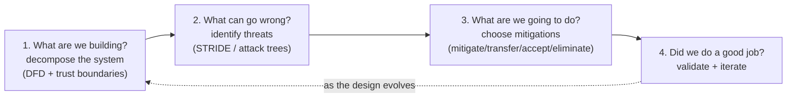
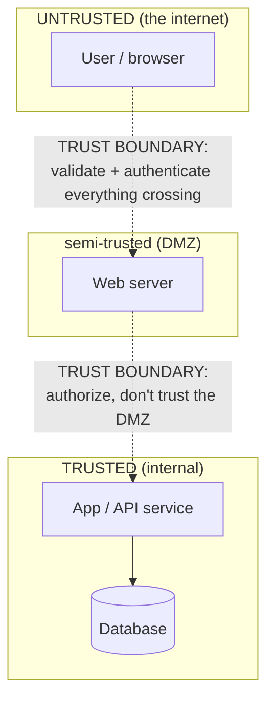
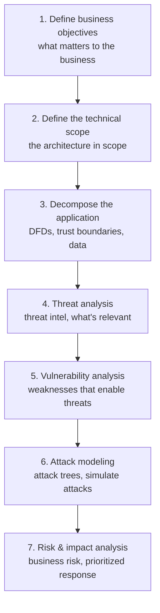
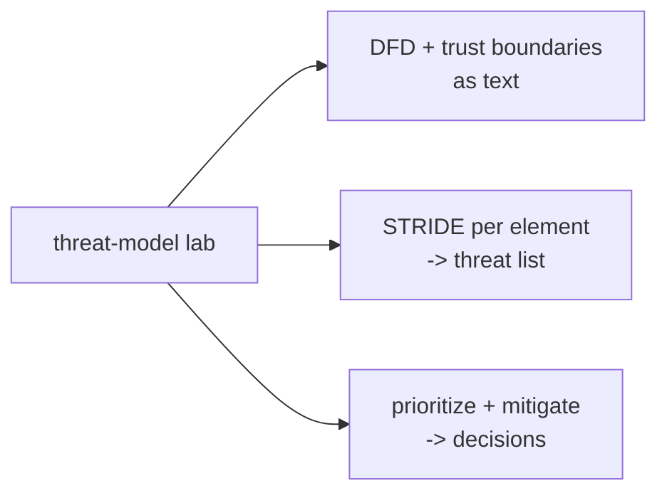

Chapter 2's cost-of-fixing curve made an argument that this chapter cashes in: the most valuable place to catch a security defect is in *design*, when fixing it costs a diagram change rather than an incident, and the class of defect that lives there — the design flaw, the missing trust boundary, the fundamentally insecure architecture — is both the most expensive to fix late and the hardest for any downstream testing to catch. **Threat modeling is how you catch it.** It is the systematic, structured practice of examining a design and asking, before a line of code is written, *what could go wrong here and what will we do about it* — and it is, for that reason, the single highest-leverage activity a product security engineer performs.

Threat modeling has a reputation for being either mystically hard or bureaucratically heavy, and both reputations come from doing it wrong. Done wrong, it is a security expert disappearing for two weeks to produce a hundred-page document nobody reads. Done right, it is a lightweight, recurring, collaborative activity — a couple of hours with a whiteboard and the engineers who are building the thing — that reliably surfaces the design flaws that would otherwise ship. This chapter teaches the right way: a repeatable method built on four simple questions, a way of drawing systems that makes threats visible (data flow diagrams and trust boundaries), a systematic way of finding threats (STRIDE), a heavier risk-centric methodology for when the stakes justify it (PASTA), and — most importantly — the practical discipline of keeping threat models lightweight, living, and integrated into how engineering actually works.

The chapter is deliberately method-first, because threat modeling is a *skill of structured thinking*, not a body of facts. The frameworks (STRIDE, PASTA, attack trees) are scaffolding for that thinking, useful because they make it systematic and repeatable rather than dependent on the intuition of whoever happens to be in the room. Master the method here, and Chapters 4 (design reviews) and 5 (tools and automation) extend it into the full design-phase practice. This is the chapter where the attacker's mindset from the entire earlier curriculum turns fully constructive — you use everything you know about how systems are attacked to make a system that resists attack, at the moment when doing so is cheapest and most effective.

## Why This Matters

The leverage argument is the one from Chapter 2, sharpened. A penetration test finds implementation bugs in a finished product — valuable, but downstream and expensive. Threat modeling finds *design* flaws in an unbuilt product — the class of defect that a pentest struggles to catch (a pentester tests what was built; they cannot easily test for the trust boundary that was never drawn) and that costs the most to fix once built (re-architecting a shipped system is a project, not a patch). Threat modeling is therefore not just *an* early-phase activity; it is the activity that catches the specific defects nothing else catches well, at the specific moment they are cheapest to fix. That combination is why it is the highest-value thing on a ProdSec engineer's calendar.

The scaling argument reinforces it. A single threat-modeling session, done as a feature is designed, prevents a class of bugs from ever being written — which is categorically more efficient than finding those bugs one at a time later. And the *skill* of threat modeling, taught to engineers (via security champions, Notebook 47), scales further still: an engineering org where developers can threat-model their own designs catches vastly more than a central security team ever could. Threat modeling is thus both a high-value activity and a teachable skill that multiplies the whole organisation's security — which is exactly the ProdSec leverage Chapter 1 described.

But the deepest reason it matters is that **threat modeling is how the attacker's mindset becomes a design discipline.** Everything the earlier curriculum taught about how systems fail — how trust boundaries are crossed (Notebook 42), how inputs are weaponised (Notebooks 21–27), how authentication is bypassed (Notebook 45's IAM), how privilege is escalated (Notebooks 17, 18) — becomes, in threat modeling, a structured lens for finding those failures in a design *before they exist*. It is the single most direct application of offensive knowledge to constructive ends, and for a reader who has come through this curriculum, it is where all of that knowledge pays its highest dividend: not in breaking a system, but in ensuring a system cannot be broken.

## Part 1: What Threat Modeling Is — The Four Questions

Strip away the frameworks and threat modeling is four questions, asked about a system, in order. This framing (due to Adam Shostack) is the durable core; everything else is technique for answering the questions well.



The four questions, and why each matters:

1. **What are we building?** You cannot find threats to a system you do not understand. This is the *decomposition* step — drawing the system as data flow diagrams with trust boundaries (Parts 2–3), so that its structure, its data, and its trust assumptions are explicit and inspectable. Most threat-modeling failures are actually decomposition failures: you cannot see the threat because you never drew the boundary it crosses.
2. **What can go wrong?** The *threat identification* step — systematically enumerating how the system could be attacked (STRIDE, Part 4; attack trees, Part 5). "Systematically" is the key word: the value of a framework like STRIDE is that it makes threat-finding *complete and repeatable* rather than dependent on someone happening to think of the attack.
3. **What are we going to do about it?** The *mitigation* step — for each threat, deciding to mitigate it, transfer it, accept it, or eliminate it (Part 8). A threat model that identifies threats but does not drive decisions is an academic exercise; the point is to *change the design*.
4. **Did we do a good job?** The *validation* step — checking that the model is complete, the mitigations are real, and (as the design evolves) revisiting it. Threat modeling is not a one-time event; it is a loop that tracks the design.

The power of the four-question framing is that it is *always* what you are doing, regardless of which frameworks you use to do it. STRIDE and PASTA and attack trees are all just different techniques for answering questions 2 and 3 well. Keep the four questions as your compass, and you can never be lost in the methodology — you always know what you are trying to do and why. This is the single most useful thing to internalise from the whole chapter.

## Part 2: Decomposition — Data Flow Diagrams

Answering "what are we building?" well means drawing the system in a way that makes threats visible, and the standard tool is the **data flow diagram (DFD)**. A DFD models how data moves through a system using a small, fixed vocabulary of element types.

| DFD element | Shape (convention) | What it is | Threat relevance |
|---|---|---|---|
| **External entity** | Square/rectangle | A person or system outside your control (a user, a third-party API) | The source of untrusted input; you cannot trust it |
| **Process** | Circle | Something that acts on data (a service, a function, a server) | Where logic runs and can be subverted |
| **Data store** | Two parallel lines | Where data rests (a database, a file, a cache) | Where data can be read/tampered at rest |
| **Data flow** | Arrow | Data moving between elements | Where data can be intercepted/tampered in transit |
| **Trust boundary** | Dashed line | Where the trust level changes (Part 3) | **The most important element — where threats concentrate** |

The DFD's job is not artistic completeness; it is to make the *structure and the data movement* explicit enough that you can reason about where an attacker could act. A few disciplines make a DFD useful for threat modeling specifically:

- **Draw at the right level.** A DFD for a whole company is useless; a DFD for one feature or one service is actionable. Threat-model at the granularity of the thing being designed — usually a feature or a service (this is what makes incremental, per-feature threat modeling feasible, Chapter 2).
- **Show the data, not just the boxes.** The *flows* — what data moves where — are where much of the risk lives. Label them (credentials, PII, session tokens) because the sensitivity of what flows across a boundary determines the severity of a threat to it.
- **Include the things you would rather ignore.** The admin backdoor, the debug endpoint, the internal service you "trust" — these are exactly where threats hide. A DFD that only shows the happy path misses the interesting threats.

The DFD is the substrate everything else operates on: STRIDE (Part 4) is applied *per element* of the DFD, so a good DFD is what makes threat-finding systematic. Time spent getting the DFD right — especially the trust boundaries — is the highest-return part of the whole exercise.

## Part 3: Trust Boundaries — Where Threats Concentrate

The single most important element of a DFD, and the concept that makes threat modeling *work*, is the **trust boundary**: a line where the level of trust changes — where data or control crosses from a less-trusted zone to a more-trusted one, or vice versa.



Why trust boundaries are the heart of threat modeling:

**Threats concentrate at trust boundaries.** Where trust changes is where an attacker on the less-trusted side tries to abuse the more-trusted side. Data crossing *into* a higher-trust zone must be validated (it may be malicious); requests crossing into a higher-privilege zone must be authenticated and authorised (they may be forged). Almost every serious vulnerability is, at root, a failure to properly handle something crossing a trust boundary — an unvalidated input crossing from user to server (injection, Notebook 23), an unauthorised request crossing from user to admin (broken access control, Notebook 45's IAM), an untrusted dependency crossing into your build (supply chain, Notebook 46). **Find the trust boundaries, and you find where the threats are.**

**Missing trust boundaries are the most dangerous design flaw.** The failure Chapter 2 called the most expensive and hardest to catch is, concretely, a *missing or wrong trust boundary* — a system that trusts something it should not (a service that trusts "any request from the internal network," an app that trusts a client-supplied value, a pipeline that trusts an unverified dependency). These flaws are invisible to a pentester who tests the built system's happy path, and they require re-architecting to fix once shipped. Threat modeling catches them precisely because drawing the trust boundaries *forces* you to make the trust assumptions explicit — and an explicit bad assumption is one you can question, while an implicit one ships.

**Every trust boundary crossing is a design decision.** For each thing that crosses a boundary, you must decide how it is validated, authenticated, authorised, and protected. Drawing the boundary turns "we'll figure out security later" into a specific list of decisions to make now — which is exactly the shift-left value.

The practical discipline: **drawing the trust boundaries is the most important single step in decomposition.** Get them right — mark every place trust changes, and make the trust assumptions explicit — and STRIDE applied at those boundaries finds the threats almost mechanically. Get them wrong or leave them implicit, and the most dangerous threats stay invisible.

## Part 4: Threat Identification — STRIDE

With the system decomposed (DFD + trust boundaries), the next question is "what can go wrong?" — and the most widely-used systematic answer is **STRIDE**, a mnemonic for six threat categories, each the violation of a corresponding security property.

| STRIDE threat | Violates | Is | Example |
|---|---|---|---|
| **S**poofing | Authentication | Pretending to be someone/something else | Forging a session token; impersonating a service |
| **T**ampering | Integrity | Modifying data or code | Altering a request in transit; changing stored data |
| **R**epudiation | Non-repudiation | Denying an action, no proof it happened | No audit log, so an action can't be attributed |
| **I**nformation disclosure | Confidentiality | Exposing data to the unauthorised | Leaking PII; verbose errors; reading another user's data |
| **D**enial of service | Availability | Making the system unavailable | Resource exhaustion; crashing a service |
| **E**levation of privilege | Authorization | Gaining capabilities you shouldn't have | Escalating from user to admin; breaking out of a sandbox |

How STRIDE is actually applied — the technique that makes it systematic:

**STRIDE-per-element.** Walk the DFD element by element and ask which STRIDE threats apply to each, because different element types are susceptible to different threats:

- **External entities** — Spoofing (they can be impersonated) and Repudiation (they can deny actions).
- **Processes** — all six (a process can be spoofed, tampered, repudiate, disclose, be DoS'd, and be elevated).
- **Data stores** — Tampering, Information disclosure, Repudiation, DoS (data at rest can be altered, read, and its integrity/availability attacked).
- **Data flows** — Tampering, Information disclosure, DoS (data in transit can be altered, intercepted, and blocked).

Walking each element against its applicable STRIDE categories turns threat-finding from "think of attacks" (which depends on the cleverness of whoever is in the room) into a *checklist* (which is complete and repeatable). This is STRIDE's whole value: it makes threat identification **systematic**, so you find the threats you would not have thought of, not just the ones that came to mind.

**STRIDE-per-interaction** is a refinement that examines each *interaction* (a data flow between two elements crossing a boundary) against STRIDE — often more productive because, as Part 3 argued, threats concentrate at boundary crossings, so examining the crossings directly focuses effort where the risk is.

The output of a STRIDE pass is a *list of candidate threats* — "an attacker could spoof the service the client connects to," "an attacker could tamper with the request in transit," "an attacker could read another user's data from the store." Not all will be real or significant (that is what prioritisation, Part 7, is for), but STRIDE ensures the list is *complete* — that you considered every threat category against every element — which is exactly what separates systematic threat modeling from ad-hoc brainstorming.

## Part 5: Attack Trees and Attack Libraries

STRIDE is the workhorse, but two complementary techniques are worth knowing for when it is not enough.

**Attack trees** model how an attacker could achieve a specific goal, as a tree with the goal at the root and the ways to achieve it branching below. "Steal user funds" branches into "compromise the user's account" and "exploit the transfer logic"; each branches further into concrete techniques. Attack trees are *goal-centric* where STRIDE is *element-centric* — they start from what the attacker wants and work backward to how, which is powerful for reasoning about a specific high-value asset or a specific worrying scenario. They complement STRIDE: STRIDE ensures broad coverage across the system, attack trees drive deep on a critical goal.

**Attack libraries** are catalogues of known attack patterns you check your system against — CAPEC (Common Attack Pattern Enumeration and Classification), the OWASP Top 10 (Notebooks 21–27), MITRE ATT&CK (Notebook 34). Rather than deriving threats from first principles, you check "does my system have this known weakness?" against a curated list. Libraries are efficient (they encode the community's accumulated knowledge) and a good complement to STRIDE (which finds categories) and attack trees (which explore goals) — the library grounds the abstract categories in concrete, known attacks.

The practical relationship: **STRIDE for systematic breadth, attack trees for depth on critical goals, attack libraries for grounding in known patterns.** Most threat modeling uses STRIDE as the backbone and reaches for the others when a particular asset warrants deep analysis (attack tree) or when checking against known real-world attacks (library). You do not need all three for every model; you need to know which to reach for when.

## Part 6: PASTA — When Rigour Is Worth It

STRIDE is lightweight and technical; sometimes you need a heavier, *risk-centric*, business-aligned methodology, and the most complete is **PASTA (Process for Attack Simulation and Threat Analysis)** — a seven-stage process that ties technical threats to business impact.



PASTA's defining features:

- **It is risk-centric and business-aligned.** It *starts* from business objectives (stage 1) and *ends* at business risk (stage 7), so its output is prioritised by what actually matters to the organisation, not just by technical severity. This is its great strength — it produces threat analysis that leadership and the business can act on, connecting the technical work to Notebook 3's risk language and Notebook 47's program metrics.
- **It is thorough and heavyweight.** Seven stages, integrating threat intelligence (stage 4, Notebook 34), vulnerability analysis (stage 5), and attack simulation (stage 6). This rigour is genuinely valuable for high-stakes systems — a payments platform, a healthcare system, critical infrastructure — where the investment is justified by the stakes.

The key judgement a ProdSec engineer makes is **when the rigour is worth it**:

- **Use lightweight STRIDE** (Parts 1–4) for the common case: per-feature threat modeling in a sprint, where you need a fast, systematic pass that fits into how engineering works. This is 90% of threat modeling, and PASTA's seven stages would be crushing overkill.
- **Use PASTA (or PASTA-influenced rigour)** for the high-stakes case: a major new system, a critical business function, a design where the cost of missing a threat is severe and the investment in thorough, business-aligned analysis is justified.

The mistake to avoid is applying PASTA's full weight to everything (it makes threat modeling the heavyweight bureaucracy that engineering routes around, Chapter 2) *or* applying only lightweight STRIDE to a system whose stakes demand more. Match the method's weight to the stakes — the same pragmatism-and-risk-judgement that Chapter 1 named a core ProdSec skill. Most of the time, lightweight and systematic beats heavy and thorough, because the lightweight version actually happens; but know when the stakes flip that calculation.

## Part 7: Prioritising Threats

A STRIDE pass produces many candidate threats, and not all deserve equal attention. Prioritisation is how you focus mitigation effort where it matters — and it connects threat modeling to Notebook 3's risk reasoning.

The basic model is **risk = likelihood × impact**: a threat that is easy to exploit and causes severe harm is high-priority; one that is hard to exploit and causes trivial harm is low. This simple framing, applied with judgement, is often enough.

**DREAD** is a historical scoring model (Damage, Reproducibility, Exploitability, Affected users, Discoverability — each rated, then summed) that attempted to make prioritisation quantitative. It is worth knowing because it appears in older material, but it is **widely criticised and largely deprecated**: its scores are subjective (two people rate the same threat very differently), the categories overlap, and the false precision of a summed number can mislead. Microsoft, which popularised it, moved away from it. Know what DREAD is, understand *why* it fell out of favour (subjectivity and false precision), and do not build your practice on it.

The **pragmatic alternative** most mature programs use:

- **Rate likelihood and impact on a simple scale** (e.g. low/medium/high each), using the risk-assessment discipline of Notebook 3, and derive a priority — without pretending to more precision than the inputs support.
- **Anchor severity to real consequence.** A threat's impact is grounded in what it actually enables — data breach of PII (Notebook 42's regulatory consequences), account takeover, financial loss, service outage — not an abstract number. The reporting skill of Notebook 9 applies: state the *business impact*, not just the technical severity.
- **Consider the mitigation cost too.** A cheap mitigation for a medium threat may be worth doing before an expensive mitigation for a slightly-higher threat. Prioritisation is about *where to spend effort*, which means weighing the fix cost, not just the risk.
- **Be honest about uncertainty.** Prioritisation is judgement under uncertainty, not calculation. A simple, defensible high/medium/low that drives sensible decisions beats a precise-looking DREAD score that is really a guess dressed up as arithmetic.

The output is a *prioritised list of threats* — the ones worth mitigating now, the ones to accept or defer, ordered so that limited mitigation effort goes to the highest risk. That prioritised list, driving concrete design decisions (Part 8), is the actual deliverable of threat modeling.

## Part 8: Choosing Mitigations

For each threat worth addressing, question three ("what are we going to do?") has four possible answers — the same risk-treatment options as Notebook 3, applied to a design threat:

- **Mitigate** — reduce the risk by adding a control (validate the input, authenticate the crossing, encrypt the data, add the authorisation check). The most common response, and the one that changes the design. Mitigations map to the security controls of the whole curriculum: a spoofing threat is mitigated by authentication (Notebook 45's IAM), a tampering threat by integrity controls, an information-disclosure threat by encryption and access control, an elevation threat by authorisation.
- **Eliminate** — remove the threat by removing the feature or the exposure that creates it. The most powerful option when available: the most secure component is the one you did not build, the most secure data is the data you did not collect (Notebook 42's minimisation). Sometimes the right answer to a threat is "do we actually need this feature/data/exposure?"
- **Transfer** — shift the risk to someone else (use a third-party service that assumes the risk, buy insurance, push the responsibility to a component whose owner accepts it). Legitimate for some risks, but note that you often cannot transfer *accountability* even when you transfer the mechanism (Notebook 42's controller/processor point).
- **Accept** — consciously decide the risk is low enough or the mitigation too costly, and accept it with documentation. A legitimate and necessary option — you cannot mitigate everything — but it must be a *documented, conscious* decision by someone with the authority to accept it, not an implicit "we'll ignore it." An accepted risk that is recorded is risk management; an ignored one is negligence.

Two disciplines that make mitigation real rather than academic:

**Map mitigations to controls you can actually build.** A mitigation is only useful if it becomes a concrete design change or engineering task. "Add authentication" must become "the service authenticates the client via mTLS" — specific enough to implement (Chapters 6–7 provide the secure-coding realisation, Notebook 42 the architectural patterns). The threat model's output is a set of *design decisions and engineering tasks*, tracked to completion like any other work (Chapter 2's backlog integration).

**Prefer eliminating and defaulting over per-instance mitigation.** The highest-leverage mitigation is one that removes the threat class entirely (eliminate) or makes the secure choice the default (Chapter 1's paved road), so it does not have to be re-mitigated in every future feature. A threat model that concludes "we should build a secure-by-default library for this" prevents the threat across the whole org, not just in this feature — which is the ProdSec leverage from Chapter 1 realised through threat modeling.

## Part 9: Keeping Threat Models Lightweight and Living

The most common way threat modeling fails in practice is not technical — it is being too heavy. A threat model that is a hundred-page document produced once and never opened again has failed regardless of its quality, because the design evolved and the model did not, and because the weight taught engineering to dread it. The discipline that makes threat modeling *work* in a real organisation is keeping it lightweight and living.

The principles, which operationalise Chapter 2's agile integration:

- **Threat-model incrementally, per feature.** Do not threat-model the whole system once; threat-model each significant change as it is designed, fitting a short session into the sprint that designs it. This keeps each model small, current, and feasible — and it is the only model that survives contact with fast development.
- **Right-size the effort to the risk** (Part 6). A small, low-risk feature gets a ten-minute lightweight STRIDE pass or a self-service checklist (Chapter 1's triage); a major high-stakes system gets a thorough session or PASTA rigour. Not everything deserves the same weight, and treating it so either drowns the team or under-protects the important things.
- **Make it collaborative, not a security-team deliverable.** A threat model produced *by* the security team *for* engineering is a document nobody owns. A threat model produced *with* the engineers who are building the thing — in a session where the security engineer facilitates and the builders contribute — is owned, understood, and acted on (Chapter 1's enabler stance). The engineers know the system; the security engineer knows the threats; the value is in the room where they meet.
- **Keep the artifact lightweight.** A useful threat model can be a diagram, a short list of threats, and a list of decisions — often a page or two, or a section in the design doc. The goal is *decisions that change the design*, not a comprehensive document. Weight is the enemy; a lightweight model that gets done and acted on beats a heavy one that does not.
- **Make it living.** As the design changes, revisit the model (question four). A threat model tied to a design that has moved on is stale; integrating a quick threat-model check into the design-change process keeps it current.

Who is in the room, and facilitation: a good threat-modeling session has the *engineers building the feature* (they know the design), a *security engineer to facilitate and bring the threat lens*, and often a *product owner* (to speak to what matters and accept risks). The security engineer's job in the room is to *facilitate* — to ask the four questions, walk the DFD, prompt the STRIDE categories, and draw out the threats the engineers know intuitively but have not framed as security issues — not to lecture. A well-facilitated session where the engineers do most of the talking produces a better, more-owned model than a security expert working alone, and it *teaches* the engineers to threat-model themselves (the scaling multiplier of Chapter 1 and Notebook 47).

The synthesis: threat modeling succeeds as a *lightweight, incremental, collaborative, living* practice integrated into how engineering designs features — and fails as a *heavyweight, one-time, security-team-owned* document. The method (Parts 1–8) is necessary; the *lightness* (this part) is what makes the method actually get used, which is what makes it valuable.

## Part 10: Hands-On Lab — Threat-Model a Small Web App

### 10.1 What we are building

A complete lightweight threat model of a small web application, produced as text artifacts: a **DFD with trust boundaries** (Parts 2–3), a **STRIDE-per-element pass** (Part 4), a **prioritised threat list** (Part 7), and a **mitigation plan** (Part 8) — the full four-question method, kept lightweight (Part 9).



Python 3 only — threat modeling is a thinking activity, and these tools structure the thinking.

### 10.2 Decompose — the system and its trust boundaries

The system: a simple web app where users log in and view their own documents. Model it as data:

```python
# system.py -- the DFD as structured data (Parts 2-3).
SYSTEM = {
    "external_entities": ["User (browser)"],
    "processes": ["Web server", "Auth service", "App/API service"],
    "data_stores": ["User DB (credentials, PII)", "Document store"],
    "data_flows": [
        # (from, to, data, crosses_boundary)
        ("User (browser)", "Web server", "login creds + requests", True),   # untrusted -> app
        ("Web server", "Auth service", "credentials", True),                 # DMZ -> trusted
        ("Auth service", "User DB", "credential lookup", False),
        ("Web server", "App/API service", "authenticated request", True),    # DMZ -> trusted
        ("App/API service", "Document store", "doc read/write", False),
    ],
    "trust_boundaries": [
        "internet <-> web server (untrusted input enters here)",
        "web server <-> internal services (DMZ to trusted)",
    ],
}

print("=== System decomposition ===")
print("Trust boundaries (where threats concentrate):")
for tb in SYSTEM["trust_boundaries"]:
    print(f"  !! {tb}")
print("\nFlows CROSSING a trust boundary (highest-risk):")
for src, dst, data, crosses in SYSTEM["data_flows"]:
    if crosses:
        print(f"  {src}  --[{data}]-->  {dst}")
```

```bash
python3 system.py

# Sample output:
# === System decomposition ===
# Trust boundaries (where threats concentrate):
#   !! internet <-> web server (untrusted input enters here)
#   !! web server <-> internal services (DMZ to trusted)
#
# Flows CROSSING a trust boundary (highest-risk):
#   User (browser)  --[login creds + requests]-->  Web server
#   Web server  --[credentials]-->  Auth service
#   Web server  --[authenticated request]-->  App/API service
#```

The decomposition already directs attention: the three boundary-crossing flows are where Part 3 says threats concentrate, so the STRIDE pass focuses there.

### 10.3 STRIDE per element

```python
# stride.py -- apply STRIDE systematically per element (Part 4).
# Which STRIDE categories apply to each element TYPE.
APPLIES = {
    "external_entity": ["Spoofing", "Repudiation"],
    "process":         ["Spoofing","Tampering","Repudiation",
                        "Information disclosure","Denial of service","Elevation of privilege"],
    "data_store":      ["Tampering","Repudiation","Information disclosure","Denial of service"],
    "data_flow":       ["Tampering","Information disclosure","Denial of service"],
}
# Concrete threats we identify by walking each element against its categories.
THREATS = [
    ("User (browser)", "external_entity", "Spoofing",
     "Attacker forges a session / impersonates a user"),
    ("Web server", "process", "Elevation of privilege",
     "Injection/logic flaw lets a user act as admin"),
    ("Web server", "process", "Information disclosure",
     "Verbose errors leak stack traces / internal paths"),
    ("login creds flow", "data_flow", "Information disclosure",
     "Credentials intercepted in transit (no TLS)"),
    ("login creds flow", "data_flow", "Tampering",
     "Request tampered in transit"),
    ("User DB", "data_store", "Information disclosure",
     "PII/credentials read via SQLi or direct DB access"),
    ("App/API service", "process", "Elevation of privilege",
     "IDOR: user reads another user's documents"),
]

print(f"{'ELEMENT':<20} {'STRIDE':<22} THREAT")
print("-" * 78)
for elem, etype, cat, desc in THREATS:
    print(f"{elem:<20} {cat:<22} {desc}")
print(f"\n{len(THREATS)} candidate threats from a systematic STRIDE pass")
```

```bash
python3 stride.py

# Sample output:
# ELEMENT              STRIDE                 THREAT
# ------------------------------------------------------------------------------
# User (browser)       Spoofing               Attacker forges a session / impersonates a user
# Web server           Elevation of privilege Injection/logic flaw lets a user act as admin
# Web server           Information disclosure Verbose errors leak stack traces / internal paths
# login creds flow     Information disclosure Credentials intercepted in transit (no TLS)
# login creds flow     Tampering              Request tampered in transit
# User DB              Information disclosure  PII/credentials read via SQLi or direct DB access
# App/API service      Elevation of privilege IDOR: user reads another user's documents
#
# 7 candidate threats from a systematic STRIDE pass
```

Walking elements against their applicable STRIDE categories produced a *complete* threat list — including the IDOR (Notebook 45's broken object-level authorization) that ad-hoc brainstorming often misses. That completeness is STRIDE's whole value.

### 10.4 Prioritise and mitigate

```python
# mitigate.py -- prioritize (Part 7) and choose mitigations (Part 8).
# (threat, likelihood, impact) on low/med/high; then the mitigation decision.
ANALYSIS = [
    ("Credentials intercepted in transit", "high", "high",
     "MITIGATE: enforce TLS everywhere (HSTS); a paved-road default"),
    ("IDOR: read another user's documents", "high", "high",
     "MITIGATE: object-level authz check on every access; add to secure-coding guide"),
    ("PII/credentials read via SQLi", "med", "high",
     "MITIGATE: parameterized queries (default lib) + least-privilege DB account"),
    ("User/session spoofing", "med", "high",
     "MITIGATE: strong session mgmt + phishing-resistant MFA (Notebook 45)"),
    ("Verbose errors leak internals", "high", "low",
     "MITIGATE: generic error responses; cheap, do it"),
    ("Request tampered in transit", "low", "high",
     "MITIGATE: covered by the TLS decision above (eliminate the exposure)"),
]
RANK = {"low":1, "med":2, "high":3}

def priority(l, i): return RANK[l] * RANK[i]

print(f"{'PRI':>3} {'L':>4} {'I':>4}  THREAT / DECISION")
print("-" * 74)
for threat, l, i, decision in sorted(ANALYSIS, key=lambda t: -priority(t[1], t[2])):
    p = priority(l, i)
    tag = "P1" if p >= 6 else "P2" if p >= 3 else "P3"
    print(f"{tag:>3} {l:>4} {i:>4}  {threat}")
    print(f"            -> {decision}")
```

```bash
python3 mitigate.py

# Sample output:
# PRI    L    I  THREAT / DECISION
# --------------------------------------------------------------------------
#  P1 high high  Credentials intercepted in transit
#             -> MITIGATE: enforce TLS everywhere (HSTS); a paved-road default
#  P1 high high  IDOR: read another user's documents
#             -> MITIGATE: object-level authz check on every access; add to secure-coding guide
#  P1  med high  PII/credentials read via SQLi
#             -> MITIGATE: parameterized queries (default lib) + least-privilege DB account
#  P1  med high  User/session spoofing
#             -> MITIGATE: strong session mgmt + phishing-resistant MFA
#  P2 high  low  Verbose errors leak internals
#             -> MITIGATE: generic error responses; cheap, do it
#  P2  low high  Request tampered in transit
#             -> MITIGATE: covered by the TLS decision above
```

The full four-question method produced a *prioritised list of design decisions* — the actual deliverable of threat modeling. Note the leverage moves (Part 8): the mitigations are framed as *paved-road defaults* and *secure-coding-guide additions*, so they prevent the threat class across the org, not just this feature. And several threats collapse into one decision (TLS handles both the interception and the tampering), which is the eliminate-the-exposure pattern. This whole model — DFD, STRIDE, priorities, decisions — fits on two pages and took a session, exactly the lightweight-and-living form of Part 9.

### 10.5 Extending the lab

Add an attack tree (Part 5) for the highest-value goal ("read another user's documents") and see how it drives deeper on the IDOR; run the same app through a PASTA-style pass (Part 6) starting from a business objective and note where the extra rigour adds value versus weight; turn the mitigation list into tracked engineering tickets with owners (Chapter 2's backlog integration); build a reusable STRIDE-per-element checklist a security champion could run without you (Chapter 1's scaling); and write the whole thing up as a two-page threat model in a real design doc's format.

## Part 11: Common Pitfalls

**Skipping decomposition.** You cannot find threats to a system you have not drawn. Most threat-modeling failures are decomposition failures — the threat was invisible because the boundary it crosses was never drawn. Draw the DFD and, above all, the trust boundaries.

**Leaving trust assumptions implicit.** The most dangerous design flaws are wrong trust assumptions (a service that trusts the internal network, an app that trusts a client value). Drawing trust boundaries *forces* the assumptions to be explicit, where they can be questioned. Implicit bad assumptions ship.

**Ad-hoc threat brainstorming instead of systematic STRIDE.** Relying on whoever is in the room to *think of* attacks misses the ones nobody thought of. STRIDE-per-element makes threat-finding a complete checklist rather than a test of cleverness.

**Only modeling the happy path.** The admin backdoor, the debug endpoint, the "trusted" internal service are where threats hide. Include the things you would rather ignore.

**Building on DREAD.** DREAD's subjective, false-precise scores are widely deprecated. Use a simple likelihood × impact judgement anchored to real consequence (Notebook 3), and be honest that prioritisation is judgement, not calculation.

**Applying PASTA's full weight to everything.** Heavyweight methodology on every small feature makes threat modeling the bureaucracy engineering routes around. Match the method's weight to the stakes — lightweight STRIDE for the common case, PASTA rigour for the high-stakes case.

**Producing a document instead of decisions.** A hundred-page threat model that changes nothing has failed. The deliverable is *prioritised design decisions and engineering tasks*, tracked to completion — not a comprehensive artifact.

**A one-time, security-team-owned model.** A model produced once, by security, for engineering, is stale by the next sprint and owned by no one. Threat-model *incrementally*, *collaboratively* (with the builders), and keep it *living* as the design changes.

**Lecturing instead of facilitating.** In the room, the security engineer's job is to ask the four questions and draw out the threats the engineers know intuitively — not to lecture. A session where the builders do most of the talking produces a better, more-owned model and teaches them to threat-model themselves.

**Not mapping mitigations to buildable controls.** "Add authentication" is not a mitigation until it is "the service authenticates the client via mTLS." Mitigations must become specific, tracked engineering tasks — and, where possible, paved-road defaults that prevent the threat class org-wide.

## Final Revision / Summary

- **Threat modeling is the highest-leverage design-phase activity**: it catches design flaws (especially missing/wrong **trust boundaries**) that are both the most expensive to fix late and the hardest for downstream testing to catch, at the moment they are cheapest to fix. It is where the attacker's mindset becomes a design discipline.
- The durable core is **four questions**: (1) *What are we building?* (decompose — DFD + trust boundaries), (2) *What can go wrong?* (identify threats — STRIDE/attack trees), (3) *What are we going to do?* (mitigate/transfer/accept/eliminate), (4) *Did we do a good job?* (validate + iterate). Every framework is just technique for answering these; keep them as your compass.
- **Decompose with a data flow diagram** (external entities, processes, data stores, data flows) at the granularity of a feature/service, showing the *data* not just the boxes, and including the parts you would rather ignore. The **trust boundary** — where trust level changes — is the most important element: **threats concentrate at boundary crossings**, and **missing/implicit trust boundaries are the most dangerous design flaw**. Drawing them forces trust assumptions to be explicit.
- **STRIDE** makes threat identification systematic: Spoofing (auth), Tampering (integrity), Repudiation (non-repudiation), Information disclosure (confidentiality), Denial of service (availability), Elevation of privilege (authorization). Apply it **per element** (each element type is susceptible to specific categories) or **per interaction** (focus on boundary crossings) — turning threat-finding from a test of cleverness into a complete checklist.
- **Attack trees** (goal-centric depth on a critical asset) and **attack libraries** (CAPEC, OWASP Top 10, ATT&CK — grounding in known patterns) complement STRIDE's element-centric breadth. Use STRIDE as the backbone; reach for the others for depth or grounding.
- **PASTA** is a heavyweight, risk-centric, business-aligned seven-stage methodology (business objectives → scope → decompose → threat analysis → vuln analysis → attack modeling → risk/impact). Its rigour is worth it for **high-stakes systems**; **lightweight STRIDE** fits the common per-feature case. Match the method's weight to the stakes.
- **Prioritise** with likelihood × impact judgement anchored to real consequence (Notebook 3, Notebook 9's business-impact framing). **DREAD is deprecated** — subjective and false-precise; know it, don't build on it. Prioritisation is judgement under uncertainty, not calculation; also weigh the mitigation cost.
- **Mitigate / eliminate / transfer / accept** (Notebook 3's options applied to design threats). Prefer **eliminating** (the most secure component is the one not built) and **defaulting** (paved-road mitigations prevent the class org-wide) over per-instance fixes. Every mitigation must become a **buildable, tracked control**, and every accepted risk must be a **documented, conscious** decision.
- **Keep it lightweight and living**: threat-model **incrementally per feature**, right-size effort to risk, make it **collaborative** (with the builders, security facilitating — which also *teaches* them to threat-model), keep the **artifact small** (a page or two of decisions, not a hundred-page document), and revisit it as the design changes. The method is necessary; the *lightness* is what makes it get used, which is what makes it valuable.

## Cheat Sheet / Quick Reference

**The four questions (your compass)**

```
1. What are we building?   -> DFD + TRUST BOUNDARIES
2. What can go wrong?       -> STRIDE (systematic) / attack trees / libraries
3. What will we do?         -> mitigate / eliminate / transfer / accept
4. Did we do a good job?    -> validate + iterate as the design evolves
```

**DFD elements + trust boundaries**

```
external entity (untrusted input source) | process (logic) | data store (rest)
data flow (transit) | TRUST BOUNDARY (where trust changes = where threats concentrate)
-> drawing the boundaries makes trust assumptions EXPLICIT (the key move)
```

**STRIDE (per element / per interaction)**

```
Spoofing            -> authentication      Tampering        -> integrity
Repudiation         -> non-repudiation     Info disclosure  -> confidentiality
Denial of service   -> availability        Elevation of priv-> authorization
external entity: S,R | process: all 6 | data store: T,R,I,D | data flow: T,I,D
```

**Complementary techniques**

```
STRIDE       = systematic breadth (element-centric)
attack tree  = depth on a critical GOAL
attack library (CAPEC/OWASP/ATT&CK) = grounding in KNOWN patterns
```

**PASTA vs STRIDE**

```
STRIDE: lightweight, per-feature, fits the sprint -> 90% of the time
PASTA : 7 stages, risk+business-centric, heavyweight -> HIGH-STAKES systems only
match the method's WEIGHT to the STAKES
```

**Prioritise + mitigate**

```
risk = likelihood x impact, anchored to REAL consequence (not DREAD -- deprecated)
mitigate | ELIMINATE (best: remove the feature/data) | transfer | ACCEPT (documented)
prefer paved-road DEFAULTS -> prevent the class org-wide
every mitigation -> a buildable, tracked task
```

**Keep it lightweight + living**

```
incremental (per feature) | right-sized to risk | COLLABORATIVE (with the builders)
small artifact (2 pages of DECISIONS) | revisit as the design changes
facilitate, don't lecture -> teaches engineers to threat-model themselves
```

## Practice Labs & Resources

**Learn the method**
- Read Adam Shostack's *Threat Modeling: Designing for Security* — the definitive treatment of the four-question method, DFDs, and STRIDE.
- Work the **OWASP Threat Modeling** materials and the **Threat Modeling Manifesto** (which distils the values: a lightweight, collaborative, living practice).

**Hands-on**
- Extend the Part 10 lab: an attack tree for the critical goal, a PASTA-style pass to feel the weight difference, tracked mitigation tickets, and a reusable STRIDE checklist a champion could run.
- Threat-model a feature you have built or are designing, keeping it to a two-page artifact of decisions — and notice which threats you would have missed without the systematic STRIDE pass.
- Facilitate a threat-modeling session for a peer's design: your job is to ask the four questions and draw out *their* knowledge, not to lecture.

**Deliberate practice**
- For ten systems, draw the trust boundaries first and predict where the threats will be *before* running STRIDE — building the intuition that boundary crossings are where risk lives.
- Practise right-sizing: for a set of features, decide which get a ten-minute pass, which get a full session, and which get PASTA — the pragmatism judgement of Part 6.

**Tools (Chapter 5 goes deeper)**
- **OWASP Threat Dragon** and **Microsoft Threat Modeling Tool** for drawing DFDs and generating STRIDE threats — Chapter 5 covers threat-modeling tooling and automation in depth.

**Further reading**
- Chapter 4 (design reviews) and Chapter 5 (threat-modeling tools and automation) — the extensions of this method into the full design-phase practice.
- Notebook 42 (architecture & zero trust) — the trust-boundary and security-architecture principles this chapter's mitigations draw on; Notebook 3 — the risk reasoning behind prioritisation; Notebooks 21–27 and 45 — the vulnerability knowledge that populates the STRIDE threats.
