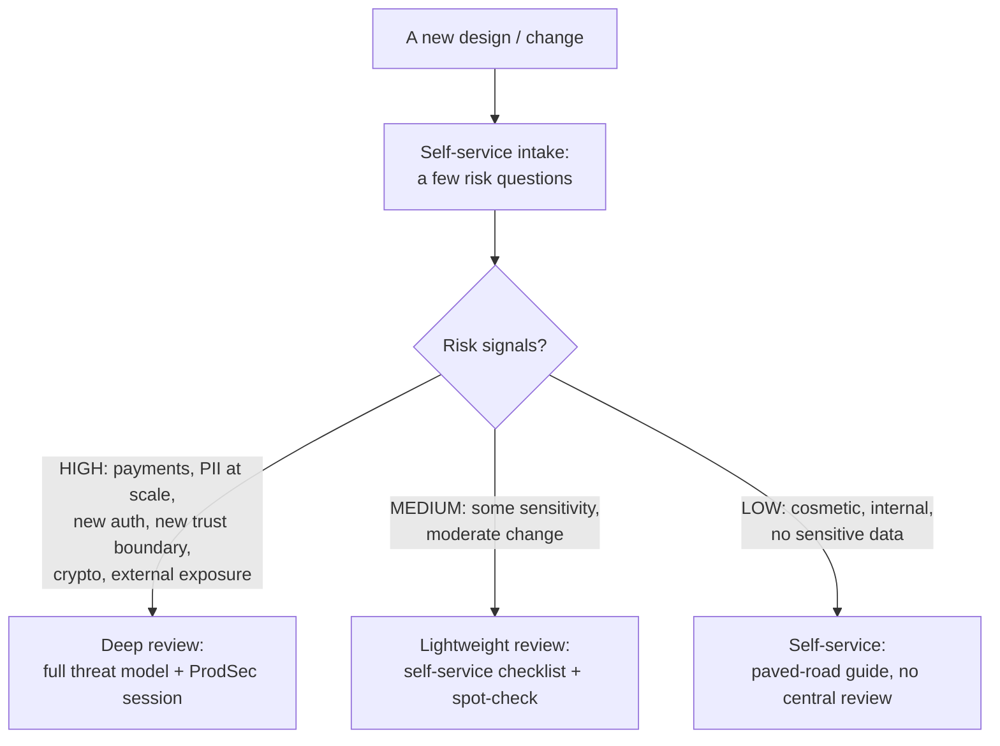
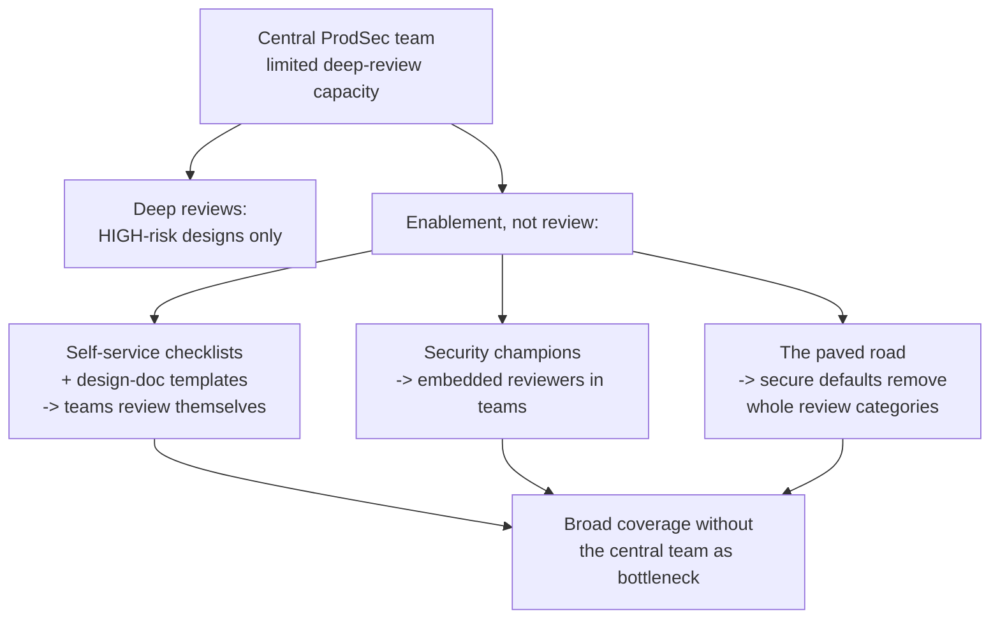
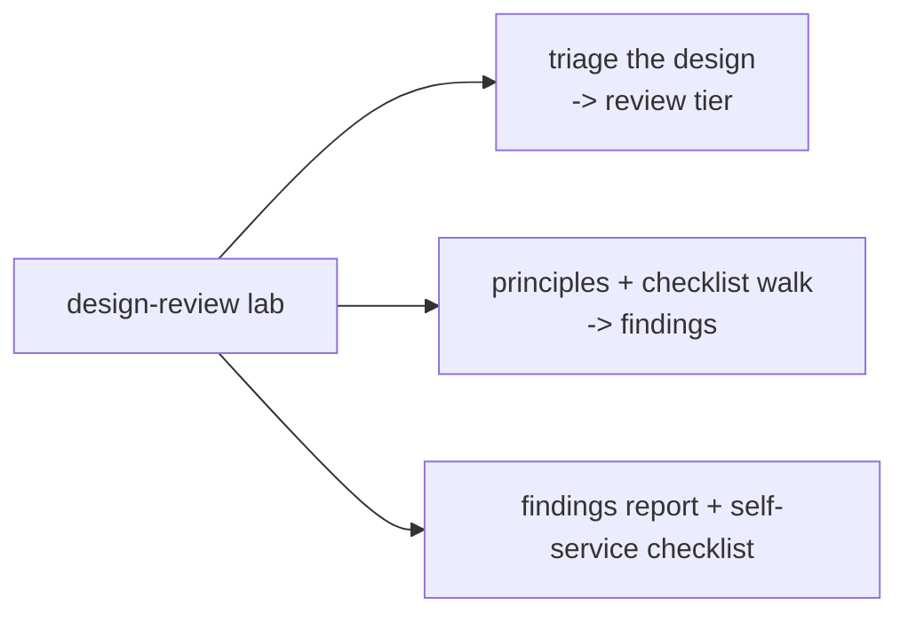

Chapter 3 taught threat modeling as a method — the four questions, DFDs, trust boundaries, STRIDE. This chapter turns that method into a *repeatable practice* that a product security engineer runs across an organisation: the **security design review**. Where threat modeling is the intellectual technique for finding what could go wrong in a design, the design review is the *process* — the intake, the methodology, the checklist, the findings, the follow-through, and above all the *scaling* — by which a ProdSec team applies that technique to the steady stream of designs an engineering org produces, without becoming the bottleneck that Chapter 1 warned against.

The distinction matters because the hardest part of design review is not the technical analysis — Chapter 3 gave you that — but the *operational* problem of doing it at scale, consistently, and in a way engineering welcomes rather than routes around. A single ProdSec engineer cannot deeply review every design a hundred-engineer org produces; the review program has to triage by risk (deep reviews where the stakes justify them, self-service everywhere else), it has to be systematic (so any reviewer produces consistent quality, and so the analysis is complete rather than dependent on what the reviewer happened to think of), and it has to scale beyond the central team (through checklists, templates, champions, and the paved road). This chapter is about building that program.

It also covers the craft that makes reviews *land*: the security design principles that structure the analysis (least privilege, defense in depth, fail-secure, and the rest — the durable architectural wisdom of Notebook 42, applied at review time), the systematic checklist of concerns to walk (auth, crypto, data protection, input handling, third-party, multi-tenant), and — critically — how to *write findings engineers act on* and *run a review as a collaborative conversation* rather than an adversarial audit. The technical analysis is necessary; the operational scaling and the collaborative craft are what make a design-review practice actually work.

## Why This Matters

Design review is where a ProdSec engineer spends much of their highest-value time, because it is the practical, day-to-day form of the design-phase security that Chapter 2's cost curve made the economic case for. A pentest is a point-in-time event; design reviews are a *continuous stream* that catches design flaws across every feature an org ships, at the cheapest point to fix them. A ProdSec engineer who runs a good design-review program is exercising the single most leveraged activity available to the role — catching the expensive, hard-to-catch-later design flaws before they are built, across the whole product.

But the reason this deserves its own chapter, distinct from Chapter 3's method, is the *scaling* problem, and it is the problem that most distinguishes a working ProdSec program from a failing one. A ProdSec team that tries to deeply review every design personally becomes the bottleneck the whole org resents and routes around — the exact gate-model failure of Chapter 1. A team that reviews *nothing* leaves design flaws to ship. The entire art is in between: triaging by risk so scarce deep-review attention goes where it matters, and scaling everything else through self-service and champions so coverage is broad without the central team being the constraint. Getting that operational design right is what makes design review sustainable, and it is a skill in its own right — an organisational and process skill layered on top of the technical one.

And design review is where the collaborative, partner-not-police stance of Chapter 1 is most tested and most consequential. A review is, structurally, one person telling another that their design has problems — an interaction that can build the relationship (a helpful colleague who made the design better) or destroy it (an adversarial gatekeeper who blocked the work). How findings are written and how the review is conducted determines which. A ProdSec engineer who masters the technical analysis but conducts reviews as adversarial audits will find engineering avoiding them; one who conducts reviews as collaborative improvement will find engineering *inviting* them in early — which is the whole game. This chapter is as much about that craft as about the checklist.

## Part 1: What a Design Review Is

A **security design review** is a structured examination of a system's design — its architecture, data flows, and trust boundaries — to identify security weaknesses before the system is built, and to drive design changes that address them. It is the operational practice that applies threat modeling (Chapter 3) systematically across an organisation's designs.

The relationship between the two is worth being precise about, because they overlap:

- **Threat modeling** is the *method* — the intellectual technique for identifying threats to a design (the four questions, DFDs, STRIDE).
- **Design review** is the *practice* — the process by which a ProdSec team applies that method (and more) to the designs engineering produces: the intake that decides what gets reviewed, the systematic walk-through, the security-principles checklist, the findings, and the follow-through.

A design review *includes* threat modeling but is broader: it also checks the design against a body of **security design principles** (Part 4) and a **systematic checklist of concerns** (Part 5) — the accumulated wisdom of how designs commonly go wrong (weak authentication, misused crypto, poor secrets handling, missing tenant isolation) — which a from-scratch threat model might not surface. In practice, threat modeling and the principles/checklist are complementary lenses applied in the same review: STRIDE finds the system-specific threats, the principles and checklist catch the common design mistakes.

The output of a design review is the same as threat modeling's: a set of *prioritised findings driving concrete design decisions*. The review is not an academic assessment; it is an intervention that changes the design before it is built. If a review produces a document but no design changes, it has failed — the same failure mode as a threat model that produces a report nobody acts on (Chapter 3, Part 9).

## Part 2: When to Review — Risk-Based Triage

The first operational decision, and the one that determines whether the program scales, is *which* designs get reviewed and how deeply. Reviewing everything deeply is impossible for a small team; reviewing nothing leaves flaws to ship. The answer is **risk-based triage** — the same triage from Chapter 1's lab, applied as the front door of the review program.



The triage signals that pull a design toward deeper review (from Chapter 3's threat sources):

- **Sensitive data** — payments, PII at scale, health/financial data (Notebook 42's regulated data). The higher the data sensitivity, the higher the stakes of a flaw.
- **New or changed trust boundaries** — a new service, a new external integration, a change to what trusts what. Trust-boundary changes are where the most dangerous flaws live (Chapter 3, Part 3).
- **Authentication/authorization changes** — auth is high-risk and easy to get wrong (Notebook 45).
- **Cryptography** — easy to misuse (Chapter 3, Notebook 7); crypto in a design warrants expert eyes.
- **External exposure** — internet-facing, new attack surface, third-party integration.
- **Novelty** — a fundamentally new architecture or pattern the org has not secured before.

The triage tiers:

- **Deep review** for high-risk designs: a full threat-modeling session (Chapter 3) plus the principles/checklist walk-through, with a ProdSec engineer facilitating. This is where scarce deep attention goes.
- **Lightweight review** for medium-risk: the design team fills a self-service security checklist (Part 8), and ProdSec spot-checks it. Coverage without a full session.
- **Self-service** for low-risk: the team follows the paved-road guidance and a self-service checklist; no central review. The bulk of designs, handled without consuming ProdSec time.

The triage *is* the scaling mechanism. It ensures the central team's deep-review capacity goes to the designs where a flaw would be most costly, while the long tail of low-risk designs is handled by self-service — so the program achieves broad coverage without the central team being the bottleneck (Chapter 1's central concern). A review program without triage either drowns (reviewing everything) or under-protects (reviewing arbitrarily); triage is what makes it sustainable.

## Part 3: Inputs — What a Good Review Needs

A review is only as good as its inputs, and a common cause of shallow reviews is starting without the information to review well. A good design review needs:

- **A design document** describing what is being built and *why* — the intent, the architecture, the key decisions. Reviewing a design with no written description means reconstructing it in the session, which wastes the session and produces a shallower review.
- **Architecture and data-flow diagrams** — ideally the DFD with trust boundaries (Chapter 3). If these do not exist, producing them *is* the first part of the review (decomposition, Chapter 3, Part 2), because you cannot review a system you cannot see.
- **Data classification** — what data the system handles and how sensitive it is (Notebook 42). The sensitivity of the data drives the severity of every finding, so knowing it up front focuses the review.
- **The trust model** — what the system trusts and assumes (the identities, the networks, the components it relies on). Making the trust assumptions explicit is the highest-value input, because wrong trust assumptions are the most dangerous flaws (Chapter 3, Part 3).
- **Context** — the threat environment (who would attack this and why), the compliance requirements (Notebook 42), and the existing security controls the design builds on.

A discipline that improves reviews and scales them: **provide a design-doc template with a security section** so that teams bring the review inputs *as part of their normal design process*, rather than ProdSec extracting them in the session. A template that prompts for the data classification, the trust boundaries, and the security-relevant decisions means every design arrives review-ready, the review is faster and deeper, and — crucially — it *teaches* engineers to think about these things while designing (Chapter 1's scaling through enablement). The template is both a review input and a security-education tool.

## Part 4: The Security Design Principles Checklist

The intellectual backbone of a design review, beyond the system-specific threats STRIDE finds, is a set of **security design principles** — durable, technology-independent rules for how secure systems are structured. These are the accumulated wisdom of Notebook 42's architecture chapter, applied as a review lens: for each principle, ask "does this design honour it, and where does it violate it?"

| Principle | Means | Review question |
|---|---|---|
| **Least privilege** | Every component/user has only the access it needs | Does anything have more access than its job requires? |
| **Defense in depth** | Multiple independent layers of control | Does one control's failure defeat the whole system? |
| **Fail-secure** | Failures default to denying access, not granting it | When this errors/times out, does it fail open or closed? |
| **Complete mediation** | Every access is checked, every time | Is any access checked once and then trusted (cached authz)? |
| **Secure defaults** | The default configuration is the secure one | Is the out-of-box state secure, or must it be hardened? |
| **Economy of mechanism** | Keep security-critical parts simple | Is the security logic simple enough to verify, or sprawling? |
| **Separation of duties** | No single party controls a whole sensitive process | Can one component/person do an entire dangerous action alone? |
| **Least common mechanism** | Minimise shared components across trust levels | Do different-trust tenants/users share a component that could leak? |
| **Open design** | Security does not depend on secrecy of design | Does anything rely on an attacker not knowing how it works? |
| **Psychological acceptability** | Security that is usable will be used | Is the secure path so painful users/devs will bypass it? |

These principles are the review's *first-principles lens*, and applying them systematically catches a class of flaw that STRIDE (which finds threats) and the concern-checklist (which finds common mistakes) can miss — *structural* weaknesses in how the design is organised. A design that fails open on error (violating fail-secure), or trusts a request after one check (violating complete mediation), or shares a component across tenants (violating least common mechanism) has a *design principle* violation that is often the root cause of a whole family of concrete vulnerabilities.

The two principles worth emphasising because they are most often violated in modern designs: **fail-secure** (an enormous number of real vulnerabilities are systems that *fail open* — an auth service that grants access when it times out, an error handler that defaults to permit) and **complete mediation** (systems that authorise once and then trust — a session that is validated at login but not re-checked, a cached authorisation decision that outlives its validity). Walking a design against these principles, especially these two, is a high-yield part of any review.

## Part 5: The Systematic Concern Checklist

Beyond the principles, a review walks a **checklist of common security concerns** — the specific areas where designs repeatedly go wrong. This is where the whole earlier curriculum's vulnerability knowledge becomes a review checklist, ensuring the review is *complete* rather than dependent on what the reviewer happened to think of.

The concern areas, each a section of the review:

- **Authentication** (Notebook 45) — how are identities proven? Phishing-resistant factors? How is service-to-service auth handled? How is recovery/reset secured?
- **Authorization** (Notebook 45) — how is access decided? Is it enforced on *every* access (complete mediation)? Object-level authorization (the IDOR class)? Least privilege?
- **Session management** (Notebook 45) — how are sessions established, protected, and revoked? Is the revocation gap handled?
- **Cryptography** (Notebook 7, Chapter 3) — is crypto used correctly (right primitives, right modes, no reinvention)? Where are keys stored and how are they managed? (Crypto misuse is a top design flaw.)
- **Secrets management** (Notebook 46) — where do secrets (keys, credentials, tokens) live? Are they in a vault, or hardcoded/in-config? How are they rotated?
- **Data protection** (Notebook 42) — is sensitive data encrypted at rest and in transit? Is it minimised (only what's needed)? Is there a retention/deletion plan?
- **Input handling** (Notebooks 23–27) — where does untrusted input enter (the trust boundaries), and is it validated/sanitised at each? Injection surfaces?
- **Output/rendering** — is output encoded to prevent injection into downstream contexts (XSS, etc.)?
- **Logging and monitoring** (Notebooks 31–33) — are security-relevant events logged for detection and non-repudiation? Are logs themselves protected (and free of sensitive data — Notebook 42)?
- **Error handling** — do errors fail secure (Part 4) and avoid leaking internals (information disclosure)?
- **Third-party and supply chain** (Notebook 46) — what dependencies and external services does this rely on, and what is their trust and risk?
- **Cloud and infrastructure** (Notebook 37) — cloud-native security concerns: IAM, network exposure, storage configuration, secrets in the cloud.
- **Multi-tenancy** — if the system is multi-tenant, is tenant isolation enforced at every layer (a top concern for SaaS — one tenant must never reach another's data)?
- **Availability/DoS** — can the design be exhausted or crashed? Rate limiting, resource bounds.

The checklist's value, like STRIDE's, is *completeness*: walking every concern area ensures the review does not miss a whole class (a thorough review of auth that never looked at secrets management is incomplete). A reviewer uses the checklist as a systematic sweep, going deep on the areas the design's risk signals (Part 2) flag as high-stakes and confirming the others are handled.

The two concerns that most reward attention in modern reviews: **authorization** (broken object-level and function-level authorization are the top of the OWASP API list and the most common serious finding — Notebook 45) and **tenant isolation** (for any multi-tenant SaaS, a tenant-isolation failure is catastrophic, and it is easy to get subtly wrong in a design that "mostly" isolates).

## Part 6: Writing Findings Engineers Act On

A review's value is realised only through its findings, and how findings are *written* determines whether engineers act on them or resent them. This is the reporting skill of Notebook 9 applied to design review, and the partner-not-police tone of Chapter 1 made concrete.

A good finding has:

- **A clear title and description** — what the weakness is, in terms the engineer understands.
- **The location/context** — where in the design it applies.
- **A severity** — grounded in real consequence (Chapter 3, Part 7): what does this actually enable, and how bad is it? (Critical/high/medium/low, anchored to impact.)
- **The reasoning** — *why* it is a problem, so the engineer understands rather than just complies. A finding the engineer understands is one they fix correctly and do not reintroduce.
- **Concrete remediation** — *how* to fix it, specifically. Not "improve authentication" but "authenticate service-to-service calls with mTLS; here's the paved-road library." This is Chapter 1's "guidance that unblocks" — the finding must include the path forward, not just the problem.

The *tone* is as important as the content:

- **Partner, not police** (Chapter 1). A finding is a colleague helping make the design better, not an auditor issuing violations. "This trust boundary doesn't validate input crossing it, which would allow injection — here's how to handle it" lands very differently from "SECURITY VIOLATION: unvalidated input." The former builds the relationship that gets you invited in early; the latter builds the resentment that gets you routed around.
- **Explain the *why*.** Engineers act on findings they understand and comply grudgingly (or route around) with findings they do not. The reasoning is what turns a finding from an imposition into a lesson.
- **Prioritise honestly.** Not everything is critical. A review that flags twenty findings all marked "high" trains engineers to ignore severities. Reserve high severities for real high-impact issues, and be clear about what is a must-fix versus a nice-to-have (Part 7's risk acceptance).
- **Acknowledge trade-offs.** Sometimes the "insecure" choice was a deliberate, reasonable trade-off. A finding that engages with the trade-off ("I see why you did X; the risk is Y; here's an option that keeps most of the benefit") is far more effective than one that ignores the engineer's constraints.

The output artifact is a *findings report* — prioritised, actionable, with clear remediations — that becomes tracked engineering work (Chapter 2's backlog integration). The report is not the end; the *fixes* are. A ProdSec engineer follows through to ensure findings are addressed (or consciously accepted, Part 7), because a review whose findings are never fixed delivered no security.

## Part 7: The Review as a Conversation — Facilitation and Risk Acceptance

A design review is not a document handed down; it is, at its best, a *conversation* — and how that conversation is run determines both its quality and the relationship it builds.

Facilitation, extending Chapter 3's session guidance:

- **The engineers who built the design know it best; draw out their knowledge.** The reviewer's job is to bring the security lens and ask the systematic questions (principles, checklist, STRIDE), while the engineers explain the design and often *realise the flaws themselves* as the questions surface them. A review where the engineers do much of the talking produces a better, more-owned result — and teaches them to review their own designs (the scaling of Part 8).
- **Ask, don't tell.** "What happens if this auth service times out — does it fail open or closed?" is more effective than "this fails open." The question makes the engineer reason to the flaw, which they then own; the assertion invites defensiveness. Socratic facilitation is the skill.
- **Keep it collaborative and time-boxed.** A review is a working session, not an interrogation. Time-box it, focus on the highest-risk areas, and keep the tone one of joint problem-solving.

**Handling disagreement and risk acceptance** — a critical and often-mishandled part:

- **Disagreement is normal and often productive.** The engineer may know something the reviewer does not (a compensating control, a constraint), or the reviewer may see a risk the engineer discounts. Engage with the disagreement on the merits rather than pulling rank — the goal is the right answer, not winning.
- **Not every finding must be fixed.** Some risks are legitimately accepted (Chapter 3, Part 8) — the mitigation is too costly for the risk, or a compensating control exists. **Risk acceptance is a legitimate outcome**, but it must be a *conscious, documented decision by someone with the authority to accept it* (usually the product owner or an engineering leader, not the reviewer and not implicitly). A documented accepted risk is risk management; an argument the reviewer "lost" and let slide is negligence. The ProdSec engineer's role is to make the risk *clear* so the decision-maker accepts it knowingly — not to force a fix, and not to let a real risk pass unremarked.
- **Escalate rarely and carefully.** When a genuinely serious risk is being accepted against the ProdSec engineer's strong advice, there is a path to escalate to higher authority — but it is used sparingly, because overusing it burns the partnership. Most disagreements resolve in the conversation; escalation is for the rare high-stakes case where the accepted risk is severe and the acceptor lacks the authority or information to accept it.

The stance throughout: the reviewer is a *trusted advisor* who makes risks clear and helps find good solutions, not a gatekeeper who blocks or an auditor who dictates. That stance — collaborative, Socratic, honest about trade-offs, and clear that risk acceptance is the business's call to make knowingly — is what makes design review a practice engineering values rather than endures.

## Part 8: Scaling the Review Program

The central operational challenge (Part 2 introduced it): a ProdSec team cannot deeply review every design. Scaling the program beyond the central team's capacity is what makes design review sustainable, and it uses the same leverage mechanisms as all of ProdSec (Chapter 1).



The scaling mechanisms:

- **Self-service checklists and templates** (Part 3). A well-designed security checklist that teams run *themselves* for medium- and low-risk designs handles the long tail without consuming central-team time. The design-doc template with a security section (Part 3) makes every team think through the concerns as they design. These are the workhorses of coverage.
- **Security champions** (Notebook 47) — engineers *embedded in the product teams* who are trained to run lightweight reviews and to threat-model, escalating to the central team only the hard cases. Champions multiply the review capacity by putting a security-minded reviewer *in* each team, and they scale far better than any central team could — this is Chapter 1's highest-leverage responsibility, realised for design review.
- **The paved road** (Chapter 1) — the ultimate scaling: secure-by-default libraries, frameworks, and patterns that remove *whole categories of review* because the secure choice is already made. If every team's auth comes from a paved-road library that handles it correctly, "review the authentication design" largely disappears as a task. Investing in the paved road prevents the flaws that reviews would otherwise catch, across the whole org, which is more leveraged than any amount of reviewing.
- **Consistency through structure** — because the review method (principles, checklist, STRIDE) is systematic, *any* trained reviewer (central engineer or champion) produces consistent quality. The structure is what lets the practice scale beyond the few experts who could do it by intuition.

The synthesis of scaling: **the central team does deep reviews only for high-risk designs, and scales everything else through self-service, champions, and the paved road** — so coverage is broad while the central team is not the bottleneck. A review program built only on central deep reviews does not scale and becomes the gate engineering routes around; a program built on triage plus these leverage mechanisms scales to a whole org while keeping the central team's scarce expertise focused where it matters most.

## Part 9: Measuring the Review Program

Extending Chapter 1's outcomes-over-activity metrics to the review program specifically:

- **Coverage** — the share of high-risk designs that got a deep review, and the share of all designs that went through *some* security review (self-service included). Coverage shows whether the program's reach matches the risk.
- **Findings and their disposition** — findings per review, their severity distribution, and — critically — the **fix rate** and **time-to-fix**. A program that finds issues but does not get them fixed (or consciously accepted) delivered no security. The disposition is the outcome; the finding is just the input.
- **Shift-left evidence** — are design flaws increasingly caught *in review* rather than in later pentests or production? A declining rate of design-flaw findings in downstream testing is evidence the review program is working (Chapter 2's escape-rate metric applied to design).
- **The enabler signal** (Chapter 1) — do teams *request* reviews early and voluntarily? Do they bring review-ready design docs? A program teams engage with proactively is succeeding; one they submit to only when forced is a gate they tolerate.
- **Scaling health** — the share of reviews handled by self-service and champions versus the central team, and whether the central team's capacity is focused on high-risk designs. This measures whether the scaling (Part 8) is actually working — if the central team is still doing most reviews, the program is not scaling.

The anti-metric, again, is pure activity — reviews conducted, findings filed — divorced from whether risk was reduced and whether the fixes landed. The review program earns its place by *demonstrably catching design flaws before they ship, at scale, in a way engineering engages with* — and the metrics must connect to that, not to review-count for its own sake (the security-theater trap of Chapter 1).

## Part 10: Hands-On Lab — Run a Design Review

### 10.1 What we are building

A complete security design review of a sample architecture, producing the real artifacts: a **principles + concern-checklist walk** (Parts 4–5), a **findings report** with severities and remediations (Part 6), and a **self-service review checklist** teams can run themselves (Part 8).



Python 3 only.

### 10.2 The sample design and its triage

The design: a multi-tenant SaaS analytics dashboard. Users log in, upload data, and view reports; tenants must be isolated.

```python
# triage.py -- decide the review tier (Part 2).
design = {
    "name": "multi-tenant analytics dashboard",
    "handles_pii": True, "multi_tenant": True, "external_exposure": True,
    "new_auth": False, "crypto": True, "new_trust_boundary": True,
}
signals = [k for k in ("handles_pii","multi_tenant","external_exposure",
                       "new_auth","crypto","new_trust_boundary") if design.get(k)]
tier = "DEEP" if len(signals) >= 3 or design.get("multi_tenant") else \
       "LIGHTWEIGHT" if signals else "SELF-SERVICE"
print(f"design: {design['name']}")
print(f"risk signals: {', '.join(signals)}")
print(f"-> review tier: {tier}")
print("   (multi-tenant + PII + external -> deep review with a threat-model session)")
```

```bash
python3 triage.py

# Sample output:
# design: multi-tenant analytics dashboard
# risk signals: handles_pii, multi_tenant, external_exposure, crypto, new_trust_boundary
# -> review tier: DEEP
#    (multi-tenant + PII + external -> deep review with a threat-model session)
```

### 10.3 Walk the principles and concern checklist

```python
# review.py -- walk the security design principles (Part 4) and concerns (Part 5).
# Each check: (area, question, finding-if-failed, severity).
CHECKS = [
    ("least privilege", "Does the report service need write access to the raw-data store?",
     "Report service has full DB write; should be read-only on raw data", "medium"),
    ("fail-secure", "If the authz service times out, what happens?",
     "Authz failures currently fail OPEN (serve the report) -> must fail closed", "high"),
    ("complete mediation", "Is tenant checked on EVERY data access or once at login?",
     "Tenant id taken from the session once; object queries not re-scoped by tenant", "critical"),
    ("multi-tenancy", "Is tenant isolation enforced at the data layer?",
     "Queries filter by tenant in app code only; no DB-level isolation -> IDOR risk", "critical"),
    ("cryptography", "Where are the data-encryption keys stored?",
     "Encryption key in an env var in the app config; move to a managed KMS", "high"),
    ("input handling", "Is uploaded data validated/sandboxed before processing?",
     "Uploaded files parsed without type/size limits -> DoS + parser exploits", "high"),
    ("secrets", "Any hardcoded credentials in the design?",
     "DB credential in the deploy manifest; move to the secrets manager", "high"),
    ("logging", "Are tenant-scoped access events logged for non-repudiation?",
     "No audit log of cross-tenant-relevant actions", "medium"),
]

SEV_ORDER = {"critical":0,"high":1,"medium":2,"low":3}
findings = sorted(CHECKS, key=lambda c: SEV_ORDER[c[3]])
print(f"{'SEV':<9} {'AREA':<20} FINDING")
print("-" * 78)
for area, q, finding, sev in findings:
    print(f"{sev.upper():<9} {area:<20} {finding}")
print("-" * 78)
crit = sum(1 for c in CHECKS if c[3]=="critical")
print(f"{len(CHECKS)} findings | {crit} CRITICAL (tenant isolation + complete mediation)")
```

```bash
python3 review.py

# Sample output:
# SEV       AREA                 FINDING
# ------------------------------------------------------------------------------
# CRITICAL  complete mediation   Tenant id taken from the session once; object queries not re-scoped by tenant
# CRITICAL  multi-tenancy        Queries filter by tenant in app code only; no DB-level isolation -> IDOR risk
# HIGH      fail-secure          Authz failures currently fail OPEN (serve the report) -> must fail closed
# HIGH      cryptography         Encryption key in an env var in the app config; move to a managed KMS
# HIGH      input handling       Uploaded files parsed without type/size limits -> DoS + parser exploits
# HIGH      secrets              DB credential in the deploy manifest; move to the secrets manager
# MEDIUM    least privilege      Report service has full DB write; should be read-only on raw data
# MEDIUM    logging              No audit log of cross-tenant-relevant actions
# ------------------------------------------------------------------------------
# 8 findings | 2 CRITICAL (tenant isolation + complete mediation)
```

The systematic walk surfaced the two most dangerous flaws for this design — the tenant-isolation and complete-mediation failures (Part 5's emphasised concerns) — that together enable one tenant to read another's data. A non-systematic review focused on, say, the login flow could easily have missed them.

### 10.4 Write the findings report

```python
# report.py -- turn findings into an actionable, partner-toned report (Part 6).
FINDING = {
    "title": "Tenant isolation enforced only in application code",
    "severity": "CRITICAL",
    "location": "report query layer, all tenant-scoped data access",
    "what": "Queries filter by tenant id in application code, with no data-layer isolation. "
            "A missing or bypassed filter (a bug, an injection, or an unscoped new query) "
            "lets one tenant read another tenant's data.",
    "why": "In multi-tenant SaaS, a single unscoped query is a cross-tenant data breach "
           "(Notebook 42 regulated-data exposure). App-code-only filtering is one bug away "
           "from catastrophe, and hard to guarantee across all current and future queries.",
    "remediation": "Enforce tenant isolation at the data layer, not just in app code: "
                   "row-level security / per-tenant schemas, plus a mandatory tenant-scoping "
                   "wrapper all queries go through. Add the paved-road query helper so new "
                   "code is isolated by default. (Happy to pair on the RLS design.)",
    "acceptance": "If deferred, this is a conscious risk-acceptance decision for the product "
                  "owner to make and document -- given the impact, we'd advise against it.",
}
print(f"[{FINDING['severity']}] {FINDING['title']}")
print(f"  location:    {FINDING['location']}")
print(f"  what:        {FINDING['what']}")
print(f"  why:         {FINDING['why']}")
print(f"  remediation: {FINDING['remediation']}")
print(f"  if deferred: {FINDING['acceptance']}")
```

```bash
python3 report.py

# Sample output:
# [CRITICAL] Tenant isolation enforced only in application code
#   location:    report query layer, all tenant-scoped data access
#   what:        Queries filter by tenant id in application code, with no data-layer isolation. A missing or bypassed filter (a bug, an injection, or an unscoped new query) lets one tenant read another tenant's data.
#   why:         In multi-tenant SaaS, a single unscoped query is a cross-tenant data breach ...
#   remediation: Enforce tenant isolation at the data layer ... Add the paved-road query helper so new code is isolated by default. (Happy to pair on the RLS design.)
#   if deferred: If deferred, this is a conscious risk-acceptance decision for the product owner to make and document ...
```

Note the finding's craft (Part 6): it explains the *why* (so the engineer understands, not just complies), gives *concrete* remediation including a paved-road default (so it scales), offers to *pair* (partner, not police), and makes the risk-acceptance path explicit and the decision-owner clear (Part 7). That is a finding an engineer acts on rather than resents.

### 10.5 A self-service review checklist

```python
# selfcheck.py -- a checklist a team runs THEMSELVES for medium/low-risk designs (Part 8).
CHECKLIST = [
    ("auth", "Every entry point requires authentication (no unauthenticated back doors)?"),
    ("authz", "Authorization checked on EVERY access, scoped to the user/tenant, every time?"),
    ("fail-secure", "Auth/authz failures and timeouts fail CLOSED (deny), not open?"),
    ("input", "All input crossing a trust boundary is validated? (type, size, format)"),
    ("secrets", "No hardcoded secrets? All secrets in the vault/KMS?"),
    ("crypto", "Using the paved-road crypto/TLS defaults, not custom crypto?"),
    ("data", "Sensitive data classified, encrypted at rest+transit, minimized, retention set?"),
    ("tenant", "If multi-tenant: isolation enforced at the DATA layer, not just app code?"),
    ("logging", "Security-relevant events logged (and logs free of sensitive data)?"),
    ("deps", "New dependencies reviewed (SCA) and from trusted sources?"),
]
print("=== self-service security design checklist ===")
print("(pass all -> proceed; any 'no' on auth/authz/tenant/secrets -> request a review)\n")
for area, q in CHECKLIST:
    print(f"  [ ] ({area}) {q}")
print("\nescalate to ProdSec if: any critical-area 'no', or the design is HIGH-risk (see triage)")
```

```bash
python3 selfcheck.py

# Sample output:
# === self-service security design checklist ===
# (pass all -> proceed; any 'no' on auth/authz/tenant/secrets -> request a review)
#
#   [ ] (auth) Every entry point requires authentication (no unauthenticated back doors)?
#   [ ] (authz) Authorization checked on EVERY access, scoped to the user/tenant, every time?
#   [ ] (fail-secure) Auth/authz failures and timeouts fail CLOSED (deny), not open?
#   ...
# escalate to ProdSec if: any critical-area 'no', or the design is HIGH-risk (see triage)
```

This checklist is the scaling mechanism of Part 8 in practice: teams run it themselves for the long tail of designs, catching the common issues and escalating only the ones that hit a critical area or a high-risk trigger — so the central team's deep-review capacity stays focused on the designs that need it.

### 10.6 Extending the lab

Combine this with Chapter 3's threat-model lab to run a *full* deep review (DFD + STRIDE + principles + checklist) on the dashboard; turn the findings into tracked tickets with owners and severities; build a design-doc template with a security section (Part 3) that makes teams bring review-ready designs; write the self-service checklist into your team's design process and measure how many designs it handles without a central review (Part 9's scaling metric); and role-play the review *conversation* (Part 7) — practise asking the Socratic questions and handling a risk-acceptance disagreement.

## Part 11: Common Pitfalls

**No triage — reviewing everything or nothing.** Reviewing every design deeply makes the central team the bottleneck; reviewing arbitrarily under-protects. Risk-based triage (deep where it matters, self-service everywhere else) is what makes the program scale.

**Reviewing without inputs.** Starting a review with no design doc, no diagrams, and no data classification produces a shallow review. Require review-ready inputs (a template that prompts for them scales this).

**Only running STRIDE, skipping the principles and checklist.** STRIDE finds system-specific threats but can miss structural principle violations (fail-open, incomplete mediation) and common mistakes (secrets handling, tenant isolation). Use all three lenses.

**Missing fail-secure and complete-mediation violations.** An enormous share of real vulnerabilities are systems that fail *open* or authorise *once and then trust*. Walk every design against these two principles specifically.

**Missing tenant isolation in multi-tenant designs.** For SaaS, a tenant-isolation failure is catastrophic and easy to get subtly wrong (app-code-only filtering). Enforce isolation at the data layer, and always check it.

**Findings without the *why* or concrete remediation.** A finding the engineer does not understand is complied with grudgingly or routed around; a finding with no fix is friction. Explain the reasoning and give the specific, paved-road remediation.

**Adversarial tone.** "SECURITY VIOLATION" language builds resentment and gets ProdSec routed around. Partner, not police: a colleague helping make the design better, who explains, offers to pair, and engages with trade-offs.

**Everything marked high severity.** Inflated severities train engineers to ignore them. Reserve high for real high-impact issues; prioritise honestly.

**Treating risk acceptance as a fight to win.** Not every finding must be fixed. Risk acceptance is a legitimate, *documented, authorised* business decision. The reviewer's job is to make the risk clear for the decision-maker to accept knowingly — not to force a fix, and not to let a real risk pass silently.

**A review program that does not scale.** If the central team does every review, it is the gate engineering routes around. Scale with self-service checklists, security champions, and the paved road; keep the central team on high-risk designs only.

**Findings that never get fixed.** A review whose findings are never remediated (or consciously accepted) delivered no security. Track findings to disposition; the fixes are the outcome, not the report.

## Final Revision / Summary

- A **security design review** is the *practice* that applies threat modeling (the *method*, Chapter 3) systematically across an org's designs — decompose, apply STRIDE *plus* the security-design *principles* and a *concern checklist*, and drive prioritised findings into design changes. It is a ProdSec engineer's highest-value continuous activity.
- The program's front door is **risk-based triage**: **deep reviews** (full threat-model session) for high-risk designs (sensitive data, new trust boundaries, auth, crypto, external exposure, multi-tenancy), **lightweight** self-service-plus-spot-check for medium risk, and **self-service** for the low-risk majority. Triage *is* the scaling mechanism — without it the program drowns or under-protects.
- A good review needs **inputs**: a design doc, DFD + trust boundaries, data classification, and the explicit trust model. A **design-doc template with a security section** makes teams bring review-ready designs *and* teaches them to think about security while designing.
- The **security design principles** are the first-principles lens: least privilege, defense in depth, **fail-secure**, **complete mediation**, secure defaults, economy of mechanism, separation of duties, least common mechanism, open design, psychological acceptability. Fail-open and authorise-once-then-trust are the most-violated and highest-yield to check.
- The **systematic concern checklist** ensures completeness across auth, authz, session, crypto, secrets, data protection, input/output, logging, error handling, third-party, cloud, **multi-tenancy**, and DoS. **Authorization** (object/function-level) and **tenant isolation** most reward attention.
- **Write findings engineers act on**: clear title, location, impact-anchored **severity**, the **why** (so they understand, not just comply), and **concrete paved-road remediation** (guidance that unblocks). **Tone is partner-not-police** — a colleague improving the design, explaining, pairing, engaging with trade-offs — because it determines whether engineering invites you in or routes around you.
- Run the review as a **collaborative, Socratic conversation** — draw out the builders' knowledge, ask rather than tell. **Risk acceptance is a legitimate outcome** but must be a *conscious, documented decision by an authorised owner*; the reviewer makes the risk clear, does not force fixes, and does not let real risks pass silently. Escalate rarely.
- **Scale the program** beyond the central team: **self-service checklists and templates** (the long tail), **security champions** (embedded reviewers in teams — the multiplier), and the **paved road** (secure defaults that remove whole review categories). The central team does deep reviews *only for high-risk designs*; everything else scales through enablement — so coverage is broad while the team is not the bottleneck.
- **Measure outcomes**: coverage (of high-risk designs and overall), findings **disposition** (fix rate, time-to-fix — the outcome, not the finding), shift-left evidence (fewer design flaws escaping to pentest/production), the **enabler signal** (do teams request reviews early?), and scaling health (share handled by self-service/champions). Beware activity-count theater.

## Cheat Sheet / Quick Reference

**Design review = practice applying threat modeling at scale**

```
threat modeling = the METHOD (four questions, DFD, STRIDE)
design review   = the PRACTICE (triage, principles+checklist, findings, scaling)
review = STRIDE (system threats) + PRINCIPLES (structure) + CHECKLIST (common mistakes)
```

**Risk-based triage (the scaling front door)**

```
DEEP        : sensitive data, new trust boundary, auth, crypto, external, multi-tenant
LIGHTWEIGHT : some sensitivity -> self-service checklist + spot-check
SELF-SERVICE: low-risk majority -> paved-road guide, no central review
```

**Security design principles (the lens)**

```
least privilege | defense in depth | FAIL-SECURE (fail closed!) | COMPLETE MEDIATION (check every time!)
secure defaults | economy of mechanism | separation of duties | least common mechanism
open design | psychological acceptability
-> fail-open and authorise-once-then-trust are the top real-world violations
```

**Concern checklist (completeness)**

```
auth | AUTHZ (object/function-level!) | session | crypto | secrets | data protection
input/output | logging | error handling | third-party | cloud | TENANT ISOLATION | DoS
```

**Findings that land**

```
title + location + IMPACT-anchored severity + the WHY + CONCRETE paved-road remediation
tone: PARTNER not police (explain, pair, engage trade-offs)
prioritise honestly | not everything is high
```

**The conversation + risk acceptance**

```
Socratic: draw out the builders' knowledge, ASK don't tell
risk acceptance = a CONSCIOUS, DOCUMENTED decision by an AUTHORISED owner
make the risk clear; don't force fixes; don't let real risks pass silently; escalate rarely
```

**Scaling**

```
central team -> DEEP reviews for HIGH-risk only
scale the rest: self-service checklists+templates | security CHAMPIONS | the PAVED ROAD
measure: coverage | fix rate + time-to-fix | shift-left evidence | enabler signal
```

## Practice Labs & Resources

**Learn the practice**
- Read the security design principles in their original form (Saltzer & Schroeder's classic principles) and Notebook 42's architecture chapter — the durable wisdom the review lens applies.
- Study a mature org's public design-review or security-review-process documentation to see triage, templates, and scaling in practice.

**Hands-on**
- Extend the Part 10 lab: a full deep review combining Chapter 3's threat model with this chapter's principles and checklist; a design-doc security template; tracked findings; and a self-service checklist adopted into a real design process.
- Review a design you have (yours or a peer's) using the principles and concern checklist, and write the findings in the partner-toned, remediation-first format of Part 6.
- Role-play the review conversation (Part 7), including a risk-acceptance disagreement, practising the Socratic, non-adversarial facilitation.

**Deliberate practice**
- For ten designs, run the triage (Part 2) first and predict the review tier before analysing — building the risk-judgement that makes the program scale.
- Walk five real systems against fail-secure and complete-mediation specifically, and note how often systems fail open or authorise once — the two highest-yield checks.

**Further reading**
- Chapter 3 (threat modeling) — the method this practice operationalises; Chapter 5 (threat-modeling tools) next — the tooling that supports reviews at scale.
- Notebook 42 (architecture, zero trust, the design principles), Notebook 45 (auth/authz — the top concern areas), Notebook 46 (secrets, dependencies, the pipeline concerns), and Notebook 47 (security champions — the review-scaling multiplier).
- Chapter 5 (Threat Modeling Tools & Automation) next — OWASP Threat Dragon, the Microsoft tool, and IriusRisk, and how tooling supports the review practice.
