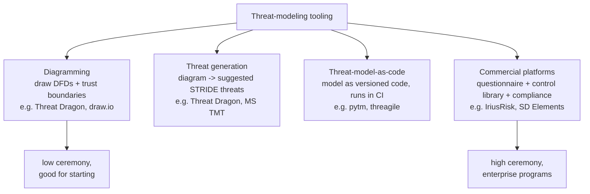
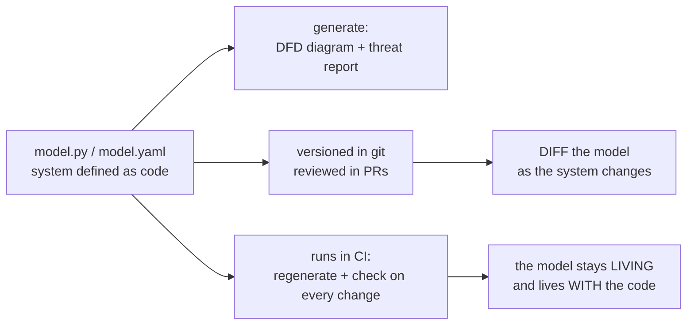
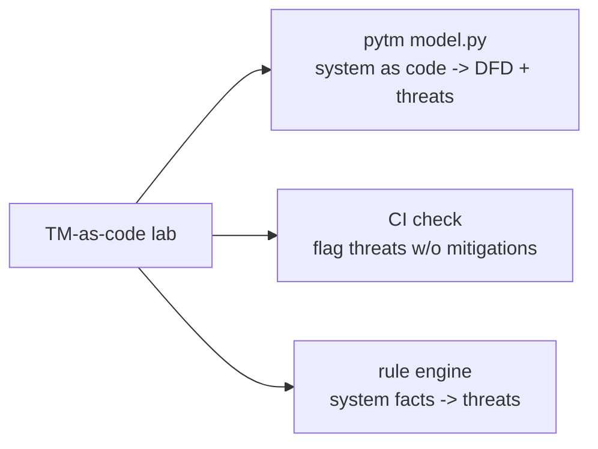

Chapters 3 and 4 taught threat modeling as a method and design review as a practice, and both were deliberately tool-agnostic — a whiteboard, a design doc, and the four questions are enough to threat-model well. This chapter adds the tools and automation that turn that method into a *scalable, repeatable program*: the diagramming tools that make DFDs quick to draw and share, the threat-generation tools that suggest STRIDE threats from your diagram, the "threat-modeling-as-code" frameworks that let you represent a model as versioned code living beside the application, and the commercial platforms that industrialise the whole thing with questionnaires, control libraries, and compliance mapping.

The chapter opens with a caveat that governs everything after it, because it is the single most important thing to understand about threat-modeling tooling: **a tool never replaces the thinking.** Threat modeling is a skill of structured reasoning (Chapter 3), and no tool — not even the most sophisticated commercial platform, not even an AI assistant — can do that reasoning for you. What tools *can* do is make the thinking faster, more consistent, more shareable, and more scalable: they automate the mechanical parts (drawing, suggesting known threats, tracking findings), enforce consistency (so any team produces a comparable model), and integrate the model into the developer workflow (so it lives and evolves with the code rather than dying as a one-time document). Used that way, tooling is a genuine force multiplier for a threat-modeling program. Used as a *substitute* for the thinking — "we bought IriusRisk, so we do threat modeling now" — it produces the security theater of Chapter 1: activity that looks like threat modeling without the reasoning that gives it value.

The most important shift this chapter covers is **threat-modeling-as-code** — representing the model as code (with frameworks like pytm) that is versioned in git, reviewed in pull requests, diffed as the system changes, and run in CI. This is the tooling development that most closely realises Chapter 3's "lightweight and living" ideal and Chapter 2's "shift-left, automate into the pipeline" principle, because a model-as-code *automatically* stays with the system and can be checked continuously. The chapter builds toward a hands-on lab that does exactly this: a pytm model, a generated DFD and threat report, running in CI, plus a small rule engine showing how threat-generation tools map system facts to relevant threats. Tools amplify the practice; they never replace it — hold that, and this chapter's tools become genuinely useful.

## Why This Matters

The practical reason tooling matters is scale and consistency — the same problem Chapter 4's design-review program faced. A whiteboard threat model is excellent for a single session but does not scale, version, or persist: the photo of the whiteboard is lost in a Slack channel, the model does not update when the design changes, and every team does it differently. Tooling addresses each of these — a diagram in a tool is shareable and editable, a model-as-code is versioned and lives with the system, a threat-generation tool ensures consistency across teams, and a platform provides a common process and audit trail. For a ProdSec engineer building a *program* (not just doing one-off models), tooling is what makes threat modeling a repeatable organisational capability rather than a personal skill exercised ad hoc.

But the reason this deserves careful treatment — including a whole chapter's worth of caveats — is that **tooling is where threat-modeling programs most often go wrong.** The seductive failure is to buy a platform and mistake owning it for doing the practice: the tool generates a long list of generic threats from a questionnaire nobody thought hard about, the list is filed, a compliance box is ticked, and no actual design reasoning happened. This is worse than no tool, because it produces the *appearance* of threat modeling — a report, a dashboard, a number — while delivering none of the value, and it consumes budget and credibility that a real practice needed. The ProdSec engineer has to understand tooling well enough to use it as an amplifier and to resist it as a substitute, which requires understanding both what tools genuinely do and where their limits are.

And the threat-modeling-as-code development matters because it is the tooling that best fits modern engineering. A model-as-code is reviewed like code, versioned like code, and run in CI like code — which means it integrates into the developer workflow (Chapter 1's "meet engineering where it is") and stays living (Chapter 3's ideal) *automatically*, rather than depending on someone remembering to update a document. For an engineering-literate ProdSec engineer, threat-modeling-as-code is the approach most likely to make threat modeling actually stick in a fast-moving org — which is why the chapter builds toward it in the lab.

## Part 1: Why Tooling — and the Caveat That Governs Everything

The value tooling adds, and the limit it cannot cross.

**What tools genuinely do:**

- **Speed the mechanical parts** — drawing DFDs, laying out trust boundaries, formatting reports. The thinking is the same; the drudgery is faster.
- **Enforce consistency** — a tool with a defined process and threat library produces comparable models across teams and reviewers, so quality does not depend on who ran the session.
- **Suggest known threats** — threat-generation tools map system facts (a data flow crossing a boundary, an unencrypted store) to relevant known threats and countermeasures, so the reviewer does not have to recall every applicable threat from memory (a completeness aid, like STRIDE-per-element in Chapter 3).
- **Persist and version the model** — a model in a tool (especially as-code) survives, updates, and is shareable, rather than being a lost whiteboard photo.
- **Integrate into the workflow** — model-as-code and platform integrations put threat modeling into the pipeline and the developer's tools (Chapter 2).
- **Track findings and compliance** — platforms tie threats to countermeasures, track their status, and map to compliance requirements (Notebook 42), providing the audit trail a program needs (Notebook 47).

**The caveat that governs all of it:** *a tool never replaces the thinking.* Threat modeling is structured reasoning about how a specific system could fail (Chapter 3's four questions), and:

- A tool cannot understand *your* system's specific business logic, its real trust assumptions, or the novel threat that does not match any library pattern. It suggests *known* threats; the dangerous ones are often the system-specific ones only a human reasoning about the design will find.
- A tool's generated threat list is a *starting point for thinking*, not a finished analysis. A list of forty generic threats from a questionnaire, filed without a human deciding which are real and significant, is not a threat model — it is a report that resembles one.
- The value of threat modeling comes from the *reasoning* (which threats are real, how bad, what to do), and no tool does the reasoning. The tool speeds and structures the reasoning; a human must still do it.

Hold this caveat as the frame for every tool below: each is judged by how well it *amplifies* the thinking, and each fails when used to *substitute* for it. The best tool in the hands of someone who does not do the reasoning produces theater; a whiteboard in the hands of someone who does produces a real threat model. The tool is a multiplier of the practice, and multiplying zero is still zero.

## Part 2: The Categories of Tooling

Threat-modeling tools fall into categories by what they primarily do, and knowing the categories helps you pick the right tool for a team's maturity (Part 8).



- **Diagramming tools** help you *draw* the system (DFDs, trust boundaries) — the decomposition of Chapter 3. Some are general (draw.io); the threat-modeling-specific ones (Threat Dragon) understand the DFD vocabulary and trust boundaries.
- **Threat-generation tools** take the diagram and *suggest threats* — mapping elements and flows to relevant STRIDE threats and countermeasures. This automates the completeness aid of STRIDE-per-element (Chapter 3, Part 4). Threat Dragon and the Microsoft tool both do this.
- **Threat-model-as-code frameworks** represent the model as *code* (pytm in Python, threagile in YAML) that generates the diagram and threat report and lives in the repo, versioned and CI-runnable (Part 5). This is the developer-workflow-native category.
- **Commercial platforms** (IriusRisk, SD Elements) industrialise the whole practice: questionnaire-driven modeling, large control/threat libraries, compliance mapping, workflow integration, and program dashboards. High-ceremony, aimed at enterprise programs (Part 4).

The categories are not exclusive — many tools span several (Threat Dragon both diagrams and generates threats). The point is to understand what a tool *primarily* offers, so you match it to the need: a starting team needs diagramming and generation (low ceremony); an engineering-native team wants as-code; a large enterprise program with compliance demands may justify a platform.

## Part 3: The Open-Source and Microsoft Tools

The accessible, no-cost tools most teams start with.

**OWASP Threat Dragon** is the free, open-source, OWASP-flagship threat-modeling tool. It lets you draw DFDs with the proper vocabulary (processes, stores, flows, trust boundaries), and it generates STRIDE threats for the elements, letting you record threats, their status, and mitigations against each. It runs as a desktop app or in the browser, stores models as JSON (so they can be versioned in git — a nod toward as-code), and it is genuinely good for a team getting started: no cost, no procurement, low ceremony, and it embodies the Chapter 3 method (DFD + STRIDE) directly. For most teams beginning a threat-modeling practice, Threat Dragon is the right first tool — it structures the method without imposing heavyweight process.

**The Microsoft Threat Modeling Tool (TMT)** is Microsoft's free desktop tool, built around a **template-driven auto-generation** model: you draw the system using a stencil set (with element types that carry security properties), and the tool *automatically generates* a list of threats based on the template's rules mapping element interactions to threats. Its strength is the automation — it produces a thorough threat list from the diagram with less manual STRIDE-walking — and its templates can be customised to an org's patterns. Its historical weaknesses are being Windows-focused (a friction for many teams) and generating a *long, sometimes noisy* list that requires human triage (the caveat of Part 1: the generated list is a starting point, not the answer). It is a solid choice, especially in Microsoft-centric shops, and its auto-generation illustrates the threat-generation category well.

Both tools share the pattern and the caveat: they turn a diagram into a suggested threat list *systematically* (the completeness value), but the suggested list must then be *reasoned about* by a human — which threats are real, which are significant, what to do. The tool did the mechanical enumeration; the human does the analysis. Used that way (draw, generate, then *think*), they are genuine aids. Used as "the tool generated 60 threats, we're done," they are theater.

## Part 4: IriusRisk and the Commercial Platform Category

At the enterprise end are **commercial threat-modeling platforms** — IriusRisk is the best-known, alongside SD Elements and others — which industrialise threat modeling into an organisational program.

What the platforms add over the free tools:

- **Questionnaire-driven modeling** — instead of (or alongside) drawing a diagram, you *answer questions* about the system ("does it handle payments? is it multi-tenant? what auth does it use?"), and the platform generates the relevant threats and required countermeasures from a large rule library. This lowers the skill barrier — a developer can produce a first-pass model by answering questions — which is both the strength (scale, accessibility) and the risk (a questionnaire filled in without thought produces a generic model, Part 1's caveat sharpened).
- **Large threat and control libraries** — curated, maintained catalogues mapping system characteristics to threats *and* to specific countermeasures/controls, often mapped to standards (OWASP ASVS, etc.). The library encodes accumulated knowledge, so the model draws on more than the reviewer's memory.
- **Compliance mapping** — tying threats and controls to regulatory and standards requirements (Notebook 42), producing the evidence a compliance program needs (Notebook 47). This is a major driver of platform adoption in regulated industries.
- **Workflow and program integration** — issue-tracker integration, CI/CD hooks, dashboards, and audit trails that make threat modeling a tracked organisational process (Notebook 47).

The honest assessment a ProdSec engineer needs:

- **Platforms genuinely help large programs** — the scale, consistency, compliance mapping, and audit trail are real value for an enterprise threat-modeling program covering many teams with regulatory obligations. This is what they are for.
- **They do not create a practice out of nothing** — and this is the platform-specific version of Part 1's caveat, and the most expensive mistake in this whole area. Buying a platform does *not* mean an org "does threat modeling." If the questionnaires are filled in thoughtlessly and the generated threats are filed without human reasoning, the platform produces industrial-scale theater — a great deal of activity, dashboards full of "threats," and no actual design reasoning. **The platform amplifies a practice; it cannot substitute for one.** An org without the threat-modeling *skill and culture* (Chapters 3–4) will get little from a platform except a false sense of coverage and a large invoice.

The judgement (Part 8): a platform is worth it for a *mature program at scale with compliance needs* that has already established the practice and needs to industrialise it. For a team *starting* threat modeling, a platform is usually the wrong first move — it imposes ceremony and cost before the practice exists, and it invites the substitute-for-thinking failure. Start with the free tools and the skill; adopt a platform when the program's scale and compliance demands genuinely justify it and the practice is real enough to fill it with thought.

## Part 5: Threat-Modeling-as-Code

The most important tooling development for engineering-native teams, and the one that best realises Chapter 3's "living" ideal and Chapter 2's "automate into the pipeline" principle: **representing the threat model as code.**

Frameworks like **pytm** (Python) and **threagile** (YAML) let you define the system — its elements, data flows, trust boundaries, and data — as code, and then *generate* the DFD and the threat report from that code. The model is a file in the repository.



Why this is powerful — each property maps to a lesson from the earlier chapters:

- **Versioned in git.** The model is tracked with the code, so its history is visible and it is backed up, shared, and never a lost whiteboard photo.
- **Reviewed in pull requests.** A change to the model is reviewed like any code change — which brings threat modeling into the developer workflow (Chapter 1's "meet engineering where it is") and makes model changes a normal part of design changes.
- **Diffable.** When the system changes, the model change is a *diff* — you can see exactly what was added and what new threats it introduced, which makes *incremental* threat modeling (Chapter 3, Part 9) natural: you threat-model the diff, not the whole system.
- **Runs in CI.** The model can be regenerated and *checked* on every change — the threat report is always current, and CI can flag when a change introduces a threat with no recorded mitigation (a lightweight, non-blocking gate, Chapter 2, Part 6). This is what makes the model *automatically living* (Chapter 3's ideal) rather than dependent on someone remembering to update it.
- **Lives with the code.** Because the model is in the repo, it evolves with the system by construction, and it is *the engineers'* artifact (they edit code), not a separate security-team document — which is exactly the ownership Chapter 4 wanted.

The honest limits, holding Part 1's caveat: as-code still requires the *thinking* — someone has to define the model thoughtfully and reason about the generated threats; the code does not invent the trust boundaries or judge the threats. And as-code has a higher initial skill barrier than clicking in a diagramming tool (you write code), which suits engineering-native teams better than non-technical ones. But for a ProdSec engineer working with a modern engineering org, threat-modeling-as-code is often the approach most likely to make threat modeling *stick*, because it fits how engineers already work and stays living automatically. The lab (Part 9) builds exactly this.

## Part 6: Threat Libraries and Rule Engines

Underneath the threat-generation tools (Threat Dragon, MS TMT) and the platforms (IriusRisk) is a common mechanism worth understanding on its own: a **rule engine** that maps *system facts* to *relevant threats and countermeasures*.

The idea is simple and powerful: a system has *facts* (a data flow crosses a trust boundary; a store holds PII; a component is internet-facing; a flow is unencrypted), and a *threat library* is a set of rules of the form "*if* this fact holds, *then* these threats apply and these countermeasures address them." The engine evaluates the rules against the system's facts and produces the relevant threats — automating the STRIDE-per-element completeness aid (Chapter 3, Part 4) and grounding it in a curated library (the attack-library idea of Chapter 3, Part 5).

For example:

- *Fact:* a data flow carrying credentials crosses the internet trust boundary. *Rule:* unencrypted sensitive flow → information-disclosure and tampering threats → countermeasure: TLS.
- *Fact:* a process accepts external input. *Rule:* untrusted input → injection threats → countermeasure: validation/parameterisation.
- *Fact:* a multi-tenant data store. *Rule:* shared store across tenants → cross-tenant disclosure → countermeasure: data-layer isolation.

Understanding the rule-engine mechanism matters for three reasons:

- **It demystifies the tools.** Threat Dragon, MS TMT, and IriusRisk are, at core, rule engines over threat libraries. Knowing this lets you evaluate them (how good is the library? can I customise the rules?) and understand their limits (they only know the rules in the library — they miss the novel, system-specific threat, Part 1's caveat).
- **You can build a lightweight one.** For a team's specific patterns, a small custom rule engine (the lab builds one) that encodes *your* org's recurring threats and paved-road countermeasures can be more valuable than a generic library, because it captures your specific context.
- **It scales completeness.** A good rule library ensures the *known* threats are never missed — which frees the human reasoning to focus on the *unknown*, system-specific ones the library cannot know. This is the ideal division of labour: the engine handles the mechanical completeness, the human handles the novel analysis.

The library is only as good as its rules, and it must be *maintained* — a stale library misses new threat classes (the fast half-life of Notebook 44). And, holding the caveat one more time: the rule engine automates the *known*; the dangerous threats are often the *unknown* ones no rule anticipates, which is why the human reasoning is irreplaceable.

## Part 7: AI-Assisted Threat Modeling — Promise and Limits

A live development worth treating honestly (Notebook 44, Chapter 7's AI landscape shift applied here): using AI/LLMs to assist threat modeling.

**The promise:** an LLM can read a design doc or a system description and *suggest* threats, mitigations, and even a first-pass DFD — potentially faster and more broadly than a rule library, because it draws on a vast corpus rather than a fixed rule set, and it can reason about system-specific details a rigid rule engine cannot. Used as a *brainstorming aid* — "what threats might apply to this design?" — it can surface considerations a human might miss and accelerate the mechanical enumeration, much like an interactive, more-flexible threat-generation tool.

**The limits, which are the same caveat as Part 1, sharpened for AI:**

- **It does not do the reasoning; it *pattern-matches* over the reasoning others have written.** An LLM suggests plausible threats, but it does not *understand* your system's real trust assumptions or business logic — it produces confident-sounding output that may be generic, wrong, or miss the system-specific threat that matters most. Its suggestions are a starting point for human thinking, not a finished analysis.
- **It can be confidently wrong (hallucination).** An LLM may assert a threat that does not apply, miss one that does, or suggest a mitigation that is inappropriate — with the same confident tone either way. Every AI suggestion must be *verified by a human who understands the system*, or it is worse than nothing.
- **It is a completeness and speed aid, not a judgement engine.** Deciding which threats are real, how bad they are, and what to do remains human judgement (Chapter 3, Part 7) — the part of threat modeling that carries the value.
- **Data-sensitivity caution.** Feeding a design into an external AI service is disclosing it (the instruction-boundary and data-handling concerns of the whole curriculum); use it appropriately for the sensitivity of the design.

The honest stance a ProdSec engineer should take (and this is the Notebook 44, Chapter 7 landscape principle applied): **AI is a promising *assistant* for the mechanical and brainstorming parts of threat modeling, and not a replacement for the human reasoning that gives threat modeling its value.** Used to *accelerate* a human who then does the judgement — surfacing candidate threats to consider, drafting a first-pass model to critique — it is a real and growing aid. Used to *replace* the human reasoning — trusting the AI's threat list as the analysis — it produces the same theater as any other tool used as a substitute, with the added risk of confident hallucination. Track the development (it is improving fast), use it as an amplifier, and never let it be the judgement.

## Part 8: Choosing the Right Tool for a Team's Maturity

Pulling the categories together into a decision, governed by the anti-pattern that recurs through the chapter.

A rough maturity-to-tool mapping:

| Team maturity | Right tooling | Why |
|---|---|---|
| **Starting out** | Whiteboard / **Threat Dragon** (free diagramming + STRIDE) | Learn the *skill* first; low ceremony, no cost, no procurement |
| **Establishing the practice** | Threat Dragon or **MS TMT**, plus a design-doc template | Consistency and generation, still lightweight |
| **Engineering-native, wants it living** | **Threat-model-as-code** (pytm/threagile) in CI | Fits the developer workflow, stays living automatically |
| **Mature program at scale + compliance** | A **commercial platform** (IriusRisk/SD Elements) | Scale, control libraries, compliance mapping, audit trail |

The decision principles:

- **Start with the skill, not the tool.** The most common mistake is buying tooling (especially a platform) *before* the threat-modeling skill and culture exist (Chapters 3–4). Establish the practice with free tools and real reasoning first; the tool then amplifies a practice that exists. A platform bought to *create* a practice creates theater instead.
- **Match ceremony to need.** Low-ceremony tools (Threat Dragon, as-code) suit most teams; high-ceremony platforms suit large programs with compliance demands and are overkill (and counterproductive) for a small team. Do not impose enterprise ceremony on a team that needs to learn the skill.
- **Favour tools that fit the workflow.** A tool engineers will actually use — that fits their existing workflow (as-code in the repo, or a tool in their process) — beats a "better" tool they route around (Chapter 1's meet-engineering-where-it-is). Adoption beats features.
- **Beware the platform-as-substitute anti-pattern.** The chapter's recurring warning, and the most expensive tooling mistake: buying a platform and mistaking owning it for doing the practice. A platform is worth it *only* for a mature program that will fill it with real reasoning and genuinely needs the scale and compliance mapping — not as a shortcut to a practice that does not yet exist.

The synthesis: tools are chosen to *amplify* a threat-modeling practice appropriate to the team's maturity — start with free tools and the skill, adopt as-code to make it living for engineering-native teams, and reach for a commercial platform only when a mature, at-scale, compliance-driven program genuinely justifies it. And through every choice, hold Part 1's caveat: the tool multiplies the practice, and there is no tool that substitutes for the thinking.

## Part 9: Hands-On Lab — Threat-Model-as-Code with pytm

### 9.1 What we are building

A complete threat-model-as-code for a small system: a **pytm model** that defines the system as code (Part 5), *generates* its DFD and threat report, a **CI check** that keeps it living (Parts 5, Chapter 2), and a **lightweight rule engine** showing how threat-generation tools map facts to threats (Part 6).



Python 3 (pytm optional — a fallback pure-Python version is shown so the lab runs anywhere).

### 9.2 Define the model as code

```python
# model.py -- a threat model as versioned code (Part 5).
# With pytm installed this uses the real framework; the structure is the point.
try:
    from pytm import TM, Server, Datastore, Actor, Boundary, Dataflow
    HAVE_PYTM = True
except ImportError:
    HAVE_PYTM = False

if HAVE_PYTM:
    tm = TM("Analytics Dashboard")
    internet = Boundary("Internet")
    internal = Boundary("Internal")

    user = Actor("User");            user.inBoundary = internet
    web  = Server("Web Server");     web.inBoundary = internal
    db   = Datastore("User DB");     db.inBoundary = internal; db.storesPII = True

    f1 = Dataflow(user, web, "login + requests");     f1.protocol = "HTTPS"; f1.isEncrypted = True
    f2 = Dataflow(web, db, "credential lookup");      f2.protocol = "TLS";   f2.isEncrypted = True

    tm.process()   # generates the DFD (dot) and the threat report
    print("pytm model processed -> DFD + threat report generated")
else:
    # Fallback: the same model as plain data, so the lab runs without pytm.
    MODEL = {
        "boundaries": ["Internet", "Internal"],
        "elements": [
            {"name":"User","type":"actor","boundary":"Internet"},
            {"name":"Web Server","type":"server","boundary":"Internal"},
            {"name":"User DB","type":"datastore","boundary":"Internal","pii":True},
        ],
        "flows": [
            {"from":"User","to":"Web Server","data":"login+requests","boundary_crossed":True,"encrypted":True},
            {"from":"Web Server","to":"User DB","data":"cred lookup","boundary_crossed":False,"encrypted":True},
        ],
    }
    print("model defined as data (pytm not installed) -- structure is identical")
```

```bash
pip install pytm > /dev/null 2>&1 || true
python3 model.py

# Sample output:
# model defined as data (pytm not installed) -- structure is identical
# (with pytm: "pytm model processed -> DFD + threat report generated")
```

The key property (Part 5): this model is *code in the repo*, versioned, diffable, and reviewable in a PR — not a whiteboard photo.

### 9.3 A lightweight rule engine — facts to threats

```python
# rules.py -- the mechanism inside every threat-generation tool (Part 6).
MODEL = {
    "elements": [
        {"name":"User DB","type":"datastore","pii":True,"encrypted_at_rest":False},
        {"name":"Web Server","type":"server","accepts_external_input":True},
    ],
    "flows": [
        {"from":"User","to":"Web Server","boundary_crossed":True,"encrypted":True},
        {"from":"Web Server","to":"Analytics","boundary_crossed":True,"encrypted":False},
    ],
}

# Rules: (predicate over a fact) -> (threat, countermeasure). This IS a threat library.
def evaluate(model):
    findings = []
    for e in model["elements"]:
        if e["type"] == "datastore" and e.get("pii") and not e.get("encrypted_at_rest"):
            findings.append((e["name"], "Info disclosure: PII unencrypted at rest",
                             "encrypt at rest (paved-road KMS)"))
        if e.get("accepts_external_input"):
            findings.append((e["name"], "Tampering/Injection: untrusted input",
                             "validate + parameterize (paved-road input lib)"))
    for fl in model["flows"]:
        if fl["boundary_crossed"] and not fl["encrypted"]:
            findings.append((f"{fl['from']}->{fl['to']}",
                             "Info disclosure/Tampering: unencrypted flow across a boundary",
                             "enforce TLS"))
    return findings

print(f"{'ELEMENT/FLOW':<24} THREAT -> COUNTERMEASURE")
print("-" * 78)
for who, threat, fix in evaluate(MODEL):
    print(f"{who:<24} {threat}")
    print(f"{'':<24}   -> {fix}")
```

```bash
python3 rules.py

# Sample output:
# ELEMENT/FLOW             THREAT -> COUNTERMEASURE
# ------------------------------------------------------------------------------
# User DB                  Info disclosure: PII unencrypted at rest
#                            -> encrypt at rest (paved-road KMS)
# Web Server               Tampering/Injection: untrusted input
#                            -> validate + parameterize (paved-road input lib)
# User->Web Server->Analytics  Info disclosure/Tampering: unencrypted flow across a boundary
#                            -> enforce TLS
```

This tiny engine *is* the mechanism inside Threat Dragon, MS TMT, and IriusRisk (Part 6): facts → rules → threats + countermeasures. Encoding *your* org's recurring patterns and paved-road fixes into such an engine is often more valuable than a generic library — and it makes the completeness automatic, freeing the human to hunt the novel threats the rules cannot know (Part 1's caveat).

### 9.4 A CI check that keeps the model living

```python
# ci_check.py -- fail CI if a threat has no recorded mitigation (Parts 5, Ch2 gate).
# The threat model as code -> a lightweight, non-blocking-by-default CI gate.
import sys

# Threats with their mitigation status (would be parsed from the model report).
THREATS = [
    {"threat": "PII unencrypted at rest",       "mitigated": True},
    {"threat": "unencrypted flow to Analytics", "mitigated": False},  # <- gap
    {"threat": "untrusted input to Web Server",  "mitigated": True},
]

unmitigated = [t for t in THREATS if not t["mitigated"]]
print(f"threat-model CI check: {len(THREATS)} threats, {len(unmitigated)} unmitigated")
for t in unmitigated:
    print(f"  [!] no recorded mitigation: {t['threat']}")

if unmitigated:
    print("\nnon-blocking WARNING: record a mitigation or an accepted-risk decision.")
    # Start non-blocking (Ch2, Part 6): exit 0 but warn. Make blocking once trusted.
    sys.exit(0)
print("all threats have a recorded mitigation or acceptance -> pass")
```

```bash
python3 ci_check.py

# Sample output:
# threat-model CI check: 3 threats, 1 unmitigated
#   [!] no recorded mitigation: unencrypted flow to Analytics
#
# non-blocking WARNING: record a mitigation or an accepted-risk decision.
```

This is Chapter 3's "living" model and Chapter 2's "automate into the pipeline" realised: on every change, CI regenerates the model and flags any threat lacking a recorded mitigation or acceptance — *non-blocking* at first (Chapter 2, Part 6), earning the right to block once trusted. The model can no longer silently go stale, because CI checks it every change.

### 9.5 Extending the lab

Install pytm and generate the real DFD image and HTML threat report from `model.py`; commit the model to a repo and make a design change as a PR to see the model *diff* (Part 5); expand the rule engine with your org's real recurring threats and paved-road countermeasures; wire `ci_check.py` into a real GitHub Actions workflow (Notebook 46) as a non-blocking gate; try the same system in Threat Dragon and compare the generated threats to your rule engine's; and — holding Part 1's caveat — for each generated threat, do the *human* step: decide which are real and significant for this specific system, and find the one system-specific threat the tools missed.

## Part 10: Common Pitfalls

**Buying a tool to substitute for the practice.** The chapter's central warning. A tool (especially a platform) amplifies a threat-modeling practice; it cannot create one. An org without the skill and culture (Chapters 3–4) gets theater and an invoice, not security.

**Trusting the generated threat list as the analysis.** Threat-generation tools and platforms produce a *starting point* for thinking, not a finished threat model. A list filed without a human deciding which threats are real and significant is not a threat model.

**Missing the system-specific threats.** Rule engines and libraries only know their rules; the dangerous threats are often the novel, business-logic-specific ones no rule anticipates. The tool handles the known; the human must hunt the unknown.

**A platform bought before the skill exists.** Imposing enterprise ceremony and cost on a team that has not learned to threat-model invites the substitute-for-thinking failure. Start with free tools and the skill; adopt a platform when a mature program justifies it.

**Choosing a tool engineers route around.** A "better" tool that does not fit the workflow loses to a simpler one that does. Adoption beats features; favour tools that fit how engineers already work (as-code in the repo, or their existing process).

**A model that dies as a one-time artifact.** A diagram drawn once and never updated is the whiteboard-photo failure with a nicer tool. Threat-model-as-code + CI keeps the model living automatically; without that discipline, any tool's model goes stale.

**Making the model-as-code CI check blocking on day one.** A new check that blocks on every unmitigated threat halts development on noise. Start non-blocking, tune, earn the right to block (Chapter 2, Part 6).

**Trusting AI suggestions without verification.** LLMs pattern-match plausibly and hallucinate confidently. AI is a brainstorming/acceleration aid; every suggestion needs human verification by someone who understands the system, and design-sensitivity limits apply to feeding it into external services.

**A stale threat library.** A rule library that is not maintained misses new threat classes (the fast half-life of Notebook 44). Maintain the rules, or the automated completeness quietly degrades.

**Confusing tool coverage with security.** A dashboard full of "threats modeled" measures activity, not risk reduced (Chapter 1's theater). Measure whether the tooled models drove real design decisions and caught real flaws.

## Final Revision / Summary

- Tooling turns threat modeling from a whiteboard exercise into a **scalable, repeatable program** — but the governing caveat is absolute: **a tool never replaces the thinking.** Tools *amplify* the reasoning (speed the mechanical parts, enforce consistency, suggest known threats, persist and version the model, integrate into the workflow); they cannot *do* the reasoning, and used as a substitute they produce security theater.
- **Categories**: **diagramming** (draw DFDs — Threat Dragon), **threat generation** (diagram → suggested STRIDE threats — Threat Dragon, MS TMT), **threat-model-as-code** (model as versioned CI-run code — pytm, threagile), and **commercial platforms** (questionnaire + control library + compliance — IriusRisk, SD Elements). Match the category to the team's maturity and need.
- **OWASP Threat Dragon** (free, open-source, DFD + STRIDE generation, JSON models) is the right *first* tool for most teams — low ceremony, embodies the Chapter 3 method. **Microsoft TMT** (free, template-driven auto-generation) is solid in Microsoft shops; both produce a suggested list that a human must then *reason about*.
- **Commercial platforms** (IriusRisk) industrialise the practice — questionnaire-driven modeling, large threat/control libraries, **compliance mapping**, program dashboards. They genuinely help *mature programs at scale with compliance needs*, but **cannot create a practice out of nothing** — a platform filled with thoughtless questionnaires produces industrial-scale theater. Adopt one only when a real practice exists to fill it.
- **Threat-model-as-code** (pytm, threagile) is the key development for engineering-native teams: the model is **versioned in git, reviewed in PRs, diffable** (natural incremental modeling), **runs in CI** (stays living automatically, as a non-blocking gate), and **lives with the code** (the engineers' artifact). It best realises Chapter 3's "living" ideal and Chapter 2's "automate into the pipeline" — at the cost of a higher skill barrier.
- Under the generation tools is a **rule engine over a threat library**: system *facts* → rules → relevant *threats + countermeasures* (automating STRIDE-per-element completeness). Understanding it demystifies the tools, lets you build a lightweight custom engine for your org's patterns, and clarifies the limit — the engine knows only the *known* threats, so the human hunts the *unknown* ones. Libraries must be maintained.
- **AI-assisted threat modeling** is a promising *brainstorming and acceleration* aid that pattern-matches plausibly — and a confident *hallucinator*. It suggests candidate threats faster and more flexibly than a rule library, but does not do the judgement, can be confidently wrong, and needs human verification and data-sensitivity care. Use it as an amplifier, never as the judgement.
- **Choose by maturity**: start with the *skill* + free tools (Threat Dragon), add as-code to make it living for engineering teams, reach for a platform only when a mature at-scale compliance-driven program justifies it. **Start with the skill not the tool**, **match ceremony to need**, **favour tools engineers won't route around**, and **beware the platform-as-substitute anti-pattern** — the most expensive tooling mistake.

## Cheat Sheet / Quick Reference

**The governing caveat**

```
a tool NEVER replaces the thinking
tools amplify reasoning (speed, consistency, known-threat suggestion, persistence, CI)
they cannot DO the reasoning -> used as a substitute = security theater
multiplying zero is still zero
```

**Tool categories -> when**

```
diagramming (Threat Dragon)          -> starting out, learn the method
threat generation (Threat Dragon/TMT)-> establishing the practice
threat-model-as-CODE (pytm/threagile)-> engineering-native, keep it living
commercial platform (IriusRisk)      -> mature program at scale + compliance ONLY
```

**Threat-model-as-code (the key development)**

```
model = code in the repo -> versioned | reviewed in PRs | DIFFABLE (incremental)
| runs in CI (living automatically, non-blocking gate) | lives WITH the code
best realises "lightweight + living" and "automate into the pipeline"
```

**Rule engine (inside every generation tool)**

```
system FACTS -> rules -> relevant THREATS + COUNTERMEASURES
automates KNOWN-threat completeness | build a custom one for your org's patterns
limit: knows only the library -> human hunts the UNKNOWN, system-specific threats
maintain the library (fast half-life)
```

**AI-assisted**

```
promise: fast, flexible brainstorming of candidate threats + first-pass models
limits: doesn't do judgement | hallucinates confidently | verify every suggestion
        | data-sensitivity of feeding designs to external services
use as an AMPLIFIER, never as the judgement
```

**Choosing (decision principles)**

```
start with the SKILL, not the tool | match ceremony to need
favour tools engineers won't route around (adoption > features)
BEWARE platform-as-substitute (buying it != doing the practice) -- the costliest mistake
```

## Practice Labs & Resources

**Try the tools**
- **OWASP Threat Dragon** — draw the Chapter 3/4 sample system, generate STRIDE threats, and compare to your manual pass. The right first tool.
- **Microsoft Threat Modeling Tool** — model the same system and see the template-driven auto-generation (and the noise that needs human triage).
- **pytm** — build the Part 9 model-as-code, generate the DFD and report, and run it in CI.

**Hands-on**
- Extend the Part 9 lab: real pytm output, a model diff in a PR, a custom rule engine for your org's patterns, a real GitHub Actions non-blocking gate, and the human step of hunting the tool-missed threat.
- Encode five of your org's recurring threats and paved-road countermeasures into a rule engine.
- Try an AI assistant on a design description, then *verify* every suggestion against the system — noting the generic ones, the wrong ones, and the real one it missed.

**Deliberate practice**
- For each tool, articulate what it genuinely amplifies and where its limit is (Part 1's caveat), so you can evaluate any threat-modeling tool.
- Practise the maturity-to-tool judgement (Part 8): for several fictional teams, recommend the right tooling and justify why a platform is or isn't warranted.

**Further reading**
- Chapters 3 (threat modeling method) and 4 (design review practice) — the practice this tooling amplifies; never adopt the tools without the skill.
- The **OWASP Threat Dragon** and **pytm** documentation and repositories; the **Threat Modeling Manifesto** (whose values — a living, collaborative practice — the as-code approach best serves).
- Notebook 44, Chapter 7 (the AI landscape shift) — the frame for AI-assisted threat modeling; Notebook 46 (DevSecOps) — the CI/CD pipeline the as-code model runs in; Notebook 47 — the program metrics and compliance context platforms serve.
- Chapters 6–7 (secure coding) next — the implementation-phase practice that the design-phase threat modeling feeds into.
