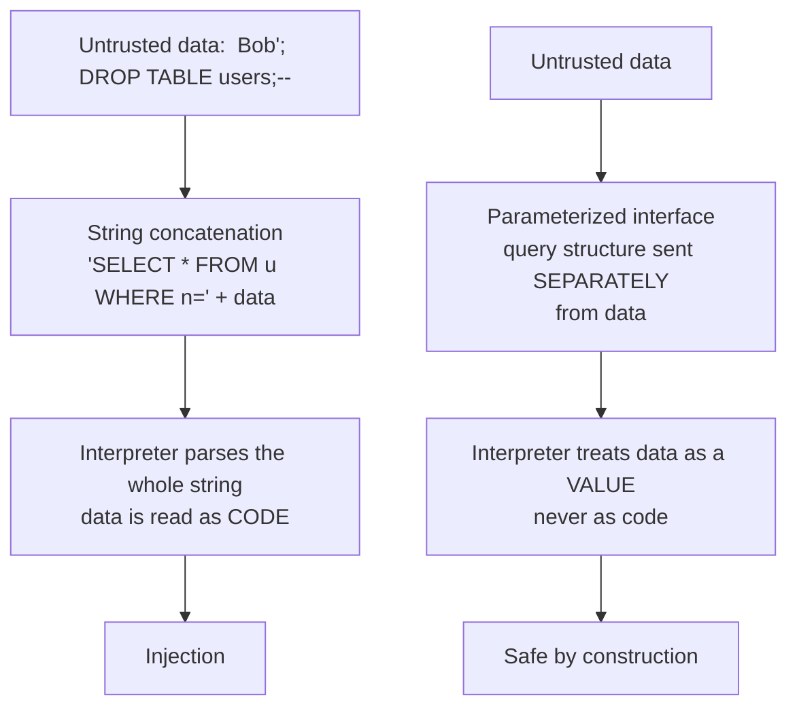
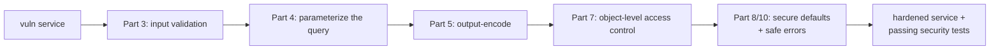

The previous three chapters worked above the code. Threat modeling, design review, and tooling all ask *what could go wrong with this system* before a line is written. This chapter descends into the code itself, where the abstract threats of a data-flow diagram become concrete lines that either hold or fail. It is the hinge of the notebook: everything before it decides *what* to protect, and everything after it — code review, SAST, the whole DevSecOps pipeline of Notebook 46 — is about *checking* that the protection is present. This chapter is about writing the protection in the first place.

The organizing observation is almost embarrassing in its simplicity: **the overwhelming majority of real-world vulnerabilities are a small handful of coding mistakes, made over and over, across every language and framework for thirty years.** SQL injection is not a new idea; it is the same trust mistake as command injection, as XSS, as LDAP injection, as XXE — user input treated as trusted code. The CWE Top 25 that Chapter 8 dissects is not twenty-five unrelated problems; it is a few underlying errors wearing different costumes. Once you see the meta-patterns, secure coding stops being a checklist of a thousand rules and becomes a small number of principles you apply everywhere.

So this chapter is deliberately principle-first and language-agnostic. Chapter 7 takes these principles into the specific idioms of Python, JavaScript, Java, Go, and C/C++. Here we build the mental models — trust boundaries, the injection meta-pattern, defense in depth, secure defaults — that make those language details obvious rather than memorized.

## Why This Matters

There is a cost argument and there is a competence argument, and both point the same way.

The cost argument is the one every security program repeats because it is true: a flaw caught in the developer's editor costs minutes; the same flaw caught in code review costs an hour; in QA, a day; in production after a breach, potentially the company. The multiplier between "fixed as you type" and "fixed after an incident" is commonly cited in the hundreds, and while the exact number is soft, the direction is not. Secure coding is the cheapest security intervention that exists because it operates at the point where the flaw is born.

The competence argument is subtler and more important for an engineer's career. A developer who understands *why* parameterized queries work — not as a rule but as an instance of separating code from data — will never write an injection bug in any language, in any query API, for the rest of their career, including in APIs that have not been invented yet. A developer who has memorized "use prepared statements for SQL" will faithfully build a NoSQL injection, an LDAP injection, or an OS command injection the moment they leave the one context their rule covered. Principles transfer; rules do not. This chapter optimizes for the transfer, because the alternative is relearning the same lesson in every new technology for a whole career.

The connection to the rest of the curriculum is direct. Every offensive notebook — the web bugs of 21–27, the binary exploitation of 36 — exists because someone did not apply the principle here. Reading this chapter as the defender's inverse of those attacks is the most efficient way to internalize it.

## Part 1: Security Bugs vs Design Flaws

Not every security weakness is a coding bug, and conflating the two wastes effort. Gary McGraw's durable distinction: roughly half of all security problems are **bugs** — implementation mistakes in code — and roughly half are **flaws** — problems in the design itself.

| | Bug (implementation) | Flaw (design) |
|---|---|---|
| Lives in | A line or function of code | The architecture / the plan |
| Example | A missing bounds check; string-built SQL | Authenticating with a client-side check; no trust boundary between tiers |
| Found by | Code review, SAST, this chapter | Threat modeling, design review (Ch 3–4) |
| Fixed by | Editing the code | Re-architecting |
| Cost to fix late | High | Very high |

This chapter is about bugs — the implementation half — but the boundary matters because **you cannot code your way out of a design flaw.** If the design decided that the browser enforces authorization, no amount of careful input validation in the client fixes it; the fix is server-side enforcement, which is a design change. When secure coding feels impossible — when every control you add is trivially bypassable — the signal is usually that you are trying to patch a flaw at the bug layer, and the work belongs back in Chapter 4's design review. Knowing which layer you are on saves the effort of building elaborate code defenses around a broken foundation.

## Part 2: The Trust Boundary — The One Idea Underneath All of It

If this chapter has a single organizing concept, it is the **trust boundary**: the line a piece of data crosses when it moves from a source you do not control to a context you do. Everything about input handling follows from asking, at every boundary, *do I trust what is crossing, and what will it be interpreted as on the other side?*

```mermaid
flowchart LR
    subgraph Untrusted["Untrusted sources"]
        U1[HTTP request<br/>params, body, headers]
        U2[Uploaded files]
        U3[Third-party APIs]
        U4[Message queues]
        U5[Database rows<br/>written by users]
        U6[Environment / config<br/>if externally set]
    end
    Untrusted -->|TRUST BOUNDARY<br/>validate on entry| APP[Your application logic]
    APP -->|TRUST BOUNDARY<br/>encode on exit| Sinks
    subgraph Sinks["Dangerous sinks"]
        S1[SQL / NoSQL query]
        S2[OS command / shell]
        S3[HTML / browser]
        S4[File path]
        S5[LDAP / XML / template]
        S6[HTTP request the server makes]
    end
```



Two rules organize the entire input-handling discipline, and they are separate:

**Validate on the way in.** When untrusted data crosses into your application, check that it conforms to what you expect — the right type, range, length, and format. This happens once, at the boundary, and it is about *acceptance*: is this a plausible email address, a valid quantity, an in-range page number?

**Encode on the way out.** When data crosses *out* of your application into a dangerous sink — a database, a shell, a browser — transform it so the sink interprets it as data, not as instructions. This happens at every sink, and it is context-dependent: the encoding for HTML is not the encoding for SQL is not the encoding for a shell.

The single most common and most damaging confusion in all of secure coding is treating these as the same step — believing that if you "cleaned" the input on entry, it is safe at every exit. It is not. Data that is a perfectly valid product name on entry (`Bobby's Widgets`) is still dangerous at a SQL sink and at an HTML sink, and it needs different handling at each. Keep the two ideas distinct and most of the chapter follows. The critical mental shift Part 3 makes precise: **the data is never the problem; the interpretation at the sink is the problem.**

A note the offensive notebooks make vivid: **database rows and internal APIs are untrusted sources too.** Data that a user wrote yesterday, stored, and that you read back today crossed the boundary when they wrote it, and if you did not encode it at the sink then, it is a stored-XSS or second-order-injection payload now. "Internal" is not a synonym for "trusted."

## Part 3: Input Validation Done Right

Validation is acceptance filtering at the entry boundary. Done well it is a strong first layer; done as the *only* layer it is a false sense of security, because — as Part 4 insists — validation is not the durable fix for injection. Here is what "done well" means.

**Allowlist, not denylist.** Define what is *permitted* and reject everything else, rather than enumerating what is forbidden. A denylist is a bet that you thought of every bad input, and you did not — attackers make a living from the case you missed (a new encoding, a Unicode homoglyph, a nesting you did not anticipate). An allowlist fails closed: an input you never imagined is rejected by default rather than accepted by default.

```
# Denylist -- fragile, always incomplete
if "'" in name or "--" in name or "DROP" in name.upper(): reject()

# Allowlist -- robust, states the actual requirement
if not re.fullmatch(r"[A-Za-z0-9 .'-]{1,64}", name): reject()
```

**Syntactic vs semantic validation.** Syntactic validation checks *shape* — is this string formatted like an email, a date, a UUID. Semantic validation checks *meaning in context* — does this user ID actually belong to this account, is this date in the future when it must be. Syntactic validation is necessary and cheap; semantic validation is where authorization-adjacent bugs like IDOR actually get caught, and it cannot be done by a regex because it requires application state. Both are needed, and confusing "it is shaped like a valid ID" with "this user is allowed this ID" is exactly the gap Notebook 27's broken-object-level-authorization exploits.

**Canonicalize before you validate.** Validation must run on the *final, decoded* form of the input, because attackers hide in alternate encodings. `%2e%2e%2f` is `../`; `..%c0%af` is an overlong UTF-8 encoding of the same; a path can be normalized to reach `/etc/passwd` after your check passed on the encoded form. Decode and normalize to a single canonical representation *first*, then validate the canonical form. Validating before canonicalizing is a classic and subtle bypass — your allowlist checked a string that no longer exists by the time the sink sees it.

**Validate type, range, length, and format — in that order of cheapness.** Reject on the first failure. A page number should be an integer (type), 1 to 10000 (range); a comment should be under a length cap before you do anything expensive with it (a missing length cap is a denial-of-service and a memory bug waiting to happen); a date should match a format and then be a real date.

**Where validation happens matters: server-side, always.** Client-side validation is a UX feature — it gives fast feedback — and it is *never* a security control, because the client is untrusted (Part 2). Every check that matters is re-done on the server. This is the coding expression of the design principle that the browser enforces nothing.

The honest limit, stated plainly so Part 4 lands: **validation reduces attack surface but does not make injection safe.** A name field correctly allowlisted to letters and apostrophes still contains an apostrophe, and an apostrophe still breaks a string-built SQL query. Validation is a valuable layer; it is not the fix.

## Part 4: The Injection Meta-Pattern

Here is the most important single idea in the chapter. Every injection vulnerability — SQL, OS command, LDAP, XPath, XML, template, header, NoSQL — is the *same bug*: **untrusted data is concatenated into a string that a downstream interpreter parses as code, and the data escapes its intended data context into the code context.**



Once you see it as one pattern, the fix is also one idea: **separate code from data so the interpreter never has to guess which is which.** Concretely:

**Parameterization / prepared statements — the durable fix for injection into a query language.** The query *structure* is sent to the interpreter separately from the *values*, so the values can never be reparsed as structure. This is not escaping; it is a different channel. It is why `db.execute("SELECT * FROM u WHERE name = ?", (name,))` is safe no matter what `name` contains — the database receives the query and the value on separate rails and binds the value as data. Every mature query API has this: DB-API params, JDBC PreparedStatement, parameterized ORMs, MongoDB's operator objects. Use it *everywhere*, including for values you "know" are safe, because the habit is what protects you, not the per-case judgment.

**For sinks without a parameterization API, use a safe API instead of building the dangerous string.** OS command execution is the canonical case: do not build a shell string, because the shell is an interpreter and you are back to injection. Instead pass an **argument array to `exec` without a shell** (`subprocess.run(["convert", user_file, "out.png"], shell=False)`), so the OS receives the program and its arguments as separate items and there is no shell to reinterpret metacharacters. The principle is identical to parameterization: never hand a concatenated string to an interpreter.

**Escaping/sanitization is the fallback, not the default.** When no safe API exists — building a fragment of HTML, an LDAP filter, an XML document by hand — you must escape the data for that specific grammar. This is legitimate but fragile: it depends on getting the grammar exactly right, using a battle-tested library rather than your own, and never missing a context. Prefer it only when parameterization genuinely is not available, and reach for a real library (an HTML encoder, an LDAP escaper) rather than hand-rolled replacements, because the edge cases are where hand-rolled escaping dies.

The takeaway that Chapter 7 and Notebook 46 both build on: **you defeat injection by construction (parameterize / safe API), not by cleverness (sanitize).** Sanitization is where injection bugs hide; parameterization is where they cannot exist.

## Part 5: Output Encoding Per Context

Injection into a query language is defeated by parameterization. Injection into a *document* — most importantly HTML rendered by a browser — is defeated by **context-aware output encoding**, and the "context-aware" part is what people get wrong.

The browser is not one interpreter; it is several, and the same character is dangerous in different ways depending on where it lands:

| Context in the page | The escape that makes data safe | Getting it wrong |
|---|---|---|
| HTML element body | HTML-entity encode `< > & "` | Stored/reflected XSS |
| HTML attribute value | Attribute-encode, always quote the attribute | Attribute-breakout XSS |
| JavaScript string | JavaScript/Unicode-escape; better, don't inject into JS at all | Script-context XSS |
| URL parameter | URL-encode; validate the scheme (no `javascript:`) | Open redirect, `javascript:` XSS |
| CSS value | CSS-escape; strongly prefer not to | CSS-injection data theft |

The rule: **encode for the context the data lands in, at the moment it lands there, using the framework's context-aware encoder.** Modern templating (React's JSX, Angular, and auto-escaping template engines like Jinja2 with autoescape on) does this correctly by default, which is why the durable advice is *use a framework that auto-escapes and do not defeat it*. The XSS bugs in such frameworks almost all come from the escape hatches — `dangerouslySetInnerHTML`, `v-html`, `|safe`, `bypassSecurityTrustHtml` — which turn autoescaping off for a value. Treat every one of those as a place that must handle only data you have HTML-sanitized with a real sanitizer (DOMPurify), never raw untrusted input.

Two encodings that are not interchangeable, a point beginners stumble on: HTML-entity encoding makes data safe *in HTML*, and URL encoding makes data safe *in a URL*. Putting URL-encoded data into HTML, or vice versa, both displays wrong and can still be exploitable. The context determines the encoder; there is no universal "make safe" function, and the search for one is exactly the sanitization trap of Part 4 in a new setting.

## Part 6: The Confused Deputy and SSRF

A distinct family that is not classic injection but shares the trust-boundary DNA: the **confused deputy**, where your privileged server is tricked into using its privileges on an attacker's behalf. **Server-Side Request Forgery (SSRF)** is the modern flagship — the server makes an HTTP request to a URL the attacker controls, and the server's network position (inside the perimeter, holding cloud metadata credentials) is the prize.

The coding-level defenses, in order of strength:

- **Allowlist the destination.** If the feature fetches from a fixed set of hosts, allowlist them and reject everything else. This is the only strong defense and, where the use case permits, the correct one.
- **Reject internal and link-local ranges after resolving DNS** — `127.0.0.0/8`, `10/8`, `172.16/12`, `192.168/16`, `169.254.169.254`, IPv6 loopback and unique-local. The subtlety that catches people: resolve the hostname and check the *resolved IP*, because `evil.com` can resolve to `169.254.169.254`, and re-resolution between your check and the fetch (DNS rebinding) is a real bypass — fetch by the IP you validated, not the name.
- **Disable unneeded URL schemes.** No `file://`, `gopher://`, `dict://` — only `https`. Notebook 27's SSRF-to-Redis-via-gopher chain exists because a fetcher accepted `gopher://`.
- **Do not reflect the response** to the attacker where avoidable, to blunt blind-versus-not escalation.

The same confused-deputy shape underlies open redirects (your server vouches for a redirect to an attacker's site), path traversal (your privileged file read is aimed at `/etc/passwd`), and XXE (your XML parser fetches an attacker's entity). The unifying question is always: *my code has more privilege or better network position than the caller — am I letting the caller aim that privilege?*

## Part 7: Authentication, Session, and Access Control at the Code Level

Notebook 42 Chapter 5 covered identity as architecture; here are the *coding* mistakes that undermine even a well-designed identity system.

**Authentication code.** Never store passwords reversibly — hash with a slow, salted, memory-hard algorithm (bcrypt, scrypt, or Argon2id), never a fast general-purpose hash like SHA-256, and never your own construction. Compare secrets with a **constant-time** comparison, because an ordinary `==` on a token or an HMAC leaks length and prefix through timing (Notebook 7's side channels are real at the code level). Do not roll your own authentication protocol; use the framework's.

**Session code.** Generate session identifiers with a cryptographically secure random source (not `rand()`, not a timestamp, not a counter — predictability is takeover). **Regenerate the session ID on privilege change** — on login especially — or you leave a session-fixation hole. Set cookies `HttpOnly`, `Secure`, and `SameSite`, and give sessions a real server-side expiry rather than trusting a client-held one.

**Access control code — the most common serious bug in modern apps.** Two rules:

1. **Enforce authorization on the server, at every sensitive operation, on the object being acted on.** The single most prevalent real vulnerability class is checking that a user is *authenticated* and forgetting to check that they are *authorized for this specific object* — reading `/api/orders/{id}` without verifying the order belongs to the caller. Authentication is not authorization (Notebook 42, Part 1); write the object-level check explicitly, every time.
2. **Deny by default.** New routes, new fields, new admin actions should be inaccessible until access is deliberately granted, so that forgetting to add a check fails *closed*. The opposite — allow by default, remember to restrict — means every forgotten check is a hole.

A code pattern that helps: centralize authorization in a single checked path (a decorator, a middleware, a policy function) rather than scattering ad-hoc `if user.is_admin` checks, because scattered checks are checks someone will forget on the next route. This is Part 12's "complete mediation" made concrete.

## Part 8: Secrets, Cryptography, and Error Handling in Code

**Secrets in code.** Never hardcode credentials, API keys, or tokens in source — they end up in git history forever (Notebook 46 Chapter 6 is entirely about finding them there). Load secrets from the environment or a secrets manager at runtime, keep them out of logs and error messages, and keep them out of client-side code where they are simply published. A secret in a mobile app or a SPA bundle is a public secret.

**Cryptography misuse at the code level.** The recurring theme of Notebook 7: developers rarely break crypto, they *misuse* it. The coding rules: use a vetted library, never implement a primitive yourself; use authenticated encryption (AES-GCM, ChaCha20-Poly1305) rather than a mode that provides confidentiality without integrity; never reuse a nonce/IV; never use ECB; use a CSPRNG for anything security-relevant (keys, tokens, salts) and never a general-purpose PRNG; and store the right thing — hash passwords, encrypt data you must recover, and know which you need. Notebook 43 Chapter 3's crypto-CTF list is the attacker's-eye view of exactly these mistakes.

**Error handling and logging.** Two failure modes, opposite in direction:

- **Leaking through errors.** A stack trace, a SQL error, or a verbose message returned to the user hands an attacker your internals — table names, file paths, library versions. Catch exceptions, return a generic message and a correlation ID to the user, and log the detail server-side. Never let raw exceptions reach the client.
- **Leaking through logs.** The server-side log must not become the breach — do not log passwords, tokens, full card numbers, or personal data (Notebook 42 Chapter 6's logging problem, and a PCI violation for card data). Log enough to investigate, never the secret itself.

And **fail closed**: when an error occurs in a security decision — the authorization service is down, the token cannot be verified, the input cannot be parsed — the safe default is to deny, not to allow. Code that treats "I could not check" as "it is fine" is code that an attacker will make fail on purpose.

## Part 9: Defense in Depth, in Code

Chapter 4 introduced defense in depth as architecture; here it is as a coding discipline. The principle: **no single control is trusted to be perfect, so independent layers each stop the same attack, and a bypass of one is caught by the next.**

The word doing the work is *independent*. Two controls that fail together are one control. Input validation and output encoding are good defense in depth precisely because they fail differently — validation might miss an encoding you did not anticipate, and output encoding catches it anyway because it operates on the final form at the sink. Two denylists, by contrast, tend to have the same blind spots and are not real depth.

A worked example — a comment feature resisting stored XSS with genuinely independent layers:

1. **Input validation** rejects comments over a length cap and outside an expected character set (reduces surface; catches the crude).
2. **Output encoding** HTML-encodes the comment at render time via the auto-escaping template (the actual, load-bearing fix — Part 5).
3. **A Content-Security-Policy header** means that even if an encoding bug slips a `<script>` through, the browser refuses to execute inline script (a third, independent layer at the browser).
4. **HttpOnly cookies** mean that even if script *does* execute, it cannot read the session cookie (limits the blast radius of the layer-3 failure).

Any one of layers 2–4 alone would usually suffice; together they mean the feature survives a mistake in any single layer. That is the point — not redundancy for its own sake, but *surviving your own bugs*, which you will have. Note the layers are cheap and orthogonal; defense in depth is not gold-plating when the layers are this inexpensive.

## Part 10: The Foundational Design Principles, Applied to Code

Saltzer and Schroeder's 1975 principles (met in Chapter 4 as architecture) are also coding rules. The ones that most change day-to-day code:

**Secure defaults / fail-safe defaults.** The default configuration and the default code path should be the safe one. A new feature flag defaults off; a new permission defaults denied; a parser defaults to rejecting the dangerous construct (XML external entities off by default). Users and future maintainers overwhelmingly keep defaults, so the default *is* the security posture.

**Least privilege.** Code, processes, service accounts, database users, and cloud roles get the minimum they need. The application's database user does not need `DROP TABLE`; the image-processing worker does not need network access; the container does not run as root. Each reduction shrinks what a bug can become. This is the code-and-config expression of Notebook 42 Chapter 5's whole thesis.

**Complete mediation.** Every access to a protected resource is checked, every time — no caching a past "yes" and skipping the check, no path that reaches the resource without passing the guard. Part 7's centralized authorization is how you achieve it in practice.

**Economy of mechanism.** Keep the security-relevant code small and simple, because you can only reason about — and only reviewers and tools can only verify — code simple enough to understand. Complexity is where bugs hide. A 40-line authorization function you can read top to bottom is more secure than a clever 400-line one, even if the clever one is theoretically stronger.

**Least astonishment / psychological acceptability.** Security that is confusing or onerous gets bypassed. An API that is easy to use safely and hard to use dangerously (parameterized by default, auto-escaping by default) will be used safely; one that requires developers to remember a manual escape on every call will, statistically, be used dangerously somewhere. **Make the safe path the easy path** — this is why the best secure-coding intervention is often a better API, not a longer checklist.

## Part 11: Adopting a Secure Coding Standard Without Theater

Organizations codify all of the above into a **secure coding standard** — OWASP's ASVS (a testable requirements list), the OWASP Cheat Sheet Series (practical per-topic guidance), SEI CERT standards (language-specific, rigorous), and MISRA (safety-critical C/C++). These are valuable, and they are also where security programs generate the most theater. Adopt them so they change code, not so they fill a binder:

- **Make the standard executable.** A rule that is only prose gets ignored; a rule enforced by a linter, a SAST rule (Notebook 46 Chapter 3), or a failing test gets followed. Convert every standard item you can into an automated check.
- **Use ASVS as a level ladder, not an all-or-nothing.** ASVS defines levels; a typical app targets Level 2, a high-risk one Level 3. Pick the level, do not pretend a brochure app needs the same rigor as a payments core.
- **Prefer secure-by-default frameworks over rules.** Every rule you can replace with "the framework does this automatically" is a rule nobody has to remember. The highest-leverage standards work is choosing tools that make the standard's requirements the default.
- **Give developers the *why*.** A standard that says "use parameterized queries" is a rule; one that explains the injection meta-pattern is education that transfers. This chapter is the *why* behind the checklist.

The failure mode to avoid is the standard that exists to be pointed at during an audit and that no code actually follows. If you cannot show the check that enforces a rule, the rule is decoration.

## Part 12: Hands-On Lab — Hardening a Vulnerable Service, Control by Control

### 12.1 What we are building

We take a small, deliberately vulnerable Flask service and harden it one principle at a time — validation, parameterization, output encoding, access control, secure defaults — showing the before, the attack, and the after for each. This is the defender's inverse of Notebook 43 Chapter 2's web-exploitation lab.



Python 3 and Flask only.

### 12.2 The vulnerable service

```python
# vuln_app.py -- deliberately insecure. Lab use only. Do not deploy.
from flask import Flask, request, g
import sqlite3

app = Flask(__name__)

def db():
    if "db" not in g.__dict__:
        g.db = sqlite3.connect(":memory:")
        g.db.executescript("""
          CREATE TABLE users(id INTEGER PRIMARY KEY, name TEXT, owner TEXT);
          INSERT INTO users VALUES (1,'Asha','asha'),(2,'Ravi','ravi'),
                                   (3,'secret-admin','root');
        """)
    return g.db

@app.route("/search")
def search():
    q = request.args.get("q", "")
    # BUG (Part 4): string-built SQL -> injection
    rows = db().execute(f"SELECT id,name FROM users WHERE name LIKE '%{q}%'").fetchall()
    # BUG (Part 5): reflects input into HTML unencoded -> XSS
    return f"<h1>Results for {q}</h1>" + "".join(f"<p>{r[1]}</p>" for r in rows)

@app.route("/user/<int:uid>")
def user(uid):
    # BUG (Part 7): no object-level authz -> IDOR
    row = db().execute(f"SELECT id,name,owner FROM users WHERE id={uid}").fetchone()
    return {"id": row[0], "name": row[1], "owner": row[2]} if row else ("no", 404)

if __name__ == "__main__":
    app.run(port=5000, debug=True)   # BUG (Part 8/10): debug=True in "prod"
```

```bash
pip install flask > /dev/null
python3 vuln_app.py & sleep 2

# Attack 1 -- SQL injection dumps the admin row via UNION
curl -s "localhost:5000/search?q=x%25%27%20UNION%20SELECT%20id,owner%20FROM%20users--%20"

# Sample output:
# <h1>Results for x%' UNION SELECT id,owner FROM users-- </h1><p>asha</p><p>ravi</p><p>root</p>

# Attack 2 -- reflected XSS
curl -s "localhost:5000/search?q=<script>alert(1)</script>"

# Sample output:
# <h1>Results for <script>alert(1)</script></h1>

# Attack 3 -- IDOR reads another user's record
curl -s "localhost:5000/user/3"

# Sample output:
# {"id":3,"name":"secret-admin","owner":"root"}
```

```bash
kill %1 2>/dev/null
```

Three bugs, three trust-boundary failures: unvalidated input reaching a query sink (injection), reaching an HTML sink (XSS), and a missing semantic/authorization check (IDOR).

### 12.3 The hardened service

```python
# safe_app.py -- the same features, each bug fixed at the right layer.
from flask import Flask, request, g, session, abort
from markupsafe import escape          # context-aware HTML encoder
import sqlite3, re, secrets

app = Flask(__name__)
app.secret_key = secrets.token_hex(32)  # Part 8: CSPRNG, not hardcoded

NAME_RE = re.compile(r"[A-Za-z0-9 .'-]{1,32}")   # Part 3: allowlist

def db():
    if "db" not in g.__dict__:
        g.db = sqlite3.connect(":memory:")
        g.db.executescript("""
          CREATE TABLE users(id INTEGER PRIMARY KEY, name TEXT, owner TEXT);
          INSERT INTO users VALUES (1,'Asha','asha'),(2,'Ravi','ravi'),
                                   (3,'secret-admin','root');
        """)
    return g.db

def current_user():
    # Lab shim: a real app derives this from an authenticated session.
    return request.headers.get("X-User", "asha")

@app.route("/search")
def search():
    q = request.args.get("q", "")
    # Part 3: validate on entry -- reject anything not name-shaped.
    if not NAME_RE.fullmatch(q):
        abort(400, "invalid query")
    # Part 4: parameterize -- structure and value on separate rails.
    rows = db().execute(
        "SELECT id,name FROM users WHERE name LIKE ?", (f"%{q}%",)).fetchall()
    # Part 5: context-aware output encoding at the HTML sink.
    body = "".join(f"<p>{escape(r[1])}</p>" for r in rows)
    return f"<h1>Results for {escape(q)}</h1>{body}"

@app.route("/user/<int:uid>")
def user(uid):
    # Part 4: parameterized even though uid is already an int (habit > judgment).
    row = db().execute(
        "SELECT id,name,owner FROM users WHERE id=?", (uid,)).fetchone()
    if not row:
        abort(404)
    # Part 7: object-level authorization -- deny by default.
    if row[2] != current_user():
        abort(403)          # fail closed
    return {"id": row[0], "name": row[1]}   # Part 8: do not leak 'owner'

@app.errorhandler(Exception)
def handle(e):
    # Part 8: generic message to the client, detail stays server-side.
    code = getattr(e, "code", 500)
    return {"error": "request could not be processed", "status": code}, code

if __name__ == "__main__":
    app.run(port=5001, debug=False)   # Part 10: secure default
```

```bash
python3 safe_app.py & sleep 2

# Attack 1 -- injection payload now REJECTED by validation before it reaches the DB
curl -s -o /dev/null -w "%{http_code}\n" \
  "localhost:5001/search?q=x%25%27%20UNION%20SELECT%20id,owner%20FROM%20users--%20"

# Sample output:
# 400

# A legitimate query still works, and is parameterized under the hood
curl -s "localhost:5001/search?q=Asha"

# Sample output:
# <h1>Results for Asha</h1><p>Asha</p>

# Attack 2 -- XSS payload is rejected by validation; even a name-shaped value is encoded
curl -s -o /dev/null -w "%{http_code}\n" "localhost:5001/search?q=<script>alert(1)</script>"

# Sample output:
# 400

# Attack 3 -- IDOR: asha may read her own record...
curl -s -H "X-User: asha" localhost:5001/user/1

# Sample output:
# {"id":1,"name":"Asha"}

# ...but not the admin's -> 403, fail closed
curl -s -H "X-User: asha" -o /dev/null -w "%{http_code}\n" localhost:5001/user/3

# Sample output:
# 403
```

```bash
kill %1 2>/dev/null
```

Note the **defense in depth** (Part 9) in `search`: validation rejects the injection *and* the XSS at the boundary, and even if a name-shaped value slipped through, parameterization makes the query safe and `escape()` makes the HTML safe. Two independent layers, each of which alone would hold — which is the point.

### 12.4 Lock the fixes with tests

```python
# test_security.py -- security regression tests. Run in CI (Notebook 46 Ch 7).
import subprocess, time, urllib.request, urllib.error, json

BASE = "http://localhost:5001"

def get(path, headers=None):
    req = urllib.request.Request(BASE + path, headers=headers or {})
    try:
        with urllib.request.urlopen(req) as r:
            return r.status, r.read().decode()
    except urllib.error.HTTPError as e:
        return e.code, e.read().decode()

def test_injection_rejected():
    code, _ = get("/search?q=x%25%27%20UNION%20SELECT%20id,owner%20FROM%20users--%20")
    assert code == 400, "SQLi payload must be rejected"

def test_xss_rejected():
    code, _ = get("/search?q=<script>alert(1)</script>")
    assert code == 400, "XSS payload must be rejected"

def test_idor_blocked():
    code, _ = get("/user/3", {"X-User": "asha"})
    assert code == 403, "cross-user access must be denied"

def test_owner_not_leaked():
    code, body = get("/user/1", {"X-User": "asha"})
    assert code == 200 and "owner" not in body, "internal field must not leak"

if __name__ == "__main__":
    srv = subprocess.Popen(["python3", "safe_app.py"])
    time.sleep(2)
    try:
        for name, fn in list(globals().items()):
            if name.startswith("test_"):
                fn(); print(f"PASS {name}")
    finally:
        srv.terminate()
```

```bash
python3 test_security.py

# Sample output:
# PASS test_injection_rejected
# PASS test_xss_rejected
# PASS test_idor_blocked
# PASS test_owner_not_leaked
```

The tests are the point of Part 11: each principle is now an **executable check** that fails the build if a future edit reintroduces the bug. A secure coding standard that ships as these tests is one that actually holds.

### 12.5 Extending the lab

Add a `/fetch?url=` endpoint and defend it against SSRF with the Part 6 allowlist-and-resolve approach, including a test that `169.254.169.254` is blocked; add password storage with Argon2id and a constant-time verify, and a test asserting the stored value is not the plaintext; add a Content-Security-Policy header and confirm it via the response; and wire `test_security.py` into a GitHub Actions workflow so the checks run on every push (a direct lead-in to Notebook 46 Chapter 7).

## Part 13: Common Pitfalls

**Treating validation as the fix for injection.** Validation reduces surface; parameterization is the fix. A validated field can still contain an apostrophe, and an apostrophe still breaks a string-built query.

**Denylisting.** Enumerating bad input is a bet you will lose. Allowlist what is permitted and reject the rest.

**Validating before canonicalizing.** Decode and normalize to the final form first, then validate; otherwise your check runs on a string the sink never sees.

**One "sanitize" function for every sink.** There is no universal make-safe. Encode for the context the data lands in — HTML, SQL, shell, URL — each is different.

**Client-side validation as security.** UX only. Every check that matters is redone server-side.

**Authentication mistaken for authorization.** Checking that someone is logged in is not checking that they may touch *this object*. Write the object-level check every time; deny by default.

**Fast hashes for passwords.** SHA-256 is not a password hash. Use Argon2id/bcrypt/scrypt, salted.

**Rolling your own crypto or your own escaping.** Use vetted libraries. The edge cases you will miss are exactly where the bug lives.

**Leaking through errors and logs.** Generic message to the user, detail to the server log — and never log the secret. Fail closed when a security check errors.

**Secrets in source.** They live in git history forever. Load from the environment or a manager; keep them out of client bundles.

**Defeating the framework's auto-escaping.** `dangerouslySetInnerHTML`, `|safe`, `v-html` turn off your best XSS defense. Only feed them data run through a real HTML sanitizer.

**A secure coding standard nobody enforces.** If you cannot show the automated check, the rule is decoration. Make it executable.

## Final Revision / Summary

- Most vulnerabilities are **a few coding mistakes repeated for thirty years**. Learn the *principles* (they transfer to every language and future API); memorized rules do not.
- **Bugs vs flaws**: this chapter fixes implementation bugs; you cannot code your way out of a design flaw — that work goes back to Chapter 4's design review.
- The **trust boundary** is the organizing idea. **Validate on the way in** (acceptance filtering, once, at the entry) and **encode on the way out** (context-dependent, at each sink) are *separate* steps — conflating them is the central mistake. Database rows and internal APIs are untrusted sources too.
- **Validation done right**: allowlist not denylist; distinguish syntactic (shape) from semantic (meaning-in-context, where IDOR is caught); **canonicalize before validating**; check type/range/length/format; and always server-side. Validation reduces surface but is **not** the fix for injection.
- **The injection meta-pattern**: SQL, command, LDAP, XML, template injection are one bug — untrusted data concatenated into a string an interpreter parses as code. The fix is **separate code from data by construction**: parameterized queries, safe argument-array APIs without a shell. Escaping/sanitization is the fragile fallback, not the default.
- **Output encoding is per-context**: HTML body, HTML attribute, JS, URL, and CSS each need a different encoder. Use an auto-escaping framework and do not defeat it; treat every escape hatch (`dangerouslySetInnerHTML`, `|safe`, `v-html`) as needing a real sanitizer.
- **Confused deputy / SSRF**: allowlist destinations, reject internal/link-local ranges after resolving DNS and fetch by the validated IP, disable unneeded schemes. The same shape underlies open redirect, path traversal, and XXE.
- **Auth/session/access-control code**: slow salted password hashes (Argon2id) and constant-time compares; CSPRNG session IDs regenerated on login; `HttpOnly`/`Secure`/`SameSite` cookies; and above all **object-level authorization enforced server-side, deny by default, centralized** — authentication is not authorization.
- **Secrets** never in source or client bundles; **crypto** uses vetted libraries, authenticated encryption, unique nonces, CSPRNG; **errors and logs** give generic messages to users and detail to server logs without secrets, and **fail closed**.
- **Defense in depth in code** = *independent* layers that fail differently (validation + output encoding + CSP + HttpOnly), so you survive your own bugs. Independence is the whole point.
- The **design principles as coding rules**: secure defaults (the default is the posture), least privilege (shrink what a bug becomes), complete mediation (check every access, every time), economy of mechanism (keep security code small enough to reason about), and least astonishment (**make the safe path the easy path** — a better API beats a longer checklist).
- **Adopt a standard (ASVS, Cheat Sheets, CERT) executably**: convert rules into linters, SAST rules, and tests; prefer secure-by-default frameworks; teach the *why*. A standard you cannot show an automated check for is theater.

## Cheat Sheet / Quick Reference

**The two separate steps**

```
IN:   validate (allowlist, canonicalize first, type/range/length/format, server-side)
OUT:  encode for the SINK's context (HTML/SQL/shell/URL each differ)
they are NOT the same step. "cleaned on entry" is NOT "safe on exit".
```

**Injection -> fix by construction, not cleverness**

```
SQL/NoSQL   -> parameterized query / prepared statement (structure != data)
OS command  -> exec(["prog","arg"], shell=False)  -- no shell string
HTML        -> auto-escaping template; sanitizer (DOMPurify) for rich HTML
LDAP/XML    -> library escaper (fallback only)
never: build the dangerous string and "sanitize" it
```

**Output encoding by context**

```
HTML body      -> HTML entity encode
HTML attribute -> attribute encode + quote the attribute
JavaScript     -> don't inject; else JS/unicode escape
URL            -> URL encode + validate scheme (no javascript:)
```

**Access control**

```
authenticated != authorized
check the OBJECT, server-side, every time, DENY BY DEFAULT
centralize the check (decorator/middleware/policy) -- scattered ifs get forgotten
```

**Crypto / secrets / errors**

```
passwords: Argon2id/bcrypt/scrypt + salt   (never SHA-256)
compare secrets: constant-time
encrypt: AES-GCM / ChaCha20-Poly1305, unique nonce, CSPRNG keys
secrets: env/manager, never source, never client bundle
errors: generic to user + detail to server log (no secrets), FAIL CLOSED
```

**SSRF defense**

```
allowlist destinations > reject internal ranges after DNS resolve > fetch by IP
disable file:// gopher:// dict://    only https
```

**Design principles as code**

```
secure defaults  | least privilege | complete mediation
economy of mechanism | make the safe path the easy path
defense in depth = INDEPENDENT layers that fail differently
```

## Practice Labs & Resources

**Primary references**
- **OWASP Cheat Sheet Series** — the practical, per-topic secure-coding reference. Input Validation, SQL Injection Prevention, XSS Prevention, and Authentication cheat sheets are the day-to-day companions to this chapter.
- **OWASP ASVS** — the testable requirements list; adopt a level and convert items into automated checks.
- **OWASP Proactive Controls** — the ten controls, mapped closely to this chapter's parts.
- **SEI CERT Coding Standards** — rigorous, language-specific rules for Chapter 7's languages.

**Hands-on**
- Extend the lab: add SSRF defense with a blocked-metadata test, Argon2id password storage, and a CSP header; wire the security tests into GitHub Actions.
- Take Notebook 43 Chapter 2's vulnerable Flask app and harden every bug in it using this chapter's controls — the offensive and defensive labs are mirror images.
- Work the PortSwigger Web Security Academy access-control and SSRF labs from the *defender's* side: for each, write the server-side check that would have stopped it.

**Deliberate practice**
- For any language you use, find its parameterized-query API, its auto-escaping template, its CSPRNG, and its password-hashing library, and write the one-liner for each. That is your safe-by-default toolkit.
- Review a piece of your own code against Part 4: find every place untrusted data reaches an interpreter and confirm it is parameterized, not sanitized.
- Take one OWASP Cheat Sheet and turn three of its rules into failing tests for a small app.

**Further reading**
- Saltzer & Schroeder, *The Protection of Information in Computer Systems* (1975) — the origin of Part 10's principles; still worth reading.
- McGraw, *Software Security: Building Security In* — the bugs-vs-flaws framing of Part 1.
- Notebooks 21–27 (web attacks) and 36 (binary exploitation) — read as the offensive inverse of everything here.
- Chapter 7 next, which takes these principles into Python, JavaScript, Java, Go, and C/C++ idioms; and Notebook 46, which is about *checking* that this chapter's controls are present.
