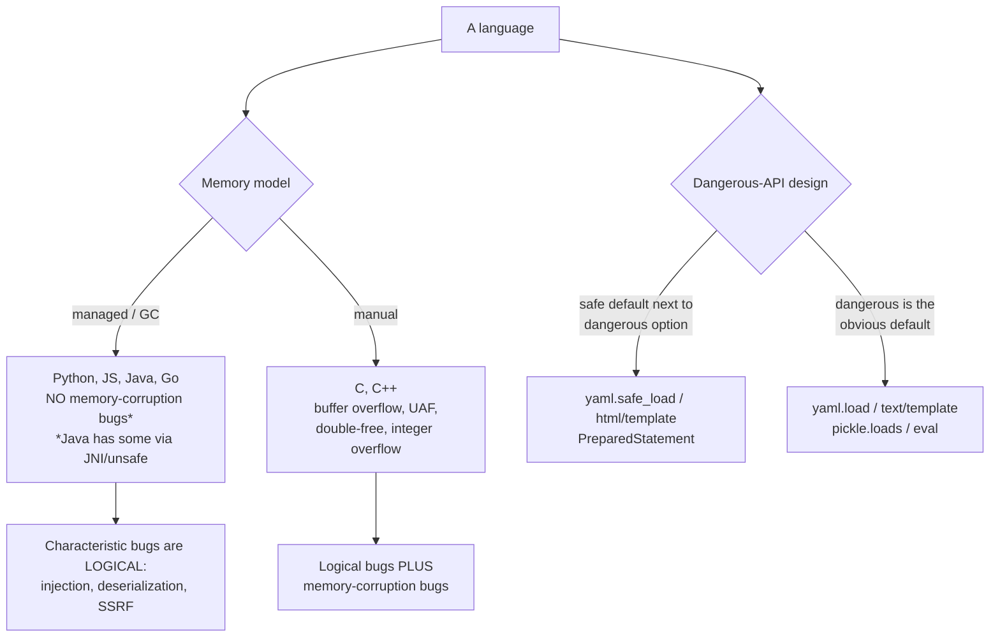
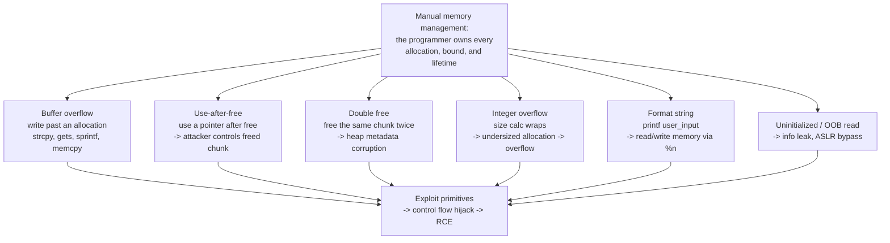
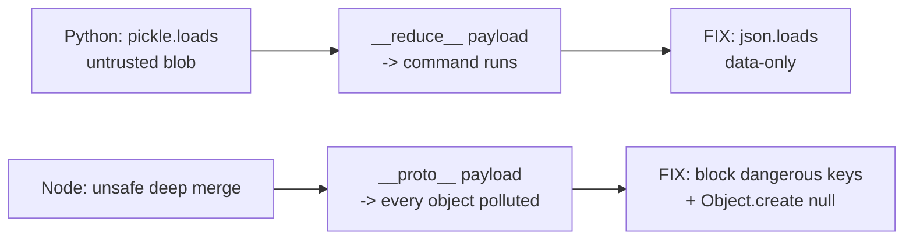

Chapter 6 argued that principles transfer and rules do not, and that argument stands. But there is a reason a chapter on the specific languages has to follow it: **the principle tells you what to do; the language decides how easy it is to do it wrong.** "Never let untrusted data reach an interpreter" is universal. Whether that footgun is spelled `pickle.loads`, `child_process.exec`, `ObjectInputStream.readObject`, `text/template`, or `strcpy` — and whether the language hands you a safe alternative right next to the dangerous one or lets you fall off a cliff silently — is entirely language-specific. This chapter is the map of the cliffs.

The five ecosystems here — Python, JavaScript/Node, Java, Go, and C/C++ — cover the overwhelming majority of what a product security engineer reviews, and they split along one deep line that organizes the whole chapter: **memory safety.** Four of the five are memory-managed, so their characteristic bugs are the *logical* ones from Chapter 6 — injection, deserialization, SSRF — expressed in each language's idioms. C and C++ add an entire second category that the others simply do not have: memory-corruption bugs (buffer overflow, use-after-free, integer overflow) that are the substance of Notebook 36's binary exploitation and the reason the industry is now migrating security-critical code to memory-safe languages.

We will not re-derive the principles; Chapter 6 did that. For each language we go straight to the dangerous APIs, the safe equivalents sitting next to them, and the traps unique to that ecosystem — because knowing that `yaml.safe_load` exists and `yaml.load` is a remote-code-execution sink is the difference between reviewing Python well and missing the bug.

## Why This Matters

A product security engineer does not get to choose the language of the code they review; they get the codebase the company has, usually several languages at once. Reviewing effectively means knowing each language's specific traps, because the bugs cluster by ecosystem in ways that are invisible if you only think in principles.

The clustering is real and well-documented. Java's native deserialization gave the industry a decade of critical RCEs — the Apache Commons Collections gadget chain, and the initial framing of vulnerabilities in the class of Log4Shell — all instances of one language feature that most other ecosystems do not have in the same form. Node's `Object.prototype` mutability produced prototype pollution, a bug class that literally cannot exist in Python or Go. C's `strcpy` and manual `free` produced the entire memory-corruption industry — Morris Worm in 1988 to the present — that memory-managed languages eliminated by construction. Each is a language deciding what is easy to get wrong.

The forward-looking reason matters even more. The single largest secure-coding shift of this decade is the migration *away* from memory-unsafe languages — CISA and the NSA have both formally urged it, and Rust adoption in security-critical infrastructure (parts of the Linux kernel, Android, Windows components) is the industry acting on it. Understanding *why* C/C++ memory bugs are categorically different, and why Go and Rust do not have them, is understanding the direction the whole field is moving. This chapter's C/C++ section is not legacy trivia; it is the case for the migration.

## Part 1: The Two Divides That Organize Everything

Before the per-language detail, two axes explain most of what differs.



**The memory-safety divide.** Managed languages (Python, JS, Java, Go) prevent memory-corruption bugs by construction — you cannot write past the end of a slice in Go or read freed memory in Python, because the runtime does not let you. Manual-memory languages (C, C++) trust the programmer to get every allocation, bound, and lifetime right, and every mistake is a potential exploit primitive. This is the single most consequential difference in the chapter, and it is why C/C++ gets a section twice the size of the others.

**The dangerous-API-design divide.** Within the managed languages, ecosystems differ in whether the safe path is the default. Python puts `yaml.load` (RCE) and `yaml.safe_load` (safe) side by side and, historically, made the dangerous one the default. Go puts `html/template` (auto-escaping) and `text/template` (no escaping) side by side with nearly identical names. A huge fraction of language-specific bugs is a developer reaching for the dangerous member of a safe/dangerous pair without knowing the pair exists. The per-language sections are, in large part, catalogs of these pairs.

Both principles from Chapter 6 still apply everywhere; these axes just explain *where each language makes them hard*.

## Part 2: Python

Python's readability makes insecure code look innocent, which is precisely the danger. The characteristic Python bugs are deserialization and dynamic-execution sinks that look like ordinary function calls.

**Deserialization — `pickle`.** `pickle.loads` on untrusted data is remote code execution, full stop. A pickle can define `__reduce__` to return an arbitrary callable and arguments, executed on load. There is no safe way to unpickle untrusted data — the fix is *do not*, use JSON or another data-only format.

```python
# DANGEROUS: pickle.loads on anything a user can influence -> RCE
data = pickle.loads(request.data)          # attacker controls request.data -> shell

# SAFE: data-only format that cannot carry code
data = json.loads(request.data)            # values only, no callables
```

**YAML — the `load`/`safe_load` pair.** `yaml.load` without a safe loader can instantiate arbitrary Python objects (the same RCE shape). Always `yaml.safe_load`.

```python
cfg = yaml.load(untrusted)          # DANGEROUS -- can construct arbitrary objects
cfg = yaml.safe_load(untrusted)     # SAFE
```

**`eval`, `exec`, and dynamic import.** `eval`/`exec` on any string touched by user input is arbitrary execution; `__import__` and `getattr` with user-controlled names reach the same place. There is essentially never a good reason to `eval` untrusted input — use `ast.literal_eval` if you only need to parse a literal, or a real parser for anything more.

**Subprocess and the shell.** The Chapter 6 injection meta-pattern in Python idiom: `shell=True` builds a shell string and reintroduces command injection. Pass an argument list with `shell=False` (the default) and no shell exists to reinterpret metacharacters.

```python
subprocess.run(f"convert {name} out.png", shell=True)      # DANGEROUS -- injection
subprocess.run(["convert", name, "out.png"], shell=False)  # SAFE -- args are data
```

**SQL and the DB-API.** Use parameters, never f-strings:

```python
cur.execute(f"SELECT * FROM u WHERE n='{name}'")     # DANGEROUS
cur.execute("SELECT * FROM u WHERE n=?", (name,))    # SAFE
```

**SSRF via `requests`.** `requests.get(user_url)` is the confused deputy of Chapter 6 Part 6 — apply the allowlist-and-resolve defense. **Format strings**: `"{}".format(user)` and f-strings are fine for data, but `user_format.format(obj)` where the *format string itself* is user-controlled leaks attributes (`{0.__class__}`) — never let the user supply the template. And **path traversal**: `open(os.path.join(base, user_name))` still escapes `base` if `user_name` is `../../etc/passwd` — validate the canonicalized path stays under `base` (Chapter 6 Part 3).

Python's safe toolkit: `json`/`yaml.safe_load` over pickle, DB-API params, `subprocess` arg lists, `secrets` (not `random`) for tokens, `hashlib`/`argon2-cffi` for passwords, `defusedxml` for XML.

## Part 3: JavaScript and Node.js

JavaScript's dynamic object model and the Node runtime create a distinctive set of traps, several of which have no analog in the other languages.

**Prototype pollution — a JavaScript-only bug.** Because objects share a mutable `Object.prototype`, writing to `__proto__` (or `constructor.prototype`) through an unsafe merge or a bracket-notation assignment adds a property to *every* object in the program. It flips `isAdmin` checks, injects config, and chains to RCE via template engines. The fix: block `__proto__`/`constructor`/`prototype` keys in any recursive merge or user-keyed assignment, use `Map` instead of plain objects for user-controlled keys, use `Object.create(null)` for lookup tables, and `Object.freeze(Object.prototype)` as a backstop.

```javascript
// DANGEROUS: naive deep merge pollutes the prototype
merge(target, JSON.parse(userInput));   // {"__proto__":{"isAdmin":true}} -> everyone admin

// SAFER: reject dangerous keys, or use a vetted library / Map
if (["__proto__","constructor","prototype"].includes(key)) continue;
```

**Command execution — the `child_process` family.** `exec` and `execSync` spawn a shell (injection); `execFile`/`spawn` with an argument array do not.

```javascript
child_process.exec(`convert ${name} out.png`);          // DANGEROUS -- shell injection
child_process.execFile("convert", [name, "out.png"]);   // SAFE -- no shell
```

**`eval`, `Function`, and `vm`.** `eval(userInput)` and `new Function(userInput)` are arbitrary execution. The `vm` module is **not a security sandbox** — it is trivial to escape and must never be relied on to run untrusted code; use an out-of-process isolate or a real sandbox instead.

**JWT and NoSQL.** The `alg:none` and weak-secret attacks from Notebook 43 Chapter 2 are Node-common because so many JWT libraries were permissive; pin the algorithm explicitly on verify (`{algorithms:["RS256"]}`) and never trust the token's own `alg`. MongoDB **operator injection** — `{user: req.body.user}` where the body is `{"$ne": null}` — is defeated by casting inputs to the expected type and rejecting objects where a scalar is expected.

**ReDoS — regular-expression denial of service.** A regex with catastrophic backtracking (nested quantifiers like `(a+)+$`) run against attacker input hangs the single-threaded event loop and takes the whole server down. Audit user-facing regexes for backtracking, use a linter (`eslint-plugin-security`), and prefer `RE2` (linear-time) for user input.

**Deserialization.** `JSON.parse` is data-only and safe; the danger is libraries that revive typed objects (`node-serialize`'s `unserialize` with a function payload is RCE). Stay on `JSON.parse`.

Node's safe toolkit: `JSON.parse` over object-reviving deserializers, `execFile`/`spawn` over `exec`, parameterized queries / typed casts, `crypto.randomBytes` for tokens, a maintained JWT library with pinned algorithms, `RE2` for user regexes, `helmet` for security headers, and lockfiles plus `npm audit` (Part 7).

## Part 4: Java

Java's characteristic bugs are heavier and historically more severe: native deserialization gave the industry its archetypal RCE gadget chains, and several parsers ship dangerous by default.

**Native deserialization — the archetype.** `ObjectInputStream.readObject()` on untrusted bytes is the most storied RCE class in enterprise Java. The attacker does not need a vulnerable class in *your* code — they need a **gadget chain** in any library on the classpath (Apache Commons Collections being the famous one), whose `readObject`/`readResolve` methods, when deserialized in sequence, reach `Runtime.exec`. The tool `ysoserial` generates these payloads. The fixes, in order: **do not deserialize untrusted data with native serialization** (use JSON via Jackson/Gson with types locked down); if you truly must, use a strict allowlist filter (`ObjectInputFilter`, JEP 290) naming the exact classes permitted; and keep the classpath minimal so fewer gadgets exist.

```java
// DANGEROUS: any gadget on the classpath -> RCE
Object o = new ObjectInputStream(untrusted).readObject();

// SAFER: allowlist filter (JEP 290) -- reject everything not explicitly permitted
ois.setObjectInputFilter(ObjectInputFilter.Config.createFilter(
    "com.myapp.dto.*;!*"));   // permit my DTOs, reject all else
```

**XXE — parsers dangerous by default.** Java's XML parsers (`DocumentBuilderFactory`, `SAXParserFactory`, `XMLInputFactory`) historically process external entities *by default*, so an untrusted XML document reads local files and reaches internal services (Chapter 6 Part 6). Explicitly disable DTDs and external entities on every parser:

```java
DocumentBuilderFactory f = DocumentBuilderFactory.newInstance();
f.setFeature("http://apache.org/xml/features/disallow-doctype-decl", true);  // safest
f.setFeature("http://xml.org/sax/features/external-general-entities", false);
```

**Expression-language and template injection.** Spring SpEL, MVEL, and OGNL evaluate expressions; letting user input reach an EL evaluator is RCE (the class of bug behind several Struts/Spring CVEs). Never pass untrusted data into `SpelExpressionParser` or a server-side template as *code*. The Log4Shell class of vulnerability was a variant — a logging library performing JNDI lookups on attacker-controlled log strings.

**JNDI and reflection.** JNDI lookups on untrusted names (`ldap://attacker/…`) load remote code — the Log4Shell mechanism; never build a JNDI name from user input. Reflection (`Class.forName(userName)`) with user-controlled class names is instantiation-of-arbitrary-classes; allowlist.

**SQL and command.** `PreparedStatement` with bind parameters (never string-concatenated `Statement`); `ProcessBuilder` with an argument list (never `Runtime.exec(String)` which can involve shell parsing on some platforms).

Java's safe toolkit: Jackson/Gson (with default typing OFF) over native serialization, `ObjectInputFilter` if serialization is unavoidable, hardened XML factories (or a wrapper library), `PreparedStatement`, `ProcessBuilder`, `SecureRandom`, and a dependency scanner because the gadget lives in a dependency (Part 7).

## Part 5: Go

Go was designed with some security ergonomics built in — memory safety, explicit errors, a strong standard library — but it has its own specific traps, and its very safety can breed complacency.

**Explicit error handling is a security control.** Go returns errors as values, and the language's cultural insistence on checking them is not just style: an ignored error is frequently a security bug. Ignoring the error from a signature verification, an authorization check, or a `json.Unmarshal` means proceeding as if a failed check succeeded — failing *open*, the exact opposite of Chapter 6's fail-closed principle. `if err != nil` is a security line.

**`html/template` vs `text/template` — the dangerous pair.** This is Go's signature footgun. `html/template` is context-aware auto-escaping and safe for HTML output; `text/template` does **no** escaping and is a direct XSS sink if used to render HTML. The names are nearly identical and the import is a one-word difference:

```go
import "text/template"   // DANGEROUS for HTML -- no escaping -> XSS
import "html/template"   // SAFE for HTML -- context-aware auto-escaping
```

Reviewing Go web code, checking which `template` is imported is a thirty-second, high-value check.

**SQL and command.** `database/sql` parameterizes with placeholders (`db.Query("... WHERE n=?", name)`) — never `fmt.Sprintf` into SQL. `os/exec.Command("prog", args...)` does not use a shell, so it is safe by default — the danger is only `exec.Command("sh", "-c", userString)`, which reintroduces the shell.

**`unsafe` and cgo.** The `unsafe` package and cgo escape Go's memory safety — pointer arithmetic and calls into C bring back the entire C bug catalog of Part 6. Treat any `unsafe` or cgo block as a C review, not a Go one. Most code should have neither.

**Other Go concerns.** Integer conversions can silently overflow/truncate (`int64`→`int32`) — a size or length that wraps is a classic bug; validate ranges before converting. Goroutine data races are correctness and sometimes security bugs (a race on an authorization flag) — run the race detector (`go test -race`). `math/rand` is not cryptographic — use `crypto/rand` for tokens and keys. And decompression/`io.Copy` without a size limit is a decompression-bomb DoS — bound it with `io.LimitReader`.

Go's safe toolkit: `html/template`, `database/sql` placeholders, `os/exec` arg slices, `crypto/rand`, the race detector in CI, `govulncheck` for known-vulnerable dependencies (Part 7), and a hard rule that `unsafe`/cgo get C-grade scrutiny.

## Part 6: C and C++ — The Memory-Safety Category

Everything above is the *logical* bug set that all languages share. C and C++ add a second, deeper category that the managed languages eliminated by construction, and that is the substance of Notebook 36. These bugs turn a programming mistake into a memory-corruption primitive an attacker can build an exploit on.



**Buffer overflow.** Writing past the end of a stack or heap buffer. The classic unsafe functions have no bounds and must never take untrusted length: `strcpy`, `strcat`, `sprintf`, `gets` (removed from the standard for a reason), and `memcpy` with an attacker-influenced size. The bounded replacements — `strncpy`/`strlcpy`, `snprintf`, `fgets`, `memcpy` with a validated size — are the safe pair, though even the bounded ones have gotchas (`strncpy` may not null-terminate).

```c
char buf[64];
strcpy(buf, user_input);              // DANGEROUS -- no bound -> stack overflow
snprintf(buf, sizeof buf, "%s", user_input);   // SAFE -- bounded
```

**Use-after-free (UAF).** Dereferencing a pointer after the memory is freed. The attacker sprays the heap to reoccupy the freed chunk with their data, so the stale pointer now reads/writes attacker-controlled memory — one of the most common exploit primitives in modern browsers and kernels. The disciplines: set pointers to `NULL` after `free`, use RAII/smart pointers in C++ (`unique_ptr`/`shared_ptr`) so lifetime is automatic, and never return pointers to stack locals.

**Double free.** Freeing the same allocation twice corrupts the allocator's metadata into another exploit primitive. Same discipline: null after free, single ownership.

**Integer overflow → undersized allocation.** A size computation that wraps (`n * size` overflowing `size_t`) produces a too-small allocation that the subsequent copy overflows. Validate arithmetic before allocating (`if (n > SIZE_MAX / size) fail;`), and prefer calloc-style checked allocation.

**Format-string bugs.** `printf(user_input)` — user input as the *format string* — lets `%x` leak stack memory and `%n` **write** to memory. Always `printf("%s", user_input)`. This is Notebook 36 Chapter 5's whole subject.

**C++ specifics.** C++ adds safety tools (RAII, `std::string`, `std::vector`, smart pointers, `std::span`) that eliminate whole bug classes *when used* — and adds new footguns: iterator invalidation, dangling references, `std::string_view` outliving its owner, and slicing. Modern C++ guidance (the Core Guidelines) is largely "use the safe abstractions and avoid raw `new`/`delete`, raw arrays, and C string functions."

**The mitigations, and their limits.** The platform provides layered mitigations — stack canaries, ASLR, DEP/NX, CFI, and hardened allocators — and Notebook 36 is largely about bypassing them. The crucial point for a secure-coding chapter: **mitigations raise the cost of exploitation; they do not fix the bug.** A use-after-free with ASLR and CFI is harder to exploit, not safe. The only categorical fix is to not have the bug.

**Which is why the industry is migrating.** CISA and the NSA have formally recommended moving new and security-critical code to memory-safe languages, because ~70% of severe vulnerabilities in large C/C++ codebases (Microsoft's and Google's own published figures) are memory-safety bugs — a category that Rust, Go, Java, and Python simply do not have. This is the single most important strategic takeaway of the chapter: for new security-critical components, **the securest C is the C you did not write.** Where C/C++ is unavoidable (existing codebases, kernels, embedded), the defensive posture is the safe-API pairs above, RAII/smart pointers in C++, compiler hardening flags (`-D_FORTIFY_SOURCE=2`, `-fstack-protector-strong`, `-fsanitize=address` in testing), static analysis, and fuzzing (Notebook 36).

## Part 7: Dependencies and Supply Chain, Per Ecosystem

Most application code today is dependencies, and each ecosystem's package manager is an attack surface (the full treatment is Notebook 46 Chapter 5). The per-language essentials:

| Ecosystem | Manager | Lockfile | Audit command | Signature note |
|---|---|---|---|---|
| Python | pip / Poetry | `poetry.lock`, `requirements.txt` w/ hashes | `pip-audit` | typosquatting is common |
| Node | npm / pnpm / yarn | `package-lock.json`, `pnpm-lock.yaml` | `npm audit` | postinstall scripts run code |
| Java | Maven / Gradle | none native; use lock plugins | OWASP Dependency-Check | the gadget lives here (Part 4) |
| Go | go modules | `go.sum` (hashes) | `govulncheck` | minimal-version selection, checksums |
| C/C++ | vcpkg / Conan / system | varies | OS package scanners | often unpinned system libs |

Cross-ecosystem rules: **pin and lock** every dependency with hashes so builds are reproducible and a tampered package is detected; **scan** with the ecosystem's known-vulnerability tool in CI; **minimize** the dependency tree because every transitive package is trust extended (Java's gadget-chain problem is a direct consequence of a large classpath); and beware **install-time code execution** — npm postinstall scripts and Python `setup.py` run arbitrary code at install, so a malicious or typosquatted package compromises the build machine before your code ever runs.

## Part 8: Cross-Language Comparison

| Concern | Python | Node/JS | Java | Go | C/C++ |
|---|---|---|---|---|---|
| Memory-corruption bugs | No | No | Rare (JNI/unsafe) | No (unless `unsafe`/cgo) | **Yes — the category** |
| Signature deserialization RCE | `pickle`, `yaml.load` | object-reviving libs | `readObject` (archetype) | not idiomatic | n/a |
| Dynamic-exec sink | `eval`/`exec` | `eval`/`Function`/`vm` | SpEL/OGNL/JNDI | rare | n/a |
| Command injection sink | `subprocess(shell=True)` | `child_process.exec` | `Runtime.exec(String)` | `exec.Command("sh","-c",…)` | `system()` |
| Auto-escaping default | Jinja2 (on) | React (on) | varies by framework | **`html/template` only** | n/a |
| Signature footgun-pair | `yaml.load`/`safe_load` | `exec`/`execFile` | native/JSON | `text`/`html` template | `strcpy`/`snprintf` |
| Unique bug class | format-string `.format` | **prototype pollution** | gadget chains, XXE-default | ignored-error fail-open | **memory safety** |
| CSPRNG | `secrets` | `crypto.randomBytes` | `SecureRandom` | `crypto/rand` | platform RNG |

Read the "footgun-pair" row as the review checklist: for each language there is a safe/dangerous pair with confusingly similar surfaces, and a large share of real bugs is someone picking the dangerous half. The "unique bug class" row is what you must know that the principles alone would not tell you: prototype pollution in Node, gadget chains and XXE-by-default in Java, fail-open from ignored errors in Go, and the entire memory-safety category in C/C++.

## Part 9: Hands-On Lab — A Python Deserialization RCE and a Node Prototype-Pollution Bug

### 9.1 What we are building

Two of the chapter's signature language-specific bugs, each demonstrated and then fixed: Python `pickle` RCE (Part 2) and Node prototype pollution (Part 3).



Python 3 and Node.js.

### 9.2 Python pickle RCE, and the fix

```python
# pickle_demo.py -- demonstrate that pickle.loads on untrusted data is RCE.
import pickle, os, json

# The attacker's payload: __reduce__ returns (callable, args) run on unpickle.
class Exploit:
    def __reduce__(self):
        return (os.system, ("echo PWNED: arbitrary command executed",))

malicious_blob = pickle.dumps(Exploit())
print(f"[*] attacker-supplied blob: {malicious_blob[:40]!r}...")

print("\n[!] VULNERABLE path: pickle.loads(untrusted)")
pickle.loads(malicious_blob)          # <-- the command runs HERE, on load

print("\n[+] SAFE path: json.loads rejects it -- no code, data only")
try:
    json.loads(malicious_blob)
except Exception as e:
    print(f"    json.loads refused the blob: {type(e).__name__}")
```

```bash
python3 pickle_demo.py

# Sample output:
# [*] attacker-supplied blob: b'\x80\x04\x95;\x00\x00\x00\x00\x00\x00\x00\x8c\x05posix'...
#
# [!] VULNERABLE path: pickle.loads(untrusted)
# PWNED: arbitrary command executed
#
# [+] SAFE path: json.loads rejects it -- no code, data only
#     json.loads refused the blob: UnicodeDecodeError
```

The lesson is stark: `pickle.loads` *executed the attacker's command* merely by loading the blob, while `json.loads` — a data-only format — cannot carry code at all. There is no "safe pickle for untrusted input"; the fix is the format, not a flag.

### 9.3 Node prototype pollution, and the fix

```javascript
// proto_demo.js -- demonstrate prototype pollution and its fix.

// A naive recursive merge -- the kind found in many real libraries.
function unsafeMerge(target, source) {
  for (const key in source) {
    if (typeof source[key] === "object" && source[key] !== null) {
      target[key] = target[key] || {};
      unsafeMerge(target[key], source[key]);
    } else {
      target[key] = source[key];
    }
  }
  return target;
}

console.log("[!] VULNERABLE: unsafeMerge with a __proto__ payload");
const attackerJSON = '{"__proto__": {"isAdmin": true}}';
unsafeMerge({}, JSON.parse(attackerJSON));
// A brand-new, unrelated object now carries isAdmin -- the whole program is polluted.
const freshUser = {};
console.log(`    a fresh, unrelated object's isAdmin = ${freshUser.isAdmin}`);

// The fix: reject dangerous keys, and use a null-prototype object for user-keyed data.
function safeMerge(target, source) {
  for (const key in source) {
    if (key === "__proto__" || key === "constructor" || key === "prototype") continue;
    if (typeof source[key] === "object" && source[key] !== null) {
      target[key] = target[key] || Object.create(null);
      safeMerge(target[key], source[key]);
    } else {
      target[key] = source[key];
    }
  }
  return target;
}

console.log("\n[+] SAFE: safeMerge ignores __proto__");
delete Object.prototype.isAdmin;            // clean up the earlier pollution
const cleanTarget = safeMerge(Object.create(null), JSON.parse(attackerJSON));
const anotherFresh = {};
console.log(`    another fresh object's isAdmin = ${anotherFresh.isAdmin}`);
console.log(`    target got the literal key instead: ${JSON.stringify(cleanTarget)}`);
```

```bash
node proto_demo.js

# Sample output:
# [!] VULNERABLE: unsafeMerge with a __proto__ payload
#     a fresh, unrelated object's isAdmin = true
#
# [+] SAFE: safeMerge ignores __proto__
#     another fresh object's isAdmin = undefined
#     target got the literal key instead: {}
```

The vulnerable merge made `isAdmin` appear on an object it never touched — the signature of prototype pollution, and why it flips authorization checks program-wide. The fix rejects the three dangerous keys and uses a null-prototype target so user-controlled keys have no prototype to pollute.

### 9.4 Extending the lab

Reproduce the Java side conceptually with `ysoserial` against a lab endpoint that calls `readObject`, then add an `ObjectInputFilter` allowlist and show the payload rejected; demonstrate the Go `text/template` vs `html/template` XSS difference by rendering the same user string through each; write a tiny C program with a `strcpy` overflow, compile it with and without `-fstack-protector-strong -D_FORTIFY_SOURCE=2 -fsanitize=address`, and watch ASan catch the overflow; and add `pip-audit`/`npm audit` to a CI step for the two demo projects (Notebook 46 Chapter 5).

## Part 10: Common Pitfalls

**Python: `pickle`/`yaml.load`/`eval` on anything a user can touch.** All three are RCE. Use `json`/`yaml.safe_load`/`ast.literal_eval` and data-only formats.

**Python: `subprocess(shell=True)` and f-string SQL.** Argument lists and DB-API parameters.

**Node: assuming `vm` is a sandbox.** It is not; it is escapable. Use out-of-process isolation for untrusted code.

**Node: unsafe merges and user-keyed plain objects.** Prototype pollution. Block `__proto__`/`constructor`, use `Map` or `Object.create(null)`.

**Node: catastrophic-backtracking regexes on user input.** ReDoS freezes the event loop. Audit regexes; use `RE2`.

**Java: `readObject` on untrusted bytes.** The archetypal RCE via classpath gadgets. Do not native-deserialize untrusted data; if forced, allowlist with `ObjectInputFilter`.

**Java: XML parsers left at defaults.** XXE by default. Disable DTDs and external entities on every parser.

**Java: user input into SpEL/OGNL/JNDI.** Expression and lookup injection — the Log4Shell family. Never evaluate user-controlled expressions or build JNDI names from input.

**Go: ignoring an error from a security operation.** Fails open. `if err != nil` after a verify/authz/unmarshal is a security line.

**Go: importing `text/template` for HTML.** No escaping — XSS. Use `html/template`. Check the import.

**Go: `unsafe`/cgo treated as ordinary Go.** They reintroduce the C bug catalog. Review them as C.

**C/C++: `strcpy`/`gets`/`sprintf`/`printf(user)` and manual `free`.** Buffer overflow, format string, use-after-free, double free. Use bounded functions, RAII/smart pointers, and compiler hardening — and for new security-critical code, prefer a memory-safe language.

**All: trusting mitigations to fix bugs.** Canaries, ASLR, and CFI raise exploitation cost; they do not remove the bug. The fix is to not have it.

**All: unpinned, unscanned dependencies with install-time scripts.** Lock with hashes, scan in CI, minimize the tree, and remember postinstall/`setup.py` run code at install.

## Final Revision / Summary

- Principles are universal (Chapter 6); **the language decides how easy it is to get them wrong.** This chapter maps the per-ecosystem cliffs and the safe API sitting next to each dangerous one.
- Two divides organize everything: the **memory-safety divide** (Python/JS/Java/Go have no memory-corruption bugs by construction; C/C++ do), and the **dangerous-API-design divide** (safe/dangerous *pairs* with confusingly similar surfaces, where picking the wrong half is a huge share of real bugs).
- **Python**: `pickle.loads`/`yaml.load`/`eval` are RCE — use `json`/`yaml.safe_load`/`ast.literal_eval`; `subprocess(shell=True)` and f-string SQL are injection — use arg lists and DB-API params; watch SSRF via `requests`, user-controlled `.format` strings, and path traversal. Toolkit: `secrets`, `argon2-cffi`, `defusedxml`.
- **Node/JS**: **prototype pollution** is the unique class (block `__proto__`, use `Map`/`Object.create(null)`); `child_process.exec` is shell injection — use `execFile`/`spawn`; `eval`/`Function` are RCE and `vm` is **not** a sandbox; pin JWT algorithms; cast to defeat Mongo operator injection; audit regexes for **ReDoS**; stay on `JSON.parse`.
- **Java**: native `readObject` is the **archetypal RCE** via classpath gadget chains (ysoserial) — don't deserialize untrusted data, else allowlist with `ObjectInputFilter`; XML parsers are **XXE-by-default** — disable DTDs/external entities everywhere; SpEL/OGNL/JNDI on user input is the Log4Shell family; use `PreparedStatement` and `ProcessBuilder`.
- **Go**: **ignoring an error is often a fail-open security bug** — `if err != nil` is a security line; **`text/template` does not escape (XSS) — use `html/template`**, check the import; `database/sql` placeholders and `os/exec` arg slices are safe by default; `unsafe`/cgo reintroduce the C bug catalog; watch integer truncation, races (`-race`), and use `crypto/rand`.
- **C/C++**: the **memory-safety category** the others lack — buffer overflow (`strcpy`/`gets`/`sprintf`), use-after-free, double free, integer-overflow-to-undersized-alloc, and format-string (`printf(user)`). Use bounded functions, RAII/smart pointers, and compiler hardening. **Mitigations (canaries, ASLR, CFI) raise exploitation cost but do not fix the bug** — which is why CISA/NSA urge migrating new security-critical code to memory-safe languages; ~70% of severe C/C++ bugs are memory-safety.
- **Dependencies** are most of your code and each ecosystem's package manager is an attack surface: pin and lock with hashes, scan in CI (`pip-audit`/`npm audit`/Dependency-Check/`govulncheck`), minimize the tree (Java's gadget problem is a large-classpath consequence), and beware install-time code execution (npm postinstall, `setup.py`).
- The **review checklist per language is the footgun-pair**: `yaml.load`/`safe_load`, `exec`/`execFile`, native/JSON deserialization, `text`/`html` template, `strcpy`/`snprintf`. A large fraction of language-specific bugs is someone choosing the dangerous half.

## Cheat Sheet / Quick Reference

**Dangerous → safe, per language**

```
Python  pickle.loads      -> json.loads
        yaml.load         -> yaml.safe_load
        eval/exec         -> ast.literal_eval / real parser
        subprocess shell=True -> arg list, shell=False
        f-string SQL      -> cur.execute("...?", (v,))
        random            -> secrets

Node    child_process.exec-> execFile / spawn (arg array)
        eval/Function/vm  -> out-of-process isolate
        unsafe deep merge -> block __proto__/constructor; Map; Object.create(null)
        permissive JWT    -> verify({algorithms:["RS256"]})
        user regex        -> RE2
        Math.random       -> crypto.randomBytes

Java    readObject(untrusted) -> JSON (typing off) / ObjectInputFilter allowlist
        XML default parser    -> disable DTD + external entities
        SpEL/OGNL/JNDI(user)  -> never evaluate user expressions/names
        Statement + concat    -> PreparedStatement
        Runtime.exec(String)  -> ProcessBuilder(list)
        random                -> SecureRandom

Go      text/template (HTML)  -> html/template
        ignored err           -> if err != nil { fail closed }
        fmt.Sprintf into SQL   -> db.Query("...?", v)
        exec.Command("sh","-c")-> exec.Command("prog", args...)
        math/rand             -> crypto/rand
        unsafe/cgo            -> review as C

C/C++   strcpy/strcat/sprintf -> snprintf / bounded + validated size
        gets                  -> fgets
        printf(user)          -> printf("%s", user)
        manual free/raw ptr   -> RAII, unique_ptr/shared_ptr, null after free
        (new security-critical code) -> use a memory-safe language
```

**Unique bug class to remember per language**

```
Python  dynamic-exec + insecure deserialization sinks
Node    PROTOTYPE POLLUTION (exists nowhere else)
Java    native-deserialization GADGET CHAINS + XXE-by-default
Go      FAIL-OPEN from ignored errors; text/template XSS
C/C++   the entire MEMORY-SAFETY category
```

**Dependency hygiene (all ecosystems)**

```
pin + lock with hashes | scan in CI | minimize the tree
beware install-time scripts (npm postinstall, setup.py)
tools: pip-audit | npm audit | OWASP Dependency-Check | govulncheck
```

**C/C++ compiler hardening**

```
-D_FORTIFY_SOURCE=2  -fstack-protector-strong  -fPIE -pie
-Wall -Wextra        -fsanitize=address,undefined   (test builds)
```

## Practice Labs & Resources

**Per-language secure-coding references**
- **Python**: the `bandit` linter's rule list is a concise catalog of Python sinks; the `defusedxml` docs; PyCQA security guidance.
- **Node/JS**: the OWASP NodeJS Security Cheat Sheet; `eslint-plugin-security`; the prototype-pollution research from Snyk and PortSwigger.
- **Java**: the OWASP Deserialization Cheat Sheet and `ysoserial`; the XXE Prevention Cheat Sheet; SEI CERT Oracle Coding Standard for Java.
- **Go**: `govulncheck`, `gosec`, and the `html/template` package docs (read the security section).
- **C/C++**: SEI CERT C/C++ Coding Standards; the C++ Core Guidelines; AddressSanitizer and libFuzzer docs.

**Hands-on**
- Extend the lab: reproduce the Java `readObject` gadget-chain conceptually and add an `ObjectInputFilter`; show the Go `text`/`html` template XSS difference; compile a `strcpy` overflow with and without ASan; add dependency scanning to CI for the demo projects.
- Take a codebase in each language you use and find its footgun-pair usages with grep before reaching for a tool — `pickle`, `child_process.exec`, `readObject`, `text/template`, `strcpy`.
- Work Notebook 36 alongside the C/C++ section — the memory-safety bugs here are the vulnerabilities exploited there.

**Deliberate practice**
- Build a personal safe-API card per language (the Cheat Sheet above) and use it as a review checklist until it is memory.
- For one dependency in each ecosystem, trace its transitive tree and count how much code you are actually trusting — the number motivates minimization.
- Read the CISA/NSA memory-safety guidance and Google's and Microsoft's published memory-safety-bug percentages, and form your own position on the migration.

**Further reading**
- CISA/NSA, *The Case for Memory Safe Roadmaps* — the strategic argument behind Part 6.
- The OWASP Cheat Sheet Series (Deserialization, XXE, Node.js, Injection Prevention) — per-topic, per-language.
- Notebook 36 (binary exploitation) for the attacker's view of the C/C++ memory bugs, and Notebook 46 Chapter 5 for the full dependency and supply-chain treatment.
- Chapter 8 next, which takes these language patterns and organizes them by the CWE Top 25 — the industry's ranked list of the mistakes this chapter catalogs.
