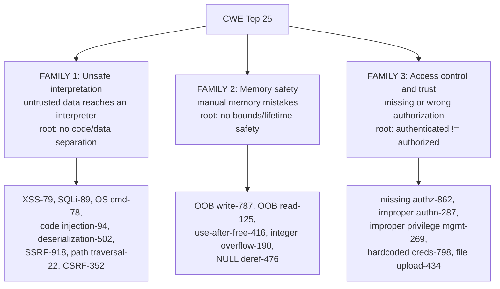
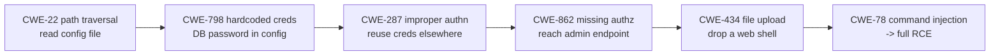
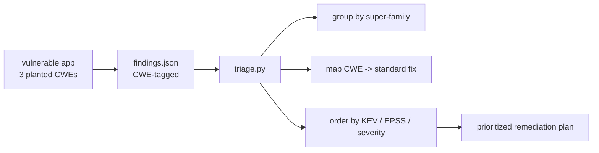

The last two chapters taught the principles of secure coding and their expression in five languages. This chapter closes the loop by holding that knowledge up against the industry's own ranked answer to the question *what actually goes wrong most?* — the **CWE Top 25 Most Dangerous Software Weaknesses**. It is the capstone of the secure-coding sequence and the bridge into Notebook 46: once you can recognize these twenty-five patterns in source on sight, you can review code, tune a SAST tool, and prioritize remediation, which is the entire job of the next notebook.

The reason to organize a whole chapter around a list is that the list is *evidence*. Chapters 6 and 7 asserted that a few mistakes repeat endlessly; the CWE Top 25 is the empirical proof, computed from real recorded vulnerabilities across the entire industry. It tells you not just which mistakes exist but which ones are *actually exploited*, in what proportion, so your attention goes where the risk is rather than where your intuition wanders. A product security engineer who has internalized this list reviews code the way a radiologist reads a scan — the common patterns jump out because the mind has a ranked, weighted prior for what it is looking at.

The chapter's structure matches its argument. First, what CWE is and how the ranking is built, so you can read it critically rather than as gospel. Then the crucial simplification: the twenty-five collapse into **three super-families**, and once you hold those three, the individual entries are variations rather than a memorization burden. Then a pattern-and-fix walk through the highest-ranked weaknesses, each shown as a *recognizable line of code*. Then how to actually use CWE — for classification, SAST mapping, root-cause analysis, and the prioritization that KEV and EPSS make rigorous.

## Why This Matters

The value of a ranked, evidence-based list is that it converts an infinite problem into a finite, prioritized one. There are hundreds of CWE entries; a developer cannot hold hundreds of failure modes in working memory while writing code, and a reviewer cannot check for all of them. The Top 25 says: these are the ones that produced the most real, exploited vulnerabilities last year — learn these cold and you have covered the large majority of what will actually hurt you. That is a tractable target, and hitting it is a genuine competence threshold.

The professional uses are concrete and daily. **Classification**: every finding you report, in a review or a pentest, should carry a CWE ID, because that ID is the shared language that lets a developer look up the standard fix, lets the program count and trend its weaknesses, and lets tools correlate. **SAST tuning** (Notebook 46 Chapter 3): scanner rules are organized by CWE, and knowing the Top 25 tells you which rules must never be turned off and which noisy ones you can down-tune. **Root-cause analysis**: when an incident happens, naming the CWE turns "we got breached" into "we have a CWE-89 pattern in our data-access layer," which is actionable and searchable across the codebase. **Risk communication**: "CWE-79" means nothing to an executive, but "the same class of bug as the last three breaches you read about" does, and the CWE ID is what lets you make that mapping honestly.

And the list is a mirror of the offensive curriculum. Every category in Notebooks 21–27 and 36 maps to CWE entries here; reading the Top 25 is reading the attacker's target list, ranked by how often it works.

## Part 1: CWE, CVE, and the Top 10 — Getting the Vocabulary Right

Three acronyms get conflated constantly, and the distinctions matter for using each correctly.

| | What it is | Granularity | Example |
|---|---|---|---|
| **CWE** | Common Weakness Enumeration — a *type* of flaw | The bug class | CWE-89: SQL Injection |
| **CVE** | Common Vulnerabilities and Exposures — a *specific* flaw in a *specific* product | The individual instance | CVE-2021-44228 (Log4Shell) |
| **OWASP Top 10** | A curated, categorized awareness list for web apps | Broad category | A03:2021 Injection |

The relationship: a **CVE is an instance of a CWE**. Log4Shell (CVE-2021-44228) is an instance of CWE-502 (deserialization) and CWE-917 (expression-language injection). CWE is the *taxonomy of causes*; CVE is the *catalog of occurrences*. The Top 25 is computed by looking at which CWEs the year's CVEs were assigned to, weighted by severity and exploitation — so it is CWE ranked by CVE evidence.

Two practical consequences. First, **when you find a bug you report a CWE, not a CVE** — CVEs are for named vulnerabilities in released products, while your finding is an instance of a weakness class. Second, **OWASP Top 10 and CWE Top 25 are complementary, not competing**: the Top 10 is a broad web-focused awareness framing (good for training and executive conversation), while the Top 25 is a fine-grained, all-software, evidence-ranked engineering list (good for code review and SAST). Use the Top 10 to talk about categories and the Top 25 to talk about code.

## Part 2: How the Top 25 Is Scored, and How to Read It

The MITRE ranking is data-driven, not a committee's opinion, and understanding the method lets you read it critically. Each CWE's score combines **frequency** (how many CVEs over the scoring window were mapped to it) with **severity** (the average CVSS of those CVEs), and recent methodology also incorporates **CISA KEV** data — whether the weakness shows up in vulnerabilities *known to be exploited in the wild* (Part 8). So the list rewards weaknesses that are both common and dangerous and actually attacked, which is exactly the prioritization you want.

How to read it well:

- **Rank is relative and it moves year to year.** XSS, out-of-bounds write, and SQL injection trade the top spots; the movement reflects reporting and remapping as much as real-world change. Treat the *top cluster* as "the ones that matter most," not the exact ordinal.
- **Frequency can dominate severity.** A weakness that is merely medium-severity but extremely common (XSS) outranks a catastrophic-but-rarer one. Do not read low rank as low danger for *your* system — a single out-of-bounds write in your code is worse than a hundred XSS, even though XSS outranks it on the aggregate list.
- **Mapping noise is real.** CVEs are assigned CWEs by humans of varying rigor, and "improper input validation" (CWE-20) is a catch-all that absorbs bugs that should have a more specific class. The list's authors warn about exactly this; read CWE-20's high rank as "input handling is broadly broken," not as a precise cause.
- **It is all-software, not web-only.** Unlike the OWASP Top 10, the Top 25 includes memory-safety weaknesses (out-of-bounds write/read, use-after-free) prominently, because it counts CVEs across operating systems, libraries, and firmware, not just web apps.

The right mental model: the Top 25 is a *weighted prior* for where bugs are, computed from the whole industry's recorded experience. You use it to allocate attention, not as a literal to-do list to work top to bottom.

## Part 3: The Three Super-Families

The single most useful thing you can do with the Top 25 is stop treating it as twenty-five items and see that it collapses into **three super-families**, each traceable to one root idea from Chapter 6. This is what makes the list learnable.



**Family 1 — Unsafe interpretation.** Untrusted data reaches an interpreter and is parsed as code. This is Chapter 6's injection meta-pattern, and it is the largest family: XSS (CWE-79, the browser as interpreter), SQL injection (CWE-89), OS command injection (CWE-78), code injection (CWE-94), deserialization (CWE-502), SSRF (CWE-918, the confused-deputy variant), path traversal (CWE-22, the filesystem "interpreter"), and CSRF (CWE-352, the browser tricked into issuing a trusted request). The fix across the whole family is one idea: **separate code from data by construction** — parameterize, use safe APIs, context-encode.

**Family 2 — Memory safety.** Manual-memory mistakes that become corruption primitives. This is Chapter 7 Part 6 and the substance of Notebook 36: out-of-bounds write (CWE-787, consistently at or near the top of the list) and read (CWE-125), use-after-free (CWE-416), integer overflow (CWE-190), and NULL-pointer dereference (CWE-476). This family exists almost entirely in C/C++, which is why the strategic fix is **memory-safe languages**, and the tactical fix is bounded APIs, RAII, and compiler hardening.

**Family 3 — Access control and trust.** Missing or incorrect authorization, and misplaced trust. This is Chapter 6 Part 7: missing authorization (CWE-862), improper authentication (CWE-287), improper privilege management (CWE-269), use of hard-coded credentials (CWE-798), and unrestricted file upload (CWE-434, trusting attacker-supplied files). The fix is **enforce authorization server-side on every object, deny by default, never trust the client, never embed secrets.**

Hold these three and the list is no longer a wall of numbers. Every entry is a member of one family, the family names its root cause, and the root cause names the fix. The rest of the chapter is the recognizable *source patterns* within each family.

## Part 4: Family 1 in Source — Unsafe Interpretation

Each of these is shown as the line you must recognize, plus the fix. They are the concrete faces of Chapter 6 Part 4.

**CWE-79 Cross-Site Scripting.** Untrusted data rendered into a page without context encoding.

```
render("<div>" + user_comment + "</div>")     # BUG: XSS
render(template, comment=user_comment)         # FIX: auto-escaping template
```

**CWE-89 SQL Injection.** Untrusted data concatenated into a query.

```
db.execute("SELECT * FROM u WHERE n='" + name + "'")   # BUG
db.execute("SELECT * FROM u WHERE n=?", [name])         # FIX: parameterize
```

**CWE-78 OS Command Injection.** Untrusted data in a shell string.

```
os.system("ping " + host)                              # BUG
subprocess.run(["ping", "-c1", host], shell=False)      # FIX: arg array, no shell
```

**CWE-94 Code Injection.** Untrusted data reaching `eval`/`exec`/template-as-code.

```
eval(user_expression)                                   # BUG
ast.literal_eval(user_expression)  # FIX (literals only) / a real parser
```

**CWE-502 Deserialization of Untrusted Data.** Loading attacker bytes into a code-capable deserializer (Chapter 7's `pickle`/`readObject`).

```
pickle.loads(request.body)                              # BUG: RCE
json.loads(request.body)                                # FIX: data-only format
```

**CWE-918 SSRF.** Server fetches an attacker-controlled URL (Chapter 6 Part 6).

```
requests.get(user_url)                                  # BUG
# FIX: allowlist host; resolve DNS, reject internal ranges; fetch by validated IP
```

**CWE-22 Path Traversal.** Untrusted filename escaping a base directory.

```
open(base + "/" + user_filename)          # BUG: ../../etc/passwd
p = os.path.realpath(os.path.join(base, user_filename))
if not p.startswith(base): abort()        # FIX: canonicalize, confine
```

**CWE-352 CSRF.** State-changing request accepted without proof it was intended.

```
# BUG: POST /transfer with no anti-CSRF token, cookie-only auth
# FIX: per-request anti-CSRF token (or SameSite cookies) + re-auth for sensitive ops
```

The unity is the point: eight different-looking bugs, one root, one family-wide fix idea — never let untrusted data be interpreted as code, structure, or intent.

## Part 5: Family 2 in Source — Memory Safety

These live in C/C++ (Chapter 7 Part 6) and are the exploit primitives of Notebook 36.

**CWE-787 Out-of-Bounds Write.** A write past an allocation — consistently the #1 or near-#1 weakness because it is the most directly exploitable.

```c
char buf[64]; strcpy(buf, input);                 // BUG: no bound
char buf[64]; snprintf(buf, sizeof buf, "%s", input);  // FIX: bounded
```

**CWE-125 Out-of-Bounds Read.** Reading past a buffer — leaks memory (Heartbleed was CWE-125), enabling ASLR bypass.

```c
memcpy(out, src, attacker_len);                   // BUG: len unchecked
if (attacker_len <= src_size) memcpy(out, src, attacker_len);   // FIX: validate
```

**CWE-416 Use-After-Free.** Using freed memory.

```c
free(p); ... use(p);                              // BUG
free(p); p = NULL;                                // FIX: null after free; RAII in C++
```

**CWE-190 Integer Overflow.** A size calculation wraps, producing an undersized allocation that a later copy overflows.

```c
buf = malloc(n * size);                           // BUG: n*size can wrap
if (n > SIZE_MAX/size) fail(); buf = malloc(n*size);   // FIX: checked arithmetic
```

**CWE-476 NULL Pointer Dereference.** Dereferencing an unchecked pointer — usually a crash/DoS, sometimes worse.

```c
p = malloc(sz); p->field = x;                     // BUG: malloc may return NULL
p = malloc(sz); if (!p) fail(); p->field = x;      // FIX
```

The family-wide truth from Chapter 7: platform mitigations (canaries, ASLR, CFI) raise the cost of turning these into RCE but do not remove them, and the only categorical fix is a memory-safe language. That is why this family, despite living in an "old" language, remains at the very top of the list.

## Part 6: Family 3 in Source — Access Control and Trust

These are the hardest for tools to find because they are about *intent*, not *syntax* (Notebook 46 Chapter 2 returns to exactly this).

**CWE-862 Missing Authorization.** An operation reachable without the authorization check it needs — the most prevalent serious web bug.

```
@route("/api/orders/<id>")
def get(id): return db.order(id)         # BUG: any user reads any order (IDOR)
def get(id):
    o = db.order(id)
    if o.owner != current_user(): abort(403)   # FIX: object-level check, deny by default
    return o
```

**CWE-287 Improper Authentication.** Authentication that can be bypassed or is weak — accepting `alg:none` JWTs, a login that returns success on error, client-side auth checks.

**CWE-269 Improper Privilege Management.** Granting or retaining more privilege than intended — a role change that adds without removing (Notebook 42's mover problem), a container running as root, a service account with `*` permissions.

**CWE-798 Hard-Coded Credentials.** A secret embedded in source (Notebook 46 Chapter 6 finds these in git history).

```
API_KEY = "sk_live_abc123"               # BUG: in source forever
API_KEY = os.environ["API_KEY"]           # FIX: from env/secrets manager
```

**CWE-434 Unrestricted File Upload.** Accepting an attacker file that becomes executable or dangerous — an uploaded `.php` served by the web server is RCE.

```
save(upload, "/var/www/" + upload.name)   # BUG: attacker uploads shell.php
# FIX: validate content type by magic bytes, store outside webroot, random name,
#      never execute the upload dir
```

The family-wide fix is Chapter 6 Part 7 and Part 10: **authorization enforced server-side on every object, deny by default, least privilege, and never trust the client or embed secrets.** Because these are intent bugs, manual review and good design catch them where scanners struggle — a theme Notebook 46 develops.

## Part 7: Chaining — How Weaknesses Become Attack Paths

Real incidents are rarely one CWE; they are a *chain*, and the CWE view makes the chain legible. A representative path, each link a Top 25 entry:



Two lessons the chaining view teaches. First, **a "low-severity" weakness is often the first link in a high-severity chain** — the path-traversal read that is merely an info disclosure on its own becomes the entry point to RCE. Rank on the aggregate list is not the severity in your system's context. Second, **defense in depth breaks chains** (Chapter 6 Part 9): stopping *any* single link stops the whole chain, which is why independent layers are worth their cost — the attacker needs every link, you need to break only one. Reporting a finding, note its role in plausible chains, not just its standalone CVSS; that is what turns a triage list into a risk story.

## Part 8: Using CWE in Practice — Classification, Mapping, and Prioritization

Knowing the list is half of it; using it is the professional skill.

**Classification.** Tag every finding with a CWE ID. It gives the developer the standard fix (each CWE page links mitigations), lets the program trend weakness classes over time ("our CWE-79 count is falling, our CWE-862 count is not"), and lets tools correlate findings from different sources. A bug report without a CWE is a bug report that cannot be aggregated.

**SAST rule mapping.** Scanner rules are organized by CWE (Notebook 46 Chapter 3). The Top 25 tells you which rules are load-bearing — never suppress the CWE-89, CWE-78, CWE-79, CWE-502, CWE-787 rules — and helps you reason about coverage: if your SAST has no rule mapped to a Top 25 CWE relevant to your stack, that is a coverage gap to close.

**Root-cause analysis.** After an incident, name the CWE. "We were breached" is not actionable; "we have a CWE-502 pattern in the message consumer" is a searchable, fixable statement that also tells you *where else to look* — the same CWE likely recurs across the codebase, so root-causing one instance finds its siblings.

**Prioritization with KEV and EPSS — the crucial refinement.** The Top 25 ranks *weakness classes* in aggregate; it does not tell you which of *your specific* findings to fix first. Two data sources close that gap:

- **CISA KEV (Known Exploited Vulnerabilities)** is the catalog of CVEs *observed being exploited in the wild*. A finding matching a KEV entry is not theoretical — attackers are using it now — and it jumps the queue regardless of CVSS. KEV is a binary, high-confidence "fix this now" signal.
- **EPSS (Exploit Prediction Scoring System)** gives each CVE a probability (0–1) of being exploited in the next 30 days, from real-world data. It lets you rank a backlog by *likelihood of attack* rather than by CVSS severity alone — and the two disagree often, because a high-CVSS bug nobody is exploiting is lower *risk* than a medium-CVSS bug being mass-exploited.

The mature prioritization stack: **KEV first (known-exploited, fix now) → high EPSS × high severity next → then the rest by CVSS**, all filtered by whether the weakness is actually reachable in your system. This is Chapter 3's risk-based thinking applied to a vulnerability backlog, and it is the substance of Notebook 46 Chapter 9's SLA-driven remediation.

## Part 9: Hands-On Lab — A CWE-Annotated App and a Triage Script

### 9.1 What we are building

A small app carrying one bug from each super-family, and a triage tool that classifies findings by CWE, assigns each to a family and a standard fix, and orders remediation using a KEV/EPSS-style priority — the workflow of Part 8.



Python 3 only.

### 9.2 The findings, as a SAST tool would emit them

```bash
mkdir -p ~/cwe-lab && cd ~/cwe-lab
cat > findings.json <<'JSON'
[
  {"id":"F1","file":"api/search.py","line":22,"cwe":"CWE-89",
   "title":"SQL query built by string concatenation","severity":9.8,
   "epss":0.42,"kev":true},
  {"id":"F2","file":"api/orders.py","line":40,"cwe":"CWE-862",
   "title":"Order endpoint lacks object-level authorization","severity":8.1,
   "epss":0.09,"kev":false},
  {"id":"F3","file":"native/parse.c","line":88,"cwe":"CWE-787",
   "title":"strcpy into fixed buffer from network input","severity":9.1,
   "epss":0.55,"kev":true},
  {"id":"F4","file":"web/profile.py","line":14,"cwe":"CWE-79",
   "title":"User bio reflected without encoding","severity":6.1,
   "epss":0.12,"kev":false},
  {"id":"F5","file":"config/settings.py","line":3,"cwe":"CWE-798",
   "title":"Hard-coded API key in source","severity":7.5,
   "epss":0.03,"kev":false}
]
JSON
echo "5 findings written"

# Sample output:
# 5 findings written
```

### 9.3 The triage tool

```python
# triage.py -- classify CWE findings by super-family, map to fixes, prioritize.
import json, sys

# Part 3: the three super-families, as a CWE -> family map.
FAMILY = {
  "CWE-79":"Unsafe interpretation", "CWE-89":"Unsafe interpretation",
  "CWE-78":"Unsafe interpretation", "CWE-94":"Unsafe interpretation",
  "CWE-502":"Unsafe interpretation","CWE-918":"Unsafe interpretation",
  "CWE-22":"Unsafe interpretation", "CWE-352":"Unsafe interpretation",
  "CWE-787":"Memory safety","CWE-125":"Memory safety","CWE-416":"Memory safety",
  "CWE-190":"Memory safety","CWE-476":"Memory safety",
  "CWE-862":"Access control & trust","CWE-287":"Access control & trust",
  "CWE-269":"Access control & trust","CWE-798":"Access control & trust",
  "CWE-434":"Access control & trust",
}
# Parts 4-6: the standard fix per CWE.
FIX = {
  "CWE-89":"Parameterize the query (prepared statement).",
  "CWE-79":"Render via an auto-escaping template; context-encode.",
  "CWE-78":"Use an argument-array exec with shell=False.",
  "CWE-502":"Use a data-only format (JSON); never deserialize untrusted bytes.",
  "CWE-918":"Allowlist host; resolve DNS and reject internal ranges; fetch by IP.",
  "CWE-22":"Canonicalize the path and confine it under the base directory.",
  "CWE-787":"Use bounded copies (snprintf); validate lengths. Prefer a memory-safe language.",
  "CWE-862":"Enforce object-level authorization server-side; deny by default.",
  "CWE-798":"Load the secret from env/secrets manager; rotate the leaked key.",
}

def priority(f):
    # Part 8: KEV first, then EPSS x severity. Lower number = fix sooner.
    if f["kev"]:
        return (0, -f["severity"])
    return (1, -(f["epss"] * f["severity"]))

def main(path):
    findings = json.load(open(path))
    findings.sort(key=priority)

    # Family rollup (Part 3).
    from collections import Counter
    fams = Counter(FAMILY.get(f["cwe"], "Other") for f in findings)
    print("SUPER-FAMILY ROLLUP")
    for fam, n in fams.most_common():
        print(f"  {n}  {fam}")

    print("\nPRIORITIZED REMEDIATION PLAN")
    print(f"  {'#':<3}{'ID':<4}{'CWE':<9}{'CVSS':<6}{'EPSS':<6}{'KEV':<5}FINDING")
    print("  " + "-" * 78)
    for i, f in enumerate(findings, 1):
        kev = "YES" if f["kev"] else "-"
        print(f"  {i:<3}{f['id']:<4}{f['cwe']:<9}{f['severity']:<6}"
              f"{f['epss']:<6}{kev:<5}{f['title']}")
        print(f"      family: {FAMILY.get(f['cwe'],'?')}")
        print(f"      fix:    {FIX.get(f['cwe'],'see the CWE page')}")
    print("  " + "-" * 78)
    kevs = sum(1 for f in findings if f["kev"])
    print(f"  {len(findings)} findings | {kevs} KEV (fix immediately) "
          f"| families: {len(fams)}")
    sys.exit(1 if findings else 0)

if __name__ == "__main__":
    main(sys.argv[1] if len(sys.argv) > 1 else "findings.json")
```

```bash
python3 triage.py findings.json

# Sample output:
# SUPER-FAMILY ROLLUP
#   3  Unsafe interpretation
#   1  Memory safety
#   1  Access control & trust
#
# PRIORITIZED REMEDIATION PLAN
#   #  ID  CWE      CVSS  EPSS  KEV  FINDING
#   ------------------------------------------------------------------------------
#   1  F1  CWE-89   9.8   0.42  YES  SQL query built by string concatenation
#       family: Unsafe interpretation
#       fix:    Parameterize the query (prepared statement).
#   2  F3  CWE-787  9.1   0.55  YES  strcpy into fixed buffer from network input
#       family: Memory safety
#       fix:    Use bounded copies (snprintf); validate lengths. Prefer a memory-safe language.
#   3  F2  CWE-862  8.1   0.09  -    Order endpoint lacks object-level authorization
#       family: Access control & trust
#       fix:    Enforce object-level authorization server-side; deny by default.
#   4  F4  CWE-79   6.1   0.12  -    User bio reflected without encoding
#       family: Unsafe interpretation
#       fix:    Render via an auto-escaping template; context-encode.
#   5  F5  CWE-798  7.5   0.03  -    Hard-coded API key in source
#       family: Access control & trust
#       fix:    Load the secret from env/secrets manager; rotate the leaked key.
#   ------------------------------------------------------------------------------
#   5 findings | 2 KEV (fix immediately) | families: 3
```

Read the ordering against Part 8. The two **KEV** findings jump to the top regardless of CVSS. Note that F5 (hard-coded key, CVSS 7.5) ranks *below* F4 (XSS, CVSS 6.1) — because F5's EPSS is near zero (nobody is mass-exploiting this specific instance) while F4's exploit likelihood is higher. **Severity is not risk**; KEV and EPSS are what turn a CVSS-sorted list into a risk-sorted one, and the difference is visible right here.

### 9.4 Extending the lab

Add findings for every Top 25 CWE and confirm the family rollup covers all three families; wire the script to exit non-zero and fail a CI job when any KEV finding is present (Notebook 46 Chapter 9's SLA gate); pull real EPSS scores from the public EPSS API and re-sort; and add a "reachability" flag so a finding in dead code is deprioritized even if high-severity — the final ingredient of true risk-based triage.

## Part 10: Common Pitfalls

**Treating the Top 25 as 25 unrelated items.** It is three families with one root each. Learn the families; the entries are variations.

**Reading rank as per-system severity.** The list is an industry aggregate weighted by frequency. A single out-of-bounds write in *your* code outranks a hundred XSS regardless of the list's ordering.

**Reporting findings without a CWE.** The ID is the shared language for fixes, trending, and correlation. A bug report without it cannot be aggregated.

**Confusing CWE and CVE.** CWE is the weakness *class*; CVE is a specific *instance* in a product. Your findings are CWEs; named product vulns are CVEs.

**Trusting CWE-20 (improper input validation) as a precise cause.** It is a catch-all. Push for the specific class — CWE-89, CWE-79, CWE-22 — because the specific class names the specific fix.

**Prioritizing by CVSS alone.** Severity is not risk. Layer KEV (known-exploited, fix now) and EPSS (exploit likelihood) on top, and filter by reachability. The lab's F4-above-F5 result is the whole lesson.

**Ignoring low-severity weaknesses that start chains.** A path-traversal info leak is the first link in an RCE chain. Report the chain role, not just the standalone score.

**Suppressing load-bearing SAST rules.** The CWE-89/78/79/502/787 rules are the ones that must never be turned off. Down-tune noise elsewhere, not there.

**Assuming memory-safety CWEs do not apply because you write Python.** True for your code — but your dependencies include C (Notebook 46 Chapter 5), and the interpreter itself is C. The family does not vanish; it moves to your supply chain.

**Learning the list without the source patterns.** The value is recognizing the *line of code*. Memorizing "CWE-89 is SQL injection" without recognizing string-built queries on sight is trivia, not skill.

## Final Revision / Summary

- The **CWE Top 25** is the industry's *evidence-ranked* answer to "what actually goes wrong most" — the empirical proof of Chapters 6–7's claim that a few mistakes repeat. It is the bridge into Notebook 46: recognize these patterns and you can review, tune SAST, and prioritize.
- **CWE vs CVE vs OWASP Top 10**: CWE is the weakness *class* (CWE-89), CVE is a specific *instance* in a product (Log4Shell), the Top 10 is a broad web-awareness framing. A CVE is an instance of a CWE; report findings as CWEs.
- The ranking combines **frequency × severity × KEV exploitation**. Read the *top cluster* not the exact ordinal; frequency can dominate severity; CWE-20 is a noisy catch-all; and the list is all-software, so memory-safety weaknesses rank high.
- **Three super-families** make the list learnable: **Unsafe interpretation** (XSS, SQLi, command/code injection, deserialization, SSRF, path traversal, CSRF — fix by separating code from data), **Memory safety** (out-of-bounds write/read, use-after-free, integer overflow, NULL deref — fix by memory-safe languages and bounded APIs), and **Access control & trust** (missing authz, improper authn, privilege management, hardcoded creds, file upload — fix by server-side object-level authorization, deny by default, least privilege, no embedded secrets).
- Each family has a **recognizable source pattern** and a family-wide fix. The skill is recognizing the *line of code* — string-built queries, `strcpy`, an endpoint with no object check — on sight.
- **Weaknesses chain**: a low-severity link (path traversal, hardcoded cred) becomes the entry to an RCE chain. Rank on the aggregate list is not severity in your context, and **defense in depth breaks chains** because you need to stop only one link.
- **Using CWE**: classify every finding with an ID (for fixes, trending, correlation); map SAST rules to CWEs and never suppress the load-bearing ones; root-cause incidents to a CWE to find the bug's siblings; and **prioritize with KEV and EPSS, not CVSS alone** — KEV (known-exploited) first, then EPSS × severity, filtered by reachability. Severity is not risk.
- The list mirrors the offensive curriculum (Notebooks 21–27, 36): it is the attacker's target list, ranked by how often it works.

## Cheat Sheet / Quick Reference

**The three super-families**

```
1. UNSAFE INTERPRETATION  (untrusted data parsed as code)
   79 XSS | 89 SQLi | 78 OS cmd | 94 code inj | 502 deser | 918 SSRF
   22 path traversal | 352 CSRF
   -> FIX: separate code from data (parameterize / safe API / context-encode)

2. MEMORY SAFETY  (manual-memory mistakes -> exploit primitives) [C/C++]
   787 OOB write | 125 OOB read | 416 use-after-free | 190 int overflow | 476 NULL deref
   -> FIX: memory-safe language; bounded APIs; RAII; compiler hardening

3. ACCESS CONTROL & TRUST  (missing/wrong authorization; misplaced trust)
   862 missing authz | 287 improper authn | 269 privilege mgmt
   798 hardcoded creds | 434 file upload
   -> FIX: server-side object-level authz, deny by default, least privilege, no secrets in code
```

**CWE vs CVE**

```
CWE = the weakness CLASS (CWE-89 SQL injection)   <- your findings are these
CVE = a specific INSTANCE in a product (CVE-2021-44228 Log4Shell)
a CVE is an instance of one or more CWEs
```

**Recognize-the-line (Family 1)**

```
"...'" + var + "'..."  in a query      -> CWE-89   parameterize
var rendered into HTML unencoded       -> CWE-79   auto-escape
os.system / exec with a built string   -> CWE-78   arg array, shell=False
pickle.loads / readObject(untrusted)   -> CWE-502  data-only format
requests.get(user_url)                 -> CWE-918  allowlist + resolve + IP
open(base + user_filename)             -> CWE-22   canonicalize + confine
```

**Recognize-the-line (Family 2)**

```
strcpy/strcat/sprintf/gets             -> CWE-787  bounded copies
memcpy(dst, src, attacker_len)         -> CWE-125  validate length
use(p) after free(p)                   -> CWE-416  null after free / RAII
malloc(n * size)                       -> CWE-190  checked arithmetic
```

**Recognize-the-line (Family 3)**

```
endpoint returns object with no owner check -> CWE-862  object-level authz
KEY = "sk_live_..."                          -> CWE-798  env/secrets manager
save(upload) into webroot                    -> CWE-434  validate + store outside webroot + no exec
```

**Prioritization stack**

```
1. KEV present?        -> fix NOW (known exploited in the wild)
2. high EPSS x severity -> next (exploit likelihood, not just CVSS)
3. remainder by CVSS
   ... all filtered by REACHABILITY in your system
severity != risk
```

## Practice Labs & Resources

**Primary sources**
- **MITRE CWE Top 25** — read the current year's list *and* the methodology page, so you read the ranking critically.
- **The CWE database (cwe.mitre.org)** — each entry links demonstrative examples and standard mitigations; this is where a finding's CWE ID takes the developer.
- **CISA KEV catalog** and **FIRST EPSS** — the two data sources behind Part 8's prioritization; both have public APIs.
- **OWASP Top 10** — the complementary broad-category, web-focused framing.

**Hands-on**
- Extend the lab: add a finding for every Top 25 CWE, fail CI on any KEV finding, pull live EPSS scores, and add a reachability flag.
- Take any codebase and grep for the Family 1 and Family 2 source patterns from the cheat sheet; classify what you find by CWE and family.
- Map your SAST tool's active rules to CWE IDs and check for gaps against the Top 25 for your stack (a direct lead-in to Notebook 46 Chapter 3).

**Deliberate practice**
- Drill recognition: for twenty random code snippets, name the CWE and the family from the line alone, then check.
- Take three recent high-profile CVEs and decompose each into its constituent CWEs and the chain of weaknesses it exploited.
- Re-triage a real vulnerability backlog by KEV/EPSS/reachability and compare the order to the original CVSS sort — the disagreements are the lesson.

**Further reading**
- The MITRE CWE Top 25 methodology and the annual "remapping" notes — they explain the movement and the CWE-20 caveat.
- Chapters 6 and 7 of this notebook, which this chapter organizes; Notebooks 21–27 and 36 for the offensive view of each family; and Notebook 46, which turns this recognition into the review, SAST, and remediation workflow.
