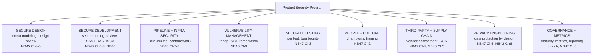
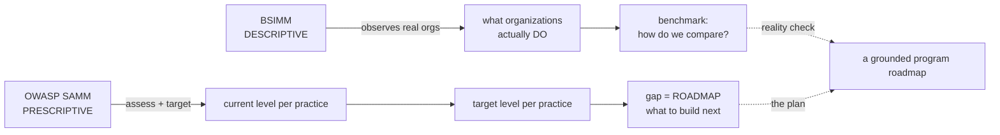
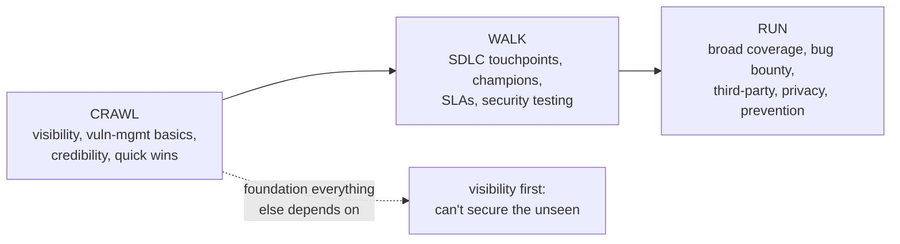
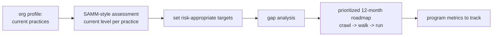

**Level:** Expert · **Track:** Product Security · **Read time:** 270 min

The previous two notebooks taught you to *do* security — to threat model, review code, run scanners, manage vulnerabilities. This notebook is about something different and, for a senior product security engineer, ultimately more important: how to build a **program** that produces security *at the scale of an entire engineering organization*, through people who do not report to you, sustainably, over years. It is the shift from being the person who finds the bugs to being the person who builds the *system* that ensures bugs are found, fixed, and increasingly prevented — across dozens of teams and thousands of engineers you will never personally review code for.

This is a genuine change in altitude, and it defeats many excellent individual practitioners. A brilliant code reviewer can secure the code they personally review; they cannot personally review a thousand engineers' code, and if their model of "doing security" is "I review it," they hit a hard ceiling the moment the organization outgrows their hands. A *program* breaks that ceiling by building **systems, processes, tools, and culture** that make security happen without the security team being in the loop for every change — the threat modeling of Notebook 45, the pipeline scanning of Notebook 46, the champions of the next chapter, all assembled into a self-sustaining machine. The defining skill of this notebook is designing that machine: what functions it must have, how to sequence building them, how to know honestly where you stand, and how to prove the whole thing is worth funding.

The chapter's spine is three ideas. First, **a program is a system, not a pile of activities** — the difference between "we do code review" and "we have a program that ensures the right code gets reviewed, findings get fixed, and the practice improves" is the difference between an activity and a program, and only the latter scales. Second, **maturity models** (BSIMM and SAMM) are the tools for the honest self-assessment and planning that keep a program grounded in reality rather than aspiration — you cannot build a roadmap without first knowing, truthfully, where you are. Third, **meet the organization where it is**: the single most common way security programs fail is importing a mature program's practices into an immature organization that cannot absorb them, and the antidote is sequencing capabilities to the organization's actual readiness. Around these sit strategy, organizational models, resourcing, program metrics, and the culture dimension that ultimately decides everything.

## Why This Matters

The scaling problem is the reason the program exists, and it is arithmetic that no amount of individual excellence solves. Security teams are, everywhere and always, vastly outnumbered by the engineers whose work they must secure — ratios of one security person to fifty, a hundred, or several hundred developers are normal. There is no version of "the security team reviews everything" that survives that ratio; the only path to security at organizational scale is a program that *distributes* security into how the engineering organization already works — into the pipeline, the design process, the champions embedded in teams, the defaults of the frameworks. A product security engineer who understands this builds leverage; one who does not becomes a bottleneck the organization routes around, exactly as an over-blocking pipeline gets routed around (Notebook 46 Chapter 7).

The career dimension is equally real. The most senior and valuable product security roles — security architect, principal product security engineer, head of product security — are fundamentally *program-building* roles. They are judged not by the bugs they personally found but by whether the organization's security posture improved, whether the program scaled with the business, and whether they could prove it to the people who funded it. The ability to assess a program's maturity honestly, design a roadmap that meets the organization where it is, sequence the build sensibly, and communicate the value in terms leadership funds is the skill set that distinguishes senior practitioners from the rest. This chapter, and this notebook, is about that skill set — the transition from technical excellence to organizational impact.

And there is a stark failure statistic underneath it all: most security programs underdeliver relative to their investment, and they underdeliver for predictable, *organizational* reasons — importing practices the org cannot absorb, building the wrong things first, failing to prove value and losing funding, alienating the engineers they depend on, chasing maturity for its own sake instead of risk reduction. Every one of those failures is a program-design failure, not a technical one, and every one is avoidable by the discipline this chapter teaches. Knowing how to build a program that *works* — that is sequenced to reality, proves its value, and earns its continued existence — is what separates a security program that reduces risk from one that becomes an expensive, resented, eventually-defunded overhead.

## Part 1: A Program Is a System, Not a Pile of Activities

The foundational distinction: **an activity is something the security team does; a program is a system that ensures the right security happens whether or not the security team is involved.** Confusing the two is the root of many failed security functions, so make the distinction sharp.

"We do threat modeling" is an activity — it says the security team threat-models things, which means it happens for whatever the small team can reach and nothing else. "We have a threat-modeling *program*" is a system — it means threat modeling is triggered by the right events (a new design, a high-risk change), owned by the right people (increasingly the teams themselves, with security enabling), produces tracked outputs, has a quality bar, and improves over time. The activity depends on the security team's hands and stops at their capacity; the program is a machine that runs at organizational scale.

The properties that distinguish a program from a pile of activities:

- **It is systematic and triggered, not ad hoc.** Security happens because a process invokes it (a PR gate, a design-review trigger, a champion's review), not because someone remembered to ask the security team.
- **It scales beyond the security team's hands.** The whole point — it distributes security into how engineering already works, so it covers what the team could never personally reach.
- **It has defined ownership.** Someone owns each function, findings route to owners, and the security team's role is increasingly to *enable and govern* rather than to *do*.
- **It is measured and improving.** A program knows its own state (maturity, Part 4), tracks whether it is working (metrics, Part 8), and gets better deliberately.
- **It is funded and staffed as an ongoing function**, not a project that ends.

The mental shift this demands from a technical practitioner is large and worth naming: **your job stops being "find and fix security problems" and becomes "build the systems that ensure security problems are found and fixed at scale."** The threat modeling, the code review, the scanning of the previous notebooks do not go away — they become the *outputs* of a program you design, rather than tasks you personally perform. Building the machine, not operating it by hand, is the work. Everything else in the chapter is about how to build that machine well.

## Part 2: Vision, Mission, and a Strategy That Survives the Business

A program needs direction before it needs activities, and the direction is a **vision** (where you are going), a **mission** (what you do), and a **strategy** (how you get there) — not as corporate ceremony, but because without them a program becomes a disconnected set of tactics that cannot be prioritized or defended.

The pieces, kept practical:

- **Vision** — the aspirational end state, e.g. "security is built into how we build products, not bolted on." It sets direction and is the thing every decision is checked against.
- **Mission** — what the program actually does, e.g. "we enable engineering teams to build and ship secure products by providing tools, guardrails, and expertise." Note the framing: **enable**, not gate — the security-as-enabler culture of Notebook 46 Chapter 7, at the program level.
- **Strategy** — the sequenced plan to move from where you are toward the vision, grounded in the maturity assessment (Part 4) and the organization's actual risk (from threat modeling and the business context).

The critical discipline — the one that separates a strategy that works from a document that gathers dust — is that **the strategy must survive contact with the business.** A security strategy developed in isolation from what the business is trying to do is irrelevant to it and gets ignored. The strategy must:

- **Align to business risk, not generic best practice.** The program's priorities should follow the organization's actual risk — where the sensitive data is, what the crown jewels are, what a breach would actually cost (the risk-based thinking of Notebook 42 Chapter 3). A payments company and a content company need different programs; a strategy that ignores the specific business is a template, not a strategy.
- **Enable the business, not obstruct it.** A strategy that makes the business slower without a commensurate risk reduction will be overruled or routed around. The framing is always "how do we ship *securely and fast*," never "how do we make shipping safe by making it slow."
- **Be defensible to leadership in their language.** The strategy is also a funding argument (Part 7), so it must connect to business outcomes leadership cares about — risk, trust, compliance, the cost of a breach — not to a count of activities.

The synthesis: **a good security strategy is a business strategy for managing security risk**, owned jointly with the business rather than imposed on it. It is what makes the program a partner in shipping rather than an obstacle to it, and it is the thing that keeps the program funded and relevant when priorities compete. Without it, a program is a set of tactics nobody can prioritize; with it, every activity has a reason and a defense.

## Part 3: The Core Functions of a Product Security Program

A complete program covers a defined set of functions, and — usefully — these map almost exactly onto the notebooks you have already worked through. This is the program viewed as a system of capabilities.



The functions a mature product-security program covers:

- **Secure design** — threat modeling and design review, catching flaws before code (Notebook 45 Chapters 3–5).
- **Secure development** — secure coding standards, code review, and the SAST/DAST/SCA scanning of Notebook 46.
- **Pipeline and infrastructure security** — DevSecOps and container/IaC scanning (Notebook 46 Chapters 7–8).
- **Vulnerability management** — the triage, prioritization, SLA, and remediation machine of Notebook 46 Chapter 9.
- **Security testing** — penetration testing and bug bounty (Chapter 3 of this notebook).
- **People and culture** — security champions and training (Chapter 2), the human infrastructure that scales the program.
- **Third-party and supply-chain security** — vendor assessment (Chapter 4) and dependency security (Notebook 46 Chapter 5).
- **Privacy engineering** — data protection by design (Chapter 5, Notebook 42 Chapter 6).
- **Governance and metrics** — maturity assessment, program metrics, and reporting (this chapter and Chapter 6).

The point of listing them as a system is twofold. First, **a program is the deliberate assembly of these functions into a coherent whole**, not a random subset the team happened to build — and a maturity assessment (Part 4) is precisely a check of how well each function is covered. Second, **you do not build them all at once** (Part 6) — an immature organization builds a few well before adding more, and the sequence matters enormously. The functions are the *destination*; the maturity model tells you where you are on the way there, and the roadmap sequences the journey. This map is the program's architecture, and the rest of the chapter is about assessing and building it.

## Part 4: Maturity Models — Honest Self-Assessment as the Foundation of Planning

You cannot build a roadmap without knowing where you start, and **maturity models** are the tools for that honest self-assessment. They provide a structured framework for evaluating how mature each function of your program is, benchmarking against industry, and — crucially — planning improvement. The two that matter are BSIMM and OWASP SAMM, and they are different in kind.

**BSIMM (Building Security In Maturity Model)** is **descriptive**: it is built by *observing* what a large set of real organizations actually *do*, and it reports the observed practices across domains (governance, intelligence, secure-development-lifecycle touchpoints, deployment). BSIMM tells you "here is what organizations like yours actually do, and here is how your observed practices compare." Its value is the reality check and the benchmark — it is empirical, not aspirational, and it answers "how do we compare to our peers?" Because it is descriptive, it does *not* tell you what you *should* do; it tells you what *is* done.

**OWASP SAMM (Software Assurance Maturity Model)** is **prescriptive**: it is a framework for *assessing* your maturity and *building a roadmap* to improve it. SAMM defines business functions (Governance, Design, Implementation, Verification, Operations), each with security practices, each measured at maturity levels (typically 1–3). You assess your current level per practice, decide your target level, and the gap becomes your roadmap. SAMM answers "where are we, where do we want to be, and what do we do next?" — it is an assessment-and-planning tool, self-administered and free.



How to use them together and well:

- **Use SAMM to assess and plan** — it is free, self-administered, and directly produces a roadmap from the gap between current and target maturity. It is the primary tool for a practitioner building a program.
- **Use BSIMM to benchmark and reality-check** — it grounds your self-assessment against what real peers actually do, which catches both over-optimism (you rated yourself higher than reality) and over-ambition (you are targeting practices that even mature orgs rarely do).
- **Assess honestly, and repeat annually.** The value is entirely in the honesty — a self-assessment that flatters the program produces a roadmap that builds nothing real. Re-assessing yearly turns the model into a *trend* (are we improving?), which is a program metric in its own right (Part 8).

The deepest point about maturity models, which Part 5 builds on: **maturity is not the goal — risk reduction is.** A model is a *tool* for honest assessment and grounded planning, not a scoreboard to maximize. Chasing a maturity level for its own sake — "we must be Level 3 everywhere" — is a classic failure that builds capabilities the organization does not need and cannot absorb. Use the model to *understand where you are and plan sensibly*, targeting the maturity each function actually needs for the organization's risk, not the maximum the model defines.

## Part 5: Meet the Organization Where It Is

The single most common way product-security programs fail is **importing a mature program's practices into an organization that cannot absorb them.** A security leader arrives from a mature organization (or reads about one), tries to implement its full program — mandatory threat modeling on everything, blocking gates everywhere, a heavy secure-SDLC — in an organization that has never done any of it, and the program collapses under its own weight: engineering revolts, the practices are ignored or gamed, the security team burns out, and the whole effort is discredited. The practices were not wrong; they were *wrong for that organization's maturity*.

The principle: **a program must match the organization's maturity, culture, and readiness, and grow with it.** An organization with no security practices cannot jump to a mature program; it must build the foundation first, earn credibility, and add capability as the organization's ability to absorb it grows. Meeting the organization where it is means:

- **Assess the real starting point honestly** (Part 4) — including the *cultural* readiness, not just the technical practices. An organization that is hostile to security process needs relationship-building before gates.
- **Start with high-value, low-friction wins** — build credibility with capabilities that clearly help and do not obstruct (a helpful pipeline scan, a useful security library, fixing a real problem a team has), before introducing anything that constrains. Credibility earned early is the capital you spend on harder changes later.
- **Introduce constraint gradually and with buy-in** — a blocking gate imposed on an unready organization gets routed around (Notebook 46 Chapter 7); the same gate, introduced after the organization values the program and understands the risk, gets accepted. Sequence constraint to earned trust.
- **Grow the program as the organization matures** — the target maturity is a moving destination reached in stages, not a state imposed at once.

The anti-pattern stated plainly, because it is so common and so costly: **do not import a program; grow one.** The full secure-SDLC of a mature technology company is the *destination* for a program that starts by earning its first credibility, and trying to install the destination on day one is the reliable way to ensure you never reach it. This connects directly to the developer-relationship theme of Notebook 46 Chapter 9 — the program advances at the speed the organization can absorb, and pushing faster than that speed does not accelerate security, it destroys the trust the program depends on. Patience and sequencing are not weakness; they are how programs actually succeed.

## Part 6: Crawl, Walk, Run — Sequencing the Build

Given that you meet the organization where it is and grow the program in stages, *what do you build first?* The crawl-walk-run sequencing, prioritized by value-per-effort and by what foundations other capabilities depend on:

**Crawl (foundations — build these first):**
- **Visibility** — you cannot secure what you cannot see. An asset inventory, an application inventory, and basic scanning (SCA and secrets are the cheapest, highest-value starts — Notebook 46 Chapters 5–6) establish what you have and its obvious exposures.
- **The vulnerability-management basics** — a place for findings to live and a triage process (Notebook 46 Chapter 9), so that what you find is not lost.
- **Relationships and credibility** — the security team known as helpful, not obstructive; a few real problems solved for real teams.
- **Quick, high-value automated wins** — secrets scanning, dependency scanning, the pipeline basics — that clearly help and build trust.

**Walk (build on the foundation):**
- **Secure development lifecycle touchpoints** — threat modeling on high-risk designs, SAST in the pipeline, code review for security-critical changes (Notebook 45, Notebook 46 Chapters 1–4).
- **The security champions program** (Chapter 2) — the human infrastructure that scales the program into teams.
- **SLAs and structured remediation** (Notebook 46 Chapter 9) — accountability for fixing what is found.
- **Security testing** — pentest and the beginnings of bug bounty (Chapter 3).

**Run (maturity):**
- **Comprehensive coverage** — threat modeling and secure-design practices broadly adopted, gates where trust supports them.
- **Advanced capabilities** — a mature bug bounty, third-party/supply-chain program (Chapter 4), privacy engineering (Chapter 5), and the metrics-driven governance (Chapter 6) that proves and steers the whole thing.
- **Prevention over detection** — driving vulnerability *classes* to zero through secure defaults and root-cause fixes (Notebook 46 Chapter 9's loop-closing), so the program increasingly prevents rather than finds.



The sequencing logic: **build the foundations that other capabilities depend on first** (visibility before everything — you cannot threat-model an application you do not know exists), **build the high-value low-friction things early** to earn the credibility that harder changes require (Part 5), and **defer the constraint-heavy and advanced capabilities** until the foundation and the trust support them. A program that tries to run before it can crawl — mandating threat modeling before it even has an application inventory — builds on sand. Sequence to dependencies and to earned trust, and the program compounds; sequence wrong, and each capability is undermined by the missing foundation beneath it.

## Part 7: Resourcing, Build-vs-Buy, and the Under-Resourcing Reality

Every program runs into the same wall: **it is under-resourced relative to its mandate, always and everywhere.** Security teams are outnumbered by engineers by enormous ratios (Part's opening), and the demand for security work always exceeds the team's capacity. This is not a temporary condition to be fixed by hiring; it is the permanent operating reality, and a program that does not internalize it makes the wrong choices.

The consequences and responses:

- **Leverage over labor.** Because you cannot hire your way to a favorable security-to-engineer ratio, the program must maximize *leverage* — every choice favors the option that scales without the security team in the loop: automation over manual review (Notebook 46), secure-by-default frameworks over rules-to-remember (Notebook 45), champions over central-team review (Chapter 2), self-service over ticket-queues. The under-resourcing reality is precisely *why* the whole program is designed for leverage.
- **Ruthless prioritization.** With capacity always short, the program does the highest-risk-reducing work and consciously defers the rest — the same risk-based prioritization as vulnerability management (Notebook 46 Chapter 9), applied to program *investment*. Spend the scarce security hours where they reduce the most risk or build the most leverage.
- **Build-vs-buy for tooling.** A recurring decision: build a capability in-house or buy a commercial tool. The rule of thumb — **buy the commodity, build the differentiator.** Buy the tools that are undifferentiated and well-served by the market (a SAST engine, an SCA scanner, an ASPM platform — Notebook 46); build (or heavily customize) only what is specific to your organization and unavailable off the shelf (custom SAST rules, org-specific policy-as-code, integrations into your specific stack). Building a commodity in-house wastes scarce engineering capacity on something you could have bought; buying your differentiator gives you a generic capability where you needed a specific one. And weigh the *total* cost — a "free" open-source tool that needs a full-time engineer to run is not cheaper than a commercial one.
- **Headcount justified by risk and leverage.** When you do argue for more people (Part 8's metrics are the argument), justify it in terms of risk reduced and leverage created, not activity performed — "this hire lets us extend the champions program to twenty more teams, covering X% more of our risk" beats "we are busy."

The honest framing: **a product security program is an exercise in doing the most risk reduction possible with permanently insufficient resources**, and that constraint shapes every design decision toward leverage, automation, and prioritization. A program that pretends it will eventually be adequately staffed builds for a world that never arrives; one that accepts the constraint builds a machine that multiplies its limited hands.

## Part 8: Program Metrics — Proving Value and Justifying Investment

Notebook 46 Chapter 9 covered *vulnerability* metrics (MTTR, SLA compliance, KEV exposure) — the operational metrics of the remediation machine. **Program metrics are different**: they answer "is the *program* working, is it worth its cost, and should it get more investment?" — the questions that keep a program funded and steer its strategy. A program that cannot answer these is one whose budget is a matter of faith, and faith runs out.

The categories of program metrics:

- **Coverage metrics** — what fraction of the organization the program actually reaches: % of applications threat-modeled, % of repos with scanning, % of teams with a champion, % of the codebase covered. Coverage is the honest measure of the program's *reach*, and gaps in coverage are unmeasured, unmanaged risk.
- **Maturity metrics** — the SAMM assessment (Part 4) tracked over time, showing the program's capabilities improving. Maturity-as-a-trend is a program-health metric.
- **Risk-reduction metrics** — the outcome metrics that matter most: is the organization's actual exposure trending down (the found-vs-fixed trend, KEV exposure, aging criticals from Notebook 46 Chapter 9, rolled up to the program level)? This is the *point* of the program, and it is the metric leadership most cares about.
- **Efficiency and leverage metrics** — is the program getting more secure per dollar/hour? Cost-per-vulnerability-prevented, the ratio of automated to manual findings, the leverage the champions program provides. These justify the leverage-over-labor strategy (Part 7).
- **Culture metrics** — softer but real: engineering engagement with security, champion participation, security-training completion and effectiveness, developer sentiment toward the program. Culture ultimately determines success (Part 10), so measuring it, however imperfectly, matters.

The disciplines that keep program metrics honest (mirroring Notebook 46 Chapter 9's real-vs-vanity distinction):

- **Measure outcomes, not activity.** "We ran 500 scans" is activity; "our exposure to known-exploited vulnerabilities is near zero and our secure-design coverage doubled" is outcome. Leadership funds outcomes.
- **Tie metrics to business value.** The program's metrics must ultimately connect to what the business cares about — risk, trust, compliance, the cost of a breach avoided — because the program competes for funding against everything else the business could do with the money (Chapter 6 is entirely about this translation).
- **Use metrics to steer, not just to report.** The most valuable use of program metrics is *deciding what to build next* — a coverage gap is a roadmap item, a stalled maturity practice is an investment target. Metrics that only report are half-used; metrics that steer the program are the point.

The framing: **program metrics are the program's case for its own existence and growth.** They prove it reduces risk, justify its investment, and steer its evolution. A program that measures its own effectiveness and communicates it in business terms earns funding and autonomy; one that cannot is perpetually on the defensive, its value a matter of assertion. Building the measurement in from the start (Part 6's crawl phase includes basic metrics) is what lets the program prove itself when the funding question inevitably comes.

## Part 9: Culture — The Thing That Ultimately Decides Everything

Beneath the strategy, the functions, the maturity model, and the metrics sits the factor that ultimately determines whether any of it works: **culture.** A program with perfect processes and tools fails in an organization where security is seen as someone else's job and an obstacle to real work; a program with modest tools thrives in an organization where engineers *want* to build secure software. The culture is not a soft addendum to the program — it is the substrate the program runs on, and shaping it is a first-order program activity.

The cultural outcomes a program must cultivate (the themes recur from Notebook 46 Chapters 7 and 9, here as a program-level objective):

- **Shared ownership** — security is everyone's responsibility, not the security team's alone (the DevSecOps culture, Notebook 46 Chapter 7). This is the deepest and hardest shift, and it is what makes the program scale beyond the security team's hands.
- **Security as an enabler** — the security team seen as a partner that helps teams ship securely and fast, not the office of "no." A program perceived as an obstacle is routed around; one perceived as an ally is adopted.
- **Psychological safety around security** — engineers feel safe *raising* security concerns and *reporting* mistakes, because blame drives problems underground (Notebook 46 Chapter 9). A blameless culture surfaces the bugs; a blaming one hides them.
- **Security as a valued quality** — secure code seen as good engineering, celebrated rather than resented, the way reliability and performance are.

How a program shapes culture (levers, not slogans):

- **Relationships and enablement** — the security team's daily behavior (helpful vs obstructive) shapes the culture more than any policy. Solve real problems for teams; be the ally.
- **Champions** (Chapter 2) — embedding security-minded engineers *within* teams is the single most powerful culture-shaping mechanism, because it makes security a peer voice rather than an external mandate.
- **Making the secure path the easy path** — the strongest cultural signal is a program where doing the secure thing is *easier* than the insecure thing (secure defaults, paved paths), because it aligns the culture with the incentives (Notebook 45's least-astonishment principle at organizational scale).
- **Leadership tone** — whether senior engineering leadership visibly values security determines whether teams do; securing that sponsorship is a program priority (Part 2's business alignment).

The synthesis, and the note the chapter ends its argument on: **you can build every process and buy every tool, and if the culture treats security as an adversary, the program fails; and a strong security culture makes even a modest program effective.** Culture is the highest-leverage and slowest-moving element of a program, which means it must be worked on *deliberately and from the start*, not left to emerge. The tools and processes are necessary; the culture is what determines whether they are used or defeated. Every other part of this chapter is, in the end, in service of building an organization where security is a shared value — because that is the only foundation on which a program stands.

## Part 10: Hands-On Lab — A Maturity Assessment and a Twelve-Month Roadmap

### 10.1 What we are building

A SAMM-style maturity assessment of a hypothetical organization (Part 4), a gap analysis against a risk-appropriate target (Part 5), and a prioritized, crawl-walk-run twelve-month roadmap (Part 6) — the core artifacts of building a program.



Python 3 only.

### 10.2 The organization and its current maturity

```bash
mkdir -p ~/program-lab && cd ~/program-lab
cat > assessment.json <<'JSON'
{
  "org": "MidCo (fintech, ~200 engineers, handles payment + PII)",
  "risk_profile": "high (regulated, sensitive data, internet-facing)",
  "practices": [
    {"function":"Governance","practice":"Strategy & Metrics","current":0,"target":2},
    {"function":"Governance","practice":"Policy & Compliance","current":1,"target":2},
    {"function":"Design","practice":"Threat Assessment","current":0,"target":2},
    {"function":"Design","practice":"Security Requirements","current":1,"target":2},
    {"function":"Implementation","practice":"Secure Build","current":1,"target":3},
    {"function":"Implementation","practice":"Secret Management","current":0,"target":3},
    {"function":"Verification","practice":"Security Testing","current":1,"target":2},
    {"function":"Verification","practice":"Requirements Testing","current":0,"target":2},
    {"function":"Operations","practice":"Incident Management","current":1,"target":2},
    {"function":"Operations","practice":"Vuln Management","current":0,"target":3}
  ]
}
JSON
echo "assessment recorded: 10 SAMM practices, current vs target (0-3 scale)"

# Sample output:
# assessment recorded: 10 SAMM practices, current vs target (0-3 scale)
```

### 10.3 Gap analysis and roadmap generation

```python
# roadmap.py -- SAMM gap analysis -> prioritized crawl/walk/run roadmap.
import json, sys

# Part 6: which practices are foundational (build first) vs advanced.
PHASE = {
  "Vuln Management":"CRAWL", "Secret Management":"CRAWL", "Secure Build":"CRAWL",
  "Strategy & Metrics":"CRAWL",
  "Threat Assessment":"WALK", "Security Testing":"WALK", "Security Requirements":"WALK",
  "Requirements Testing":"WALK",
  "Policy & Compliance":"RUN", "Incident Management":"RUN",
}
PHASE_ORDER = {"CRAWL":0, "WALK":1, "RUN":2}
# Which quarter each phase targets.
PHASE_QUARTER = {"CRAWL":"Q1-Q2", "WALK":"Q2-Q3", "RUN":"Q3-Q4"}

def main(path):
    a = json.load(open(path))
    print(f"ORG: {a['org']}")
    print(f"RISK: {a['risk_profile']}\n")

    gaps = []
    for p in a["practices"]:
        gap = p["target"] - p["current"]
        if gap > 0:
            gaps.append({**p, "gap": gap, "phase": PHASE.get(p["practice"], "WALK")})

    # Prioritize: foundational phase first, then by gap size (biggest gap = most work/risk).
    gaps.sort(key=lambda g: (PHASE_ORDER[g["phase"]], -g["gap"]))

    total_gap = sum(g["gap"] for g in gaps)
    print(f"MATURITY GAP ANALYSIS: {len(gaps)} practices below target, "
          f"total gap {total_gap} levels\n")
    print(f"{'PHASE':<7}{'WHEN':<9}{'GAP':<5}{'CUR->TGT':<10}PRACTICE")
    print("-" * 66)
    for g in gaps:
        print(f"{g['phase']:<7}{PHASE_QUARTER[g['phase']]:<9}{g['gap']:<5}"
              f"{str(g['current'])+' -> '+str(g['target']):<10}"
              f"{g['practice']} ({g['function']})")
    print("-" * 66)

    # Part 8: the program metrics to track against this roadmap.
    print("\nPROGRAM METRICS TO TRACK:")
    print("  coverage: % repos with secret+dep scanning (CRAWL target: 100%)")
    print("  coverage: % high-risk designs threat-modeled (WALK target: 100%)")
    print("  maturity: re-assess in 6 and 12 months; trend must rise")
    print("  risk:     KEV exposure -> 0; critical MTTR within SLA")

if __name__ == "__main__":
    main(sys.argv[1] if len(sys.argv) > 1 else "assessment.json")
```

```bash
python3 roadmap.py assessment.json

# Sample output:
# ORG: MidCo (fintech, ~200 engineers, handles payment + PII)
# RISK: high (regulated, sensitive data, internet-facing)
#
# MATURITY GAP ANALYSIS: 10 practices below target, total gap 18 levels
#
# PHASE  WHEN     GAP  CUR->TGT  PRACTICE
# ------------------------------------------------------------------
# CRAWL  Q1-Q2    3    0 -> 3    Vuln Management (Operations)
# CRAWL  Q1-Q2    3    0 -> 3    Secret Management (Implementation)
# CRAWL  Q1-Q2    2    1 -> 3    Secure Build (Implementation)
# CRAWL  Q1-Q2    2    0 -> 2    Strategy & Metrics (Governance)
# WALK   Q2-Q3    2    0 -> 2    Threat Assessment (Design)
# WALK   Q2-Q3    2    0 -> 2    Requirements Testing (Verification)
# WALK   Q2-Q3    1    1 -> 2    Security Requirements (Design)
# WALK   Q2-Q3    1    1 -> 2    Security Testing (Verification)
# RUN    Q3-Q4    1    1 -> 2    Policy & Compliance (Governance)
# RUN    Q3-Q4    1    1 -> 2    Incident Management (Operations)
# ------------------------------------------------------------------
#
# PROGRAM METRICS TO TRACK:
#   coverage: % repos with secret+dep scanning (CRAWL target: 100%)
#   coverage: % high-risk designs threat-modeled (WALK target: 100%)
#   maturity: re-assess in 6 and 12 months; trend must rise
#   risk:     KEV exposure -> 0; critical MTTR within SLA
```

Read the roadmap against the chapter. The **crawl phase leads with the foundations** — vulnerability management, secret management, and secure build (the cheapest, highest-value, dependency-free wins of Part 6) plus basic strategy/metrics — before the **walk phase** adds threat modeling and security testing, and the **run phase** finishes with governance and incident maturity. The sequencing is *by dependency and value*, not by gap size alone — and note the program builds its *own* measurement (Strategy & Metrics) in the crawl phase, so it can prove its value from the start (Part 8).

### 10.4 The one-page program summary

```python
# summary.py -- the leadership-facing one-pager (Part 8, Ch 6 preview).
print("""
PRODUCT SECURITY PROGRAM -- 12-MONTH PLAN (MidCo)

WHERE WE ARE:  High-risk fintech, ~200 engineers, minimal security program.
               SAMM assessment: 10 practices below target, 18 maturity levels of gap.

WHAT WE'LL DO (sequenced to what the org can absorb):
  Q1-Q2 (CRAWL): visibility + foundations
     - secret & dependency scanning across all repos (quick, high-value wins)
     - vulnerability management: findings tracked, triaged, SLA'd
     - stand up program strategy + metrics
  Q2-Q3 (WALK):  secure-development lifecycle
     - threat modeling on high-risk designs; security champions program
     - security testing (pentest); security requirements in design
  Q3-Q4 (RUN):   governance + coverage
     - policy & compliance; incident management maturity; broaden coverage

HOW WE'LL PROVE IT:
     coverage % (scanning, threat modeling) | KEV exposure -> 0
     critical MTTR within SLA | SAMM maturity re-assessed, trending up

WHAT WE NEED:  [headcount + tooling budget, justified by risk reduced + leverage]
""")
```

```bash
python3 summary.py | head -6

# Sample output:
# PRODUCT SECURITY PROGRAM -- 12-MONTH PLAN (MidCo)
#
# WHERE WE ARE:  High-risk fintech, ~200 engineers, minimal security program.
#                SAMM assessment: 10 practices below target, 18 maturity levels of gap.
#
# WHAT WE'LL DO (sequenced to what the org can absorb):
```

This one-pager is the program made legible to leadership (Part 8, developed fully in Chapter 6): where we are (honest assessment), what we will do (sequenced roadmap), how we will prove it (outcome metrics), and what we need (the funding ask, justified by risk). It is the artifact that turns a technical roadmap into a funded program.

### 10.5 Extending the lab

Run a real SAMM self-assessment (the OWASP SAMM toolbox spreadsheet) against an organization you know and generate its roadmap; add a BSIMM-style benchmark column showing how the target levels compare to what peer organizations actually do (Part 4); model the *resourcing* — estimate the effort per roadmap item and check it against a realistic team size to feel the under-resourcing reality of Part 7; and build the coverage-metric dashboard that would track the crawl-phase wins (% repos scanned) over the twelve months.

## Part 11: Common Pitfalls

**Confusing activities with a program.** "We do code review" is an activity; a program is the system that ensures the *right* things are reviewed, fixed, and improved at scale. Only the system scales past the security team's hands.

**Importing a mature program into an immature organization.** The number-one program-failure mode. Meet the organization where it is and grow the program in stages; do not install the destination on day one.

**Chasing maturity for its own sake.** Maturity is a tool for planning, not a scoreboard. Target the maturity each function needs for the organization's *risk*, not the model's maximum.

**Building the wrong things first.** Sequence by dependency and value: visibility and foundations before constraint, high-value low-friction wins before gates. Threat modeling before an app inventory builds on sand.

**No strategy, or a strategy disconnected from the business.** A program without a business-aligned strategy is a pile of tactics nobody can prioritize or defend. The strategy must align to business risk and enable, not obstruct.

**Pretending you will be adequately resourced.** You will not, ever. Design for leverage — automation, secure defaults, champions, self-service — and prioritize ruthlessly. The under-resourcing is permanent.

**Building the commodity, buying the differentiator (backwards).** Buy the well-served commodity tools; build only your org-specific differentiators. Building a SAST engine in-house wastes scarce capacity.

**Measuring activity, not outcomes.** "We ran 500 scans" does not justify a budget; "our exposure is trending down and coverage doubled" does. Program metrics are the case for the program's existence.

**Neglecting culture.** Perfect processes fail in a hostile culture; a modest program thrives in a supportive one. Culture is the highest-leverage, slowest-moving element — work it deliberately from the start.

**Being the office of "no."** A program experienced as an obstacle gets routed around. Enablement, relationships, and making the secure path the easy path are what get the program adopted.

**Treating the program as a project that ends.** It is an ongoing function that grows with the organization. A program built as a one-time cleanup decays the moment the project closes.

## Final Revision / Summary

- The shift this notebook demands: from **doing security** to **building a program** that produces security at organizational scale, through people who do not report to you. A brilliant reviewer hits a ceiling at their own hands; a program breaks it by distributing security into how engineering works.
- **A program is a system, not a pile of activities.** The difference between "we do threat modeling" and "we have a threat-modeling program" is systematic triggering, ownership, scale beyond the team's hands, measurement, and improvement. Your job becomes *building the machine*, not operating it by hand.
- A program needs a **vision, mission, and strategy**, and the strategy must **survive contact with the business** — aligned to business risk, enabling not obstructing, and defensible to leadership in their language. A good security strategy is a business strategy for managing security risk.
- The **core functions** map onto the earlier notebooks: secure design, secure development, pipeline/infra security, vulnerability management, security testing, people/culture, third-party/supply-chain, privacy, and governance/metrics. A program is their deliberate assembly — but you do not build them all at once.
- **Maturity models** enable honest self-assessment and planning: **BSIMM is descriptive** (what real orgs do — benchmark and reality-check), **OWASP SAMM is prescriptive** (assess current vs target per practice → the gap is your roadmap). Use SAMM to plan, BSIMM to benchmark, assess honestly, re-assess annually. **Maturity is a tool, not the goal — risk reduction is.**
- **Meet the organization where it is.** The top program-failure mode is importing a mature program into an org that cannot absorb it. Assess the real (including cultural) starting point, start with high-value low-friction wins to earn credibility, introduce constraint gradually with buy-in, and grow the program as the org matures. **Do not import a program; grow one.**
- **Crawl-walk-run**: build foundations first (visibility — you can't secure the unseen — plus vuln-management basics, secrets/dependency scanning, credibility), then SDLC touchpoints and champions and SLAs, then broad coverage, bug bounty, third-party, privacy, and prevention. **Sequence by dependency and by earned trust.**
- **Under-resourcing is permanent.** Favor **leverage over labor** (automation, secure defaults, champions, self-service), prioritize ruthlessly by risk, **buy the commodity and build the differentiator**, and justify headcount by risk reduced and leverage created. The program is doing the most risk reduction possible with permanently insufficient resources.
- **Program metrics** (distinct from vulnerability metrics) prove the program's value and justify investment: coverage, maturity-over-time, risk-reduction, efficiency/leverage, and culture. **Measure outcomes not activity, tie to business value, and use metrics to steer, not just report.** They are the program's case for its own existence.
- **Culture ultimately decides everything**: shared ownership, security-as-enabler, psychological safety, security-as-a-valued-quality. Shaped through relationships, champions, making the secure path the easy path, and leadership tone. Perfect processes fail in a hostile culture; a modest program thrives in a supportive one — so work the culture deliberately, from the start.

## Cheat Sheet / Quick Reference

**Activity vs program**

```
activity: the security team DOES something (stops at their hands)
program:  a SYSTEM that ensures the right security happens at scale
          -- triggered, owned, measured, improving, funded as ongoing
your job: BUILD the machine, don't operate it by hand
```

**Vision / mission / strategy**

```
vision:   the end state ("security built in, not bolted on")
mission:  what you do -- ENABLE teams to ship securely + fast
strategy: sequenced plan, must SURVIVE the business
          (aligned to business risk, enabling, defensible to leadership)
```

**Maturity models**

```
BSIMM  = DESCRIPTIVE  -> what real orgs DO -> benchmark / reality-check
SAMM   = PRESCRIPTIVE -> assess current vs target per practice -> gap = ROADMAP
use SAMM to plan, BSIMM to benchmark | assess HONESTLY | re-assess yearly
MATURITY IS A TOOL, NOT THE GOAL -- target what your RISK needs
```

**Meet the org where it is**

```
#1 failure = importing a mature program into an immature org
-> assess the real (+ cultural) start | high-value low-friction wins first
-> introduce constraint gradually with buy-in | grow with the org
DO NOT IMPORT A PROGRAM; GROW ONE
```

**Crawl / walk / run**

```
CRAWL: visibility (can't secure the unseen) | vuln-mgmt basics
       secrets + dep scanning | credibility + quick wins
WALK:  SDLC touchpoints (threat model, SAST) | CHAMPIONS | SLAs | pentest
RUN:   broad coverage | bug bounty | third-party | privacy | PREVENTION
sequence by DEPENDENCY and by EARNED TRUST
```

**Resourcing (permanently short)**

```
leverage > labor (automation, secure defaults, champions, self-service)
prioritize ruthlessly by risk
BUY the commodity, BUILD the differentiator
justify headcount by RISK REDUCED + LEVERAGE, not activity
```

**Program metrics (prove value)**

```
coverage (% scanned/threat-modeled/championed) | maturity trend
risk reduction (KEV=0, MTTR, exposure trend) | efficiency/leverage | culture
measure OUTCOMES not activity | tie to business value | steer, don't just report
```

**Culture (decides everything)**

```
shared ownership | security as ENABLER | psychological safety | valued quality
levers: relationships | champions | make the secure path the EASY path | leadership tone
perfect process + hostile culture = failure. modest program + strong culture = success.
```

## Practice Labs & Resources

**Frameworks**
- **OWASP SAMM** — the free assessment-and-roadmap model; download the toolbox and run a real self-assessment (the primary tool of Part 4).
- **BSIMM** — the descriptive observed-practice model; read the current report for the benchmark of what real organizations do.
- **NIST SSDF (SP 800-218)** — the Secure Software Development Framework, a useful complement for mapping practices to a government-recognized standard.

**Hands-on**
- Extend the lab: run a real SAMM assessment on an org you know; add a BSIMM benchmark column; model the resourcing against a realistic team size; build the coverage dashboard.
- Write the one-page program summary (Part 10) for a real or hypothetical organization, including the honest starting point and the funding ask.
- Take one function from Part 3 and design its crawl-walk-run build-out for a specific organization.

**Deliberate practice**
- For any organization, practice the "meet it where it is" judgment: what is the real maturity, what is the *cultural* readiness, and what would you build *first* to earn credibility?
- Draft program metrics for a program you know that measure outcomes, not activity, and connect each to a business value.
- Do the build-vs-buy analysis for three capabilities: which are commodity (buy), which are your differentiator (build)?

**Further reading**
- Notebooks 45 and 46 (the functions this program assembles) and the rest of Notebook 47 (champions, bug bounty, third-party, privacy, metrics, and the capstone that integrates everything).
- The BSIMM and SAMM documentation, and case studies of security-program building (many conference talks from security leaders on their program journeys).
- Chapter 6 of this notebook for the metrics-and-leadership-communication half of Part 8, and Chapter 2 next for the security-champions model that is the program's most powerful scaling and culture mechanism.

---

*Also on [Praneeth's portfolio](https://ping-praneeth.vercel.app/notebook/product-security-program/01-building-a-product-security-program-vision-maturity-models-and-metrics), with comments and the latest edits.*
