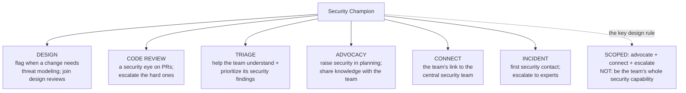
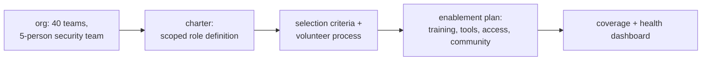

The previous chapter established the defining constraint of every product-security program: the security team is outnumbered by engineers by ratios of one-to-fifty, one-to-a-hundred, or worse, and no amount of hiring closes that gap. The chapter argued that the only path to security at scale is *leverage* — distributing security into how engineering already works rather than doing it centrally. This chapter is about the single most powerful mechanism for that distribution: the **security champion** — an engineer *embedded within a development team* who acts as the security team's presence in a team the security team could never staff.

The idea is simple and its leverage is enormous. A central security team of five cannot be in every design review, every code review, and every planning session of fifty engineering teams — the arithmetic forbids it. But if each of those fifty teams has one of its *own* engineers who is security-minded, trained, connected to the security team, and empowered to raise security concerns, then security has a *presence* in all fifty teams at once, at a fraction of the headcount. The champion is not a security expert transplanted into the team; they are a *team member* who has taken on a security-advocate role, which is exactly what makes them effective — they are a trusted peer who understands the team's code and context, speaking security from *inside* rather than mandating it from outside. That insider trust is the champion program's core asset and the reason it scales culture (Notebook 47 Chapter 1) in a way no central team can.

But — and this is the theme the chapter returns to relentlessly — **champion programs fail far more often than they succeed, and they fail for predictable, avoidable reasons.** The champion given no *time* to do the role and expected to be a security advocate in their spare time; the champion made a dumping ground for every security ticket the central team wants off its plate; the champion appointed by a manager as a box-tick with no interest in security; the program with no community, no enablement, no recognition, that quietly dissolves within a year. Every one of these is a program-design failure, and every one is avoidable. This chapter is as much about *not killing* a champion program as about building one, because the difference between the two is entirely in the design.

## Why This Matters

The leverage is the whole case, and it is worth quantifying. A security team of five supporting an engineering organization of five hundred has a one-to-hundred ratio — there is no version of central review that covers that. Establish a champions program with one champion per ten-person team, and you have added *fifty* embedded security advocates, each covering their own team, multiplying the security team's reach by an order of magnitude without a single security hire. The champions are not a substitute for the security team's expertise; they are a *force multiplier* for it — the security team's specialist knowledge, distributed through fifty trusted insiders into fifty teams simultaneously. No other single program investment produces that reach.

But the deeper value is *cultural*, and it is what makes champions the program's most important culture mechanism (Notebook 47 Chapter 1 Part 9). Security imposed from a central team *from outside* is experienced as a mandate — an obstacle, the office of "no," something to route around. Security raised by a *peer inside the team* — a fellow engineer who understands the codebase, shares the team's context, and speaks the team's language — is experienced completely differently: it is a colleague helping, not an outsider gating. The champion transforms security from an external force into an internal value, which is precisely the shared-ownership culture the program is trying to build. A single embedded advocate does more to make a team *own* its security than any policy the central team could write, because the advocacy comes from within. This is why champions are simultaneously the program's biggest scaling lever *and* its biggest culture lever — they solve the ratio problem and the ownership problem at once.

And for the individual product security engineer, building and running a champions program is a defining senior skill. It is the clearest expression of the shift from *doing* security to *building the systems that produce it* (Chapter 1) — a champions program is a machine that turns the security team's expertise into organizational reach and cultural change, and designing that machine well (selection, enablement, time, community, recognition) is exactly the program-building craft that distinguishes senior practitioners. The engineers who can *scale* security through other people, rather than only *perform* it themselves, are the ones who lead security functions.

## Part 1: What a Champion Is — and Is Not

Pin down the role precisely, because the failures in Part 10 mostly come from getting this definition wrong.

A **security champion** is an engineer, *embedded within a development team*, who takes on an additional role as that team's security advocate and point of contact — the connective tissue between their team and the central security team. Three words in that definition carry all the weight:

- **Engineer** — a champion is one of the team's own developers, not a security specialist assigned to sit with the team. Their credibility comes from being a real, respected member of the team who ships the same code everyone else does. A security person parachuted in is an outsider; a teammate who cares about security is an insider, and the insider status is the whole point.
- **Embedded** — the champion works *within* the team, in its standups, its reviews, its design discussions, with full context on what the team is building and why. This context is what makes their security input relevant and actionable in a way a context-free central review never is.
- **Advocate** — the champion's job is to *advocate* for security within the team and to *connect* the team to security expertise — not to *be* the team's entire security capability. This scoping is essential (Part 2), and getting it wrong (making the champion the team's sole security owner, responsible for everything security) is a primary failure mode.

Just as important is what a champion is **not**:

- **Not a security expert.** A champion is a security-*interested* engineer who receives training and support, not someone expected to have a security specialist's depth. Expecting champions to be experts sets an impossible bar, deters volunteers, and misunderstands the role — their value is presence and advocacy plus a connection to real expertise, not being the expert themselves.
- **Not a replacement for the security team.** Champions extend the security team's reach; they do not replace its specialist work (threat modeling complex systems, deep code review, incident response). A program that uses champions to *offload* the security team's hard work onto untrained volunteers fails (Part 10's dumping-ground anti-pattern).
- **Not the team's security scapegoat.** When something goes wrong, the champion is not the one to blame — security remains a shared team responsibility, and blaming the champion destroys the role's appeal and the culture it is meant to build.
- **Not necessarily full-time.** Champion is usually a *part-time role* layered onto an engineering job (Part 4 is about protecting the time it needs), not a full-time reassignment.

The essence: **a champion is a trusted team insider who carries security into the team and carries the team's security questions out to the experts.** They are a bridge, an advocate, and a multiplier — not an expert, not a replacement, not a scapegoat. Every design decision in the chapter protects that essence.

## Part 2: What Champions Actually Do — and Deliberate Scoping

The champion's responsibilities span the security lifecycle *for their team*, but the single most important design decision is **scoping the role to be sustainable** — because an unbounded role ("you own all security for the team") is the fastest way to burn out a champion and kill the program.

The responsibilities, scoped realistically:



- **Design** — recognize when a change is security-relevant and needs threat modeling (Notebook 45), and bring the team's designs to security attention. The champion is the *trigger*, not necessarily the person who does the deep threat model.
- **Code review** — provide a security-aware eye on the team's pull requests, catching the obvious issues (Notebook 46 Chapters 1–2) and *escalating* the ones beyond their depth. Again: catch and escalate, not solve everything.
- **Triage** — help the team understand and prioritize the security findings its scanners produce (Notebook 46 Chapter 9), translating security output into the team's context.
- **Advocacy** — raise security in planning and prioritization, share knowledge, and normalize security as part of the team's engineering, shaping the local culture.
- **Connect** — be the team's point of contact with the central security team, so the team has a known, trusted path to expertise.
- **Incident response** — be the first security contact when something happens, and escalate to the experts (Notebook 33).

The scoping rule that keeps this sustainable, and that the whole chapter insists on: **the champion advocates, triages, catches the obvious, connects, and escalates — they do not become the team's entire security function.** The hard work (deep threat modeling, complex vulnerability analysis, incident response) *escalates to the central security team*; the champion's job is to *recognize* when escalation is needed and to be the bridge, not to personally shoulder the specialist work. A role scoped as "advocate and connector" is sustainable as a part-time addition to an engineering job; a role scoped as "own all of the team's security" is a full-time job dumped on a volunteer, and it collapses. Getting this scope right is the difference between a champion who thrives for years and one who burns out in months — and it is the most common thing programs get wrong.

## Part 3: Champions vs the Alternatives

To see why the champion model is the right leverage, contrast it with the two alternatives it sits between.

| Model | How it works | Why it fails at scale |
|---|---|---|
| **Central review team** | The security team reviews everything | The ratio forbids it; becomes a bottleneck teams route around |
| **Everyone is a security expert** | Train all engineers to expert depth | Unrealistic — you cannot make every engineer a security specialist; training decays; depth isn't the bottleneck |
| **Security champions** | One embedded advocate per team, connected to central experts | Scales reach without central bottleneck or the impossible everyone-expert bar |

**The central review team** is where many programs start and where they hit the wall of Chapter 1 — the security team cannot review everything, so it becomes a bottleneck that teams route around, or it covers only a fraction of the work. It does not scale, by arithmetic.

**"Make everyone a security expert"** is the opposite extreme and is equally unworkable, for reasons worth understanding: you cannot turn every engineer into a security specialist (depth takes years and most engineers' focus is elsewhere), the training decays without reinforcement, and — crucially — *expert depth in every engineer is not actually what the problem needs*. The problem needs security *presence* and *advocacy* in every team plus a *connection to real expertise*, not a specialist in every seat. Trying to make everyone an expert is expensive, ineffective, and misdiagnoses the bottleneck.

**The champion model** threads between them: it puts security *presence* in every team (solving the central-team ratio problem) without requiring every engineer to be an expert (solving the everyone-expert impossibility), by having *one* security-interested engineer per team who is trained enough to advocate and triage and who *connects* to the central experts for the hard work. It is the leverage point precisely because it distributes *presence and advocacy* (which scale) rather than *deep expertise* (which does not), while keeping a bridge to the deep expertise where it is genuinely needed. This is the same insight as Notebook 46's "automate the routine, reserve humans for judgment" — distribute the scalable part, centralize the specialist part, and connect them.

## Part 4: Selection and the Non-Negotiable of Time

Two decisions determine whether a champions program lives or dies before any enablement matters: *who* becomes a champion, and *whether they have the time* to do it.

**Selection: volunteers over appointees.** The single most important selection principle is that **champions should be volunteers, driven by genuine interest, not appointees assigned by a manager filling a slot.** The reasoning is about motivation and effectiveness:

- **Intrinsic motivation is what makes a champion effective.** A champion who *wants* the role invests in it, advocates authentically, and persists; one *assigned* to it treats it as an unwanted chore, does the minimum, and provides no real advocacy (Part 10's token-appointment anti-pattern). The role depends on genuine care, which cannot be assigned.
- **The profile of a good champion**: security-curious (does not need to be an expert — that is trainable), respected by their team (advocacy requires credibility), a good communicator (the role is largely about influence), and reasonably senior/stable (a junior with no standing cannot advocate effectively, and a champion who leaves the team constantly resets the program). Interest and respect matter more than existing security knowledge.
- **Attract, do not conscript.** Make the role *appealing* — with recognition, career growth, community, and interesting work (Parts 6–7) — so that the right people volunteer, rather than assigning it to whoever a manager can spare.

**Time: the non-negotiable that most programs skip.** The most common and most fatal program-design failure is **expecting engineers to be champions in their spare time, with no allocated hours and no manager buy-in.** A champion given no time is a champion who cannot do the role no matter how motivated — their engineering deadlines always win, the security work never happens, they feel guilty and overloaded, and they quit. The requirements:

- **Allocate real time.** The champion role needs a defined, *protected* time allocation — commonly framed as a percentage of the engineer's time (10–20% is typical) — that is understood and honored, not spare-time-if-you-can.
- **Manager buy-in is mandatory.** The champion's *engineering manager* must agree to and protect that time, or the manager's delivery pressure silently overrides it. A champions program without engineering-management sponsorship is an unfunded mandate that collapses on contact with the first deadline. Securing that buy-in — making the case to engineering managers that the champion's time is a worthwhile investment — is a program-leadership responsibility, not the champion's to fight for alone.
- **Treat it as real work.** The champion role must be visible in the engineer's goals, their performance review, and their team's planning — recognized as legitimate work with legitimate time, not an invisible extra.

The blunt rule: **an unfunded champions program — volunteers with no protected time and no manager buy-in — will fail, no matter how good everything else is.** The time and the sponsorship are the foundation; enablement, community, and recognition are built on top of it, and none of them matter if the champion has no hours to use them. This is the single most important thing to get right, and it is the thing most programs get wrong.

## Part 5: Enabling Champions — Training, Tools, and Access

A champion is only as effective as the support behind them. Selecting motivated volunteers and protecting their time is necessary but not sufficient; they must be *enabled* to do the role, which the central security team owns.

The enablement a champions program provides:

- **Training, ongoing and role-appropriate.** Champions need security education pitched at the *advocate* level (recognizing issues, knowing when to escalate, understanding the common vulnerability classes of Notebook 45 Chapter 8), not the *expert* level. And it must be *ongoing* — an onboarding session and nothing more lets knowledge decay; regular sessions, lunch-and-learns, and hands-on exercises (like the labs throughout this curriculum) keep champions sharp and engaged.
- **A knowledge base.** Champions need a go-to reference — secure coding guidelines (Notebook 45 Chapter 6), the org's security standards, threat-modeling how-tos, checklists, and the answers to common questions — so they are not starting from scratch each time. A good knowledge base is force multiplier for the force multiplier.
- **Tools and access.** Champions need access to the security tooling (the scanners of Notebook 46, dashboards, the vulnerability-management system) so they can help their team triage and act, and the *permissions* to do the role.
- **Direct, low-friction access to the security team.** The champion's connection to real expertise must be *easy* — a dedicated channel, office hours, a fast escalation path — so that when a champion hits something beyond their depth, getting help is quick and un-bureaucratic. A champion who cannot easily reach the experts becomes a bottleneck instead of a bridge. This access *is* the "connect to expertise" half of the role, made real.

The principle: **the central security team's job in a champions program is to *enable* the champions**, not to offload work onto them. The security team's expertise reaches the organization *through* the champions, which means investing in the champions — their training, their tools, their access — is investing in the program's entire reach. A program that recruits champions and then abandons them without enablement has volunteers with a title and no capability; a program that enables them well turns each champion into a genuine extension of the security team. The enablement is where the security team's specialist knowledge becomes organizational leverage.

## Part 6: The Champion Community — The Peer Network

A subtle but powerful truth: **the community of champions is often as valuable as the individual champion role.** A champions program is not just fifty isolated advocates each connected to the central team; it is a *network* of peers who support each other, share knowledge, and build a collective identity around security — and that network multiplies the program's value in ways the individual roles alone do not.

Why the community matters:

- **Peer learning and support.** Champions face similar challenges (how do I advocate for security in a skeptical team, how do I triage this finding, how do I handle this design), and a community lets them learn from each other's experience rather than each solving the same problem alone. The collective knowledge of fifty champions exceeds what the central team can push to them.
- **Reduced isolation and sustained motivation.** A lone champion in a team can feel isolated — the only one thinking about security, sometimes pushing against the grain. A community makes them part of *something*, with peers who share the mission, which is a major driver of retention (Part 7) against the isolation that otherwise burns champions out.
- **Collective identity and culture.** A champions community builds a shared security culture that spans teams — champions carry norms and practices between teams, spread what works, and form the connective tissue of the organization's security culture. The community is where the program becomes a *movement* rather than a set of roles.
- **A two-way channel for the central team.** The community is also how the security team *hears* from the ground — what teams are struggling with, what tools are failing, what the real friction is — making the program responsive rather than top-down. The champions are the security team's eyes and ears as much as its hands.

Building the community deliberately: a regular champions meeting (sharing wins, challenges, and new threats), a dedicated communication channel, shared resources, and social/identity elements (a name, recognition, belonging). The community requires deliberate cultivation — it does not form on its own — and it is a program-leadership responsibility to build and sustain it. The payoff is that the program becomes self-reinforcing: champions support each other, spread culture, and retain motivation through belonging, turning a collection of individual roles into a resilient network. **Invest in the community, not just the individuals** — it is where much of the program's durability and cultural reach actually lives.

## Part 7: Recognition, Incentives, and the Reality of Churn

Being a champion is *extra work*, layered on top of an engineering job, and without recognition and incentive that extra work is unrewarded, unsustainable, and abandoned. **Recognition and career incentive are the retention mechanism**, and retention is a real challenge because champion churn is constant — engineers change teams, change roles, get busy, or simply move on from the role.

The retention levers:

- **Recognition, visible and genuine.** Champions' contributions must be *seen* — acknowledged by leadership, celebrated in the community, made visible to the champion's manager and peers. Unrecognized extra work is demoralizing; recognized work is motivating. This is cheap and high-impact.
- **Career growth — the strongest incentive.** The most durable incentive is making the champion role a *career asset*: it should count in performance reviews, be a path to security-specialist roles (a champions program is a superb recruiting pipeline for the security team itself), and develop skills the engineer values. When being a champion *advances* an engineer's career, the role attracts and retains motivated people; when it is invisible extra work, it does not. Framing the role as growth is the single strongest retention lever.
- **Interesting work and belonging.** The community (Part 6), interesting security challenges, and access to knowledge and events are themselves incentives — champions who find the role engaging and are part of a valued community stay.
- **Time (again).** Recognition and career growth mean nothing if the champion has no *time* to do the role (Part 4). The incentives sit on top of the protected-time foundation.

**The reality of churn**, accepted rather than fought: champions *will* leave the role — it is normal and expected, not a failure. Engineers change teams, priorities shift, people move on. A durable program *plans for churn*: it continuously recruits and onboards new champions, it captures knowledge so a departing champion's team is not left uncovered, and it treats a healthy *turnover* as normal while watching for *unhealthy* churn (champions quitting because the role is unsustainable — a signal that the time, scope, or enablement is wrong, per Parts 2 and 4). The goal is not zero churn (impossible) but a *sustainable* program that continuously renews its champion population — which is why the community, the recruiting pipeline, and the knowledge base (which survive individual departures) matter as much as any single champion.

The framing: **a champions program is a living population to be sustained, not a set of appointments to be made once.** Recognition and career incentive keep the right people in the role; planning for churn keeps the program alive as individuals rotate through. A program that recruits once and expects permanence is surprised and depleted by the inevitable churn; one that treats recognition, career growth, and continuous renewal as core activities sustains itself for years.

## Part 8: What "Working" Looks Like — Measuring a Champions Program

Like any program function (Chapter 1 Part 8), a champions program needs metrics that distinguish a healthy, effective program from a paper one — and, per the real-vs-vanity discipline, metrics that measure *outcomes and health*, not mere existence.

The metric categories:

- **Coverage** — the honest reach metric: what fraction of engineering teams have an active champion? A program with champions in 20% of teams has 20% of the reach it could, and coverage gaps are teams with no security presence. Coverage is the first thing to measure and grow.
- **Engagement/health** — are the champions *active*, or champions in name only? Participation in the community, activity on their teams (reviews touched, designs flagged, findings triaged), and training completion measure whether the roles are real. A high coverage number with low engagement is a program of titles, not advocates — the token-appointment failure (Part 10) made visible.
- **Outcome** — the metrics that show the program is *working*: are teams *with* active champions measurably better on security outcomes (fewer/faster-fixed vulnerabilities, more designs threat-modeled, better SLA compliance) than teams without? This is the hardest to measure and the most valuable — it is the evidence that the program reduces risk, not just that it exists. Comparing champion-covered teams to uncovered ones is a powerful demonstration of value.
- **Sustainability/health** — champion retention and churn (Part 7), the recruiting pipeline's health, and champion *sentiment* (do they find the role sustainable and rewarding?). Rising unhealthy churn or falling sentiment is an early warning that the time/scope/enablement foundation is failing.

The disciplines mirror Chapter 1: **measure engagement and outcome, not just existence** — "we have 40 champions" is a vanity number if half are inactive; "38 of 40 teams have an active champion and champion-covered teams fix criticals 40% faster" is a program working. **Use the metrics to steer** — a coverage gap is a recruiting target, low engagement in a cohort is an enablement or time problem, rising churn is a sustainability alarm. And **watch the health metrics as leading indicators** — engagement and sentiment decline *before* champions quit, giving the program a chance to fix the foundation before the program hollows out.

The framing: **a champions program's metrics prove it is real and effective, not merely staffed.** Coverage shows reach, engagement shows the roles are genuine, outcome shows it reduces risk, and health shows it will last. Together they are the program's evidence — for its own steering and for the leadership that funds it (Chapter 6) — that this particular leverage investment is paying off.

## Part 9: Hands-On Lab — Design a Security Champions Program

### 9.1 What we are building

The core design artifacts of a champions program: a **charter** (role definition and scope, Parts 1–2), **selection criteria** (Part 4), an **enablement plan** (Part 5), and a **coverage-and-health dashboard** (Part 8) — the deliverables you would actually produce to launch a program.



Python 3 only.

### 9.2 The champion charter

```bash
mkdir -p ~/champions-lab && cd ~/champions-lab
cat > charter.md <<'MD'
# Security Champions Charter

## What a champion IS (Part 1)
An engineer, embedded in their team, who advocates for security and connects
the team to the central security team. A trusted teammate, not a transplanted expert.

## What a champion is NOT
- NOT a security expert (they're security-INTERESTED + trained + connected)
- NOT the team's whole security function (hard work ESCALATES to central)
- NOT a scapegoat (security stays a shared team responsibility)

## Scope (Part 2) -- deliberately bounded to stay sustainable
DO:   flag designs needing threat modeling | a security eye on PRs | help triage
      findings | advocate in planning | be the team's link to security | first
      incident contact
ESCALATE (do NOT personally own): deep threat models | complex vuln analysis |
      incident response | anything beyond an advocate's depth

## Time (Part 4) -- NON-NEGOTIABLE
15% of the champion's time, PROTECTED, with the engineering manager's explicit
buy-in. Visible in goals and performance review. An unfunded champion = a failed
champion.
MD
echo "charter written ($(wc -l < charter.md) lines)"

# Sample output:
# charter written (26 lines)
```

### 9.3 Selection criteria and process

```python
# select.py -- score candidate champions against the Part 4 profile.
candidates = [
 {"name":"Priya","volunteer":True,"respected":True,"communicator":True,
  "security_interest":"high","seniority":"senior","manager_buyin":True},
 {"name":"Tom","volunteer":False,"respected":True,"communicator":True,
  "security_interest":"low","seniority":"senior","manager_buyin":True},   # appointed, uninterested
 {"name":"Wei","volunteer":True,"respected":True,"communicator":False,
  "security_interest":"high","seniority":"mid","manager_buyin":False},     # no time buy-in
 {"name":"Sam","volunteer":True,"respected":False,"communicator":True,
  "security_interest":"medium","seniority":"junior","manager_buyin":True}, # low standing
]

def evaluate(c):
    # Part 4: volunteer + manager buy-in are near-mandatory; interest > expertise.
    if not c["volunteer"]:
        return "REJECT", "not a volunteer -- appointed champions don't advocate"
    if not c["manager_buyin"]:
        return "BLOCKED", "no manager buy-in for protected time -- fix before onboarding"
    score = 0
    score += {"high":3,"medium":2,"low":0}[c["security_interest"]]
    score += 2 if c["respected"] else 0
    score += 1 if c["communicator"] else 0
    score += {"senior":2,"mid":1,"junior":0}[c["seniority"]]
    if score >= 6:
        return "STRONG", f"score {score}: motivated, credible, communicates"
    if score >= 4:
        return "OK", f"score {score}: workable with support"
    return "WEAK", f"score {score}: low standing/interest -- not yet"

print(f"{'NAME':<8}{'VERDICT':<9}REASON")
print("-" * 66)
for c in candidates:
    verdict, reason = evaluate(c)
    print(f"{c['name']:<8}{verdict:<9}{reason}")
```

```bash
python3 select.py

# Sample output:
# NAME    VERDICT  REASON
# ------------------------------------------------------------------
# Priya   STRONG   score 8: motivated, credible, communicates
# Tom     REJECT   not a volunteer -- appointed champions don't advocate
# Wei     BLOCKED  no manager buy-in for protected time -- fix before onboarding
# Sam     WEAK     score 4: low standing/interest -- not yet
```

The selection encodes the Part 4 principles: Tom is rejected despite being senior and capable *because he was appointed and is not interested* (the token-appointment trap); Wei is *blocked* until the manager buy-in for protected time is secured (the non-negotiable of Part 4), even though she is motivated. Motivation and the time foundation gate everything.

### 9.4 The enablement plan

```python
# enable.py -- the Part 5 + Part 6 enablement plan for onboarded champions.
plan = {
 "training": [
   "onboarding: the role, scope, escalation paths (week 1)",
   "monthly: a vuln class deep-dive (Notebook 45 Ch 8 topics), hands-on",
   "quarterly: threat modeling workshop (Notebook 45 Ch 3)"],
 "knowledge_base": [
   "secure coding guidelines | org security standards",
   "threat-modeling how-to + checklists | 'when to escalate' guide"],
 "tools_access": [
   "SAST/SCA/secrets dashboards (Notebook 46) | vuln-management system",
   "permissions to triage their team's findings"],
 "central_team_access": [
   "dedicated #security-champions channel (fast, low-friction)",
   "weekly security office hours | named escalation contact"],
 "community": [
   "monthly champions meeting: wins, challenges, new threats",
   "shared channel + resources | recognition of contributions"],
}
for section, items in plan.items():
    print(f"\n{section.upper().replace('_',' ')}:")
    for i in items: print(f"  - {i}")
```

```bash
python3 enable.py | head -14

# Sample output:
# TRAINING:
#   - onboarding: the role, scope, escalation paths (week 1)
#   - monthly: a vuln class deep-dive (Notebook 45 Ch 8 topics), hands-on
#   - quarterly: threat modeling workshop (Notebook 45 Ch 3)
#
# KNOWLEDGE BASE:
#   - secure coding guidelines | org security standards
#   - threat-modeling how-to + checklists | 'when to escalate' guide
#
# TOOLS ACCESS:
#   - SAST/SCA/secrets dashboards (Notebook 46) | vuln-management system
#   - permissions to triage their team's findings
```

The plan covers all four enablement pillars (Part 5) plus the community (Part 6): ongoing training (not one-and-done), a knowledge base, tools and access, low-friction central-team access, and the peer community — the support that turns a motivated volunteer into an effective advocate.

### 9.5 The coverage-and-health dashboard

```python
# dashboard.py -- Part 8 metrics: coverage, engagement, outcome, health.
teams = [
 {"team":"payments","champion":"Priya","active":True,"designs_flagged":4,
  "findings_triaged":22,"crit_mttr_days":5},
 {"team":"identity","champion":"Ken","active":True,"designs_flagged":3,
  "findings_triaged":15,"crit_mttr_days":6},
 {"team":"mobile","champion":"Lea","active":False,"designs_flagged":0,
  "findings_triaged":1,"crit_mttr_days":18},          # champion in name only
 {"team":"data","champion":None,"active":False,"designs_flagged":0,
  "findings_triaged":0,"crit_mttr_days":25},           # no champion
]
total = len(teams)
have = sum(1 for t in teams if t["champion"])
active = sum(1 for t in teams if t["active"])

print("COVERAGE")
print(f"  teams with a champion: {have}/{total} ({have*100//total}%)")
print(f"  teams with an ACTIVE champion: {active}/{total} ({active*100//total}%)")
print("\nENGAGEMENT (title != active)")
for t in teams:
    status = "ACTIVE" if t["active"] else ("INACTIVE" if t["champion"] else "NO CHAMPION")
    print(f"  {t['team']:<10}{status}")
print("\nOUTCOME (champion effect)")
act = [t for t in teams if t["active"]]
inact = [t for t in teams if not t["active"]]
print(f"  crit MTTR, active-champion teams:  {sum(t['crit_mttr_days'] for t in act)/len(act):.0f} days")
print(f"  crit MTTR, no/inactive champion:   {sum(t['crit_mttr_days'] for t in inact)/len(inact):.0f} days")
print("\nACTIONS")
print("  - recruit a champion for 'data' (coverage gap)")
print("  - re-engage or replace 'mobile' champion (inactive = title only)")
```

```bash
python3 dashboard.py

# Sample output:
# COVERAGE
#   teams with a champion: 3/4 (75%)
#   teams with an ACTIVE champion: 2/4 (50%)
#
# ENGAGEMENT (title != active)
#   payments  ACTIVE
#   identity  ACTIVE
#   mobile    INACTIVE
#   data      NO CHAMPION
#
# OUTCOME (champion effect)
#   crit MTTR, active-champion teams:  6 days
#   crit MTTR, no/inactive champion:   22 days
#
# ACTIONS
#   - recruit a champion for 'data' (coverage gap)
#   - re-engage or replace 'mobile' champion (inactive = title only)
```

The dashboard makes Part 8 concrete. Note the gap between "has a champion" (75%) and "has an *active* champion" (50%) — the token-appointment problem made visible, exactly why engagement must be measured, not just existence. And the **outcome metric is the payoff**: active-champion teams fix criticals in 6 days versus 22 for uncovered teams — the evidence that the program *works*, which is what justifies its investment to leadership (Chapter 6).

### 9.6 Extending the lab

Add a churn/retention metric (Part 7) tracking how long champions stay and flagging unhealthy churn; model the recruiting pipeline needed to sustain coverage as champions rotate out; build the champion *career-growth* artifact (how the role appears in a performance review and maps to a security-specialist path); and design the community program (meeting cadence, channel, recognition) as its own deliverable. Then present the whole program as a one-pager to (hypothetical) engineering leadership, making the case for the protected-time buy-in that Part 4 says is non-negotiable.

## Part 10: Common Pitfalls — How Champion Programs Die

**The unfunded volunteer.** Champions expected to do the role in their spare time, with no protected hours and no manager buy-in. The single most fatal failure — engineering deadlines always win, the security work never happens, the champion quits. Protected time and manager sponsorship are non-negotiable (Part 4).

**The dumping ground.** Using champions to offload the security team's hard work — deep threat models, complex analysis, incident response — onto untrained volunteers. Overwhelms and burns them out. Champions advocate, triage, catch the obvious, and *escalate*; the hard work stays with the experts (Part 2).

**The token appointment.** A manager assigns an uninterested engineer to fill the slot. Provides no real advocacy — a champion in name only. Champions must be motivated volunteers, and the dashboard must measure *engagement*, not existence (Parts 4, 8).

**Making champions the scapegoats.** Blaming the champion when the team has a security incident. Destroys the role's appeal and the shared-ownership culture. Security stays a team responsibility (Part 1).

**No enablement.** Recruiting champions and abandoning them — no training, no knowledge base, no tools, no easy access to experts. Leaves volunteers with a title and no capability (Part 5).

**No community.** Isolated champions, each alone in their team, with no peer network. Loses the peer learning, the sustained motivation, and the cultural reach — and accelerates churn (Part 6).

**No recognition or career incentive.** Unrewarded extra work is abandoned. Recognition and (especially) career growth are the retention mechanism; without them, motivated people burn out and leave the role (Part 7).

**Expecting champions to be experts.** Setting the bar at specialist depth deters volunteers and misunderstands the role. Champions are security-*interested* and *connected*, not experts (Part 1).

**Measuring existence, not effectiveness.** "We have 40 champions" while half are inactive is a vanity metric. Measure coverage, engagement, and *outcome* (Part 8).

**Treating it as a one-time setup.** A champions program is a living population that churns and must be continuously renewed, cultivated, and sustained — not a set of appointments made once (Part 7).

## Final Revision / Summary

- The **security champion** — an engineer embedded in a development team as its security advocate and link to the central team — is the **most powerful mechanism for scaling security into teams**, solving both the security-to-engineer ratio problem (reach) and the ownership problem (culture) at once. A team of 5 supporting 500 gains ~50 embedded advocates without a security hire.
- A champion is a **trusted team insider** who carries security *into* the team and the team's questions *out* to the experts. **Not** an expert (security-interested + trained + connected), **not** a replacement for the security team, **not** a scapegoat, usually **not** full-time. The insider trust is the whole asset — a peer advocating beats an outsider mandating.
- **Scope the role deliberately and sustainably**: advocate, triage, catch the obvious, connect, and **escalate** — do *not* make the champion the team's entire security function. The hard work (deep threat models, complex analysis, incident response) escalates to central; an unbounded "own all security" scope burns champions out.
- Champions thread between the two failed alternatives: the **central review team** (doesn't scale — the ratio forbids it) and **"everyone an expert"** (impossible and misdiagnosed — the need is presence + advocacy + a connection to expertise, not a specialist in every seat).
- **Selection: volunteers over appointees** — intrinsic motivation is what makes a champion effective; the profile is security-curious, respected, communicative, reasonably senior. Attract, don't conscript. **Time is the non-negotiable**: protected allocation (10–20%) with **mandatory engineering-manager buy-in**. An unfunded champions program fails no matter what else is right.
- **Enable** champions (the central team's job): ongoing role-appropriate training, a knowledge base, tools and access, and **easy, low-friction access to the security team**. Enablement is how the security team's expertise becomes organizational reach; recruiting champions and abandoning them yields titles without capability.
- **The champion community** is as valuable as the individual role: peer learning, reduced isolation and sustained motivation, collective culture that spans teams, and a two-way channel to the central team. It requires deliberate cultivation and is where much of the program's durability and cultural reach lives. **Invest in the network, not just the individuals.**
- **Recognition and career growth are the retention mechanism** for what is extra work — making the role a *career asset* (performance reviews, a path to security roles, a recruiting pipeline) is the strongest lever. **Plan for churn** as normal: continuously recruit, capture knowledge, and distinguish healthy turnover from unhealthy churn (a signal the time/scope/enablement is wrong). The program is a living population to sustain, not appointments made once.
- **Measure the program by coverage** (reach), **engagement** (title ≠ active — the token-appointment check), **outcome** (are champion-covered teams measurably more secure? — the value evidence), and **health** (retention, sentiment as leading indicators). Measure effectiveness, not existence; use the metrics to steer.

## Cheat Sheet / Quick Reference

**What a champion is / is not**

```
IS:  an EMBEDDED ENGINEER who ADVOCATES for security + CONNECTS team to experts
     (trusted insider, security-INTERESTED + trained + connected)
NOT: an expert | a replacement for the security team | a scapegoat | full-time
```

**Scope (keep it sustainable)**

```
DO:       flag designs for threat modeling | security eye on PRs | help triage
          | advocate in planning | be the team's link | first incident contact
ESCALATE: deep threat models | complex analysis | incident response
          -> the champion RECOGNIZES + BRIDGES; experts DO the hard work
unbounded "own all security" = burnout = program death
```

**Selection + time (the make-or-break)**

```
VOLUNTEERS over appointees (intrinsic motivation = effectiveness)
profile: security-curious | respected | communicator | reasonably senior
         (interest > existing expertise -- expertise is trainable)
TIME: 10-20% PROTECTED + engineering-manager BUY-IN (non-negotiable)
UNFUNDED CHAMPION = FAILED CHAMPION, no matter what else is right
```

**Enable (central team's job)**

```
ongoing training (advocate level) | knowledge base | tools + access
LOW-FRICTION access to the security team (channel, office hours, named contact)
```

**Community + retention**

```
COMMUNITY (as valuable as the role): peer learning | less isolation
          | culture across teams | two-way channel -- CULTIVATE it deliberately
RETENTION: recognition + CAREER GROWTH (the strongest lever) | interesting work
CHURN is normal -> continuously recruit, capture knowledge, watch for UNHEALTHY churn
```

**Metrics (effectiveness, not existence)**

```
COVERAGE:   % teams with an ACTIVE champion (title != active)
ENGAGEMENT: participation, activity -- catches token appointments
OUTCOME:    champion-covered teams vs uncovered (MTTR, threat modeling) = the VALUE
HEALTH:     retention, sentiment (leading indicators of collapse)
```

**How programs die**

```
unfunded volunteer | dumping ground | token appointment | scapegoating
no enablement | no community | no recognition/career | expert-level bar
measuring existence not effectiveness | one-time setup, no renewal
```

## Practice Labs & Resources

**Frameworks and guidance**
- **OWASP Security Champions Guide** and the OWASP Security Champions Playbook — the canonical references for building a program; much of this chapter's structure follows them.
- **BSIMM / SAMM** (Chapter 1) — both track champions as a maturity practice; see where champions fit in the broader program.
- Published champion-program case studies from security teams (many conference talks) — the real-world successes and failures.

**Hands-on**
- Extend the lab: add churn/retention metrics, model the recruiting pipeline, build the career-growth artifact, design the community program, and pitch the protected-time case to leadership.
- Design a champions program for an organization you know: charter, selection, enablement, community, metrics — the full set of Part 9 artifacts.
- Draft the "when to escalate" guide that keeps the champion role scoped (Part 2) — the single most important enablement document.

**Deliberate practice**
- For a program you know, honestly assess it against Part 10's failure modes: is the time funded, the scope bounded, the community real, the recognition present?
- Write the leadership pitch for the protected-time buy-in (Part 4) — the argument that most determines whether a program lives.
- Design the outcome metric (Part 8) that would prove champion-covered teams are more secure than uncovered ones, and what data you would need.

**Further reading**
- Chapter 1 (the program this champions mechanism scales) and Notebook 46 Chapters 7 and 9 (the developer-relationship and culture themes champions embody).
- The OWASP Security Champions materials and community.
- Chapter 3 next (bug bounty and responsible disclosure — another way the program scales its finding capacity, this time through external researchers), and Chapter 6 (the metrics and leadership communication that fund programs like this one).
