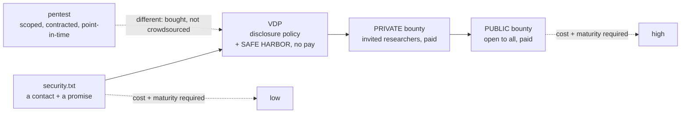
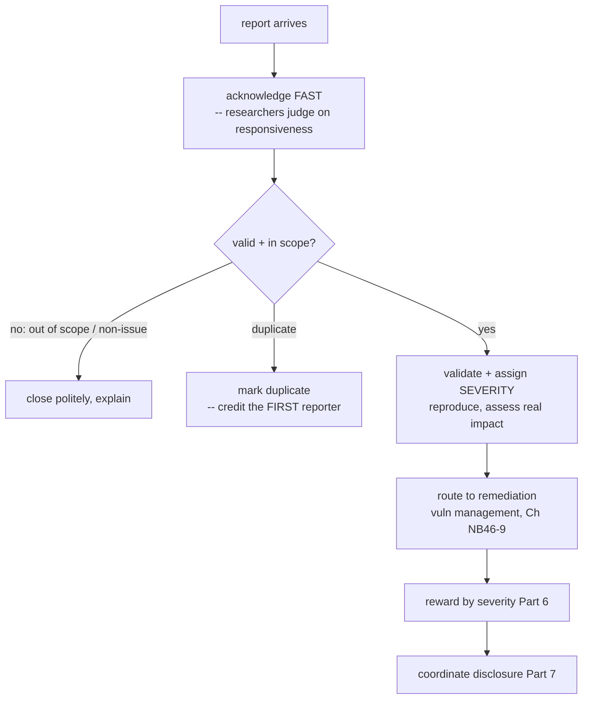
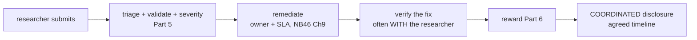
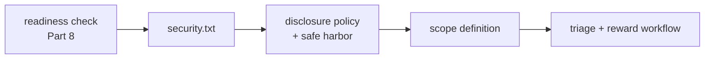

**Level:** Expert · **Track:** Product Security · **Read time:** 270 min

The previous chapter scaled security *inward* — through champions embedded in the organization's own teams. This chapter scales it *outward*, to a resource no organization can hire: the global community of security researchers who will test your systems, often for reward, and report what they find. A **bug bounty** pays external researchers for valid vulnerabilities; a **vulnerability disclosure program (VDP)** gives them a safe, legal channel to report vulnerabilities they find whether or not you pay. Together they harness thousands of skilled testers with diverse techniques, attacking your real production systems continuously, finding the things your internal testing and automated scanning missed.

The economic and epistemic case is compelling: no internal team, however good, has the diversity of skill, technique, and perspective of the entire external researcher community, and no scheduled pentest provides the *continuous* coverage that an always-open program does. Researchers approach your systems with fresh eyes, unusual specializations, and — crucially — the *attacker's actual mindset*, because they are doing exactly what a real attacker does, minus the malice. The findings they surface are frequently things internal testing structurally could not find: the creative chain, the assumption nobody on the inside questioned, the edge case in a corner of the product the internal team never prioritized. This is genuine leverage — the security team's reach extended to a crowd it does not employ, paid only for results.

But — and this chapter's central warning — **a bug bounty is the most commonly *mismanaged* security program there is, and launching one before you are ready is actively harmful.** The number-one failure is organizations opening a public bounty before they can *handle* what it produces: they are flooded with reports they cannot triage, valid findings they cannot fix within any reasonable timeline, and researchers who grow furious at being ignored and go public. A bug bounty is not a way to *start* doing security; it is a capability you add *after* you can already find, triage, and fix vulnerabilities — the very last thing in the crawl-walk-run sequence (Chapter 1), not the first. The distinction between a VDP (which every organization should have, cheaply, now) and a paid bounty (which requires real operational maturity) is the most important thing in the chapter, and getting it wrong is how bounty programs become disasters.

## Why This Matters

The value researchers provide is real and repeatedly demonstrated. The largest technology companies, financial institutions, and even government agencies run bug bounties precisely because external researchers reliably find serious vulnerabilities that survived internal review, automated scanning, and professional pentests — the diversity of the crowd beats the depth of any single team. A well-run program is a continuous, results-priced stream of real-world findings from people thinking exactly like attackers, and for many organizations it surfaces classes of bugs (creative business-logic chains, obscure but critical edge cases) that nothing else reliably catches. The return, when the program is run well, is high: you pay for validated results, and the results are attacker-realistic.

The safe-harbor dimension is why this matters even for organizations that will never pay a bounty. Right now, whether or not you have a program, security researchers are probably already looking at your systems — and when one finds a vulnerability, what happens next is determined entirely by whether you have given them a safe, legal way to tell you. **Without a disclosure channel and legal safe harbor, a researcher who finds a serious flaw faces a terrible choice**: report it and risk being ignored or even *prosecuted* (the Computer Fraud and Abuse Act has been used to threaten well-meaning researchers), stay silent and leave you exposed, or disclose publicly out of frustration. A VDP with clear safe harbor converts that adversarial, dangerous situation into a cooperative one — the researcher has a front door, legal protection, and a reason to work *with* you rather than around you. Every organization has a de facto disclosure situation whether it acknowledges it or not; a VDP is how you make it a good one. This is why the VDP, not the bounty, is the universal baseline.

And the management challenge is where product security engineers earn their value. Running a bug bounty well — scoping it, providing safe harbor, triaging the flood, pricing rewards fairly, remediating within timelines, and maintaining productive researcher relationships — is a demanding operational discipline, and doing it *badly* (the ignored reports, the lowball rewards, the researcher relationships gone sour, the public blowup) is a reputational and security liability. The skill of building and running these programs, and the judgment to know when an organization is *ready* for one, is exactly the program-management craft this notebook is about.

## Part 1: The Spectrum — From security.txt to Full Bounty

External security testing is not one thing; it is a spectrum of increasing cost, commitment, and required maturity. Understanding the whole spectrum prevents the central mistake of jumping to the wrong point on it.



- **security.txt** — a standardized file (RFC 9116) at `/.well-known/security.txt` giving researchers a security contact and pointing to your policy. The absolute minimum, essentially free, and there is no good reason not to have it: it tells a researcher who finds a bug *how to tell you*. Its absence means a researcher's only path is a general support inbox that discards security reports.
- **Vulnerability Disclosure Program (VDP)** — a published policy that invites researchers to report vulnerabilities, defines scope and rules, and — critically — provides **legal safe harbor** (Part 3). A VDP does *not* pay; it provides a safe, legal channel. **Every organization should have one**, it is inexpensive, and it is the universal baseline (Part 2).
- **Private bug bounty** — a *paid* program open only to *invited* researchers, run on a platform. The controlled first step into paying for findings: you limit the report volume by limiting who can submit, which lets you build triage muscle before opening the floodgates (Part 9).
- **Public bug bounty** — a *paid* program open to *anyone*. Maximum coverage and maximum report volume; requires real operational maturity to survive the flood. The last step, not the first.
- **Penetration test** — worth placing on the spectrum to distinguish it: a pentest is a *bought, scoped, point-in-time* engagement with a contracted firm (Notebook 9), not crowdsourced continuous testing. Bounties and pentests are complementary — the pentest gives depth on a defined scope at a point in time; the bounty gives breadth and continuity from a crowd. A mature program uses both.

The spectrum's logic, which Part 2 makes central: **cost and required maturity increase from left to right**, and an organization should move rightward only as its ability to *handle* findings grows. The catastrophic error is jumping straight to a public bounty (far right) without the VDP, the safe harbor, the triage capability, or the remediation muscle that the earlier points build. Start at the left, earn the right to move right.

## Part 2: VDP vs Bug Bounty — The Distinction That Matters Most

The single most important and most frequently confused distinction in this chapter: **a Vulnerability Disclosure Program is not a bug bounty, they serve different purposes, and nearly every organization needs the former long before it should consider the latter.**

| | Vulnerability Disclosure Program (VDP) | Bug Bounty |
|---|---|---|
| Pays researchers? | **No** | **Yes** |
| Core purpose | A safe, legal channel to *report* | An *incentive* to actively *hunt* |
| Cost | Low (mostly triage time) | High (rewards + triage + platform) |
| Report volume | Lower (opportunistic finders) | Higher (incentivized hunters) |
| Maturity required | Modest — you must be able to *receive and act* | High — you must *handle a flood* and *pay fairly* |
| Who should have it | **Every organization** | Only the operationally ready |
| Role | The universal baseline | An advanced capability added on top |

The purpose difference is the key. A **VDP exists to make it safe and easy for someone who *already found* a vulnerability to tell you** — it is a *channel and a legal protection*, not a bounty for hunting. A **bug bounty exists to *incentivize researchers to actively look*** — the payment is a magnet that draws effort. These are genuinely different: a VDP handles the researcher who stumbled on a flaw or was casually poking; a bounty summons a crowd to attack you on purpose.

The consequence is a sequencing rule: **every organization should have a VDP now — it is cheap, it is the responsible baseline, and it converts the adversarial disclosure situation you already have into a cooperative one.** A bug bounty is a *later* addition, appropriate only once the organization can already triage and fix vulnerabilities reliably (Part 8's readiness question), because the bounty's whole function is to *increase* the volume of findings, which is only helpful if you can *handle* them. Adding a bounty to an organization that cannot fix findings just buys a larger backlog of things you are failing to fix, plus angry researchers.

The failure this distinction prevents is enormous and common: organizations that hear "bug bounty" as "the thing serious companies do" and launch a public bounty as their *first* security-testing capability — with no VDP, no triage capacity, no remediation process — and are promptly overwhelmed. **The VDP is the baseline every organization needs; the bounty is the advanced capability few are initially ready for.** Internalize this and you avoid the single most common bug-bounty disaster.

## Part 3: The Legal Foundation — Safe Harbor

No researcher will engage with your program — VDP or bounty — without confidence that reporting a vulnerability will not get them sued or prosecuted, and providing that confidence is the **legal safe harbor**, which is non-optional infrastructure, not a nicety.

The problem safe harbor solves is real and chilling. Computer-crime laws — the **Computer Fraud and Abuse Act (CFAA)** in the US and equivalents elsewhere — criminalize "unauthorized access" to computer systems, and their language is broad enough that *testing a system for vulnerabilities*, even in good faith to report them, can technically fall under it. There is a documented history of organizations *threatening or pursuing legal action against well-meaning researchers* who reported vulnerabilities — the researcher did the right thing and got a cease-and-desist or worse. The effect is a **chilling effect**: researchers, knowing this history, will not report to an organization that has not *explicitly* promised not to prosecute them, because the downside (legal jeopardy) outweighs the upside (helping a company that might sue them). Without safe harbor, your best-case outcome is that researchers stay away; your worst case is that a researcher who finds a critical flaw stays silent or discloses publicly rather than risk reporting to you.

**Safe harbor** is an explicit, published promise that authorizes good-faith security research within your defined scope and rules, and commits that you will *not* pursue legal action against researchers who comply. It typically states: researchers acting in good faith and within scope are *authorized* (which removes the "unauthorized access" element), you will not sue or report them to law enforcement, and — importantly — it defines what "good faith" and "in scope" mean so researchers know the boundaries that keep them protected. The safe-harbor language is what transforms the CFAA problem from a threat into an authorization.

Two practical points: the safe harbor should be **clear, prominent, and legally reviewed** (it is a legal commitment, so counsel is involved — but the security team drives it, because counsel left alone tends toward language so hedged it provides no real comfort), and the industry has converged on good templates (**disclose.io** provides standardized, researcher-trusted safe-harbor language) so you need not invent it. The framing to hold: **safe harbor is the foundation the entire program rests on** — without it, researchers will not engage, the channel is dead on arrival, and the disclosure situation you already have stays adversarial. It is the first thing to get right, and it is a legal-and-cultural commitment, not a technical one.

## Part 4: Designing the Program — Scope and Rules of Engagement

A program needs a clear definition of *what researchers may test, how, and what is off-limits* — the scope and rules of engagement — because ambiguity here produces both wasted researcher effort and dangerous testing.

The components:

- **In-scope assets** — the systems, domains, applications, and APIs researchers *may* test. Be explicit (list the domains/apps), because researchers will test exactly what you list and a vague scope produces reports on things you did not mean to include (and did not mean to reward).
- **Out-of-scope assets and issues** — equally important: what is *off-limits* (third-party services you do not control, systems that would be dangerous to test, sensitive production data) and what *issue types* you will not accept or reward (known low-value findings like missing security headers with no demonstrated impact, self-XSS, best-practice complaints, findings requiring unrealistic preconditions). A clear out-of-scope list is the single biggest lever on report *quality* — it stops the flood of low-value reports before they arrive.
- **Rules of engagement** — how researchers may test: no denial-of-service, no social engineering of employees, no testing that degrades service, no accessing or exfiltrating other users' data beyond what proves the vulnerability (the ethical limits from Notebook 43 Chapter 1 and Notebook 42 Chapter 6 — prove impact minimally, do not hoard real data), and what to do if they *do* encounter sensitive data (stop, report, do not exfiltrate).
- **What to report and how** — the submission channel, the information you need (reproduction steps, impact, evidence — the Notebook 46 Chapter 1 finding structure), and the disclosure expectations (Part 7).

The design principles that make scope work:

- **Scope shapes everything.** A scope too *broad* invites reports on things you cannot fix or do not own; too *narrow* misses the coverage that is the point. Start focused (your most important, best-understood assets) and expand as the program matures — the same crawl-walk-run sequencing (Chapter 1).
- **The out-of-scope list is a quality control.** Explicitly excluding the known-low-value issue types is how you keep the signal-to-noise manageable (Part 5), because researchers will not (and will not be rewarded to) report what you have clearly said you will not accept.
- **Clarity protects everyone.** A clear scope tells researchers exactly where the safe-harbor protection applies (Part 3) — testing *in* scope is authorized; testing *out* of scope is not protected — which keeps researchers safe and keeps your systems from being tested in dangerous ways.

The framing: **the program's scope and rules are the contract between you and the researchers** — they define what is wanted, what is protected, and what is forbidden, and getting them clear is what makes the program productive rather than chaotic. A well-scoped program gets high-quality reports on the assets that matter, safely tested; a poorly-scoped one gets a flood of noise on things you cannot act on, some of it tested dangerously.

## Part 5: Triage — The Operational Heart

If safe harbor is the foundation and scope is the contract, **triage is the operational heart of the program — where reports become validated findings or get closed, and where programs most often break under load.** Every report that arrives must be assessed, and doing this well, at volume, is the demanding daily work of running a program.

The triage reality, stated honestly:

- **The signal-to-noise ratio is challenging.** A public program receives many reports that are duplicates, out of scope, non-issues, false positives, or low-value (the exact issue types the out-of-scope list of Part 4 tries to pre-empt). Sorting the genuine, valuable findings from the noise is real, sustained work, and underestimating it is how programs drown.
- **Speed matters to researchers.** Researchers judge a program heavily by *responsiveness* — a fast acknowledgment and a timely triage decision are what maintain the researcher relationship (Part 7). A program that leaves reports unacknowledged for weeks develops a bad reputation that drives good researchers away and toward public disclosure. First-response time is a metric researchers watch (Part 9).

The triage steps for each report:



- **Acknowledge quickly** — a prompt human acknowledgment, even before full validation, keeps the researcher relationship healthy.
- **Validate** — reproduce the reported issue and confirm it is real and in scope. This is where researcher-provided reproduction steps (Part 4) earn their keep.
- **Assess severity** — assign a real severity based on *demonstrated impact* (CVSS as a starting point, but real risk per Notebook 46 Chapter 9 — reachability, exploitability, asset criticality). Severity drives both the remediation priority and the reward (Part 6), so it must be fair and consistent.
- **Handle duplicates** — the same vulnerability reported by multiple researchers is common; the convention is to **credit and reward the *first* valid reporter** and mark the rest as duplicates. Duplicate handling must be transparent and fair, because researchers are sensitive to being told "duplicate" when they suspect it is a dodge (Part 7).
- **Route to remediation** — a validated finding enters the vulnerability-management machine (Notebook 46 Chapter 9) exactly like an internally-found one, with an owner and an SLA.

The framing: **triage is where the program's operational maturity is tested daily** — it demands the capacity to handle report volume, the judgment to assess validity and severity fairly, and the responsiveness to keep researchers engaged. Many organizations outsource the first-line triage to the *platform* (Part 6) precisely because doing it well at volume is hard; but even with platform help, the organization must handle the validated findings, and the ability to triage and act is exactly the readiness the bounty requires (Part 8).

## Part 6: Platforms and Reward Structures

**The platforms.** Most organizations run bounties on a managed platform rather than self-hosting, because the platforms provide the infrastructure that makes a program manageable:

| Platform | Provides |
|---|---|
| **HackerOne** | The largest researcher community, triage services, reporting workflow, payments, reputation system |
| **Bugcrowd** | Managed triage, researcher community, program management |
| **Intigriti** | Strong in Europe, researcher community, managed services |
| **Self-hosted** | Full control, no platform fee, but you build the entire workflow and reach fewer researchers |

What the platforms give you: **access to a vetted researcher community** (the crowd you cannot otherwise reach), **managed triage services** (they can do the noisy first-line filtering — a major reason to use one), **the report/reward/payment workflow**, **researcher reputation systems** (which help you weight reports and researchers select programs), and **the structure** that keeps a program organized. The trade-off is a platform fee and some loss of control; the benefit — especially the managed triage and the community reach — is why most programs use a platform. For most organizations, the build-vs-buy calculus (Chapter 1 Part 7) clearly favors buying the platform.

**Reward structures.** Bounties are priced by **severity** — critical findings pay dramatically more than low ones, because the reward must reflect the *value* of the finding and *incentivize* researchers to hunt for the high-impact bugs. A typical structure has tiered ranges (e.g., Low $50–150, Medium $150–1000, High $1000–5000, Critical $5000–20000+, with the top tiers going much higher at large well-funded programs). The design considerations:

- **Price by real impact, and pay fairly.** Researchers talk, compare programs, and choose where to spend effort based on reward *and* fairness. A program that consistently *lowballs* — assigning low severity to genuinely serious findings to save money — develops a bad reputation fast and loses good researchers to programs that pay fairly. Fairness is not charity; it is what keeps the talent engaged.
- **Competitive rewards attract better researchers.** The best researchers go where the rewards (and the responsiveness and fairness) are best. If you want the caliber of finding that justifies a bounty, the rewards must be competitive with comparable programs.
- **Budget realistically, including the upside.** Rewards are a real, somewhat *unpredictable* cost — a single critical finding can cost tens of thousands, and a good program period can produce several. Budget for the program to *succeed* (finding serious things costs real money), and understand that a bounty is an ongoing operational expense, not a one-time project.
- **Non-monetary recognition matters too.** Reputation points, leaderboards, swag, and public thanks are real incentives that complement the money — many researchers value reputation and recognition alongside the reward.

The framing: **the reward structure is both an incentive and a reputation signal.** Priced and administered fairly, it attracts and retains the researchers whose findings make the program worth running; administered stingily or inconsistently, it drives them away and the program withers. Reward fairness is, like researcher responsiveness (Part 5), a core determinant of whether good researchers engage with your program at all.

## Part 7: The Vulnerability Lifecycle and Working With Researchers

A bug bounty report follows a lifecycle from submission to resolution, and how you handle each stage — especially the *researcher relationship* — determines the program's health.

The lifecycle:



- **Submission** → **triage/validation/severity** (Part 5) → **remediation** (into vulnerability management, Notebook 46 Chapter 9, with an owner and SLA) → **verification** (confirm the fix works — often *with the researcher*, who is well-placed to confirm their bug is actually closed) → **reward** (Part 6) → **coordinated disclosure**.

**Coordinated (responsible) disclosure** is the norm and deserves explanation: the researcher agrees *not* to disclose the vulnerability publicly until it is fixed (or a reasonable timeline passes), and the organization commits to fix it in a reasonable time and often to *publicly credit* the researcher. This is a negotiated timeline — commonly 90 days is the industry reference point, adjustable by mutual agreement for complex fixes. The bargain is mutual: the researcher gives you time to fix before the world (and attackers) learn of the flaw; you commit to actually fixing it in that time and to crediting them. The tension arises when the organization *does not fix within the timeline* — a researcher who has waited patiently and sees no fix will (justifiably, by the norms of the field) disclose publicly, and the resulting exposure is the organization's fault for not remediating, not the researcher's for disclosing. This is why remediation capacity (Part 8) is the real prerequisite: the disclosure clock is running, and a program that cannot fix within it converts every report into an eventual public exposure.

**Working productively with researchers** is a relationship discipline, and it is what separates a program researchers *want* to engage with from one they avoid:

- **Respect and good faith.** Researchers are helping you, often skilled professionals doing careful work. Treating them with respect — prompt responses, fair severity and rewards, genuine gratitude, public credit — builds a reputation that attracts the best of them. Treating them as adversaries, or with suspicion and legalism, drives them away.
- **Communication and transparency.** Keep researchers informed through the lifecycle (acknowledged, triaged, fixing, fixed), explain decisions (why this severity, why a duplicate), and be honest. Researchers tolerate a lot if they are *communicated with*; silence is what breaks the relationship.
- **Reputation is real and durable.** The researcher community talks, publicly and privately, and a program's reputation — responsive or slow, fair or stingy, respectful or hostile — is *known*. A good reputation attracts good researchers; a bad one repels them and can produce public criticism that damages the organization. The relationship is not soft; it is the mechanism by which the program gets good findings.

The framing: **a bug bounty is fundamentally a relationship with a community, not a transaction.** The findings you get depend on whether skilled researchers *choose* to spend their effort on your program, and that choice turns on responsiveness, fairness, respect, and reputation. Manage the relationship well and the community brings you its best work; manage it poorly and it brings you noise, criticism, or nothing.

## Part 8: Organizational Readiness — Do Not Launch Before You Can Fix

The chapter's most important operational judgment, and the one that most determines whether a bounty helps or harms: **do not launch a bug bounty before the organization can actually handle what it produces.** A bounty is an *amplifier of finding capacity*, and amplifying finding capacity is only useful if you can *triage and fix* what is found. Bolt a bounty onto an organization that cannot fix vulnerabilities and you have not improved security — you have bought a larger, more public backlog of things you are failing to fix, plus a community of researchers growing angry at being ignored.

The readiness prerequisites, all of which must be in place *before* a bounty:

- **Vulnerability management that works** (Notebook 46 Chapter 9) — findings get triaged, prioritized, owned, and *fixed* within SLA. If the internal finding-to-fix machine is broken, adding an external finding source makes it worse, not better.
- **Triage capacity** (Part 5) — the ability to handle report volume, assess validity and severity, and respond to researchers promptly. Without it, the flood buries you.
- **Remediation capacity** — engineering can actually fix findings in a reasonable timeline, because the disclosure clock (Part 7) is running on every report. A program that cannot fix within the disclosure timeline converts reports into public exposures.
- **Safe harbor and clear scope** (Parts 3–4) — the legal and definitional foundation.
- **Budget** (Part 6) — for rewards *and* the platform *and* the triage/remediation effort, budgeted for the program to succeed.
- **Organizational buy-in** — leadership understands that the program will surface uncomfortable findings and has committed to fixing them rather than shooting the messenger.

The sequencing that follows, and that Part 1's spectrum implies: **VDP first, then private bounty, then public bounty.** The **VDP** (cheap, low-volume, the responsible baseline — Part 2) comes first and can come now. The **private bounty** (invited researchers, controlled volume) is the deliberate next step *once the internal machine works*, precisely because limiting who can submit limits the volume, letting the organization build triage-and-fix muscle on a manageable stream before facing the public flood. The **public bounty** (open to all, maximum volume) comes *last*, only once the organization has proven — on the VDP and the private program — that it can triage, fix, reward, and maintain researcher relationships at scale. Skipping steps is the disaster.

The blunt rule: **a bug bounty is the *last* thing in the program (Chapter 1's run phase), not the first.** It is an advanced capability that assumes a working security program beneath it. Launching one as a way to *start* doing security — because it sounds like what serious companies do — is the signature mistake, and it reliably produces the flooded, ignored, researcher-alienating disaster the whole chapter warns against. Earn the bounty by building the machine that can handle it.

## Part 9: Measuring a Program

The metrics that show whether a disclosure/bounty program is healthy and effective (per Chapter 1's outcome-not-activity discipline):

- **Responsiveness metrics** — **time to first response** and **time to triage/resolution**. These matter enormously because *researchers judge programs on them* (Parts 5, 7); slow response drives good researchers away and toward public disclosure. These are leading indicators of program health.
- **Volume and quality** — reports received, and the **signal-to-noise ratio** (valid findings vs noise). Rising signal (via scope tuning, Part 4) and manageable volume indicate a well-tuned program; a flood of noise indicates scope or process problems.
- **Finding metrics** — valid vulnerabilities found, by severity, and how they compare to what internal testing found (the *value* the external community adds that internal testing missed — the program's justification).
- **Remediation metrics** — time-to-fix for bounty findings, and SLA compliance, exactly as in vulnerability management (Notebook 46 Chapter 9). Critically, this is where the readiness of Part 8 shows: a program finding many valid bugs but fixing them slowly is *failing*, because the disclosure clock is running.
- **Researcher metrics** — number of active researchers, repeat participation, and researcher *satisfaction/reputation* of the program. A growing, returning, satisfied researcher base is the sign of a healthy relationship (Part 7); a shrinking or complaining one is an alarm.
- **Cost metrics** — reward spend, cost per valid finding, and program ROI (findings' value vs total cost). Useful for justifying the program and for the reward-structure fairness question (Part 6).

The disciplines: **responsiveness and remediation are the health metrics that matter most** — a program can find plenty and still fail if it responds slowly and fixes slowly, because both alienate researchers and let the disclosure clock expire into public exposure. **Measure the value the external community adds** (findings internal testing missed) as the program's justification. And **watch the researcher-relationship metrics** (satisfaction, repeat participation) as the leading indicators of whether the community will keep bringing you good work. The framing: a bounty program's metrics prove it is *finding real value AND handling it well* — finding without handling is the disaster of Part 8 measured.

## Part 10: Hands-On Lab — The Artifacts of a Disclosure Program

### 10.1 What we are building

The concrete artifacts you would produce to launch a responsible disclosure program: a **security.txt** (Part 1), a **disclosure policy with safe harbor** (Parts 3–4), a **scope definition** (Part 4), and a **triage-and-reward workflow** (Parts 5–6) — plus a readiness check (Part 8).



Python 3 only.

### 10.2 The readiness check — should you even launch?

```python
# readiness.py -- Part 8: can the org actually HANDLE a bounty?
org = {
  "has_vdp": False,
  "vuln_mgmt_works": True,       # findings get triaged + fixed with SLAs
  "triage_capacity": True,
  "remediation_within_sla": True,
  "safe_harbor_ready": True,
  "reward_budget": False,        # no budget allocated yet
  "leadership_buyin": True,
}

def recommend(o):
    if not o["safe_harbor_ready"]:
        return "STOP", "no safe harbor -- researchers won't (safely) engage. Fix first."
    if not o["vuln_mgmt_works"] or not o["remediation_within_sla"]:
        return "NOT READY", "can't fix findings -> a bounty just buys a public backlog. Build vuln mgmt first."
    if not o["has_vdp"]:
        return "START WITH VDP", "launch the (free) VDP now; it's the baseline everyone needs."
    if not o["reward_budget"]:
        return "VDP ONLY / PRIVATE NEXT", "VDP is fine; secure reward budget before a paid bounty."
    return "READY FOR PRIVATE BOUNTY", "internal machine works -> invited private program next, public later."

verdict, reason = recommend(org)
print(f"VERDICT: {verdict}\n  {reason}")
print("\n  sequencing rule: VDP -> PRIVATE bounty -> PUBLIC bounty (never skip)")
```

```bash
python3 readiness.py

# Sample output:
# VERDICT: START WITH VDP
#   launch the (free) VDP now; it's the baseline everyone needs.
#
#   sequencing rule: VDP -> PRIVATE bounty -> PUBLIC bounty (never skip)
```

The readiness check encodes Part 8: this org has working vulnerability management and safe harbor but no VDP and no reward budget — so the correct move is **launch the free VDP now**, not a paid bounty. Had `vuln_mgmt_works` been false, the verdict would be the blunt "NOT READY — a bounty just buys a public backlog."

### 10.3 The security.txt

```bash
mkdir -p ~/bounty-lab/.well-known && cd ~/bounty-lab
cat > .well-known/security.txt <<'TXT'
# RFC 9116 -- served at https://example.com/.well-known/security.txt
Contact: mailto:security@example.com
Contact: https://example.com/security/report
Policy: https://example.com/security/disclosure-policy
Expires: 2028-06-24T00:00:00.000Z
Preferred-Languages: en
Canonical: https://example.com/.well-known/security.txt
TXT
cat .well-known/security.txt | head -4

# Sample output:
# # RFC 9116 -- served at https://example.com/.well-known/security.txt
# Contact: mailto:security@example.com
# Contact: https://example.com/security/report
# Policy: https://example.com/security/disclosure-policy
```

Trivial to produce, and it is the difference between a researcher knowing *how to tell you* and their report dying in a support inbox.

### 10.4 The disclosure policy with safe harbor

```bash
cat > disclosure-policy.md <<'MD'
# Vulnerability Disclosure Policy

## Our commitment
We welcome good-faith security research and will work with you to verify and
remediate what you find. We will not pursue legal action against researchers
who follow this policy.

## Safe Harbor (Part 3)
Activities conducted consistently with this policy are AUTHORIZED, and we
consider them good-faith research. We will NOT:
  - pursue or support legal action against you for such research
  - report you to law enforcement for such research
This authorization removes the "unauthorized access" element for in-scope,
good-faith testing. (Language based on disclose.io.)

## Scope (Part 4)
IN SCOPE:      example.com, api.example.com, the iOS/Android apps
OUT OF SCOPE:  third-party services (e.g. our email/CDN providers),
               staging/internal systems, physical security, social engineering

## Rules of Engagement
  - Do NOT: run DoS, degrade service, social-engineer staff, or access/exfiltrate
    other users' data beyond the minimum needed to demonstrate the issue.
  - If you encounter sensitive data: STOP, do not save/copy it, and report it.

## Non-qualifying issues (won't be accepted/rewarded)
  missing security headers without demonstrated impact | self-XSS | best-practice
  opinions | findings requiring unrealistic preconditions | automated-scanner output

## How to report
  Email security@example.com with: reproduction steps, impact, and evidence.
  We acknowledge within 3 business days and aim to triage within 10.

## Disclosure (Part 7)
  Coordinated disclosure: please give us 90 days to remediate before any public
  disclosure. We will credit you (with your permission) when the issue is fixed.
MD
echo "policy written ($(wc -l < disclosure-policy.md) lines)"

# Sample output:
# policy written (34 lines)
```

This single document carries the safe harbor (Part 3), the scope and out-of-scope quality control (Part 4), the ethical rules of engagement, the non-qualifying list that pre-empts the noise, and the coordinated-disclosure bargain (Part 7) — the contract between the organization and the researchers.

### 10.5 The triage-and-reward workflow

```python
# triage.py -- Parts 5-6: validate, severity, dedupe, reward.
REWARDS = {"critical":(5000,20000),"high":(1000,5000),
           "medium":(150,1000),"low":(50,150)}

reports = [
 {"id":"R1","title":"SQLi in /api/orders -> full DB read","in_scope":True,
  "reproducible":True,"severity":"critical","first_reporter":True},
 {"id":"R2","title":"same SQLi (dup)","in_scope":True,
  "reproducible":True,"severity":"critical","first_reporter":False},
 {"id":"R3","title":"missing HSTS header","in_scope":True,
  "reproducible":True,"severity":None,"first_reporter":True},   # non-qualifying
 {"id":"R4","title":"XSS on internal staging","in_scope":False,
  "reproducible":True,"severity":"medium","first_reporter":True},
]

def triage(r):
    if not r["in_scope"]:
        return "CLOSED (out of scope)", 0
    if r["severity"] is None:
        return "CLOSED (non-qualifying)", 0
    if not r["first_reporter"]:
        return "DUPLICATE (credit first reporter)", 0
    if not r["reproducible"]:
        return "NEEDS INFO", 0
    lo, hi = REWARDS[r["severity"]]
    return f"VALID -> remediate ({r['severity']})", (lo + hi)//2

print(f"{'ID':<4}{'DISPOSITION':<38}REWARD")
print("-" * 60)
total = 0
for r in reports:
    disp, reward = triage(r)
    total += reward
    print(f"{r['id']:<4}{disp:<38}${reward}")
print("-" * 60)
print(f"total reward spend: ${total} | valid findings routed to vuln management")
```

```bash
python3 triage.py

# Sample output:
# ID  DISPOSITION                           REWARD
# ------------------------------------------------------------
# R1  VALID -> remediate (critical)         $12500
# R2  DUPLICATE (credit first reporter)     $0
# R3  CLOSED (non-qualifying)               $0
# R4  CLOSED (out of scope)                 $0
# ------------------------------------------------------------
# total reward spend: $12500 | valid findings routed to vuln management
```

The workflow applies the chapter's rules: R1 is valid and rewarded by severity (Part 6); R2 is a *duplicate* crediting the first reporter (Part 5); R3 is *non-qualifying* per the policy's list (Part 4 quality control); R4 is *out of scope*. Each disposition is explained (Part 7's transparency), and the one valid finding enters vulnerability management with its reward priced by real impact.

### 10.6 Extending the lab

Add a first-response-time metric and flag reports acknowledged late (Part 9's key health metric); model the disclosure clock — track days-since-report against the 90-day timeline and flag findings approaching disclosure without a fix (the Part 7/Part 8 tension made concrete); build the private→public transition plan (Part 8) with the readiness gates for opening the program up; and write the researcher-facing acknowledgment and severity-explanation templates that maintain the relationship (Part 7).

## Part 11: Common Pitfalls

**Launching a bounty before you can fix findings.** The number-one disaster. A bounty amplifies finding capacity; if you cannot triage and fix, you have bought a public backlog and angry researchers. VDP first, private next, public last — after the internal machine works (Part 8).

**Confusing a VDP with a bug bounty.** The VDP (a safe channel, no pay, the universal baseline) is what every org needs now; the paid bounty is an advanced capability few are initially ready for. Do not skip the VDP to jump to a bounty (Part 2).

**No safe harbor.** Researchers will not (safely) engage without an explicit legal commitment not to prosecute them. It is the foundation, not a nicety, and its absence keeps the disclosure situation adversarial (Part 3).

**Vague or overbroad scope.** A vague scope produces noise and dangerous testing; the *out-of-scope list* is your biggest quality control. Start focused, exclude the known-low-value issues explicitly (Part 4).

**Slow response to researchers.** Researchers judge programs on responsiveness and talk to each other. Slow acknowledgment and triage drive good researchers away and toward public disclosure (Parts 5, 7).

**Lowballing rewards.** Assigning low severity to serious findings to save money develops a bad reputation fast and loses the researchers whose findings justify the program. Price by real impact, pay fairly (Part 6).

**Treating researchers as adversaries.** Suspicion, legalism, and disrespect drive the community away. A bounty is a *relationship* with a community; respect, communication, and credit are how you get their best work (Part 7).

**Missing the disclosure timeline.** The clock is running on every report. A program that cannot fix within the coordinated-disclosure window converts reports into public exposures — the organization's fault for not fixing, not the researcher's for disclosing (Parts 7, 8).

**Ignoring duplicates unfairly.** Crying "duplicate" to avoid paying, or handling duplicates opaquely, angers researchers who are sensitive to it. Credit the first reporter transparently (Part 5).

**Measuring findings but not remediation.** A program finding many bugs and fixing them slowly is failing. Responsiveness and time-to-fix are the health metrics that matter most (Part 9).

**Budgeting for the program to fail.** Under-budgeting rewards assumes few serious findings; a *successful* program finds serious things and they cost real, somewhat unpredictable money. Budget for success (Part 6).

## Final Revision / Summary

- **Bug bounties and VDPs harness the global researcher community** to find what internal testing and scanning miss — diverse skill, continuous coverage, and the real attacker mindset, priced for results. But a bounty is the **most commonly mismanaged security program**, and launching one before you are ready is actively harmful.
- The **spectrum** runs security.txt → **VDP** → **private bounty** → **public bounty** (with pentest as a complementary bought, point-in-time engagement), and **cost and required maturity increase left to right.** Move rightward only as your ability to *handle findings* grows.
- **The VDP-vs-bounty distinction is the most important thing in the chapter.** A **VDP** is a safe, legal *channel to report* (no pay) — the **universal baseline every organization should have now**. A **bug bounty** *incentivizes hunting* (pays) — an **advanced capability** appropriate only once you can already triage and fix reliably. Do not skip the VDP to jump to a bounty.
- **Safe harbor is the non-optional legal foundation.** Broad computer-crime laws (CFAA) create a chilling effect — researchers will not report to an organization that has not explicitly promised not to prosecute them. Safe harbor *authorizes* good-faith in-scope research and commits to no legal action (disclose.io provides trusted templates). Without it, the channel is dead and the disclosure situation stays adversarial.
- **Scope and rules of engagement are the contract**: explicit in-scope assets, a strong *out-of-scope list* (the biggest lever on report quality), ethical rules (no DoS/social-engineering/data-hoarding), and clear reporting expectations. Start focused, expand with maturity.
- **Triage is the operational heart** — validate, assess *severity by demonstrated impact*, handle duplicates by crediting the first reporter, and route valid findings into vulnerability management. **Responsiveness matters enormously** because researchers judge programs on it; slow response drives them away.
- **Platforms** (HackerOne, Bugcrowd, Intigriti) provide the researcher community, managed triage, and the reward/payment workflow — usually worth buying (Chapter 1's build-vs-buy). **Rewards are priced by severity and must be *fair***: lowballing wrecks your reputation and loses good researchers; budget for the program to *succeed* (serious findings cost real, unpredictable money).
- The **lifecycle** — submit → triage → remediate → verify (often with the researcher) → reward → **coordinated disclosure** (a ~90-day negotiated timeline; you commit to fix and credit, they hold public disclosure). Missing the timeline converts a report into a public exposure that is *your* fault. **A bounty is a relationship with a community** — responsiveness, fairness, respect, transparency, and credit are how you get their best work.
- **Organizational readiness is the decisive judgment: do not launch a bounty before you can fix findings.** A bounty amplifies *finding*; without working vulnerability management, triage capacity, remediation within the disclosure clock, safe harbor, budget, and leadership buy-in, it just buys a public backlog and angry researchers. **Sequence VDP → private → public** (private limits volume so you build muscle safely). **The bounty is the *last* thing in the program (Chapter 1's run phase), not the first.**
- **Measure** responsiveness (time-to-first-response, time-to-triage — the health metrics researchers watch), volume/quality (signal-to-noise), findings (and the value vs internal testing), **remediation** (time-to-fix — where readiness shows), researcher relationship (satisfaction, repeat participation), and cost. Finding without handling is the disaster, measured.

## Cheat Sheet / Quick Reference

**The spectrum (cost + maturity increase left to right)**

```
security.txt -> VDP (no pay, SAFE HARBOR) -> PRIVATE bounty -> PUBLIC bounty
[pentest = bought, scoped, point-in-time -- complementary]
move right only as your ability to HANDLE findings grows
```

**VDP vs bounty (the key distinction)**

```
VDP:    a safe, legal CHANNEL to report | NO pay | EVERY org needs it NOW
BOUNTY: an INCENTIVE to hunt            | PAYS   | advanced, few ready initially
never skip the VDP to jump to a bounty
```

**Safe harbor (the foundation)**

```
CFAA / computer-crime laws -> researchers fear prosecution -> won't report
safe harbor = explicit "in-scope good-faith research is AUTHORIZED,
              we won't sue or report you" (use disclose.io templates)
no safe harbor = dead channel + adversarial disclosure
```

**Scope (the contract, and the quality control)**

```
IN scope: list explicit assets | OUT of scope: assets AND non-qualifying issue types
rules: no DoS / no social engineering / no data hoarding / stop on sensitive data
the OUT-OF-SCOPE LIST is your biggest lever on report quality
```

**Triage + rewards**

```
acknowledge FAST | validate + reproduce | SEVERITY by demonstrated impact
duplicates -> credit the FIRST reporter (transparently) | route valid -> vuln mgmt
rewards priced by severity, paid FAIRLY (lowballing wrecks reputation)
budget for the program to SUCCEED (serious findings cost real $$)
```

**Lifecycle + researcher relationship**

```
submit -> triage -> remediate (SLA) -> verify (often WITH researcher) -> reward
 -> COORDINATED DISCLOSURE (~90d; fix + credit before public)
miss the timeline -> public exposure = YOUR fault
it's a RELATIONSHIP: responsiveness | fairness | respect | transparency | credit
```

**Readiness (the decisive judgment)**

```
DON'T launch a bounty before you can FIX findings.
need: working vuln mgmt + triage capacity + remediation within the disclosure clock
      + safe harbor + budget + leadership buy-in
sequence: VDP -> PRIVATE -> PUBLIC | the bounty is the LAST thing, not the first
```

## Practice Labs & Resources

**Standards and templates**
- **RFC 9116 (security.txt)** and **securitytxt.org** — the format and a generator.
- **disclose.io** — the standardized, researcher-trusted safe-harbor and disclosure-policy templates (Part 3). Start here for the legal language.
- **ISO/IEC 29147** (vulnerability disclosure) and **ISO/IEC 30111** (vulnerability handling) — the formal process standards.
- **CISA Binding Operational Directive 20-01** — the mandate that pushed US federal agencies to run VDPs; a useful model.

**Platforms**
- **HackerOne**, **Bugcrowd**, **Intigriti** — read their program-setup and triage documentation; many publish excellent guidance on running programs well.

**Hands-on**
- Extend the lab: add first-response-time metrics, model the disclosure clock, build the private→public transition plan, and write the researcher-communication templates.
- Draft a complete VDP for an organization you know: security.txt, safe-harbor policy, scope, rules of engagement, and non-qualifying list.
- Do the readiness assessment (Part 8) honestly for that organization and determine where on the spectrum it should actually be.

**Deliberate practice**
- Read several real, well-regarded disclosure policies (many large companies publish theirs) and note how they handle safe harbor, scope, and disclosure timelines.
- From the researcher's side: read published bug-bounty writeups and note what makes a *program* good to work with (responsiveness, fairness) versus frustrating.
- Design a reward structure for a hypothetical organization and stress-test the budget against a *successful* program period with several critical findings.

**Further reading**
- Chapter 1 (the program this capability sits at the top of — the run phase) and Notebook 46 Chapter 9 (the vulnerability management that is the readiness prerequisite).
- Notebook 43 Chapter 1 and Notebook 42 Chapter 6 for the researcher-ethics and minimal-impact principles the rules of engagement encode.
- Chapter 4 next (third-party and vendor security — assessing the security of others, the inverse of being assessed), and the disclose.io and platform communities for the living practice of running these programs.

---

*Also on [Praneeth's portfolio](https://ping-praneeth.vercel.app/notebook/product-security-program/03-bug-bounty-and-responsible-disclosure-program-management), with comments and the latest edits.*
