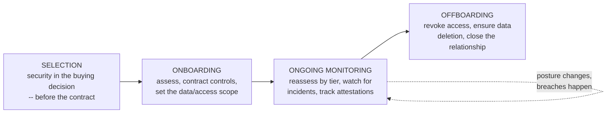
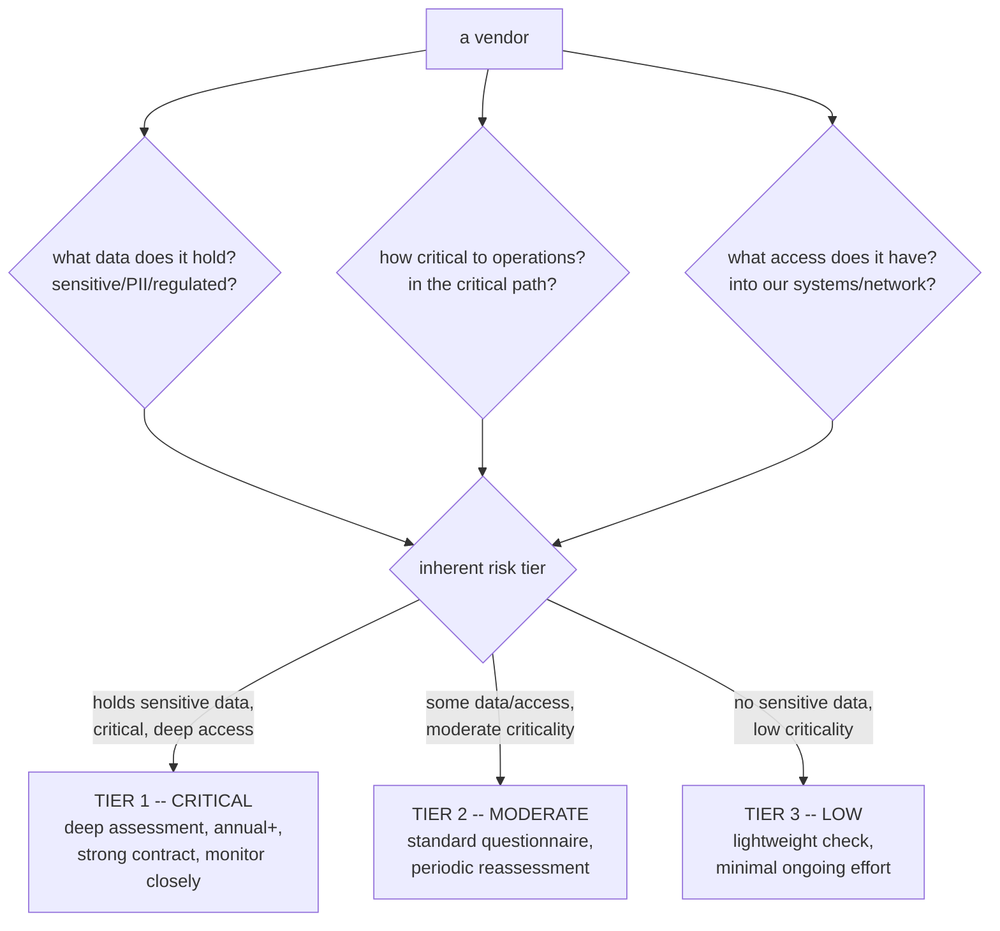
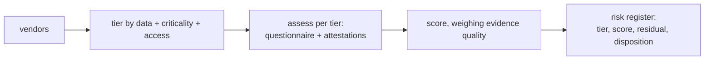

**Level:** Expert · **Track:** Product Security · **Read time:** 270 min

Every organization runs on other organizations. The cloud provider hosting your application, the SaaS tools your teams use, the payment processor, the analytics service, the email platform, the authentication provider, the AI API — modern software is assembled from dozens or hundreds of third-party *services*, each holding some of your data or sitting somewhere in your critical path. This chapter is about the security of that web of dependencies-on-other-companies, and the discipline of assessing and managing it: **third-party risk management (TPRM)**, or vendor security assessment.

The organizing truth is uncomfortable and absolute: **your security is only as strong as your weakest vendor.** You can build a flawless internal security program — every technique in the previous notebooks, executed perfectly — and still be breached because a vendor you gave your customer data to had none of it. The attacker does not care whose security failed; the data is exposed either way, and it is *your* customers, *your* breach notification, *your* reputation, regardless of which company's control failed. When you hand data to a vendor or put a vendor in your critical path, you inherit their security posture as if it were your own — because, from your customers' and regulators' point of view, it *is* your own. Third-party risk is not a separate category of risk you can wall off; it is your risk, held by someone else.

This chapter distinguishes carefully between two things people conflate. Notebook 46 Chapter 5 covered the **software supply chain** — the third-party *code* (dependencies) inside your application. This chapter covers third-party *services* — the other *companies* your organization depends on operationally. Both are "supply chain," both are about trusting others, but the assessment disciplines differ: dependency security is about scanning code you incorporate; vendor security is about assessing *organizations* you contract with, which you cannot scan and can only evaluate through attestations, questionnaires, contracts, and monitoring. The chapter covers the vendor risk lifecycle, risk-based tiering (so effort matches exposure), the assessment toolkit and what each instrument actually proves, contractual controls as the real enforcement, and the emerging frontiers of cloud/SaaS and AI vendors.

## Why This Matters

The breach record makes the case with brutal clarity: some of the largest and most consequential breaches in history were **third-party breaches** — the attacker did not breach the victim directly, they breached a *vendor* and reached the victim through the trust relationship. The 2013 Target breach, one of the most cited in the field, began with a compromised *HVAC vendor* whose network credentials reached Target's payment systems — an air-conditioning contractor was the entry point to 40 million payment cards. The 2020 SolarWinds compromise (Notebook 46 Chapters 5 and 7) reached ~18,000 organizations through a single trusted *software vendor's* poisoned update. The 2023 MOVEit vulnerability turned one file-transfer *vendor's* flaw into breaches at *thousands* of downstream organizations who had never heard of the specific product but whose data flowed through it. Each of these is the same lesson: the organizations were breached through a party they *trusted and depended on*, and their own internal security was irrelevant to the outcome.

The trend is worsening, not improving, for a structural reason: organizations depend on *more* third parties every year (the SaaS explosion, the API economy, the outsourcing of everything non-core), and each dependency is a trust relationship an attacker can exploit. Attackers have noticed — compromising a widely-used vendor is a *force multiplier* (SolarWinds and MOVEit reached thousands from one compromise), so the incentive to attack the supply chain of services grows with its prevalence. Third-party risk is, for many organizations, now a *larger* attack surface than their own directly-controlled systems, and it is the surface they have the *least* direct control over — you cannot patch your vendor's servers.

For the product security engineer, this creates a discipline distinct from everything prior: you cannot secure a vendor by writing better code or running a scanner, because you do not control their systems. You can only *assess* their posture, *require* controls contractually, *monitor* for problems, and *manage* the residual risk — a governance-and-relationship discipline rather than a technical one. And it is increasingly a *program* responsibility, because the volume of vendors (hundreds, at a large organization) means it must be systematized: tiered by risk, integrated with procurement, and run as an ongoing process, not a one-time check. Building that program is exactly the senior product-security craft this notebook develops.

## Part 1: The Vendor Risk Lifecycle

Vendor risk is not a one-time assessment at purchase; it is a *lifecycle* that spans the entire relationship, and treating it as a point-in-time gate at onboarding (and never again) is a primary failure mode.



- **Selection** — the security assessment belongs *in the buying decision*, before the contract is signed (Part 8), because that is the moment of maximum leverage: you can choose a different vendor, or require controls as a condition of the deal. Security discovered *after* the contract is signed is security you have little power to demand.
- **Onboarding** — assess the vendor's posture (Part 3), negotiate the contractual security controls (Part 6), and define precisely *what data* and *what access* the vendor gets (least privilege, Notebook 45 Chapter 6 — the smaller the data and access, the smaller the inherited risk).
- **Ongoing monitoring** — the phase most programs neglect: a vendor's security posture *changes over time* (they have a breach, they change ownership, their attestation lapses, a vulnerability in their product emerges), so the assessment must be *repeated* on a cadence matched to the vendor's risk tier (Part 2), and you must watch for incidents affecting the vendor. A vendor assessed once at onboarding and never again is a vendor whose current posture you do not actually know.
- **Offboarding** — the phase most programs *forget entirely*, and a real risk: when a vendor relationship ends, their access must be *revoked* and your data must be *deleted* (with confirmation — the GDPR/contractual data-return-or-deletion obligation, Notebook 42 Chapter 6). A vendor whose access was never revoked and whose copy of your data was never deleted is a lingering, forgotten exposure — orphaned trust that an attacker can still exploit.

The framing: **vendor risk is a relationship to be managed across its whole life, not a checkbox at purchase.** The lifecycle view catches the failures of the checkbox view — the vendor whose posture decayed after onboarding, the offboarded vendor still holding your data — and it is what makes third-party risk a *program* (continuous, systematic) rather than a *procurement formality* (one-time, forgotten). Each phase has its own risk, and neglecting the later phases (monitoring, offboarding) is where much real third-party exposure actually lives.

## Part 2: Tiering — Match Effort to Exposure

A large organization has *hundreds* of vendors, and the single most important operational principle of vendor risk management is that **you cannot assess them all with equal rigor, and you should not try — you tier them by risk and match your effort to each vendor's exposure.** Treating every vendor identically is the failure mode that either overwhelms the program (assessing the office snack supplier as rigorously as the payment processor) or, more commonly, produces a shallow assessment of *everyone* that is rigorous for *no one*.

The tiering logic — assess each vendor's *inherent risk* to decide how much scrutiny it warrants:



The factors that determine a vendor's tier:

- **Data sensitivity** — what data does the vendor hold or process? A vendor with your customers' PII, payment data, or health records is inherently high-risk (a breach there is *your* regulated-data breach, Notebook 42 Chapter 6); a vendor with no access to sensitive data is inherently lower-risk regardless of anything else.
- **Business criticality** — how essential is the vendor to your operations? A vendor in your critical path (your cloud provider, your payment processor) whose outage or compromise stops your business is high-risk; a nice-to-have tool is not.
- **Access level** — how much access does the vendor have into *your* systems and network? A vendor with deep integration and network access (the Target HVAC lesson — the vendor's access *was* the attack path) is high-risk; a vendor you send nothing and that touches nothing is low-risk.

The tiers then set the effort: **Tier 1 (critical)** vendors get deep assessment (Part 3's full toolkit — attestations reviewed, pentest reports requested, strong contractual controls, close and frequent monitoring); **Tier 2 (moderate)** get a standard questionnaire and periodic reassessment; **Tier 3 (low)** get a lightweight check and minimal ongoing effort. The point is that **finite assessment capacity goes where the risk is** — the same risk-based prioritization as vulnerability management (Notebook 46 Chapter 9) and program investment (Chapter 1), applied to vendors.

The framing: **tiering is what makes vendor risk management tractable at scale.** Without it, a program either drowns trying to deeply assess hundreds of vendors or does a uniformly shallow job that misses the critical ones. With it, the payment processor gets the scrutiny it warrants and the snack supplier gets a glance, and the program's limited effort produces real risk reduction where it matters. Tier first; assess accordingly.

## Part 3: The Assessment Toolkit — and What Each Instrument Actually Proves

Since you cannot scan a vendor's systems, you assess their security posture through a set of *instruments*, each of which proves something different — and understanding what each *actually* proves (versus what it appears to) is essential, because every instrument has real limits.

**Security questionnaires.** You send the vendor a list of security questions (often based on standardized frameworks — SIG, CAIQ, or your own), they answer, you review. Questionnaires are the workhorse of vendor assessment because they scale and cover any topic, but their limit is fundamental: **they are self-attestation** — the vendor is grading their own homework, and a questionnaire proves what the vendor *says*, not what the vendor *does*. A vendor can answer "yes, we encrypt data at rest" truthfully-in-intention and be wrong in practice, or answer optimistically, or simply not know. Questionnaires are necessary and useful for *coverage* and for establishing a baseline and a paper trail, but they are *weak evidence* on their own, and a program that assesses vendors *only* by questionnaire is trusting self-reported claims. Their real value is often the *follow-up* — the questions whose answers prompt a deeper look — more than the answers themselves.

**Third-party attestations** — the stronger evidence, because an *independent auditor* verified something:

- **SOC 2** (specifically Type II) — the most common and most useful vendor attestation. A SOC 2 Type II report is an independent auditor's examination of the vendor's controls *over a period of time* (typically 6–12 months) against the Trust Services Criteria (security, availability, confidentiality, processing integrity, privacy). **What it actually proves**: that an auditor examined the vendor's controls and reported on their design *and operating effectiveness* over the period — genuinely stronger than a questionnaire. **What it does NOT prove**: SOC 2 is *scoped* (it covers the systems and criteria the vendor chose to include — read the scope, because a SOC 2 that excludes the product you use is worthless to you), and it reports *exceptions* (control failures the auditor found — read these, they are the actual findings). A SOC 2 report is only as good as its *scope* and its *exceptions*, and the common failure is treating "they have a SOC 2" as a pass without *reading it* — the scope and exceptions are the whole point.
- **ISO 27001** — certification that the vendor has an Information Security Management System (ISMS) meeting the standard. **What it proves**: the vendor has a *systematic security management program* certified by an auditor. **What it does NOT prove**: like SOC 2, it is scoped (check the Statement of Applicability and certificate scope), and it attests to the *management system*, not to the security of any specific product feature. Useful evidence of organizational maturity; not a guarantee of any particular control.
- **Penetration test reports** — some vendors will share a recent independent pentest report (or a summary). **What it proves**: an independent tester examined the vendor's security and found (or did not find) specific issues. **What to look at**: recency, scope, and — critically — whether the findings were *remediated* (an old pentest with unremediated criticals is a red flag, not a reassurance). More concrete than an attestation, when available.

**The right to audit and other evidence** — for Tier 1 vendors, a *contractual right to audit* (Part 6) lets you (or your auditor) actually verify controls directly, the strongest evidence available; security ratings (Part 4) and public breach history round out the picture.

The synthesis, and the discipline that separates real assessment from theater: **each instrument proves something specific and limited — questionnaires prove claims, SOC 2 proves audited controls within a scope, pentests prove point-in-time findings — and the skill is reading each critically (the scope, the exceptions, the recency, the remediation) rather than treating a badge as a pass.** "They have a SOC 2" is not an assessment; *reading the SOC 2's scope and exceptions* is. The instruments are evidence to be weighed, and weighing them well — knowing what each does and does not prove — is the core assessment competence.

## Part 4: From Point-in-Time to Continuous — Ratings and Fourth Parties

Two realities complicate the toolkit of Part 3 and push vendor assessment beyond a periodic snapshot.

**Point-in-time assessment is a fundamental limitation.** A questionnaire answered, a SOC 2 read, a pentest reviewed — all describe the vendor's posture at a *moment*, and a vendor's security *changes*: they have an incident next month, their SOC 2 lapses, they get acquired, a vulnerability in their product emerges. An annual assessment means you know the vendor's posture *once a year* and are blind the other 364 days — during which the vendor could be breached and you would not know until it affected you. This is the same gap as the vulnerability-management post-release monitoring problem (Notebook 46 Chapter 5): the assessment must become *continuous*, not periodic.

**Security ratings services** (BitSight, SecurityScorecard, and others) are one response: they *continuously* monitor a vendor's *externally observable* security posture — exposed services, expired certificates, breach history, botnet activity, patching cadence visible from the outside — and produce a rating that updates over time. Their value is the *continuous* signal and the ability to monitor *many* vendors at once (scaling the monitoring phase of the lifecycle). Their honest limit: they see only the *outside* — the external attack surface, not the internal controls — so a good rating means "the externally visible posture looks maintained," not "the vendor is secure internally." Ratings are a useful *continuous monitoring* layer and an *early warning* system (a sudden rating drop or a new exposure is a signal to look closer), *complementing* the deeper point-in-time assessment, not replacing it.

**Fourth-party and concentration risk** — the problem that your vendors have vendors:

- **Fourth-party risk**: your vendor depends on *their* vendors (their cloud provider, their subprocessors), and a breach at *their* vendor affects *you* through *your* vendor — the risk chain extends beyond the parties you directly contract with. You cannot assess every fourth party, but you should *know* your critical vendors' critical dependencies (SOC 2 reports list subservice organizations; DPAs list subprocessors — Notebook 42 Chapter 6) and understand that your vendor's supply chain is part of your risk.
- **Concentration risk**: when *many* of your vendors (or the industry) depend on the *same* underlying provider — the classic being that a huge fraction of the internet runs on a handful of cloud providers — a single failure has outsized, correlated impact. The MOVEit breach was concentration risk (thousands depended on one file-transfer product); a major cloud region outage is concentration risk. It is hard to eliminate (the concentration exists because those providers are good and ubiquitous), but it should be *understood* — knowing that your "diverse" set of vendors all actually run on the same cloud is important for reasoning about correlated failure.

The framing: **vendor risk extends beyond the vendors you can see and beyond the moment you assessed them.** Continuous monitoring (ratings) addresses the time dimension; fourth-party awareness and concentration analysis address the depth-and-correlation dimension. A mature program complements periodic deep assessment with continuous monitoring and maintains awareness of the supply chain *behind* its vendors — because that is where the SolarWinds- and MOVEit-class surprises come from.

## Part 5: The Emerging Frontiers — Cloud/SaaS and AI Vendors

Two vendor categories deserve specific treatment because they dominate modern dependency and carry distinctive risks.

**Cloud and SaaS vendors** are, for most organizations, the highest-exposure vendors — they hold the data and run the critical path. The distinctive concept is the **shared responsibility model**: the cloud/SaaS provider secures *some* layers and *you* secure others, and the division depends on the service model. For infrastructure (IaaS), the provider secures the physical and virtualization layers and *you* secure everything above (OS, application, data, access — Notebook 46 Chapter 8). For SaaS, the provider secures most of the stack and *you* secure your *configuration, access, and data* within it. The recurring failure — and it is a huge source of breaches — is the customer *misunderstanding the boundary* and assuming the provider secures something the customer is actually responsible for: the public S3 bucket (the customer's misconfiguration, not AWS's failure — Notebook 46 Chapter 8), the SaaS admin account with no MFA (the customer's access failure, not the vendor's). Assessing a cloud/SaaS vendor therefore includes assessing *your own* configuration of it, and the shared-responsibility boundary is the first thing to establish and the most common thing to get wrong. Cloud/SaaS assessment also leans heavily on the vendor's attestations (the big providers have extensive SOC 2 / ISO / FedRAMP), because you cannot audit AWS — you read what its auditors reported and secure your side of the line.

**AI vendors** are the emerging frontier and carry genuinely new assessment questions beyond the standard toolkit:

- **Data usage and training** — does the AI vendor *train on your data*? (Notebook 42 Chapter 6's processor-becomes-controller problem — a vendor training a general model on your data has repurposed it.) What are the data retention and deletion terms? Does your data (or your customers' data) leave your control in ways that create privacy and confidentiality exposure? This is the single most important AI-vendor question.
- **Model and output risks** — the AI-specific security concerns (prompt injection, data leakage through the model, hallucination-driven errors, Notebook 39) that a standard security questionnaire does not cover.
- **Sub-processing and the AI supply chain** — many AI vendors are themselves wrappers over a *foundation-model* provider, so your data may flow to a fourth party (the underlying model API), which must be understood (Part 4's fourth-party risk, acute in AI).
- **Standard vendor risk still applies** — an AI vendor is still a company holding your data with its own security posture, so the whole toolkit (SOC 2, questionnaire, contract) applies *on top of* the AI-specific questions.

The framing: **cloud/SaaS and AI vendors are where the most data and the most novel risk now concentrate**, and they require the standard vendor-assessment discipline *plus* category-specific questions — the shared-responsibility boundary for cloud/SaaS (and assessing your own side of it), and the data-usage and model-risk questions for AI. A vendor program that assesses these categories with only the generic questionnaire misses the risks that actually matter for them.

## Part 6: Contractual Controls — The Real Enforcement

Assessment tells you a vendor's posture; the *contract* is what *obligates* the vendor to maintain it and gives you *recourse* if they do not. **Contractual security controls are the real enforcement mechanism of vendor risk management**, because assessment without contractual obligation is just information — the contract is what turns "we assessed them and they seemed fine" into "they are *required* to do these things, and here is what happens if they don't."

The security provisions a vendor contract should carry (for Tier 1 vendors especially):

- **A security addendum / security requirements** — explicit obligations to maintain specific security controls (encryption, access control, a security program, personnel screening) for the life of the relationship. This is what makes the assessment's findings *binding* rather than aspirational.
- **A Data Protection Agreement (DPA)** — the GDPR-mandated processor terms (Notebook 42 Chapter 6): process only on instructions, implement Article 32 security, sub-processor controls, assist with data-subject rights, and delete/return data at the end. For any vendor handling personal data, the DPA is not optional.
- **Breach notification clauses** — the vendor must notify *you* of a security incident affecting your data *within a specified, short window* (Notebook 42 Chapter 6's processor-notifies-controller obligation, made contractual and time-bound). Without this, you learn of your vendor's breach — which is *your* breach — late or from the news, blowing your own regulatory notification clock. The notification window is one of the most important clauses to negotiate hard.
- **The right to audit** — the contractual right for you (or your auditor) to verify the vendor's controls directly. This is the *strongest* enforcement provision (Part 3), because it converts "trust their attestation" into "verify it ourselves," and even when never exercised, its *existence* changes the vendor's incentives.
- **Liability, indemnification, and security SLAs** — who bears the cost when the vendor's failure causes *your* breach, and what security service levels the vendor commits to. These allocate the financial consequence of vendor failure.
- **Data location and sub-processor terms** — where your data may be stored (the international-transfer concern, Notebook 42 Chapter 6) and control over the vendor's sub-processors (the fourth-party risk of Part 4, made contractual).

The reality of leverage, stated honestly: **your ability to get these terms depends entirely on your leverage, which is inverse to the vendor's size.** With a *small* vendor that wants your business, you can dictate strong security terms as a condition of the deal. With a *large* vendor (a major cloud provider, a dominant SaaS platform), you take their *standard* terms largely as-is — you have essentially no power to negotiate custom security clauses with AWS, and their standard terms (and extensive attestations) are what you get. This asymmetry shapes the whole discipline: for small vendors, the contract is your primary control and you should use it fully; for large vendors, you rely on their attestations and standard terms and manage the *residual* risk you cannot contract away (Part 7's acceptance). Knowing where you have leverage and where you do not is what makes contractual control realistic rather than aspirational.

The framing: **the contract is where assessment becomes enforceable obligation and recourse** — the security addendum binds the controls, the breach clause protects your notification timeline, the right to audit enables verification, and the liability terms allocate the cost of failure. Assessment without contract is information without teeth; the contract is the teeth. And security must be involved in the contract *before it is signed* (Part 8), because a security term not in the signed contract is a term you will never get.

## Part 7: Integrating With Procurement, and Managing Residual Risk

Two operational realities that determine whether a vendor risk program actually works in practice.

**Security must be in the procurement process, early.** The single most important integration for a vendor risk program is with *procurement* — the buying process — because the moment of maximum leverage is *before the contract is signed* (Part 1's selection phase, Part 6's contract). If security assessment happens *after* the business has already chosen the vendor, negotiated the deal, and committed, then security is presented with a fait accompli: the risk assessment cannot change the decision, the contract terms are set, and security can only rubber-stamp or become the obstructive "no" that gets overruled (the anti-pattern of Notebook 46 Chapter 7 and Chapter 1). Security integrated *early* — a lightweight risk triage at the *start* of the buying process, deeper assessment for high-tier vendors *before* selection, security requirements written into the RFP and the contract *before* signing — is security with actual influence, able to shape the choice and the terms. **Vendor risk management fails when it is a gate at the end of procurement and succeeds when it is a partner throughout it** — the same enablement-not-obstruction principle, applied to the buying process. Building that early integration (a good relationship with procurement, a fast triage that does not slow the business, clear tiering that focuses effort) is a core program-building task.

**Managing residual risk — because you cannot eliminate it.** After assessment and contracting, some vendor risk *remains* — the large vendor whose terms you could not negotiate, the Tier 1 vendor whose SOC 2 had exceptions, the fourth-party dependency you cannot control. This residual risk must be *managed*, not ignored, and the options mirror vulnerability management (Notebook 46 Chapter 9's fix/mitigate/accept):

- **Reduce** — minimize what you give the vendor (less data, less access — least privilege limits the inherited risk), or add compensating controls on *your* side (encrypt data before sending it, so a vendor breach exposes less; restrict the vendor's network access; monitor the integration).
- **Transfer** — contractual liability and cyber-insurance shift some financial consequence.
- **Accept** — consciously, by an accountable owner, documented, and revisited (Notebook 46 Chapter 9's risk-acceptance discipline) — the residual risk of a vendor you have decided to use despite imperfect posture, because the business value justifies it. Like all risk acceptance, it must be a *conscious, owned, documented* decision, not a finding that fell off a list.
- **Avoid** — choose a different vendor, or don't use one, when the residual risk is unacceptable and cannot be reduced. This option is only real if security was involved *before* selection (the procurement-integration point) — after signing, "avoid" is off the table.

The framing: **vendor risk cannot be eliminated, only managed** — you assess to understand it, contract to bind and allocate it, reduce it by limiting exposure and adding your own controls, and consciously accept the residual. And the whole discipline only has teeth if security is in the buying process early enough to influence the *selection* and the *contract*, because those are the two points of real leverage. A vendor risk program is, in the end, the systematic management of risk you hold but do not directly control — through assessment, contract, exposure-limitation, and conscious acceptance, integrated with the procurement process that is its point of influence.

## Part 8: Hands-On Lab — Tiering, Questionnaire Scoring, and a Risk Register

### 8.1 What we are building

The core operational artifacts of a vendor risk program: a **risk-tiering model** (Part 2), a **questionnaire-scoring workflow** that weighs answers against attestations (Part 3), and a **vendor risk register** with residual-risk disposition (Part 7).



Python 3 only.

### 8.2 The tiering model

```python
# tier.py -- Part 2: tier vendors by inherent risk (data + criticality + access).
vendors = [
 {"name":"CloudHost","data":"all customer data","critical":"yes","access":"deep"},
 {"name":"PaymentProc","data":"payment card data","critical":"yes","access":"api"},
 {"name":"Analytics","data":"pseudonymized usage","critical":"no","access":"api"},
 {"name":"SnackDelivery","data":"none","critical":"no","access":"none"},
 {"name":"AI-Summarizer","data":"customer documents","critical":"no","access":"api"},
]

DATA = {"payment card data":3,"all customer data":3,"customer documents":3,
        "pseudonymized usage":1,"none":0}
CRIT = {"yes":2,"no":0}
ACCESS = {"deep":3,"api":1,"none":0}

def tier(v):
    score = DATA.get(v["data"],1) + CRIT[v["critical"]] + ACCESS[v["access"]]
    if score >= 5: return 1, score      # CRITICAL
    if score >= 2: return 2, score      # MODERATE
    return 3, score                     # LOW

print(f"{'VENDOR':<16}{'TIER':<6}{'SCORE':<7}ASSESSMENT EFFORT")
print("-" * 66)
EFFORT = {1:"deep: attestations+pentest+strong contract+close monitoring",
          2:"standard questionnaire + periodic reassessment",
          3:"lightweight check, minimal ongoing effort"}
for v in sorted(vendors, key=lambda v: tier(v)[0]):
    t, s = tier(v)
    print(f"{v['name']:<16}{t:<6}{s:<7}{EFFORT[t]}")
```

```bash
python3 tier.py

# Sample output:
# VENDOR          TIER  SCORE  ASSESSMENT EFFORT
# ------------------------------------------------------------------
# CloudHost       1     8      deep: attestations+pentest+strong contract+close monitoring
# PaymentProc     1     6      deep: attestations+pentest+strong contract+close monitoring
# AI-Summarizer   2     4      standard questionnaire + periodic reassessment
# Analytics       2     2      standard questionnaire + periodic reassessment
# SnackDelivery   3     0      lightweight check, minimal ongoing effort
# ------------------------------------------------------------------
```

Tiering (Part 2) directs the finite assessment effort: the cloud host and payment processor (sensitive data, critical, deep access) get deep assessment; the snack supplier gets a glance. Note the AI summarizer lands in Tier 2 *because it holds customer documents* — the AI-specific data-usage question (Part 5) makes it more than a low-risk API.

### 8.3 The questionnaire-scoring workflow

```python
# score.py -- Part 3: score a vendor, weighting EVIDENCE QUALITY (attestation > self-report).
vendor = {
 "name":"PaymentProc",
 "questionnaire": {              # self-attested (weak evidence alone)
   "encrypts_at_rest":"yes","mfa_enforced":"yes","has_security_program":"yes",
   "pentest_annually":"yes"},
 "soc2_type2": {"present":True,"scope_covers_our_service":True,
                "exceptions":["1 access-review exception, remediated"]},
 "iso27001": {"present":True},
 "pentest_report": {"present":True,"recent":True,"criticals_open":0},
}

def assess(v):
    findings, score = [], 0
    # Questionnaire = coverage/baseline, but WEAK on its own (Part 3).
    q_yes = sum(1 for a in v["questionnaire"].values() if a=="yes")
    score += q_yes * 1
    findings.append(f"questionnaire: {q_yes}/{len(v['questionnaire'])} controls claimed (self-attested)")
    # SOC 2 -- read the SCOPE and EXCEPTIONS, don't just check the badge (Part 3).
    s = v["soc2_type2"]
    if s["present"] and s["scope_covers_our_service"]:
        score += 5
        findings.append(f"SOC 2 Type II: in scope, {len(s['exceptions'])} exception(s) -- "
                        f"{s['exceptions'][0] if s['exceptions'] else 'none'}")
    elif s["present"]:
        findings.append("SOC 2 present but OUT OF SCOPE for our service -- near-worthless")
    if v["iso27001"]["present"]:
        score += 2; findings.append("ISO 27001 certified (org maturity signal)")
    # Pentest -- recency + remediation matter more than presence (Part 3).
    p = v["pentest_report"]
    if p["present"] and p["recent"] and p["criticals_open"]==0:
        score += 4; findings.append("recent pentest, no open criticals")
    elif p["present"] and p["criticals_open"]>0:
        score -= 3; findings.append(f"RED FLAG: pentest has {p['criticals_open']} open criticals")
    return score, findings

score, findings = assess(vendor)
print(f"VENDOR: {vendor['name']}  |  evidence-weighted score: {score}\n")
for f in findings: print(f"  - {f}")
rating = "STRONG" if score>=14 else "ADEQUATE" if score>=9 else "WEAK -> require remediation"
print(f"\n  ASSESSMENT: {rating}")
```

```bash
python3 score.py

# Sample output:
# VENDOR: PaymentProc  |  evidence-weighted score: 15
#
#   - questionnaire: 4/4 controls claimed (self-attested)
#   - SOC 2 Type II: in scope, 1 exception(s) -- 1 access-review exception, remediated
#   - ISO 27001 certified (org maturity signal)
#   - recent pentest, no open criticals
#
#   ASSESSMENT: STRONG
```

The scoring encodes Part 3's discipline: the questionnaire contributes *little* (self-attested — weak alone), while the *audited* SOC 2 (read for scope and exceptions) and the *remediated* recent pentest carry the weight. A SOC 2 out of scope would have scored near-zero, and open pentest criticals would have been a *negative* — the evidence is *weighed by quality*, not counted as badges.

### 8.4 The vendor risk register

```python
# register.py -- Part 7: the risk register with residual-risk disposition.
register = [
 {"vendor":"CloudHost","tier":1,"assessment":"STRONG","leverage":"low (large vendor)",
  "residual":"medium","disposition":"ACCEPT (documented): rely on attestations + our config;\n"
  "               shared-responsibility -- we secure our side; encrypt data at rest ourselves"},
 {"vendor":"PaymentProc","tier":1,"assessment":"STRONG","leverage":"medium",
  "residual":"low","disposition":"proceed: strong contract + breach-notify clause negotiated"},
 {"vendor":"AI-Summarizer","tier":2,"assessment":"WEAK","leverage":"high (small vendor)",
  "residual":"high","disposition":"REDUCE: require DPA + no-training clause; send redacted\n"
  "               data only; reassess in 6mo. AVOID if terms refused (security was in early)"},
]
for r in register:
    print(f"[{r['vendor']}] tier {r['tier']} | assessment {r['assessment']} | "
          f"leverage {r['leverage']}")
    print(f"    residual risk: {r['residual'].upper()}")
    print(f"    disposition: {r['disposition']}\n")
```

```bash
python3 register.py

# Sample output:
# [CloudHost] tier 1 | assessment STRONG | leverage low (large vendor)
#     residual risk: MEDIUM
#     disposition: ACCEPT (documented): rely on attestations + our config;
#                shared-responsibility -- we secure our side; encrypt data at rest ourselves
#
# [PaymentProc] tier 1 | assessment STRONG | leverage medium
#     residual risk: LOW
#     disposition: proceed: strong contract + breach-notify clause negotiated
#
# [AI-Summarizer] tier 2 | assessment WEAK | leverage high (small vendor)
#     residual risk: HIGH
#     disposition: REDUCE: require DPA + no-training clause; send redacted
#                data only; reassess in 6mo. AVOID if terms refused (security was in early)
```

The register is Part 7 in practice: each vendor has a *conscious disposition* for its residual risk. Note the **leverage asymmetry** (Part 6) driving the strategy — the large CloudHost's residual risk is *accepted with compensating controls* (we cannot dictate terms to a big vendor, so we secure our side and encrypt), while the small AI vendor's is *reduced by dictating terms* (a no-training clause, redacted data) with *avoid* still on the table *because security was involved before selection*. The disposition matches the leverage.

### 8.5 Extending the lab

Add a continuous-monitoring layer that ingests a security-ratings feed and flags a vendor whose rating drops (Part 4); model the offboarding checklist (revoke access, confirm data deletion) that most programs forget (Part 1); add the fourth-party mapping for the Tier 1 vendors (their critical subprocessors from the SOC 2) to surface concentration risk (Part 4); and build the procurement-integration triage — a fast at-the-start-of-buying risk screen that routes high-tier vendors to deep assessment *before* selection (Part 7).

## Part 9: Common Pitfalls

**"Your security is only as strong as your weakest vendor" — treated as a slogan, not a design constraint.** Third-party risk is *your* risk held by someone else; a vendor breach is your breach. Assess and manage it as your own exposure (Target, SolarWinds, MOVEit).

**Assessing all vendors equally.** Either overwhelms the program or produces a uniformly shallow job that misses the critical ones. Tier by data, criticality, and access, and match effort to exposure (Part 2).

**Point-in-time assessment, then blindness.** A vendor assessed once at onboarding and never again is a vendor whose *current* posture you don't know. Reassess by tier and add continuous monitoring (ratings) (Parts 1, 4).

**Treating a SOC 2 (or ISO) as a pass without reading it.** The scope and the exceptions are the whole point — a SOC 2 that excludes your service, or has unremediated exceptions, is not the reassurance the badge implies. Read the evidence critically (Part 3).

**Trusting questionnaires as proof.** They are self-attestation — what the vendor *says*, not what it *does*. Useful for coverage and follow-up, weak as evidence alone (Part 3).

**Forgetting offboarding.** A vendor whose access was never revoked and whose copy of your data was never deleted is a lingering, forgotten exposure. Offboarding is part of the lifecycle (Part 1).

**No contractual security controls.** Assessment without a contract is information without teeth. The security addendum, DPA, breach-notification clause, and right to audit are the enforcement (Part 6).

**No breach-notification clause (or too long a window).** You learn of your vendor's breach — your breach — late or from the news, blowing your own notification clock. Negotiate a short window hard (Part 6).

**Misunderstanding shared responsibility.** Assuming the cloud/SaaS provider secures what is actually *your* responsibility (the public bucket, the un-MFA'd admin) is a huge breach source. Establish the boundary and secure your side (Part 5).

**Security bolted onto the *end* of procurement.** A gate after the vendor is chosen and the contract is set can only rubber-stamp or obstruct. Security must be in the buying process *early*, where it can influence selection and terms (Part 7).

**Ignoring residual risk.** After assessment and contract, risk remains — especially with large vendors you can't dictate to. Reduce it (less data, your own controls), transfer it, or *consciously accept* it; don't let it fall off the list (Part 7).

## Final Revision / Summary

- **Your security is only as strong as your weakest vendor.** Third-party risk is *your* risk held by someone else — a vendor breach is your breach, your notification, your reputation, regardless of whose control failed. The landmark breaches (Target via an HVAC vendor, SolarWinds and MOVEit reaching thousands via one vendor) prove it, and the trend worsens as organizations depend on ever more third parties.
- This is distinct from the **software supply chain** (third-party *code*/dependencies, Notebook 46 Chapter 5): this chapter is third-party *services* — the *companies* you depend on, which you cannot scan and can only assess through attestations, questionnaires, contracts, and monitoring.
- **The vendor risk lifecycle** — selection (security in the buying decision, before the contract, the point of maximum leverage) → onboarding (assess, contract, scope the data/access) → **ongoing monitoring** (posture changes; reassess by tier) → **offboarding** (revoke access, confirm data deletion — the forgotten phase). Vendor risk is a relationship managed across its whole life, not a checkbox at purchase.
- **Tier by inherent risk** (data sensitivity + business criticality + access level) and **match effort to exposure**: Tier 1 gets deep assessment and close monitoring, Tier 3 a lightweight check. Tiering is what makes vendor risk tractable at scale — assessing all vendors equally either drowns the program or does a uniformly shallow job.
- **The assessment toolkit, and what each instrument actually proves**: **questionnaires** prove what the vendor *says* (self-attestation — weak alone, useful for coverage/follow-up); **SOC 2 Type II** proves audited control effectiveness *within a scope* (read the scope and the exceptions — the badge is not the assessment); **ISO 27001** proves a certified management system (scoped); **pentest reports** prove point-in-time findings (check recency and remediation). Read each critically; a badge is not a pass.
- **Point-in-time assessment is a fundamental limit** — a vendor's posture changes. **Security ratings services** add continuous monitoring of *externally observable* posture (early warning, but outside-only). **Fourth-party risk** (your vendors' vendors) and **concentration risk** (many vendors on the same underlying provider — MOVEit, cloud) extend risk beyond the parties you directly see.
- **Emerging frontiers**: **cloud/SaaS** — the **shared responsibility model** (the provider secures some layers, *you* secure your config/access/data; misunderstanding the boundary is a huge breach source — the public bucket is *your* fault), assessed heavily via attestations plus *your own* configuration. **AI vendors** — the new questions: does it *train on your data*, retention/deletion terms, model/output risks, and the AI supply chain to the foundation model — *plus* the standard toolkit.
- **Contractual controls are the real enforcement**: security addendum (binds the controls), DPA (personal-data processor terms), **breach-notification clause** (short window — protects your notification clock), **right to audit** (verify directly — the strongest provision), and liability/indemnification. **Leverage is inverse to vendor size** — dictate terms to small vendors, take large vendors' standard terms as-is and manage the residual.
- **Integrate with procurement, early** — the point of leverage is *before* the contract is signed; security bolted onto the end of buying can only rubber-stamp or obstruct. And **manage residual risk** (it cannot be eliminated): reduce (less data/access, your own compensating controls like encrypting before sending), transfer (liability, insurance), or **consciously accept** (owned, documented, revisited) — with **avoid** available only if security was in early enough to influence selection.

## Cheat Sheet / Quick Reference

**The core truth**

```
your security = your WEAKEST vendor. a vendor breach IS your breach.
Target (HVAC vendor) | SolarWinds + MOVEit (one vendor -> thousands)
third-party SERVICES (companies) != software supply chain (dependencies, NB46 Ch5)
```

**Lifecycle (manage the whole relationship)**

```
SELECT (security in the buy, BEFORE contract = max leverage) -> ONBOARD (assess+contract+scope)
-> MONITOR (posture changes; reassess by tier) -> OFFBOARD (revoke access + DELETE data)
not a checkbox at purchase
```

**Tier (match effort to exposure)**

```
inherent risk = data sensitivity + business criticality + access level
T1 CRITICAL: deep assessment + strong contract + close monitoring
T2 MODERATE: standard questionnaire + periodic reassessment
T3 LOW:      lightweight check
```

**What each instrument PROVES (read critically)**

```
questionnaire -> what the vendor SAYS (self-attest; weak alone; value = follow-up)
SOC 2 Type II -> audited control effectiveness WITHIN A SCOPE
                 -> READ the SCOPE + the EXCEPTIONS (the badge is not the assessment)
ISO 27001     -> a certified management system (scoped)
pentest report-> point-in-time findings -> check RECENCY + REMEDIATION
right to audit-> verify directly (strongest)
```

**Beyond point-in-time**

```
ratings services -> CONTINUOUS but OUTSIDE-only (early warning)
fourth-party risk -> your vendors' vendors (know your T1's subprocessors)
concentration risk -> many vendors on the same provider (MOVEit, one cloud)
```

**Cloud/SaaS + AI**

```
cloud/SaaS: SHARED RESPONSIBILITY -- provider secures some, YOU secure config/access/data
            (the public bucket is YOUR fault) | assess via attestations + your OWN config
AI vendor:  does it TRAIN ON YOUR DATA? retention/deletion | model risks | AI supply chain
            + the standard toolkit on top
```

**Contract = enforcement**

```
security addendum | DPA | BREACH-NOTIFICATION clause (short window!) | RIGHT TO AUDIT
liability/indemnification | data location + sub-processor terms
LEVERAGE inverse to vendor size: dictate to small vendors | take large vendors' standard terms
```

**Integrate + manage residual**

```
security in PROCUREMENT EARLY (before selection/contract) -- else you rubber-stamp
residual risk (can't eliminate): REDUCE (less data/access + your own controls)
   | TRANSFER (liability/insurance) | ACCEPT (owned+documented) | AVOID (only if early)
```

## Practice Labs & Resources

**Frameworks and standards**
- **SIG (Standardized Information Gathering)** and **CAIQ (Consensus Assessments Initiative Questionnaire)** — the standard vendor security questionnaires; use them rather than inventing your own.
- **SOC 2** (AICPA Trust Services Criteria) and **ISO/IEC 27001** — learn to *read* these reports (scope, exceptions, Statement of Applicability), which is the real skill of Part 3.
- **NIST SP 800-161** (supply-chain risk management) and **Shared Assessments** — formal TPRM guidance.
- **Cloud shared-responsibility models** (AWS, Azure, GCP publish theirs) and **FedRAMP** for government-grade cloud attestation.

**Hands-on**
- Extend the lab: add continuous-monitoring/ratings ingestion, an offboarding checklist, fourth-party mapping, and the procurement-integration triage.
- Get a real SOC 2 Type II report (many vendors share them under NDA; some publish sample structures) and practice reading it for scope and exceptions — the core Part 3 skill.
- Build a full vendor risk register for a small set of real vendors you know, tiered, assessed, and with residual-risk dispositions.

**Deliberate practice**
- For three vendors your organization uses, determine their tier (Part 2), what evidence you have of their security, and what your leverage is (Part 6) — and where the gaps are.
- Read a real cloud shared-responsibility model and list, for a service you use, exactly which controls are *yours* — the boundary most often misunderstood (Part 5).
- Draft the security clauses (breach notification, right to audit, DPA) you would require of a small Tier 1 vendor, then consider how they would change for a large one.

**Further reading**
- Post-incident analyses of Target (2013), SolarWinds (2020), and MOVEit (2023) — read each asking which vendor-risk control would have helped.
- Notebook 46 Chapter 5 (the software-supply-chain counterpart) and Notebook 42 Chapter 6 (the DPA, processor obligations, and breach notification that vendor contracts encode).
- Chapter 5 next (privacy engineering — protecting data in the code, the inside counterpart to protecting it at the vendor boundary), and Chapter 6 (communicating vendor and program risk to leadership).

---

*Also on [Praneeth's portfolio](https://ping-praneeth.vercel.app/notebook/product-security-program/04-third-party-and-vendor-security-assessments), with comments and the latest edits.*
