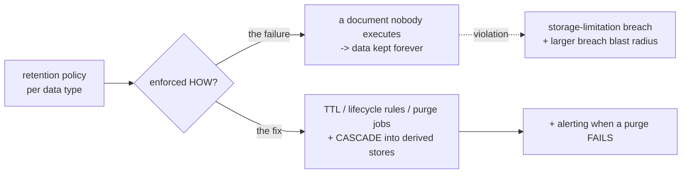
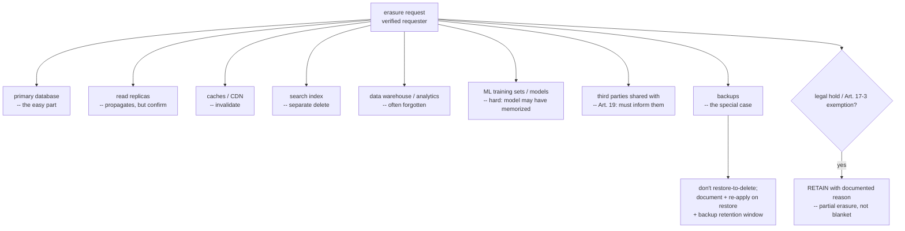
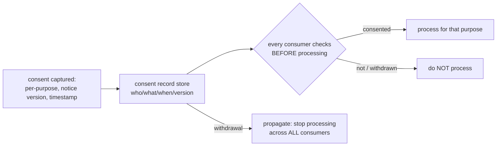
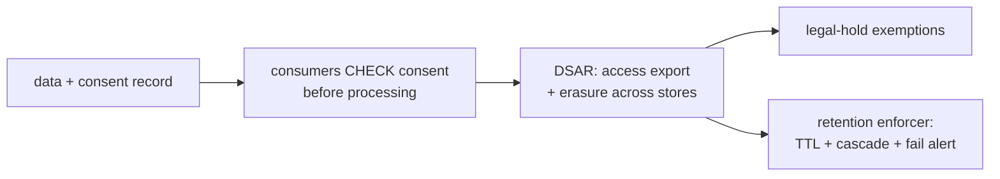

Notebook 42 Chapter 6 laid out privacy *law* — GDPR, HIPAA, PCI-DSS, the principles, the rights, the obligations. This chapter is about the other half: turning that law into *code*. Because here is the reality that catches organizations by surprise: **privacy is now an engineering discipline, and the hardest parts of complying with privacy law are engineering problems, not legal ones.** A lawyer can tell you that a user has a right to erasure; only an engineer can actually delete that user's data across a primary database, three read replicas, a search index, a data warehouse, eleven months of backups, a recommendation model trained on it, and four third-party services you shared it with. The right is legal; the *implementation* is a distributed-systems problem, and it is a hard one.

This is why privacy engineering has emerged as a discipline and why product security engineers increasingly own it. Privacy and security are different (Notebook 42 Chapter 6 Part 1 — security asks whether data is protected, privacy asks whether the *use* is legitimate), but they share the same tooling, the same data maps, the same access controls, the same deletion mechanics, and the same place in the SDLC — so the security engineer, who already understands where the data lives and how the systems fit together, is the natural owner of the *engineering* of privacy. The lawyer defines the requirement; the privacy engineer builds the system that satisfies it. This chapter is about that building.

The organizing insight is **privacy by design and by default (GDPR Article 25) as a build-time engineering requirement, not a principle to nod at.** "By default" is the sharp edge: without any action by the user, only the data necessary for each purpose is processed — which means the profile defaults to private, the analytics toggle defaults to off, the location permission is not requested at install. These are *code* decisions, made at build time, and they are far cheaper to make then than to retrofit after launch when the data has already spread through the system. The chapter covers the practical core (minimization, purpose limitation, and retention *enforced in code*), the data map that every privacy capability depends on, the data-subject rights as real systems (especially the distributed-systems nightmare of erasure), consent as engineering, de-identification and privacy-enhancing technologies, and privacy in the SDLC — including the places (logs, analytics, ML) where data leaks invisibly.

## Why This Matters

The engineering difficulty of privacy is systematically underestimated, and the underestimation is expensive. Organizations treat privacy as a policy problem — write the privacy notice, appoint the DPO, tick the compliance box — and then discover, when the first erasure request arrives or the first regulator asks "show me where this person's data is," that they cannot actually *do* the thing the policy promised. The erasure request that the policy says takes 30 days takes six months of manual effort because nobody built the deletion pipeline; the "we can export all your data" promise founders because nobody knows every system that holds it. The gap between the legal promise and the engineering reality is where privacy programs fail, and it is a gap only engineering closes.

The cost of getting it wrong is now genuinely large (Notebook 42 Chapter 6's fines — the billion-euro GDPR penalties, the CCPA enforcement), but the more common and more insidious cost is *architectural*: privacy requirements that arrive late are catastrophically expensive to retrofit. A "delete my account" requirement designed *before* the system replicates user data into a warehouse, caches, a search index, and an ML training set is a straightforward feature; the same requirement discovered *after* all that replication is a re-architecture. This is the whole argument for privacy *by design* — the requirements must be engineered in from the start, when they are cheap, because retrofitting them is where the real cost and the real risk live. An organization that builds data minimization, retention, and deletion into the architecture from day one spends a fraction of what one that bolts them on later spends, and it is far more likely to actually comply.

For the product security engineer, this is a scope expansion and a career opportunity. Privacy engineering is a fast-growing specialization precisely because the demand — driven by GDPR, CCPA, the proliferating US state laws, and the global spread of privacy regulation — vastly exceeds the supply of engineers who can actually *build* privacy into systems. The engineer who can translate a privacy requirement into a working DSAR pipeline, a consent-aware data flow, an enforced retention schedule, and a defensible de-identification is rare and valuable, because that translation is exactly what closes the promise-to-reality gap that sinks privacy programs. This chapter is about acquiring that translation skill.

## Part 1: Privacy by Design and by Default — as Code

**Privacy by Design (PbD)** and **Privacy by Default** are, under GDPR Article 25, legal *requirements*, not aspirations — and the engineering reading of them is what makes them actionable.

**Privacy by Design** means privacy is engineered into a system *from the start*, throughout the development lifecycle, rather than added afterward. The seven foundational PbD principles (Cavoukian's) reduce, for an engineer, to a small set of build-time commitments: proactive not reactive (design for privacy before the incident), privacy as the *default*, privacy *embedded* in the design (not a bolt-on feature), full functionality (privacy need not sacrifice the product — a false tradeoff), end-to-end protection (across the whole data lifecycle), visibility and transparency (the system's data handling is inspectable), and respect for the user (user-centric defaults). The engineering essence: **make the privacy-protective choice the architectural default, at design time.**

**Privacy by Default** is the sharpest and most testable of these, and the one engineers most often violate without noticing: **without any action by the user, only the personal data necessary for each specific purpose is processed.** Concretely, in code:

- A user profile **defaults to private**, not public. A social feature does not expose data until the user chooses to share it.
- An analytics or tracking toggle **defaults to off** (and, for non-essential cookies, is not set at all before consent — the ePrivacy rule, Notebook 42 Chapter 6).
- A permission (location, contacts, camera) is **requested when needed for a purpose**, not at install "just in case."
- A data-collection form collects **only the fields the purpose requires**, not every field that might someday be useful.
- Data sharing with third parties is **off by default**, opt-in not opt-out.

Each of these is a *code decision* — a default value, a conditional, a schema choice — and each is a place where the easy engineering choice (collect everything, default to on, request all permissions upfront) is a *privacy-by-default violation*. The discipline is recognizing that the default *is* the privacy posture, because users overwhelmingly keep defaults (the least-astonishment principle, Notebook 45 Chapter 6, applied to privacy) — so a permissive default is the actual behavior of the system regardless of what the settings page allows.

The framing that governs the chapter: **privacy by design and by default are build-time engineering requirements, and the cheapest possible privacy is the data you never collected, the default you set to private, and the retention you enforced from the start.** Every part that follows is an instance of engineering privacy in rather than bolting it on — because bolting it on, after the data has spread, is the expensive failure mode PbD exists to prevent.

## Part 2: The Practical Core — Minimization, Purpose Limitation, Retention in Code

Three of Notebook 42 Chapter 6's principles become concrete engineering practices, and they are the practical heart of privacy engineering because they *reduce the data you have to protect, export, and delete* — every downstream privacy capability is easier when there is less data.

**Data minimization in code** — collect and keep only what is necessary — is a set of engineering habits (Notebook 42 Chapter 6 Part 15, developed here):

- **Do not collect a field because it *might* be useful.** The "collect everything, decide later" instinct is a direct minimization violation and it creates data you must then protect, export, and delete. Collect for a *specified purpose*; if there is no purpose, do not collect.
- **Prefer derived answers to raw data.** Store `over_18: true` rather than a date of birth; store a coarse region rather than precise coordinates; store a hash rather than the value where you only need to *match*, not *read*. Deriving the minimal answer at collection time means the sensitive raw data never enters the system.
- **Truncate and aggregate at the edge.** Drop or hash the last octet of IP addresses in analytics; aggregate events into counts and keep the aggregate rather than the raw events. The data you never store is the data you never have to protect or delete.

**Purpose limitation in code** — use data only for the purpose it was collected for — is enforced by *tying data to its purpose in the system*: recording the purpose/lawful basis alongside the data, and checking it before a new use. The violation this prevents is "we already have the data, let's use it for this new feature" — which is a purpose-limitation breach and, if the new use needs a different lawful basis, a compliance incident (Notebook 42 Chapter 6 Part 4). Engineering purpose limitation means a *new* use of existing data triggers a *review* of whether the original purpose covers it, ideally enforced by tagging data with its purpose and gating new consumers.

**Retention enforced in code** — keep data only as long as necessary — is the principle most often *documented but not enforced*, and the enforcement is pure engineering (Notebook 42 Chapter 6 Part 15):



A retention *policy* is not a control; the *enforcement mechanism* is. In rough order of reliability: database TTL / partition drop, object-storage lifecycle rules, scheduled purge jobs *with failure alerting*, and — the one everyone forgets — **cascade deletion into derived stores** (the warehouse copy, the search index, the cache), because deleting the primary row while the derived copies persist satisfies neither the policy nor the regulator. Retention enforced in code is what makes storage limitation real, and it directly shrinks the erasure problem (Part 4) and the breach blast radius (less retained data = less exposed in a breach).

The framing: **minimization, purpose limitation, and retention are the practical core because they reduce the data footprint**, and a smaller footprint makes every other privacy capability — export, erasure, consent propagation, breach response — smaller and cheaper. The cheapest data to protect is the data you never collected; the second cheapest is the data you deleted on schedule.

## Part 3: The Data Map — The Foundation Everything Depends On

You cannot do privacy engineering — cannot export a person's data, cannot erase it, cannot enforce retention, cannot scope a breach, cannot build a Record of Processing Activities — **without knowing where the data is.** The **data map** (or data inventory) is that knowledge, and it is the foundation every privacy capability rests on, exactly as the asset inventory is the foundation of the security program (Chapter 1).

What a data map records: for every store in the system, *what personal data* it holds, *what type* (PII, special-category, pseudonymized), *whose* data, *why* it is held (purpose/lawful basis), *how long* (retention), *who it is shared with* (third parties, Chapter 4), and *where* it lives (which region — the transfer concern, Notebook 42 Chapter 6). This is simultaneously the input to the RoPA (Notebook 42 Chapter 6 Part 7), the target list for a DSAR (Part 4), the scope for a breach, and the enforcement points for retention.

The critical engineering insight — and the one that separates a real data map from a fictional one: **automated discovery beats a survey.** The naive approach is to *ask* teams what data they hold (a survey/spreadsheet), which produces a map that is incomplete on day one (teams forget the log store, the analytics pipeline, the backup) and *fiction within a quarter* (the map does not update as new services and columns ship). The engineering approach is **continuous automated discovery** — the techniques from Notebook 42 Chapter 6 Part 15: schema and column-name inspection, content pattern matching (regex for emails, national IDs, PANs, with validation like the Luhn check), statistical classification for free-text columns, and scanning data stores directly. Automated discovery finds the data the survey misses (the personal data that leaked into a log, the un-inventoried new service) and stays current because it *runs*, not because someone remembers to update a spreadsheet.

The framing: **the data map is the prerequisite for everything, and it must be automated and continuous to be true.** A DSAR that misses a store returns an incomplete response; an erasure that misses a store leaves the data exposed; a breach scoped against a stale map understates the exposure. The single highest-leverage investment in a privacy engineering program is an accurate, automated, continuously-updated data map, because every other capability is only as good as the map it runs on. Build the map first (the crawl phase of Chapter 1, applied to privacy), and build it as *code that discovers*, not a document that is surveyed.

## Part 4: The Data Subject Rights as Real Systems

Notebook 42 Chapter 6 Part 6 listed the eight GDPR rights as system requirements; here they become actual systems, and two of them — access and erasure — are the hard engineering.

**Access and portability (a working export).** The right of access (Article 15) requires returning *all* data about a person, and portability (Article 20) requires it in a *structured, machine-readable* format. The engineering: query *every* store in the data map (Part 3 — this is why the map is the prerequisite) for the subject's data, and assemble it into a complete export with the required context (purposes, recipients, retention, source). The hard part is *completeness* — an export that misses the logging platform, the CRM, and the support-ticket system is an incomplete (and non-compliant) response — which is again why the data map must be true. Access is "merely" a thorough distributed query; it is tractable if the map is complete.

**Erasure — the distributed-systems nightmare.** The right to erasure ("right to be forgotten," Article 17) is *the* hard privacy-engineering problem, because deleting a person's data means deleting it *everywhere*, and "everywhere" in a modern system is a lot of places:



The engineering realities, each a real problem:

- **The primary database is the easy part.** Everything else is the work: read replicas (usually propagate, but confirm), caches and CDN (invalidate explicitly), the search index (a separate delete), the data warehouse and analytics (frequently forgotten — the data was copied there and the deletion was not), and the ML training set and model (hard — a model trained on the data may have *memorized* it, and "deleting" it may require retraining or is an open research problem).
- **Third parties must be informed (Article 19).** Data you shared with vendors (Chapter 4) must also be erased, and you must *tell* the recipients — which means you need a list of who you shared it with (the data map again).
- **Backups are the special case.** Regulators generally *do not* require restoring a backup to delete one record; the accepted engineering approach is to document that backups are not actively processed, ensure the deletion is *re-applied* if a backup is ever restored, and hold a defined backup-retention window after which the data ages out. Write this reasoning down — it is exactly what the accountability principle (Notebook 42 Chapter 6 Part 4) expects.
- **Erasure is not absolute (Article 17(3)).** Legal holds, tax/AML retention obligations, and defense of legal claims *require retaining* some data — so the correct behavior is *partial* erasure with a *documented justification* for what is retained, not a blanket delete (which destroys records you are legally required to keep) and not a blanket refusal.
- **Verify the requester first.** A social-engineered erasure or access request is a self-inflicted breach (Notebook 42 Chapter 6 Part 6) — verify identity proportionately before acting.

The framing: **access is a thorough distributed query; erasure is a distributed-systems deletion problem across primaries, replicas, caches, indexes, warehouses, ML, third parties, and backups — with legal-hold exemptions and mandatory requester verification.** Erasure is the single hardest thing privacy engineering builds, and it is why data minimization and retention (Part 2) matter so much: the less data you have and the less you have replicated it, the smaller the erasure problem. The other rights (rectification propagating to copies, restriction as a "hold" flag every consumer honors, objection/opt-out) are engineered similarly — as operations that must reach *every* copy — but access and erasure are where the difficulty concentrates.

## Part 5: Consent Management as Engineering

Consent (Notebook 42 Chapter 6 Part 5) is a legal concept with a demanding engineering implementation, because valid consent must be *recorded, versioned, granular, withdrawable, and — critically — honored by every system that processes the data.* A consent that the analytics pipeline ignores is not consent.

The engineering of consent:

- **The consent record.** Consent must be *demonstrable* (GDPR's accountability — you must show *who* consented to *what*, *when*, and via *which notice version*). This is not a boolean column; it is a *record*: subject id, purpose, timestamp, the *version* of the notice/policy they agreed to, and the method of collection. Versioning matters because when the notice changes materially, prior consent may no longer cover the new processing, and you need to know who consented to *which* version.
- **Granularity.** Separate consent per purpose (Notebook 42 Chapter 6 Part 5 — one checkbox for "marketing, analytics, and partner sharing" is invalid). The consent record is therefore per-*purpose*, and the system checks the *specific* purpose's consent before that specific processing.
- **Withdrawal as easy as granting.** If consent was one click, withdrawal must be roughly one click — which means a self-service mechanism, not an email to support (a compliance violation). And withdrawal must *propagate*: withdrawing consent must actually *stop* the processing, everywhere.
- **Propagation to every consumer — the hard part.** The consent decision must reach *every downstream system* that processes the data. If a user withdraws analytics consent but the analytics pipeline, the ML feature, and the third-party integration keep consuming their data because they never checked the consent record, the withdrawal is fiction. Engineering consent means every data consumer *checks the consent record before processing*, and a consent change *propagates* to stop the now-unconsented processing.



The framing: **consent is not a checkbox; it is a versioned, per-purpose record that every data consumer must check and that a withdrawal must propagate across.** The common failure is capturing consent at the UI and then never *enforcing* it downstream — the analytics and ML pipelines that ignore the consent record. Engineering consent means building the record *and* wiring every consumer to honor it, which is the difference between compliant consent and a consent banner that is theater.

## Part 6: CCPA/CPRA Opt-Out Mechanics, and Legal Basis in Code

GDPR is opt-*in* (you need a lawful basis, often consent, *before* processing); **CCPA/CPRA** (California) is fundamentally opt-*out* (processing is generally allowed, but the consumer can *opt out* of the "sale/sharing" of their data), and the opt-out has specific *engineering* mechanics that a GDPR-only implementation misses.

The CCPA/CPRA engineering:

- **"Do Not Sell or Share My Personal Information."** CCPA requires a mechanism for consumers to opt out of the sale *and sharing* (CPRA added "sharing," which crucially covers cross-context behavioral advertising) of their data. This is a required, discoverable control (a link, a toggle) whose engineering is: record the opt-out, and *stop* selling/sharing that consumer's data — which means every data-sharing integration (ad networks, analytics that "share," data brokers) must *check the opt-out* before sharing, exactly like the consent check of Part 5.
- **Global Privacy Control (GPC).** The engineering detail a GDPR-only team misses: CCPA (via regulation and enforcement) requires honoring the **GPC** signal — a browser-level "do not sell/share" signal sent as an HTTP header (`Sec-GPC: 1`). Your site must *detect* the GPC header and treat it as a valid opt-out request *automatically*, without the user clicking your specific link. This is a concrete engineering requirement — read the header, honor it as an opt-out — and failing to honor GPC has been the subject of CCPA enforcement (the Sephora settlement).
- **The opt-out is a distributed operation** like consent and erasure — it must reach every sharing consumer.

**Legal basis in code (GDPR).** The opt-in counterpart: every processing purpose needs a lawful basis chosen *before* processing (Notebook 42 Chapter 6 Part 5), and engineering it means *recording the basis alongside the data/purpose* and being able to *demonstrate* it. For *consent*-based processing, this ties to the consent record (Part 5); for *legitimate interests*, the documented LIA must exist and the processing must be within its scope; and the basis must be *checkable* — the system should be able to answer "on what basis are we processing this?" for any data, which is what the accountability principle and a regulator both demand.

The framing: **GDPR is opt-in (a lawful basis, recorded and demonstrable, before processing) and CCPA is opt-out (a do-not-sell/share mechanism, plus the GPC signal, honored across every sharing consumer)** — and a system serving both jurisdictions must engineer *both* models: the consent-and-basis machinery for GDPR and the opt-out-and-GPC machinery for CCPA. The GPC header in particular is the concrete detail teams miss, and it is a real, testable engineering requirement.

## Part 7: De-identification, Pseudonymization, and PETs as Engineering Choices

Notebook 42 Chapter 6 Part 2 established the *concepts* (pseudonymization is still personal data; true anonymization is hard; the re-identification research); this chapter makes them *engineering choices* with concrete techniques and their real tradeoffs.

**Pseudonymization** (replace identifiers with tokens while a re-identification key exists) is a valuable *security* measure that *reduces risk* but keeps the data in scope (still personal data — Notebook 42 Chapter 6 Part 2). Engineering it: replace direct identifiers with tokens, store the mapping key *separately* and access-controlled, so a breach of the data store alone does not re-identify. It is a real, useful control (it limits breach blast radius and can be a GDPR Article 34 defense), as long as you remember it does *not* take you out of scope.

**Anonymization** (re-identification not reasonably possible) takes data *out* of scope — and the engineering discipline is that it is a *claim to be defended, not a label to apply* (Notebook 42 Chapter 6 Part 2). Achieving it requires identifying the *quasi-identifiers* (ZIP + DOB + sex — Sweeney's result), applying generalization and suppression to reach a stated **k-anonymity** threshold (each record indistinguishable from at least k−1 others), considering realistic auxiliary datasets an attacker could use, and *documenting the analysis*. The engineering choices — how much to generalize (coarser = safer but less useful), what k to target, whether to add l-diversity — are real utility-vs-privacy tradeoffs, and the honest engineering position is that generic "anonymization" often leaves quasi-identifiers that re-identify (the Netflix and NYC-taxi lessons), so the claim must be *earned* through analysis, not asserted.

**Privacy-enhancing technologies (PETs) as engineering choices** (Notebook 42 Chapter 6 Part 15, as build decisions):

| PET | Engineering choice | When |
|---|---|---|
| **Tokenization** | Replace value with a non-reversible token; vault the mapping | Mature, deploy it — PCI scope reduction, limiting who sees raw data |
| **Field-level encryption** | Encrypt specific columns with separate keys | Limit blast radius; support the Art. 34 "encrypted, keys safe" defense |
| **k-anonymity / l-diversity** | Generalize + suppress to a threshold | Dataset release; weak against auxiliary data — analyze first |
| **Differential privacy** | Add calibrated noise; spend a privacy budget ε | Aggregate statistics/telemetry with a *provable* guarantee |
| **Synthetic data** | Generate statistically-similar fake data | Test/dev environments — but verify it did not memorize real records |

**Differential privacy** is the one worth understanding as an engineering choice because it is the only technique with a *formal, provable* guarantee (Notebook 42 Chapter 6 Part 15): calibrated noise makes any single individual's presence statistically undetectable, quantified by the privacy budget ε (smaller = more noise, stronger privacy), and the budget is *consumed* across queries (so the system must refuse once exhausted). The engineering choice is ε and the query design; it is used in real systems (the US Census, Apple/Google telemetry) precisely for its provable guarantee, and it is the PET to reach for when you need aggregate insight from sensitive data with a defensible privacy claim.

The framing: **de-identification and PETs are engineering choices with real utility-vs-privacy tradeoffs, and the key disciplines are that pseudonymization stays in scope, anonymization must be *earned and documented* (not labeled), and differential privacy is the only technique offering a *provable* guarantee.** Choosing the right PET for a use case — tokenize to reduce who sees raw data, differential-privacy for aggregate telemetry, k-anonymity (analyzed) for a dataset release, synthetic data for test environments — is a core privacy-engineering competence.

## Part 8: Privacy in the SDLC — PIA, LINDDUN, and Privacy as Code

Privacy, like security, must be built into the development lifecycle, not bolted on — and it has its own SDLC touchpoints that mirror the security ones of Notebook 45.

**The Privacy Impact Assessment (PIA / DPIA).** The privacy counterpart to the security DPIA (Notebook 42 Chapter 6 Part 7), and the same lesson applies: **run it at *design time*, when changing the design is cheap.** A PIA/DPIA assesses a new feature or processing for privacy risk — what data, what purpose, what basis, what risks to individuals, what mitigations — and is *mandatory* for high-risk processing (large-scale special-category data, systematic monitoring). Its value is *when* it happens: a PIA at design time can stop you building a feature you cannot lawfully ship or can shape it to be privacy-protective; a PIA after launch is documentation. Engineering the PIA into the SDLC means *triggering* it on the right events (a new data collection, a new purpose, a new third-party share) — the privacy version of the threat-modeling trigger (Notebook 45 Chapter 3).

**Privacy threat modeling with LINDDUN.** Just as STRIDE (Notebook 45 Chapter 3) is the *security* threat-modeling mnemonic, **LINDDUN** is the *privacy* one — a structured method for finding privacy threats in a design. Its categories: **L**inking, **I**dentifying, **N**on-repudiation, **D**etecting, **D**ata disclosure, **U**nawareness, **N**on-compliance (the exact letters vary by version, but the shape is: threats to *un*linkability, *un*detectability, *anonymity/pseudonymity*, *plausible deniability*, *confidentiality*, *awareness*, and *compliance*). LINDDUN applied to a data-flow diagram (the same DFD as security threat modeling — Notebook 45 Chapter 3) surfaces privacy threats the security STRIDE analysis misses: can two data flows be *linked* to profile a person? can a person be *identified* from supposedly anonymous data? is the person *unaware* of the processing? It is the privacy engineer's structured discovery tool, and it belongs in the design review alongside STRIDE.

**Privacy as code, and gating.** The security-as-code discipline (Notebook 46) has a privacy counterpart: express privacy rules as *checkable code* and *gate* on them. Examples: a CI check that flags a new column matching a personal-data pattern without a purpose/retention tag (extending the discovery of Part 3 into a gate — Notebook 46 Chapter 6's secret-scanning pattern applied to PII); a policy-as-code rule (OPA, Notebook 46 Chapter 8) that a data store holding personal data must have encryption and a retention policy declared; a test asserting that an API does not return an internal or un-consented field (the field-level check of Notebook 46 Chapter 2). Privacy as code turns privacy requirements from prose in a policy into *automated checks in the pipeline*, which is the only way they scale (Chapter 1's executable-standard principle, applied to privacy).

The framing: **privacy has SDLC touchpoints that parallel security's — the PIA/DPIA at design time (the privacy DPIA), LINDDUN privacy threat modeling alongside STRIDE, and privacy-as-code gates in the pipeline.** Building these in is how privacy becomes *by design* (Part 1) in practice rather than principle — triggered assessments, structured threat discovery, and automated gates, exactly as security is built into the SDLC (Notebook 46). The privacy engineer runs this lifecycle, and it is the operational expression of Article 25.

## Part 9: Where Data Leaks Invisibly — Logs, Analytics, and ML

A recurring and under-appreciated privacy-engineering problem: personal data accumulates in places nobody thinks of as data stores, invisibly, and these are frequent sources of both compliance failures and breaches.

**Logs.** The single most common accidental personal-data store (Notebook 42 Chapter 6 Part 15, Notebook 45 Chapter 6). Full request bodies, query strings with identifiers, stack traces containing user objects, and error-tracking payloads all capture personal data into logs that were never designed as personal-data stores — and then those logs have their *own* retention, access control, and (crucially) are subject to *erasure requests* (Part 4). The engineering discipline: **audit your logs for personal data** (the discovery of Part 3 aimed at log stores), scrub or avoid logging identifiers, and remember that logs are personal data with all the obligations attached — including that a "beautiful immutable audit log" you cannot erase from is a privacy *problem*, not just a feature (Notebook 42 Chapter 6 Part 1).

**Analytics.** Analytics pipelines collect behavioral data that is personal data (IP, device IDs, behavior traces — Notebook 42 Chapter 6 Part 2), often *before consent* (the ePrivacy violation — Part 5/6), and *share* it with third parties (the CCPA "sharing" — Part 6). The engineering: gate analytics collection on consent (Part 5), minimize what analytics captures (truncate IPs, aggregate — Part 2), and treat the analytics store as personal data in the data map (Part 3) and DSAR scope (Part 4). Analytics is where "we're not collecting personal data" is most often quietly false.

**Machine learning.** The hardest and newest invisible-leak surface, with genuinely open problems:

- **Training data is personal data** — a model trained on personal data has *processed* it, needs a lawful basis, and is in scope for the data map. And it feeds the *purpose limitation* problem (Part 2): using data collected for one purpose to train a model for another is a purpose-limitation issue.
- **Models can memorize and leak training data** — a model may reproduce personal data from its training set (membership-inference and extraction attacks — Notebook 39), meaning the *model itself* can be a personal-data disclosure, which complicates both breach analysis and erasure.
- **Erasure from a trained model is an open problem** (Part 4) — "machine unlearning" is active research; deleting a person's data from the training *set* does not remove their influence from the trained *model* without retraining. This is a real, unsolved tension between the erasure right and ML systems, and the honest engineering answer is often to retrain on a cadence, avoid training on data likely to be erased, or use privacy-preserving training (differential privacy, Part 7) from the start.

The framing: **personal data leaks invisibly into logs, analytics, and ML — stores nobody designed as personal-data stores but which carry all the obligations (retention, access, erasure, lawful basis).** The privacy engineer's discipline is to *find* these (Part 3's discovery aimed at them), treat them as personal data in the data map and rights systems, gate them on consent, minimize what they capture, and confront the genuinely hard ML questions (memorization, unlearning) honestly rather than pretending the model is not personal data. These invisible stores are where privacy programs that look complete on paper actually fail.

## Part 10: Hands-On Lab — Consent-Aware Pipeline, DSAR, and Retention

### 10.1 What we are building

The core privacy-engineering systems: a **consent-aware data pipeline** where every consumer checks consent (Part 5), a **working DSAR export and erasure** with legal-hold exemptions and requester verification (Part 4), and a **retention enforcer** with cascade deletion (Part 2).



Python 3 only.

### 10.2 The consent-aware pipeline

```python
# consent.py -- Part 5: a versioned per-purpose consent record every consumer checks.
from datetime import date

CURRENT_NOTICE = "2027-06-01"   # material notice version

consent_records = {
 "u1": {"analytics":{"granted":True,"version":"2027-06-01"},
        "marketing":{"granted":True,"version":"2025-01-01"},   # stale version!
        "ml_training":{"granted":False,"version":"2027-06-01"}},
 "u2": {"analytics":{"granted":False,"version":"2027-06-01"},
        "marketing":{"granted":True,"version":"2027-06-01"},
        "ml_training":{"granted":True,"version":"2027-06-01"}},
}

def may_process(user, purpose):
    """Every consumer calls this BEFORE processing (Part 5)."""
    rec = consent_records.get(user, {}).get(purpose)
    if not rec or not rec["granted"]:
        return False, "no/withdrawn consent"
    # Material notice change can invalidate stale consent (Part 5 versioning).
    if rec["version"] < CURRENT_NOTICE:
        return False, f"consent predates current notice ({rec['version']} < {CURRENT_NOTICE})"
    return True, "ok"

# Three consumers each check consent for their purpose before running.
print(f"{'USER':<5}{'CONSUMER':<14}{'PROCESS?':<10}REASON")
print("-" * 55)
for user in ("u1","u2"):
    for purpose in ("analytics","marketing","ml_training"):
        ok, reason = may_process(user, purpose)
        print(f"{user:<5}{purpose:<14}{'YES' if ok else 'NO':<10}{reason}")
```

```bash
mkdir -p ~/privacy-eng-lab && cd ~/privacy-eng-lab
python3 consent.py 2>/dev/null || python3 - <<'PY'
exec(open("/dev/stdin").read())
PY
python3 consent.py

# Sample output:
# USER CONSUMER      PROCESS?  REASON
# -------------------------------------------------------
# u1   analytics     YES       ok
# u1   marketing     NO        consent predates current notice (2025-01-01 < 2027-06-01)
# u1   ml_training   NO        no/withdrawn consent
# u2   analytics     NO        no/withdrawn consent
# u2   marketing     YES       ok
# u2   ml_training   YES       ok
```

Every consumer checks the consent record *before* processing (Part 5), per-purpose. Note u1's *marketing* consent is refused because it *predates the current notice version* — the versioning discipline catches consent that a material notice change invalidated, which a boolean column would have missed.

### 10.3 The DSAR — access and erasure with legal holds

```python
# dsar.py -- Part 4: access export + erasure across stores, with holds + verification.
stores = {
 "users":     {"u1":{"name":"Asha","email":"asha@x.com","dob":"1991-04-12"}},
 "orders":    {"u1":[{"id":1,"total":50},{"id":2,"total":80}]},
 "logs":      {"u1":["login asha@x.com ip=203.0.113.9"]},   # data leaked into logs (Part 9)
 "invoices":  {"u1":[{"id":1,"total":50}]},                  # legal hold: tax retention
 "analytics": {"u1":[{"event":"click","ts":"..."}]},
}
LEGAL_HOLD = {"invoices": "Art.17(3)(b) tax retention -- 7 years"}

def verify(user, claimed_email):
    return stores["users"].get(user, {}).get("email") == claimed_email

def access(user):
    return {store: data[user] for store, data in stores.items() if user in data}

def erase(user):
    report = []
    for store, data in stores.items():
        if user not in data:
            continue
        if store in LEGAL_HOLD:
            report.append((store, "RETAINED", LEGAL_HOLD[store]))
        elif store == "logs":
            data[user] = ["[ERASED]"]                 # redact, preserve log integrity
            report.append((store, "REDACTED", "log integrity preserved"))
        else:
            del data[user]
            report.append((store, "ERASED", ""))
    return report

# Verify FIRST (Part 4) -- a social-engineered request is a self-inflicted breach.
if not verify("u1", "wrong@x.com"):
    print("access refused: identity verification failed\n")

print("ACCESS export (u1):", list(access("u1").keys()))
print("\nERASURE (u1):")
print(f"  {'STORE':<12}{'ACTION':<10}NOTE")
for store, action, note in erase("u1"):
    print(f"  {store:<12}{action:<10}{note}")
print("  downstream: replicas, cache, search index, warehouse, ML, third parties (Art.19)")
```

```bash
python3 dsar.py

# Sample output:
# access refused: identity verification failed
#
# ACCESS export (u1): ['users', 'orders', 'logs', 'invoices', 'analytics']
#
# ERASURE (u1):
#   STORE       ACTION    NOTE
#   users       ERASED
#   orders      ERASED
#   logs        REDACTED  log integrity preserved
#   invoices    RETAINED  Art.17(3)(b) tax retention -- 7 years
#   analytics   ERASED
#   downstream: replicas, cache, search index, warehouse, ML, third parties (Art.19)
```

Erasure is Part 4 in practice: **not a uniform delete.** The identity check runs *first* (a wrong email is refused). Transactional data is erased; the invoice is *retained under a cited legal exemption* (partial erasure, not blanket); the log is *redacted* (preserving audit integrity while removing the personal data); and the reminder names the *distributed* stores (replicas, warehouse, ML, third parties) that a real erasure must also reach.

### 10.4 The retention enforcer

```python
# retention.py -- Part 2: enforce retention in CODE, with cascade + failure alerting.
from datetime import date, timedelta

today = date(2027, 6, 26)
RETENTION_DAYS = {"orders":365, "logs":30, "analytics":90}   # policy AS enforced rules

records = {
 "orders":    [{"id":1,"created":date(2027,6,1)}, {"id":2,"created":date(2025,1,1)}],
 "logs":      [{"id":"L1","created":date(2027,6,20)}, {"id":"L2","created":date(2027,1,1)}],
 "analytics": [{"id":"A1","created":date(2027,4,1)}],
}
# Derived stores that must ALSO be purged (the forgotten cascade, Part 2).
DERIVED = {"orders": ["warehouse.orders", "search.orders"]}

def enforce():
    report = []
    for store, items in records.items():
        cutoff = today - timedelta(days=RETENTION_DAYS[store])
        expired = [r for r in items if r["created"] < cutoff]
        for r in expired:
            items.remove(r)
        if expired:
            report.append((store, len(expired), DERIVED.get(store, [])))
    return report

print(f"{'STORE':<12}{'PURGED':<8}CASCADE INTO DERIVED STORES")
print("-" * 60)
for store, n, derived in enforce():
    casc = ", ".join(derived) if derived else "(none)"
    print(f"{store:<12}{n:<8}{casc}")
print("-" * 60)
print("each purge job MUST alert on failure -- a silent failure = data kept forever")
```

```bash
python3 retention.py

# Sample output:
# STORE       PURGED  CASCADE INTO DERIVED STORES
# ------------------------------------------------------------
# orders      1       warehouse.orders, search.orders
# logs        1       (none)
# ------------------------------------------------------------
# each purge job MUST alert on failure -- a silent failure = data kept forever
```

The enforcer makes Part 2 concrete: retention is *code that runs*, not a document. It purges expired records *and* names the **cascade into derived stores** (the warehouse and search copies of the orders — the step everyone forgets), and it flags that a silent purge failure means data kept forever (hence the failure-alerting requirement). The analytics record is within its 90-day window, so it stays.

### 10.5 Extending the lab

Add GPC-header handling (Part 6): detect `Sec-GPC: 1` and record it as an automatic do-not-sell/share opt-out, then gate a "sharing" consumer on it; add a privacy-as-code CI check (Part 8) that scans for a new column matching a PII pattern lacking a purpose/retention tag and fails the build; implement k-anonymity measurement on the `users` export (Part 7) and generalize `dob`/region until each equivalence class has k≥5; and add the ML case (Part 9) — track which training data came from a now-erased user and flag that the model needs retraining.

## Part 11: Common Pitfalls

**Treating privacy as legal-only.** The hard parts — erasure across a distributed system, consent propagation, retention enforcement — are *engineering* problems. The lawyer defines the right; the engineer builds the system. Privacy programs fail in the promise-to-reality gap that only engineering closes.

**Privacy by default violated by permissive defaults.** Profile public by default, analytics on by default, all permissions at install. Users keep defaults, so the default *is* the privacy posture. Make the private choice the default (Part 1).

**Retrofitting privacy after the data has spread.** A "delete my account" designed after replication into warehouse, caches, index, and ML is a re-architecture. Engineer minimization, retention, and deletion in from the start (Part 1) — retrofitting is the expensive failure PbD prevents.

**No data map, or a survey-based one.** You cannot export, erase, or scope a breach without knowing where the data is, and a surveyed map is incomplete and stale. Build automated, continuous discovery (Part 3).

**Erasing the primary and forgetting the rest.** Replicas, caches, search index, warehouse, ML, third parties (Art. 19), and backups. The primary DB is the *easy* part; the copies are the work, and a missed store leaves the data exposed (Part 4).

**Blanket erasure that destroys legally-required records.** Erasure is not absolute (Art. 17(3)) — tax/AML/legal-hold data must be retained. Do *partial* erasure with a documented justification, not a blanket delete (Part 4).

**Consent captured but not enforced downstream.** The analytics and ML pipelines that ignore the consent record make the consent theater. Every consumer must check consent before processing, and a withdrawal must propagate (Part 5).

**Ignoring GPC.** CCPA requires honoring the browser `Sec-GPC` signal as an opt-out automatically. A GDPR-only implementation misses it, and it has been enforced (Part 6).

**Claiming anonymization without earning it.** Stripping names leaves quasi-identifiers that re-identify. Anonymization is a claim to defend with analysis (quasi-identifiers, k-anonymity, auxiliary data), not a label. If you cannot show the analysis, it is pseudonymized and still in scope (Part 7).

**Forgetting logs, analytics, and ML.** The invisible personal-data stores — full of identifiers, subject to retention and erasure, often collected before consent. Audit them, treat them as personal data, and confront the ML memorization/unlearning problem honestly (Part 9).

## Final Revision / Summary

- **Privacy is now an engineering discipline**: the hardest parts of privacy compliance — erasure across a distributed system, consent propagation, retention enforcement, the data map — are *engineering* problems, not legal ones. The lawyer defines the right; the privacy engineer builds the system that satisfies it, and programs fail in the promise-to-reality gap only engineering closes.
- **Privacy by design and by default (Article 25) are build-time engineering requirements.** "By default" is the sharp edge: without user action, only necessary data is processed — profiles default private, analytics defaults off, permissions requested when needed. The default *is* the privacy posture (users keep defaults). **The cheapest privacy is the data you never collected, the default set to private, and the retention enforced from the start** — because retrofitting after the data spreads is a re-architecture.
- **The practical core — minimization, purpose limitation, retention *in code*** — reduces the data footprint, making every other capability smaller: collect only for a purpose and prefer derived answers (`over_18` not DOB), tie data to its purpose and gate new uses, and enforce retention with TTL/lifecycle/purge jobs *plus cascade into derived stores plus failure alerting* (a policy document is not a control).
- **The data map is the foundation everything depends on** — you cannot export, erase, enforce retention, or scope a breach without knowing where data is. It must be built by **automated continuous discovery** (schema/pattern/statistical scanning), not a survey (which is incomplete on day one and fiction within a quarter). The highest-leverage privacy investment.
- **Data subject rights as real systems**: **access** is a thorough distributed query over every mapped store (completeness is the challenge). **Erasure is the distributed-systems nightmare** — delete across primaries, replicas, caches, search indexes, warehouses, ML (which may have *memorized* it), and third parties (Art. 19), with **backups** as a special case (don't restore-to-delete; document and re-apply on restore) and **legal-hold exemptions** (Art. 17(3) — partial erasure, not blanket). **Verify the requester first** (a social-engineered request is a self-inflicted breach).
- **Consent is engineering, not a checkbox**: a versioned, per-purpose *record* (who/what/when/which notice version) that is granular, withdrawable as easily as granted, and — the hard part — **checked by every downstream consumer and propagated on withdrawal**. Consent captured at the UI but ignored by the analytics/ML pipelines is theater.
- **GDPR is opt-in (a lawful basis, recorded and demonstrable, before processing); CCPA/CPRA is opt-out** (a do-not-sell/share mechanism honored across every sharing consumer) — and CCPA requires **honoring the Global Privacy Control `Sec-GPC` header automatically**, the concrete detail GDPR-only teams miss (and that has been enforced).
- **De-identification and PETs are engineering choices with real tradeoffs**: pseudonymization reduces risk but *stays in scope*; anonymization must be **earned and documented** (quasi-identifiers, k-anonymity, auxiliary-data analysis), not labeled; and **differential privacy** is the only technique with a *provable* guarantee (calibrated noise, a spent budget ε). Choose the PET for the use case (tokenize, differential-privacy for aggregates, k-anonymity for releases, synthetic for test).
- **Privacy in the SDLC** parallels security: the **PIA/DPIA at design time** (triggered on new collection/purpose/sharing), **LINDDUN privacy threat modeling** alongside STRIDE on the same DFD, and **privacy as code** (CI checks for untagged PII columns, policy-as-code for retention/encryption, tests against un-consented fields) — turning privacy from prose into automated gates.
- **Data leaks invisibly into logs, analytics, and ML** — stores nobody designed as personal-data stores but that carry all the obligations. Audit logs for identifiers; gate and minimize analytics; and confront ML honestly (training data is personal data, models can memorize and leak it, and **erasure from a trained model is an open problem** — machine unlearning). These invisible stores are where paper-complete programs actually fail.

## Cheat Sheet / Quick Reference

**The core reframe**

```
privacy compliance's HARD parts are ENGINEERING (erasure, consent propagation,
retention, the data map) -- lawyer defines the right, ENGINEER builds the system
cheapest privacy = data never collected + default private + retention enforced from day 1
retrofitting after data spreads = re-architecture (why privacy BY DESIGN)
```

**Privacy by default (in code)**

```
profile -> PRIVATE by default | analytics toggle -> OFF | permission -> when needed
form -> only purpose-required fields | third-party sharing -> OPT-IN
the DEFAULT is the privacy posture (users keep defaults)
```

**Practical core (reduce the footprint)**

```
minimize:  collect only for a purpose | derive (over_18 not DOB) | truncate/aggregate
purpose:   tie data to its purpose | gate NEW uses
retention: TTL/lifecycle/purge jobs + CASCADE into derived stores + FAILURE ALERTS
           (a policy doc is NOT a control)
```

**Data map = the foundation**

```
what data / type / whose / why / how long / shared-with / where -- per store
AUTOMATED continuous discovery (schema/pattern/stats), NOT a survey (stale in a quarter)
prerequisite for: DSAR, erasure, retention, breach scope, RoPA
```

**Rights as systems**

```
ACCESS  = thorough distributed query over EVERY mapped store (completeness!)
ERASURE = distributed delete: primary(easy) + replicas + cache + search + warehouse
          + ML(memorized?) + third parties(Art.19) + backups(document, re-apply on restore)
          - legal holds (Art.17(3)) = PARTIAL erasure, documented   - VERIFY requester FIRST
```

**Consent = engineering**

```
RECORD: who/what/when/notice-VERSION (not a boolean) | per-PURPOSE | withdrawable = granting
every consumer CHECKS consent before processing | withdrawal PROPAGATES (stops processing)
captured-but-not-enforced = theater
```

**GDPR vs CCPA**

```
GDPR = OPT-IN: lawful basis recorded + demonstrable BEFORE processing
CCPA = OPT-OUT: do-not-sell/share mechanism + honor the GPC header (Sec-GPC: 1) AUTOMATICALLY
```

**PETs (engineering choices)**

```
pseudonymize -> reduces risk, STILL IN SCOPE      tokenize -> limit who sees raw
anonymize -> EARN it (quasi-IDs, k-anonymity, auxiliary data) + DOCUMENT, don't label
differential privacy -> the only PROVABLE guarantee (noise + budget ε)
synthetic -> test envs (verify no memorized real records)
```

**SDLC + invisible leaks**

```
PIA/DPIA at DESIGN time | LINDDUN privacy threat modeling (alongside STRIDE) | privacy-as-code gates
LEAKS: logs (identifiers, subject to erasure) | analytics (pre-consent, shared)
       ML (training data = personal data; models memorize; UNLEARNING is unsolved)
```

## Practice Labs & Resources

**Frameworks and standards**
- **LINDDUN** (linddun.org) — the privacy threat-modeling methodology; work through it on a DFD alongside STRIDE.
- **NIST Privacy Framework** and **NIST IR 8053** (de-identification) — the engineering-oriented privacy guidance.
- **GDPR Article 25** (privacy by design/default) and the EDPB guidelines on it; **CCPA/CPRA** regulations, especially the GPC requirement.
- **The IAPP** (privacy profession body) and its privacy-engineering resources.

**Hands-on**
- Extend the lab: add GPC handling, a privacy-as-code PII-column CI gate, k-anonymity measurement, and the ML-retraining flag.
- Build a real data map for a small application using automated discovery (the Notebook 42 Chapter 6 scanner), and see what it finds that a survey would miss.
- Implement a full DSAR pipeline (access + erasure) across three real stores including a log store, with legal-hold exemptions and requester verification.

**Deliberate practice**
- For a feature you know, run a LINDDUN analysis and find the privacy threats STRIDE misses (linking, identifying, unawareness).
- Audit an application's logs, analytics, and any ML for personal data — the invisible stores of Part 9 — and see how much is uninventoried.
- Take a "we anonymized it" dataset claim and test it: list the quasi-identifiers and estimate the smallest equivalence class. If you cannot defend the claim, it is pseudonymized.

**Further reading**
- Notebook 42 Chapter 6 (the privacy law this chapter implements) and Notebook 45 Chapter 6 (the secure-coding fixes that overlap — input handling, access control, secrets).
- The re-identification research (Sweeney; Narayanan & Shmatikov; the Nature Communications 15-attribute paper) and Dwork & Roth on differential privacy.
- Notebook 39 for the ML privacy attacks (membership inference, extraction) that make models personal-data disclosures.
- Chapter 6 next (communicating privacy and security risk to leadership) and Chapter 7 (the capstone, where privacy engineering is one thread of a full S-SDLC engagement).
