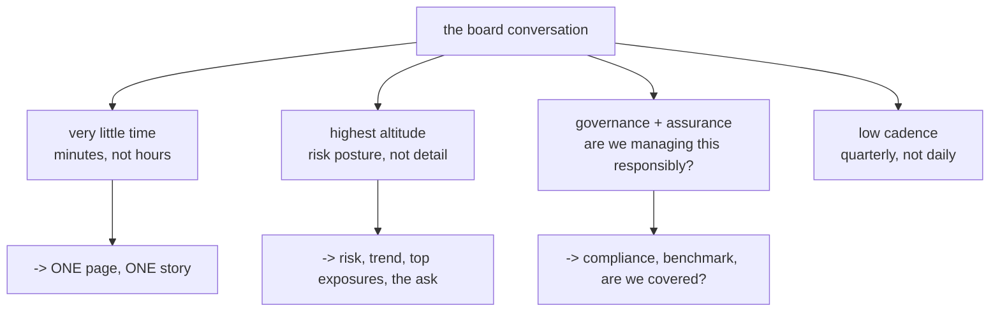
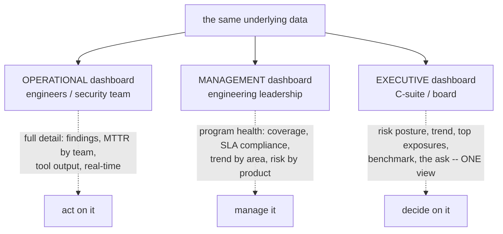
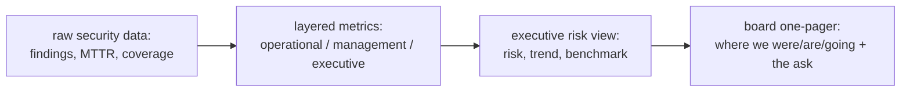

Every previous chapter of this notebook built *capability* — programs, champions, bounties, vendor assessment, privacy engineering. This chapter is about the skill that determines whether any of it *matters to the people who fund it*: **communication.** A security program can be technically excellent and still fail — lose its budget, lose leadership trust, get overruled at every turn — because the people who decide its fate do not *understand* its value. Conversely, a modest program that communicates well earns support, funding, and the organizational backing that lets it grow. Communication is not a soft addendum to the technical work; it is the *force multiplier* that converts technical work into organizational reality, and it is the skill that most reliably separates security *leaders* from security *technicians*.

The reason this is a distinct and difficult skill is the **audience problem**: the people who most need to understand your program — executives, the board, the budget-holders — do not speak your language and do not want to. They do not care about CVE counts, SAST findings, or the elegance of your threat model; they care about *risk to the business, the trend of that risk, and the money*. The core competence of this chapter is *translation*: turning "we found 4,213 vulnerabilities and our SAST coverage is 78%" (which means nothing to an executive) into "our exposure to the kind of attack that breached our competitor is down 40% this year, and here is the one investment that would close the largest remaining gap" (which means everything). The engineer who can make that translation gets funded; the one who cannot, however technically brilliant, is perpetually explaining and perpetually on the defensive.

This chapter is the culmination of the metrics threads running through the whole curriculum — the vulnerability metrics of Notebook 46 Chapter 9, the program metrics of Chapter 1, the real-vs-vanity discipline that recurs everywhere — now aimed at the hardest audience and the highest stakes. It covers what leadership actually cares about (and what it does not), translating security into business risk and dollars, designing dashboards that serve *different* audiences (because one dashboard cannot serve all), the art of the security narrative, quantifying risk with FAIR when a number is needed, communicating during an incident, the traps of fear-based selling and crying wolf, and the long game of building the credibility on which everything rests. The engineer who masters this chapter turns a good program into a *funded and trusted* one.

## Why This Matters

The failure this chapter prevents is common and quietly fatal: **excellent security programs that die because they cannot explain their value.** The dynamic is predictable — a technically strong security team does good work, reduces real risk, and reports it in the only language it knows (findings, scans, technical detail); leadership, unable to parse that language, cannot see the value, cannot connect the spend to a business outcome, and — when budgets tighten or priorities compete — cuts or under-funds the program because it *looks* like a cost with no visible return. The security work was real; the *communication* of its value was not, and the program pays the price. Security is, to leadership, an investment competing against every other investment the business could make, and an investment whose return cannot be articulated loses to ones whose return can.

The inverse is equally true and equally important: **communication is the highest-leverage non-technical skill in security leadership.** The programs that thrive are not always the most technically sophisticated; they are the ones whose leaders can walk into a board meeting and, in ten minutes and plain language, make the organization's risk *legible* — where it stands, where it is heading, what the biggest exposure is, and what the ask is to close it. That legibility earns trust, and trust earns autonomy, funding, and the seat at the table where security decisions are actually made. The ability to translate is what gets a security leader *heard*, and being heard is the precondition for everything else the program needs.

For the individual product security engineer aiming at senior and leadership roles, this is the skill that most reliably distinguishes the trajectory. Deep technical skill is necessary but not sufficient for security leadership; at the senior level, the differentiator is the ability to *communicate risk to non-technical decision-makers* — to translate, to tell the story the numbers support, to make the business case, to deliver bad news well, and to build the durable credibility on which a program's standing rests. This chapter is about acquiring that differentiator, and it is the natural companion to Chapter 1's program-building — because a program you cannot communicate is a program you cannot sustain.

## Part 1: The Audience Problem — Translation Is the Core Skill

The foundational reality: **the people who most need to understand your security program do not speak your language, and the core skill is translation.** A security engineer's native language is technical — vulnerabilities, controls, findings, coverage. Leadership's native language is business — risk, revenue, cost, trend, competitive position. These are genuinely different languages, and a report in the first is *noise* to a listener who thinks in the second.

The translation, made concrete:

| You say (engineering) | They hear | You should say (business) |
|---|---|---|
| "4,213 open vulnerabilities" | a big scary number with no meaning | "our critical exposure is down 40% year-over-year" |
| "SAST coverage is 78%" | ? | "78% of our code is automatically checked; here's the plan for the rest" |
| "we have a critical CVE in Struts" | a technical detail | "we have the vulnerability that breached Equifax; we're patching it in 48 hours" |
| "MTTR is 6 days for criticals" | ? | "we fix the dangerous bugs in under a week, better than industry benchmark" |
| "we need a SAST license" | a cost | "this $X investment closes the gap that caused our peer's breach" |

The pattern in every row is the same: **strip the technical detail and express the *business meaning* — the risk, the trend, the comparison, the money.** The executive does not need to know what a CVE is; they need to know "this is the kind of thing that breached a company like ours, and here is what we're doing about it." Translation is not dumbing down — it is *re-expressing* the same truth in the terms the audience uses to make decisions.

The tiers of audience, each needing a different altitude:

- **Engineers/security team** — the technical detail, the operational metrics (Notebook 46 Chapter 9), the actual findings. Native language, full resolution.
- **Engineering leadership** — risk to delivery and to the products they own, in terms of engineering priorities and trade-offs; more technical than the board, but framed as decisions.
- **Executives (C-suite)** — business risk, trend, cost, and the handful of decisions that need their attention. Business language, low resolution, high stakes.
- **The board** — the very top: the organization's risk posture, whether it is improving, the biggest exposures, and governance assurance. The highest altitude, the least time, the most consequence (Part 4).

The framing that governs the chapter: **communication in security is fundamentally an act of translation across an audience gap, and the skill is matching the altitude and the language to the audience.** The same underlying truth is expressed at full technical resolution to engineers and as a one-line risk-and-trend statement to the board — and getting the altitude wrong (technical detail to the board, or vague hand-waving to engineers) is the failure. Every subsequent part is an instance of this translation for a specific audience and purpose.

## Part 2: What Leadership Actually Cares About — and What It Does Not

To translate well you must know the *target* language, and the most common communication failure is answering questions leadership is not asking. **Leadership cares about risk, trend, money, and comparison — and does not care about vulnerability counts, technical detail, or activity.**

What leadership *actually* cares about:

- **Risk** — not vulnerabilities, but *risk*: what could go wrong for the *business*, how likely, how bad. "Could we suffer a breach that costs us customers/revenue/regulatory penalty, and how exposed are we?" Vulnerabilities are inputs to risk; risk is what leadership decides on.
- **Trend** — is it getting better or worse? A single number is nearly meaningless to leadership; the *direction* is what matters. "Are we more or less exposed than last quarter?" is the question. A program that shows a *downward risk trend* is a program that is working, and the trend is far more persuasive than any absolute figure.
- **Money** — the cost of the risk (what a breach would cost) and the cost of the program (what security spends), and the relationship between them. Security is an investment, and leadership evaluates it in financial terms: is the spend proportionate to the risk it reduces?
- **Comparison/benchmark** — how do we compare to peers, to industry, to where we should be? "Are we better or worse than companies like us?" gives leadership a reference point they otherwise lack, and it is a powerful framing (Part 6).
- **The decision** — for anything requiring their attention, *what is the decision and what is the recommendation?* Leadership's time is for *deciding*, so the communication should surface the decision and recommend, not survey.

What leadership *does not* care about (and reporting it is a failure):

- **Raw vulnerability counts** — "4,213 findings" is a vanity number (Notebook 46 Chapter 9) that means nothing to leadership; it is activity, not risk, and a *bigger* number is not obviously worse (more coverage? worse code?).
- **Technical detail** — the CVE ids, the tool output, the mechanism of the bug. Irrelevant to a business decision; it is your job to translate it away.
- **Activity** — "we ran 500 scans," "we did 40 threat models." Activity is not outcome; leadership funds outcomes (risk reduction), not effort.

The framing: **leadership cares about risk, trend, money, and comparison — the four things that let it make investment decisions — and does not care about the counts, detail, and activity that constitute your operational world.** The translation of Part 1 is precisely the mapping from your operational reality (counts, findings, activity) to leadership's decision language (risk, trend, money, comparison). Report the second, not the first, and you are speaking the language of the people who fund you; report the first, and you are noise.

## Part 3: Metrics, KPIs, and KRIs — and the Vanity Trap at the Program Level

The vocabulary of measurement, precisely, because it structures how you report:

- **Metric** — any measurement (MTTR, coverage %, finding count). The raw material.
- **KPI (Key Performance Indicator)** — a metric chosen to track *performance* against a *goal*. Not every metric is a KPI; a KPI is a metric that *matters to an objective* ("critical MTTR under 7 days" tracks the remediation goal).
- **KRI (Key Risk Indicator)** — a metric that signals *risk level or change* ("number of internet-facing systems with a known-exploited vulnerability" is a KRI — it measures exposure to a specific risk). KRIs are what feed the risk conversation leadership cares about (Part 2).

The distinction that matters for communication: **KPIs measure whether the program is *performing*; KRIs measure the *risk* the program exists to manage** — and leadership cares most about KRIs (the risk) informed by KPIs (are we managing it well). A dashboard of KRIs (exposure trending down) with supporting KPIs (we fix criticals fast) tells the risk-and-performance story leadership wants.

The **vanity-metric trap, at the program level** (Notebook 46 Chapter 9 and Chapter 1, now for the leadership audience), is the central discipline: **report metrics that measure outcomes and risk, not activity — and be especially disciplined because vanity metrics are *tempting* to report** (they look impressive: big numbers, lots of activity). The distinction:

| Vanity (activity — don't report to leadership) | Real (outcome/risk — do report) |
|---|---|
| Total vulnerabilities found | Risk exposure trend (down?) |
| Number of scans run | Critical MTTR vs benchmark |
| Threat models completed | % of high-risk features with mitigated threats |
| Total findings closed | KEV exposure (near zero?) |
| Coverage as a raw number | Coverage trend toward a risk-based target |

The temptation and the trap: vanity metrics are *reportable* — they are easy to produce and look like accomplishment — but they answer no question leadership is asking, and worse, they can be *actively misleading* (a rising found-count looks like either progress or decline; "500 scans" says nothing about whether risk fell). Reporting them trains leadership to distrust the program's metrics (if the impressive numbers turn out to mean nothing, the whole dashboard loses credibility) and misses the chance to tell the real story. The discipline: **for every metric you report, ask "does this measure risk reduction or business outcome, or does it measure activity?" — and report only the former to leadership.**

The framing: **KRIs (risk) and outcome KPIs (performance against goals) are what leadership needs; activity/vanity metrics are what the program is tempted to report and must not.** The measurement discipline of the whole curriculum culminates here, at the highest-stakes audience: the metrics you choose to put in front of leadership *are* the program's story, and choosing outcome-and-risk metrics over activity metrics is choosing to tell a true and persuasive story over an impressive and empty one.

## Part 4: Translating to Business Risk, Dollars, and the Board

The sharpest form of translation (Part 1) is turning security into **business risk expressed in the language of likelihood, impact, and — when possible — money**, because that is the language of every other business decision and it puts security on the same footing as every other investment.

**Risk = likelihood × impact, in business terms.** The universal risk language (Notebook 42 Chapter 3): a security risk is a *likelihood* (how probable) times an *impact* (how bad, in business terms — revenue, customers, regulatory penalty, reputation). Translating a technical finding into this frame — "an unauthenticated attacker could access customer records (high likelihood, given the exposure), which would trigger breach notification, regulatory penalty, and customer loss (high impact, ~$X)" — puts it in the terms leadership decides in. The technical detail becomes an *input* to a business-risk statement.

**Dollars, when you can.** The most powerful translation is to *money*, because money is the universal comparator — it lets leadership weigh a security investment against any other. Quantifying risk in dollars (Part 7's FAIR) — "this exposure represents an estimated $X in annualized loss; this $Y control reduces it to $Z" — turns a security argument into an ROI argument, which is the argument leadership is built to evaluate. Not every risk can be credibly dollarized (Part 7's honesty about the limits), but where it can, it is the strongest possible framing.

**The board-level conversation** has specific constraints that shape it:



What a board needs (and only this): the organization's **risk posture** (where do we stand), the **trend** (improving or not), the **top exposures** (the handful that matter), **governance assurance** (are we managing this responsibly, are we compliant, how do we compare to peers), and **any decision/ask** requiring board attention. The constraints: the board has *minutes*, meets *quarterly*, and thinks at the *highest altitude* — so the board communication is *one page, one story*, at the risk-and-governance level, never technical. The board does not want (and cannot use) a findings dashboard; it wants "are we managing our security risk responsibly, is it getting better, and is there anything we need to decide?"

The framing: **translate security into business risk (likelihood × impact), into dollars where credible, and — for the board — into a one-page risk-and-governance story delivered in minutes.** The higher the audience, the more the translation compresses toward risk, trend, and money, and away from detail — and the board is the extreme: maximum compression, maximum stakes, minimum time. Mastering the board conversation (one page, one story, risk and trend and the ask) is the pinnacle of the translation skill.

## Part 5: Dashboards for Different Audiences — One Cannot Serve All

A practical consequence of the audience problem (Part 1): **one dashboard cannot serve all audiences, and the attempt to build a single dashboard for everyone produces one that serves no one.** Each audience needs a different altitude, different metrics, and a different framing — so a program needs *layered* dashboards, each designed for its audience.



The layered design:

- **Operational dashboard (engineers/security team)** — full technical detail: the actual findings, MTTR by team, tool output, real-time status. High resolution, technical language, built to *act* on. This is the vulnerability-management view (Notebook 46 Chapter 9).
- **Management dashboard (engineering leadership)** — program health at a middle altitude: coverage, SLA compliance, trend by area, risk by product/team, the metrics that let a leader *manage* the program and allocate attention. Less detail, more trend and comparison.
- **Executive dashboard (C-suite/board)** — the highest altitude: risk posture, trend, top exposures, benchmark, and the ask — a *single view* that tells the risk-and-trend story of Part 2, in business language, at a glance. Built to *decide* on, not to explore.

The design principles:

- **Altitude matches audience.** Detail for those who act, trend for those who manage, risk for those who decide. Putting operational detail in front of an executive buries the signal; putting an executive summary in front of an engineer omits what they need to act.
- **The same data, different views.** All three dashboards draw from the *same* underlying data (the finding store, the metrics — Notebook 46 Chapter 9's ASPM); the difference is aggregation and framing, not different sources. This is what keeps them *consistent* (the executive view is a true summary of the operational reality, not a separate optimistic story).
- **The executive view is a *narrative* in dashboard form** — it should tell the risk-and-trend story (Part 6) at a glance, leading with the answer to "are we getting safer?" rather than presenting a wall of numbers to interpret.

The framing: **build layered dashboards — operational (act), management (manage), executive (decide) — from the same data at different altitudes, because one dashboard cannot serve audiences with such different languages and needs.** The executive dashboard in particular is not a smaller operational dashboard; it is a *different artifact* — a risk narrative in visual form, designed for a decision-maker with minutes and no technical fluency. Designing that layered system, and especially the executive view, is the practical craft of this chapter.

## Part 6: The Security Narrative and Benchmarking

Numbers alone do not persuade; **the story the numbers support does** — and constructing that story, the **security narrative**, is a distinct communication skill beyond producing metrics.

**The narrative.** Leadership does not remember a dashboard; it remembers a *story*. The security narrative is the framing that gives the numbers meaning: *where we were, where we are, where we're going, and what we need.* A strong narrative has a shape — "a year ago we were exposed to X kind of attack; we've reduced that exposure by 40% through Y; the largest remaining gap is Z, and closing it needs this investment" — that makes the metrics *mean* something and points to a decision. The narrative is what turns a report into an argument, and an argument is what earns support. The discipline: **tell the story the numbers *honestly* support** — the narrative must be *true* to the data (a narrative that overstates or cherry-picks destroys the credibility of Part 9), but within the truth, *frame* it as a story with a direction and an ask.

**Benchmarking as a communication tool.** One of the most powerful narrative elements is *comparison* — how do we compare to peers, to industry, to a recognized standard? Leadership lacks an internal reference for "is our security good?", and a benchmark supplies one:

- **Framework-based** — mapping the program to a recognized framework like the **NIST Cybersecurity Framework (CSF)** (Notebook 42 Chapter 2) gives leadership a familiar, credible structure and a way to see coverage and gaps. "We're at a solid maturity on the CSF's Identify and Protect functions, with a gap in Respond that this investment addresses" is a narrative leadership can grasp and trust, because the CSF is an external, recognized reference. The maturity models (BSIMM/SAMM, Chapter 1) serve the same benchmarking role.
- **Peer comparison** — "companies like us typically fix criticals in X days; we do it in Y" — gives a competitive frame that resonates, especially the implicit "are we more or less exposed than the competitor who got breached?"
- **Industry data** — breach costs, attack trends (the DBIR, the IBM Cost of a Breach report) — grounds the program's risks in the wider reality, making them concrete and credible.

The framing: **the narrative gives the numbers meaning and points to a decision, and benchmarking (framework-based, peer, industry) supplies the external reference leadership lacks — together they turn a metrics report into a persuasive, credible story.** A program that reports numbers without a narrative is asking leadership to construct the meaning itself (which it will not); a program that tells a benchmarked story — where we stand relative to a recognized standard and to peers, where we're heading, and what we need — hands leadership the meaning and the decision, which is what earns the support. The narrative, honestly told and externally benchmarked, is the communication skill that makes the metrics *land*.

## Part 7: Quantifying Risk With FAIR — When You Need a Number

Sometimes the conversation needs a *number* — a dollar figure for a risk, to weigh an investment or prioritize between exposures — and the discipline for producing a *defensible* one is **FAIR (Factor Analysis of Information Risk)** (Notebook 42 Chapter 3, as a communication tool).

FAIR is a model for quantifying risk in *financial* terms by decomposing it into estimable factors: **risk = loss event frequency × loss magnitude**, where frequency decomposes into threat event frequency and vulnerability, and magnitude decomposes into primary loss (direct costs) and secondary loss (fines, reputation, response). Rather than a single guessed number, FAIR builds an estimate from *ranges* on each factor (calibrated estimates, often run through a Monte Carlo simulation) to produce a *distribution* of possible loss — "this risk represents an annualized loss of $X to $Z, most likely $Y."

Why FAIR matters for communication:

- **It produces a defensible dollar figure.** The power of Part 4's dollar translation depends on the number being *credible*; a made-up figure is worse than none (it invites the "where did that come from?" that destroys credibility). FAIR's *structured decomposition and calibrated ranges* make the number *defensible* — you can show the reasoning, not just assert the figure. That defensibility is what lets the number survive scrutiny in a leadership conversation.
- **It enables comparison and prioritization in one currency.** Expressing multiple risks in dollars lets leadership *compare* them directly and prioritize investment rationally (the highest-annualized-loss risk gets attention first) — the risk-based prioritization of the whole curriculum, now in the currency leadership uses.
- **It grounds the investment argument.** "This $Y control reduces this risk from $X to $Z annualized loss" is a return-on-investment argument in FAIR's currency, the strongest possible framing for a resource ask (Part 8).

The honest limits (which keep FAIR credible rather than pseudo-precise): FAIR estimates are *ranges built on assumptions*, not precise predictions — the value is in the *structured reasoning and the relative comparison*, not in a false precision. Not every risk is worth the effort to FAIR-quantify (reserve it for the big decisions, per Notebook 42 Chapter 3's triage), and presenting FAIR output as more certain than it is (a single point estimate, no ranges) undermines the credibility it is meant to provide. Used honestly — ranges, shown reasoning, reserved for decisions that need a number — FAIR is the tool that makes the dollar conversation *rigorous*.

The framing: **when the conversation needs a number, FAIR produces a *defensible* dollar figure through structured decomposition and calibrated ranges — enabling the ROI framing and cross-risk comparison that leadership decides in, as long as it is presented as ranges-and-reasoning, not false precision.** FAIR is the bridge from "this feels risky" to "this represents $X of annualized loss, and here is why" — and that bridge is what turns a security concern into a business decision leadership can make.

## Part 8: The Resource Ask, and the Traps to Avoid

Communication in security very often has a *purpose*: to get resources — budget, headcount, priority. Making that ask well is a specific skill, and it is surrounded by traps that destroy the credibility the ask depends on.

**The resource ask / business case.** A security investment competes against every other investment the business could make, so the ask must be framed as a *business case*: the *risk* the investment reduces (in business terms, ideally dollars — Parts 4, 7), the *cost* of the investment, and the *return* (risk reduced per dollar). "We need a SAST license" is a cost with no visible return; "this $X investment closes the vulnerability class that caused our peer's $Ymillion breach, reducing our annualized exposure by $Z" is a business case leadership can *approve*. The discipline (Chapter 1 Part 7): frame every ask as *risk reduced and leverage created*, justified in the language of Part 2, not as activity to be funded. And tie it to the narrative (Part 6) — the ask should be the *"what we need"* that the where-we-were/where-we're-going story has been building toward.

**The traps — the ways security communication destroys its own credibility:**

- **Fear-based selling (FUD).** Selling security through fear — "we'll be breached, it'll be catastrophic, buy this now" — works *once* and then poisons the relationship. Leadership tunes out a security team that is perpetually crying catastrophe, and fear-based asks feel manipulative. Sell on *risk and return*, calmly and credibly, not on fear.
- **Crying wolf / the boy-who-cried-wolf tax.** The most damaging long-term trap: **a security team that treats *everything* as critical, escalates constantly, and inflates severity teaches leadership to *discount* its warnings** — and then, when a genuinely critical thing arrives, it is discounted like all the others. Every over-escalation spends credibility (Notebook 46 Chapter 9's "if everything is critical, nothing is," at the leadership level), and the accumulated discount is a *tax* on every future warning. The discipline: **reserve "critical" and "urgent" for what genuinely is**, so that when you say it, leadership *believes* you. Credibility is spent by crying wolf and earned by calibrated, proportionate communication.
- **Overpromising.** Claiming security guarantees ("this makes us secure," "this won't happen to us") that a breach then falsifies, destroying trust. Security is risk *reduction*, never elimination — communicate it as such, or a single incident makes you a liar.
- **Vague hand-waving.** Asking for resources or attention without a specific, quantified case ("we need more security investment") invites dismissal. Specificity and a defensible number (Part 7) are what get an ask taken seriously.

The framing: **make the resource ask as a business case (risk reduced per dollar, tied to the narrative), and avoid the credibility-destroying traps — fear-based selling, crying wolf, overpromising, and vagueness — because the ask depends entirely on the credibility those traps burn.** The single most important discipline is *calibration*: a security team that communicates proportionately (critical means critical, the number is defensible, the promise is risk-reduction-not-guarantee) builds the credibility that makes its asks succeed; one that inflates, fear-sells, and overpromises spends that credibility until its warnings are ignored and its asks refused. Communication credibility is the currency of the resource conversation, and the traps are how a program goes bankrupt in it.

## Part 9: Building Credibility — The Long Game

Underneath every part of this chapter is the factor that determines whether *any* of the communication works: **credibility.** A security leader with credibility is *believed* — their risk assessments are trusted, their asks are approved, their warnings are heeded; one without it is second-guessed, under-funded, and ignored, regardless of how good their metrics or narrative are. And credibility is a *long game* — built slowly through consistent, calibrated, honest communication over time, and destroyed quickly by a single overreach, inflation, or broken promise.

How credibility is built:

- **Calibration over time (Part 8).** The team that says "critical" only when it is critical, whose "this is fine" turns out to be fine and whose "this is serious" turns out to be serious, *earns* the trust that makes its future communication land. Calibration is the foundation of credibility, and it is built one proportionate communication at a time.
- **Honesty, including bad news.** A security leader who communicates *bad news* — a breach, a missed target, a gap — *promptly, clearly, and without spin* builds more credibility than one who only reports good news. The discipline of communicating bad news well (Part 10) is a credibility *builder*, because it proves the good news can be trusted too. A team that hides or minimizes bad news is a team whose good news is discounted.
- **Consistency between the dashboards.** The executive summary (Part 5) must be a *true* aggregation of the operational reality — if leadership ever discovers the executive story was rosier than the ground truth, every future report is discounted. Consistency across altitudes is a credibility requirement.
- **Delivering on the narrative.** When the program said "this investment will reduce exposure by X" and it *does*, the next ask is trusted. Credibility compounds through delivered predictions.
- **Being right about risk.** Over time, the assessments the team made proving accurate (the risks it flagged that materialized, the ones it deprioritized that stayed quiet) is the ultimate credibility builder — it demonstrates the team's *judgment* is sound, which is what leadership is ultimately trusting.

The framing: **credibility is the currency that makes all security communication work, it is built slowly through calibrated, honest, consistent communication and demonstrated good judgment, and it is destroyed quickly by inflation, spin, and broken promises.** Every communication either builds or spends credibility, and the long-game discipline — proportionate always, honest especially about bad news, consistent across audiences, and right about risk over time — is what accumulates the trust that lets a security program be *heard, funded, and backed*. The metrics, dashboards, narratives, and asks of this chapter are all *vehicles*; credibility is what determines whether they carry any weight, and building it is the deepest and slowest of the communication skills.

## Part 10: Hands-On Lab — From Raw Data to a Board-Ready Narrative

### 10.1 What we are building

The end-to-end communication pipeline: take raw security data, compute the *layered* metrics for three audiences (Part 5), build an **executive risk view** (Parts 2, 4), and produce a **board-ready one-page narrative** (Parts 4, 6) — the artifacts that turn technical reality into leadership communication.



Python 3 only.

### 10.2 Raw data and layered metrics

```bash
mkdir -p ~/metrics-lab && cd ~/metrics-lab
cat > data.json <<'JSON'
{
  "period": "Q2 2027", "prior_kev_exposure": 12, "kev_exposure": 2,
  "critical_mttr_days": 6, "benchmark_critical_mttr_days": 9,
  "prior_critical_open": 40, "critical_open": 18,
  "coverage_scanning_pct": 92, "prior_coverage_pct": 70,
  "total_findings": 4213, "scans_run": 1840, "threat_models_done": 22,
  "top_exposure": "legacy auth service reachable from internet, unpatched CVE",
  "ask_usd": 250000, "ask_reduces_annualized_loss_usd": 3100000
}
JSON
echo "raw data recorded"

# Sample output:
# raw data recorded
```

```python
# layers.py -- Part 5: the SAME data at three altitudes for three audiences.
import json
d = json.load(open("data.json"))

print("=== OPERATIONAL (engineers -- act on it) ===")
print(f"  total findings: {d['total_findings']} | scans: {d['scans_run']} | "
      f"threat models: {d['threat_models_done']}")
print(f"  critical MTTR: {d['critical_mttr_days']}d | open criticals: {d['critical_open']}")

print("\n=== MANAGEMENT (eng leadership -- manage it) ===")
cov_trend = d['coverage_scanning_pct'] - d['prior_coverage_pct']
crit_trend = d['critical_open'] - d['prior_critical_open']
print(f"  scanning coverage: {d['coverage_scanning_pct']}% (+{cov_trend}pts)")
print(f"  open criticals: {d['critical_open']} ({crit_trend:+d} vs prior)")
print(f"  critical MTTR {d['critical_mttr_days']}d vs {d['benchmark_critical_mttr_days']}d benchmark")

print("\n=== EXECUTIVE (C-suite/board -- decide on it) ===")
kev_trend = round((d['prior_kev_exposure']-d['kev_exposure'])/d['prior_kev_exposure']*100)
print(f"  RISK: exposure to known-exploited attacks DOWN {kev_trend}% this quarter")
print(f"  TREND: improving -- open critical risks cut from "
      f"{d['prior_critical_open']} to {d['critical_open']}")
print(f"  BENCHMARK: we fix critical risks faster than industry "
      f"({d['critical_mttr_days']}d vs {d['benchmark_critical_mttr_days']}d)")
print(f"  TOP EXPOSURE: {d['top_exposure']}")
print(f"  ASK: ${d['ask_usd']:,} -> reduces ${d['ask_reduces_annualized_loss_usd']:,} "
      f"annualized loss")
```

```bash
python3 layers.py

# Sample output:
# === OPERATIONAL (engineers -- act on it) ===
#   total findings: 4213 | scans: 1840 | threat models: 22
#   critical MTTR: 6d | open criticals: 18
#
# === MANAGEMENT (eng leadership -- manage it) ===
#   scanning coverage: 92% (+22pts)
#   open criticals: 18 (-22 vs prior)
#   critical MTTR 6d vs 9d benchmark
#
# === EXECUTIVE (C-suite/board -- decide on it) ===
#   RISK: exposure to known-exploited attacks DOWN 83% this quarter
#   TREND: improving -- open critical risks cut from 40 to 18
#   BENCHMARK: we fix critical risks faster than industry (6d vs 9d)
#   TOP EXPOSURE: legacy auth service reachable from internet, unpatched CVE
#   ASK: $250,000 -> reduces $3,100,000 annualized loss
```

The *same data* renders at three altitudes (Part 5). Note what happens to the vanity metrics (Part 3): "4,213 findings" and "1,840 scans" appear in the *operational* view where they are actionable, and *vanish entirely* from the executive view, replaced by **risk, trend, benchmark, top exposure, and the ask** — exactly what leadership cares about (Part 2).

### 10.3 The executive risk view with a trend

```python
# exec_view.py -- Part 4: the executive risk view leads with the answer.
import json
d = json.load(open("data.json"))

def bar(now, prior, width=20):
    # simple trend bar: shorter = better (less risk)
    n = int(now/max(prior,1)*width)
    return "#"*n + "-"*(width-n)

print(f"SECURITY RISK POSTURE -- {d['period']}\n")
print(f"  Are we getting safer?   YES -- exposure down, criticals down, faster fixes\n")
print(f"  Known-exploited exposure  {d['prior_kev_exposure']:>3} -> {d['kev_exposure']:>3}  "
      f"[{bar(d['kev_exposure'], d['prior_kev_exposure'])}]  (target: 0)")
print(f"  Open critical risks       {d['prior_critical_open']:>3} -> {d['critical_open']:>3}  "
      f"[{bar(d['critical_open'], d['prior_critical_open'])}]")
print(f"  Time to fix a critical    {d['critical_mttr_days']}d  "
      f"(industry benchmark {d['benchmark_critical_mttr_days']}d) -- BETTER than peers")
print(f"\n  Largest remaining exposure: {d['top_exposure']}")
print(f"  Recommended action: invest ${d['ask_usd']:,} to close it")
print(f"  -> reduces estimated annualized loss by ${d['ask_reduces_annualized_loss_usd']:,}")
```

```bash
python3 exec_view.py

# Sample output:
# SECURITY RISK POSTURE -- Q2 2027
#
#   Are we getting safer?   YES -- exposure down, criticals down, faster fixes
#
#   Known-exploited exposure   12 ->   2  [###-----------------]  (target: 0)
#   Open critical risks        40 ->  18  [#########-----------]
#   Time to fix a critical    6d  (industry benchmark 9d) -- BETTER than peers
#
#   Largest remaining exposure: legacy auth service reachable from internet, unpatched CVE
#   Recommended action: invest $250,000 to close it
#   -> reduces estimated annualized loss by $3,100,000
```

The executive view **leads with the answer** ("Are we getting safer? YES") — the risk-and-trend story of Part 2 at a glance — then shows the trend visually, benchmarks against peers (Part 6), names the one top exposure, and surfaces the ask as a *business case* (Part 8): $250K to reduce $3.1M of annualized loss. It is a *narrative in dashboard form* (Part 5), not a wall of numbers.

### 10.4 The board-ready one-page narrative

```python
# board.py -- Parts 4, 6: the one-page, one-story board narrative.
import json
d = json.load(open("data.json"))
kev_trend = round((d['prior_kev_exposure']-d['kev_exposure'])/d['prior_kev_exposure']*100)

print(f"""
SECURITY RISK -- BOARD SUMMARY -- {d['period']}
{'='*52}

WHERE WE WERE:  A year ago, exposure to the kind of attack that has
                breached companies like ours was HIGH and rising.

WHERE WE ARE:   Risk is DOWN and TRENDING DOWN.
                - exposure to known-exploited attacks: down {kev_trend}% this quarter
                - open critical risks: cut from {d['prior_critical_open']} to {d['critical_open']}
                - we fix critical issues faster than industry peers
                  ({d['critical_mttr_days']} days vs {d['benchmark_critical_mttr_days']})
                - {d['coverage_scanning_pct']}% of our code is automatically security-checked

GOVERNANCE:     Program mapped to the NIST Cybersecurity Framework;
                strong on Identify/Protect, closing a gap in Respond.

LARGEST RISK:   {d['top_exposure']}.

THE ASK:        ${d['ask_usd']:,} to close it -- reduces an estimated
                ${d['ask_reduces_annualized_loss_usd']:,} in annualized loss (defensible, FAIR-based).

RECOMMENDATION: Approve the investment; it is the highest-return
                security spend available to us this year.
""")
```

```bash
python3 board.py | head -20

# Sample output:
# SECURITY RISK -- BOARD SUMMARY -- Q2 2027
# ====================================================
#
# WHERE WE WERE:  A year ago, exposure to the kind of attack that has
#                 breached companies like ours was HIGH and rising.
#
# WHERE WE ARE:   Risk is DOWN and TRENDING DOWN.
#                 - exposure to known-exploited attacks: down 83% this quarter
#                 - open critical risks: cut from 40 to 18
#                 - we fix critical issues faster than industry peers
#                   (6 days vs 9)
#                 - 92% of our code is automatically security-checked
#
# GOVERNANCE:     Program mapped to the NIST Cybersecurity Framework;
#                 strong on Identify/Protect, closing a gap in Respond.
#
# LARGEST RISK:   legacy auth service reachable from internet, unpatched CVE
```

The board one-pager is the whole chapter in one artifact (Parts 4, 6): **one page, one story** — the where-we-were/where-we-are/where-we're-going narrative (Part 6), at the risk-and-governance altitude (Part 4), benchmarked against the NIST CSF and peers (Part 6), with a single defensible dollar-based ask (Parts 7, 8) and a clear recommendation (Part 2's "surface the decision"). No CVE ids, no tool names, no vanity counts — just the risk, the trend, the governance assurance, and the decision.

### 10.5 Extending the lab

Add a FAIR calculation (Part 7) that derives the $3.1M annualized-loss figure from calibrated ranges (frequency × magnitude) and shows the reasoning and the range, not just the point estimate; build the *incident* communication template (Part 9's bad-news discipline) — what you tell leadership in the first hour of a breach, calibrated and honest; add a credibility tracker (Part 9) that logs each "critical" escalation and whether it proved warranted, measuring the team's calibration over time; and produce the *written* quarterly update (Part 9's consistency) that a leader reads without you in the room.

## Part 11: Common Pitfalls

**Reporting in engineering language to a business audience.** CVE counts, tool output, and technical detail are noise to leadership. Translate to risk, trend, money, and comparison — the language they decide in (Parts 1–2).

**Reporting vanity metrics.** "4,213 findings," "500 scans," "40 threat models" measure activity, not risk, and can mislead. Report outcome and risk metrics (KRIs, outcome KPIs); vanity metrics burn credibility when leadership learns they mean nothing (Part 3).

**One dashboard for everyone.** An operational dashboard buries an executive; an executive summary starves an engineer. Build layered dashboards — act/manage/decide — from the same data at different altitudes (Part 5).

**Numbers without a narrative.** Leadership remembers a story, not a dashboard. Frame the metrics as where-we-were/are/going + the ask, benchmarked against a recognized framework and peers (Part 6).

**Undefended dollar figures.** A made-up number invites "where did that come from?" and destroys credibility. Use FAIR — structured decomposition, calibrated ranges, shown reasoning — for a *defensible* number, presented as ranges not false precision (Part 7).

**Fear-based selling.** FUD works once and then poisons the relationship. Sell on calm, credible risk-and-return, not catastrophe (Part 8).

**Crying wolf.** Treating everything as critical teaches leadership to discount all your warnings — the boy-who-cried-wolf tax on every future escalation. Reserve "critical" for what genuinely is, so it is believed when it matters (Part 8).

**Overpromising.** "This makes us secure" is falsified by the next incident. Communicate risk *reduction*, never elimination or guarantee (Part 8).

**Inconsistent altitudes.** If the executive story is rosier than the operational ground truth and leadership discovers it, every future report is discounted. Keep the layers consistent — the executive view is a true summary (Parts 5, 9).

**Hiding bad news.** A team that only reports good news has good news nobody trusts. Communicating bad news promptly and honestly *builds* credibility (Part 9).

**Neglecting credibility as the long game.** Every communication builds or spends credibility, and credibility is what makes all the rest work. Calibrated, honest, consistent communication and demonstrated good judgment are the slow foundation (Part 9).

## Final Revision / Summary

- **Communication is the force multiplier that turns technical security work into organizational support**, and the best programs die when they cannot explain their value. Deep technical skill is necessary but not sufficient for security leadership; the ability to *communicate risk to non-technical decision-makers* is the differentiator.
- **The core skill is translation across an audience gap.** The people who fund your program speak business (risk, revenue, cost, trend), not engineering (findings, coverage, CVEs). Translation is re-expressing the same truth in the audience's decision language, at the right altitude — full detail to engineers, risk-and-trend to the board.
- **Leadership cares about risk, trend, money, and comparison — not vulnerability counts, technical detail, or activity.** Report the four things that let leadership make investment decisions; the counts and activity that constitute your operational world are noise to them (and a *bigger* number is not obviously worse).
- **Metrics vocabulary**: metrics are measurements, **KPIs** track performance against goals, **KRIs** signal risk level/change — and leadership cares most about **KRIs (risk) informed by outcome KPIs (are we managing it well)**. The **vanity trap** is acute at the leadership level because activity metrics are *tempting* (impressive, easy) but answer no question leadership asks and burn credibility when exposed as empty. Report outcome-and-risk, never activity.
- **Translate to business risk (likelihood × impact) and to dollars where credible** — money is the universal comparator that puts security on the same footing as every other investment. **The board conversation** is the extreme compression: minutes, quarterly, highest altitude — **one page, one story** at the risk-and-governance level (posture, trend, top exposures, assurance, the ask), never technical.
- **One dashboard cannot serve all** — build layered dashboards from the *same data*: **operational** (engineers, full detail, *act*), **management** (eng leadership, program health and trend, *manage*), **executive** (C-suite/board, risk/trend/benchmark/ask in one view, *decide*). The executive view is a *narrative in dashboard form*, a different artifact from a smaller operational dashboard.
- **The narrative gives the numbers meaning** — where we were, where we are, where we're going, what we need — and must be *honestly* true to the data. **Benchmarking** (framework-based like the **NIST CSF**, peer comparison, industry data) supplies the external reference leadership lacks, turning a metrics report into a persuasive, credible story.
- **FAIR** produces a *defensible* dollar figure through structured decomposition (frequency × magnitude) and calibrated *ranges* — enabling ROI framing and cross-risk comparison in leadership's currency, as long as it is presented as ranges-and-reasoning, not false precision, and reserved for decisions that need a number.
- **The resource ask is a business case** (risk reduced per dollar, tied to the narrative), and it depends on the credibility that four traps destroy: **fear-based selling** (works once, poisons the relationship), **crying wolf** (the boy-who-cried-wolf tax — treating everything as critical teaches leadership to discount all warnings; reserve "critical" for what is), **overpromising** (security is reduction, never guarantee), and **vagueness**. Calibration is the core discipline.
- **Credibility is the currency that makes all communication work** — built slowly through calibrated, honest (especially about bad news), consistent-across-altitudes communication and demonstrated good judgment over time, and destroyed quickly by inflation, spin, and broken promises. Every communication builds or spends it; it is the deepest and slowest communication skill and the foundation the rest rests on.

## Cheat Sheet / Quick Reference

**The core skill: translation**

```
you speak: findings, coverage, CVEs, activity
they hear: noise
they speak + decide in: RISK | TREND | MONEY | COMPARISON
translate the same truth to their language, at their altitude
```

**What leadership cares about (and not)**

```
CARES:     risk (likelihood x impact) | trend (better/worse?) | money | benchmark | the DECISION
NOT:       raw vuln counts | technical detail | activity ("500 scans", "40 threat models")
a bigger finding-count is NOT obviously worse
```

**Metrics discipline**

```
metric = measurement | KPI = performance vs goal | KRI = risk signal (leadership cares most)
VANITY (don't report up): total found | scans run | models done | raw closed | raw coverage
REAL (report up): risk-exposure TREND | critical MTTR vs benchmark | KEV exposure (~0)
```

**Altitude by audience (one dashboard can't serve all)**

```
OPERATIONAL (engineers -> ACT):    full detail, findings, MTTR by team, real-time
MANAGEMENT (eng lead -> MANAGE):   coverage, SLA%, trend by area, risk by product
EXECUTIVE (C-suite/board -> DECIDE): risk, trend, top exposures, benchmark, the ask -- ONE view
same data, different altitude -- keep them CONSISTENT
```

**The board conversation**

```
minutes | quarterly | highest altitude -> ONE PAGE, ONE STORY
posture + trend + top exposures + governance/benchmark + the ask
NO CVEs, no tool names, no vanity counts
```

**Narrative + benchmark**

```
story: where we were -> where we are -> where we're going -> what we need
benchmark: NIST CSF (framework) | peers | industry data (DBIR, Cost of a Breach)
tell the story the numbers HONESTLY support
```

**FAIR (when you need a number)**

```
risk = loss event frequency x loss magnitude, from calibrated RANGES (not a guess)
-> a DEFENSIBLE $ figure -> ROI framing + cross-risk comparison
present ranges + reasoning, NOT false precision | reserve for big decisions
```

**The ask + the traps**

```
ASK = business case: risk reduced per $ (not "fund this activity"), tied to the narrative
TRAPS (burn credibility): fear-selling (works once) | CRYING WOLF (discount tax)
       | overpromising (security = reduction not guarantee) | vagueness
```

**Credibility = the currency**

```
built SLOWLY: calibration | honesty (esp. BAD NEWS) | consistency across altitudes
              | delivered predictions | being right about risk over time
destroyed FAST: inflation | spin | broken promises
every communication builds or spends it -- it makes all the rest work
```

## Practice Labs & Resources

**Frameworks and methods**
- **NIST Cybersecurity Framework (CSF)** — the benchmarking and governance-communication tool of Part 6; map a program to it and use it to show coverage and gaps to leadership.
- **FAIR (Factor Analysis of Information Risk)** — the Open Group standard and the *Measuring and Managing Information Risk* book (Freund & Jones); the tool for Part 7's defensible dollar figures.
- **The IBM Cost of a Data Breach report** and the **Verizon DBIR** — the industry benchmark data that grounds a narrative.

**Hands-on**
- Extend the lab: add a FAIR calculation with ranges, an incident-communication template, a credibility/calibration tracker, and the written quarterly update.
- Take a real (or sample) operational security dataset and produce all three layered views plus a board one-pager — the full translation pipeline.
- Rewrite a technical security report you have seen as an executive risk narrative: strip the detail, lead with the answer, add trend and benchmark and the ask.

**Deliberate practice**
- For any security finding, practice the one-sentence translation: what is the *business risk* (likelihood × impact), and what is the *decision*?
- Audit a security report (yours or a public one) for vanity metrics and rewrite them as outcome/risk metrics.
- Practice the board pitch: make your organization's risk legible in one page and ten sentences — posture, trend, top exposure, the ask.

**Further reading**
- Chapter 1 (the program this chapter communicates and funds) and Notebook 46 Chapter 9 (the vulnerability metrics this chapter elevates to the leadership audience).
- Notebook 42 Chapter 3 (risk quantification — the likelihood × impact and FAIR foundations) and Chapter 2 (frameworks like the NIST CSF used here for benchmarking).
- Books on the CISO communication craft and the board conversation (many recent titles); and Chapter 7 next — the capstone, where this communication skill is the thread that presents a full S-SDLC engagement's outcome to its stakeholders.
