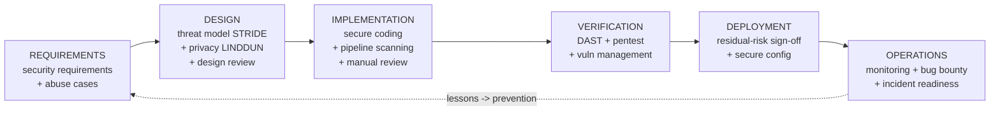
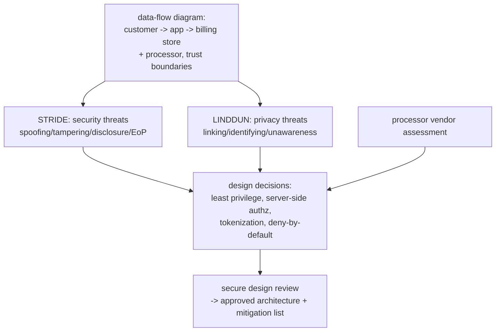
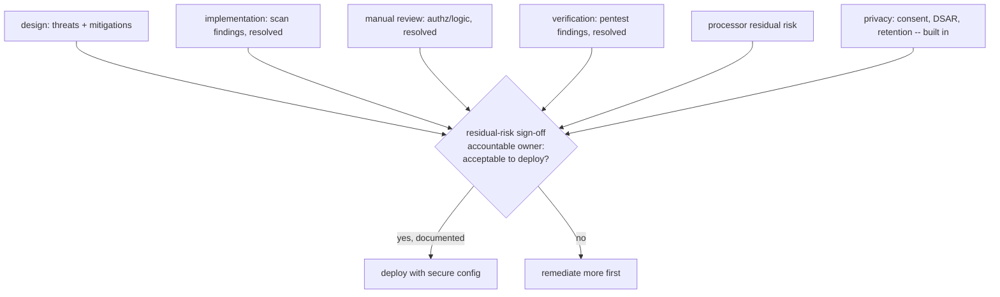
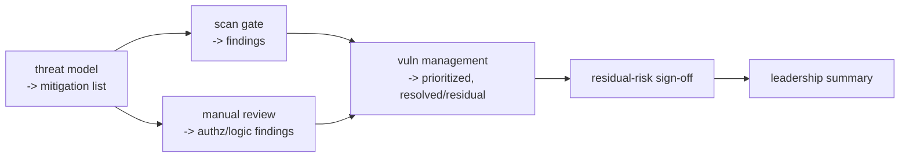

**Level:** Expert · **Track:** Product Security · **Read time:** 270 min

This is the last chapter of the Product Security Program notebook, the last chapter of the three-notebook product-security arc (45, 46, 47), and the capstone of everything the curriculum has built toward the defensive, build-it-right side of security. It introduces almost no new material — deliberately. Its purpose is *integration*: to take every discipline you have learned separately — threat modeling, secure coding, SAST/DAST/SCA, secrets and container and IaC scanning, manual code review, vulnerability management, bug bounty, third-party assessment, privacy engineering, and leadership communication — and show how they *compose* into a single, coherent, end-to-end engagement that follows one real feature from an idea on a whiteboard to running code in production and beyond.

The reason a capstone is necessary is that the disciplines were taught in isolation and *real work is never isolated*. In the previous chapters you threat-modeled a design in one lab, scanned code in another, reviewed authorization in a third, assessed a vendor in a fourth — each a self-contained skill. But a real product-security engagement is not a sequence of separate skills; it is a *flow* in which each discipline feeds the next: the threat model tells the code reviewer what to look for, the reviewer's findings feed vulnerability management, the vendor assessment shapes what the design can safely use, the privacy analysis drives what data the code may collect, and the whole thing culminates in a risk decision communicated to leadership. **The capstone skill is orchestrating the flow — knowing which discipline applies at which phase, how each feeds the others, and how the whole composes into a defensible product** — and that orchestration is what distinguishes a product security *engineer* from someone who can perform individual security tasks.

The chapter follows the **Secure Software Development Lifecycle (S-SDLC)** — the security-integrated version of the development lifecycle (Notebook 45 Chapter 2) — phase by phase, threading one scenario through all of it: a mid-sized company building a feature that handles both *payment data* and *personal data*, chosen because it touches essentially every control in the curriculum. At each phase, we apply the relevant discipline, show how it feeds the next, and build up — across the whole engagement — the connected artifacts a real engagement produces: the threat model, the scan gates, the review findings, the residual-risk sign-off, and the leadership summary. The final lab runs an abbreviated but *complete* version of this engagement, producing those artifacts as a connected whole. By the end, you will have seen the entire arc operate as one system, which is what the job actually is.

## Why This Matters

The gap between *knowing the disciplines* and *running an engagement* is real, and it is where junior product-security engineers struggle even when their individual skills are strong. Someone can be excellent at threat modeling and excellent at code review and still flounder on a real feature, because the job is not "do a threat model" and separately "do a code review" — it is knowing that the threat model's output *is the code review's input*, that the privacy analysis *constrains the design*, that the vendor assessment *gates what the architecture can use*, and that all of it *converges on a risk decision someone has to sign*. The integration — the flow, the feeding-forward, the convergence — is a distinct skill that only appears when the disciplines are composed, and it is precisely the skill a capstone exists to build. An engineer who has only ever practiced the disciplines in isolation has not yet practiced the actual job.

The composition also reveals something the isolated chapters cannot: that the disciplines are *mutually reinforcing*, and that gaps in one are covered by others. The threat model finds design flaws that no scanner can (Notebook 45 Chapter 3); SAST finds injection that manual review would be slow to sweep (Notebook 46 Chapter 3); manual review finds the authorization and logic bugs that no tool can (Notebook 46 Chapter 2); the pentest confirms real exploitability that static analysis only suspects (Notebook 46 Chapter 4); the bug bounty finds what all internal testing missed (Notebook 47 Chapter 3). No single discipline is sufficient — each has a blind spot another covers — and it is only in the *composition* that you get defense in depth across the whole lifecycle. Seeing this is what teaches the engineer *why* the program has all these parts and what would be lost by dropping any one — which is exactly the judgment a senior engineer needs when resources are scarce and something has to give.

And this capstone is, in a real sense, the *point* of the entire defensive arc. Notebooks 45, 46, and 47 built the parts; this chapter assembles them into the thing they were always for — shipping a product that is secure *by design, in implementation, in operation, and in its handling of the people whose data it holds*. The product security engineer who can run this engagement end to end — orchestrating the disciplines, closing the gaps, making the risk call, and communicating it — is doing the full job the whole arc was training for. This chapter is where the training becomes the work.

## Part 1: The Scenario and the S-SDLC Shape

**The scenario.** A mid-sized company (call it "MidCo," the fintech from Chapter 1's lab) is building a new feature: **a "saved payment methods" capability** that lets customers store a payment card and personal billing details for faster checkout, with the card tokenized through a payment processor and the billing details held by MidCo. This one feature is chosen because it touches *everything*:

- **Payment data** → PCI-DSS scope, tokenization, the never-store-CVV rule (Notebook 42 Chapter 6).
- **Personal data** → GDPR/CCPA, consent, data-subject rights, retention (Notebook 42 Chapter 6, Notebook 47 Chapter 5).
- **Authentication and authorization** → who can view/edit/delete whose saved methods (the BOLA risk, Notebook 46 Chapter 2).
- **A third-party processor** → vendor assessment, the tokenization integration (Notebook 47 Chapter 4).
- **New code, new dependencies, new infrastructure** → the full scanning stack (Notebook 46).
- **A new attack surface** → threat modeling, pentest, monitoring (Notebooks 45, 46, 47).

**The S-SDLC shape.** The engagement follows the secure software development lifecycle — the development lifecycle with security integrated at every phase rather than bolted on at the end (Notebook 45 Chapter 2, the shift-left thesis):



The phases and the disciplines each invokes:

- **Requirements** — security requirements and abuse cases (Part 2).
- **Design** — threat modeling (STRIDE), privacy threat modeling (LINDDUN), and secure design review (Part 3).
- **Implementation** — secure coding, the layered pipeline scanning, and manual secure code review (Part 4).
- **Verification** — dynamic testing and the pre-production pentest, feeding vulnerability management (Part 5).
- **Deployment** — the residual-risk sign-off and secure configuration (Part 6).
- **Operations** — monitoring, bug bounty, and incident readiness (Part 7).
- **Throughout** — privacy engineering, third-party/dependency security, and leadership communication thread across all phases (Parts covered in place).
- **The loop closes** — lessons feed back to prevention (Part 8).

The framing: **the S-SDLC integrates security into every phase of building the feature, and the engagement is the flow through those phases, each invoking the relevant discipline and feeding the next.** The rest of the chapter walks the phases, showing the composition. The scenario is the thread; the S-SDLC is the shape; the disciplines are what happens at each point.

## Part 2: Requirements — Security Requirements and Abuse Cases

Security starts at the *requirements* phase, before any design, because the cheapest place to add a security requirement is when the feature is still a description (Notebook 45 Chapter 2's shift-left). Two artifacts:

**Security requirements** — explicit, testable security *requirements* for the feature, alongside the functional ones. For the saved-payment feature: the card must be tokenized and never stored raw (PCI, Notebook 42 Chapter 6); the CVV must never be stored (PCI absolute rule); billing details are personal data requiring a lawful basis and consent (GDPR); a user may only view/edit/delete *their own* saved methods (authorization); saved data must have a retention policy and be included in DSAR/erasure (privacy, Notebook 47 Chapter 5); all access must be over TLS and authenticated. These are *requirements* — they go in the spec, they are testable, and they will become the acceptance criteria the verification phase checks against. Deriving them upfront (often from a checklist like OWASP ASVS, Notebook 45 Chapter 6, and the applicable regulations) is what makes security a *designed-in property* rather than a retrofitted patch.

**Abuse cases** — the security counterpart to use cases: *how could this feature be abused?* Where a use case says "a user saves a payment method for faster checkout," an abuse case says "an attacker enumerates saved-method IDs to read other users' billing data (BOLA)," "an attacker saves a method and manipulates the stored amount," "an attacker's script injects into the billing-name field (XSS/injection)," "a user requests deletion and the data persists in a backup or the warehouse." Abuse cases are *how you think like an attacker at the requirements phase* (the reviewer mindset of Notebook 46 Chapter 1, applied before code exists), and they directly seed the threat model (Part 3) and the test cases (Part 5). Writing them is cheap and catches whole classes of problem before a line is written.

The framing, and the feed-forward: **security requirements make the security properties explicit and testable from the start, and abuse cases make the attacker's perspective explicit at the requirements phase — and both feed directly into the threat model and the verification tests.** The requirements phase is where the engagement establishes *what secure means for this feature*, in testable terms, so every later phase has a target to build and check against. Skipping it means discovering the security requirements late, when they are expensive to add (Notebook 45's cost curve).

## Part 3: Design — Threat Modeling, Privacy Modeling, and Design Review

The design phase is where the feature's architecture is decided, and it is the highest-leverage security phase because a design flaw is far cheaper to fix on a whiteboard than in production (Notebook 45 Chapters 3–4). Three composed activities:

**Threat modeling with STRIDE (Notebook 45 Chapter 3).** Draw the *data-flow diagram* — the customer, the app, the billing-details store, the payment processor, the trust boundaries between them — and apply **STRIDE** (Spoofing, Tampering, Repudiation, Information disclosure, Denial of service, Elevation of privilege) to each element and flow. This surfaces the *design-level* threats: can the processor integration be spoofed? can the stored billing data be tampered with or disclosed? is there an elevation path from a normal user to another user's data (the BOLA abuse case, now a modeled threat)? Each threat gets a mitigation that shapes the design — and the abuse cases from Part 2 seed this analysis directly.

**Privacy threat modeling with LINDDUN (Notebook 47 Chapter 5).** On the *same* data-flow diagram, apply **LINDDUN** to find the *privacy* threats STRIDE misses: can the saved billing data be *linked* across purposes to profile the customer? is the customer *aware* of what is stored and why? is the retention compliant? This is where the privacy-by-design requirements (consent, minimization, retention, DSAR — Notebook 47 Chapter 5) get *designed in* — the feature is shaped so that only necessary data is collected, consent is captured, and erasure is possible, at design time when it is cheap.

**Secure design review (Notebook 45 Chapter 4).** The threats and mitigations converge into *architecture decisions* reviewed against secure-design principles (least privilege, defense in depth, secure defaults, complete mediation — Notebook 45 Chapter 6): the billing store gets least-privilege access; authorization is enforced server-side on every saved-method operation (deny by default — the BOLA mitigation); the processor integration uses tokenization so raw card data never enters MidCo's systems (shrinking PCI scope, Notebook 42 Chapter 6); data is minimized and given a retention policy. The design review also invokes the **third-party assessment** of the payment processor (Notebook 47 Chapter 4) — is the vendor's security posture adequate, is the tokenization integration sound, what does the DPA say — because the design *depends* on the vendor, so the vendor's assessment gates the design.



The framing, and the feed-forward: **the design phase composes STRIDE (security threats), LINDDUN (privacy threats), and the vendor assessment into reviewed architecture decisions and a mitigation list — and that mitigation list is the specification the implementation phase builds and the review phase checks.** Design is where the engagement does the most risk reduction per hour, because it shapes the feature to be secure *by construction* before code exists. The threat model's output (the mitigations) becomes the implementation's requirements and the reviewer's checklist — the clearest example of the feed-forward that makes the engagement a flow.

## Part 4: Implementation — Secure Coding, Pipeline Scanning, and Manual Review

The implementation phase is where the design becomes code, and security here is the composition of *building it right* (secure coding), *automated checking* (pipeline scanning), and *human checking* (manual review) — the three covering each other's blind spots.

**Secure coding (Notebook 45 Chapters 6–7).** The developers implement the mitigations from the design using the secure-coding principles and language-specific patterns: parameterized queries for the billing-data access (no injection), context-aware output encoding for the billing-name display (no XSS), server-side object-level authorization on every saved-method operation (the BOLA mitigation, in code — Notebook 46 Chapter 2), the CVV *never* stored, secrets loaded from a manager not hardcoded (Notebook 46 Chapter 6), and the consent check wired into the data path (Notebook 47 Chapter 5). The design's mitigation list is the implementation's checklist.

**Pipeline scanning (Notebook 46 Chapters 3–8).** As the code is committed, the layered pipeline scans it, with the gating discipline of Notebook 46 Chapter 7 (block on new, high-confidence, high-severity findings):

- **SAST** (Notebook 46 Chapter 3) sweeps for injection and the Family-1 bugs — the automatable tier.
- **SCA** (Notebook 46 Chapter 5) checks the new dependencies for known vulnerabilities and license issues, with reachability.
- **Secrets scanning** (Notebook 46 Chapter 6) blocks any credential committed — the pre-commit hook and CI gate.
- **Container and IaC scanning** (Notebook 46 Chapter 8) checks the feature's container image (minimal base, non-root) and its infrastructure (the billing store is encrypted, not public, least-privilege IAM).

**Manual secure code review (Notebook 46 Chapters 1–2).** The tools sweep the automatable tier; the human reviews what the tools *cannot* find — the **authorization and business logic** (Notebook 46 Chapter 2). The reviewer, *guided by the threat model's mitigation list*, checks the load-bearing questions: is the object-level authorization actually present on *every* saved-method endpoint (the negative-space check — is the tenth endpoint missing what the other nine have)? is there a race in the save-and-charge flow? is the CVV *truly* never stored (including in a log or an error payload — Notebook 46 Chapter 6)? This is the human-only tier, and the threat model tells the reviewer exactly where to concentrate.

The framing, and the composition: **implementation composes secure coding (build it right), pipeline scanning (automated check of the automatable tier), and manual review (human check of the authorization and logic tier tools miss) — each covering the others' blind spots, all guided by the design's mitigation list.** This is defense in depth *within the implementation phase*: the developer's secure coding is the first line, the scanners catch what slips through in the automatable classes, and the human catches the logic and authorization bugs no tool can — and the threat model directs all three at the right targets. No single one is sufficient; the composition is.

## Part 5: Verification — Dynamic Testing, Pentest, and Vulnerability Management

The verification phase confirms the *running* feature is secure, composing dynamic testing, a focused pentest, and the vulnerability management that handles whatever is found.

**Dynamic testing (Notebook 46 Chapter 4).** The feature deployed to staging is tested by **DAST** — attacking the running system to confirm the runtime and configuration are sound (security headers, TLS, no exposed debug endpoints) and to *demonstrate* (not just suspect) exploitability of any injection or access-control issue. The abuse cases from Part 2 and the threats from Part 3 become concrete *test cases* — the DAST scan and the manual dynamic testing specifically try the modeled attacks (enumerate saved-method IDs for BOLA, inject into the billing-name field), closing the loop from requirements-phase abuse case to verification-phase test.

**The pre-production pentest (Notebook 9, Notebook 47 Chapter 3).** A focused penetration test — internal or contracted — attacks the feature as a real adversary would, finding what automated testing missed: the creative chain, the business-logic flaw, the authorization gap that only appears when the whole system is assembled. For a payment-and-personal-data feature, this focused human testing before launch is warranted by the risk (the risk-based effort of Chapter 1). The pentest is the last thorough human check before the feature ships.

**Vulnerability management (Notebook 46 Chapter 9).** Everything found — by DAST, by the pentest, by the earlier scanning and review — flows into the vulnerability management machine: deduplicated, prioritized by *real risk* (reachability, KEV/EPSS, asset criticality — this is a payment feature, so the asset criticality is high), owned, and remediated with SLAs. The verification phase does not just *find*; it drives the *fixing*, and a finding is not closed until it is verified fixed (Notebook 46 Chapter 1's verify phase). The critical and high findings *must* be resolved before the deployment decision (Part 6); the accepted-risk findings are documented for the sign-off.

The framing, and the feed-forward: **verification composes dynamic testing and a focused pentest (confirming real exploitability of the running feature, driven by the abuse cases and threats from earlier phases) with vulnerability management (prioritizing and driving the fix of everything found) — and its output is the resolved-and-residual finding set that feeds the deployment decision.** Verification is where the earlier phases' hypothesized threats are *tested against reality*, and where the engagement converts "we designed and built it to be secure" into "we tested it and here is what we found and fixed." The residual — what is left after remediation — is exactly what the deployment sign-off must weigh.

## Part 6: Deployment — The Residual-Risk Sign-Off

The deployment phase is where the feature ships, and the security core of it is a *decision*: given everything the engagement found and fixed, **is the residual risk acceptable to deploy?** This is the convergence point — every prior phase feeds this one decision.

**Secure configuration.** Before the decision, the deployment itself is secured (the operational side of Notebook 46 Chapter 8): the production infrastructure matches the reviewed IaC (no drift — Notebook 46 Chapter 8), the billing store is encrypted with least-privilege access, the secrets are injected from the manager not the config, TLS is enforced, and the feature is deployed with secure defaults (Notebook 45 Chapter 6).

**The residual-risk sign-off.** The engagement has found and fixed a great deal; some risk *remains* (the accepted-risk findings from verification, the residual vendor risk from the processor assessment, the risks that could not be fully eliminated). The deployment decision is a *conscious, documented risk acceptance* (Notebook 46 Chapter 9's discipline, at the feature level): an accountable owner reviews the residual risk — what was found, what was fixed, what remains and why, and whether it is acceptable given the feature's business value and risk — and *signs off* (or does not). This is not a rubber stamp; it is the moment the organization consciously decides "this feature's residual risk is acceptable to run," with the reasoning documented. For a payment feature, this sign-off is weighty and the bar is high — critical and high findings must be resolved, and the residual must be genuinely acceptable.



The framing, and the convergence: **the deployment decision is the residual-risk sign-off — a conscious, documented, accountable acceptance of what remains after the whole engagement's find-and-fix, weighing the residual against the feature's value — and it is the point where every prior phase converges into one decision.** The threat model, the scans, the review, the pentest, the vendor assessment, and the privacy work all feed this sign-off; it is the engagement's *judgment* moment, and it is exactly the kind of risk decision the product security engineer orchestrates and the accountable owner makes. Deploying without it is deploying blind; deploying with it is deploying with the residual risk understood and owned.

## Part 7: Operations — Monitoring, Bug Bounty, and Incident Readiness

The engagement does not end at deployment; security *continues* in operations, because not everything can be caught before launch and the feature now faces real attackers. The **shift-right** half (Notebook 46 Chapter 7):

**Monitoring.** The running feature is monitored for security-relevant events — anomalous access to saved payment methods, authorization failures, unusual data-export patterns (the detection side, Notebook 32) — so that an attack or a missed vulnerability being exploited is *detected*. The privacy and payment sensitivity of the feature warrants close monitoring, and the monitoring is designed to catch the abuse cases (Part 2) that made it past the pre-launch controls.

**Bug bounty / VDP (Notebook 47 Chapter 3).** The feature, now in production, is within scope for the organization's disclosure program — external researchers may find what all the internal testing missed (the diversity-of-the-crowd value, Notebook 47 Chapter 3). This is the *last* line of finding, and it works precisely because the earlier phases built the vulnerability-management capacity to *handle* what the bounty surfaces (the readiness sequencing of Notebook 47 Chapter 3).

**Continuous security (Notebooks 46, 47).** The dependency scanning continues (new CVEs are disclosed against the feature's dependencies after launch — Notebook 46 Chapter 5's post-release monitoring); the SBOM is monitored; the vendor's posture is re-assessed on its tier's cadence (Notebook 47 Chapter 4); the privacy retention enforcer runs (Notebook 47 Chapter 5); and any new finding flows into vulnerability management exactly as before.

**Incident readiness (Notebook 33).** The feature handles payment and personal data, so an incident affecting it is a *regulated-data* incident with breach-notification clocks (Notebook 42 Chapter 6). The engagement ensures the incident response plan covers the feature — the data it holds is classified and mapped (so "was regulated data involved?" can be answered fast), the response runbook exists, and the team is ready. Being *ready* for the incident before it happens is the operations-phase discipline that turns a potential catastrophe into a managed event.

The framing: **operations is the shift-right continuation — monitoring to detect what got through, bug bounty to find what internal testing missed, continuous scanning and vendor re-assessment, and incident readiness for the regulated-data breach — because security does not end at deployment and the feature now faces real attackers.** The engagement's job in operations is to ensure the feature is *watched, tested, and ready* in production, closing the gap that no amount of pre-launch work can fully close. And the operations phase produces the signal — incidents, bounty findings, monitoring alerts — that feeds the retrospective and prevention (Part 8).

## Part 8: The Retrospective, Prevention, and Orchestration

Two final threads that make the engagement a *learning* system and clarify the engineer's actual role.

**The retrospective and feeding prevention (Notebook 46 Chapter 9's loop-closing, at the engagement level).** After the engagement, a retrospective asks: what did we find, at what phase, and could we have found it *earlier and cheaper*? The findings are analyzed for *classes* — if the BOLA authorization bug appeared here, it likely appears elsewhere, and the *root-cause* fix is not just patching this instance but preventing the class: a new SAST/manual-review checklist item, a secure-by-default authorization library (so the object-level check is automatic, not remembered — Notebook 45 Chapter 6), a champion-delivered training (Notebook 47 Chapter 2). The engagement's lessons feed *back* into the program's controls, so the next feature starts more secure — the crawl-walk-run maturation of Chapter 1, driven by real engagement data. This is how a security program *improves* rather than fixing the same classes forever: every engagement is an input to prevention.

**Orchestration, not performance — the engineer's actual role.** The most important meta-point of the capstone: across this entire engagement, the product security engineer did *not personally perform every step*. They did not write all the code (developers did), run every scan (the pipeline did), review every line (champions and the pipeline shared it), or conduct the pentest alone (a tester did). What the product security engineer *did* was **orchestrate**: ensure the threat model happened and its output fed the review, ensure the right scanning gated the pipeline, ensure the manual review focused where tools are blind, ensure the vendor was assessed, ensure the privacy requirements were built in, drive the vulnerability management, facilitate the residual-risk sign-off, and communicate the outcome to leadership. This is the shift from *doing* security to *building and running the system that produces it* (Chapter 1) — the engagement is orchestrated through *other people and automated systems*, and the engineer's skill is knowing *what* must happen at each phase, *how* each feeds the next, and *ensuring the whole composes* into a defensible product. The scaling of the whole program (champions, pipeline, bounty) is what makes this orchestration possible — the engineer conducts; the program plays.

The framing: **the engagement is a learning system (the retrospective feeds classes back to prevention, maturing the program) and an orchestrated one (the product security engineer conducts the disciplines through people and automation rather than performing each) — and this orchestration, feeding-forward, and feeding-back is the actual job the whole arc trained for.** The capstone's deepest lesson is that product security at scale is *conducting* the composition, not *playing* every instrument — and that every engagement both ships a secure feature and makes the next one easier.

## Part 9: Hands-On Lab — An Abbreviated Complete Engagement

### 9.1 What we are building

An abbreviated but *complete* engagement on the saved-payment feature, producing the connected artifacts a real engagement produces: the **threat model** (Part 3), the **pipeline scan gate** (Part 4), the **manual review findings** (Part 4), the **verification/vuln-management result** (Part 5), the **residual-risk sign-off** (Part 6), and the **leadership summary** (Notebook 47 Chapter 6) — as *one connected flow* where each feeds the next.



Python 3 only.

### 9.2 The threat model produces the mitigation list

```bash
mkdir -p ~/capstone-lab && cd ~/capstone-lab
python3 - <<'PY'
import json
# Part 3: STRIDE + LINDDUN on the saved-payment feature -> mitigations.
threats = [
 {"id":"T1","type":"STRIDE:Elevation","threat":"user reads another user's saved method (BOLA)",
  "mitigation":"server-side object-level authz on every endpoint, deny by default"},
 {"id":"T2","type":"STRIDE:Info-disclosure","threat":"CVV or raw card stored",
  "mitigation":"tokenize via processor; NEVER store CVV or raw PAN"},
 {"id":"T3","type":"STRIDE:Tampering","threat":"injection via billing-name field",
  "mitigation":"parameterized queries + context-aware output encoding"},
 {"id":"T4","type":"LINDDUN:Unawareness","threat":"data stored without consent/notice",
  "mitigation":"capture per-purpose consent; include in DSAR + retention"},
 {"id":"T5","type":"LINDDUN:Non-compliance","threat":"saved data not erasable",
  "mitigation":"erasure across store+warehouse+backups; retention enforced"},
]
json.dump(threats, open("mitigations.json","w"), indent=1)
print(f"threat model: {len(threats)} threats -> {len(threats)} mitigations (the impl checklist)")
for t in threats: print(f"  {t['id']} [{t['type']}] {t['threat']}")
PY

# Sample output:
# threat model: 5 threats -> 5 mitigations (the impl checklist)
#   T1 [STRIDE:Elevation] user reads another user's saved method (BOLA)
#   T2 [STRIDE:Info-disclosure] CVV or raw card stored
#   T3 [STRIDE:Tampering] injection via billing-name field
#   T4 [LINDDUN:Unawareness] data stored without consent/notice
#   T5 [LINDDUN:Non-compliance] saved data not erasable
```

The threat model's output — the mitigation list — is the *specification* the next phases build and check against (Part 3's feed-forward). Note it composes STRIDE (T1–T3) and LINDDUN (T4–T5).

### 9.3 Scanning and manual review check against the mitigations

```python
# verify_impl.py -- Part 4: does the implementation satisfy each mitigation?
import json
mitigations = json.load(open("mitigations.json"))

# Simulated results: pipeline scans (tools) + manual review (human) per mitigation.
results = {
 "T1": {"checked_by":"MANUAL REVIEW (tools can't)","status":"FINDING",
        "detail":"authz present on GET/PUT but MISSING on DELETE endpoint (BOLA)"},
 "T2": {"checked_by":"manual review + secrets/log scan","status":"FINDING",
        "detail":"CVV logged in a debug statement (never-store violation)"},
 "T3": {"checked_by":"SAST","status":"PASS","detail":"parameterized + encoded"},
 "T4": {"checked_by":"manual review","status":"PASS","detail":"consent check wired in"},
 "T5": {"checked_by":"manual review","status":"FINDING",
        "detail":"erasure deletes primary but NOT warehouse copy"},
}
print(f"{'MIT':<5}{'CHECKED BY':<32}{'STATUS':<9}DETAIL")
print("-"*90)
findings = []
for m in mitigations:
    r = results[m["id"]]
    print(f"{m['id']:<5}{r['checked_by']:<32}{r['status']:<9}{r['detail']}")
    if r["status"]=="FINDING":
        findings.append({"id":m["id"],"threat":m["threat"],"detail":r["detail"]})
json.dump(findings, open("findings.json","w"), indent=1)
print("-"*90)
print(f"{len(findings)} findings -> vulnerability management")
print("note: T1 (BOLA on DELETE) found by MANUAL REVIEW -- no scanner finds a missing check")
```

```bash
python3 verify_impl.py

# Sample output:
# MIT  CHECKED BY                      STATUS   DETAIL
# ------------------------------------------------------------------------------------------
# T1   MANUAL REVIEW (tools can't)     FINDING  authz present on GET/PUT but MISSING on DELETE endpoint (BOLA)
# T2   manual review + secrets/log scan FINDING  CVV logged in a debug statement (never-store violation)
# T3   SAST                            PASS     parameterized + encoded
# T4   manual review                   PASS     consent check wired in
# T5   manual review                   FINDING  erasure deletes primary but NOT warehouse copy
# ------------------------------------------------------------------------------------------
# 3 findings -> vulnerability management
# note: T1 (BOLA on DELETE) found by MANUAL REVIEW -- no scanner finds a missing check
```

The composition is visible: SAST cleared the injection mitigation (T3, its strength), while the **authorization gap (T1) and the erasure gap (T5) were caught by *manual review*** — the human-only tier (Notebook 46 Chapter 2) that no scanner finds, exactly as the capstone's Part 4 argues. Each finding traces back to a threat, and the threat model told the reviewer where to look.

### 9.4 Vulnerability management prioritizes; the sign-off weighs the residual

```python
# signoff.py -- Parts 5-6: prioritize findings, then the residual-risk decision.
import json
findings = json.load(open("findings.json"))

RISK = {"T1":("CRITICAL","payment BOLA -> other users' billing data; unauth'd, reachable"),
        "T2":("CRITICAL","CVV stored in logs -> PCI violation, must not ship"),
        "T5":("HIGH","erasure incomplete -> GDPR non-compliance")}
# Simulate remediation: criticals MUST be fixed before deploy (Part 6).
remediated = {"T1":True,"T2":True,"T5":True}

print("VERIFICATION -> VULNERABILITY MANAGEMENT")
print(f"  {'ID':<4}{'SEVERITY':<10}{'FIXED':<7}RISK")
print("  "+"-"*78)
residual = []
for f in findings:
    sev, desc = RISK[f["id"]]
    fixed = remediated[f["id"]]
    print(f"  {f['id']:<4}{sev:<10}{'YES' if fixed else 'NO':<7}{desc}")
    if not fixed and sev in ("CRITICAL","HIGH"):
        residual.append((f["id"],sev))
print("  "+"-"*78)

print("\nRESIDUAL-RISK SIGN-OFF (Part 6)")
if residual:
    print(f"  BLOCK deploy: {len(residual)} unresolved critical/high -> remediate first")
else:
    print("  all critical/high findings RESOLVED")
    print("  residual: low-severity items documented + accepted by feature owner")
    print("  DECISION: APPROVED to deploy -- residual risk acceptable, documented, owned")
```

```bash
python3 signoff.py

# Sample output:
# VERIFICATION -> VULNERABILITY MANAGEMENT
#   ID  SEVERITY  FIXED  RISK
#   ------------------------------------------------------------------------------
#   T1  CRITICAL  YES    payment BOLA -> other users' billing data; unauth'd, reachable
#   T2  CRITICAL  YES    CVV stored in logs -> PCI violation, must not ship
#   T5  HIGH      YES    erasure incomplete -> GDPR non-compliance
#   ------------------------------------------------------------------------------
#
# RESIDUAL-RISK SIGN-OFF (Part 6)
#   all critical/high findings RESOLVED
#   residual: low-severity items documented + accepted by feature owner
#   DECISION: APPROVED to deploy -- residual risk acceptable, documented, owned
```

The findings flow into vulnerability management (Part 5), are prioritized by *real risk* (the payment BOLA and the CVV-in-logs are criticals that *must not ship* — the asset criticality of a payment feature drives this), remediated, and then the **residual-risk sign-off** (Part 6) weighs what remains: with the criticals resolved, the feature owner consciously accepts the documented low residual and approves. Had a critical been unresolved, the gate would have *blocked* the deploy.

### 9.5 The leadership summary

```python
# leadership.py -- Notebook 47 Ch6: communicate the engagement's outcome.
print("""
SAVED-PAYMENT FEATURE -- SECURITY ENGAGEMENT SUMMARY (for leadership)
====================================================================

WHAT:   New feature handling payment + personal data went through a full
        secure-development-lifecycle engagement before launch.

RISK HANDLED:
   - designed to keep raw card data OUT of our systems (tokenized) -> minimal PCI scope
   - found + fixed 2 CRITICAL issues BEFORE launch (a cross-customer data-access
     flaw and a payment-data logging violation) -- neither reached production
   - built in consent, deletion, and retention -> GDPR/CCPA compliant by design

OUTCOME:
   - all critical/high issues resolved pre-launch; residual risk LOW, documented, owned
   - feature is monitored, in bug-bounty scope, and covered by incident response

TREND:  This engagement's authorization-bug class is being fixed at the ROOT
        (a secure-by-default authz library) so future features start safer.

DECISION: Approved for launch. Residual risk acceptable.
""")
```

```bash
python3 leadership.py | head -16

# Sample output:
# SAVED-PAYMENT FEATURE -- SECURITY ENGAGEMENT SUMMARY (for leadership)
# ====================================================================
#
# WHAT:   New feature handling payment + personal data went through a full
#         secure-development-lifecycle engagement before launch.
#
# RISK HANDLED:
#    - designed to keep raw card data OUT of our systems (tokenized) -> minimal PCI scope
#    - found + fixed 2 CRITICAL issues BEFORE launch (a cross-customer data-access
#      flaw and a payment-data logging violation) -- neither reached production
#    - built in consent, deletion, and retention -> GDPR/CCPA compliant by design
```

The engagement closes with the leadership communication of Notebook 47 Chapter 6: the outcome translated into *business* terms (risk handled, criticals caught *before* production, compliant by design), the trend (the root-cause fix that makes future features safer — Part 8's prevention loop), and the decision. No CVE ids, no tool names — the risk story, at the leadership altitude. The whole engagement, from threat model to leadership summary, is one connected flow.

### 9.6 Extending the lab

Extend the flow with the phases the abbreviated lab compressed: add the *requirements* phase producing the security requirements and abuse cases that seed the threat model (Part 2); add a real *DAST/pentest* step that demonstrates the BOLA before it is fixed (Part 5); add the *vendor assessment* of the payment processor gating the design (Parts 3, Notebook 47 Chapter 4); add the *retrospective* that turns the BOLA finding into a prevention item (Part 8); and produce the *board one-pager* (Notebook 47 Chapter 6) from the engagement outcome. The goal is to feel the *whole* S-SDLC as one connected system, which is the capstone's point.

## Part 10: Common Pitfalls of Integration

**Treating the disciplines as a checklist, not a flow.** The value is in the *feeding-forward* — the threat model's output is the review's input, the abuse cases become the test cases. Running each discipline in isolation without connecting them misses the point and the coverage.

**Skipping the early phases under time pressure.** The requirements and design phases are where security is cheapest (the shift-left cost curve), and they are the first cut when deadlines loom. Skipping them means finding the same issues far more expensively later, or not at all.

**Relying on one discipline to cover another's blind spot.** SAST does not find the authorization gap; the pentest does not find the unreachable design flaw; manual review does not scale the injection sweep. Each covers a different blind spot — dropping one leaves a gap nothing else fills. The BOLA-on-DELETE in the lab is exactly this: only manual review caught it.

**No residual-risk sign-off, or a rubber-stamp one.** Deploying without a conscious, documented, accountable decision on the residual risk is deploying blind. And a sign-off that always says "yes" regardless of findings is not a decision — it is theater. The criticals must actually gate the deploy.

**Stopping at deployment.** Security continues in operations — monitoring, bug bounty, continuous scanning, incident readiness. A feature secured to launch and then never watched is a feature exposed to everything disclosed or attacked after launch.

**Not closing the loop to prevention.** Fixing this engagement's findings without asking "what *class* is this, and how do we prevent it?" means fixing the same classes on every future feature forever. The retrospective feeding prevention is what makes the program *improve*.

**The engineer trying to perform every step.** At scale, the product security engineer *orchestrates* — through developers, champions, the pipeline, testers — rather than personally performing each discipline. An engineer who tries to do it all is the bottleneck the program was built to avoid (Chapter 1's ratio problem).

**Forgetting privacy as a first-class thread.** For a data-handling feature, privacy (consent, DSAR, retention, minimization) is not an add-on — it is designed in at the design phase (LINDDUN) and built in at implementation, or it is an expensive retrofit and a compliance risk (Notebook 47 Chapter 5).

**Not communicating the outcome to leadership.** An engagement whose value is never translated to the people who fund the program is an engagement that does not build the program's standing. The leadership summary is part of the engagement, not an afterthought (Notebook 47 Chapter 6).

## Final Revision / Summary

- The capstone is **integration, not new material**: it composes every prior discipline — threat modeling, secure coding, SAST/DAST/SCA, secrets/container/IaC scanning, manual review, vulnerability management, bug bounty, third-party assessment, privacy engineering, leadership communication — into one **end-to-end engagement** following a feature from idea to production and beyond. **The capstone skill is orchestrating the flow.**
- Real work is never isolated. The disciplines **feed forward** (the threat model's mitigations are the implementation's spec and the review's checklist; the abuse cases become the test cases; the vendor assessment gates the design) and are **mutually reinforcing** (each covers another's blind spot — no single discipline is sufficient, and the composition is defense in depth across the lifecycle).
- The **S-SDLC phases**: **Requirements** (security requirements + abuse cases — establish what secure means, testably) → **Design** (STRIDE security threat model + LINDDUN privacy threat model + secure design review + vendor assessment → a mitigation list, the highest-leverage phase) → **Implementation** (secure coding + pipeline scanning + manual review, each covering the others' blind spots, guided by the mitigations) → **Verification** (DAST + focused pentest confirming real exploitability + vulnerability management driving the fix) → **Deployment** (secure config + the **residual-risk sign-off**) → **Operations** (monitoring + bug bounty + continuous scanning + incident readiness) → and the **loop closes** (retrospective feeds classes back to prevention).
- **The residual-risk sign-off is the convergence point** — every prior phase feeds one conscious, documented, accountable decision: given what was found and fixed, is the residual risk acceptable to deploy? For a high-risk feature the criticals must be resolved and the bar is high; deploying without the sign-off is deploying blind.
- **Operations is the shift-right continuation** — security does not end at deployment; the feature now faces real attackers, so it is monitored (detect what got through), in bug-bounty scope (find what internal testing missed), continuously scanned and its vendor re-assessed, and covered by incident readiness (a regulated-data feature has breach clocks). The pre-launch work cannot close this gap fully; operations does.
- **Privacy is a first-class thread**, not an add-on: designed in at the design phase (LINDDUN, consent, minimization, retention, DSAR) and built in at implementation — or it is an expensive retrofit and a compliance risk.
- **The engagement is a learning system**: the retrospective analyzes findings for *classes* and feeds **root-cause prevention** (a new checklist item, a secure-by-default library, a champion-delivered training) back into the program, so every engagement makes the next feature start more secure — the program maturing on real data.
- **The engineer orchestrates, not performs**: across the whole engagement the product security engineer ensures each discipline happens, feeds the next, and composes into a defensible product — conducting through developers, champions, the pipeline, and testers rather than personally doing each step. This is the shift from *doing* security to *running the system that produces it* (Chapter 1), and it is the actual job the whole arc trained for. **Product security at scale is conducting the composition, and every engagement both ships a secure feature and makes the next one easier.**

## Cheat Sheet / Quick Reference — The Whole Arc

**The engagement is a FLOW, not a checklist**

```
each discipline FEEDS the next; each covers another's BLIND SPOT
threat model -> review checklist | abuse cases -> test cases | vendor -> gates design
no single discipline is sufficient; the COMPOSITION is defense in depth
```

**S-SDLC phases -> disciplines**

```
REQUIREMENTS:   security requirements + ABUSE CASES (what secure means, testably)
DESIGN:         STRIDE (security) + LINDDUN (privacy) + design review + vendor assess
                -> MITIGATION LIST (the spec for everything downstream) [highest leverage]
IMPLEMENTATION: secure coding + pipeline scan (SAST/SCA/secrets/IaC) + MANUAL REVIEW
                (each covers the others' blind spots; tools can't find authz/logic)
VERIFICATION:   DAST + pentest (real exploitability) + vuln management (prioritize + fix)
DEPLOYMENT:     secure config + RESIDUAL-RISK SIGN-OFF (the convergence decision)
OPERATIONS:     monitoring + bug bounty + continuous scan + INCIDENT READINESS
LOOP:           retrospective -> ROOT-CAUSE prevention -> next feature starts safer
```

**Who finds what (the blind-spot map)**

```
threat model -> DESIGN flaws (no scanner finds these)
SAST         -> injection / Family 1 (automatable)
manual review-> AUTHORIZATION + BUSINESS LOGIC (no tool finds a MISSING check)
SCA          -> vulnerable dependencies         secrets scan -> leaked credentials
DAST/pentest -> real exploitability of the running system
bug bounty   -> what ALL internal testing missed
```

**The residual-risk sign-off (convergence)**

```
every phase feeds ONE decision: is the residual risk acceptable to deploy?
conscious + documented + accountable owner | criticals MUST be resolved first
not a rubber stamp; deploying without it = deploying blind
```

**Privacy thread (data-handling features)**

```
DESIGN: LINDDUN + consent + minimization + retention + DSAR -- built in
IMPL:   consent check wired in, erasure across ALL stores, never store CVV
not an add-on -- retrofit = expensive + compliance risk
```

**The engineer's role**

```
ORCHESTRATE, don't perform: ensure each discipline happens, feeds the next, composes
conduct through developers + champions + pipeline + testers
= running the SYSTEM that produces security (not doing every step)
every engagement ships a secure feature AND makes the next one easier
```

**Communicate the outcome (Notebook 47 Ch6)**

```
translate to business: risk handled | criticals caught BEFORE prod | compliant by design
trend: root-cause fix makes future features safer | the decision
leadership altitude -- no CVEs, no tool names
```

## Practice Labs & Resources

**Frameworks tying the arc together**
- **OWASP SAMM** (Notebook 47 Chapter 1) — maps the whole S-SDLC's practices; use it to see where each phase's discipline fits.
- **NIST SSDF (SP 800-218)** — the Secure Software Development Framework; the government-recognized articulation of the S-SDLC this chapter walks.
- **Microsoft SDL** and **BSIMM** — the canonical secure-development lifecycle and the descriptive maturity model.

**Hands-on**
- Extend the lab into a *full* engagement: add the requirements/abuse-case phase, a real DAST/pentest step demonstrating the BOLA, the vendor assessment gating the design, the retrospective feeding prevention, and the board one-pager.
- Run a real (or realistic) engagement on a feature you know end to end, producing all the connected artifacts — threat model, scan gate, review findings, sign-off, leadership summary — and feel the feed-forward.
- Take any feature and, for each S-SDLC phase, name the discipline that applies, its output, and how it feeds the next phase.

**Deliberate practice**
- For a feature, write the mitigation list from a STRIDE+LINDDUN pass and then trace each mitigation through implementation, review, and verification — the feed-forward in practice.
- Practice the residual-risk sign-off: given a set of findings (some fixed, some not), make and document the deploy/no-deploy decision as an accountable owner would.
- Practice the orchestration view: for each discipline in an engagement, ask "who actually performs this, and what is *my* role in ensuring it happens and feeds the next?"

**Further reading — the whole arc**
- **Notebook 45** (secure design and coding — the requirements, design, and implementation disciplines), **Notebook 46** (the scanning, review, and vulnerability-management disciplines), and **Notebook 47 Chapters 1–6** (the program, champions, bounty, vendor, privacy, and communication disciplines) — this capstone composes them all.
- **Notebook 42** (GRC and architecture — the risk, compliance, and zero-trust foundations this engagement rests on) and **Notebook 9** (the pentest the verification phase invokes).
- The secure-development-lifecycle literature (Microsoft SDL, NIST SSDF, OWASP SAMM) and the practice of running real engagements — which, more than any reading, is how the orchestration skill is built.

---

*Also on [Praneeth's portfolio](https://ping-praneeth.vercel.app/notebook/product-security-program/07-product-security-capstone-full-s-sdlc-engagement-from-design-to-deployment), with comments and the latest edits.*
