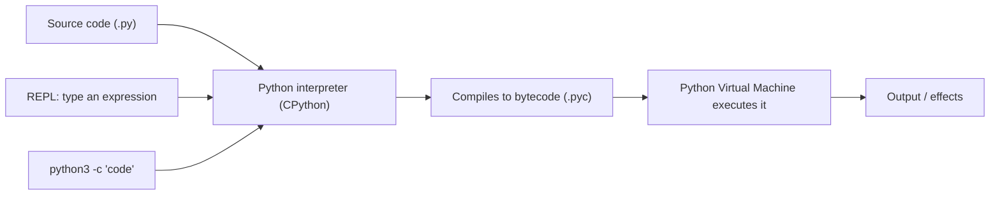
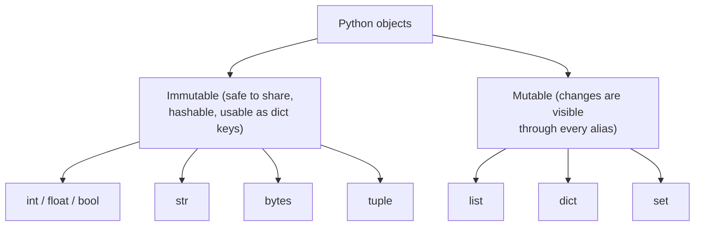
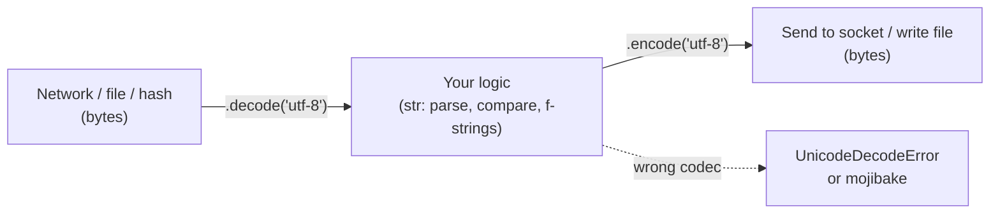
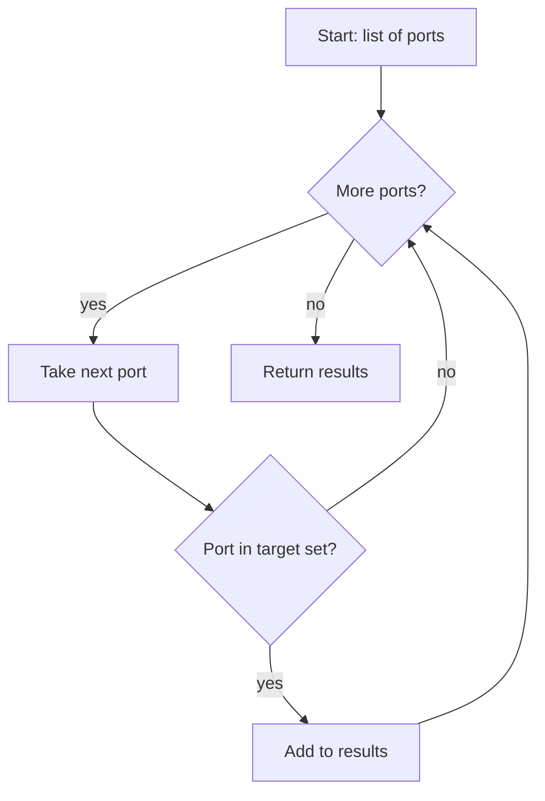

This is Chapter 1 of the Programming for Security series — Notebook 5. The Active
Directory notebook you just finished was full of tools — Impacket, `GetUserSPNs.py`,
`ticketer.py`, BloodHound collectors — and nearly all of them are written in **Python**.
This notebook teaches you to read, modify, and write that kind of tooling yourself.
Python is the lingua franca of offensive security, incident response, and automation:
it's readable, batteries-included, cross-platform, and has libraries for every protocol
and file format you'll meet.

This first chapter assumes **no programming experience at all**. We start at "what is a
variable" and finish with you writing loops that iterate over a list of hosts and make
decisions — the shape of a real scanner. Every concept is anchored to a small security
example so the syntax sticks to something concrete rather than floating in the abstract.
Later chapters add functions, files, modules, the `requests` HTTP library, then sockets
and Scapy for building actual tools — so this chapter's job is to make the fundamentals
rock-solid.

## Who This Chapter Is For (and the Map Ahead)

You need a computer where you can install software and a terminal (the Linux notebook's
shell chapters are ideal background but not required). No prior code. If you *have*
programmed before, skim Parts 1–3 and slow down at Part 5 (strings/bytes) and Part 8
(the security mini-projects), which are where security work diverges from generic
tutorials.

The path:

- **Part 1** — installing Python, the REPL, and running your first script.
- **Part 2** — variables, objects, and Python's dynamic typing.
- **Part 3** — numbers and booleans, operators, and expressions.
- **Part 4** — the container types: list, tuple, set, dict — when to use each.
- **Part 5** — **strings and bytes** in depth (the single most important part for
  security: encodings, hex, base64, and why `str` ≠ `bytes`).
- **Part 6** — control flow: `if`/`elif`/`else`, truthiness, comparison.
- **Part 7** — loops: `for`, `while`, `range`, comprehensions, and iteration patterns.
- **Part 8** — hands-on lab: several tiny security tools using only what's above.
- **Part 9** — common beginner pitfalls (indentation, mutability, `is` vs `==`).
- **Part 10** — a note on writing safe, lawful tooling.
- **Parts 11–13** — Final Revision, Cheat Sheet, Practice.

## Part 1: Installing Python and Running Code

Python comes in two era-defining versions; **Python 3** is the only one you should use
(Python 2 reached end-of-life in 2020 and its `str`/`unicode` model is a security
footgun). Aim for 3.10+.

Check what you have, and install if needed:

```bash
python3 --version        # -> Python 3.11.6 (or similar)
# Debian/Ubuntu/Kali:
sudo apt update && sudo apt install -y python3 python3-pip python3-venv
# macOS (Homebrew):
brew install python
# Windows: install from python.org and TICK "Add python.exe to PATH"
```

There are three ways to run Python, and you'll use all three:

**1. The REPL (interactive shell)** — type `python3` and you get a `>>>` prompt that
evaluates expressions immediately. Perfect for testing a snippet:

```python
$ python3
>>> 2 + 2
4
>>> "id".upper()
'ID'
>>> exit()
```

**2. A script file** — put code in `tool.py` and run it:

```bash
echo 'print("hello from a script")' > tool.py
python3 tool.py          # -> hello from a script
```

**3. `python3 -c`** — run a one-liner inline (handy in shell pipelines and, yes, in
payloads):

```bash
python3 -c 'print("one liner")'
```

The very first thing to know about Python's syntax: **it has no braces and no
semicolons**. Blocks are defined by **indentation** (4 spaces by convention). A colon
`:` starts a block; the indented lines beneath it are the block's body. Get indentation
wrong and the program won't run — this is Python's most famous feature and its most
common beginner error (Part 9).

```python
if 5 > 3:
    print("this line is inside the if-block")   # 4-space indent
    print("so is this")
print("this line is outside")                   # back to column 0
```

Comments start with `#`. A `print(...)` call writes to standard output. That's enough to
start.



Python is *interpreted*: you don't compile to a native binary the way C does. The
interpreter reads your source, compiles it to portable **bytecode**, and runs that on the
Python Virtual Machine — which is why the same `.py` runs on Linux, macOS, and Windows
unchanged. For a tool author that portability is a gift: an Impacket script written on
Kali runs on a Windows box with Python installed, no recompile.

## Part 2: Variables, Objects, and Dynamic Typing

A **variable** is a name bound to a value. You create one just by assigning:

```python
target = "10.10.10.5"     # a string
port = 445                # an integer
is_open = True            # a boolean
```

Python is **dynamically typed**: you don't declare a type, and a name can be rebound to a
different type later (`port = "445"` is legal, though usually a bad idea). Every value is
an **object** with a type you can inspect:

```python
>>> type(target)
<class 'str'>
>>> type(port)
<class 'int'>
```

Two properties matter for correctness:

- **Names are references to objects, not boxes holding values.** `a = b` makes `a` point
  at the same object as `b`. For *immutable* objects (int, str, tuple) this never bites
  you; for *mutable* ones (list, dict) it's a classic bug (Part 9).
- **Naming convention:** `lower_snake_case` for variables and functions,
  `UPPER_SNAKE_CASE` for constants, `CamelCase` for classes (later chapter).

Assignment tricks you'll use constantly:

```python
ip, port = "10.10.10.5", 445        # multiple assignment
a = b = 0                            # chain
host, *rest = ["dc01", "web", "db"] # star-unpacking: host="dc01", rest=["web","db"]
```

### The mutable / immutable divide — a picture

Whether a type can be changed in place (**mutable**) or not (**immutable**) governs the
aliasing bugs in Part 9 and which types can be dict keys or set members (only immutable
ones can). Keep this map in your head:



The practical rule: if two names point at the same **mutable** object, mutating through
one is visible through the other. `a = [1,2]; b = a; b.append(3)` leaves `a == [1,2,3]`.
With **immutable** objects there is no in-place change to leak, so aliasing is harmless:
`x = "hi"; y = x; y += "!"` rebinds `y` to a *new* string and leaves `x == "hi"`. This is
also why a `list` can't be a dict key (it could change and break the mapping) but a
`tuple` can.

## Part 3: Numbers, Booleans, and Operators

**Integers** in Python are arbitrary-precision (no overflow — important for crypto math):

```python
>>> 2 ** 256                # exponentiation; a 78-digit number, no overflow
115792089237316195423570985008687907853269984665640564039457584007913129639936
```

Core numeric and comparison operators:

| Operator | Meaning | Example |
|----------|---------|---------|
| `+ - * /` | add, sub, mul, **float** divide | `7 / 2 == 3.5` |
| `//` | floor (integer) divide | `7 // 2 == 3` |
| `%` | modulo (remainder) | `1234 % 256 == 210` |
| `**` | power | `2 ** 10 == 1024` |
| `== !=` | equal / not equal | `port == 445` |
| `< <= > >=` | ordering | `code < 400` |
| `and or not` | boolean logic | `is_open and not filtered` |
| `& \| ^ ~ << >>` | bitwise and/or/xor/not/shift | `flags & 0x400000` |

The **bitwise** operators are not academic in security — recall Chapter 3 of the AD
notebook tested a `userAccountControl` bit with a bitwise AND. In Python:

```python
UAC = 0x410200
DONT_REQ_PREAUTH = 0x400000
if UAC & DONT_REQ_PREAUTH:
    print("AS-REP roastable!")     # the & isolates that one bit
```

**XOR (`^`)** is the workhorse of simple crypto and CTF challenges:

```python
>>> 0x41 ^ 0x13        # XOR two bytes
82
>>> chr(0x41 ^ 0x13 ^ 0x13)   # XOR twice with the same key returns the original
'A'
```

**Booleans** are `True`/`False` (capitalized). Comparisons produce them, and `and`/`or`
short-circuit (stop as soon as the result is known) — useful and occasionally a source of
subtle bugs.

### Number formatting for security — IPs, ports, and bytes

A recurring need is converting between how humans write a value and how the wire stores
it. An IPv4 address is really a single 32-bit integer; ports fit in 16 bits; a byte is
0–255. Core operators handle all of it:

```python
# Dotted IPv4 <-> 32-bit integer, by hand (the stdlib has ipaddress, but see the math)
octets = "10.10.10.5".split(".")
n = 0
for o in octets:
    n = (n << 8) | int(o)        # shift left 8 bits, OR in the next octet
print(n)                         # -> 168430085

# ...and back
print(".".join(str((n >> shift) & 0xFF) for shift in (24, 16, 8, 0)))
# -> 10.10.10.5
```

The `<< 8` (shift left one byte) and `& 0xFF` (mask the low 8 bits) are the same bitwise
tools you used for the AD `userAccountControl` flag — here they pack and unpack an
address. Formatting for display uses format specs:

```python
port = 445
f"{port:>5}"     # ->  '  445'   (right-align, width 5)
f"{port:#06x}"   # -> '0x01bd'   (hex, zero-padded to 6 incl. 0x)
f"{255:08b}"     # -> '11111111' (binary, 8 wide)
```

Seeing that an IP "is just a number" pays off later: subnet math, CIDR ranges, and
generating a sweep of a `/24` all reduce to integer arithmetic over that 32-bit value.

## Part 4: Container Types — List, Tuple, Set, Dict

Real tools juggle collections of things: ports to scan, hosts found, headers parsed.
Python's four core containers each have a job.

**List** — an *ordered, mutable* sequence. Your default collection.

```python
ports = [21, 22, 80, 443, 445]
ports.append(3389)          # add to end
ports[0]                    # -> 21   (index from 0)
ports[-1]                   # -> 3389 (negative = from the end)
ports[1:3]                  # -> [22, 80]  (a "slice": start:stop, stop excluded)
len(ports)                  # -> 6
3389 in ports               # -> True (membership test)
```

**Tuple** — an *ordered, immutable* sequence. Use for fixed groupings (like an
`(ip, port)` pair) and as dict keys:

```python
endpoint = ("10.10.10.5", 445)      # can't be changed after creation
ip, port = endpoint                 # unpack it
```

**Set** — an *unordered* collection of *unique* items. Perfect for deduplicating and for
fast membership tests:

```python
seen = set()
seen.add("10.10.10.5")
seen.add("10.10.10.5")     # duplicate ignored
len(seen)                  # -> 1
open_ports = {22, 80, 443}
closed = {80, 8080}
open_ports & closed        # -> {80}  (intersection); also | union, - difference
```

**Dict** — *key → value* mappings, the most useful structure in security scripting
(think: host → list of open ports, or a parsed JSON response):

```python
host = {"ip": "10.10.10.5", "os": "Windows", "ports": [445, 3389]}
host["ip"]                 # -> "10.10.10.5"
host["hostname"] = "DC01"  # add a key
host.get("domain", "n/a")  # -> "n/a"  (safe lookup with default; no KeyError)
for key, value in host.items():
    print(key, "=", value)
```

| Type | Ordered | Mutable | Unique | Literal | Typical use |
|------|---------|---------|--------|---------|-------------|
| list | yes | yes | no | `[ ]` | growing sequence of results |
| tuple | yes | no | no | `( )` | fixed record / dict key |
| set | no | yes | yes | `{ }` | dedupe, fast membership |
| dict | yes* | yes | keys | `{k:v}` | mappings, parsed data (*insertion order since 3.7) |

## Part 5: Strings and Bytes — the Most Important Part for Security

Here is where security programming diverges hardest from generic tutorials, and where
beginners lose hours: **`str` and `bytes` are different types and do not mix.** Sockets,
crypto, hashing, and file I/O all operate on **bytes**; humans read **text (`str`)**. You
must convert deliberately.

A **`str`** is a sequence of Unicode *characters*. A **`bytes`** is a sequence of raw
8-bit *values* (0–255). You convert between them with an **encoding** (usually UTF-8):

```python
text = "admin"                 # str
raw  = text.encode("utf-8")    # -> b'admin'   (bytes; note the b'' prefix)
back = raw.decode("utf-8")     # -> 'admin'    (str again)
```

Try to concatenate them and Python refuses — a good thing, because it prevents whole
classes of bugs:

```python
>>> b"user=" + "admin"
TypeError: can't concat str to bytes
```

Security work leans on a handful of string/bytes skills:

**Slicing and searching** (same as lists, since strings are sequences):

```python
banner = "HTTP/1.1 200 OK"
banner[:8]                 # -> 'HTTP/1.1'
banner.split()             # -> ['HTTP/1.1', '200', 'OK']
"200" in banner            # -> True
banner.startswith("HTTP")  # -> True
```

**f-strings** — the modern way to build strings from variables (learn this, use it
everywhere):

```python
ip, port = "10.10.10.5", 445
msg = f"[+] {ip}:{port} is open"     # -> '[+] 10.10.10.5:445 is open'
f"{255:08b}"                          # -> '11111111'  (format spec: binary, 8 wide)
f"{65:#x}"                            # -> '0x41'       (hex with prefix)
```

**Hex and base64** — the two encodings you meet constantly (hashes, tokens, payloads):

```python
data = b"admin"
data.hex()                            # -> '61646d696e'
bytes.fromhex("61646d696e")           # -> b'admin'

import base64
base64.b64encode(b"user:pass")        # -> b'dXNlcjpwYXNz'  (HTTP Basic auth!)
base64.b64decode(b"dXNlcjpwYXNz")     # -> b'user:pass'
```

That base64 example *is* how HTTP Basic authentication headers are built — you just wrote
the core of a credential encoder. Understanding that a token is "just base64 of these
bytes" demystifies half of web-app and API security.

**Common string methods** you'll reach for:

| Method | Does | Example |
|--------|------|---------|
| `.strip()` | trim whitespace/newlines | `line.strip()` |
| `.split(sep)` | break into a list | `"a,b,c".split(",")` |
| `.join(list)` | glue a list with a separator | `",".join(["a","b"])` |
| `.replace(a,b)` | substitute | `s.replace("\r","")` |
| `.lower()/.upper()` | case-fold | `header.lower()` |
| `.startswith()/.endswith()` | prefix/suffix test | `f.endswith(".mdx")` |
| `.encode()/.decode()` | str↔bytes | `s.encode()` |

### A mental model for the str/bytes boundary

Every place your program touches the outside world — a socket, a file opened in binary
mode, a hash function, a crypto key — speaks **bytes**. Your code and your screen speak
**text**. Picture a program as a text-speaking core wrapped in a bytes-speaking shell,
with `encode`/`decode` at the boundary:



Choosing the codec matters. Common ones:

| Encoding | Use | Note |
|----------|-----|------|
| `utf-8` | default for almost everything | variable width; ASCII is a subset |
| `ascii` | strict 7-bit | errors on any byte > 127 — good for validation |
| `latin-1` | maps bytes 0–255 1:1 to chars | never errors; handy to "see" raw bytes as text |
| `utf-16-le` | Windows/AD internals | NT-hash input is `utf-16-le` of the password |

When a decode might hit invalid bytes (network data often does), pass an `errors=`
strategy instead of crashing:

```python
raw = b"\xff\xfeadmin"
raw.decode("utf-8", errors="replace")   # -> '��admin' (bad bytes -> U+FFFD)
raw.decode("latin-1")                    # -> 'ÿþadmin' (every byte becomes a char)
```

That `utf-16-le` row is not trivia: the AD notebook said the NT hash is
`MD4(UTF-16LE(password))`. In Python that's literally:

```python
import hashlib
nt_hash = hashlib.new("md4", "Passw0rd!".encode("utf-16-le")).hexdigest()
# -> the same NT hash format you saw in Kerberos/Overpass-the-Hash
```

You just reproduced the key-derivation from the Kerberos chapter in three lines — a
concrete payoff of understanding encodings.

## Part 6: Control Flow — Making Decisions

`if` / `elif` / `else` choose a branch based on a condition. The condition is any
expression evaluated for **truthiness**:

```python
status = 403
if status == 200:
    print("[+] OK")
elif status in (301, 302):
    print("[*] Redirect")
elif status == 403:
    print("[-] Forbidden (but it exists!)")
else:
    print(f"[?] Unexpected: {status}")
```

**Truthiness** — Python treats many values as `False` in a boolean context without an
explicit comparison. Memorise the "falsy" set: `False`, `None`, `0`, `0.0`, `""` (empty
string), `[]`/`{}`/`set()`/`()` (empty containers). *Everything else is truthy.* This
lets you write:

```python
results = []
if not results:                 # empty list is falsy
    print("no results found")

password = input("pw: ")
if password:                    # non-empty string is truthy
    print("got a password")
```

Combine conditions with `and`, `or`, `not`, and compare with `==`, `!=`, `<`, etc.
Python even allows **chained comparisons** that read like math:

```python
if 200 <= status < 300:
    print("2xx success range")
```

## Part 7: Loops — Doing Things Repeatedly

**`for`** iterates over any sequence — the backbone of every scanner:

```python
ports = [22, 80, 443, 445, 3389]
for port in ports:
    print(f"scanning port {port}")
```

**`range`** generates numeric sequences (great for port ranges):

```python
for port in range(1, 1025):     # 1..1024 (stop is exclusive)
    pass                        # 'pass' = do nothing (placeholder)
range(0, 256, 2)                # start, stop, step -> 0,2,4,...,254
```

**`while`** loops until a condition goes false (retry logic, reading until EOF):

```python
attempts = 0
while attempts < 3:
    attempts += 1
    print(f"attempt {attempts}")
```

**`break`** exits a loop early; **`continue`** skips to the next iteration:

```python
for host in hosts:
    if host.startswith("#"):
        continue                # skip comment lines
    if host == "STOP":
        break                   # abort the loop entirely
    print(host)
```

**`enumerate`** gives you index + value; **`zip`** walks two lists in parallel:

```python
for i, host in enumerate(hosts, start=1):
    print(f"{i}. {host}")

for host, ip in zip(hostnames, ip_addresses):
    print(f"{host} -> {ip}")
```

**Comprehensions** — a compact way to build a list/set/dict from a loop. Once it clicks,
you'll write scanners in one line:

```python
squares = [n*n for n in range(10)]                    # list comprehension
open_only = [p for p in ports if p in {22,80,443}]    # with a filter
host_map  = {h: None for h in hosts}                  # dict comprehension
uniq_tlds = {d.split(".")[-1] for d in domains}       # set comprehension
```



### Putting strings to work — parsing an HTTP response by hand

Before you have the `requests` library (next chapter), you can already dissect a raw
HTTP response with nothing but the string methods from this part. This is worth doing
once by hand because it demystifies what libraries do for you:

```python
response = (
    "HTTP/1.1 200 OK\r\n"
    "Server: nginx/1.24.0\r\n"
    "Content-Type: text/html\r\n"
    "Set-Cookie: session=abc123; HttpOnly\r\n"
    "\r\n"
    "<html>...</html>"
)

# 1) Split headers from body on the blank line
head, _, body = response.partition("\r\n\r\n")

# 2) First line is the status line
lines = head.split("\r\n")
version, status_code, *reason = lines[0].split()
print(f"status: {status_code} ({' '.join(reason)})")   # status: 200 (OK)

# 3) Remaining lines are "Header: value" -> build a dict
headers = {}
for line in lines[1:]:
    name, _, value = line.partition(": ")
    headers[name.lower()] = value

print("server:", headers.get("server"))           # server: nginx/1.24.0
print("has HttpOnly cookie:", "httponly" in headers.get("set-cookie","").lower())
```

```
status: 200 (OK)
server: nginx/1.24.0
has HttpOnly cookie: True
```

Look at what this touches: `.partition()` (split on first occurrence, always returns
three parts), `.split()` (whitespace and custom separators), star-unpacking
(`version, status_code, *reason`), a dict built in a loop, `.lower()` for
case-insensitive header matching, and `.get(..., default)` to avoid `KeyError`. A real
security check falls right out of it — detecting a missing `HttpOnly` flag on a session
cookie is a common web-app finding, and you just wrote the detector with core syntax
alone.

### A retry loop — the shape of resilient tooling

Network tools fail transiently; the `while` + counter pattern is how you retry without
giving up or looping forever:

```python
max_attempts = 3
attempt = 0
success = False
while attempt < max_attempts and not success:
    attempt += 1
    print(f"[*] attempt {attempt}/{max_attempts}")
    # (next chapter: an actual socket/HTTP call goes here)
    success = (attempt == 2)      # pretend it works on the 2nd try
if success:
    print("[+] connected")
else:
    print("[-] gave up after retries")
```

The two-part condition (`attempt < max_attempts and not success`) is a compound boolean
from Part 6; `success` acts as a **flag variable**. This exact skeleton wraps almost
every real network operation you'll write.

## Part 8: Hands-On Lab — A Handful of Tiny Tools

Everything below uses *only* what's in Parts 1–7 (plus the standard-library modules noted
— we cover imports properly next chapter, but a peek is fine). Save each as a `.py` file
and run with `python3`. Lab/authorized targets only.

### 8.1 A port-list "is it interesting?" classifier

```python
# classify.py — label a list of open ports by risk
open_ports = [21, 22, 80, 445, 3389, 8080]

risky = {23: "telnet", 21: "ftp", 445: "smb", 3389: "rdp", 139: "netbios"}

for port in open_ports:
    if port in risky:
        print(f"[!] {port} ({risky[port]}) - often high-value")
    elif 8000 <= port < 9000:
        print(f"[*] {port} - likely a dev/admin web app, worth a look")
    else:
        print(f"[ ] {port} - note it")
```

Run it:

```
$ python3 classify.py
[ ] 21 - note it
[ ] 22 - note it
[ ] 80 - note it
[!] 445 (smb) - often high-value
[!] 3389 (rdp) - often high-value
[*] 8080 - likely a dev/admin web app, worth a look
```

(Notice port 21 didn't match `[!]` even though it's in `risky` — because the dict lookup
`port in risky` checks **keys**, and 21 *is* a key, so it should. If your output differs,
that's exactly the kind of bug reading output carefully catches. Here 21 *does* print
`[!]` — trace why: `21 in risky` is `True`.)

### 8.2 A tiny credential-list generator (password-spray input)

```python
# genusers.py — build likely usernames from a list of full names
names = ["John Smith", "Jane Doe", "Bob Lee"]
domain = "corp.local"

for full in names:
    first, last = full.lower().split()
    candidates = [
        f"{first}.{last}",          # john.smith
        f"{first[0]}{last}",        # jsmith
        f"{last}{first[0]}",        # smithj
        f"{first}",                 # john
    ]
    for user in candidates:
        print(f"{user}@{domain}")
```

This is the exact logic behind username-enumeration wordlists — turning HR/LinkedIn names
into the `sAMAccountName`/UPN formats from the AD notebook. **Lawful use only:** generate
these against directories you're authorized to test.

### 8.3 A hex/base64 decoder helper

```python
# decode.py — quickly turn a captured token into readable bytes
import base64

token = "dXNlcjpTdXBlclNlY3JldA=="     # a captured Basic-auth value
raw = base64.b64decode(token)
print("decoded:", raw.decode("utf-8", errors="replace"))
# -> decoded: user:SuperSecret

blob = "48656c6c6f"                     # a hex string from a packet dump
print("from hex:", bytes.fromhex(blob).decode())
# -> from hex: Hello
```

Three tiny scripts, and you've touched lists, dicts, sets, loops, conditionals,
f-strings, slicing, and the bytes/str boundary — the whole chapter, applied.

### 8.4 A defensive log-line parser (IOC extractor)

Security isn't only offense — the same fundamentals build blue-team tooling. This reads
auth-log-style lines and counts failed logins per source IP, flagging brute force:

```python
# failcount.py — count failed SSH logins per IP from a log
log = """\
Jan  1 10:00:01 srv sshd[1]: Failed password for root from 10.0.0.9 port 5 ssh2
Jan  1 10:00:02 srv sshd[1]: Failed password for admin from 10.0.0.9 port 6 ssh2
Jan  1 10:00:03 srv sshd[1]: Accepted password for alice from 10.0.0.5 port 7 ssh2
Jan  1 10:00:04 srv sshd[1]: Failed password for root from 10.0.0.9 port 8 ssh2
"""

counts = {}                              # ip -> number of failures
for line in log.splitlines():
    if "Failed password" not in line:
        continue                         # only care about failures
    parts = line.split()
    ip = parts[parts.index("from") + 1]  # the token right after "from"
    counts[ip] = counts.get(ip, 0) + 1   # increment, default 0

for ip, n in counts.items():
    flag = "  <-- possible brute force" if n >= 3 else ""
    print(f"{ip}: {n} failed logins{flag}")
```

```
$ python3 failcount.py
10.0.0.9: 3 failed logins  <-- possible brute force
```

Only dicts, loops, `split`, `in`, and `.get()` — yet it's a working detection primitive.
Extending it to read a real file instead of an inline string is the first thing you'll do
in the next chapter.

### 8.5 Nested loops — a host × port grid

Scanners iterate two dimensions: every port on every host. Nested `for` loops express
that directly:

```python
hosts = ["10.10.10.5", "10.10.10.6"]
ports = [22, 445, 3389]
for host in hosts:
    for port in ports:
        print(f"would probe {host}:{port}")
# 2 hosts x 3 ports = 6 probes
```

The same as a comprehension building the full target list:

```python
targets = [(h, p) for h in hosts for p in ports]   # list of (ip, port) tuples
len(targets)     # -> 6
```

That `(h, p)` tuple is exactly the immutable "endpoint" record from Part 4 — the pieces
compose.

## Part 9: Common Pitfalls & Misconceptions

- **Indentation errors.** Mixing tabs and spaces, or inconsistent indent width, throws
  `IndentationError`/`TabError`. Configure your editor to insert **4 spaces** for Tab and
  never mix. This is the #1 beginner blocker.
- **`str` vs `bytes` confusion.** `b"..."` is bytes, `"..."` is text; you can't `+` them,
  and network/crypto APIs want bytes. When you see `TypeError: a bytes-like object is
  required`, add a `.encode()`; when you see garbled text, you decoded with the wrong
  codec.
- **`is` vs `==`.** `==` compares *values*; `is` compares *identity* (same object). Use
  `==` for equality; reserve `is` for `x is None`. `"" is ""` may be `True` by accident of
  interning, but relying on it is a bug.
- **Mutable-reference surprises.** `b = a` on a list means both names see the same list;
  `b.append(1)` changes `a` too. Copy with `a[:]` or `list(a)` when you need independence.
- **Mutable default arguments** (a famous trap you'll meet next chapter): never write
  `def f(x, acc=[])` — the list persists across calls.
- **Off-by-one with `range`/slices.** `range(1, 1025)` stops at **1024**, and `s[1:3]`
  excludes index 3. "Stop is exclusive" everywhere.
- **Integer vs float division.** `/` always gives a float (`4/2 == 2.0`); use `//` for
  integer division. Modulo `%` is your friend for byte math and wrapping.
- **`input()` returns a string.** `int(input("port: "))` if you need a number, or
  comparisons will silently misbehave.

## Part 10: Writing Safe, Lawful Tooling

The little tools above are enumeration primitives; they become powerful quickly. Two
habits from the start:

- **Scope discipline.** Run scanners, username generators, and decoders only against
  systems and data you own or are explicitly authorized to test (a home lab, HackTheBox,
  TryHackMe, a signed engagement). The code is neutral; the *target* determines legality.
- **Defensive symmetry.** Everything here also builds *defensive* tooling — log parsers,
  IOC extractors, config auditors. As you learn, write the blue-team version too; it
  deepens understanding and keeps your skills dual-use in the good sense.

## Part 11: Final Revision — Recap

- Use **Python 3.10+**. Run code three ways: **REPL** (`python3`), **script**
  (`python3 tool.py`), **one-liner** (`python3 -c`). Blocks are **indentation** (4
  spaces) after a `:`.
- **Variables** are names bound to **objects**; Python is **dynamically typed**. Names are
  references — mind mutable aliasing.
- **Numbers** are arbitrary-precision ints + floats; operators include `//`, `%`, `**`,
  and **bitwise** `& | ^ << >>` (used to test flag bits like `UAC & 0x400000`).
- **Containers:** **list** (ordered, mutable), **tuple** (immutable), **set** (unique,
  fast membership), **dict** (key→value, the security workhorse). Slicing is
  `start:stop` (stop excluded), indices from 0, negatives from the end.
- **`str` (text) ≠ `bytes` (raw).** Convert with `.encode()`/`.decode()`; sockets/crypto
  use bytes. Know `.hex()`/`bytes.fromhex()` and `base64.b64encode/decode` — the latter is
  literally HTTP Basic auth.
- **f-strings** (`f"{ip}:{port}"`) build strings; format specs give hex/binary/width.
- **Control flow:** `if/elif/else` on **truthiness** (falsy: `False,None,0,"",[],{},()`).
  **Loops:** `for` over sequences, `range`, `while`, `break`/`continue`, `enumerate`,
  `zip`, and **comprehensions** for one-line result building.
- Pitfalls: indentation, `str`/`bytes`, `is` vs `==`, mutable aliasing/defaults, off-by-
  one, `/` vs `//`, `input()` returns a string.

## Part 12: Cheat Sheet / Quick Reference

**Run**

```bash
python3 --version ; python3 script.py ; python3 -c 'print(1+1)'
```

**Types & literals**

```python
42  3.14  True/False/None  "text"  b"bytes"  [list]  (tuple,)  {set}  {"k":"v"}
```

**Sequence ops** (`str`, `list`, `bytes`)

```python
s[0]  s[-1]  s[1:4]  s[::-1]  len(s)  x in s  s + t  s * 3
```

**Bytes/text/encodings**

```python
"a".encode()      b"a".decode()      b"a".hex()      bytes.fromhex("61")
base64.b64encode(b"..")   base64.b64decode(b"..")
```

**Control flow**

```python
if c: ... elif c2: ... else: ...
for x in seq: ...        while cond: ...        break / continue
[f(x) for x in seq if cond]        {k:v for ...}        {x for ...}
```

**Handy builtins**

```python
print()  len()  type()  int()  str()  range()  enumerate()  zip()  sorted()  sum()
```

**Falsy values:** `False None 0 0.0 "" [] {} set() ()` — everything else truthy.

## Part 13: Practice Labs & Resources

Train these fundamentals with a security slant:

Practice questions:

1. Why can't you write `b"GET " + path` when `path` is a `str`, and what's the fix?
   (bytes and str don't concatenate; `b"GET " + path.encode()`.)
2. What does `list(range(2, 20, 3))` produce, and why does it stop where it does?
   (`[2,5,8,11,14,17]` — start 2, step 3, stop 20 exclusive.)
3. Write a one-line comprehension that returns the open ports from
   `ports=[22,80,135,443]` that are in the set `{80,443,8080}`.
   (`[p for p in ports if p in {80,443,8080}]` → `[80,443]`.)
4. Given `uac = 0x410200`, write the test for the `DONT_REQ_PREAUTH` bit (`0x400000`) and
   say whether it's set. (`uac & 0x400000` → `0x400000` truthy → **set**.)
5. Which of these are falsy: `0`, `"0"`, `[]`, `" "`, `None`, `{}`? (`0`, `[]`, `None`,
   `{}` are falsy; `"0"` and `" "` are non-empty strings, so truthy.)
