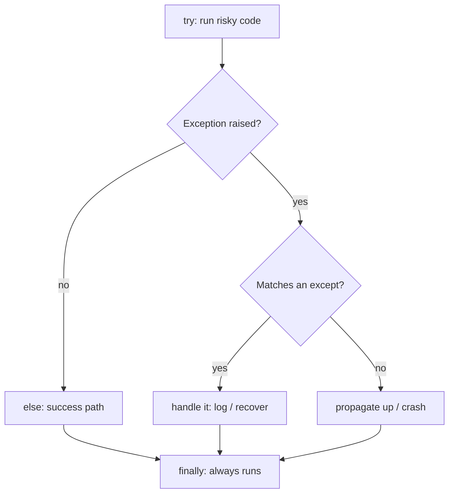
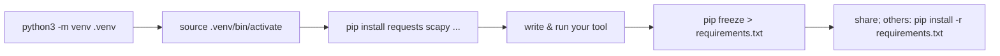
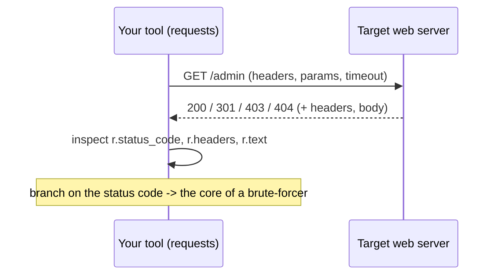

**Level:** Beginner · **Track:** Foundations · **Read time:** 155 min

This is Chapter 2 of the Programming for Security series — Notebook 5. Chapter 1 gave you
the raw material: syntax, data types, the str/bytes boundary, conditionals, and loops.
You wrote a few tiny scripts, but everything lived in one flat block of code. This chapter
is about **structure and reach**: wrapping logic in **functions** you can reuse, handling
errors so tools don't crash on the first bad input, reading and writing **files** (the
wordlists, logs, and loot every engagement involves), pulling in **modules** from the vast
standard library and PyPI, and making real **HTTP requests** with the `requests` library —
the foundation of web-app testing and API automation.

By the end you'll have built a small directory brute-forcer and a login checker — the same
shape as tools like `gobuster`, `ffuf`, and `hydra`, just readable and yours. Everything
stays anchored to concrete offensive and defensive examples, and everything assumes only
Chapter 1.

## Who This Chapter Is For (and the Map Ahead)

You need Chapter 1 (types, loops, str/bytes, f-strings). Nothing else. If you already know
functions from another language, still read Part 3 (Python's error model) and Parts 6–8
(modules, venvs, and `requests`), which are where the security workflow lives.

The path:

- **Part 1** — functions: defining, calling, arguments, return values, scope.
- **Part 2** — flexible arguments: defaults, keyword args, `*args`/`**kwargs`.
- **Part 3** — error handling: `try`/`except`/`finally` and why tools must not crash.
- **Part 4** — files: reading, writing, `with`, text vs binary, wordlists and logs.
- **Part 5** — the module system: `import`, the standard library tour for security.
- **Part 6** — `pip`, PyPI, and **virtual environments** (do this right from day one).
- **Part 7** — the **`requests`** library: GET/POST, params, headers, JSON, sessions.
- **Part 8** — hands-on lab: a directory brute-forcer and a login checker.
- **Part 9** — pitfalls (mutable defaults, file handles, blocking, verify=False).
- **Part 10** — safe/lawful tooling and rate-limiting.
- **Parts 11–13** — Final Revision, Cheat Sheet, Practice.

## Part 1: Functions — Reusable Blocks of Logic

A **function** is a named, reusable block of code. It takes **arguments** (inputs), does
work, and usually **returns** a value. Defining one uses `def`:

```python
def is_interesting_port(port):
    """Return True if a port is commonly high-value."""   # docstring
    return port in {21, 23, 445, 3389, 139}

# call it
if is_interesting_port(445):
    print("SMB — worth a look")
```

Anatomy: `def name(parameters):`, an indented body, and a `return` (a function with no
`return` returns `None`). The triple-quoted **docstring** on the first line documents it
and shows up in `help(is_interesting_port)`.

Why functions matter for tooling: they **name an idea once** and let you reuse and test it.
Instead of copy-pasting a scan block, you write `scan_host(ip)` and call it in a loop.

**Return values** can be anything, including multiple values (really a tuple):

```python
def parse_endpoint(text):
    ip, port = text.split(":")
    return ip, int(port)          # returns a tuple

ip, port = parse_endpoint("10.10.10.5:445")   # unpack it
```

**Scope** — names created inside a function are **local** to it and vanish when it
returns. A function can *read* outer (global) names but should avoid *writing* them; pass
data in via arguments and out via `return` instead of using globals. This keeps tools
predictable.

```python
def add_finding(findings, host, note):
    findings.append((host, note))    # mutates the list passed in
    # no return needed; the caller's list is updated (mutable argument)

results = []
add_finding(results, "10.10.10.5", "SMB open")
```

### Refactoring a flat script into functions

To feel *why* functions matter, watch a flat Chapter-1-style scanner become a tool. Flat:

```python
hosts = ["10.10.10.5", "10.10.10.6"]
for h in hosts:
    print(f"scanning {h}")
    # ...20 lines of logic inline, impossible to reuse or test...
```

Factored into named steps:

```python
def scan_host(ip, ports):
    """Return a dict of port->state for one host."""
    return {p: probe(ip, p) for p in ports}

def report(results):
    for ip, ports in results.items():
        opened = [p for p, state in ports.items() if state == "open"]
        print(f"{ip}: {opened or 'no open ports'}")

def main():
    hosts = ["10.10.10.5", "10.10.10.6"]
    results = {h: scan_host(h, [22, 80, 445]) for h in hosts}
    report(results)

if __name__ == "__main__":
    main()
```

Each function now does *one* thing, can be tested in isolation, and reads like a summary
of the program. `main()` orchestrates; `scan_host` and `report` are reusable. This
"small functions + a `main()`" shape is how essentially every real Python tool is built,
and it's the single biggest readability upgrade over a wall of inline code.

## Part 2: Flexible Arguments — Defaults, Keywords, *args, **kwargs

Real tool functions need optional and variable inputs. Python is generous here.

**Default arguments** make a parameter optional:

```python
def banner(ip, port=80, timeout=3):
    print(f"probing {ip}:{port} (timeout {timeout}s)")

banner("10.10.10.5")                 # uses port=80, timeout=3
banner("10.10.10.5", 445)            # port=445
banner("10.10.10.5", timeout=10)     # keyword arg skips straight to timeout
```

**Keyword arguments** (passing by name) make calls readable and order-independent —
prefer them for anything non-obvious (`timeout=10` beats a bare `10`).

**`*args`** collects extra positional arguments into a tuple; **`**kwargs`** collects
extra keyword arguments into a dict. You'll see these in library code and wrappers:

```python
def log(level, *messages, **fields):
    line = f"[{level}] " + " ".join(str(m) for m in messages)
    if fields:
        line += " " + str(fields)
    print(line)

log("INFO", "host up", "smb open", ip="10.10.10.5", port=445)
# [INFO] host up smb open {'ip': '10.10.10.5', 'port': 445}
```

**Type hints** (optional but recommended) document expected types without enforcing them —
they make tools self-explanatory and help your editor:

```python
def scan(ip: str, ports: list[int], timeout: float = 3.0) -> dict:
    ...
```

## Part 3: Error Handling — Tools Must Not Crash on Bad Input

A scanner that dies the first time a host refuses a connection is useless. Python signals
errors by raising **exceptions**; you handle them with `try`/`except`:

```python
try:
    port = int(input("port: "))       # may raise ValueError on non-numbers
    result = 65535 // port            # may raise ZeroDivisionError
except ValueError:
    print("[-] that wasn't a number")
except ZeroDivisionError:
    print("[-] port can't be zero")
except Exception as e:                 # catch-all: last resort
    print(f"[-] unexpected: {e}")
else:
    print("[+] all good")             # runs only if NO exception
finally:
    print("done")                     # ALWAYS runs (cleanup)
```

Rules that keep code sane:

- **Catch specific exceptions**, not a bare `except:`. You want to handle a
  `ConnectionRefusedError` differently from a `KeyboardInterrupt`.
- **`finally`** always runs — use it to close sockets/files even on error.
- **Don't swallow errors silently.** At minimum print or log them; a scanner that hides
  failures gives false confidence.

The exceptions you'll meet most in security tooling:

| Exception | Typical cause |
|-----------|---------------|
| `ValueError` | `int("abc")`, bad `fromhex`, malformed input |
| `KeyError` | `d["missing"]` on a dict — use `.get()` |
| `IndexError` | `lst[99]` out of range |
| `FileNotFoundError` | opening a wordlist that isn't there |
| `ConnectionRefusedError` / `TimeoutError` | closed/filtered port (next chapter's sockets) |
| `requests.exceptions.RequestException` | any HTTP failure (Part 7) |
| `KeyboardInterrupt` | user hit Ctrl-C — often let it propagate |



## Part 4: Files — Wordlists, Logs, and Loot

Nearly every tool reads a file (a wordlist, a target list, a log) or writes one (results,
extracted creds, a report). The modern, safe way uses a **`with`** block, which
guarantees the file is closed even if an error occurs:

```python
# Read a wordlist line by line (memory-friendly for huge files)
with open("wordlist.txt", "r", encoding="utf-8") as f:
    for line in f:
        word = line.strip()          # remove the trailing newline
        if word and not word.startswith("#"):
            print(word)
```

The `open` mode string is the key parameter:

| Mode | Meaning |
|------|---------|
| `"r"` | read text (default); error if missing |
| `"w"` | write text; **truncates** (erases) the file first |
| `"a"` | append text; create if missing |
| `"x"` | create new; error if it already exists |
| `"rb"`/`"wb"` | binary read/write (returns/expects **bytes**) |
| `"r+"` | read and write |

Writing results:

```python
findings = [("10.10.10.5", "SMB open"), ("10.10.10.6", "RDP open")]
with open("results.txt", "w", encoding="utf-8") as f:
    for host, note in findings:
        f.write(f"{host}\t{note}\n")     # you add the newline yourself
```

**Text vs binary** repeats the Chapter 1 lesson: open with `"r"` to get `str` (decoded
with the given `encoding`), or `"rb"` to get raw `bytes` (for images, packet captures,
binaries). Reading a binary file as text can crash with `UnicodeDecodeError`.

For structured data, the standard library has ready parsers you'll use constantly:

```python
import json, csv

with open("resp.json") as f:
    data = json.load(f)          # JSON file -> Python dict/list
print(data["users"][0]["name"])

with open("hosts.csv", newline="") as f:
    for row in csv.DictReader(f):    # each row -> dict keyed by header
        print(row["ip"], row["hostname"])
```

Modern path handling with **`pathlib`** is cleaner than string-joining paths and makes
loot-collection scripts readable:

```python
from pathlib import Path

loot = Path("loot")
loot.mkdir(exist_ok=True)                 # create the dir if absent
(loot / "creds.txt").write_text("admin:hunter2\n")   # write in one call
print((loot / "creds.txt").read_text())              # read in one call

# Glob a directory tree — e.g. hunt config files that may hold secrets
for cfg in Path("/etc").glob("**/*.conf"):
    if cfg.is_file():
        pass  # scan each for passwords, keys, etc.
```

`Path` objects support `/` to join, `.exists()`, `.is_file()`, `.name`/`.suffix`, and
`.glob("**/*.ext")` for recursive search — exactly what you need when sweeping a
compromised host for interesting files, or when a defensive script inventories configs.

## Part 5: The Module System — Standing on the Standard Library

A **module** is just a `.py` file of reusable code; a **package** is a folder of modules.
You bring them in with `import`. Python's "batteries included" standard library is a
security toolkit on its own:

```python
import os, sys, socket, hashlib, base64, json, re, subprocess
from pathlib import Path
from datetime import datetime
from collections import Counter
```

Import styles:

```python
import hashlib                 # use as hashlib.md5(...)
from hashlib import sha256     # use as sha256(...)
import numpy as np             # aliased (common for 3rd-party libs)
from os import path, getcwd    # pull specific names
```

A quick tour of standard-library modules that pay off in security work:

| Module | What it gives you |
|--------|-------------------|
| `os` / `sys` | environment, paths, args (`sys.argv`), exit codes |
| `pathlib` | modern path handling (`Path("x").exists()`, globbing) |
| `hashlib` | md5/sha1/sha256, and md4 for NT hashes (Ch1 example) |
| `base64` / `binascii` | encode/decode tokens and blobs |
| `json` / `csv` | parse API responses and tabular loot |
| `re` | regular expressions — extract IPs, hashes, emails from text |
| `socket` | raw TCP/UDP (next chapter's tool-building) |
| `subprocess` | run external commands (`nmap`, `whoami`) and capture output |
| `collections.Counter` | tally things (top talkers, most common status codes) |
| `argparse` | give your tool real `--flag` command-line options |
| `datetime` | timestamps for logs and reports |

A tiny taste of `re` (regex), since extracting IOCs from text is a daily task:

```python
import re
text = "conn from 10.0.0.9 and 192.168.1.20 hash 5f4dcc3b5aa765d61d8327deb882cf99"
ips = re.findall(r"\b(?:\d{1,3}\.){3}\d{1,3}\b", text)     # -> ['10.0.0.9','192.168.1.20']
md5 = re.findall(r"\b[a-f0-9]{32}\b", text)                # -> ['5f4dcc3b...']
```

**`argparse`** turns a script into a real CLI tool:

```python
import argparse
p = argparse.ArgumentParser(description="tiny scanner")
p.add_argument("target")                       # positional
p.add_argument("-p", "--ports", default="80,443")
p.add_argument("-v", "--verbose", action="store_true")
args = p.parse_args()
print(args.target, args.ports, args.verbose)
# run:  python3 tool.py 10.10.10.5 -p 22,80,445 -v
```

### Running external tools with `subprocess`

Much offensive automation *wraps* existing tools (`nmap`, `crackmapexec`, `whoami`) and
parses their output. `subprocess.run` executes a command and captures its result:

```python
import subprocess

# Pass the command as a LIST (avoids shell-injection; no shell involved)
proc = subprocess.run(
    ["nmap", "-p", "445", "-oG", "-", "10.10.10.5"],
    capture_output=True, text=True, timeout=60,
)
print("exit code:", proc.returncode)      # 0 = success
for line in proc.stdout.splitlines():
    if "445/open" in line:
        print("[+] SMB open:", line.split()[1])
```

Key points, some of them security-critical:

- **Pass a list, not a string**, and avoid `shell=True`. Building a shell command by
  string-concatenating user input is a **command-injection** hole — the very bug class
  you'll later exploit in targets, so don't write it into your own tools.
- `capture_output=True, text=True` gives you `.stdout`/`.stderr` as strings; set a
  `timeout=` so a hung tool doesn't hang yours.
- `.returncode` tells success/failure; check it before trusting output.

### Extracting IOCs with `re` — a regex primer for security

Regular expressions extract structure from messy text — IPs, hashes, emails, tokens — and
`re` is your daily driver. The essentials:

| Pattern | Matches |
|---------|---------|
| `\d` `\w` `\s` | digit / word-char / whitespace |
| `.` | any char (except newline) |
| `*` `+` `?` | 0+, 1+, 0-or-1 of the previous |
| `{3}` `{1,3}` | exactly 3 / between 1 and 3 |
| `[a-f0-9]` | a character class |
| `\b` | a word boundary |
| `(...)` | a capture group |

```python
import re

log = "user bob@corp.local from 10.0.0.9 sha1 da39a3ee5e6b4b0d3255bfef95601890afd80709"

emails = re.findall(r"[\w.+-]+@[\w-]+\.[\w.-]+", log)     # ['bob@corp.local']
ips    = re.findall(r"\b(?:\d{1,3}\.){3}\d{1,3}\b", log)  # ['10.0.0.9']
sha1s  = re.findall(r"\b[a-f0-9]{40}\b", log)             # ['da39a3ee...']

# compile once when reusing a pattern in a loop (faster)
ip_re = re.compile(r"\b(?:\d{1,3}\.){3}\d{1,3}\b")
for line in open("big.log"):
    for ip in ip_re.findall(line):
        pass  # tally, flag, enrich...
```

`re.findall` returns every match; `re.search` finds the first; `re.match` anchors at the
start; capture groups `(...)` pull out sub-parts. Regex is how log parsers, threat-intel
enrichers, and scrapers turn raw text into structured findings.

## Part 6: pip, PyPI, and Virtual Environments

The standard library is huge, but you'll also want third-party packages (`requests`,
`scapy`, `impacket`) from **PyPI** (the Python Package Index), installed with **`pip`**.

The critical habit — **use a virtual environment** so each project's packages are isolated
and you never pollute the system Python (which on Kali/Debian is now *protected* and will
reject global installs):

```bash
python3 -m venv .venv              # create an isolated environment in ./.venv
source .venv/bin/activate          # activate it (Windows: .venv\Scripts\activate)
pip install requests               # installs INTO the venv only
python3 tool.py                    # runs with the venv's packages
deactivate                         # leave the venv
```

Reproducibility for a project or a shared tool:

```bash
pip freeze > requirements.txt      # record exact versions
pip install -r requirements.txt    # recreate the environment elsewhere
```



**Why this matters:** installing globally on modern Kali throws
`error: externally-managed-environment`; a venv sidesteps it cleanly, keeps tool
dependencies from conflicting, and makes your work reproducible on a teammate's box or a
throwaway VM. Make `python3 -m venv .venv` the first command of every new tool.

## Part 7: The `requests` Library — Your First Real HTTP Client

`requests` is the de-facto HTTP library: readable, powerful, and the backbone of web-app
testing scripts. Install it (`pip install requests`) and go:

```python
import requests

r = requests.get("https://example.com")
print(r.status_code)      # 200
print(r.headers["Server"])
print(r.text[:200])       # body as str
print(r.content[:20])     # body as bytes
```

The **Response** object carries everything you need: `.status_code`, `.headers` (a
case-insensitive dict), `.text`/`.content`, `.json()` (parse a JSON body to a dict),
`.cookies`, `.url` (after redirects), and `.history` (the redirect chain).

**Query parameters** and **custom headers** (spoofing a User-Agent, adding an auth token):

```python
r = requests.get(
    "https://target/search",
    params={"q": "admin", "page": 2},           # -> ?q=admin&page=2
    headers={"User-Agent": "Mozilla/5.0", "Authorization": "Bearer TOKEN"},
    timeout=5,                                    # ALWAYS set a timeout
)
```

**POST** — form data and JSON bodies (login forms, API calls):

```python
# form-encoded (a classic HTML login)
requests.post("https://target/login", data={"user": "admin", "pass": "x"})

# JSON body (a modern API)
requests.post("https://api/target", json={"username": "admin", "password": "x"})
```

**Sessions** persist cookies and headers across requests — essential once you're logged in:

```python
s = requests.Session()
s.headers.update({"User-Agent": "recon/1.0"})
s.post("https://target/login", data={"user": "admin", "pass": "hunter2"})
# the session now carries the auth cookie automatically:
me = s.get("https://target/account")
print("logged in" if "Logout" in me.text else "login failed")
```

Two safety notes you'll meet immediately:

- **`timeout=`** on every call — without it a dead host hangs your tool forever.
- **`verify=False`** disables TLS certificate checks (common against lab boxes with
  self-signed certs). It's fine in a lab but suppress the warning and never use it against
  production/untrusted networks:

```python
import urllib3; urllib3.disable_warnings()
r = requests.get("https://10.10.10.5", verify=False, timeout=5)
```



### Reading a Response like a tester

The status code is the first thing a brute-forcer or fuzzer branches on, so know what the
common ones mean in an assessment context:

| Code | Meaning | Why a tester cares |
|------|---------|--------------------|
| 200 | OK | Resource exists / request accepted |
| 301/302 | Redirect | Often "logged in" or "moved" — inspect `Location` |
| 401 | Unauthorized | Auth required — the endpoint *exists* |
| 403 | Forbidden | Exists but blocked — sometimes bypassable |
| 404 | Not Found | Skip (your brute-forcer's negative case) |
| 429 | Too Many Requests | You're being rate-limited — back off |
| 500 | Server Error | Your input may have broken something — worth probing |

Redirects and history — `requests` follows them by default; inspect the chain:

```python
r = requests.get("http://target/dashboard", timeout=5)   # may bounce to /login
print(r.url)                  # final URL after redirects
print(r.status_code)          # status of the FINAL response
for hop in r.history:         # each earlier (redirect) response
    print(hop.status_code, "->", hop.headers.get("Location"))

# Sometimes you want the raw redirect, not to follow it:
r = requests.get("http://target/secret", allow_redirects=False)
if r.status_code in (301, 302):
    print("redirects to:", r.headers["Location"])
```

That `allow_redirects=False` is exactly what the dir-brute in 8.1 used — an unfollowed
301 tells you a path exists without chasing you off to a login page, keeping results
clean.

Handling bodies safely — decide text vs JSON, and never assume:

```python
ctype = r.headers.get("Content-Type", "")
if "application/json" in ctype:
    try:
        data = r.json()            # dict/list
    except requests.exceptions.JSONDecodeError:
        data = None                # server lied about the type
else:
    snippet = r.text[:500]         # str; inspect the HTML
```

And a reusable pattern for a resilient request — timeout, retries, and clean error
reporting rolled into one helper you'll copy into every tool:

```python
import requests, time

def fetch(url, tries=3, timeout=5, **kw):
    for attempt in range(1, tries + 1):
        try:
            return requests.get(url, timeout=timeout, **kw)
        except requests.exceptions.RequestException as e:
            print(f"[!] {url} attempt {attempt}/{tries}: {e}")
            time.sleep(attempt)     # simple backoff: 1s, 2s, 3s
    return None                     # all attempts failed
```

This single `fetch()` folds together functions, `*/**` args, exception handling, and a
retry loop — everything from Parts 1–3 and 7 in one production-shaped utility.

## Part 8: Hands-On Lab — A Directory Brute-Forcer and a Login Checker

Everything here uses Parts 1–7. **Authorized/lab targets only** (your own DVWA,
`http://testphp.vulnweb.com`, a HackTheBox/THM box). Hammering a site you don't own is
both rude and illegal.

### 8.1 A directory brute-forcer (a tiny gobuster)

```python
# dirbrute.py — find existing paths on a web server from a wordlist
import requests, sys

def brute(base_url, wordlist_path, timeout=5):
    found = []
    try:
        with open(wordlist_path, encoding="utf-8") as f:
            words = [w.strip() for w in f if w.strip()]
    except FileNotFoundError:
        print(f"[-] wordlist not found: {wordlist_path}")
        return found

    for word in words:
        url = f"{base_url.rstrip('/')}/{word}"
        try:
            r = requests.get(url, timeout=timeout, allow_redirects=False)
        except requests.exceptions.RequestException as e:
            print(f"[!] {url} -> error: {e}")
            continue
        if r.status_code in (200, 301, 302, 401, 403):
            print(f"[+] {r.status_code}  {url}")
            found.append((r.status_code, url))
        # 404s are silently skipped
    return found

if __name__ == "__main__":
    target = sys.argv[1] if len(sys.argv) > 1 else "http://testphp.vulnweb.com"
    hits = brute(target, "common.txt")
    print(f"\n[=] {len(hits)} interesting paths found")
```

Sample `common.txt` (`admin`, `login`, `robots.txt`, `backup`, `.git`, `uploads`) and a
run:

```
$ python3 dirbrute.py http://testphp.vulnweb.com
[+] 200  http://testphp.vulnweb.com/admin
[+] 301  http://testphp.vulnweb.com/login
[+] 200  http://testphp.vulnweb.com/robots.txt
[!] http://testphp.vulnweb.com/backup -> error: HTTPConnectionPool... Read timed out

[=] 3 interesting paths found
```

Read what this exercises: a **function** with a default arg, **file reading** with
`FileNotFoundError` handling, a **loop**, per-request **exception handling** so one bad URL
doesn't kill the run, **f-strings** to build URLs, status-code **branching**, and the
`if __name__ == "__main__":` idiom (Part 9). That's the whole chapter in 25 lines — and it
is structurally the same as `gobuster`/`ffuf`.

### 8.2 A login checker (credential tester)

```python
# logincheck.py — test a small list of credentials against a form login
import requests

URL = "http://localhost/dvwa/login.php"          # your OWN lab
creds = [("admin", "password"), ("admin", "admin"), ("admin", "letmein")]

def try_login(session, user, pw):
    r = session.post(URL, data={"username": user, "password": pw},
                     timeout=5, allow_redirects=True)
    # success/failure heuristic: many apps redirect or drop the "login failed" text
    return "login failed" not in r.text.lower()

with requests.Session() as s:
    for user, pw in creds:
        try:
            if try_login(s, user, pw):
                print(f"[+] VALID: {user}:{pw}")
                break
            else:
                print(f"[-] invalid: {user}:{pw}")
        except requests.exceptions.RequestException as e:
            print(f"[!] request error for {user}:{pw} -> {e}")
```

The **success heuristic** — deciding what a "valid login" *looks like* in the response
(a redirect, an absent error string, a new cookie, a different status code) — is the real
skill in credential testing; the HTTP mechanics are easy. This mirrors how `hydra`'s
`http-post-form` module works: you tell it the failure string.

**Lawful use:** run 8.2 only against a lab you control (DVWA, a THM box). Credential
testing against systems you're not authorized to test is illegal.

### 8.3 A security-headers auditor (blue-team)

The same `requests` skills build a defensive tool. This checks a site for missing
security headers — a real assessment task:

```python
# headercheck.py — audit a URL for common security headers
import requests

WANT = {
    "Strict-Transport-Security": "enforce HTTPS (HSTS)",
    "Content-Security-Policy":    "mitigate XSS / injection",
    "X-Frame-Options":            "clickjacking protection",
    "X-Content-Type-Options":     "stop MIME sniffing",
    "Referrer-Policy":            "limit referrer leakage",
}

def audit(url):
    try:
        r = requests.get(url, timeout=5)
    except requests.exceptions.RequestException as e:
        print(f"[-] could not reach {url}: {e}")
        return
    present = {k.lower() for k in r.headers}
    print(f"[=] {url}  (HTTP {r.status_code})")
    for header, why in WANT.items():
        mark = "OK " if header.lower() in present else "MISSING"
        print(f"    [{mark}] {header:32} — {why}")

if __name__ == "__main__":
    audit("https://example.com")
```

```
[=] https://example.com  (HTTP 200)
    [OK ] Strict-Transport-Security         — enforce HTTPS (HSTS)
    [MISSING] Content-Security-Policy        — mitigate XSS / injection
    [OK ] X-Frame-Options                    — clickjacking protection
    [MISSING] X-Content-Type-Options         — stop MIME sniffing
    [MISSING] Referrer-Policy                — limit referrer leakage
```

A dict of expected headers, a set for case-insensitive membership, exception handling,
and f-string alignment — the exact toolkit from Parts 3–7, pointed at defense.

### 8.4 A log analyser with `Counter` (blue-team)

`collections.Counter` tallies things in one line — perfect for "top talkers" and
"most-hit endpoints" from a log:

```python
# topips.py — rank source IPs by failed logins using regex + Counter
import re
from collections import Counter

fail_re = re.compile(r"Failed password.* from (\d{1,3}(?:\.\d{1,3}){3})")
counts = Counter()

with open("auth.log", encoding="utf-8", errors="replace") as f:
    for line in f:
        m = fail_re.search(line)
        if m:
            counts[m.group(1)] += 1     # group(1) = the captured IP

for ip, n in counts.most_common(5):     # top 5, already sorted
    flag = "  <-- brute force" if n >= 20 else ""
    print(f"{ip:15} {n:>5} failures{flag}")
```

```
10.0.0.9          214 failures  <-- brute force
45.13.22.7         31 failures  <-- brute force
192.168.1.50        4 failures
```

`Counter.most_common(n)` does the sort-and-slice for you — a genuinely useful primitive.
This is a working brute-force detector in a dozen lines, composed entirely of Part 4
(files), Part 5 (`re`, `Counter`), and Chapter 1 fundamentals.

## Part 9: Common Pitfalls & Misconceptions

- **Mutable default arguments.** `def f(acc=[])` creates the list **once**, shared across
  all calls, so it accumulates between calls. Use `def f(acc=None): acc = acc or []`.
- **Forgetting `timeout=`.** A `requests.get` (or socket) with no timeout hangs forever on
  a filtered host and freezes your tool. Always set one.
- **Files left open / reading huge files into memory.** Use `with open(...)`, and iterate
  line by line (`for line in f`) instead of `f.read()` on a multi-GB wordlist.
- **`str` vs `bytes` in files.** `"rb"`/`"wb"` give/expect bytes; `"r"`/`"w"` give/expect
  str. Mismatch → `TypeError`. Set `encoding="utf-8"` explicitly for text.
- **Bare `except:`** hides bugs and swallows `KeyboardInterrupt`. Catch specific
  exceptions; let Ctrl-C through.
- **Missing `if __name__ == "__main__":`.** Code at the bottom of a module runs on
  *import*, not just when run directly. Guard your entry point:
  `if __name__ == "__main__": main()`.
- **Installing globally on modern Kali/Debian.** You'll hit
  `externally-managed-environment`. Use a **venv** (Part 6), don't `--break-system-packages`
  by habit.
- **`verify=False` everywhere.** Fine for a lab self-signed cert; a bad habit against real
  targets — you disable the very TLS protection that stops MITM.
- **`.json()` on a non-JSON response** raises `JSONDecodeError`; check
  `r.headers.get("Content-Type")` or wrap in `try/except`.

## Part 10: Safe, Lawful, Considerate Tooling

Your tools now touch other people's servers. Three professional habits:

- **Authorization first.** Directory brute-forcing and credential testing are active
  attacks. Only run them within a signed engagement, a bug-bounty program's scope, or a
  lab you own. "It's just a GET" is not a legal defense.
- **Rate-limit and back off.** Hammering an endpoint can DoS it and will get you blocked.
  Add `time.sleep()` between requests, honour `Retry-After`, and keep concurrency sane.
- **Build the blue-team twin.** The file/regex/requests skills here also make log parsers,
  IOC extractors, and uptime/health checkers. Writing the defensive version sharpens your
  understanding and keeps your toolkit dual-use.

## Part 11: Final Revision — Recap

- **Functions** (`def name(args): ... return`) name and reuse logic; prefer passing data
  in/out over globals. Multiple returns are tuples; docstrings document.
- **Arguments:** defaults (`port=80`), keyword args, `*args`/`**kwargs`, and optional
  **type hints** for clarity.
- **Errors:** `try`/`except SpecificError`/`else`/`finally`; catch specific exceptions,
  use `finally` for cleanup, never swallow silently. Know `ValueError`, `KeyError`,
  `FileNotFoundError`, `RequestException`.
- **Files:** `with open(path, mode, encoding=...) as f`; modes `r/w/a/x` + `b`; iterate
  line by line; `.strip()` lines; `json.load`/`csv.DictReader` for structured data.
- **Modules:** `import`; the standard library is a security toolkit (`os`, `pathlib`,
  `hashlib`, `re`, `socket`, `subprocess`, `argparse`, `collections`, `json`).
- **pip + venv:** always `python3 -m venv .venv && source .venv/bin/activate` before
  `pip install`; `pip freeze`/`-r requirements.txt` for reproducibility. Avoids Kali's
  `externally-managed-environment`.
- **`requests`:** `get`/`post` with `params`, `headers`, `data`/`json`, always `timeout=`;
  `Response` gives `.status_code`, `.headers`, `.text`/`.content`/`.json()`; **Sessions**
  persist cookies for authenticated flows; `verify=False` only in labs.
- Built a **directory brute-forcer** and a **login checker** — real tools from core parts.
- Pitfalls: mutable defaults, missing timeouts, open file handles, bytes/str in files,
  bare `except`, missing `__main__` guard, global installs, blind `verify=False`.

## Part 12: Cheat Sheet / Quick Reference

**Functions & errors**

```python
def f(x, y=0, *args, **kw) -> int: return x + y
try: risky()
except ValueError as e: handle(e)
finally: cleanup()
```

**Files**

```python
with open("wl.txt", encoding="utf-8") as f:
    for line in f: word = line.strip()
with open("out.txt","w",encoding="utf-8") as f: f.write("x\n")
import json,csv ; json.load(f) ; csv.DictReader(f)
```

**Modules & env**

```bash
python3 -m venv .venv && source .venv/bin/activate
pip install requests ; pip freeze > requirements.txt
```

**requests**

```python
import requests
r = requests.get(url, params={...}, headers={...}, timeout=5)
r = requests.post(url, data={...})        # form
r = requests.post(url, json={...})        # JSON
r.status_code ; r.headers ; r.text ; r.json() ; r.cookies
s = requests.Session(); s.post(login); s.get(protected)
```

**CLI:** `argparse.ArgumentParser()` · `add_argument("target")` ·
`add_argument("-p","--ports")` · guard with `if __name__ == "__main__":`

## Part 13: Practice Labs & Resources

- **PortSwigger Web Security Academy**: script the labs' logins with `requests.Session`
  and automate simple auth/enumeration steps — the best place to practise Part 7 against
  legal targets.
- **TryHackMe — "Python for Pentesters" / "Intro to Python"**: guided rooms that build
  exactly these functions/files/requests skills.
- **`http://testphp.vulnweb.com`** (Acunetix's intentionally vulnerable public site) and
  **DVWA** (local): safe targets for the dir-brute and login-check tools.
- **picoCTF "Web Exploitation" (beginner)**: many tasks are solved with a short `requests`
  script — param tampering, cookie inspection, following redirects.
- **Rewrite real tools small:** reimplement a 30-line `gobuster` and a 30-line `hydra`
  http-post-form; comparing yours to the originals teaches enormous amounts.
- **"Automate the Boring Stuff" (files, web scraping chapters)** and the **`requests`
  official docs** (quickstart + advanced/Session) as references.

Practice questions:

1. Why is `def add(x, acc=[])` dangerous, and what's the idiomatic fix? (The default list
   is created once and shared across calls; use `acc=None` then `acc = acc or []`.)
2. Write a `with`-block that reads `targets.txt`, strips each line, and skips blanks and
   `#` comments. (`with open("targets.txt") as f: [l.strip() for l in f if l.strip() and
   not l.startswith("#")]`.)
3. What does a `requests.Session` give you that repeated `requests.get` calls don't?
   (Persistent cookies/headers across requests — needed to stay logged in.)
4. Your brute-forcer hangs on one host and never continues. Name the two most likely
   causes and the fixes. (No `timeout=` on the request; and/or not catching
   `RequestException` so one error kills the loop — add both.)
5. On Kali, `pip install requests` fails with `externally-managed-environment`. What's the
   correct fix? (Create and activate a **virtual environment** (`python3 -m venv .venv`)
   and install inside it — not `--break-system-packages`.)

---

*Also on [Praneeth's portfolio](https://ping-praneeth.vercel.app/notebook/programming-for-security/02-python-for-security-part-2-functions-files-modules), with comments and the latest edits.*
