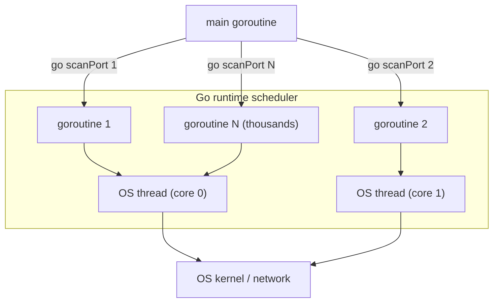
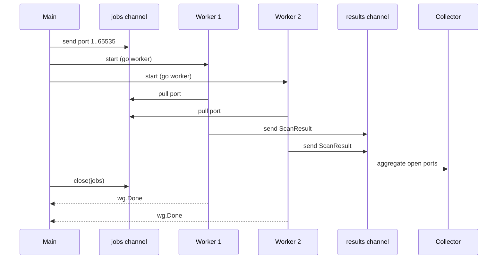
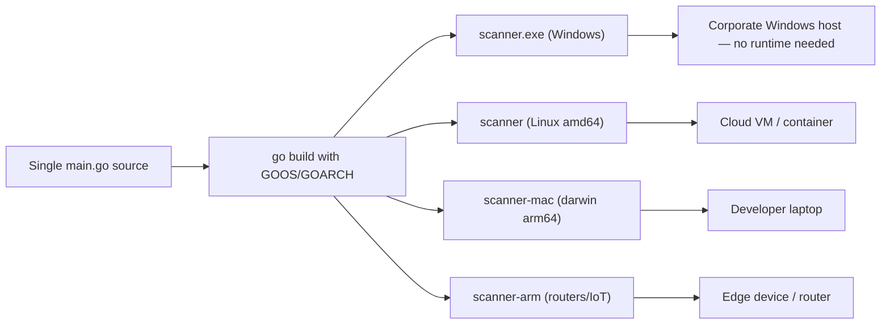
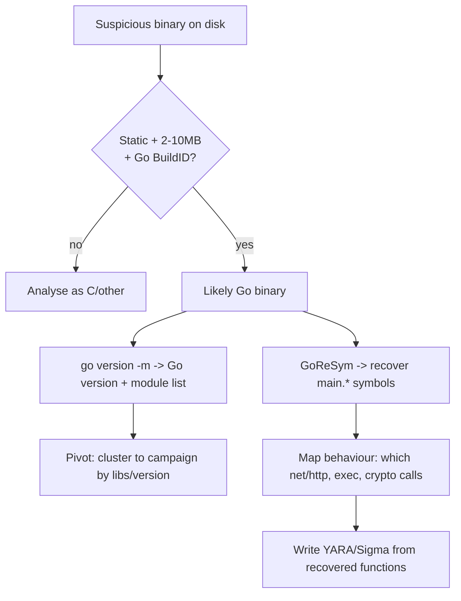

**Level:** Advanced · **Track:** Foundations · **Read time:** 185 min

This is Chapter 8 of the Programming for Security series — Notebook 5. The earlier chapters gave you
Python for scripting and automation, Bash for glue, C for understanding memory and the stack, and
JavaScript for the browser. Each of those owns a niche. This chapter introduces the language that has
quietly taken over the *distribution* problem in security tooling: Go. When you download `ffuf`,
`nuclei`, `gobuster`, `amass`, `httpx`, `subfinder`, `naabu`, `chisel`, or the Sliver C2 framework,
you are downloading a Go program — a single self-contained binary with no interpreter, no runtime to
install, no dependency hell, that runs identically on the pentester's Kali box, the client's Windows
laptop, and an ARM router.

Go is not a replacement for the languages you already know. You will still reach for Python when you
want to prototype in ten lines, and for C when you need to touch raw memory or write a kernel module.
Go's sweet spot is the middle: tooling that has to be *fast*, *concurrent*, and *trivial to hand to
someone else*. That combination is exactly what recon, scanning, fuzzing, and C2 tooling need, which
is why the modern offensive toolkit has migrated onto it. By the end of this chapter you will be able
to read the source of those tools, modify them, and write your own.

## Who This Chapter Is For (and the Map Ahead)

You already program. You are not learning "what is a variable" here — you are learning how Go's
particular choices (static typing with inference, explicit error values, goroutines, a batteries-included
standard library) change how you build tools, and why those choices matter for security work
specifically. If you have never compiled a program before, the earlier C chapter (Chapter 5) is worth
skimming first, because Go borrows C's syntax family and its "compile to a native binary" model.

The path through this chapter climbs deliberately:

- **Parts 1–3** establish *why Go exists* and get you compiling and running programs — the toolchain,
  the type system, and the pieces of syntax that differ from Python/JS.
- **Parts 4–6** cover the data structures, error-handling philosophy, and the standard library you
  will actually use in tooling — slices, maps, structs, interfaces, `net`, `net/http`, `encoding/json`.
- **Parts 7–8** are the heart of the chapter: concurrency. Goroutines, channels, `sync`, and the
  worker-pool pattern that every Go scanner is built on.
- **Parts 9–10** are two full hands-on labs — a concurrent TCP port scanner and an HTTP directory
  brute-forcer — built from scratch with real, copy-pasteable code and annotated output.
- **Part 11** covers cross-compilation and the single-binary distribution model that is Go's real
  superpower for tooling, plus how attackers abuse it.
- **Part 12** is the consolidated Detection & Defense angle: how Go binaries look to a defender, how
  EDR and threat hunters fingerprint the runtime, and how blue teams use Go for their own high-throughput
  tooling.
- **Parts 13+** close with the ecosystem tour, a final revision recap, a cheat sheet, common pitfalls,
  and topic-specific practice.

Let's start with the question that matters most: why did an entire category of tooling move to this
language in the first place?

## Part 1: What Go Actually Is — and Why Security Tooling Adopted It

Go (often written "Golang" because `go` is impossible to search for) is a statically typed, compiled
language created at Google in 2009 by Robert Griesemer, Rob Pike, and Ken Thompson — the last of whom
co-created Unix and the C language itself. That pedigree shows: Go feels like "C with the sharp edges
filed off and concurrency built in." It compiles directly to native machine code, has a garbage
collector so you are not managing memory by hand, and ships with a standard library so complete that
most tools need zero third-party dependencies to do networking, HTTP, TLS, JSON, and cryptography.

Three properties, taken together, are why the security-tooling world adopted it. No single one is
unique to Go, but the *combination* is rare:

**1. A single static binary.** When you build a Go program, the compiler bakes the runtime, the
garbage collector, and every library the program uses *into one file*. There is no "install Python
3.11 and pip install requests" step for the person you hand it to. You copy one file — `scanner`,
or `scanner.exe` — and it runs. On an engagement, when you get a foothold on a locked-down Windows
server with no Python, no PowerShell v5, and no internet access, dropping a single 6 MB static Go
binary that does exactly what you need is enormously easier than staging an interpreter. **Red team
usage:** this is the number-one reason post-exploitation tooling migrated to Go — the payload has no
runtime dependencies on the target.

**2. Cross-compilation from one machine.** From a Linux laptop you can build a Windows binary, a macOS
binary, an ARM Linux binary for a router, and a MIPS binary for an IoT device — by setting two
environment variables and running one command. No Windows machine, no Xcode, no cross-toolchain setup.
We will do this for real in Part 11. For an attacker, this means one build box produces implants for
every target architecture. For a defender building fleet tooling, it means one CI job ships an agent to
every OS you run.

**3. First-class concurrency that is actually easy.** Go's goroutines let you run thousands of
concurrent network operations with a fraction of the memory of OS threads and none of the callback
spaghetti of async JavaScript or the GIL limitations of Python threads. A port scanner that checks
65,535 ports finishes in seconds because Go can have thousands of connection attempts in flight at
once, cheaply. This is why `naabu`, `ffuf`, and `masscan`-style tools feel instant. We build one in
Part 9.

Here is the mental model of where Go sits relative to the languages you already know:

| Language   | Typing            | Runtime needed on target | Concurrency model            | Typical security use                     |
|------------|-------------------|--------------------------|------------------------------|------------------------------------------|
| Python     | Dynamic           | Yes (interpreter + deps) | Threads (GIL-limited), async | Rapid prototyping, exploit PoCs, glue    |
| Bash       | Untyped (strings) | Yes (a shell)            | `&` + `wait`, xargs -P       | Glue, one-liners, pipeline automation    |
| C          | Static, manual mem| No (static link possible)| pthreads (manual, error-prone)| Exploits, shellcode, kernel, low-level   |
| JavaScript | Dynamic           | Yes (Node/browser)       | Event loop, async/await      | Web/client-side, XSS, browser tooling    |
| **Go**     | **Static + infer**| **No (single binary)**   | **Goroutines + channels**    | **Recon, scanners, fuzzers, C2, agents** |

Notice the row that matters: Go is the only one that is both statically compiled to a dependency-free
binary *and* has an easy concurrency model. That intersection is the whole story.

**A note on when NOT to use Go.** Go is a poor fit for writing shellcode, for touching raw memory
layouts precisely, or for the tersest possible exploit PoC — the garbage collector and runtime get in
your way, and the binaries are large (a "hello world" is ~2 MB because the runtime is baked in). For
those, C (Chapter 5) or Python (Chapters 1–3) remain correct. Go wins for *tools*, not for *exploits*.

## Part 2: Installing Go and Your First Compiled Tool

Everything in this chapter assumes a Kali or Debian/Ubuntu Linux box, which is the standard pentesting
environment, but Go installs cleanly on macOS and Windows too. Kali ships Go in its repositories, but
the apt version often lags; installing the official tarball gives you the current toolchain.

**Install the official toolchain on Kali/Debian:**

```bash
# Remove any old apt-installed Go to avoid PATH confusion
sudo apt remove golang-go 2>/dev/null

# Download the current stable release (check go.dev/dl for the latest version string)
cd /tmp
wget https://go.dev/dl/go1.22.5.linux-amd64.tar.gz

# Extract into /usr/local — the standard location the docs assume
sudo rm -rf /usr/local/go          # clean any previous install
sudo tar -C /usr/local -xzf go1.22.5.linux-amd64.tar.gz

# Put the Go toolchain and your future built binaries on PATH
echo 'export PATH=$PATH:/usr/local/go/bin:$HOME/go/bin' >> ~/.bashrc
source ~/.bashrc

# Verify
go version
```

Realistic output:

```
go version go1.22.5 linux/amd64
```

Let me explain what each flag did, because every command in this chapter is taught from scratch:

- `tar -C /usr/local` — the `-C` flag changes into `/usr/local` *before* extracting, so the archive's
  `go/` directory lands at `/usr/local/go`. `-x` = extract, `-z` = decompress gzip, `-f` = the file that
  follows.
- The `PATH` additions: `/usr/local/go/bin` puts the `go` command itself on your path;
  `$HOME/go/bin` is where `go install` drops binaries you build or fetch, so tools like `ffuf` end up
  runnable by name after you install them.

**Understand the Go workspace variables.** Two environment values shape where Go puts things. Check
them with:

```bash
go env GOPATH GOROOT GOBIN
```

Typical output:

```
/home/kali/go

/usr/local/go

```

- `GOROOT` (`/usr/local/go`) is where the toolchain and standard library live. You rarely touch it.
- `GOPATH` (`~/go` by default) is where downloaded module caches and `go install` binaries live
  (`~/go/bin`). Modern Go (since 1.16) uses *modules*, so you are no longer forced to keep your source
  inside `GOPATH` like the bad old days — you can develop anywhere.

**Your first program.** Create a directory and initialise a module. A "module" is Go's unit of
dependency management — think `package.json` for Node or a `requirements.txt` that is actually version-
locked.

```bash
mkdir ~/hello && cd ~/hello
go mod init hello          # creates go.mod, declaring this directory a module named "hello"
```

`go.mod` now contains:

```
module hello

go 1.22
```

Create `main.go`:

```go
package main

import "fmt"

func main() {
    fmt.Println("Hello from a static binary")
}
```

Run it two ways:

```bash
go run main.go             # compile to a temp file and run — the "interpreter-like" dev loop
go build -o hello main.go  # produce a real, standalone binary named "hello"
./hello
```

Output for both:

```
Hello from a static binary
```

Now prove the "single static binary" claim — this is the property that matters for tooling:

```bash
file hello
ls -lh hello
ldd hello
```

```
hello: ELF 64-bit LSB executable, x86-64, statically linked, Go BuildID=..., not stripped
-rwxr-xr-x 1 kali kali 1.9M ... hello
        not a dynamic executable
```

Read those three lines carefully, because they are the essence of why attackers like Go:

- **`statically linked`** — the binary needs no shared libraries.
- **`1.9M`** — even "hello world" is ~2 MB because the Go runtime and GC are baked in. This is the
  trade-off: dependency-free but chunky.
- **`ldd` says "not a dynamic executable"** — you can drop this file on a stripped-down container or a
  minimal Windows host and it just runs. `ldd` lists an ELF's dynamic library dependencies; a Go binary
  has none by default.

**Blue team relevance:** that same "statically linked, ~2 MB, `Go BuildID=`" signature is one of the
first things a malware analyst notices on disk — it immediately narrows the language and gives you the
BuildID as a pivot. We will come back to this in Part 12.

The Go toolchain is a single command with many subcommands. The ones you will use constantly:

| Command             | What it does                                                        |
|---------------------|---------------------------------------------------------------------|
| `go run file.go`    | Compile to a temp binary and execute — the fast dev loop            |
| `go build`          | Produce a native binary in the current dir                          |
| `go build -o name`  | Same, but choose the output filename                                |
| `go install pkg`    | Build and drop the binary in `~/go/bin` (how you install CLI tools) |
| `go mod init name`  | Start a new module (dependency manifest)                            |
| `go mod tidy`       | Add missing and remove unused dependencies                          |
| `go get pkg@ver`    | Add or upgrade a dependency                                         |
| `go fmt ./...`      | Auto-format all code to the canonical style (there is only one)     |
| `go vet ./...`      | Static analysis for common bugs                                     |
| `go test ./...`     | Run tests                                                           |

That `go install` row is worth internalising: it is *how you install most Go security tools*. When a
tool's README says `go install github.com/ffuf/ffuf/v2@latest`, that command fetches the source,
compiles it locally, and drops `ffuf` in `~/go/bin`. Because you added `~/go/bin` to `PATH` above, you
can then just type `ffuf`.

## Part 3: The Type System and Syntax That Differs From What You Know

You already know control flow and functions. This section covers only the parts of Go that will trip
up a Python/JS/C programmer, because those are where bugs and confusion come from.

**Variables: three ways to declare, one you will use most.**

```go
var host string = "10.10.10.5"   // explicit type
var port = 8080                  // type inferred as int
timeout := 5                     // short declaration — most common inside functions
```

The `:=` operator both declares *and* assigns, inferring the type. It only works inside functions.
At package level you must use `var`. **The single most common beginner mistake:** Go refuses to compile
if you declare a variable and never use it. This is not a warning — it is a hard error:

```go
func main() {
    x := 5   // declared and not used
}
```

```
./main.go:2:2: declared and not used: x
```

The same is true of unused imports. This strictness feels hostile at first and becomes a feature: dead
code cannot accumulate. During development, the idiomatic escape hatch is to assign to the blank
identifier `_`, which means "evaluate this but throw it away" — you will see `_` constantly in Go,
especially for errors you are deliberately ignoring.

**Zero values — there is no `undefined` or `None`.** Every type has a defined zero value, and a
variable you declare without assigning gets it automatically:

| Type        | Zero value |
|-------------|------------|
| `int`, `float64` | `0`   |
| `string`    | `""` (empty, not nil) |
| `bool`      | `false`    |
| pointers, slices, maps, channels, functions, interfaces | `nil` |

This matters for security tooling because it removes an entire class of "variable was never set" bugs
— but it also means a `nil` map or `nil` slice behaves in specific ways you must know (reading a `nil`
map is fine and returns the zero value; *writing* to a `nil` map panics).

**Types are strict — no implicit conversion.** Go will not silently turn an `int` into a `float64` or a
byte into a string. You convert explicitly:

```go
var count int = 42
var ratio float64 = float64(count) / 7.0   // must convert count
port := 8080
portStr := strconv.Itoa(port)              // int -> string via strconv, NOT string(port)
```

That last line is a classic trap: `string(8080)` does *not* give `"8080"` — it gives the Unicode
character at code point 8080. To turn numbers into their textual form you use the `strconv` package
(`Itoa` = integer to ASCII, `Atoi` = ASCII to integer). This exact bug appears in real tooling when
someone builds a URL or a port list.

**Control flow — familiar, with a twist.** `if`, `for`, and `switch` exist. There is *only one loop
keyword*: `for`. It covers every loop shape:

```go
for i := 0; i < 10; i++ { }              // classic C-style
for i < 10 { }                           // while-style
for { }                                  // infinite loop
for index, value := range items { }      // iterate a slice/map/string/channel
```

`if` can carry an initialiser, which you will see everywhere because of error handling:

```go
if conn, err := net.Dial("tcp", target); err == nil {
    conn.Close()   // conn and err are scoped to this if/else only
}
```

**Functions can return multiple values — this is central to Go.** Unlike C, a function returns as many
values as it likes, and the near-universal convention is `(result, error)`:

```go
func connect(target string) (net.Conn, error) {
    conn, err := net.Dial("tcp", target)
    if err != nil {
        return nil, err          // failure: return the error
    }
    return conn, nil             // success: nil error
}
```

This leads directly to Go's most distinctive feature, which deserves its own section.

## Part 4: Error Handling — Explicit `if err != nil`, Not Exceptions

Python and JavaScript use exceptions: something throws, and it bubbles up until a `try/except` or
`try/catch` catches it. Go rejects that model. Errors are ordinary *values* that functions return, and
you handle them right where they happen. You will type this pattern thousands of times:

```go
result, err := doSomething()
if err != nil {
    // handle it: log, return, retry, skip
    return err
}
// use result — guaranteed valid here
```

At first this looks verbose. In practice it makes control flow explicit: at every line you can see
exactly what happens on failure, which is precisely what you want in a scanner that must gracefully
skip a dead host rather than crash on host 3 of 10,000. **Security relevance:** a tool that panics on
the first refused connection is useless; the `if err != nil { continue }` pattern is what lets a Go
scanner chew through a /16 and simply record which hosts answered.

**The `error` type is an interface.** Anything with an `Error() string` method is an error. You create
errors with `errors.New` or `fmt.Errorf` (which supports formatting and wrapping):

```go
import "errors"
import "fmt"

err1 := errors.New("connection refused")
err2 := fmt.Errorf("scanning %s:%d failed: %w", host, port, err1)  // %w wraps err1
```

The `%w` verb *wraps* an underlying error so callers can later unwrap it with `errors.Is` and
`errors.As` — the modern way to check "was the root cause a timeout?" without string-matching.

**`panic` and `recover` exist but are not for normal errors.** A `panic` unwinds the stack like an
exception and, if uncaught, crashes the program with a stack trace. You reserve it for truly
unrecoverable programmer errors (a `nil` map write, an out-of-range slice index). In a long-running
tool — say a C2 server or a fuzzer worker — you sometimes wrap a worker in a `recover` so one bad
input does not kill the whole process:

```go
func safeWorker(job string) {
    defer func() {
        if r := recover(); r != nil {
            log.Printf("worker recovered from panic on %q: %v", job, r)
        }
    }()
    process(job)   // if this panics, we log and move on instead of dying
}
```

**`defer` — cleanup that always runs.** `defer` schedules a call to run when the surrounding function
returns, no matter how it returns. It is Go's answer to `try/finally` and to C's manual cleanup, and it
is how you avoid leaking file handles and sockets:

```go
conn, err := net.Dial("tcp", target)
if err != nil {
    return err
}
defer conn.Close()   // guaranteed to run when the function returns — no leaked socket
// ... use conn ...
```

Deferred calls run in last-in-first-out order. In a scanner that opens thousands of connections, the
`defer conn.Close()` habit is the difference between a tool that runs cleanly and one that exhausts the
OS file-descriptor limit after a few thousand hosts (the dreaded `too many open files` / `EMFILE`).

## Part 5: Data Structures for Tooling — Slices, Maps, Structs, Interfaces

These four building blocks make up almost every Go tool. Learn them well and the source of `ffuf` or
`gobuster` becomes readable.

**Arrays vs slices.** An *array* has a fixed size baked into its type (`[4]byte` — think an IPv4
address). You will rarely declare arrays directly. A *slice* is a dynamically sized, growable view over
an array — the workhorse. This is Go's list/vector:

```go
ports := []int{80, 443, 8080}          // slice literal
ports = append(ports, 8443)            // grow it
first := ports[0]                      // index
some := ports[1:3]                     // sub-slice [1,3) -> {443, 8080}
fmt.Println(len(ports), cap(ports))    // length and capacity
```

A slice is internally a little struct: a pointer to a backing array, a length, and a capacity.
Understanding that matters because slices share backing arrays — a subtle source of bugs when one
slice's mutation shows up in another. For tooling you mostly `append` and `range`, and it just works.

**Maps — hash tables.** Key-value storage, ideal for de-duplicating discovered hosts, counting response
codes, or caching DNS lookups:

```go
seen := make(map[string]bool)          // set of strings
seen["10.0.0.1"] = true
if seen["10.0.0.1"] { /* already scanned */ }

// the "comma-ok" idiom distinguishes "present but false" from "absent"
val, ok := seen["10.0.0.2"]            // ok == false: key absent

counts := map[int]int{}                // response-code histogram
counts[200]++                          // zero value of missing key is 0, so ++ just works
```

**Maps are not safe for concurrent writes.** If two goroutines write the same map at once, Go detects
it and crashes with `fatal error: concurrent map writes`. This is a deliberate design choice — it turns
a silent data race into a loud crash. In concurrent tooling you either guard the map with a
`sync.Mutex` or use `sync.Map` or, best, funnel results through a channel to a single collector
goroutine (Part 8). This exact pitfall bites everyone writing their first concurrent scanner.

**Structs — grouped data with no inheritance.** A struct bundles named fields. Go has no classes and no
inheritance; it has structs plus methods plus interfaces, which is enough:

```go
type ScanResult struct {
    Host    string
    Port    int
    Open    bool
    Banner  string
    Latency time.Duration
}

r := ScanResult{Host: "10.0.0.5", Port: 22, Open: true}
r.Banner = "SSH-2.0-OpenSSH_9.6"
```

You attach *methods* to a struct by declaring a function with a *receiver*:

```go
func (r ScanResult) String() string {
    state := "closed"
    if r.Open {
        state = "open"
    }
    return fmt.Sprintf("%s:%d %s", r.Host, r.Port, state)
}
```

The `(r ScanResult)` before the name is the receiver — `r` is the instance the method runs on, like
`self` in Python but explicit and typed. Use a *pointer receiver* `(r *ScanResult)` when the method must
modify the struct.

**Interfaces — the flexible glue.** An interface is a set of method signatures. Any type that has those
methods *satisfies the interface automatically* — there is no `implements` keyword. This is "duck
typing, but checked at compile time":

```go
type Scanner interface {
    Scan(target string) (bool, error)
}
```

Any struct with a `Scan(string) (bool, error)` method is a `Scanner`, and can be passed anywhere a
`Scanner` is expected. This is how you write a tool that supports TCP-connect, SYN, and UDP scanning
behind one interface, choosing the implementation at runtime. The standard library uses this
everywhere: `io.Reader`, `io.Writer`, and `net.Conn` are all interfaces, which is why you can point the
same code at a file, a socket, or an in-memory buffer.

The `interface{}` type (or its modern alias `any`) means "any value at all" — Go's escape hatch when
you genuinely do not know the type, e.g. decoding arbitrary JSON. Use it sparingly; it defeats the type
system.

## Part 6: The Standard Library You Will Actually Use — net, net/http, encoding/json

Go's killer feature for tooling is that networking, HTTP, TLS, and JSON are *in the standard library*,
production-grade, with no third-party dependency. This is why so many tools have a tiny `go.mod`. Here
are the packages a security tool leans on constantly.

**`net` — raw TCP/UDP.** The foundation of every scanner:

```go
import "net"
import "time"

// TCP connect with a timeout — the core of a port scanner
conn, err := net.DialTimeout("tcp", "scanme.nmap.org:80", 3*time.Second)
if err != nil {
    // connection refused, timeout, or host down
} else {
    defer conn.Close()
    // port is open
}
```

`net.DialTimeout(network, address, timeout)` is the single most important function in this chapter.
`network` is `"tcp"`, `"udp"`, `"tcp4"`, etc.; `address` is `"host:port"`; the timeout stops a dead host
from hanging your scan forever. Without a timeout, a filtered port (silently dropped by a firewall)
leaves the connection attempt hanging until the OS default (often 2+ minutes) — fatal for a scanner.

**`net/http` — the HTTP client and server.** For directory brute-forcing, vulnerability probing, and
building C2 listeners:

```go
import "net/http"
import "time"

client := &http.Client{
    Timeout: 10 * time.Second,
}
resp, err := client.Get("https://target.example/admin")
if err == nil {
    defer resp.Body.Close()
    fmt.Println(resp.StatusCode)   // 200, 403, 404...
}
```

Always create your own `http.Client` with a `Timeout` rather than using `http.Get` directly — the
default client has *no timeout*, which will hang a brute-forcer. For tooling you will also frequently
customise the `http.Transport` to disable TLS verification (self-signed targets), set a proxy (route
through Burp), or cap connection reuse. We do this in the Part 10 lab.

**`bufio` — reading wordlists line by line.** Every brute-forcer reads a wordlist. Do not read the whole
file into memory; stream it:

```go
import "bufio"
import "os"

file, _ := os.Open("wordlist.txt")
defer file.Close()
scanner := bufio.NewScanner(file)
for scanner.Scan() {
    word := scanner.Text()   // one line at a time
    // use word
}
```

`bufio.Scanner` handles buffering and line-splitting; `rockyou.txt` is 130 MB and this reads it with a
tiny constant memory footprint.

**`encoding/json` — parse and emit JSON.** Modern tooling speaks JSON for machine-readable output that
pipes into `jq` or other tools. Go maps JSON to structs via *struct tags*:

```go
import "encoding/json"

type Finding struct {
    URL    string `json:"url"`
    Status int    `json:"status_code"`
    Length int    `json:"content_length"`
}

f := Finding{URL: "https://t/admin", Status: 200, Length: 1543}
out, _ := json.Marshal(f)
fmt.Println(string(out))   // {"url":"https://t/admin","status_code":200,"content_length":1543}
```

The backtick strings after each field are *struct tags* — metadata telling the JSON encoder what key to
use. `httpx` and `nuclei` emit exactly this kind of structured output, which is why `nuclei -json | jq`
works so well in automation pipelines. **Blue team usage:** the same `encoding/json` is what a defender
uses to parse millions of JSON log lines from a SIEM export at native speed.

**`flag` and `os.Args` — command-line parsing.** Tools need arguments. The stdlib `flag` package is
enough for simple tools; larger tools use the third-party `cobra`/`pflag` libraries (what `ffuf`,
`nuclei`, and `kubectl` use):

```go
import "flag"

target := flag.String("t", "", "target host")
threads := flag.Int("c", 100, "concurrency")
flag.Parse()
fmt.Println(*target, *threads)   // flag values are pointers — dereference with *
```

With just `net`, `net/http`, `bufio`, `encoding/json`, and `flag`, you already have everything the two
labs in this chapter need — no external dependencies at all. That is the standard-library richness that
makes Go tools so portable.

## Part 7: Concurrency Part 1 — Goroutines and the Scheduler

This is the section that makes Go worth learning for security work. A port scanner that tries one port,
waits for the timeout, then tries the next, would take *hours* for 65,535 ports. Real scanners try
thousands at once. Go makes that trivial.

**A goroutine is a function running concurrently.** You start one by putting `go` in front of a function
call:

```go
go scanPort("10.0.0.5", 80)   // returns immediately; scanPort runs "in the background"
```

That is the entire syntax. Behind it is the reason Go scales: goroutines are *not* OS threads. They are
lightweight, user-space routines managed by the Go runtime's scheduler, which multiplexes potentially
*millions* of goroutines onto a small pool of OS threads (by default, one per CPU core). A goroutine
starts with a ~2 KB stack that grows as needed, versus an OS thread's ~1 MB. That is why you can have
10,000 concurrent connection attempts in flight without exhausting memory — something Python threads
(each a real OS thread, GIL-serialised for CPU work) simply cannot do at that scale.



**The naive version is broken.** A first attempt at concurrency usually looks like this:

```go
func main() {
    for port := 1; port <= 1024; port++ {
        go scanPort("10.0.0.5", port)
    }
    // main returns here — program exits before any goroutine finishes!
}
```

The bug: `main` itself is a goroutine, and when `main` returns, the whole program exits *immediately* —
the scan goroutines never get to run. You need a way to *wait* for them. That is what `sync.WaitGroup`
and channels are for, covered next.

**Goroutines are cheap but not free — you must bound them.** Firing 65,535 goroutines that each open a
socket will hit the OS file-descriptor limit and get you `too many open files`, and blasting a target
with 65,535 simultaneous connections is both noisy and likely to be rate-limited or to knock over a
fragile service. **Red team usage:** uncontrolled concurrency is *loud* — it lights up every IDS. You
control the rate with a bounded worker pool, which is the single most important pattern in this chapter
and the subject of the next section.

## Part 8: Concurrency Part 2 — Channels, WaitGroups, and the Worker Pool

**Channels are typed pipes between goroutines.** They are how goroutines communicate safely without
sharing memory (Go's mantra: "do not communicate by sharing memory; share memory by communicating").

```go
ch := make(chan int)        // unbuffered channel of ints
ch <- 42                    // send (blocks until someone receives)
value := <-ch               // receive (blocks until someone sends)

buffered := make(chan int, 100)   // buffered: holds 100 before send blocks
close(ch)                         // signal no more values will be sent
```

An *unbuffered* channel synchronises: a send blocks until a receive is ready, and vice versa. A
*buffered* channel decouples them up to its capacity. In tooling, you use a buffered channel as a job
queue and another as a results queue.

**`sync.WaitGroup` waits for a set of goroutines to finish:**

```go
import "sync"

var wg sync.WaitGroup
for _, target := range targets {
    wg.Add(1)               // register one pending goroutine
    go func(t string) {
        defer wg.Done()     // mark this one done when the func returns
        scan(t)
    }(target)               // pass target as an argument — critical, see below
}
wg.Wait()                   // block until the counter hits zero
```

**The loop-variable trap** (the most infamous Go gotcha): notice `target` is passed as an *argument* to
the goroutine's function, not captured directly. Before Go 1.22, a loop variable was shared across all
iterations, so `go func() { scan(target) }()` would race and every goroutine might see the *last*
target. Go 1.22 fixed the loop-variable scoping, but passing the value explicitly is still the clearest,
version-proof habit — and you will see it in every older tool's source.

**The worker pool — the pattern every Go scanner uses.** Instead of one goroutine per job (unbounded),
you spawn a *fixed number* of worker goroutines that all pull jobs from a shared channel. This caps
concurrency at exactly the level you choose — controlling both resource usage and how loud you are on
the network.



Here is the pattern in isolation; Part 9 builds a complete tool around it:

```go
func worker(id int, jobs <-chan int, results chan<- int, wg *sync.WaitGroup, host string) {
    defer wg.Done()
    for port := range jobs {                 // pull jobs until channel is closed
        addr := fmt.Sprintf("%s:%d", host, port)
        conn, err := net.DialTimeout("tcp", addr, 2*time.Second)
        if err == nil {
            conn.Close()
            results <- port                  // report open port
        }
    }
}
```

Note the *directional channel types* in the signature: `<-chan int` is a receive-only channel and
`chan<- int` is send-only. This is Go letting the compiler enforce that a worker only reads jobs and
only writes results — a small correctness guarantee that documents intent. This worker function is,
essentially, the core of `gobuster` and every Go port scanner. We assemble the full program next.

## Part 9: Hands-On Lab #1 — A Concurrent TCP Port Scanner

We now build a real, working port scanner from scratch, using only the standard library. It takes a
host and a concurrency level, scans a port range with a bounded worker pool, and prints open ports in
order. This is a genuinely useful tool and a faithful miniature of how `naabu` works.

> **Ethics and lawful use.** Only scan hosts you own or have *explicit written authorisation* to test.
> Unauthorised port scanning can violate the Computer Fraud and Abuse Act (US), the Computer Misuse Act
> (UK), and equivalent laws elsewhere, and many providers treat it as abuse. For practice, use targets
> that explicitly permit it: `scanme.nmap.org` (Nmap's official test host), your own VMs, or lab
> networks like HackTheBox/TryHackMe that you have subscribed to. Everything below is written for those
> lawful contexts.

**Set up the project:**

```bash
mkdir ~/portscan && cd ~/portscan
go mod init portscan
```

**Create `main.go`:**

```go
package main

import (
	"flag"
	"fmt"
	"net"
	"sort"
	"sync"
	"time"
)

// scanResult carries one port's outcome from a worker back to the collector.
type scanResult struct {
	port int
	open bool
}

// worker pulls ports off the jobs channel, attempts a TCP connect, and
// reports the result. It runs until jobs is closed and drained.
func worker(host string, timeout time.Duration,
	jobs <-chan int, results chan<- scanResult, wg *sync.WaitGroup) {
	defer wg.Done()
	for port := range jobs {
		addr := fmt.Sprintf("%s:%d", host, port)
		conn, err := net.DialTimeout("tcp", addr, timeout)
		if err != nil {
			results <- scanResult{port: port, open: false}
			continue
		}
		conn.Close()
		results <- scanResult{port: port, open: true}
	}
}

func main() {
	host := flag.String("host", "scanme.nmap.org", "target host or IP")
	startPort := flag.Int("start", 1, "first port")
	endPort := flag.Int("end", 1024, "last port")
	concurrency := flag.Int("c", 200, "number of concurrent workers")
	timeoutMs := flag.Int("timeout", 2000, "per-port timeout in milliseconds")
	flag.Parse()

	timeout := time.Duration(*timeoutMs) * time.Millisecond
	total := *endPort - *startPort + 1

	jobs := make(chan int, *concurrency)
	results := make(chan scanResult, *concurrency)
	var wg sync.WaitGroup

	// Start a fixed pool of workers — this is what BOUNDS concurrency.
	for i := 0; i < *concurrency; i++ {
		wg.Add(1)
		go worker(*host, timeout, jobs, results, &wg)
	}

	// A separate goroutine closes results once all workers are done, so the
	// collector loop below terminates cleanly.
	go func() {
		wg.Wait()
		close(results)
	}()

	// Feed jobs in its own goroutine so we can collect results concurrently.
	go func() {
		for port := *startPort; port <= *endPort; port++ {
			jobs <- port
		}
		close(jobs) // tells workers "no more ports" -> their range loops end
	}()

	// Collect results as they arrive.
	start := time.Now()
	var openPorts []int
	scanned := 0
	for res := range results {
		scanned++
		if res.open {
			openPorts = append(openPorts, res.port)
		}
	}
	elapsed := time.Since(start)

	sort.Ints(openPorts)
	fmt.Printf("\nScanned %d ports on %s in %s\n", scanned, *host, elapsed.Round(time.Millisecond))
	if len(openPorts) == 0 {
		fmt.Println("No open ports found in range.")
		return
	}
	fmt.Println("Open ports:")
	for _, p := range openPorts {
		fmt.Printf("  %d/tcp open\n", p)
	}
	_ = total
}
```

**Build and run it:**

```bash
go build -o portscan main.go
./portscan -host scanme.nmap.org -start 1 -end 1024 -c 200 -timeout 2000
```

Realistic output (scanme.nmap.org intentionally exposes a handful of services):

```
Scanned 1024 ports on scanme.nmap.org in 4.812s
Open ports:
  22/tcp open
  80/tcp open
```

**Walk through the design, because every choice teaches a concept:**

- **`jobs` and `results` are buffered to the concurrency level.** This keeps workers fed without the
  feeder goroutine blocking on every send, smoothing throughput.
- **Three goroutine groups run concurrently:** the *feeder* pushes ports into `jobs`; the *worker pool*
  pulls ports and pushes results; the *main* goroutine drains `results`. This is a classic
  producer/worker/consumer pipeline.
- **The `wg.Wait(); close(results)` goroutine** is the idiom that makes `for res := range results`
  terminate. A `range` over a channel loops until the channel is *closed and drained*. If we never
  closed `results`, the collector would block forever after the last result — a hang that confuses
  everyone the first time.
- **Closing `jobs`** is what lets each worker's `for port := range jobs` loop exit. Forget it, and the
  workers block forever waiting for more jobs, `wg.Wait()` never returns, and the program hangs. This
  "who closes the channel and when" question is *the* thing to get right in concurrent Go.

**Tuning it — the security-relevant knobs:**

- Raise `-c` for speed on a healthy network; lower it to be *stealthier* and to avoid `too many open
  files`. On Kali, check your descriptor limit with `ulimit -n` (often 1024) and raise it with
  `ulimit -n 65535` if you push concurrency high. **Red team usage:** a lower `-c` and a longer
  `-timeout` produces a slower, quieter scan that is less likely to trip volumetric IDS thresholds;
  cranking `-c` to thousands is fast but lights up every sensor.
- The full 65,535-port range: `./portscan -host 10.10.10.5 -start 1 -end 65535 -c 1000`. On a LAN this
  finishes in a few seconds — orders of magnitude faster than the naive one-at-a-time loop, and the
  reason Go scanners feel instant.

**Extending it (left as exercises, but sketched):** grab a banner by reading from `conn` after
connecting (`conn.SetReadDeadline` then `conn.Read`) to fingerprint the service; add `encoding/json`
output so results pipe into `jq`; add UDP support via `net.DialTimeout("udp", ...)` (noting UDP's
lack of a handshake makes "open" ambiguous). These are exactly the features that separate a toy from
`naabu`.

**Blue team relevance:** run this against your *own* network from an authorised host and you have a
lightweight asset-discovery / exposed-service checker. The same worker-pool code, pointed at your CMDB
list of hosts, finds services that should not be listening — Go's speed lets one script sweep a whole
data-centre range in the time a Python equivalent scans a single /24.

## Part 10: Hands-On Lab #2 — An HTTP Directory Brute-Forcer

The second lab builds a `gobuster`/`ffuf`-style content-discovery tool: given a base URL and a
wordlist, it requests each path concurrently and reports the interesting responses. This introduces
`net/http`, custom transports (to route through Burp and ignore TLS errors), wordlist streaming, and
response classification.

> **Authorised use only.** Content discovery generates real traffic against a web server and is squarely
> in-scope only on targets you are permitted to test — your own apps, deliberately vulnerable labs
> (DVWA, Juice Shop, the PortSwigger Web Security Academy), or engagements with written authorisation.

**Set up:**

```bash
mkdir ~/dirbrute && cd ~/dirbrute
go mod init dirbrute
```

**Create `main.go`:**

```go
package main

import (
	"bufio"
	"crypto/tls"
	"flag"
	"fmt"
	"net/http"
	"net/url"
	"os"
	"strings"
	"sync"
	"time"
)

type hit struct {
	path   string
	status int
	length int64
}

// buildClient returns an http.Client tuned for content discovery:
// short timeout, no auto-redirect following, optional Burp proxy,
// and TLS verification disabled for self-signed lab targets.
func buildClient(proxy string, insecure bool, timeout time.Duration) (*http.Client, error) {
	tr := &http.Transport{
		MaxIdleConns:        100,
		MaxIdleConnsPerHost: 100,
		TLSClientConfig:     &tls.Config{InsecureSkipVerify: insecure},
	}
	if proxy != "" {
		p, err := url.Parse(proxy)
		if err != nil {
			return nil, err
		}
		tr.Proxy = http.ProxyURL(p)
	}
	return &http.Client{
		Transport: tr,
		Timeout:   timeout,
		// Do not follow redirects — a 301/302 is itself an interesting signal.
		CheckRedirect: func(req *http.Request, via []*http.Request) error {
			return http.ErrUseLastResponse
		},
	}, nil
}

func worker(base string, client *http.Client, userAgent string,
	jobs <-chan string, results chan<- hit, wg *sync.WaitGroup) {
	defer wg.Done()
	for word := range jobs {
		target := strings.TrimRight(base, "/") + "/" + word
		req, err := http.NewRequest("GET", target, nil)
		if err != nil {
			continue
		}
		req.Header.Set("User-Agent", userAgent)
		resp, err := client.Do(req)
		if err != nil {
			continue // timeout, DNS failure, connection refused
		}
		resp.Body.Close()
		results <- hit{path: word, status: resp.StatusCode, length: resp.ContentLength}
	}
}

func interesting(status int) bool {
	switch status {
	case 200, 201, 204, 301, 302, 307, 401, 403, 405:
		return true // "found", "moved", or "forbidden" are all worth reporting
	default:
		return false
	}
}

func main() {
	base := flag.String("u", "", "base URL, e.g. https://target.example")
	wordlistPath := flag.String("w", "", "path to wordlist file")
	concurrency := flag.Int("c", 50, "concurrent workers")
	timeoutMs := flag.Int("timeout", 8000, "request timeout ms")
	proxy := flag.String("proxy", "", "HTTP proxy, e.g. http://127.0.0.1:8080 for Burp")
	insecure := flag.Bool("k", false, "skip TLS certificate verification")
	ua := flag.String("H", "Mozilla/5.0 (dirbrute)", "User-Agent header")
	flag.Parse()

	if *base == "" || *wordlistPath == "" {
		fmt.Println("usage: dirbrute -u <url> -w <wordlist> [-c N] [-proxy URL] [-k]")
		os.Exit(1)
	}

	client, err := buildClient(*proxy, *insecure, time.Duration(*timeoutMs)*time.Millisecond)
	if err != nil {
		fmt.Println("bad proxy:", err)
		os.Exit(1)
	}

	file, err := os.Open(*wordlistPath)
	if err != nil {
		fmt.Println("cannot open wordlist:", err)
		os.Exit(1)
	}
	defer file.Close()

	jobs := make(chan string, *concurrency)
	results := make(chan hit, *concurrency)
	var wg sync.WaitGroup

	for i := 0; i < *concurrency; i++ {
		wg.Add(1)
		go worker(*base, client, *ua, jobs, results, &wg)
	}
	go func() { wg.Wait(); close(results) }()

	// Stream the wordlist into jobs.
	go func() {
		sc := bufio.NewScanner(file)
		for sc.Scan() {
			w := strings.TrimSpace(sc.Text())
			if w == "" || strings.HasPrefix(w, "#") {
				continue
			}
			jobs <- w
		}
		close(jobs)
	}()

	found := 0
	for h := range results {
		if interesting(h.status) {
			found++
			fmt.Printf("[%d] /%-25s (len=%d)\n", h.status, h.path, h.length)
		}
	}
	fmt.Printf("\nDone. %d interesting responses.\n", found)
}
```

**Build and run against a lab target** (here, a local Juice Shop or DVWA; use a small wordlist to
start):

```bash
go build -o dirbrute main.go

# A tiny inline wordlist for a first run
printf 'admin\nlogin\napi\nrobots.txt\nbackup\n.git\nconfig\ndashboard\nuploads\n' > small.txt

./dirbrute -u http://localhost:3000 -w small.txt -c 20
```

Realistic output against Juice Shop:

```
[200] /robots.txt                 (len=28)
[200] /api                        (len=-1)
[301] /uploads                    (len=0)
[401] /admin                      (len=39)
Done. 4 interesting responses.
```

**Route it through Burp** to inspect and replay every request — the standard workflow for a web
assessment:

```bash
./dirbrute -u https://target.example -w /usr/share/wordlists/dirb/common.txt \
  -c 30 -proxy http://127.0.0.1:8080 -k
```

The `-proxy` flag sends all traffic through Burp on 8080; `-k` disables TLS verification so Burp's
CA-signed interception does not error. This is how you feed a custom Go tool into an existing testing
setup.

**Design points worth internalising:**

- **`CheckRedirect` returning `http.ErrUseLastResponse`** stops the client from auto-following 301/302.
  For content discovery you *want* to see the redirect itself — a `/uploads` → `/uploads/` 301 tells you
  the directory exists. Auto-following would hide that signal and hammer the redirect target.
- **`resp.Body.Close()` every time** — even though we discard the body. HTTP keep-alive connections are
  only reused if the body is drained and closed; forgetting this leaks connections and destroys
  throughput. This is the `net/http` equivalent of the `defer conn.Close()` discipline from the scanner.
- **A shared `http.Client` across all workers** is correct and intended — `http.Client` and its
  `Transport` are safe for concurrent use and pool connections internally. Creating a client per request
  would throw away connection reuse and be far slower.
- **`interesting()` classification** mirrors how real tools reduce noise: a 404 is boring, but 200/301/
  401/403 all indicate *something exists* (403 "forbidden" is often the most interesting — it means the
  path is real but access-controlled). `ffuf` and `gobuster` expose this as `-mc`/`-fc` (match/filter
  codes) and also filter by response size to defeat "soft 404" pages that return 200 for everything.

**Bug bounty angle:** this exact tool, pointed at a large wordlist like SecLists'
`raft-large-directories.txt`, is how researchers find forgotten admin panels, `.git` directories,
backup files (`config.php.bak`), and staging endpoints — a recurring source of disclosed HackerOne
reports. The 403-vs-404 distinction is gold: a 403 on `/admin` while everything else 404s tells you the
panel is there. **CTF angle:** on HackTheBox/TryHackMe web boxes, directory brute-forcing is almost
always step one after finding a web port — many rooms hide the initial foothold behind an
unlinked path this tool would surface.

## Part 11: Cross-Compilation and the Single-Binary Distribution Model

This is Go's real superpower for tooling, and it is worth its own section because it is *the* property
that reshaped offensive tooling economics.

**One command, any target.** Go cross-compiles by setting two environment variables — `GOOS` (target
operating system) and `GOARCH` (target CPU architecture) — before `go build`. No cross-toolchain, no
target machine, no libraries to install. From your Kali laptop:

```bash
# Windows 64-bit
GOOS=windows GOARCH=amd64 go build -o scanner.exe main.go

# macOS Apple Silicon
GOOS=darwin GOARCH=arm64 go build -o scanner-mac main.go

# Linux ARM (a router or Raspberry Pi)
GOOS=linux GOARCH=arm GOARM=7 go build -o scanner-arm main.go

# Linux 32-bit
GOOS=linux GOARCH=386 go build -o scanner-x86 main.go
```

Each produces a self-contained native binary for that platform. List every supported combination with:

```bash
go tool dist list
```

which prints dozens of `os/arch` pairs (`windows/amd64`, `linux/mips`, `freebsd/arm64`, `js/wasm`, …).

| `GOOS`    | `GOARCH` | Produces                              | Security relevance                    |
|-----------|----------|---------------------------------------|---------------------------------------|
| `windows` | `amd64`  | `.exe` for modern Windows             | The dominant corporate desktop/server |
| `linux`   | `amd64`  | Linux server binary                   | Cloud VMs, containers                 |
| `darwin`  | `arm64`  | macOS Apple-Silicon binary            | Developer laptops                     |
| `linux`   | `arm`    | 32-bit ARM (routers, IoT, Pi)         | Embedded / edge implants              |
| `linux`   | `mips`   | MIPS (many home routers)              | IoT botnet targets                    |
| `js`      | `wasm`   | WebAssembly                           | Browser-side tooling                  |

**Shrinking and hardening the binary for delivery.** Default Go binaries are large and carry symbols and
a build path. Tooling authors trim them:

```bash
# -s strips the symbol table, -w strips DWARF debug info -> smaller, harder to analyse
GOOS=windows GOARCH=amd64 go build -ldflags="-s -w" -o scanner.exe main.go

# -trimpath removes your local filesystem paths from the binary (privacy + smaller)
go build -ldflags="-s -w" -trimpath -o scanner.exe main.go
```

`-ldflags="-s -w"` typically cuts a binary by 25–30% and removes the function-name symbol table that
makes reverse engineering easy. `-trimpath` strips `/home/kali/...` build paths that would otherwise
leak your username and directory structure into the binary — a real OPSEC consideration on engagements.
Further compression with `upx` is common but is itself an IOC (many EDRs flag UPX-packed binaries).

**Red team relevance — the honest picture.** This section describes offensive capability that is only
lawful on authorised engagements. Cross-compilation is exactly why frameworks like **Sliver** (a
Go-based, open-source C2) can generate an implant for Windows, Linux, or macOS on demand from one
server, and why droppers get rewritten in Go: one build pipeline, every target OS, no runtime on the
victim. The same properties that make Go great for legitimate fleet agents make it attractive to
malware authors — which is precisely why the defensive section that follows exists. Everything here
stays conceptual and lab-scoped; we describe *how defenders recognise* these binaries, not how to evade
them.



**CGO and the static-binary caveat.** Pure-Go programs are fully static. The moment you import a package
that uses **CGO** (C interop — e.g. some SQLite or libpcap bindings), the binary links against system C
libraries and loses the "runs anywhere" magic, and cross-compilation needs a C cross-toolchain. For
maximum portability, tooling authors set `CGO_ENABLED=0`:

```bash
CGO_ENABLED=0 GOOS=linux GOARCH=amd64 go build -o scanner-static main.go
```

This forces a pure-Go build, guaranteeing a fully static binary that runs on Alpine (musl libc), scratch
containers, and minimal hosts. If you have ever seen a Go tool crash on Alpine with a glibc error, a
CGO dependency is the cause, and `CGO_ENABLED=0` is the fix.

## Part 12: Detection & Defense Angle — Go Binaries Through a Defender's Eyes

Everything above is dual-use. This consolidated section is the blue-team counterweight: how Go programs
*look* to a defender, how you fingerprint and hunt them, and how defenders use Go for their own
high-throughput work. Understanding both sides makes you better at each.

**How a Go binary announces itself on disk.** Go binaries have a distinctive, easily recognised
fingerprint — useful whether you are triaging suspicious files or understanding your own tooling's
footprint:

- **Large, statically linked ELF/PE.** A tiny tool that is 2–10 MB and statically linked is a strong Go
  tell. `file suspicious.bin` reporting `statically linked, Go BuildID=...` is often the first clue.
- **The Go build ID and version string.** Go stamps its own version into the binary. Extract it:

  ```bash
  go version -m ./suspicious_binary
  strings ./suspicious_binary | grep -E 'go1\.[0-9]+'
  ```

  Output like `go1.22.5` and a full module list (`go version -m`) tells a malware analyst which Go
  version and which third-party libraries (e.g. a C2's networking library) the sample was built with —
  a strong pivot for clustering samples to a campaign.
- **Function-name symbols and the `gopclntab`.** Unless stripped with `-ldflags="-s -w"`, Go binaries
  keep a table (`.gopclntab`) mapping addresses to function names, so a disassembler like Ghidra or IDA
  can recover names like `main.worker` and `net.DialTimeout`. Tools such as **GoReSym** (a Go symbol
  recovery utility) rebuild this even from partially stripped samples, which is why "just strip it"
  only slows analysis rather than defeating it.
- **The runtime's telltale strings.** `runtime.goexit`, `runtime.gopanic`, goroutine-scheduler symbols,
  and Go's characteristic error strings appear even in stripped binaries and are a reliable "this is Go"
  signal for YARA rules.



**Behavioural detection matters more than static signatures.** Because a determined author can strip
and pack, defenders lean on *behaviour*, and Go's runtime creates recognisable behaviour:

- **Process and thread telemetry.** The Go scheduler spins up an OS thread per CPU and manages
  goroutines on top. A single-purpose "utility" that immediately creates several threads and opens
  hundreds of outbound connections in a burst is anomalous — exactly the pattern the Part 9 scanner
  produces. **EDR** products flag rapid fan-out of outbound TCP connects from one process as
  scanning behaviour regardless of language.
- **Network volume and timing.** The concurrency that makes Go scanners fast also makes them loud:
  hundreds of SYNs per second from one host trips IDS thresholds (Snort/Suricata scan-detection rules)
  and NetFlow anomaly detection. The defensive lesson is that *speed is an IOC* — which is also why
  careful red teamers throttle (`-c` low, timeouts long) as covered in Part 9.
- **Sigma/Suricata correlation.** A Sigma rule looking for a new, unsigned executable in `%TEMP%` or
  `/tmp` that immediately makes many outbound connections catches the drop-and-scan pattern independent
  of the binary's internals.

**Detection reference table:**

| Signal                                   | Where a defender sees it            | Tool / rule type            |
|------------------------------------------|-------------------------------------|-----------------------------|
| Statically linked, `Go BuildID=`         | File on disk                        | `file`, YARA                |
| `go1.XX` version + module list           | Binary metadata                     | `go version -m`, GoReSym    |
| `.gopclntab`, `runtime.*` symbols        | Disassembly / strings               | Ghidra, IDA, YARA strings   |
| Burst of outbound TCP connects           | Host + network telemetry            | EDR, Suricata, NetFlow      |
| Many threads from a small "utility"      | Process telemetry                   | EDR behavioural rules       |
| New unsigned bin in /tmp then network    | EDR + Sigma correlation             | Sigma, EDR                  |

**Blue team uses Go too — the same speed for defence.** This is not only an attacker's language.
Defenders build high-throughput tooling in Go precisely because of the concurrency and single-binary
deployment:

- **Log and telemetry processing at scale.** The worker-pool pattern from Part 8 lets one Go program
  parse and enrich millions of JSON log lines far faster than a Python script — many SIEM shippers and
  log processors (including parts of the ecosystem around **Vector**, **Loki**, and **Grafana Agent**)
  are Go. `encoding/json` at native speed is the workhorse.
- **Fleet agents.** Cross-compilation means one CI job ships a monitoring/response agent to every OS in
  the estate. **osquery** integrations, EDR agents, and asset scanners lean on Go for this.
- **Authorised internal scanning.** The exact port scanner from Part 9, run from an authorised host
  against your own ranges, is legitimate attack-surface management — finding services that should not be
  exposed before an attacker does.
- **Recon/ASM platforms.** ProjectDiscovery's suite (`subfinder`, `httpx`, `naabu`, `nuclei`) is used by
  *both* red and blue teams; blue teams run it against their own perimeter continuously to catch drift.

The through-line: the properties that make Go good for offense (fast, portable, concurrent) make it
equally good for defense. Knowing how the binaries look and behave lets you both build better tools and
catch tools built by others.

## Part 13: The Go Security Tooling Ecosystem — What to Read Next

You can now read the source of the tools you use. A tour of the landscape, grouped by what they teach:

- **Recon / ASM (ProjectDiscovery):** `subfinder` (subdomain enumeration), `dnsx` (DNS toolkit),
  `naabu` (port scanner — your Part 9 lab, industrial-strength), `httpx` (HTTP probing), `nuclei`
  (template-based vulnerability scanner). All Go, all worker-pool concurrency, all excellent source to
  study. `nuclei` in particular shows how to build a plugin/template engine in Go.
- **Content discovery / fuzzing:** `ffuf` (fast web fuzzer) and `gobuster` (directory/DNS/vhost
  brute-forcer) — your Part 10 lab is a miniature `gobuster`. Reading `ffuf`'s source is the natural
  next step after this chapter.
- **C2 and post-exploitation:** **Sliver** (Bishop Fox's open-source Go C2) and **Merlin** — study these
  to understand implant design, cross-compilation pipelines, and the defensive fingerprints from Part 12.
  Lawful study only; run them in isolated labs.
- **Tunneling / pivoting:** **Chisel** (TCP/UDP over HTTP tunnel) and **ligolo-ng** — single-binary
  pivoting tools that show off Go's networking stack. Chisel's source is a compact lesson in
  multiplexing connections over one channel.
- **Cloud / container security:** **Trivy** (vulnerability scanner) and **kube-hunter** — Go dominates
  cloud-native security because the whole cloud-native stack (Docker, Kubernetes, etcd) is Go, so tooling
  speaks the same libraries natively.

A practical way to learn: `go install` one of these, then `git clone` its repo and read `main.go` and
the core worker package. You will recognise `flag`/`cobra` parsing, `net`/`net/http` calls,
`sync.WaitGroup`, and the channel-based worker pool — the exact constructs from this chapter, at
production scale.

## Final Revision — Recap

The core ideas of this chapter, distilled:

- **Go is compiled, statically typed, garbage-collected, and ships one dependency-free binary.** That
  single-binary property, plus trivial cross-compilation, is why offensive and defensive tooling moved
  to it — you build once and run anywhere with nothing to install on the target.
- **Syntax differs from Python/JS in a few sharp ways:** `:=` for inference, unused variables/imports are
  compile errors, no implicit type conversion (`strconv`, not `string(n)`), one `for` keyword, and
  multiple return values with the `(result, error)` convention.
- **Error handling is explicit values, not exceptions.** `if err != nil` at every fallible call is the
  rhythm of Go; `defer` guarantees cleanup (`conn.Close()`), which is what keeps a scanner from leaking
  file descriptors.
- **Four data structures carry every tool:** slices (growable lists), maps (hash tables, not
  concurrency-safe), structs (grouped data + methods via receivers), and interfaces (implicit,
  compile-checked duck typing).
- **The standard library is the point:** `net.DialTimeout`, `net/http` with a custom `Transport`,
  `bufio.Scanner` for wordlists, `encoding/json` for machine-readable output, `flag` for CLIs — enough
  to write real tools with zero dependencies.
- **Concurrency is the killer feature:** goroutines (`go f()`) are cheap user-space routines; channels
  are typed pipes; `sync.WaitGroup` waits for a batch; and the **bounded worker pool** (fixed workers
  pulling from a jobs channel, reporting on a results channel) is the pattern behind every Go scanner.
  Get channel-closing right or the program hangs.
- **You built two real tools:** a concurrent TCP port scanner and an HTTP directory brute-forcer, each a
  faithful miniature of `naabu` and `gobuster`.
- **Cross-compilation** (`GOOS`/`GOARCH`) plus `-ldflags="-s -w" -trimpath` and `CGO_ENABLED=0` is how a
  single source becomes a stripped, portable binary for every OS — powerful for red teams, and the reason
  defenders must know the Go fingerprint.
- **Detection is dual-use:** Go binaries are recognisable by their size, `Go BuildID`, version string,
  `gopclntab` symbols, and runtime strings, and by the loud, high-fan-out network behaviour their
  concurrency produces. Blue teams use the same Go speed for log processing, fleet agents, and
  authorised internal scanning.

## Cheat Sheet / Quick Reference

**Toolchain**

```bash
go version                          # check install
go mod init name                    # start a module
go run main.go                      # compile+run (dev loop)
go build -o tool main.go            # build a binary
go install pkg@latest               # build+install to ~/go/bin
go fmt ./...                        # canonical formatting
go vet ./...                        # static analysis
go env GOPATH GOROOT                # workspace paths
```

**Cross-compile & harden**

```bash
GOOS=windows GOARCH=amd64 go build -o t.exe main.go
GOOS=linux   GOARCH=arm   GOARM=7 go build -o t-arm main.go
go build -ldflags="-s -w" -trimpath -o t main.go     # strip symbols + paths
CGO_ENABLED=0 go build -o t main.go                  # force fully static
go tool dist list                                    # all GOOS/GOARCH pairs
```

**Syntax essentials**

```go
x := 5                              // declare + infer (inside funcs)
var y int                           // zero value = 0
s := []int{1, 2, 3}                 // slice
s = append(s, 4)                    // grow
m := map[string]int{}               // map
v, ok := m["k"]                     // comma-ok lookup
for i, v := range s { }             // range loop
if err != nil { return err }        // error check
defer f.Close()                     // guaranteed cleanup
```

**Networking one-liners**

```go
conn, err := net.DialTimeout("tcp", "host:80", 2*time.Second)   // port check
client := &http.Client{Timeout: 8 * time.Second}                // HTTP with timeout
tr := &http.Transport{TLSClientConfig: &tls.Config{InsecureSkipVerify: true}}
tr.Proxy = http.ProxyURL(u)                                     // route via Burp
sc := bufio.NewScanner(file); for sc.Scan() { sc.Text() }       // stream wordlist
```

**Concurrency pattern (worker pool)**

```go
jobs := make(chan T, n); results := make(chan R, n)
var wg sync.WaitGroup
for i := 0; i < n; i++ { wg.Add(1); go worker(jobs, results, &wg) }
go func(){ wg.Wait(); close(results) }()
go func(){ for _, j := range all { jobs <- j }; close(jobs) }()
for r := range results { /* collect */ }
```

**Analyst quick checks**

```bash
file bin                            # statically linked + Go BuildID?
go version -m bin                   # Go version + module list
strings bin | grep -E 'go1\.[0-9]+' # version tell
# GoReSym bin                       # recover main.* symbols from stripped bins
```

## Common Pitfalls & Misconceptions

- **Program exits before goroutines run.** Firing `go f()` in a loop and letting `main` return kills the
  goroutines. Always synchronise with `sync.WaitGroup` or by ranging over a results channel.
- **The hang: forgetting to close a channel.** `for x := range ch` blocks forever unless `ch` is closed.
  Close `jobs` when the feeder is done; close `results` after `wg.Wait()`. Getting "who closes when"
  wrong is the #1 cause of a hung Go tool.
- **`concurrent map writes` crash.** Multiple goroutines writing one map is a fatal error by design.
  Funnel results through a channel to one collector, or guard with `sync.Mutex`.
- **`string(8080)` is not `"8080"`.** It is the Unicode char at code point 8080. Use `strconv.Itoa`.
- **No timeout = hang.** `http.Get` and a bare `net.Dial` have no timeout; a filtered port or dead host
  hangs your tool. Always set `DialTimeout` / `http.Client{Timeout}`.
- **Leaking sockets and connections.** Forgetting `defer conn.Close()` or `resp.Body.Close()` exhausts
  file descriptors (`too many open files`) and kills HTTP keep-alive throughput.
- **Unused variable/import won't compile.** Not a warning — a hard error. Use `_` deliberately, don't
  leave dead code.
- **CGO breaks portability.** Importing a CGO package (some SQLite/pcap bindings) makes the binary depend
  on system C libs and complicates cross-compilation. Use `CGO_ENABLED=0` for pure-Go static builds.
- **Stripping ≠ safe.** `-ldflags="-s -w"` slows analysis but GoReSym and runtime strings still betray a
  Go binary — never assume a stripped Go implant is invisible.
- **Unbounded goroutines are loud and fragile.** One-goroutine-per-target blows past FD limits and
  screams on every IDS. Bound concurrency with a worker pool.

## Practice Labs & Resources

Work these in order; each trains a specific skill from this chapter:

1. **A Tour of Go (`go.dev/tour`)** — the official interactive tour. Do the *Concurrency* section
   (goroutines, channels, `select`, `sync.Mutex`) until the worker pool feels obvious. This is the single
   best foundation for everything above.
2. **Gophercises (`gophercises.com`)** — free coding exercises; the *URL shortener*, *HTTP*, and
   *quiz-with-timeout* exercises drill `net/http`, `flag`, and `time`-based concurrency in a security-
   relevant way.
3. **Extend the Part 9 scanner:** add banner grabbing (read from `conn` after connect), `encoding/json`
   output, and a `-rate` flag that throttles connects per second. Then diff your result against
   ProjectDiscovery's **`naabu`** source to see the production version of every decision you made.
4. **Extend the Part 10 brute-forcer:** add response-size filtering to defeat soft-404s, recursion into
   discovered directories, and `-mc`/`-fc` match/filter-code flags. Compare with **`ffuf`** and
   **`gobuster`** source.
5. **TryHackMe — "Introduction to Go" / offensive-tooling rooms**, and any web room where the foothold is
   behind an unlinked path: run your Part 10 tool to find it, then compare with `gobuster`.
6. **HackTheBox** web and network boxes: use your Part 9 scanner for initial port discovery and Part 10
   for content discovery on authorised targets, then validate against `nmap`/`ffuf`.
7. **PortSwigger Web Security Academy** — while not Go-specific, its labs give you *authorised* HTTP
   targets to point your brute-forcer at and to practise the 200/301/401/403 classification logic.
8. **Malware-analysis practice (defensive):** grab a benign Go binary (your Part 9 build), run
   `go version -m`, `strings | grep go1`, and load it in **Ghidra** to see the recovered `main.*`
   symbols; then rebuild with `-ldflags="-s -w"` and observe what changes. Try **GoReSym** on the
   stripped version to recover symbols anyway — this is the exact workflow a Go-malware analyst uses.
9. **Read one real tool end-to-end:** clone **Chisel** or **`ffuf`** and trace `main.go` → the worker
   package. Every construct will be one you now recognise.

---

*Also on [Praneeth's portfolio](https://ping-praneeth.vercel.app/notebook/programming-for-security/08-go-for-fast-portable-security-tooling), with comments and the latest edits.*
