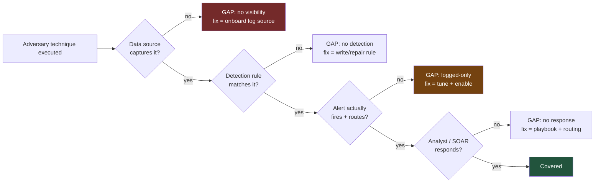
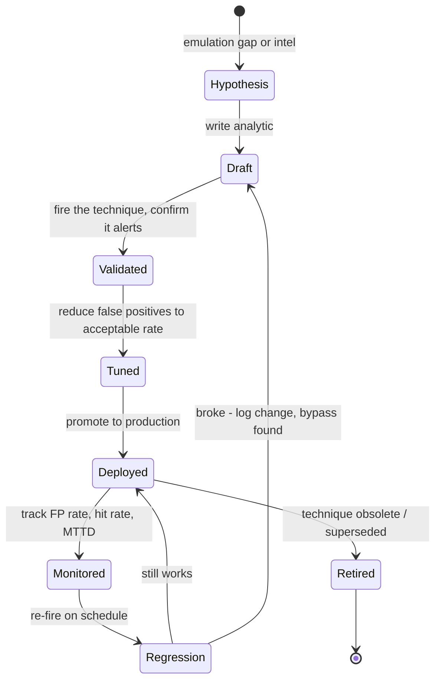
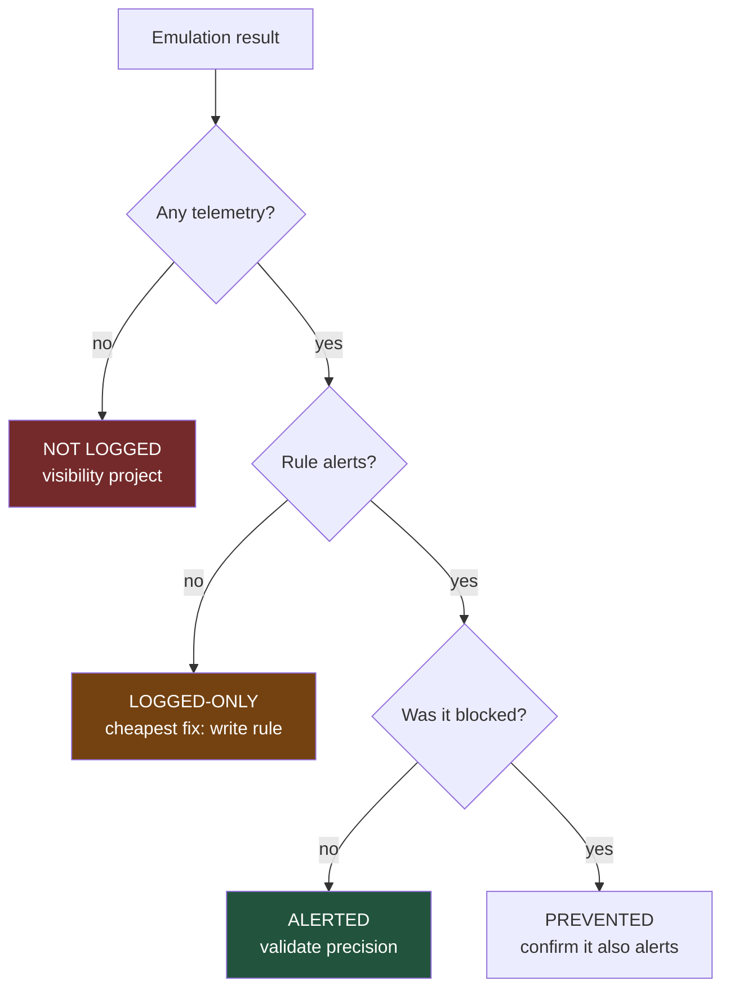
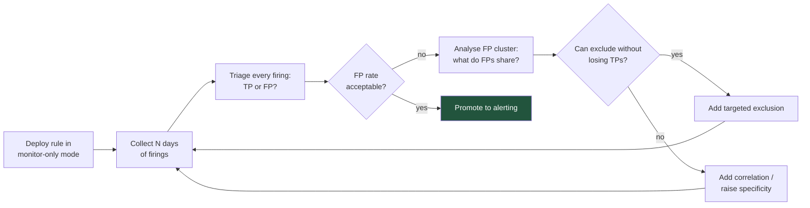
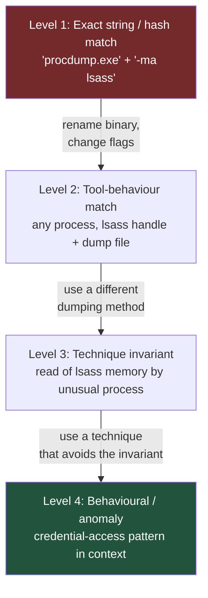
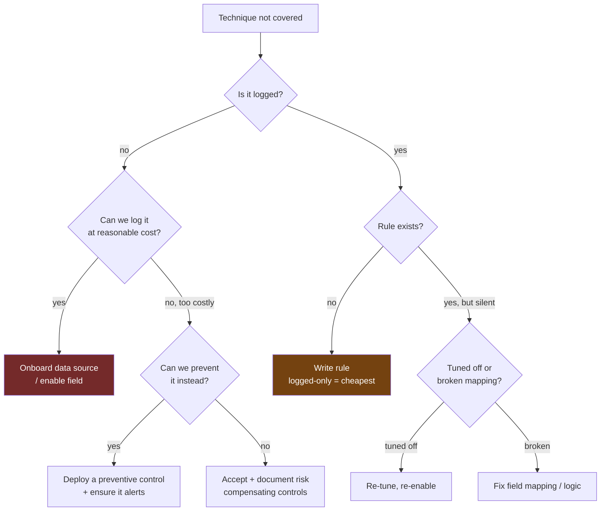
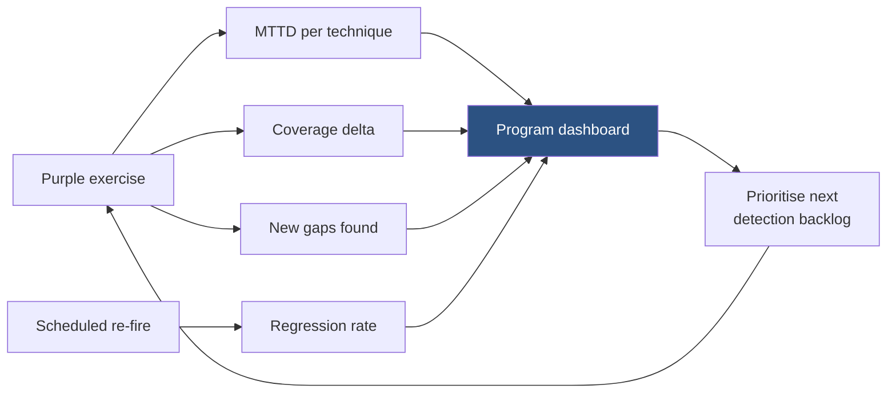

This is Chapter 3 of the Purple Team notebook. Chapter 2 built the offensive engine — Atomic Red Team for granular per-technique tests and CALDERA for chained autonomous operations — and ended holding a pile of results: techniques that were *not logged*, techniques that were *logged but never alerted*, and a handful that fired an alert. That pile is raw material, not an outcome. This chapter is about the other half of the loop: turning each of those results into a deployed, tuned, regression-tested detection, and honestly measuring how much of the adversary's playbook you can actually see.

The same discipline that governed the emulation chapters governs this one. Firing the techniques required explicit authorization; the detection work here is defensive and runs on telemetry you already own, but the *validation* of every detection means re-executing real adversary behaviour, so everything in the worked labs assumes the same authorized, snapshotted lab from Chapter 2.

## Why This Matters

Most organisations dramatically overestimate their detection coverage. They have hundreds of rules in a SIEM, a green dashboard, and a compliance report that says "we have detection." Then a purple exercise fires twenty catalogued techniques and fourteen produce no alert at all — not because the rules are bad, but because the data source was never onboarded, the rule matched a field the log does not contain, or the alert was tuned into silence two years ago after a false-positive storm and nobody turned it back on.

Detection validation is the practice that replaces belief with evidence. It rests on one uncomfortable distinction that this whole chapter is built around:

> **Having a log is not having a detection. Having a detection is not having an alert. Having an alert is not having a response.**

Each arrow in that chain is a place where coverage silently leaks. A technique can be perfectly visible in your telemetry and still go completely unnoticed, because visibility is a property of your *data* and detection is a property of your *analytics*, and the two are wired together by a rule that may or may not actually work. The job of this chapter is to make every one of those arrows explicit, testable, and measured — and then to close the gaps the measurement exposes.



## Part 1: The Detection Lifecycle

A detection is not a rule you write once. It is an artifact with a lifecycle, and treating it as a lifecycle is what separates detection *engineering* from ad-hoc rule-writing.



Each stage answers a specific question:

| Stage | Question | Evidence produced |
|---|---|---|
| **Hypothesis** | What behaviour do I want to catch, and why? | A named ATT&CK technique/procedure + threat rationale |
| **Draft** | What logic expresses that behaviour? | A Sigma rule (portable, reviewable) |
| **Validated** | Does the rule fire when the technique runs? | Emulation run + the resulting alert |
| **Tuned** | Does it fire *only* when it should? | False-positive rate over a baseline window |
| **Deployed** | Is it live and routed to someone? | Rule in production, alert destination confirmed |
| **Monitored** | Is it still healthy? | Hit rate, FP rate, MTTD trend |
| **Regression** | Does it still work after environment change? | Scheduled re-fire result |

The two stages everyone skips are **Validated** and **Regression**, and they are the two that matter most. A rule that was never validated is a hypothesis wearing a badge. A rule that is never regression-tested rots — a log-format change, an EDR agent upgrade, or a new bypass quietly turns a green rule red, and without scheduled re-firing you find out during the incident.

### 1.1 Where hypotheses come from

Three sources, in rough priority order:

1. **Emulation gaps (Chapter 2).** The highest-quality source, because it is grounded in your own environment's measured reality. A "not logged" or "logged-only" result *is* a detection hypothesis with the technique already named.
2. **Threat intelligence.** A report says an actor relevant to your sector uses a specific procedure; you write a detection for that procedure before they reach you.
3. **Incident retrospectives.** Something got through. Every incident should produce at least one detection that would have caught it earlier.

This chapter focuses on the first, because it is the direct continuation of the emulation loop and because it produces detections you can immediately validate by re-running the exact technique that exposed the gap.

## Part 2: Visibility Before Detection — The Data-Source Inventory

You cannot detect what you do not log. Before writing a single rule, you need to know what your telemetry actually contains, because the most common reason a technique produces no alert is not a bad rule — it is that the data source was never onboarded, or is onboarded but missing the field the detection needs.

### 2.1 The visibility question, made concrete

Take one technique: **OS Credential Dumping: LSASS Memory (T1003.001)**. For a detection to be *possible*, something must record one of these:

| Signal | Data source | Event |
|---|---|---|
| A process opened a handle to `lsass.exe` | Sysmon | Event ID 10 (ProcessAccess) |
| A process was created with a suspicious command line | Sysmon / Security | EID 1 / 4688 |
| A minidump file was written | Sysmon | EID 11 (FileCreate) |
| EDR flagged credential access behaviour | EDR telemetry | vendor-specific |
| A sensitive handle was granted | Security | 4656 / 4663 (needs SACL) |

If none of these is being collected and forwarded to your SIEM, then T1003.001 is **undetectable in principle** in your environment, and no amount of rule-writing changes that. The fix is a data-source project, not a detection project — and knowing which of those two problems you have is exactly what the inventory tells you.

### 2.2 Building the inventory

Map every ATT&CK data source you collect to the log that provides it and the fields it actually contains. A minimal, honest version:

| ATT&CK data source | Provided by | Key fields present? | Coverage |
|---|---|---|---|
| Process creation | Sysmon EID 1 + Security 4688 | Image, CommandLine, ParentImage, Hashes | Full (with cmdline auditing on) |
| Process access | Sysmon EID 10 | SourceImage, TargetImage, GrantedAccess, CallTrace | Full |
| Network connection | Sysmon EID 3 | Image, DestinationIp, DestinationPort | Full |
| File creation | Sysmon EID 11 | Image, TargetFilename | Full |
| Registry | Sysmon EID 12/13/14 | TargetObject, Details | Partial (config-dependent) |
| Authentication | Security 4624/4625/4768/4769 | LogonType, TargetUserName, ServiceName | Full on DCs |
| Command execution | PowerShell 4104, cmdline auditing | ScriptBlockText, CommandLine | Partial (depends on config) |
| Cloud API | CSP audit logs | eventName, sourceIPAddress, userIdentity | Varies by CSP |

**The single most important column is the third one.** "We collect Sysmon" is not the same as "we collect Sysmon Event ID 10 with `CallTrace` populated." Detections fail constantly because a data source is nominally present but the specific field the rule keys on is missing, empty, or truncated. Verify at the field level, not the source level.

### 2.3 Command-line auditing: the highest-leverage single fix

If one visibility gap is worth fixing before all others, it is **process command-line logging**. An enormous fraction of ATT&CK techniques manifest as a distinctive command line — `procdump -ma lsass.exe`, `nltest /dclist`, `reg save hklm\sam`, `vssadmin delete shadows` — and without the command line captured, process-creation events tell you *a process ran* but not *what it did*.

On Windows, this requires two settings, and both are commonly half-configured:

```
# 1. Audit process creation (produces Security Event ID 4688)
Computer Config > Policies > Windows Settings > Security Settings >
  Advanced Audit Policy > Detailed Tracking > Audit Process Creation = Success

# 2. Include the command line in 4688 (this is the part everyone forgets)
Computer Config > Policies > Administrative Templates > System >
  Audit Process Creation > Include command line in process creation events = Enabled
```

Without the second setting, 4688 events fire but the `CommandLine` field is absent, and a large swathe of your detections silently match nothing. Sysmon EID 1 captures the command line without the second GPO, which is one reason Sysmon is worth deploying alongside native auditing rather than instead of it. **Verify it is actually working**, do not assume:

```powershell
# Confirm 4688 events carry a command line
Get-WinEvent -FilterHashtable @{LogName='Security'; Id=4688} -MaxEvents 5 |
  ForEach-Object { ([xml]$_.ToXml()).Event.EventData.Data |
    Where-Object {$_.Name -eq 'CommandLine'} } | Format-List
```

If that returns empty `CommandLine` values, the second GPO is not applied, and fixing it will light up more detections than any rule you could write this week.

## Part 3: The Four-Outcome Model

Chapter 2 sorted results into "not logged / logged-only / alerted." That is a good start; this chapter sharpens it to four outcomes, because the fix for each is different and conflating them wastes effort.

| Outcome | Meaning | The gap | The fix |
|---|---|---|---|
| **Not logged** | No telemetry captured the behaviour at all | Visibility | Onboard a data source; enable a field |
| **Logged-only** | Telemetry exists, but no rule alerts on it | Detection | Write or repair an analytic |
| **Alerted** | A rule fired and routed to a human/SOAR | — (validate quality) | Tune to keep precision acceptable |
| **Prevented** | A control blocked the behaviour outright | — (validate it is logged too) | Confirm the block is *also* alerted |

Two subtleties that trip up teams:

- **Prevented is not automatically the best outcome.** A prevention that produces no telemetry means you blocked *this* attempt but have no signal that the adversary is present and trying. Prevention without detection is a blind block: it stops the technique but tells you nothing about the campaign. Always confirm that a prevented technique *also* generates an alert, so you learn that someone tried.
- **Logged-only is the highest-value bucket to work.** The data is already there; the cost of turning it into an alert is a rule, not an infrastructure project. When you triage a purple exercise's results, work logged-only first — it is the cheapest coverage you will ever buy.



## Part 4: Writing Detections From Scratch in Sigma

Sigma is the portable, vendor-neutral detection format — a YAML schema that expresses "what to look for" independently of any specific SIEM query language, then compiles down to Splunk SPL, Elastic KQL/EQL, Microsoft Sentinel KQL, and dozens of others. It is the right place to *author* detections because it makes them reviewable, version-controllable, and portable across the tools you will inevitably change.

### 4.1 Sigma taught from zero

A Sigma rule is a YAML document with a fixed structure. Here is the anatomy, field by field, using an LSASS-access detection as the worked example:

```yaml
title: Suspicious LSASS Process Access
id: 9a1b7c42-6f3e-4a5d-8b2c-1e0f9d7a6c50   # stable UUID, never reused
status: experimental                        # experimental | test | stable | deprecated
description: Detects a process opening a handle to lsass.exe with access rights
    consistent with credential dumping (read of process memory).
references:
    - https://attack.mitre.org/techniques/T1003/001/
author: purple-team
date: 2027/05/12
tags:
    - attack.credential-access
    - attack.t1003.001
logsource:
    product: windows
    category: process_access          # maps to Sysmon EID 10
detection:
    selection:
        TargetImage|endswith: '\lsass.exe'
        GrantedAccess|contains:
            - '0x1010'                # PROCESS_VM_READ | PROCESS_QUERY_INFORMATION
            - '0x1410'
            - '0x1438'
            - '0x143a'
            - '0x1fffff'              # PROCESS_ALL_ACCESS
    filter_legit:
        SourceImage|endswith:
            - '\wmiprvse.exe'
            - '\MsMpEng.exe'          # Defender legitimately reads lsass
    condition: selection and not filter_legit
falsepositives:
    - Endpoint protection products
    - Some backup and monitoring agents
level: high                            # informational | low | medium | high | critical
```

What each block does:

- **`title` / `id` / `description`** — human-readable identity. The `id` is a UUID that must remain stable for the rule's life so that tracking, deduplication, and coverage mapping work across renames.
- **`logsource`** — declares *what kind of log* this rule reads. `category: process_access` is the abstract Sigma category that the Sysmon backend maps to Event ID 10. This is what makes the rule portable: you write the abstract category, the backend knows the concrete event.
- **`detection.selection`** — the match logic. `TargetImage|endswith: '\lsass.exe'` uses a Sigma *modifier* (`endswith`) so it matches regardless of the full path. `GrantedAccess|contains` lists the access masks associated with reading process memory.
- **`detection.filter_legit`** — a named exclusion block for known-benign sources.
- **`condition`** — the boolean that ties selections together: `selection and not filter_legit`.
- **`falsepositives` / `level`** — metadata that downstream tooling uses for triage priority and that documents what you already know will misfire.

### 4.2 The Sigma modifiers you will use constantly

| Modifier | Meaning | Example |
|---|---|---|
| `contains` | Substring match | `CommandLine|contains: 'lsass'` |
| `startswith` / `endswith` | Anchored substring | `Image|endswith: '\procdump.exe'` |
| `all` | All listed values must match | `CommandLine|contains|all: ['-ma', 'lsass']` |
| `re` | Regular expression | `CommandLine|re: 'lsass.*\.dmp'` |
| `base64offset|contains` | Match base64-encoded content at any alignment | encoded PowerShell |
| `windash` | Match both `-` and `/` flag styles | `|windash|contains: '-ma'` |
| `cidr` | IP range match | `DestinationIp|cidr: '10.0.0.0/8'` |

The `all` and `windash` modifiers matter more than they look. `CommandLine|contains|all: ['-ma', 'lsass']` requires *both* substrings, which is far more precise than matching either alone — it is the difference between "any command line mentioning lsass" (noisy) and "a full-memory dump targeting lsass" (specific). `windash` catches the trivial evasion of swapping `-ma` for `/ma`.

### 4.3 Translating Sigma to your SIEM

Sigma compiles with the `sigma` CLI (the `pySigma` toolchain). Install and convert:

```bash
pip install sigma-cli pysigma-backend-splunk pysigma-backend-elasticsearch
```

- `sigma-cli` — the command-line front end.
- `pysigma-backend-splunk` / `-elasticsearch` — backend plugins; each target SIEM needs its backend installed.

```bash
# Sigma -> Splunk SPL
sigma convert -t splunk -p sysmon lsass_access.yml
```

```
`sysmon` EventCode=10 TargetImage="*\\lsass.exe"
(GrantedAccess="*0x1010*" OR GrantedAccess="*0x1410*" OR GrantedAccess="*0x1438*"
 OR GrantedAccess="*0x143a*" OR GrantedAccess="*0x1fffff*")
NOT (SourceImage="*\\wmiprvse.exe" OR SourceImage="*\\MsMpEng.exe")
```

```bash
# Sigma -> Elastic (Lucene/KQL via the elasticsearch backend)
sigma convert -t elasticsearch -p sysmon -f dsl_lucene lsass_access.yml
```

```
winlog.event_id:10 AND winlog.event_data.TargetImage:*\\lsass.exe AND
(winlog.event_data.GrantedAccess:*0x1010* OR winlog.event_data.GrantedAccess:*0x1410*
 OR winlog.event_data.GrantedAccess:*0x1438* OR winlog.event_data.GrantedAccess:*0x143a*
 OR winlog.event_data.GrantedAccess:*0x1fffff*) AND
NOT (winlog.event_data.SourceImage:*\\wmiprvse.exe OR
     winlog.event_data.SourceImage:*\\MsMpEng.exe)
```

- `-t` — target backend.
- `-p sysmon` — a *pipeline* that maps Sigma's abstract field names to the concrete field names your log shipper produces. This is the piece that makes the same rule work whether your Sysmon data lands as `TargetImage` (raw) or `winlog.event_data.TargetImage` (Winlogbeat). Getting the pipeline right is 90% of making translation work.
- `-f dsl_lucene` — output format within the backend.

**The pipeline is where translation succeeds or fails.** A Sigma rule that is logically perfect will match nothing if the pipeline maps `TargetImage` to a field your indexer does not use. When a converted rule returns zero results against data you *know* contains the event, suspect the field mapping before the logic.

## Part 5: The Detection-Quality Bar

A rule that fires is not a good rule. A good rule fires when it should and stays quiet when it should not, and you need vocabulary and numbers to reason about that trade-off.

### 5.1 The confusion matrix, applied to detections

| | Malicious activity present | No malicious activity |
|---|---|---|
| **Rule fires** | True positive (TP) — the goal | False positive (FP) — alert fatigue |
| **Rule silent** | False negative (FN) — the miss | True negative (TN) — correct silence |

Two derived numbers govern detection quality:

- **Precision** = `TP / (TP + FP)` — of the alerts that fired, what fraction were real? Low precision means analysts drown in false alarms and start ignoring the rule.
- **Recall** (detection rate) = `TP / (TP + FN)` — of the real activity, what fraction did we catch? Low recall means the technique slips past.

There is a permanent tension between them. Broaden a rule to catch more variants (raise recall) and you usually catch more benign activity too (lower precision). Tighten it for precision and you miss edge cases. **Detection engineering is the management of that trade-off, per rule, with the acceptable point set by how the alert is consumed.**

### 5.2 The alert-fatigue economy

Precision is not an abstract virtue; it has an operational cost that compounds. A rule that fires 50 times a day at 4% precision produces 48 false alerts daily. Analysts learn, correctly, that this rule is noise, and they start dismissing it without investigation — at which point its recall is effectively zero regardless of what the matrix says, because a true positive that gets reflexively closed is a miss.

> **A high-recall, low-precision rule that trains analysts to ignore it is worse than no rule, because it also degrades attention to the rules around it.**

This is why "we have a detection for that" is a claim to interrogate, not accept. A detection tuned into the noise floor is a liability wearing the costume of a control.

### 5.3 Setting the acceptable false-positive rate by consumer

The tolerable FP rate depends entirely on what happens when the alert fires:

| Alert destination | Tolerable FP rate | Rationale |
|---|---|---|
| Auto-isolate host (SOAR, no human) | Near zero | A false positive takes a production host offline |
| Page an on-call analyst | Very low | Each FP is an interrupted human at cost |
| SOC queue for triage | Low-moderate | Humans filter, but volume still causes fatigue |
| Enrichment / correlation only (no standalone alert) | High acceptable | Feeds a broader analytic; never fires alone |

The same underlying analytic can live at multiple points on this table. A noisy behavioural signal that is useless as a standalone page can be extremely valuable as a *correlation input* — "LSASS access" alone is moderate, but "LSASS access **followed within 60s by** an outbound connection to a new IP from the same process" is a high-precision alert built from two individually noisier signals. **Composition buys precision without sacrificing recall**, and it is the main tool for escaping the precision/recall tension.

## Part 6: Tuning Methodology

Tuning is the process of moving a validated-but-noisy rule to acceptable precision without destroying its recall. Done carelessly, tuning is just "add exclusions until it stops firing," which is how rules get tuned into silence. Done well, it is evidence-driven.

### 6.1 The tuning loop



The critical discipline: **run in monitor-only mode first, and triage every firing.** You cannot tune what you have not characterised. A rule pushed straight to alerting is tuned reactively, under pressure, during a false-positive storm — which produces over-broad exclusions that punch holes in coverage.

### 6.2 Exclusion patterns, good and bad

Not all exclusions are equal. The goal is to exclude the *benign cause*, as narrowly as possible, never the malicious behaviour.

```yaml
# BAD: excludes by broad attribute - punches a hole an attacker walks through
filter_bad:
    SourceImage|endswith: '\powershell.exe'   # attackers use powershell too!

# BETTER: exclude a specific benign parent+child+path combination
filter_backup_agent:
    SourceImage|endswith: '\backup-agent.exe'
    SourceImage|startswith: 'C:\Program Files\VendorBackup\'
    ParentImage|endswith: '\services.exe'

# BEST for a hash-stable tool: exclude by signed publisher + path, and
# document why, so the exclusion can be reviewed later
filter_known_good:
    Signed: 'true'
    Signature: 'Trusted Vendor Inc'
    SourceImage|startswith: 'C:\Program Files\VendorBackup\'
```

The difference is the size of the hole. Excluding "all PowerShell" tells the attacker exactly which interpreter to use. Excluding "this specific signed binary, from this path, launched by services.exe" removes the one benign cause while leaving the malicious variants fully covered. **Every exclusion is an attack surface; size it accordingly and document the benign cause so a future reviewer can tell whether it is still needed.**

### 6.3 Thresholds and baselining

Some behaviours are only suspicious in *volume*. A single Kerberos service-ticket request (Event 4769) is normal; hundreds from one account in a minute is Kerberoasting. This is a threshold detection, and thresholds must be baselined against your environment, not guessed:

```yaml
title: Potential Kerberoasting - Bulk RC4 TGS Requests
logsource:
    product: windows
    service: security
detection:
    selection:
        EventID: 4769
        TicketEncryptionType: '0x17'      # RC4 - downgrade favoured by Kerberoasting
        ServiceName|endswith: '$'         # computer/service accounts
    filter_normal:
        ServiceName: 'krbtgt'
    timeframe: 5m
    condition: selection and not filter_normal | count() by IpAddress > 20
level: high
```

The `> 20` is not a magic number — it is a value you set *after* measuring your own baseline. Query 30 days of 4769 events, find the 99th-percentile per-source request rate for legitimate activity, and set the threshold above it:

```
# Baseline query (Splunk) - what does NORMAL look like?
`security` EventCode=4769 Ticket_Encryption_Type=0x17
| bucket _time span=5m
| stats count by _time, Client_Address
| stats p95(count) p99(count) max(count)
```

```
p95(count)  p99(count)  max(count)
   3           7          14
```

With a legitimate 99th percentile of 7 and a max of 14 over 30 days, a threshold of 20 sits comfortably above normal while still catching the hundreds-per-minute signature of an actual Kerberoasting sweep. **Guessing the threshold produces either a rule that never fires or one that fires constantly; measuring it produces a rule that fires on the attack and nothing else.**

## Part 7: The Analytic Robustness Ladder

Not all detections for the same technique are equally durable. The same behaviour can be detected by logic that an attacker trivially bypasses or by logic that is expensive to evade, and knowing where your rule sits on that ladder tells you how much you actually trust it.



| Level | Detects | Bypassed by | Durability |
|---|---|---|---|
| **1. String/hash** | `procdump.exe -ma lsass.exe` literally | Rename binary, change flags, use `/ma` | Brittle |
| **2. Tool behaviour** | Any process opening lsass + writing a `.dmp` | A dumping method that does not write a file (direct syscall, MiniDump variants) | Moderate |
| **3. Technique invariant** | An unusual process reading lsass memory at all | Techniques that avoid touching lsass (DCSync, from a legit process) | Strong |
| **4. Behavioural** | Credential-access *pattern* in context, regardless of tool | Genuinely novel TTPs; expensive for the attacker | Strongest |

The lesson is not "always build level 4." Level-1 rules are cheap, precise, and genuinely useful against unsophisticated actors and commodity tooling — most real intrusions use off-the-shelf tools with default names. The lesson is to **know which level each rule is at, and not to mistake a level-1 rule for coverage of the technique.** A green "T1003.001 detected" that rests on a string match for `procdump.exe` is real coverage against the actor who runs procdump unmodified and zero coverage against the one who renamed it. Coverage scoring (Part 9) must account for this, or it lies to you.

**Red-team value of the ladder:** when you are the offensive half of the purple exercise, deliberately climbing the ladder — run the technique first with the default tool, then renamed, then with a file-less variant — is exactly how you discover which level your defenders' rules actually sit at. Each rung that still alerts is a rung of genuine coverage; the first rung that goes silent is the boundary of real detection.

## Part 8: Detection-as-Code

Detections are software. Treating them as software — versioned, reviewed, tested, and continuously deployed — is what turns a pile of SIEM rules into a maintainable detection program.

### 8.1 The repository structure

```
detections/
├── rules/
│   ├── credential_access/
│   │   ├── T1003.001_lsass_access.yml
│   │   └── T1003.006_dcsync.yml
│   └── discovery/
│       └── T1087_account_discovery.yml
├── tests/
│   ├── T1003.001_lsass_access.test.yml      # expected match / no-match cases
│   └── ...
├── pipelines/
│   └── sysmon_winlogbeat.yml                 # field-mapping pipeline
└── .ci/
    └── validate.sh
```

Everything is YAML, everything is in version control, every change goes through review. The `id` UUID in each rule makes renames and moves safe. This structure is what makes coverage measurable, because the repository *is* the source of truth for what you detect.

### 8.2 Unit-testing a detection

A detection test asserts that the rule matches known-malicious log lines and does *not* match known-benign ones. This is what catches a broken rule before it reaches production.

```yaml
# T1003.001_lsass_access.test.yml
rule: rules/credential_access/T1003.001_lsass_access.yml
should_match:
    - name: procdump reads lsass
      event:
        EventID: 10
        TargetImage: 'C:\Windows\System32\lsass.exe'
        SourceImage: 'C:\tools\procdump.exe'
        GrantedAccess: '0x1fffff'
should_not_match:
    - name: defender reads lsass legitimately
      event:
        EventID: 10
        TargetImage: 'C:\Windows\System32\lsass.exe'
        SourceImage: 'C:\Program Files\Windows Defender\MsMpEng.exe'
        GrantedAccess: '0x1010'
    - name: unrelated process access
      event:
        EventID: 10
        TargetImage: 'C:\Windows\System32\svchost.exe'
        SourceImage: 'C:\tools\procdump.exe'
        GrantedAccess: '0x1fffff'
```

The `should_not_match` cases are the important ones. They encode the *precision* requirements as executable assertions: if a future edit to broaden recall accidentally starts matching Defender's legitimate access, the test fails and the regression never ships.

### 8.3 The CI pipeline

```bash
#!/usr/bin/env bash
# .ci/validate.sh - run on every pull request to the detections repo
set -euo pipefail

echo "== 1. Sigma syntax and schema validation =="
sigma check rules/

echo "== 2. Every rule must compile to our production backend =="
for rule in $(find rules -name '*.yml'); do
  sigma convert -t splunk -p pipelines/sysmon_winlogbeat.yml "$rule" >/dev/null \
    || { echo "COMPILE FAIL: $rule"; exit 1; }
done

echo "== 3. Unit tests: match/no-match assertions =="
python3 .ci/run_tests.py tests/

echo "== 4. Metadata policy: every rule has an ATT&CK tag and an owner =="
for rule in $(find rules -name '*.yml'); do
  grep -q 'attack\.' "$rule" || { echo "NO ATTACK TAG: $rule"; exit 1; }
  grep -q '^author:'  "$rule" || { echo "NO AUTHOR: $rule"; exit 1; }
done

echo "All detection checks passed."
```

```
== 1. Sigma syntax and schema validation ==
Checking 3 rules... OK
== 2. Every rule must compile to our production backend ==
== 3. Unit tests: match/no-match assertions ==
T1003.001_lsass_access: 1 match / 2 no-match ... PASS
T1003.006_dcsync: 2 match / 1 no-match ... PASS
== 4. Metadata policy: every rule has an ATT&CK tag and an owner ==
All detection checks passed.
```

Every one of those four checks corresponds to a way rules break in production: invalid syntax, a rule that does not compile against your actual field mapping, a rule whose logic regressed, and a rule with no ATT&CK tag (which means it is invisible to coverage scoring) or no owner (which means nobody maintains it). **The metadata policy check is the one that keeps coverage measurement honest** — a rule with no `attack.` tag detects something, but you cannot count it, so as far as your coverage map is concerned it does not exist.

## Part 9: Measuring Coverage Honestly

Coverage measurement is where purple programs most often lie to themselves. A Navigator heat-map with lots of green feels like progress; whether it *is* progress depends entirely on what the green means.

### 9.1 Technique coverage vs procedure coverage

ATT&CK is organised as techniques (T1003) and sub-techniques (T1003.001), but a technique is executed through many *procedures* — concrete implementations. LSASS dumping (T1003.001) can be done with procdump, comsvcs.dll, Task Manager, direct MiniDumpWriteDump calls, nanodump, and a dozen more. A rule that catches procdump gives you *procedure* coverage of one procedure and *technique* coverage of exactly nothing beyond it.

> **Colouring T1003.001 green because you catch procdump overstates your coverage by however many procedures you do not catch.** Honest coverage scoring counts procedures, or at minimum annotates each technique with which procedures are covered and at which robustness level (Part 7).

### 9.2 A scoring scheme that does not lie

Score each technique on two axes, not one:

| Score | Detection breadth | Robustness (Part 7) |
|---|---|---|
| 0 | No detection | — |
| 1 | One procedure | Level 1 (string/hash) |
| 2 | Several procedures | Level 2 (tool behaviour) |
| 3 | Most known procedures | Level 3 (technique invariant) |
| 4 | Technique-invariant + behavioural backstop | Level 4 |

A technique at breadth-1/robustness-1 is *touched*, not *covered*. Reserve "covered" (green) for breadth 3+ at robustness 3+. Everything in between is amber, and amber is honest.

### 9.3 Generating the Navigator layer from your rules

Because detection-as-code tags every rule with its ATT&CK technique, you can generate the coverage layer mechanically rather than colouring by vibe:

```python
#!/usr/bin/env python3
"""coverage_layer.py - build an ATT&CK Navigator layer from tagged Sigma rules.
Counts DISTINCT rules per technique as a breadth proxy, and reads a robustness
annotation if present. Mechanical generation removes wishful colouring."""
import glob, re, json, yaml, collections

tech = collections.defaultdict(lambda: {"rules": 0, "robustness": 0})

for path in glob.glob("rules/**/*.yml", recursive=True):
    doc = yaml.safe_load(open(path))
    tags = doc.get("tags", []) or []
    robu = int((doc.get("custom", {}) or {}).get("robustness", 1))
    for t in tags:
        m = re.match(r"attack\.t(\d{4})(\.\d{3})?", t.lower())
        if not m:
            continue
        tid = "T" + m.group(1) + (m.group(2).upper() if m.group(2) else "")
        tech[tid]["rules"] += 1
        tech[tid]["robustness"] = max(tech[tid]["robustness"], robu)

def score(v):
    breadth = min(v["rules"], 3)
    return min(breadth, v["robustness"]) if v["robustness"] else breadth

layer = {
    "name": "Purple Team Coverage",
    "versions": {"layer": "4.5", "attack": "15"},
    "domain": "enterprise-attack",
    "techniques": [
        {"techniqueID": tid,
         "score": score(v),
         "comment": f"{v['rules']} rule(s), robustness L{v['robustness']}"}
        for tid, v in sorted(tech.items())
    ],
    "gradient": {"colors": ["#742a2a", "#744210", "#22543d"], "minValue": 0, "maxValue": 4},
}
json.dump(layer, open("coverage.json", "w"), indent=2)
print(f"wrote coverage.json covering {len(tech)} techniques")
for tid, v in sorted(tech.items()):
    print(f"  {tid:12} score={score(v)}  ({v['rules']} rules, L{v['robustness']})")
```

```
wrote coverage.json covering 5 techniques
  T1003.001    score=1  (1 rules, L1)
  T1003.006    score=2  (1 rules, L2)
  T1053.005    score=2  (2 rules, L1)
  T1069.002    score=1  (1 rules, L1)
  T1087        score=1  (1 rules, L1)
```

That output is uncomfortable, and it is meant to be. Five techniques have rules, but only one scores above a 1 — the rest are single string-match rules that catch the default tool and nothing else. **This is a far more useful artifact than a wall of green, because every score-1 line is a specific, prioritisable piece of work**: either add procedures (breadth) or climb the robustness ladder. Load `coverage.json` into ATT&CK Navigator and the gaps are visible at a glance, mapped onto the same matrix your threat intelligence uses.

### 9.4 Coverage against a specific adversary

Generic ATT&CK coverage is less useful than coverage against the actors who actually target your sector. Overlay your coverage layer on an emulation-plan layer (the CTID plans from Chapter 2) and the intersection is what matters: **techniques this actor is known to use that you cannot detect.** That intersection, not the whole matrix, is your prioritised backlog.

## Part 10: Closing the Gap — Choosing the Right Fix

A gap is not always a rule-writing problem. Diagnosing *which kind* of gap you have determines the fix, and picking the wrong fix wastes a quarter.



The decision hierarchy, in order of cost:

1. **Logged-only → write a rule.** Cheapest. The data is already there. Always exhaust this bucket first.
2. **Not logged but cheaply loggable → onboard the source.** Moderate cost, but it often lights up *many* techniques at once (turning on command-line auditing is one config change that improves dozens of detections).
3. **Not logged, expensive to log → consider prevention.** If detecting something requires a costly new telemetry pipeline, a preventive control (application allow-listing, LSASS protection via RunAsPPL, disabling a legacy protocol) may be cheaper and stronger — *provided it also emits an alert* (Part 3).
4. **None of the above viable → accept and document.** Some techniques are genuinely uneconomic to detect in a given environment. The correct action is an explicit, documented risk acceptance with compensating controls, not a green square that pretends the gap is closed.

**Prevention deserves more weight than detection-centric teams usually give it.** A detection tells you the attacker succeeded; a prevention stops them. For high-severity, well-understood techniques — LSASS access is the canonical example — turning on **RunAsPPL** (Protected Process Light for LSASS) or Credential Guard blocks the entire class more reliably than any detection catches it. The purple exercise then validates the prevention: fire the technique, confirm it is *blocked*, and confirm the block *alerts*. Prevention and detection are complements, and the strongest coverage uses both.

## Part 11: Lab 1 — Validate and Harden an LSASS-Access Detection

**Authorization and scope:** the snapshotted Windows lab VM from Chapter 2, with Sysmon (a modern config such as `sysmon-modular`) and log forwarding to your SIEM. Nothing here runs outside that lab.

### 11.1 Baseline — confirm the gap

Fire the technique and observe the current state:

```powershell
# From the authorized lab VM, using Invoke-AtomicRedTeam (Chapter 2)
Invoke-AtomicTest T1003.001 -TestNumbers 1 -GetPrereqs
Invoke-AtomicTest T1003.001 -TestNumbers 1
```

Atomic Test #1 runs a procdump-style memory dump of lsass. Now check what telemetry appeared:

```
# Splunk - did Sysmon EID 10 capture it?
`sysmon` EventCode=10 TargetImage="*lsass.exe" | table _time SourceImage GrantedAccess CallTrace
```

```
_time                SourceImage              GrantedAccess  CallTrace
2027-05-12 10:14:03  C:\tools\procdump64.exe  0x1fffff       C:\Windows\SYSTEM32\ntdll.dll+9d...
```

The event exists (so this is **logged-only**, not *not-logged*), but if no alert fired, the detection gap is a missing rule. Deploy the Part 4.1 Sigma rule and re-fire.

### 11.2 Validate the rule fires

```powershell
Invoke-AtomicTest T1003.001 -TestNumbers 1
```

```
# Splunk - did the DEPLOYED RULE alert?
index=notable source="Suspicious LSASS Process Access" | table _time SourceImage GrantedAccess
```

```
_time                SourceImage              GrantedAccess
2027-05-12 10:31:22  C:\tools\procdump64.exe  0x1fffff
```

Validated: the rule fires on the technique. But Part 7 says this may be a level-1/2 detection. Test its robustness by climbing the ladder.

### 11.3 Climb the robustness ladder

```powershell
# Rung 2: rename the binary - does a hash/name-based rule survive?
Copy-Item C:\tools\procdump64.exe C:\tools\svchost-update.exe
C:\tools\svchost-update.exe -accepteula -ma lsass.exe C:\temp\out.dmp

# Rung 3: a different dumping method entirely - comsvcs.dll MiniDump
$p = (Get-Process lsass).Id
rundll32.exe C:\Windows\System32\comsvcs.dll, MiniDump $p C:\temp\out2.dmp full
```

Re-check the alert after each:

```
index=notable source="Suspicious LSASS Process Access"
| eval technique_variant=case(
    SourceImage LIKE "%procdump%","default-tool",
    SourceImage LIKE "%svchost-update%","renamed-binary",
    SourceImage LIKE "%rundll32%","comsvcs-minidump",
    true(),"other")
| stats count by technique_variant
```

```
technique_variant   count
comsvcs-minidump      1
default-tool          1
renamed-binary        1
```

All three variants alerted — because the Part 4.1 rule keys on `TargetImage=lsass.exe` + `GrantedAccess` (a **level-3 technique-invariant** signal: something read lsass memory with dump-capable rights), not on the source binary's name. Had the rule instead matched `SourceImage|endswith: '\procdump.exe'`, the renamed and comsvcs variants would both have slipped through. **That is the difference the robustness ladder measures, made concrete: the same green "detected" hides completely different real coverage.**

### 11.4 Add the prevention and re-validate

```powershell
# Enable LSASS as a Protected Process Light (RunAsPPL) - blocks the read entirely
New-ItemProperty -Path 'HKLM:\SYSTEM\CurrentControlSet\Control\Lsa' `
  -Name RunAsPPL -Value 1 -PropertyType DWORD -Force
# reboot, then re-fire
Invoke-AtomicTest T1003.001 -TestNumbers 1
```

```
# procdump now fails to open lsass with the needed access
[10:58:14] Error: Unable to open process 5 (0x5, Access is denied)
```

The technique is now **prevented**. Confirm per Part 3 that the block also alerts (Sysmon EID 10 with a denied access, or the EDR's PPL-violation event), so you learn that someone tried. Prevention plus a technique-invariant detection plus an alert on the prevented attempt — that is what full coverage of one sub-technique actually looks like.

## Part 12: Lab 2 — Turn a Logged-Only Kerberoasting Result into a Tuned Alert

**Scope:** the lab domain controller from Chapter 2, with Security event forwarding.

### 12.1 The starting result

Chapter 2's emulation fired T1558.003 (Kerberoasting) and produced a **logged-only** result: Security Event 4769 events appeared, but no alert. The naive fix — alert on every 4769 with RC4 encryption — would fire thousands of times a day, because RC4 service tickets are normal in many environments. This is the precision problem from Part 5, and it is why the rule needs a threshold, baselined per Part 6.3.

### 12.2 Baseline the environment

```
`security` EventCode=4769 Ticket_Encryption_Type=0x17 Service_Name!="krbtgt"
| bucket _time span=5m
| stats dc(Service_Name) as distinct_services count by _time, Client_Address
| stats p95(distinct_services) p99(distinct_services) max(distinct_services)
```

```
p95(distinct_services)  p99(distinct_services)  max(distinct_services)
      2                       4                      6
```

Legitimate clients request RC4 tickets for at most a handful of distinct services in any 5-minute window. Kerberoasting sweeps request them for *dozens* — one per SPN in the domain. The distinguishing feature is **distinct service count**, not raw volume, which is a more precise signal than the count-only version in Part 6.3.

### 12.3 The tuned detection

```yaml
title: Kerberoasting - Bulk Distinct SPN RC4 Ticket Requests
id: 3f8c1d90-2a44-4e6b-9c17-88b0e2a4f611
status: test
logsource:
    product: windows
    service: security
detection:
    selection:
        EventID: 4769
        TicketEncryptionType: '0x17'
    filter_krbtgt:
        ServiceName: 'krbtgt'
    filter_machine_self:
        ServiceName|endswith: '$'
        AccountName|endswith: '$'          # machine requesting its own class - benign pattern
    timeframe: 5m
    condition: selection and not filter_krbtgt and not filter_machine_self
        | count(ServiceName) by AccountName, IpAddress > 10
level: high
custom:
    robustness: 3
```

### 12.4 Validate and confirm precision

```powershell
# Re-fire the technique from the authorized attacker VM
Invoke-AtomicTest T1558.003 -TestNumbers 1   # Rubeus/PowerView kerberoast sweep
```

```
index=notable source="Kerberoasting - Bulk Distinct SPN RC4 Ticket Requests"
| table _time AccountName IpAddress distinct_spn_count
```

```
_time                AccountName   IpAddress     distinct_spn_count
2027-05-12 11:42:07  svc-attacker  10.0.14.55    37
```

Fires on the sweep (37 distinct SPNs, far above the baseline max of 6). Now confirm it stays quiet during normal operation: run the rule in monitor-only mode across a normal business day and confirm zero firings from legitimate accounts. The threshold of 10 sits above the 99th-percentile-of-4 baseline with margin, so precision should be high — but you *measure* it rather than assume it, which is the entire discipline of Part 6.

## Part 13: Lab 3 — A Detection-as-Code Pipeline With Tests

**Scope:** a local git repository; no target systems touched. This lab builds the Part 8 pipeline end to end.

### 13.1 Set up the repository

```bash
mkdir -p detect-lab/{rules/credential_access,tests,pipelines,.ci} && cd detect-lab
git init -q

# The rule from Part 4.1
cp ~/lsass_access.yml rules/credential_access/T1003.001_lsass_access.yml
# The test from Part 8.2
cp ~/T1003.001_lsass_access.test.yml tests/
```

### 13.2 A minimal test runner

```python
#!/usr/bin/env python3
"""run_tests.py - evaluate Sigma rules against should_match / should_not_match
sample events. A tiny matcher that understands the modifiers used in the rules."""
import sys, glob, yaml

def field_match(rule_val, event_val):
    if isinstance(rule_val, dict):
        return True  # nested handled by caller
    if isinstance(rule_val, list):
        return any(field_match(v, event_val) for v in rule_val)
    return str(rule_val).lstrip("*").rstrip("*").lower() in str(event_val).lower()

def matches(detection, event):
    sel = detection.get("selection", {})
    for key, want in sel.items():
        field = key.split("|")[0]
        ev = event.get(field, "")
        if not field_match(want, ev):
            return False
    for fname, filt in detection.items():
        if not fname.startswith("filter"):
            continue
        if all(field_match(v, event.get(k.split("|")[0], "")) for k, v in filt.items()):
            return False   # a filter block matched -> excluded
    return True

fails = 0
for tf in glob.glob(f"{sys.argv[1]}/*.test.yml"):
    spec = yaml.safe_load(open(tf))
    rule = yaml.safe_load(open(spec["rule"]))
    det = rule["detection"]
    name = rule["title"]
    m = nm = 0
    for case in spec.get("should_match", []):
        if matches(det, case["event"]): m += 1
        else: fails += 1; print(f"  FAIL should_match: {name} / {case['name']}")
    for case in spec.get("should_not_match", []):
        if not matches(det, case["event"]): nm += 1
        else: fails += 1; print(f"  FAIL should_not_match: {name} / {case['name']}")
    print(f"{name}: {m} match / {nm} no-match ... {'PASS' if not fails else 'FAIL'}")

sys.exit(1 if fails else 0)
```

```bash
python3 .ci/run_tests.py tests/
```

```
Suspicious LSASS Process Access: 1 match / 2 no-match ... PASS
```

### 13.3 Prove the pipeline catches a regression

Now break the rule the way a careless "reduce false positives" edit would, and watch CI catch it:

```bash
# Someone over-broadens an exclusion to silence a noisy vendor tool
cat >> rules/credential_access/T1003.001_lsass_access.yml <<'EOF'
    filter_toobroad:
        GrantedAccess|contains: '0x1fffff'   # BAD: excludes full-access reads = the attack
EOF
# update condition to include the bad filter
sed -i 's/condition: selection and not filter_legit/condition: selection and not filter_legit and not filter_toobroad/' \
    rules/credential_access/T1003.001_lsass_access.yml

python3 .ci/run_tests.py tests/
```

```
  FAIL should_match: Suspicious LSASS Process Access / procdump reads lsass
Suspicious LSASS Process Access: 0 match / 2 no-match ... FAIL
```

The `should_match` case for procdump now fails, because the over-broad exclusion swallowed the actual attack. **CI blocks the merge.** This is the whole point of detection-as-code: the regression that would have silently gutted your LSASS coverage in production is caught by a test in a pull request, before it ever ships. Revert the bad filter and the pipeline goes green again.

## Part 14: Program Metrics — MTTD, MTTR, and Coverage Trend

Individual detections are the unit of work; the program is measured in aggregate. Four metrics, tracked over time, tell you whether the purple loop is actually improving your posture.

| Metric | Definition | What it tells you | Watch out for |
|---|---|---|---|
| **MTTD** | Mean time to detect: technique execution → alert | Speed of the detection layer | Only meaningful for techniques you *can* detect; improving MTTD while coverage is low is measuring the wrong thing |
| **MTTR** | Mean time to respond: alert → containment | Speed of the response layer | Gaming by auto-closing alerts; measure to *containment*, not to acknowledgement |
| **Coverage** | Score-3+ techniques / relevant-actor techniques | Breadth and depth of detection | Technique vs procedure coverage (Part 9.1) |
| **Regression rate** | Detections that broke since last test / total | Health / rot of the rule base | A rising rate means environment change is outpacing maintenance |

The metric most often reported and least often useful is a raw MTTD number with no coverage context. **MTTD only measures the things you already detect**; a team can have a superb 4-minute MTTD and catch 30% of relevant techniques. Report MTTD *and* coverage together, always, or the number flatters you.

The most under-reported and most diagnostic metric is **regression rate**. It is the one that reveals whether your detections are rotting faster than you fix them — a log-source migration, an EDR upgrade, or a Sysmon config change can quietly break dozens of rules at once, and without scheduled regression testing (Part 1) you learn about it from a missed incident. A healthy program re-fires its detection corpus on a schedule and tracks how many still work.



## Part 15: Common Pitfalls and Myths

### 15.1 Pitfalls

| # | Pitfall | Consequence | Fix |
|---|---|---|---|
| 1 | Counting rules instead of validated detections | Green dashboard, real gaps | Validate by firing the technique (Part 11) |
| 2 | Confusing visibility with detection | "We have Sysmon" ≠ coverage | Data-source inventory at field level (Part 2) |
| 3 | Tuning a rule into silence to stop FPs | Recall drops to zero unnoticed | Narrow, documented exclusions; monitor-only first (Part 6) |
| 4 | String/hash rules mistaken for technique coverage | Bypassed by a rename | Score robustness; climb the ladder (Part 7, 11.3) |
| 5 | Colouring techniques green on one procedure | Overstated coverage | Procedure-aware scoring (Part 9.1) |
| 6 | No regression testing | Rules rot silently | Scheduled re-fire (Part 1, 14) |
| 7 | Alerting on prevention without confirming telemetry | Blind block; no campaign signal | Confirm prevented techniques also alert (Part 3) |
| 8 | Guessing thresholds | Rule never fires or fires constantly | Baseline against your own data (Part 6.3) |
| 9 | Broad exclusions (`exclude all powershell`) | Attacker walks through the hole | Exclude the benign *cause*, narrowly (Part 6.2) |
| 10 | MTTD reported without coverage | Flattering, misleading | Always report MTTD and coverage together (Part 14) |
| 11 | Detections not in version control | No review, no tests, no history | Detection-as-code (Part 8) |
| 12 | Rules with no ATT&CK tag | Invisible to coverage scoring | Enforce metadata in CI (Part 8.3) |
| 13 | Fixing "not logged" by writing a rule | Rule matches nothing | Diagnose the gap type first (Part 10) |
| 14 | Command-line auditing half-configured | Half your rules match empty fields | Verify 4688 carries CommandLine (Part 2.3) |

### 15.2 Myths

**"We have hundreds of rules, so we have good coverage."** Rule count is uncorrelated with coverage. A hundred string-match rules for commodity tools can leave every technique-invariant path open. Coverage is measured by validated detection at a known robustness level, not by rule count.

**"If it's logged, we'll catch it."** Logging is necessary, not sufficient. Logged-only is an entire outcome category (Part 3) precisely because vast amounts of relevant telemetry are collected and never alerted on.

**"Prevention means we don't need detection."** A prevention that does not alert is a blind block — it stops one attempt and tells you nothing about the adversary's presence. Prevention and detection are complements (Part 10).

**"A green ATT&CK Navigator means we're covered."** Only if the green is earned at procedure breadth and robustness depth. A heat-map coloured by "we have a rule tagged with this technique" is a map of hope, not coverage (Part 9).

**"Tuning means making the alerts stop."** Tuning means raising precision *without losing recall*. Making alerts stop by broad exclusion is how you tune a working detection into a decorative one (Part 6).

**"Detection engineering is a SIEM-content task."** It is a software-engineering discipline: version control, review, unit tests, CI, regression testing. A detection program run as ad-hoc SIEM edits rots at the speed of environment change (Part 8).

## Final Revision / Summary

**The chain that leaks.** Having a log is not having a detection; having a detection is not having an alert; having an alert is not having a response. Each arrow is a place coverage silently leaks, and the job is to make every arrow explicit, testable, and measured.

**Visibility first.** You cannot detect what you do not log. Build a data-source inventory at the *field* level — "we collect Sysmon" is not "we collect EID 10 with GrantedAccess populated." The single highest-leverage visibility fix is command-line auditing (Security 4688 *with* the "include command line" GPO, plus Sysmon EID 1), and you must verify it is actually populating fields rather than assume it.

**Four outcomes, four fixes.** *Not logged* → onboard a source (visibility project). *Logged-only* → write a rule (cheapest; work these first). *Alerted* → validate precision. *Prevented* → confirm it also alerts, because a blind block gives no campaign signal.

**Author in Sigma.** Portable, reviewable, version-controllable YAML that compiles to Splunk/Elastic/Sentinel. The pipeline (field mapping) is where translation succeeds or fails — a logically perfect rule matches nothing if the pipeline maps to the wrong field.

**Quality is precision and recall.** Precision = TP/(TP+FP); recall = TP/(TP+FN). A high-recall, low-precision rule trains analysts to ignore it and is worse than no rule. Tolerable FP rate is set by the consumer — near-zero for auto-isolation, high for a correlation-only input. Composition (chain two noisier signals) buys precision without sacrificing recall.

**Tune with evidence.** Monitor-only first, triage every firing, exclude the benign *cause* as narrowly as possible, and baseline thresholds against your own data rather than guessing. Every exclusion is attack surface.

**Robustness ladder.** String/hash (brittle) → tool behaviour → technique invariant → behavioural (strongest). Know which rung each rule sits on; a green "detected" resting on a string match is zero coverage against a renamed binary. The offensive half of the exercise climbs the ladder deliberately to find the boundary of real detection.

**Detection-as-code.** Rules in git, tagged with ATT&CK, unit-tested with should-match/should-not-match cases, validated in CI against your real field-mapping pipeline, regression-tested on a schedule. The metadata check keeps coverage honest; the tests catch the "reduce false positives" edit that would have gutted a detection.

**Measure honestly.** Score techniques on breadth (how many procedures) and robustness (which ladder rung), reserve green for 3+/3+, and generate the Navigator layer mechanically from tagged rules rather than colouring by vibe. Overlay actor emulation plans; the intersection of "actor uses this" and "we can't detect it" is your backlog.

**Close the right gap.** Diagnose gap type before fixing: logged-only → rule, cheaply-loggable → onboard, expensively-loggable → prevent (and alert), otherwise → document risk acceptance. Prevention often beats detection for well-understood high-severity techniques (RunAsPPL, Credential Guard), provided it also alerts.

**Program metrics.** Report MTTD and coverage *together* — MTTD alone only measures what you already catch. Track regression rate; it reveals whether detections rot faster than you fix them.

## Cheat Sheet / Quick Reference

### The leak chain and its fixes

```
log?    -> no  = NOT LOGGED     -> onboard data source / enable field
rule?   -> no  = LOGGED-ONLY    -> write a rule (cheapest coverage)
alert?  -> no  = tuned-off/broke-> re-enable / fix field mapping
respond?-> no  = no response    -> playbook + routing
```

### Highest-leverage visibility fixes

```
Windows process cmdline:  Audit Process Creation = Success
                          + "Include command line in process creation events" = Enabled
                          + Sysmon EID 1 (belt and braces)
Verify: Get-WinEvent -FilterHashtable @{LogName='Security';Id=4688} | check CommandLine non-empty
LSASS access:             Sysmon EID 10 with GrantedAccess + CallTrace
```

### Sigma rule skeleton

```yaml
title: ...
id: <stable-uuid>
status: experimental|test|stable
logsource: { product: windows, category: process_access }
detection:
    selection: { TargetImage|endswith: '\lsass.exe' }
    filter_x:  { SourceImage|endswith: '\MsMpEng.exe' }
    condition: selection and not filter_x
level: high
tags: [ attack.credential-access, attack.t1003.001 ]
```

### Sigma modifiers

```
contains  startswith  endswith  all  re  cidr  windash  base64offset|contains
|contains|all: ['-ma','lsass']   <- BOTH substrings (precise)
|windash|contains: '-ma'         <- matches -ma and /ma
```

### Sigma -> SIEM

```bash
pip install sigma-cli pysigma-backend-splunk pysigma-backend-elasticsearch
sigma convert -t splunk        -p sysmon rule.yml
sigma convert -t elasticsearch -p sysmon -f dsl_lucene rule.yml
# zero results on known-good data? suspect the PIPELINE (field mapping) first
```

### Detection quality

```
precision = TP / (TP + FP)   -> low = alert fatigue
recall    = TP / (TP + FN)   -> low = missed technique
Tolerable FP by consumer: auto-isolate ~0 | page very-low | SOC queue low-mod | correlation high
```

### Robustness ladder (know your rung)

```
L1 string/hash   -> renamed binary bypasses
L2 tool behaviour-> file-less variant bypasses
L3 technique inv -> only avoiding the invariant bypasses  <- aim here for high-value techniques
L4 behavioural   -> novel TTP only
```

### Coverage scoring

```
score = min(breadth<=3, robustness)
green (covered) = breadth 3+ AND robustness 3+
amber = touched but not covered   (single procedure or L1/L2)
Generate the Navigator layer FROM tagged rules; never colour by vibe.
```

### Detection-as-code CI checks

```
1 sigma check rules/                         (syntax/schema)
2 sigma convert every rule to prod backend   (compiles against real pipeline)
3 run_tests.py  (should_match / should_not_match)
4 metadata policy: every rule has attack.* tag + author
```

### Program metrics

```
MTTD  (report WITH coverage, never alone)   MTTR (to containment, not ack)
Coverage (score-3+ / relevant-actor techniques)   Regression rate (broke / total)
```

### Glossary

| Term | Meaning |
|---|---|
| **Visibility** | Whether telemetry captures a behaviour at all (property of data) |
| **Detection** | Whether an analytic alerts on captured behaviour (property of rules) |
| **Logged-only** | Telemetry present, no rule fires; cheapest gap to close |
| **Sigma** | Vendor-neutral YAML detection format; compiles to SIEM queries |
| **Pipeline (Sigma)** | Field-name mapping from abstract Sigma fields to your log schema |
| **Precision** | TP/(TP+FP) — fraction of alerts that are real |
| **Recall** | TP/(TP+FN) — fraction of real activity caught |
| **Robustness ladder** | String/hash → tool → technique-invariant → behavioural |
| **Procedure coverage** | Coverage of specific implementations, not just the technique |
| **Detection-as-code** | Detections managed as versioned, tested, CI-validated software |
| **Regression testing** | Scheduled re-firing to confirm rules still work after change |
| **RunAsPPL** | Protected Process Light for LSASS; prevents memory-read credential dumping |
| **MTTD / MTTR** | Mean time to detect / respond |
| **Alert fatigue** | Analysts ignoring a low-precision rule, nulling its effective recall |

## Practice Labs & Resources

- **Reproduce Labs 1-3 in DetectionLab or Splunk Attack Range.** These prebuilt Windows-domain + Sysmon + Splunk environments are purpose-made for the fire-technique/validate-detection loop. Work T1003.001 end to end: confirm logged-only, deploy the rule, climb the robustness ladder (default → renamed → comsvcs), then add RunAsPPL and re-validate the prevention.
- **Sigma + pySigma hands-on.** Clone the SigmaHQ rules repository, install `sigma-cli` with the Splunk and Elasticsearch backends, and convert real rules against a Sysmon pipeline. Deliberately break a field mapping and watch a logically-correct rule return nothing — the lesson of Part 4.3 that no reading replaces.
- **Atomic Red Team → detection loop.** For each technique you emulated in Chapter 2, run the four-outcome triage (Part 3) and write one detection for the highest-value logged-only result. Track them in a git repo with the Part 8 structure.
- **Build the detection-as-code pipeline for real.** Take the Part 13 skeleton, replace the toy matcher with the actual `sigma` CLI and a proper test harness (e.g. the community `sigma` test tooling), and wire it into GitHub Actions. Add the regression job that re-fires a technique on a schedule.
- **ATT&CK Navigator coverage layer.** Generate `coverage.json` from your tagged rules with the Part 9.3 script, load it into Navigator, and overlay a CTID emulation-plan layer (APT29, FIN7) to find the actor-specific gaps. This is the single most useful artifact to bring to a program review.
- **Kerberoasting threshold baselining.** On a lab DC, generate normal 4769 traffic, baseline the distinct-SPN-per-window distribution (Part 12.2), then fire Rubeus/PowerView kerberoasting and confirm your threshold rule separates the two cleanly. Then try to evade it by slowing the sweep below the threshold — and design the low-and-slow detection that catches *that*.
- **TryHackMe — "Sigma", "Investigating with Splunk", "Threat Hunting", "Aurora EDR"** and **HackTheBox Sherlocks (blue-team investigations)** for guided practice pairing technique execution with detection authoring and tuning.
- **Detection Engineering reading.** Work through the Palantir Alerting and Detection Strategy (ADS) framework and the MITRE "Summiting the Pyramid" work on analytic robustness — both formalise the robustness-ladder intuition from Part 7 and give you a vocabulary for scoring durability.
- **VECTR for tracking.** Log the results of successive purple exercises in VECTR (community edition) to build the MTTD/coverage/regression trend from Part 14 across runs, so you can show the program improving rather than just report a snapshot.

The next chapter puts the two halves together: with emulation (Chapter 2) and detection validation (this chapter) both in hand, we run a **full purple team exercise end to end** — planning, execution, real-time collaboration, scoring, and the report that turns a day of testing into a prioritised program of work.
