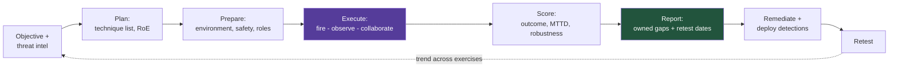
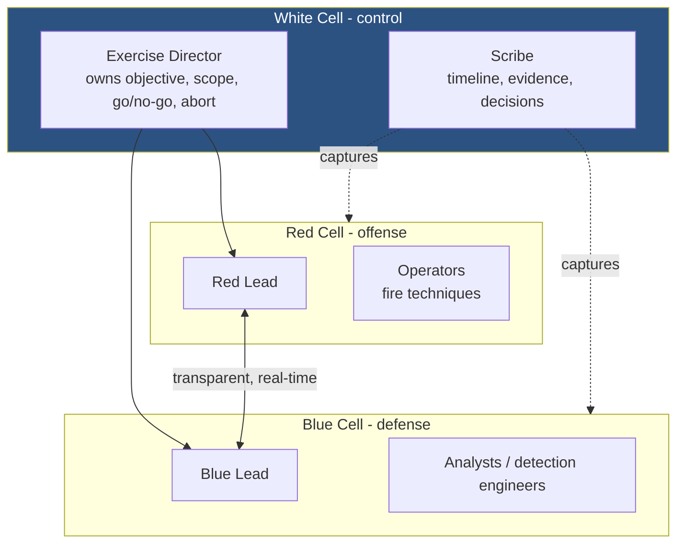
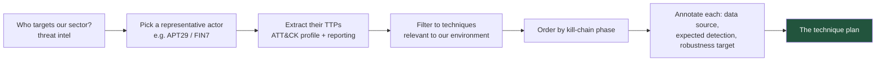
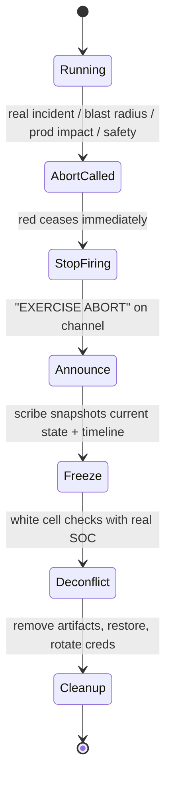
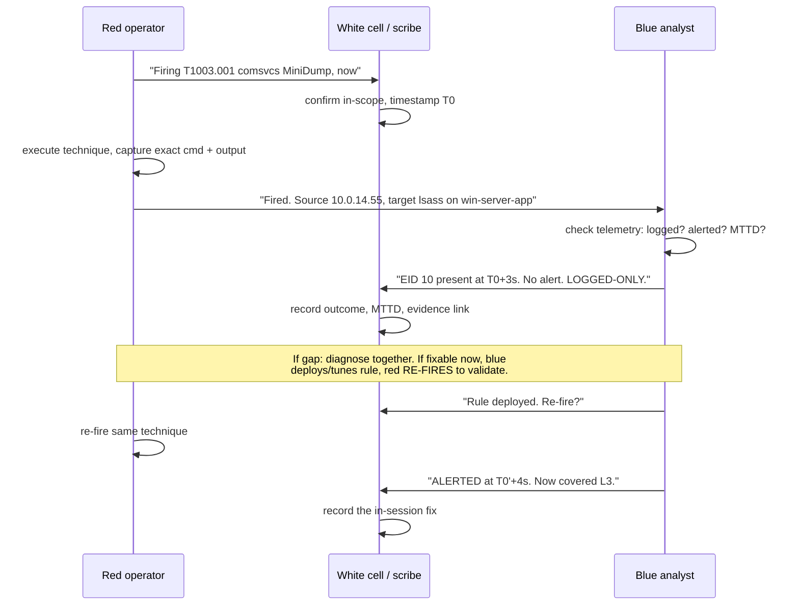
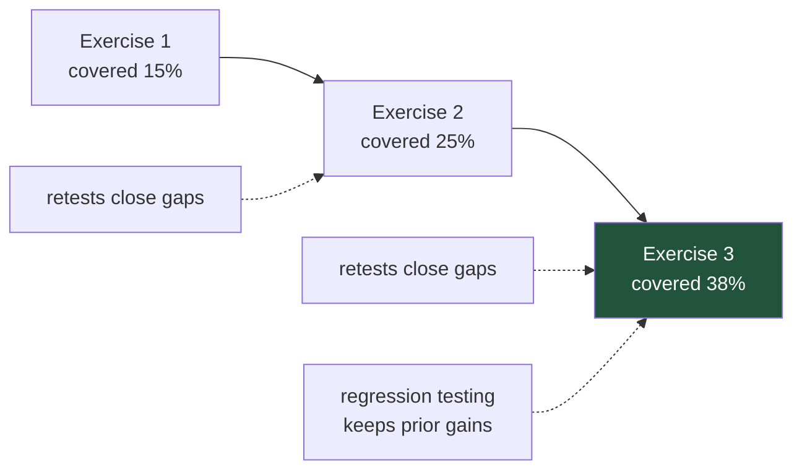
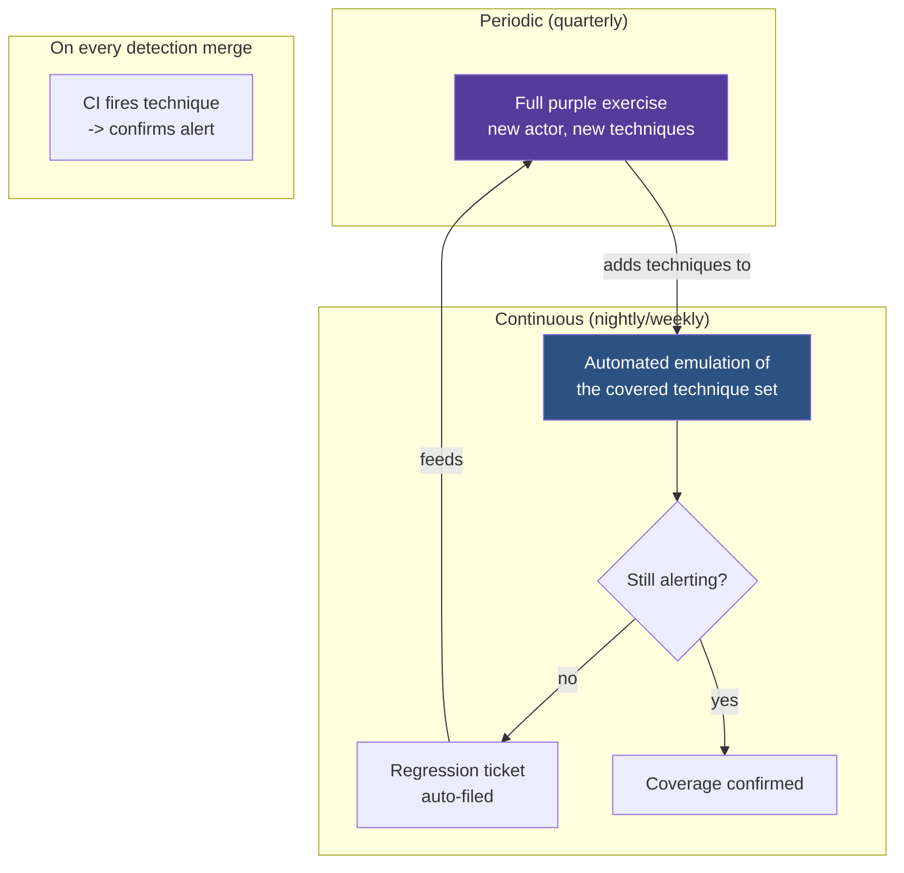

**Level:** Expert · **Track:** Purple Team · **Read time:** 235 min

This is Chapter 4 of the Purple Team notebook, and it puts the whole thing together. Chapter 1 defined purple teaming as a transparent, collaborative loop; Chapter 2 built the offensive engine (Atomic Red Team and CALDERA); Chapter 3 built the defensive engine (detection validation, tuning, coverage). Each of those is a capability. This chapter is the *event* that uses all of them — a planned, scoped, time-boxed exercise that starts with an objective and ends with a prioritised, owned program of remediation work with retest dates on the calendar.

The discipline of the earlier chapters carries here in full. A purple exercise executes real adversary behaviour — credential dumping, lateral movement, exfiltration — and every technique in it requires **explicit, written authorization** against systems the organisation owns or is contractually permitted to test. The difference from a covert red team is transparency, not permission: everyone knows the exercise is running, but it is still real attacker tradecraft against real infrastructure, and running any of it outside an authorized window is indistinguishable from an intrusion.

## Why This Matters

A purple team *capability* that never runs a structured exercise degenerates into ad-hoc "hey, can you test this rule?" requests — useful, but unmeasured and unaccountable. The structured exercise is what converts scattered testing into a repeatable instrument you can point at a question ("can we detect the actor most likely to target us?") and get a defensible, trended answer.

The exercise is also where the two halves of the previous chapters actually meet in the same room, in real time. Emulation without a defender watching is just red teaming; detection engineering without live technique execution is theory. The purple exercise is the deliberate collision of the two, with a feedback loop measured in *minutes* — the red operator fires a technique, the blue analyst checks whether it alerted, and if it did not, they diagnose why and often fix it *before the exercise ends*. That same-session fix is the signature of a mature purple program and the reason the format exists.

Done well, the output is not a report that gets filed. It is a set of tuned detections deployed during the exercise, a ranked list of gaps each with a named owner and a retest date, and a set of numbers — coverage, MTTD, close rate — that you can compare against the last exercise to prove the program is improving. This chapter is about producing exactly that.



## Part 1: The Exercise Operating Model

A purple exercise is a small, structured operation with defined roles. Even when one person wears several hats (Part 12), the *roles* remain distinct because they represent distinct responsibilities, and blurring them is how exercises lose rigour.

### 1.1 Cells and roles



| Role | Owns | Key responsibility during the run |
|---|---|---|
| **Exercise Director** | Objective, scope, RoE, go/no-go, the abort call | Keeps the exercise on-objective; makes the stop decision if blast radius is exceeded |
| **White Cell** | Neutral control and deconfliction | Confirms each technique is in-scope before it fires; holds the deconfliction channel to real SOC |
| **Scribe** | The record | Timestamps every technique, captures evidence, logs every decision and collaboration point |
| **Red Lead / Operators** | Technique execution | Fire techniques per the plan, at agreed pace, capturing exact commands and output |
| **Blue Lead / Analysts** | Detection and response | Watch telemetry, record the outcome per technique, tune and re-test in real time |

The role that gets skipped and should never be is the **Scribe**. Without a dedicated record-keeper, the exercise generates findings that nobody can reconstruct afterward — "did T1055 alert? I think so?" is not a finding. The scribe's timeline *is* the raw material of the after-action report, and capturing it in real time is far cheaper than reconstructing it from memory and chat logs later.

### 1.2 The transparency principle

The defining feature is the live, two-way channel between red and blue. This is not a red team that blue is trying to catch; it is two teams jointly characterising the defensive posture. Concretely, during the run:

- Red announces each technique *before or as* it fires ("firing T1003.001 via comsvcs, now").
- Blue reports what they see, in real time ("EID 10 present, no alert — logged-only").
- When there is a gap, both sides diagnose it together and, where possible, fix it in-session.

That openness is what makes the feedback loop minutes long instead of weeks. It also changes the emotional dynamic: there is no "gotcha," no defender embarrassment, no red-team victory lap — the shared goal is more covered techniques at the end of the day than at the start.

## Part 2: Choosing the Exercise Format

Not every purple exercise looks the same. Three formats sit on a spectrum from cheapest/least-realistic to most-expensive/most-realistic, and choosing the wrong one wastes the day.

| Format | What happens | Best for | Cost |
|---|---|---|---|
| **Tabletop** | Walk through an attack scenario verbally; "if the actor did X, would we see it?" | Testing process, roles, and decision-making; onboarding; when tooling is not ready | Low |
| **Technique-driven** | Fire an ordered list of individual ATT&CK techniques (Atomic-style), validate each | Building and measuring detection coverage breadth | Medium |
| **Adversary-emulation** | Emulate a specific named actor's full chain end to end (CALDERA/CTID plan) | Testing whether detections hold up when techniques are *chained* under realistic timing | High |

The most common mistake is jumping to full adversary emulation before the technique-driven groundwork exists. If individual techniques are not yet reliably detected, chaining them adds nothing but noise — you cannot attribute a missed detection in a 40-technique chain without first knowing each technique's baseline. **Technique-driven exercises build the coverage; emulation exercises stress-test it.** Do them in that order.

A mature program cycles through all three: tabletop to validate a new playbook or team, technique-driven to expand and measure coverage, emulation to validate that coverage against the actors that actually matter — then back to technique-driven to close the gaps emulation exposed.

## Part 3: Scoping and Rules of Engagement

Scope is what separates a purple exercise from an incident. Before anything fires, the boundaries must be written, signed, and understood by everyone in every cell.

### 3.1 The Rules of Engagement template

```
PURPLE TEAM EXERCISE - RULES OF ENGAGEMENT

1. AUTHORIZATION
   Authorizing authority:  <name, title, signature, date>
   Systems in scope:       <explicit host list / CIDR / cloud account IDs>
   Systems explicitly OUT:  <production DBs, safety systems, third-party assets>
   Authorization window:   <start datetime> to <end datetime>, <timezone>

2. OBJECTIVE
   Primary question:       e.g. "Can we detect APT29-style credential access
                           and lateral movement within our corp domain?"
   Success criteria:       <measurable, e.g. detection outcome recorded for each
                           of the N planned techniques; >=X% score-3 coverage>

3. TECHNIQUES
   Planned technique list: <reference the technique plan, Part 4>
   Explicitly forbidden:   e.g. destructive actions, real data exfiltration,
                           DoS, anything touching customer PII, ransomware
                           encryption even in simulation

4. SAFETY & BLAST RADIUS
   Environment:            <lab / prod-with-limits>
   Snapshot/rollback:      <required before start; who owns it>
   Data handling:          synthetic data only; no real credentials harvested
   Blast-radius limits:    <e.g. lateral movement max 2 hops; no domain-wide>

5. DECONFLICTION
   Real SOC informed?:     <yes/no - see Part 3.3>
   Deconfliction contact:  <name, phone, always-reachable during window>
   Exercise marker:        <how activity is tagged, e.g. a header, a known
                           source host, a filename convention>

6. ABORT
   Abort authority:        Exercise Director AND either lead
   Abort triggers:         real incident detected, blast radius exceeded,
                           production impact, safety concern
   Abort procedure:        <stop firing, announce on channel, snapshot state,
                           begin cleanup - see Part 5.4>

7. COMMUNICATIONS
   Exercise channel:       <dedicated, logged>
   Reporting:              <who gets the after-action report, by when>

Signatures:  Exercise Director ___  Red Lead ___  Blue Lead ___  System Owner ___
```

The two fields most often left vague and most important are **"Systems explicitly OUT"** and **"Abort triggers."** Naming what is out-of-scope is what prevents a curious operator from pivoting into a production database because it was reachable; naming abort triggers in advance is what lets anyone stop the exercise without a debate when something goes wrong.

### 3.2 Blast-radius discipline

Purple techniques are real, and some have real consequences if run without limits. Encode the limits explicitly:

| Technique class | Uncontrolled risk | Blast-radius control |
|---|---|---|
| Credential dumping | Real credentials harvested and now in a dump file | Synthetic accounts only; secure-delete dumps; rotate any real creds touched |
| Lateral movement | Uncontrolled spread across the domain | Cap hops (e.g. 2); named target hosts only |
| Persistence | Artifacts left running after the exercise | Track every persistence artifact in the scribe log; verify removal in cleanup |
| Defense evasion (disable logging) | Blind spot left open post-exercise | Re-enable and verify before close; never leave logging off |
| Exfiltration | Real data leaves the environment | Synthetic marker files only; never real data, even encrypted |

### 3.3 To deconflict with the real SOC, or not

A genuine design decision with two valid answers:

- **Inform the SOC (deconflicted):** the SOC knows the exercise is running and can distinguish it from a real incident. Use this when you are testing *detection content* — you do not want a real IR mobilisation, and you want analysts free to collaborate.
- **Do not inform the SOC (blind / "double-blind"):** the SOC does not know, so you also test *whether the human response process works*. Use this when the SOC's ability to detect-and-respond under realistic conditions is itself the thing under test — but keep the White Cell deconfliction contact reachable so a real escalation can be halted before it wastes an on-call night or triggers external notifications.

Most technique-driven purple exercises are deconflicted, because the objective is detection coverage and collaboration. Reserve blind runs for when response-process realism is the explicit goal, and even then, only the front-line SOC is blind — the White Cell always knows.

## Part 4: Threat-Intelligence-Driven Planning

The technique list is the spine of the exercise, and the best technique lists come from intelligence about who actually targets you, not from a generic top-10.

### 4.1 From actor to ordered plan



The filtering step matters: an actor's full profile may include techniques irrelevant to your estate (a Linux-only technique when you are Windows-domain, a cloud technique when you are on-prem). Emulate what is *applicable*, and note the rest as out-of-scope-this-round rather than pretending you covered them.

### 4.2 A worked technique plan

An exercise plan is a table, ordered by kill-chain phase, with the detection expectation stated *before* the run so the result can be scored against a prediction:

| # | Phase | Technique | Procedure | Data source | Expected outcome | Robustness target |
|---|---|---|---|---|---|---|
| 1 | Discovery | T1087.002 Account Discovery: Domain | `net group /domain` | 4688 cmdline | Logged-only (predict gap) | L2 |
| 2 | Discovery | T1018 Remote System Discovery | `nltest /dclist` | 4688 cmdline | Logged-only | L2 |
| 3 | Cred Access | T1003.001 LSASS dump | comsvcs MiniDump | Sysmon EID 10 | Alerted (Ch.3 rule) | L3 |
| 4 | Cred Access | T1558.003 Kerberoasting | Rubeus | Security 4769 | Alerted (Ch.3 rule) | L3 |
| 5 | Lateral | T1021.002 SMB/Admin Shares | `psexec` | 4688 + 5140 | Predict gap | L2 |
| 6 | Lateral | T1550.002 Pass-the-Hash | Mimikatz sekurlsa::pth | 4624 type 9 | Predict gap | L2 |
| 7 | Collection | T1560.001 Archive via utility | `7z a` | 4688 cmdline | Logged-only | L1 |
| 8 | Exfil | T1048 Exfil over alt protocol | DNS tunnel (marker) | Sysmon EID 22 | Predict gap | L2 |

Stating the **expected outcome before the run** is a discipline worth insisting on: it converts each technique from "let's see what happens" into a testable prediction, and a *surprise* (predicted alerted, got nothing) is often more valuable than a confirmed gap because it means a detection you believed in is broken.

## Part 5: Environment and Safety

### 5.1 Snapshots first

Nothing fires until there is a known-good rollback point. Every target host and the domain controller are snapshotted, and the snapshot owner is named in the RoE. This is non-negotiable for two reasons: it lets you cleanly remove persistence and artifacts, and it lets you *re-run* the exercise from an identical baseline, which is what makes results comparable across runs.

```bash
# Example: snapshot the lab before the exercise (hypervisor-specific;
# shown for a libvirt/KVM lab)
for vm in dc01 win10-workstation win-server-app; do
  virsh snapshot-create-as "$vm" "purple-baseline-$(date +%Y%m%d)" \
    --description "pre-exercise clean state" --atomic
done
virsh snapshot-list dc01
```

```
 Name                      Creation Time               State
------------------------------------------------------------------
 purple-baseline-20270513  2027-05-13 08:41:07 +0000   shutoff
```

### 5.2 The exercise marker

So that exercise activity can be told apart from real activity (and cleaned up), tag it. A dedicated source host, a filename convention, a benign but distinctive string in command lines — any consistent marker that the scribe records and the blue cell can filter on:

```
Exercise marker conventions (recorded in RoE):
  - all offensive activity originates from  10.0.14.55  (red-op host)
  - dropped files named               PURPLE-<technique>-<timestamp>.<ext>
  - synthetic accounts prefixed       svc-purple-*
  - DNS exfil marker domain           purple-exercise.lab.internal
```

### 5.3 The abort protocol

Rehearsed, one-line, executable by anyone with abort authority:



The abort must be practised, not just documented. An abort that has never been executed is a hypothesis, and the moment you need it is the worst possible time to discover the rollback does not work.

### 5.4 Cleanup and close-out

Every exercise ends with a verified return to clean state, tracked against the scribe's artifact log:

| Cleanup item | Verification |
|---|---|
| Persistence artifacts removed | Re-query for each artifact logged during the run; expect none |
| Dropped files deleted | Marker-convention sweep returns nothing |
| Synthetic accounts disabled/removed | Directory query for `svc-purple-*` |
| Logging re-enabled | Confirm any evasion-disabled source is back and forwarding |
| Real credentials rotated | Any real account whose creds were exposed is rotated |
| Snapshots restored (lab) | Hosts reverted to baseline; or artifacts individually confirmed gone (prod) |

## Part 6: The Live Run — Cadence and the Collaboration Loop

With plan, RoE, roles, and environment ready, the exercise runs. The rhythm is a tight per-technique loop, repeated down the plan.

### 6.1 The per-technique loop



The in-session fix — the dashed part of the loop — is the single most valuable thing that happens in a purple exercise. A logged-only result diagnosed and turned into a validated alert *before the technique moves on* is coverage bought in minutes. Not every gap is fixable in-session (a *not-logged* gap usually needs a data-source project), but every logged-only gap is a candidate, and working them live is what distinguishes a purple exercise from sequential red-then-blue.

### 6.2 What the scribe captures per technique

The record for each technique is fixed and complete, because it becomes a row in the scorecard and the report:

```
technique_id:      T1003.001
procedure:         comsvcs.dll MiniDump
timestamp_fired:   2027-05-13T10:14:03Z
source_host:       10.0.14.55
target:            win-server-app / lsass.exe
exact_command:     rundll32 comsvcs.dll, MiniDump <pid> C:\temp\PURPLE-...dmp full
telemetry_seen:    Sysmon EID 10, GrantedAccess 0x1fffff, T+3s
outcome:           logged-only -> (in-session) alerted
mttd_seconds:      4          # after in-session fix
robustness:        L3
detection_ref:     rules/credential_access/T1003.001_lsass_access.yml
notes:             default rule missing; deployed Ch.3 rule during exercise
evidence:          splunk-link, screenshot
```

### 6.3 Pace

Resist the urge to rush the plan. A purple exercise that fires 40 techniques with no time to diagnose gaps produces a long list and no fixes — which is a red team wearing a purple badge. Better to plan 12-15 techniques with room to stop, diagnose, and fix on the logged-only results. **Depth of collaboration beats breadth of technique count**; the coverage you *build* during the exercise matters more than the coverage you merely *measure*.

## Part 7: Scoring the Exercise

A purple exercise without a scoring model produces anecdotes. The scoring model turns each technique's result into comparable numbers.

### 7.1 The scoring dimensions

| Dimension | Values | Measures |
|---|---|---|
| **Detection outcome** | not-logged / logged-only / alerted / prevented | The coverage state (Chapter 3, Part 3) |
| **MTTD** | seconds/minutes | Speed of detection, where detection exists |
| **Robustness** | L1-L4 (Chapter 3, Part 7) | Durability of the detection |
| **Response quality** | none / manual / playbook / automated | What happened after the alert |
| **In-session fixed?** | yes/no | Whether the gap was closed during the run |

Scoring on all five, rather than a single pass/fail, is what makes the result actionable: "logged-only, L-n/a, no response" and "alerted, L1, manual response" are both "not great" on a binary scale but need completely different fixes.

### 7.2 A worked scorecard

The plan from Part 4.2, after the run:

| # | Technique | Outcome (start → end) | MTTD | Robustness | Response | In-session fix |
|---|---|---|---|---|---|---|
| 1 | T1087.002 Account Discovery | logged-only → **alerted** | 6s | L2 | manual | Yes |
| 2 | T1018 Remote System Discovery | logged-only → **alerted** | 5s | L2 | manual | Yes |
| 3 | T1003.001 LSASS dump | logged-only → **alerted** | 4s | L3 | manual | Yes |
| 4 | T1558.003 Kerberoasting | **alerted** | 47s | L3 | playbook | — |
| 5 | T1021.002 SMB lateral | **not logged** | — | — | none | No (needs 5140 onboarding) |
| 6 | T1550.002 Pass-the-Hash | logged-only | — | L2 | none | No (rule drafted, needs tuning) |
| 7 | T1560.001 Archive | logged-only → **alerted** | 8s | L1 | manual | Yes |
| 8 | T1048 DNS exfil | **not logged** | — | — | none | No (needs Sysmon EID 22) |

### 7.3 Reading the scorecard

Turn the table into the three numbers that go on the summary slide:

```python
#!/usr/bin/env python3
"""score_exercise.py - summarise a purple exercise scorecard."""
results = [
    ("T1087.002","alerted",6,"L2",True),  ("T1018","alerted",5,"L2",True),
    ("T1003.001","alerted",4,"L3",True),  ("T1558.003","alerted",47,"L3",False),
    ("T1021.002","not-logged",None,None,False),
    ("T1550.002","logged-only",None,"L2",False),
    ("T1560.001","alerted",8,"L1",True),  ("T1048","not-logged",None,None,False),
]
n = len(results)
alerted = [r for r in results if r[1] == "alerted"]
logged_only = [r for r in results if r[1] == "logged-only"]
not_logged = [r for r in results if r[1] == "not-logged"]
robust = [r for r in alerted if r[3] in ("L3","L4")]
fixed = [r for r in results if r[4]]
mttds = [r[2] for r in alerted if r[2] is not None]

print(f"Techniques tested:        {n}")
print(f"Alerted (any robustness): {len(alerted)}/{n}  ({100*len(alerted)//n}%)")
print(f"Covered (alerted, L3+):   {len(robust)}/{n}  ({100*len(robust)//n}%)")
print(f"Logged-only (cheap gaps): {len(logged_only)}")
print(f"Not logged (visibility):  {len(not_logged)}")
print(f"Closed in-session:        {len(fixed)}")
print(f"Median MTTD (alerted):    {sorted(mttds)[len(mttds)//2]}s")
```

```
Techniques tested:        8
Alerted (any robustness): 5/8  (62%)
Covered (alerted, L3+):   2/8  (25%)
Logged-only (cheap gaps): 1
Not logged (visibility):  2
Closed in-session:        5
```

Two honest headlines fall out: the exercise raised alerted coverage from 1/8 (only Kerberoasting was pre-covered) to 5/8 *during the run*, and yet only 25% is covered at high robustness — a candid picture that a raw "62% detected" would have flattered. The five in-session fixes are the exercise's immediate ROI; the three remaining gaps (one logged-only needing tuning, two not-logged needing telemetry projects) are the backlog. **The gap between "alerted" and "covered at L3+" is the number that keeps a program honest**, and it is exactly the technique-vs-procedure and robustness distinction from Chapter 3 showing up at the program level.

## Part 8: Live Execution Walk-Through

To make the loop concrete, here is a chained sequence — discovery into credential access into lateral movement — as it actually plays out across all three cells. Everything runs in the authorized, snapshotted lab from Chapter 2, from the red-op host `10.0.14.55`.

### 8.1 Discovery (T1087.002 / T1018)

**Red fires:**

```cmd
C:\> net group "Domain Admins" /domain
C:\> nltest /dclist:lab.internal
```

```
Group name     Domain Admins
Members
-------------------------------------------------------------------------------
Administrator            svc-backup            svc-sql
The command completed successfully.

Get list of DCs in domain 'lab.internal' from '\\DC01'
    dc01.lab.internal [PDC]  [DS] Site: Default-First-Site-Name
The command completed successfully.
```

**Blue observes** (Splunk, filtering on the exercise source host):

```
`sysmon` OR (`wineventlog` EventCode=4688) host_ip=10.0.14.55
| search CommandLine="*net group*" OR CommandLine="*nltest*"
| table _time Image CommandLine
```

```
_time                Image                    CommandLine
2027-05-13 10:02:11  C:\Windows\...\net.exe   net group "Domain Admins" /domain
2027-05-13 10:02:44  C:\Windows\...\nltest.exe nltest /dclist:lab.internal
```

**Collaboration dialogue (scribe log):**

```
10:02  RED: fired T1087.002 (net group) + T1018 (nltest)
10:02  BLUE: both in 4688 with cmdline. No alert. LOGGED-ONLY x2.
10:04  BLUE: deploying discovery rule (net/nltest/whoami recon burst from single host)
10:07  RED: re-firing both
10:07  BLUE: ALERTED, MTTD 6s / 5s. Now L2 (matches tool cmdline, evadable by LOLBins).
       Flagged for a follow-up L3 behavioural: recon-burst-by-count regardless of tool.
```

That last line is the discipline from Chapter 3's robustness ladder in action: the in-session fix is a real L2 detection, and the team *records* that it is only L2 and what the L3 version would be, rather than declaring victory.

### 8.2 Credential access (T1003.001)

**Red fires** (comsvcs, deliberately avoiding procdump to test robustness):

```cmd
C:\> for /f "tokens=2" %i in ('tasklist ^| findstr lsass') do set PID=%i
C:\> rundll32.exe C:\Windows\System32\comsvcs.dll, MiniDump %PID% C:\temp\PURPLE-lsass.dmp full
```

```
   (no output; C:\temp\PURPLE-lsass.dmp written, ~45 MB)
```

**Blue observes:**

```
`sysmon` EventCode=10 TargetImage="*lsass.exe" host="win-server-app"
| table _time SourceImage GrantedAccess CallTrace
```

```
_time                SourceImage                GrantedAccess  CallTrace
2027-05-13 10:14:03  C:\Windows\...\rundll32.exe 0x1fffff       ...comsvcs.dll+...
```

**Collaboration:**

```
10:14  RED: fired T1003.001 via comsvcs (NOT procdump - testing robustness)
10:14  BLUE: EID 10 present, SourceImage=rundll32. No alert. LOGGED-ONLY.
10:16  BLUE: deploying Ch.3 rule (TargetImage=lsass + GrantedAccess mask,
       source-agnostic -> catches comsvcs too)
10:18  RED: re-fire
10:18  BLUE: ALERTED, MTTD 4s, L3 (technique-invariant, source-agnostic).
10:19  WHITE: note - recommend RunAsPPL as prevention (Ch.3 Part 10). Backlog item.
```

### 8.3 Lateral movement (T1021.002) — the gap that cannot be closed in-session

**Red fires:**

```cmd
C:\> psexec.exe \\win-server-app -u lab\svc-purple -p <synthetic> cmd.exe /c whoami
```

```
lab\svc-purple
```

**Blue observes — and finds nothing:**

```
`wineventlog` EventCode=5140 host="win-server-app"    -> 0 results
`sysmon` EventCode=3 host_ip=10.0.14.55 DestinationPort=445  -> present, but no share-access detail
```

**Collaboration:**

```
10:31  RED: fired T1021.002 (psexec to win-server-app)
10:31  BLUE: network connection to 445 seen, but NO 5140 (file share access) events.
       Object Access auditing for file shares is not enabled on that host.
10:33  WHITE: this is NOT-LOGGED, not logged-only. Cannot fix in-session.
       BACKLOG: enable "Audit Detailed File Share" (5145) + File Share (5140),
       owner = platform team, retest date = +2 weeks.
```

This is the honest counterpoint to the in-session fixes: some gaps are visibility projects, not rule projects (Chapter 3, Part 10). The exercise's job here is not to fix it live — it is to *diagnose it precisely* (not-logged, specific audit policy missing, named owner, retest date) so the after-action report carries a fix, not just a finding.

## Part 9: Running It With Limited People and Tooling

Full white/red/blue cells are a luxury. Most teams run purple with two or three people and a modest SIEM. The exercise still works if you preserve the *roles* even when one person wears several hats.

### 9.1 The two-person purple exercise

| Full model | Two-person compression |
|---|---|
| Exercise Director + White Cell + Scribe | Person A also directs and scribes (use a shared doc as the live timeline) |
| Red Lead + Operators | Person A fires techniques |
| Blue Lead + Analysts | Person B watches telemetry and tunes |

The one role you must not collapse into the others is the **record**. With two people, the timeline lives in a shared document that both edit in real time — every technique gets a row as it fires. It is tempting to "reconstruct it later"; later never comes, and the exercise's value evaporates with the memory of it.

### 9.2 Minimal tooling stack

You can run a complete, valuable purple exercise with entirely free tools:

```
Emulation:   Invoke-AtomicRedTeam (per-technique) + a manual command list
Telemetry:   Sysmon (sysmon-modular config) + Windows Security auditing
SIEM:        a free-tier Splunk, Elastic, or even Windows Event Forwarding + queries
Authoring:   Sigma + sigma-cli
Record:      a shared spreadsheet / markdown doc (the scribe timeline)
Tracking:    the scorecard script (Part 7.3) + an ATT&CK Navigator layer
```

The absence of a commercial breach-and-attack-simulation platform is not a blocker. Atomic Red Team plus Sysmon plus a query interface is enough to run the entire loop in Part 6, and many mature programs never use anything more.

### 9.3 Time-boxing for small teams

A two-person team cannot sustain a full-day, 40-technique exercise. Run **short, frequent, focused** sessions instead: a two-hour exercise covering 5-6 techniques in one ATT&CK tactic (say, Credential Access), fully diagnosed and fixed, every fortnight. Frequency beats scale for a small team — six focused two-hour sessions build more real coverage than one exhausting all-day sprint that measures a lot and fixes nothing.

## Part 10: The After-Action Report

The report is the deliverable that converts a day of testing into a program of work. A findings list with no owners and no dates is a document that gets filed; a report structured around *owned, dated remediation* is one that changes posture.

### 10.1 Report structure

```
PURPLE TEAM EXERCISE - AFTER-ACTION REPORT

1. EXECUTIVE SUMMARY  (half a page, for leadership)
   - Objective and the question answered
   - Headline numbers: techniques tested, alerted %, covered-at-L3+ %,
     in-session fixes, MTTD median
   - The single most important gap and its business relevance
   - Trend vs previous exercise (Part 11)

2. SCOPE & METHOD
   - RoE summary, format, actor emulated, dates, participants

3. RESULTS  (the scorecard, Part 7.2)
   - Per-technique table: outcome, MTTD, robustness, response, fixed?
   - ATT&CK Navigator coverage layer (before/after)

4. FINDINGS & REMEDIATION  (the heart of the report)
   For each gap:
     - Technique + procedure + evidence
     - Gap type (not-logged / logged-only / low-robustness / no-response)
     - Recommended fix (onboard source / write rule / tune / prevent)
     - OWNER  (named person/team)          <- mandatory
     - PRIORITY (from risk, not ease)
     - RETEST DATE                          <- mandatory

5. WHAT WORKED
   - Detections that fired well; keep and regression-test them

6. APPENDICES
   - Full scribe timeline, exact commands, raw evidence links
```

### 10.2 The remediation table is the point

Every gap becomes a row that a program manager can track:

| Finding | Gap type | Fix | Owner | Priority | Retest |
|---|---|---|---|---|---|
| T1021.002 SMB lateral not detected | not-logged | Enable 5140/5145 file-share auditing on servers | platform-team | High | +2 wk |
| T1048 DNS exfil not detected | not-logged | Onboard Sysmon EID 22 (DNS query) | soc-eng | High | +3 wk |
| T1550.002 PtH logged-only | logged-only | Tune drafted 4624-type-9 rule to acceptable precision | detection-eng | Med | +1 wk |
| T1560.001 Archive detection is L1 | low-robustness | Add behavioural archive-of-sensitive-paths rule | detection-eng | Low | +4 wk |
| T1003.001 no prevention | prevention gap | Deploy RunAsPPL fleet-wide | endpoint-team | Med | +4 wk |

**Two mandatory fields make or break the report: OWNER and RETEST DATE.** A finding with no owner is nobody's job; a fix with no retest date is never confirmed to actually work. The retest is not optional politeness — Chapter 3's whole argument is that an unvalidated detection is a hypothesis, so a remediation is not "done" until a retest fires the technique and confirms the fix.

### 10.3 Closing the loop with retests

Retests are mini-exercises: on the retest date, re-fire exactly the technique that exposed the gap, against the same target, and record the new outcome. Only a technique that moves from its gap state to *alerted at the target robustness* is closed. This is where the snapshot discipline (Part 5.1) pays off — an identical baseline makes the retest a clean before/after.

## Part 11: Metrics and Trending Across Exercises

A single exercise is a snapshot. The program's value shows in the *trend* across exercises, and a small set of stable metrics makes that trend legible.

| Metric | Per-exercise | Trend meaning |
|---|---|---|
| **Alerted coverage %** | alerted / tested | Breadth of detection; should rise |
| **Covered-at-L3+ %** | robust / tested | *Real* coverage; the honest number |
| **Median MTTD** | across alerted techniques | Detection speed; should fall |
| **In-session fix rate** | fixed / gaps found | Team's live detection-engineering capability |
| **Remediation close rate** | retested-closed / findings | Whether findings actually get fixed |
| **Regression count** | previously-covered techniques that broke | Rot; should stay near zero |

The two most diagnostic trend metrics are **covered-at-L3+ %** and **remediation close rate**. The first resists the flattery of "we detected it" by demanding robust, procedure-aware coverage (Chapter 3). The second measures the thing that actually determines whether the program improves posture: a program that finds 20 gaps per exercise and closes 3 is running in place; one that finds 8 and closes 8 is compounding. **Close rate, not find rate, is the number that predicts whether next year's exercise scores better.**



## Part 12: Continuous and Automated Purple Teaming

The periodic exercise is the foundation; the maturity endpoint is making the loop continuous. Two complementary directions:

- **Scheduled automated emulation.** Tools like CALDERA (Chapter 2) and automated Atomic runners can fire a technique set on a schedule — nightly or weekly — and report which detections still fire. This is *regression testing at the program level* (Chapter 3, Part 1): it catches the log-source migration or EDR upgrade that silently broke twelve rules, days after it happens instead of at the next quarterly exercise.
- **Detection-as-code integration.** When a new detection is merged (Chapter 3, Part 8), a CI job fires the corresponding technique in a lab and confirms the rule alerts before it reaches production. The purple loop becomes part of the deployment pipeline rather than a calendar event.



The important boundary: **automation regression-tests known coverage; it does not discover new gaps.** Finding what you cannot yet detect still needs the creativity of a human-run exercise against a fresh actor profile. The mature program runs both — continuous automation to hold the line, periodic human exercises to advance it.

**A note on where this notebook has been going:** continuous purple teaming is the operational expression of everything across these four chapters. Chapter 1's collaborative loop, Chapter 2's emulation engines, Chapter 3's validated detections, and this chapter's structured exercise all converge on a single steady-state capability — an organisation that continuously proves, in evidence rather than belief, which adversary behaviours it can see and stop.

## Part 13: Common Pitfalls and Myths

### 13.1 Pitfalls

| # | Pitfall | Consequence | Fix |
|---|---|---|---|
| 1 | No scribe / no real-time record | Findings that cannot be reconstructed | Dedicated record; timeline written as it happens (Part 1.1) |
| 2 | Jumping to full emulation before technique coverage exists | Missed detections in a chain, unattributable | Technique-driven first, emulation to stress-test (Part 2) |
| 3 | Vague scope ("the corp domain") | Operator pivots into something out of bounds | Explicit in/out host lists in the RoE (Part 3.1) |
| 4 | No abort triggers defined in advance | Debate while a real problem grows | Named triggers + rehearsed abort (Part 5.3) |
| 5 | Firing 40 techniques with no time to fix | A long list, zero coverage gained | 12-15 techniques with room to diagnose (Part 6.3) |
| 6 | No snapshot before start | Cannot cleanly remove artifacts or re-run | Snapshot everything first (Part 5.1) |
| 7 | Leaving logging disabled after evasion tests | A blind spot left open post-exercise | Cleanup checklist verifies re-enablement (Part 5.4) |
| 8 | Reporting "62% detected" without robustness | Overstated posture | Report covered-at-L3+ separately (Part 7.3) |
| 9 | Findings with no owner or retest date | Nothing gets fixed or confirmed | Owner + retest mandatory in the report (Part 10.2) |
| 10 | Treating the report as the deliverable | Filed and forgotten | The deliverable is closed retests, not a PDF |
| 11 | Measuring find rate, not close rate | Program runs in place | Trend close rate across exercises (Part 11) |
| 12 | Automation mistaken for the whole program | New gaps never discovered | Automation holds the line; humans advance it (Part 12) |
| 13 | Prevention validated but not its alert | Blind block, no campaign signal | Confirm prevented techniques also alert (Ch.3 Part 3) |
| 14 | Blind run with no White Cell contact | Real IR mobilised, external notifications fire | Front-line SOC blind, White Cell always reachable (Part 3.3) |

### 13.2 Myths

**"Purple teaming is just a red team that shares its report."** The defining feature is the *live, two-way, minute-scale* loop and the in-session fixes (Part 6.1). A red team that hands over a report at the end is not a purple exercise; the collaboration during execution is the point.

**"You need a commercial breach-and-attack-simulation platform."** You need Atomic Red Team, Sysmon, a query interface, and Sigma — all free (Part 9.2). The platform is a convenience, not a prerequisite.

**"More techniques per exercise is better."** Depth of collaboration beats breadth of count. Twelve techniques fully diagnosed and half of them fixed in-session beats forty measured and none fixed (Part 6.3).

**"A high detection percentage means we're covered."** Only if it is robust, procedure-aware coverage. The gap between "alerted" and "covered at L3+" is where the honesty lives (Part 7.3).

**"The exercise is over when the report is written."** The exercise is over when the retests close. An unretested remediation is an unvalidated detection — a hypothesis (Part 10.3).

**"We ran one last year, so we do purple teaming."** A single exercise is a snapshot. The value is the trend across exercises and the continuous automation that holds coverage between them (Parts 11-12).

## Final Revision / Summary

**The exercise is the event that uses every capability.** Chapter 1's loop, Chapter 2's emulation, and Chapter 3's detection engineering converge in a planned, scoped, time-boxed exercise that starts with an objective and ends with owned, dated remediation and a trend line.

**Roles stay distinct even when people don't.** Exercise Director (scope, go/no-go, abort), White Cell (deconfliction), Scribe (the record), Red (fire techniques), Blue (detect, tune, re-test). The role never to collapse is the Scribe — the timeline is the raw material of the report.

**Transparency is the defining feature.** Red announces, blue reports what they see, both diagnose gaps together, and logged-only gaps get fixed *in-session*. That minute-scale loop, not a shared report, is what makes it purple.

**Choose the format deliberately.** Tabletop (process), technique-driven (build coverage), adversary-emulation (stress-test coverage against a real actor). Do them in that order; emulation before technique coverage exists just adds unattributable noise.

**Scope in writing, safety by design.** A signed RoE with explicit in/out host lists, forbidden actions, blast-radius limits, deconfliction, and pre-named abort triggers. Snapshot before anything fires; mark exercise activity; verify a clean return to baseline including re-enabled logging.

**Plan from intelligence.** Turn the actor most likely to target you into an ordered, kill-chain-phased technique list, each row annotated with the data source and the *predicted* outcome — so a surprise (predicted alerted, got nothing) surfaces a broken detection.

**Score on five dimensions.** Detection outcome, MTTD, robustness, response quality, and in-session-fixed — not a single pass/fail. Report alerted % *and* covered-at-L3+ % together; the gap between them is the honest picture.

**The report's job is owned, dated remediation.** Every gap: type, fix, named owner, priority by risk, retest date. A remediation is not done until a retest re-fires the technique and confirms the fix at the target robustness.

**Trend beats snapshot.** Across exercises, watch covered-at-L3+ % (real coverage) and remediation close rate (whether the program compounds). Close rate, not find rate, predicts next year's score.

**Mature = continuous.** Automated emulation regression-tests known coverage nightly and catches silent rot; detection-as-code fires the technique on every rule merge. Automation holds the line; human exercises against fresh actors advance it.

**You can start small.** Two people, free tools, a shared timeline doc, and a two-hour focused session every fortnight builds more real coverage than one exhausting all-day sprint that measures everything and fixes nothing.

## Cheat Sheet / Quick Reference

### Roles

```
Exercise Director  objective, scope, go/no-go, ABORT
White Cell         deconfliction, in-scope confirmation
Scribe             the timeline (never skip)
Red Lead/Operators fire techniques, capture exact cmd+output
Blue Lead/Analysts detect, record outcome, tune + re-test live
```

### Format choice

```
Tabletop          test process/roles/decisions            (low cost)
Technique-driven  build + measure coverage breadth         (medium)
Adversary-emul    stress-test coverage vs a real actor      (high)
Order: technique-driven FIRST, emulation to stress-test.
```

### RoE must-haves

```
[ ] authorizing signature + window       [ ] in-scope AND explicitly-out host lists
[ ] objective + measurable success       [ ] forbidden actions (destructive/PII/DoS)
[ ] snapshot owner                        [ ] blast-radius limits (hop cap, synthetic data)
[ ] deconfliction contact (reachable)     [ ] named abort triggers + procedure
```

### Per-technique loop

```
RED announce -> WHITE confirm in-scope + timestamp -> RED fire (capture cmd+output)
-> BLUE check telemetry (logged? alerted? MTTD?) -> record outcome
-> if logged-only gap: diagnose together, deploy/tune rule, RED RE-FIRE, validate
```

### Scribe record per technique

```
technique_id | procedure | timestamp | source_host | target | exact_command
telemetry_seen | outcome(not-logged/logged-only/alerted/prevented) | MTTD
robustness(L1-4) | detection_ref | in-session_fix? | evidence
```

### Scoring dimensions

```
outcome     not-logged / logged-only / alerted / prevented
MTTD        seconds to alert
robustness  L1 string -> L2 tool -> L3 technique-invariant -> L4 behavioural
response    none / manual / playbook / automated
fixed?      in-session yes/no
Report: alerted % AND covered-at-L3+ % (never one alone)
```

### Gap type -> fix

```
not-logged    -> onboard data source / enable audit policy   (cannot fix in-session)
logged-only   -> write/tune a rule                            (often fixable in-session)
low-robustness-> climb the ladder to L3+
no-response   -> playbook + routing
prevention    -> deploy control AND confirm it alerts
```

### After-action remediation row (owner + retest MANDATORY)

```
finding | gap_type | fix | OWNER | priority(by risk) | RETEST_DATE
closed = retest re-fires the technique and confirms alert at target robustness
```

### Program trend metrics

```
alerted %  |  covered-at-L3+ %  |  median MTTD  |  in-session fix rate
remediation CLOSE rate (predicts improvement)  |  regression count (rot)
```

### Glossary

| Term | Meaning |
|---|---|
| **White Cell** | Neutral control/deconfliction group overseeing the exercise |
| **Scribe** | Role owning the real-time timeline and evidence record |
| **RoE** | Rules of Engagement: signed scope, limits, abort, deconfliction |
| **Deconfliction** | Keeping the real SOC able to tell exercise from real incident |
| **Blast radius** | The bounded extent of an exercise's real-world effect |
| **In-session fix** | A gap diagnosed and turned into a validated alert during the run |
| **Technique-driven exercise** | Firing individual ATT&CK techniques to build/measure coverage |
| **Adversary emulation** | Emulating a specific actor's chained TTPs end to end |
| **MTTD / MTTR** | Mean time to detect / respond |
| **Covered-at-L3+** | Alerted at technique-invariant or behavioural robustness |
| **Retest** | Re-firing a technique on the retest date to confirm a fix |
| **Close rate** | Retested-closed findings / total findings |
| **Continuous purple teaming** | Scheduled automated emulation + detection-as-code CI |

## Practice Labs & Resources

- **Run a full two-hour technique-driven exercise in DetectionLab.** Take one ATT&CK tactic (Credential Access), build an 8-technique plan with predicted outcomes (Part 4.2), fire each with Atomic Red Team, record the scorecard live in a shared doc, fix every logged-only gap in-session, and write the one-page after-action report with owners and retest dates. Then actually do the retests two weeks later.
- **Write and sign a real RoE** (Part 3.1) for your own lab before the exercise above. Practising the scope-and-safety discipline on a lab is how it becomes muscle memory for a production engagement.
- **MITRE CTID Adversary Emulation Library.** Take a published plan (APT29, FIN6, Carbanak+FIN7), extract its applicable techniques, and run an emulation exercise. Compare the chained result against the technique-by-technique baseline you built earlier — this is the "technique-driven first, emulation to stress-test" progression from Part 2 made real.
- **Build the scorecard + Navigator trend.** Use the Part 7.3 script and Chapter 3's coverage-layer generator to produce before/after Navigator layers for one exercise, then run a second exercise a month later and diff them. Seeing coverage move is the single most motivating artifact for a program.
- **Practise the abort.** In the lab, deliberately trigger an abort mid-exercise (simulate "blast radius exceeded"), execute the Part 5.3 protocol, and time the return to clean state. An abort you have rehearsed is one you can trust.
- **Two-person purple drill.** With one colleague, run the compressed model from Part 9.1: you fire, they detect, both edit the timeline. Prove to yourselves that a valuable exercise needs no cell structure and no commercial platform.
- **Stand up continuous regression.** Schedule an automated Atomic/CALDERA run of your covered technique set (Part 12), wire the "still alerting?" check to file a ticket on failure, and deliberately break a rule to confirm the regression fires. This is the program-level version of Chapter 3's detection-as-code CI.
- **VECTR end to end.** Log two or three exercises in VECTR (community edition) to build the trend metrics from Part 11 — covered-at-L3+ %, MTTD, and close rate over time — and use it to drive the next exercise's plan.
- **TryHackMe — "Purple Team", "Red Team Fundamentals", "Intro to Detection Engineering"** and **HackTheBox purple/blue tracks** for guided practice combining execution, detection, and reporting in one flow.
- **Read published purple/exercise write-ups and IR retrospectives**, and reverse-engineer a technique plan from a real incident: "if this actor did exactly what the report says, which of my detections would fire?" That question is the seed of your next exercise.

This completes the Purple Team notebook. Across four chapters it moved from the collaborative philosophy, through the offensive emulation engines and the defensive detection-engineering discipline, to the structured exercise that fuses them into a measured, trended, continuously improving capability. The next notebook steps up from operating defences to governing them — the frameworks, risk management, and architecture that decide what a security program is trying to achieve in the first place.

---

*Also on [Praneeth's portfolio](https://ping-praneeth.vercel.app/notebook/purple-team/04-running-a-full-purple-team-exercise-end-to-end), with comments and the latest edits.*
