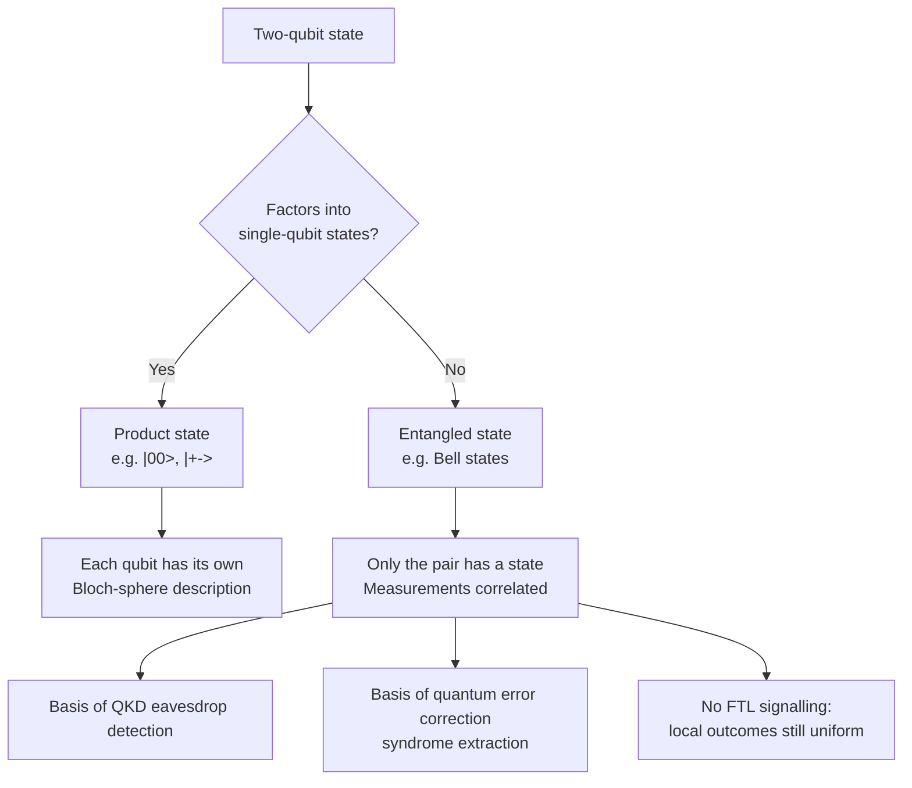
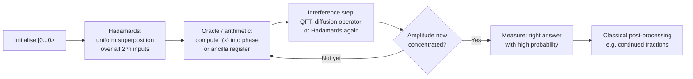
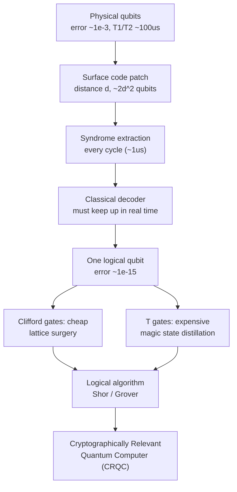
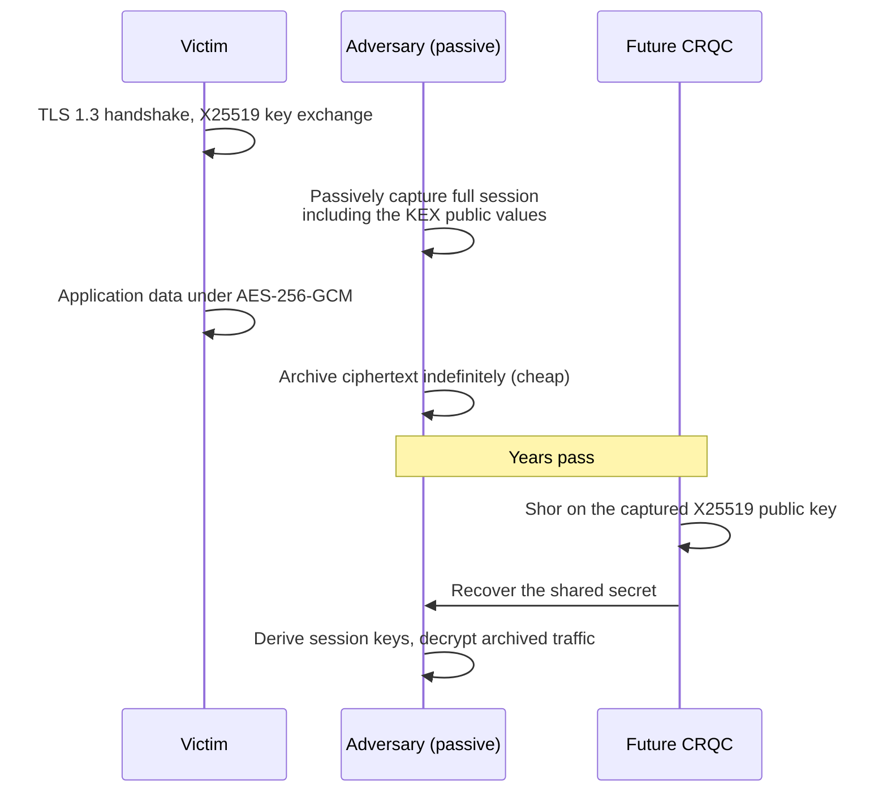
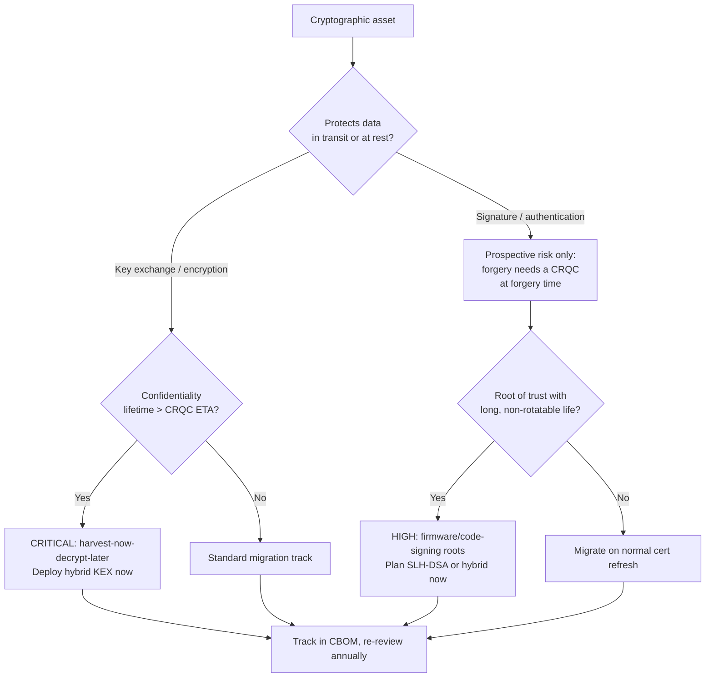

**Level:** Advanced · **Track:** Quantum Security · **Read time:** 300 min

This is Chapter 1 of the Quantum Security notebook. Everything that follows in this notebook — Shor's and Grover's algorithms in detail, harvest-now-decrypt-later risk modelling, the NIST post-quantum standards, hybrid key exchange, migration planning, QKD — depends on you having an accurate, non-hand-wavy mental model of what a quantum computer actually is and what it actually does. This chapter builds that model from zero, using the same linear algebra the physicists use, but framed entirely around the question a security engineer cares about: *which of my cryptographic assumptions survive, and when.*

You do not need a physics background. You need comfort with vectors, matrices, complex numbers at the level of "a complex number has a magnitude and a phase," and the ability to read a Python script. Everything else is built here.

## Why This Matters

Almost every confidentiality and authenticity guarantee you rely on today rests on one of three mathematical problems being hard: integer factorisation (RSA), the discrete logarithm problem in a finite field (classic Diffie-Hellman, DSA), and the discrete logarithm problem on an elliptic curve (ECDH, ECDSA, Ed25519). A sufficiently large, error-corrected quantum computer running Shor's algorithm solves all three in polynomial time. Not "faster." *Polynomial time.* The security of a 2048-bit RSA key does not degrade gracefully under that attack — it collapses.

That single fact is why "quantum" is a security topic and not a physics topic. But the fact is routinely surrounded by two equal and opposite errors, and both of them will get you into trouble:

- **The panic error:** "Quantum computers try all answers at once, so all cryptography is dead and nothing can be trusted." This is wrong on the mechanism (they do not try all answers at once in any useful sense), wrong on the scope (symmetric cryptography and hash functions are barely affected), and wrong on the timeline.
- **The dismissal error:** "Current machines have a few hundred noisy qubits and can barely factor 21, so this is a decade-out problem I can ignore." This is wrong because the threat model is not "can they decrypt my traffic today." It is **harvest now, decrypt later** — an adversary records your TLS session today and decrypts it whenever a cryptographically relevant quantum computer arrives. If your data has a ten-year confidentiality requirement, your deadline already passed.

**Security relevance of getting the model right:** you will be asked, probably by an executive, some version of "are we exposed to quantum?" A correct answer requires you to distinguish a 105-qubit noisy NISQ chip from the roughly million-physical-qubit, error-corrected machine that Shor at RSA-2048 scale requires, to know that AES-256 is fine and RSA-2048 is not, and to explain why replacing your KEX is urgent while replacing your HMAC is not. This chapter gives you the technical grounding to make those distinctions defensibly instead of repeating a press release.

## Part 1: The Classical Baseline You're Comparing Against

Before you can say what is quantum about a quantum computer, you need to be precise about the classical machine it is being compared to.

A classical computer stores information in **bits**. A bit is in state `0` or state `1` — one of two definite values, at all times. `n` bits hold exactly one of `2^n` possible configurations at any instant. Eight bits hold one of 256 values; they do not hold 256 values.

Computation proceeds by applying **logic gates** to those bits. The classical universal gate set is small: NAND alone is universal, meaning any Boolean function can be built from NAND gates. Note a property that will matter enormously later: most classical gates are **irreversible**. Given the output of an AND gate (`0`), you cannot recover the inputs — `0 AND 0`, `0 AND 1`, and `1 AND 0` all produce it. Information is destroyed, and by Landauer's principle that destruction has a thermodynamic cost.

Classical algorithms are graded by **asymptotic complexity** — how the resource cost grows with input size `n`:

| Growth class | Notation | Meaning | Cryptographic example |
|---|---|---|---|
| Constant | `O(1)` | Cost independent of input | Array index |
| Logarithmic | `O(log n)` | Halving each step | Binary search |
| Polynomial | `O(n^k)` | Tractable; "efficient" by convention | Modular exponentiation, AES encryption |
| Sub-exponential | `exp(O(n^(1/3) log^(2/3) n))` | Between poly and exp | General Number Field Sieve (factoring RSA) |
| Exponential | `O(2^n)` | Intractable past small `n` | Brute-forcing an `n`-bit key |

The single most important row for cryptography is the sub-exponential one. The **General Number Field Sieve (GNFS)** is the best known classical factoring algorithm, and its running time for an integer `N` with `b = log2(N)` bits is roughly:

```
L(b) = exp( (1.923 + o(1)) * b^(1/3) * (log b)^(2/3) )
```

That is faster than exponential but far slower than polynomial, and it is precisely why RSA-2048 is considered safe classically: nobody has the compute. RSA-829 (a 829-bit / 250-digit modulus, RSA-250) was factored in 2020 using roughly 2700 core-years of computation. Extrapolating GNFS to 2048 bits puts the classical cost astronomically out of reach. **Shor's algorithm replaces that `L(b)` with something polynomial in `b`** — roughly `O(b^3)` in gate count for the textbook version. That is the whole story in one line.

**A distinction to hold onto:** "quantum breaks crypto" is a statement about *asymptotics*, and asymptotics only bite once you have a machine big enough to be in the asymptotic regime. A quantum computer that factors 15 is not "1% of the way" to factoring RSA-2048; it is a demonstration that the circuit compiles. The gap between the two is the entire engineering problem of quantum error correction, and Part 5 is about that gap.

## Part 2: The Qubit — Superposition Without the Mysticism

A **qubit** is a two-level quantum system. Physically it might be the energy level of a superconducting circuit, the electronic state of a trapped ion, or the polarisation of a photon. Mathematically, none of that matters. A qubit's state is a unit vector in a two-dimensional complex vector space.

Write the two basis states in Dirac notation:

```
|0> = [1]        |1> = [0]
      [0]              [1]
```

A general qubit state is a **linear combination** — a superposition — of those two:

```
|psi> = a|0> + b|1>,   where a, b are complex numbers and |a|^2 + |b|^2 = 1
```

`a` and `b` are called **amplitudes**. They are *not* probabilities. They are complex numbers whose squared magnitudes are probabilities. This distinction is the entire source of quantum computational power, because complex numbers can be negative or have arbitrary phase, and **amplitudes can therefore cancel each other out**. Probabilities can only add.

When you **measure** a qubit in the computational basis, you get `0` with probability `|a|^2` and `1` with probability `|b|^2`, and the state collapses to whichever outcome you observed. All subsequent measurements return that same value. You get exactly one classical bit out, and the superposition is gone.

> **The single most important consequence:** a qubit in superposition is not "secretly both 0 and 1 and you can read both." You get one bit. If a quantum algorithm's only trick were superposition, it would be a very expensive random number generator. The trick is arranging, before you measure, for the amplitudes of *wrong* answers to cancel and the amplitudes of *right* answers to reinforce. That is interference (Part 4), and it is the actual mechanism.

### The Bloch sphere

Because `|a|^2 + |b|^2 = 1` and a global phase is physically unobservable, any single-qubit pure state can be written with just two real angles:

```
|psi> = cos(theta/2)|0> + e^(i*phi) * sin(theta/2)|1>
```

This maps every state to a point on the surface of a unit sphere — the **Bloch sphere**. `|0>` is the north pole, `|1>` the south pole, and everything on the equator is an equal superposition differing only in phase. Single-qubit gates are rotations of this sphere.

The Bloch sphere is a genuinely useful intuition pump for one qubit and **actively misleading for two or more**, because it cannot represent entanglement. Do not try to draw a two-qubit state as two Bloch spheres; the interesting states are precisely the ones that cannot be decomposed that way.

### Multiple qubits and the exponential state space

Two qubits live in the **tensor product** of their individual spaces — a four-dimensional space with basis `|00>, |01>, |10>, |11>`:

```
|psi> = a00|00> + a01|01> + a10|10> + a11|11>,   sum of |a_ij|^2 = 1
```

`n` qubits require `2^n` complex amplitudes to describe. This is the origin of the "exponential power" claim, and it is true as a statement about *description size*: simulating 50 qubits classically requires tracking `2^50` ≈ 10^15 amplitudes, which at 16 bytes each is about 16 petabytes. Simulating 300 qubits exactly would require more amplitudes than there are atoms in the observable universe.

**But — and this is where the popular account goes wrong — you cannot read those `2^n` amplitudes out.** Measuring `n` qubits gives you `n` classical bits, one sample from the distribution the amplitudes define. The exponential state space is real; the exponential *output bandwidth* is not. Every useful quantum algorithm is a scheme for concentrating the amplitude onto the few outcomes you actually want before you sample.

**Blue team framing:** when a vendor claims "N qubits means 2^N parallel operations," that is the marketing version of the description-size fact, and it is not a claim about achievable speedup. Treat it as a red flag for the rest of the claims in the document.

## Part 3: Entanglement and the No-Cloning Theorem

Some multi-qubit states factor into independent single-qubit states. `|00>` factors as `|0> tensor |0>`. Some do not. The canonical non-factoring state is the **Bell state**:

```
|Phi+> = (1/sqrt(2)) * ( |00> + |11> )
```

Try to write this as `(a|0> + b|1>) tensor (c|0> + d|1>)`. Expanding gives amplitudes `ac, ad, bc, bd` for `|00>, |01>, |10>, |11>`. You need `ad = 0` and `bc = 0` but `ac != 0` and `bd != 0` — contradictory. No factorisation exists. The two qubits are **entangled**: neither has a state of its own, only the pair does.

Operationally, entanglement means **correlated measurement outcomes**. Measure the first qubit of `|Phi+>`: you get `0` or `1` with 50/50 probability. But whatever you got, the second qubit is now guaranteed to give the same result, even if it has been carried to another continent. This correlation is stronger than any classical shared-randomness scheme can produce — which is exactly what Bell's theorem proves and what CHSH-inequality experiments measure.

**Crucially, entanglement does not transmit information.** The first measurement's outcome is random; you cannot choose it. Both parties see uniformly random local results and only discover the correlation by comparing notes over a classical channel. No faster-than-light signalling, and — relevant to security — **entanglement alone is not a communication channel and not a key-distribution scheme without an authenticated classical channel alongside it.** Every QKD protocol needs that classical authenticated channel, which is why QKD does not remove the need for authentication cryptography. We return to this in the QKD chapter.

### No-cloning

**No-cloning theorem:** there is no unitary operation `U` such that `U(|psi> tensor |0>) = |psi> tensor |psi>` for an arbitrary unknown state `|psi>`.

The proof is three lines. Suppose such a `U` exists for two distinct states `|psi>` and `|phi>`. Unitaries preserve inner products, so `<psi|phi> = <psi|phi>^2`, forcing `<psi|phi>` to be `0` or `1` — i.e. the states are identical or orthogonal. So cloning works only for a known orthogonal basis, not for arbitrary unknown states.

**Security consequences of no-cloning, both directions:**

- **Defensive:** an eavesdropper cannot copy a quantum state in transit and measure the copy at leisure. This is the physical foundation of QKD's eavesdropper detection — measuring disturbs, and disturbance is statistically detectable.
- **Offensive/engineering:** you cannot back up a quantum register, you cannot take a checkpoint mid-computation, and classical error-correction schemes based on making three copies of a bit do not port over directly. Quantum error correction had to be reinvented from scratch (Part 5).



## Part 4: The Circuit Model and the Gates You Need

Quantum computation in the circuit model is: start in `|00...0>`, apply a sequence of **unitary** gates, measure. That is it.

A gate is a unitary matrix `U` — meaning `U† U = I`, where `U†` is the conjugate transpose. Unitarity has two immediate consequences:

1. **Every quantum gate is reversible.** `U^-1 = U†` always exists. There is no quantum AND gate that forgets its inputs. Classical irreversible functions must be embedded reversibly, typically as `|x>|y> -> |x>|y XOR f(x)>`, which keeps the input around. This is why quantum circuits for classical arithmetic (needed by Shor) carry large ancilla registers and why "just implement AES in a circuit and Grover it" is a much bigger engineering job than it sounds.
2. **Norm is preserved.** Total probability stays 1.

### Single-qubit gates

| Gate | Matrix | Effect | Typical use |
|---|---|---|---|
| `X` (NOT) | `[[0,1],[1,0]]` | Bit flip: `|0> <-> |1>` | Classical negation; preparing `|1>` |
| `Z` | `[[1,0],[0,-1]]` | Phase flip: `|1> -> -|1>` | Marking states in Grover's oracle |
| `Y` | `[[0,-i],[i,0]]` | Bit + phase flip | Error models, rotations |
| `H` (Hadamard) | `(1/sqrt2)[[1,1],[1,-1]]` | `|0> -> (|0>+|1>)/sqrt2` | Creating uniform superposition |
| `S` | `[[1,0],[0,i]]` | Quarter turn phase | Clifford group |
| `T` | `[[1,0],[0,e^(i*pi/4)]]` | Eighth turn phase | **Non-Clifford; the expensive one** |
| `Rz(θ)` | `diag(1, e^(iθ))` | Arbitrary Z rotation | QFT, variational circuits |

The Hadamard is the workhorse. Applied to `|0>` it produces the equal superposition `|+> = (|0>+|1>)/sqrt(2)`. Applied to all `n` qubits of `|00...0>` it produces:

```
H^(tensor n) |0...0>  =  (1/sqrt(2^n)) * sum over x in {0,1}^n of |x>
```

— an equal superposition over all `2^n` basis states, prepared with `n` gates. This is the "put everything in superposition" step that every algorithm in Part 7 opens with. Notice how cheap it is, and remember from Part 2 that on its own it buys you nothing.

**The T gate deserves special attention for anyone reading resource-estimate papers.** Gates split into the **Clifford group** (H, S, CNOT and combinations), which by the Gottesman–Knill theorem is *efficiently classically simulable* and therefore cannot on its own give quantum advantage, and **non-Clifford** gates like T. Under the surface code, Clifford gates are comparatively cheap while T gates must be produced by **magic state distillation**, an expensive procedure consuming many physical qubits and cycles. Consequently, serious cost estimates for Shor and Grover are quoted in **T-count** and **T-depth**, not raw gate count. When you read "this attack needs 10^12 Toffoli gates," that number is the real cost driver, because each Toffoli decomposes into roughly 7 T gates.

### Two-qubit gates

| Gate | Action | Notes |
|---|---|---|
| `CNOT` / `CX` | Flip target iff control is `|1>` | The entangling primitive; `H` then `CNOT` makes a Bell pair |
| `CZ` | Apply `Z` to target iff control is `|1>` | Native on many superconducting devices |
| `SWAP` | Exchange two qubits | Three CNOTs; needed constantly on limited-connectivity hardware |
| `Toffoli` / `CCX` | Flip target iff both controls `|1>` | Reversible AND; the workhorse of arithmetic circuits |

`{H, T, CNOT}` is a universal gate set: any unitary can be approximated to arbitrary accuracy by circuits over these three. The Solovay–Kitaev theorem bounds the overhead of that approximation at polylogarithmic in `1/epsilon`, which is why "universal" is a practically meaningful claim and not just a theoretical one.

### The Bell-pair circuit, read carefully

```
q0: |0> ──[H]──■──
                │
q1: |0> ────────⊕──
```

Step by step:

1. Start: `|00>`.
2. `H` on q0: `(1/sqrt2)(|00> + |10>)`.
3. `CNOT` (control q0, target q1): the `|00>` term is untouched; the `|10>` term becomes `|11>`. Result: `(1/sqrt2)(|00> + |11>)` — the Bell state `|Phi+>`.

Two gates. This is the smallest circuit that produces genuinely non-classical correlation, and you will build and run it in the lab in Part 9.

## Part 5: Interference — Where the Speedup Actually Comes From

Here is the mechanism that popular explanations skip, and the one you should be able to explain on demand.

Consider `H` applied twice to `|0>`:

```
H|0> = (|0> + |1>)/sqrt2
H(H|0>) = (H|0> + H|1>)/sqrt2
        = ( (|0>+|1>)/sqrt2 + (|0>-|1>)/sqrt2 ) / sqrt2
        = ( 2|0>/sqrt2 ) / sqrt2
        = |0>
```

The `|1>` amplitudes were `+1/2` and `-1/2`. They **cancelled exactly**. The `|0>` amplitudes were both `+1/2` and they **reinforced**. `H·H = I`, deterministically. If amplitudes were probabilities this could not happen — probabilities are non-negative and never cancel.

That is the entire trick, scaled up. A quantum algorithm is a carefully engineered interference pattern:



Every algorithm in Part 7 follows this skeleton. What differs is step D — the interference step. Shor uses the **Quantum Fourier Transform** to convert a hidden *period* into a measurable peak. Grover uses the **diffusion operator** to rotate amplitude toward marked items a little at a time. Deutsch-Jozsa just uses Hadamards.

**The design constraint that follows:** you must be able to (a) evaluate your function in superposition using only reversible gates, and (b) find an interference step whose peaks encode the answer. Problem (b) is the hard one, and it is why we have a handful of quantum algorithm families rather than a general-purpose speedup. There is no known way to build an interference pattern that solves an arbitrary NP-complete problem, which is exactly the content of Part 6.

## Part 6: Complexity Classes — What Quantum Computers Do *Not* Do

This section exists to inoculate you against the most common false claim in the field: "quantum computers will solve NP-complete problems instantly."

| Class | Definition | Contains |
|---|---|---|
| **P** | Solvable by a classical machine in polynomial time | Sorting, primality testing (AKS), linear programming |
| **NP** | Solutions *verifiable* in polynomial time | SAT, TSP-decision, graph colouring, **factoring**, **discrete log** |
| **NP-complete** | Hardest problems in NP; all of NP reduces to them | 3-SAT, subset-sum, clique |
| **BQP** | Solvable by a quantum machine in polynomial time with bounded error | Everything in P, plus factoring, discrete log, Simon's problem |
| **NP-intermediate** (conjectured) | In NP, not in P, not NP-complete | Factoring and discrete log are believed to live here |

Three statements you should be able to make precisely:

1. **`P` is contained in `BQP`.** Quantum computers can do anything classical computers can do efficiently. No mystery there — you can embed classical reversible circuits directly.
2. **`BQP` is not known to contain `NP`, and is widely believed not to.** There is no known efficient quantum algorithm for 3-SAT or any other NP-complete problem. Grover gives a *quadratic* speedup on unstructured search — `O(sqrt(2^n))` instead of `O(2^n)` — which is a real improvement but still exponential. Squaring an exponential does not make it polynomial. Moreover, the **BBBV theorem** (Bennett, Bernstein, Brassard, Vazirani, 1997) proves that `O(sqrt(N))` is *optimal* for unstructured search: no quantum algorithm can do better without exploiting structure. Grover is not a stepping stone to something faster; it is the ceiling.
3. **Factoring is in `BQP` because it has structure, not because it is hard.** Shor works by reducing factoring to *period finding*, and periodicity is exactly the structure the QFT detects. Take the structure away — as unstructured search does — and quantum gives you only the square root.

> **The one-sentence version for an executive:** quantum computers are not universally faster; they are dramatically faster on a small number of problems with hidden periodic or algebraic structure, and public-key cryptography was unluckily built entirely on top of two of those problems.

This is also why the post-quantum replacements are what they are. Lattice problems (Learning With Errors, module-LWE), hash-based signatures, and code-based encryption were selected precisely because no known quantum algorithm exploits their structure — they resist the QFT trick. That is not a proof of security; it is the same kind of "no one has broken it" confidence that RSA enjoyed, which is why crypto-agility (Part 12) matters more than picking a favourite.

## Part 7: Hardware Reality — Physical Qubits, Noise, and Error Correction

This is the part that governs timelines, so it deserves the most scepticism and the most detail.

### Modalities

| Modality | Representative players | Strengths | Weaknesses |
|---|---|---|---|
| Superconducting transmon | IBM, Google, Rigetti | Fast gates (tens of ns), mature fabrication, scalable lithography | Short coherence (µs), needs ~10-15 mK dilution fridge, limited nearest-neighbour connectivity |
| Trapped ion | Quantinuum, IonQ | Very high gate fidelity, long coherence, all-to-all connectivity | Slow gates (µs-ms), scaling to many ions is hard |
| Neutral atom | QuEra, Pasqal, Atom Computing | Large arrays, reconfigurable connectivity | Newer stack, gate fidelities still maturing |
| Photonic | PsiQuantum, Xanadu | Room-temperature operation, natural networking | Probabilistic gates, photon loss |
| Spin qubits in silicon | Intel, Diraq | CMOS-compatible fabrication | Early-stage qubit counts |
| Topological | Microsoft | Hardware-level error suppression *if* it works | Still establishing the underlying physics |

For a security practitioner, the modality matters far less than three numbers: **qubit count, two-qubit gate error rate, and coherence time**. A machine with more qubits and worse error rates may be strictly less capable of running a deep algorithm than a smaller, cleaner one. This is why raw qubit count is a poor headline metric, and why composite metrics like IBM's Quantum Volume and "algorithmic qubits" exist — though those have their own vendor-defined caveats.

### Noise, decoherence, and the NISQ era

Real qubits are analogue devices coupled to a warm, noisy universe. Three error mechanisms dominate:

- **T1 (amplitude damping / relaxation):** `|1>` decays to `|0>` as energy leaks to the environment.
- **T2 (dephasing):** the relative phase between `|0>` and `|1>` randomises. `T2 <= 2*T1` always. Phase errors are the sneaky ones — they have no classical analogue.
- **Gate infidelity:** each gate applied is slightly the wrong rotation. Two-qubit gates are typically an order of magnitude worse than single-qubit gates, so **two-qubit gate error is the number that matters** and the one you should look for in any spec sheet.
- **Readout error and crosstalk:** measurement misreports the state; operating one qubit disturbs its neighbours.

If your two-qubit gate error is `p` and your circuit contains `G` two-qubit gates, the probability of running clean is roughly `(1-p)^G`. At a very good `p = 1e-3`, a circuit with 1000 two-qubit gates succeeds about 37% of the time; at 10,000 gates it is effectively noise. **Shor at RSA-2048 scale needs on the order of 10^12 or more gate operations.** Uncorrected hardware is off by nine orders of magnitude. That is the real gap, and no amount of adding raw qubits closes it.

This is the **NISQ** regime — Noisy Intermediate-Scale Quantum, John Preskill's 2018 term for machines with 50-few-thousand physical qubits and no error correction. NISQ machines can run shallow circuits. They cannot run Shor on anything cryptographically meaningful, and no clever variational trick has changed that.

### Quantum error correction and the physical-to-logical ratio

Classical error correction repeats bits. No-cloning forbids that directly, so quantum error correction instead spreads one **logical qubit** across many **physical qubits** and measures *syndromes* — parity checks on groups of qubits that reveal whether an error occurred without revealing (and thus collapsing) the encoded data.

The leading scheme is the **surface code**: physical qubits on a 2D lattice with only nearest-neighbour interactions, which suits superconducting hardware. Its key properties:

- A **distance-`d`** surface code patch uses roughly `2d^2` physical qubits and corrects up to `(d-1)/2` errors.
- It has an **error threshold** of roughly 1% per physical operation. Below threshold, increasing `d` suppresses the logical error rate *exponentially*; above threshold, adding qubits makes things worse. Crossing that threshold is the single most important experimental milestone in the field, and Google's Willow results (announced December 2024, 105 physical qubits) were significant precisely because they demonstrated below-threshold operation — logical error rate halving as distance grew from 3 to 5 to 7.
- The physical-to-logical overhead in realistic regimes is commonly quoted at **roughly 1000:1**, with the exact figure depending sensitively on physical error rate. Better physical qubits reduce the overhead superlinearly, which is why fidelity improvements matter more than qubit-count announcements.



Notice the **classical decoder** box. It is easy to forget that a fault-tolerant quantum computer requires a classical control system consuming syndrome data from millions of qubits every microsecond and decoding it faster than errors accumulate. That is a serious real-time systems problem in its own right, and it is a genuine engineering bottleneck, not a footnote.

### What a cryptographically relevant machine actually costs

The literature term is **CRQC** — Cryptographically Relevant Quantum Computer. Published resource estimates for factoring RSA-2048 have moved substantially as the algorithms improved:

- Gidney and Ekerå (2019/2021) estimated roughly **20 million noisy physical qubits running for about 8 hours**, assuming a 1e-3 physical error rate and a surface code.
- Subsequent work, including a 2025 estimate by Gidney, brought the figure down to **under one million noisy physical qubits over a period of days**, driven by algorithmic improvements (better modular arithmetic, approximate residue arithmetic, magic state cultivation) rather than by hardware.

Two lessons for your threat model, and they point in opposite directions:

1. **The number is not fixed and has trended downward.** Betting your migration timeline on a specific estimate is unwise; the algorithmic side improves independently of hardware.
2. **Even the reduced figure is roughly four orders of magnitude beyond current physical qubit counts.** This is not a next-quarter problem — but four orders of magnitude on an exponential-improvement curve is not a next-century problem either.

**How to sanity-check a vendor or press claim in 30 seconds:** ask (a) physical or logical qubits? (b) what two-qubit gate error rate? (c) was the "factoring" done by Shor's algorithm on a general integer, or by a pre-compiled circuit that only works because the answer was known in advance, or by a variational/annealing heuristic? Almost every "we factored a large number on a quantum computer" headline collapses under question (c). Compiled Shor circuits for `N=15` hard-code the known period; annealer-based factoring of large semiprimes with special structure has no bearing on RSA. If the answer to (a) is "physical" and the number is under a million, no RSA key was in danger.

## Part 8: The Algorithm Families That Matter

Five families, in increasing order of cryptographic damage.

### Deutsch–Jozsa: proof that interference works

Given a black-box function `f: {0,1}^n -> {0,1}` promised to be either constant or balanced (half zeros, half ones), decide which. Classically you may need `2^(n-1) + 1` queries in the worst case. Quantumly it takes **one**. The construction: Hadamard everything, apply `f` as a phase oracle, Hadamard again, measure. If `f` is constant, all amplitude interferes back onto `|0...0>`; if balanced, the amplitude on `|0...0>` cancels to exactly zero.

Zero practical use, maximal pedagogical use: it is the smallest complete demonstration of the Part 5 skeleton, and the promise-problem framing shows you that quantum advantage comes from *structure* you are handed, not from raw parallelism.

### Bernstein–Vazirani: extracting a hidden string

`f(x) = s · x mod 2` for a hidden `n`-bit string `s`. Classically, `n` queries (one per bit). Quantumly, one. Same circuit shape as Deutsch–Jozsa; the interference pattern spells out `s` directly in the measurement.

### Simon's problem: the direct ancestor of Shor

`f(x) = f(y)` iff `y = x XOR s` for a hidden `s`. Classically requires `O(2^(n/2))` queries by birthday-bound reasoning. Simon's algorithm needs `O(n)` queries — an **exponential** separation, the first one proven, and Shor has said it directly inspired his work. Simon's is period-finding over `(Z/2Z)^n`; Shor's is period-finding over `Z/NZ`. Same idea, different group, different Fourier transform.

**Real cryptographic relevance:** Simon's algorithm is not just historical. In the **Q2 / quantum-superposition-query** model, where an attacker can query a keyed primitive on a superposition of inputs, Simon's algorithm breaks several symmetric constructions in polynomial time — notably the Even–Mansour cipher and CBC-MAC-style constructions. The Q2 model is strong and often unrealistic (it requires the victim to evaluate the primitive coherently on attacker-controlled superpositions), but it is the reason "symmetric crypto is fine, just double the key size" is a simplification rather than a theorem.

### Grover's algorithm: the quadratic tax on everything symmetric

Search an unstructured space of `N = 2^n` items for one satisfying a predicate. Classically `O(N)` evaluations. Grover: `O(sqrt(N))`.

The mechanism, in one paragraph: prepare the uniform superposition; repeat `~(pi/4)*sqrt(N)` times an oracle that flips the *phase* of the marked item followed by the **diffusion operator** (inversion about the mean), which converts that phase difference into amplitude. Geometrically each iteration rotates the state vector by a fixed small angle toward the marked state. **Note the "just right" requirement:** iterate too many times and you rotate *past* the target and the success probability drops again. Grover is not monotone, which surprises people the first time they see it.

Naive cryptographic impact:

| Primitive | Classical security | Naive Grover/BHT bound | Practical assessment |
|---|---|---|---|
| AES-128 (key search) | 2^128 | ~2^64 iterations | Weakened on paper; huge real cost |
| AES-256 (key search) | 2^256 | ~2^128 iterations | Considered safe |
| SHA-256 (preimage) | 2^256 | ~2^128 | Considered safe |
| SHA-256 (collision) | 2^128 (birthday) | ~2^85 (BHT, with huge memory) | Speedup largely illusory in practice |
| 3DES / 112-bit keys | 2^112 | ~2^56 | Already deprecated; do not use |

**Why the naive numbers overstate the threat — this is the part that matters and gets omitted:**

- Grover is **inherently sequential**. The iterations must run one after another on a coherent register. Splitting the search across `k` machines only gives a `sqrt(k)` improvement, so you cannot buy your way out with parallelism the way classical brute force can. Classical cracking parallelises linearly; Grover does not.
- Each iteration requires a **full reversible implementation of AES inside the oracle**, running coherently. Grassl, Langenberg, Roetteler and Steinwandt's 2016 resource analysis put reversible AES-128 at thousands of logical qubits and on the order of 10^86 total gate cost for the full search when error correction is layered on — a number that is not merely large but physically meaningless.
- The `2^64` iterations must complete **within the coherence budget of a fault-tolerant machine**, sequentially, with error correction running the entire time. Wall-clock estimates run to centuries even under generous assumptions.

**This is why the consensus guidance is "double symmetric key sizes as a precaution" rather than "symmetric crypto is broken."** NIST's own position is that AES-256 and SHA-384 provide adequate post-quantum security, which is precisely what NSA's CNSA 2.0 suite mandates: AES-256, SHA-384/512, and PQC for asymmetric.

### Shor's algorithm: the one that actually breaks things

Shor (1994) factors an `n`-bit integer in `O(n^3)` time (textbook version; better variants exist) and solves discrete log in comparable time. Structure:

```mermaid
sequenceDiagram
    participant C as Classical pre-processing
    participant Q as Quantum period-finding
    participant P as Classical post-processing
    C->>C: Pick random a, 1 < a < N
    C->>C: g = gcd(a, N); if g > 1, lucky factor, done
    C->>Q: Find period r of f(x) = a^x mod N
    Q->>Q: Superpose x over 0..2^m-1 (Hadamards)
    Q->>Q: Compute a^x mod N into second register<br/>(modular exponentiation, reversible)
    Q->>Q: Apply inverse QFT to first register
    Q->>P: Measure: value c/2^m approximates k/r
    P->>P: Continued fractions -> candidate r
    P->>P: If r odd or a^(r/2) = -1 mod N, retry with new a
    P->>P: Else gcd(a^(r/2) +/- 1, N) yields a factor
```

The quantum part does exactly one job: **find the period `r` of `a^x mod N`**. Everything else is classical number theory that has been known since Miller. The period is the hidden structure; the QFT is the interference step that makes it measurable.

Two things worth internalising:

1. **The expensive part is the modular exponentiation, not the QFT.** Computing `a^x mod N` reversibly for 2048-bit `N` dominates the gate count and drives every resource estimate. Improvements in reversible modular arithmetic are exactly what drove the estimates down from 20 million to under a million qubits.
2. **Shor generalises.** The same hidden-subgroup machinery solves discrete log in any group where you can compute the group operation reversibly — which covers finite-field DH/DSA and elliptic-curve ECDH/ECDSA. In fact **ECC falls with fewer qubits than RSA at equivalent classical security**, because a 256-bit curve needs a far smaller register than a 3072-bit RSA modulus. The "ECC is more modern, so it must be safer" instinct is exactly backwards here.

### HHL and quantum linear algebra

The HHL algorithm (Harrow, Hassidim, Lloyd) solves certain linear systems `Ax = b` with exponential speedup — subject to a long list of caveats (sparsity, condition number, the state-preparation problem, and the fact that you get a *quantum state* encoding `x`, not the vector itself). It has no direct cryptanalytic application and is included here mainly so you recognise it when it appears in quantum-machine-learning marketing, usually with the caveats removed.

## Part 9: Exactly What Breaks, and What Does Not

This is the table to put in front of your architecture review board.

| Primitive / protocol | Underlying hard problem | Quantum attack | Verdict |
|---|---|---|---|
| RSA encryption & signatures (any key size) | Integer factorisation | Shor | **Broken** — polynomial time |
| Finite-field Diffie–Hellman, DSA | Discrete log mod p | Shor | **Broken** |
| ECDH, ECDSA, Ed25519, X25519 | Elliptic-curve discrete log | Shor | **Broken** — and with fewer qubits than RSA |
| DNSSEC RSA/ECDSA zone signing | Factoring / ECDLP | Shor | **Broken** (signature forgery once CRQC exists) |
| AES-128 | None (symmetric) | Grover | Weakened on paper; migrate to AES-256 |
| AES-256 | None (symmetric) | Grover | **Safe** |
| ChaCha20 (256-bit key) | None (symmetric) | Grover | **Safe** |
| SHA-256 / SHA-3-256 preimage | None | Grover | Effective 128-bit; acceptable, SHA-384+ preferred |
| SHA-256 collision resistance | None | BHT | Marginal real-world change; memory-bound |
| HMAC-SHA256 | None | Grover on key | **Safe** with ≥256-bit key |
| ML-KEM (Kyber) | Module-LWE | None known | **Believed safe** — NIST FIPS 203 |
| ML-DSA (Dilithium) | Module-LWE / SIS | None known | **Believed safe** — NIST FIPS 204 |
| SLH-DSA (SPHINCS+) | Hash function security only | Grover only | **Believed safe** — NIST FIPS 205; most conservative option |
| HQC | Code-based (quasi-cyclic) | None known | Selected 2025 as a backup KEM with different maths from ML-KEM |

The pattern is stark and simple: **everything asymmetric that is deployed today is broken; everything symmetric survives with a key-size adjustment.** Your migration is fundamentally a key-establishment and signature migration.

### Harvest now, decrypt later

The threat that makes this urgent despite the timeline:



Note precisely what happened: **AES-256 was never attacked.** The symmetric layer held. The adversary broke the *key exchange* and derived the same session key the endpoints did. This is why a hybrid or PQC key exchange is the highest-priority migration item — it is the only part of the stack that is retroactively vulnerable.

Apply Mosca's inequality to decide urgency. If `X` = the number of years your data must stay confidential, `Y` = the number of years your migration will take, and `Z` = the number of years until a CRQC exists, then **you have a problem whenever `X + Y > Z`**. For a bank holding 25-year mortgage records with a 5-year migration programme, `X + Y = 30`, and almost nobody puts `Z` at 30 years. The inequality is already violated. Signatures behave differently: a forged signature requires a CRQC *at the time of the forgery*, so signature migration is urgent but not retroactively urgent — with the important exception of long-lived roots of trust like firmware signing keys, code-signing roots, and CA roots baked into hardware, which cannot be rotated easily and must be planned first.

## Part 10: Hands-On Lab — Building and Running Real Quantum Circuits

Everything so far has been on paper. Now you run it. This lab uses **Qiskit**, IBM's open-source quantum SDK, entirely on a local simulator — no cloud account, no hardware queue, no cost.

### Qiskit from scratch

**What it is:** a Python SDK for constructing quantum circuits, transpiling them to a target device's gate set and connectivity, and running them on either a local simulator or IBM hardware. It is the most widely used quantum framework and the one most papers publish code against.

**Why it exists:** quantum hardware exposes a small, awkward native gate set with restricted qubit connectivity. Qiskit lets you write in terms of abstract gates and handles decomposition, routing, and SWAP insertion.

**Architecture:**

- `qiskit` — circuit construction (`QuantumCircuit`), the transpiler, the standard gate library.
- `qiskit-aer` — high-performance local simulators (`AerSimulator`), including noisy simulation.
- `qiskit-ibm-runtime` — primitives (`Sampler`, `Estimator`) for real hardware. Not needed for this lab.

**Install (Kali, Ubuntu, or any Linux with Python 3.9+):**

```bash
# Always use a virtualenv - Qiskit pins numpy/scipy versions aggressively
python3 -m venv ~/qlab
source ~/qlab/bin/activate

pip install --upgrade pip
pip install qiskit qiskit-aer matplotlib pylatexenc
```

Flag notes: `-m venv` invokes the stdlib venv module; `source .../activate` mutates `PATH` and `VIRTUAL_ENV` in the current shell so `python` resolves to the sandbox interpreter. `pylatexenc` is not optional if you want `circuit.draw('mpl')` to render gate labels — without it you get an exception rather than a diagram.

Verify:

```bash
python3 -c "import qiskit, qiskit_aer; print('qiskit', qiskit.__version__); print('aer', qiskit_aer.__version__)"
```

```
qiskit 1.2.4
aer 0.15.1
```

> **Version warning that will cost you an hour otherwise:** Qiskit 1.0 removed the top-level `execute()` function that virtually every pre-2024 tutorial uses. The current pattern is `transpile(circuit, backend)` then `backend.run(...)`. If you paste an older snippet and get `ImportError: cannot import name 'execute' from 'qiskit'`, that is why.

### Lab step 1 — Bell state, and confirming entanglement empirically

```python
#!/usr/bin/env python3
# bell.py - the smallest non-classical circuit
from qiskit import QuantumCircuit, transpile
from qiskit_aer import AerSimulator

qc = QuantumCircuit(2, 2)
qc.h(0)              # q0 -> (|0> + |1>)/sqrt(2)
qc.cx(0, 1)          # entangle: -> (|00> + |11>)/sqrt(2)
qc.measure([0, 1], [0, 1])

print(qc.draw(output="text"))

sim = AerSimulator()
tqc = transpile(qc, sim)              # decompose to the simulator's basis gates
result = sim.run(tqc, shots=4096).result()
counts = result.get_counts()
print("counts:", counts)
```

```bash
python3 bell.py
```

```
     ┌───┐     ┌─┐   
q_0: ┤ H ├──■──┤M├───
     └───┘┌─┴─┐└╥┘┌─┐
q_1: ─────┤ X ├─╫─┤M├
          └───┘ ║ └╥┘
c: 2/═══════════╩══╩═
                0  1 
counts: {'00': 2043, '11': 2053}
```

Read that output carefully. You see roughly 50/50 between `00` and `11`, and — this is the point — **essentially zero counts for `01` or `11`-mismatched outcomes**. The qubits always agree. A classical coin flip copied to two registers would produce the same table, so this alone does not *prove* entanglement; proving it requires measuring in rotated bases and violating the CHSH inequality. But it is the correct first circuit, and if your counts show meaningful `01`/`10` population on a noisy backend, that population *is* your error rate.

### Lab step 2 — Grover's algorithm on 3 qubits

Search 8 items for the one marked `|101>`. Classical expected cost: 4.5 evaluations. Grover: `floor((pi/4) * sqrt(8))` = 2 iterations.

```python
#!/usr/bin/env python3
# grover3.py - Grover search over 3 qubits, marked state |101>
import math
from qiskit import QuantumCircuit, transpile
from qiskit_aer import AerSimulator

n = 3
MARKED = "101"          # qiskit bit order: qubit 0 is the RIGHTMOST character

def oracle(qc, n, marked):
    """Phase-flip the marked basis state using a multi-controlled Z."""
    # X-wrap the qubits that are '0' in the marked string so that the
    # multi-controlled gate fires only on the marked pattern.
    for i, bit in enumerate(reversed(marked)):
        if bit == "0":
            qc.x(i)
    # Multi-controlled Z = H on target, MCX, H on target
    qc.h(n - 1)
    qc.mcx(list(range(n - 1)), n - 1)
    qc.h(n - 1)
    for i, bit in enumerate(reversed(marked)):
        if bit == "0":
            qc.x(i)

def diffuser(qc, n):
    """Inversion about the mean: H, X, MCZ, X, H."""
    qc.h(range(n))
    qc.x(range(n))
    qc.h(n - 1)
    qc.mcx(list(range(n - 1)), n - 1)
    qc.h(n - 1)
    qc.x(range(n))
    qc.h(range(n))

qc = QuantumCircuit(n, n)
qc.h(range(n))                                  # uniform superposition over 8 states

iterations = int(math.floor(math.pi / 4 * math.sqrt(2 ** n)))
print(f"Optimal Grover iterations for n={n}: {iterations}")

for _ in range(iterations):
    oracle(qc, n, MARKED)
    diffuser(qc, n)

qc.measure(range(n), range(n))

sim = AerSimulator()
result = sim.run(transpile(qc, sim), shots=4096).result()
counts = result.get_counts()
for state, c in sorted(counts.items(), key=lambda kv: -kv[1]):
    bar = "#" * int(60 * c / 4096)
    print(f"{state}: {c:5d}  {bar}")
```

```bash
python3 grover3.py
```

```
Optimal Grover iterations for n=3: 2
101:  3886  ########################################################
110:    39  
111:    39  
010:    36  
000:    26  
011:    25  
001:    23  
100:    22  
```

**About 95% of shots landed on the marked state after two oracle calls.** That is Grover working exactly as advertised — the amplitude has been almost entirely concentrated onto one of eight basis states.

Now demonstrate the non-monotonicity that catches people out. Change `iterations` to 4 and re-run:

```
100:   615  #########
000:   594  ########
011:   580  ########
001:   579  ########
111:   567  ########
010:   555  ########
110:   555  ########
101:    51  
```

You over-rotated. The marked state fell from ~95% to ~1.2% — the state vector swung past the target and the success probability collapsed to below the uniform-random baseline. **This is a real constraint on using Grover against a cipher: you must know how many iterations to run, which requires knowing the number of solutions.** If the number of marked items is unknown you need the quantum counting algorithm first, or the exponential-search variant that ramps the iteration count. It is one more reason the naive `2^64` figure for AES-128 is a floor and not an estimate.

### Lab step 3 — Order-finding, the quantum core of Shor, factoring 15

We factor `N = 15` with base `a = 7`. Everything is done honestly: the modular-exponentiation unitary for `7^x mod 15` is built from explicit gates, and the period is *read out* of the measurement rather than assumed.

```python
#!/usr/bin/env python3
# shor15.py - order finding for a=7 mod N=15, then classical factor extraction
from fractions import Fraction
from math import gcd
from qiskit import QuantumCircuit, transpile
from qiskit_aer import AerSimulator

N, A = 15, 7
N_COUNT = 8          # counting register width -> phase precision 1/2^8

def c_amod15(a, power):
    """Controlled multiplication by a^power mod 15, on 4 work qubits.
    Valid only for a in {2,4,7,8,11,13} - these permute the residues
    coprime to 15 in a way expressible with SWAPs and X gates."""
    if a not in [2, 4, 7, 8, 11, 13]:
        raise ValueError("a must be 2,4,7,8,11 or 13")
    U = QuantumCircuit(4)
    for _ in range(power):
        if a in [2, 13]:
            U.swap(2, 3); U.swap(1, 2); U.swap(0, 1)
        if a in [7, 8]:
            U.swap(0, 1); U.swap(1, 2); U.swap(2, 3)
        if a in [4, 11]:
            U.swap(1, 3); U.swap(0, 2)
        if a in [7, 11, 13]:
            for q in range(4):
                U.x(q)
    U.name = f"{a}^{power} mod 15"
    return U.to_gate().control(1)

def qft_dagger(n):
    """Inverse QFT on n qubits."""
    qc = QuantumCircuit(n)
    for q in range(n // 2):
        qc.swap(q, n - q - 1)
    for j in range(n):
        for m in range(j):
            qc.cp(-3.14159265358979 / float(2 ** (j - m)), m, j)
        qc.h(j)
    qc.name = "QFT†"
    return qc

qc = QuantumCircuit(N_COUNT + 4, N_COUNT)
qc.h(range(N_COUNT))                     # superposition over all exponents x
qc.x(N_COUNT)                            # work register = |1>
for q in range(N_COUNT):                 # controlled a^(2^q) mod N
    qc.append(c_amod15(A, 2 ** q), [q] + list(range(N_COUNT, N_COUNT + 4)))
qc.append(qft_dagger(N_COUNT), range(N_COUNT))
qc.measure(range(N_COUNT), range(N_COUNT))

sim = AerSimulator()
counts = sim.run(transpile(qc, sim), shots=2048).result().get_counts()

print(f"{'measured':>10} {'decimal':>8} {'phase':>10} {'r (cont.frac)':>14} {'shots':>6}")
for bits, shots in sorted(counts.items(), key=lambda kv: -kv[1])[:8]:
    dec = int(bits, 2)
    phase = dec / (2 ** N_COUNT)
    r = Fraction(phase).limit_denominator(N).denominator
    print(f"{bits:>10} {dec:>8} {phase:>10.4f} {r:>14} {shots:>6}")

print("\n--- classical factor extraction ---")
for bits in counts:
    r = Fraction(int(bits, 2) / (2 ** N_COUNT)).limit_denominator(N).denominator
    if r % 2 != 0 or pow(A, r, N) != 1:
        continue
    guesses = [gcd(pow(A, r // 2, N) - 1, N), gcd(pow(A, r // 2, N) + 1, N)]
    for g in guesses:
        if g not in (1, N):
            print(f"r = {r}  ->  factor found: {g} (and {N // g})")
            raise SystemExit(0)
print("no factor recovered; retry with a different base a")
```

```bash
python3 shor15.py
```

```
  measured  decimal      phase  r (cont.frac)  shots
  00000000        0     0.0000              1    519
  01000000       64     0.2500              4    512
  10000000      128     0.5000              2    504
  11000000      192     0.7500              4    513

--- classical factor extraction ---
r = 4  ->  factor found: 3 (and 5)
```

**Read the output as the algorithm intends.** The measurement peaks are at phases `0, 1/4, 1/2, 3/4` — precisely the multiples of `1/r` for `r = 4`. Continued fractions turn each phase into a candidate denominator. The `0` outcome is useless (it always occurs and carries no period information) and `1/2` yields `r = 2`, which fails the check `7^2 mod 15 = 4 != 1`. The `1/4` and `3/4` outcomes give `r = 4`, which passes: `7^4 mod 15 = 1`. Then `7^2 mod 15 = 4`, so `gcd(4-1, 15) = 3` and `gcd(4+1, 15) = 5`. **15 = 3 × 5.**

Sanity-check yourself against the Part 7 warning: this circuit hard-codes the permutation structure of `a^x mod 15` into a handful of SWAPs. That is a *compiled* implementation, valid only for `N = 15` and a specific set of bases. A general Shor implementation needs full reversible modular arithmetic — adders, comparators, modular reduction — and that is where the 10^12-gate estimates come from. **This lab teaches you the mechanism; it is not evidence that scaling is near.** Anyone who shows you a factoring demo without disclosing whether the arithmetic is compiled or general is either confused or selling something.

### Lab step 4 — Watching noise destroy the computation

Rerun the Bell circuit under a realistic depolarising noise model:

```python
#!/usr/bin/env python3
# noisy_bell.py
from qiskit import QuantumCircuit, transpile
from qiskit_aer import AerSimulator
from qiskit_aer.noise import NoiseModel, depolarizing_error

for p2 in [0.0, 1e-3, 1e-2, 5e-2]:
    nm = NoiseModel()
    nm.add_all_qubit_quantum_error(depolarizing_error(p2 / 10, 1), ['h', 'x', 'rz', 'sx'])
    nm.add_all_qubit_quantum_error(depolarizing_error(p2, 2), ['cx'])
    qc = QuantumCircuit(2, 2); qc.h(0); qc.cx(0, 1); qc.measure([0, 1], [0, 1])
    sim = AerSimulator(noise_model=nm)
    c = sim.run(transpile(qc, sim), shots=8192).result().get_counts()
    good = c.get('00', 0) + c.get('11', 0)
    print(f"2q error {p2:<7} correlated {100*good/8192:5.1f}%   raw {dict(sorted(c.items()))}")
```

```
2q error 0.0     correlated 100.0%   raw {'00': 4029, '11': 4163}
2q error 0.001   correlated  99.9%   raw {'00': 4126, '01': 4, '10': 1, '11': 4061}
2q error 0.01    correlated  99.4%   raw {'00': 4060, '01': 22, '10': 25, '11': 4085}
2q error 0.05    correlated  97.6%   raw {'00': 3939, '01': 101, '10': 99, '11': 4053}
```

A two-gate circuit degrades gracefully. Now imagine 10^12 gates. The `01`/`10` population is the physical mechanism behind the Part 7 arithmetic, and seeing it grow with `p2` is the most direct intuition available for why error correction — not qubit count — is the gating factor for a CRQC.

## Part 11: The Post-Quantum Landscape You Are Migrating To

The defensive answer to Shor is not quantum technology. It is **classical cryptography built on problems the QFT cannot attack** — post-quantum cryptography (PQC), runnable on the hardware you already own.

NIST ran a multi-round public competition beginning in 2016 and published the first standards in **August 2024**:

| Standard | Algorithm | Derived from | Role | Maths family |
|---|---|---|---|---|
| **FIPS 203** | ML-KEM | CRYSTALS-Kyber | Key encapsulation | Module lattices (MLWE) |
| **FIPS 204** | ML-DSA | CRYSTALS-Dilithium | Digital signatures (general purpose) | Module lattices |
| **FIPS 205** | SLH-DSA | SPHINCS+ | Digital signatures (stateless hash-based) | Hash functions only |
| **FIPS 206** (draft) | FN-DSA | Falcon | Signatures where size matters | NTRU lattices |
| Selected 2025 | HQC | — | Backup KEM | Error-correcting codes |

Design notes that matter operationally:

- **ML-KEM is a KEM, not a key agreement.** It does not drop into a Diffie–Hellman-shaped hole without protocol changes. It produces a ciphertext and a shared secret rather than a pair of exchanged public values.
- **Sizes grow.** ML-KEM-768 public keys and ciphertexts are on the order of a kilobyte each, versus 32 bytes for X25519. ML-DSA signatures are several kilobytes versus 64 bytes for Ed25519. This has real consequences: TLS handshakes may exceed one MTU, DNSSEC responses may fragment or fall back to TCP, and constrained IoT devices may not have the RAM. Budget for it.
- **SLH-DSA is the conservative hedge.** Its security reduces to the security of its hash function and nothing else, so it survives even if lattice cryptanalysis advances. The cost is large signatures (kilobytes to tens of kilobytes) and slow signing. It is the right choice for low-volume, long-lived, high-assurance signatures — firmware and root-of-trust signing being the canonical case.
- **HQC was selected as a backup precisely for mathematical diversity.** If a breakthrough hits lattices, a code-based KEM is unlikely to fall to the same technique. This is portfolio thinking, and you should mirror it in your own architecture.

### Hybrid mode, and why it is the default

The near-universal deployment pattern is **hybrid**: run a classical KEX and a PQC KEM together and derive the session key from both secrets concatenated. The concrete example already carrying real internet traffic is TLS 1.3 with `X25519MLKEM768`, which combines X25519 and ML-KEM-768.

The logic is straightforward risk management: PQC algorithms are newer and less battle-tested, so a hybrid remains secure if *either* component holds. You are protected against a quantum adversary by ML-KEM and against an implementation flaw or cryptanalytic surprise in ML-KEM by X25519. Chrome, Firefox, Cloudflare, AWS and OpenSSH have all shipped hybrid key exchange, so a meaningful fraction of TLS and SSH traffic is already post-quantum-protected at the KEX layer.

**Check what you are already negotiating.** With a recent OpenSSH:

```bash
ssh -Q kex | grep -i -E 'mlkem|sntrup|kyber'
```

```
sntrup761x25519-sha512@openssh.com
mlkem768x25519-sha256
```

`ssh -Q kex` queries the locally compiled key-exchange algorithm list — a fast way to tell whether your fleet's OpenSSH build supports PQ hybrids at all. OpenSSH enabled `sntrup761x25519-sha512@openssh.com` by default in version 9.0 (2022) and later added an ML-KEM hybrid, so much of your internal SSH may already be harvest-resistant without anyone deciding it should be.

For TLS, `liboqs` and the `oqs-provider` plug into OpenSSL 3.x for experimentation:

```bash
# Build liboqs and the OpenSSL 3 provider (lab machines only - this is
# research-grade code, not something to put in a production trust path)
sudo apt-get install -y cmake gcc ninja-build libssl-dev python3-pytest git
git clone --depth 1 https://github.com/open-quantum-safe/liboqs
cmake -S liboqs -B liboqs/build -GNinja -DBUILD_SHARED_LIBS=ON
cmake --build liboqs/build --parallel 4
sudo cmake --install liboqs/build

git clone --depth 1 https://github.com/open-quantum-safe/oqs-provider
cmake -S oqs-provider -B oqs-provider/build -DOPENSSL_ROOT_DIR=/usr
cmake --build oqs-provider/build --parallel 4

# Confirm the provider loads and exposes PQC algorithms
openssl list -providers -provider oqsprovider \
  -provider-path oqs-provider/build/lib
openssl list -signature-algorithms -provider oqsprovider \
  -provider-path oqs-provider/build/lib | head
```

Flag notes: `-GNinja` selects the Ninja generator (faster incremental builds than Make); `-DBUILD_SHARED_LIBS=ON` produces `.so` libraries the provider can link against; `--parallel 4` sets build concurrency; `-provider-path` tells OpenSSL where to find the freshly built module rather than the system provider directory.

### QKD is not a substitute, and saying so will save you money

**Quantum Key Distribution** uses quantum states (BB84, E91) to establish a shared secret whose interception is physically detectable. It is genuinely interesting physics. It is also, for nearly every organisation, the wrong answer:

- It requires **dedicated fibre or line-of-sight optical links**. It does not run over the existing routed internet, because quantum states cannot be amplified or copied by repeaters (that is no-cloning again, working against you).
- It has **strict distance limits** without trusted relay nodes — and trusted relays reintroduce exactly the trust assumption QKD was supposed to remove.
- It **only distributes keys**. It provides no authentication, so the classical channel must still be authenticated by conventional cryptography — which must itself be quantum-resistant. QKD therefore *depends on* PQC or pre-shared keys rather than replacing them.
- Multiple national security agencies, including the NSA and the UK NCSC, have published guidance recommending PQC over QKD for national-security systems, citing exactly these operational limits plus the difficulty of validating physical implementations.

**Practical guidance:** if a vendor proposes QKD as your quantum answer, ask what it authenticates with. The answer is always "classical cryptography," and at that point you are buying expensive fibre to protect a key exchange while leaving the authentication problem exactly where it was.

## Part 12: Detection & Defence Angle

Unlike most chapters in this series, there is no packet capture that says "quantum attack in progress." A CRQC attack against recorded traffic happens offline, years later, on the adversary's hardware. There is no telemetry to alert on. Your entire defensive posture is therefore **preparatory**, and it decomposes into four workstreams.

### 1. Cryptographic inventory — you cannot migrate what you cannot see

This is the concrete, immediately actionable work, and it is where every real migration programme starts. You need a **CBOM** (Cryptographic Bill of Materials): every place your organisation uses public-key cryptography, what algorithm, what key size, who owns it, and how long the protected data must stay confidential.

Scan your TLS surface:

```bash
# Enumerate negotiated KEX and certificate signature algorithms across a subnet
nmap -p 443 --script ssl-enum-ciphers -oN tls-inventory.txt 10.0.0.0/24
```

`-p 443` restricts to the HTTPS port (widen for internal services on non-standard ports); `--script ssl-enum-ciphers` enumerates supported cipher suites and grades them; `-oN` writes normal-format output for later parsing.

Inspect an individual endpoint's key exchange and certificate:

```bash
echo | openssl s_client -connect example.internal:443 -tls1_3 2>/dev/null \
  | grep -E 'Server Temp Key|Peer signature type|Protocol'
```

```
Protocol  : TLSv1.3
Server Temp Key: X25519, 253 bits
Peer signature type: RSA-PSS
```

Both lines are quantum-vulnerable: `X25519` for the key exchange (retroactively — harvest now, decrypt later) and `RSA-PSS` for the certificate signature (prospectively). A post-quantum-ready endpoint would show `X25519MLKEM768` on the first line.

Inventory your SSH host and user keys across a fleet:

```bash
# Which key types are actually in use, and are any of them too small?
for f in /etc/ssh/ssh_host_*_key.pub; do ssh-keygen -l -f "$f"; done
```

```
3072 SHA256:2Fk1... root@host (RSA)
256  SHA256:9dPz... root@host (ED25519)
```

`ssh-keygen -l -f <file>` prints the fingerprint, bit length and key type. Both entries above fall to Shor; the point of the inventory is to know where they all are before you need to rotate them.

Certificates across an estate, from a CT log or an internal CA export, can be triaged with:

```bash
openssl x509 -in cert.pem -noout -text \
  | grep -E 'Signature Algorithm|Public Key Algorithm|Public-Key:|Not After'
```

The `Not After` line is doing double duty here: a certificate expiring in six months is a non-problem because it will be reissued naturally, whereas a ten-year root or an embedded device certificate with a 2040 expiry is a genuine planning item.

### 2. Crypto-agility — the actual long-term control

The lesson of the SHA-1 and RC4 deprecations is that **the algorithm you pick matters far less than your ability to change it**. Organisations that took years to remove SHA-1 did so because algorithm choices were hard-coded in application logic, embedded in device firmware, or baked into protocol formats with no negotiation.

Design principles that make the next migration cheap:

- **Centralise crypto behind an internal library or service.** If every application calls `crypto.encrypt()` rather than a specific primitive, changing the primitive is a library release, not a hundred code changes.
- **Negotiate, never hard-code.** Protocols with algorithm negotiation and clean deprecation paths (TLS 1.3, modern SSH) migrate. Formats with a fixed algorithm field do not.
- **Track key lifetimes explicitly.** Any key or certificate valid beyond your CRQC estimate needs a rotation plan now.
- **Make firmware and code-signing roots updatable.** A root of trust burned into silicon with an RSA-2048 key and a twenty-year device lifetime is the hardest single problem in this migration, and there is no retrofit.

### 3. Prioritise by retroactive risk



### 4. Monitor the right signals

Since there is no attack telemetry, monitor the *research and standards* pipeline instead, and set an internal review cadence:

- New logical-qubit and below-threshold error-correction results — these move `Z` in Mosca's inequality far more than raw qubit-count announcements.
- Downward revisions to Shor resource estimates — an algorithmic improvement can cut the required hardware without any hardware improving.
- NIST and IETF publications: additional FIPS documents, TLS/SSH hybrid drafts reaching RFC status.
- National guidance updates: NSA CNSA 2.0 timelines, NCSC and BSI advisories, and any regulatory deadlines applicable to your sector.

**Red team framing for this notebook's purposes:** there is no offensive quantum tradecraft available to a penetration tester, and there will not be for the foreseeable future. The honest offensive contribution during an assessment is to *find the exposure* — enumerate quantum-vulnerable key exchange, oversized certificate lifetimes, hard-coded algorithm choices, and non-rotatable roots of trust — and report them as findings with harvest-now-decrypt-later as the documented impact. That is a defensible, useful finding today. "We simulated a quantum attack" is not.

## Part 13: Myths, Pitfalls, and Bad Arguments

| Claim | Reality |
|---|---|
| "Quantum computers try all answers simultaneously" | They hold a superposition, but measurement returns one sample. Advantage comes from interference concentrating amplitude, not from parallel readout |
| "Quantum breaks all encryption" | Only asymmetric. AES-256, ChaCha20 and SHA-384 are fine |
| "N qubits = 2^N parallel operations" | Describes state-space size, not achievable computation or output bandwidth |
| "A 1000-qubit machine can break RSA-2048" | Those are physical, noisy qubits. Estimates require on the order of a million *at minimum*, error-corrected |
| "They factored a big number, so RSA is done" | Almost always a compiled circuit with the answer baked in, or an annealer on a specially structured number. Ask whether the modular arithmetic is general |
| "Quantum annealers (D-Wave) can run Shor" | Annealers solve optimisation problems, not the gate-model circuits Shor requires. Different machine class entirely |
| "Grover halves my AES key length, so AES-128 is now 64-bit" | The `2^64` figure ignores that Grover is sequential, cannot be parallelised efficiently, and needs reversible AES inside a coherent oracle. Real cost is astronomically higher |
| "QKD solves the problem" | Distributes keys only, needs dedicated optics and still needs classical authentication. PQC is the recommended answer for nearly all use cases |
| "We'll migrate when a quantum computer exists" | Harvest-now-decrypt-later means data captured today is decrypted later. For long-confidentiality data the deadline has passed |
| "PQC is unproven, so we should wait" | That is exactly what hybrid mode addresses: secure if *either* component holds. Waiting is strictly worse |
| "Post-quantum means quantum hardware" | PQC runs on ordinary CPUs. It is classical maths chosen to resist quantum attack |
| "Our data isn't sensitive enough to matter" | Check the lifetime, not the sensitivity label. Health records, legal files, source code, and long-lived credentials all outlive the estimate |

**Additional practitioner pitfalls:**

- **Assuming ECC is safer than RSA against quantum.** Backwards. A 256-bit curve requires a smaller quantum register than a 3072-bit RSA modulus at comparable classical strength, so ECC falls with *fewer* resources.
- **Migrating signatures before key exchange.** Signatures are prospectively vulnerable; key exchange is retroactively vulnerable. KEX first, with the sole exception of non-rotatable long-lived roots of trust.
- **Deploying PQC without measuring the size impact.** Handshake payloads growing past one MTU cause fragmentation and, on some middleboxes, silent failures. Test before rolling out fleet-wide.
- **Treating the CBOM as a one-time exercise.** New services ship every sprint. Inventory must be continuous or it is stale within a quarter.
- **Believing raw qubit counts track progress.** Two-qubit gate fidelity and demonstrated logical-qubit performance are the meaningful metrics.

## Final Revision — What You Should Be Able to Say Without Notes

1. **A qubit** is a unit vector `a|0> + b|1>` with complex amplitudes; measurement yields one classical bit with probabilities `|a|^2`, `|b|^2`, and destroys the superposition.
2. **Amplitudes can cancel; probabilities cannot.** Interference — not parallelism — is the mechanism behind every quantum speedup.
3. **`n` qubits require `2^n` amplitudes to describe**, but measurement yields only `n` bits. Exponential state space, linear output.
4. **Entanglement** means non-factorable joint states and correlated outcomes, but it transmits no information on its own.
5. **No-cloning** forbids copying unknown states — the basis of QKD's eavesdrop detection, and the reason quantum error correction had to be invented from scratch.
6. **All quantum gates are unitary and therefore reversible.** Classical functions must be embedded reversibly, which is why arithmetic circuits are so expensive.
7. **`{H, T, CNOT}` is universal.** Clifford gates are classically simulable (Gottesman–Knill); the non-Clifford **T gate** dominates fault-tolerant cost, so real estimates are quoted in T-count.
8. **`P ⊆ BQP`, but `NP ⊄ BQP` as far as anyone knows.** No efficient quantum algorithm for NP-complete problems, and BBBV proves `sqrt(N)` is optimal for unstructured search.
9. **Shor** solves factoring and discrete log in polynomial time by reducing them to period finding and using the QFT as the interference step. It breaks RSA, DH, DSA, ECDH and ECDSA.
10. **Grover** gives a quadratic speedup on unstructured search — real, but sequential, un-parallelisable, and requiring the cipher implemented reversibly inside the oracle. AES-256 stays safe; AES-128 is weakened on paper only.
11. **Today's machines are NISQ:** hundreds of noisy physical qubits, no error correction, error rates around `1e-3`. A CRQC needs on the order of a million error-corrected physical qubits, at roughly 1000:1 physical-to-logical overhead under the surface code, below the ~1% threshold.
12. **Harvest now, decrypt later** makes this urgent despite the timeline. Mosca's inequality: if `X + Y > Z`, you are already late.
13. **PQC is the answer**, not QKD: FIPS 203 (ML-KEM), 204 (ML-DSA), 205 (SLH-DSA), with HQC as a mathematically distinct backup KEM.
14. **Hybrid is the deployment default** — `X25519MLKEM768` in TLS 1.3, `sntrup761x25519` and ML-KEM hybrids in SSH — secure if either component holds.
15. **Your job right now is inventory and agility**, not cryptanalysis. Build the CBOM, prioritise retroactively-vulnerable key exchange, and make algorithm choices swappable.

## Cheat Sheet / Quick Reference

### Core notation

```
|0> = [1,0]^T                |1> = [0,1]^T
|psi> = a|0> + b|1>,  |a|^2 + |b|^2 = 1
|+> = (|0>+|1>)/sqrt2        |-> = (|0>-|1>)/sqrt2
Bell |Phi+> = (|00>+|11>)/sqrt2      <- H then CNOT
n qubits -> 2^n amplitudes -> n bits of measurement output
```

### Gate quick reference

| Gate | Qiskit | Effect |
|---|---|---|
| Hadamard | `qc.h(q)` | Superposition; `H|0> = |+>` |
| Pauli-X | `qc.x(q)` | Bit flip |
| Pauli-Z | `qc.z(q)` | Phase flip on `|1>` |
| T | `qc.t(q)` | π/4 phase; **expensive under FTQC** |
| CNOT | `qc.cx(c,t)` | Entangler |
| Toffoli | `qc.ccx(c1,c2,t)` | Reversible AND; ~7 T gates |
| Multi-controlled X | `qc.mcx([c...],t)` | Grover oracles/diffuser |
| Measure | `qc.measure(q,c)` | Collapse to classical bit |

### Algorithm impact at a glance

| Algorithm | Speedup | Breaks |
|---|---|---|
| Shor | Exponential | RSA, DH, DSA, ECDH, ECDSA — **all deployed public-key crypto** |
| Grover | Quadratic | Nothing outright; halves nominal symmetric strength |
| Simon | Exponential | Even–Mansour, some MACs — only in the Q2 superposition-query model |
| BHT | ~N^(1/3) collisions | Marginal real-world hash impact; memory-bound |
| HHL | Exponential (heavily caveated) | Nothing cryptographic |

### Migration priority order

```
1. Long-lived confidential data over the network   -> hybrid KEX NOW (retroactive risk)
2. Non-rotatable roots of trust (firmware, HSM,
   code signing, embedded device certs)            -> plan SLH-DSA / hybrid NOW
3. Public-facing TLS                               -> hybrid KEX on next upgrade cycle
4. Internal service-to-service TLS / mTLS          -> follow the platform team
5. Certificate signature algorithms                -> migrate on natural cert refresh
6. Symmetric: AES-128 -> AES-256, SHA-256 -> SHA-384 -> routine hardening
```

### Commands worth memorising

```bash
# Local quantum lab
python3 -m venv ~/qlab && source ~/qlab/bin/activate
pip install qiskit qiskit-aer matplotlib pylatexenc

# Does my SSH support PQ hybrid key exchange?
ssh -Q kex | grep -iE 'mlkem|sntrup'

# What is this endpoint actually negotiating?
echo | openssl s_client -connect HOST:443 -tls1_3 2>/dev/null \
  | grep -E 'Server Temp Key|Peer signature type'

# Fleet-wide TLS inventory
nmap -p 443 --script ssl-enum-ciphers -oN tls-inventory.txt 10.0.0.0/24

# Certificate triage: algorithm + expiry in one pass
openssl x509 -in cert.pem -noout -text \
  | grep -E 'Signature Algorithm|Public-Key:|Not After'

# Local SSH host key inventory
for f in /etc/ssh/ssh_host_*_key.pub; do ssh-keygen -l -f "$f"; done
```

### Mosca's inequality

```
X = years data must remain confidential
Y = years your migration will take
Z = years until a CRQC exists

X + Y > Z  ->  you are already behind. Start now.
```

## Practice Labs & Resources

**Hands-on quantum programming**

- **IBM Quantum Learning** (`learning.quantum.ibm.com`) — the "Basics of Quantum Information" and "Fundamentals of Quantum Algorithms" courses by John Watrous are the best free structured path from state vectors through Shor, with runnable notebooks. Do these in order before anything else.
- **Qiskit Textbook / Qiskit tutorials** — reimplement the Part 10 labs from the docs rather than copy-pasting: build Deutsch–Jozsa for `n = 4` yourself, then Bernstein–Vazirani for a hidden string of your choosing, then Simon's for a 3-bit `s`. Each takes under 30 lines and each teaches a different interference pattern.
- **IBM Quantum Platform free tier** — run your Bell circuit on real superconducting hardware and compare the `01`/`10` counts against your `noisy_bell.py` simulation. Matching the observed error rate to a depolarising parameter is the single most instructive exercise in this chapter.
- **Quirk** (`algassert.com/quirk`) — browser-based drag-and-drop circuit simulator with live amplitude display. Build the Grover circuit and watch the amplitude bars rotate past the target on the fourth iteration.

**Cryptography and migration practice**

- **Open Quantum Safe** (`openquantumsafe.org`) — build `liboqs` and `oqs-provider`, then stand up an OpenSSL test server negotiating `X25519MLKEM768` and capture the handshake in Wireshark. Measure the ClientHello size increase versus classical X25519; that number is what your network team will ask for.
- **NIST PQC project pages** — read the FIPS 203/204/205 documents directly rather than summaries; the parameter-set tables and the key/ciphertext size figures are what you will actually cite in a design review.
- **CryptoHack** (`cryptohack.org`) — the RSA and Diffie–Hellman sections build the classical intuition Shor demolishes. Solving "Factoring" and the Elliptic Curves track first makes the Part 8 material land much harder.
- **Your own estate** — the highest-value exercise in this chapter is not a lab. Run the Part 12 inventory commands against a real subnet you are authorised to scan, and produce a one-page CBOM listing every quantum-vulnerable key exchange you found, ranked by data confidentiality lifetime. That document is the deliverable this whole notebook exists to make possible.

**Reading, in priority order**

- Shor's original 1994/1997 paper — surprisingly readable, and the reduction to period finding is clearer in the original than in most retellings.
- Gidney & Ekerå, "How to factor 2048 bit RSA integers in 8 hours using 20 million noisy qubits" (2019/2021), and Gidney's 2025 follow-up reducing the figure below one million — read them as a pair to see how much of the improvement is algorithmic rather than physical.
- Grassl, Langenberg, Roetteler, Steinwandt, "Applying Grover's algorithm to AES: quantum resource estimates" (2016) — the definitive answer to "does Grover really halve my key length."
- NSA CNSA 2.0 guidance and the NCSC's PQC migration timelines — the documents your regulators and customers will reference.
- Nielsen & Chuang, *Quantum Computation and Quantum Information* — the standard reference. Chapters 1–2 and 4–5 cover everything in this chapter with full rigour.

The next chapter takes the two algorithms that matter most — Shor's and Grover's — and pulls them apart in full detail: the quantum Fourier transform derived from scratch, the modular exponentiation circuits that dominate the cost, the exact resource estimates and how to reproduce them, and precisely how much of your key length Grover really takes.

---

*Also on [Praneeth's portfolio](https://ping-praneeth.vercel.app/notebook/quantum-security/01-quantum-computing-primer-for-security-professionals), with comments and the latest edits.*
