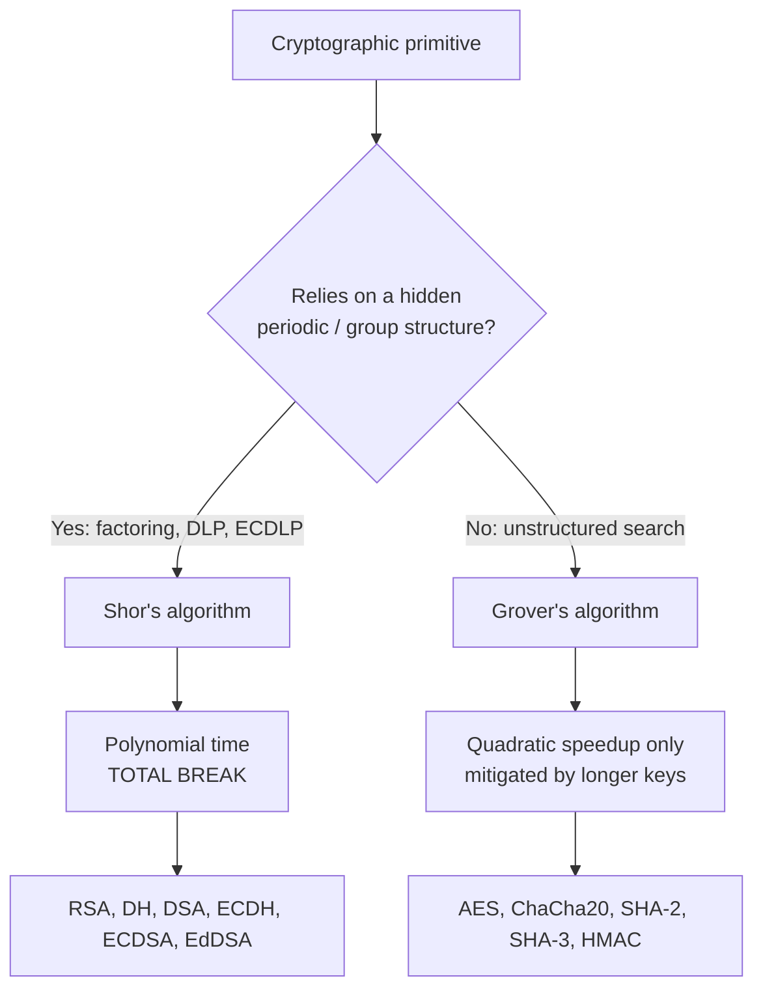
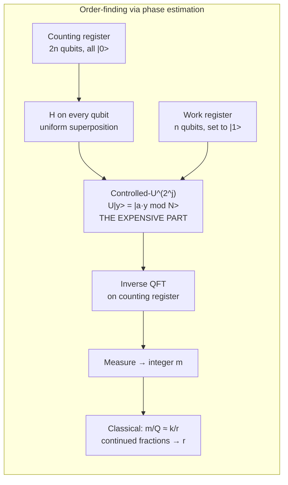
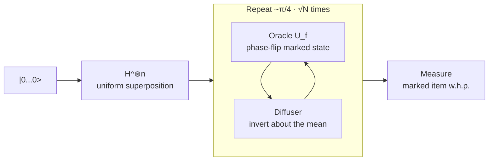
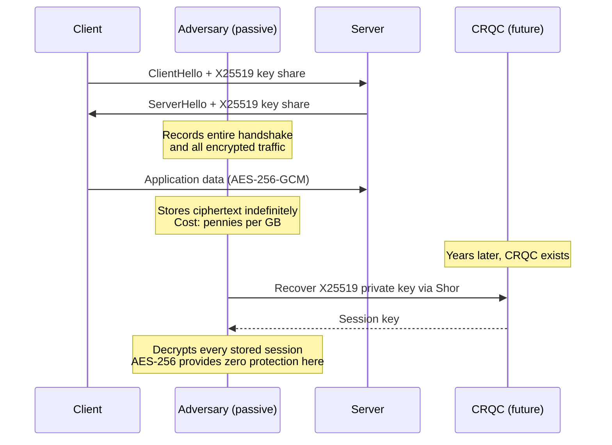

**Level:** Advanced · **Track:** Quantum Security · **Read time:** 320 min

This is Chapter 2 of the Quantum Security notebook. Chapter 1 built the machinery — qubits, superposition, entanglement, the circuit model, interference, and the hardware reality of physical versus logical qubits. This chapter spends all of that machinery on the only two algorithms that any security engineer is ever actually asked about: **Shor's algorithm**, which destroys every public-key primitive in production today, and **Grover's algorithm**, which does far less damage to symmetric cryptography than the headlines claim.

The goal is not to make you able to derive the algorithms from scratch in a viva. The goal is that when someone in a design review says "quantum breaks AES" or "we have twenty years" or "we should double our AES key size and switch to SHA-512," you can say precisely what is right, what is wrong, and what the actual number is.

## Why This Matters

Every risk decision about post-quantum migration reduces to two questions: **what breaks, and how much machine does it take to break it?** Both questions are answered by the internal structure of these two algorithms, and you cannot answer either from a summary sentence.

Consider three real statements that get made in enterprise architecture meetings:

- *"Grover halves the key length, so AES-128 gives 64 bits and is dead."* This is the standard summary, and it is wrong in the way that matters. Grover's speedup is fundamentally **sequential** — it does not parallelise the way brute force does. Under the depth limits that any realistic error-corrected machine imposes, an AES-128 search does not cost 2^64 anything. NIST's own PQC call places AES-128 at security category 1 and treats it as a meaningful bar for post-quantum schemes to clear, which is not a thing you do with a broken primitive.
- *"RSA-2048 will fall the moment someone hits 2048 qubits."* Wrong by roughly four orders of magnitude. The published estimates for RSA-2048 with surface-code error correction land in the millions of *physical* qubits, because each of the ~4100 logical qubits needs thousands of physical qubits behind it and the algorithm needs on the order of 10^10 Toffoli gates executed coherently.
- *"Nothing is urgent because no such machine exists."* Wrong on threat model rather than on physics. **Harvest now, decrypt later** means the confidentiality clock started when the ciphertext was recorded, not when the machine is built. If you ship a device with a fifteen-year field life and a hardcoded ECDSA root of trust, you are making a 2040s security decision today.

**Security relevance:** the difference between these three wrong statements and the correct picture is not rhetorical polish — it changes the migration plan. The correct picture says: **replace key exchange and signatures urgently, leave AES-256 alone, leave SHA-256 alone for most uses, and treat long-lived roots of trust as the highest-priority item on the list.** The rest of this chapter earns that conclusion mechanism by mechanism.



That single decision node is the whole chapter in one diagram: **structure is what quantum computers exploit.** Where your security rests on an algebraic structure with a hidden period, Shor eats it. Where your security rests on there being no structure at all — a well-designed block cipher is precisely an attempt to have no exploitable structure — the best a quantum computer can do is search slightly faster.

## Part 1: The Classical Hardness Assumptions Under Attack

Before you can say what breaks, you need to be exact about what the assumption *was*. Three problems carry essentially all of deployed public-key cryptography.

**Integer factorisation (IFP).** Given `N = p · q` with p and q large primes, recover p and q. RSA encryption and RSA signatures rest on this. The best known classical algorithm is the **General Number Field Sieve (GNFS)**, with sub-exponential heuristic running time:

```
L_N[1/3, (64/9)^(1/3)] = exp( ((64/9)^(1/3) + o(1)) · (ln N)^(1/3) · (ln ln N)^(2/3) )
```

Sub-exponential, not polynomial — which is why 2048-bit keys are chosen and 512-bit keys are trivially breakable today. The public record for a general RSA modulus factorisation is RSA-250 (829 bits), done in 2020 with roughly 2700 core-years.

**Finite-field discrete logarithm (DLP).** Given a generator `g` of a group mod prime `p`, and `y = g^x mod p`, recover `x`. This underpins classic Diffie-Hellman, DSA, and ElGamal. GNFS-style index calculus applies here too, with similar sub-exponential cost — which is why finite-field DH also needs 2048-3072 bit parameters.

**Elliptic-curve discrete logarithm (ECDLP).** Given points `P` and `Q = [k]P` on an elliptic curve group, recover the scalar `k`. This underpins ECDH, ECDSA, Ed25519, X25519, and essentially all modern TLS key agreement. Crucially, **index calculus does not work on general elliptic curves**, so the best classical attack is generic: Pollard's rho at `O(√n)` group operations for a group of order `n`. That is why a 256-bit curve gives ~128-bit security while RSA needs 3072 bits for the same, and it is exactly why ECC became the default.

Here is the uncomfortable inversion at the heart of this chapter:

| Problem | Best classical | Classical intuition | Quantum (Shor) | Quantum cost driver |
|---|---|---|---|---|
| Factoring (RSA) | GNFS, sub-exponential | 2048-bit is "safe for decades" | Polynomial, ~O((log N)^3) | Modular exponentiation on 2n+ qubits |
| Finite-field DLP (DH/DSA) | Index calculus, sub-exponential | Same sizing as RSA | Polynomial | Two modular exponentiations |
| ECDLP (ECDH/ECDSA) | Pollard's rho, `O(2^(n/2))` | 256-bit is *stronger* than RSA-3072 | Polynomial | Elliptic-curve point addition circuit |

**The inversion:** classically, ECC is the strongest per bit — a 256-bit curve buys what a 3072-bit RSA key buys. Quantum-mechanically, ECC is the *cheapest* target, because the quantum circuit cost scales with the bit-length of the group, and a 256-bit group is far smaller than a 3072-bit one. Published estimates put P-256 at roughly 2330 logical qubits versus roughly 4100 for RSA-2048. **The primitive you moved to for efficiency is the one that falls first.**

**Red team / offensive framing:** this matters for target selection in a hypothetical future capability. An adversary with a cryptographically relevant quantum computer (CRQC) does not start with RSA-2048 TLS sessions. They start with the smallest, highest-value asymmetric keys: 256-bit ECDSA code-signing keys, ECDSA certificate authority keys, and long-lived firmware roots of trust — because those are simultaneously the cheapest to attack and the most catastrophic to lose.

## Part 2: The Reduction — Factoring Is Really Order-Finding

Shor's algorithm is often described as "a quantum algorithm for factoring." That is misleading in a way that hides the actual mechanism. Shor's algorithm is a quantum algorithm for **order-finding**, plus a purely classical reduction from factoring to order-finding that was known before quantum computing existed.

### 2.1 The classical reduction

Pick a random `a` with `1 < a < N` and `gcd(a, N) = 1`. (If `gcd(a, N) ≠ 1` you already found a factor by accident and you are done — this happens with negligible probability for a large semiprime.)

Define the **order** `r` of `a` modulo `N` as the smallest positive integer such that:

```
a^r ≡ 1 (mod N)
```

Suppose you know `r`, and suppose `r` is **even**. Then:

```
a^r - 1 ≡ 0 (mod N)
(a^(r/2) - 1)(a^(r/2) + 1) ≡ 0 (mod N)
```

So `N` divides the product `(a^(r/2) - 1)(a^(r/2) + 1)`. If additionally `a^(r/2) ≢ -1 (mod N)` — meaning `N` does not divide the right-hand factor alone, and by minimality of `r` it cannot divide the left-hand factor alone — then `N`'s prime factors must be split between the two terms. Therefore:

```
gcd(a^(r/2) - 1, N)   and   gcd(a^(r/2) + 1, N)
```

are **non-trivial factors of N**, computable in microseconds with Euclid's algorithm.

### 2.2 Why this succeeds often enough

Two conditions can fail: `r` odd, or `a^(r/2) ≡ -1 (mod N)`. For `N` a product of two distinct odd primes, a random valid `a` satisfies both conditions with probability **at least 1/2**. More generally, for `N` with `k` distinct odd prime factors, the failure probability is at most `1/2^(k-1)`. So you retry with a fresh random `a`; the expected number of quantum runs is small — a handful, not a scaling factor.

**This is important for reading vendor claims:** Shor is a *probabilistic hybrid* algorithm. A single run can fail and that is normal. Anyone presenting a "we ran Shor and it failed once so it does not work" argument is misunderstanding the algorithm; anyone presenting "we ran it and got 15 = 3 × 5" is not demonstrating scalability (more on that in Part 13).

### 2.3 A worked classical example

Take `N = 15`, `a = 7`.

```
7^1 mod 15 = 7
7^2 mod 15 = 49 mod 15 = 4
7^3 mod 15 = 28 mod 15 = 13
7^4 mod 15 = 91 mod 15 = 1   <-- order r = 4
```

`r = 4` is even. `a^(r/2) = 7^2 = 49 ≡ 4 (mod 15)`, and `4 ≢ -1 ≡ 14 (mod 15)`, so both conditions hold. Then:

```
gcd(49 - 1, 15) = gcd(48, 15) = 3
gcd(49 + 1, 15) = gcd(50, 15) = 5
```

`15 = 3 × 5`. **Notice that every step of that was classical arithmetic.** The only thing a quantum computer contributed is the value `r = 4`. Finding the order of `a` modulo a 2048-bit `N` is the part that is classically infeasible, because the order can be astronomically large and there is no known classical shortcut.

```mermaid
flowchart TD
    S[Start: composite N] --> A[Pick random a, 1 &lt; a &lt; N]
    A --> G{gcd&#40;a,N&#41; &gt; 1?}
    G -->|Yes| LUCK[Lucky: factor found classically]
    G -->|No| Q[QUANTUM STEP:<br/>find order r of a mod N]
    Q --> CF[Classical: continued fractions<br/>recover r from measured phase]
    CF --> CHK{r even AND<br/>a^&#40;r/2&#41; != -1 mod N?}
    CHK -->|No| A
    CHK -->|Yes| F[Compute gcd&#40;a^&#40;r/2&#41; ± 1, N&#41;]
    F --> DONE[Non-trivial factors of N]
```



**Memory hook:** *Shor does not factor. Shor finds a period. Euclid factors.*

## Part 3: Period Finding, the QFT, and Phase Estimation

Now the quantum part. The function we care about is:

```
f(x) = a^x mod N
```

This function is **periodic with period r**: `f(x + r) = a^(x+r) mod N = a^x · a^r mod N = a^x mod N = f(x)`. Finding the period of a function is exactly what the Fourier transform is for.

### 3.1 The naive misconception, and the correction

The wrong mental model: "the quantum computer evaluates `f(x)` for all `x` at once and then reads off the period." You cannot read off all the values — measurement collapses the superposition to a single random outcome, and a single random `(x, f(x))` pair tells you nothing.

The correct model, in three moves:

1. **Create a uniform superposition** over `x` in the counting register, and compute `f(x)` into a second register *coherently*, producing an entangled state `Σ_x |x⟩|a^x mod N⟩`.
2. **Measure (or simply discard) the second register.** The first register collapses to a superposition over *only those x that share the same function value* — i.e. an arithmetic sequence `|x₀⟩ + |x₀+r⟩ + |x₀+2r⟩ + …`. The period `r` is now encoded in the *spacing* of that comb, but the offset `x₀` is random and unknown, so measuring directly is still useless.
3. **Apply the quantum Fourier transform.** The QFT is offset-insensitive in magnitude: a comb of spacing `r` transforms into a comb of spikes at multiples of `Q/r` (where `Q = 2^t` is the register size). Measuring now gives you a value close to `k·Q/r` for a random `k`. The random offset `x₀` has moved entirely into the phase, where it does not affect measurement probabilities.

That step-2-to-step-3 move is the whole trick, and it is why "quantum parallelism" is a bad description. The parallelism is real but useless on its own; the **interference** engineered by the QFT is what converts a useless superposition into a measurable answer.

### 3.2 The quantum Fourier transform

The QFT on `t` qubits maps a basis state `|x⟩` to:

```
QFT|x⟩ = (1/√Q) · Σ_{y=0}^{Q-1} e^(2πi·x·y/Q) |y⟩        where Q = 2^t
```

It is the discrete Fourier transform, implemented as a circuit. The classical FFT costs `O(Q log Q)` operations for `Q` amplitudes; the QFT costs `O(t^2) = O((log Q)^2)` gates — exponentially fewer, because it acts on amplitudes it never has to enumerate. (You still cannot *read out* all the Fourier coefficients — you get one sample. Shor's genius is arranging things so that one sample suffices.)

The circuit is beautifully regular: Hadamard on each qubit, interleaved with controlled phase rotations `CP(π/2^k)`, then a final reversal of qubit order.



### 3.3 Phase estimation, the modern framing

Modern treatments present order-finding as an instance of **quantum phase estimation (QPE)**. Define the unitary `U` acting on the work register by:

```
U|y⟩ = |a · y mod N⟩
```

The eigenvectors of `U` are certain superpositions `|u_s⟩` with eigenvalues `e^(2πi·s/r)` for `s = 0, 1, …, r-1`. The key identity is that the easily-prepared state `|1⟩` is an equal superposition of all `r` eigenvectors:

```
|1⟩ = (1/√r) · Σ_{s=0}^{r-1} |u_s⟩
```

So you initialise the work register to `|1⟩` — trivially cheap — and phase estimation returns an estimate of `s/r` for a random `s`. That is exactly the comb-of-spikes result from the Fourier picture, arrived at more cleanly.

**Why you should care about the QPE framing:** because it makes the cost structure obvious. Phase estimation needs the controlled operations `U^(2^j)` for `j = 0 … 2n-1`. `U^(2^j)` is modular multiplication by `a^(2^j) mod N` — and `a^(2^j) mod N` can be precomputed *classically* by repeated squaring. So the quantum circuit is a chain of ~2n controlled modular multiplications on n-qubit registers. **That chain, not the QFT, is where all the cost lives.**

### 3.4 Continued fractions: getting r out of the measurement

The measurement gives an integer `m`, and you know `m/Q ≈ k/r` for some unknown integer `k`. You need `r`, but `k` is unknown and `m/Q` is only approximate. The classical tool is the **continued fraction expansion**: expand `m/Q` as a continued fraction and take convergents; the theory of continued fractions guarantees that if `|m/Q − k/r| ≤ 1/(2Q)` and `r < √N`, then `k/r` appears among the convergents in lowest terms. You read off the denominator as your candidate `r`, verify classically with `a^r mod N == 1`, and if verification fails, rerun.

Worked example, `Q = 256`, measured `m = 192`:

```
192/256 = 0.75 = 3/4  ->  candidate r = 4
Verify: 7^4 mod 15 = 1  ✓
```

Worked example with a non-exact measurement, `Q = 4096`, measured `m = 1366`:

```
1366/4096 = 0.333496...
Continued fraction: [0; 2, 1, 663, 1, 3]
Convergents: 0/1, 1/2, 1/3, 663/1990, ...
First convergent with denominator < sqrt(N) and matching a^r = 1: 1/3  ->  r = 3
```

**Practical note:** the counting register is sized at `2n` qubits (for an n-bit `N`) precisely so that the approximation error is small enough for the continued-fraction step to succeed with high probability. This is why you see "2n + 3" or "2n + O(1)" in the literature rather than a round number — the constant is a success-probability margin.

## Part 4: Shor's Algorithm End to End

Putting Parts 2 and 3 together, here is the complete algorithm as it would actually be run.

**Input:** odd composite `N`, not a prime power (both cheap to check classically).

1. Choose random `a ∈ [2, N-2]`. Compute `gcd(a, N)`; if `> 1`, return it (lucky).
2. Precompute classically: `a^(2^j) mod N` for `j = 0 … 2n-1` by repeated squaring.
3. Prepare counting register of `t = 2n` qubits in `|0⟩`, work register of `n` qubits in `|1⟩`.
4. Apply `H` to all counting qubits.
5. For each counting qubit `j`, apply controlled-multiplication by `a^(2^j) mod N` onto the work register.
6. Apply the inverse QFT to the counting register.
7. Measure the counting register → integer `m`.
8. Classically: continued fractions on `m/2^t` → candidate `r`. Verify `a^r ≡ 1 (mod N)`. If it fails, or `r` is odd, or `a^(r/2) ≡ -1 (mod N)`, go to step 1.
9. Return `gcd(a^(r/2) ± 1, N)`.

### 4.1 Where the cost actually is

| Component | Qubits | Gate cost | Share of total |
|---|---|---|---|
| Counting register (phase estimation) | ~2n | — | Register only |
| Work / target register | n | — | Register only |
| Modular exponentiation (controlled mults) | + ~n ancilla (or many more) | `O(n^3)` naive, `O(n^2 log n)` with fast multiplication | **>95% of the circuit** |
| Inverse QFT | 0 extra | `O(n^2)`, or `O(n log n)` approximate | Negligible |
| Continued fractions | 0 (classical) | `O(n^3)` classical bit ops | Microseconds |

The single most common misunderstanding among engineers who have read one blog post is that the QFT is the hard part because it is the "quantum magic." It is not. **The arithmetic is the hard part.** Building a reversible, coherent, fault-tolerant modular multiplier for 2048-bit numbers, and running ~4096 of them in sequence without losing coherence, is the entire engineering problem.

A related consequence: because the modular exponentiation is a *sequence* of controlled multiplications that each depend on the previous result, Shor's algorithm has enormous **circuit depth** and is fundamentally sequential. You cannot run one-thousandth of Shor on a thousand machines. This will matter again in Part 8 for a very different reason.

### 4.2 Optimisations that shape the real estimates

Serious resource estimates never implement the textbook circuit. The literature's main tricks:

- **Semiclassical / one-qubit QFT (Kitaev, Griffiths–Niu):** replace the 2n-qubit counting register with a **single** recycled qubit, measured and reset repeatedly, with classically-controlled phase corrections. This alone removes 2n logical qubits.
- **Coset representation of modular arithmetic (Zalka):** perform arithmetic that is only approximately modular, with the error absorbed into a coset offset, avoiding expensive exact reductions.
- **Windowed arithmetic (Gidney):** precompute lookup tables classically and use quantum table lookups (QROM) to consume several exponent bits per multiplication, trading Toffoli count against ancilla.
- **Toffoli/T-count as the true metric:** in a surface-code fault-tolerant machine, Clifford gates are nearly free and **T gates / Toffoli gates dominate**, because each one needs a distilled magic state. Papers therefore report Toffoli counts, not total gate counts. When you read an estimate, look for the Toffoli count — that is the number that maps to runtime and magic-state factory area.

**How to read a paper's headline number:** three numbers must appear together or the claim is meaningless — **logical qubits**, **Toffoli (or T) count**, and **assumed physical error rate + cycle time**. Change any one of those and the physical qubit count moves by an order of magnitude.

## Part 5: Shor Against Diffie-Hellman and Elliptic Curves

Factoring gets the headlines, but the discrete-log variants are the more consequential attack in practice, because ECDH and ECDSA are what your TLS handshakes, SSH keys, code signatures, and blockchain wallets actually use.

### 5.1 Finite-field discrete log

Given `y = g^x mod p`, define a two-variable function:

```
f(x₁, x₂) = g^x₁ · y^(-x₂) mod p
```

This function is periodic on a **two-dimensional lattice**: `f(x₁ + a·x, x₂ + a) = f(x₁, x₂)`. Run phase estimation with two counting registers instead of one, apply a two-dimensional QFT, and the recovered periodicity gives `x` directly. Structurally identical to factoring; roughly **twice the arithmetic**, because there are two exponentiations.

### 5.2 Elliptic-curve discrete log

Same idea, with the group operation replaced by elliptic-curve point addition. Given `Q = [k]P`, the target function is `f(x₁, x₂) = [x₁]P + [x₂]Q`. The quantum circuit must implement **reversible elliptic-curve point addition** in projective or affine coordinates over `F_p`, which internally requires reversible modular multiplication, squaring, and — the painful one — **modular inversion** (or a projective-coordinate reformulation to avoid it).

The important number: Roetteler, Naehrig, Svore and Lauter's 2017 analysis estimated that breaking a 256-bit elliptic curve needs roughly **2330 logical qubits** and on the order of `1.26 × 10^11` Toffoli gates. Compare with roughly **4100 logical qubits** for RSA-2048 in the Gidney–Ekerå construction.

| Target | Classical security | Logical qubits (approx.) | Relative quantum difficulty |
|---|---|---|---|
| RSA-1024 | ~80 bits | ~2050 | Lowest of the RSA family |
| RSA-2048 | ~112 bits | ~4100 | Baseline reference |
| RSA-3072 | ~128 bits | ~6200 | ~1.5× RSA-2048 qubits, ~3× gates |
| NIST P-256 / secp256k1 | ~128 bits | ~2330 | **Cheaper than RSA-2048** |
| NIST P-384 | ~192 bits | ~3500 | Still below RSA-2048 |
| Curve25519 (X25519/Ed25519) | ~128 bits | ~2300 | Comparable to P-256 |
| Finite-field DH-2048 | ~112 bits | ~4100+ | ~2× RSA-2048 arithmetic |

**Blue team / architecture consequence:** if your risk register ranks assets by classical key strength, it is ranked wrong for this threat. A `secp256k1` key protecting a high-value signing operation is a *softer* quantum target than an RSA-2048 TLS certificate that rotates every 90 days, despite being nominally "stronger." Rank by **(quantum cost to break) × (value × lifetime of what it protects)**.

**Bug bounty note:** there is no bounty in this. No program pays for "your TLS uses ECDHE and a quantum computer would break it" — it is not an exploitable finding and will be closed as informative. Where quantum-adjacent findings *do* pay is entirely classical: weak or reused ECDSA nonces (which leak private keys with zero quantum involvement), certificates signed with deprecated algorithms, or a device that pins a single non-rotatable root key. Report those on their classical merits.

## Part 6: Resource Estimates — What Breaking RSA-2048 Actually Costs

This is the section that determines your timeline answer, so it deserves precision.

### 6.1 Logical versus physical qubits

A **logical qubit** is an idealised, essentially error-free qubit. A **physical qubit** is what hardware vendors count in press releases. In the surface code — the leading error-correction scheme for superconducting hardware — one logical qubit is encoded across a patch of `d × d` physical data qubits plus measurement ancillas, where `d` is the code distance. The logical error rate falls exponentially in `d`, but only if the physical error rate is below the code's threshold (roughly 1% for the surface code, with real designs targeting an order of magnitude better).

Rough scaling: at a physical error rate of `10^-3` and the code distances needed for a computation with `10^10` operations, you land around `d ≈ 25-30`, giving on the order of **1000-2000 physical qubits per logical qubit** — before you account for the **magic-state distillation factories**, which in many layouts occupy a comparable or larger fraction of the chip than the data qubits themselves.

### 6.2 The published landmarks

| Estimate | Target | Logical qubits | Physical qubits | Runtime | Assumptions |
|---|---|---|---|---|---|
| Shor (1994) | Asymptotic | `O(n)` | n/a | `O(n^3)` gates | No error correction considered |
| Van Meter et al. (2000s) | RSA-2048 | ~thousands | ~10^9-10^10 | months-years | Early FT compilation |
| Fowler et al. (2012) | RSA-2048 | ~6200 | ~10^9 | ~1 day | Surface code, `10^-3` error |
| Roetteler et al. (2017) | NIST P-256 | ~2330 | not the focus | — | `1.26 × 10^11` Toffolis |
| **Gidney & Ekerå (2019)** | **RSA-2048** | **~4100** | **~20 million** | **~8 hours** | Surface code, `10^-3` error, 1 µs cycle |
| Gidney (2025) | RSA-2048 | ~1400 (algorithmic) | **&lt; 1 million** | ~1 week | Improved magic-state cultivation, yoked surface codes |

Two things to take from that table.

**First, the trend is real and it is downward.** The physical-qubit estimate for RSA-2048 has fallen from around a billion to around a million within about a decade — a factor of ~1000 — driven almost entirely by *algorithmic and error-correction* improvements, not hardware. Anyone whose timeline model assumes the requirement is a fixed target is modelling a moving target as stationary. Note that the reductions come with a trade: the newer estimates buy qubit count with **runtime** (hours becomes days-to-a-week) and with stronger assumptions about magic-state cultivation.

**Second, the gap is still enormous.** Contemporary superconducting devices are in the low hundreds of physical qubits with error rates around `10^-3`, and the largest error-corrected demonstrations involve a handful of logical qubits. Getting from "a few logical qubits" to "1400 logical qubits driving 10^10 sequential Toffolis" is not a matter of waiting for one more product cycle.

### 6.3 The honest way to state a timeline

Do not state one. State a **conditional**:

> "There is no public evidence of a machine within several orders of magnitude of what RSA-2048 requires. Credible expert surveys place a meaningful probability on a cryptographically relevant machine within 15-30 years, with wide disagreement. Because our exposure is harvest-now-decrypt-later on data with an N-year confidentiality requirement, our migration deadline is *the present date + N*, not the machine's arrival date. That is the number that drives our plan."

That framing survives contact with both an over-excited vendor and a sceptical CFO, and it is the framing that regulators have converged on — US federal guidance under NSM-10 and CNSA 2.0 sets migration milestones through the early 2030s precisely because it is indexed to data lifetime, not to hardware forecasts.

**Mnemonic for the whole section:** *Qubit counts in press releases are physical. Qubit counts in attack papers are logical. The exchange rate is roughly a thousand to one, and the papers are the ones that matter.*

## Part 7: Grover's Algorithm — Amplitude Amplification, Precisely

Grover's algorithm (1996) solves **unstructured search**: given a black-box function `f: {0,1}^n → {0,1}` where `f(w) = 1` for exactly one marked item `w`, find `w`. Classically you need `O(N)` queries where `N = 2^n` — on average `N/2`, worst case `N`. Grover needs `O(√N)`, and this is provably optimal for a black box.

### 7.1 The mechanism

Grover works by rotating the state vector in a two-dimensional plane spanned by "the marked state" and "everything else."

1. **Initialise** to a uniform superposition: `|s⟩ = H^⊗n |0⟩^⊗n`. The overlap with the marked state is `⟨w|s⟩ = 1/√N` — tiny.
2. **Oracle** `U_f`: flip the *phase* of the marked state. `U_f|x⟩ = -|x⟩` if `x = w`, else `|x⟩`. Nothing is measurable yet — a global-relative sign change does not alter any measurement probability by itself.
3. **Diffuser** (inversion about the mean): `U_s = 2|s⟩⟨s| - I`. Every amplitude is reflected about the average amplitude. Because the marked amplitude is now negative, reflecting about the mean makes it *larger* while shrinking all the others slightly.
4. **Repeat** steps 2-3. Each oracle+diffuser pair rotates the state by a fixed angle `2θ` toward `|w⟩`, where `sin θ = 1/√N`.

After `k` iterations the success probability is exactly:

```
P(success) = sin²((2k + 1)·θ),      where θ = arcsin(1/√N)
```

Maximised when `(2k+1)θ ≈ π/2`, i.e.:

```
k_opt ≈ (π/4)·√N
```



### 7.2 The over-rotation trap

Grover is a **rotation**, not a convergence. If you run too many iterations you rotate *past* the target and the success probability falls again — it is periodic. Running `2·k_opt` iterations gives you roughly the success probability you started with.

This matters practically: for `M` marked items out of `N`, the optimal count becomes `k_opt ≈ (π/4)·√(N/M)`. If `M` is unknown, a naive fixed iteration count can be badly wrong. The fixes are standard — **quantum counting** (phase estimation on the Grover operator) to estimate `M` first, or the **exponential-guess / BBHT** strategy of running with randomised iteration counts drawn from a geometrically increasing range, which recovers the `O(√(N/M))` scaling without knowing `M`.

### 7.3 Worked probability table

For `N = 16` (4 qubits), one marked item, `θ = arcsin(1/4) = 0.2527` rad:

| Iterations k | (2k+1)·θ (rad) | Success probability |
|---|---|---|
| 0 | 0.253 | 0.063 (6.3%) |
| 1 | 0.758 | 0.473 (47.3%) |
| 2 | 1.263 | 0.908 (90.8%) |
| **3** | **1.769** | **0.961 (96.1%)** |
| 4 | 2.274 | 0.580 (58.0%) — over-rotated |
| 5 | 2.780 | 0.135 (13.5%) — worse than 1 iteration |

`(π/4)·√16 = 3.14`, so `k = 3` is optimal, and the table confirms it. **The drop from 96% to 58% by doing one "extra" iteration is the single most counter-intuitive property of the algorithm** and worth remembering as the sanity check that Grover is a rotation.

## Part 8: Grover Against Symmetric Crypto — Why "Halves Your Key" Is Wrong

Apply Grover to key search: the oracle is "does this candidate key decrypt my known plaintext/ciphertext pair correctly?" and `N = 2^k` for a `k`-bit key. Grover finds the key in about `2^(k/2)` oracle calls. Hence the summary: *quantum halves your symmetric key length.* AES-128 → 64 bits of security, AES-256 → 128 bits.

That summary is right about the query count and badly wrong about the cost. Three separate corrections stack up.

### 8.1 Correction 1: the oracle is not free

Each Grover iteration must evaluate AES **as a reversible quantum circuit**, in superposition, fault-tolerantly. Published constructions for AES-128 as a quantum circuit run to the order of tens of thousands of qubits' worth of resources when accounting for reversibility, and — critically — hundreds of thousands of T/Toffoli gates *per evaluation*. Multiply that by `2^64` iterations and the total gate count is astronomically beyond `2^64`. Grover counts *oracle queries*, and each query is a very expensive object.

### 8.2 Correction 2: Grover barely parallelises

This is the decisive point and the one most often missed.

Classical brute force is **embarrassingly parallel**: 1000 machines give you a 1000× speedup, linearly, forever. Grover does not work that way. Splitting the search space across `P` machines and running Grover on each gives a speedup of only **√P**, not `P`. To get a 1000× wall-clock improvement you need a **million** independent quantum computers.

Consequently Grover's advantage lives almost entirely in **circuit depth**, and depth is exactly the resource that a real fault-tolerant machine is worst at. A `2^64`-iteration Grover run is `2^64` *sequential* AES evaluations, each itself thousands of gates deep, all of it coherent (in the fault-tolerant sense) from start to finish. At a generous surface-code cycle time of 1 µs, `2^64` sequential steps is on the order of **hundreds of thousands of years**.

### 8.3 Correction 3: MAXDEPTH

NIST formalised this in the PQC call for proposals by introducing **MAXDEPTH** — a cap on the total circuit depth any attacker can plausibly run, with suggested values of `2^40` (about 4 hours at THz gate rates), `2^64` (about 10 years), and `2^96` (millennia). Under a MAXDEPTH constraint of `D`, a Grover attack on a `k`-bit key must be parallelised, and its total cost becomes approximately `2^k / D` — i.e. the quadratic speedup degrades toward *no* speedup as the depth budget shrinks.

This is why NIST's security categories are defined the way they are:

| NIST category | Defined as "at least as hard as..." | Notes |
|---|---|---|
| 1 | Key search on AES-128 (Grover) | ML-KEM-512 targets this |
| 2 | Collision search on SHA-256 | — |
| 3 | Key search on AES-192 | ML-KEM-768 targets this |
| 4 | Collision search on SHA-384 | — |
| 5 | Key search on AES-256 | ML-KEM-1024 targets this |

**AES-128 is used as the *bar* that post-quantum schemes must clear.** You do not define your lowest acceptable security level in terms of a primitive you believe is broken.

### 8.4 The practical bottom line for symmetric primitives

| Primitive | Naive "Grover halves it" | Realistic post-quantum assessment | Action |
|---|---|---|---|
| AES-128 | 64-bit — "broken" | Still substantial; not economically attackable under any realistic MAXDEPTH | Prefer 256 for long-lived data; not an emergency |
| AES-256 | 128-bit | Comfortably secure | **No action** |
| ChaCha20 (256-bit) | 128-bit | Comfortably secure | **No action** |
| 3DES (112-bit effective) | 56-bit | Already deprecated classically | Remove — for classical reasons |
| SHA-256 (preimage) | 128-bit | Secure | **No action** |
| SHA-256 (collision) | see Part 9 | No meaningful quantum improvement in practice | **No action** |
| HMAC-SHA-256 | 128-bit | Secure | **No action** |
| SHA-1 | irrelevant | Already classically broken (SHAttered, 2017) | Remove — for classical reasons |

**The single most useful sentence you can carry out of this chapter:** *the quantum migration is a public-key migration.* Doubling AES key sizes is cheap and harmless, so do it for new long-lived data if you like — but it is not where the risk is, and treating it as the headline item is how migration programmes waste their first year.

## Part 9: The Other Quantum Attacks Worth Knowing

Shor and Grover are not the whole zoo. Four more results come up in serious discussions.

### 9.1 Quantum collision search (BHT) and why it does not matter much

Brassard-Høyer-Tapp gives collision finding for an `n`-bit hash in `2^(n/3)` time — better than the classical birthday bound of `2^(n/2)`. It sounds alarming until you read the fine print: BHT requires roughly `2^(n/3)` **quantum-accessible memory**, and it must be genuinely random-access at quantum speed. For SHA-256 that is `2^85` qubits of storage. Bernstein's well-known analysis points out that classical parallel rho with the *same* hardware budget performs at least as well. Consensus: **quantum does not meaningfully threaten hash collision resistance.** SHA-256 stays.

### 9.2 Simon's algorithm and the Q2 attack model

Simon's algorithm finds a hidden XOR period in a **single** query round, exponentially faster than classically. Applied to symmetric cryptography (Kuwakado-Morii, Kaplan et al.), it yields *polynomial-time* breaks of several constructions: **Even-Mansour**, **CBC-MAC**, **GMAC**, **PMAC**, and the **3-round Feistel** distinguisher.

The critical caveat is the attack model. These are **Q2 attacks** — they require the adversary to query the keyed primitive **in superposition**, i.e. hand the victim's black box a superposition of plaintexts and get back a superposition of ciphertexts. That means the attacker needs the honest party's secret-key oracle implemented as a coherent quantum circuit they can query. No deployed system does this or plausibly ever will. Under **Q1** (classical queries, quantum offline computation) — the realistic model — these attacks do not apply.

**How to use this in a review:** if someone cites "quantum breaks GCM," ask which query model. If they cannot answer "Q2, superposition queries to the keyed oracle," they are quoting an abstract they did not read.

### 9.3 Kuperberg's algorithm and the dihedral hidden subgroup

Kuperberg's algorithm solves the dihedral hidden subgroup problem in **sub-exponential** time, roughly `2^O(√(log N))`. This is not relevant to RSA or ECC, but it *is* relevant to some post-quantum candidates — specifically isogeny-based schemes with commutative group action structure such as **CSIDH**. It is one reason CSIDH parameter sizing remains contested, and one reason NIST's standardised KEM is lattice-based rather than isogeny-based. (Separately, **SIKE** — an isogeny KEM that reached the NIST finals — was destroyed in 2022 by Castryck and Decru using a *purely classical* attack that recovered keys in about an hour on one core. A useful humility lesson: the biggest realised risk to post-quantum schemes so far has been classical cryptanalysis, not quantum computers.)

### 9.4 What quantum does *not* do

Worth stating explicitly, because the negative space is where most misconceptions live:

- Quantum computers do **not** solve NP-complete problems in polynomial time. BQP is not known to contain NP, and there is no evidence it does.
- Quantum computers do **not** "try all answers at once" in any exploitable way — the measurement postulate forbids reading more than one outcome.
- Grover's `O(√N)` is **provably optimal** for black-box search (BBBV lower bound). There is no lurking `O(log N)` search algorithm.
- Quantum computers give **no known speedup** against lattice problems (LWE, SIS), multivariate systems, code-based problems (syndrome decoding), or hash-based signatures beyond generic Grover-type gains — which is precisely why those four families make up the post-quantum standards.

## Part 10: Hands-On Lab — Building Shor's Order-Finding and Grover from Scratch

This lab uses **Qiskit**, IBM's open-source quantum SDK, on a local simulator. If Chapter 1's lab is already set up you can skip to 10.2.

### 10.1 Tool setup from scratch: Qiskit

**What it is:** Qiskit is a Python SDK for describing quantum circuits, transpiling them to a target device's native gate set, and running them either on a local classical simulator or on real IBM Quantum hardware over the cloud. It is the de facto teaching standard.

**Why we simulate rather than use real hardware:** a 4-qubit-modulus order-finding circuit has a depth in the hundreds after transpilation. On current noisy hardware without error correction the result is indistinguishable from noise. Simulation lets us verify the *algorithm* is right, which is the pedagogical point. (That distinction — algorithm correct vs. hardware capable — is the entire content of Part 13.)

Install on Kali/Debian/Ubuntu:

```bash
# Isolate the environment - Qiskit pulls in a large scientific stack
python3 -m venv ~/quantum-lab
source ~/quantum-lab/bin/activate

# Core SDK plus the high-performance simulator backend
pip install --upgrade pip
pip install qiskit qiskit-aer matplotlib pylatexenc

# Verify
python3 -c "import qiskit; print('Qiskit', qiskit.__version__)"
```

Expected output:

```
Qiskit 1.2.4
```

Flag notes: `qiskit-aer` is the compiled C++ simulator (statevector and shot-based sampling) — without it you fall back to a much slower reference simulator. `pylatexenc` is only needed for `circuit.draw('mpl')` rendering; omit it if you only ever draw in text mode.

> **Note on older tutorials:** many blog posts call `from qiskit.algorithms import Shor`. That convenience class was deprecated and removed — it also hid every interesting detail behind one call. Building the circuit by hand, as below, is both current and more instructive.

### 10.2 Building the modular multiplication oracle for a = 7, N = 15

We need a controlled unitary implementing `U|y⟩ = |a·y mod 15⟩`. For `N = 15` and `a ∈ {2,4,7,8,11,13}` this happens to be expressible purely as **qubit permutations (SWAPs) and X gates**, because multiplication by those values modulo 15 permutes the residues in a way that maps onto bit permutations. This is a special-case shortcut — a general modular multiplier for a 2048-bit modulus is an enormous arithmetic circuit, and that gap *is* the reason RSA-2048 is not falling this year.

```python
# file: shor_order_finding.py
import numpy as np
from qiskit import QuantumCircuit, transpile
from qiskit_aer import AerSimulator
from fractions import Fraction
from math import gcd

N_MOD = 15          # the number we are factoring
A_BASE = 7          # random base coprime to 15
N_COUNT = 8         # counting qubits -> Q = 2^8 = 256

def c_amod15(a, power):
    """Controlled multiplication by a^power mod 15, as a 4-qubit permutation."""
    if a not in [2, 4, 7, 8, 11, 13]:
        raise ValueError("'a' must be one of 2, 4, 7, 8, 11, 13")
    U = QuantumCircuit(4)
    for _ in range(power):
        if a in [2, 13]:
            U.swap(2, 3); U.swap(1, 2); U.swap(0, 1)
        if a in [7, 8]:
            U.swap(0, 1); U.swap(1, 2); U.swap(2, 3)
        if a in [4, 11]:
            U.swap(1, 3); U.swap(0, 2)
        if a in [7, 11, 13]:
            for q in range(4):
                U.x(q)
    U = U.to_gate()
    U.name = f"{a}^{power} mod 15"
    return U.control()          # add one control qubit

def qft_dagger(n):
    """Inverse QFT on n qubits."""
    qc = QuantumCircuit(n)
    # reverse qubit order
    for q in range(n // 2):
        qc.swap(q, n - q - 1)
    for j in range(n):
        for m in range(j):
            qc.cp(-np.pi / float(2 ** (j - m)), m, j)
        qc.h(j)
    qc.name = "QFT-dagger"
    return qc
```

Line-by-line on the parts that matter:

- `U.to_gate()` freezes the sub-circuit into a single opaque gate so it can be controlled and repeated cleanly.
- `.control()` adds exactly one control qubit — this is what makes it a *controlled*-`U^(2^j)`, the core primitive of phase estimation.
- In `qft_dagger`, `cp(θ, m, j)` is a controlled phase rotation; the **negative** angles are what make it the inverse QFT rather than the forward one. Getting that sign wrong is the single most common bug in hand-written Shor implementations, and it fails silently — you get a plausible-looking but wrong distribution.

### 10.3 Assembling and running the phase-estimation circuit

```python
def build_order_finding_circuit(a, n_count):
    qc = QuantumCircuit(n_count + 4, n_count)

    # 1. Counting register into uniform superposition
    for q in range(n_count):
        qc.h(q)

    # 2. Work register initialised to |1> (that is |0001>, qubit n_count is LSB)
    qc.x(n_count)

    # 3. Controlled-U^(2^j) for each counting qubit
    for q in range(n_count):
        qc.append(c_amod15(a, 2 ** q),
                  [q] + [i + n_count for i in range(4)])

    # 4. Inverse QFT on the counting register
    qc.append(qft_dagger(n_count), range(n_count))

    # 5. Measure the counting register only
    qc.measure(range(n_count), range(n_count))
    return qc

qc = build_order_finding_circuit(A_BASE, N_COUNT)
print(f"Circuit depth before transpile: {qc.depth()}")

sim = AerSimulator()
tqc = transpile(qc, sim, optimization_level=1)
print(f"Circuit depth after transpile:  {tqc.depth()}")

result = sim.run(tqc, shots=2048).result()
counts = result.get_counts()

for bitstring in sorted(counts, key=lambda b: counts[b], reverse=True)[:8]:
    m = int(bitstring, 2)
    print(f"{bitstring}  m={m:3d}  phase={m/2**N_COUNT:.4f}  shots={counts[bitstring]}")
```

Realistic output:

```
Circuit depth before transpile: 43
Circuit depth after transpile:  1462
11000000  m=192  phase=0.7500  shots=530
10000000  m=128  phase=0.5000  shots=518
00000000  m=  0  phase=0.0000  shots=512
01000000  m= 64  phase=0.2500  shots=488
```

Read that carefully — it is the whole algorithm showing its work. Four sharp peaks, at phases `0.00, 0.25, 0.50, 0.75`, each with about a quarter of the shots. Those are `k/r` for `k = 0,1,2,3` with **`r = 4`**. The interference engineered by the inverse QFT has concentrated essentially all amplitude onto exactly the four values that encode the period, and suppressed the other 252 possible outcomes to zero. That suppression is the quantum speedup, visible.

Note also the depth jump from 43 to 1462 under transpilation. That gap — logical circuit versus native-gate circuit — is a small preview of why fault-tolerant compilation multiplies costs so aggressively at scale.

### 10.4 Classical post-processing: phase to period to factors

```python
def phase_to_factors(phase, a, N, max_denominator):
    """Continued fractions on the measured phase -> candidate order -> factors."""
    frac = Fraction(phase).limit_denominator(max_denominator)
    r = frac.denominator
    if r == 0 or pow(a, r, N) != 1:
        return None, r, "order verification failed"
    if r % 2 != 0:
        return None, r, "order is odd - retry with a different base a"
    x = pow(a, r // 2, N)
    if x == N - 1:
        return None, r, "a^(r/2) == -1 mod N - retry with a different base a"
    factors = (gcd(x - 1, N), gcd(x + 1, N))
    if 1 in factors or N in factors:
        return None, r, "trivial factors - retry"
    return factors, r, "success"

for bitstring, shots in sorted(counts.items(), key=lambda kv: -kv[1])[:4]:
    phase = int(bitstring, 2) / 2 ** N_COUNT
    factors, r, status = phase_to_factors(phase, A_BASE, N_MOD, N_MOD)
    print(f"phase={phase:.4f}  r={r}  -> {factors}  [{status}]")
```

Output:

```
phase=0.7500  r=4  -> (3, 5)  [success]
phase=0.5000  r=2  -> None    [a^(r/2) == -1 mod N - retry with a different base a]
phase=0.0000  r=1  -> None    [order is odd - retry with a different base a]
phase=0.2500  r=4  -> (3, 5)  [success]
```

**This output is the most instructive thing in the lab.** Two of the four measurement outcomes succeed and two fail — matching the theory in Part 2 exactly. `phase = 0` carries no information (`k = 0`). `phase = 0.5` gives `r = 2`, and `7^1 mod 15 = 7 ≠ 14`… but the continued-fraction step returned the *reduced* fraction `1/2`, whose denominator is a divisor of the true order rather than the order itself — the classic "we recovered a factor of r, not r" failure. The algorithm's answer to all of this is simply: **check, and if it fails, run again.** A ~50% per-shot success rate on a probabilistic algorithm is a complete success.

Verify the recovered factors:

```bash
python3 -c "print(3*5)"
```

```
15
```

### 10.5 Grover's algorithm on a 4-qubit search space

Now the other algorithm. We search `N = 16` states for the marked item `|1011⟩`.

```python
# file: grover_search.py
import numpy as np
from qiskit import QuantumCircuit, transpile
from qiskit_aer import AerSimulator

N_QUBITS = 4
MARKED = "1011"          # the item we are searching for

def grover_oracle(marked):
    """Phase-flip oracle: |marked> -> -|marked>, all else unchanged."""
    n = len(marked)
    qc = QuantumCircuit(n)
    rev = marked[::-1]                      # Qiskit is little-endian
    zeros = [i for i, bit in enumerate(rev) if bit == '0']
    if zeros:
        qc.x(zeros)                         # map marked state to |111..1>
    qc.h(n - 1)
    qc.mcx(list(range(n - 1)), n - 1)       # multi-controlled X == phase flip on |11..1>
    qc.h(n - 1)
    if zeros:
        qc.x(zeros)                         # undo the mapping
    qc.name = f"Oracle({marked})"
    return qc

def diffuser(n):
    """Inversion about the mean: 2|s><s| - I."""
    qc = QuantumCircuit(n)
    qc.h(range(n))
    qc.x(range(n))
    qc.h(n - 1)
    qc.mcx(list(range(n - 1)), n - 1)
    qc.h(n - 1)
    qc.x(range(n))
    qc.h(range(n))
    qc.name = "Diffuser"
    return qc

iterations = int(np.floor(np.pi / 4 * np.sqrt(2 ** N_QUBITS)))
print(f"Optimal iterations for N=2^{N_QUBITS}: {iterations}")

qc = QuantumCircuit(N_QUBITS, N_QUBITS)
qc.h(range(N_QUBITS))
for _ in range(iterations):
    qc.compose(grover_oracle(MARKED), inplace=True)
    qc.compose(diffuser(N_QUBITS), inplace=True)
qc.measure(range(N_QUBITS), range(N_QUBITS))

sim = AerSimulator()
result = sim.run(transpile(qc, sim), shots=2048).result()
counts = result.get_counts()
for state in sorted(counts, key=lambda s: -counts[s])[:5]:
    print(f"{state}: {counts[state]:5d}  ({counts[state]/2048*100:5.1f}%)")
```

Output:

```
Optimal iterations for N=2^4: 3
1011:  1971  ( 96.2%)
0101:     6  (  0.3%)
1110:     6  (  0.3%)
0000:     5  (  0.2%)
1001:     5  (  0.2%)
```

96.2% — matching the theoretical `sin²(7θ) = 0.961` from the Part 7 table to within sampling noise. Three oracle calls to find one item in sixteen; classically you would expect eight.

### 10.6 The over-rotation experiment

Change one line and watch the algorithm get worse:

```python
for extra in range(0, 9):
    qc = QuantumCircuit(N_QUBITS, N_QUBITS)
    qc.h(range(N_QUBITS))
    for _ in range(extra):
        qc.compose(grover_oracle(MARKED), inplace=True)
        qc.compose(diffuser(N_QUBITS), inplace=True)
    qc.measure(range(N_QUBITS), range(N_QUBITS))
    c = sim.run(transpile(qc, sim), shots=4096).result().get_counts()
    p = c.get(MARKED, 0) / 4096
    theory = np.sin((2 * extra + 1) * np.arcsin(1 / 4)) ** 2
    print(f"k={extra}: measured={p:6.3f}  theory={theory:6.3f}")
```

Output:

```
k=0: measured= 0.063  theory= 0.063
k=1: measured= 0.470  theory= 0.473
k=2: measured= 0.909  theory= 0.908
k=3: measured= 0.962  theory= 0.961
k=4: measured= 0.583  theory= 0.580
k=5: measured= 0.135  theory= 0.135
k=6: measured= 0.008  theory= 0.008
k=7: measured= 0.089  theory= 0.089
k=8: measured= 0.400  theory= 0.400
```

The success probability **oscillates**. At `k = 6` it is essentially zero — worse than not running the algorithm at all. Measured tracks theory to three decimals. If you internalise one experimental result from this chapter, make it this one: *Grover is a rotation with a correct stopping point, not a process that converges.*

### 10.7 Estimating a real attack cost from the lab

Finally, connect the toy to the real number:

```python
# file: cost_estimate.py
import math

def grover_wallclock(key_bits, gate_time_ns, oracle_gate_depth, parallel_machines=1):
    """Very rough sequential-depth estimate for a Grover key search."""
    iterations = (math.pi / 4) * math.sqrt(2 ** key_bits)
    iterations /= math.sqrt(parallel_machines)          # only sqrt speedup!
    total_gate_depth = iterations * oracle_gate_depth
    seconds = total_gate_depth * gate_time_ns * 1e-9
    return seconds / (60 * 60 * 24 * 365.25)

for bits in (128, 192, 256):
    for machines in (1, 10 ** 6):
        yrs = grover_wallclock(bits, gate_time_ns=1000,
                               oracle_gate_depth=2 ** 15,
                               parallel_machines=machines)
        print(f"AES-{bits}, {machines:>9,} machine(s): {yrs:.3e} years")
```

Output:

```
AES-128,         1 machine(s): 3.997e+11 years
AES-128, 1,000,000 machine(s): 3.997e+08 years
AES-192,         1 machine(s): 1.716e+21 years
AES-192, 1,000,000 machine(s): 1.716e+18 years
AES-256,         1 machine(s): 7.366e+30 years
AES-256, 1,000,000 machine(s): 7.366e+30 years
```

Two lessons in one output block. First, the absolute numbers for AES are absurd under any assumption you can defend — this is the quantitative version of Part 8. Second, look at the effect of **a million machines on AES-128**: it buys a factor of 1000 (`√10^6`), not a factor of a million. Then hold that against the fact that a *classical* million-machine cluster attacking a 60-bit key gets the full million-fold speedup. **Parallelism is where Grover's advantage goes to die.**

(These are order-of-magnitude teaching numbers with a deliberately optimistic oracle depth and no error-correction overhead; the real figures are worse for the attacker. Consult Jaques et al.'s AES quantum-circuit analyses for defensible values.)

## Part 11: From Algorithms to a Risk Register

Everything above is only useful if it changes what you do on Monday. Here is the translation.

### 11.1 The harvest-now-decrypt-later model



The essential and frequently-missed point of that diagram: **AES-256 does not save you.** The session key was derived from an ECDH exchange whose private key Shor recovers. The symmetric layer is irrelevant once the key-establishment layer falls. This is why key exchange is the highest-priority migration item — higher than signatures, and vastly higher than bulk encryption.

The decision rule, sometimes called Mosca's inequality:

```
If  (time your data must stay secret)  +  (time to migrate your systems)
     >  (time until a CRQC exists)
then you are already too late.
```

You do not know the third term. You *do* know the first two, and for most organisations the migration term alone is 5-10 years. That is the argument.

### 11.2 Prioritising by algorithm

| Asset class | Attacked by | Urgency | Reason |
|---|---|---|---|
| TLS key exchange for long-confidentiality data | Shor | **Critical** | HNDL — retroactive decryption |
| VPN / IPsec tunnels carrying sensitive data | Shor | **Critical** | Same, often decades of stored traffic |
| Firmware / secure-boot root of trust (ECDSA) | Shor | **Critical** | Non-rotatable, 10-20 year device life |
| Code-signing keys | Shor | High | Forgery enables supply-chain attack |
| CA root and intermediate keys | Shor | High | Long validity, catastrophic impact |
| Document / archive signatures needing long-term validity | Shor | High | Non-repudiation must survive |
| TLS server authentication (short-lived certs) | Shor | Medium | Cannot be forged *retroactively*; needs CRQC to exist first |
| Session tokens, JWT signatures (RS256/ES256) | Shor | Medium | Short-lived, but rotation must be possible |
| AES-128 for long-lived data at rest | Grover | Low | Move to 256 opportunistically |
| AES-256, ChaCha20 | Grover | **None** | Already sufficient |
| SHA-256 / SHA-3 / HMAC | Grover / BHT | **None** | No meaningful quantum threat |

**The structural insight:** signature forgery requires the machine to *exist* before the damage happens, so signatures can be migrated on a schedule. Confidentiality is retroactive, so key exchange cannot. Sort your backlog on that distinction and the plan writes itself.

### 11.3 A crypto inventory you can actually run

You cannot migrate what you cannot see. Concrete starting commands:

```bash
# 1. What key exchange and certificate algorithms is a given endpoint using?
openssl s_client -connect example.com:443 -tls1_3 </dev/null 2>/dev/null \
  | openssl x509 -noout -text | grep -E "Public Key Algorithm|Signature Algorithm|NIST CURVE"

# 2. Enumerate everything a host supports (sslscan is on Kali by default)
sslscan --show-certificate example.com:443

# 3. Find asymmetric keys sitting on disk across a build system
find / -type f \( -name "*.pem" -o -name "*.key" -o -name "id_rsa" -o -name "id_ecdsa" \) 2>/dev/null

# 4. Classify every SSH host key you own by algorithm and size
for k in /etc/ssh/ssh_host_*_key.pub; do ssh-keygen -lf "$k"; done

# 5. Grep a codebase for hardcoded classical primitives
grep -rEn "RSA|ECDSA|ECDH|secp256|X25519|Ed25519|DSA" --include="*.go" --include="*.py" \
     --include="*.java" --include="*.ts" .
```

Sample output from (4):

```
3072 SHA256:9wJk... root@host (RSA)
256  SHA256:Lq2f... root@host (ECDSA)
256  SHA256:8vRt... root@host (ED25519)
```

Every line of that is a Shor target. The inventory's job is to turn that from a surprise into a tracked list with owners and rotation mechanisms. Flags worth knowing: `ssh-keygen -l` prints fingerprint and bit length; `-f` selects the file; the leading number is the key size in bits, and the parenthesised name is the algorithm family.

### 11.4 What you migrate to

Briefly, since Chapters 4 and 5 cover this properly:

| Standard | Name | Base scheme | Use |
|---|---|---|---|
| FIPS 203 | ML-KEM | CRYSTALS-Kyber | Key encapsulation — the priority item |
| FIPS 204 | ML-DSA | CRYSTALS-Dilithium | General-purpose signatures |
| FIPS 205 | SLH-DSA | SPHINCS+ | Hash-based signatures, conservative fallback |
| Draft FIPS 206 | FN-DSA | Falcon | Compact signatures |
| Selected 2025 | HQC | Code-based | Backup KEM with different mathematical basis |

The deployment pattern that matters right now is **hybrid key exchange** — combining X25519 with ML-KEM-768 so the session is secure if *either* holds. Major browsers and CDNs have shipped this; it is measurable in the wild today, and it is the single most effective control against harvest-now-decrypt-later.

## Part 12: Detection & Defence Angle

There is no IDS signature for Shor's algorithm. The defensive work here is architectural and observational, and it splits into four concrete practices.

**1. Detect the *harvest* half of harvest-now-decrypt-later.** You cannot detect a future quantum computer, but bulk traffic capture is an observable event today, and it is the half of the attack that happens on your network.

- Alert on sustained, high-volume egress to unexpected destinations, especially long-lived flows carrying encrypted traffic to infrastructure you do not recognise.
- Watch for network taps, unexpected SPAN/mirror port configuration changes, and unauthorised promiscuous-mode interfaces. A Zeek script or a periodic switch-config diff catches both.
- Treat any compromise that included packet capture capability as a **future confidentiality breach**, not just a present one, and record it in the risk register with the data's confidentiality horizon.

```bash
# Zeek: flag long-lived, high-volume outbound TLS connections
zeek-cut id.orig_h id.resp_h duration orig_bytes < conn.log \
  | awk '$3 > 3600 && $4 > 1000000000 {print}'
```

**2. Detect downgrade of post-quantum protections.** Once you deploy hybrid key exchange, an attacker's cheapest move is to force a fallback to classical-only. That *is* detectable.

- Log the negotiated key-exchange group for every TLS session. In an environment where hybrid is expected, a sudden rise in classical-only negotiation is an alert, not a metric.
- KQL-style sketch for a log platform holding TLS metadata:

```kusto
TlsSessions
| where Timestamp > ago(7d)
| summarize Sessions = count() by NegotiatedGroup, bin(Timestamp, 1h)
| where NegotiatedGroup !in ("X25519MLKEM768", "SecP256r1MLKEM768")
| where Sessions > 100
```

- Sigma-style detection idea for the same signal: selection on `tls.negotiated_group` not in the approved hybrid list, condition scoped to internal service-to-service traffic where you control both ends and therefore expect 100% hybrid.

**3. Build crypto-agility as the actual control.** The durable defence is not "pick the right algorithm" — it is "be able to change algorithms in weeks rather than years."

- No hardcoded algorithm identifiers, key sizes, or curve names in application code; drive them from configuration.
- Every key must have a documented, tested rotation procedure. If a key cannot be rotated, that is the finding — regardless of algorithm.
- Certificate lifetimes short enough that a full fleet re-issue is routine. An organisation that already rotates weekly has effectively pre-solved its migration.
- Include algorithm identifiers in protocol negotiation from the start, and test the negotiation failure paths.

**4. Instrument the inventory continuously.** A crypto inventory taken once is stale in a quarter. Wire the Part 11.3 commands into CI: fail a build that introduces a new hardcoded classical primitive in a long-lived trust path, and emit an inventory report on every deploy.

**Purple team exercise worth running:** simulate the *harvest* stage. Have the red team stand up a passive capture on a segment and exfiltrate a day of encrypted traffic; have the blue team try to detect the tap, the egress, and the volume anomaly. The exercise tests real detections against the only half of this threat that is happening now — and it consistently finds gaps in egress monitoring that matter for entirely classical reasons too.

## Part 13: Myths, Pitfalls, and Bad Arguments

**"A company factored a 48-bit number with a quantum computer, so RSA is nearly done."** Almost every headline factorisation record uses one of three tricks that do not scale: (a) **circuit compilation with prior knowledge of the answer**, where the circuit is simplified using facts only derivable from knowing the factors; (b) **adiabatic/annealing or variational (VQF) approaches**, which are not Shor and have no proven speedup; or (c) numbers with special structure whose factors are near-trivially related. The honest record for a *general* number factored by an unmodified Shor circuit remains tiny — 15 and 21 are the credible ones. **Test question to ask any such claim: was the circuit constructed without knowledge of the factors, and would the same construction work on a random semiprime of that size?**

**"We have N qubits, so we can factor N-bit numbers."** Off by a factor of ~2 for the register, then off by a further factor of ~1000 for error correction, then off again for magic-state factories. Press-release qubits are physical and noisy; paper qubits are logical and clean.

**"Quantum computers try every possibility simultaneously."** They hold a superposition, but measurement returns one outcome. Every real algorithm is a scheme for making wrong answers interfere destructively before you measure. Grover's `O(√N)` optimality proves this bluntly: if "try everything at once" worked, search would be `O(1)`.

**"Just double all your key sizes."** For AES, harmless and mildly useful. For RSA, useless — Shor is polynomial, so RSA-4096 buys you a small constant factor of extra quantum work, not security. Doubling an RSA key against Shor is like adding a bigger padlock to a door that will be removed from its hinges.

**"Quantum key distribution solves this."** QKD addresses key *distribution* over specialised links with information-theoretic guarantees, but requires dedicated fibre or line-of-sight optics, does not authenticate (you still need classical or PQC signatures to prevent MITM), does not scale to internet topology, and does nothing for data at rest or code signing. Multiple national security agencies — including the UK NCSC and the US NSA — have published guidance recommending post-quantum cryptography over QKD for general government and enterprise use. It is a niche tool, not the answer.

**"Post-quantum algorithms are unproven, so let's wait."** Partly fair as caution, and SIKE's classical break is the exhibit for it. The mitigation is not waiting — it is **hybrid**: classical + post-quantum combined, secure if either survives. Hybrid is what actually shipped in browsers and CDNs, for exactly this reason.

**"Grover means SHA-256 gives only 128 bits, so switch everything to SHA-512."** For *preimage* resistance, 128 bits post-Grover is fine. For *collision* resistance, Part 9.1 shows quantum offers no practical improvement over classical birthday attacks. SHA-256 stays. Spend the effort on key exchange instead.

## Final Revision — What You Should Be Able to Say Without Notes

- **Shor's algorithm does not factor.** It finds the **order** `r` of `a` mod `N` via quantum phase estimation; a classical `gcd(a^(r/2) ± 1, N)` does the factoring. A random `a` works with probability ≥ 1/2 for a semiprime, so a few retries suffice.
- The quantum core is **period finding**: superposition → coherent modular exponentiation → discard/measure work register → **inverse QFT** → measure → **continued fractions** → `r`.
- **The QFT is cheap** (`O(n^2)`); the **modular exponentiation is >95% of the cost** and is deeply sequential. That is the engineering bottleneck, not the "quantum magic."
- Shor generalises to **finite-field DLP** and **ECDLP**. Because cost scales with group bit-length, **256-bit ECC is a cheaper quantum target than RSA-2048** (~2330 vs ~4100 logical qubits) despite being classically stronger.
- **Resource estimates:** Gidney-Ekerå 2019 put RSA-2048 at ~4100 logical / ~20 million physical qubits in ~8 hours; 2025 work pushes below 1 million physical qubits over about a week. Estimates have fallen ~1000× in a decade through algorithms and error correction, not hardware.
- **Logical vs physical:** roughly 1000:1 under the surface code at realistic error rates, plus magic-state factory overhead. Always ask which one a number refers to.
- **Grover** gives `O(√N)` unstructured search — `k_opt ≈ (π/4)√N` iterations — and it is **provably optimal**. It is a **rotation**: over-iterating makes it worse, periodically.
- **"Grover halves your key" is a query-count statement, not a cost statement.** The oracle is expensive, the algorithm parallelises only as `√P`, and under NIST's **MAXDEPTH** constraint the advantage largely evaporates. **AES-128 is NIST's category-1 bar, not a broken cipher.** AES-256 and SHA-256 need no action.
- **BHT collision search** (`2^(n/3)`) needs infeasible quantum memory and loses to classical parallel rho in practice. **Simon-based breaks** of CBC-MAC/GMAC/Even-Mansour require the unrealistic **Q2 superposition-query model**. **Kuperberg** threatens commutative isogeny schemes like CSIDH, not RSA/ECC.
- **Quantum does not break NP-complete problems**, does not break lattices/codes/multivariate/hash-based schemes beyond generic gains, and does not "try everything at once."
- **The threat model is harvest-now-decrypt-later.** Migration deadline = the present date + your data's confidentiality lifetime, minus migration time (Mosca's inequality). **AES-256 does not protect a session whose ECDH key exchange is broken.**
- **Priority order:** key exchange (retroactive break) > non-rotatable roots of trust > code signing and CA keys > short-lived certs > symmetric sizing. **Hybrid key exchange (X25519 + ML-KEM-768) is the deployable control today.**
- **The real defensive control is crypto-agility**, backed by a continuously-refreshed crypto inventory and detections for traffic harvesting and hybrid downgrade.

## Cheat Sheet / Quick Reference

### Shor at a glance

| Item | Value |
|---|---|
| Solves | Order-finding → factoring, DLP, ECDLP |
| Complexity | Polynomial, ~`O(n^3)` gates naive, `O(n^2 log n)` optimised |
| Counting register | ~`2n` qubits (or 1 recycled qubit, semiclassical QFT) |
| Work register | `n` qubits + ancilla |
| Dominant cost | Controlled modular exponentiation |
| Classical post-step | Continued fractions, then `gcd` |
| Per-run success | ≥ 50% for a semiprime, retry on failure |
| Kills | RSA, DH, DSA, ElGamal, ECDH, ECDSA, EdDSA |

### Grover at a glance

| Item | Value |
|---|---|
| Solves | Unstructured search, `M` marked of `N` |
| Complexity | `O(√(N/M))` oracle queries — provably optimal |
| Optimal iterations | `k ≈ (π/4)·√(N/M)` |
| Success probability | `sin²((2k+1)·arcsin(√(M/N)))` |
| Parallel speedup | Only `√P` for `P` machines |
| Key trap | Over-rotation — more iterations can be worse |
| Effect | Nominally halves symmetric security; far less in practice |

### Key formulas

```
Order-finding:      smallest r with a^r ≡ 1 (mod N)
Factor extraction:  gcd(a^(r/2) ± 1, N)   [needs r even, a^(r/2) ≢ -1]
QFT:                |x> -> (1/√Q) Σ_y e^(2πi·x·y/Q) |y>
Grover angle:       θ = arcsin(√(M/N))
Grover iterations:  k_opt = round( (π/4)·√(N/M) )
Grover success:     P(k) = sin²((2k+1)·θ)
Mosca:              shelf_life + migration_time > time_to_CRQC  =>  already late
```

### Impact table — memorise this one

| Primitive | Quantum attack | Effective security | Verdict |
|---|---|---|---|
| RSA-2048 / RSA-4096 | Shor | ~0 | **Replace** |
| ECDH / ECDSA / Ed25519 (any size) | Shor | ~0 | **Replace — first** |
| Finite-field DH / DSA | Shor | ~0 | **Replace** |
| AES-128 | Grover | ≥ 64 bits nominal; much more under MAXDEPTH | Acceptable; prefer 256 for new long-lived data |
| AES-256 / ChaCha20 | Grover | ≥ 128 bits | **Keep** |
| SHA-256 preimage | Grover | 128 bits | **Keep** |
| SHA-256 collision | BHT | ~no practical gain | **Keep** |
| HMAC-SHA-2 | Grover | ≥ 128 bits | **Keep** |
| ML-KEM / ML-DSA / SLH-DSA | None known | Design target | **Migrate to** |

### Qiskit lab commands

```bash
python3 -m venv ~/quantum-lab && source ~/quantum-lab/bin/activate
pip install qiskit qiskit-aer matplotlib pylatexenc
python3 shor_order_finding.py      # order-finding for a=7, N=15
python3 grover_search.py           # 4-qubit Grover, 3 iterations, ~96%
python3 cost_estimate.py           # sequential-depth sanity check for AES
```

### Inventory one-liners

```bash
openssl s_client -connect HOST:443 </dev/null 2>/dev/null | openssl x509 -noout -text | grep -E "Public Key Algorithm|NIST CURVE"
for k in /etc/ssh/ssh_host_*_key.pub; do ssh-keygen -lf "$k"; done
sslscan --show-certificate HOST:443
grep -rEn "RSA|ECDSA|ECDH|secp256|X25519|Ed25519" --include="*.go" --include="*.py" .
```

## Practice Labs & Resources

**Build and break the algorithms yourself**

1. **Extend the order-finding lab to `N = 21`.** Implement `c_amod21` for `a = 2` (order 6) — you will discover immediately that the SWAP-and-X shortcut does *not* generalise, and you must build a genuine reversible modular multiplier. This exercise teaches the cost structure of Part 4 better than any diagram.
2. **Implement quantum counting.** Combine phase estimation with the Grover operator to *estimate* the number of marked items `M` in a search space, then use it to pick `k_opt` without prior knowledge. Verify against a space with 1, 2, and 4 marked items.
3. **Break a toy RSA end to end.** Generate an RSA keypair with `N = 15` (or `N = 21` after exercise 1), recover the private exponent from the factors via `d = e^-1 mod φ(N)`, and decrypt a ciphertext. Seeing the full chain — quantum period → classical factors → private key → plaintext — makes the threat concrete.
4. **Reproduce a resource estimate.** Take the Gidney-Ekerå parameters and write a script that computes physical qubits from logical qubits, code distance, and physical error rate. Then vary the physical error rate from `10^-3` to `10^-4` and observe how sharply the requirement drops. This builds the intuition for why estimates keep falling.
5. **Grover on a real reduced cipher.** Implement a 4-round, 16-bit toy block cipher as a reversible circuit and run a Grover key search against it. Count the gates in the oracle, multiply by the iteration count, and compare with brute force at the same gate count — the point of Part 8.1 lands hard when you have the numbers from your own circuit.

**Platforms and courses**

- **IBM Quantum Learning** — the Qiskit textbook's Shor, Grover, and phase-estimation chapters, with runnable notebooks and free access to real hardware for small circuits.
- **Qiskit Global Summer School** archives — recorded lectures with lab notebooks covering exactly these two algorithms.
- **Microsoft Azure Quantum / Q# katas** — the `SolveSATWithGrover` and `PhaseEstimation` katas are unit-tested exercises that will not pass until your implementation is genuinely correct, which is excellent feedback.
- **CryptoHack** — the RSA and Diffie-Hellman sections build the classical intuition (order, subgroup structure, small-subgroup attacks) that makes Shor's reduction feel natural rather than magical.
- **PQClean** and **liboqs / Open Quantum Safe** — build ML-KEM and ML-DSA from source, run the KATs, and benchmark them against X25519 and Ed25519 so you have real numbers for the migration conversation.
- **NIST PQC project pages** — FIPS 203/204/205 as published. Read at least the introduction of FIPS 203; it is more readable than its reputation.

**Papers worth reading in full**

- Shor (1997), *Polynomial-Time Algorithms for Prime Factorization and Discrete Logarithms on a Quantum Computer* — the original, and more readable than expected.
- Grover (1996), *A Fast Quantum Mechanical Algorithm for Database Search* — four pages.
- Gidney & Ekerå (2019), *How to factor 2048 bit RSA integers in 8 hours using 20 million noisy qubits* — the reference resource estimate; read the assumptions section closely.
- Roetteler, Naehrig, Svore & Lauter (2017), *Quantum resource estimates for computing elliptic curve discrete logarithms*.
- Jaques, Naehrig, Roetteler & Virdia (2020), *Implementing Grover oracles for quantum key search on AES and LowMC* — the definitive answer to "how expensive is the AES oracle really."
- Kaplan, Leurent, Leverrier & Naya-Plasencia (2016), *Breaking symmetric cryptosystems using quantum period finding* — the Simon/Q2 results, with the model caveats stated plainly.
- Castryck & Decru (2022), *An efficient key recovery attack on SIDH* — the classical break of an isogeny finalist, and a lesson in cryptographic humility.

The next chapter takes the threat model sketched in Part 11 and develops it properly: harvest-now-decrypt-later as a quantified risk, data shelf-life analysis, and what crypto-agility actually requires of an architecture.

---

*Also on [Praneeth's portfolio](https://ping-praneeth.vercel.app/notebook/quantum-security/02-the-quantum-threat-shor-s-and-grover-s-algorithms-explained), with comments and the latest edits.*
